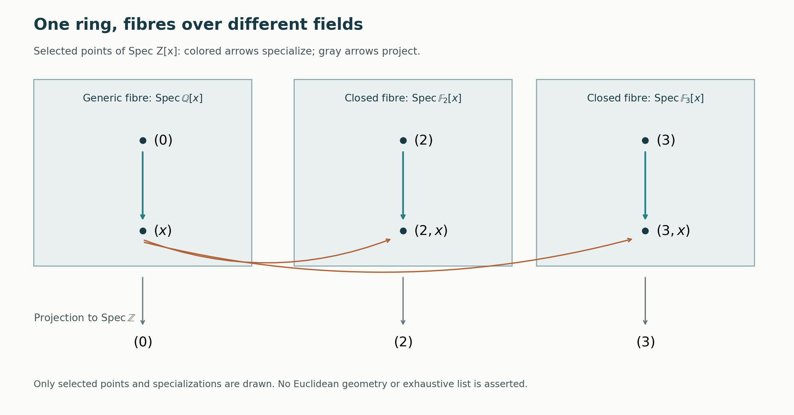

# Spectra of rings

*Written by GPT-6.1 Sol (OpenAI) in Codex, Ultra setting, October 2026. Self-checked by the writing AI. Public domain (CC0).*

An algebraic equation can be tested in many fields at once. For example, an integer can be tested modulo every prime, while a polynomial over a field can be tested at ordinary points and at the generic point of a curve. The prime spectrum puts these tests into one space. Its topology records which equations continue to hold under specialization.

We assume the elementary theory of commutative rings, ideals, quotient rings, polynomial rings and fields, together with Zorn's lemma and basic topology. Rings have an identity, and homomorphisms preserve it. Prime ideals are proper. The zero ring has empty spectrum. An irreducible space is nonempty. No finiteness condition on a ring is implicit.

Basic references are the Stacks project, Ravi Vakil's *The Rising Sea*, and Timothy Ford's *Commutative Algebra*. The arguments below give the material needed here without requiring those works. The next lesson, *Localization, local properties and support*, extends the ring operations used in this lesson to modules and arbitrary multiplicative sets.

## 1. Points as consistent tests

A map from a ring \(R\) to a field has a prime kernel: if the product of two elements maps to zero, at least one factor maps to zero. Conversely, every prime \(\mathfrak p\) occurs as such a kernel. Indeed, \(R/\mathfrak p\) is a domain, so it embeds in its fraction field. Two field-valued tests can therefore have the same vanishing equations. We retain the kernel as the point and define

\[
\operatorname{Spec}R=\{\mathfrak p\subset R:\mathfrak p\text{ is prime}\}.
\]

The following separation principle makes these points plentiful enough to detect equations.

**Lemma 1.1 (prime separation).** Let \(S\subset R\) contain \(1\) and be closed under multiplication. If an ideal \(I\) is disjoint from \(S\), there is a prime \(\mathfrak p\supset I\) disjoint from \(S\).

**Proof.** Order the ideals containing \(I\) and disjoint from \(S\) by inclusion. A union of a chain is an ideal in this set: membership of an element of \(S\) in the union would put it in one member of the chain. Zorn's lemma supplies a maximal member \(P\). It is proper because \(1\in S\). Suppose \(ab\in P\) but neither \(a\) nor \(b\) is in \(P\). Maximality gives

\[
s=u+ra\in S,\qquad t=v+qb\in S,
\quad u,v\in P.
\]

Their product belongs to \(P\), since all its terms belong to \(P\), including \(rqab\). But \(st\in S\), a contradiction. Thus \(P\) is prime. \(\square\)

Taking \(S=\{1\}\) also proves that every proper ideal lies in a maximal ideal: in this case the maximal member is maximal among all proper ideals. In particular a nonzero ring has points.

**Theorem 1.2 (equations detected by primes).** For every ideal \(I\),

\[
\sqrt I=\bigcap_{\mathfrak p\supset I}\mathfrak p.
\]

The intersection over an empty family is \(R\). In particular the nilradical \(\sqrt0\) is the intersection of all primes.

**Proof.** If \(a^n\in I\subset\mathfrak p\), primality repeatedly gives \(a\in\mathfrak p\). This proves one inclusion. If \(a\notin\sqrt I\), the set \(\{1,a,a^2,\ldots\}\) is disjoint from \(I\). Lemma 1.1 gives a prime containing \(I\) but avoiding \(a\). This proves the other inclusion. \(\square\)

The right side is an ideal, so the theorem also proves that the set of elements having a power in \(I\) is an ideal. Notice the distinction between zero and vanishing at all points: a nilpotent element can be nonzero, although every field-valued test kills it.

## 2. Equations, neighborhoods and specialization

For \(T\subset R\), let \(V(T)\) be the primes containing every element of \(T\). It equals \(V((T))\), where \((T)\) is the generated ideal. For \(f\in R\), put

\[
D(f)=\operatorname{Spec}R\setminus V(f).
\]

We regard \(V(T)\) as an equation locus and \(D(f)\) as the region where the test of \(f\) is nonzero.

**Proposition 2.1 (the Zariski topology).** The equation loci are the closed sets of a topology, and the sets \(D(f)\) form a basis for its open sets. For ideals \(I,J,I_\alpha\),

\[
V(0)=\operatorname{Spec}R,\quad V(R)=\varnothing,
\quad V\left(\sum_\alpha I_\alpha\right)=\bigcap_\alpha V(I_\alpha),
\]

\[
V(IJ)=V(I\cap J)=V(I)\cup V(J),
\qquad D(f)\cap D(g)=D(fg).
\]

Moreover,

\[
D(f)\subset D(g)\iff f\in\sqrt{(g)}.
\]

**Proof.** Containing a sum means containing each summand ideal. If a prime contains \(IJ\) and does not contain \(I\), choose \(a\in I\) outside it. Then \(ab\) belongs to the prime for every \(b\in J\), forcing \(J\) into the prime. Since \(IJ\subset I\cap J\), this also proves the assertion for \(I\cap J\). These identities are precisely the closed-set axioms. The complement of \(V(I)\) is \(\bigcup_{f\in I}D(f)\); primality proves the intersection identity. Finally, \(D(f)\subset D(g)\) means \(V(g)\subset V(f)\). By Theorem 1.2 this says \(f\in\sqrt{(g)}\). \(\square\)

**Proposition 2.2 (recovering equations).** Define \(I(Z)=\bigcap_{\mathfrak p\in Z}\mathfrak p\) for a closed subset \(Z\). The operations \(I\mapsto V(I)\) and \(Z\mapsto I(Z)\) give inverse, inclusion-reversing bijections between radical ideals and closed subsets.

**Proof.** Theorem 1.2 says \(I(V(I))=\sqrt I\). Every closed set is \(V(J)\) for some ideal \(J\), and \(V(\sqrt J)=V(J)\). Hence \(V(I(Z))=Z\). Both operations reverse inclusion by their definitions. \(\square\)

In particular,

\[
\overline{\{\mathfrak p\}}=V(\mathfrak p).
\]

Indeed, a closed set containing \(\mathfrak p\) is \(V(I)\) with \(I\subset\mathfrak p\), and it contains \(V(\mathfrak p)\). Thus \(\mathfrak q\) is a specialization of \(\mathfrak p\) exactly when \(\mathfrak p\subset\mathfrak q\). A point is closed exactly when its prime is maximal. Distinct primes have distinct closures; in topological language the spectrum is \(T_0\).

**Proposition 2.3 (finite control of covers).** The space \(\operatorname{Spec}R\) is quasi-compact.

**Proof.** Refine an open cover to a cover by basis elements \(D(f_\alpha)\). The ideal \((f_\alpha)\) cannot lie in a prime, since such a prime would miss the cover. It is therefore \(R\). Expressing \(1\) as a finite sum \(\sum_{i=1}^n a_i f_{\alpha_i}\) shows that the corresponding finitely many basis elements already cover. Choosing an original open set containing each of them gives a finite subcover of the original cover. \(\square\)

Quasi-compactness does not include a Hausdorff requirement here. An infinite affine line will be quasi-compact despite its very different topology from a Euclidean line.

## 3. How algebra changes the space

Let \(\varphi:R\to A\) be a ring map. Contraction gives

\[
\operatorname{Spec}A\longrightarrow\operatorname{Spec}R,
\qquad\mathfrak q\longmapsto\varphi^{-1}(\mathfrak q).
\]

The contraction is prime and proper, and the inverse image of \(D(f)\) is \(D(\varphi(f))\). The map is continuous. Contractions compose, so \(\operatorname{Spec}\) is a contravariant functor.

**Theorem 3.1 (quotients and one-element inversion).** The maps

\[
\operatorname{Spec}(R/I)\longrightarrow V(I),\qquad
\operatorname{Spec}\bigl(R[t]/(ft-1)\bigr)\longrightarrow D(f)
\]

are homeomorphisms. Every \(D(f)\) is quasi-compact.

**Proof.** Ideals of \(R/I\) are exactly \(J/I\) for ideals \(J\supset I\), and primality is equivalent to \(R/J\) being a domain. This gives the first bijection. Its basis opens correspond to \(D(a)\cap V(I)\), so it is a homeomorphism.

Write \(B=R[t]/(ft-1)\). It has the universal property of making \(f\) invertible: a map from \(R\) in which \(f\) is a unit extends uniquely by sending \(t\) to its inverse. Each element of \(B\) is \(a t^n\) for some \(a\in R\), because a finite polynomial in \(t\) can be brought to one common power using \(ft=1\).

A prime of \(B\) contracts to a prime avoiding \(f\). Conversely, if \(\mathfrak p\) avoids \(f\), the kernel of

\[
B\longrightarrow\operatorname{Frac}(R/\mathfrak p),
\quad t\longmapsto\overline f^{-1}
\]

consists of the elements \(a t^n\) with \(a\in\mathfrak p\). It is prime, and its contraction is \(\mathfrak p\). Since \(t\) is a unit, any prime of \(B\) with this contraction must be this kernel. The bijection identifies \(D_B(a t^n)\) with \(D_R(a)\cap D_R(f)\). It is a homeomorphism. Quasi-compactness follows by applying Proposition 2.3 to \(B\). We denote \(B\) by \(R_f\). \(\square\)

**Proposition 3.2 (closure of an image).** For every ring map \(\varphi:R\to A\),

\[
\overline{\operatorname{im}(\operatorname{Spec}\varphi)}=V(\ker\varphi).
\]

**Proof.** The equations holding at every point of the image form

\[
\bigcap_{\mathfrak q\in\operatorname{Spec}A}\varphi^{-1}(\mathfrak q)
=\varphi^{-1}(\sqrt{0_A})=\sqrt{\ker\varphi}.
\]

The same equation-closure argument as Proposition 2.2 works for any subset: its closure is the vanishing set of the intersection of its points. Applying it to the image proves the formula. \(\square\)

The image is dense exactly when every element of \(\ker\varphi\) is nilpotent. Thus an injective ring map induces a dense image of spectra, even when it does not induce a surjective map. Inverting \(x\) in \(k[x]\) gives the dense proper open \(D(x)\).

## 4. Whole components and their generic points

A nonempty space is irreducible if it is not the union of two proper closed subsets. Equivalently, any two nonempty open subsets intersect. A generic point of a closed set is a point whose closure is that set.

**Theorem 4.1 (generic points).** The irreducible closed subsets of \(\operatorname{Spec}R\) are precisely \(V(\mathfrak p)\) for prime ideals \(\mathfrak p\), and each has the unique generic point \(\mathfrak p\).

**Proof.** The closure of a singleton is irreducible: a closed decomposition of that closure must have one member containing the singleton, hence its entire closure. This proves that \(V(\mathfrak p)\) is irreducible. Conversely write an irreducible closed set as \(V(I)\) with \(I\) radical and proper. If \(ab\in I\), then

\[
V(I)=V(I+(a))\cup V(I+(b)).
\]

Irreducibility makes one member all of \(V(I)\). Proposition 2.2 then gives \(a\in I\) or \(b\in I\). Thus \(I\) is prime. Uniqueness follows because equal closures give equal radical ideals. \(\square\)

This property is called sobriety. It is stronger than the mere existence of some generic point: in an indiscrete two-point space both points have the same closure.

**Lemma 4.2 (minimal primes).** Every prime \(P\) contains a minimal prime. More generally, if \(I\subset P\), there is a prime minimal over \(I\) and contained in \(P\).

**Proof.** Apply Zorn's lemma with reverse inclusion to primes between \(I\) and \(P\). A nonempty descending chain has intersection \(Q\), which is proper and contains \(I\). To see it is prime, suppose \(ab\in Q\) and \(a\notin Q\). Choose one chain member \(Q_0\) avoiding \(a\). Every smaller member avoids \(a\), so contains \(b\); every larger member contains \(b\) because \(Q_0\) does. Thus \(b\in Q\). The empty chain has \(P\) as a bound. Zorn now supplies a minimal member. \(\square\)

An irreducible component means a maximal irreducible closed subset. By Theorem 4.1 and inclusion reversal, the components are exactly \(V(\mathfrak p)\) for minimal primes. Lemma 4.2 shows that they cover the spectrum. The spectrum is irreducible exactly when \(\sqrt0\) is prime. A domain suffices, but is not necessary.

For completeness, components also exist in an arbitrary topological space. The closure of the union of a chain of irreducible subsets is irreducible: if two open sets meet that closure, each meets the union, and a chain member containing the two chosen points meets both opens; irreducibility of that member gives an intersection. Zorn's lemma therefore extends each singleton to a maximal irreducible subset. Such a subset is closed, since its closure is irreducible. This proves the general existence assertion without assuming Noetherianity.

**Theorem 4.3 (Noetherian decomposition).** In a Noetherian topological space, every closed subset is a finite union of irreducible closed subsets. After redundant members are removed, this decomposition is unique up to order. If \(R\) has the ascending chain condition on radical ideals, its spectrum is Noetherian and it has finitely many minimal primes.

**Proof.** A space is Noetherian when descending chains of closed sets stabilize. Equivalently, every nonempty collection of closed sets has a minimal member: otherwise successively choosing a smaller member gives a nonstabilizing chain. If some closed set has no finite irreducible decomposition, choose a minimal such set \(Z\). It is nonempty and reducible, hence the union of two proper closed subsets. By minimality both have finite decompositions, a contradiction.

If \(Z=\bigcup_i Z_i=\bigcup_j W_j\) are finite irredundant decompositions, irreducibility implies each \(Z_i\) lies in some \(W_j\): intersect the second union with \(Z_i\) and apply the two-set definition repeatedly. That \(W_j\) in turn lies in some \(Z_k\). Irredundancy forces \(i=k\), so \(Z_i=W_j\). Reversing the roles proves uniqueness. Finally the radical-ideal correspondence identifies descending closed chains with ascending radical-ideal chains. The conclusion about minimal primes follows from Theorem 4.1. \(\square\)

The empty closed set has the empty decomposition. An ascending chain condition on all ideals implies the condition on radical ideals, so every Noetherian ring has Noetherian spectrum.

## 5. Separating the space into disjoint pieces

Irreducible components can meet. A clopen subset, meaning open and closed, makes a different kind of separation: it partitions the space into disjoint regions. Its algebraic representative is an idempotent \(e\), an element satisfying \(e^2=e\).

**Lemma 5.1 (lifting idempotents).** If \(N\) is a nil ideal, every idempotent of \(R/N\) lifts uniquely to an idempotent of \(R\).

**Proof.** Choose a lift \(a\) and put \(h=a^2-a\in N\). The element \(u=2a-1\) is a unit because \(u^2=1+4h\), and \(1\) plus a nilpotent has inverse given by a finite geometric sum. Set \(a'=a-hu^{-1}\). Direct expansion gives

\[
(a')^2-a'=h^2u^{-2}.
\]

The replacement keeps the same image modulo \(N\), and squares the error. Repeat. Since the original \(h\) is nilpotent, after finitely many repetitions the error is zero. This constructs a lift without assuming that the whole ideal \(N\) is nilpotent.

For uniqueness, if idempotents \(e,f\) have the same image, then \(e(1-f)=e(e-f)\) and \(f(1-e)=f(f-e)\) lie in \(N\). Each is also idempotent. A nilpotent idempotent is zero, so \(e=ef=f\). \(\square\)

**Theorem 5.2 (clopen subsets).** The map \(e\mapsto D(e)\) is a bijection from idempotents of \(R\) to clopen subsets of \(\operatorname{Spec}R\).

**Proof.** In the domain \(R/\mathfrak p\), an idempotent is either zero or one. Therefore

\[
\operatorname{Spec}R=D(e)\amalg D(1-e),
\]

so both sets are clopen. Conversely let \(U=V(I)\) have closed complement \(V(J)\). Their disjointness gives \(I+J=R\), and their union gives \(IJ\subset\sqrt0\). Choose \(a\in I,b\in J\) with \(a+b=1\). Then \(b^2-b=-ab\) is nilpotent. Lemma 5.1 lifts the class of \(b\) modulo \(\sqrt0\) to an idempotent \(e\). At primes in \(V(I)\), its class is one; at primes in \(V(J)\), its class is zero. Thus \(D(e)=U\).

If \(D(e)=D(f)\), the two idempotents have identical values, zero or one, modulo every prime. Their difference is in \(\sqrt0\), and the uniqueness argument in Lemma 5.1 gives \(e=f\). \(\square\)

**Corollary 5.3 (products and connectedness).** There are natural homeomorphisms

\[
\operatorname{Spec}(R_1\times R_2)
\cong\operatorname{Spec}R_1\amalg\operatorname{Spec}R_2.
\]

A nonzero ring has connected spectrum exactly when its only idempotents are \(0\) and \(1\).

**Proof.** The complementary idempotents \((1,0),(0,1)\) partition the spectrum. On the first region a prime contains \(0\times R_2\) and comes uniquely from a prime of \(R_1\); Theorem 3.1 identifies the topology. The second region works the same way. The connectedness assertion follows from Theorem 5.2. \(\square\)

More generally, \(R\to eR\times(1-e)R\), \(r\mapsto(er,(1-e)r)\), is an isomorphism, with inverse addition. The factors have identities \(e\) and \(1-e\). Thus every clopen separation is an actual product decomposition of the ring. If the spectrum has finitely many irreducible components, its connected components are the unions obtained by grouping irreducible components joined by chains of nonempty intersections. Each group is connected, since its irreducible members are connected and are linked by such intersections. Different groups are disjoint closed sets; there are finitely many, so they are clopen. For arbitrary spectra connected components need not be open, as the next examples show.

## 6. A gallery of spectra

**Integers.** The primes of \(\mathbb Z\) are \((0)\) and \((p)\) for positive prime numbers \(p\). The first is the generic point; the others are closed. A nonzero ideal \((n)\) vanishes at the finitely many \((p)\) with \(p\mid n\). Thus the proper closed subsets are the finite sets of closed points, and the nonempty open sets are their complements. The spectrum is irreducible and connected. The set of all closed points is not closed.

**Polynomial lines.** In \(k[x]\), the primes are \((0)\) and \((g)\) for monic irreducible polynomials \(g\). If \(k\) is algebraically closed, the latter are \((x-a)\), \(a\in k\). For \(k=\mathbb R\), they are linear factors and quadratics \((x-a)^2+b^2\), \(b>0\), by the fundamental theorem of algebra. They can be indexed by the closed upper half-plane: a real root supplies a boundary point, and a conjugate pair supplies one point above the boundary. This is an indexing of the closed points, not their Euclidean topology. There is also the generic point \((0)\).

**An invisible infinitesimal direction.** The ring \(k[\epsilon]/(\epsilon^2)\) has just the prime \((\epsilon)\), since every prime contains the nilpotent \(\epsilon\). Its spectrum is a single point, as is \(\operatorname{Spec}k\). The rings differ: one has a nonzero square-zero element. The underlying topological space alone loses this information.

**Crossing branches.** Put \(A=k[x,y]/(xy)\). Every prime contains \(x\) or \(y\), so the spectrum is the union of \(V(x)\cong\operatorname{Spec}k[y]\) and \(V(y)\cong\operatorname{Spec}k[x]\). The ideals \((x)\) and \((y)\) are minimal primes. Their closures meet exactly at \((x,y)\), because \(A/(x,y)=k\). Each branch is irreducible, hence connected; their meeting makes the whole spectrum connected. It is reducible. This separates the meanings of connectedness and irreducibility.

**A Noetherian space from a non-Noetherian ring.** Let

\[
B=k[x_1,x_2,\ldots]/(x_i x_j:i,j\geq1).
\]

The ideal \(\mathfrak n=(x_1,x_2,\ldots)\) has square zero and quotient \(k\), so it is the unique prime. The spectrum is Noetherian. But the ideals \((x_1,\ldots,x_n)\) form a strictly ascending chain: the classes of the \(x_i\) are linearly independent over \(k\). Thus the ring is not Noetherian.

**Many disjoint tests.** In \(C=\prod_{n\geq1}\mathbb F_2\), every element is idempotent. A prime quotient is a Boolean domain and therefore \(\mathbb F_2\): a nonzero element \(a\) satisfies \(a(a-1)=0\), so equals one. All primes are maximal. If distinct primes disagree about an idempotent \(e\), the disjoint opens \(D(e),D(1-e)\) separate them. Hence the spectrum is Hausdorff and totally disconnected. It is not Noetherian: the kernels of coordinate evaluations form an infinite discrete set of points, and the spectrum has infinitely many points; a Noetherian Hausdorff space must be finite. To justify the latter claim, in a Hausdorff space every irreducible closed set is a singleton, and Theorem 4.3 leaves only finitely many of them.

The coordinate points are open singletons. There are also non-coordinate primes. Indeed, the ideal of finite-support sequences is proper and lies in a maximal ideal, which cannot be a coordinate kernel. Such a point is not isolated. If it were, its singleton would equal \(D(e)\) for an idempotent by Theorem 5.2; a nonempty \(D(e)\) contains a coordinate point wherever \(e\) has a nonzero coordinate. All connected components here are singletons, and some are not open.

**An arithmetic preview.** The ring \(\mathbb Z_{(p)}\) has exactly two primes, \((0)\) and \((p)\); the generic point specializes to the closed point. The next lesson constructs this localization and proves the prime correspondence. For \(\mathbb Z[x]\), projection to \(\operatorname{Spec}\mathbb Z\) organizes the primes into a generic fibre shaped like \(\operatorname{Spec}\mathbb Q[x]\) and closed fibres shaped like \(\operatorname{Spec}\mathbb F_p[x]\). The following table is a schematic, not an embedding in a plane or a full classification.

| Base point | Fibre in the preview | Generic point of the fibre | Typical closed point in that fibre |
|---|---|---|---|
| \((0)\) | \(\operatorname{Spec}\mathbb Q[x]\) | \((0)\) | a primitive irreducible polynomial \((f)\) |
| \((p)\) | \(\operatorname{Spec}\mathbb F_p[x]\) | \((p)\) | \((p,g)\), with \(\bar g\) irreducible |

*Figure 1.* The vertical arrows inside each fibre express the containments \((0)\subset(x)\), \((2)\subset(2,x)\), and \((3)\subset(3,x)\). The curved arrows express \((x)\subset(2,x),(3,x)\); projection arrows identify the base point and do not denote specialization. The figure shows selected points, not all primes. Its arrangement is schematic and carries no Euclidean metric. The ideal \((x)\) is prime because \(\mathbb Z[x]/(x)=\mathbb Z\), but it is not maximal.

Within each fibre the displayed generic point specializes to every other point in that fibre. Some points closed in the generic fibre are not closed in the whole spectrum. *Localization, local properties and support* proves the fibre description; *The Nullstellensatz and Jacobson rings* proves that all closed points of the whole spectrum lie over positive primes. Those distinctions are essential to reading the schematic.

## 7. Exercises

Try the problems before reading the solutions. The last two ask you to combine several of the structural results.

**Exercise 7.1 (first steps).** Determine \(D(f)\) when \(f\) is nilpotent or a unit. Prove the converses. Use this to compute \(D(6)\) in \(\operatorname{Spec}\mathbb Z\).

**Exercise 7.2 (first steps).** Describe the points, connected components and idempotents of \(\mathbb Z/84\mathbb Z\). Then formulate the answer for \(\mathbb Z/n\mathbb Z\), \(n\geq2\).

**Exercise 7.3 (structural).** Prove that an irreducible spectrum may come from a ring with zero divisors. Give such a ring with a nonzero nilpotent, and decide whether \(\operatorname{Spec}(k\times k)\) is irreducible.

**Exercise 7.4 (structural).** For a ring map, characterize density of the induced map of spectra. Apply the characterization to \(k[x]\to k[x,y]/(xy-1)\), and determine the image and whether it is closed.

**Exercise 7.5 (synthesis).** A spectral space is a quasi-compact sober space with a basis of quasi-compact opens stable under finite intersections. Prove that every prime spectrum is spectral.

**Exercise 7.6 (synthesis).** Let \(R\) be Boolean, meaning every element is idempotent. Show that every prime is maximal, and that its spectrum is Hausdorff and totally disconnected. Explain why total disconnectedness does not say that every singleton is open.

## 8. Solutions

**Solution 7.1.** Proposition 2.1 with \(g=0\) says \(D(f)=\varnothing\) exactly when \(f\in\sqrt0\), or equivalently \(f\) is nilpotent. If \(f\) is a unit, no proper ideal contains it, so \(D(f)\) is the whole spectrum. Conversely, if it is the whole spectrum, \((f)\) is in no maximal ideal. Thus \((f)=R\), giving an inverse. In \(\mathbb Z\), \(6\) lies in exactly the primes \((2),(3)\), so \(D(6)\) is their complement, including \((0)\).

**Solution 7.2.** Quotient correspondence leaves the three primes \((2),(3),(7)\). Each is closed; a finite space with all points closed is discrete because each complement is a finite union of closed singletons. Thus each point is a connected component. The Chinese remainder theorem gives

\[
\mathbb Z/84\mathbb Z\cong\mathbb Z/4\mathbb Z\times\mathbb Z/3\mathbb Z\times\mathbb Z/7\mathbb Z.
\]

Each prime-power factor has one point. Its only idempotents are zero and one: from \(p^a\mid e(e-1)\) and coprimality of consecutive integers, one factor is divisible by \(p^a\). The idempotents of the product are the eight choices of zero or one in its three coordinates. The choice of ones specifies exactly the points in \(D(e)\). For \(n=\prod_{i=1}^r p_i^{a_i}\), there are \(r\) points, each its own connected component, and \(2^r\) idempotents, parametrized in the same way. This is also an explicit description of the idempotents via their residues modulo each \(p_i^{a_i}\).

**Solution 7.3.** Theorem 4.1 and Proposition 2.2 give irreducibility exactly when the nilradical is prime. In \(k[\epsilon]/(\epsilon^3)\), the nilradical \((\epsilon)\) is prime, and the spectrum has one point. But \(\epsilon\neq0\), \(\epsilon^2\neq0\) and \(\epsilon\epsilon^2=0\). In \(k\times k\), the nilradical is zero, which is not prime since \((1,0)(0,1)=0\). Its two-point spectrum is reducible.

**Solution 7.4.** Proposition 3.2 identifies the closure with \(V(\ker\varphi)\). This is the whole spectrum exactly when \(\ker\varphi\subset\sqrt0\). The target \(k[x,y]/(xy-1)\) is \(k[x]_x\): the universal property sends \(y\) to \(x^{-1}\), and conversely sends the inverse to \(y\). The map from \(k[x]\) is injective, as it embeds in \(k(x)\). Theorem 3.1 makes its image \(D(x)\). It misses \((x)\), so is proper; density means its closure is the whole spectrum, hence it cannot be closed.

**Solution 7.5.** Proposition 2.3 gives quasi-compactness. Theorem 4.1 gives sobriety with uniqueness of generic points. Proposition 2.1 gives the basis and its finite-intersection identity. Theorem 3.1 gives quasi-compactness of each basis element. These are all the conditions in the definition, including the empty open \(D(0)\).

**Solution 7.6.** A prime quotient is a domain in which every element is idempotent. Its only elements are zero and one, since \(a(a-1)=0\). It is a field, so the prime is maximal. For distinct primes \(P,Q\), choose \(e\) in one but not the other. The complementary clopens \(D(e),D(1-e)\) are disjoint neighborhoods of the two points. This proves Hausdorffness. Any subset containing two points is disconnected by intersecting it with these complementary clopens. Hence every connected subset has at most one point. Total disconnectedness concerns connected subsets; it imposes no openness requirement on those subsets. The non-coordinate points of \(\operatorname{Spec}\prod\mathbb F_2\) in Section 6 give explicit singletons that are not open.

## What this lesson does not prove

We proved that every spectrum is spectral, the necessity direction of Hochster's characterization. The following required lesson, Spectral spaces and affine realization, Theorem 6.1, proves the converse for every spectral space, including the empty space. Together these give the full characterization. The construction and classification of the arithmetic fibres in Section 6 are previews with their proofs assigned to the next lesson and to *The Nullstellensatz and Jacobson rings*.

## References

- The Stacks project authors, *The Stacks project*, Commutative Algebra: [Tag 00E0](https://kokunoyumeto.github.io/stacks-zh-hans-cn/en/algebra.html#algebra-lemma-Zariski-topology), [Tag 00E8](https://kokunoyumeto.github.io/stacks-zh-hans-cn/en/algebra.html#algebra-lemma-quasi-compact), [Tag 00ES](https://kokunoyumeto.github.io/stacks-zh-hans-cn/en/algebra.html#algebra-lemma-irreducible), [Tag 00EE](https://kokunoyumeto.github.io/stacks-zh-hans-cn/en/algebra.html#algebra-lemma-disjoint-decomposition), [Tag 090M](https://kokunoyumeto.github.io/stacks-zh-hans-cn/en/algebra.html#algebra-lemma-spec-spectral). These links use the AI Integrated Stacks Project English reader; the course introduction explains that edition.
- Ravi Vakil, *The Rising Sea: Foundations of Algebraic Geometry*, public draft of 27 July 2024, Sections 3.1–3.7. [Author's public draft](https://math.stanford.edu/~vakil/216blog/FOAGjul2724public.pdf).
- Timothy J. Ford, *Commutative Algebra*, version of 23 September 2026, Chapter 3, Section 3 on the prime spectrum, idempotents and open and closed subsets, and Chapter 4, Section 4.1 on noetherian topological spaces. [Author's version](https://tim4datfau.github.io/Timothy-Ford-at-FAU/preprints/CA.pdf).
- Melvin Hochster, “Prime ideal structure in commutative rings,” *Transactions of the American Mathematical Society* 142 (1969), 43–60. [Publication](https://doi.org/10.1090/S0002-9947-1969-0251026-X).
