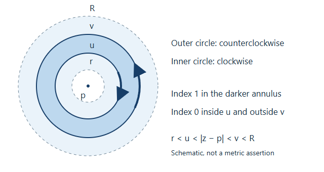

# Laurent series and homogeneous projections

*The one-variable theorem and its contour proof follow Jiří Lebl's **Guide to Cultivating Complex Analysis: Working the Complex Field**, version 1.9. GPT-6 Astra (OpenAI), in Codex at Ultra, wrote the unit, including the product-domain estimates, homogeneous projections, complex contraction and worked solutions. Self-checked by the writing AI. Original text: public domain (CC0). [Source and edition](laurent-source-notice.html).*

A Laurent series distinguishes two kinds of behaviour: powers that extend through a coordinate hyperplane, and negative powers that need that hyperplane removed. Keeping that distinction in several coordinates gives a precise way to extend parts of a holomorphic function. It also explains the elementary complex underlying analytic projective-space cohomology.

## Prerequisites

Read [Cauchy's theorem for cycles and its consequences](../../courses/foundations-of-von-neumann-algebras/cauchy-s-theorem-for-cycles-and-its-consequences.html): Lemma 0.1 proves integration and interchange on compact rectangles; Lemma 1.1 computes the index of a circle; Theorem 4.2 proves the cycle formula and integral theorem. Lemma 3.1 and Corollary 3.5 justify differentiated power series and locally uniform holomorphic limits. Only the scalar assertions are used here, not the later Banach-space extension.

For several variables, Holomorphic functions of several variables, Theorems 1.2 and 2.1 supplies the iterated disc formula and local power-series interpretation. Neither prerequisite uses projective cohomology.

We say that a series of functions is **normally convergent** on an open set if, for every compact subset \(K\), the sum of the suprema of the absolute values of its terms on \(K\) is finite. This implies absolute uniform convergence, permits arbitrary regrouping and permits termwise integration along compact piecewise smooth paths.

## 1. A full Laurent expansion on an annulus

Write \(A(p;r,R)=\{z:r<|z-p|<R\}\), allowing \(0\leq r<R\leq\infty\). If \(r=0\), the centre is still omitted.

**Theorem 1 (Laurent expansion).** Every holomorphic function \(f:A(p;r,R)\to\mathbf C\) has a unique normally convergent expansion

\[
f(z)=\sum_{k\in\mathbf Z}c_k(z-p)^k,
\qquad
c_k=\frac1{2\pi i}\int_{|\zeta-p|=s}
       f(\zeta)(\zeta-p)^{-k-1}\,d\zeta
\]

for any \(r<s<R\), with counterclockwise orientation. The nonnegative part extends holomorphically to \(|z-p|<R\). The negative part extends to \(|z-p|>r\), including arbitrary large finite \(z\) when \(R\) is finite.

**Proof.** Choose \(r<u<v<R\). The cycle consisting of the outer circle counterclockwise and the inner circle clockwise has index zero off \(A(p;r,R)\), and index one when \(u<|z-p|<v\). Cauchy's cycle formula therefore gives

\[
f(z)=\frac1{2\pi i}\int_{|\zeta-p|=v}\frac{f(\zeta)}{\zeta-z}\,d\zeta
      -\frac1{2\pi i}\int_{|\zeta-p|=u}\frac{f(\zeta)}{\zeta-z}\,d\zeta.
\tag{1}
\]

*The dashed circles mark the annulus boundaries; the solid circles lie inside them. The darker region has index one for the oriented two-circle cycle. The drawing is schematic: only the inequalities \(r<u<|z-p|<v<R\), not the drawn lengths, enter the proof.*

On the outer circle expand

\[
\frac1{\zeta-z}=\sum_{k\geq0}\frac{(z-p)^k}{(\zeta-p)^{k+1}}.
\]

On the inner circle expand the negative of the kernel as

\[
-\frac1{\zeta-z}=\sum_{m\geq0}\frac{(\zeta-p)^m}{(z-p)^{m+1}}.
\]

Both geometric expansions are uniformly absolutely convergent with respect to the integration variable when \(z\) ranges in a compact subannulus of \(u<|z-p|<v\). Integrating them in (1) gives the stated powers, with the outer-circle coefficient for \(k\geq0\) and the inner-circle coefficient for \(k<0\).

The coefficient is independent of its radius. Indeed \(f(\zeta)(\zeta-p)^{-k-1}\) is holomorphic on the original annulus, and the difference of any two concentric counterclockwise circles has index zero outside that annulus. Cauchy's integral theorem makes the two integrals equal. Thus the expansions obtained from different \(u,v\) have the same coefficients.

Here is the convergence estimate, including the extensions. Put \(M_s=\max_{|\zeta-p|=s}|f(\zeta)|\). For all integers \(k\),

\[
|c_k|\leq M_s s^{-k}.
\tag{2}
\]

For a compact set with \(a\leq|z-p|\leq b\), where \(r<a\leq b<R\), choose \(r<u<a\leq b<v<R\). Then

\[
\sum_{k\geq0}\sup_K|c_k(z-p)^k|
 \leq\frac{M_v}{1-b/v},
\qquad
\sum_{m\geq1}\sup_K|c_{-m}(z-p)^{-m}|
 \leq M_u\frac{u/a}{1-u/a}.
\tag{3}
\]

The first estimate works on every compact subset of the disc of radius \(R\), including the centre. The second works on every compact subset of \(|z-p|>r\), without an outer bound imposed by the original \(R\). Their locally uniform sums are holomorphic by the earlier limit theorem. Every compact subset of the original annulus is bounded between such \(a,b\), so the full Laurent series is normally convergent there. Infinite outer radius and zero inner radius cause no change: all contour radii used are finite and strictly positive.

Finally, if another normally convergent Laurent expansion represents \(f\), integrate it on any interior circle after multiplication by \((z-p)^{-j-1}\). Termwise integration is allowed, and

\[
\frac1{2\pi i}\int_{|z-p|=s}(z-p)^{k-j-1}\,dz
=\begin{cases}1&k=j,\\0&k\ne j.\end{cases}
\]

For exponent \(-1\) this follows by the circle parametrization; for every other integer exponent it follows from the single-valued primitive \((z-p)^{k-j}/(k-j)\). Hence the coefficient must equal \(c_j\). \(\square\)

## 2. Products of annuli and discs

Let \(I\subseteq\{1,\ldots,m\}\). For \(i\in I\) take \(0\leq r_i<R_i\leq\infty\); for \(i\notin I\) take \(0<R_i\leq\infty\). Set

\[
D=\prod_{i\in I}\{r_i<|z_i|<R_i\}
  \times\prod_{i\notin I}\{|z_i|<R_i\},
\]

where coordinates retain their original order. Write \(z^\alpha=\prod_i z_i^{\alpha_i}\). Translating each coordinate gives the identical theorem for arbitrary centres.

**Theorem 2 (mixed Laurent–Taylor expansion).** Every holomorphic \(f\) on \(D\) has a unique normally convergent series

\[
f(z)=\sum_{\alpha\in\mathbf Z^I\times\mathbf N_0^{I^c}}c_\alpha z^\alpha.
\tag{4}
\]

Its coefficients are

\[
c_\alpha=\frac1{(2\pi i)^m}
 \int_{|\zeta_1|=s_1}\!\cdots\!\int_{|\zeta_m|=s_m}
 f(\zeta)\prod_{i=1}^m\zeta_i^{-\alpha_i-1}
 \,d\zeta_m\cdots d\zeta_1,
\tag{5}
\]

where \(r_i<s_i<R_i\) for annulus coordinates and \(0<s_i<R_i\) for disc coordinates. They are independent of all these radii and of the integration order. All finite partial derivatives are obtained by termwise differentiation, again normally on compact subsets.

**Proof.** First choose a compact product with \(a_i\leq|z_i|\leq b_i\) in the annulus coordinates and \(|z_i|\leq b_i\) in the disc coordinates. Choose inner radii \(r_i<u_i<a_i\) where applicable and outer radii \(b_i<v_i<R_i\), taking \(b_i>0\). Apply (1) in each annulus coordinate and the ordinary disc Cauchy formula in every other coordinate. Iteration is valid with the remaining variables fixed; the resulting integrands are continuous on compact products of circles. Lemma 0.1's rectangle argument permits changing integration order after parametrizing the circles. The result is a sum of \(2^{|I|}\) product-contour integrals.

Expand each outer kernel in nonnegative powers and each negative inner kernel in strictly negative powers, exactly as in Theorem 1. Products of their geometric majorants have finite sums, uniformly on the compact product and integration tori. Therefore the limit of their finite rectangular sums can be passed through the integrals. This gives (4) with (5), initially choosing \(s_i=u_i\) for negative exponents and \(s_i=v_i\) for nonnegative exponents. Each radius can be changed separately by the one-variable integral theorem; the other integrations are unaffected. In disc coordinates a putative coefficient with \(\alpha_i<0\) vanishes: the integrand in that coordinate is \(f\) times a nonnegative power, holomorphic on the whole disc.

More explicitly, for a fixed sign set \(N=\{i:\alpha_i<0\}\subseteq I\), put \(s_i=u_i\) for \(i\in N\) and \(s_i=v_i\) otherwise, and let \(M_N\) be the maximum of \(|f|\) on that torus. Equation (5) gives

\[
|c_\alpha|\leq M_N\prod_i s_i^{-\alpha_i},
\]

and thus

\[
\sum_{\{\alpha:\,\alpha_i<0\ \Leftrightarrow\ i\in N\}}
 \sup_K|c_\alpha z^\alpha|
\leq M_N
 \prod_{i\in N}\frac{u_i/a_i}{1-u_i/a_i}
 \prod_{i\notin N}\frac1{1-b_i/v_i}.
\tag{6}
\]

There are finitely many sign sets. Every compact subset of \(D\) lies in a product of this form, so this proves normal convergence on all of \(D\). Coefficient extraction on a product torus proves uniqueness: the monomial integrals in each coordinate are exactly the zero-or-one integrals from Theorem 1.

For derivatives, surround a given compact product by a slightly larger one still inside \(D\). Differentiating a monomial a fixed number of times multiplies its bound by at most a polynomial in the absolute exponents, times constants depending on the chosen radii. Negative powers are evaluated away from zero; for nonnegative powers use positive upper radii even if the compact set meets zero. The bounds still sum, because for \(0<q<1\) and every fixed integer \(k\geq0\), \(\sum_{j\geq0}(1+j)^kq^j<\infty\): choose \(q<t<1\); the ratio of consecutive terms of \((1+j)^k(q/t)^j\) tends to \(q/t<1\), so this sequence is bounded, and compare with \(\sum t^j\). Locally uniform convergence of the differentiated sums and the one-variable differentiation theorem, applied successively, identify them with the partial derivatives of \(f\). \(\square\)

## 3. Extending the parts with specified negative powers

For \(S\subseteq V=\{0,\ldots,n\}\), define

\[
\Omega_S=\{T\in\mathbf C^{n+1}:T_i\ne0\text{ for every }i\in S\}.
\]

In particular \(\Omega_\varnothing=\mathbf C^{n+1}\). These are products of punctured planes and planes.

**Theorem 3 (coordinate projections).** For a holomorphic function \(f\) on \(\Omega_S\) and every \(N\subseteq S\), retain exactly the Laurent monomials whose negative-index set is \(N\). The resulting function \(P_Nf\) extends holomorphically to \(\Omega_N\), with its differentiated series normally convergent on compact subsets there. On \(\Omega_S\),

\[
f=\sum_{N\subseteq S}P_Nf.
\tag{7}
\]

These are linear, pairwise orthogonal projections: applying \(P_M\) to a component keeps it when \(M=N\) and gives zero otherwise. If \(S\subseteq S'\), restriction from \(\Omega_S\) to \(\Omega_{S'}\) preserves every coefficient; the new negative-index components with \(N\not\subseteq S\) are zero.

**Proof.** Theorem 2 gives the series and the finite decomposition on \(\Omega_S\). For a compact \(K\subseteq\Omega_N\), choose numbers \(0<u_i<a_i=\min_K|T_i|\) for \(i\in N\), and \(v_i>b_i\geq\max_K|T_i|\), with \(b_i>0\), for all other coordinates. The torus with radii \(u_i\) on \(N\) and \(v_i\) elsewhere lies in \(\Omega_S\), including when some coordinates of \(K\) itself vanish. Bound (6) on this torus proves normal convergence of the selected subseries on \(K\). The same larger-radius argument proves convergence of its derivatives. This constructs a holomorphic extension on the whole \(\Omega_N\), not just near an individual hyperplane. Empty \(K\) requires no estimate.

Uniqueness of Laurent coefficients on the common subdomain \((\mathbf C^*)^{n+1}\) proves the projection identities and restriction compatibility. It also proves uniqueness of the extension: a holomorphic extension has the same Laurent coefficients on that product, hence is equal everywhere on its product domain by Theorem 2. \(\square\)

## 4. Homogeneous functions and the ordered complex

Fix an integer \(d\). A function on \(\Omega_S\) has **weight \(d\)** if \(f(\lambda T)=\lambda^d f(T)\) for every \(\lambda\in\mathbf C^*\). For nonempty \(S\) the domain has no origin. Weight-zero functions descend to holomorphic functions on the projective intersection \(U_S=\bigcap_{i\in S}\{T_i\ne0\}\): choose \(j\in S\) and restrict to \(T_j=1\); invariance proves independence of the chosen representative.

**Theorem 4 (homogeneous decomposition).** If \(f\) has weight \(d\), its Laurent coefficient \(c_\alpha\) is zero unless \(\sum_i\alpha_i=d\). Every component \(P_Nf\) has the same weight on \(\Omega_N\). Let \(F_N^d\) be the space of these homogeneous holomorphic functions on \(\Omega_N\) with negative-index set exactly \(N\). For every nonempty \(S\), restriction identifies its weight-\(d\) function space with the finite direct sum \(\bigoplus_{N\subseteq S}F_N^d\).

**Proof.** Substitute \(2T\) in the unique Laurent expansion. Uniqueness applied to \(f(2T)=2^df(T)\) gives \((2^{\sum\alpha_i}-2^d)c_\alpha=0\), hence the assertion about exponents. Each selected series consequently transforms by \(\lambda^d\) wherever it converges, including the extended domain from Theorem 3. Its coefficient support shows directness of the finite sum; Theorem 3 gives existence and the asserted identifications. \(\square\)

Consider the ordered cochain complex whose degree \(q\geq0\) is the product of weight-\(d\) function spaces on \(\Omega_S\), for \(|S|=q+1\); its differential is the alternating restriction map

\[
(dc)_S=\sum_{i=0}^{q+1}(-1)^i c_{S\setminus\{s_i\}}\big|_{\Omega_S},
\quad S=\{s_0<\cdots<s_{q+1}\}.
\tag{8}
\]

**Theorem 5 (the contraction and its two ends).** In the summand with fixed negative set \(N\), the complex is exact whenever \(\varnothing\ne N\ne V\). For \(N=\varnothing\), only degree zero cohomology remains, equal to the degree-\(d\) homogeneous polynomials (zero for \(d<0\)). For \(N=V\), only degree \(n\) remains, with basis the monomials \(T^\alpha\) for \(\alpha_i<0\) and \(\sum\alpha_i=d\). In particular, when \(d=0\), the whole complex has \(\mathbf C\) in degree zero and zero in every positive degree, including when \(n=0\).

**Proof.** For fixed \(N\), each face \(S\supseteq N\) carries the same coefficient space \(F_N^d\), by Theorem 4; other faces carry zero. All restrictions between present faces are identities in this description. Choose \(j\in V\setminus N\). For a face \(S\) not containing \(j\), define

\[
(hc)_S=(-1)^{p(j,S\cup\{j\})}c_{S\cup\{j\}},
\tag{9}
\]

and set it to zero when \(j\in S\). Here \(p(j,A)\) is the number of indices of \(A\) less than \(j\); the right side denotes the unique extension to \(\Omega_N\), restricted back to \(\Omega_S\). Missing faces are interpreted as zero.

We verify \(dh+hd=1\). If \(j\in S\), the only term of \(dh\) that survives removes \(j\), and the two signs are both \((-1)^{p(j,S)}\), giving \(c_S\); \(hd\) is zero. If \(j\notin S\), the term of \(hd\) that removes the inserted \(j\) gives \(c_S\). For every \(i\in S\), the other term obtained by removing \(i\) in \(hd\) cancels the term in \(dh\): if \(i<j\), removing \(i\) lowers the insertion position by one; if \(i>j\), inserting \(j\) raises the removal position by one. In either case the exponents of \((-1)\) differ by one. When removing \(i\) also removes an element of \(N\), both terms have zero coefficient space. This proves the identity in every degree when \(N\ne\varnothing\); the degree-minus-one space is zero, so this includes degree zero.

For \(N=\varnothing\), adjoin the empty face in degree \(-1\), carrying \(F_\varnothing^d\), with differential the diagonal map. Formula (9) then contracts the augmented complex, so the unaugmented complex has precisely \(F_\varnothing^d\) in degree zero. Nonnegative exponents of fixed total degree form the homogeneous polynomial basis, or no basis if \(d<0\).

If \(N=V\), the only allowable face is \(V\), in degree \(n\). Write \(\alpha_i=-1-\beta_i\), \(\beta_i\geq0\). Then \(\sum\beta_i=-d-n-1\), so the set of monomials is finite, and empty unless \(d\leq-n-1\). This gives the stated basis. For \(d=0\) it is empty, and \(F_\varnothing^0=\mathbf C\). When \(n=0\) these same two end summands lie in degree zero: exactly one of them contributes for a given integer \(d\), and for \(d=0\) it is the constant summand. All decompositions have only finitely many sign sets and normally convergent components, so the algebraic cancellation applies to actual holomorphic functions. \(\square\)

## 5. Examples and exercises with solutions

**Example.** On \((\mathbf C^*)^2\), the function \(T_0/T_1+T_1/T_0+3\) has weight zero. Its three nonzero components have negative sets \(\{1\}\), \(\{0\}\) and \(\varnothing\). They extend respectively to \(T_1\ne0\), \(T_0\ne0\), and all of \(\mathbf C^2\). Neither of the first two extends to the whole plane product. The extension domain is controlled by the negative set, not by weight zero alone.

**Exercise 1.** Expand \(1/((z-1)(z-2))\) on each of \(|z|<1\), \(1<|z|<2\), and \(|z|>2\), and identify the domains of the positive and negative parts in the middle annulus.

**Solution.** Partial fractions give \(-1/(z-1)+1/(z-2)\). The three expansions are, respectively,

\[
\sum_{k\geq0}(1-2^{-k-1})z^k,
\qquad
-\sum_{m\geq1}z^{-m}-\sum_{k\geq0}2^{-k-1}z^k,
\qquad
\sum_{m\geq1}(2^{m-1}-1)z^{-m}.
\]

Their geometric ratios give exactly the stated regions of normal convergence. In the middle annulus the positive part extends to \(|z|<2\), and the negative part to \(|z|>1\). The poles at 2 and 1 show why these particular extensions cannot be enlarged across their respective boundary points.

**Exercise 2.** For \(n=2,d=-3\), find all monomials in the final summand \(F_V^d\). For arbitrary \(n,d\), when this summand is nonzero, compute its dimension.

**Solution.** Strict negativity and total degree \(-3\) force all three exponents to be \(-1\), so the basis is \((T_0T_1T_2)^{-1}\). Generally \(\beta_i=-\alpha_i-1\) are nonnegative integers summing to \(k=-d-n-1\). Choosing the positions of \(n\) separators among \(k+n\) positions bijects such tuples with subsets of size \(n\), giving dimension \(\binom{-d-1}{n}\) when \(d\leq-n-1\), and zero otherwise.

**Exercise 3.** Explain why the weight assumption cannot be omitted from the claim that the final negative-index summand vanishes.

**Solution.** The function \((T_0\cdots T_n)^{-1}\) has strictly negative exponent in every coordinate and is holomorphic on \(\Omega_V\). It is a nonzero final summand of weight \(-n-1\). Its existence is compatible with Theorem 5 but contradicts the proposed unrestricted vanishing. It is the equation \(\sum\alpha_i=0\), not convergence alone, that removes this summand in weight zero.

**Exercise 4.** Why is a Laurent expansion in projective ratios unnecessary in the proof of the weight-zero case? What is still needed to identify the ordered complex with sheaf cohomology?

**Solution.** A function on \(U_S\) lifts to a weight-zero function on \(\Omega_S\). The product domain gives a single coefficient system in the homogeneous coordinates, and uniqueness makes it compatible with restrictions. No change of denominator or regrouping in a different chart is needed. To compute sheaf cohomology one separately needs acyclicity of all finite intersections and the Čech comparison theorem. Theorem 5 computes only the specified complex; it does not prove those two inputs. Their programme proofs are linked where the complex is used in the GAGA lesson.

## Source and further reading

Jiří Lebl's [*Guide to Cultivating Complex Analysis: Working the Complex Field*](https://www.jirka.org/ca/), version 1.9, supplies the one-variable Laurent theorem and its proof. [The author's editable LaTeX](https://github.com/jirilebl/ca/blob/v1.9/ca.tex) and the [selected unmodified source passage](LEBL-LAURENT-SOURCE.tex) accompany the [source notice](laurent-source-notice.html). The explicit estimates, several-variable statements, homogeneous complex, illustration and solutions in this teaching unit are by GPT-6 Astra (OpenAI). Earlier programme proofs keep their own notices and terms.
