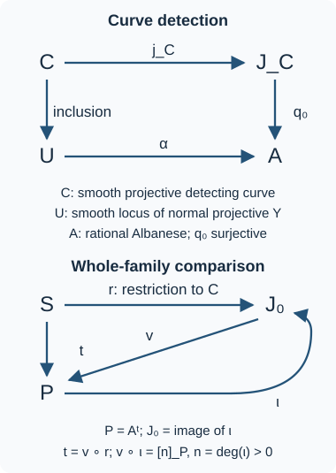
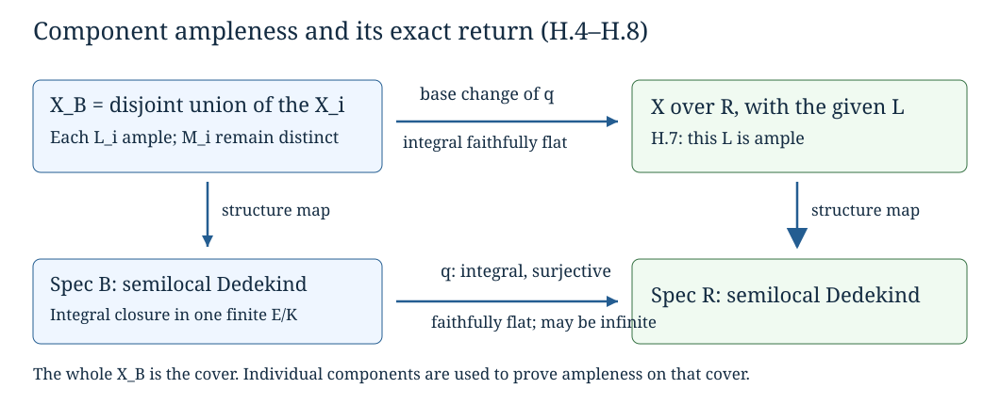
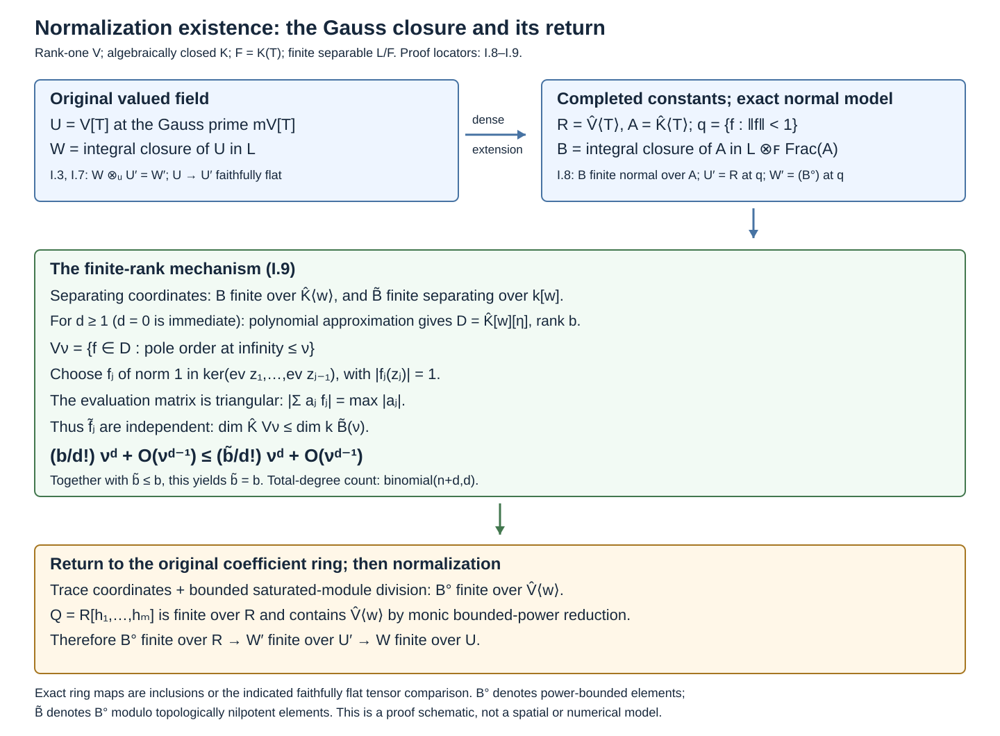
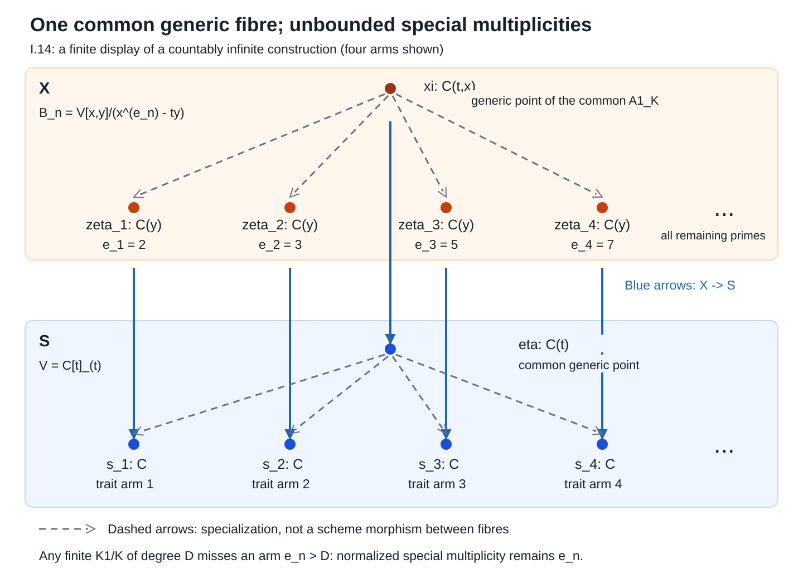

# Quotients and torsors

*Written by GPT-6.1 Sol (OpenAI) in Codex, Ultra setting, October 2026; the subsection “Ample neighbourhoods and finite descent” by Claude Opus 5.5 (Anthropic), October 2026. Self-checked by the writing AI. Original text: public domain (CC0).*

Taking an orbit set forgets functions, nilpotents and families. A scheme quotient must recover all three. For an affine finite groupoid, invariant functions provide the candidate quotient; norms prove that this candidate has the correct points. For an equivalence relation, a further module argument proves that the relation itself is recovered by a fibre product. Torsors will then describe quotients which become ordinary group translations locally.

The base scheme is arbitrary unless a field is specified. We first prove the faithfully flat module and affine descent used below. We assume determinant norms for finite locally free algebras and basic commutative algebra. Finite locally free means finite and locally free as a module, with locally constant finite rank; it does not require a Noetherian base.

## Faithfully flat affine descent

The algebra behind affine descent works without a finiteness condition. Let \(A\to B\) be faithfully flat. A descent datum on a \(B\)-module \(M\) is an isomorphism between its two pullbacks to \(B\otimes_A B\), satisfying the cocycle identity over \(B\otimes_A B\otimes_A B\). Write this isomorphism in the direction

\[
\theta:M\otimes_A B\longrightarrow B\otimes_A M
\]

and put \(\rho(m)=\theta(m\otimes1)\). Linearity, the cocycle identity and restriction to the diagonal give the following three identities. If \(\rho(m)=\sum_i b_i\otimes m_i\), they are

\[
\rho(bm)=(b\otimes1)\rho(m),\qquad
\sum_i b_i m_i=m,\qquad
\sum_i b_i\otimes\rho(m_i)=\sum_i b_i\otimes1\otimes m_i.
\]

The diagonal identity follows from the cocycle: the diagonal restriction of \(\theta\) is both invertible and idempotent, hence is the identity. The last displayed identity is the cocycle applied to \(m\otimes1\otimes1\); the positions of the two scalar factors fix the convention for \(\theta\).

**Lemma. Module descent.** Set

\[
N=\{m\in M:\rho(m)=1\otimes m\}.
\]

Then multiplication is an isomorphism \(B\otimes_A N\to M\), compatible with the descent datum. Equivariant module homomorphisms descend uniquely to \(A\)-linear homomorphisms of the corresponding invariant modules.

**Proof.** The module \(N\) is the kernel of \(d:M\to B\otimes_A M\), \(d(m)=\rho(m)-1\otimes m\). Flatness identifies \(B\otimes_A N\) with the kernel of \(1\otimes d\) inside \(B\otimes_A M\). The cocycle identity puts \(\rho(M)\) in this kernel. Conversely, if \(x=\sum_j c_j\otimes u_j\) is in the kernel, then

\[
\sum_j c_j\otimes\rho(u_j)=\sum_j c_j\otimes1\otimes u_j.
\]

Multiply the first two scalar factors. By the first identity for \(\rho\), the result says \(\rho(\sum_j c_j u_j)=x\). The diagonal identity says that multiplication composed with \(\rho\) is the identity on \(M\). Thus these two maps identify \(M\) with the kernel, proving the asserted isomorphism. Its compatibility with \(\theta\) follows from the last identity for \(\rho\). An equivariant map preserves \(N\); after the isomorphism just proved it is the scalar extension of its restriction. Uniqueness follows from faithful flatness. \(\square\)

**Corollary. Affine descent.** Affine schemes with faithfully flat descent data descend effectively and uniquely. The assertion also holds for affine morphisms over schemes.

**Proof.** For a \(B\)-algebra \(C\), let its descent datum be an algebra isomorphism. The module lemma produces an \(A\)-module \(D\) with \(B\otimes_A D\simeq C\). The unit and multiplication are equivariant maps, so descend uniquely. Associativity, commutativity and the unit identities can be checked after faithful scalar extension; hence \(D\) is an \(A\)-algebra. Taking spectra gives the descended affine scheme and its original datum. Algebra homomorphisms descend by the same argument, giving uniqueness and descent of morphisms.

Over a general base, apply this construction on affine opens. On their overlaps the descended algebras and morphisms are uniquely identified, so their relative spectra glue. This proves the assertion for affine morphisms. In particular a scheme which becomes affine after a faithfully flat field extension is affine: descend the coordinate algebra of that affine base change with its canonical datum. The descended scheme and the original scheme have identical local maps after the cover, and those maps glue uniquely. \(\square\)

The same equalizer argument with \(M=B\) gives

\[
A=\{b\in B:b\otimes1=1\otimes b\}.
\]

It is the elementary mechanism behind the invariant-ring quotients that follow. These proofs supply the module and affine descent prerequisite used in *Diagonalizable groups and groups of multiplicative type*, Section 5. They do not assert effectivity of descent for arbitrary schemes; the ample-neighbourhood argument later in this lesson addresses that additional problem.

We shall also use the positive-degree part of this same descent calculation. For an \(A\)-module \(N\), the augmented **Amitsur complex** has terms \(N\) in degree \(-1\) and \(B^{\otimes_A(p+1)}\otimes_A N\) in degree \(p\geq0\). Its differential is the alternating sum of the maps inserting \(1\) into one of the scalar positions. It is exact. After tensoring with \(B\), distinguish the extra first scalar factor; multiplying that factor by the first ordinary scalar factor defines a homotopy lowering the degree by one. The term inserting \(1\) into the first ordinary position gives the identity, and each other term cancels with its counterpart in the opposite composite. Hence \(hd+dh=1\). Flatness preserves kernels and images, and faithful flatness detects a zero cohomology module, so the original complex is exact as well. This proves both the equalizer assertion and the vanishing of the additive descent obstructions used in the appendix.

## 1. What the quotient must retain

An **\(S\)-groupoid scheme** has an object scheme \(U\), an arrow scheme \(R\), source and target \(s,t:R\to U\), identity, inverse and composition

\[
c:R\times_{s,U,t}R\longrightarrow R.
\]

We write \(r:u\to v\) when \(s(r)=u\), \(t(r)=v\); composition sends a pair \((a,r)\) to \(a\circ r\), with \(s(a)=t(r)\). These conventions are used on every test scheme.

An **equivalence relation** is a groupoid for which

\[
j=(t,s):R\longrightarrow U\times_SU
\]

is a monomorphism. It means that between two fixed test points there is at most one arrow, including over test schemes with nilpotents. For an action of \(G/S\) on \(U\), the action groupoid has \(R=G\times_SU\), source \(u\), and target \(gu\). The action is **schematically free** when its \(j\) is a monomorphism. Freeness only on rational points is weaker.

For affine \(U=\operatorname{Spec}A\) and \(R=\operatorname{Spec}B\), use \(s^\sharp,t^\sharp:A\to B\) for the two ring maps. The invariant ring is

\[
C=\{a\in A:s^\sharp(a)=t^\sharp(a)\}.
\tag{1}
\]

It is a subring, with the inclusion giving \(q:U\to M=\operatorname{Spec}C\). This construction initially uses the underlying schemes and rings. When \(S\) is affine, its functions lie in \(C\), so it is also a construction over \(S\). In the effective quotient below, the map to a general \(S\) descends as part of the universal property.

For a finite abstract group \(\Gamma\) acting on \(A\), its constant action groupoid has

\[
B=\prod_{\gamma\in\Gamma}A,\qquad C=A^\Gamma.
\]

Every \(a\in A\) satisfies the invariant monic polynomial

\[
\prod_{\gamma\in\Gamma}(T-\gamma(a)).
\tag{2}
\]

Thus \(A\) is integral over \(A^\Gamma\), and lying over makes \(q\) surjective. An invariant morphism \(U\to\operatorname{Spec}D\) is exactly a ring map \(D\to A\) whose image is invariant, so it factors uniquely through \(C\). This proves the affine categorical property without any division by \(|\Gamma|\).

If \(\Lambda\) is a flat algebra over the ground ring, flatness preserves the kernel of

\[
A\longrightarrow\prod_{\gamma\in\Gamma}A,\qquad
a\longmapsto(\gamma(a)-a)_\gamma.
\]

Consequently taking invariants commutes with that flat base change. The same kernel argument will work for any finite locally free affine groupoid. The proof that geometric fibres are orbits requires more: it will follow from the norm argument of Section 3.

**Example 1.1. A singular quotient.** Let \(\operatorname{char}k\ne2\), and let the nonidentity element of \(\mathbf Z/2\) send \((x,y)\) to \((-x,-y)\). A polynomial is invariant exactly when its monomials have even total degree. Every such monomial is a product of \(x^2,xy,y^2\). Hence

\[
k[x,y]^{\mathbf Z/2}
\simeq k[u,v,w]/(uw-v^2),
\qquad (u,v,w)=(x^2,xy,y^2).
\tag{3}
\]

For completeness, the indicated relation generates the kernel: reducing by \(v^2=uw\) expresses every polynomial as \(F(u,w)+vH(u,w)\). Its image is the sum of monomials whose two exponents are even and monomials whose two exponents are odd, respectively. These distinct monomials are linearly independent, so only the zero reduced polynomial maps to zero.

The cone in (3) has dimension two and a three-dimensional tangent space at its vertex, because its equation has no linear term. It is singular there. The action is not free at the origin; the quotient theorem for a free action will have a stronger conclusion. In characteristic two this particular action is trivial, so the stated invariant-ring computation has an essential characteristic condition.

## 2. Norms make invariant equations

Assume now that \(U,R\) are affine and both source and target are finite locally free. Their ranks are positive: the identity section makes each map surjective.

For \(f\in A\), define the source norm

\[
N(f)=\det\bigl(m_{t^\sharp(f)}:B\to B\bigr),
\tag{4}
\]

where \(B\) is viewed as a finite projective \(A\)-module through \(s^\sharp\), and \(m\) means multiplication. The determinant is defined on each constant-rank open and these functions glue. It commutes with arbitrary scalar extension.

**Lemma 2.1. Norm invariance.** The function \(N(f)\) belongs to \(C\).

**Proof.** Over the universal arrow \(r\in R(R)\), composition with \(r\) identifies the family of arrows with source \(t(r)\) with the family of arrows with source \(s(r)\):

\[
a\longmapsto a\circ r,\qquad
a\circ r\longmapsto(a\circ r)\circ r^{-1}.
\]

These are mutually inverse scheme morphisms over \(R\), by the groupoid identities. Composition does not change the final target. Therefore the function \(t^\sharp(f)\), and multiplication by it on these two finite locally free families, correspond under this isomorphism. Their determinants are equal.

The first determinant is the pullback of \(N(f)\) by \(t\), and the second is its pullback by \(s\), by base-change compatibility of the determinant. Thus \(t^\sharp(N(f))=s^\sharp(N(f))\), proving (1). \(\square\)

The same composition isomorphism shows that source rank is constant along every arrow. Inversion identifies target and source ranks. Thus there is a decomposition

\[
U=\coprod_{r\geq1}U_r
\tag{5}
\]

into invariant open and closed subschemes on which both maps have rank \(r\). Only finitely many occur, because \(U\) is quasi-compact. The idempotent defining \(U_r\) is invariant: its source and target pullbacks define the same open and closed subset of \(R\), and idempotents are determined by their associated clopen subsets. Hence (5) also decomposes \(C\) and \(M\). This proves the rank-decomposition assertion, including its schematic invariance.

**Theorem 2.2. Integrality.** The algebra \(A\) is integral over \(C\).

**Proof.** Use (5) to reduce to constant rank \(r\). Apply Lemma 2.1 to the groupoid with an extra coordinate \(T\), and the function \(T-f\). Its norm is

\[
P_f(T)=\det(T-m_{t^\sharp(f)})\in C[T].
\tag{6}
\]

It is monic of degree \(r\). Cayley–Hamilton on the finite projective \(A\)-module \(B\) gives

\[
s^\sharp(P_f)(t^\sharp(f))=0.
\]

Since each coefficient is invariant, the left side is \(t^\sharp(P_f(f))\). Pulling back along the identity section, which is a left inverse of \(t^\sharp\), gives \(P_f(f)=0\). Each element of \(A\) therefore satisfies an invariant monic polynomial.

For several rank pieces, take a common positive multiple \(n\) of their ranks and on the rank-\(r\) piece use \(P_f^{n/r}\). The resulting polynomials glue across the idempotent decomposition to a monic degree-\(n\) polynomial over \(C\) annihilating \(f\). This proves integrality globally. \(\square\)

*Comparison locators:* [Stacks, Tags 03BH–03BJ]. Integrality is the conclusion at this stage; no finite generation of \(A\) over \(C\) has been assumed.

## 3. Base change and the actual fibres

Let \(C\to D\) be any ring map, and put

\[
A_D=A\otimes_CD,\qquad B_D=B\otimes_CD,\qquad
C_D^{\mathrm{inv}}=\ker(s_D^\sharp-t_D^\sharp:A_D\to B_D).
\]

The groupoid maps descend to these algebras because source and target agree on \(C\). There is a natural map \(\phi:D\to C_D^{\mathrm{inv}}\). Non-flat scalar extension may fail to preserve its being an isomorphism.

**Lemma 3.1. Base-change control.** The following assertions hold.

1. If \(D\) is flat over \(C\), then \(\phi\) is an isomorphism.
2. Every element of \(\ker\phi\) is nilpotent.
3. For each \(f\in C_D^{\mathrm{inv}}\), there is a positive integer \(n\) and a polynomial \(P\in D[T]\) whose image in \(C_D^{\mathrm{inv}}[T]\) is \((T-f)^n\).

**Proof.** Equation (1) is a kernel of \(C\)-modules. Tensoring with a flat module preserves the exact sequence at that kernel, proving assertion 1.

The integral inclusion \(C\subset A\) gives an integral surjection on spectra. It remains surjective after every base change, so \(\operatorname{Spec}A_D\to\operatorname{Spec}D\) is surjective. Any element in the kernel \(D\to A_D\) therefore lies in every prime of \(D\), and is nilpotent. Since \(C_D^{\mathrm{inv}}\subset A_D\), this kernel is exactly \(\ker\phi\), proving assertion 2.

For assertion 3, first use the invariant idempotents to reduce to constant rank \(r\). Choose a polynomial \(C\)-algebra \(E\) with a surjection \(E\to D\), and lift \(f\) to \(g\in A\otimes_CE\). The algebra \(E\) is flat over \(C\), including when it has infinitely many variables. Apply the norm construction to \(T-g\) in this scalar-extended groupoid. By Lemma 2.1 its coefficients are invariant, and assertion 1 identifies those invariants with \(E\). Thus it gives a polynomial \(Q\in E[T]\).

After applying \(E\to D\), invariance of \(f\) says \(t_D^\sharp(f)=s_D^\sharp(f)\). Multiplication by \(t_D^\sharp(T-f)\) is now scalar multiplication by \(T-f\) on a rank-\(r\) module. Its determinant is \((T-f)^r\). The image of \(Q\) in \(D[T]\) is the required \(P\).

For varying ranks, take a common multiple \(n\) and raise each rank-\(r\) polynomial to \(n/r\). The rank idempotents come from \(C\), so persist in \(D\); the resulting polynomials glue over \(D\). \(\square\)

We now identify the fibres without assuming flatness of \(q\).

**Theorem 3.2. Points of the invariant quotient.** The morphism \(q:U\to M=\operatorname{Spec}C\) is integral and surjective. Its point fibres are the groupoid orbits:

\[
|M|=|U|/|R|.
\tag{7}
\]

For every algebraically closed field \(K\), it also satisfies

\[
M(K)=U(K)/R(K).
\tag{8}
\]

Moreover \(j:R\to U\times_MU\) is surjective.

**Proof.** Integrality is Theorem 2.2, and surjectivity is lying over for the inclusion \(C\subset A\). Fix a point \(C\to K\), where \(K\) is algebraically closed. The algebra \(A_K\) is nonzero and integral over \(K\). Every prime residue field is therefore algebraic over \(K\), and equals \(K\). This supplies a lift in \(U(K)\), proving surjectivity in (8).

Suppose \(u_0,u_1\in U(K)\) have the same image in \(M(K)\). There are only finitely many arrows with source \(u_1\) on \(K\)-points, since that source fibre is a finite \(K\)-scheme. List their targets as \(v_1,\ldots,v_m\). If no arrow went from \(u_1\) to \(u_0\), all these points would differ from \(u_0\). In \(A_K\), the Chinese remainder theorem for these finitely many distinct maximal ideals supplies a function \(f\) with

\[
f(u_0)=0,\qquad f(v_i)=1\quad(1\leq i\leq m).
\]

Take its norm \(g=N(f)\) in the scalar-extended groupoid. At \(u_1\), the function \(t^\sharp(f)\) has value \(1\) at every point of the finite source fibre. It is therefore a unit in that finite-dimensional algebra, and its determinant is nonzero. Thus \(g(u_1)\ne0\). At \(u_0\), the identity arrow has target \(u_0\), where \(f\) vanishes. Multiplication by \(t^\sharp(f)\) on that source fibre is not invertible, so its determinant is zero. Thus \(g(u_0)=0\).

But \(g\) is invariant. Lemma 3.1 supplies \(P\in K[T]\) whose image is \((T-g)^n\) for some \(n>0\). Evaluating at \(u_0,u_1\) gives the two equalities in \(K[T]\)

\[
P(T)=(T-g(u_0))^n=(T-g(u_1))^n.
\]

Each of these polynomials has its indicated value as its unique root, so the values must agree. This contradicts their being zero and nonzero. There is an arrow between the two points. The converse is immediate from invariance, proving (8).

For two ordinary points over one \(m\in M\), their residue fields are algebraic over \(\kappa(m)\), by integrality. Embed both into an algebraic closure \(K\) of \(\kappa(m)\), thereby lifting them to points with the same map \(C\to K\). Equation (8) supplies an arrow; its image in \(R\) connects the original points. This proves (7).

Finally, take any point \(z\in U\times_MU\) and extend its residue field to an algebraic closure. The two resulting \(K\)-points have the same \(M(K)\)-image, so (8) supplies a \(K\)-arrow mapping to \(z\). Hence \(j\) is surjective on the entire fibre product. \(\square\)

*Comparison locators:* [Stacks, Tags 03BK–03BL]. The argument detects arrows after residue-field extension, rather than assuming that ordinary \(k\)-points see all fibres.

In particular finite constant group actions have the orbit fibres promised in Section 1. The finite locally free groupoid hypotheses do not, by themselves, make \(j\) an isomorphism: stabilizer arrows may remain. The next argument uses the equivalence-relation condition to eliminate exactly that issue.

## 4. Recovering the relation, including its nilpotents

We continue with affine \(U=\operatorname{Spec}A\), \(R=\operatorname{Spec}B\) and invariant ring \(C\). All module structures on \(B\) in this section use \(s^\sharp\).

**Lemma 4.1. An invariant basis.** Suppose there are \(x_1,\ldots,x_r\in A\) such that \(t^\sharp(x_1),\ldots,t^\sharp(x_r)\) form an \(A\)-basis of \(B\). Then \(x_1,\ldots,x_r\) form a \(C\)-basis of \(A\), and the natural map

\[
A\otimes_CA\longrightarrow B,\qquad
a\otimes b\longmapsto s^\sharp(a)t^\sharp(b)
\tag{9}
\]

is an isomorphism.

**Proof.** For any \(a\in A\), uniquely write

\[
t^\sharp(a)=\sum_i s^\sharp(a_i)t^\sharp(x_i),\qquad a_i\in A.
\tag{10}
\]

Take the universal composable arrows \(r:u\to v\) and \(q:v\to w\). Applying (10) to \(q\) evaluates the coefficients at \(v\), whereas applying it to \(q\circ r\) evaluates them at \(u\). Both expressions evaluate \(a\) at \(w\). Subtracting gives

\[
\sum_i\bigl(a_i(v)-a_i(u)\bigr)x_i(w)=0.
\]

This is an equality of functions on the scheme of composable arrows, not merely an equality on field-valued points. Viewed as a scheme over the universal \(r\), its arrow \(q\) varies in the source fibre over \(t(r)\). Its coordinate module is the base change of \(B\) along \(t^\sharp:A\to B\), and the \(x_i(w)\) are the base-changed basis. Thus each coefficient vanishes in \(B\):

\[
t^\sharp(a_i)=s^\sharp(a_i).
\]

So \(a_i\in C\). Pulling (10) back along the identity arrow gives \(a=\sum_i a_ix_i\). Conversely, a \(C\)-linear relation among the \(x_i\), after applying \(t^\sharp\), becomes an \(A\)-linear relation among the prescribed basis of \(B\). Its coefficients vanish under \(s^\sharp\), which is injective because the identity is a retraction. Therefore \(A=\bigoplus_iCx_i\). Map (9) sends the resulting \(A\)-basis \(1\otimes x_i\) to the \(A\)-basis \(t^\sharp(x_i)\), proving the last assertion. \(\square\)

We next produce such a basis without a Noetherian hypothesis.

**Lemma 4.2. Simultaneous basis selection.** Let \(C\) be local with infinite residue field \(k\), let \(A\) be an integral semilocal \(C\)-algebra, and let \(B\) be a finite projective \(A\)-module of constant rank \(r\). Suppose \(s^\sharp,t^\sharp:A\to B\) are ring maps agreeing on \(C\), and that \(t^\sharp(A)\) spans \(B\) as an \(A\)-module through \(s^\sharp\). Then some \(t^\sharp(x_1),\ldots,t^\sharp(x_r)\), with \(x_i\in A\), are an \(A\)-basis.

**Proof.** Choose \(z_1,\ldots,z_N\in A\) whose images under \(t^\sharp\) span \(B\). There are finitely many maximal ideals \(\mathfrak n_j\) of \(A\). Since \(A/C\) is integral, every one contracts to the maximal ideal of \(C\), and its residue field \(K_j\) is algebraic over \(k\).

Choose a basis of the \(r\)-dimensional vector space \(B\otimes_AK_j\). The determinant of the \(r\) proposed vectors

\[
\sum_{\nu=1}^N\lambda_{\nu i}t^\sharp(z_\nu)
\quad(1\leq i\leq r)
\]

is a polynomial \(F_j\) in the \(Nr\) coefficients \(\lambda_{\nu i}\), with coefficients in \(K_j\). It is nonzero because the \(t^\sharp(z_\nu)\) span that vector space. Embed the finitely many \(K_j\) in a common algebraic closure of \(k\). The product of the nonzero \(F_j\) is still nonzero. A nonzero polynomial over any extension of an infinite field cannot vanish at all tuples from that field: for one variable this is the bound on the number of roots, and induction on the number of variables, applied to a nonzero coefficient polynomial, proves the assertion in general. Choose one tuple in \(k^{Nr}\) avoiding this product and lift its entries to \(C\).

Put \(x_i=\sum_\nu\lambda_{\nu i}z_\nu\), using these lifts. Because the two ring maps agree on \(C\), \(t^\sharp(x_i)\) are the chosen linear combinations. They give a basis in every maximal fibre. The cokernel of \(A^r\to B\) is finite and has zero localization at every maximal ideal, by Nakayama's lemma, so it is zero. Since \(B\) is projective, this surjection splits. Its kernel is a finite projective module of rank zero at every maximal ideal and is therefore zero. \(\square\)

**Theorem 4.3. The affine effective quotient.** Suppose \(j=(t,s)\) is a monomorphism and \(s,t:R\to U\) are finite locally free. Then

\[
q:U\longrightarrow M=\operatorname{Spec}C
\]

is finite locally free and surjective, map (9) is an isomorphism, and

\[
R\simeq U\times_MU.
\tag{11}
\]

Moreover \(M\) represents the fppf sheaf quotient \(U/R\). In particular every invariant morphism from \(U\) to any scheme factors uniquely through \(q\), and formation of this effective quotient is compatible with every base change on \(M\).

**Proof.** First, \(R\to U\times_{\operatorname{Spec}\mathbf Z}U\) is a monomorphism: \(j\) is one, and \(U\times_SU\to U\times_{\operatorname{Spec}\mathbf Z}U\) is one. It is finite, because any finite generating set of \(B\) as an \(A\)-module through \(s^\sharp\) also generates it over \(A\otimes_{\mathbf Z}A\). A finite monomorphism is a closed immersion [Stacks, Tag 03BB]. Hence

\[
A\otimes_{\mathbf Z}A\longrightarrow B
\]

is surjective. It factors through (9), since the two maps agree on \(C\); consequently (9) is surjective and \(t^\sharp(A)\) spans \(B\) over \(s^\sharp(A)\).

Fix a prime \(\mathfrak p\) of \(C\). Localize at it and then make the faithfully flat local extension

\[
C_{\mathfrak p}\longrightarrow
C' = C_{\mathfrak p}[Z]_{\mathfrak p C_{\mathfrak p}[Z]}.
\tag{12}
\]

This ring has residue field \(\kappa(\mathfrak p)(Z)\), which is infinite. The extension is flat as a polynomial extension followed by localization, and faithful because it is a local flat map with nonzero residue fibre. Lemma 3.1 identifies the invariants after this extension with \(C'\).

By Theorem 2.2, \(A'=A\otimes_CC'\) is integral over \(C'\). It is semilocal. Indeed all its maximal ideals lie over the unique closed point of \(\operatorname{Spec}C'\). Fix one such maximal point of \(\operatorname{Spec}A'\), which exists by lying over. The orbit-fibre assertion of Theorem 3.2 puts every other maximal point in its orbit. A source fibre of the finite map \(s\) has finitely many points; its targets therefore include only finitely many points. Thus there are finitely many maximal ideals of \(A'\).

The invariant rank decomposition of Section 2 makes \(B'=B\otimes_CC'\) have one positive rank \(r\) over \(A'\): its finitely many rank idempotents are in the local invariant ring \(C'\), and only one can be nonzero. Surjectivity of (9) persists under base change. Apply Lemma 4.2, then Lemma 4.1. They show that \(A'\) is free of rank \(r\) over \(C'\) and that the scalar extension of (9) is an isomorphism.

Faithful flatness in (12), for each \(\mathfrak p\), now detects that (9) is an isomorphism globally and that \(A\) is flat over \(C\). Theorem 3.2 already gave surjectivity of \(q\), so \(C\to A\) is faithfully flat. As an \(A\)-module, its base change \(A\otimes_CA\) is the finite projective module \(B\). Finite presentation and finite generation of modules descend under faithfully flat ring maps [Stacks, Tag 03C4]. Thus \(A\) is finite and finitely presented over \(C\); together with flatness this says it is finite projective. This proves that \(q\) is finite locally free and proves (11).

For completeness, these algebraic conclusions give the asserted sheaf quotient directly. Every map \(T\to M\) lifts to \(U\) after the fppf covering \(U\times_MT\to T\). Two lifts have the same image in \(M\) exactly when they are the source and target of a unique \(R\)-arrow, by (11). Hence the associated fppf sheaf of the orbit presheaf \(U/R\) is \(M\). A morphism from this quotient to any fppf sheaf is exactly an invariant morphism from \(U\); represented target schemes are fppf sheaves. This also descends the structural map to a possibly nonaffine \(S\), making \(M\) an \(S\)-scheme.

After arbitrary base change on \(M\), \(q\) remains a finite locally free surjection and (11) remains an isomorphism. The same lifting argument proves the base-change assertion. \(\square\)

*Comparison locators:* [Stacks, Tags 03C8 and 03BM]. The distinction between flat base change of invariants for a general groupoid and arbitrary base change of an effective equivalence-relation quotient is essential.

**Corollary 4.4. Finite free group actions.** Let a finite constant group \(\Gamma\) act schematically freely on an affine \(S\)-scheme \(U\). Its invariant quotient \(q:U\to M\) is finite étale and is a \(\Gamma\)-torsor.

**Proof.** Its action groupoid is an equivalence relation, and \(s\) is the projection \(\Gamma_S\times_SU\to U\), a finite locally free map; inversion gives the same property for \(t\). Theorem 4.3 gives

\[
\Gamma_S\times_SU\simeq U\times_MU.
\]

After the faithfully flat base change \(q\), the map \(q\) is therefore the finite étale projection \(\Gamma_S\times_SU\to U\). Étaleness descends faithfully flatly, so \(q\) is finite étale. The displayed isomorphism and the fppf covering \(q\) are precisely the torsor conditions. \(\square\)

This has no condition on \(|\Gamma|\). For example, translation \(x\mapsto x+1\) by \(\mathbf F_p\) on the affine line in characteristic \(p\) is free and has finite étale quotient, although the group order equals the characteristic.

## 5. From affine orbit neighbourhoods to a scheme

**Lemma 5.1. Invariant affine neighbourhoods.** Let \((U,R,s,t,c)\) be a groupoid scheme with \(s,t\) finite locally free. Suppose the orbit \(F\) of a point of \(U\) is contained in an affine open \(W\). Then there is an invariant affine open containing \(F\).

**Proof.** The orbit is a finite set, since it consists of targets of a finite source fibre. Define the closed subset

\[
E=R\setminus\bigl(s^{-1}W\cap t^{-1}W\bigr)
\]

and the open subset \(W'=U\setminus t(E)\). The image \(t(E)\) is closed because \(t\) is finite. A point lies in \(W'\) exactly when its entire orbit lies in \(W\): if an arrow has that target, its source must lie in \(W\); conversely arrows to points of \(W\) with every source in \(W\) avoid \(E\). Inversion and composition make this condition constant on orbits. Thus \(W'\) is invariant, contained in \(W\), and contains \(F\).

Let \(I\subset\Gamma(W,\mathcal O_W)\) define the closed subset \(W\setminus W'\). No prime corresponding to a point of \(F\) contains \(I\). Finite prime avoidance supplies \(f\in I\) outside all those primes [Stacks, Tag 00DS]. Therefore

\[
F\subset D_W(f)\subset W'.
\]

On \(W'\), take the determinant norm \(g=N_s(t^*f)\) for the restricted finite locally free groupoid. Lemma 2.1 is local on the object scheme, so it proves that \(g\) is invariant here as well. Its nonvanishing at a point is equivalent to \(f\) being a unit at every target in that point's source fibre. This follows by taking the determinant in the finite-dimensional residue-field algebra: multiplication is invertible exactly when the element lies in no maximal ideal.

It follows that \(g\) is nonzero at every point of \(F\), and that \(D_{W'}(g)\) is invariant. The identity arrow shows

\[
D_{W'}(g)\subset D_W(f).
\]

The open on the right is affine and contained in \(W'\). Restricting the regular function \(g\) to it gives

\[
D_{W'}(g)=D_{D_W(f)}(g),
\]

a principal open of an affine scheme. This is the required invariant affine neighbourhood. \(\square\)

*Comparison locator:* [Stacks, Tag 03JE].

**Theorem 5.2. The global finite quotient.** Let \(R\rightrightarrows U\) be an equivalence relation of \(S\)-schemes, with \(s,t\) finite locally free. Assume each orbit is contained in an affine open of \(U\). Then the fppf sheaf quotient \(U/R\) is a scheme \(M\), the map \(q:U\to M\) is a finite locally free surjection, and \(R\simeq U\times_MU\).

**Proof.** Lemma 5.1 supplies an invariant affine open cover \(U_i\) of \(U\). The restriction \(R_i=s^{-1}(U_i)=t^{-1}(U_i)\) is finite over the affine \(U_i\), hence affine. Theorem 4.3 gives an effective quotient \(q_i:U_i\to M_i\).

An invariant open \(V\subset U_i\) descends to an open of \(M_i\). To see this without presuming a quotient theorem for \(V\), note that \(q_i\) is integral and closed. The invariant closed complement \(U_i\setminus V\) is a union of whole fibres, by Theorem 3.2. Its image is therefore closed, and

\[
O=M_i\setminus q_i(U_i\setminus V),\qquad q_i^{-1}(O)=V.
\]

Restriction of the finite locally free covering \(q_i\) and of its relation shows that \(O\) represents the fppf quotient \(V/R|_V\), by the lifting proof in Theorem 4.3.

Apply this to \(V=U_i\cap U_j\). Its quotient is represented by open subschemes of both \(M_i\) and \(M_j\). The two opens identify uniquely because they represent the same sheaf. On triple intersections these identifications satisfy the cocycle condition, again by uniqueness. Glue the \(M_i\) along them to obtain a scheme \(M\).

The maps \(q_i\) glue to \(q\), with \(q^{-1}(M_i)=U_i\). Finiteness, local freeness and surjectivity are local on the target, and the isomorphisms \(R_i\simeq U_i\times_{M_i}U_i\) cover the relation. Hence they give the asserted properties of \(q\) and the global equality \(R\simeq U\times_MU\). The fppf lifting argument identifies \(M\) with \(U/R\). \(\square\)

The affine-orbit hypothesis has a concrete role: it produces the affine charts which can be glued. It is automatic for an affine \(U\), but is not to be silently removed for an arbitrary scheme.

**Corollary 5.3. Radicial finite descent.** Let \(X\to Y\) be surjective, finite locally free and radicial. Every descent datum on a scheme \(V\to X\) is effective.

**Proof.** A descent datum identifies the two pullbacks of \(V\) to \(X\times_YX\), with the usual identity and cocycle conditions. It makes

\[
R=V\times_YX\rightrightarrows V
\]

an equivalence relation: source forgets the new \(X\)-coordinate, while target transports the point of \(V\) to that coordinate using the datum. The arrow is determined by its source and target, since the target specifies the new \(X\)-coordinate. Thus its map to \(V\times_YV\) is a monomorphism. The source is the base change of \(X\to Y\), and target has the same properties by inversion.

The source \(R\to V\) is a universal homeomorphism, with the identity as a section. Its unique point over any point of \(V\) is therefore the identity point. Source and target agree on underlying points, so every orbit is a singleton. Such an orbit always lies in an affine open. Theorem 5.2 gives a scheme quotient \(W\) and a finite locally free surjection \(V\to W\). The invariant map \(V\to Y\) descends to \(W\to Y\).

The comparison \(V\to W\times_YX\) is an isomorphism. Indeed, after the faithfully flat base change \(V\to W\), it becomes the isomorphism

\[
V\times_WV\simeq R=V\times_YX
\]

which remembers the source and the \(X\)-coordinate of the target. Isomorphisms descend faithfully flatly. This recovers \(V\) with its given datum from \(W\), proving effectivity. \(\square\)

*Comparison locator:* [Stacks, Tag 0H8L].

### Ample neighbourhoods and finite descent

By Theorem 5.2, a descent datum along a finite locally free covering is effective once every orbit of the associated equivalence relation lies in an affine open. Orbits are finite, so what is needed is one affine open containing a given finite set of points, not an affine neighbourhood of each point separately. Ample invertible sheaves provide such opens. Here an invertible sheaf \(L\) on a scheme \(Z\) is **ample** if \(Z\) is quasi-compact and \(Z\) is covered by the opens \(Z_s=\{z:s(z)\ne0\}\) that are affine, where \(s\) runs over global sections of \(L^{\otimes n}\), \(n\ge1\). The results of this subsection are proved in the Stacks Project, *Properties*, Tags 01PW, 01Q1 and 01ZY, and *Algebra*, Tag 00JS (homogeneous prime avoidance).

**Lemma 5.4. Finite sets and an ample sheaf.** If a scheme has an ample invertible sheaf, each finite set of its points lies in some affine open. The same conclusion holds for a scheme that embeds as a locally closed subscheme of \(\operatorname{Proj}R\), where \(R\) is any graded ring.

**Proof.** *Step 1: sections over \(Z_s\).* Let \(L\) be ample on \(Z\) and let \(R=\bigoplus_{n\ge0}\Gamma(Z,L^{\otimes n})\). Choose finitely many sections \(s_1,\ldots,s_m\) of positive degrees with affine \(Z_{s_i}\) covering \(Z\). If \(Z_s\) is affine and \(t\) has degree \(b\), then \(Z_s\cap Z_t\) is the locus in \(Z_s\) where the function \(t^{a}/s^{b}\) does not vanish, \(a=\deg s\). So it is a principal open of an affine scheme, hence affine. The pairwise intersections of the \(Z_{s_i}\) are therefore affine, so \(Z\) is quasi-compact and quasi-separated.

Let \(s\in\Gamma(Z,L^{\otimes d})\) with \(d\ge1\). Sending \(a/s^k\), for \(a\in\Gamma(Z,L^{\otimes dk})\), to the function \(a|_{Z_s}/(s|_{Z_s})^k\) defines a ring map

\[
R_{(s)}\longrightarrow\Gamma(Z_s,\mathcal O_Z)
\]

from the degree-zero part of \(R_s\). We show that it is bijective. Cover \(Z\) by finitely many affine opens \(U_j=\operatorname{Spec}A_j\) on which \(L\) is trivial, and let \(s_j\in A_j\) correspond to \(s\) under a trivialization; then \(Z_s\cap U_j=\operatorname{Spec}(A_j)_{s_j}\). If \(a/s^k\) maps to zero, each local function \(a_j\) of \(a\) vanishes in \((A_j)_{s_j}\), so \(s_j^{N}a_j=0\) for one \(N\) that works for all \(j\). Then \(s^Na=0\) and \(a/s^k=0\) in \(R_{(s)}\). The same argument applies to sections over any quasi-compact open in place of \(Z\). Conversely, let \(\varphi\) be a function on \(Z_s\). On \(Z_s\cap U_j\) it is \(c_j/s_j^{n}\) for some \(c_j\in A_j\), with one exponent \(n\) for all \(j\). So \(s^n\varphi\) extends over each \(U_j\) to a section \(\gamma_j\) of \(L^{\otimes dn}\). Two such extensions agree on \(Z_s\cap U_j\cap U_l\), and \(U_j\cap U_l\) is quasi-compact because \(Z\) is quasi-separated. By the injectivity argument on \(U_j\cap U_l\), a single power \(s^M\) kills all the differences \(\gamma_j-\gamma_l\). The sections \(s^M\gamma_j\) therefore glue to a global section \(\gamma\) of \(L^{\otimes d(n+M)}\), and \(\varphi\) is the image of \(\gamma/s^{n+M}\).

*Step 2: an open immersion into \(\operatorname{Proj}R\).* By Step 1, \(Z_{s_i}=\operatorname{Spec}\Gamma(Z_{s_i},\mathcal O_Z)\cong\operatorname{Spec}R_{(s_i)}=D_+(s_i)\). On \(Z_{s_i}\cap Z_{s_j}=Z_{s_is_j}\) both identifications are induced by the ring map \(R_{(s_is_j)}\to\Gamma(Z_{s_is_j},\mathcal O_Z)\), so they glue to a morphism \(Z\to\operatorname{Proj}R\). At a point of \(Z_{s_j}\), the image lies in \(D_+(s_i)\) exactly when \(s_i\) does not vanish there. So the preimage of \(D_+(s_i)\) is \(Z_{s_i}\), which maps isomorphically onto it, and \(Z\) is isomorphic to the open subscheme \(\bigcup_iD_+(s_i)\) of \(\operatorname{Proj}R\). It therefore suffices to prove the general statement.

*Step 3: a locally closed subscheme of \(\operatorname{Proj}R\).* Let \(Z\subset\operatorname{Proj}R\) be locally closed, and let \(E=\{z_1,\ldots,z_r\}\subset Z\), with homogeneous primes \(\mathfrak p_1,\ldots,\mathfrak p_r\). The set \(Z\) is open in its closure, so \(T=\overline Z\setminus Z\) is closed in \(\operatorname{Proj}R\). The opens \(D_+(h)\), with \(h\) homogeneous of positive degree, form a basis of \(\operatorname{Proj}R\). Choose such \(h_1,\ldots,h_n\) with \(E\subset\bigcup_kD_+(h_k)\) and \(D_+(h_k)\cap T=\varnothing\), and let \(I=(h_1,\ldots,h_n)\). No \(\mathfrak p_j\) contains \(I\). We find a homogeneous \(f\in I\) of positive degree that lies in no \(\mathfrak p_j\).

Since the grading has no negative degrees, every homogeneous element of \(I\) has positive degree. A homogeneous element avoiding a prime \(\mathfrak q\) avoids every prime contained in \(\mathfrak q\). We may therefore keep only the primes \(\mathfrak p_j\) that are maximal for inclusion in the list; these are pairwise incomparable. We now induct on their number \(r\). For \(r=1\), some \(h_k\notin\mathfrak p_1\). Let \(r\ge2\), and let \(f'\in I\) be homogeneous and outside \(\mathfrak p_1,\ldots,\mathfrak p_{r-1}\). If \(f'\notin\mathfrak p_r\) we are done. Otherwise, the homogeneous ideal \(I\mathfrak p_1\cdots\mathfrak p_{r-1}\) is not contained in the prime \(\mathfrak p_r\), because no factor is. So it contains a homogeneous element \(g\notin\mathfrak p_r\), a product of homogeneous elements of the factors. Put \(f=f'^{\deg g}+g^{\deg f'}\), homogeneous of degree \(\deg f'\deg g>0\). Modulo \(\mathfrak p_r\) only the second term survives, and modulo \(\mathfrak p_j\), \(j<r\), only the first. Hence \(f\) lies in no \(\mathfrak p_j\). No assumption on residue fields is involved.

Now \(E\subset D_+(f)\). Since \(f\in I\), every homogeneous prime not containing \(f\) misses some \(h_k\), so \(D_+(f)\subset\bigcup_kD_+(h_k)\), and \(D_+(f)\) does not meet \(T\). Thus \(Z\cap D_+(f)=\overline Z\cap D_+(f)\) is closed in \(D_+(f)\). An immersion with closed image is a closed immersion, so the open subscheme \(Z\cap D_+(f)\) of \(Z\) is closed in \(D_+(f)=\operatorname{Spec}R_{(f)}\) and hence affine. It contains \(E\). \(\square\)

**Theorem 5.5. Finite locally free descent with ample neighbourhoods.** Suppose \(X\to Y\) is finite locally free and surjective, and let \(V\to X\) carry a descent datum relative to \(X\to Y\). The datum is effective if \(V\to X\) is projective or quasi-projective, if \(V\) has an ample invertible sheaf, or if \(V\) has an \(X\)-ample or an \(X\)-very ample invertible sheaf.

**Proof.** The construction in the proof of Corollary 5.3 turns the datum into an equivalence relation \(R_V=V\times_YX\rightrightarrows V\) with finite locally free projections. It uses only the identity and cocycle conditions, not radiciality. An orbit of \(R_V\) lies over a single point \(y\in Y\), and it is finite because the fibre of \(X\to Y\) over \(y\) is finite. By Theorem 5.2 it suffices to show that each finite set \(E\subset V\) lying over one point \(y\) is contained in an affine open of \(V\).

If \(V\) has an ample invertible sheaf, this is Lemma 5.4. In the other cases, replace \(Y\) by an affine open neighbourhood of \(y\), and \(X\) and \(V\) by the parts over it, which contain \(E\). Then \(X\) is affine, since a finite morphism is affine. Over the affine scheme \(X\), an \(X\)-ample invertible sheaf on \(V\) is ample in the sense used above. Following the Stacks Project, *quasi-projective* means of finite type with an \(X\)-ample invertible sheaf, so that case is included. A projective morphism, and a morphism with an \(X\)-very ample sheaf, give an immersion of \(V\) into a projective bundle over \(X\), closed in the projective case. Over the affine \(X=\operatorname{Spec}A\), the projective bundle of a quasi-coherent module \(\mathcal E\) is \(\operatorname{Proj}\operatorname{Sym}_A(\Gamma(X,\mathcal E))\). So \(V\) is a locally closed subscheme of \(\operatorname{Proj}R\) for a graded ring \(R\), and Lemma 5.4 applies.

So Theorem 5.2 gives a scheme \(W\) representing the quotient of \(V\) by \(R_V\), a finite locally free surjection \(V\to W\), and \(V\times_WV\simeq R_V\). The invariant morphism \(V\to Y\) factors through \(W\to Y\). Consider \(V\to W\times_YX\). Pulled back along the faithfully flat \(V\to W\), this map is the isomorphism \(V\times_WV\simeq R_V=V\times_YX\). Isomorphisms descend faithfully flatly, so \(V\cong W\times_YX\), and this isomorphism carries the canonical datum to the given one. \(\square\)

This is the effectivity statement of [AI Integrated Stacks Project, Tag 0CCJ]. The base is arbitrary and the schemes may be nonreduced. Only the given datum is assumed; the ample sheaf itself need not carry a descent datum.

## 6. Torsors are local copies of a group

From here on we use **right** actions. A left action becomes a right action by \(p\cdot g=g^{-1}p\), so the earlier quotient examples also fit this convention.

Let \(G\to S\) be a group scheme. A **pseudo \(G\)-torsor** is an \(S\)-scheme \(P\) with a right action for which

\[
P\times_SG\longrightarrow P\times_SP,\qquad
(p,g)\longmapsto(p,p\cdot g)
\tag{12}
\]

is an isomorphism. This permits empty fibres; it does not assert local existence of sections. A **\(G\)-torsor** means a pseudo-torsor which becomes equivariantly isomorphic to \(G\), with its right regular action, on an fpqc covering of \(S\). For a specified topology \(\tau\), a **\(\tau\)-torsor** requires such trivializations on a \(\tau\)-covering. We use \(\tau=\) Zariski, étale or fppf as needed.

The same definitions apply to a sheaf of groups on a site, with \(P\) a sheaf of sets. For sheaves, (12) says that whenever \(P(T)\) is nonempty, \(G(T)\) acts simply transitively on it. A torsor additionally has sections locally in the site's topology. Representability is a separate assertion. Descent of arbitrary schemes is not always effective, whereas descent of sheaves is. In general fppf torsors under group schemes can require algebraic spaces rather than schemes; the distinction is discussed in [Stacks, Section 036Z, “Variant on torsors in fppf topology”]. These nonrepresentability phenomena belong to the later study of algebraic spaces. The affine-group result below supplies scheme representatives for the computations in this lesson.

**Lemma 6.1. Sections and equivariant maps.** A pseudo-torsor with a section \(p\in P(S)\) is trivial, by the map \(g\mapsto p\cdot g\). A torsor is trivial exactly when it has a global section. Every equivariant morphism of torsors is an isomorphism.

**Proof.** Pull (12) back along the section in its first factor. It becomes the stated isomorphism \(G\simeq P\). The converse follows from the identity section of \(G\). For an equivariant map \(P\to P'\), choose local sections of \(P\) on a covering. The image sections trivialize \(P'\), and in these trivializations the map is the identity on \(G\). Thus it is locally an isomorphism and hence globally one. The same argument works for sheaves. \(\square\)

*Comparison locators:* [Stacks, Tags 0498–049B and 03AH–03AI]. In particular a pseudo-torsor that is merely surjective on underlying points need not be a torsor over an arbitrary base; local sections are part of the condition.

**Proposition 6.2. Representability for affine groups.** Every sheaf \(G\)-torsor in the fpqc or fppf topology is represented by a scheme affine over \(S\) when \(G\to S\) is affine. If \(G\) is also flat, this represented torsor is faithfully flat over \(S\). If \(G\) is flat and locally of finite presentation, it is an fppf torsor.

**Proof.** Choose a covering with sections. Lemma 6.1 identifies the sheaf there with the represented affine schemes \(G_{S_i}\). The identifications on double overlaps are descent data, and satisfy the cocycle condition on triple overlaps. Faithfully flat descent for affine morphisms produces an affine \(S\)-scheme \(P\). Its functor of points agrees with the given sheaf after the cover, hence agrees globally. The action and (12) descend too. Flatness, local finite presentation and surjectivity descend from \(G_{S_i}\to S_i\). In the last case \(P\to S\) is a flat locally finitely presented surjection, and its own pullback gives a section and hence a trivialization. \(\square\)

**Theorem 6.3. Smooth torsors have étale local sections.** If \(G\to S\) is smooth, every represented fpqc \(G\)-torsor \(P\) is an étale torsor.

**Proof.** The local identifications \(P_{S_i}\simeq G_{S_i}\) imply that \(P\to S\) is smooth and surjective by faithfully flat descent. For each \(s\in S\), the étale-local-section theorem for smooth morphisms gives an étale neighbourhood \(S'\to S\) containing a point over \(s\) and a map \(S'\to P\) [Stacks, Tag 055U]. This is a section of \(P_{S'}\to S'\). Lemma 6.1 trivializes the torsor on \(S'\), and these neighbourhoods cover \(S\). \(\square\)

Notice where smoothness enters: it produces local sections in the étale topology. A flat group such as \(\mu_p\) in characteristic \(p\) instead requires fppf coverings for its general torsors.

## 7. Transition functions and first cohomology

Fix a covering \(\{S_i\to S\}\) in a topology \(\tau\). Write \(S_{ij}=S_i\times_SS_j\) and similarly for triple overlaps. For a right \(G\)-torsor trivialized on this covering, choose sections \(p_i\). There is a unique

\[
g_{ij}\in G(S_{ij}),\qquad p_j=p_i\cdot g_{ij}.
\]

On \(S_{ijk}\) simple transitivity gives

\[
g_{ij}g_{jk}=g_{ik}.
\tag{13}
\]

On the diagonal \(S_i\to S_{ii}\), the pullback of \(g_{ii}\) is \(1\); swapping the two factors identifies \(g_{ji}\) with \(g_{ij}^{-1}\). For a general covering, \(S_{ii}\) need not be \(S_i\), and \(g_{ii}\) need not be \(1\) away from the diagonal. Replacing \(p_i\) by \(p_i\cdot h_i\) replaces the cocycle by

\[
g'_{ij}=h_i^{-1}g_{ij}h_j.
\tag{14}
\]

The set of cocycles modulo (14) is the **nonabelian Čech set** \(\check H^1(\{S_i/S\},G)\). Its distinguished point is the class of the cocycle \(1\). Unless \(G\) is commutative, there is no natural multiplication of its classes.

**Theorem 7.1. Čech classification, with representability specified.** This pointed set classifies sheaf \(G\)-torsors trivialized by the given covering. For affine \(G\), it classifies represented torsors as well. Refining coverings and identifying equivalent classes gives the pointed set \(H^1_\tau(S,G)\) of all sheaf torsors.

**Proof.** Starting with a cocycle, take copies of the right regular \(G\)-sheaf on \(S_i\). On \(S_{ij}\), identify the \(j\)-coordinate \(a\) with the \(i\)-coordinate \(g_{ij}a\). Left multiplication commutes with the right regular action, and (13) makes these identifications agree on triple overlaps. Descent for sheaves glues them into a sheaf \(P\). Locally it is \(G\), hence is a torsor.

Its local identity sections satisfy \(p_j=p_i g_{ij}\), so this recovers the original cocycle. Conversely the local map \(a\mapsto p_i a\) identifies a given torsor with this glued sheaf. Formula (14) gives precisely the change of local sections: the coordinate identification from the new \(i\)-copy to the old one is \(a\mapsto h_i a\). Thus gauge-equivalent cocycles give isomorphic torsors. Any equivariant isomorphism between two glued torsors carries each chosen section to another section and hence is described by such \(h_i\); it yields (14). These constructions are inverse on isomorphism classes and preserve the distinguished points.

Each torsor has local sections on some covering by definition. Two coverings have a common refinement by fibre products. An isomorphism of torsors gives the corresponding gauge relation after such a refinement. These facts prove the global classification. Proposition 6.2 supplies representability in the affine case. \(\square\)

We now check that for an abelian sheaf this torsor definition agrees with **derived** first cohomology; no assumption that a chosen covering computes higher cohomology is needed. On any site write \(\Gamma\) for global sections and \(H^1\) for the first right derived functor of \(\Gamma\).

**Theorem 7.2. Abelian torsors and derived \(H^1\).** For every abelian sheaf \(H\) on a site there is a canonical bijection

\[
\{\text{isomorphism classes of }H\text{-torsors}\}
\simeq H^1(H).
\tag{15}
\]

The trivial torsor corresponds to zero. Under this bijection, addition is the contracted sum of torsors.

**Proof.** Use additive notation. For an \(H\)-torsor \(T\), form the free abelian sheaf \(\mathbf Z[T]\), with augmentation

\[
\epsilon:\mathbf Z[T]\longrightarrow\underline{\mathbf Z},
\qquad \sum_i n_i[t_i]\longmapsto\sum_i n_i.
\]

It is surjective as a sheaf because \(T\) has local sections. There is a well-defined map \(d:\ker\epsilon\to H\). Locally choose a section \(t\) and write \(t_i=t+h_i\); set

\[
d\left(\sum_i n_i[t_i]\right)=\sum_i n_i h_i
\quad\text{when }\sum_i n_i=0.
\]

Changing \(t\) subtracts the same element from every \(h_i\), leaving this sum unchanged. The rule is additive and compatible with restriction, so it defines the map of sheaves. Push out the augmentation sequence along \(d\) to obtain

\[
0\longrightarrow H\longrightarrow E_T
\longrightarrow\underline{\mathbf Z}\longrightarrow0.
\tag{16}
\]

Locally, a section \(t\) identifies \(E_T\) with \(H\oplus\underline{\mathbf Z}\) by \([t+h]\mapsto(h,1)\). Hence the natural map \(T\to E_T\) identifies \(T\) with the fibre over \(1\). Apply the connecting homomorphism of (16) to \(1\); this gives a canonical class \(\xi_T\in H^1(H)\).

We verify both directions explicitly. Embed \(H\) into an injective abelian sheaf \(I\), and put \(Q=I/H\). Since \(H^1(I)=0\), the long exact sequence gives

\[
H^1(H)=\Gamma(Q)/\operatorname{im}\Gamma(I).
\tag{17}
\]

For \(q\in\Gamma(Q)\), the fibre sheaf

\[
T_q=\{x\in I\mid x\bmod H=q\}
\]

is an \(H\)-torsor: \(I\to Q\) is locally surjective, and two lifts differ uniquely by a section of \(H\). Translation by \(i\in\Gamma(I)\) identifies \(T_q\) with \(T_{q+\bar i}\).

Conversely push (16) out from \(H\) to \(I\). The resulting injection \(I\to E_T^I\) has a retraction \(\rho:E_T^I\to I\), because \(I\) is injective. The composite \(T\to E_T\to E_T^I\to I\) is \(H\)-equivariant. Its image in \(Q\) is independent of the local section of \(T\), so it is a global \(q\). Locally the composite is translation between two simply transitive \(H\)-sets; it is therefore an isomorphism \(T\simeq T_q\).

Two choices of \(\rho\) differ by a homomorphism \(\underline{\mathbf Z}\to I\), hence by a global section \(i\) of \(I\), and change \(q\) by \(\bar i\). More generally, any equivariant isomorphism \(T_q\to T_{q'}\) has locally constant difference in the following sheaf sense: if \(x\) is a local lift, subtract \(x\) from its image in \(I\). Equivariance makes this difference independent of the lift, so it glues to \(i\in\Gamma(I)\), with \(q'-q=\bar i\). Thus (17) classifies torsors bijectively.

Finally the map \(E_T\to I\) induced by \(\rho\), together with \(E_T\to\underline{\mathbf Z}\), gives a map from (16) to \(0\to H\to I\to Q\to0\), whose last map sends \(n\) to \(nq\). Naturality of connecting homomorphisms shows \(\xi_T=\delta(q)\). This identifies the just-proved bijection with the canonical construction (16) and proves independence of the chosen injective embedding.

For two torsors the contracted sum identifies \((t+h,t')\) with \((t,t'+h)\). Its local transition differences are the sums of those of the two torsors. Equivalently the local lifts in \(I\) add, giving \(T_{q+q'}\). By (17) this is addition in \(H^1(H)\). \(\square\)

*Comparison locator:* [Stacks, Tag 03AJ]. The inverse constructions and their compatibility are included above.

### Twisting

Let \(P\) be a right \(G\)-torsor and \(V\) a sheaf with a left \(G\)-action. The **associated sheaf**

\[
P\times^GV=(P\times V)/\bigl((p g,v)\sim(p,g v)\bigr)
\tag{18}
\]

is locally \(V\). In the trivialization by \(p_i\), its overlap map from the \(j\)-copy to the \(i\)-copy is \(v\mapsto g_{ij}v\). Equation (13) proves the gluing condition. This establishes the construction, including when no representing scheme has yet been asserted.

For \(V=G\) with conjugation action, the overlap maps are the group automorphisms \(a\mapsto g_{ij}ag_{ij}^{-1}\). Hence \(P\times^GG\) is a sheaf of groups, locally isomorphic to \(G\): the **inner form** obtained by twisting. It is also the sheaf of equivariant automorphisms of \(P\). Indeed, on a trivialized right torsor an equivariant automorphism is left multiplication by one \(a\); changing from the \(j\)-frame to the \(i\)-frame conjugates \(a\) by \(g_{ij}\), exactly as above. If \(G\) is affine, these local group schemes and their morphisms descend to an affine group scheme.

### 7.3. Contracted products and change of origin

All quotients in this section are quotients **as sheaves** for the chosen topology. Thus a section of a quotient has representatives locally, and two representatives are equal exactly when they are locally related by the indicated action. A scheme representative is asserted separately. This permits arbitrary group sheaves and keeps the construction valid even when an automorphism sheaf is not a group scheme.

**Proposition 7.3. Contracted products.** Let \(P\) be a right \(G\)-torsor and let \(F\) be a sheaf with a left \(G\)-action. The sheaf \(P\times^G F\) commutes with base change and is locally isomorphic to \(F\). Equivariant maps descend functorially. If \(F\) is an affine \(S\)-scheme, the contracted product is an affine \(S\)-scheme. Finite presentation, faithful flatness and smoothness of \(F/S\) are preserved. Moreover
\[
\operatorname{Aut}(P\times^G F)
\simeq P\times^G\operatorname{Aut}(F),
\]
where \(G\) acts on the internal automorphism sheaf by conjugation through its action on \(F\).

**Proof.** A local section \(p\) of \(P\) identifies the contracted product with \(F\) by \([p g,f]\mapsto gf\). If \(p_j=p_i g_{ij}\), the overlap map is \(f\mapsto g_{ij}f\). Their cocycle is exactly (13). This gives the construction and descends every equivariant map, since it commutes with these overlap maps. Pulling back the same local trivializations proves compatibility with base change; equivalently every representative and every relation can be checked after the pulled-back covering.

For affine \(F\), the overlap isomorphisms are affine descent data. The affine-descent proof at the beginning of this lesson produces the claimed scheme. The three listed properties are local for faithfully flat descent and hold on its trivializing cover. For the last assertion, the transition map on an automorphism \(a\) of \(F\) is
\[
a\longmapsto g_{ij}a g_{ij}^{-1}.
\]
These are exactly the transitions for the associated automorphism sheaf. Local automorphisms agreeing under these transitions glue uniquely to an automorphism of the descended sheaf, and the same applies to their inverses. This proves the isomorphism as a group sheaf on every slice of the site. No representability of \(\operatorname{Aut}(F)\) is needed. \(\square\)

**Theorem 7.4. Twisting changes the origin.** Put \(J=\operatorname{Aut}_G(P)\), the sheaf of right \(G\)-equivariant automorphisms of a right \(G\)-torsor \(P\). Evaluation makes \(P\) a left \(J\)-torsor as well. There is an equivalence of torsor categories
\[
\begin{aligned}
\{\text{right }J\text{-torsors}\}&\longrightarrow
\{\text{right }G\text{-torsors}\},\\
Q&\longmapsto Q\times^J P.
\end{aligned}
\]
Consequently it gives a bijection \(H^1(S,J)\simeq H^1(S,G)\). The trivial \(J\)-torsor maps to the class of \(P\); this is generally not a map preserving the original distinguished points.

**Proof.** The left \(J\)-action commutes with the right \(G\)-action. On a trivialized right torsor, its equivariant automorphisms are left multiplications, which act simply transitively. Hence \(P\) is a bitorsor. Its inner form \(J\simeq P\times^G G\) is the one described immediately before this section.

Give the same underlying sheaf \(P\) the opposite actions
\[
g\cdot p=p\cdot g^{-1},\qquad
p\cdot a=a^{-1}(p),
\]
for \(g\in G\) and \(a\in J\), and call this \((G,J)\)-bitorsor \(P^{\mathrm{op}}\). There are natural bitorsor isomorphisms
\[
P^{\mathrm{op}}\times^J P\simeq G,
\qquad P\times^G P^{\mathrm{op}}\simeq J.
\]
For the first, the pair \((p,p')\) gives the unique \(g\) with \(p'=p g\). Its value is unchanged by \((a^{-1}p,p')\sim(p,a p')\). For the second, the pair gives the unique equivariant automorphism taking \(p'\) to \(p\). The relation \((p g,p')\sim(p,p'g^{-1})\) preserves that automorphism. Each map is an isomorphism after trivializing \(P\), hence before trivializing it too.

Contracted products are associative when the intermediate actions commute: both parenthesizations are the sheaf quotient of the same triple product by the same two relations. The identity \(G\times^G L\simeq L\) follows by evaluation. Therefore the functor in the statement has inverse
\[
L\longmapsto L\times^G P^{\mathrm{op}}.
\]
These isomorphisms apply to torsor morphisms and prove an equivalence, not just a bijection of classes. All constructions commute with base change. The image of the trivial torsor is \(P\), which proves the final assertion. \(\square\)

**Theorem 7.5. Forms and automorphism torsors.** Let \(F\) be a sheaf and \(A=\operatorname{Aut}(F)\) its internal automorphism sheaf. Forms \(F'\) that become isomorphic to \(F\) on a specified covering are classified by \(A\)-torsors trivialized on that covering. Passing over all coverings gives an equivalence between forms of \(F\) and \(A\)-torsors. Affine scheme forms are represented by affine schemes.

**Proof.** The internal sheaf \(\operatorname{Isom}(F,F')\) is a right \(A\)-torsor under composition on the source: locally an isomorphism identifies it with \(A\), and two isomorphisms differ by exactly one source automorphism. Conversely an \(A\)-torsor \(Q\) gives the form \(Q\times^A F\). Evaluation
\[
[u,x]\longmapsto u(x)
\]
identifies \(\operatorname{Isom}(F,F')\times^A F\) with \(F'\), since it does so after choosing any local isomorphism. In the other direction, \(q\) defines the isomorphism \(x\mapsto[q,x]\); this is an equivariant isomorphism from \(Q\) to the isomorphism torsor of its associated form. Both constructions respect morphisms and are inverse. The specified-cover assertion follows from these same local identifications. Proposition 7.3 proves affine representability. An arbitrary sheaf form is not silently assumed to be a scheme. \(\square\)

### 7.6. Cohomology and Weil restriction

For a ring homomorphism \(R\to B\), an fpqc group sheaf \(H\) over \(B\) has a Weil restriction \(G\) defined on \(R\)-algebras by
\[
G(C)=H(B\otimes_R C).
\]
It is an fpqc group sheaf because a faithfully flat covering remains one after tensoring with \(B\). The adjunction evaluation \(G_B\to H\) and extension of torsor structure give a natural map \(H^1(R,G)\to H^1(B,H)\).

**Proposition 7.6. The exact image.** This map is injective. Its image consists precisely of \(H\)-torsors that become trivial after an fpqc covering pulled back from \(\operatorname{Spec}R\). No flatness, finiteness or faithfulness of \(R\to B\) is assumed in this assertion.

**Proof.** Fix a faithfully flat covering algebra \(C/R\). An \(H\)-torsor over \(B\) trivialized over \(B\otimes_R C\) has transition element in
\[
H(B\otimes_R C\otimes_R C)
=G(C\otimes_R C).
\]
Its triple-overlap cocycle identity is precisely the \(G\)-cocycle identity on \(C/R\), and its changes of section are precisely the gauges in \(H(B\otimes_R C)=G(C)\). Theorem 7.1 therefore gives a bijection for this covering. The same proof applies to covering families using their pairwise and triple fibre products.

Every \(G\)-torsor has a trivializing covering of the \(R\)-base; its image is trivialized by the pulled-back covering. Conversely, an \(H\)-torsor with such a covering gives the \(G\)-torsor by the cocycle calculation. If two images are isomorphic, choose a common refinement of coverings trivializing both original torsors. Their \(H\)-isomorphism is a gauge in the displayed group \(G(C)\), so the original \(G\)-torsors are isomorphic. This proves injectivity and the image assertion. \(\square\)

**Corollary 7.7. Finite étale Shapiro bijection.** If \(B/R\) is finite étale, then
\[
H^1_{\mathrm{fpqc}}(R,\operatorname{Res}_{B/R}H)
\simeq H^1_{\mathrm{fpqc}}(B,H).
\]
The analogous fppf assertion holds for fppf group sheaves and torsors.

**Proof.** A finite étale scheme splits into finitely many copies of the base étale locally. One direct splitting cover, on a locus of constant degree \(d\), is the open subscheme of its \(d\)-fold fibre product consisting of ordered lists of distinct points: it is étale and surjective, because each geometric fibre admits an enumeration of its \(d\) points. Its tautological sections identify the pulled-back scheme with the disjoint union of \(d\) copies. Degree-zero components require no data.

An \(H\)-torsor on this disjoint union is a finite list of torsors on the new base. Choose a trivializing cover for each and take their finite common refinement. It is again an fpqc cover; in the fppf case it is an fppf cover. Composing with the étale splitting cover gives a cover of the original base on which every member of the list is trivial. Thus every \(H\)-torsor lies in the image described in Proposition 7.6, which proves the bijection. \(\square\)

The hypothesis cannot be replaced by an arbitrary faithfully flat ring extension, or even by a finite faithfully flat one. This corrects the unrestricted assertion in Gille's Proposition 15.3.1(2); Proposition 15.3.1(1) has the valid image description of Proposition 7.6.

**Example 7.8. A finite flat extension is insufficient.** Let \(k\) have characteristic \(p>0\), put \(B=k[\epsilon]/(\epsilon^2)\), and let \(H=\mu_{p,B}\). The scheme
\[
P=\operatorname{Spec}B[z]/(z^p-1-\epsilon)
\]
is an \(H\)-torsor: its equation is monic, so the cover is finite free of rank \(p\), and \(z\) is a unit; multiplication by \(\mu_p\) gives its torsor relation as in Section 9. It is not trivialized by a cover from \(k\). For any nonzero \(k\)-algebra \(C\), an element of \(B\otimes_k C\) is \(a+b\epsilon\), and
\[
(a+b\epsilon)^p=a^p.
\]
It cannot equal \(1+\epsilon\), whose coefficient of \(\epsilon\) is one. Hence \(P\) has no section after any such base change, including every faithfully flat \(k\)-cover. It lies outside the image in Proposition 7.6, although \(B/k\) is finite faithfully flat.

**Example 7.9. Smooth coefficients do not fix an infinite extension.** Let \(k\) have characteristic different from two and put \(B=k[t,t^{-1}]\). The \(\mu_{2,B}\)-torsor \(z^2=t\) is finite étale over \(B\), but cannot be trivialized by any faithfully flat cover from \(k\). A putative root in \(C[t,t^{-1}]\), for a nonzero \(k\)-algebra \(C\), would give a root after passage to a residue field \(K\) of \(C\). Every unit of \(K[t,t^{-1}]\) is \(a t^m\): the lowest and highest exponents of a product add, so an invertible Laurent polynomial has only one exponent. Its square has even exponent and cannot be \(t\). Thus the same image obstruction persists with a smooth coefficient group and a smooth faithfully flat extension.

### 7.10. Pushing out an extension

**Proposition 7.10. Abelian kernel pushouts.** Let
\[
1\longrightarrow A\longrightarrow E\xrightarrow{q}G\longrightarrow1
\]
be an exact sequence of group sheaves, with \(A\) abelian. Let \(B\) be an abelian group sheaf with a \(G\)-action, and let \(u:A\to B\) be equivariant for the conjugation action induced by \(E\). There is an extension of \(G\) by \(B\) obtained by pushing out this kernel map, with no injectivity assumption on \(u\).

**Proof.** Let \(E\) act on \(B\) through \(q\), and form \(B\rtimes E\), with multiplication
\[
(b,e)(b',e')=(b+q(e)b',ee').
\]
The subgroup \(N=\{(-u(a),a):a\in A\}\) is normal. It is a subgroup because \(A\) acts trivially on \(B\); conjugation by \((b,e)\) sends its element for \(a\) to its element for \(eae^{-1}\), by equivariance of \(u\). Form the quotient group sheaf \(E'=(B\rtimes E)/N\). The map to \(G\) is locally surjective because \(q\) is. The map \(B\to E'\), \(b\mapsto[(b,1)]\), is injective: its intersection with \(N\) has \(a=1\) and \(b=0\). A local element of the kernel is represented by \((b,a)\), and its class is \((b+u(a),1)\). Consequently the kernel is exactly \(B\), as a sheaf, and \(E'\) is the asserted extension.

The map \(e\mapsto[(0,e)]\) restricts on \(A\) to \(u\). If another extension by \(B\), with the specified \(G\)-action on \(B\), receives an extension homomorphism from \(E\) restricting to \(u\), the map \((b,e)\mapsto b f(e)\) is a homomorphism, kills \(N\), and factors uniquely through \(E'\). This is the kernel-pushout universal property. The construction commutes with base change because its relations and local quotient construction do. \(\square\)

**Example 7.11. Endomorphisms in a family.** For a rank-\(n\) vector bundle \(V\), let \(P=\operatorname{Fr}(V)\). Conjugation gives canonical identifications
\[
\begin{aligned}
P\times^{\mathrm{GL}_n}\operatorname{Mat}_n
&\simeq\operatorname{End}(V),\\
P\times^{\mathrm{GL}_n}\mathrm{GL}_n
&\simeq\mathrm{GL}(V).
\end{aligned}
\]
The first map sends \([\varphi,A]\) to \(\varphi A\varphi^{-1}\); the second is its restriction to invertible endomorphisms. Replacing \((\varphi g,A)\) by \((\varphi,gAg^{-1})\) leaves that formula unchanged. It is an isomorphism in each local frame, hence globally, and preserves the algebra operations and the group operations respectively. Thus an inner form records an actual bundle, including its gluing over a nonaffine base.

### 7.12. Galois descent is a special cocycle calculation

**Proposition 7.12.** Let \(C/R\) be a finite Galois covering with finite group \(\Gamma\): \(\operatorname{Spec}C\) is a \(\Gamma\)-torsor over \(\operatorname{Spec}R\). For an \(R\)-group sheaf \(G\), the torsors trivialized by \(C/R\) are classified by maps \(z:\Gamma\to G(C)\) satisfying
\[
z_{\gamma\delta}=z_\gamma\,\gamma(z_\delta),
\]
modulo \(z'_\gamma=h^{-1}z_\gamma\gamma(h)\) for \(h\in G(C)\). Here \(\Gamma\) acts on \(G(C)\) through its action on \(C\).

**Proof.** The torsor relation identifies
\[
C\otimes_R C\simeq\prod_{\gamma\in\Gamma}C,
\qquad a\otimes b\longmapsto(a\,\gamma(b))_\gamma.
\]
Thus a Čech transition element is exactly a tuple \((z_\gamma)\). On the triple-overlap component indexed by \((\gamma,\delta)\), the three pullbacks of a transition element are \(z_\gamma\), \(\gamma(z_\delta)\), and \(z_{\gamma\delta}\): evaluate \(a\otimes b\otimes c\) as \(a\gamma(b)\gamma\delta(c)\). The cocycle (13) is therefore precisely the displayed identity. Its identity-component case forces \(z_1=1\). Formula (14) becomes the displayed gauge transformation. Theorem 7.1 proves the classification. This computation fixes the ordering for our right-torsor convention and applies to rings as well as fields. \(\square\)

## 8. Frames, line bundles and Hilbert 90

**Theorem 8.1. Torsors for the general linear group.** For any scheme \(S\) and \(n\geq1\), fpqc \(\mathrm{GL}_{n,S}\)-torsors correspond naturally to locally free \(\mathcal O_S\)-modules of rank \(n\). Every such torsor is Zariski-locally trivial. Thus Zariski, étale, fppf and fpqc \(H^1(S,\mathrm{GL}_n)\) all classify the same vector bundles. Over a field \(k\),

\[
H^1(k,\mathrm{GL}_n)=\{1\}.
\tag{19}
\]

**Proof.** A rank-\(n\) bundle \(E\) has a frame functor

\[
\operatorname{Fr}(E)(T)
=\operatorname{Isom}_{\mathcal O_T}(\mathcal O_T^n,E_T).
\]

It has a right action \(\varphi\cdot g=\varphi\circ g\). Locally where \(E\simeq\mathcal O_S^n\), this functor is \(\mathrm{GL}_n\), represented by the determinant-open subset of the affine scheme of matrices. These local schemes glue, and any two frames differ by a unique invertible matrix. Hence \(\operatorname{Fr}(E)\) is a Zariski torsor.

Conversely, choose local sections of a torsor \(P\). Its matrices \(g_{ij}\) satisfy (13), so the maps \(v\mapsto g_{ij}v\) give faithfully flat descent data on the modules \(\mathcal O_{S_i}^n\). Descent for quasi-coherent modules gives \(E\) on \(S\), and finite local freeness of rank \(n\) descends. Equivalently this is the associated bundle \(P\times^{\mathrm{GL}_n}\mathbf A^n\).

There is a natural equivariant map \(P\to\operatorname{Fr}(E)\): a local point \(p\) gives the frame \(v\mapsto[p,v]\). It is equivariant because \([p g,v]=[p,g v]\), and it is an isomorphism in each trivialization. Conversely, the associated bundle of \(\operatorname{Fr}(E)\) identifies with \(E\) by \([\varphi,v]\mapsto\varphi(v)\). Thus the constructions are inverse, independently of the chosen cover.

Since \(E\) is locally free in the Zariski topology, its frame torsor is Zariski-locally trivial, even if the original trivializations used fpqc coverings. Over \(\operatorname{Spec}k\), every \(n\)-dimensional vector space has a basis and hence is isomorphic to \(k^n\); its frame torsor is trivial. This proves (19). \(\square\)

This is **Hilbert 90 in torsor form**. It applies to all fields, without a perfectness assumption.

For \(n=1\), vector bundles are invertible sheaves. Theorem 7.2 now gives

\[
H^1_{\mathrm{Zar}}(S,\mathbf G_m)
=H^1_{\mathrm{\acute et}}(S,\mathbf G_m)
=H^1_{\mathrm{fppf}}(S,\mathbf G_m)
=H^1_{\mathrm{fpqc}}(S,\mathbf G_m)
=\operatorname{Pic}(S).
\tag{20}
\]

These are group identifications: the contracted product of frame torsors corresponds to tensor product of line bundles, since \([\varphi,\psi]\) gives the frame \(a\mapsto a\,\varphi(1)\otimes\psi(1)\). In particular \(H^1(k,\mathbf G_m)=0\). *Comparison locator:* [Stacks, Tag 03P8] for the Zariski, étale and fppf identifications.

**Lemma 8.2. Additive torsors over a field.** For every field \(k\), \(H^1_{\mathrm{fppf}}(k,\mathbf G_a)=0\), and the same holds in the étale and fpqc topologies.

**Proof.** Proposition 6.2 represents an additive torsor by an affine faithfully flat \(P=\operatorname{Spec}L\) over \(k\). Its own cover gives a section, and the two pullbacks of this section differ by an additive cocycle \(c\in L\otimes_kL\) satisfying

\[
c_{13}=c_{12}+c_{23}\quad\text{in }L\otimes_kL\otimes_kL.
\]

Because \(L\ne0\), choose a \(k\)-linear map \(\lambda:L\to k\) with \(\lambda(1)=1\), by extending \(1\) to a vector-space basis. Put \(b=(\lambda\otimes1)(c)\). Applying \(\lambda\) to the first factor of the cocycle identity gives

\[
1\otimes b=b\otimes1+c.
\]

Thus \(c=1\otimes b-b\otimes1\) is a coboundary. Subtract \(b\) from the chosen section; its two pullbacks now agree, so the sheaf condition descends it to a section over \(k\). Lemma 6.1 makes the torsor trivial. The same argument works for the other topologies. \(\square\)

### 8.3. Forms of a vector bundle over a semilocal ring

**Corollary 8.3. Hilbert–Grothendieck 90.** Let \(M\) be a finite locally free module of constant rank \(d\) over a ring \(R\). The pointed set \(H^1_{\mathrm{fpqc}}(R,\mathrm{GL}(M))\) classifies finite locally free \(R\)-modules of rank \(d\), with distinguished class \(M\). The same classification holds in the Zariski, étale and fppf topologies. If \(R\) is semilocal, all these pointed sets have one element.

**Proof.** Every finite locally free rank-\(d\) module is Zariski locally isomorphic to \(M\), by choosing frames for both on a common refinement. Its internal sheaf of linear isomorphisms from \(M\) is a \(\mathrm{GL}(M)\)-torsor. Conversely a torsor descends \(M\) by its linear transition maps; module descent preserves finite local freeness and rank. Evaluation gives the mutually inverse constructions, exactly as in Theorems 7.5 and 8.1. The resulting isomorphism torsor is Zariski locally trivial, proving the agreement of topologies.

Suppose \(R\) has maximal ideals \(\mathfrak m_1,\ldots,\mathfrak m_r\). For any finite locally free rank-\(d\) module \(N\), choose \(d\) elements that give a basis modulo every \(\mathfrak m_i\) simultaneously. This is possible by the Chinese remainder theorem applied to \(N\): the pairwise comaximal ideals give a surjection \(N\to\prod_iN/\mathfrak m_iN\). They define \(R^d\to N\). Its finitely generated cokernel is zero modulo every maximal ideal and therefore zero: localization and Nakayama kill it at each maximal ideal, and a nonzero module has a nonzero localization at some maximal ideal. Since \(N\) is projective, the surjection splits. Its kernel is a finite projective module of rank zero at every maximal ideal; the same argument makes that kernel zero. Thus \(N\simeq R^d\), and also \(M\simeq R^d\). Every class is the distinguished one. No Noetherian hypothesis is used. \(\square\)

## 9. Roots of units: the Kummer sequence

Fix an integer \(n\geq1\). For every scheme \(S\) the sequence of fppf sheaves

\[
0\longrightarrow\mu_{n,S}\longrightarrow\mathbf G_{m,S}
\xrightarrow{x\mapsto x^n}\mathbf G_{m,S}\longrightarrow0
\tag{21}
\]

is exact. If \(n\) is invertible on \(S\), it is also exact for the étale topology.

**Proof of exactness.** The kernel is \(\mu_n\) by its defining equation. For a unit \(a\) on a test scheme \(T\), form

\[
P_a=\operatorname{Spec}_T\bigl(\mathcal O_T[z]/(z^n-a)\bigr).
\tag{22}
\]

On an affine chart this algebra is free with basis \(1,z,\ldots,z^{n-1}\), so \(P_a\to T\) is a finite locally free surjection of rank \(n\). The element \(z\) is a unit, with inverse \(a^{-1}z^{n-1}\), and \(a=z^n\) after this fppf cover. If \(n\) is invertible, the derivative \(nz^{n-1}\) is a unit, making the cover étale. This proves local surjectivity in the stated topologies. \(\square\)

In fact \(P_a\) is a \(\mu_n\)-torsor: use the right action \(z\mapsto z\zeta\). Given two roots \(z,w\) over the same test scheme, their ratio \(w/z\) is the unique \(\zeta\) with \(\zeta^n=1\) relating them. This ratio and multiplication are inverse morphisms

\[
P_a\times_T\mu_n\simeq P_a\times_TP_a.
\]

All assertions are scheme-theoretic and remain valid when \(\mu_n\) is nonreduced.

**Theorem 9.1. Kummer classes over a field.** For every field \(k\) and every \(n\geq1\),

\[
H^1_{\mathrm{fppf}}(k,\mu_n)
\simeq k^\times/k^{\times n},
\tag{23}
\]

with the class of \(a\) represented by \(z^n=a\).

**Proof.** Apply abelian cohomology and Theorem 7.2 to (21). Its beginning is

\[
k^\times\xrightarrow{(\cdot)^n}k^\times
\xrightarrow{\delta}H^1_{\mathrm{fppf}}(k,\mu_n)
\longrightarrow H^1_{\mathrm{fppf}}(k,\mathbf G_m).
\]

The last group is zero by (20). Thus \(\delta\) identifies the quotient in (23) with \(H^1\). The boundary torsor is the sheaf of lifts of \(a\) through the \(n\)-th-power map, precisely (22). If \(b=a c^n\), scaling \(z\mapsto c z\) gives an isomorphism from the root torsor for \(a\) to that for \(b\); conversely exactness says all equivariant isomorphisms identify the same class modulo \(k^{\times n}\). \(\square\)

For a general scheme the same argument and (20) give an exact sequence

\[
0\longrightarrow
\Gamma(S,\mathcal O_S^\times)/\Gamma(S,\mathcal O_S^\times)^n
\longrightarrow H^1_{\mathrm{fppf}}(S,\mu_n)
\longrightarrow\operatorname{Pic}(S)[n]\longrightarrow0.
\tag{24}
\]

The last map forgets the \(n\)-th-power trivialization of the associated line bundle; the map on Picard groups induced by \((\cdot)^n\) is \(L\mapsto L^{\otimes n}\), as seen by raising its transition functions to the \(n\)-th power. Formula (23) is the field case, where Picard groups vanish.

**Example 9.2. The power map itself.** The morphism

\[
\mathbf G_{m,S}\longrightarrow\mathbf G_{m,S},\qquad x\longmapsto x^n
\tag{25}
\]

is a finite locally free \(\mu_n\)-torsor of rank \(n\). Its relative differentials on an affine chart are

\[
\Omega_{A[x,x^{-1}]/A[u,u^{-1}]}
\simeq \bigl(A[x,x^{-1}]/(n)\bigr)\,dx,
\qquad u=x^n.
\]

Consequently it is étale exactly when \(n\) is invertible on \(S\): sufficiency follows from the derivative criterion, and necessity follows from vanishing of this module, checked locally, and the faithful flatness of \(A\to A[x,x^{-1}]\).

In characteristic \(p\), the map \(x\mapsto x^p\) therefore remains an fppf \(\mu_p\)-torsor, although it is not étale. The étale Kummer sequence cannot replace (21) in this case. For example, over \(k=\mathbf F_p(t)\) the unit \(t\) has no \(p\)-th root in any separable algebraic extension: such a root would be purely inseparable and, if also separable, would already belong to \(k\); the \(t\)-adic valuation rules out a root in \(k\). Thus \(t\) does not acquire a root on an étale covering of \(\operatorname{Spec}k\).

When \(\operatorname{char}k\ne2\), the involution \(x\mapsto-x\) on \(\mathbf G_m\) is schematically free. Its invariant ring is \(k[x^2,x^{-2}]\), and the quotient is (25) with \(n=2\). Since \(\mu_2\simeq(\mathbf Z/2)_k\) in this case, this is also Corollary 4.4's finite étale torsor.

*Comparison locators:* [Stacks, Tags 040N and 03PL].

## 10. Artin–Schreier torsors

Let \(S\) have characteristic \(p>0\). The polynomial \(z^p-z\) is additive, so

\[
\wp:\mathbf G_a\longrightarrow\mathbf G_a,\qquad z\longmapsto z^p-z
\]

is a homomorphism. Its kernel is the constant group scheme \(\underline{\mathbf F_p}\). Indeed

\[
T^p-T=\prod_{c\in\mathbf F_p}(T-c),
\]

and the differences between distinct \(c\)'s are units, so the Chinese remainder theorem identifies the kernel algebra with the product of \(p\) copies of the ground algebra.

For any function \(a\) on \(T\), the scheme

\[
Q_a=\operatorname{Spec}_T\bigl(\mathcal O_T[z]/(z^p-z-a)\bigr)
\tag{26}
\]

is finite free of rank \(p\) and étale, because its derivative is \(-1\). It is surjective by faithful flatness. It supplies a local lift of \(a\), proving exactness of

\[
0\longrightarrow\underline{\mathbf F_p}
\longrightarrow\mathbf G_a\xrightarrow{\wp}\mathbf G_a
\longrightarrow0
\tag{27}
\]

both étale-locally and fppf-locally. Translation \(z\mapsto z+c\) makes (26) a torsor. Two roots differ by a unique section of the kernel, so the difference map is the inverse to

\[
Q_a\times_T\underline{\mathbf F_p}\longrightarrow Q_a\times_TQ_a.
\]

**Theorem 10.1. Artin–Schreier classes over a field.** For every field \(k\) of characteristic \(p\),

\[
H^1_{\mathrm{\acute et}}(k,\mathbf Z/p)
=H^1_{\mathrm{fppf}}(k,\mathbf Z/p)
\simeq k/\wp(k).
\tag{28}
\]

The class of \(a\) is the torsor \(z^p-z=a\).

**Proof.** The cohomology sequence of (27) and Lemma 8.2 identify \(H^1\) with the cokernel of \(\wp:k\to k\). Its boundary is the sheaf of lifts of \(a\), namely (26). If \(b=a+\wp(c)\), the translation \(z\mapsto z+c\) identifies its torsor with that for \(b\); exactness proves the converse and the completeness of the list. Every represented torsor under the constant smooth group is étale-locally trivial by Theorem 6.3, giving the agreement of the two topologies also directly. \(\square\)

**Example 10.2. A nontrivial class.** In \(k=\mathbf F_p(t)\), the torsor \(z^p-z=t\) is nontrivial. If a rational function \(b\) has a pole of order \(m>0\) at a place, then \(b^p-b\) has pole order \(pm\): the leading \(p\)-th-power term has strictly larger pole order and cannot cancel with \(b\). The function \(t\) has a pole of order one at infinity. It therefore cannot be \(b^p-b\). This proves nontriviality by (28), while (26) still provides a finite étale cover which trivializes the torsor.

*Comparison locator:* [Stacks, Section 0A3J].

## 11. Categorical and geometric quotients

For a groupoid \(R\rightrightarrows U\), an invariant morphism satisfies \(f\circ s=f\circ t\). A **categorical quotient in schemes over \(S\)** is an invariant \(q:U\to M\) such that every invariant \(f:U\to Y\) factors uniquely as

\[
f=\bar f\circ q.
\]

The category matters: a universal property for affine targets alone does not characterize a quotient in all schemes. A categorical quotient is **universal** if it remains categorical after every base change on \(M\), and **uniform** if this is required only for flat base changes. These definitions agree with [Stacks, Sections 048D and 048I].

For a groupoid, an **orbit space** is an invariant surjection \(q:U\to M\) for which \(R\to U\times_MU\) is surjective. Geometrically, two points with the same image become related after a common algebraically closed field extension. This formulation avoids imposing a bound on residue-field extensions in the definition of an orbit.

A **geometric quotient** is an orbit space which is universally submersive and whose functions are exactly the invariant functions. Here submersive means that a subset of \(M\) is open exactly when its inverse image in \(U\) is open. The assertion about functions means

\[
\mathcal O_M\simeq
\ker\bigl(q_*\mathcal O_U
\rightrightarrows(q\circ s)_*\mathcal O_R\bigr)
\tag{29}
\]

on the étale site of \(M\). This is the convention of [Stacks, Section 04AD]; see also Section 048M for geometric orbits.

**Proposition 11.1. The finite quotients already constructed.** The affine invariant quotient of a finite locally free groupoid is geometric and is a categorical quotient in all schemes. An effective quotient from Theorem 4.3 or 5.2 is universal categorical and geometric.

**Proof.** Theorem 3.2 gives the orbit-space assertion. An integral surjection is universally closed and surjective, so it is universally submersive: if an inverse image is closed, its image is the original subset and is closed; the converse follows by continuity. On any affine étale chart \(\operatorname{Spec}D\to\operatorname{Spec}C\), flat base change in Lemma 3.1 identifies the invariant ring with \(D\). These identifications give (29).

To prove the categorical property for the general affine groupoid, take an invariant \(f:U\to Y\). It is constant on every orbit, so the inverse image \(V\) of an affine open of \(Y\) is a saturated open of \(U\). Its complement is closed and saturated; since \(q\) is integral with orbit fibres, there is an open

\[
O=M\setminus q(U\setminus V),\qquad q^{-1}(O)=V.
\]

Cover \(O\) by principal opens \(D(c)\), \(c\in C\). On \(\operatorname{Spec}A_c=q^{-1}(D(c))\), the invariant morphism to the chosen affine target factors uniquely through \(\operatorname{Spec}C_c\), since localization is flat and invariants are \(C_c\). These local maps glue. Indeed, if two maps from an open of \(M\) agree after pullback to \(U\), surjectivity of \(q\) first makes their underlying point maps agree. Near any point choose a common affine target chart and an affine source chart. Injectivity of the corresponding invariant-ring inclusion then makes their ring maps agree. This also proves uniqueness of the glued factorization.

For an effective quotient, the sheaf property proved in Theorems 4.3 and 5.2 gives the categorical property after every base change. Finite locally free surjectivity remains integral and surjective, and the fibre-product relation remains effective. Faithfully flat descent of regular functions gives (29) after every base change as well. Thus these quotients are universal categorical and geometric. \(\square\)

### Algebraic groups: the general scheme quotient

The algebraic-space step has an exact internal provider: *Algebraic spaces and stacks*, *The bootstrap theorem*, Theorem 4.1 and Corollary 4.2. That theorem, with its geometric reductions and appendices, proves that a free action of a flat, locally finitely presented group on an algebraic space has an algebraic-space quotient, and that the original space is its torsor. The following argument supplies the additional scheme assertion needed here. It keeps all nilpotents and does not require either group to be affine or smooth.

**Lemma 11.1a. A dense affine part.** A separated algebraic space \(X\) of finite type over a field has a dense open affine subscheme containing every generic point of its irreducible components.

**Proof.** Choose a finite union of affine étale charts covering \(X\), and let their disjoint union be the affine scheme \(U=\operatorname{Spec}A\). Put \(R=U\times_XU\). Separatedness of \(X\) makes \(R\) a closed subscheme of \(U\times_kU\), hence affine. Its projections \(s,t\) are étale, quasi-compact and separated. In particular \(R\to U\) is of finite type and has finite fibres. Write its source algebra as \(A\to B\).

At a minimal prime \(\eta\) of the Noetherian ring \(A\), the local ring \(A_\eta\) is Artinian. The étale finite-type algebra \(B\otimes_AA_\eta\), modulo the nilpotent maximal ideal of \(A_\eta\), is a finite product of finite separable fields. It is therefore finite over \(A_\eta\). Explicitly, lift finitely many module generators from that quotient; their cokernel \(M\) satisfies \(M=\mathfrak m_\eta M\), and iteration of this equality gives \(M=0\) because \(\mathfrak m_\eta\) is nilpotent. Each algebra generator of \(B\) consequently satisfies a monic equation after localization at \(\eta\). Clearing the finitely many denominators and equations gives an element \(f\notin\eta\) for which \(B_f\) is finite over \(A_f\). Thus the open locus where \(s\) is finite contains all generic points of \(U\).

Let \(W\subset U\) be the largest such open. It is invariant under the relation. Indeed \(s\) is the base change of the chart map \(U\to X\) by that same chart. Its two further pullbacks to \(R\), along \(s\) and \(t\), are canonically identified by changing the chosen lift to \(U\); the cocycle is precisely relation composition. Finiteness is local under an étale cover, by the affine and module descent proved at the start of this lesson. Consequently the two inverse images of its maximal open locus coincide, giving \(s^{-1}(W)=t^{-1}(W)\). The restricted relation on \(W\) has finite étale projections.

All generic points of \(W\) can be put in one affine open. There are finitely many of them. Around each, remove the other irreducible components and choose an affine neighbourhood in the remaining open. These neighbourhoods are pairwise disjoint: an intersection would belong to two components, both of which have been removed there. Their finite disjoint union is affine and contains all the generic points. A finite étale relation carries generic points to generic points; hence each orbit of one of these points lies in this affine open. Lemma 5.1 gives invariant affine neighbourhoods of these finite orbits. Their affine quotients, supplied by Theorem 4.3, are open subschemes of \(X\) containing its generic points. If more than one is needed, first shrink them to pairwise disjoint affine neighbourhoods of the distinct generic points of \(X\), by the same removal-of-components argument. Their finite disjoint union is the required affine open. \(\square\)

The argument is the finite-type separated form of the schematic-locus proof in AI Integrated Stacks Project, Properties of Algebraic Spaces, Tag 06NH. Here the generic finiteness step was proved directly over the Artinian generic local rings; no scheme form of Zariski's Main Theorem is being substituted for that step.

**Theorem 11.1b. Quotients by arbitrary closed algebraic subgroups.** Let \(G/k\) be a group scheme of finite type, and let \(H\subset G\) be a closed subgroup scheme. The fppf quotient of right cosets is represented by a separated finite-type \(k\)-scheme \(X=G/H\). The quotient map is a faithfully flat morphism of finite presentation and an \(H\)-torsor. If \(H\) is normal, \(X\) is a group scheme and the quotient map is a homomorphism.

**Proof.** Right multiplication by \(H\) is schematically free: cancellation gives a unique transporter on every test scheme. Over a field \(H\) is flat, and finite type makes it finitely presented. The internal flat quotient theorem therefore gives an algebraic space \(X\), a flat surjection of finite presentation \(q:G\to X\), and

\[
G\times_kH\simeq G\times_XG,\qquad
(g,h)\longmapsto(g,gh).
\]

Finite type over \(k\) descends through this fppf cover, and quasi-compactness follows from the surjectivity of the quasi-compact source \(G\); hence \(X\) is of finite type. Its diagonal is closed. After the covering \(G\times G\to X\times X\), the diagonal is the relation just displayed, which is the inverse image of the closed subgroup \(H\) under \((g,g')\mapsto g^{-1}g'\). Closed immersions descend by the ideal and algebra descent at the start of the lesson. This proves separatedness, including the schematic assertion with nilpotents.

Left translation by \(G\) acts on the quotient sheaf and therefore on \(X\). Over an algebraic closure \(\overline k\), it is transitive on geometric points. Indeed any point of \(X(\overline k)\) lifts through \(q\): its nonempty finite-type fibre has a closed point, and that point is rational over the algebraically closed field.

By Lemma 11.1a choose an affine open \(V\subset X\) containing all generic points. Its base change \(V_{\overline k}\) is dense in every geometric component. To see this, the projection from a field base change is flat, and the generic point of each geometric component contracts to a generic point of \(X\); thus that point lies in the base-changed open.

We next show that any finite set \(E\subset X(\overline k)\) can be translated into \(V_{\overline k}\) by one element of \(G^0(\overline k)\). The finite-type identity component is open and geometrically irreducible, by *Group schemes over a field*, Theorem 2.3. The images under \(q_{\overline k}\) of the finitely many components of \(G_{\overline k}\) are irreducible opens. Any two of these images are either equal or disjoint. If they meet, choose lifts \(g_1,g_2\) of a common geometric point. Then \(g_2=g_1h\) for some \(h\in H(\overline k)\); right translation by \(h\) identifies the two source components and leaves \(q\) unchanged. Their images thus coincide. These images form a finite disjoint open cover, so are also closed and are precisely the irreducible components of \(X_{\overline k}\).

For each \(x\in E\), the orbit map \(G^0_{\overline k}\to X_{\overline k}\), \(g\mapsto gx\), is open and surjects onto the component containing \(x\). It is, after choosing a lift of \(x\), the restriction of the fppf open map \(q_{\overline k}\) to a translate of \(G^0\). Consequently

\[
T_x=\{g\in G^0_{\overline k}:gx\in V_{\overline k}\}
\]

is a nonempty open in the irreducible \(G^0_{\overline k}\). The intersection of these finitely many opens is nonempty, and has a rational point. Such a point gives the desired common translator. This is a topological argument on the schemes with their original structures; it does not replace \(X\) by its reduction.

It remains to construct affine neighbourhoods over \(k\) itself. Choose any point of \(X\) having a representative over a finite extension of \(k\), and let \(E\) be the finite set of conjugates of that representative in \(X(\overline k)\). Pick \(g\) as above. Both \(g\) and these representatives are defined over a finite extension. Enlarge it to a finite normal extension \(L/k\). Its maximal separable subextension \(L_s/k\) is Galois, and \(L/L_s\) is purely inseparable; every automorphism of \(L_s/k\) extends uniquely to \(L\). Form

\[
W_L=\bigcap_{\sigma\in\operatorname{Aut}(L/k)}
       (\sigma g)^{-1}V_L\quad\subset X_L.
\]

This is affine. Each translate is affine, and in a separated algebraic space the intersection of two affine open subschemes is closed in their product, by the closed diagonal, hence affine. Induction treats the finite intersection. It contains \(E\): applying \(\sigma^{-1}\) to a point of \(E\) gives another such point, whose image under \(g\) lies in \(V\).

The purely inseparable projection \(X_L\to X_{L_s}\) is a universal homeomorphism, so this open comes from a unique open \(W_s\subset X_{L_s}\). Its base change is exactly \(W_L\). Affine descent makes \(W_s\) an affine scheme: descend the coordinate algebra of \(W_L\), and identify its represented sheaf with the existing open subspace by uniqueness of faithfully flat descent. The open \(W_s\) is invariant under \(\operatorname{Gal}(L_s/k)\). Its two pullbacks to \(L_s\otimes_kL_s\), the product indexed by this Galois group, agree. Thus it descends to an open \(W\subset X\), and affine descent again shows that \(W\) is an affine scheme. It contains the point originally chosen.

These affine opens cover \(X\). In fact every nonempty closed subspace of a finite-type algebraic space over \(k\) has a point with a representative over a finite extension: pull it back to a finite-type affine étale chart, choose a closed point there, and apply the field-algebra form of Zariski's lemma. If the complement of the union of our affine opens were nonempty, it would supply just such a point, contrary to their construction. Hence \(X\) has an open cover by affine schemes and is itself a scheme.

The torsor and fppf assertions obtained from the algebraic-space theorem now hold as assertions about schemes. They are valid on all test schemes, including nonreduced ones. When \(H\) is normal, multiplication and inverse on local coset representatives are independent of their choices. They therefore define operations on the quotient sheaf; as it is represented, these are scheme morphisms. The group identities hold locally on the fppf covers of representatives and descend, proving the final assertion. \(\square\)

*Scholarly comparison:* Milne, *Algebraic Groups*, Chapter 5c, Theorem 5.28 and Corollary 5.27, and Appendix B, Theorem B.37. The scheme step above is written out, with the flat algebraic-space step supplied by the exact internal programme theorem.

**Lemma 11.1c. A reduced target detects the flat image.** Let \(f:G\to Q\) be a schematically dominant homomorphism of affine finite-type group schemes over an algebraically closed field. If \(Q\) is reduced, then \(f\) is faithfully flat and of finite presentation.

**Proof.** The components of the reduced \(Q\) are disjoint integral open-and-closed schemes, by *Group schemes over a field*, Theorems 1.3 and 2.3. We first obtain a nonempty faithfully flat open on every component by a direct generic-freeness argument. Write \(A\) for the coordinate domain of one component, \(K\) for its fraction field, and \(B=A[x_1,\ldots,x_n]/J\) for its inverse image algebra. The ideal \(J\) is finitely generated, since \(A\) is Noetherian. Order monomials by total degree and then lexicographically. This order is compatible with multiplication and has no infinite decreasing sequence. The ideal generated by the leading monomials of the nonzero elements of \(J_K\) has a finite set of these monomials as generators, because \(K[x_1,\ldots,x_n]\) is Noetherian. Choose a polynomial realizing each generator, and divide by its leading coefficient. This is a finite monic Gröbner basis: division successively decreases the leading monomial and terminates, and a nonzero remainder belonging to \(J_K\) would have a leading monomial divisible by one of those generators, contradicting the definition of a remainder.

Invert one nonzero element \(a\in A\) so that all coefficients of this basis lie in \(A_a\), each basis polynomial belongs to \(J_a\), and each original generator of \(J\) belongs to the ideal generated by that basis. Only finitely many coefficients and expressions occur, so one localization suffices. Monic division now shows that the standard monomials span \(B_a\) as an \(A_a\)-module. They are linearly independent: a relation among them would remain such a relation in \(B_K\), where the Gröbner basis makes them a basis, and \(A_a\) embeds in \(K\). Thus \(B_a\) is free, possibly with an infinite basis. It is nonzero because schematic dominance gives \(A\hookrightarrow B\). A nonzero free module is faithfully flat. This constructs a dense open \(V\subset Q\), meeting every component, over which \(f\) is faithfully flat.

For any \(q\in Q(k)\), the opens \(V\) and \(qV\) meet: both are dense in every component. Choose a rational point \(u\) in their intersection and write \(u=qv\) with \(v\in V(k)\). The fibres over \(u,v\) are nonempty finite-type schemes over the algebraically closed field, so have rational points in \(G\). Their quotient maps to \(uv^{-1}=q\). Hence every rational point of \(Q\) is in the image. Translation by its lift in \(G\) identifies the inverse image over \(V\) with the inverse image over \(qV\), so \(f\) is faithfully flat there too. These translates cover \(Q\), since they contain every closed point and a nonempty closed subset of a finite-type scheme has a closed point. This proves faithful flatness everywhere. Finite presentation follows from finite type between finite-type schemes over a field. \(\square\)

**Theorem 11.1d. Normal quotients of affine algebraic groups are affine.** If \(G\) in Theorem 11.1b is affine and \(H\) is normal, then \(G/H\) is affine.

**Proof.** Affineness descends through a faithfully flat field extension by the first section of the lesson, so work over an algebraically closed field. We first treat a reduced \(G\), which is smooth by *Group schemes over a field*, Proposition 4.1. The subgroup \(H\) need not be reduced.

Let \(A=k[G]\) and \(I\) be the ideal of \(H\). Choose finite generators of \(I\), and a finite-dimensional right regular subcomodule \(V\subset A\) containing these generators and \(1\), using *Group schemes, actions and Hopf algebras*, Lemma 5.1. Put \(W=I\cap V\). Its scheme stabilizer is precisely \(H\). Indeed, right translation by \(h\in H(T)\) preserves \(H_T\), its ideal, and \(V_T\), so preserves \(W_T\); intersections commute with scalar extension from the field. Conversely a translation preserving \(W_T\) preserves the ideal it generates, namely \(I_T\), and therefore preserves \(H_T\). Evaluating this translation on the identity puts its parameter in \(H(T)\). This holds for every test scheme.

The line \(D=\bigwedge^{\dim W}W\) in \(\bigwedge^{\dim W}V\) has the same stabilizer. One can check this over any test ring by choosing a basis starting with a basis of \(W\): preservation of the wedge line makes the corresponding square minor a unit; the minors replacing one row force the remaining block to be zero. Thus the first block maps \(W\) onto itself. The zero-dimensional case is the line \(\bigwedge^0V=k\), with stabilizer all of \(G\), as required when \(H=G\). The action of \(H\) on \(D\) is a character \(\chi\).

Consider the sum \(E\) of all \(H\)-stable lines in this wedge representation. Normality makes every translate of such a line by \(G(k)\) another \(H\)-stable line. Since the reduced finite-type \(G\) has schematically dense rational points, the equations saying that a subspace is stable show that \(E\) is stable under the group scheme \(G\). As an \(H\)-module, \(E\) is a sum of one-dimensional simple modules and is semisimple. Explicitly choose a maximal independent collection of stable lines spanning it. Distinct characters have independent group-like functions: a minimal relation \(\chi_m=\sum_{i<m}c_i\chi_i\), with the earlier functions independent and every \(c_i\ne0\), gives after applying comultiplication

\[
\sum_{i<m}c_i\chi_i\otimes(\chi_m-\chi_i)=0.
\]

Independence of the first tensor factors forces \(\chi_m=\chi_i\), contrary to distinctness. Applying this independence to the coaction of a relation among weight vectors shows that the weight spaces form a direct sum. Within the space of one character every subspace is stable. Consequently the chosen line \(D\) has an \(H\)-stable complement in \(E\). Its dual then supplies a line \(D'\subset E^*\) on which \(H\) acts through \(\chi^{-1}\).

In the tensor product of the wedge representation with \(E^*\), the line \(D\otimes D'\) is fixed pointwise by \(H\), and its stabilizer is still \(H\). Preservation of a pure tensor line implies preservation of both factor lines, on every test ring: the product of their first coordinates is a unit, hence both first coordinates are units; each other coordinate multiplied by the opposite first coordinate must vanish. The first factor therefore forces membership in \(H\), while \(H\) preserves both factors. Take the subspace \(F\) of \(H\)-fixed vectors in this tensor representation. It is \(G\)-stable by normality: for \(g\in G(T)\), \(h\in H(T')\),

\[
h(gv)=g(g^{-1}hg)v=gv
\]

for a fixed vector after the same extension. Fixed subspaces commute with scalar extension over the field, since they are kernels of the coaction minus the trivial coaction. Thus the representation on \(F\) has schematic kernel exactly \(H\): its kernel contains \(H\), and fixes the distinguished line, whose stabilizer is \(H\).

Let \(Q\subset\mathrm{GL}(F)\) be the schematic image. Its coordinate algebra is the image of the matrix-coordinate Hopf algebra in \(A\); the Hopf operations preserve the kernel, so \(Q\) is a closed affine group. It is reduced because this algebra is a subalgebra of the reduced \(A\). The homomorphism \(G\to Q\) is schematically dominant and has kernel \(H\). Lemma 11.1c makes it fppf. Its equality relation is \(G\times H\), by subtracting two points with the same image. Hence it represents the same quotient sheaf as Theorem 11.1b, proving \(G/H\simeq Q\), which is affine.

In characteristic zero every finite-type \(G\) is reduced by the finite-type Cartier theorem proved in *Lie algebras and smoothness of group schemes*, Theorem 4.3. This finishes that characteristic without using the arbitrary-group theorem to be proved later.

Now let the characteristic be \(p>0\) and allow nonreduced \(G\). Choose \(r\) large enough to kill the nilradicals of both \(G\) and \(H\) by \(p^r\)-th powers; their finite-type coordinate rings are Noetherian and their nilradicals are nilpotent. Relative Frobenius then factors through

\[
F:G\longrightarrow I=(G_{\mathrm{red}})^{(p^r)},
\qquad
F_H:H\longrightarrow J=(H_{\mathrm{red}})^{(p^r)}.
\]

These maps are finite: the monomials in finitely many algebra generators with exponents less than \(p^r\) span over the subalgebra of \(p^r\)-th powers. They are schematically dominant: a function on the reduced twist whose pullback is zero has \(p^r\)-th power zero, and was already zero in the reduced ring. The groups \(I,J\) are reduced and smooth, and Lemma 11.1c makes both maps faithfully flat. Normality of \(J\) in \(I\) follows on all test schemes by lifting both a conjugating element and an element of \(J\) along these faithfully flat maps, applying normality of \(H\), and descending the closed-subgroup condition. The reduced-source case just proved gives an affine group quotient \(Q=I/J\).

The morphism \(F\) induces a homomorphism \(\varphi:X=G/H\to Q\). Put \(K=\ker F\); it is a finite group scheme. The kernel of \(\varphi\), as a sheaf, is

\[
N=K/(K\cap H).
\]

For an element of \(G\) mapping into \(J\), lift its image locally to \(H\) through the faithfully flat \(F_H\); dividing by this lift puts it in \(K\). Two elements of \(K\) then give the same coset exactly when their ratio belongs to \(K\cap H\). This proves the displayed identification with its full scheme meaning. The finite-groupoid quotient theorem represents it by a finite scheme: the relation on the affine finite \(K\) has finite locally free projections, and its invariant algebra is a subspace of the finite-dimensional \(k[K]\). Thus \(N\) is finite locally free over the field.

The composite \(G\to I\to Q\) is an fppf cover and gives a local section of \(X\to Q\). The group identity identifies its pullback with \(G\times N\): two lifts differ uniquely by the kernel. This pullback is finite locally free over \(G\). Faithfully flat descent therefore makes \(X\to Q\) finite locally free. A finite morphism to an affine scheme is affine, so \(X\) is affine. Descent from the algebraic closure finishes the original field case. \(\square\)

*Scholarly comparison:* Milne, *Algebraic Groups*, Chapter 5c, Lemmas 5.15–5.17 and Proposition 5.29. The proof here gives the stabilizer and character arguments, the flat-image step, and the reduction by finite Frobenius internally. General subgroup quotients need not be affine, as the following calculation shows.

**Example 11.2. A projective quotient with constant affine invariants.** Let \(B\subset\mathrm{GL}_{2,k}\) be the upper triangular subgroup. Send a matrix to the line spanned by its first column. Over a test scheme this is a rank-one direct summand of \(\mathcal O^2\), giving a map

\[
\mathrm{GL}_2\longrightarrow\mathbf P^1.
\]

Every such line has, Zariski-locally, a generator and a complementary generator, so locally it is the first column line of an invertible matrix. Two matrices give the same line precisely when their ratio on the right is in \(B\): preserving the first coordinate line forces the lower-left entry to be zero, and invertibility forces the diagonal entries to be units. This works on all test schemes, not just over fields. Therefore the map is a Zariski \(B\)-torsor and represents \(\mathrm{GL}_2/B\).

An invariant regular function on \(\mathrm{GL}_2\) descends along its local sections to a regular function on \(\mathbf P^1\), and every such function pulls back to an invariant one. But

\[
\Gamma(\mathbf P^1,\mathcal O)
=k[t]\cap k[t^{-1}]=k
\]

inside \(k[t,t^{-1}]\). Thus the affine invariant ring is only \(k\), although the quotient is \(\mathbf P^1\). The source and target maps of this groupoid have positive-dimensional fibres; the finite locally free hypothesis of Theorem 4.3 does not apply. *Comparison locator:* [Stacks, Tag 03BG].

### Represented subgroup quotients over an arbitrary base

**Proposition 11.1e. What representability implies.** Let \(H\hookrightarrow G\) be a monomorphism of group schemes over any scheme \(S\), and suppose the fpqc sheaf of right cosets is represented by an \(S\)-scheme \(X\). Write \(p:G\to X\), and let \(e_X=p\circ e_G\). Then:

1. \(p\) has local lifts in the fpqc topology, and \(G\times_SH\simeq G\times_XG\). The fibre over \(e_X\) is \(H\).
2. The inclusion \(H\to G\) is an immersion. It is closed if and only if \(X/S\) is separated.
3. \(p\) is flat if and only if \(H/S\) is flat, and it is smooth if and only if \(H/S\) is smooth.
4. Formation of this represented quotient commutes with every base change on \(S\). Left translation induces a \(G\)-action on \(X\); if \(H\) is normal, \(X\) is a group scheme and \(p\) is a homomorphism.

No existence theorem for arbitrary subgroup quotients is part of the hypothesis or conclusion here.

**Proof.** Sheafification of the orbit presheaf gives local representatives for every section of \(X\). Two representatives with the same image differ locally by a unique element of \(H\). Uniqueness follows from the monomorphism; it makes the elements on double overlaps agree, so they descend. Therefore
\[
(g,h)\longmapsto(g,gh)
\]
is an isomorphism \(G\times_SH\to G\times_XG\). Pull it back by the identity in its first factor to obtain \(H\simeq S\times_XG\). This proves (1).

A section of a scheme morphism is an immersion. Here is the local scheme argument: take an affine base neighbourhood of a point and an affine target chart containing its image, and shrink the base to a principal open on which the section lies in that chart. The restricted chart is affine; its coordinate map to the base ring has a right inverse and is surjective, making the section closed inside the chart. The charts contain the whole section image and make it closed in their union. Thus the section is a closed immersion into an open subscheme. Apply this to \(e_X\); its pullback gives the immersion in (2).

If \(X/S\) is separated, its section is closed, so \(H\to G\) is closed. Conversely suppose that inclusion is closed. Test the diagonal of \(X/S\) after an fpqc cover on which both coordinates lift to \(G\). The equality of the two cosets is then the condition
\[
g_1^{-1}g_2\in H,
\]
which is the pullback of the closed subscheme \(H\subset G\). Closed subschemes descend along fpqc covers: their ideals are quasi-coherent modules with descent datum, and the module-descent lemma at the start of this lesson descends the ideal and its quotient algebra. Hence the diagonal is closed. This proves separatedness and (2).

If \(p\) is flat or smooth, its identity fibre shows that \(H/S\) has that property. Conversely, take any affine test \(T\to X\), and an fpqc covering of \(T\) carrying a lift \(g\) to \(G\). Multiplication by this lift identifies \(G\times_XT\), after this covering, with \(H\times_ST\). Flatness or smoothness of \(H/S\) gives the corresponding property of \(p\) there. Faithfully flat descent of either property gives it on \(T\), and these tests cover \(X\). This proves (3), including the local finite-presentation condition implicit in smoothness.

Finally, pullback to \(S'\to S\) preserves these local representatives and their relations. Thus \(X_{S'}\) represents the pulled-back coset sheaf, which proves the arbitrary-base-change assertion. Left translation preserves the relation and descends to \(X\). For normal \(H\), multiplication and inversion also preserve coset equivalence on all tests and therefore descend to morphisms on \(X\). Their group identities follow by local lifts to \(G\), then by the sheaf condition. This proves (4). \(\square\)

The quotient and twisting arguments are compared with Philippe Gille, [*Introduction to reductive group schemes over rings*](https://math.univ-lyon1.fr/~gille/prenotes/reductive.pdf), draft of 9 May 2025, and Jean-Émile Bertin, [*SGA 3, Exposé VI B: Généralités sur les schémas en groupes*](https://webusers.imj-prg.fr/~patrick.polo/SGA3/Exp6B-13oct24.pdf), corrected re-edition of 13 October 2024; both accessed 3 October 2026. The Weil-restriction counterexamples above distinguish a finite étale extension from a general faithfully flat extension.

### Locally finite-type groups and Artinian quotients

The finite-type theorem has two useful extensions. Infinitely many components do not prevent a subgroup quotient from being a scheme. Over a local Artinian ring, the ambient group need not be flat; flatness of the subgroup supplies the quotient cover.

**Lemma 11.3. Finite sets in a homogeneous field quotient.** In Theorem 11.1b, every finite subset of \(G/H\) lies in an affine open. This assertion is preserved by every field extension.

**Proof.** First replace each point in the finite set by a closed specialization. Such a specialization exists in a finite-type scheme over a field, and every open containing it contains the original point. Each closed point has finite residue field extension. In the proof of Theorem 11.1b, take \(E\) to be all geometric representatives of all these closed points together. It is still finite. The intersection of the corresponding nonempty opens \(T_x\) in the geometrically irreducible \(G^0\) still has a point, so one translator places all of \(E\) in the dense affine open \(V\).

The same finite normal extension \(L/k\) and finite intersection
\[
W_L=\bigcap_{\sigma\in\operatorname{Aut}(L/k)}
       (\sigma g)^{-1}V_L
\]
therefore give an affine neighbourhood containing every chosen representative. Separatedness makes this intersection affine. Descend it first along the purely inseparable extension and then along the finite Galois extension, exactly by the affine descent argument of that theorem. The descended affine open contains every closed specialization and hence the original finite set. Theorem 11.1b and its construction apply over any extension field with the same hypotheses, proving the last assertion. \(\square\)

**Theorem 11.4. Subgroup quotients over a field, with any number of components.** Let \(G/k\) be a group scheme locally of finite type and \(H\subset G\) a closed subgroup. Then the fppf sheaf \(G/H\) is a separated, locally finite-type scheme. Its connected components are open, irreducible and of finite type. The map \(G\to G/H\) is faithfully flat, locally of finite presentation and an \(H\)-torsor. Formation of this quotient commutes with every base change. For normal \(H\), it is a group scheme.

**Proof.** The internal flat quotient theorem used in Theorem 11.1b applies here too: over the field, \(H\) is flat and locally finitely presented, and right multiplication is schematically free. Obtain an algebraic space \(X\), its fppf cover \(p:G\to X\), and \(G\times_XG=G\times H\). Local finite type descends, and the closed-subgroup relation makes \(X\) separated by the same ideal descent as in that theorem.

The identity component \(G^0\) is open, normal, geometrically irreducible and of finite type, by *Group schemes over a field*, Theorems 2.3 and 2.4. Put \(H_0=H\cap G^0\). It is a closed finite-type subgroup of \(G^0\). The open subgroup \(U=G^0H=HG^0\) is the saturation of \(G^0\). Indeed multiplication \(G^0\times H\to G\) is the restriction of the open map \(G\times H\to G\); its image is this open. Normality of \(G^0\), tested on every scheme, makes the image stable under multiplication and inverse. Local representatives show
\[
U/H\simeq G^0/H_0=:Y.
\]
For surjectivity use the fppf covering \(G^0\times H\to U\). Two representatives in \(G^0\) differ by \(H\) exactly when they differ by \(H_0\). Thus the equality of quotient sheaves is exact, and Theorem 11.1b makes \(Y\) a finite-type scheme with the finite-affine-neighbourhood property of Lemma 11.3.

Let \(C\) be any connected component of \(G\). It is open and of finite type, again by the component theorem. Its saturation has quotient the open subspace \(X_C=p(C)\) of \(X\). This subspace is quasi-compact since \(C\) is, hence is of finite type. Over an algebraic closure, the components of \(G\) are translates of \(G^0\). Their images in \(X\) are irreducible opens, either equal or disjoint: if two images meet, lift a common geometric point to both components and use the unique \(H\)-transporter. Its right translation identifies the components without changing their quotient image. These images cover, so the complement of any one is the union of the others, an open. Each is therefore closed as well. Since \(C\) has finitely many geometric components, \((X_C)_{\overline k}\) is a finite union of these clopen images. Closedness descends along the field extension, making \(X_C\) clopen. If \(X_C\) meets \(X_{C'}\), their inverse-image intersection in the connected \(C\) is a nonempty clopen, hence all of \(C\). Thus \(X_C\subset X_{C'}\), and the reverse inclusion follows in the same way. The distinct \(X_C\) consequently form a disjoint clopen cover of \(X\).

There are only finitely many geometric components above \(C\). Choose a geometric point in each, and a finite extension \(K/k\) over which all these points are defined. Each component of \(C_K\) is now a translate of \(G^0_K\). It follows that \((X_C)_K\) is a finite disjoint union of translates of \(Y_K\); repetitions of the same image are discarded. In particular it is a scheme, and every finite subset lies in an affine open, by Lemma 11.3 on each summand and the finite disjoint union of their affine neighbourhoods.

Use the descent datum of this scheme along the finite locally free map \(\operatorname{Spec}K\to\operatorname{Spec}k\). Its descent relation has finite locally free projections, and every orbit is finite. The preceding affine-neighbourhood property and Theorem 5.2 therefore make its quotient a scheme. The represented quotient sheaf is precisely \(X_C\), so \(X_C\) is a scheme. These open subspaces cover \(X\), proving that \(X\) is a scheme. The component assertions also follow from *Group schemes over a field*, Theorem 7.11, applied to this locally finite-type transitive \(G\)-scheme. Proposition 11.1e supplies arbitrary base change and the normal quotient group structure. \(\square\)

**Lemma 11.5. Étale spaces through a nilpotent thickening.** Let \(Z_0\hookrightarrow Z\) be a closed immersion of algebraic spaces defined by a nilpotent quasi-coherent ideal. Pullback is an equivalence between their categories of étale algebraic spaces; it identifies covering families and the corresponding étale sheaf categories.

**Proof.** For schemes the full statement, including morphism lifting and construction of objects, is proved in [*Infinitesimal lifting and invariance under thickenings*](../../AG-FSE/src/infinitesimal-lifting-and-invariance-under-thickenings.md), Theorems 5.2 and 5.3. The same local uniqueness proves full faithfulness for algebraic spaces: take scheme presentations of source and target, lift locally, and use the unique lifted equalities on overlaps to descend the morphism.

For existence take a scheme presentation \(U\to Z\), with relation \(R=U\times_ZU\), and put \(U_0=U\times_ZZ_0\). Given an étale space \(V_0/Z_0\), choose a scheme étale cover \(W_0\to V_0\times_{Z_0}U_0\). The schemes \(W_0\) and \(W_0\times_{V_0}W_0\) are étale over the respective scheme charts \(U_0\) and \(R_0\). Lift them over \(U\) and \(R\) by the scheme equivalence. Their two projections, identity, inverse and composition lift uniquely: the source and target charts are étale, so the scheme morphism-lifting theorem applies on chart overlaps. Their defining identities hold because their reductions agree. This gives an étale equivalence relation in schemes. The first quotient theorem of *Algebraic spaces and stacks* constructs its algebraic-space quotient \(V\). Its map to \(Z\) is étale, as checked on the lifted charts, and its reduction is \(V_0\).

Finally a nilpotent closed immersion is a universal homeomorphism. A family of étale maps covers exactly when its images cover the underlying space; the same condition holds after reduction. Thus the equivalence preserves covers and sheaves. \(\square\)

**Lemma 11.6. A nilpotent thickening of a scheme is a scheme.** Let \(Z_0\hookrightarrow Z\) be a nilpotent closed immersion of algebraic spaces. If \(Z_0\) is a scheme, then \(Z\) is a scheme. If \(Z_0\) is affine, so is \(Z\). No finite-generation condition on the ideal is needed.

**Proof.** Filter by powers of the ideal; each successive thickening has square-zero ideal. Induction reduces to this case. Open subspaces correspond through the common topology, so it is enough to treat affine \(Z_0=\operatorname{Spec}A_0\). Write \(\mathcal I\) for the square-zero ideal, a quasi-coherent module on \(Z_0\), and \(I=\Gamma(Z_0,\mathcal I)\).

Lemma 11.5 allows us to regard \(\mathcal O_Z\) on the étale site of \(Z_0\). Its sections surject onto \(A_0\). Here is the required vanishing argument explicitly. Local lifts of a function have differences in \(\mathcal I\). Choose a finite affine étale covering where the lifts exist; its disjoint union is \(\operatorname{Spec}B\), faithfully flat over \(A_0\). Module descent identifies the ideal on this cover with \(I\otimes_{A_0}B\). The differences form an Amitsur 1-cocycle. Exactness of the augmented Amitsur complex, proved at the start of this lesson by faithfully flat base change and its contraction, supplies local corrections. The corrected functions agree and descend. Thus, for \(A=\Gamma(Z,\mathcal O_Z)\), we have a square-zero extension
\[
0\longrightarrow I\longrightarrow A
\longrightarrow A_0\longrightarrow0.
\]
Global functions define \(f:Z\to\operatorname{Spec}A\): define the maps on affine scheme charts and descend them. Its restriction to \(Z_0\) is the identity. Both horizontal thickenings are universal homeomorphisms, so \(f\) is universally bijective.

Take any affine étale chart \(\operatorname{Spec}B'\to Z\). Its reduction is a closed subscheme \(\operatorname{Spec}B_0\), étale over \(A_0\). Quasi-coherent module descent gives its exact square-zero sequence
\[
0\longrightarrow I\otimes_{A_0}B_0
\longrightarrow B'\longrightarrow B_0\longrightarrow0.
\]
Lift \(B_0\) to an étale \(A\)-algebra \(D\) by the scheme equivalence cited in Lemma 11.5. The lift is affine by the scheme affineness-thickening theorem, Proposition 1.2 of the same prerequisite. Formal étaleness gives \(D\to B'\) reducing to the prescribed identity on \(B_0\). Flatness of \(D/A\) identifies \(ID\) with \(I\otimes_{A_0}B_0\), so this map is an isomorphism both on the square-zero kernels and on the quotients. The two exact sequences make it an isomorphism. Hence \(A\to B'\) is étale.

Thus \(f\) is étale. An étale universally injective morphism is an open immersion, and surjectivity makes it an isomorphism. The exact scheme assertion, including the faithfully flat ring-epimorphism proof, is [*Étale morphisms and their local structure*](../../AG-FSE/src/etale-morphisms-and-their-local-structure.md), Theorem 4.1. It extends to algebraic spaces by pulling back to étale scheme charts: the charts and their overlaps identify the resulting open images, and these opens descend. Therefore \(Z=\operatorname{Spec}A\). Apply this to the opens corresponding to an affine cover of \(Z_0\), and then induct through the ideal powers. This proves both assertions. \(\square\)

**Theorem 11.7. Flat subgroup quotients over a local Artinian ring.** Let \(A\) be local Artinian, \(G/A\) a group scheme locally of finite type, and \(H\subset G\) a closed subgroup flat over \(A\). Then the fppf sheaf \(X=G/H\) is a separated, locally finite-type \(A\)-scheme. The map \(p:G\to X\) is faithfully flat, locally finitely presented and an \(H\)-torsor. Its formation commutes with every base change. Its connected components are open, irreducible, of finite type and all of dimension \(\dim G-\dim H\). If \(G\) is flat or smooth over \(A\), then \(X\) has the respective property. A normal \(H\) gives a quotient group scheme. Moreover \(p\) is the coequalizer of its action relation in all ringed spaces.

**Proof.** Since \(A\) is Noetherian, \(H/A\) is locally finitely presented. Its flatness and the schematically free right action give an algebraic-space quotient and the asserted torsor by the internal flat quotient theorem. Its special fibre is the quotient \(G_k/H_k\), where \(k\) is the residue field: local fppf representatives and their transporter relation commute with this base change. It is a scheme by Theorem 11.4. The maximal ideal of \(A\) is nilpotent. Consequently this special fibre is a nilpotent closed subspace of \(X\), and Lemma 11.6 makes \(X\) a scheme. This step imposes no flatness condition on \(G\).

Local finite type descends along the fppf map \(p\). The relation is the inverse image of the closed subgroup under \((g,g')\mapsto g^{-1}g'\); ideal descent therefore makes the diagonal of \(X\) closed. The torsor and arbitrary-base-change assertions are now scheme assertions, and Proposition 11.1e also supplies the normal quotient group law. The action of \(G\) on \(X\) is transitive on geometric points: the fppf fibre above such a point has a nonempty finite-type open over its algebraically closed field, hence a rational point. The component and dimension assertions follow with their full hypotheses from *Group schemes over a field*, Theorem 7.11. Both \(G\) and \(X\) are locally of finite type; neither needs to be base-flat for that theorem.

If \(G/A\) is flat, faithful-flat descent along \(p\) gives flatness of \(X/A\). If \(G/A\) is smooth, its geometric special fibre is reduced, and the faithfully flat covering makes the geometric special fibre of \(X\) reduced as well: functions inject into their pullback. Each component of that fibre is of finite type. Over the algebraically closed field it has a nonempty smooth open: choose a separating transcendence basis in a component's function field, then clear denominators in its finite separable extension to obtain a dense étale chart over an open of affine space. Avoid the other components in choosing this chart. Transitivity transports this smooth open through every closed point; the nonsmooth closed locus would otherwise have a closed point on a finite-type open. The whole geometric special fibre is therefore smooth. Flatness and the exact fibrewise criterion in [*Smooth morphisms*](../../AG-FSE/src/smooth-morphisms.md), Theorem 3.1, make \(X/A\) smooth.

Finally \(p\) is open and surjective, so its topology is the quotient topology. For every open \(V\subset X\), put \(T=p^{-1}V\). Faithfully flat descent of functions gives the equalizer sequence
\[
\begin{gathered}
\Gamma(V,\mathcal O_X)\lhook\joinrel\longrightarrow
\Gamma(T,\mathcal O_G)\\
\rightrightarrows
\Gamma(T\times_AH,\mathcal O).
\end{gathered}
\]
To verify it on a target affine chart, cover its fppf preimage by finitely many affine charts with surjective images and use the affine equalizer at the start of the lesson; equality on their overlaps glues the result. Such a finite choice exists by quasi-compactness of the target chart and openness of the cover. Thus invariant continuous maps descend, and their maps on structure sheaves descend uniquely by this equalizer. This proves the coequalizer assertion for arbitrary ringed-space targets. The factor is a morphism of locally ringed spaces when the original morphism is, since locality is tested at any point above a target point. \(\square\)

**Example 11.8. A nonflat subgroup whose quotient is not a scheme.** Put \(A=k[\epsilon]/(\epsilon^2)\), \(G=\mathbf G_{a,A}\), and \(H=\ker([\epsilon]:G\to G)\). The equation \(\epsilon t=0\) defines a closed subgroup. It is not flat: in \(A[t]/(\epsilon t)\), the nonzero class of \(t\) is annihilated by \(\epsilon\) and is not in \(\epsilon A[t]/(\epsilon t)\); flatness would make the kernel of multiplication by \(\epsilon\) equal to its image.

For every affine test algebra \(B/A\), the quotient sheaf has
\[
(G/H)(B)=\epsilon B.
\]
Indeed multiplication by \(\epsilon\) has precisely the kernel \(H\); the sheaf image is already its displayed image on affines. To check the latter point, the local preimages of an image section form a torsor under the quasi-coherent module \(\operatorname{Ann}_B(\epsilon)\). An affine faithfully flat covering and the Amitsur contraction make that torsor trivial, so a preimage exists in \(B\) itself.

The special-fibre quotient is a point. Were the quotient represented by a scheme \(X/A\), its special fibre would be that point, and the base ideal \((\epsilon)\) would be square-zero. The affine-thickening theorem would make \(X\) affine. Affine represented functors preserve fibre products of algebras. Take \(B=A\times_kA\), with diagonal \(A\)-structure. Its elements are pairs with equal constant terms, so
\[
\begin{aligned}
\epsilon B&=\{(a\epsilon,a\epsilon):a\in k\},\\
\epsilon A\times_{\epsilon k}\epsilon A
&=k\epsilon\times k\epsilon.
\end{aligned}
\]
The comparison is the diagonal map and is not surjective. This contradicts preservation of the ring fibre product. Thus flatness of the subgroup in Theorem 11.7 is necessary. \(\square\)

**Theorem 11.9. Nilpotent representability for flat relations.** Let \(R\rightrightarrows U\) be an equivalence relation in schemes over any scheme \(S\), with both projections flat and locally of finite presentation. Let \(U_0\subset U\) be defined by a nilpotent quasi-coherent ideal \(\mathcal J\), and assume schematic saturation: its two pullbacks to \(R\) are equal. Write \(R_0\) for the restricted relation. If the fppf quotient \(U_0/R_0\) is a scheme, then so is \(U/R\). Its quotient map is flat, locally finitely presented and surjective, recovers \(R\) as its fibre product, and commutes with arbitrary base change.

**Proof.** The internal flat quotient theorem gives an algebraic space \(Y=U/R\) and \(R=U\times_YU\). The equality of the two pullback ideals is precisely a descent datum on \(\mathcal J\); the cocycle identity comes from equality on the three pullbacks to the composable-arrow scheme. Faithfully flat module descent on target scheme charts therefore produces a quasi-coherent ideal \(\mathcal K\subset\mathcal O_Y\) pulling back to \(\mathcal J\). Descent is exact, and multiplication is compatible with the datum, so this is an ideal, with \(\mathcal K^N=0\) whenever \(\mathcal J^N=0\).

Put \(Y_0=V(\mathcal K)\). Then \(U_0=U\times_YY_0\), and pulling back the relation gives \(R_0=U_0\times_{Y_0}U_0\). The pullback of the fppf covering \(U\to Y\) makes \(Y_0\) exactly the sheaf quotient \(U_0/R_0\). By hypothesis it is a scheme. Lemma 11.6 now makes its nilpotent thickening \(Y\) a scheme. The covering and relation assertions are those of the flat quotient theorem. After arbitrary base change they remain a covering and its equality relation, hence still present the pulled-back quotient sheaf. This proves all assertions. \(\square\)

**Corollary 11.10. Flat-kernel image factorization.** Let \(u:G\to G'\) be a quasi-compact homomorphism of group schemes locally of finite type over a local Artinian ring \(A\). If its kernel \(K\) is flat over \(A\), then \(u\) factors as an fppf quotient followed by a closed immersion:
\[
G\longrightarrow G/K\lhook\joinrel\longrightarrow G'.
\]
The intermediate group is its schematic image. It is flat, respectively smooth, over \(A\) if \(G\) is. In particular a schematically dominant \(u\) with flat kernel is faithfully flat and locally finitely presented.

**Proof.** Group schemes over \(A\) are separated by *Group schemes over a field*, Lemma 1.4, which treats every zero-dimensional local base without flatness or finiteness. Thus the identity in \(G'\) is closed, and \(K\) is a closed normal subgroup of \(G\). Theorem 11.7 represents \(Q=G/K\) and gives the fppf map \(q:G\to Q\). The map induced by \(u\) is a monomorphism \(i:Q\to G'\): equal images of two local representatives in \(G\) mean that their ratio lies in \(K\), so their quotient classes agree. This argument works on every test scheme.

The map \(i\) is quasi-compact. For an affine open \(V\subset G'\), its inverse image is the surjective image under \(q\) of \(u^{-1}V\), which is quasi-compact by the hypothesis on \(u\). Hence \(i^{-1}V\) is quasi-compact. Both \(Q\) and \(G'\) are locally of finite type over \(A\). The full Artinian monomorphism theorem in *Group schemes over a field*, Theorem 5.9, therefore makes \(i\) a closed immersion, without imposing base flatness on either group.

The fppf covering \(q\) is schematically dominant: its functions descend by the faithfully flat equalizer. Consequently the kernel of \(\mathcal O_{G'}\to u_*\mathcal O_G\) is exactly the ideal of this closed \(Q\), proving the schematic-image assertion. Flatness and smoothness follow from Theorem 11.7. If \(u\) is schematically dominant, that ideal is zero, so \(i\) is an isomorphism and \(u=q\). \(\square\)

**Theorem 11.11. Commutative algebraic group schemes form an abelian category.** Over any field \(k\), the category of finite-type commutative group schemes is abelian. Its full subcategory of affine group schemes is closed under subobjects, quotients and extensions, and is abelian too. Smoothness and reducedness are not required.

**Proof.** The trivial group is a zero object. The sum of two homomorphisms is defined by the group law of their commutative target, so each morphism set is an abelian group and composition is bilinear. The product of two groups is also their coproduct: maps from it to a commutative target are uniquely the sum of the maps from its factors. This supplies finite biproducts.

For \(u:G\to H\), its scheme kernel is a closed finite-type subgroup. It is flat over the field. Corollary 11.10 therefore identifies \(G/\ker u\) with the closed schematic image \(I\subset H\). Theorem 11.1b represents \(H/I\). It is the categorical cokernel of \(u\): a homomorphism vanishing on \(u\) vanishes on \(I\) by the fppf covering \(G\to I\), then factors uniquely through the quotient. Conversely a map through that quotient kills \(u\). The kernel of \(H\to H/I\) is exactly \(I\), by the identity-fibre torsor relation. Thus coimage and image are canonically isomorphic for every morphism. The standard kernel-cokernel definition of an abelian category now applies; the axioms have all been verified.

If \(G\) is affine, its closed kernel and image are affine, and its normal quotients are affine by Theorem 11.1d. Hence the construction stays in the affine subcategory. An exact extension of affine groups is affine as well: its middle group is a torsor under the affine kernel over the affine quotient; Proposition 6.2 and affine descent make this torsor affine. This proves all assertions. \(\square\)

**Theorem 11.12. The étale component quotient over an Artinian base.** Let \(A\) be local Artinian and \(G/A\) flat and locally of finite type. Then
\[
\pi_0(G/A)=G/G^0
\]
is a separated étale group scheme, and the projection is an fppf \(G^0\)-torsor. It is universal among homomorphisms from \(G\) to étale \(A\)-group schemes. Over an algebraically closed residue field its special fibre is the constant group on the geometric components, acting simply transitively on them. It is finite étale if \(G\) is of finite type.

**Proof.** *Group schemes over a field*, Proposition 2.4, makes \(G^0\) a clopen normal finite-type subgroup. It is flat because it is open in \(G\). Theorem 11.7 supplies the separated quotient \(Q\), its group law, and its flatness over \(A\). Over an algebraic closure of the residue field, every component of \(G\) is a translate of \(G^0\). Its quotient is therefore one reduced rational point. These points form a disjoint open cover of the geometric special fibre of \(Q\). That fibre is thus a smooth zero-dimensional scheme. The fibrewise criterion from *Smooth morphisms*, Theorem 3.1, makes \(Q/A\) smooth of relative dimension zero, hence étale. The equality between relative dimension zero smooth morphisms and étale morphisms follows from their standard Jacobian presentations: the free module of relative differentials has rank zero and the presentation is square.

Let \(E/A\) be étale and \(a:G\to E\) a homomorphism. On the geometric special fibre, \(G^0\) is connected, whereas \(E\) is discrete; hence its map to \(E\) is the identity point. Faithfully flat descent gives the same equality on the ground-field special fibre. Morphisms into an étale scheme lift uniquely through the nilpotent base thickening, by the exact Theorem 5.2 cited in Lemma 11.5. Consequently \(a|_{G^0}\) is the constant identity map already over \(A\). The quotient universal property gives a unique homomorphism \(Q\to E\). This proves universality without requiring \(E\) finite.

The components carry the group law by multiplication and inversion of representatives. Left multiplication is simply transitive on the geometric component set, which proves the assertion about the constant special fibre. If \(G\) is of finite type, surjectivity makes \(Q\) quasi-compact. Its special fibre has finitely many points, each finite separable over the residue field. It is therefore finite étale. The finite étale equivalence through nilpotent thickenings, proved in *Infinitesimal lifting and invariance under thickenings*, Theorem 6.2, uniquely lifts this fibre to a finite étale \(A\)-scheme; Theorem 5.3 identifies that lift with \(Q\). Thus \(Q\) is finite étale. \(\square\)

**Proposition 11.13. The quotient by reduction is infinitesimal.** Let \(k\) be perfect and \(G/k\) locally of finite type. The left quotient \(G_{\mathrm{red}}\backslash G\), without a normality assumption on \(G_{\mathrm{red}}\), is the spectrum of a finite local \(k\)-algebra with residue field \(k\).

**Proof.** Reduction is a closed subgroup over a perfect field, by *Group schemes over a field*, Proposition 4.1. Theorem 11.4 applies; inversion identifies the right- and left-coset quotient schemes. The image of \(G_{\mathrm{red}}\) in its left quotient is the identity point. Since \(|G_{\mathrm{red}}|=|G|\) and the quotient map is surjective, the entire quotient has just this point. Its sole component is of finite type by Theorem 11.4 and is affine by any affine neighbourhood of that point. Its coordinate ring is a zero-dimensional finite-type local \(k\)-algebra, hence Artinian and finite-dimensional: its residue field is finite over \(k\), and its finite nilpotent-ideal filtration has finite-dimensional quotients. The rational identity makes the residue field exactly \(k\). This proves the assertion, including the possibly nonnormal case. \(\square\)

**Proposition 11.14. Flatness separates the reduced and infinitesimal parts.** Let \(u:F\to G\) be a homomorphism of locally finite-type groups over a perfect field. It induces
\[
v:F_{\mathrm{red}}\backslash F
\longrightarrow G_{\mathrm{red}}\backslash G.
\]
Then \(u\) is flat if and only if \(u|_{F^0}:F^0\to G^0\) is dominant and \(v\) is flat.

**Proof.** A morphism from a reduced scheme kills the nilradical of its target, so \(u\) carries \(F_{\mathrm{red}}\) into \(G_{\mathrm{red}}\). Thus local left-coset representatives define \(v\). Write \(p:F\to Z_F\) and \(q:G\to Z_G\) for the two quotient torsors from Proposition 11.13; they are fppf, and \(q u=v p\).

If \(u\) is flat, \(qu\) is flat, and faithful-flat descent along \(p\) makes \(v\) flat. The restriction to the open \(F^0\) is flat, with a nonempty open image in the irreducible \(G^0\); it is consequently dominant.

Conversely suppose the two stated conditions hold. Let \(\xi\) and \(\eta\) be the generic points of \(F^0\) and \(G^0\). Dominance gives \(u(\xi)=\eta\). Put \(Z_G=\operatorname{Spec}R\), a finite local \(k\)-algebra with maximal ideal \(\mathfrak m\). Its identity fibre is exactly \(G_{\mathrm{red}}\), by the torsor relation. Thus
\[
\mathcal O_{G,\eta}/\mathfrak m\mathcal O_{G,\eta}
=\mathcal O_{G_{\mathrm{red}},\eta}
=\kappa(\eta).
\]
Both \(\mathcal O_{G,\eta}\) and \(\mathcal O_{F,\xi}\) are flat over \(R\): the first because \(q\) is flat, the second because \(vp=qu\) is flat. Modulo \(\mathfrak m\), the latter ring is a module over the displayed field, hence is flat. The full Artinian relative-flatness criterion in *Group schemes over a field*, Lemma 1.11, makes \(\mathcal O_{F,\xi}\) flat over \(\mathcal O_{G,\eta}\). Therefore \(u\) is flat at \(\xi\). Flatness at one point of a group homomorphism over a field propagates to every point by *Group schemes over a field*, Lemma 7.5: apply its orbit-map statement to the left action through \(u\). This proves flatness of \(u\). \(\square\)

These extensions are compared with Pierre Gabriel, [*SGA 3, Exposé VI A: Généralités sur les groupes algébriques*](https://webusers.imj-prg.fr/~patrick.polo/SGA3/Exp6A-13oct24.pdf), corrected re-edition of 13 October 2024, and the Stacks Project contributors, [*More on Morphisms of Spaces: Thickenings*](https://stacks.math.columbia.edu/tag/05ZJ), live reading version; both accessed 3 October 2026. The étale and module arguments above supply the nilpotent scheme step explicitly. The general finite-kernel action quotient is a separate theorem: it cannot be obtained by treating a nonfree action as the torsor relation proved here.

### Subgroup correspondence and isomorphism theorems

Throughout this subsection \(A\) is a local Artinian ring. All group schemes mentioned in its propositions and theorems are locally of finite type; they may have infinitely many components. A closed subgroup is a closed subscheme with its full group structure. A more general subgroup monomorphism need not be an immersion, as Example 11.18 explains. We use left cosets here: inversion identifies \(F\backslash G\) with the already constructed right quotient \(G/F\).

**Proposition 11.15. Actions and subgroup correspondence.** Let \(F\subset G\) be a flat closed subgroup. The scheme \(X=F\backslash G\) has a canonical right \(G\)-action, and \(G\to X\) is equivariant for right translation. If \(F\) is normal, \(X\) has the unique group law making this map a homomorphism.

In this normal case, there is a bijection between flat locally finite-type subgroup monomorphisms \(H\to G\) containing \(F\), and flat locally finite-type subgroup monomorphisms \(K\to X\). Its maps are

\[
H\longmapsto F\backslash H,
\qquad K\longmapsto G\times_XK.
\]

It preserves and detects inclusion, closed immersions, and normality. These constructions commute with arbitrary base change. Flatness of the ambient \(G\) is unnecessary.

**Proof.** Theorem 11.7 gives the represented quotient, its fppf covering, and the equality relation on every base change. For every test scheme the formula \((Fg,h)\mapsto Fgh\) is well-defined after local lifting to \(G\), and the local definitions agree. It is a natural morphism of sheaves, hence a morphism of the representing schemes by Yoneda. Its action law and the equivariance of \(G\to X\) follow from multiplication in \(G\). This construction does not require the acting group to be flat. When \(F\) is normal, multiplication of cosets and inversion are well-defined on all tests. They give a group structure by the same argument. The covering \(G\to X\) makes that structure unique.

Given \(H\), the subgroup \(F\) is closed in \(H\), since it is the inverse image of the closed \(F\subset G\). It is normal there and flat over \(A\). Theorem 11.7 represents \(K=F\backslash H\) and gives the fppf \(F\)-torsor \(H\to K\). The induced map \(K\to X\) is a monomorphism: local representatives in \(H\) with equal classes in \(X\) differ by an element of \(F\), so have equal classes in \(K\). Moreover

\[
H\simeq G\times_XK.
\]

Indeed an element of the fibre product fppf locally has a representative \(h\in H\), and equality of its coset with that of \(g\in G\) means \(g=fh\) for some \(f\in F\). Thus \(g\) comes from \(H\). Monomorphy gives uniqueness and glues these local representatives.

Conversely, for a given \(K\), the fibre product \(H=G\times_XK\) is a subgroup scheme containing \(F\). It is locally of finite type over \(A\), since \(H\to K\) is the base change of the locally finitely presented torsor \(G\to X\). It is flat over \(A\) when \(K\) is, and the equality relation identifies \(F\backslash H\) with \(K\). In the other direction, flatness of \(H\) descends along the faithfully flat map \(H\to K\) to flatness of \(K\). These facts prove that the displayed assignments are inverse on the stated flat subgroups and preserve their inclusions.

The square \(H=G\times_XK\) makes closedness of \(K\subset X\) imply closedness of \(H\subset G\). Its converse is descent of the defining quasi-coherent ideal along the fppf covering \(G\to X\), as proved by the module-descent argument at the start of this lesson. Normality is also equivalent: conjugation in \(G\) carries \(H\) into itself exactly when conjugation of local quotient representatives carries \(K\) into itself. Lift both the conjugating section and the section of \(K\) fppf locally; this checks the assertion on every test scheme, including nonreduced ones. Finally fibre products, the quotient torsor relation and these local formulas commute with all base changes. \(\square\)

**Theorem 11.16. Quotient of quotient spaces.** Let \(F\subset H\subset G\) be closed subgroup inclusions, with \(F,H\) flat over \(A\), and with \(F\) normal in \(H\). Put

\[
L=F\backslash H,
\qquad X=F\backslash G,
\qquad Y=H\backslash G.
\]

The group \(L\) acts freely on \(X\) from the left, \(X\to Y\) is an fppf \(L\)-torsor, and

\[
L\backslash X\simeq Y.
\]

This is an isomorphism of schemes with their right \(G\)-actions, and holds after every base change. Neither \(G\) nor its quotient spaces need be flat over \(A\).

**Proof.** All three schemes exist by Theorem 11.7, and \(L\) is a flat group scheme. On local representatives define \((Fh,Fg)\mapsto Fhg\). Multiplication of \(h\) on the left by an element of \(F\) does not change the output. Replacing \(g\) by \(fg\) also does not change it, since \(hfh^{-1}\in F\). The resulting natural map descends to the stated action. If \(Fhg=Fg\), then \(h\in F\); lifting locally proves scheme-level freeness on every test.

The map \(G\to Y\) is an fppf covering. Pull \(X\to Y\) back along it. There is an isomorphism

\[
\begin{aligned}
L\times_AG&\longrightarrow X\times_YG,\\
(Fh,g)&\longmapsto(Fhg,g).
\end{aligned}
\]

For its inverse, lift the first coordinate to \(g'\in G\). Equality of its \(H\)-coset with that of \(g\) means \(g'=hg\) for some \(h\in H\). Changing this lift multiplies \(h\) on the left by an element of \(F\), so \(Fh\) is independent of choices and descends uniquely. This proves the isomorphism of sheaves and therefore of schemes. It is \(L\)-equivariant for left translation on its first factor. Since \(L\) is flat and locally finitely presented, this local trivialization proves that \(X\to Y\) is fppf and that its equality relation is \(L\times_AX\). Consequently \(Y\) represents the fppf quotient \(L\backslash X\), also as a categorical quotient for morphisms to schemes. Right multiplication by \(G\) commutes with left multiplication by \(H\), so every map and the final isomorphism are right \(G\)-equivariant. The torsor and all formulas persist under arbitrary base change. \(\square\)

**Theorem 11.17. Second isomorphism theorem with a represented product.** Let \(G\) be a locally finite-type group scheme, let \(F\subset G\) be flat, closed and normal, and let \(H\to G\) be a flat locally finite-type subgroup monomorphism. Assume the intersection \(J=F\times_GH\) is flat over \(A\). Let \(P=F\rtimes H\), with \(H\) acting on \(F\) by conjugation, and let

\[
\begin{aligned}
u:P&\longrightarrow G,&(f,h)&\longmapsto fh,\\
j:J&\longrightarrow P,&h&\longmapsto(h^{-1},h).
\end{aligned}
\]

Then \(j(J)=\ker u\) is a flat closed normal subgroup, the scheme \(I=P/j(J)\) is a flat locally finite-type group, and \(I\to G\) is a monomorphism. Its image as a sheaf is the product subgroup \(F\cdot H\). The subgroup \(F\subset I\) is closed and normal, and there is a canonical isomorphism of group schemes

\[
I/F\simeq H/J.
\]

All assertions commute with arbitrary base change. If \(u\) is quasi-compact, \(I\to G\) is a closed immersion and identifies \(I\) with the closed schematic image of \(u\). In general closedness of this product is not asserted.

**Proof.** The semidirect-product law is

\[
(f,h)(f',h')=(f(hf'h^{-1}),hh').
\]

It makes \(u\) a homomorphism. Its kernel on every test scheme consists exactly of the pairs \((h^{-1},h)\) with \(h\in J\). It is closed because \(G\) is separated over \(A\) and its identity is closed; its flatness is the stated hypothesis on \(J\), and being a kernel makes it normal. Theorem 11.7 constructs \(I\) and the fppf covering \(p:P\to I\). Since \(P\) is flat, so is \(I\). Equal images in \(G\) of two local representatives in \(P\) mean their ratio lies in the kernel, which proves that \(I\to G\) is a monomorphism. The sheaf image is precisely the fppf-local products \(fh\), giving the interpretation as \(F\cdot H\).

The map \(F\to I\) is a monomorphism. Its inverse image in \(P\) is the closed subgroup with underlying scheme \(F\times_AJ\): an element \(fh\) lies in \(F\) precisely when \(h\in J\). On that subgroup the map \((f,h)\mapsto fh\) is a \(j(J)\)-torsor onto \(F\), with section \(f\mapsto(f,1)\); its fibres follow from the same kernel computation. Thus the inverse image really is the scheme-theoretic inverse image of \(F\to I\). Descent of closed immersions along \(p\) proves that \(F\subset I\) is closed. It is normal: fppf locally a conjugating element of \(I\) is represented by \((f,h)\), and its conjugation on \(F\) is conjugation by \(fh\) in \(G\), which preserves \(F\).

Both \(I/F\) and \(H/J\) are therefore represented by Theorem 11.7; \(J\) is closed in \(H\) and normal there. The map \(H\to I/F\) kills \(J\) and induces \(H/J\to I/F\). This is locally surjective, since every section of \(I\) locally has the form \(fh\), whose class modulo \(F\) is the class of \(h\). It is injective because two such classes agree precisely when their ratio lies in \(F\cap H=J\). The resulting isomorphism of fppf sheaves is the asserted isomorphism of group schemes. Every construction used only fibre products, torsor quotients and universal group identities, giving the base-change statements.

Finally, when \(u\) is quasi-compact, Corollary 11.10 applied to its flat kernel identifies \(P/\ker u=I\) with its closed schematic image. This proves the additional closedness assertion with its exact hypothesis. \(\square\)

**Example 11.18. Infinitely many components can obstruct a quotient or a closed product.** Take a characteristic-zero field \(k\) containing \(\mathbf Q\). The constant group scheme \(C=(\mathbf Q)_k\) is the disjoint union of one copy of \(\operatorname{Spec}k\) for each rational number. It is smooth and locally of finite type. The homomorphism

\[
C\longrightarrow\mathbf G_a,
\qquad q\longmapsto q
\]

is a monomorphism on all schemes: sections of \(C\) are locally constant rational values, and distinct values differ by a unit in every nonzero \(k\)-algebra. The map is not quasi-compact. Its fppf quotient sheaf \(C\backslash\mathbf G_a\) is not represented by a scheme. If a scheme \(Y\) represented it, \(\mathbf G_a\to Y\) would be an fppf \(C\)-torsor: local lifts in the quotient sheaf give the torsor relation and local trivializations. Every map from the Noetherian scheme \(\mathbf G_a\) to a scheme is quasi-compact, since the inverse image of an affine open is an open subset of a Noetherian space. Its fibre over the coset of zero would therefore be quasi-compact. That fibre is \(C\), which is not quasi-compact, a contradiction. Thus replacing the closed subgroup \(H\subset G\) in Theorem 11.16 by an arbitrary non-quasi-compact subgroup monomorphism is invalid, already with \(F=1\).

For a different boundary, put \(G=\mathbf G_a\times_kC\), let \(F=\{0\}\times_kC\), and let \(H\) be the graph \(q\mapsto(q,q)\). Both \(F\) and \(H\) are closed flat subgroup schemes: on the component labelled by \(r\in\mathbf Q\) their equations are \(t=0\) and \(t=r\), respectively. The ambient group is commutative, so \(F\) is normal, and \(F\cap H=1\). The represented product in Theorem 11.17 is the constant scheme \((\mathbf Q\times\mathbf Q)_k\), with map

\[
(r,q)\longmapsto(q,r+q)
\quad\hbox{into }\mathbf G_a\times_kC.
\]

In every component of \(G\) its image contains exactly the rational values of the affine coordinate. That infinite subset is dense and proper in \(\mathbf A^1_k\), so the product is not a closed subgroup of \(G\), although both factors are closed. The isomorphism theorem still holds for its represented product \(I\); its multiplication map to \(G\) fails the quasi-compactness hypothesis.

### Finite actions with stabilizers

Finite stabilizers change what the quotient represents. The invariant functions still define a categorical and geometric quotient. Recovering the whole arrow scheme as a fibre product requires the stronger condition used in Theorem 4.3.

**Lemma 11.19. Affine neighbourhoods over an Artinian base.** Let \(A\) be local Artinian and \(G/A\) a flat group scheme of finite type. Every finite set of points of \(G\) is contained in an affine open.

**Proof.** Each point has a closed specialization, because every affine chart is a finite-type scheme over the residue field after reduction and is Jacobson. An open containing that specialization contains the original point. We therefore start with a finite set \(E\) of closed points.

The connected components of \(G\) are disjoint, open, irreducible and finite in number, by *Group schemes over a field*, Theorem 7.11. In each component choose a nonempty affine open. Their finite disjoint union \(V\) is affine and contains every generic point. After extending the residue field to an algebraic closure \(\Omega\), it meets every geometric component: a generic point after this flat field extension contracts to a generic point before the extension.

The set \(E_\Omega\) of geometric points above \(E\) is finite. For each \(x\in E_\Omega\), the map

\[
G^0_\Omega\longrightarrow G_\Omega,
\qquad h\longmapsto hx
\]

is an isomorphism onto the component containing \(x\), by translation. Its inverse image of \(V_\Omega\) is a nonempty open. The geometric identity component is irreducible, so the intersection of these finitely many opens is nonempty. Choose an \(\Omega\)-point \(h\) in that intersection. Its coordinates lie in a finite extension of the residue field, and its image in \(G\) is a closed point.

Apply *Group schemes over a field*, Proposition 1.9, to \(E\) and this additional closed point. It gives a local Artinian finite free \(A\)-algebra \(A'\) over which all points above them lift to sections. Choose a section \(\widetilde h\) above the chosen translator. Every geometric conjugate of \(h\) has the same translation property, because both \(E_\Omega\) and \(V_\Omega\) come from the original base. Consequently every point of \(G_{A'}\) above \(E\) belongs to the affine open

\[
W'=\widetilde h^{-1}V_{A'}.
\]

The finite locally free cover \(\pi:G_{A'}\to G\) has the finite locally free equivalence relation \(G_{A'}\times_GG_{A'}\). The inverse image of \(E\) is a finite union of its orbits. The proof of Lemma 5.1 works for such a union: remove the closed image of all arrows leaving \(W'\), use finite prime avoidance to choose a function nonvanishing on that union and vanishing on the removed complement, and take its determinant norm. Its invariant nonvanishing locus is a principal open of an affine open, hence an invariant affine open \(W''\) containing \(\pi^{-1}E\).

Theorem 4.3 gives an affine effective quotient of the restricted relation on \(W''\). The open \(W''\) is saturated, so it is the inverse image of an open \(W\subset G\): its complement has closed image under the finite map \(\pi\). This existing \(W\) represents the same fppf quotient, since \(W''\to W\) is a finite locally free surjection with precisely that fibre-product relation. Uniqueness identifies \(W\) with the affine quotient. It contains \(E\), proving the assertion. \(\square\)

**Theorem 11.20. Global finite groupoid quotients with stabilizers.** Let \(S\) be locally Noetherian and let \(U/S\) be locally of finite type. Let \(R\rightrightarrows U\) be a groupoid whose source and target are finite locally free. Suppose every orbit is contained in an affine open of \(U\). Then there is a scheme \(M\) and an invariant finite surjection \(q:U\to M\) with the following properties:

- \(M\) is locally of finite type over \(S\).
- \(q\) is a categorical quotient in all \(S\)-schemes and a geometric quotient. Its functions are exactly the invariant functions, and \(R\to U\times_MU\) is surjective on underlying spaces.
- The construction and these properties commute with flat base change on \(S\) or on \(M\).

In particular, if a finite locally free \(A\)-group scheme \(F\) acts on a flat finite-type \(A\)-group scheme \(G\), where \(A\) is local Artinian, its categorical geometric quotient exists. This applies to left multiplication through any homomorphism \(F\to G\).

**Proof.** Lemma 5.1 gives an invariant affine cover \(U_i\) of \(U\). Refine it within affine base charts, so \(U_i=\operatorname{Spec}B_i\) is of finite type over a Noetherian ring \(D\). Its arrow scheme is affine, and write

\[
C_i=\ker\bigl(B_i\rightrightarrows\Gamma(R_i,\mathcal O_{R_i})\bigr).
\]

Sections 2–3 and Proposition 11.1 give a categorical geometric quotient \(q_i:U_i\to M_i=\operatorname{Spec}C_i\). The algebra \(B_i\) is finite over \(C_i\): a finite list of \(D\)-algebra generators also generates it as a \(C_i\)-algebra, and Theorem 2.2 makes every generator integral. Products of bounded powers of those generators therefore span it as a module.

We spell out finite generation of \(C_i\) over \(D\). Choose generators \(b_1,\ldots,b_r\) of \(B_i\) as a \(C_i\)-module, including \(1\), and algebra generators \(a_1,\ldots,a_m\) of \(B_i\) over \(D\). Adjoin to \(D\) the finitely many coefficients in expressions of the \(a_j\) in terms of the \(b_\ell\), and in the multiplication tables \(b_jb_\ell\). Denote the resulting subalgebra of \(C_i\) by \(C_0\). The \(C_0\)-span of the \(b_\ell\) is a subalgebra containing \(D\) and all \(a_j\), hence equals \(B_i\). Thus \(B_i\) is finite over the Noetherian ring \(C_0\). Its submodule \(C_i\) is finite over \(C_0\), proving that \(C_i\) is of finite type over \(D\). This is the needed finite-generation argument.

An invariant open \(V\subset U_i\) is the inverse image of

\[
O_i=M_i\setminus q_i(U_i\setminus V).
\]

The image being removed is closed because \(q_i\) is finite, and its fibres are entire orbits by Theorem 3.2. The restriction \(V\to O_i\) is itself categorical. Indeed, cover \(O_i\) by principal affine opens \(D(c)\). Their inverse images are \(\operatorname{Spec}(B_i)_c\), whose invariants are \((C_i)_c\), by flat localization. Proposition 11.1 proves the categorical property on these charts, and its uniqueness argument glues the resulting maps. The same localization identifies the invariant structure sheaf on every open of \(O_i\).

Apply this to \(U_i\cap U_j\). Its categorical quotients in the two charts are canonically isomorphic open subschemes of \(M_i\) and \(M_j\). Uniqueness gives the cocycle on triple intersections. Glue these schemes and their quotient maps. The inverse image of each \(M_i\) is exactly \(U_i\), because those opens are saturated. Thus the glued map is finite and surjective. The affine proof establishes geometric orbits, universal submersiveness and the invariant-function assertion; these are local on the target and give the stated global geometric quotient. The same local factorization and uniqueness prove its categorical property for arbitrary scheme targets.

For a flat map on \(M\), tensoring the invariant-kernel sequence is exact, as in Lemma 3.1. The pulled-back affine charts are therefore the same invariant quotients, with the same orbit and categorical properties; they glue to the base change of \(M\). For a flat base change on \(S\), this exactness holds on affine base charts, and each chart quotient and its overlap quotient base change in the same way. This proves the flat base-change assertion.

For the final application, the action groupoid has object scheme \(G\) and arrow scheme \(F\times_AG\). Both projections are finite locally free: one is projection and the other is obtained from it by the invertible map \((f,g)\mapsto(f,fg)\). Lemma 11.19 supplies affine neighbourhoods of all its finite orbits. The theorem applies. \(\square\)

**Example 11.21. A finite nonflat kernel and a quotient that changes under reduction.** Let

\[
\begin{gathered}
A=\mathbf F_2[\epsilon]/(\epsilon^2),\\
F=(\mathbf Z/2\mathbf Z)_A,
\qquad G=\mathbf G_{m,A}.
\end{gathered}
\]

Send the nonidentity element of \(F\) to \(1+\epsilon\in G(A)\). This is a homomorphism because \((1+\epsilon)^2=1\). Its scheme kernel is

\[
K=\operatorname{Spec}A\ \amalg\ \operatorname{Spec}(A/\epsilon A).
\]

It is finite and has nonflat second component. Both \(F\) and \(G\) are flat. Their left action on the Laurent algebra sends \(t\) to \((1+\epsilon)t\). Even powers are fixed, while an odd-power coefficient is fixed exactly when it belongs to \(\epsilon A\). Setting \(s=t^2\) and \(z=\epsilon t\), one obtains the invariant ring

\[
\begin{gathered}
C=A[s,s^{-1},z]/(\epsilon z,z^2),\\
s\longmapsto t^2,
\qquad z\longmapsto\epsilon t.
\end{gathered}
\]

To check the presentation, every Laurent polynomial has a unique sum of even and odd terms. The invariant even terms are \(A[s,s^{-1}]\), and the odd terms are \(z\mathbf F_2[s,s^{-1}]\). Their products satisfy exactly the two displayed relations; this decomposition also proves injectivity of the presented map. The invariant quotient is therefore \(\operatorname{Spec}C\).

The map \(G\to\operatorname{Spec}C\) is not flat. Test the ideal \(I=(\epsilon,z)\) with the ideal criterion for flatness. It has square zero and is generated as a \(\mathbf F_2[s,s^{-1}]\)-module by independent \(\epsilon,z\). Hence

\[
I\otimes_CB
\simeq (B/IB)\oplus(B/IB).
\]

The multiplication map sends \((\bar a,\bar b)\) to \(\epsilon a+\epsilon t b\). Its nonzero element \((\bar t,1)\) maps to zero. The ideal criterion for flatness therefore proves the assertion. This also displays explicitly why a categorical geometric quotient need not be a torsor quotient.

Finally \(C\otimes_A\mathbf F_2=\mathbf F_2[s,s^{-1},z]/(z^2)\), and its comparison map to \(\mathbf F_2[t,t^{-1}]\) sends \(z\) to zero and \(s\) to \(t^2\). The reduced action is trivial, whose invariant ring is all of \(\mathbf F_2[t,t^{-1}]\). Thus arbitrary base change does not preserve the invariant quotient, even in this finite-kernel group-translation example. Flat base change is precisely what Theorem 11.20 guarantees.

The finite-action theorem above supplies one complete part of the nonfree finite-kernel package in SGA 3, Exposé VI A, Theorem 3.2. When \(F\) has positive dimension, its action projections are not finite; the remaining quasisection argument is required for that broader assertion.

### General finite-kernel quotients over an Artinian base

The result below concerns a flat group acting on another flat group over a local Artinian ring. Its kernel is finite, but need not be flat. Thus its action groupoid can have stabilizers, and its quotient map need not be flat. We first prove the finite-type case, including the actual quasisection construction, and then retain the locally finite-type case with the required quasi-compactness of the homomorphism.

When \(F\) is finite, Lemma 11.19 and Theorem 11.20 already give the categorical geometric quotient, even with a nonflat kernel. The construction here supplies the remaining case in which \(F\) may have positive dimension.

The human-source comparison is Pierre Gabriel, [SGA 3, Exposé V, *Construction de schémas quotients*](https://webusers.imj-prg.fr/~patrick.polo/SGA3/Exp5-13oct24.pdf), §§6–8, and [Exposé VI A, *Généralités sur les groupes algébriques*](https://webusers.imj-prg.fr/~patrick.polo/SGA3/Exp6A-13oct24.pdf), Theorem 3.2 and §§3.2.1–4.7, in the corrected edition of 13 October 2024. The argument is written independently here. In particular, the finite groupoid theorem is used on the induced groupoid on a quasisection, whose projections are finite locally free; it is not applied directly to the positive-dimensional acting group.

We reuse the following proved programme prerequisites:

- *Group schemes over a field*: Proposition 1.9 (sections after a local Artinian finite free extension), Proposition 2.4 (identity components over an Artinian base), Theorem 5.9 (quasi-compact group monomorphisms are closed over a field or local Artinian ring), Lemma 7.9 (components under field extension), and Theorem 7.11 (components and dimensions of a topologically transitive locally finite-type scheme).
- This lesson: module and affine descent, Theorems 4.3 and 5.2 for effective finite locally free relations, Lemma 5.1 for invariant affine neighbourhoods, Lemma 11.19 for affine neighbourhoods in a flat Artinian group, and Theorem 11.20 for finite locally free groupoids with stabilizers.
- [*Faithful flatness and the local criterion for flatness*](../../AG-CA/src/faithful-flatness-and-the-local-criterion-for-flatness.md), Theorem 5.2: a fibrewise nonzerodivisor in a flat Noetherian local algebra cuts out a flat quotient.
- [*Flatness criteria, dimension and the flat locus*](../../AG-FSE/src/flatness-criteria.md), Theorem 5.2: openness of the flat locus. [*Quasi-finite morphisms and Chevalley*](../../AG-MO/src/quasi-finite-morphisms-and-chevalley.md), Theorems 1.1–1.2 and 4.2: the isolated-fibre-point criterion, finite fibres and constructible images. [*Zariski's Main Theorem*](../../AG-MO/src/zariskis-main-theorem.md), Theorem 3.1: openness of the quasi-finite locus.
- [*Limits and Noetherian approximation*](../../AG-MO/src/limits-and-noetherian-approximation.md), Lemma 2.3 and Theorem 4.1: eventual affineness and descent of finitely presented objects, maps and equalities. These are used only to spread a finite morphism from the local ring at a generic point to an actual neighbourhood.

#### Statement and the action groupoid

**Theorem 11.22.** Let \(A\) be a local Artinian ring. Let \(F\) and \(G\) be flat group schemes locally of finite type over \(A\), and let

\[
u:F\longrightarrow G
\]

be a quasi-compact homomorphism whose scheme-theoretic kernel \(K\) is finite over \(A\). There is a scheme \(X=F\backslash G\) and a morphism \(p:G\to X\) such that

\[
F\times_AG\ \substack{\xrightarrow{\lambda}\\[-.4em]\xrightarrow[\operatorname{pr}_2]{}}\ G
\ \xrightarrow{p}\ X,\qquad
\lambda(f,g)=u(f)g,
\tag{GNQ.1}
\]

is a coequalizer in the category of all ringed spaces, and hence in schemes over \(A\). Moreover:

1. \(p\) is surjective, open and locally of finite presentation. The scheme \(X\) is a disjoint union of schemes of finite type over \(A\).
2. The morphism
   \[
   F\times_AG\longrightarrow G\times_XG
   \tag{GNQ.2}
   \]
   is surjective on underlying spaces.
3. Formation of \(X\) commutes with every flat base change \(T\to\operatorname{Spec}A\).
4. Right multiplication gives an action \(X\times_AG\to X\), with \(p(e)\cdot g=p(g)\). Each connected component of \(X\) is open, irreducible and of finite type, and has dimension \(\dim G-\dim F\).

If \(F\) and \(G\) are of finite type, then \(X\) and \(p\) are of finite presentation over \(A\), and every finite set of points of \(X\) lies in an affine open.

If, in addition, \(u\) is a monomorphism, then (GNQ.2) is an isomorphism, \(p\) is faithfully flat and locally of finite presentation, and \(X\) represents the fppf sheaf quotient; \(p\) is an \(F\)-torsor. In this case \(X\) is flat over \(A\), smooth if \(G\) is smooth, and separated over \(A\); \(u\) is a closed immersion. If \(F\) is normal in \(G\), the quotient has a unique group structure making \(p\) a homomorphism.

The assertion in the first paragraph does not identify the general quotient with the fppf sheaf quotient or assert flatness of \(p\).

**Groupoid verification.** Put \(R=F\times_AG\), \(s(f,g)=g\), and \(t(f,g)=u(f)g\). Identity, inverse and composition are

\[
\begin{gathered}
1_g=(e,g),\\
(f,g)^{-1}=(f^{-1},u(f)g),\\
(f',u(f)g)\circ(f,g)=(f'f,g).
\end{gathered}
\]

The automorphism \((f,g)\mapsto(f,u(f)g)\) identifies \(t\) with the projection \(s\). Consequently both maps are flat and locally of finite presentation; in the finite-type case they are of finite presentation and quasi-compact. They are surjective, because they have identity sections.

The endpoint map \(j=(t,s):R\to G\times_AG\) is quasi-finite in the finite-type case. Indeed, over an algebraically closed residue field \(\Omega\), its fibre over \((g_1,g_2)\) is the scheme of \(f\) satisfying

\[
u(f)=g_1g_2^{-1}.
\]

If nonempty, this finite-type fibre has an \(\Omega\)-point \(f_0\), and translation by \(f_0^{-1}\) identifies it schematically with \(K_\Omega\). Thus all geometric fibres are finite. The finite-fibre criterion proves the assertion. The same conclusion holds in the locally finite-type case: \(j\) is the composite of \(u\times\operatorname{id}_G\) with the automorphism \((a,g)\mapsto(ag,g)\), so is quasi-compact as well as locally of finite type.

No flatness of \(K\) was used in these checks.

#### Cutting in an affine chart

**Lemma 11.23 (the required affine form of V 7.2).** Let \(A\) be local Artinian, \(B=\operatorname{Spec}D\) an affine finite-type \(A\)-scheme, and \(Y,Z\) finite-type \(A\)-schemes with maps

\[
Y\xrightarrow{a}B,\qquad Y\xrightarrow{b}Z.
\]

Let \(z\in b(Y)\) be closed in \(Z\), and suppose that \(b\) is flat at every point over \(z\). There is a closed subscheme \(C\subset B\) for which

\[
a(Y_z\cap a^{-1}C)
\tag{GNQ.3}
\]

is finite and nonempty, and \(b:a^{-1}C\to Z\) is flat at every point over \(z\).

**Proof.** The residue field of \(z\) is finite over the residue field \(k\) of \(A\). Hence \(Y_z\), and its map to \(B_k\), are of finite type over \(k\). If the image is already finite, take \(C=B\).

Otherwise let \(y_1,\ldots,y_r\) be the associated points of the coherent sheaf \(\mathcal O_{Y_z}\). Its image in \(B_k\) is an infinite constructible set. The Jacobson property and the dense-open criterion for constructible sets provide a closed point \(x\) of that image distinct from every \(a(y_i)\).

Write \(\mathfrak m_x\subset D\) for its maximal ideal and \(\mathfrak p_i\subset D\) for the prime of \(a(y_i)\). Since \(a(y_i)\ne x\), no \(\mathfrak p_i\) contains \(\mathfrak m_x\). Finite prime avoidance therefore supplies

\[
f\in\mathfrak m_x\setminus\bigcup_i\mathfrak p_i.
\]

Its pullback is a nonzerodivisor on \(\mathcal O_{Y_z}\), since it avoids all associated points. Its zero scheme meets \(Y_z\), because \(x\) belongs to the image. At a point \(y\) of that zero scheme above \(z\), apply the Noetherian slicing lemma to

\[
\mathcal O_{Z,z}\longrightarrow\mathcal O_{Y,y}
\]

and the pullback of \(f\). The quotient local ring is flat over \(\mathcal O_{Z,z}\). Thus replacing \(B\) by \(V(f)\) and \(Y\) by its inverse image preserves the stated flatness and nonemptiness.

If the new image is infinite, repeat. At each step the fibre zero scheme is a proper closed subset of every surviving irreducible component of the preceding fibre: its defining function avoids all their generic points. Its dimension therefore decreases strictly, by the finite-type field dimension theorem. The nonempty fibre has finite dimension, so the process stops. The resulting successive equations define the required closed subscheme \(C\) of the original affine chart. \(\square\)

This proof requires no infinite field, no generic choice of a linear hyperplane, and no assumption that the acting group is smooth.

#### The local transport and generic finiteness facts

Two facts make the cutting lemma into a quasisection. We include the needed local arguments so that the nonproper case does not acquire the properness hypothesis of V 7.1.

**Local transport.** In a cartesian square

\[
\begin{matrix}
P'&\longrightarrow&P\\
\downarrow&&\downarrow q\\
Z'&\xrightarrow{v}&Z,
\end{matrix}
\tag{GNQ.4}
\]

with \(v\) flat, \(q'\) is flat at a point \(p'\) if and only if \(q\) is flat at its image \(p\). The reverse implication is base change. For the forward implication, the local map \(\mathcal O_{P,p}\to\mathcal O_{P',p'}\) is faithfully flat, and the composite from \(\mathcal O_{Z,z}\) is flat; faithful flatness descends flatness of \(\mathcal O_{P,p}\).

For a locally finite-type map, being quasi-finite at a point is preserved and reflected by field extension of its fibre. One can see the reflection using the isolated-point criterion: finite-type components and their dimensions persist under field extension, and every component upstairs maps onto a component downstairs. A zero-dimensional component consisting of the isolated point upstairs must therefore come from a zero-dimensional component downstairs; such a component is an isolated closed point. This proves reflection, including finite residue degree. Thus the quasi-finite loci in (GNQ.4) are inverse images of one another. These are the two assertions of V 7.4 used below.

**Generic finiteness.** Let \(q:P\to Z\) be a quasi-finite finite-type morphism of Noetherian schemes, and let \(\eta\) be a generic point of \(Z\). If \(\eta\in q(P)\), there is an open neighbourhood of \(\eta\) on which \(q\) is finite.

Indeed, \(\mathcal O_{Z,\eta}\) is Artinian local. The scheme

\[
P_\eta=P\times_Z\operatorname{Spec}\mathcal O_{Z,\eta}
\]

is a finite-type scheme over that ring with finite, discrete underlying space. Its points are open and closed. Each point has an affine Artinian neighbourhood containing no other point; the finitely many resulting affine schemes are disjoint, so \(P_\eta\) is affine. Its coordinate algebra is finite over \(\mathcal O_{Z,\eta}\): filter each Artinian local factor by its maximal ideal, whose successive factors are finite-dimensional over its finite residue extension.

To obtain an actual neighbourhood, choose an affine chart \(\operatorname{Spec}D\) of \(Z\) containing \(\eta\), with corresponding minimal prime \(\mathfrak p\). The inverse limit of the restrictions over \(D(h)\), \(h\notin\mathfrak p\), is \(P_\eta\). Eventual affineness gives an affine restriction \(P_{D(h)}=\operatorname{Spec}E\) for some \(h\notin\mathfrak p\). Choose finite algebra generators of \(E\). Their images in \(E\otimes_DD_{\mathfrak p}\) satisfy monic equations over \(D_{\mathfrak p}\). Finitely many denominators represent those equations; finitely many further denominators make them hold in \(E\). After inverting their product, every generator is integral over the localized base. A finitely generated integral algebra is finite. This proves the assertion.

Finally suppose that \(q\) is flat and quasi-finite, and write \(Q=q(P)\), an open subset of \(Z\). Let \(W\) be the union of opens of \(Q\) on which \(q\) is finite locally free and surjective. Under a flat morphism \(v:Z'\to Z\) locally of finite presentation, the corresponding largest open is exactly \(v^{-1}W\). To prove the nontrivial inclusion, take an open \(E'\) of \(Z'\) on which the base-changed map is finite locally free and surjective. Its image \(v(E')\) is open, and \(E'\to v(E')\) is an fppf cover. Finiteness, flatness and finite presentation descend along that cover. Hence \(q\) has the same properties over \(v(E')\). The claim follows locally; in our Noetherian applications one can use a quasi-compact open neighbourhood in \(E'\).

#### An actual generic quasisection

For a groupoid \(R\rightrightarrows Z\), a **quasisection** is a subscheme \(U\subset Z\) such that the target map

\[
P=s^{-1}(U)\xrightarrow{t}Z
\tag{GNQ.5}
\]

is finite locally free and surjective, and every finite set of mutually equivalent points of \(U\) lies in an affine open of \(U\). Stabilizer arrows are retained in \(R\).

**Lemma 11.24 (V 8.1 in the scope needed here).** Let \(Z\) be a finite-type scheme over a local Artinian \(A\). Let \(R\rightrightarrows Z\) be a groupoid with \(s,t\) flat and of finite type, and with endpoint map \(j:R\to Z\times_AZ\) quasi-finite. There is a dense saturated open \(W\subset Z\) on which the induced groupoid has a quasisection.

**Proof.** First fix a closed point \(z\) of \(Z\). Choose an affine open \(B\subset Z\) containing \(z\), and apply 11.23 to

\[
Y=s^{-1}B,\qquad a=s|_Y,\qquad b=t|_Y.
\]

The fibre is nonempty by the identity arrow. We obtain a closed subscheme \(C\subset B\), and put \(P=s^{-1}C\), \(q=t|_P\). The image of \(P_z\) in \(C_k\) is finite and nonempty.

The fibre \(P_z\) itself is finite. To justify this step without properness, its finite image is constructible in the finite-type \(k\)-scheme \(C_k\). A finite constructible subset of a Jacobson scheme consists of closed points: a nonclosed point in a constructible subset forces an open subset of its positive-dimensional closure, which has infinitely many closed points. Thus each of these source points has finite residue field over \(k\), as does \(z\). There are only finitely many points of \(C\times_A\operatorname{Spec}\kappa(z)\) projecting to this finite set, because each tensor product of the two finite residue extensions is a finite-dimensional \(k\)-algebra. The quasi-finite endpoint map has finitely many points over each such point. This proves finiteness of \(P_z\), so \(q\) is quasi-finite at every point of this fibre. 11.23 also gave flatness there.

Let \(P^{\mathrm{good}}\subset P\) be the open locus where \(q\) is both flat and quasi-finite. We next show that this open is the full inverse image of an open of \(C\).

Take composable pairs \((p,r)\), where \(p:c\to g\) belongs to \(P\) and \(r:g\to h\) belongs to \(R\). Composition is the invertible change of variables

\[
(p,r)\longleftrightarrow(rp,r).
\tag{GNQ.6}
\]

The two descriptions identify the cartesian pullbacks of \(q\) along \(s:R\to Z\) and \(t:R\to Z\). The local transport facts the local transport argument say that \(p\) is good exactly when \(rp\) is good. Pairs of arrows in \(P\) with the same source \(c\) are of this form, using \(r=p_2p_1^{-1}\). Consequently the two inverse images of \(P^{\mathrm{good}}\) in \(P\times_CP\) coincide.

The map \(s:P\to C\) is flat, surjective and of finite presentation. Since it is open, its image \(C^{\mathrm{good}}=s(P^{\mathrm{good}})\) is open, and the preceding equality gives

\[
P^{\mathrm{good}}=s^{-1}C^{\mathrm{good}}.
\]

Replace \(C\) by this open and \(P\) by its inverse image. The morphism \(q:P\to Z\) is now flat and quasi-finite everywhere; \(z\) still belongs to its open image \(Q\).

Let \(W_z\subset Q\) be its largest finite locally free surjective locus. Each generic point of a component of \(Z\) through \(z\) lies in \(Q\). Generic finiteness the local transport argument, followed by finite flatness, puts every such generic point in \(W_z\). The open \(W_z\) need not contain \(z\).

The same composition isomorphism (GNQ.6), together with the last assertion of the local transport argument, gives

\[
s^{-1}W_z=t^{-1}W_z.
\]

Thus \(W_z\) is saturated. Set \(U=C\cap W_z\). Saturation gives

\[
s^{-1}U=t^{-1}W_z\cap P.
\]

Its target map is finite locally free and surjective onto \(W_z\), by construction. The subscheme \(U\) is an open of a closed subscheme of the original affine chart \(B\), hence is quasi-affine. Every finite set of points in it has an affine neighbourhood: in the affine closed subscheme, choose by prime avoidance a function vanishing on the closed complement of that open and avoiding all the finitely many point primes. Its principal open contains the set and lies in \(U\). In particular the second quasisection condition holds.

To obtain a dense open of all of \(Z\), begin with one such \(W_z\). The exterior \(Z\setminus\overline{W_z}\) is saturated. Indeed, its saturation is open, since \(s,t\) are open, and misses \(W_z\); any open missing \(W_z\) misses its closure. If the exterior is nonempty, repeat the construction inside it. The new open is disjoint from the preceding one and contains a generic point of a component not previously met. Continue with the exterior of the union. There are finitely many irreducible components, so this stops with a dense saturated open \(W\). The disjoint union of the finitely many constructed quasisections is a quasisection of \(W\). \(\square\)

The role of generic finiteness is precise: cutting gives a quasi-finite flat map, and shrinking supplies finiteness. No properness of the original source or target projection was asserted.

#### Quotient from a quasisection, with stabilizers

**Lemma 11.25 (V 6.1 in this scope).** Let \(W\) be a finite-type \(A\)-scheme, let \(R\rightrightarrows W\) have flat finite-type projections, and suppose it has a quasisection \(U\). Then there is a finite-type scheme \(M\) and an open surjection \(p:W\to M\), of finite presentation, which is a coequalizer in all ringed spaces. The map \(R\to W\times_MW\) is surjective on underlying spaces. Formation of this quotient commutes with flat base change.

If \(j=(t,s)\) is a monomorphism, that last map is an isomorphism and \(p\) is faithfully flat.

**Proof.** Put \(P=s^{-1}U\), write \(a=s:P\to U\), and \(b=t:P\to W\). Thus \(b\) is finite locally free and surjective, whereas \(a\) is flat, of finite presentation and surjective, with its identity section.

The induced groupoid \(R_U\rightrightarrows U\) is obtained by requiring both endpoints to lie in \(U\). Its target is the base change of \(b\) along \(U\to W\), hence is finite locally free; inversion gives the same assertion for its source. Its orbits are finite and satisfy the affine-neighbourhood condition. Theorem 11.20 therefore gives its finite categorical geometric quotient

\[
q:U\longrightarrow M.
\]

This step retains the possibly nonflat stabilizers.

The map \(qa:P\to M\) has equal pullbacks to \(P\times_WP\): two arrows ending at the same point compose to an arrow between their two sources in \(U\). Descent of scheme morphisms along the fppf cover \(b\) gives a unique \(p:W\to M\) with

\[
pb=qa.
\tag{GNQ.7}
\]

Composition of arrows shows that \(p\) is invariant. An invariant map \(W\to T\) restricts to an invariant map \(U\to T\), factors uniquely through \(q\), and then agrees with that factorization on \(W\) after the cover \(b\). This proves categorical universality.

The finite groupoid quotient \(q\) is open. Its topology is the quotient topology, because it is finite and surjective. For an open \(E\subset U\), the saturation

\[
q^{-1}q(E)=t_U(s_U^{-1}E)
\]

is open, since \(t_U\) is finite locally free and therefore open. Hence \(q(E)\) is open. Formula (GNQ.7) now gives, for every open \(D\subset W\),

\[
p(D)=q\bigl(a(b^{-1}D)\bigr),
\]

an open set. Surjectivity follows from the identity sections and surjectivity of \(q\). The scheme \(U\) is finite type, and \(q\) is finite and surjective; Theorem 11.20 makes \(M\) locally finite type, and quasi-compactness makes it finite type. Both \(W\) and \(M\) are Noetherian finite-type \(A\)-schemes, so \(p\) is of finite presentation.

The two induced groupoids on \(P\), pulled back from \(R_U\) along \(a\) and from \(R\) along \(b\), are isomorphic. Explicitly, an arrow \(r:b(p_1)\to b(p_2)\) becomes the arrow

\[
p_2^{-1}rp_1:a(p_1)\longrightarrow a(p_2).
\tag{GNQ.8}
\]

The inverse is \(c\mapsto p_2cp_1^{-1}\). Thus the endpoint map for this groupoid is simultaneously the base change of \(R_U\to U\times_MU\) by \(a\times a\), and that of \(R\to W\times_MW\) by \(b\times b\). Theorem 11.20 makes the former surjective. The cover \(b\times b\) makes the latter surjective as well.

It follows that the fibres of \(p\) are exactly the point orbits, and openness and surjectivity make its topology the quotient topology. For every open \(V\subset M\), the restricted \(U_V\) is still a quasisection of \(W_V=p^{-1}V\): the finite locally free cover restricts, and a finite subset of an open of an affine neighbourhood has an affine neighbourhood by prime avoidance. The preceding categorical argument therefore applies on \(V\). Maps to \(\mathbf A^1_A\) give

\[
\Gamma(V,\mathcal O_M)
=\operatorname{Eq}\!\left(
\Gamma(W_V,\mathcal O_W)
\rightrightarrows
\Gamma(s^{-1}W_V,\mathcal O_R)\right).
\tag{GNQ.9}
\]

The quotient topology and this sheaf equalizer characterize the coequalizer in all ringed spaces.

The finite groupoid quotient on \(U\) commutes with flat base change by Theorem 11.20. The maps, their descent equality and the composition isomorphism above commute with that base change as well. This proves the assertion for \(M\). For arbitrary nonaffine flat base schemes it suffices to work on their affine open cover.

If \(j\) is a monomorphism, the induced finite groupoid is an effective relation. Theorem 4.3 gives \(R_U\simeq U\times_MU\) and a finite locally free \(q\). Equation (GNQ.8) and faithful flat descent along \(b\times b\) then give \(R\simeq W\times_MW\). Since \(qa\) is flat and \(b\) is faithfully flat, (GNQ.7) descends flatness of \(p\). \(\square\)

Quotients of saturated opens agree on their overlaps by (GNQ.9) and the categorical property. They therefore glue. All the conclusions of 11.25 hold locally on such a glued quotient.

#### Translation makes the good locus cover after a finite free extension

Assume for now that \(F,G\) are of finite type. For a local Artinian finite free \(A\)-algebra \(B\), let \(\mathcal U(B)\) be the union of saturated opens of \(G_B\) which have quasisections. It is open, is preserved by right translations by \(G(B)\), and contains the inverse image of \(\mathcal U(A)\). These statements follow from preservation of the action groupoid by right translation and from base change of a quasisection.

11.24 puts a dense open in \(\mathcal U(A)\); in particular \(\mathcal U(A)\) contains a closed point \(y\). If its complement \(D\) is nonempty, choose a closed point \(g_i\) in each of the finitely many irreducible components of \(D\).

Proposition 1.9 of *Group schemes over a field* supplies a local Artinian finite free extension \(A\to B\) for which every point over \(y,g_1,\ldots,g_n\) is the image of a section. Choose a section \(x\) above \(y\), and choose sections \(g'_j\) for all points above the \(g_i\). Since \(x\) lies in \(\mathcal U(A)_B\), every translate

\[
\mathcal U(A)_B\,x^{-1}g'_j
\]

is contained in \(\mathcal U(B)\) and contains the point of \(g'_j\).

Thus the new bad locus misses the entire inverse image of each chosen \(g_i\). Every irreducible component of \(D_B\) maps onto an irreducible component of \(D\): this is flat going down and closedness for the finite free projection, or the finite-extension instance of Lemma 7.9. It meets the inverse image of the chosen point in that component. The new bad locus is therefore a proper closed subset of each component of \(D_B\), so

\[
\dim\bigl(G_B\setminus\mathcal U(B)\bigr)<\dim D.
\tag{GNQ.10}
\]

Iterating strictly decreases a nonnegative integer. After finitely many local Artinian finite free extensions, whose composite is again finite free, we reach \(A'\) for which

\[
\mathcal U(A')=G_{A'}.
\tag{GNQ.11}
\]

11.25 and gluing now construct \(X'=F_{A'}\backslash G_{A'}\), a finite-type \(A'\)-scheme with the desired quotient, openness and endpoint-surjectivity properties. Its formation commutes with flat base change.

This argument uses genuine Artinian sections. Rational special-fibre points alone would not define the translations used in (GNQ.10).

#### Affine neighbourhoods on the quotient and norm descent

**Lemma 11.26.** Suppose \(F,G\) are flat and of finite type over local Artinian \(A\), and their action groupoid locally has quasisections. For its quotient \(p:G\to X\), every finite set of points of \(X\) has an affine neighbourhood.

**Proof.** Replace the points by closed specializations \(x_1,\ldots,x_n\). An open containing these also contains the original points. Choose closed \(g_i\in G\) with \(p(g_i)=x_i\).

There is a dense affine open \(V\subset X\). For each of the finitely many irreducible components, choose an affine open in the complement of the other components; their finite disjoint union is affine and dense. Put \(L=p^{-1}V\). Since \(p\) is open and surjective, \(L\) is dense in \(G\).

Take a local Artinian finite free extension \(A\to B\) rationalizing all points above the \(g_i\), and sections \(g'_1,\ldots,g'_r\) through those points. The open \(L_B\) is dense in \(G_B\), because the finite free projection is open. Each

\[
(L_B)^{-1}g'_j
\]

is a dense open. A finite intersection of dense opens is dense and nonempty, so choose a closed point in the intersection. After one further local Artinian finite free extension, Proposition 1.9 lifts it to a section \(h\). The formerly rationalized points do not acquire extra points after this extension; their residue fields were the residue field of \(B\). Hence all points required above the \(g_i\) still satisfy \(g'_j\in L_Bh\).

Right translation by \(h\) induces an automorphism of \(X_B\), by the quotient property and flat base change. Thus the affine open \(V_Bh\subset X_B\) contains every point above the \(x_i\). To check the word “every”, for any point \(x'\) above \(x_i\), the nonzero tensor product of \(\kappa(g_i)\) and \(\kappa(x')\) over \(\kappa(x_i)\) supplies a point above \(g_i\) mapping to \(x'\).

Now use the finite locally free cover \(\pi:X_B\to X\) and its effective relation \(X_B\times_XX_B\rightrightarrows X_B\). The full inverse image of \(\{x_i\}\) is a finite union of orbits contained in \(V_Bh\). The norm proof of Lemma 5.1 applies to this finite union: remove all arrows leaving that affine neighbourhood, choose one function by finite prime avoidance nonvanishing on the union and vanishing on the removed complement, and take its determinant norm along the finite locally free source. The invariant principal nonvanishing locus is a saturated affine open \(E'\subset V_Bh\) containing that entire union.

Its image \(E\) in \(X\) is open, because its saturated complement has closed image under the finite cover. Theorem 4.3 makes the quotient of the restricted relation on \(E'\) affine. The already existing \(E\) is that same effective fppf quotient, since \(E'\to E\) is the restriction of the finite locally free cover. Uniqueness therefore makes \(E\) affine. It contains all the \(x_i\). \(\square\)

#### Descent of the finite-type quotient

Apply 11.26 to the quotient \(X'\) constructed in translation globalization. Let

\[
A''=A'\otimes_AA'.
\]

The two base changes of \(X'\) to \(A''\) are canonically the quotient of \(G_{A''}\) by \(F_{A''}\), by flat base change in 11.25. Their canonical identification satisfies the cocycle identity over \(A'\otimes_AA'\otimes_AA'\), since all three are identified through the same quotient. Thus \(X'\) carries a descent datum relative to \(A'\to A\).

The associated descent relation \(D_X\rightrightarrows X'\) has both projections finite locally free. It is an effective equivalence relation: an arrow specifies a point of \(X'\) and the new \(A'\)-coordinate, and the descent isomorphism gives its target. Its finite orbits lie in affine opens by 11.26. Theorem 5.2 therefore makes the datum effective, producing an \(A\)-scheme \(X\) and an isomorphism

\[
X_{A'}\simeq X'.
\]

Descent of morphisms descends \(p':G_{A'}\to X'\) to \(p:G\to X\). Finite presentation of \(X/A\) and \(p\), openness, surjectivity and endpoint-surjectivity are detected by this faithfully flat cover. Hence these properties hold before extension.

For completeness, the coequalizer assertion also holds in all ringed spaces before extension. The two rows

\[
\begin{gathered}
F_{A''}\times_{A''}G_{A''}\rightrightarrows G_{A''}\to X_{A''},\\
F_{A'}\times_{A'}G_{A'}\rightrightarrows G_{A'}\to X'
\end{gathered}
\]

are ringed-space coequalizers by 11.25. The vertical finite free covering relations are ringed-space coequalizers as well: they have quotient topology and the faithfully flat sheaf equalizer. Given an invariant map \(G\to Z\) to any ringed space, pull it to \(G_{A'}\), factor through \(X'\), and use the row over \(A''\) to see that its two descent pullbacks agree. It factors uniquely through \(X\). Conversely such a factorization pulls back to the original one. This is exactly the coequalizer property of (GNQ.1).

The same two-row argument after a flat \(T\to\operatorname{Spec}A\) proves

\[
X\times_AT\ \simeq\
(F\times_AT)\backslash(G\times_AT).
\tag{GNQ.12}
\]

Here the local quasisection quotients commute with flat base change, and the remaining descent cover is still finite locally free. The base \(T\) need not be Noetherian or Artinian.

We have proved all existence and quotient assertions for \(F,G\) of finite type. 11.26, now applied after the construction over \(A\) or descended through its finite free cover, also gives the asserted affine neighbourhoods on \(X\).

#### The locally finite-type, quasi-compact-homomorphism case

Return to the hypotheses of 11.22 without assuming \(F,G\) quasi-compact.

Let \(G^\circ\subset G\) be its identity component. Proposition 2.4 makes it an open and closed normal subgroup, flat and of finite type over \(A\). Define

\[
F_* = u^{-1}(G^\circ).
\]

It is an open and closed flat subgroup of \(F\), and is of finite type: the quasi-compactness of \(u\) makes the inverse image of the quasi-compact \(G^\circ\) quasi-compact. Its kernel is the same finite \(K\). The finite-type theorem already proved gives

\[
Q^\circ=F_*\backslash G^\circ.
\tag{GNQ.13}
\]

Let \(H\subset G\) be the saturation of \(G^\circ\) under \(F\). It is open and closed. To check this, pass to an algebraic closure of \(k\). Connected components of the group there are translates of \(G^\circ\), and left multiplication by points of \(u(F)\) permutes these components. Thus the saturation is a union of components, whose complement is also a union of open components. Clopenness descends through the open surjective field projection and then lifts through the Artinian special-fibre homeomorphism. It is a subgroup, since \(G^\circ\) is normal and products and inverses preserve the union of components meeting \(u(F)\).

There is a surjective flat locally finite-presentation map

\[
b:F\times_AG^\circ\longrightarrow H,\qquad (f,g)\longmapsto u(f)g.
\tag{GNQ.14}
\]

It is quasi-compact even if \(F\) is not. Indeed it factors through \(u\times\operatorname{id}_{G^\circ}\), which is quasi-compact, and multiplication \(G\times_AG^\circ\to G\). The latter is isomorphic to projection and is quasi-compact because \(G^\circ\) is of finite type. Thus \(b\) is an fppf cover.

The induced groupoid on \(G^\circ\) is precisely \(F_*\times_AG^\circ\rightrightarrows G^\circ\): for \(g\in G^\circ\), the condition \(u(f)g\in G^\circ\) is equivalent, on every test scheme, to \(u(f)\in G^\circ\).

The map \(F\times_AG^\circ\to G^\circ\) is projection and has an identity section. Exactly the composition argument (GNQ.8), now using (GNQ.14) as the fppf target cover, identifies the two induced groupoids on this common scheme. Consequently \(Q^\circ\) is also the quotient \(F\backslash H\). More explicitly, \(q^\circ(g)\) is constant on the fibres of (GNQ.14), because any two presentations differ by an arrow from \(F_*\) on \(G^\circ\). It descends to \(H\to Q^\circ\), and restriction to \(G^\circ\) proves its categorical universality. The two induced-groupoid squares prove endpoint-surjectivity; the open-map argument of 11.25 proves openness. The quotient topology and the local invariant-functions argument prove universality in ringed spaces. These constructions commute with flat base change. The projection to \(G^\circ\) need not be quasi-compact; its identity section, and the quasi-compact cover (GNQ.14), supply exactly the descent used here.

For any connected component \(C\) of \(G\), let \(B_C\) be its saturation. The distinct \(B_C\) are disjoint open and closed blocks and cover \(G\). Each component \(C\) is of finite type. Choose one closed point \(c\in C\), and a finite free local Artinian extension \(A\to A'\) rationalizing all points above \(c\). Every component of \(C_{A'}\) meets a point above \(c\), by Lemma 7.9 and the special-fibre homeomorphisms. Hence each of the finitely many components \(C_i\) has an \(A'\)-section \(g_i\). Right translation by \(g_i\) identifies \(G^\circ_{A'}\) with \(C_i\), and identifies their saturated groupoids.

Thus \((B_C)_{A'}\) is the disjoint union of the distinct saturations of these finitely many \(C_i\). Its quotient is a finite disjoint union of copies of \(Q^\circ_{A'}\). It is of finite type, has affine neighbourhoods of finite sets, and commutes with further flat base change. As in the finite-type descent argument, its canonical finite free descent datum is effective by Theorem 5.2. We obtain a finite-type \(A\)-scheme \(Q_C\) representing the quotient of \(B_C\).

Taking one block representative at a time gives

\[
X=\coprod_{\text{distinct }B_C}Q_C.
\tag{GNQ.15}
\]

All categorical, ringed-space, openness, endpoint-surjectivity and flat-base-change assertions are local on these open and closed blocks, so hold for (GNQ.15). The morphism \(p\) is locally of finite presentation. It need not be quasi-compact: for the identity map of an infinite discrete constant group, the quotient is a point while its covering group is not quasi-compact. This explains the locally finite-presentation formulation in 11.22.

#### Right action, dimensions and the monomorphism branch

Because \(G/A\) is flat, (GNQ.12) applies with \(T=G\). Multiplication \(G\times_AG\to G\), followed by \(p\), is invariant for \(F\) acting on the first factor, so factors uniquely through

\[
\rho:X\times_AG\longrightarrow X.
\]

The action and identity equations follow after precomposition with the quotient maps for the flat bases \(G\) and \(G\times_AG\). Thus they are equations of scheme morphisms, and \(p(e)\cdot g=p(g)\).

The action is topologically transitive. Over an algebraically closed residue field, lift any two points of \(X\) to points \(g_1,g_2\) of \(G\) after a common extension. Right multiplication by \(g_1^{-1}g_2\) sends \(p(g_1)\) to \(p(g_2)\). This proves surjectivity of \(X\times_AG\to X\times_AX\), including after extension. Theorem 7.11 of *Group schemes over a field* now gives open irreducible finite-type components of equal dimension.

Over an algebraic closure \(\Omega\) of \(k\), the stabilizer of \(p_\Omega(e)\) is the scheme-theoretic fibre \(D=p_\Omega^{-1}(p_\Omega(e))\). We use the base change of the constructed map and of its surjective endpoint map here; we do not assert that \(X_\Omega\) is the categorical quotient, since \(A\to\Omega\) need not be flat. Endpoint-surjectivity makes the underlying space of \(D\) exactly \(u_\Omega(F_\Omega)\). Its dimension is \(\dim F\): \(u_\Omega\) is quasi-finite, and a nonempty fibre is a translate of the finite kernel, so each finite-type component has image of the same dimension. The dimension assertion of Theorem 7.11 therefore gives

\[
\begin{aligned}
\dim X_{\text{component}}&=\dim G-\dim D\\
&=\dim G-\dim F.
\end{aligned}
\]

Now assume \(u\) a monomorphism. Then \(j:R\to G\times_AG\) is a monomorphism. The last assertion of 11.25, finite free descent in the finite-type descent argument and the block argument the component-block construction give

\[
F\times_AG\simeq G\times_XG
\]

and make \(p\) faithfully flat and locally of finite presentation. This is exactly the \(F\)-torsor identity. The lifting property of an fppf cover identifies \(X\) with the fppf sheaf quotient.

Flatness of \(X/A\), and smoothness when \(G/A\) is smooth, descend from \(G\) through this fppf cover. Theorem 5.9 makes \(u\) a closed immersion under precisely the stated quasi-compactness hypothesis. The map \(j\), its product with \(G\) followed by an automorphism, is consequently a closed immersion. It is the pullback of \(\Delta_{X/A}\) under the fppf map \(p\times p\). Descent of closed immersions makes \(\Delta_{X/A}\) closed, so \(X/A\) is separated. For normal \(F\), multiplication and inversion are well-defined on the fppf quotient sheaf and therefore on its representing scheme. Their group identities and uniqueness follow after the fppf cover \(G\to X\).

This completes 11.22 in both its finite-type and locally finite-type scopes.

#### A positive-dimensional example retaining a finite nonflat kernel

**Example 11.27.**

Example 11.21 is not confined to a zero-dimensional acting group. Put

\[
\begin{gathered}
A=\mathbf F_2[\epsilon]/(\epsilon^2),\\
F=\mathbf G_{a,A}\times(\mathbf Z/2)_A,\\
G=\mathbf G_{a,A}\times\mathbf G_{m,A}.
\end{gathered}
\]

and let

\[
u(a,n)=\bigl(a,(1+\epsilon)^n\bigr).
\]

Both groups are smooth and of finite type, and \(\dim F=1\). Its kernel is exactly the kernel from Example 11.21,

\[
K=\operatorname{Spec}A\ \amalg\ \operatorname{Spec}(A/\epsilon),
\]

which is finite and nonflat. First quotient the additive coordinate by translations. Invariance under the universal translation variable makes an invariant polynomial independent of that coordinate. The remaining constant order-two action on the multiplicative coordinate is the one computed in Example 11.21. Hence its categorical geometric quotient is

\[
\begin{gathered}
X=\operatorname{Spec}C,\\
C=A[s,s^{-1},z]/(\epsilon z,z^2),\\
s=t^2,\quad z=\epsilon t.
\end{gathered}
\]

The quotient map is the composite of the faithfully flat projection \(G\to\mathbf G_m\) and the nonflat map \(\mathbf G_m\to\operatorname{Spec}C\). It remains nonflat: if the composite were flat, faithful flatness of the projection would descend flatness of the latter map, contradicting Example 11.21. After passage to \(A/\epsilon\), the group action on the multiplicative factor is trivial, whereas the base-changed map kills \(z\) and sends \(s\) to \(t^2\). Thus quotient formation still fails for this nonflat base change.

The dimension formula gives \(2-1=1\), which is the dimension of \(\operatorname{Spec}C\).

This example has a positive-dimensional \(F\), finite nonflat \(K\), and a nonflat quotient map. It has exactly the hypotheses of the general part of 11.22 and shows why its flat-base-change conclusion and its separate monomorphism branch are the correct assertions.

## 12. Exercises

**Exercise 1 (easy): the cone and its characteristic condition.** Over a field \(k\) of characteristic different from two, compute the invariant ring for \((x,y)\mapsto(-x,-y)\) on \(\mathbf A^2_k\), identify its defining equation, and prove that the quotient is singular at the image of the origin. What changes in characteristic two?

**Exercise 2 (medium): the power torsor over a general base.** For \(n\geq1\), prove over any scheme \(S\) that \(x\mapsto x^n\) on \(\mathbf G_m\) is a finite locally free \(\mu_n\)-torsor of rank \(n\). Give the inverse to its torsor isomorphism and prove that the map is étale exactly when \(n\) is invertible on \(S\).

**Exercise 3 (medium): frames and transition matrices.** Construct both directions of the correspondence between fppf \(\mathrm{GL}_n\)-torsors and rank-\(n\) vector bundles. With the right-action convention \(p_j=p_i g_{ij}\), determine the transition maps on vector coordinates and the effect of changing the frames. Deduce Zariski local triviality.

**Exercise 4 (medium): Kummer classes.** Compute \(H^1_{\mathrm{fppf}}(k,\mu_n)\) for any field, including when its characteristic divides \(n\). Describe representatives and equivalence. Specialize to \(k=\mathbf R\): how many classes are there for odd and even \(n\)?

**Exercise 5 (hard): a free finite-group quotient.** Let a finite constant group \(\Gamma\) act schematically freely on \(U=\operatorname{Spec}A\). Prove that \(U\to\operatorname{Spec}A^\Gamma\) is a finite étale \(\Gamma\)-torsor. Specify where schematic freeness enters and why no invertibility assumption on \(|\Gamma|\) is needed.

**Exercise 6 (medium): geometric points miss a stabilizer.** In characteristic \(p\), let \(\alpha_p\) act trivially on a nonempty affine scheme \(U\). Show that every geometric point has trivial stabilizer as an abstract group of geometric points, but that the action is not schematically free. Test the discrepancy over the dual numbers.

**Exercise 7 (hard): additive classes in characteristic \(p\).** Derive the Artin–Schreier classification over a field \(k\) of characteristic \(p\), including a proof that additive torsors over \(k\) are trivial. Show directly that \(z^p-z=t\) is a nontrivial torsor over \(\mathbf F_p(t)\).

**Exercise 8 (hard): recover a scheme after a radicial cover.** Let \(X\to Y\) be a surjective finite locally free radicial morphism, and let \(V\to X\) carry a descent datum. Construct its relation, explain why every orbit is a singleton, and prove that its quotient \(W\) satisfies \(V\simeq W\times_YX\).

## 13. Complete solutions

**Solution 1.** A monomial \(x^a y^b\) is fixed exactly when \(a+b\) is even. If both exponents are even it is a product of \(x^2,y^2\); if both are odd it is \(xy\) times such a product. Hence the invariants are generated by \(u=x^2,v=xy,w=y^2\). The relation \(uw=v^2\) holds. Reducing any proposed relation to \(F(u,w)+vH(u,w)\), its two images involve distinct even-even and odd-odd monomials, so both polynomials must vanish. This proves

\[
k[x,y]^\Gamma=k[u,v,w]/(uw-v^2).
\]

The ring has dimension two, while at the vertex its maximal ideal modulo its square has basis \(u,v,w\), since the equation has no linear part. The local ring is not regular, and the quotient is singular. In characteristic two the sign automorphism is the identity, every polynomial is invariant, and the quotient is \(\mathbf A^2\); the cone description no longer describes the invariant ring.

**Solution 2.** On an affine base the algebra of (25) is \(A[u,u^{-1}][x]/(x^n-u)\), with basis \(1,x,\ldots,x^{n-1}\); \(x\) is already invertible because \(u\) is. It is finite free of positive rank, hence faithfully flat. The right action multiplies \(x\) by \(\zeta\in\mu_n\). In a pair \((x,y)\) over the same \(u\), the inverse torsor map is

\[
(x,y)\longmapsto(x,y/x),
\]

because \((y/x)^n=1\). These expressions are regular and inverse on every algebra, proving the scheme isomorphism. The relative differential module is \(B/(n)\,dx\), since \(x\) is a unit. If the map is étale this module vanishes, forcing \(n\) to be a unit; faithful flatness detects that condition on the base. Conversely a unit \(n\) gives the unit derivative \(nx^{n-1}\), proving étaleness. The constructions glue over general \(S\).

**Solution 3.** For a vector bundle \(E\), its frames \(\operatorname{Isom}(\mathcal O^n,E)\) form a scheme locally isomorphic to \(\mathrm{GL}_n\), with right action by precomposition. Each local basis is a section, and any pair of frames differs by a unique matrix; this is its torsor identity.

For a torsor \(P\), choose local sections \(p_i\) and write \(p_j=p_i g_{ij}\). The cocycle relation is \(g_{ij}g_{jk}=g_{ik}\). The map from the \(j\)-coordinate vector to the \(i\)-coordinate vector is \(v_i=g_{ij}v_j\), so the free local modules descend to a bundle \(E\). If \(p'_i=p_i h_i\), then \(g'_{ij}=h_i^{-1}g_{ij}h_j\) and \(v'_i=h_i^{-1}v_i\); these changes give isomorphic descended bundles. The map \(p\mapsto(v\mapsto[p,v])\) identifies \(P\) with the frames of \(E\), and evaluation identifies the associated bundle of \(\operatorname{Fr}(E)\) with \(E\). Thus the operations are inverse. The bundle has bases on Zariski opens, so its frame torsor is Zariski-locally trivial.

**Solution 4.** For a unit \(a\), adjoining a root of \(z^n-a\) is a finite free fppf cover of rank \(n\), irrespective of the characteristic. This proves exactness of (21). The cohomology sequence ends, in degree one, with \(H^1(k,\mathbf G_m)=\operatorname{Pic}(k)=0\). Hence

\[
H^1_{\mathrm{fppf}}(k,\mu_n)=k^\times/k^{\times n}.
\]

The boundary of \(a\) is the root torsor \(z^n=a\); its class is trivial exactly when \(a\) has a root in \(k\). Two classes agree exactly when their representatives differ by an \(n\)-th power, with multiplication by that root giving an equivariant isomorphism of torsors. For \(\mathbf R\), the odd-power map is surjective, so there is one class. For even \(n\), its image is the positive real numbers, so there are two classes, represented by \(1\) and \(-1\).

**Solution 5.** The action groupoid \(R=\Gamma\times U\) has finite étale source projection and, by inversion, finite étale target. Schematic freeness says that \((t,s):R\to U\times U\) is a monomorphism. This is precisely the hypothesis used in Theorem 4.3 to make the tensor map \(A\otimes_{A^\Gamma}A\to\prod_\Gamma A\) surjective; the basis argument then proves it is an isomorphism and makes \(q\) finite locally free and surjective. Thus

\[
\Gamma\times U\simeq U\times_{\operatorname{Spec}A^\Gamma}U.
\]

Base change of \(q\) by this faithfully flat \(q\) is the finite étale source projection. Étaleness descends, proving \(q\) finite étale; the displayed isomorphism and the covering \(q\) give the torsor. No step averages functions or divides by the group order. Norms, finite-module descent and étale descent work in every characteristic.

**Solution 6.** Over any algebraically closed field \(K\) of characteristic \(p\), an element of \(\alpha_p(K)\) must satisfy \(a^p=0\), so \(a=0\). The stabilizer of every \(K\)-point therefore has just its identity as an abstract group of \(K\)-points. Scheme-theoretically the stabilizer is the whole group \(\alpha_p\), because the action is trivial.

Choose a geometric point \(u\) of \(U\), with field \(K\), and pull it back to \(T=\operatorname{Spec}K[\epsilon]/(\epsilon^2)\). There are two distinct arrows at this same \(T\)-point, given by \(0\) and \(\epsilon\in\alpha_p(T)\); indeed \(\epsilon^p=0\). Both map to the pair \((u_T,u_T)\) under \((t,s)\). This violates the test-scheme injectivity required for a monomorphism. Thus the action is not schematically free.

**Solution 7.** If an additive torsor is trivialized over a faithfully flat \(k\)-algebra \(L\), its cocycle \(c\in L\otimes_kL\) satisfies \(c_{13}=c_{12}+c_{23}\). Choose a \(k\)-linear \(\lambda:L\to k\) with \(\lambda(1)=1\). Applying it to the first factor gives \(c=1\otimes b-b\otimes1\), where \(b=(\lambda\otimes1)c\). Subtracting \(b\) from the local section kills the cocycle and descends a global section. This proves \(H^1(k,\mathbf G_a)=0\).

The map \(z\mapsto z^p-z\) has kernel the constant group \(\mathbf F_p\), and every equation \(z^p-z=a\) gives a rank-\(p\) finite étale cover, with derivative \(-1\). Its translation action has torsor inverse given by the difference of two roots. The cohomology sequence therefore yields \(H^1(k,\mathbf Z/p)=k/\wp(k)\), with \(a\) corresponding to this equation. If a rational function \(b\) has a pole of order \(m>0\), then \(b^p-b\) has pole order \(pm\). Since \(t\) has pole order one at infinity, it cannot lie in \(\wp(\mathbf F_p(t))\). The corresponding torsor is nontrivial.

**Solution 8.** Set \(R=V\times_YX\). Its source is the projection to \(V\), and its target is the transported point specified by the descent isomorphism on \(X\times_YX\). The cocycle and identity conditions give composition and identity; inversion is the reverse transport. Source and target determine the new \(X\)-coordinate and the point of \(V\), so \(R\to V\times_YV\) is a monomorphism.

The source is finite locally free and radicial, hence a universal homeomorphism. Since it has the identity section, its unique point above \(v\) is that identity point; target also sends it to \(v\). Every orbit is therefore a singleton and has an affine neighbourhood. Theorem 5.2 gives \(W=V/R\), with \(V\to W\) finite locally free and surjective. The invariant map to \(Y\) descends. The comparison \(V\to W\times_YX\), after the faithfully flat base change \(V\to W\), becomes \(V\times_WV\simeq R=V\times_YX\). It is therefore an isomorphism before base change as well, and recovers the given descent datum.

## Appendix. An affine quotient through a nilpotent thickening

The approximation argument for arbitrary group schemes needs a quotient result beyond the finite groupoids considered earlier. The arrows in this appendix need not be of finite type. A nilpotent ideal, rather than a bound on the fibres, makes the argument finite.

**Lemma A.1. A square-zero flatness criterion.** Let \(B\to A\) be a ring map and \(K\subset B\) an ideal with \(K^2=0\). Suppose \(A/KA\) is flat over \(B/K\), and multiplication gives an isomorphism

\[
K\otimes_{B/K}(A/KA)\longrightarrow KA.
\]

Then \(A\) is flat over \(B\).

**Proof.** Tensor \(0\to K\to B\to B/K\to0\) with \(A\). Since \(K\otimes_BA=K\otimes_{B/K}(A/KA)\), the assumed injectivity gives \(\operatorname{Tor}_1^B(B/K,A)=0\). For any \(B/K\)-module \(M\), choose a surjection \(F\to M\) with \(F\) free over \(B/K\), and kernel \(L\). The Tor exact sequence injects \(\operatorname{Tor}_1^B(M,A)\) into the kernel of \(L\otimes_BA\to F\otimes_BA\). The former Tor of \(F\) is zero by the calculation for \(B/K\). The latter kernel is zero by flatness of \(A/KA\), since these tensors are \(L\otimes_{B/K}(A/KA)\) and \(F\otimes_{B/K}(A/KA)\). Thus the Tor group vanishes for every \(B/K\)-module. For an arbitrary \(B\)-module \(M\), both \(KM\) and \(M/KM\) are \(B/K\)-modules. Apply the Tor exact sequence to \(0\to KM\to M\to M/KM\to0\); it gives \(\operatorname{Tor}_1^B(M,A)=0\). This is the flatness criterion. No module finiteness is used. \(\square\)

**Theorem A.2. Nilpotent affine quotients.** Let \(R\rightrightarrows U\) be an equivalence relation of affine schemes, with faithfully flat projections. Write \(U=\operatorname{Spec}A\), \(R=\operatorname{Spec}\Gamma\), and let \(I\subset A\) be an ideal with \(I^N=0\) and

\[
s(I)\Gamma=t(I)\Gamma.
\]

Put \(A_0=A/I\) and \(\Gamma_0=\Gamma/I\Gamma\). Suppose there is a faithfully flat map \(B_0\to A_0\) identifying the restricted relation with its fibre relation,

\[
\Gamma_0\simeq A_0\otimes_{B_0}A_0,
\]

compatibly with the projections and groupoid operations. Then

\[
B=\{a\in A:s(a)=t(a)\}
\]

maps surjectively to \(B_0\), the map \(B\to A\) is faithfully flat, and the endpoint map identifies

\[
\Gamma\simeq A\otimes_BA.
\]

Consequently \(\operatorname{Spec}B\) represents the fpqc quotient \(U/R\), with a nilpotent closed subscheme \(\operatorname{Spec}B_0\). If \(B_0\) is of finite type over a field and \(I\) is finitely generated, then \(B\) is of finite type over that field as well.

**Proof.** Filter \(A\) by \(I^n\), and every algebra of composable arrows by the ideal generated by \(I^n\) at any one endpoint. The endpoint choice does not matter, by the displayed equality of ideals and by composition. Flatness of the arrow projections gives

\[
I^n\Gamma/I^{n+1}\Gamma
\simeq\Gamma_0\otimes_{A_0}(I^n/I^{n+1}).
\]

The identifications at the two endpoints give a descent datum on the \(A_0\)-module \(I^n/I^{n+1}\). Its cocycle holds because the identifications are those of the same ideal on a triple of composable arrows. Module descent therefore supplies a \(B_0\)-module \(M_n\) with

\[
I^n/I^{n+1}\simeq A_0\otimes_{B_0}M_n.
\tag{A.1}
\]

For \(n=0\), this means \(M_0=B_0\). The associated graded additive cochain complex of the groupoid is exactly the Amitsur complex for \(B_0\to A_0\) with coefficients in \(M_n\). To check this identification, its degree \(p\) term is the algebra of \(p\) composable arrows modulo consecutive ideal powers, namely

\[
A_0^{\otimes_{B_0}(p+1)}\otimes_{B_0}M_n.
\]

The cofaces forget an endpoint or compose adjacent arrows, so on this fibre relation they insert \(1\) into the scalar factors. The alternating differential is thus the one whose exactness was proved at the start of the lesson. In particular its cohomology vanishes in positive degree and its degree-zero kernel is \(M_n\).

An invariant element modulo \(I\) lifts to an invariant element of \(A\). Indeed, lift it arbitrarily to \(a\in A\). Its difference \(d a=t(a)-s(a)\) lies in \(I\Gamma\). This difference is an additive 1-cocycle: the alternating sum of its two endpoint pullbacks and composition pullback is zero. Modulo \(I^2\Gamma\), exactness in degree one expresses it as the difference of some element of \(I/I^2\). Subtract a lift of that element from \(a\). The new difference lies in \(I^2\Gamma\). Repeat with the next graded module, and stop at \(I^N=0\). The corrected element lies in \(B\). As the invariants of \(A_0\) are \(B_0\), this proves surjectivity \(B\to B_0\).

The identical correction starting from a class in \(M_n\subset I^n/I^{n+1}\) produces an invariant lift in \(I^n\); its initial difference lies in \(I^{n+1}\Gamma\). Consequently, with \(J_n=B\cap I^n\),

\[
B/J_1=B_0,\qquad J_n/J_{n+1}\simeq M_n.
\tag{A.2}
\]

The multiplication maps on these modules are the descended multiplication on the associated graded algebra of \(A\). That algebra is generated in degree one over \(A_0\): a class in \(I^n/I^{n+1}\) is a sum of products of \(n\) classes in \(I/I^2\). After the faithful flat extension \(B_0\to A_0\), the maps \(\operatorname{Sym}^n_{B_0}M_1\to M_n\) are therefore surjective; faithful flatness proves their surjectivity before extension. Lift their factors to \(J_1\) using (A.2). This gives

\[
J_n=J_1^n+J_{n+1}.
\]

Starting at \(J_N=0\) and proceeding downwards gives \(J_n=J_1^n\) for all \(n\). Moreover (A.1) in degree one gives \(I=J_1A+I^2\). Modulo \(J_1A\), this says that the image ideal \(\bar I\) equals \(\bar I^2\); its nilpotence forces \(\bar I=0\). Hence

\[
I=J_1A,\qquad I^n=J_1^nA,
\qquad
J_1^n/J_1^{n+1}\otimes_{B_0}A_0
\simeq I^n/I^{n+1}.
\tag{A.3}
\]

We prove flatness of \(A/B\) by induction on the nilpotence bound. The case \(I=0\) is the assumed flatness over \(B_0\). For the induction step, remove the top power \(K=J_1^{N-1}\), whose corresponding power in \(A\) is \(KA=I^{N-1}\). The quotient rings have the same graded identifications (A.3) and a smaller nilpotence bound, so \(A/KA\) is flat over \(B/K\). Since \(J_1K=0\), (A.3) at the top power identifies

\[
K\otimes_{B/K}(A/KA)
=K\otimes_{B_0}A_0\simeq KA.
\]

Lemma A.1 applies and proves flatness. It is faithful: nilpotent ideals do not change prime spectra, and the induced map on the quotient spectra is that of the faithfully flat map \(B_0\to A_0\), hence is surjective.

There is a natural map \(A\otimes_BA\to\Gamma\), given by the two endpoints. Both its source and target are flat modules over \(A\) through the first endpoint. Modulo \(I\) it is the asserted isomorphism \(A_0\otimes_{B_0}A_0\to\Gamma_0\). For any flat \(A\)-module \(F\), tensoring the ideal-power exact sequences gives

\[
I^nF/I^{n+1}F
\simeq (I^n/I^{n+1})\otimes_{A_0}(F/IF).
\]

Thus our map is an isomorphism on every graded piece of this finite filtration. Induction through the filtration makes it an isomorphism. The fpqc map \(\operatorname{Spec}A\to\operatorname{Spec}B\) now has exactly the relation \(R\) as its fibre relation, proving quotient representability by the sheaf condition.

Finally suppose \(I\) is finitely generated and \(B_0\) is of finite type over the field. The module \(I/I^2\) is finite over \(A_0\). Finite generation descends faithfully flatly, so (A.1) makes \(M_1\) finite over \(B_0\). For completeness, choose finite generators after extension, express them using finitely many elements of \(M_1\), and tensor the cokernel of that finite span with \(A_0\); its vanishing and faithful flatness give the assertion. Every \(M_n\) is then finite because it is a quotient of \(\operatorname{Sym}^n M_1\). Lift finitely many algebra generators of \(B_0\) and finitely many generators of \(M_1\) to \(B\) and \(J_1\). The former generate modulo \(J_1\); products of the latter, with polynomial coefficients in the former, generate each \(J_1^n/J_1^{n+1}\). Successively subtracting these expressions and using \(J_1^N=0\) shows that this finite collection generates \(B\) as an algebra. \(\square\)

**Corollary A.3. The nilpotent step for group quotients.** Let \(H\subset L\subset G\) be closed subgroup schemes over a field, with \(H\) affine. Suppose \(L\subset G\) is defined by a finitely generated nilpotent ideal sheaf, and \(L/H\) is represented by a finite-type scheme, with \(L\to L/H\) an fpqc \(H\)-torsor. Then the fpqc quotient \(G/H\) is a finite-type scheme, with \(G\to G/H\) an fpqc \(H\)-torsor. No finite-type hypothesis on \(G\) or \(H\) is used.

**Proof.** A nilpotent closed immersion is a homeomorphism on underlying spaces. Thus every open of \(L\) has a unique corresponding open of \(G\). For an affine open \(V\subset L/H\), its preimage \(U_0\subset L\) is affine: it is a torsor under the affine group \(H\), and affine morphisms descend by the first section of the lesson. Let \(U\subset G\) be the corresponding open. It is affine as well, by the nilpotent thickening argument below.

The action preserves \(U\). On \(L\) this is the preimage of a quotient open, and the underlying spaces of \(G\), \(L\), and their field products with \(H\) coincide under the nilpotent immersion. Hence the open containment holds also for the action on \(G\); restriction to an open is then a schematic factorization. Its relation is the affine scheme \(U\times H\), with faithfully flat projections, and the ideal of \(U_0\) is invariant because \(L\) is stable under right multiplication by \(H\). Its quotient relation modulo that ideal is \(U_0\times_VU_0\). Theorem A.2 gives an affine finite-type quotient \(W\) of \(U\), with \(V\) as a nilpotent closed subscheme.

These quotients are open subfunctors of the quotient sheaf \(G/H\). Indeed their inverse images are the invariant opens \(U\), and membership can be tested after any fpqc lift to \(G\). On every test scheme it is an open condition, by descent of opens. They cover the quotient and agree on overlaps because they represent the same open subfunctors. Thus they glue to a scheme. A finite affine cover of the quasi-compact finite-type scheme \(L/H\) gives a finite cover by the finite-type schemes \(W\), so the glued scheme is of finite type. The relation and faithfully flat torsor maps are those proved on each open quotient, and glue too.

Here is the scheme fact used above, including its proof. If \(Y_0\subset Y\) is a nilpotent closed immersion and \(Y_0\) is affine, then \(Y\) is affine. Filter its ideal sheaf by powers. Each graded quotient is a quasi-coherent module on the affine \(Y_0\), whose positive cohomology vanishes. This affine module assertion follows directly from a finite basic-open cover: clear all denominators in a Čech cocycle, choose a partition \(1=\sum a_if_i^m\), and contraction by that partition gives a coboundary. The same contraction works in every positive degree. Induction through the finite ideal filtration gives \(H^1(Y,\mathcal I)=0\), so global functions surject onto \(\Gamma(Y_0,\mathcal O_{Y_0})\).

The space \(Y\) is quasi-compact and quasi-separated: it has the same underlying space as \(Y_0\), and intersections of affine opens are quasi-compact because their reductions are affine opens in the separated affine scheme \(Y_0\). Choose finitely many basic opens of \(Y_0\), each contained in the reduction of an affine open of \(Y\), and covering \(Y_0\). Lift their defining functions to global functions \(f_i\) on \(Y\). Their nonvanishing opens are principal opens in those affine opens of \(Y\), hence affine. Section localization on a quasi-compact quasi-separated scheme, proved by the denominator-clearing argument in Lemma 5.4, identifies their coordinate rings with \(\Gamma(Y,\mathcal O_Y)_{f_i}\). The \(f_i\) generate the unit ideal in the global ring: they do modulo its nilpotent kernel onto \(\Gamma(Y_0,\mathcal O_{Y_0})\), and an element congruent to \(1\) modulo a nilpotent ideal is a unit. These affine charts are therefore precisely the basic-open cover of the spectrum of the global ring. Their localization identifications glue to an isomorphism, proving affineness. \(\square\)

This is the affine-torsor form of the nilpotent quotient step used in Perrin's approximation proof (thesis, Chapter IV, Lemma 3.1). The argument above proves the needed form by invariant lifting and flatness; it does not import that lemma's reference to *Groupes algébriques* as a proof.

## Appendix B. Pair forms, normalizers and groups without additive subgroups

*Independently written mathematical exposition by GPT-6.1 Sol (OpenAI), Codex Ultra, 5 October 2026. CC0 1.0. The human source authors retain their expression rights. This working insertion does not reproduce or translate their prose.*

This insertion supplies Gille 14.5.4 and 14.9.1 with their original hypotheses, and the general prerequisite and conclusion of SGA 3 VIII 7.11. The symbols in VIII 7.11 require care: its prefixed notation \({}_nH\) is \(H[n]=\ker[n]\), not the image of multiplication. The appendix numbers its seven results consecutively. The normalizer construction belongs before the pair-form theorem; the no-additive-subgroup argument belongs before its uses in the diagonalizable-groups lesson. Existing Shapiro, torsor, finite-action and nonfree Artinian quotient results remain their own proof providers.

### Normalizers with a possibly nonsmooth ambient group

**Theorem B.1 (the exact Gille 14.9.1 statement).** Let \(S=\operatorname{Spec}R\). Let \(G/S\) and \(H/S\) be affine group schemes, with \(G\) finitely presented and \(H\) smooth with connected geometric fibres. Let \(i:H\to G\) be a group monomorphism, not assumed closed. The normalizer, tested after every further base change, is a closed subgroup scheme \(N\subset G\) of finite presentation. If \(N\) is flat over \(S\), the fpqc quotient \(G/N\) is a scheme of finite presentation over \(S\), quasi-projective over \(S\).

The exact sources are [Gille 14.9.1](https://math.univ-lyon1.fr/~gille/prenotes/reductive.pdf), PDF page 79, [SGA 3 XVI, Corollary 2.4](https://webusers.imj-prg.fr/~patrick.polo/SGA3/Expo16.pdf), PDF pages 12–13, and its finite-neighbourhood prerequisite [XI 6.10–6.11](https://webusers.imj-prg.fr/~patrick.polo/SGA3/Expo11.pdf), PDF pages 32–34. We fill both the universal finite test and the ample-bundle step.

Because \(H/S\) is affine, it is quasi-compact and quasi-separated. Smoothness includes local finite presentation, so \(H/S\) is finitely presented. Moreover \(H\to G\) is affine and finitely presented: on rings, images of the finite set of generators of \(\mathcal O(G)\) add finitely many equations to a presentation of \(\mathcal O(H)\) over \(R\). No additional hypothesis on \(H\) is needed.

#### A universal finite identity-neighbourhood test

Let \(X_n\) denote the subscheme of an affine group \(X\) defined by the \((n+1)\)-st power of its augmentation ideal. Formation commutes with every base change. For a smooth \(X/S\) of relative dimension \(d\), its coordinate module is finite locally free of rank \(\binom{n+d}{d}\). Indeed the identity section is a regular immersion with augmentation graded pieces

\[
I^a/I^{a+1}=\operatorname{Sym}^a(\operatorname{Lie}X)^*.
\tag{G.1}
\]

Smooth coordinates give the degree-\(a\) monomials, and coordinate changes give this canonical identification. Extensions of locally free modules split locally, proving the assertion.

**Lemma B.2.** Suppose \(X/S\) is smooth affine finitely presented with geometrically connected fibres, and \(Y\to X\) is an affine finitely presented group monomorphism. The functor of \(T\to S\) on which \(Y_T=X_T\) is represented by a finitely presented closed subscheme of \(S\). For some \(m\), universally in \(T\), this equality is equivalent to \((X_m)_T\subset Y_T\).

**Proof.** The preimage of the identity of \(X\) is the unit group, since the homomorphism is a monomorphism. On coordinate rings this says that the augmentation ideal of \(Y\) is generated by the image of that of \(X\). Consequently \(Y_n=Y\times_X X_n\), and every \(Y_n\to X_n\) is a monomorphism of finite presentation. Both are finite over \(S\): a finitely presented augmented algebra modulo a fixed power of its finitely generated augmentation ideal is finite as a module. A map between finite \(S\)-schemes is finite, and a finite monomorphism is closed. Its finite presentation makes its ideal finitely generated. Expand a finite set of equations in local bases of the locally free \(\mathcal O(X_n)\). Their coefficients define a finitely presented closed subscheme \(Z_n\subset S\), universally representing \((Y_n)_T=(X_n)_T\), or equivalently \((X_n)_T\subset Y_T\). The coefficient ideals glue by this universal property. They ascend with \(n\).

First let \(R\) be Noetherian. The ideals stabilize, say at \(m\), so all neighbourhoods agree over the Noetherian \(Z_m\). At the identity over any point, let \(A\to B\) be the induced map of Noetherian local rings. Equality of all augmentation quotients gives equality of all maximal-ideal quotients: quotient an augmentation quotient further by the image of the power of the ideal generated by the base maximal ideal and the augmentation ideal. Its generators correspond on both sides. Thus \(\widehat A\to\widehat B\) is an isomorphism. Noetherian local completion is faithfully flat; flatness of \(\widehat B\) over \(A\) descends to \(B\). Equality of cotangent spaces and residue fields gives \(\Omega_{B/A}\otimes_B\kappa=0\); Nakayama gives the unramified condition at the point. Hence the monomorphism is étale at every identity point.

Here the propagation from the identity must not presume flatness of \(Y/S\). Let \(W\subset Y\) be an open neighbourhood of all identity points on which \(Y\to X\) is étale. Its monomorphism into \(X\) is open, and \(W/S\) is smooth. In each geometric fibre, \(Y_s\to X_s\) contains this open identity neighbourhood. The smooth connected affine \(X_s\) is integral, so the field homomorphism is schematically dominant. The proved reduced-target flat-image theorem makes it faithfully flat; as a monomorphism it is an isomorphism. Thus \(Y_s=X_s\).

The product maps \(W^a\to Y\) are smooth: multiplication \(W\times Y\to Y\) is, by its translation shear, the projection with smooth factor \(W/S\); restriction to opens and induction preserve smoothness. Their images are open and cover every fibre, since an identity neighbourhood generates a connected algebraic group. They therefore cover \(Y\), and smoothness descends from the smooth \(S\)-schemes \(W^a\) along these smooth covers. Now \(Y/S\) is smooth and surjective. Its fppf universal-point cover makes translation from the identity legitimate, and shows that \(Y\to X\) is étale everywhere. It is a surjective open immersion, hence an isomorphism. Equality over \(Z_m\) persists on every base change, including nonreduced and non-Noetherian tests; conversely every isomorphism test factors through \(Z_m\).

For arbitrary \(R\), descend the finite group presentations, maps and group identities to a finitely generated \(\mathbf Z\)-subalgebra. Preserve the monomorphism by descending its diagonal isomorphism, and retain smoothness at a later stage. Geometric connectedness can also be retained: in a Noetherian affine finite-type model its locus is constructible; the image of \(\operatorname{Spec}R\) lies in it, and the constructible-subset limit lemma places a later model entirely in that locus. Apply the Noetherian argument there and pull the finite closed test back.

The exact scheme inputs are [*Limits of schemes and Noetherian approximation*](../../AG-MO/src/limits-and-noetherian-approximation.md), Theorems 4.1 and 5.1, its smoothness provider [Stacks 0C0C](https://stacks.math.columbia.edu/tag/0C0C), and the full connectedness proof [Stacks 05FI](https://stacks.math.columbia.edu/tag/05FI). The latter is the native result `more-morphisms-lemma-Noetherian-approximation-geometrically-connected`, using constructibility of the number of geometric components and `limits-lemma-limit-contained-in-constructible`. These are proof inputs, not extra hypotheses on \(R\). \(\square\)

Apply B.2 over the parameter scheme \(G\). For universal conjugation, take the preimage of \(H_G\subset G_G\) in \(H_G\). This is an affine finitely presented group monomorphism into the smooth connected \(H_G\). Thus the condition \(c_g(H_T)\subset H_T\) has a closed finitely presented parameter scheme. Intersect with the analogous condition for \(g^{-1}\). This is the normalizer \(N\). Since the parameter scheme is affine and quasi-compact, the two tests have a common finite bound \(m\), giving

\[
N(T)=\{g\in G(T):c_g((H_m)_T)=(H_m)_T\}
\quad\text{for every }T.
\tag{G.2}
\]

This universal equality uses neither smoothness of \(G\) nor closedness of \(H\to G\).

#### Grassmannians and a canonical ample line

Assume \(N/S\) flat. The free right action has an algebraic-space quotient \(Q=G/N\); \(G\to Q\) is an fppf \(N\)-torsor, by [*The bootstrap theorem*](../../AG-AS/src/bootstrap-theorem.md), Theorem 4.1 and Corollary 4.2. Finite presentation descends along this torsor, and \(Q\) is quasi-compact as a surjective image of \(G\). Its diagonal is closed since its equality relation is the closed subscheme \(G\times N\subset G\times G\).

On an open-and-closed part of \(S\) fix \(d=\dim(H/S)\), and set

\[
E_n=\mathcal O(G_n),\qquad F_n=\mathcal O(H_n),
\qquad r_n=\binom{n+d}{d}.
\]

The module \(E_n\) is finitely presented and \(F_n\) locally free of rank \(r_n\). A finite presentation of the augmented algebra, truncated at bounded degree, gives the finite module presentation of \(E_n\). The finite monomorphism \(H_n\to G_n\) is closed, hence gives \(E_n\twoheadrightarrow F_n\). The Grassmannian \(\operatorname{Grass}(E_n,r_n)\) is projective: use a finite free presentation locally and impose that its finitely many relations vanish in the universal locally free quotient of the usual Grassmannian. Its Plücker bundle is the determinant of that universal quotient and is relatively ample.

Conjugation acts on this Grassmannian. For \(n\geq m\), the quotient point has scheme-theoretic stabilizer \(N\), by (G.2), so its orbit gives a monomorphism

\[
Q\longrightarrow\operatorname{Grass}(E_n,r_n).
\tag{G.3}
\]

Indeed lift two quotient sections to \(G\) fppf locally. Equality of their Grassmannian quotients says their ratio stabilizes \(H_n\), hence lies in \(N\). The map is finitely presented; a finite-type monomorphism is separated and locally quasi-finite. The proved scheme-recognition theorem in [*The bootstrap theorem*](../../AG-AS/src/bootstrap-theorem.md), Appendix B, Theorem B.2, therefore makes \(Q\) a scheme. Scheme Zariski main then makes (G.3) quasi-affine. The full normalization passage in [*Root groups and projective quotients*](../../AG-RG/AG-RG-03.md), Section 5, is an alternative exact openly licensed provider for this step.

The conjugated copies of \(H\) descend to a universal smooth connected subgroup \(\mathcal H\to G_Q\). This descent is effective because \(H\to G\) is affine: descend its relative coordinate algebra over \(G_Q\). The normalizer's conjugation action supplies its descent datum. Define

\[
L=\det(\operatorname{Lie}\mathcal H)^*.
\tag{G.4}
\]

The augmentation filtration gives the pullback of the Plücker bundle as

\[
\det\mathcal O(\mathcal H_n)\simeq L^{c(n,d)},\qquad
c(n,d)=\sum_{a=1}^n\binom{a+d-1}{d}=\binom{n+d}{d+1}.
\tag{G.5}
\]

For the determinant formula, degree-\(a\) monomials in a rank-\(d\) module have total exponent \(a\binom{a+d-1}{d-1}\). Each basis vector has equal exponent \(\binom{a+d-1}{d}\). This gives the determinant character of the symmetric power, glues under change of basis, and multiplies through the filtration. There is no division in the ground ring.

For \(d>0\) choose \(n\geq\max(m,1)\). The quasi-affine pullback of a relatively ample bundle is relatively ample, so \(L^{c(n,d)}\), and hence \(L\), is \(S\)-ample. For \(d=0\), the smooth connected geometric fibres of \(H\) are points; its identity section identifies this étale group with the unit group. Then \(N=G\), \(Q=S\), and its trivial bundle is relatively ample. The canonical line (G.4) glues these conclusions. Finite presentation and an ample bundle over the affine base make \(Q\) quasi-projective. This proves all of B.1. \(\square\)

### Effective descent for forms of an affine algebraic-group pair

**Theorem B.3 (Gille 14.5.4).** Let \(B\hookrightarrow A\) be a closed immersion of \(R\)-group schemes. Suppose a faithfully flat ring extension \(R\to R'\), a field \(k\) acting on \(R'\), and a closed subgroup \(B_0\subset A_0\) of an affine algebraic \(k\)-group are given, with an isomorphism of pairs \((A,B)_{R'}\simeq(A_0,B_0)_{R'}\). Then the fpqc quotient \(A/B\) is an \(R\)-scheme. Neither smoothness nor perfectness nor geometric connectedness is required of the original field pair.

This is [Gille 14.5.4](https://math.univ-lyon1.fr/~gille/prenotes/reductive.pdf), PDF page 77. Arbitrary quasi-projective scheme descent along an arbitrary fpqc cover cannot replace its proof. We use functorial finite reductions of the pair and effective descent of affine morphisms and finite quotients.

Affineness, flatness and finite presentation of \(A,B\) descend from the pair trivialization. Quotient sheaves commute with base change: local representatives and their equality are tested after flat covers. Affine quotient schemes, when available over \(R'\), descend effectively via their relative coordinate algebras and canonical overlap isomorphisms.

#### The smooth pair, including disconnected stabilizers

First suppose \(A_0,B_0\) smooth. The affine open-and-closed subgroup \(B_0^0\) descends to a closed smooth subgroup \(B^0\subset B\) with connected geometric fibres. On an overlap the transported open subgroup has in every geometric fibre the identity component, which is intrinsic. These open subschemes therefore agree; descent of open-and-closed immersions is effective. The quotient \(F=B/B^0\) descends the finite étale field component group.

Let \(N=N_A(B^0)\). By B.1 it is closed and finitely presented, compatibly with arbitrary base change. Its trivialization is the field normalizer \(N_{A_0}(B_0^0)\), hence flat over \(R'\); thus \(N/S\) is flat. B.1 represents \(Y=A/N\) as a quasi-projective scheme.

The normal field quotient \(N_{A_0}(B_0^0)/B_0^0\) is affine by the existing normal affine quotient theorem. Affine descent therefore represents \(C=N/B^0\) over \(R\). Over the torsor cover \(A\to Y\), the sheaf map \(X=A/B^0\to Y\) pulls back to \(A\times C\to A\), by translating the represented coset to the identity coset. Effective affine descent makes \(X\to Y\) an affine morphism of finite presentation. Thus \(X\) is a scheme, quasi-projective over the affine \(S\): pull back an ample line bundle along this affine finite-type map.

The finite étale \(F=B/B^0\) acts freely on \(X\) by right multiplication, with quotient \(A/B\). The existing finite locally free quotient theorem with the ample finite-set lemma ([*Quotients and torsors*](quotients-and-torsors.md), Theorem 5.2 and Lemma 5.4) represents this quotient by a scheme. Its finite orbits lie in affine opens because \(X\) has an ample bundle over the affine base. This completes the smooth-pair case.

#### A functorial finite-kernel reduction of the original pair

Taking the reduced stabilizer on a trivialization is unsuitable: reductions need not be preserved by automorphisms over nonreduced overlap rings. Relative Frobenius supplies a canonical reduction that is preserved there.

**Lemma B.4.** For an affine algebraic group \(U/k\) in characteristic \(p>0\), the schematic image \(U_q\) of the \(q=p^r\) relative Frobenius is smooth for sufficiently large \(r\), and \(U\to U_q\) is finite faithfully flat. For a closed subgroup \(V\subset U\), its image \(V_q\subset U_q\) is closed and is smooth for a sufficiently large common exponent.

**Proof.** Write \(C=k[U]\). The image algebra of \(C^{(q)}\to C\) is generated by \(k\) and the \(q\)-th powers of finitely many algebra generators. Each generator of \(C\) is integral over it, satisfying \(T^q-c^q\); the map is finite. Schematic image formation commutes with field extension by exactness of tensor product. Over \(\bar k\), choose \(q\) killing the nilradical of \(C_{\bar k}\); one exponent suffices because the ring is Noetherian. Every element in the image algebra is a \(q\)-th power, since coefficients have \(q\)-th roots in the perfect \(\bar k\). If such an element \(a^q\) is nilpotent, \(a\) is nilpotent, so \(a^q=0\). The image is therefore geometrically reduced and hence smooth by the proved field-group criterion.

The finite image map is surjective by lying-over for its injective integral algebra extension. The field homomorphism theorem, proved by generic flatness and translation, makes it faithfully flat. Its kernel is finite. Apply the same argument to \(k[V]\); the surjection \(k[U]\to k[V]\) carries the power subalgebra onto the corresponding one, so \(V_q\subset U_q\) is closed. A common large exponent smooths both. \(\square\)

If \(\operatorname{char}k=p\), faithful flatness of \(R\to R'\) gives \(p=0\) in \(R\). Define

\[
K=\ker(F^r_{A/S}:A\to A^{(q)}),\qquad J=K\cap B.
\tag{G.6}
\]

Relative Frobenius and its kernel commute with arbitrary base change. The pair trivialization identifies \(K,J\) with the field Frobenius kernels of \(A_0,B_0\); both are consequently finite locally free over \(S\). Affine descent represents the quotient sheaves \(Q=A/K\), \(D=B/J\) by affine groups with \(D\subset Q\) closed: their local models are the field images \((A_0)_q,(B_0)_q\), and the quotient universal property gives the overlap isomorphisms and cocycle. These are smooth for the common exponent of B.4. The smooth-pair case therefore represents \(Z=Q/D\) by a scheme.

The original quotient sheaf maps to \(Z\). Pull back by the fppf cover \(A\to Q\to Z\). There is a sheaf isomorphism

\[
(A/B)\times_Z A\simeq A\times(K/J).
\tag{G.7}
\]

Indeed a quotient class \([x]\) over the represented class of \(a\) has \(\bar x=\bar a\bar b\) for some \(\bar b\in D\), flat locally. Lift \(\bar b\) to \(b\in B\); then \(a^{-1}xb^{-1}\in K\), with lift changes giving right multiplication by \(J\). Conversely \((a,[u])\mapsto([au],a)\). These are inverse sheaf maps on all tests, including nonreduced ones.

The existing finite free-action quotient theorem represents \(K/J\). After \(R'\) it is a finite field homogeneous quotient, so finiteness descends and \(K/J\) is finite over \(S\). By (G.7), effective descent of finite morphisms represents \(A/B\) as a finite scheme over \(Z\). This proves the original nonreduced positive-characteristic case, with the original quotient retained throughout.

In characteristic zero, Cartier's field-group smoothness theorem, already proved in the field-group/Lie lesson, makes \(A_0,B_0\) smooth, so B.3 applies. All nonzero integers are units in \(R\) because they are units in the faithfully flat \(R'\); no assumption that \(R\) itself is a \(k\)-algebra is needed. This completes B.3. \(\square\)

### General no-additive-subgroup structure and VIII 7.11

Reduction in this section is taken only after algebraic closure. It does not assume that the original group is affine or reduced, or that the original field is perfect.

**Theorem B.5.** Let \(H\) be a commutative algebraic group over an arbitrary field \(k\), with no subgroup \(\mathbf G_a\) in \(H_{\bar k}\). Then \(B=(H_{\bar k}^0)_{\mathrm{red}}\) is semiabelian: it has an exact sequence

\[
1\longrightarrow T\longrightarrow B\longrightarrow A\longrightarrow1
\tag{G.8}
\]

with \(T\) a torus and \(A\) an abelian variety. The quotient \(H_{\bar k}/B\) is finite with infinitesimal identity component. Thus \(H^0(\bar k)=B(\bar k)\) is divisible, and \(H[n]\) is finite for every nonzero integer \(n\).

We supply the commutative Barsotti–Chevalley proof needed here. Its human source is Rosenlicht's decomposition and dichotomy, explained fully in [Milne, *A proof of the Barsotti–Chevalley theorem*, arXiv:1311.6060v2](https://arxiv.org/abs/1311.6060v2), Sections 1–5. The exact native author TeX was read. Milne's book, 8.25, has only a sketch of the dichotomy; that sketch is not the provider used here. The nonproper-source rational-map ingredient is also [Milne, *Abelian Varieties*, 3.4–3.6](https://www.jmilne.org/math/xnotes/AVs.pdf), PDF page 5, with the extension theorem proved in the existing programme.

#### Product rigidity and an almost-complement

Work first over an algebraically closed field. If \(V,W\) are smooth connected varieties with points \(v_0,w_0\), and \(f:V\times W\to A\) is zero on both coordinate slices, then \(f=0\). Properness of \(V\) is not needed. For a smooth curve \(V\), complete it to its smooth proper curve \(\bar V\). The rational map on \(\bar V\times W\) extends by [*Abelian varieties*](abelian-varieties.md), Theorem 2.5, since that product is smooth. Proper-factor rigidity, Theorem 2.1, makes the extension independent of the curve coordinate, and the other slice makes it zero.

For general \(V\), restrict to the normalizations of integral curves through \(v_0\) smooth there. Their union is dense. Here is the needed density argument: successively cut an affine neighbourhood by hyperplanes through \(v_0\) transverse to the tangent space. If a reduced closed subset contained every component of such a hyperplane section passing through \(v_0\), its tangent cone would contain every tangent hyperplane and thus the whole tangent space. The dimension of a tangent cone equals local dimension, so the closed subset would have full dimension and equal the irreducible variety. Inducting on dimension gives the curve assertion. The inverse image of zero under \(f\) is closed; the curve case and density prove product rigidity. Applied to

\[
f(x+y)-f(x)-f(y)+f(0),
\]

it shows that every morphism from a smooth connected commutative group to an abelian variety is a translation of a homomorphism. The preceding internal abelian-variety-to-abelian-variety corollary alone would be too narrow for this use.

**Almost-complement lemma.** If \(A\subset V\) is an abelian subvariety of a smooth connected commutative group, there is a smooth connected subgroup \(M\) such that \(A\times M\to V\) is faithfully flat with finite kernel, and \(\dim M=\dim V-\dim A\).

Indeed the field quotient theorem represents \(V/A\), and its generic fibre is an \(A\)-torsor over its function field \(K\). A smooth finite-type torsor has a closed point over a finite separable extension \(L/K\). Over a Galois closure, sum the differences from its conjugate points:

\[
\phi(v)=\sum_{j=1}^{[L:K]}(v-P_j).
\]

This Galois invariant morphism descends and satisfies \(\phi(v+a)=\phi(v)+na\), \(n=[L:K]\). Spread it as a rational map \(V\dashrightarrow A\), then extend it by the smooth-source rational-map theorem. Product rigidity makes its translate through zero a homomorphism \(u:V\to A\) restricting to \([n]\) on \(A\). Let \(M'=\ker u\). Multiplication \(A\times M'\to V\) has kernel \(A[n]\), and is surjective: lift \(u(v)\) through \([n]\) flat locally and subtract that lift. The field homomorphism theorem makes it faithfully flat. Replace \(M'\) by its reduced identity component \(M\); the perfect-field reduction theorem makes it smooth. Its dimension is unchanged. The image of \(A\times M\) is a closed connected subgroup of full dimension, hence all of \(V\); its kernel remains finite and its map faithfully flat. This proves the lemma, using the proved rational-map extension and finite flatness of abelian multiplication.

#### The boundary argument in Rosenlicht's dichotomy

**Lemma B.6.** A smooth connected commutative algebraic group \(V\) over an algebraically closed field is proper or has a positive-dimensional smooth connected affine subgroup.

We first give the boundary modification used in the proof. For a dominant rational map from a normal variety \(X\) to a proper normal variety \(Y\), suppose it is defined at the generic point of a prime divisor \(E\subset X\) and this point has image in a proper closed subset. Restrict its discrete valuation \(v_E\) to \(k(Y)\). The restricted valuation is nontrivial; its group is a nonzero subgroup of \(\mathbf Z\). Its residue transcendence degree is at least \(\dim Y-1\): the increase of residue transcendence degree in \(k(X)/k(Y)\) is at most the field transcendence degree, while \(\operatorname{trdeg}_k\kappa(E)=\dim X-1\). Choose \(\dim Y-1\) elements in this valuation ring with algebraically independent residues. Close the graph of their rational map to projective space and normalize. Properness gives a centre for the valuation on the modified \(Y'\). The centre has dimension at least \(\dim Y-1\) by its projective coordinates; it is not generic since the valuation is nontrivial. Thus it is a prime divisor. This makes the rational image of the source divisor divisorial. Extra exceptional components are irrelevant to this generic-point conclusion.

Assume now \(V\) is nonproper, and induct on its dimension. Its proved quasi-projectivity gives a proper compactification. Blow up the boundary ideal and normalize if necessary, leaving \(V\) unchanged and making the nonempty boundary pure of codimension one. Call the normal proper result \(\bar V\). Translation gives

\[
\alpha:V\times\bar V\dashrightarrow\bar V.
\]

It is defined at all codimension-one points by the DVR valuative criterion for the proper target, so its domain has complement of codimension at least two. It is consequently generically defined on \(V\times E\) for each boundary divisor \(E\).

Group identities hold wherever the two successive operations are defined. To justify the domain assertion, close the graph of \((g,h,x)\mapsto(hx,g(hx),(gh)x)\) from the open group. Its last two coordinates agree. Under their diagonal identification this closure is the graph closure with only \((hx,g(hx))\). Where these two operations are defined that graph projects isomorphically over a neighbourhood, giving a regular extension of the composed operation. Multiplication in the first two group variables is smooth; graph closure commutes with its flat pullback. Therefore this extension descends over the open image of that neighbourhood to the maximal domain of \(\alpha\) at \((gh,x)\). Equivalently, the regular maps on the two flat pullbacks agree on their schematically dense open domains and hence everywhere, giving faithfully flat descent. Identity and inverse identities follow the same way. A defined translate of a boundary point stays in the boundary; otherwise applying its inverse, which is regular on the open group, puts the original point in the open group.

Use the boundary modification above for \(V\times E\), replacing the compactification so that the divisorial closure \(D\) is the saturation of one boundary component. The strict transform of \(E\) remains a divisor: a proper birational map to a normal variety is an isomorphism at its codimension-one generic point. Generically points of \(D\) are \(hy\) with \(y\) in that component; \(g(hy)=(gh)y\) shows that \(\alpha\) restricts to a rational action on \(D\). The map

\[
(g,x)\dashmapsto(g^{-1},gx):V\times D\dashrightarrow V\times D
\]

is a birational involution. Choose a pair in the common dense domain of it and its inverse. Its boundary point \(P\) satisfies that both \(gP\) and \(g^{-1}(gP)\) are defined. The graph identity makes \(eP\) defined and equal to \(P\).

On the open \(U\subset V\) where \(gP\) is defined, take the closure of the stabilizer fibre \(gP=P\), and let \(J\) be its reduced identity component. It is an algebraic subgroup. For detail, the identity belongs to its domain; on the dense defined part, the product identity keeps two stabilizing elements in the stabilizer. Inversion does too on the open neighbourhood where it is defined. Closing these identities gives subgroup closure, and then its reduced identity component over the perfect field is a smooth connected subgroup. The fibre-dimension inequality at the identity gives

\[
\dim J\geq\dim V-\dim D\geq1.
\]

If \(J\ne V\) and \(J\) is nonproper, induction gives its affine subgroup. If \(J\) is proper, it is an abelian subvariety. Its almost-complement \(M\) has strictly smaller dimension and is nonproper: if \(M\) were proper, the proper surjection \(J\times M\twoheadrightarrow V\) would make \(V\) proper. Induction on \(M\) again gives the affine subgroup.

If \(J=V\), the group fixes \(P\) throughout the defined domain, which includes the identity at \(P\). On an open identity neighbourhood the action and inverse induce automorphisms of \(\mathcal O_{\bar V,P}\). Reduction modulo \(\mathfrak m_P^{a+1}\) gives rational homomorphisms to finite-dimensional general linear groups. A rational group homomorphism extends to a morphism: translate a nonempty open on which it is regular; the homomorphism identity identifies the formulas on overlaps, and the translates cover the group. We get actual homomorphisms \(\rho_a:V\to\operatorname{GL}(\mathcal O_{\bar V,P}/\mathfrak m_P^{a+1})\).

Their descending kernel schemes stabilize by Noetherianity, to \(K\). Near its identity the action is the identity on every local quotient. Krull intersection makes it the identity on the local ring and its fraction field. This is schematic as well: expand a finite collection of coefficients in the coordinate algebra of an affine chart of \(K\); linear independence of a finite \(k\)-basis reduces the assertion to the intersection in \(\mathcal O_{\bar V,P}\). That fraction field is \(k(V)\), on which left translation is faithful. Thus the identity neighbourhood of \(K\) is the trivial group scheme, so \(K\) is zero-dimensional and finite. The image of \(\rho_a\) is an affine group and \(V\) is its finite fppf \(K\)-torsor; finiteness is checked after the torsor cover. Hence \(V\) is affine. This completes the induction and proves B.6. \(\square\)

#### The proper quotient, semiabelian structure and torsion

Let \(B\) be smooth connected commutative over \(\bar k\). Choose a smooth connected affine subgroup \(T\) of maximal dimension. The product of two such subgroups is again smooth connected affine: it is the quotient of their product by a normal affine kernel; the normal affine quotient theorem gives affineness and faithful flat descent from the smooth product gives geometric reducedness, hence smoothness. Maximality therefore makes \(T\) contain every such subgroup.

The field quotient theorem represents \(B/T\) as a smooth connected group. If it were nonproper, B.6 would give a positive-dimensional smooth connected affine subgroup \(U\). Its inverse image is an extension of the affine groups \(T,U\); its \(T\)-torsor is affine by faithfully flat descent, so that inverse image is affine. The torsor also makes it smooth and connected. Its dimension exceeds \(\dim T\), a contradiction. Thus \(B/T\) is proper and is an abelian variety; projectivity follows from the already proved field-group quasi-projectivity. This is the required commutative Barsotti–Chevalley decomposition.

Apply it to \(B=(H_{\bar k}^0)_{\mathrm{red}}\), which is a smooth connected subgroup by the perfect-field reduction theorem and still has no \(\mathbf G_a\). Its affine subgroup \(T\) is commutative. The fully proved solvable structure argument in [*Tori and maximal tori*](../../AG-RG/AG-RG-01.md), Section 2, decomposes a smooth connected commutative affine group as a torus times a smooth connected unipotent group. The latter has a central filtration by additive lines, and, if nontrivial, its first nontrivial term is a subgroup \(\mathbf G_a\). It must therefore be trivial. Thus the affine subgroup is a torus, proving (G.8). We have not applied the affine structure theorem to the original nonaffine \(H\).

Commutativity makes \(B\) normal in \(H_{\bar k}\). The general field quotient theorem represents \(H_{\bar k}/B\), of dimension zero because \(B\) has the dimension of every component. A separated zero-dimensional finite-type field scheme is finite: its finitely many points have affine Artinian neighbourhoods; their clopen local factors give a finite coordinate algebra. Its finite connected identity component has just one geometric point, so is infinitesimal.

Multiplication by each positive integer is onto \(T(\bar k)\) by root extraction and onto \(A(\bar k)\) by the proved finite faithfully flat multiplication theorem. To divide \(b\in B(\bar k)\), divide its image in \(A\), lift through the \(T\)-torsor, then divide the remaining torus element. These lifts exist because a nonempty finite-type scheme over \(\bar k\) has a rational point. Thus \(B(\bar k)\) is divisible. Reduction leaves field-valued points unchanged, giving \(H^0(\bar k)=B(\bar k)\) even for nonreduced \(H^0\).

The \(n\)-torsion of a semiabelian variety is finite: its map to \(A[n]\) is a torsor under finite \(T[n]\). To check surjectivity of this torsor, lift an \(A[n]\)-section to \(B\) flat locally, then divide its \(n\)-fold multiple in \(T\) through the finite faithfully flat torus multiplication map and subtract that divisor. Two killed lifts differ exactly by \(T[n]\). Finiteness now descends along the torsor. The support of \(H[n]_{\bar k}\) is a finite union of translates of this finite support, one per component where a killed point exists. It is zero-dimensional, hence finite, and finiteness descends to \(k\). This proves all of B.5. \(\square\)

**Corollary B.7 (the exact VIII 7.11 statement).** For a commutative algebraic \(H/k\) with no geometric subgroup \(\mathbf G_a\), put \(\Pi=H/H^0\) and \(n=\deg(\Pi/k)\). Then

\[
H[n]\longrightarrow\Pi
\tag{G.9}
\]

is surjective, in fact finite faithfully flat. The group may be nonaffine and nonreduced, and \(k\) imperfect.

**Proof.** Over \(\bar k\), \(\Pi\) is a finite group of order \(n\), so every component class is killed by \(n\). For a representative \(h\), we have \(nh\in H^0(\bar k)\). Divisibility in B.5 gives \(a\in H^0(\bar k)\) with \(na=nh\); then \(h-a\in H[n](\bar k)\) represents that component. The source is finite by B.5. Over the algebraic closure the target is a disjoint union of points, every fibre a nonempty finite scheme, so the morphism is finite faithfully flat. These properties descend. There is no requirement that \(n\) be prime to the characteristic. \(\square\)

The exact source is [SGA 3 VIII 7.11](https://webusers.imj-prg.fr/~patrick.polo/SGA3/Exp8-8nov09.pdf), PDF page 29. Its prefixed \({}_nH\) is the kernel just used. The smooth affine criterion of VIII 7.5 is not substituted for this general result.

### Sources and exact proof-provider boundaries

This insertion proves the special pair-form effectivity, the full affine Gille normalizer statement, and general commutative no-additive-subgroup structure. Already existing programme proofs remain separate inputs: field quotients and normal affine quotients; the flat algebraic-space bootstrap and separated quasi-finite recognition; finite locally free free-action quotients and ample finite-set neighbourhoods; finite-presentation approximation and its full native connectedness provider; perfect-field reduction and Cartier's characteristic-zero theorem; solvable affine structure with additive filtration; smooth-source rational maps to abelian varieties, proper-factor rigidity and finite multiplication. Exact file hashes and actual read scopes are in the accompanying workflow JSON.

The source records admit exact research reading. Native Stacks components retain the GFDL and their credit to the Stacks Project authors and the AI Integrated Stacks Project. Source prose from SGA, Gille and Milne is not reproduced, translated or re-licensed.

## Appendix C. Finite group structures, scheme tests and proper quotients

The arguments below compare the precise scheme statements in Edixhoven, van der Geer and Moonen, [*Abelian varieties*, Chapters III–IV](https://van-der-geer.nl/AV.pdf), revision635 of8February2012. They include all test schemes, nilpotent sections and arbitrary field extensions in the stated scopes. The exposition and counterexamples in this appendix are independently written under CC0 1.0.

### Components of an arbitrary locally finite type scheme

**Theorem C.1.** Let \(X\) be a scheme locally of finite type over a field \(k\), with no quasi-compactness or separatedness assumption. There is an étale \(k\)-scheme \(\pi_0(X)\) and a faithfully flat map \(q_X:X\to\pi_0(X)\), universal for maps from \(X\) to étale \(k\)-schemes. Its point fibres, viewed as open subschemes of \(X\), are the connected components of \(X\). The construction is functorial, preserves products, and commutes with every extension of the ground field.

**Proof.** Write \(k^s\) for a separable closure and \(\Gamma=\operatorname{Gal}(k^s/k)\). A scheme locally of finite type over a field is locally Noetherian and locally connected. Thus its connected components are open and closed. The set \(C=\pi_0(X_{k^s})\) carries its natural Galois action. This action is continuous, meaning that each stabilizer is open; merely saying that all orbits are finite would not prove continuity for an arbitrary abstract action.

Here is the needed open-stabilizer argument. Choose an affine finite-type open \(V\subset X\) meeting a component \(D\subset X_{k^s}\), and a connected component \(E\subset V_{k^s}\) contained in \(D\). There are finitely many such \(E\)'s. Their defining idempotents in \(\Gamma(V,\mathcal O_V)\otimes k^s\) involve finitely many coefficients, hence are defined over a finite separable extension \(l/k\). The open subgroup fixing \(l\) fixes \(E\), hence fixes the unique connected component \(D\) containing it. This proves continuity without requiring \(D\) to be quasi-compact.

A continuous discrete \(\Gamma\)-set is a disjoint union of finite orbits \(\Gamma/U\), with \(U\) open. Associate the finite separable scheme \(\operatorname{Spec}(k^s)^U\) to such an orbit. This gives an étale scheme \(P\) with \(P(k^s)=C\). The familiar Galois classification here follows directly from finite separable algebras: after a finite Galois splitting extension a finite orbit becomes a finite disjoint union of points, and equivariant maps of these points descend by taking invariants. Disjoint unions give the assertion for arbitrary continuous sets. In particular it is an equivalence including morphisms; a \(\Gamma\)-group produces, and is produced by, an étale group scheme.

On each connected component of \(X_{k^s}\), send that component by its structural map to the corresponding copy of \(\operatorname{Spec}k^s\) in \(P_{k^s}\). This gives an equivariant morphism \(q^s:X_{k^s}\to P_{k^s}\). We spell out the descent, since equivariance alone should not be substituted for an unspecified descent theorem. On a finite-type affine open \(V\subset X\), the image lies in a finite union of components of \(P_{k^s}\). The finitely many clopen pieces of \(V_{k^s}\) and the finitely many field coefficients of their structural maps descend to a finite Galois extension. Equivariance gives the ordinary finite Galois descent datum there, and affine faithfully flat descent descends the morphism to \(V\). Its uniqueness makes these maps agree on intersections and hence glue on all of \(X\). The same argument proves AV Exercise III.9: every equivariant map \(X_{k^s}\to Y_{k^s}\), for \(Y/k\) étale, descends uniquely.

An étale scheme over \(k^s\) is a disjoint union of points. A map to it is constant on each connected component. Thus every map \(X\to Y\) with \(Y/k\) étale factors uniquely through \(P\), first over \(k^s\) and then by the just-proved descent. Put \(\pi_0(X)=P\). Over \(k^s\), \(q_X\) is a disjoint union of structural maps of nonempty schemes to a field. These maps are flat and surjective. Flatness and surjectivity descend under field extension, so \(q_X\) is faithfully flat. A point of \(P\) corresponds to one finite Galois orbit of geometric components. Its inverse image is connected: a clopen decomposition would, by descent, divide that orbit into two invariant subsets. Conversely the image of a connected component of \(X\) lies in one point of the discrete space \(P\). This proves precisely the assertion about point fibres.

For completeness, the elementary geometric-connectedness input used for products is the following. Over a separably closed field, a connected locally finite type scheme is geometrically connected. Indeed purely inseparable algebraic extension is a universal homeomorphism, and passage to an algebraic closure therefore preserves connected components; the usual finite-type geometric-connectedness criterion applies on affine charts and their chains of nonempty intersections. A further extension preserves the irreducible components of each such chart and these intersections: over an algebraically closed field every finite-type integral component is geometrically integral. This latter field criterion follows by expressing the finitely many coefficients of an alleged new decomposition over a finitely generated coefficient algebra and specializing at a closed point, or equivalently by the standard geometric-integrality field criterion used in Lesson 3, Theorem 2.3. Charts belonging to a connected component are linked by finite chains, so the argument also covers a component with infinitely many charts.

If \(D,E\) are geometrically connected locally finite type schemes over \(k^s\), the projection \(D\times E\to E\) is open, surjective and has connected fibres. A clopen partition of its source would give a clopen partition of \(E\): each fibre lies in one part, and openness shows that the two sets of fibres are open. Hence the product is connected. The geometric components of \(X\times Y\) are consequently the products of the geometric components of \(X\) and \(Y\), with the same Galois action. The classification proves the canonical product isomorphism. For an arbitrary field extension \(K/k\), each geometric component of \(X\) remains connected after extending to an algebraically closed common overfield. Both \(\pi_0(X_K)\) and \(\pi_0(X)_K\) have exactly this component set with its descent action. Their canonical comparison is therefore an isomorphism. These comparisons respect \(q_X\), so are canonical and functorial. \(\square\)

This proves AV III.25–29 and Exercises III.9–10 in their scheme scope. For group schemes the existing Lesson 3 component theorem gives the stronger unrestricted group-scheme statement; it remains the group provider.

### Finite representations, Frobenius and dual coordinates

**Proposition C.2.** Over any scheme \(S\), a finite locally free group \(G\) has a canonical closed regular representation into \(\mathrm{GL}(\pi_*\mathcal O_G)\). If the module is free of rank \(d\), this is a closed embedding into \(\mathrm{GL}_{d,S}\). Over an \(\mathbf F_p\)-scheme the power morphism, including for noncommutative groups, satisfies \([p]^*I\subset I^p\) for the augmentation ideal of its affine algebra.

**Proof.** Work first over \(R\), with a basis \(e_j\) of the finite free Hopf algebra \(A\), and write \(\Delta(e_j)=\sum_i e_i\otimes a_{ij}\). Coassociativity and the counit give
\[
\Delta(a_{ij})=\sum_l a_{il}\otimes a_{lj},\qquad \epsilon(a_{ij})=\delta_{ij}.
\]
The antipode gives an inverse to the matrix \((a_{ij})\). Hence these coefficients define a homomorphism \(G\to\mathrm{GL}_d\). Applying \(\epsilon\otimes1\) to \(\Delta(e_j)\) gives \(e_j=\sum_i\epsilon(e_i)a_{ij}\). Thus the coefficients span \(A\) as an \(R\)-module, in particular generate it as an algebra. The coordinate-ring map from \(R[T_{ij},\det^{-1}]\) is surjective, proving a closed embedding over arbitrary \(R\). For a finite projective \(A\), do this on trivializing opens; changes of basis give conjugate matrices, so the embeddings glue into \(\mathrm{GL}(A)\).

In \(\mathrm{GL}_d\), put \(M=T-1\). Since the identity matrix commutes with \(M\), the binomial formula in the matrix algebra gives \((1+M)^p=1+M^p\). Every entry of \(M^p\) belongs to the \(p\)-th power of the augmentation ideal. The remaining generator \(\det(T)^{-1}-1\) pulls back under \([p]\) to \(\det(T)^{-p}-1=(\det(T)^{-1}-1)^p\). Passing through the surjective Hopf map gives the assertion for \(G\). No assertion that \([p]\) is a group homomorphism is needed; it generally is not for noncommutative \(G\). Iteration gives \([p^n]^*I\subset I^{p^n}\). \(\square\)

**Lemma C.3.** Over a field of characteristic \(p\), the inclusion \(G[F]\hookrightarrow G\) induces an isomorphism on tangent spaces. A finite group scheme is étale if and only if its relative Frobenius is an isomorphism.

**Proof.** Frobenius sends every function vanishing at the identity to a \(p\)-th power, so its differential is zero. The kernel formula for the relative tangent functor, proved in Lesson 2, Proposition 1.1, gives the tangent assertion. A finite étale group becomes constant over a finite separable extension, and its relative Frobenius is visibly an isomorphism there; the isomorphism descends. Conversely an isomorphism with zero differential forces the tangent space to vanish. Its finite local identity algebra then has augmentation ideal \(J\) with \(J/J^2=0\); Nakayama gives \(J=0\). Translation over an algebraic closure gives the same result at every point. Thus the geometric fibre is reduced and the finite scheme is étale. \(\square\)

**Example C.4.** The semidirect product \(\alpha_p\rtimes\mu_p\), using scalar multiplication, is the rank-\(p^2\) group with law \((x,t)(y,u)=(x+ty,tu)\), with \(x^p=y^p=0\) and \(t^p=u^p=1\). The formulas preserve these equations and satisfy the group identities, with inverse \((-t^{-1}x,t^{-1})\). Over \(R=\mathbf F_p[x,z]/(x^p,z^p)\), the elements \((x,1)\) and \((0,1+z)\) do not commute: the two first coordinates differ by \(xz\ne0\). This verifies the genuinely noncommutative finite example in AV III.8(10).

**Proposition C.5.** For every \(\mathbf F_p\)-algebra \(R\) and integer \(n\geq1\), the Cartier dual of \(\alpha_{p^n}\) is canonically the Frobenius kernel in the length-\(n\) \(p\)-typical Witt group, relative to its usual Witt coordinates. Its algebra has generators \(z_0,\ldots,z_{n-1}\) with \(z_i^p=0\). The pairing is
\[
\langle x,(z_i)\rangle=\prod_{i=0}^{n-1}\left(\sum_{a=0}^{p-1}\frac{z_i^a x^{a p^i}}{a!}\right),\qquad x^{p^n}=0. \tag{AV.1}
\]

**Proof.** For the basis \(1,x,\ldots,x^{p^n-1}\), let \(d_m\) be its dual. Transposing the primitive coproduct gives
\[
d_a d_b=\binom{a+b}{a}d_{a+b}\quad(a+b<p^n),\qquad
\Delta(d_m)=\sum_{a+b=m}d_a\otimes d_b,
\]
and gives zero in the first formula outside the range. Lucas's coefficient identity follows by comparing coefficients in \((1+T)^m=\prod_i(1+T^{p^i})^{m_i}\) in characteristic \(p\). Consequently the \(d_{p^i}\) generate the dual algebra, their \(p\)-th powers vanish, and
\[
\prod_i d_{p^i}^{m_i}=\left(\prod_i m_i!\right)d_m\quad
(m=\sum_i m_i p^i, 0\leq m_i<p).
\]
This proves the asserted algebra, with \(z_i=d_{p^i}\), and the universal evaluation element is exactly (AV.1).

We verify the Witt normalization rather than identify the group by its order alone. In \(\mathbf Z_{(p)}[[T]]\), the Artin–Hasse series is
\[
E_p(T)=\exp\left(\sum_{j\geq0}\frac{T^{p^j}}{p^j}\right)
=\prod_{p\nmid m}(1-T^m)^{-\mu(m)/m}.
\]
The logarithm of the right side has coefficient \(n^{-1}\sum_{m\mid n,p\nmid m}\mu(m)\), which is \(1/n\) for \(n=p^j\) and zero otherwise. This proves the identity over \(\mathbf Q\). It also proves \(p\)-integrality: for \(a\in\mathbf Z_{(p)}\), the coefficients of \((1-T)^a\) are in \(\mathbf Z_{(p)}\), since for each coefficient one may replace \(a\) by an integer congruent modulo a power of \(p\) larger than the valuation of its factorial denominator. Only finitely many factors affect any coefficient.

For Witt coordinates \(Z_i\), the logarithm of \(\prod_i E_p(Z_iT^{p^i})\) has coefficient \(w_j(Z)/p^j\) at \(T^{p^j}\), where \(w_j(Z)=\sum_{i=0}^j p^i Z_i^{p^{j-i}}\) is the Witt ghost polynomial. Multiplication of these series therefore gives exactly Witt addition, by its defining ghost identities in the torsion-free universal polynomial ring. The addition polynomials are \(p\)-integral: determine the next coordinate recursively by the coefficient of \(T^{p^j}\) after removing the preceding factors; that coefficient is in the \(p\)-integral polynomial ring just proved. This suffices for their reduction over \(R\) and gives the usual Witt addition there. On imposing \(Z_i^p=0\), each factor \(E_p(Z_iT^{p^i})\) reduces to the finite exponential in (AV.1). Thus multiplication of the universal characters gives precisely restricted Witt addition. The relative Frobenius on this affine group has coordinate pullbacks \(Z_i\mapsto Z_i^p\), so its kernel has the displayed equations. The identity of Hopf laws and the coordinate normalization prove the claimed canonical dual, on every \(R\)-algebra, including nonreduced ones. \(\square\)

The truncated exponential alone is **not** an additive-to-multiplicative homomorphism \(\alpha_p(R)\to R^\times\). For \(p=2\) and \(R=\mathbf F_2[u,v]/(u^2,v^2)\), \((1+u)(1+v)=1+u+v+uv\ne1+u+v\). Its use in the self-dual pairing \(E_p(ax)\) is correct because both variables are \(p\)-nilpotent. This repairs the preliminary explanation in AV III.24(2) while preserving its true duality assertion and Lesson 1's existing proof.

### Orders and the four types of finite groups

**Proposition C.6.** A finite connected group scheme \(G\) over a field of characteristic \(p>0\) has rank \(p^n\). More precisely, if \(d=\dim_k\operatorname{Lie}(G)\), its first Frobenius kernel has algebra
\[
k[X_1,\ldots,X_d]/(X_1^p,\ldots,X_d^p).
\tag{AV.2}
\]
There is no commutativity or perfect-field assumption.

**Proof.** Its identity component is geometrically connected by Lesson 3, Theorem 2.3. Thus \(A=\mathcal O(G)\) is local with residue field \(k\), and its augmentation ideal \(I\) is nilpotent. Choose \(x_i\in I\) inducing a basis of \(I/I^2\). Nakayama shows they generate \(I\), hence \(A\) as an algebra. The relative invariant-field construction in Lesson 2, Proposition 2.3, gives derivations \(D_i\) with \(D_i(x_j)=\delta_{ij}\bmod I\).

The ideal \((x_1^p,\ldots,x_d^p)\subset A\) is preserved by all these derivations. Pass to \(C=A/(x_i^p)\), whose residue ideal is \(J\). The monomials \(x_1^{a_1}\cdots x_d^{a_d}\), with \(0\leq a_i<p\), span \(C\). They are independent. Indeed choose the smallest total degree \(r\) occurring in a nonzero relation between them, and a monomial of that degree with nonzero coefficient \(c_a\). Apply \(D_d^{a_d}\cdots D_1^{a_1}\) and reduce modulo \(J\). A derivation lowers the \(J\)-adic degree by at most one, and on its associated graded the leading effect is partial differentiation, because \(D_i(x_j)=\delta_{ij}\bmod J\). All larger-degree terms vanish; among the degree-\(r\) terms only the selected monomial contributes. This gives \(c_a\prod_i a_i!=0\) in \(k\), a contradiction. The order of the \(D_i\)'s need not commute; the associated graded calculation is all that was used.

The Frobenius-kernel algebra is \(A/(a^p:a\in I)=A/(x_i^p)=C\). Thus (AV.2) has rank \(p^d\). The existing finite free quotient theorem gives \(G/G[F]\) and a finite faithfully flat \(G[F]\)-torsor \(G\to G/G[F]\). The quotient is connected, being the image of a connected space. Its rank is \(\operatorname{rank}G/p^d\). If \(G\ne1\), Nakayama gives \(d>0\), so this rank decreases. Induction proves the assertion. \(\square\)

**Lemma C.7.** In an fppf-exact sequence of finite locally free groups of constant ranks, \(r_2=r_1r_3\).

**Proof.** The middle group over the last is a torsor for the first: the map on pairs is an isomorphism by cancellation on every test scheme, and the sheaf epimorphism gives fppf local sections. Over such a covering its algebra is locally free of rank \(r_1\); faithful flat descent gives that rank globally. Compose with the rank-\(r_3\) algebra over the base to obtain \(r_2=r_1r_3\). The argument also works on every connected rank piece of an arbitrary base. \(\square\)

**Proposition C.8.** Over a field there are no nontrivial homomorphisms in either direction between a finite étale group and a finite connected group. Over a perfect field the category of finite commutative groups is canonically the product of its étale–étale, étale–local, local–étale and local–local subcategories. In characteristic \(p\), a finite commutative group is étale–étale precisely when its rank is prime to \(p\), over every ground field.

**Proof.** Extend to an algebraic closure, which detects equality of morphisms. A finite connected group there has one reduced point, the identity. A map from an étale reduced group factors through that reduced point. A map in the other direction lands in the identity component of a discrete étale group. Both are trivial. This proves the first assertion, including noncommutative groups.

Over a perfect field, Lesson 3, Theorem 8.1, gives the canonical splitting \(G=G^0\rtimes G_{\mathrm{red}}\); in the commutative case it is a product. For a finite commutative \(G\), write it as \(L\times E\), with \(L\) local and \(E\) étale. In characteristic \(p\), the finite abstract geometric group of \(E\) has its canonical prime-to-\(p\) and \(p\)-primary factors, preserved by Galois. The former and its dual are étale by the cyclic calculation in Lesson 1, Example 3.2; the latter is étale–local. Split \(L^D=N\times F\) canonically into its local and étale factors and dualize. Since both \(N^D\) and \(F^D\) are closed subgroups of the local group \(L\), both are local. Thus \(N^D\) is local–local and \(F^D\) is local–étale. Every step is canonical and functorial. Between distinct types a homomorphism is zero either by the first assertion or by applying it after Cartier duality. This proves the product equivalence, including morphisms, rather than only an object decomposition. In characteristic zero Cartier's theorem makes all finite groups and their duals étale.

For any field of characteristic \(p\), Lemma C.7 and Proposition C.6 imply that rank prime to \(p\) forces \(G^0=1\), hence \(G\) étale. The same argument applies to \(G^D\), whose rank equals that of \(G\). Conversely, after algebraic closure, an étale commutative group of rank divisible by \(p\) has a nonzero cyclic \(p\)-primary direct factor. Its dual has a \(\mu_{p^a}\) factor and is not étale. This proves the arbitrary-field criterion. \(\square\)

The perfect-field hypothesis on the splitting is essential and is not inserted into the arbitrary-field rank statements. Over the nonreduced base \(k[\epsilon]/\epsilon^2\), homomorphisms \((\mathbf Z/p)\to\mu_p\) are the maps \(1\mapsto1+a\epsilon\), \(a\in k\); all follow by choosing the image of the generator. Thus field orthogonality also has its exact base restriction.

**Theorem C.9.** A finite locally free group of constant rank \(r\), possibly noncommutative, over a reduced irreducible scheme is killed by the power morphism \([r]\).

**Proof.** Over a field, let \(m\) be the rank of its finite étale component group and \(l\) the rank of its connected component. Lemma C.7 gives \(r=lm\). The \(m\)-th power kills the étale quotient: after a separable splitting extension this is Lagrange's theorem for a finite abstract group. Hence \([m]\) factors through the connected component, as a morphism, on all tests. In characteristic zero that component is trivial by Cartier's theorem. In characteristic \(p\), Proposition C.6 gives \(l=p^n\). A local Artinian algebra of length \(l\) has \(I^l=0\): every nonzero successive power strictly decreases length, by Nakayama. Proposition C.2 now gives \([p^n]^*I\subset I^{p^n}=0\). Thus the connected component is killed by \(l\), and the whole group is killed by \(lm\). Composition of power morphisms is multiplication of their exponents even for noncommutative groups.

A reduced irreducible scheme is integral. On an affine open its finite locally free algebra injects into the scalar extension to the fraction field, since a projective module over a domain is torsion free. The two algebra maps defining \([r]\) and the constant identity agree at that generic fibre by the field assertion. They therefore agree on the affine open, and these equalities glue. This proves the claimed base scope. The distinct commutative result over **every** base is already proved in Lesson 5, Lemma 7.29; it is not used to remove the noncommutative hypothesis here. \(\square\)

### Fixed points and corrections detected by scheme tests

**Proposition C.10.** If a finite abstract group \(\Gamma\) acts on an arbitrary \(S\)-scheme \(X\), its fixed-point functor is represented by an immersed subscheme \(X^\Gamma\subset X\), closed if \(X/S\) is separated. Formation commutes with every base change.

**Proof.** For each \(g\in\Gamma\), pull back the diagonal \(X\to X\times_SX\) along \(x\mapsto(gx,x)\). The diagonal of a scheme morphism is an immersion: take the open union of \(U\times_SU\) for affine opens \(U\subset X\) mapping into affine opens of \(S\); the diagonal is closed on each such chart. It is closed globally when \(X/S\) is separated. The resulting fibre product \(X^g\to X\) has the same properties. Take the finite fibre product of these immersions over \(X\). Its \(T\)-points are exactly the \(x\in X(T)\) satisfying \(gx=x\) for every \(g\); fibre products also prove arbitrary base-change compatibility. \(\square\)

The following corrections distinguish a false formulation from the valid theorem or example that it was intended to express.

1. **AV III.10:** \(\alpha_p(k)=\{0\}\), and \(\alpha_p(k[\epsilon])=\{a\epsilon:a\in k\}\). The source writes the corresponding multiplicative formulas \(1,1+a\epsilon\), which belong to \(\mu_p\).
2. **AV III.11:** the image of a closed base point under a section is closed, but an arbitrary affine open immersion need not be an affine morphism. The valid argument is that the section point is a rational point in the fibre; rational points are closed on every affine chart of that fibre, hence closed in the fibre and, over a closed base point, in the total scheme.
3. **AV Exercise III.2(iv):** there are \(p\) **geometric** points, not necessarily \(p\) closed points over \(k\). For \(p>2\), \(k=\mathbf F_p(a)\), the nonzero factor \(x^{p(p-1)}+a\) is irreducible by Eisenstein over \(\mathbf F_p[a]\). Thus the scheme has two closed points. Lesson 3, Example 4.4, proves the full reduced-but-not-geometrically-reduced calculation and the failure of its reduction to be a subgroup.
4. **AV Exercise III.8:** finite local freeness supplies the dual–tensor identifications. With that hypothesis, transposing the Hopf maps gives a cocommutative Hopf algebra, even if the group is noncommutative; commutativity of the group is needed only if one also wants the dual algebra to be commutative and to represent a group scheme. Without finite local freeness the printed assertion is false. For \(G=\mathbf G_m/k\), take the functional \(\lambda\) on \(k[z,z^{-1}]\) which is \(1\) on \(z^0\) and zero on every other Laurent monomial. The transpose of multiplication has matrix \(\lambda(z^iz^j)=\delta_{i+j,0}\), of infinite rank. Every element of \(A^\vee\otimes_kA^\vee\) has a matrix of finite rank. Thus the transposed multiplication does not lie in this tensor product. Under the finite locally free hypothesis, the dual–tensor identification and transposed identities are proved in Lesson 1, Theorem 3.1; no additional commutativity hypothesis is needed for this coalgebra assertion.
5. **AV IV.8:** for a finite abstract action, integrality and finite point fibres do not by themselves make the quotient map quasi-finite. “Quasi-finite” includes local finite type. The finite-type and free cases, with their full invariant-ring proofs, are already covered in Lesson 4; arbitrary affine algebras retain the integral assertion.
6. **AV IV.9(ii):** for \(A=k[\epsilon]/\epsilon^2[x]\) and the order-\(p\) translation \(x\mapsto x+\epsilon\),
   \[
   A^\Gamma=k[x^p]\oplus\epsilon k[x],\qquad
   A^\Gamma\otimes_{k[\epsilon]}k=k[x^p]\oplus
   \epsilon\bigl(k[x]/k[x^p]\bigr).
   \]
   Write a polynomial uniquely as \(f_0+\epsilon f_1\). Invariance says \(f_0'=0\), hence \(f_0\in k[x^p]\); multiplication by \(\epsilon\) on the invariant algebra has image \(\epsilon k[x^p]\), proving the tensor formula. The extra square-zero summand is free of rank \(p-1\) over \(k[x^p]\). The map to \(k[x]\) kills that summand and has image \(k[x^p]\), whereas the special-fibre action is trivial and all of \(k[x]\) is invariant. Thus the printed tensor equality omits nilpotents; the failure of arbitrary invariant base change is real.
7. **AV IV.16:** a hypothesis only on globally closed point orbits yields the asserted cover when every point has a closed specialization, for example for quasi-compact \(X\). In complete general scheme scope use the condition on **all** point orbits, as in Lesson 4, Theorem 5.2. An arbitrary non-quasi-compact scheme need not have a closed specialization at every point. Indeed an invariant open containing a closed specialization contains the original point and its entire orbit. For the locally Noetherian finite-type applications one works over an affine base open, where the object scheme is quasi-compact, and checks the orbit-neighbourhood condition there; global closedness must not silently replace closedness in that restriction.
8. **AV IV.24–25:** the base-changed difference map has domain \(A'\), codomain \(R'\otimes A'\), not two copies of \(A'\). A general affine monomorphism need not be a closed immersion. Here the action graph is **finite**: it factors through \(G\times X\to X\), finite, and the graph into \(X\times X\) is finite because \(X\) is affine over the affine base. A finite monomorphism is a closed immersion, giving the needed surjection. Lesson 4's finite-relation proof uses exactly this valid finite argument.
9. **AV Exercise IV.3:** the simultaneous basis lemma requires a **finite** product of fields. For an infinite field \(k\), set \(\Lambda=\prod_{\ell\in\mathbf P^2(k)}k\). For each line \(\ell\subset k^3\), choose a surjection \(q_\ell:k^3\to k^2\) with kernel \(\ell\), and embed \(N=k^3\) in \(M=\Lambda^2\) by \(v\mapsto(q_\ell(v))_\ell\). The three images of a \(k\)-basis span \(M\) over \(\Lambda\): in each component choose a right inverse of the corresponding \(2\)-by-\(3\) matrix, and assemble its coefficients as elements of \(\Lambda\). But any two vectors of \(N\) span a subspace of \(k^3\) containing some line \(\ell\), so their images in that component cannot be a basis of \(k^2\). Hence \(N\) contains no \(\Lambda\)-basis, despite \(k\) being infinite. The finite-product result, including the finite-field counterexample, is exactly Lesson 4, Lemma 4.2; this is the scope used in the finite quotient proof.
10. **AV III.8(6):** the equivalence with a group variety includes finite type. The affine group \(\operatorname{Spec}k[x_1,x_2,\ldots]\), with each \(x_i\) primitive, is geometrically integral but is not of finite type. The valid assertion is that a finite-type geometrically integral group scheme is a group variety; the group-variety results in Lesson 3 retain this hypothesis.

**Proposition C.11. Completed quotients.** In the locally Noetherian finite-type situation of a finite locally free action with affine orbit neighbourhoods, let \(q:X\to Y\) be its finite geometric quotient. For \(y\in Y\), put
\[
\widehat X_y=\operatorname{Spec}\left(\prod_{x\in q^{-1}(y)}\widehat{\mathcal O}_{X,x}\right).
\]
Then \(\widehat X_y\) inherits the action and its quotient is \(\operatorname{Spec}\widehat{\mathcal O}_{Y,y}\). If the group is finite étale over a field and \(x,y\) are rational, \(\widehat{\mathcal O}_{Y,y}=\widehat{\mathcal O}_{X,x}^{G_x}\). The latter assertion is false for a general finite locally free group.

**Proof.** Invariant affine neighbourhoods and the existing finite invariant-ring theorem reduce to \(A\) finite over \(B=A^G\). Finiteness follows from integrality and the finitely many algebra generators of \(A\) over the Noetherian base, which also generate over \(B\). Localize at \(y\) and make the flat scalar extension \(B_y\to\widehat B_y\). The kernel proof of flat invariant base change in Lesson 4, Lemma 3.1, gives \((A\otimes_B\widehat B_y)^G=\widehat B_y\). A finite algebra over a complete local ring splits into its finitely many complete local factors by lifting the residue idempotents; the adic topologies defined by the base maximal ideal and by the radical in each finite factor are equivalent. These factors are precisely \(\widehat{\mathcal O}_{X,x}\), proving the first assertion, including the action on the full product.

For a finite étale group, extend to a finite Galois splitting field. The action permutes the complete local factors transitively, since the quotient fibre is one orbit. An invariant tuple is determined by its component at \(x\); this component is invariant under its stabilizer. Conversely a stabilizer-invariant component defines the tuple by translation, independently of the transporter. Galois descent gives the formula over the original field. Finite field extension commutes with these completions, so this argument also verifies the rings, not only their residue points.

For the counterexample take the free \(\alpha_p\)-translation action on \(\mathbf A^1_k\) in characteristic \(p\). Its quotient is \(t\mapsto t^p\), so at the origin the rings are \(k[[t^p]]\subset k[[t]]\). The stabilizer \(G_x\) is the trivial group scheme, because the action is free. Thus \(\widehat{\mathcal O}_{X,x}^{G_x}=k[[t]]\ne k[[t^p]]\). This disproves AV Exercise IV.5(ii) in its printed group-scheme scope. In IV.5(i) the product is the product of rings, equivalently the **disjoint union** of their spectra, not a scheme product of the spectra. \(\square\)

### The two-dimensional conjugation quotient

**Theorem C.12.** Over every base scheme \(S\), conjugation on \(X=\mathrm{GL}_{2,S}\) has the universal categorical quotient
\[
q:X\longrightarrow Y=\mathbf A^1_S\times_S\mathbf G_{m,S},\qquad A\longmapsto(\operatorname{tr}A,\det A).
\]
On the inverse image of \(D(t^2-4d)\subset Y\), it is a universal geometric quotient. On all of \(X\), it is not a geometric quotient: a scalar matrix and a nontrivial Jordan block with the same repeated eigenvalue have the same trace and determinant but distinct conjugacy orbits.

**Proof.** There is the companion-matrix section \(C(t,d)=\left(\begin{smallmatrix}0&-d\\1&t\end{smallmatrix}\right)\). Say that \(A\) is cyclic if, locally on its base, some vector \(v\) makes \((v,Av)\) a basis. Cayley–Hamilton gives \(A^2-tA+d=0\), and in that basis \(A\) is exactly \(C(t,d)\). The cyclic vectors form an open in the rank-two vector bundle on the cyclic matrix locus \(U\subset X\). Its projection to \(U\) is smooth and surjective. The change-of-basis description identifies it with \(\mathrm{GL}_2\times Y\). Thus an invariant morphism \(f:X\to Z\), for any \(S\)-scheme \(Z\), equals \(hq\) on \(U\), where \(h=fC\). This is a scheme identity, verified on the smooth cover, and includes all nilpotent tests.

We extend that identity without assuming the target is separated. After a geometric field extension every noncyclic matrix is a scalar \(\lambda 1\). The family \(J_a=\left(\begin{smallmatrix}\lambda&a\\0&\lambda\end{smallmatrix}\right)\), parameterized by \(a\in\mathbf A^1\), is cyclic away from zero, where its image under \(f\) is the fixed rational point \(h(2\lambda,\lambda^2)\). A rational point is closed in every scheme over the field: on an affine neighbourhood its residue field is the ground field, so its prime is maximal, and any specialization has such a neighbourhood. Hence the entire family's image lies in that point. In particular \(f\) and \(hq\) have the same underlying point at the scalar matrix. Cyclic matrices already have this equality, so the two maps agree topologically everywhere after, and hence before, geometric field extensions.

To deduce equality of morphisms, work over an affine open of an arbitrary base change of \(Y\), say with parameters \(t\in R\), \(d\in R^\times\). Its matrix scheme has algebra
\[
R[a,b,c]/\bigl(bc-a(t-a)+d\bigr).
\]
The element \(b\) is a nonzerodivisor. Indeed if \(bF=(bc-a(t-a)+d)H\) in the polynomial ring, reduction modulo \(b\) gives \((-a(t-a)+d)\overline H=0\). That polynomial is monic up to a sign in \(a\), hence a nonzerodivisor over every \(R[c]\); thus \(H=bH_1\), and cancellation gives \(F=(bc-a(t-a)+d)H_1\). Consequently \(D(b)\), contained in the cyclic locus, is schematically dense, also after every base change of \(Y\).

At any point choose an affine open of \(Z\) containing the common image point. The intersection of its inverse images under \(f\) and \(hq\) is an open neighbourhood. On it the two maps have affine target, so equality on the schematically dense cyclic open forces equality of their pullbacks of functions. These neighbourhoods cover \(X\), proving \(f=hq\). Uniqueness follows from the section. The same proof was made after an arbitrary base change of \(Y\), proving universality.

Where \(t^2-4d\) is invertible, every geometric matrix has distinct eigenvalues and is cyclic; its conjugacy class is determined by those eigenvalues. The cyclic-vector cover above proves \(q\) smooth and surjective on this locus: the cover is smooth over \(X\), and \(\mathrm{GL}_2\times Y\to Y\) is smooth. Thus \(q\) is universally open and has precisely the conjugacy-orbit fibres. The universal categorical property applied over each open of any base change, with target \(\mathbf A^1\), identifies regular functions with invariant regular functions. This is the universal geometric assertion, in every characteristic, including characteristic two. Finally over any algebraically closed field and \(\lambda\ne0\), \(\lambda1\) and \(J_1\) are the promised distinct orbits in the full quotient. \(\square\)

### Sheaf quotients and the missing flatness hypothesis

**Theorem C.13.** Suppose the fppf orbit sheaf for an arbitrary action of an arbitrary group scheme \(G/S\) on \(X\) is represented by a scheme \(Y\). Then \(q:X\to Y\) is universally submersive, is a universal categorical and geometric quotient, and has fppf local sections. If the action is free, \(G\times_SX\simeq X\times_YX\). In that case, for every property of morphisms stable under base change and local on the target for the fppf topology, \(q\) has that property if and only if \(G\times_SX\to X\) has it. In particular \(q\) is fppf when \(G/S\) is flat and locally of finite presentation. No flatness of \(G\) is implicit in representability of its orbit sheaf.

**Proof.** Sheafification of the orbit presheaf says exactly that every \(T\to Y\) lifts to \(X\) on an fppf cover and that any two lifts become translates on an fppf cover. In particular choose such covers with sections over \(Y\). If a subset \(W\subset Y\) has open inverse image in \(X\), its inverse image under each of those sections is open. An fppf covering is open and surjective, so this implies that \(W\) is open. The argument survives every base change, proving universal submersiveness and surjectivity.

Two points over the same point of \(Y\) have representatives over a common field extension. The sheaf condition makes them translates after a nonempty fppf covering of that field, hence there is a point of \(G\times X\) joining their supports. Conversely every translate has the same quotient image. Thus the point fibres are exactly the topological orbits. Combined with submersiveness, this is the quotient topology. To descend functions on an open \(V\subset Y\), choose the fppf local sections of \(q\) there. An invariant function on \(q^{-1}V\) pulls back to functions on those sections which agree on overlaps: their lifts become translates fppf locally. Functions are fppf sheaves, so the functions descend to \(V\), and the same translate argument shows that their pullback equals the original function. Conversely every pulled-back function is invariant. This proves the ringed-space geometric quotient, after every base change. For any target scheme, the same descent of maps, using that schemes are fppf sheaves, proves the categorical assertion.

Under freeness, local transporters are unique. They therefore glue, proving \(G\times X\to X\times_YX\) is an isomorphism of sheaves and, by Yoneda, of schemes. On an fppf cover \(T\to Y\) with a chosen lift \(x\in X(T)\), this identity identifies \(X_T\) with \(G_T\). The claimed property equivalence follows by descent. In the reverse direction from \(q\) to \(G_X\), base change along \(X\to Y\) suffices; in the forward direction use the local sections and then the fppf target covers \(T\to Y\). If \(X\to S\) is itself fppf, the condition on \(G_X\to X\) is also equivalent to the condition on \(G\to S\). \(\square\)

The statement “epimorphism of fppf sheaves implies fppf morphism” in AV IV.31 is false. Over \(\mathbf Z\), the Hopf algebra \(\mathbf Z[x]/(2x,x^2)\), with primitive \(x\), defines a finite nonflat group \(G\). The Hopf ideal is stable because the cross term in \(\Delta(x^2)\) is \(2x\otimes x=0\). Translation on \(G\) is free and its orbit sheaf is \(S=\operatorname{Spec}\mathbf Z\), with a global lift supplied by the identity section. But \(G\to S\) is not flat: its module is \(\mathbf Z\oplus\mathbf Z/2\). This preserves the full sheaf and free-action assertions while disproving the unqualified fppf conclusion. The corrected flat-locally-finite-presentation hypothesis restores that conclusion. The universal geometric assertion in IV.35(i) remains valid by the preceding proof, without falsely calling \(q\) open or flat.

**Proposition C.14.** For a free action with represented fppf orbit quotient, it is also the étale orbit quotient if and only if \(q\) has étale local sections. For an arbitrary action one must additionally require that equal-image lifts are étale locally translates.

**Proof.** Necessity is the local lifting property of an epimorphism of étale sheaves. For sufficiency the étale orbit sheaf maps to \(Y\); local sections make this map an epimorphism. Its relation to the fppf sheafification is a monomorphism precisely because two lifts with the same image are locally translates. Under a free action the unique transporter already exists globally on their overlap by Theorem C.13. More generally transporters form a represented fibre of the action map; the claim for arbitrary nonfree actions requires that these transporters exist étale locally. Thus **local sections of \(q\) alone do not suffice for an arbitrary nonfree group**. The exact general criterion is: \(q\) has étale local sections and equal-image lifts are étale locally translates. With these two conditions the epimorphism is also a monomorphism, proving the criterion. In the free case the second condition is automatic, yielding the displayed equivalence. \(\square\)

There is an additional error in AV IV.36. A ramified finite Galois morphism of smooth complete curves is a finite flat morphism and a geometric quotient, but need not represent the fppf orbit sheaf. For \(\mathbf P^1_k\to\mathbf P^1_k\), \(t\mapsto t^2\), in characteristic different from two, the two points \(t=0\) and \(t=\epsilon\) over \(k[\epsilon]/\epsilon^2\) have the same image. No faithfully flat extension makes \(0\) a \(\{\pm1\}\)-translate of \(\epsilon\), since faithful flatness preserves \(\epsilon\ne0\). Thus the fppf orbit sheaf separates these lifts. The unramified Galois case is a torsor and satisfies the free criterion; it is not a substitute proof of the printed ramified claim. For arbitrary nonfree actions even the sufficiency assertion in IV.36 needs the transporter condition: in characteristic \(p\), let \(\mathbf G_m\) act on \(X=\mathbf G_m\) by \(g\cdot x=g^p x\). Its fppf quotient is the point and \(q\) has a global section. But over \(k(t)\), the element \(t\) cannot become a \(p\)-th power in a separable extension. The étale orbit sheaf is therefore not the point.

### Flat cuts and proper free quotients

The only finite-relation input in this section is the complete existing Lesson 4, Theorems 4.3 and 5.2. In particular no finite nonfree quotient is reproved or reduced to a smooth group.

**Lemma C.15. Flat cutting.** Let \(S\) be locally Noetherian, \(T\to S\) a finite-type scheme, \(Z\to S\) quasi-projective, and \(u:P\to Z\), \(v:P\to T\) finite-type maps with \(v\) flat. If \(z\in T\) is closed in its fibre over \(S\) and \(v^{-1}(z)\ne\varnothing\), there is a closed subscheme \(F\subset Z\) such that the image of \(u(v^{-1}(z))\cap F\) is finite and nonempty and \(u^{-1}(F)\to T\) is flat at every point over \(z\). The same local cutting assertion holds for locally finite type \(P,T,Z\) over arbitrary \(S\), when the flat maps involved are locally of finite presentation, on the finite chart neighbourhoods used in a groupoid cut.

**Proof in the Noetherian case.** Work over an affine neighbourhood of the image in \(S\). If the image of \(P_z\to Z\) is already finite, take \(F=Z\). Otherwise its constructible image contains a closed point \(w\) different from the finitely many images of associated points of \(P_z\). All lie in the fibre \(Z_s\). In a projective immersion of \(Z\), choose a homogeneous equation vanishing at \(w\) and avoiding those associated-point images. Homogeneous prime avoidance supplies it even over finite residue fields: for a finite incomparable list of homogeneous primes choose elements which avoid their own prime and belong to all the others, bring them to a common degree by powers, and add. The ideal of \(w\) is not contained in any of the other primes because \(w\) is a distinct closed point. This is exactly the finite-set argument proved in Lesson 4, Lemma 5.4, applied to that ideal. Lift the fibre equation to the projective coordinate algebra over \(S\).

Its pullback is a nonzerodivisor on \(P_z\), by the associated-prime criterion. The local flatness criterion for a fibrewise nonzerodivisor says that its zero scheme is flat over \(T\) at these fibre points. To see the criterion, apply the local flatness test to \(0\to B\xrightarrow{f}B\to B/fB\to0\) with \(B\) flat over the local base; the fibre map is injective, and Nakayama and the exact Tor sequence show that \(f\) is injective locally and \(B/fB\) is flat. Every positive-dimensional component of the image which survives the cut has smaller dimension, while the chosen point survives. Reapply this to the cut scheme. The fibre dimensions are finite, so finitely many cuts give a finite nonempty image. The successive flatness assertions prove the lemma.

For the local arbitrary-base version, choose the equations on the Noetherian fibre, using precisely the same associated points and prime avoidance, and lift them to the chart coordinate rings. The flatness criterion for one lifted equation can be verified without asserting that \(X/S\) is finitely presented. On a chart of the flat locally finitely presented map \(v\), its algebra \(B\) is a flat finitely presented algebra over the coordinate ring \(A\) of the target chart. Descend **this \(A\)-algebra and this one equation** to a finitely generated subring \(A_0\subset A\); enlarge \(A_0\) so that \(B_0/A_0\) is flat. At the prime under the chosen base point, its fibre becomes the original fibre after a faithful field extension. The nonzerodivisor condition on that fibre therefore descends. The Noetherian flatness criterion proves that \(B_0/(f)\) is flat on a neighbourhood of its cut fibre, and pullback proves the same for \(B/(f)\). This also proves that the relevant flat locus is open for these cut maps. Apply the argument on the finitely many charts meeting the cut fibre and repeat for its finite list of equations. The dimension decrease is a statement on the original Noetherian fibre and is unaffected by these algebra approximations. This descends neither an infinitely presented \(S\)-scheme nor an infinite-component group to a fictitious finite-type model. It proves exactly the stated local cutting assertion. \(\square\)

The flat finite-presentation approximation in the preceding argument is the exact native [Commutative Algebra proof, lemma-flat-finite-presentation-limit-flat](https://raw.githubusercontent.com/KokunoYumeto/unofficial-stacks-project-ai-drafts/565b10e987aba5969b21145a0833f42d69f96790/algebra.tex), applied to the finitely presented flat chart algebra and its module. Its scheme form is [Limits of Schemes, lemma-descend-flat-finite-presentation](https://raw.githubusercontent.com/KokunoYumeto/unofficial-stacks-project-ai-drafts/565b10e987aba5969b21145a0833f42d69f96790/limits.tex). These proofs retain their Stacks attribution and original component terms.

**Theorem C.16.** Let \(G\) be proper and flat of finite type over a locally Noetherian scheme \(S\), and let it act strictly freely on a quasi-projective \(S\)-scheme \(X\). Then its fppf orbit sheaf is a scheme. The quotient is a \(G\)-torsor, so is flat and locally of finite presentation. In particular, if \(G\) is quasi-projective and \(H\subset G\) is closed, flat and proper over this base, the quotient \(G/H\) is a scheme; if \(H\) is normal it is a group scheme.

**Proof.** Put \(R=G\times_SX\), with source and target given by the two action maps. They are proper and flat of finite presentation. Its endpoint map \(R\to X\times_SX\) is an immersion, by strict freeness, in particular quasi-finite and a monomorphism. Fix a point \(x\) closed in its fibre over \(S\). Apply Lemma C.15 to source and target to obtain \(F\subset X\) such that \(P=s^{-1}F\to X\), by target, is flat at all points over \(x\) and has a finite nonempty fibre there. The fibre is finite because its source-image is finite and the endpoint map is quasi-finite. Since \(F\) is closed, \(P\to X\) is proper. Remove the proper image of the locus where this map is not flat and quasi-finite. Its remaining image is an open neighbourhood \(W\) of \(x\), over which \(b:P_W\to W\) is finite faithfully flat.

Here is the transport needed to make \(W\) saturated and the source cut compatible; it is not an assumption about closed points. In the space of composable arrows, the groupoid composition and cancellation maps give cartesian squares comparing the two pullbacks of \(P\to X\). Flatness at corresponding points is equivalent: the local ring map on the other side is faithfully flat, so it both preserves and detects flatness. Quasi-finiteness is likewise preserved and detected by residue-field extension. Properness then makes “finite” descend along those faithfully flat maps. Thus both pullbacks of \(W\) to \(R\) coincide. Also \(P_W\) is saturated under the fibre relation of the flat surjection \(s:P\to F\); it consequently equals \(s^{-1}U\) for an open \(U\subset F\). This last statement is ordinary descent of open subsets: flat locally finite presentation maps are open, and saturation makes inverse images and images inverse operations. Thus \(W\) is invariant, \(a:P_W\to U\) is faithfully flat, and \(b:P_W\to W\) is finite faithfully flat.

The induced relation \(R_U\rightrightarrows U\) has finite locally free projections, because it is the base change of \(b\) along \(U\to W\), and its endpoint map is a monomorphism. Every orbit in \(U\) lies in an affine open: \(U\) is quasi-projective and the orbit is finite, so use Lesson 4, Lemma 5.4. The already-proved finite theorem gives \(q_U:U\to M=U/R_U\) finite locally free and effective.

The map \(q_Ua:P_W\to M\) has the same value on the two projections of \(P_W\times_WP_W\): two arrows with the same target give, by inversion and composition, an arrow between their sources in \(U\). Fppf descent of morphisms therefore gives \(q_W:W\to M\). It is surjective, flat and locally of finite presentation because these facts hold for \(q_Ua\) and descend along \(b\). After the cover \(P_W\times P_W\to W\times W\), conjugating an arrow \(r\) by the chosen arrows \(p_1,p_2\) gives \(p_2^{-1}rp_1\), an arrow in \(R_U\). Its inverse is \(p_2up_1^{-1}\). The effectiveness \(R_U=U\times_MU\) consequently gives \(R_W=W\times_MW\), and this equality descends as an isomorphism of schemes. Thus \(M\) represents the fppf orbit quotient of \(W\).

These saturated opens cover \(X\). Indeed their union contains every point closed in its fibre over \(S\). If its closed complement were nonempty, some fibre of that complement would be a nonempty closed subset of a finite-type scheme over a field and would contain a closed point, a contradiction. On overlaps the represented fppf quotients are the same open subfunctors and have a unique identifying isomorphism. Glue them to a scheme \(Y\). The sheaf quotient and torsor assertions follow from the local construction.

For the subgroup application, right translation by \(H\) has closed endpoint graph: the difference morphism \((g,g')\mapsto g^{-1}g'\) pulls back the closed immersion \(H\hookrightarrow G\). It is free on all tests. Apply the theorem with acting group \(H\) and object scheme \(G\). Normality makes the orbit sheaf a group sheaf, whose law and unit are morphisms by Yoneda. \(\square\)

This is the full proper-flat, possibly non-smooth and noncommutative proof of AV IV.38 and IV.39(b), following the corrected edition of SGA 3, Exposé V, §§7.1–7.4 (PDF pages 24–29). Its finite quotient input is the existing programme theorem, not a new special case.

**Corollary C.17.** For an abelian variety \(A/k\) and any closed subgroup scheme \(H\), the fppf quotient \(A/H\) is an abelian variety, including over an imperfect field and for a non-smooth \(H\).

**Proof.** Over a field \(H\) is flat; it is proper because it is closed in \(A\). Theorem C.16 gives a scheme quotient \(Y\), with its group law. The existing field quotient theorem gives finite type. Its diagonal is closed: after the faithfully flat cover \(A\times A\to Y\times Y\), the diagonal pulls back to the closed difference relation defined by \(H\subset A\). The torsor map \(A\to Y\) is proper, because after an fppf cover of \(Y\) it is \(H\times Y\to Y\); properness descends. The map \(Y\to\operatorname{Spec}k\) is universally closed: the inverse image of a closed subset under \(A_T\to Y_T\) is closed, and its image in \(T\) is closed by properness of \(A_T/T\); surjectivity makes this exactly the desired image. Combined with separation and finite type, this proves properness. Over every field extension the algebra of an affine chart of \(Y\) injects into that of its faithfully flat pullback to \(A\); thus \(Y\) is geometrically reduced. The translated smoothness theorem of Lesson 2 makes the finite-type group \(Y\) smooth. Its geometric fibres are connected because they are images of those of \(A\). Hence \(Y\) is an abelian variety in the proper smooth connected definition; the complete projectivity theorem in Lesson 6 provides projectivity if that convention is used. This proves the full assertion, without identifying “non-smooth \(H\)” with “smooth quotient map.” \(\square\)

**Counterexample C.18. The weak ringed-space converse in AV IV.35(ii).** In the definition of IV.34, a geometric quotient uses the ordinary topological orbit space and the sheaf of invariant functions, without a requirement after field extension. With that definition IV.35(ii) is false, even for a separated étale group of finite presentation acting on a finite étale scheme.

Choose a separable quadratic extension \(L/k\), with nontrivial automorphism \(\tau\). Put \(S=\operatorname{Spec}k[t]\), \(X=\operatorname{Spec}L[t]\), and let
\[
G=S\amalg D_S(t)\ \subset\ (\mathbf Z/2)_S.
\]
The first component is the identity; the second is the nonidentity component restricted to \(t\ne0\). The constant-group law restricts to this open subgroup: the product of two nonidentity elements is an identity, and the other products remain in the indicated opens. Thus \(G/S\) is affine, separated, étale and of finite presentation. On the second component let \(G\) act by \(\tau\), and on the first by the identity.

The separable quadratic splitting identifies
\[
X\times_SX=X_{\mathrm{id}}\amalg X_\tau.
\]
The endpoint graph of the action is the whole first summand and the open \(D_X(t)\) in the second. It is therefore an open immersion; in particular the action is strictly free on every scheme test.

Nevertheless \(q:X\to S\) is the geometric quotient in the weak definition. Away from \(t=0\), primes above a base prime form one Galois orbit. At \(t=0\) there is only the single point \(\operatorname{Spec}L\). Since \(q\) is finite and surjective, it gives the quotient topology. On every principal open \(D_S(f)\), invariance is the equality of a function with its \(\tau\)-image after inverting \(t\). Multiplication by \(t\) is injective in \(L[t]_f\), so this is equivalent to equality already in \(L[t]_f\). Its invariant algebra is \(k[t]_f\), by descent for the finite Galois extension. These principal opens prove \(\mathcal O_S=(q_*\mathcal O_X)^G\).

Now base change to \(T=\operatorname{Spec}L\) over the origin. There \(G_T\) is the trivial group and \(X_T=\operatorname{Spec}(L\otimes_kL)\) is the disjoint union of two copies of \(T\). Its two sections have the same image in \(S(T)\), but are not translates, even after any faithfully flat covering of \(T\). Distinct sections stay distinct after such a covering, and the acting group stays trivial. Consequently \(S\) does not represent the fppf orbit sheaf. This is a counterexample to the exact printed statement, rather than an omitted proof of it.

**Theorem C.19. A valid comparison with all field tests.** Suppose \(X/S\) is locally of finite type, \(G/S\) is flat and locally of finite presentation, and its action is strictly free. If \(q:X\to Y\) is a *universal* geometric quotient represented by an \(S\)-scheme, then \(Y\) represents the fppf orbit quotient. In particular \(q\) is faithfully flat and locally of finite presentation.

**Proof.** The endpoint immersion is a monomorphism, and the projections of its relation are flat and locally of finite presentation. The full flat quotient theorem of [AG-AS, Lesson 2, Theorem 4.1](../../AG-AS/src/bootstrap-theorem.md) produces the fppf quotient algebraic space \(Q\), with \(X\to Q\) an fppf covering. The invariant map \(q\) gives a map \(h:Q\to Y\).

Over every algebraically closed field \(\Omega\) mapping to \(Y\), the universal geometric hypothesis makes \(X_\Omega\) one topological orbit, when it is nonempty. Its \(\Omega\)-points form one orbit as well: a nonempty transporter of finite type over the algebraically closed field has an \(\Omega\)-point. This last assertion uses the flat locally finitely presented group, so that the transporter is locally of finite type; one may restrict to an affine finite type neighbourhood of any of its points. As \(\Omega\)-points of the fppf quotient lift fppf locally to \(X_\Omega\), and finite type nonempty covering pieces have \(\Omega\)-points, \(Q_\Omega\) has precisely one geometric point. Hence \(h\) is universally injective.

The morphism \(Q\to S\) is locally of finite type, because this property descends from the fppf cover \(X\to Q\). Thus \(h\) is locally of finite type: on affine scheme charts its algebra is generated over the base algebra, and the same generators generate it over the algebra of an affine chart of \(Y\). Its geometric fibres have one point and dimension zero, so \(h\) is locally quasi-finite.

Strict freeness also says that \(\Delta_{Q/S}\) is an immersion: its pullback by the fppf cover \(X\times_SX\to Q\times_SQ\) is the endpoint immersion, and immersions descend. Therefore \(\Delta_h\) is an immersion. Universal injectivity says that its image is the entire underlying space of \(Q\times_YQ\). An immersion with this image is a closed immersion: its locally closed image is supported on the whole space, so its open factor can be taken to be the whole target. It follows that \(h\) is separated. The independently proved [AG-AS, Lesson 2, Appendix B, Theorem B.2](../../AG-AS/src/bootstrap-theorem.md) now shows that \(Q\) is a scheme.

By Theorem C.13, \(X\to Q\) is a ringed-space geometric quotient. Both \(Q\) and \(Y\) therefore represent the same ringed-space coequalizer; their canonical maps are inverse isomorphisms. This identifies \(Y\) with the fppf quotient, and the flatness and presentation assertion follows from \(X\to Q\). The proof uses the complete algebraic-space quotient and recognition providers, whose hypotheses have all been checked; it makes no closed-graph inference from the weak ordinary orbit-space definition. \(\square\)

### Smaller exact proof steps

**Lemma C.20. Augmentation and the formal identity neighbourhood.** For an affine group over \(R\), \(A=R\oplus I\), and
\[
\Delta x-x\otimes1-1\otimes x\in I\otimes I,\qquad \sigma(x)+x\in I^2\quad(x\in I).
\]
For a locally finite type group over a field, the completed local identity algebra carries a continuous coproduct into the completed tensor product, with the group identities there.

**Proof.** The counit is split by the unit, giving \(A=R\oplus I\). Decompose \(A\otimes A\) into its four summands. The two counit identities fix the \(I\otimes R\) and \(R\otimes I\) components of \(\Delta x\) and make its \(R\otimes R\) component zero. This gives the first formula. Apply multiplication after \(1\otimes\sigma\); the antipode equation then gives \(x+\sigma x\) modulo \(I^2\), proving the second.

The group multiplication maps \((e,e)\) to \(e\), so induces a map of local rings from \(\mathcal O_{G,e}\) to \(\mathcal O_{G\times G,(e,e)}\). A denominator nonzero at \((e,e)\) is invertible in every Artinian identity neighbourhood and in the completed local ring. Thus this map induces the continuous coproduct
\[
\widehat{\mathcal O}_{G,e}\longrightarrow
\widehat{\mathcal O}_{G,e}\widehat\otimes_k\widehat{\mathcal O}_{G,e}.
\]
The completed tensor is completion in the sum of the two maximal ideals; its Artinian quotients are exactly the corresponding finite identity neighbourhoods. The multiplication, inverse and unit identities hold in each such quotient, hence in their inverse limit. One must not claim that the unlocalized tensor of the two local rings receives the local coproduct, nor that every power of the maximal ideal is a Hopf ideal. This is the precise formal scope of AV III.19 and the local calculation used in Cartier's proof. \(\square\)

**Lemma C.21.** The topological orbit relation of any scheme group action is an equivalence relation. A represented ringed-space geometric quotient is a categorical quotient in schemes, including for a non-separated target.

**Proof.** The identity proves reflexivity. The isomorphism \((g,x)\mapsto(g^{-1},gx)\) reverses an arrow and proves symmetry. For two arrows whose supports meet at an intermediate point, their residue fields have a common extension over the residue field of that point: their tensor product is nonzero, since both fields are faithfully flat over it, and a prime of the tensor product gives such a common field. Composition of the two arrows over that field proves transitivity. This is the surjectivity on compatible pairs of points in AV Exercise IV.2; it does not discard the residue fields.

For the categorical assertion, an invariant scheme morphism \(f:X\to Z\) factors uniquely through the ringed-space quotient \(Y\) as a ringed-space map \(h\). To see that \(h\) is locally ringed, choose \(x\) above a point \(y\in Y\). In the composite on stalks \(\mathcal O_{Z,h(y)}\to\mathcal O_{Y,y}\to\mathcal O_{X,x}\), the first and second composite is \(f^\sharp\), local, and the second map is \(q^\sharp\), also local. The inverse image of the maximal ideal of \(\mathcal O_{X,x}\) under the second map is the maximal ideal of \(\mathcal O_{Y,y}\). Thus \(h^\sharp\) is local. A locally ringed map between schemes is a scheme map, proving the assertion. \(\square\)

**Example C.22. A Noetherian ring with non-Noetherian finite-group invariants.** Fix characteristic \(p\), put
\[
k=\mathbf F_p(a_1,t_1,a_2,t_2,\ldots),\qquad
K=\mathbf F_p(a_1,t_1^p,a_2,t_2^p,\ldots),
\]
and define a derivation by \(D(a_i)=0\), \(D(t_i)=a_it_i\). Its constants are precisely \(K\). Indeed \(k\) has \(K\)-basis the monomials \(\prod_i t_i^{n_i}\), \(0\leq n_i<p\), of finite support. On such a monomial \(D\) acts by the scalar \(\sum_i n_i a_i\). Algebraic independence of the \(a_i\)'s makes this zero exactly for the constant monomial. The basis assertion follows first in every finite purely inseparable subextension of \(k/K\), then in their union. In particular \([k:K]\) is infinite.

The Artinian local ring \(A=k[\epsilon]/\epsilon^2\) is Noetherian. The map
\[
\sigma(a+\epsilon b)=a+\epsilon(b+D(a))
\]
is an \(\mathbf F_p\)-algebra automorphism: the derivation identity proves multiplicativity, and its inverse subtracts \(D(a)\). Its \(p\)-th power is the identity and its order is exactly \(p\). For the resulting constant cyclic action,
\[
A^{\langle\sigma\rangle}=K\oplus\epsilon k.
\]
The square-zero ideal \(\epsilon k\) is infinite-dimensional over the residue field \(K\), and multiplication on it factors through \(K\). Hence it cannot be finitely generated as an ideal, so this invariant ring is not Noetherian. The quotient map has one point but its residue-field extension \(k/K\) is not finite. It is integral, since \(a^p\in K\) for every \(a\in k\) and \(\epsilon^2=0\), but is not locally of finite type and is not quasi-finite. This gives the actual negative content of AV IV.9(i), traditionally credited there to Nagata, and the needed counterexample to the unrestricted “quasi-finite” wording in IV.8.

**Example C.23.** Over \(S=\operatorname{Spec}k[t]\), glue two copies of \(S\) along \(D(t)\). Give the chart labels the addition law in \(\mathbf Z/2\). Off \(t=0\) the two labels are already identified, so the formulas for addition, identity in the first chart, and inversion glue and obey the group identities. The result is an étale group scheme with trivial general fibre and two-element special fibre. Its identity section is not closed, since its complement is just the second origin. Lesson 1, Proposition 6.1, therefore shows it is not separated. This verifies the exact doubled-base example in AV III.12, rather than replacing it by a separated constant group.

**Lemma C.24.** Multiplication by the \(N\)-th power makes the fppf orbit quotient of \(\mathbf G_m\) under \(\mathbf G_m\) the base \(S\), for every positive \(N\) and every base. Scalar multiplication on \(\mathbf A^1_S\) has the universal categorical quotient \(S\), but not a geometric quotient when the base is nonempty.

**Proof.** Given two units \(x,y\) on a test scheme, adjoining an \(N\)-th root of \(y/x\) gives the finite free positive-rank algebra \(\mathcal O_T[z]/(z^N-y/x)\); the root is a unit. The two points become translates there. The orbit sheaf is consequently the terminal sheaf, represented by \(S\). Theorem C.13 gives the universal categorical assertion. This proves all the epimorphism, root and base-change assertions of AV Exercise IV.1, also when \(N\) is not invertible.

For the affine line, an invariant morphism has constant value on the punctured line by the same universal-unit calculation. Over each geometric fibre its value at zero is the same underlying point: a rational point of the target is closed, and the punctured line specializes to zero. The two morphisms therefore agree topologically. Choose affine target neighbourhoods of this common image and use that \(D(x)\) is schematically dense in \(R[x]\), for every base ring \(R\), to conclude equality on functions. This proves universality for arbitrary target schemes and every base change. In each nonempty geometric fibre, zero and the nonzero points form two distinct orbits, so the categorical point quotient is not geometric. \(\square\)

**Lemma C.25. The small functorial steps.** For any category \(\mathcal C\), a natural transformation \(h_X\to h_Y\) is composition with a unique morphism \(X\to Y\). Indeed its value on \(\operatorname{id}_X\) is a morphism \(f:X\to Y\), and naturality along every \(a:T\to X\) says that its value on \(a\) is \(f\circ a\). This also proves uniqueness. Natural group operations consequently give precisely the multiplication, inverse and unit morphisms, with their identities, on all scheme tests.

For an immersion \(j:H\hookrightarrow G\), closure under these three operations means that they factor through \(H\). The factors are unique since an immersion is a monomorphism; the group identities follow by composing with \(j\), again using the monomorphism. Conversely, the assertion \(H(T)\subset G(T)\) is a subgroup on every test implies these factors by the preceding Yoneda calculation, applied to \(H\times_SH\), \(H\), and \(S\). This proves the exact equivalence in Exercise III.1. A kernel is the pullback of the unit and is normal, because each kernel on tests is normal; the same tests prove base-change compatibility. If the target is separated, its unit is closed, so the kernel is closed.

For arbitrary \(S\)-groups \(N,Q\) and a functorial action of \(Q\) by group automorphisms of \(N\), the law
\[
(n,q)(n',q')=(n\,q(n'),qq'),\qquad
(n,q)^{-1}=(q^{-1}(n^{-1}),q^{-1})
\]
obeys the group identities by substitution, and is natural in every test scheme. The preceding calculation therefore makes \(N\times_SQ\) the semidirect product scheme without a representability assumption on the full automorphism functor. The inverse map on any group scheme is a homomorphism exactly in the commutative case: inversion always reverses products, so equality with the unreversed product is equivalent, on every test, to commutativity. In characteristic \(p\), absolute Frobenius is natural with respect to all scheme morphisms; its relative factor into the base twist is therefore compatible with multiplication, identity and inverse and is a group homomorphism. These verify AV III.8(7), (8), and the general construction in (10).

Finally, the source's constant \(\mathbf Z\)-action on \(\mathbf G_a/\mathbf Q\) is free on every test scheme: translation fixes a section only where its locally constant integer is zero. Its graph in \(\mathbf A^2_{\mathbf Q}\) is not an immersion. Near a point of the identity component, its image contains the lines \(y-x=n\) for infinitely many integers \(n\). A polynomial vanishing on them is zero, by viewing it as a polynomial in \(y-x\) over \(\mathbf Q[x]\); hence these lines are dense. A locally closed image which is dense in a neighbourhood would be open there. But the union of the lines \(y-x=c\), for \(c\in\mathbf Q\setminus\mathbf Z\), is dense by the same polynomial calculation and is disjoint from that image. Every nonempty open therefore meets its complement. Thus this free action is not strictly free, as in AV IV.2. This is the same complete argument as Lesson 3, Example 5.7, with \(\mathbf Z\) in place of \(\mathbf Q\). \(\square\)

## Appendix D. Integral descent of affine neighbourhoods

These proofs apply to integral covers that need not be finite or flat. They do not assume finite normalization of a Noetherian one-dimensional base. The cohomological inputs are the actual proofs in [Affine cohomology and Serre’s criterion,2.2,3.2,4.3 and5.2–5.3](../../AG-QC/src/affine-cohomology-and-serres-criterion.md); the inverse-limit affineness input is [Limits and Noetherian approximation,2.3](../../AG-MO/src/limits-and-noetherian-approximation.md). The same results are treated in Michel Raynaud, [*Un critère d’effectivité de descente*,§§1–4](https://www.numdam.org/item/SAC_1967-1968__2__A5_0/), exposé5 in the1967–1968 Séminaire P.Samuel. Samuel organized the seminar. The finite-set result is also [Anantharaman, IV4.1.3](https://numdam.org/book-part/MSMF_1973__33__5_0/). This independently written exposition is CC0 1.0.

### Affine images under finite and integral covers

**Lemma D.1 (rank comparison on an integral Noetherian scheme).** Let \(Z\) be integral and Noetherian, and let \(G,H\) be torsion-free coherent \(\mathcal O_Z\)-modules of positive generic ranks \(d,r\). There is a nonzero coherent ideal \(J\subset\mathcal O_Z\) and an injection
\[
(JG)^{\oplus r}\longrightarrow H^{\oplus d}
\tag{D.1}
\]
whose cokernel is supported on a proper closed subset of \(Z\).

**Proof.** Over the function field both modules in (D.1) have dimension \(dr\). Choose an isomorphism there. On an affine neighbourhood of the generic point, finite presentations and clearing finitely many denominators extend the isomorphism to a dense open \(V\). Write \(j:V\hookrightarrow Z\). The graph on \(V\) has a coherent extension inside \(G^{\oplus r}\oplus H^{\oplus d}\): take the kernel of the map from this module to the quasi-coherent direct image under \(j\) of the quotient by the graph. The direct image is quasi-coherent because \(j\) is quasi-compact and \(Z\) is quasi-separated; its kernel is coherent by Noetherianity. Call it \(K\).

Projection \(K\to G^{\oplus r}\) is injective. Its kernel is a subsheaf of the torsion-free \(H^{\oplus d}\) and has zero generic stalk, so is zero. Its cokernel is coherent and supported outside \(V\). If \(I\) defines \(Z\setminus V\), some power \(I^n\) annihilates that cokernel: on a finite affine cover this follows from the radical containment in its annihilator, and a common exponent works. Thus \(I^nG^{\oplus r}\subset K\). Second projection gives (D.1) with \(J=I^n\). It has zero kernel because its generic kernel is zero and its source is torsion-free. Its cokernel has zero generic stalk. If \(V=Z\), take \(J=\mathcal O_Z\). ∎

**Theorem D.2 (the Noetherian affine-image theorem).** If \(f:W\to Z\) is an integral surjection of schemes, \(W\) is affine, and \(Z\) is Noetherian, then \(Z\) is affine. No finiteness or flatness of \(f\), normality of \(Z\), or excellence assumption is required.

**Proof for finite \(f\).** We first prove \(H^1(Z,F)=0\) for every coherent \(F\), by Noetherian induction on its support. On an integral reduced closed subscheme \(i:T\hookrightarrow Z\), choose a point of \(W\) over its generic point and take the reduced closure \(T'\) of that point in \(W\). It is a closed affine integral scheme, and \(g:T'\to T\) is finite and surjective. The module \(G=g_*\mathcal O_{T'}\) is coherent, torsion-free, and has positive generic rank. For every coherent ideal \(J\subset\mathcal O_T\),
\[
JG=g_*(J\mathcal O_{T'}),\qquad
H^1(T,JG)=H^1(T',J\mathcal O_{T'})=0.
\tag{D.2}
\]
The module identity is ordinary equality of the submodules generated by \(J\) on an affine target chart; the cohomology identity is the affine-pushforward theorem. Closed affine vanishing supplies its last equality.

For a torsion-free coherent \(H\) on \(T\), D.1 gives an injection \((JG)^{\oplus r}\to H^{\oplus d}\) with proper-support cokernel \(C\). By support induction \(H^1(Z,i_*C)=0\); (D.2) gives the same vanishing for the left term. The long exact sequence gives \(H^1(Z,(i_*H)^{\oplus d})=0\), hence \(H^1(Z,i_*H)=0\). A general coherent module on \(T\) has a coherent torsion submodule of proper support and torsion-free quotient, so has the same property.

Here are the reductions for arbitrary support, including nilpotents. If the reduced support has components \(T_1,\ldots,T_m\) with defining ideals \(I_1,\ldots,I_m\), some power of their product kills \(F\). Successively multiplying by these ideals gives a finite filtration whose quotients are killed by one \(I_j\); each is therefore a coherent module on the reduced integral \(T_j\). The preceding integral-support argument and the long exact sequences through this filtration give the result. These arguments are a support induction, not an induction on the dimension; they also work for Noetherian schemes of unbounded global dimension.

A quasi-coherent module is a filtered union of coherent submodules on a Noetherian scheme. One constructs these submodules by extending finitely many generators on a finite affine cover; quasi-coherence clears the finitely many localization denominators on overlaps. Cohomology commutes with this filtered union by the finite-cover argument in the affine-cohomology provider linked above. Thus \(H^1(Z,F)=0\) for every quasi-coherent \(F\). Serre's criterion proves that \(Z\) is affine.

**Passage from integral to finite.** Put \(B=f_*\mathcal O_W\). Its underlying quasi-coherent module is the union of its coherent submodules. The \(\mathcal O_Z\)-subalgebra generated by any one such module is finite: locally a finite list of integral generators satisfies monic equations, and bounded powers span the algebra. These finite subalgebras \(B_a\) form a filtered system with union \(B\). Consequently
\[
W=\varprojlim_a W_a,
\qquad W_a=\operatorname{Spec}_Z B_a,
\tag{D.3}
\]
with affine transition maps and finite maps \(W_a\to Z\). Every latter map is surjective, since \(W\to Z\) factors through it. Eventual affineness, whose finite principal-cover proof is Lemma2.3 of the limits provider linked above, makes \(W_a\) affine for some \(a\). The finite case applies. This passage never replaces an infinite integral algebra by an equal finite algebra. ∎

**Source-proof correction.** Raynaud's printed5-11–12 argument for Proposition3.1(ii) considers a four-term sequence \(0\to K\to F\to \nu_*\nu^*F\to Q\to0\). The three separate first-cohomology vanishings displayed there do not alone imply \(H^1(F)=0\): after splitting the sequence at its image one also needs the appropriate global-section surjectivity, or another argument. D.1–2 supply a rank comparison proof of the true affine-image result. This identifies an insufficient inference; it is not a counterexample to that theorem.

### Generization loci and flat monomorphisms

For a subset \(A\) of a scheme, let \(\operatorname{Gen}(A)\) be the union of the generizations of its points. A subset is **retrocompact** when its intersection with each quasi-compact open is quasi-compact. A subset is **admissible** when it is the image of a quasi-compact flat monomorphism from a scheme.

**Lemma D.3 (the induced ringed-space construction).** Let \(E\subset |Y|\) be retrocompact and stable under generization. Give it the subspace topology and restricted sheaf \(\mathcal O_Y|_E\), and write \(f:E\to Y\) for this ringed-space map. Then \(f_*\mathcal O_E\) is quasi-coherent. For
\[
Z=\operatorname{Spec}_Y(f_*\mathcal O_E)
\quad\text{there is a canonical map}\quad
E\xrightarrow{j}Z\xrightarrow{h}Y.
\tag{D.4}
\]
The map \(j\) identifies \(E\) with an induced ringed subspace of \(Z\); its image is retrocompact and generization-stable. The construction commutes with localization \(\operatorname{Spec}\mathcal O_{Y,y}\to Y\). The following conditions hold:

1. \(E\) is a scheme, equivalently admissible, if and only if \(j(E)\) is open in \(Z\).
2. If \(\overline{h(Z\setminus j(E))}\cap E=\varnothing\), then \(E\) is a scheme.
3. \(f\) is affine and admissible if and only if \(j\) is an isomorphism; surjectivity of \(j\) already implies this.

**Proof.** We give the neighbourhood and localization checks, which are needed for the later contradiction argument. On an affine open of \(Y\), a quasi-compact piece \(A\subset E\) has
\[
\Gamma(A,\mathcal O_E)
=\varinjlim_{A\subset U\subset Y}\Gamma(U,\mathcal O_Y),
\tag{D.5}
\]
where \(U\) ranges over quasi-compact open neighbourhoods. Local extensions of a section exist by the definition of the restricted sheaf; finitely many suffice by quasi-compactness. Agreement on a quasi-compact overlap holds on a neighbourhood of that overlap. Shrink the finite covering neighbourhoods to remove their constructible disagreement loci and glue. The required shrinking follows from the following elementary fact: a proconstructible set disjoint from a generization-stable subset has closure disjoint from that subset. On an affine spectrum the constructible topology is compact; if a point \(p\) is in the closure of a proconstructible set \(C\), compactness applied to \(C\cap\bigcap_{a\notin p}D(a)\) produces \(q\in C\) with \(q\subset p\). Such a \(q\) contradicts disjointness from a generization-stable subset containing \(p\). Compactness itself follows by the prime ideal defined by an ultrafilter of the basic clopen sets \(D(a),V(a)\). Finite affine covers give the same fact for quasi-compact quasi-separated schemes.

If \(Y=\operatorname{Spec}A\) and \(a\in A\), the opens \(U_a\), for neighbourhoods \(U\) of \(E\), are cofinal among neighbourhoods of \(E\cap D(a)\). To see this, the complement of a proposed neighbourhood is constructible and disjoint from \(E\cap D(a)\); remove its closure in \(D(a)\), then use the preceding shrinking fact on \(E\). Formula(D.5) and localization of sections on a qcqs scheme therefore give
\[
\Gamma(E,\mathcal O_E)_a
=\Gamma(E\cap D(a),\mathcal O_E).
\tag{D.6}
\]
This proves quasi-coherence of \(f_*\mathcal O_E\).

For a point \(y\), the set \(E_y=E\cap\operatorname{Spec}\mathcal O_{Y,y}\) is proconstructible and quasi-compact. If an open contains \(E_y\), the part of \(E\) outside that open is proconstructible and has no generization of \(y\); the same compactness argument gives a neighbourhood of \(y\) avoiding that part. Applying(D.5) shows that formation of(D.4) commutes with localization. For \(y\in E\), \(E_y\) is the whole local spectrum, so \(Z\times_Y\operatorname{Spec}\mathcal O_{Y,y}=\operatorname{Spec}\mathcal O_{Y,y}\). This proves the local-ring identification along \(j(E)\), and proves that \(h(Z\setminus j(E))\) misses \(E\). The maps to and from the induced subspace show that \(j\) is a homeomorphism onto its image; the same local spectra prove generization stability and the sheaf identification.

If \(E\) is a scheme, its map to \(Y\) is flat and a monomorphism: the map is an inclusion of the underlying subspace with identical local rings, and these local identifications force uniqueness of factorizations of scheme maps. Retrocompactness makes it quasi-compact. Around any point of its image it is affine. Indeed restrict \(Y\) to an affine chart, choose an affine open \(V\) in \(E\), and choose an open \(U\subset Y\) with \(E\cap U=V\). The map from affine \(V\) to separated \(U\) is affine by its closed graph, so the relative spectrum in(D.4) equals \(V\) over \(U\). Thus \(j\) is open. Conversely an open \(j(E)\) makes the induced ringed space a scheme. If the closure in assertion2 misses \(E\), remove it from \(Y\); its inverse image in \(Z\) is precisely \(j(E)\), an open. The final assertion follows from relative Spec when \(f\) is affine and, in the other direction, from the induced sheaf identification when \(j\) is surjective. ∎

**Lemma D.4 (admissibility descends through integral covers).** Let \(u:Y'\to Y\) be integral and surjective. Assume every local ring of \(Y\) is Noetherian. If \(E'=u^{-1}(E)\) is admissible in \(Y'\), then \(E\) is admissible in \(Y\).

**Proof.** Retrocompactness descends: over an affine open of \(Y\), its inverse image is affine, and the image of the quasi-compact intersection with \(E'\) is the intersection with \(E\). Generization stability descends by closedness. For \(e\in E\) and a generization \(z\) of \(e\), choose \(z'\) above \(z\); the closed image of \(\overline{\{z'\}}\) contains \(e\), so that closure contains a point \(e'\) above \(e\). Since \(e'\in E'\), its generization \(z'\) lies in \(E'\), and \(z\in E\).

An admissible flat monomorphism is affine over a neighbourhood of its image, by the affine-chart argument in D.3. Choose such a neighbourhood \(U'\) of \(E'\), and remove \(u(Y'\setminus U')\) from \(Y\). On the remaining neighbourhood of \(E\), the monomorphism \(E'\to Y'\) is affine. We may work on an affine open of this neighbourhood.

Use(D.4) for \(E\). Suppose the bad set \(h(Z\setminus j(E))\) is nonempty. Localize at one of its points; that local ring is Noetherian. Among its bad generizations choose one having no strict bad generization, and localize once more there. Such a choice exists because the height of a prime in a Noetherian local ring is finite. In the resulting local scheme the bad set is exactly its closed point \(y\), which is outside \(E\). D.3(2) makes \(E\) a scheme.

The local target is now Noetherian, and its quasi-compact flat monomorphism \(E\to Y\) makes \(E\) Noetherian. For clarity, on affine charts a flat ring epimorphism \(A\to B\) satisfies \(I=(I\cap A)B\) for every ideal \(I\subset B\): tensor the kernel sequence of \(A\to B/I\) with the flat \(B\), and use \(B\otimes_AB=B\). Hence Noetherian \(A\) makes \(B\) Noetherian. The finite chart and subspace-topology argument gives the scheme statement.

The canonical map \(E'\to E\) is the base change of \(u\): both sides are quasi-compact flat monomorphisms into \(Y'\) with the same induced ringed subspace, hence are identical by their local-ring identification. Since \(Y'\) is affine over the local affine \(Y\) and \(E'\to Y'\) is affine, \(E'\) is affine. It is integral and surjective over the Noetherian scheme \(E\). D.2 makes \(E\) affine. Now \(Z=\operatorname{Spec}\Gamma(E,\mathcal O_E)=E\), so its bad set is empty, contradicting the chosen \(y\). Thus the bad set was empty, and D.3 gives admissibility, locally and then globally. ∎

### Affine neighbourhoods of finite sets

**Lemma D.5 (a quasi-affine flat monomorphism has a quasi-affine neighbourhood).** If \(a:F\to Y\) is a quasi-compact flat monomorphism, \(F\) is quasi-affine, and \(Y\) is quasi-separated, there is a quasi-affine open of \(Y\) containing \(a(F)\).

**Proof.** Identify \(F\) with its induced ringed subspace, as in D.3. For \(x\in F\), choose an affine open \(A\subset Y\) about \(x\). Quasi-affineness supplies \(b\in\Gamma(F,\mathcal O_F)\) with \(x\in F_b\subset A\cap F\). Formula(D.5) extends \(b\) to a quasi-compact neighbourhood \(V\) of all of \(F\). The constructible set \(V_b\setminus A\) misses \(F\). The shrinking argument in D.3 gives a neighbourhood \(V_x\subset V\) of \(F\) avoiding its closure where needed; then \((V_x)_b\subset A\), so this invertibility locus is quasi-affine and contains \(x\).

Choose finitely many such functions covering \(F\), and restrict them to a common quasi-compact neighbourhood. Their quasi-affine invertibility loci still cover \(F\). Replace the neighbourhood by their union. It is quasi-compact and quasi-separated, and has a principal-open cover by quasi-affine schemes. It is quasi-affine: for its canonical map to the spectrum of its global ring, localization of sections identifies each principal restriction with the canonical open immersion of that quasi-affine restriction. These restrictions glue to an open immersion. ∎

**Theorem D.6 (finite sets descend).** Let \(u:Y'\to Y\) be integral and surjective with finite underlying fibres, and suppose all local rings of \(Y\) are Noetherian. For a finite subset \(A\subset |Y|\),
\[
A\text{ has an affine neighbourhood in }Y
\quad\Longleftrightarrow\quad
u^{-1}(A)\text{ has an affine neighbourhood in }Y'.
\tag{FID.7}
\]
This includes Anantharaman IV4.1.3 for locally Noetherian \(Y\), and the slightly broader local-ring hypothesis in Raynaud Corollary3.8.

**Proof.** Necessity follows because the inverse image of an affine under an integral morphism is affine. For sufficiency remove from \(A\) any point which is a strict generization of another point of \(A\); this does not change \(\operatorname{Gen}(A)\), and every open containing the remaining points contains the discarded ones. The remaining points are incomparable. Put \(A'=u^{-1}(A)\), which is finite and incomparable because integral morphisms have no strict inclusions of primes in a fibre. If \(A'\) lies in an affine \(\operatorname{Spec}B\), the semilocalization
\[
F'=\operatorname{Spec}S^{-1}B,
\qquad S=B\setminus\bigcup_{a'\in A'}\mathfrak p_{a'},
\tag{FID.8}
\]
is a quasi-compact flat monomorphism with image \(\operatorname{Gen}(A')\). Finite prime avoidance says that a prime avoiding \(S\) is contained in one of the \(\mathfrak p_{a'}\), proving the image assertion. Its closed points are exactly \(A'\).

Closedness and surjectivity of \(u\) give
\[
u^{-1}(\operatorname{Gen}(A))=\operatorname{Gen}(A').
\tag{FID.9}
\]
For the nontrivial inclusion, specialize any point over a generization of \(a\) inside its closed image until it reaches a point above \(a\). D.4 therefore makes \(E=\operatorname{Gen}(A)\), with its induced structure, a scheme, and \(F'=E\times_YY'\).

This \(E\) is Noetherian even under the local-ring hypothesis. Its finitely many closed points are \(A\), and the flat quasi-compact monomorphisms \(\operatorname{Spec}\mathcal O_{E,a}\to E\), \(a\in A\), form an fpqc cover. Each local ring is Noetherian. On an affine chart of \(E\), their inverse images have finite affine covers by Noetherian affines; their finite disjoint union is a faithfully flat Noetherian algebra over that chart ring. Noetherianity descends under such a ring map: an increasing chain of ideals stabilizes after extension, and faithful flatness reflects equality. Thus \(E\) is locally Noetherian; it is quasi-compact as the image of affine \(F'\), hence Noetherian. D.2 makes \(E\) affine.

To apply D.5 we can arrange that \(Y\) is quasi-separated near \(A\). If \(U'\) is the original affine neighbourhood of \(A'\), remove the closed image \(u(Y'\setminus U')\) and take a quasi-compact neighbourhood of \(A\) in the complement. Its inverse image is a quasi-compact open in \(U'\), hence separated. Separatedness descends through an integral surjection: the relation in the separated source has closed image in its product, and the integral surjective product map is a closed quotient map, so the target diagonal is closed. The assertion for the diagonal as a closed immersion follows from its usual local immersion charts. Thus this target neighbourhood is separated.

D.5 gives a quasi-affine neighbourhood of affine \(E\), hence of \(A\). A finite set in a quasi-affine scheme has an affine neighbourhood. Embed the quasi-affine scheme as an open in an affine scheme; the ideal of its closed complement is contained in none of the finitely many point primes. Finite prime avoidance chooses a function in that ideal and outside all these primes. Its distinguished affine open lies in the quasi-affine scheme and contains \(A\). This proves sufficiency. ∎

The separation assertion just used has an explicit morphism proof. For an integral surjection \(W\to Z\) with \(W\) separated over an affine base, the scheme \(W\times_ZW\) is integral over \(W\). Its endpoint map to \(W\times W\) is integral: factor through its closed graph and the integral base-changed projection. Its image is therefore closed. The integral surjective map \(W\times W\to Z\times Z\) carries the preimage of the target diagonal onto that diagonal and is closed, so the diagonal has closed image. This proof does not assume that the cover is flat.

## Appendix E. Normalization and transfer of group operations

These six prerequisites separate the existence of a finite normalization from the construction of its group operations. They retain arbitrary nonexcellent Dedekind bases in the statements that use such a base. The comparison source is S.Anantharaman, [*Schémas en groupes, espaces homogènes et espaces algébriques sur une base de dimension1*, AppendixII, Corollary3](https://numdam.org/book-part/MSMF_1973__33__5_0/), printed pp.73–77. This exposition is independently expressed under CC0 1.0; the source scan is not reproduced.

### E.1. Flatness over a valuation ring

**Lemma E.1.** A module over a valuation domain is flat if and only if it is torsion free.

**Proof.** A flat module preserves the injection given by multiplication by each nonzero scalar, so is torsion free. Conversely let \(R\) be a valuation domain with fraction field \(K\), and let \(M\) be torsion free. Then \(M\hookrightarrow M\otimes_RK\). Every finitely generated submodule \(F\subset M\) is free. To prove this, choose a finite generating list. If it is linearly dependent over \(K\), clear the denominators of a nonzero relation. Among its finitely many nonzero coefficients choose one of smallest valuation. Divide all coefficients by this one in \(K\); the resulting coefficients belong to \(R\), and one is a unit. The divided relation is still zero in \(M\otimes_RK\), hence in \(M\). It eliminates a generator. Repeat until the remaining generators are linearly independent over \(K\); they form an \(R\)-basis of \(F\). The module \(M\) is the filtered union of these finite free submodules. Tensor product commutes with this union, and a filtered union of exact sequences of modules is exact, as any finitely many elements witnessing a kernel or an image already occur at one stage. Therefore tensoring with \(M\) preserves injections, proving flatness. \(\square\)

No discreteness, completeness, finite generation or Noetherian hypothesis occurs here.

### E.2. Generic equality with a separated comparison

**Lemma E.2.** Let \(R\) be a domain, \(K=\operatorname{Frac}(R)\), and let \(T\) be flat over \(R\). A closed subscheme of \(T\) whose pullback to \(K\) is all of \(T_K\), as a subscheme, equals \(T\). Consequently two morphisms \(u,v:T\to Z\) with the same composite to \(W\), and agreeing on \(T_K\), agree on \(T\) whenever \(Z\to W\) is separated.

**Proof.** On every affine open of \(T\), multiplication by every nonzero element of \(R\) is injective, by flatness. Its coordinate ring therefore injects into its localization by \(R\setminus\{0\}\). If an ideal becomes zero in this localization, each of its elements is killed by a nonzero scalar and is zero. This proves the first assertion. For the second, the inverse image under \((u,v)\) of the closed diagonal \(Z\to Z\times_WZ\) is the equalizer. Its generic pullback is the entire generic fibre. Apply the first assertion. \(\square\)

The needed separation is relative to \(W\). This permits a finite normalization of a group scheme that is itself not separated over \(R\).

### E.3. Products over a Dedekind base

**Lemma E.3.** Let \(R\) be a Dedekind domain. Suppose \(X\) is normal, flat and of finite type over \(R\), every fibre of \(X\to\operatorname{Spec}R\) is geometrically reduced, and \(X_K\) is smooth over \(K\). Then \(X\times_RX\) is normal. The same conclusion holds for \(X\times_RY\) with \(Y\) satisfying the same hypotheses.

**Proof.** Write \(T=X\times_RY\). The scheme \(T\) is Noetherian and flat over \(R\). Its generic fibre is smooth, so normal. We check Serre's conditions on the remaining local rings. Localize \(R\) at a closed point and let \(\pi\) be its uniformizer. For \(z\in T\) above that point, write

\[
A=\mathcal O_{X,x},\qquad C=\mathcal O_{T,z}.
\]

The local map \(A\to C\) is flat, being a localization of a base change of the flat map \(Y\to\operatorname{Spec}R\). Multiplication by \(\pi\) is injective in both rings. All geometric fibres of \(T\) are reduced. Here is the algebra proving that assertion. On affine charts of a fibre after any field extension \(k'\), let \(B,D\) be the coordinate rings of the two factors. They are reduced, and \(D\) remains reduced after every extension of \(k'\). The finitely many minimal primes of the Noetherian ring \(B\) give an injection

\[
B\hookrightarrow\prod_{\mathfrak p\in\operatorname{Min}(B)}
\operatorname{Frac}(B/\mathfrak p).
\]

Tensoring with the \(k'\)-vector space \(D\) preserves this injection and the finite product. Each ring \(\operatorname{Frac}(B/\mathfrak p)\otimes_{k'}D\) is reduced by geometric reducedness of \(D\). A subring of their product is reduced, so \(B\otimes_{k'}D\) is reduced. These affine charts cover the product fibre. In particular \(C/\pi C\) is reduced.

If \(\dim C=1\), the quotient \(C/\pi C\) is zero dimensional and reduced, and is consequently a field. Thus the maximal ideal of \(C\) is \(\pi C\). A one-dimensional Noetherian local ring with this maximal ideal is regular. There is no zero-dimensional local ring above the closed base point, since a nonzero divisor \(\pi\) could not belong to its maximal ideal. This proves \((R_1)\).

For \((S_2)\), normality of \(A\) gives \(\operatorname{depth}A\geq\min(2,\dim A)\). If \(\dim A\geq2\), choose an \(A\)-regular sequence of length two in its maximal ideal. Flatness makes it a \(C\)-regular sequence, so \(\operatorname{depth}C\geq2\). If \(\dim A=1\), the reduced zero-dimensional local ring \(A/\pi A\) is a field; hence \(\mathfrak m_A=\pi A\), and

\[
C/\pi C=C/\mathfrak m_AC
\]

is a localization of the geometrically reduced fibre \(Y_{\kappa(x)}\). If \(\dim C\geq2\), the one-equation dimension theorem gives \(\dim(C/\pi C)\geq1\). A reduced Noetherian local ring of positive dimension has positive depth: its associated primes are precisely its minimal primes, and finite prime avoidance supplies a nonzero divisor in its maximal ideal. Lift that element to \(C\). Together with \(\pi\) it is a regular sequence of length two. If \(\dim C=1\), \(\pi\) itself gives depth one. Finally \(\dim A=0\) cannot occur above the closed base point, again because \(\pi\) is a nonzero divisor in \(A\). This proves \((S_2)\). Serre's criterion proves that \(T\) is normal. \(\square\)

The exact algebra used here is [Discrete valuation rings, normal rings and Serre's criterion, Theorem4.4](../../AG-CA/src/discrete-valuation-rings-normal-rings-and-serres-criterion.md), together with [Associated primes, the reduced-ring argument](../../AG-CA/src/associated-primes-and-primary-decomposition.md) and [Dimension theory, Theorem3.2](../../AG-CA/src/dimension-theory-of-noetherian-local-rings.md). A Nagata or excellence assumption was not used.

### E.4. The dominant normalization lift

**Lemma E.4.** Let \(X\) be a reduced Noetherian scheme, and let \(\nu:\widetilde X\to X\) be its normalization. A morphism \(f:Y\to X\) from a normal Noetherian scheme lifts uniquely to \(\widetilde X\) if every irreducible component of \(Y\) maps dominantly to an irreducible component of \(X\).

**Proof.** Normal Noetherian schemes have disjoint open irreducible components. Work on one such component and an affine open \(\operatorname{Spec}D\) of it, with image in \(\operatorname{Spec}A\subset X\). The homomorphism \(A\to D\) has kernel a minimal prime \(\mathfrak p\), by the asserted dominance. It extends to the embedding

\[
\operatorname{Frac}(A/\mathfrak p)\hookrightarrow\operatorname{Frac}(D).
\]

Each element of the integral closure of \(A/\mathfrak p\) is integral over \(D\) after this embedding, and therefore belongs to \(D\), since \(D\) is integrally closed. The component of the normalization belonging to \(\mathfrak p\) is thus mapped into \(D\); the other component idempotents map to zero. This defines the required lift on the affine open. It is unique in the fraction field. These lifts agree on overlaps by that uniqueness, and glue. \(\square\)

The dominance hypothesis matters. An identity section cannot be lifted by citing this lemma, because its image need not be dense in a component. The next proof constructs that section by descent instead.

### E.5. The normalized group, including its identity

**Proposition E.5.** Let \(R\) be a Dedekind domain and let \(G/R\) be a flat group scheme of finite type with geometrically normal generic fibre. Suppose its normalization \(\nu:N\to G\) is finite, \(N\) is flat and of finite presentation over \(R\), and the fibres of \(N/R\) are geometrically reduced. Then \(N\) has a unique group structure extending the generic group structure for which \(\nu\) is a homomorphism. Moreover \(N/R\) is smooth. No separation of \(G/R\) is assumed.

**Proof.** The generic fibre \(G_K\) is geometrically reduced and is therefore smooth: after an algebraic closure, the reduced-group smoothness theorem applies, and smoothness descends under the field extension. This is the full proof in AG-GS-02, Theorem 5.1 and Lemma 3.0b. Its normalization is itself, so \(N_K=G_K\). Flatness and this reduced generic fibre imply that \(G\) is reduced, by the affine injection into its generic localization in Lemma E.2. Normalization is surjective here, by lying over on each component. Hence \(N/R\) is surjective: the identity makes \(G/R\) surjective and \(\nu\) is surjective. Flatness, finite presentation and quasi-compactness make \(N\to\operatorname{Spec}R\) an fppf cover.

Lemma E.3 proves that \(N\times_RN\) is normal. Multiplication followed by \(\nu\) gives

\[
N\times_RN\xrightarrow{\nu\times\nu}G\times_RG
\xrightarrow{m_G}G.
\]

It maps each component dominantly to a component of \(G\). To see the generic assertion, multiplication on \(G_K\) is open: under the isomorphism \((g,h)\mapsto(gh,h)\), it is a projection from the product of a flat group over a field. The irreducible components of the normal Noetherian source are open; their nonempty irreducible images are open in an irreducible component of the normal generic target, and therefore dense there. Every component of the flat \(N\times_RN\) meets the generic fibre: on any affine chart each nonzero element of \(R\) is a nonzero divisor, and each minimal prime is an associated prime, so each minimal prime contracts to \((0)\) in \(R\). The generic dominance consequently proves the required dominance on the whole schemes. Lemma E.4 lifts the composite uniquely to a morphism \(m_N:N\times_RN\to N\). The same argument lifts inversion to \(i_N:N\to N\), since generic inversion permutes the generic components.

We now construct the identity, without applying a dominant-lift assertion to it. Put

\[
h=m_N\circ(\mathrm{id}_N,i_N):N\to N,
\qquad E=N\times_{G,e_G}\operatorname{Spec}R.
\]

The equality \(\nu\circ h=e_G\circ p_N\) shows that \(h\) is a morphism \(N\to E\). The scheme \(E\) is finite over \(R\), as a base change of \(\nu\). The two morphisms \(h\circ\operatorname{pr}_1,h\circ\operatorname{pr}_2:N\times_RN\to E\) agree generically: both are the generic identity section followed by the structure map. Their source is flat over \(R\) and their target is separated over \(R\). Lemma E.2 makes them equal everywhere. The sheaf property for the fppf cover \(N\to\operatorname{Spec}R\) now descends \(h\) to a unique morphism \(e_N:\operatorname{Spec}R\to E\to N\). Its composite with \(\nu\) is \(e_G\), and its generic restriction is the original identity.

For associativity, compare the two morphisms \(N^3\to N\). Their composites with \(\nu\) are equal by associativity on \(G\), and their generic restrictions are equal. The source \(N^3\) is flat over \(R\). Since the finite map \(\nu\) is separated, Lemma E.2 with \(Z=N,W=G\) makes the two morphisms equal. The same argument on \(N\) proves the two unit identities and the two inverse identities. Thus these operations make \(N\) a group and make \(\nu\) a homomorphism. Any other operations with these generic restrictions and the homomorphism property are equal by the same relative-diagonal argument, proving uniqueness.

Finally every fibre is a finite-type geometrically reduced group over its residue field. [Lie algebras and smoothness, Theorem5.1 and Lemma3.0b](lie-algebras-and-smoothness.md) make each fibre smooth after algebraic closure and field descent. Together with flatness and finite presentation, smoothness of all geometric fibres proves \(N/R\) smooth. \(\square\)

### E.6. Completion of the algebraically closed valued field

**Lemma E.6.** Let \(K\) be algebraically closed with a nonarchimedean real-valued absolute value. Its completion \(\widehat K\) is algebraically closed. Its valuation residue field is algebraically closed, and its value group is divisible.

**Proof.** Let \(f\in\widehat K[T]\) be monic of degree \(d\geq1\). Approximate each coefficient by elements of \(K\), producing monic \(f_n\in K[T]\) with coefficients converging to those of \(f\). Their coefficients have a common absolute-value bound \(R\geq1\). Every root of every \(f_n\) has absolute value at most \(R\): if \(|r|>R\), the leading term \(r^d\) strictly dominates every lower term, and cannot cancel them.

Choose any root \(r_1\) of \(f_1\). Having chosen \(r_n\), factor \(f_{n+1}(T)=\prod_{j=1}^d(T-s_j)\) in \(K\). Let \(\epsilon_n\) be the largest absolute value of the coefficient differences between \(f_n\) and \(f_{n+1}\). Evaluation at \(r_n\) gives

\[
\prod_{j=1}^d|r_n-s_j|
=|f_{n+1}(r_n)|
\leq \epsilon_n R^{d-1}.
\]

Thus one root \(s_j\) satisfies \(|r_n-s_j|\leq(\epsilon_nR^{d-1})^{1/d}\); choose that root as \(r_{n+1}\). The right side tends to zero. The ultrametric inequality implies that \((r_n)\) is Cauchy, because the distance between any two tail terms is bounded by the largest successive distance in that tail. Let \(r\in\widehat K\) be its limit. Coefficient convergence and the boundedness of the roots give \(f(r)=\lim_n f_n(r_n)=0\). Every monic polynomial has a root, and induction on degree gives a complete factorization. The argument includes inseparable polynomials and uses no derivative estimate.

Let \(V\) be the valuation ring of \(\widehat K\). A monic polynomial over \(V\) splits over \(\widehat K\), and all its roots lie in \(V\), by the preceding root bound with \(R=1\). Reducing this factorization shows that every monic polynomial over the residue field splits there. Finally every nonzero \(a\in\widehat K\) has an \(n\)-th root for every \(n\geq1\); the equality of valuations \(v(a)=n v(a^{1/n})\) proves divisibility of the value group. \(\square\)

This supplies the field and residue-field hypotheses at the analytic comparison step for a rank-one valuation field with algebraically closed fraction field. It does not by itself prove finiteness of the integral closure of a formal model.

PropositionE.5 is conditional on the specified finite normalization existing with flatness, finite presentation and geometrically reduced fibres. It proves the group-operation transfer in full, including the identity section, which is not obtained from a dominance argument. Appendix I proves normalization existence over nonexcellent bases and distinguishes local finite-field descent from the false unrestricted global assertion.

## Appendix F. Integral fpqc effectivity over an arbitrary base

Michel Raynaud’s [*Un critère d’effectivité de descente*, Theorem4.1](https://www.numdam.org/item/SAC_1967-1968__2__A5_0/), printed5-16–5-21, is the comparison source for this full arbitrary-base criterion. The original integral cover may be infinite; the finite models below preserve its original fpqc descent datum. This independently expressed proof is CC0 1.0.

### F.I. Exact theorem and proof inputs

All products in this contribution are over the displayed base; an omitted subscript in a product of \(P\)-objects means \(P\). A sheaf is a sheaf of sets on schemes for the fpqc topology. A morphism of sheaves is an **open immersion** if its pullback by every scheme is represented by an open immersion of schemes. Integral morphisms of sheaves have the analogous representable meaning.

**Theorem F.1 (integral fpqc effectivity).** Let \(P\) be an arbitrary scheme and \(f:P'\to P\) an fpqc morphism. Let \(X\) be an fpqc sheaf over \(P\). Suppose

\[
X'=X\times_P P'
\quad\text{is a scheme locally of finite presentation over }P'.
\]

Let \(q:Q\to P\) be integral and surjective, and suppose \(Y=X\times_P Q\) is a scheme. Set

\[
R=Q\times_P Q,\qquad
Z=X\times_P R=Y\times_X Y,
\qquad v_1,v_2:Z\longrightarrow Y.
\]

Then \(Z\) is a scheme and \(v_1,v_2\) are integral. For an ordinary scheme point \(y\in |Y|\), define

\[
T(y)=v_2\bigl(|Z\times_{Y,v_1}\operatorname{Spec}\kappa(y)|\bigr)\subset |Y|.
\tag{F.eq.1}
\]

The sheaf \(X\) is represented by a scheme if and only if every \(T(y)\) is contained in an affine open of the total scheme \(Y\).

The fibre in (F.eq.1) is the scheme fibre at the ordinary point. It includes all residue-field conjugates. Choosing a lift to an algebraic closure and retaining only one geometric orbit would change the hypothesis.

The proof inputs are [Faithfully flat descent,1.3,2.5,3.1,5.1,6.1–6.2 and7.1–7.2](../../AG-DFG/src/faithfully-flat-descent.md), [Limits and Noetherian approximation,1.1,2.1–2.3,3.2 and4.1–4.2](../../AG-MO/src/limits-and-noetherian-approximation.md), [Quasi-finite morphisms and Chevalley,3.1,4.1–4.2 and5.1](../../AG-MO/src/quasi-finite-morphisms-and-chevalley.md), and [Krull dimension and Noether normalization,2.1 and3.1–3.2](../../AG-CA/src/krull-dimension-and-noether-normalization.md). AppendixD.2–D.5 supplies the integral-neighbourhood lemmas, using [Affine cohomology and Serre’s criterion,2.2,3.2,4.3 and5.2–5.3](../../AG-QC/src/affine-cohomology-and-serres-criterion.md). Every affine-image target in this proof is a scheme. Eventual flatness is not an input.

### F.II. Opens, quasi-affine descent, and limits for the sheaf

We first work over affine \(P=\operatorname{Spec}A\) and affine \(P'=\operatorname{Spec}A'\), with \(A\to A'\) faithfully flat. These reductions will be justified in the final proof.

**Lemma F.2 (open descent and quasi-affine effectivity).**

1. An open of a scheme whose two inverse images along an fpqc cover agree descends uniquely as an open. Open-immersion morphisms of fpqc sheaves are detected after fpqc base change.
2. A descent-stable qc quasi-affine \(A'\)-scheme \(U'\) descends to a quasi-affine \(A\)-scheme. The descended scheme represents the corresponding open subsheaf of \(X\), if \(U'\subset X'\).
3. To prove \(X\) a scheme, it is enough to cover \(X'\) by descent-stable qc quasi-affine opens.

**Proof.** For (1), the underlying open is constant on fibres: two points of a cover over one base point lift to a point of their fibre product, using a prime of the nonzero tensor product of their residue fields. The universal quotient topology of AG-DFG Lemma 6.1 makes its image open. Its pullback is the given open. The open subscheme structure is unique. Apply this to the fpqc pullback of each scheme test object to obtain the statement for sheaf morphisms. A stable open \(U'\subset X'\) therefore defines an open subsheaf \(X_0\subset X\); for \(T\to X\), its inverse image is the descended open of \(T\times_P P'\).

For (2), put \(B'=\Gamma(U',\mathcal O_{U'})\). On a qcqs scheme, global sections commute with flat affine base change: choose a finite affine cover and finite affine covers of its pairwise intersections, write sections as the finite equalizer of their section modules, and use flatness to preserve that kernel. Thus the cocycle on \(U'\) gives an algebra descent datum on \(B'\). AG-DFG descends it to an \(A\)-algebra \(B\), with \(A'\otimes_A B\simeq B'\). The canonical map \(U'\to\operatorname{Spec}B'\) is an open immersion. To verify this last fact, embed \(U'\) as an open of an affine scheme, cover it by principal opens of that affine contained in \(U'\), and use qcqs localization of sections to identify each with the corresponding principal open of \(\operatorname{Spec}B'\). These identifications glue. The canonical map is compatible with the datum, since its construction by global functions is canonical. By (1), its image descends to an open \(U\subset\operatorname{Spec}B\). Its pullback is \(U'\), including its datum. The fpqc sheaf condition identifies \(U\) with \(X_0\): the comparison and its inverse agree after \(P'\to P\), where they are the specified identification. This proves effectivity.

For (3), the resulting \(U\to X\) are open immersions. Their overlaps are open subschemes of either \(U\), with canonical agreement maps satisfying the cocycle. Glue them as schemes. They cover the sheaf, because this can be checked after the fpqc cover where the \(U'\) cover \(X'\). The glued scheme therefore represents \(X\). ∎

**Lemma F.3 (the limit property of \(X\)).** For an inverse system of affine, or qcqs, \(P\)-schemes \(T_i\) with affine transition maps and limit \(T\),

\[
\varinjlim_i X(T_i)\ \xrightarrow{\sim}\ X(T).
\tag{F.eq.2}
\]

Consequently the scheme \(Y\to Q\) is locally of finite presentation.

**Proof.** Put \(P''=P'\times_P P'\) and let \(X''=X\times_P P''\), a scheme locally of finite presentation over \(P''\). The fpqc sheaf condition expresses \(X(T_i)\) as the equalizer of the two descent comparison maps from sections on \(T_i\times_P P'\) to sections on \(T_i\times_P P''\). The same holds for \(T\). All these schemes are qcqs when the \(T_i\) are: \(P'\) and \(P''\) are affine over affine \(P\). They have affine transitions, and their limits are the corresponding products with \(T\). AG-MO Theorem 3.2 gives (F.eq.2) for the two scheme-valued section sets. Filtered colimits of sets commute with a finite equalizer: one lifts the finitely many elements and then the one equality to a common stage. It gives (F.eq.2) for \(X\).

For an affine system over \(Q\), maps to \(Y=X\times_P Q\) over \(Q\) are precisely sections of \(X\) on its members, with their fixed structural maps to \(Q\). Thus \(Y\to Q\) has the affine limit property. The converse in AG-MO Theorem 3.2 proves local finite presentation. This argument uses the sheaf equalizer, not an unproved algebraic-space approximation theorem. ∎

**Lemma F.4 (the extra finite-stage properties).** Suppose \(S=\varprojlim S_i\) has qcqs stages and affine transitions.

1. A qc quasi-affine scheme which is the limit of qcqs \(S_i\)-models becomes quasi-affine at a finite stage.
2. A morphism between finitely presented stage schemes whose limit is an open immersion is an open immersion eventually. The target may instead be locally of finite presentation and quasi-separated, provided the stage source is qc and its image is placed in a qc open of that target.
3. All finite data comprising a descent isomorphism, its inverse, a cocycle, and compatibility of another isomorphism with that cocycle descend to one common stage.

**Proof.** For (1), choose finitely many global functions \(b_r\) whose invertibility loci cover the quasi-affine limit and are affine. Such functions exist by its canonical open immersion into its global affine scheme; qc selects finitely many. AG-MO Lemma 2.2 descends the functions; Lemma 2.1 makes their loci a cover eventually; Lemma 2.3 makes every such locus affine eventually. For a qcqs stage \(H\), localization gives

\[
\Gamma(H,\mathcal O_H)_{b_r}=\Gamma(H_{b_r},\mathcal O_H).
\]

Hence \(H\to\operatorname{Spec}\Gamma(H,\mathcal O_H)\) identifies \(H_{b_r}\) with the principal open \(D(b_r)\). These identifications glue to an open immersion onto their union. They prove quasi-affineness; the \(b_r\) need not generate the unit ideal in the global ring.

For (2), the qc image of the limiting open immersion descends as a qc open \(W_i\) of the target by Lemma 2.1. The stage map eventually lands in \(W_i\): the closed complements of its inverse images in the qc source have empty limit, and the nonempty-closed-limit argument of Theorem 1.1 excludes their persisting at every stage. It then becomes an isomorphism onto \(W_i\). Indeed descend the inverse of the limiting isomorphism by Theorem 4.1, and make its two composite identities true at a common later stage by that theorem's equality assertion. For the locally finitely presented target, first enclose the qc image of the stage source in a finite union of affine target opens. Quasi-separatedness makes this union qcqs, and, over an affine stage base, locally finite presentation makes it finitely presented. Apply the preceding argument there.

For (3), use the object and map assertions of AG-MO Theorem 4.1. Descend inverses, the two inverse identities, the cocycle equation on the triple product, the diagonal identity, and every specified compatibility equation. Each domain is a finitely presented scheme; there are finitely many diagrams. Eventual equality therefore holds at one common stage. ∎

This proves the open-immersion step without importing the native source's route through eventual étaleness and flatness.

### F.III. Point relations and integral saturation

**Lemma F.5 (ordinary orbits and invariant cores).** The scheme-point relation defined by \(Z=Y\times_X Y\) is an equivalence relation. Its class through \(y\) is \(T(y)\). Both \(v_i\) are closed. If \(V\subset Y\) is open, then

\[
\operatorname{Core}(V)
=Y\setminus v_2\bigl(v_1^{-1}(Y\setminus V)\bigr)
\tag{F.eq.3}
\]

is an open saturated subset contained in \(V\). It contains any entire class lying in \(V\). If \(T\) is a finite saturated subset and \(F\to Y\) is the flat monomorphism with image \(\operatorname{Gen}(T)\), then

\[
v_1^{-1}(F)=v_2^{-1}(F)
\tag{F.eq.4}
\]

as subfunctors of \(Z\).

**Proof.** The sheaf fibre product supplies identity, inversion and composition. Transitivity at ordinary points follows by lifting two composable relation points to their fibre product: the residue-field tensor product over the middle residue field is nonzero. Integral morphisms are universally closed, so (F.eq.3) is open. Its point description is the set of classes wholly contained in \(V\); this proves every further assertion about its point set and saturation.

For an integral morphism \(h:W\to Y\),

\[
h^{-1}\operatorname{Gen}(T)=\operatorname{Gen}(h^{-1}T).
\]

For the nontrivial inclusion, if \(h(w)\) generizes \(t\in T\), closedness gives a specialization of \(w\) above \(t\): \(h(\overline{\{w\}})=\overline{\{h(w)\}}\). The equality \(v_1^{-1}T=v_2^{-1}T\), followed by this observation, gives equal generization loci for the two flat monomorphisms in (F.eq.4). They carry the same induced ringed-space structure, as proved in D.3, and are therefore the same subfunctor. ∎

When a saturated open \(V\subset Y\) is pulled back to \(Y'=Y\times_P P'\), it is the inverse image of an open \(U'\subset X'\). Indeed \(u':Y'\to X'\) is an integral surjection of schemes, hence a closed quotient map, and saturation says that \(V'\) is its full inverse image. The two pullbacks of \(U'\) to \(X''\) agree: their inverse images in the surjective \(Y''\to X''\) are both the pullback of \(V\subset Y\). Lemma F.2 therefore gives an open subsheaf \(X_0\subset X\) with

\[
X_0\times_P Q=V,\qquad X_0\times_P P'=U'.
\tag{F.eq.5}
\]

**Lemma F.6 (separation and fibres).**

1. If \(h:W\to H\) is an integral surjection of schemes and \(W\) is separated over an affine base, then \(H\) is separated over that base.
2. Every fibre \(X_p=X\times_P\operatorname{Spec}\kappa(p)\) in Theorem F.1 is a scheme.

**Proof of (1).** The product \(W\times W\to H\times H\) over that base is integral and surjective. It is closed. The closed diagonal of \(W\) has image exactly the diagonal of \(H\): its map to that diagonal is \(h\). Thus the latter has closed underlying image. Around each point on a scheme diagonal, choose a common affine neighbourhood of the two coordinates; there the diagonal is a closed immersion. Away from its now closed image it is empty. These target-local descriptions make the whole diagonal a closed immersion.

**Proof of (2).** Base change all data to \(k=\kappa(p)\). The morphism \(\operatorname{Spec}k\to P\) is affine: its inverse image over any affine open of \(P\) is empty or \(\operatorname{Spec}k\). Thus an affine open of \(Y\) restricts to an affine open of the fibre. The new ordinary orbit maps into the old orbit by the relation map, so its affine-neighbourhood hypothesis survives. An affine refinement of the base-changed fpqc chart permits Lemma F.3 over \(k\).

Choose a point of the nonempty integral \(k\)-scheme \(Q_k\). Its residue field \(K\) is algebraic over \(k\), and \(\operatorname{Spec}K\to Q_k\) is a closed immersion: an integral algebra over a field has field quotients at its prime ideals. Replace the integral chart by \(\operatorname{Spec}K\to\operatorname{Spec}k\). The new chart \(X_K\) is a closed subscheme of the old chart \(Y_k\). A new ordinary orbit maps into the old orbit, so the affine-neighbourhood hypothesis restricts to it. Lemma F.3, over the base-changed affine fpqc chart, says that \(X_K\) is locally of finite presentation over \(K\), hence locally Noetherian.

For each point of \(X_K\), choose an affine open containing its whole ordinary orbit and take its core (F.eq.3). That core is a qc quasi-affine open: it is an open in a Noetherian affine scheme. It is invariant for the fpqc field cover \(\operatorname{Spec}K\to\operatorname{Spec}k\). Lemma F.2 descends these opens and glues a scheme representing \(X_p\). The field extension can be infinite. ∎

An ordinary fibre inclusion need not be integral when its point is not closed; only its affineness was used to restrict affine opens.

### F.IV. Reduction of an infinite integral cover near a point

The following construction preserves the original \(P'\)-descent datum. It is the step that cannot be replaced by the finite-integral neighbourhood lemmas alone.

Fix \(x'\in X'\), choose \(y'\in Y'\) above it, and let \(y\in Y\) be its image. Write \(T=T(y)\). For the affine-base construction it is enough to have a quasi-affine open \(A_0\subset Y\) containing \(T\). Under the theorem's original hypotheses it can be chosen affine. After restricting the base to an affine open about the image of \(y\), it can instead be the intersection with that original affine open; this remains quasi-affine. Set \(W=\operatorname{Core}(A_0)\). Let \(X_0\subset X\) and \(U_0'\subset X'\) be the corresponding open sheaf and open chart from (F.eq.5). Then \(y\in W\), \(x'\in U_0'\), and \(W\) is quasi-affine, hence separated over affine \(P\). The integral surjection \(W'\to U_0'\) and Lemma F.6(1) make \(U_0'\) separated over \(P'\). The diagonal of \(X_0\) is represented by closed immersions: for each scheme mapping to \(X_0\times_P X_0\), its diagonal pullback becomes a closed subscheme after the fpqc base change. AG-DFG Corollary 7.2 descends that closed subscheme, and the sheaf condition identifies it with the prescribed pullback.

Here a small point deserves an explicit repair of the shorthand reduction: after replacing \(Y\) by \(W\), its ambient affine open need not be an open of \(W\). We do not assume that an infinite set \(T\) has acquired an affine neighbourhood inside \(W\). The set \(T\) is qc, being an image of an integral fibre. Embed quasi-affine \(A_0\) as an open in an affine scheme; finitely many principal opens of that affine, all contained in \(W\), cover \(T\). Let \(V\subset W\) be their union. It is qc quasi-affine and contains \(T\). By Lemma F.3 it is finitely presented over affine \(Q\). Quasi-affineness, rather than affineness, is enough for the following finite-model argument.

**Lemma F.7 (finite integral model of this neighbourhood).** There exist an affine finite finitely presented surjection \(q_i:Q_i\to P\) and a descent-stable qc quasi-affine open \(U'\subset U_0'\), containing \(x'\), such that its corresponding open sheaf \(X_1\subset X_0\) satisfies

\[
Y_1=X_1\times_P Q_i\ \text{is a qc quasi-affine scheme finitely presented over }Q_i,
\]

and \(U'=X_1\times_P P'\) is finitely presented over \(P'\).

**Proof.** Write \(Q=\operatorname{Spec}B\). The integral \(A\)-algebra \(B\) is the filtered colimit of finite finitely presented \(A\)-algebras \(B_i\). One explicit system uses finitely many variables indexed by elements of \(B\), one monic equation over \(A\) for each selected variable, and finitely many further polynomial equations which vanish in \(B\). Adding variables and relations makes it filtered; including all of them presents \(B\). Bounded powers of each variable span each \(B_i\) as an \(A\)-module. Put \(Q_i=\operatorname{Spec}B_i\). Every \(Q_i\to P\) is surjective, since \(Q\to P\) factors through it. No stage map is required to be flat.

AG-MO Theorem 4.1 descends the finitely presented \(Q\)-scheme \(V\) to a finitely presented \(Q_i\)-scheme \(V_i\). Lemma F.4(1) makes \(V_i\) quasi-affine eventually. Lemma F.3 descends the morphism \(V\to X_0\) to \(V_i\to X_0\); it defines

\[
a_i:V_i\longrightarrow Y_i:=X_0\times_P Q_i.
\]

After \(P'\to P\), this is a morphism between schemes. Its limit is the given open immersion \(V'\to W'\). The source is qc; the target is locally of finite presentation and separated over \(Q_i'=Q_i\times_P P'\). Enclose its stage image in a qc open of that target and apply Lemma F.4(2). Eventually \(a_i'\) is an open immersion, and fpqc open descent makes \(a_i\) an open immersion of sheaves. From now on identify \(V_i\) with this open of \(Y_i\).

Let \(p\in P\) be the image of \(y\), and let \(x\in X_p\) be its image; \(X_p\) is a scheme by F.6(2). The fibre of \(Y_i\to X_0\) at \(x\) is a finite affine scheme, since \(Q_i\to P\) is finite. The complements of \(V_i\) in these fibres form a compatible inverse system of closed qc schemes, with affine transitions. Their limit is empty: the limiting fibre is the ordinary fibre over \(x\), whose point set is \(T\), and \(T\subset V\). If every complement were nonempty, AG-MO Theorem 1.1 would give a point in their limit. Hence, for some stage,

\[
(Y_i)_x\subset V_i.
\tag{F.eq.6}
\]

Set \(Z_i=Y_i\times_{X_0}Y_i\) with projections \(v_{i1},v_{i2}\), and let \(V_{ij}=v_{ij}^{-1}V_i\). Although \(Y_i\) has not yet been proved a scheme, \(V_{i2}\) is a scheme finite and finitely presented over \(V_i\): this is the base change of \(Q_i\to P\). The open intersection

\[
V_{i1}\cap V_{i2}=V_i\times_{X_0}V_i
\]

is a closed subscheme of the qc quasi-affine scheme \(V_i\times_P V_i\), because the diagonal of \(X_0\) is a closed immersion. It is therefore qc. Since \(V_{i2}\) is quasi-separated, that qc open is retrocompact, and \(V_{i2}\setminus V_{i1}\) is constructible. Chevalley's theorem for the finite finitely presented map \(V_{i2}\to V_i\) makes its image constructible. That image is also closed, because the map is finite. Therefore

\[
W_i=V_i\setminus v_{i2}(V_{i2}\setminus V_{i1})
\tag{F.eq.7}
\]

is a qc open of \(V_i\), hence qc quasi-affine and finitely presented over \(Q_i\). Here constructibility gives qc because the constructible topology of a qcqs scheme is compact and its constructible subsets are clopen. To check invariance without assigning an unproved scheme topology to \(Y_i\), make the fpqc base change to the scheme \(Y_i'\). Images of the indicated closed set under a finite morphism commute with base change on underlying point sets, by the nonzero residue-field tensor-product argument. Thus \(W_i'\) is the core of \(V_i'\) in \(Y_i'\), invariant by F.5. Equality of the two open subfunctors before base change is reflected fpqc by F.2. By (F.eq.6), \(W_i\) contains the entire fibre above \(x\).

Over \(P'\), the invariant \(W_i'\) is the inverse image of an open \(U'\subset U_0'\) under the finite surjective scheme map \(Y_i'\to U_0'\). Its two pullbacks to \(X''\) agree, because \(W_i\) is an open of the sheaf \(Y_i\) defined over \(P\). Lemma F.2 gives the open \(X_1\) and identifies \(X_1\times_P Q_i=W_i\). The original \(y'\) maps into \(W_i'\) by (F.eq.6), so \(x'\in U'\).

Finally \(W_i'\) is qc and finitely presented over \(P'\), and maps finitely and surjectively to \(U'\). Thus \(U'\) is qc. It is separated, as an open of \(U_0'\), and locally of finite presentation over affine \(P'\). It is consequently of finite presentation. This proves the lemma. ∎

Every ordinary orbit in the new chart \(Y_1=W_i\) is finite. A finite subset of a quasi-affine scheme has an affine neighbourhood: in an ambient affine scheme, the ideal of its closed complement is contained in none of its finitely many point primes; finite prime avoidance gives a principal affine open inside the quasi-affine scheme containing those points. Thus the finite chart has the required orbit-affine property. This observation is used only after obtaining a finite cover.

### F.V. A finitely presented chart for the original fpqc sheaf

Apply F.7 at the fixed point and rename its local data \(X,Y,Q,X'\). Now \(Q\to P\) is finite and finitely presented, \(Y\) is qc quasi-affine and finitely presented, and \(X'\to P'\) is separated and finitely presented. The point \(x'\) is still included. We retain the original fpqc \(P'\to P\).

**Lemma F.8 (finite presentation of an intermediate, possibly nonflat chart).** There is an affine finitely presented \(P\)-scheme \(P_i\), with a map \(P'\to P_i\) over \(P\), such that \(X_i:=X\times_P P_i\) is a scheme finitely presented over \(P_i\).

**Proof.** Write the \(A\)-algebra \(A'\) as a filtered colimit of finitely presented \(A\)-algebras \(A_i\), and put \(P_i=\operatorname{Spec}A_i\). The scheme \(X'\), of finite presentation over \(P'\), has a model \(H_i\) of finite presentation over \(P_i\), by AG-MO Theorem 4.1. Lemma F.3 for the qcqs systems of its base changes descends the morphism \(X'\to X\) to \(H_i\to X\). This gives

\[
g_i:H_i\longrightarrow X\times_P P_i.
\tag{F.eq.8}
\]

We prove that it becomes an isomorphism at a finite stage, with its specified map, rather than merely finding an abstract model. Make the fpqc base change \(P'\to P\). The targets of \(g_i'\) are the schemes \(X'\times_{P'}(P_i\times_P P')\), finitely presented over \(P_i\times_P P'\). The limit of these maps is the descent comparison

\[
X'\times_P P'\ \xrightarrow{\sim}\ P'\times_P X'
\]

over \(P'\times_P P'\). It is an isomorphism because \(g_i\) was chosen to descend the original morphism \(X'\to X\). AG-MO Theorem 4.1 descends its inverse and its two identities, so \(g_i'\) is an isomorphism eventually. The inverse descends fpqc as a sheaf map; hence \(g_i\) itself is an isomorphism. Set \(X_i=H_i\) using this specified identification. Neither \(P_i\to P\) nor any later Noetherian model of it has been assumed flat or surjective. ∎

### F.VI. Noetherian approximation of the complete finite diagram

We now have four schemes of finite presentation over affine \(P\): \(Q,Y,P_i,X_i\). The scheme \(Y\) has an integral descent isomorphism \(D\) relative to \(Q\to P\), obtained from its expression \(Y=X\times_P Q\). If \(Q_i=Q\times_P P_i\) and \(Y_i=Y\times_P P_i\), there is a specified isomorphism

\[
\tau_i:Y_i\ \xrightarrow{\sim}\ X_i\times_{P_i}Q_i,
\tag{F.eq.9}
\]

which identifies the base-changed \(D\) with the canonical \(Q_i\to P_i\) descent datum. We descend that compatibility, not merely the four objects.

**Lemma F.9 (finite Noetherian model with an invariant affine finite orbit).** For a sufficiently large finitely generated \(\mathbf Z\)-subalgebra \(A_a\subset A\), put \(P_a=\operatorname{Spec}A_a\). There are models \(Q_a,Y_a,P_{ia},X_{ia}\), a descent datum \(D_a\), and an isomorphism \(\tau_{ia}\) of (F.eq.9), such that:

1. \(Q_a\to P_a\) is finite and surjective; \(P_{ia}\) is affine; all displayed schemes are finitely presented, hence Noetherian.
2. \(D_a\) satisfies its identity and cocycle, and \(\tau_{ia}\) identifies its base change with the canonical datum on \(X_{ia}\times_{P_{ia}}Q_{ia}\), where \(Q_{ia}=Q_a\times_{P_a}P_{ia}\).
3. For the image \(y_a\) of the chosen point \(y\), the ordinary \(D_a\)-orbit \(T_a\) is a finite saturated set contained in an affine open of \(Y_a\).

**Proof.** The affine approximation \(A=\varinjlim A_a\) uses its finitely generated \(\mathbf Z\)-subalgebras. AG-MO Theorem 4.1 descends the four schemes and their structure maps. For affine \(P_i\), choose its model by a finite algebra presentation; this keeps \(P_{ia}\) affine. Lemma F.4(3) descends \(D\), its inverse, the identity and cocycle, \(\tau_i\), its inverse and the compatibility equation. All products appearing here are finitely presented schemes; hence the stated finite-equation theorem applies. Eventual finiteness in Theorem 4.2 makes \(Q_a\to P_a\) finite.

Surjectivity also holds eventually, with no flatness assertion. For completeness, its image is closed and constructible: it is the image of a finite finitely presented scheme morphism, so use Chevalley. Its closed constructible complement pulls back to the empty set in \(P\), because \(Q\to P\) is surjective. A constructible subset of an affine stage is a finite union of sets \(D(b)\cap V(c_1,\ldots,c_n)\). Each such set, with its affine locally closed scheme structure, has empty inverse limit and affine transitions. Nonemptiness of a qc inverse limit implies that it becomes empty at some stage. A finite union permits one common stage. Thus \(Q_a\to P_a\) is surjective eventually.

The chosen orbit \(T\) in the present finite chart \(Y\) is finite. Quasi-affineness supplies an affine open \(A_1\subset Y\) containing it. Descend that qc open in \(Y_a\), and make its model affine by AG-MO Lemmas 2.1 and 2.3. Let \(Z_a\) be the relation scheme of \(D_a\), with its finite projections to \(Y_a\). Define

\[
T_a=v_{2a}\bigl(v_{1a}^{-1}(y_a)\bigr).
\]

This is an ordinary finite saturated orbit: identity, inversion and composition come from the descended cocycle, and transitivity on points uses the residue-field tensor-product argument of F.5. We must still show \(T_a\subset A_{1a}\) at a stage.

The points \(y_a\) are compatible, and

\[
\varinjlim_a\kappa(y_a)=\kappa(y).
\tag{F.eq.10}
\]

To check (F.eq.10), place \(y\) and its sufficiently late images in one affine model chart. The prime at the limit is the union of the contracted stage primes. Every fraction in its residue field has a numerator and a nonvanishing denominator at a stage; conversely an equality of two such fractions holds eventually. This proves (F.eq.10).

The closed complements of \(v_{2a}^{-1}(A_{1a})\) inside the finite scheme \(v_{1a}^{-1}(y_a)\) consequently form an affine inverse system with limit the corresponding complement in \(v_1^{-1}(y)\). It is empty since \(T\subset A_1\). Nonemptiness of a qc inverse limit makes the complements empty eventually. This proves (3).

Only the finite orbit through \(y_a\), and its affine neighbourhood, have been asserted. We do not assert that the full inverse image of the finite set \(T_a\) equals the original \(T\); that stronger equality is unnecessary and is not supplied by (F.eq.10). ∎

### F.VII. Constructing the invariant quasi-affine chart

Fix the Noetherian model of F.9. If some members of \(T_a\) generize other members, delete them when forming its semilocalization; this leaves \(\operatorname{Gen}(T_a)\) unchanged. In its affine neighbourhood \(A_{1a}=\operatorname{Spec}C_a\), form

\[
F_a=\operatorname{Spec}S_a^{-1}C_a,
\qquad
S_a=C_a\setminus\bigcup_{t\in T_a^{\mathrm{max}}}\mathfrak p_t.
\tag{F.eq.11}
\]

Here \(T_a^{\mathrm{max}}\) consists of the specialization-maximal members. Finite prime avoidance identifies the image of \(F_a\to Y_a\) with \(\operatorname{Gen}(T_a)\). This is a qc flat monomorphism from an affine semilocal scheme. Saturation of \(T_a\) and Lemma F.5 give its equality (F.eq.4) under \(D_a\).

Make the base change \(P_{ia}\to P_a\). Through the specified comparison \(\tau_{ia}\), we obtain the qc flat monomorphism

\[
F_{ia}=F_a\times_{P_a}P_{ia}
\longrightarrow
Y_{ia}=X_{ia}\times_{P_{ia}}Q_{ia}.
\tag{F.eq.12}
\]

It is invariant under the canonical \(Q_{ia}\to P_{ia}\) relation. The source \(F_{ia}\) is affine, since \(F_a,P_{ia},P_a\) are affine. Let \(E_{ia}\subset |X_{ia}|\) be its image. Invariance and the residue-field lifting argument say that its full inverse image under the finite surjection

\[
u_{ia}:Y_{ia}\longrightarrow X_{ia}
\]

is precisely the induced image of \(F_{ia}\).

Both \(Y_{ia}\) and \(X_{ia}\) are schemes, and \(X_{ia}\) is Noetherian. D.4 makes \(E_{ia}\) admissible: it is represented by a qc flat monomorphism \(E_{ia}\to X_{ia}\) with its induced ringed-space structure. D.3 identifies

\[
F_{ia}=E_{ia}\times_{X_{ia}}Y_{ia}.
\tag{F.eq.13}
\]

The morphism \(F_{ia}\to E_{ia}\) is therefore integral and surjective. The target \(E_{ia}\) is Noetherian: it is locally Noetherian as the induced generization-stable flat subspace of the Noetherian \(X_{ia}\) (the flat ring-epimorphism ideal argument is in D.4), and qc as the image of affine \(F_{ia}\). D.2 now makes \(E_{ia}\) affine. This is an application to schemes throughout.

D.5 supplies a qc quasi-affine open \(U_{0ia}\subset X_{ia}\) containing \(E_{ia}\). Put

\[
B_{ia}=u_{ia}^{-1}(U_{0ia}),\qquad
M_a=\operatorname{image}\bigl(Y_{ia}\setminus B_{ia}\longrightarrow Y_a\bigr).
\tag{F.eq.14}
\]

The source complement is constructible on a Noetherian scheme. The map \(Y_{ia}\to Y_a\) is finitely presented, being the base change of the affine finitely presented \(P_{ia}\to P_a\). The proved Chevalley theorem makes \(M_a\) constructible. It misses \(F_a\): the inverse image of \(F_a\) is \(F_{ia}\), and (F.eq.13) places it inside \(B_{ia}\).

The image \(\operatorname{Gen}(T_a)\) of \(F_a\) is stable under generization. The constructible-topology shrinking lemma in D.3 says that the Zariski closure of a proconstructible set disjoint from such a locus also misses that locus. Apply it to constructible \(M_a\), which is proconstructible on Noetherian qc \(Y_a\). The open \(Y_a\setminus\overline{M_a}\) contains \(F_a\). Take its invariant core under the finite projections of \(D_a\), obtaining an open \(V_a\subset Y_a\) which still contains \(F_a\) and misses \(M_a\). It still contains \(F_a\) because (F.eq.4) says that the entire generization locus is saturated. Let \(V_{ia}\) be its pullback to \(Y_{ia}\). It is invariant under the canonical datum and lies in \(B_{ia}\).

The finite surjection \(u_{ia}\) therefore identifies \(V_{ia}\) with the full inverse image of an open

\[
U_{ia}\subset U_{0ia}\subset X_{ia}.
\tag{F.eq.15}
\]

It contains \(E_{ia}\). It is qc, since \(X_{ia}\) is Noetherian, and quasi-affine as an open of \(U_{0ia}\).

Return by base change to \(P\), then to \(P'\). The schemes and comparisons of F.9 give opens \(V\subset Y\) and \(U'\subset X'\) with

\[
V'=V\times_P P'
= (u')^{-1}(U').
\tag{F.eq.16}
\]

The map \(P'\to P_{ia}\) used here is the original \(P'\to P_i\), followed by \(P_i\to P_{ia}\). Its source and target are affine, so the base change of (F.eq.15) is qc quasi-affine. Because \(y_a\in T_a\subset F_a\), the original \(y'\) belongs to the pullback of \(F_{ia}\), and \(x'\in U'\).

The open \(U'\) is stable under the **original** fpqc datum on \(X'\): pull its two copies back to the surjective \(Y''\to X''\). By (F.eq.16), both copies become the pullback of the same \(V\subset Y\). Equality of opens is reflected by a surjective scheme map. This is the required return from the nonflat finite models to the given datum.

The Cartesian square below identifies the two flat monomorphisms with their induced structures. The left vertical map is integral and surjective; its target is a Noetherian scheme, so D.2 applies. The right vertical map is finite and surjective.

\[
\begin{array}{ccc}
F_{ia} & \hookrightarrow & Y_{ia} \\
\downarrow & & \downarrow \\
E_{ia} & \hookrightarrow & X_{ia}.
\end{array}
\]

The projection \(F_{ia}=F_a\times_{P_a}P_{ia}\to F_a\) is the base-change projection. After shrinking as in (F.eq.14), the inclusions

\[
E_{ia}\subset U_{ia}\subset U_{0ia}\subset X_{ia}
\]

give the quasi-affine open whose pullback to the original \(P'\) is the descent-stable neighbourhood \(U'\subset X'\).

### F.VIII. Completion and exact scope

**Proof of Theorem F.1.** The relation scheme is \(Y\times_Q R\) through either structural map \(R\to Q\); these maps are integral base changes of \(Q\to P\). This proves its representability and integrality of both projections.

If \(X\) is a scheme, \(u:Y\to X\) is integral and surjective. For \(x=u(y)\), the ordinary orbit \(T(y)\) is the entire underlying fibre \(u^{-1}(x)\): a point over \(x\) lifts to the fibre at \(y\) by a prime of the tensor product of its residue field with \(\kappa(y)\) over \(\kappa(x)\). An affine open of \(X\) about \(x\) has affine inverse image under \(u\) and contains that entire fibre. This proves necessity.

For sufficiency, representability is local on the base \(P\). Cover \(P\) by affine opens. An ordinary relation orbit over a point \(p\) lies entirely over \(p\), so restricting to a base open containing \(p\) does not change that orbit. Its intersection with an original affine neighbourhood is an open of an affine scheme, hence a quasi-affine neighbourhood in the restricted total chart. An affine open of an arbitrary base need not give an affine base-change morphism; we do not assert that these restricted neighbourhoods are affine. SectionF.IV explicitly needs only this quasi-affine neighbourhood of the chosen orbit. The fibre result F.6(2) retains the affine hypothesis because field-point base change is affine. These observations justify the affine-base reduction with exactly the properties used thereafter.

On affine \(P\), the fpqc morphism \(P'\to P\) has qc source. A finite affine open cover of \(P'\) has finite disjoint union which is affine; its composite to \(P\) is again fpqc. Replace the chart by this refinement. Local finite presentation and the sheaf datum persist, and Lemma F.2 supplies the return from a stable-open cover on this refinement to \(X\). We may therefore use the affine setup throughout SectionsF.II–F.VII.

For each \(x'\in X'\), SectionsF.IV–F.VII construct a qc quasi-affine open containing \(x'\) and stable under this fpqc chart's original datum. Each local replacement of the sheaf was an open subsheaf retaining that point; thus its final open is also an open of the initial \(X'\). Lemma F.2 descends and glues these opens to a scheme representing \(X\). Base-local scheme representations glue, since their identification with the sheaf identifies the overlaps as open subschemes. The empty-base case is included by the empty open cover. ∎

The proof has three different uses of finite presentation. First it makes a qc quasi-affine neighbourhood and its map to the sheaf descend along the *infinite integral* algebra. Next it gives a specified scheme chart \(X_i=X\times_P P_i\) on a finitely presented, possibly nonflat \(P_i\). Finally it descends the complete integral datum and its compatibility with that chart to a Noetherian model. No eventual flatness, excellence, finite normalization, geometric-orbit replacement, or algebraic-space affine-image theorem has been used.

The six earlier FID lemmas supply the Noetherian semilocal step in SectionF.VII. They alone do not supply Sections 2, 4, 5 and 6, or the original-datum comparison (F.eq.16). Those steps are the full arbitrary-base integral effectivity argument.

An explicit scope check includes both difficult features at once. Let \(A=\mathbf F_2[t_1,t_2,\ldots]\), \(C=\prod_{n\geq1}\mathbf F_2\), \(B=A\otimes_{\mathbf F_2}C\), \(P=\operatorname{Spec}A\), \(Q=\operatorname{Spec}B\), and \(X=\mathbf A^1_P\). Every finitely generated Boolean subalgebra of \(C\) is a finite product of \(\mathbf F_2\); hence \(B\) is a filtered colimit of finite products of \(A\), and is integral over \(A\). Coordinate evaluation gives a retraction \(B\to A\), so \(Q\to P\) is surjective. It is not finite: after the quotient \(A\to\mathbf F_2\), the resulting algebra \(C\) has infinitely many linearly independent coordinate idempotents. The base \(P\) is non-Noetherian. Here \(Y=\operatorname{Spec}B[z]\) is affine and contains every full ordinary orbit, so the criterion applies. This checks that the stated scope includes an actual infinite integral cover of a non-Noetherian base; it is an example, not a substitute for the preceding proof.

## Appendix G. Universal paired translation and its proof prerequisites

This independently expressed CC0 proof follows the generic-family method in Ning Guo, [*Divisors on coherent schemes and homogeneous spaces*, arXiv:2209.02443v2](https://arxiv.org/abs/2209.02443v2), and the Albanese and Weil-class methods of Samuel Boissière, Ofer Gabber and Olivier Serman, [*Sur le produit de variétés localement factorielles ou Q-factorielles*, Sections3 and5](https://arxiv.org/abs/1104.1861v4), and Jean-Pierre Serre, [*Morphismes universels et variété d’Albanese*, exposé10, printed10-03–10-05](https://www.numdam.org/item/SCC_1958-1959__4__A10_0/). The proof retains arbitrary characteristic, inseparable finite extensions, nonproper acting groups and actual identities on the entire parameter product.

### G.1. Normal products over an algebraically closed field

**Lemma G.1.** If two normal integral schemes are of finite type over an algebraically closed field, their product is normal and integral. Every finite product of such schemes has the same property.

**Proof.** First, consider a flat map of Noetherian rings with normal base and every fibre ring normal. Localize at a prime of the target, write \(A\to C\) for the resulting local map, and put \(D=C/\mathfrak m_A C\), which is normal by the fibre hypothesis. The local dimension formula is [Dimension theory of Noetherian local rings, Theorem5.1](../../AG-CA/src/dimension-theory-of-noetherian-local-rings.md). It gives
\[
\dim C=\dim A+\dim D.
\]
Normality is characterized by \((R_1)\) and \((S_2)\) in [Discrete valuation rings, normal rings and Serre’s criterion, Theorem4.4](../../AG-CA/src/discrete-valuation-rings-normal-rings-and-serres-criterion.md).

For \((R_1)\), suppose \(\dim C\leq1\). If \(\dim A=0\), then \(A\) is a field and \(C=D\), a normal local ring of dimension at most one, hence a field or a DVR. If \(\dim A=1\), then \(A\) is a DVR and the dimension formula forces \(D\) to be a field. Its uniformizer \(\pi\) generates \(\mathfrak m_C\), so \(C\) is regular of dimension one. No larger base dimension is possible.

For \((S_2)\), a regular sequence of length two in a normal base local ring of dimension at least two stays regular by flatness. If \(\dim A=1\), the uniformizer is a nonzero divisor in \(C\); when \(\dim C\geq2\), the normal positive-dimensional fibre \(D\) has a nonzero divisor in its maximal ideal, and lifting it gives a second regular element. If \(\dim A=0\), use \(C=D\). These checks apply after localization at every prime, since normality of all fibre rings is assumed. They prove ascent of normality for a flat map of Noetherian rings with normal fibres. In particular a smooth algebra over a Noetherian normal ring is normal: its fibres have regular local rings by [Smooth algebras over a field and the Jacobian criterion, Theorem2.1](../../AG-CA/src/smooth-algebras-over-a-field-and-the-jacobian-criterion.md).

Now let \(A,B\) be finite-type normal domains over the algebraically closed field \(k\), and put \(K=\operatorname{Frac}A\), \(L=\operatorname{Frac}B\). The [domain-product proof in Group schemes over a field, Section1](group-schemes-over-a-field.md) makes \(C=A\otimes_k B\) a domain. Because \(k\) is perfect, the finitely generated fields \(K,L\) have separating transcendence bases. The resulting smooth models can be constructed explicitly: over a polynomial localization in the basis, write a primitive element's separable minimal polynomial, clear its finitely many coefficient denominators, and invert its nonzero derivative. The model is smooth, and localization by all nonzero elements gives the field. Thus \(K\otimes_k B\) is a localization of a smooth \(B\)-algebra, and \(A\otimes_k L\) is a localization of a smooth \(A\)-algebra. Both are normal by the preceding local calculation.

For clarity, the perfect-field separating-basis assertion includes positive characteristic. In characteristic \(p\), for any transcendence basis \(t_1,\ldots,t_d\) of a finitely generated \(K/k\), Frobenius and the degree tower give \([K:K^p]=p^d\), since \(k=k^p\). Choose a \(p\)-basis \(u_1,\ldots,u_d\) by successively adjoining elements not in the preceding field over \(K^p\); its \(p\)-monomials form a basis and its differentials form a basis of \(\Omega_{K/k}\). These \(u_i\) are algebraically independent: a polynomial relation of smallest positive degree would either have a nonzero derivative, whose evaluation is a smaller relation by differential independence, or have all derivatives zero and be a \(p\)-th power over the perfect \(k\), again giving a smaller relation. The finite extension \(K/k(u_1,\ldots,u_d)\) has zero relative differential module, hence is separable by the field differential criterion. In characteristic zero any transcendence basis is separating. This establishes the field input in both characteristics.

All these rings inject into \(K\otimes_k L\). Inside that ring,
\[
(K\otimes_k B)\cap(A\otimes_k L)=A\otimes_k B.
\]
Indeed choose vector-space complements to \(A\subset K\) and \(B\subset L\); the four summands of the tensor product make this intersection immediate. An element of \(\operatorname{Frac}C\) integral over \(C\) lies in each of the two normal localizations, so lies in their intersection \(C\). Thus \(C\) is normal. Affine charts prove normality of the product schemes, and iteration covers all the finite products used in AppendixG.

\(\square\)

This is the normal-product provider used in G.8A.1, G.8D and G.8G–G.8H. The reduced/irreducible product paragraph in the earlier group lesson supplies only integrality; the proof above supplies the additional normality.

### G.2. Clearing denominators

**Lemma G.2.** Let X be quasi-compact and quasi-separated, L invertible, and \(t\in\Gamma(X,L^r)\). For every quasi-coherent F,
\[
 \mathop{\rm colim}_{n\geq0}\Gamma(X,F\otimes L^{rn})
       \simeq\Gamma(X_t,F),\qquad u\longmapsto u/t^n,
\]
where transition maps multiply by t. Take a finite affine cover trivializing L. On each member this is localization of a module. A section on \(X_t\) is therefore represented on each member after multiplying by a power of t. Choose one power for the finite cover. The differences on intersections vanish after localization. Quasi-compactness of each intersection, covered by finitely many affines, bounds a power killing these differences. Their finite maximum makes the sections glue. The same argument proves injectivity. This proves the assertion without coherence.

### G.3. Affine pullback of an ample line bundle

**Lemma G.3.** If \(f:X\to Y\) is affine of finite type between quasi-compact schemes and A is ample on Y, then \(f^*A\) is ample. Fix \(x\in X\) and an open neighbourhood N. Choose \(s\in\Gamma(Y,A^m)\) with \(f(x)\in Y_s\) and \(Y_s\) affine. Then \(V=X_{f^*s}\) is affine. The source is quasi-separated because the affine morphism has separated target. Choose a principal open \(D(h)\subset V\cap N\) containing x. G.2 writes \(h=u/(f^*s)^n\) for a global section \(u\in\Gamma(X,f^*A^{mn})\). The section \((f^*s)u\) has nonvanishing open exactly \(D(h)\subset V\). Such nonvanishing affine opens form a basis, proving ampleness. The same criterion shows that ampleness of a positive power implies ampleness of the line bundle.

### G.4. The paired-family theorem

The required field assertion, on one geometrically integral component, is:

**Theorem G.4 (universal paired translation).** Let \(k\) be any field, \(G/k\) a smooth connected algebraic group of finite type and \(X/k\) a nonempty separated geometrically normal, geometrically integral finite-type scheme with a \(G\)-action. For every line bundle \(L\) on \(X\), find \(m>0\), a line bundle \(M\) on \(G\) and an actual isomorphism on \(G\times_kX\)
\[
a_+^*L^{\otimes m}\otimes a_-^*L^{\otimes m}
\simeq p_X^*L^{\otimes2m}\otimes p_G^*M,
\quad a_+(g,x)=gx,\quad a_-(g,x)=g^{-1}x.
\tag{G.4.1}
\]
The group may be nonproper. The identity must hold as a family, including pullback to test schemes with nilpotents.

Smooth \(X\) is sufficient and is the hypothesis actually used in Anantharaman's smooth stage. Normality over an imperfect field is not silently identified with geometric normality.

### G.5. Finite field norms retain the universal family

**Lemma G.5.** For a finite field extension \(K/k\) of degree \(d\), a scheme \(Y/k\) and \(q:Y_K\to Y\), the line-bundle norm
\[
\operatorname{Nm}_q(P)=
\det(q_*P)\otimes\det(q_*\mathcal O_{Y_K})^{-1}
\]
is multiplicative, commutes with arbitrary base change and satisfies
\[
\operatorname{Nm}_q(q^*Q)\simeq Q^{\otimes d}.
\tag{G.5.1}
\]
No separability is needed.

**Proof.** On an affine base with ring \(A\), put \(B=A\otimes_kK\). It is finite free of rank \(d\) over \(A\). An invertible \(B\)-module \(P\) is finite projective of rank \(d\) over \(A\): it is a direct summand of a finite free \(B\)-module, and on each \(A\)-residue field has dimension \(d\).

Locally on \(\operatorname{Spec}A\), \(P\) is free of rank one over \(B\). Indeed localize \(A\) at a point. The finite algebra \(B\) is semilocal. Choose generators of \(P\) modulo its finitely many maximal ideals and combine them by the Chinese remainder theorem. Nakayama makes the combined element a generator at every maximal ideal, hence everywhere. The resulting map \(B\to P\) is an isomorphism at every prime because \(P\) is invertible; its kernel and cokernel vanish. Finite presentation spreads that choice to an open of the original base.

For two choices, the transition is a unit \(u\in B^\times\). Its transition on the determinant quotient is \(\det(m_u)\), where \(m_u\) is multiplication by \(u\) on the free \(A\)-module \(B\). The identity \(\det(m_{uv})=\det(m_u)\det(m_v)\) proves multiplicativity on overlaps and hence on line bundles. A base unit \(a\) acts as \(aI_d\), with determinant \(a^d\), proving (G.5.1). Matrices and their determinants commute with every base change. \(\square\)

**Corollary G.5a.** An actual identity (G.4.1) over \(K\), with exponent \(n\), gives one over \(k\), with exponent \(nd\) and
\[
M=\operatorname{Nm}_{G_K/G}(M_K).
\tag{G.5.2}
\]

**Proof.** Apply the norm for \((G\times X)_K\to G\times X\) to the isomorphism. Its three factors coming from \(k\) are raised to the \(d\)-th power. Base-change compatibility identifies the norm of the remaining factor with \(p_G^*\operatorname{Nm}_{G_K/G}(M_K)\). These are identities on the whole product, so their pullbacks along every \(T\to G\times X\) agree, including inseparable fields and nonreduced \(T\). \(\square\)

### G.6. Generic triviality is a base line bundle

**Lemma G.6.** Let \(T/k\) be an integral regular finite-type scheme. Let \(V/k\) be geometrically integral, separated and of finite type, with a \(k\)-point \(v_0\). Assume \(Y=T\times_kV\) is normal. If a line bundle \(F\) on \(Y\) is trivial on \(V_{k(T)}\), then \(F\simeq p_T^*N\) for a line bundle \(N\) on \(T\). If \(F|_{T\times\{v_0\}}\) is trivial, then \(F\) is trivial.

**Proof.** Use the generic trivialization as a rational section of \(F\). Its Cartier divisor \(E\) has only vertical prime components. At the generic point \(z\) of such a component put \(t=p_T(z)\). The local map is flat. Flat going down gives \(\operatorname{ht}(t)\le\operatorname{ht}(z)=1\). Since the component is vertical, \(t\) is not generic, hence has height one. The fibre \(V_{k(t)}\) is integral, so the unique codimension-one prime above the base divisor \(\overline{\{t\}}\) is the generic point of \(\overline{\{t\}}\times V\).

A base uniformizer has valuation one there: in the normal height-one local ring upstairs the quotient by that uniformizer is reduced, so its principal ideal is the maximal ideal, not a higher power. Thus
\[
E=p_T^*D
\]
as Weil divisors, for a finite integral linear combination \(D\) of prime divisors of \(T\). Regularity makes \(D\) Cartier. Cartier divisors with the same Weil divisor on a normal scheme agree, by the height-one intersection description of each normal affine domain. Consequently \(F\simeq p_T^*\mathcal O_T(D)\). Restriction to the section identifies this base bundle with the restriction of \(F\), proving the last assertion. \(\square\)

This extends an already valid generic parameter identity; it does not prove that identity. In Anantharaman's smooth stage \(T,V\) are smooth, so their product is regular and normal. The regular-local and Cartier-divisor inputs are [Regular local rings](../../AG-CA/src/regular-local-rings.md) and [Discrete valuation rings and Serre’s criterion](../../AG-CA/src/discrete-valuation-rings-normal-rings-and-serres-criterion.md).

### G.7. A universal cube produces the paired square

**Lemma G.7.** Let \(G,X,L\) be as in G.4 and suppose \(x_0\in X(k)\). On \(G\times G\times X\), put \(b(g,h,x)=ghx\) and \(P=b^*L\). Suppose for some \(n>0\) the cubical difference of \(P^{\otimes n}\) is trivial on the product of two copies of \(G\times G\times X\). The difference means the eight coordinate-choice pullbacks with alternating signs. Then (G.4.1) holds with \(m=n\).

**Proof.** Pull the trivial difference back along
\[
(g,h,x)\longmapsto((g,h,x),(e,e,x_0)).
\]
Use the notation
\[
Q(g,h,x)=L_{ghx}\otimes L_{gx}^{-1}\otimes L_{hx}^{-1}\otimes L_x
\]
for the four actual pullback line bundles. The eight terms are exactly
\[
p_{G\times G}^*(Q|_{G\times G\times\{x_0\}})^{\otimes n}
\otimes(Q^{\otimes n})^{-1}.
\]
Hence \(Q^{\otimes n}\) is pulled back from \(G\times G\), as an actual line bundle. Pull back along \((g,x)\mapsto(g,g^{-1},x)\). Its varying factors are
\[
L_x^{\otimes2}\otimes L_{gx}^{-1}\otimes L_{g^{-1}x}^{-1}.
\]
Invert the identity. This gives (G.4.1), with
\[
M=(g\mapsto(g,g^{-1},x_0))^*(Q^{\otimes n})^{-1}.
\tag{G.7.1}
\]
The calculation uses morphisms and the group law, so it works for noncommutative groups and every test scheme. \(\square\)

**Corollary G.7a.** A universal cube established after algebraic closure, for a positive exponent, gives the target over the original field after a positive tensor power.

**Proof.** A closed point of nonempty finite-type \(X\) supplies \(x_0\) after a finite residue extension. A trivialization and its inverse on the finite-type product over \(\overline k\) use only finitely many algebraic coefficients on finite affine covers. The finitely many gluing identities therefore descend to a finite extension \(K/k\), enlarged to contain the point. Lemma G.7 and Corollary G.5a give exponent \(n[K:k]\). No Galois or separability assumption is used. \(\square\)

Pointwise squares over \(\overline k\) do not supply this input: the proof consumes an isomorphism on the entire six-factor parameter product.

### G.8. Rational Albanese and the Picard family after a positive power

BGS Proposition3.2 proves exact Weil-Picard representation using Gabber's stronger connected-kernel curve theorem. The argument below uses a finite-kernel restriction comparison and includes its proof. The construction below proves the weaker **positive-power** family statement actually sufficient for G.4.1. It constructs the rational Albanese and proves its field and product compatibility. It does not identify the Picard functor of a smooth locus with the Cartier Picard functor of its singular projective closure.

The proof uses [Projective morphisms and Chow’s lemma, Theorem4.1](../../AG-MO/src/projective-morphisms-and-chows-lemma.md), [Normalization, Theorems4.1–5.1](../../AG-MO/src/normalization.md), [Ample invertible sheaves, Theorem4.2](../../AG-MO/src/ample-invertible-sheaves.md), [Hilbert and Quot schemes, Theorem7.1](../../AG-HP/src/hilbert-and-quot-schemes.md), and [The Picard functor of a curve, Theorem2.1, Theorem6.2, Proposition7.1 and Theorem7.2](../../AG-HP/src/the-picard-functor-and-the-picard-scheme-of-a-curve.md). [Abelian varieties](abelian-varieties.md) supplies rational-map extension2.5, proper rigidity2.1, pointed maps2.3, reverse isogeny6.7, Poincaré normalization6.17, addition6.19 and reducibility6.20. [Group schemes over a field, Propositions5.6–5.8](group-schemes-over-a-field.md) supplies the image and faithfully-flat homomorphism arguments. The detecting-curve input is the Stacks Project’s Bertini argument, read in the exact native AI Integrated Stacks Project edition565b10e9: [varieties.tex, lemma-bertini](https://github.com/KokunoYumeto/unofficial-stacks-project-ai-drafts/blob/565b10e987aba5969b21145a0833f42d69f96790/varieties.tex) and [more-morphisms.tex, lemma-amazing-bertini-lemma and lemma-bertini-irreducible](https://github.com/KokunoYumeto/unofficial-stacks-project-ai-drafts/blob/565b10e987aba5969b21145a0833f42d69f96790/more-morphisms.tex). The required coefficient and first-jet arguments are included below.

**Theorem G.8 (universal cube after a positive power).** Over an algebraically closed field, let three separated normal integral varieties be given. For every line bundle on their product, a positive tensor power has trivial eight-term cubical difference on the product of two copies of each variety.

**Proof.** The following eight steps construct and compare the relevant Albanese and Picard families, then prove the cube.

#### G.8A. A detecting complete curve

Let \(Y\) be a normal integral projective variety over an algebraically closed field \(k\), and \(U=Y_{\rm sm}\). Its singular complement has codimension at least two. If \(\dim Y=0\), all the following groups are zero. If \(\dim Y=1\), \(Y=U\) is itself a smooth projective integral curve. For larger dimension choose a projective embedding and successive general hyperplane sections to obtain a smooth integral complete-intersection curve \(C\subset U\).

Here are the precise Bertini and avoidance checks. On an integral projective variety of dimension at least two, a very ample system has empty base locus. Choose a smooth point \(z\); two sections vanishing there can have independent first-order differentials, since an embedding separates tangent vectors. Their common zero set then has a codimension-two component through \(z\); a third section can be nonzero there. These are exactly the hypotheses of the above irreducible-Bertini provider. Linear independence of these three sections follows because any combination of the latter two vanishes on their intersection, whereas the third does not. The field calculation proving that provider is worth making explicit. With \(K=k(Y)\), it reduces the generic incidence field to
\[
K(x_1,\ldots,x_r)/k(x_1,\ldots,x_r,\xi),\qquad
\xi=\sum g_i x_i.
\]
The local codimension-two intersection supplies a second combination \(\delta=\sum c_i g_i\) such that \(x_1,\ldots,x_r,\xi,\delta\) are algebraically independent: otherwise the corresponding map of affine schemes would have image dimension at most \(r+1\), forcing every fibre component to have dimension at least \(\dim Y-1\), contrary to the exhibited fibre of dimension \(\dim Y-2\). Put \(K_0=k(x_1,\ldots,x_r)\), \(K_1=K_0(\xi)\), \(K_2=K_0(\xi,\delta)\), and \(\Omega=K(x_1,\ldots,x_r)\).

If \(\theta\in\Omega\) is separably algebraic over \(K_1\), the translations \(x_i\mapsto x_i+a c_i\), \(a\in k\), keep \(K_0,K_2\) fixed as fields and replace \(\xi\) by \(\xi+a\delta\). The relative separable algebraic closure of \(K_2\) in the finitely generated field \(\Omega\) is finite. A finite separable extension has only finitely many intermediate fields, as is seen inside its finite normal closure. Thus two distinct translations give the same intermediate field \(K_2(\theta_i)\). The corresponding \(\xi_1,\xi_2\) are algebraically independent over \(K_0\). The subfield \(K_0(\xi_1,\theta_1)\) is geometrically irreducible over \(K_0\), since it is a subfield of the regular extension \(K(x_1,\ldots,x_r)/K_0\); adjoining the independent variable \(\xi_2\) preserves that property. In the common field, \(\theta_2\), separably algebraic over \(K_0(\xi_2)\), must therefore belong to that field. Undoing its translation gives \(\theta\in K_1\). A field extension has geometrically irreducible spectrum precisely when it has no nontrivial separable algebraic constants. This proves geometric irreducibility of the generic section. The needed finite-type spreading step has the following precise algebraic proof. The first-jet incidence calculation in the next paragraph independently makes the generic section smooth on its dense intersection with the smooth locus. Its geometric generic function field is therefore separably generated. Take a hypersurface presentation of that field with polynomial \(P\) absolutely irreducible, and spread its birational common open with the generic section. A triangular substitution \(x_i\mapsto x_i+x_n^{N_i}\), with successively sufficiently large exponents, makes the highest \(x_n\)-coefficient a single nonzero base coefficient; invert it and make \(P\) monic of degree \(d\) in \(x_n\). A nontrivial factorization then has monic factors of degrees \(e,d-e\), with \(1\leq e\leq d-1\), and bounded degrees in the other variables (degrees add in a polynomial domain). For each of these finitely many possibilities, introduce their finitely many coefficients as variables and impose equality with \(P\). Absolute irreducibility means that this coefficient algebra has zero generic fibre, by the Nullstellensatz; clearing the equation \(1=0\) in its localization kills it after inverting one base element. Thus all remaining fibres of the hypersurface are geometrically integral. Shrink further so the two complements of the birational common open are nowhere dense in every fibre: generic flatness for the schemes and their complements, followed by the finite-presentation flat fibre-dimension theorem, proves this, as in more-morphisms.tex6675–6712. The common open then shows every section fibre is geometrically irreducible. This proves the particular spreading assertion consumed here.

**Correction retained in this proof:** more-morphisms.tex7643–7706 lists factor degrees \(e_1,e_2\geq0\), inadvertently including the trivial factor \(1\). Its Nullstellensatz conclusion applies only to \(1\leq e_1,e_2\leq d-1\). The preceding proof supplies that correction; the native file is not edited or certified wholesale.

For smoothness on the regular open, the sections whose value and first differential both vanish at a point form a linear subspace of codimension \(1+\dim U\): surjectivity of the first-jet evaluation is the cotangent surjectivity of the projective embedding, together with a section nonzero at the point. Its incidence over \(U\) has dimension one less than the section space; its image closure is proper. Therefore a general section is smooth on \(U\), in every characteristic. At each stage its intersection with the original singular set lowers dimension by one unless empty: exclude the finitely many conditions of containing an irreducible component. After \(\dim Y-1\) cuts that set is empty. Irreducibility at intermediate cuts suffices; their normality is never assumed. Their regular opens contain the smooth successive cuts of \(U\). The final curve is projective, smooth and irreducible, hence integral. Its points are \(k\)-rational.

We also use the same argument with finitely many prescribed smooth points in a quasi-projective integral parameter variety. A sufficiently high power of an ample bundle has sections vanishing at those points that separate first jets away from them: global generation of their ideal and multiplication by a very ample system proves this, as in varieties.tex11103–11189. Prescribing a nonzero first differential at each imposed point ensures smoothness there. Choose the codimension-two test intersection at an additional smooth point outside the base locus; the irreducible-Bertini criterion still applies because the finite base locus has codimension at least two. Repeating the cuts in a projective closure gives an integral curve through the prescribed points, smooth there. Its normalized projective completion supplies a complete smooth parameter curve, with an open mapping into the parameter variety. For a general connected smooth parameter, chains of its finitely many quasi-projective opens reduce to this case. Indeed the finite affine cover has connected intersection graph; on an overlap choose a closed point. Thus any two closed points can be connected by a chain of such curves.

**Detection.** If a morphism \(f:U\to B\), with \(B\) an abelian variety, is constant on \(C\), then it is constant on \(U\). Otherwise choose a very ample divisor on \(B\) avoiding that constant value but meeting \(f(U)\). Such a divisor exists: impose passage through another image point and avoid the first; a sufficiently ample system separates them. Its nonzero pullback is an effective Cartier divisor on \(U\). Close one of its prime divisors in \(Y\). Every nonempty projective divisor on \(Y\) meets \(C\): successive hyperplane cuts of a positive-dimensional projective subvariety remain nonempty, since a projective positive-dimensional variety cannot lie in an affine coordinate chart (all its affine coordinate ratios would be constant). The dimension inequality leaves an intersection after \(\dim Y-1\) cuts. Since \(C\subset U\), this contradicts the absence of zeros on \(C\). This proof also works after any algebraically closed extension.

#### G.8A.1. Projectivity of the abelian providers has no GSQ circularity

The complete smooth connected algebraic-group quasi-projectivity argument in group-schemes-over-a-field.md6.2 (455–496) uses a finite étale chart to affine space and norms of translates of a boundary divisor. It uses no quotient-existence theorem or generic square identity. Its two line-bundle inputs over the algebraically closed field can be checked directly.

First, a dense affine open in a normal separated variety has pure codimension-one complement. If a complement component had higher codimension, remove the other, divisorial components. Each of the finitely many generators of the affine open's coordinate ring extends across the remaining codimension-two set, by the height-one intersection property of a normal domain. They give a morphism from this enlarged open to the affine open, equal to the identity on their common dense open. Composing with the open's immersion back into the separated variety agrees with the inclusion, by generic equality. The enlarged open would therefore already lie in the affine open, a contradiction. On a smooth variety the finite sum of these boundary prime divisors is Cartier because regular local rings are UFDs.

Second, for a normal integral variety \(W\) and a nonempty open \(V\subset\mathbf A^r\), every line bundle on \(W\times V\) is pulled back from \(W\). On the generic \(W\)-fibre it is trivial: the class group of \(V_{k(W)}\) is zero, since closing divisors in factorial affine space makes its class group a quotient of zero, and Picard maps injectively to the class group. A rational trivializing section then has a vertical Cartier divisor \(E=p_W^*D\) as a Weil divisor, by the height-one and uniformizer calculation of G.6. Choose \(v_0\in V(k)\). The base divisor \(D\) is Cartier even though \(W\) need not be regular. Near \((w,v_0)\) choose a rational Cartier equation \(g\) of \(E\). On the generic base fibre it is a unit near \(v_0\), so \(g_0=g|_{v_0}\) is a nonzero element of \(k(W)\). At each base height-one point in the inverse image of that neighbourhood, the base local ring is a DVR; there \(g\) is its uniformizer to the coefficient of \(D\), times a unit near the section. Evaluating the unit along the section remains a unit. Thus the divisor of \(g_0\) is \(D\) on a neighbourhood of \(w\). This proves local Cartierness of \(D\). Equality of the Weil divisors on the normal product gives the required pullback line bundle. In particular its restrictions at every two rational points of \(V\) are isomorphic.

These arguments close the precise dense-affine boundary and affine-parameter constancy inputs of the cited norm construction. Its affine nonvanishing sections cover the group, so the proven affine-nonvanishing criterion makes the resulting line bundle ample. A proper group with this quasi-projective immersion is projective because that immersion is proper and hence closed. This applies to the proper smooth Jacobian constructed by AG-HP, and to the abelian dual in the current AG-GS6.15–6.20 providers. It never uses the rational Albanese or G.8F to obtain that projectivity.

#### G.8B. The Jacobian's pointed universal property

The curve providers construct \(J_C=\operatorname{Pic}^0(C)\), its universal bundle and the high-degree Abel projective bundle
\[
\operatorname{Sym}^d C\longrightarrow \operatorname{Pic}^d(C),
\qquad d>2g(C)-2,\quad d\geq0.
\]
For a point \(c_0\), let \(j_C(c)=[\mathcal O_C(c-c_0)]\). Every pointed morphism \(f:C\to B\) to an abelian variety factors uniquely through a homomorphism \(J_C\to B\).

For completeness, maps \(\mathbf P^1\to B\) are constant in any characteristic. The invariant differentials span the cotangent space everywhere on \(B\), and their pullbacks vanish because \(H^0(\mathbf P^1,\Omega^1)=0\). In characteristic zero this makes a nonconstant map impossible. In characteristic \(p\), take an affine open of \(B\) containing the generic image. Pullback of each of its coordinate functions has zero derivative in \(k(t)\), and therefore belongs to \(k(t^p)\). The defining relations descend as well. Thus the map factors rationally as \(f=f_1\circ F_{\mathbf P^1/k}\), with \(f_1:(\mathbf P^1)^{(p)}\dashrightarrow B\) and the relative Frobenius \(F_{\mathbf P^1/k}:\mathbf P^1\to(\mathbf P^1)^{(p)}\). Properness of \(B\) extends \(f_1\) over all points of that smooth projective curve, by the DVR criterion. Its invariant-differential pullbacks again vanish. Repeating gives actual factorizations \(f=f_r\circ F^{(r)}_{\mathbf P^1/k}\) with \(f_r:(\mathbf P^1)^{(p^r)}\to B\) and \(F^{(r)}\) of degree \(p^r\). For a fixed ample bundle \(Q\) on \(B\), the equality \(\deg(f^*Q)=p^r\deg(f_r^*Q)\) holds for every \(r\). Its left side is a nonnegative integer, and is positive for a nonconstant map. Divisibility by every \(p^r\) forces it to be zero. Hence the map is constant. Lines connect all points of \(\mathbf P^n\), giving the same assertion there.

The symmetric sum of \(f\) is a morphism \(\operatorname{Sym}^d C\to B\). It is constant on every projective-space fibre of the high-degree Abel map. It descends to \(\operatorname{Pic}^d(C)\): locally trivialize that projective bundle; proper rigidity applied to \(\mathbf P^{d-g}\) shows constancy in its factor, and a local section gives the descended morphism. The local descended morphisms agree because the projective bundle is faithfully flat. This is an actual morphism, not a map of point sets. Translate the degree piece by \(\mathcal O_C(-dc_0)\) to get \(h:J_C\to B\). Substituting the divisor \(c+(d-1)c_0\) gives \(h j_C=f\), and \(h(0)=0\); pointed maps between abelian varieties are homomorphisms by AG-GS2.3.

The Abel maps are surjective in sufficiently large degree. Their points are sums of points of \(j_C(C)\), so this curve generates \(J_C\); a homomorphism agreeing on it agrees everywhere. This proves uniqueness. The same construction over any algebraically closed extension gives the field-extension version. Curve Picard representability and its normalized universal family commute with that extension by their representing property.

#### G.8C. Constructing the rational Albanese

Fix \(c_0\in C(k)\). A pointed map \(f:U\to B\) generates the smallest abelian subvariety containing its image. This subgroup exists without quotient existence for arbitrary algebraic groups: the closures of the images of the finite sums and differences of \(f(U)\) are irreducible; their dimensions stabilize. The stable closure is a closed subgroup, and its reduced structure over the perfect field is a smooth connected proper group. It is therefore an abelian subvariety. The images of sufficiently many sums are constructible and contain an open in that closure; two translates of a dense open intersect, so sums and differences actually cover the subgroup. Thus a finite difference map \(U^{2r}\to B\) is dominant when \(f\) generates \(B\).

Restriction \(f|_C\) generates \(B\) too. Let \(D\) be the abelian subvariety it generates. Poincaré reducibility supplies a complement \(D'\) and an isogeny \(D\times D'\to B\). Its reverse isogeny followed by projection is a surjective homomorphism \(v:B\to D'\) annihilating \(D\): its restriction to \(D\) is killed by an integer and hence has finite image; a morphism from connected reduced \(D\) into a finite group is constant. The composite \(vf\) is zero on \(C\), hence zero on \(U\) by detection. If \(D'\ne0\), this contradicts the fact that \(f(U)\) generates \(B\). Thus \(D=B\). The Jacobian property gives a surjection \(J_C\to B\), and
\[
\dim B\leq g(C).
\tag{G.8C.1}
\]

Call a generating pointed map maximal if it lifts through no nontrivial isogeny. Every generating map has a maximal lift. To prove this, suppose there were an infinite chain of nontrivial isogeny lifts. Choose \(r\) so that the difference map of the original map \(U^{2r}\to B_0\) is dominant. The difference map to every lift \(B_i\) is dominant too: its image is closed after taking closure, and a finite map cannot take a proper closed subset onto all of \(B_0\). The function fields \(k(B_i)\) then form a strictly increasing chain of finite algebraic extensions of \(k(B_0)\) inside \(k(U^{2r})\).

The relative algebraic closure of a field \(E\) in a finitely generated field \(F/E\) is finite. Here is the needed elementary argument, also Serre's exposé10. More generally any intermediate field \(H/E\) is finitely generated. Choose a transcendence basis \(x\) of \(H/E\), extend it by \(y\) to one of \(F/E\). The algebraic extension \(H/E(x)\) is linearly disjoint from the pure transcendental extension \(E(x,y)/E(x)\): clearing polynomial denominators proves linear independence remains independent. Thus
\[
[H:E(x)]=[H(y):E(x,y)]\leq[F:E(x,y)]<\infty.
\]
Apply this to the relative algebraic closure. Its finite degree bounds the strictly increasing chain, a contradiction. This treats inseparable as well as separable isogenies.

Among maximal maps choose one \(\alpha:U\to A\) with largest dimension, possible by (G.8C.1). For another pointed map \(f:U\to B\), take the map \((\alpha,f)\) into \(A\times B\), replace its generated abelian subvariety by a maximal isogeny lift \(D\), and project \(D\to A\). This is surjective, since \(\alpha\) generates \(A\). Its dimension is at most \(\dim A\), by the choice of \(\alpha\), so it has finite kernel and is an isogeny. Maximality of \(\alpha\) makes it an isomorphism. The other projection now gives a homomorphism \(h:A\to B\) with \(f=h\alpha\). The image of \(\alpha\) generates \(A\), giving uniqueness.

Every rational map \(Y\dashrightarrow B\) extends to \(U\), by the proved smooth-source rational-map extension AG-GS2.5. The constructed \(A\) is therefore the rational Albanese of \(Y\), with the point normalization specified above. It is not asserted that \(\alpha\) extends across the singularities of \(Y\).

#### G.8D. Field extension and products

The preceding universal property remains valid over every algebraically closed extension \(K/k\). Let \(q_0:J_C\to A\) be induced by \(\alpha|_C\), and \(N=\ker q_0\), with its full subgroup-scheme structure. For a pointed \(f:U_K\to B\), curve universality gives \(q:J_{C,K}\to B\) with \(qj_C=f|_{C_K}\). Spread \(B,q,f\), their group identities and this equality to a reduced integral finite-type \(k\)-scheme \(S\), shrinking so \(B/S\) is a projective smooth abelian scheme. This is legitimate because all the displayed morphisms and their identities are of finite presentation and use finitely many coefficients.

For every closed \(s\in S\), the constructed \(k\)-universal property gives \(q_s=h_s q_0\); hence \(q_s\) annihilates \(N\) as a scheme, including its nilpotents. It follows that \(q\) annihilates \(N_S\). To check that implication, work over an affine open of \(S\), and shrink it near each point until the zero section lies in one affine chart of a projective embedding of the abelian scheme. Trivialize the embedding line bundle along that section and choose a homogeneous coordinate which is a unit there; its nonvanishing chart gives the required affine open containing the restricted zero section. If the inverse image in \(N\times S\) of the complement of that section were nonempty, this finite-type \(k\)-scheme would have a closed \(k\)-point above a closed point of \(S\). That would contradict scheme-theoretic annihilation on every closed fibre. Thus the image is topologically in the zero section and lies in the indicated affine chart. Pull back each affine coordinate difference. Properness of \(N\) and flat field base change give
\(\Gamma(N\times S,\mathcal O)=\Gamma(N,\mathcal O)\otimes_k\Gamma(S,\mathcal O)\).
Expand in a \(k\)-basis of the finite-dimensional algebra \(\Gamma(N,\mathcal O)\). Every coefficient vanishes at all closed points of the reduced finite-type \(S\), hence is zero. This proves scheme-theoretic annihilation.

The faithfully flat homomorphism \(q_{0,K}:J_{C,K}\to A_K\) has relation \(J_{C,K}\times N_K\). Thus \(q\), invariant under that relation, descends to \(h:A_K\to B\) by faithfully flat morphism descent. It is a homomorphism. Now \(f-h\alpha_K\) is zero on \(C_K\); detection proves that it is zero on \(U_K\). Uniqueness follows from generation. The same property holds over a nonclosed extension \(F/k\), including an imperfect one. Obtain a homomorphism after algebraic closure of \(F\). Its two pullbacks to \(\overline F\otimes_F\overline F\) agree: their composites with \(\alpha\) equal the two pullbacks of \(f\). A finite difference map of \(\alpha\) is dominant, hence schematically dominant, and remains so after **every** \(k\)-algebra extension, by the finite affine Čech equalizer and exactness of tensor over \(k\). The group laws make the two homomorphisms agree after that difference map, so schematic dominance makes them equal on \(A\). This checks the full descent cocycle, including nilpotents of an inseparable field tensor product. Faithfully flat morphism descent gives the homomorphism over \(F\). No smooth-locus Picard base-change assertion was assumed in this argument.

For \(Y,Z\) normal projective, their smooth loci are \(U,V\). To prove
\[
\operatorname{Alb}(Y\times Z)=A_Y\times A_Z,
\tag{G.8D.1}
\]
let \(f:U\times V\to B\) be pointed, and subtract its two axis maps to obtain \(f'\) zero on both axes. Over \(k(V)\), field universality factors \(f'\) through a homomorphism \((A_Y)_{k(V)}\to B_{k(V)}\). This gives a rational map \(A_Y\times V\dashrightarrow B\), which extends everywhere since its source is smooth. Its pullback along \(\alpha_Y\times V\) agrees with \(f'\), by equality at the generic parameter and separatedness. At \(v_0\) the extension is a pointed homomorphism \(A_Y\to B\), zero on the generating image of \(\alpha_Y\), hence zero. At \(0_{A_Y}\times V\) it is zero as well, by equality on the other axis. Proper rigidity for \(A_Y\), with connected parameter \(V\), makes the extension zero. Thus \(f'=0\). The two remaining axis maps factor uniquely through \(A_Y,A_Z\), proving (G.8D.1). This argument uses properness only for the abelian variety, never for \(U,V\) or the original acting group.

#### G.8E. Algebraically trivial Weil classes and the finite-kernel comparison

Put \(P=A^t\), the proved abelian dual, and let \(\mathcal P_U\) be the normalized pullback of its Poincaré bundle by \(\alpha\times P\). Every algebraically trivial Weil class on \(Y\), viewed as a line bundle on \(U\), is the pullback of a point of \(P\). Use algebraic equivalence via chains of smooth complete parameter curves. An open parameter curve can be completed and its line bundle extended to \(U\times\Gamma\): that product is regular, so closure of a Cartier divisor is a Weil divisor and therefore Cartier. Rigidify along \(c_0\times\Gamma\) and normalize the trivial starting fibre.

A family \(\mathcal L\) on \(U\times\Gamma\) now represents a pointed map \(U\to J_\Gamma\), by the actual curve Picard functor. Factor it through \(A\). Pulling the universal curve bundle back along this homomorphism gives a bundle on \(A\times\Gamma\) whose pullback to \(U\times\Gamma\) is \(\mathcal L\): curve representability on the parameter \(U\), with its rigidification, gives the identity as a family. Its fibre at the endpoint is algebraically trivial on \(A\), since the complete connected curve joins it to the trivial starting fibre. Hence it is a point of \(P\). Tensor the endpoint bundles for a chain. The construction and the same assertion hold after algebraically closed extension by G.8D.

Restriction to \(C\) defines a homomorphism
\[
\iota:P\longrightarrow J_C,\qquad Q\longmapsto(\alpha|_C)^*Q.
\tag{G.8E.1}
\]
Its kernel is finite; connectedness or smoothness of \(\ker(J_C\to A)\) is unnecessary.

Here is a direct finiteness proof without Jacobian self-duality. Let \(Q\in P(k)\) restrict trivially to \(C\). Choose high \(d\) as in G.8B. The pullback of \(q_0^*Q\) by
\[
C^d\longrightarrow\operatorname{Sym}^d C
\longrightarrow J_C
\]
is trivial: addition6.19 expresses it as the tensor product of the \(d\) trivial curve pullbacks. The finite symmetric quotient has generic degree \(d!\); off the diagonals its permutation action is free and separable in every characteristic. If a line bundle \(F\) on a normal integral variety pulls back trivially under a finite dominant map of generic degree \(e\), then \(F^{\otimes e}\) is trivial. Indeed a rational trivializing section upstairs has principal divisor equal to the pullback of a Cartier divisor downstairs; its function-field norm has divisor \(e\) times that divisor. At a base height-one DVR this valuation formula is the determinant valuation of multiplication on its finite normalization, or equivalently the sum of residue degrees times upstairs valuations. Normality then identifies the resulting principal Weil divisor with the Cartier divisor. This proof requires no flatness of the finite map.

Consequently the pullback to \(\operatorname{Sym}^d C\) of \((q_0^*Q)^{\otimes d!}\) is trivial. Pullback along the Abel projective bundle is injective on Picard groups: its pushforward of the structure sheaf is the structure sheaf, locally by the elementary projective-space computation, so the projection formula recovers any trivialized base bundle. Thus \((q_0^*Q)^{\otimes d!}\) is trivial. Poincaré reducibility supplies \(D\subset J_C\) mapping isogenously onto \(A\), of degree \(e\). Its finite-field-algebra norm, proved by the same local determinant argument as G.5, gives \(Q^{\otimes d!e}\simeq\mathcal O_A\).

The integer \(d!e\) is independent of \(Q\). Multiplication by that nonzero integer on \(P\) is finite. The kernel of \(\iota\) therefore has finitely many geometric points, so its underlying dimension is zero; as a closed subgroup of the proper \(P\), it is finite, including any infinitesimal structure. Let \(J_0=\iota(P)\), with reduced image. It is an abelian subvariety of \(J_C\). The reduced-target homomorphism theorem makes \(\iota:P\to J_0\) faithfully flat, and its finite kernel makes it an isogeny. Let \(n>0\) be its degree. Reverse isogeny gives
\[
v:J_0\longrightarrow P,\qquad v\iota=[n]_P.
\tag{G.8E.2}
\]

#### G.8F. The actual family statement after a positive power

Let \(S\) be a smooth integral finite-type parameter scheme over \(k\). Let \(F\) be a line bundle on \(S\times U\), rigidified along \(S\times\{c_0\}\), whose geometric fibres have algebraically trivial Weil class on \(Y\). Restriction to \(C\) represents a morphism \(r:S\to J_C\). At closed points G.8E puts its value in the closed subvariety \(J_0\); since \(S\) is reduced, its defining ideal pulls back to zero. Thus \(r:S\to J_0\) is an actual morphism. Put \(t=v r:S\to P\).

On the geometric generic fibre, write \(F_{\bar\eta}=\alpha^*Q\) by G.8E and field compatibility. There \(r=\iota(Q)\), so (G.8E.2) gives \(t=[n]Q\). The normalized difference
\[
F^{\otimes n}\otimes(t\times\operatorname{id}_U)^*
\mathcal P_U^{-1}
\]
is geometrically trivial at the generic parameter. It is already trivial over \(k(S)\): global sections on a separated quasi-compact scheme commute with flat field extension, by a finite affine Čech equalizer. Here \(\Gamma(U_F,\mathcal O)=F\) for every extension \(F/k\): normality extends functions across the codimension-two complement in the geometrically integral projective \(Y_F\), and projective integral varieties have only constant global functions. After algebraic closure the trivial line bundle consequently has a one-dimensional space of sections. Flat field base change identifies that space with the scalar extension of the space downstairs. A nonzero section downstairs therefore becomes a nonzero constant trivializing section upstairs and is nowhere vanishing already downstairs, by faithful flatness. Normalization at \(c_0\) removes any scalar ambiguity.

Apply G.6 with regular base \(S\) and smooth geometrically integral fibre \(U\). The difference is pulled back from \(S\); its rigidification makes that base line trivial. We obtain an actual isomorphism
\[
F^{\otimes n}\simeq(t\times\operatorname{id}_U)^*\mathcal P_U.
\tag{G.8F.1}
\]
It holds on the whole product. Its pullbacks to arbitrary schemes with nilpotents are therefore valid. We proved a positive-power family representation, not exact representation of the entire smooth-locus Picard functor.

For the application to products, the fibre condition follows directly. Normalize a bundle \(B\) on \(U\times V\) to be trivial on both axes. Each closed fibre on \(V\) is joined to the trivial fibre by G.8A's parameter curve chains, extending the bundle across missing curve parameters on the regular product. The same argument after algebraically closed extension applies to every geometric fibre, including the generic one.

The following diagram records the mechanism, with the maps proved in G.8C–G.8F. It is a map schematic; it makes no claim that the original varieties or acting group are proper.

*Figure G.1.* The upper square gives the rational Albanese quotient detected by the curve. In the lower panel \(n=\deg(\iota)>0\) and \(v\iota=[n]_P\); G.8F identifies the normalized whole family \(F^{\otimes n}\) with the Poincaré pullback represented by \(t\). Finite kernel is sufficient; connectedness of \(\ker q_0\) is not asserted. The complete proof and the human Serre/BGS credits remain alongside the schematic.

#### G.8G. Product generation after a positive power and cube cancellation

A Weil class on \(Y\times Z\) restricts to a line bundle on \(U\times V\). Normalize its two axes, leaving \(B\). G.8F, with parameter \(U\) and fibre \(V\), gives
\[
B^{\otimes n}\simeq
(\alpha_Y\times\alpha_Z)^*E_\phi,
\]
where the pointed map \(U\to P(Z)\) factors through a homomorphism
\(\phi:A_Y\to P(Z)\), by G.8C, and \(E_\phi\) is the normalized Poincaré pullback on \(A_Y\times A_Z\). Restoring the axes shows that **after a positive integer multiple**, every two-factor Weil class is generated by the two individual classes and an Albanese/Poincaré mixed class. Extend across the codimension-two complements by closure of its divisor.

For three normal projective varieties, apply this statement to
\((Y_1\times Y_2,Y_3)\). G.8D identifies the first Albanese with
\(A_1\times A_2\). A homomorphism from this product is the sum of its two restrictions. Addition6.19 of the normalized Poincaré bundle makes its mixed class the sum of a \(13\) class and a \(23\) class. Apply the two-factor statement again to the remaining \(12\) class, and multiply the finitely many exponents. Thus for every class \(D\) there exists \(m>0\) such that
\[
m[D]=D_1+D_2+D_3+D_{12}+D_{13}+D_{23}
\quad\text{in }\operatorname{Cl}(Y_1\times Y_2\times Y_3).
\tag{G.8G.1}
\]
This proof does not claim the exact integral decomposition (G.8.1) of BGS, or Gabber's connected-kernel result.

For a line bundle \(L\) on \(O_1\times O_2\times O_3\), with \(O_i\subset Y_i\) open, extend a rational Cartier divisor to a Weil divisor on the projective product and apply (G.8G.1). Set \(W_i=O_i\cap(Y_i)_{\mathrm{sm}}\). On the product of the \(W_i\), all six terms are line bundles. In the universal eight-term cubical difference of \(L^{\otimes m}\), a term depending on at most two factors cancels by pairing coordinate choices that differ only at a missing factor. This gives a trivial line bundle on \(\prod_i W_i^2\). Its complement has codimension at least two in the normal original-open product \(\prod_i O_i^2\). Restriction of Picard groups across that complement is injective: a rational trivialization has zero valuations at every height-one prime, and the intersection description of a normal affine domain makes it and its inverse regular. Thus the universal cubical difference of \(L^{\otimes m}\) is trivial on the original-open product \(\prod_i O_i^2\). No extension of \(L\) to the whole projective product is required.

#### G.8H. General normal varieties: compactification without resolution

Let \(X/k\) be any normal integral separated finite-type variety over the algebraically closed field. AG-MO's proved Chow lemma supplies a proper surjective birational map \(\pi:X'\to X\), an isomorphism over a dense open, with \(X'\) quasi-projective. In that lemma's construction \(X'\) is open in the integral projective closure \(Z\) of the common affine open in a finite product of projective closures \(Z_i\) of affine opens \(U_i\subset X\).

We check directly that \(\pi\) is an isomorphism near every height-one point \(x\in X\). Its local ring is a DVR \(R\). Each generic rational coordinate map to \(Z_i\subset\mathbf P^{N_i}\) extends over \(R\): scale its homogeneous coordinates so all have nonnegative valuation and at least one has valuation zero. The defining homogeneous relations still vanish, so the map lands in \(Z_i\). Their finitely many coordinates spread to a neighbourhood \(W\) of \(x\). The map \(W\to\prod Z_i\) lands in \(Z\), because its generic image lies there and \(W\) is reduced.

Choose \(U_i\) containing \(x\) and shrink \(W\subset U_i\). Its \(i\)-th coordinate agrees with the given embedding of \(W\) in \(U_i\), by generic equality and separatedness. Hence the resulting section lands in \(X'\), in the open \(p_i^{-1}(U_i)\) of the Chow construction, and \(\pi\) composed with it is the identity. A section of a separated morphism is a closed immersion. Its image in \(\pi^{-1}(W)\) contains the dense common open over which \(\pi\) is already an isomorphism. Since \(\pi^{-1}(W)\) is integral, its closed subscheme image is the whole scheme: its ideal vanishes generically and an integral ring has no such nonzero ideal. Therefore this section is the inverse of \(\pi\) over \(W\).

Take the union \(V\) of those neighbourhoods and the original isomorphism open. It is quasi-projective, since it is isomorphic to the open \(\pi^{-1}(V)\subset X'\), and \(X\setminus V\) has codimension at least two. Close \(V\) in a projective variety and normalize that closure. AG-MO's [finite normalization theorem over an arbitrary field](../../AG-MO/src/normalization.md) makes its normalization \(Y\) finite; above normal \(V\) it is an isomorphism. The finite pullback of an ample line bundle is ample by G.3. Since \(Y\) is proper, AG-MO's very ample power theorem embeds it as a closed subscheme of a finite projective space. Thus \(Y\) is a normal projective compactification of \(V\). No resolution of singularities, characteristic restriction or excellence of a general base was used.

Do this separately for the three \(X_i\). Restriction of any line bundle to their big opens admits the cube power proved in G.8G. The six-factor complements still have codimension at least two; normality and Picard injectivity extend its trivialization to the original six-factor product. [LemmaG.1](#gp-normal-products) proves normality of these products over the algebraically closed field; no imperfect-field version is substituted.

**The universal generic cube is therefore proved after a positive tensor power for arbitrary separated geometrically normal, geometrically integral varieties.** After algebraic closure apply it to \(G,G,X\) and \(b^*L\), then G.7 and G.5 descend the resulting identity to an arbitrary original field. Properness of the acting group was never used.

### G.9. Components and the return over a semitrait

**Lemma G.9.** A separated finite-type homogeneous fppf space of a smooth connected algebraic group over an algebraically closed field is smooth and integral. An almost homogeneous space in Anantharaman's sense is a finite disjoint union of these orbits.

**Proof.** Choose a rational point \(x_0\). Base change of the homogeneity cover along \(X\times\{x_0\}\to X\times X\) makes \(G\to X\), \(g\mapsto gx_0\), an fppf cover. Reducedness of its smooth source descends faithfully flatly. On a reduced finite-type scheme over the perfect field, the smooth locus is nonempty on each component. Transitivity takes a smooth rational point to every rational point and preserves smoothness. A nonempty nonsmooth closed locus would contain a rational closed point, so it is empty. The surjective image of integral \(G\) is irreducible; being reduced as well it is integral.

The finite covering homogeneous opens are invariant. Two that meet have the same orbit by transitivity. Distinct orbits are disjoint opens, each also closed because only finitely many occur. Apply the preceding argument to each. \(\square\)

Apply this lemma to the represented smooth generic fibre. After a finite extension its geometric components and chosen points descend: the finitely many component idempotents and coefficients are defined over a finite extension. A finite compositum handles all components.

**One parameter bundle \(M\) need not work for disconnected \(X\).** Let \(G=A\) act by translation on two copies of a positive-dimensional abelian variety \(A\). Take \(L=\mathcal O\) on one and an ample bundle on the other. Restriction of (G.4.1) to \(x=0\) on the first copy forces \(M\) to be trivial. On the second it gives, up to a constant line,
\(M\simeq L^{\otimes m}\otimes[-1]^*L^{\otimes m}\), which is ample and nontrivial for every \(m>0\). Thus no single \(M\) works. A separate component argument is therefore necessary.

G.8 and G.7a give the actual generic identity on each geometrically integral component over its field of definition. Finitely many exponents admit a common multiple. Extending these identities and returning ampleness over the base are additional steps.

A smooth integral total-space component may have a geometrically disconnected generic fibre. To extend a per-geometric-component identity before norm descent, one must handle splitting over the corresponding finite extension of the generic field and normalization of the base. Different parameter bundles cannot be identified as one bundle on the original \(G\). Descent of ampleness along an established faithfully flat cover is the correct final return. This field theorem alone does not prove normalization existence or the full dimension-one quotient theorem.

## Appendix H. Components, paired sections and ampleness over dimension-one bases

These eight independently expressed CC0 results give the smooth normal-base stage, including nonexcellent semilocal Dedekind rings and infinite integral base closures. The field-family input is TheoremG.4; the source comparison is [Anantharaman, IV4.1.3 and AppendixII](https://numdam.org/book-part/MSMF_1973__33__5_0/). The split components may have different parameter bundles. The proof returns the original line bundle along the whole faithfully flat cover.

### H.1. Paired-translation ampleness without a supply of rational sections

Let \(S=\operatorname{Spec}R\) for a semilocal Noetherian domain R of dimension one. Let \(G/S\) be smooth of finite type with geometrically integral fibres. Let \(X/S\) be separated of finite type with a G-action. Assume that every orbit in every geometric fibre is open. Let \(U\subset X\) be affine and meet every geometric orbit. Suppose that L has a section \(\sigma\) with \(X_\sigma=U\). Write
\[
 a_+(g,x)=gx,\qquad a_-(g,x)=g^{-1}x.
\]
Assume there is an actual line bundle M on G and an actual isomorphism
\[
 a_+^*L\otimes a_-^*L
   \simeq\operatorname{pr}_X^*L^2\otimes\operatorname{pr}_G^*M.       \tag{H.1.1}
\]
**Conclusion.** Then L is ample. It is enough to establish this identity for one positive power of L.

For each closed point of S choose an affine neighbourhood in G of its identity point on which M is trivial. Let T be the disjoint union of these finitely many affine opens. T is affine, flat and of finite presentation over R; its image meets every fibre in a nonempty open. A trivialization of M on T and (H.1.1) turn the product of the two translated sections into
\[
 \delta\in\Gamma(T\times_S X,\operatorname{pr}_X^*L^2).
\]
Its nonvanishing open is
\[
 W=a_+^{-1}(U)\cap a_-^{-1}(U).
\]
The automorphisms \((g,x)\mapsto(g,g^{\pm1}x)\) identify the two opens with \(T\times_S U\); each is affine. Their intersection is affine because \(T\times_S X\) is separated over the affine base.

Put \(A=\Gamma(T,\mathcal O_T)\). A finite affine cover of the separated scheme X computes its global sections as the kernel of the two restriction maps on finite products of modules. Its pairwise intersections are affine. Tensoring with the flat algebra A preserves the kernel. Hence
\[
 \Gamma(T\times_S X,\operatorname{pr}_X^*L^2)
    =A\otimes_R\Gamma(X,L^2).
\]
Write \(\delta=\sum_{i=1}^n b_i\otimes\tau_i\), a finite tensor expression; no finite generation of \(\Gamma(X,L^2)\) is assumed.

The \(\tau_i\) generate \(L^2\). For a geometric point \(x\in X_{\bar s}\), the two conditions \(gx\in U_{\bar s}\) and \(g^{-1}x\in U_{\bar s}\) define nonempty opens of \(G_{\bar s}\): its orbit is open and meets U, and inversion is an automorphism. Since \(G_{\bar s}\) is irreducible, their intersection meets the nonempty open image of \(T_{\bar s}\). There \(\delta(g,x)\ne0\), so some \(\tau_i(x)\ne0\). Geometric points test generation at every point.

These sections define \(f:X\to\mathbb P_R^{n-1}\) with \(L^2=f^*\mathcal O(1)\). Inside \(T\times_S\mathbb P_R^{n-1}\), put
\[
 D=D_+\left(\sum_i b_i z_i\right).
\]
This is affine, being a principal Proj open over the affine ring A. Its inverse image by \(f_T\) is W. The projection \(D\to\mathbb P_R^{n-1}\) is flat of finite presentation, hence open; its image B is open and contains f(X), by the preceding nonvanishing argument. Thus \(D\to B\) is a quasi-compact fppf cover. After that cover \(f:X\to B\) becomes the affine morphism \(W\to D\). Affineness descends fpqc, so f is affine. It is of finite type: its graph is closed in \(X\times_S B\), because B/S is separated, and \(X\times_S B\to B\) is of finite type. Since \(\mathcal O(1)|_B\) is ample, G.3 makes \(L^2\), and therefore L, ample.

Here fpqc descent of **affine morphisms** is the ordinary affine-algebra descent theorem used already for torsors. Affine locally on B, refine the cover by finitely many affine opens. The pullback has an algebra descent datum; the faithfully flat equalizer algebra reconstructs its relative spectrum. This is not integral-effective descent of arbitrary schemes. No Raynaud V3.1/V3.6 ampleness citation enters the proof.

### H.2. Boundary purity

Let X be regular Noetherian and separated, and U a dense affine open. Its complement is the support of an effective Cartier divisor, with any positive integral multiplicities on its codimension-one irreducible components. Let \(D_i\) be those components and remove them from X to obtain \(X'\). The complement of U in \(X'\) has codimension at least two. For each affine \(V\subset X'\), the intersection \(V\cap U\) is affine by separatedness, and normality gives
\[
 \Gamma(V,\mathcal O_V)=\Gamma(V\cap U,\mathcal O_V).
\]
The extension theorem here is the normal-domain identity \(A=\bigcap_{\operatorname{ht}\mathfrak p=1}A_{\mathfrak p}\) in its fraction field. Thus the open immersion of these two affine schemes is an isomorphism, and \(X'=U\). Regular local rings are factorial; the cycles \(\sum n_iD_i\) therefore define effective Cartier divisors whose canonical section has nonvanishing open U. If X is smooth over a Dedekind base and U contains the generic points of every fibre, no boundary component is vertical.

The normal-domain intersection theorem is proved in [Discrete valuation rings and Serre’s criterion, Theorem4.4](../../AG-CA/src/discrete-valuation-rings-normal-rings-and-serres-criterion.md); [Regular local rings, factoriality](../../AG-CA/src/regular-local-rings.md) supplies the Cartier-divisor step.

### H.3. Extending the generic family-square, including reducible closed fibres

Let R be a semilocal Dedekind domain with fraction field K, G/R smooth with geometrically integral fibres, and X/R smooth separated of finite type. Work on an integral component of X preserved by the action. Suppose for some \(m>0\) the **universal** generic identity has been proved:
\[
 N_K=a_+^*L_K^m\otimes a_-^*L_K^m\otimes\operatorname{pr}_X^*L_K^{-2m}
        \simeq\operatorname{pr}_G^*M_K.                           \tag{H.3.1}
\]
It extends over R. A rational section represents \(M_K\) by a Cartier divisor on \(G_K\). Its closure on regular G is a Weil divisor, hence Cartier, so M extends \(M_K\). On regular \(Y=G\times_R X\), \(F=N\otimes\operatorname{pr}_G^*M^{-1}\) is generically trivial and is thus represented by a vertical Cartier divisor E. Every vertical prime is \(G_s\times C\), where C is an irreducible component of \(X_s\); this product is integral because \(G_s\) is geometrically integral. Since the smooth fibre \(X_s\) is reduced, its pullback has multiplicity one. Consequently \(E=\operatorname{pr}_X^*D_v\) for a vertical Cartier divisor on X.

Restrict along \(e\times X\). Directly from its definition \(N|_{e\times X}\simeq\mathcal O_X\), so
\[
 \mathcal O_X(D_v)\simeq p_X^*(e^*M)^{-1}.
\]
The semilocal ring R has trivial Picard group. Hence F is trivial, proving the extension. In particular, no assertion that every vertical divisor is a multiple of a whole closed fibre is required.

This proof requires the actual generic identity (H.3.1). A pointwise identity for \(g\in G(\bar K)\), or the proper-abelian theorem of the cube, does not provide it for an arbitrary nonproper homogeneous space.

### H.4. The exact theorem

**Theorem H.4.** Let \(R\) be a semilocal Dedekind domain, with fraction field \(K\); a field is permitted as the dimension-zero case. Let \(G\to S=\operatorname{Spec}R\) be a smooth finite-type group with geometrically integral fibres. Let \(X\to S\) be smooth, separated and of finite type, with a \(G\)-action. Assume every orbit in every geometric fibre is open. Let \(L\) be an invertible sheaf with a section \(\sigma\), such that \(U=X_\sigma\) is affine and meets every geometric orbit. Then \(L\) is ample.

No geometric connectedness of \(X_K\) is assumed, even on one integral total-space component of \(X\). The theorem does not assume that the integral closure of \(R\) in a finite extension of \(K\) is finite over \(R\). Its proof uses GP's actual generic family identity on each geometrically integral component, H.3 to extend each such identity, and H.1 separately on the resulting total-space components. The descent back to \(R\) is proved in H.7.

If \(X\) is empty, ampleness is immediate; the subsequent component construction is needed only for nonempty \(X\).

**Relative version.** Let \(S\) be a locally Noetherian normal scheme of dimension at most one, with the same smooth, finite-type, separation, orbit and affine-section hypotheses locally over \(S\). Then \(L\) is relatively ample over \(S\). H.8 proves the passage from local base rings to actual base neighbourhoods. On the smooth saturation \(G\cdot U\) of an affine open, this applies to every positive Cartier boundary cycle with complement \(U\), using H.2.

These are exactly the smooth normal-base hypotheses of H.3 and the ampleness stage of G.9. Original nonnormal, nonreduced or nonsmooth objects require the separately owned normalization-existence and integral-effectivity comparisons. The operations on an existing finite normalization are supplied by L4 Appendix E.5. That finite group homomorphism is not required to be flat anywhere in this proof.

### H.5. The integral base extension may be infinite

**Lemma H.5.** For a finite field extension \(E/K\), let \(B\subset E\) be the integral closure of \(R\). Then \(B\) is a semilocal Dedekind domain, \(\operatorname{Frac}B=E\), and
\[
q:\operatorname{Spec}B\longrightarrow\operatorname{Spec}R
\]
is integral, surjective and faithfully flat. It is an affine fpqc cover. Its fibres are finite schemes with finite residue-field extensions. Finiteness of \(B\) as an \(R\)-module is not asserted.

**Proof.** The field case is immediate. Suppose \(\dim R=1\), and put \(d=[E:K]\). Every element \(a\in E\) becomes integral over \(R\) after multiplication by a nonzero \(c\in R\): clear the finitely many denominators in a monic polynomial of \(a\), and apply it to \(ca\), whose coefficients are the original coefficients multiplied by the appropriate powers of \(c\). Thus \(\operatorname{Frac}B=E\).

We first prove Noetherianity without module-finiteness. At a maximal ideal \(\mathfrak m\) of \(R\), the ring \(R_{\mathfrak m}\) is a DVR. For any submodule \(M\subset E\) over this DVR and any nonzero \(x\in R_{\mathfrak m}\),
\[
\operatorname{length}_{R_{\mathfrak m}}(M/xM)
\leq d\,\operatorname{length}_{R_{\mathfrak m}}
(R_{\mathfrak m}/xR_{\mathfrak m}).
\tag{H.5.1}
\]
Indeed every finitely generated submodule of \(M\) is free of rank at most \(d\), by L4 Appendix E.1. For such a free submodule the displayed bound is immediate. The quotients for all these submodules have filtered colimit \(M/xM\). A finite strict chain of submodules in that colimit has finitely many witnesses; lift them to one finite stage. Its strictness persists there. Consequently the same uniform length bound holds in the colimit.

For \(0\ne x\in R\), the Artinian ring \(R/xR\) is a finite product of its localizations at the finitely many maximal ideals containing \(x\). Its idempotents decompose the \(R/xR\)-module \(B/xB\) likewise. Applying (H.5.1) to \(B\otimes_RR_{\mathfrak m}\subset E\) shows that all these factors have finite length. Hence \(B/xB\) has finite length as an \(R\)-module.

If \(I\subset B\) is a nonzero ideal, choose \(0\ne a\in I\). Its algebraicity over \(K\), followed by clearing coefficient denominators, gives a polynomial relation with a nonzero constant coefficient in \(R\). That coefficient belongs to \(aB\subset I\). Thus some \(0\ne x\in I\cap R\) exists. The submodule \(I/xB\subset B/xB\) has finite \(R\)-length. Lifts of finitely many \(R\)-generators of this quotient, together with \(x\), generate \(I\) as a \(B\)-ideal. Every ideal is therefore finitely generated, so \(B\) is Noetherian.

The ring \(B\) is normal by transitivity of integrality and the definition of integral closure. Integral-extension going up and incomparability give \(\dim B=\dim R=1\); the actual AG-CA Dedekind characterization then makes \(B\) Dedekind. Lying over gives surjectivity. For each maximal \(\mathfrak m\subset R\), (H.5.1) applied to a local uniformizer shows that \(B/\mathfrak mB\) is a finite-dimensional \(\kappa(\mathfrak m)\)-algebra. Its spectrum is finite and its residue fields are finite extensions. Every maximal ideal of an integral extension contracts to a maximal ideal. Since \(R\) has finitely many maximal ideals, so does \(B\).

Finally \(B\), as an \(R\)-module, is torsion free. Flatness can be checked at the localizations of \(R\), and at each DVR it follows from Appendix E.1. Thus \(B\) is flat. Surjectivity on spectra makes this flat ring map faithfully flat: a proper ideal is contained in a maximal ideal, and lying over gives a maximal ideal of \(B\) containing its extension. Equivalently the flat tensor functor detects nonzero modules after these localizations. The map \(q\) is affine, hence quasi-compact; this proves the fpqc assertion. ∎

Every invertible \(B\)-module is free. To see this without a finiteness claim over \(R\), choose its generators modulo the finitely many maximal ideals of the semilocal \(B\), combine them by the Chinese remainder theorem, and apply Nakayama at every maximal ideal. The resulting homomorphism from \(B\) is an isomorphism everywhere. Thus \(\operatorname{Pic}B=0\), the exact base-line input needed by H.3.

Human comparison: the Stacks Project authors' Krull–Akizuki and integral-closure lemmas, in the native Stacks `algebra.tex` at revision `565b10e987aba5969b21145a0833f42d69f96790`, labels `lemma-finite-length`, `lemma-finite-length-global`, `lemma-krull-akizuki` and `lemma-integral-closure-Dedekind`. The preceding argument is independently expressed for the Dedekind scope actually consumed here. It does not infer finiteness from Noetherianity.

### H.6. Finite splitting and total-space components

**Lemma H.6.** After one finite field extension \(E/K\), each integral component of \(X\) has a generic fibre over \(E\) which is a finite disjoint union of geometrically integral smooth components. For the integral closure \(B\) of H.5,
\[
X_B=\coprod_{i=1}^r X_i
\tag{H.6.1}
\]
is a finite disjoint union of smooth integral open-and-closed total-space components, each with geometrically integral generic fibre. The action of \(G_B\) preserves every \(X_i\).

**Proof.** A scheme smooth over the regular one-dimensional base is regular. Here is the local check. Above a closed base point, the flat local ring \(C\) has a nonzero-divisor uniformizer \(\pi\); its quotient is a regular local ring of the smooth fibre. Lift a regular minimal generating set of that quotient and add \(\pi\). These elements generate the maximal ideal of \(C\). The flat local dimension formula gives its dimension as the fibre dimension plus one, so the embedding dimension is at most its dimension and hence equal to it. Above the generic point, regularity is the smooth-field calculation. This applies over \(B\) as well as over \(R\), since H.5 proves that \(B\) is Dedekind. Regular local rings are domains, so the finitely many irreducible components are disjoint open-and-closed integral schemes.

Every such component meets the generic fibre. On an affine chart flatness makes each nonzero base scalar a nonzero divisor; a minimal prime is an associated prime, so its contraction to the base is zero. Conversely an integral total-space component has an integral nonempty generic fibre: its affine coordinate rings localize to domains. Thus total-space components and generic-fibre components correspond once the generic fibre is split.

Over \(\overline K\), the smooth generic fibre has finitely many disjoint open-and-closed integral components. Their idempotents descend to a finite extension. More explicitly, flat field base change of global sections holds on the separated quasi-compact generic fibre by a finite affine Čech equalizer. Each of its finitely many component idempotents therefore has a finite tensor expression using finitely many coefficients of \(\overline K\). Put all those coefficients in a finite extension \(E/K\). The equations for idempotency, pairwise orthogonality and sum one hold over \(E\) because extension to \(\overline K\) is faithfully flat. The resulting generic components become integral over \(\overline K\), and are consequently geometrically integral over \(E\). A finite compositum handles every original total-space component.

The regular scheme \(X_B\) now has precisely the total components in (H.6.1): no component is vertical, and localization of a total domain cannot combine two generic components. Each is smooth, since it is open in \(X_B\). It may have an empty fibre at a particular closed base point; this causes no difficulty in H.1 or H.3.

On a geometric generic component, the connected group \(G_{\overline K}\) preserves the component: its product with that integral component is connected, its action has connected image, and its identity slice lies in the chosen open-and-closed component. This gives preservation over \(E\). For the total action, the inverse image of the closed component \(X_i\) under
\(G_B\times_B X_i\to X_B\) contains the entire generic fibre as a subscheme. The source is flat over \(B\). Appendix E.2 therefore makes this inverse image the whole source. This proves actual scheme-theoretic preservation, without a geometric-point-only replacement. ∎

The same finite-coefficient argument descends any finite list of generic line bundles, isomorphisms, their inverses and gluing equations chosen over \(\overline K\). Alternatively apply the already proved G.4 theorem over the field \(E\) to each component of (H.6.1); that theorem includes its own finite coefficient and inseparable norm return. No finiteness of \(B/R\) is used by either route.

### H.4.section3. Different parameter bundles stay different

For each \(i\), G.4 gives a positive integer \(m_i\), an invertible sheaf \(M_{i,E}\) on \(G_E\), and an actual isomorphism
\[
a_+^*L_{i,E}^{m_i}\otimes a_-^*L_{i,E}^{m_i}
\simeq p_{X_i}^*L_{i,E}^{2m_i}\otimes p_G^*M_{i,E}
\quad\text{on }G_E\times_E(X_i)_E.
\tag{H.4.section3.1}
\]
The group \(G_E\) is smooth connected because its fibres are geometrically integral. The component \((X_i)_E\) is smooth and geometrically integral, so all GP hypotheses hold. Taking a common multiple \(m\) of the finitely many \(m_i\) replaces \(M_{i,E}\) by its \(m/m_i\)-th power. This makes the exponents common; it creates no comparison between the different \(M_{i,E}\).

We spell out H.3's extension over the possibly infinite integral base \(B\). The scheme \(G_B\) is regular, Noetherian and integral: it is smooth over \(B\), every component meets its geometrically integral generic fibre, and that fibre has only one component. Represent \(M_{i,E}\) by a rational Cartier divisor and close its finitely many prime components in \(G_B\). Regular local factoriality makes this closure Cartier, and gives an extension \(M_i\).

On the regular integral scheme \(Y_i=G_B\times_BX_i\), put
\[
N_i=a_+^*L_i^m\otimes a_-^*L_i^m\otimes p_{X_i}^*L_i^{-2m},
\qquad F_i=N_i\otimes p_G^*M_i^{-1}.
\]
Its specified generic trivialization gives a vertical Cartier divisor \(E_i\). Every vertical height-one prime is a component of a closed fibre: a base uniformizer is a nonzero divisor, and a height-one prime containing it is minimal over it. The fibre is
\(G_s\times_{\kappa(s)}(X_i)_s\). Because \(G_s\) is geometrically integral, its irreducible components are exactly the integral products \(G_s\times C\) for components \(C\) of \((X_i)_s\). Smoothness makes these fibres reduced. Pullback of a vertical component of \(X_i\) consequently has coefficient one at its product component. Thus
\[
E_i=p_{X_i}^*D_i
\tag{H.4.section3.2}
\]
as Cartier divisors, where \(D_i\) is the corresponding vertical Cartier divisor of the regular \(X_i\). Equality of the Weil divisors implies equality of Cartier divisors by the normal height-one intersection theorem.

Restrict along \(e_B\times X_i\). The definition gives \(N_i|_{e_B\times X_i}\simeq\mathcal O_{X_i}\), whence
\[
\mathcal O_{X_i}(D_i)\simeq
p_{X_i/S}^*(e_B^*M_i)^{-1}.
\]
Since \(\operatorname{Pic}B=0\), this bundle and then \(F_i\) are trivial. We have obtained the actual identity
\[
a_+^*L_i^m\otimes a_-^*L_i^m
\simeq p_{X_i}^*L_i^{2m}\otimes p_G^*M_i
\quad\text{on }G_B\times_B X_i.
\tag{H.4.section3.3}
\]
Its pullbacks to arbitrary test schemes, including nilpotent ones, are valid. There is one parameter bundle \(M_i\) for each component. G.9's counterexample to a single common parameter bundle remains applicable.

### H.4.section4. Ampleness on the split cover

The open \(U_i=U_B\cap X_i\) is affine, since it is open and closed in the affine \(U_B\). It meets every geometric orbit of \(X_i\): base change preserves the original orbit condition, and H.6 has proved that the action preserves \(X_i\). The section \(\sigma_i^m\) of \(L_i^m\) has nonvanishing open \(U_i\).

Apply H.1 with \(B,G_B,X_i,L_i^m,M_i\). All its hypotheses hold over the semilocal Noetherian domain \(B\). In particular one can choose, separately for this \(M_i\), finitely many affine identity neighbourhoods on which it is trivial. Their disjoint union \(T_i\) is affine and flat of finite presentation over \(B\), and has a nonempty open part of every geometric group fibre. The two conditions \(gx\in U_i\) and \(g^{-1}x\in U_i\) are nonempty opens of the geometrically integral group fibre. Their intersection meets \((T_i)_{\bar s}\). The finite tensor expansion of the resulting section therefore generates \(L_i^{2m}\). H.1's affine linear-form cover and affine-morphism descent prove that \(L_i\) is ample.

When \(B\) is a field, there is no generic-to-total extension step: (H.4.section3.1) already holds on the whole product. H.1's stated dimension-one assumption is then replaced by this explicit same construction with the field's single closed point. Choose one affine identity neighbourhood trivializing \(M_i\), form the paired section there, use the two nonempty opens in the geometric integral group fibre to prove generation, and descend affineness along its flat finite-presentation linear-form cover. This proves the dimension-zero case directly.

This reasoning applies to every component in (H.6.1). On a finite disjoint union, sections on one open-and-closed component extend by zero to the others. Choose finite affine nonvanishing section covers on all components and take powers to make their degrees common. The resulting affine nonvanishing opens cover \(X_B\). G.2 and the affine-nonvanishing criterion make \(L_B\) ample. H.7 now returns this precise line bundle to \(X\).

### H.7. Faithfully flat integral descent of ampleness

**Lemma H.7.** Let \(A\) be Noetherian and \(A\to B\) an integral faithfully flat ring map; \(B\) need not be finite or finitely presented over \(A\). Let \(X/A\) be separated and of finite type, and let \(L\) be invertible. If \(L_B\) is ample, then \(L\) is ample.

**Proof.** Choose a finite cover of \(X_B\) by affine nonvanishing opens of sections of positive powers of \(L_B\). Taking powers makes the exponent one common \(n>0\); write these sections as \(s_1',\ldots,s_t'\). Their common-degree nonvanishing opens are the same chosen affine opens.

Flat Čech base change on the separated quasi-compact \(X\) gives
\[
\Gamma(X_B,L_B^n)=B\otimes_A\Gamma(X,L^n).
\]
Expand the finite list \(s_i'\) in finitely many sections \(\tau_1,\ldots,\tau_N\) over \(A\), with coefficients \(b_{ij}\in B\). The \(\tau_j\) generate \(L^n\), because their pullbacks generate after the faithfully flat cover. They define
\[
f:X\longrightarrow P=\mathbf P_A^{N-1},
\qquad L^n=f^*\mathcal O_P(1).
\]
For each \(i\), let
\[
D_i=D_+(\ell_i)\subset P_B,
\qquad \ell_i=\sum_j b_{ij}z_j.
\]
This is affine and its inverse image is the affine \((X_B)_{s_i'}\). The map \(D_i\to P\) is flat and quasi-compact: it is an open immersion into the base change \(P_B\), followed by the affine flat projection; the principal Proj open is quasi-compact.

Its image is open although that projection need not be of finite presentation. Here is the needed argument. The finitely many coefficients of \(\ell_i\) belong to the finite \(A\)-subalgebra \(B_0=A[b_{ij}]\subset B\), since they are integral. Define \(D_{i,0}\) by the same linear form over \(B_0\). The map \(\operatorname{Spec}B\to\operatorname{Spec}B_0\) is integral and surjective, by lying over. Its base change \(D_i\to D_{i,0}\) is integral and surjective too. Thus the image of \(D_i\) in \(P\) equals the image of the finite-type morphism \(D_{i,0}\to P\). That image is constructible by the actual Noetherian Chevalley theorem. Flat going down makes the image of \(D_i\to P\) stable under generization. A constructible generization-stable subset of a Noetherian space is open: its complement is constructible and specialization-stable, hence closed, as its finitely many locally closed pieces contain the generic points of their closures and therefore those closures. Let this open image be \(V_i\), and put \(V=\bigcup_iV_i\).

The finite disjoint union \(D=\coprod_iD_i\to V\) is an fpqc cover. Flatness and surjectivity have been proved, and quasi-compactness follows from that of \(D\to P\). The point image \(f(X)\) lies in \(V\): every point of \(X\) lifts to \(X_B\), where one of the \(s_i'\) is nonzero. Thus \(f\) factors through \(V\).

After the fpqc cover \(D\to V\), this factor becomes an affine morphism: on the affine \(D_i\), its source is exactly \((X_B)_{s_i'}\), also affine. Affine-algebra descent at the start of L4 descends affineness, so \(f:X\to V\) is affine. It is of finite type: its graph is closed in \(X\times_A V\) because \(V/A\) is separated, and projection of that product is of finite type. The restriction \(\mathcal O_P(1)|_V\) is ample; its usual affine principal section opens give the basis on this open of projective space. G.3 therefore makes \(L^n\) ample, and the power criterion makes \(L\) ample. ∎

This proof uses finiteness only for the coefficient algebra \(B_0\), not for \(B\). It invokes no group normalization morphism. Applying it to H.5 proves Theorem H.4.

### H.8. Local base rings return to open base neighbourhoods

**Lemma H.8.** Suppose \(A\) is Noetherian, \(X/A\) is separated of finite type, \(L\) is invertible, and \(\mathfrak p\subset A\). If \(L\) is ample on \(X_{A_{\mathfrak p}}\), there is \(t\in A\setminus\mathfrak p\) such that \(L|_{X_{A_t}}\) is ample.

**Proof.** Choose finitely many affine section opens of a common power covering \(X_{A_{\mathfrak p}}\). Localization of the finite affine Čech equalizer descends their sections after inverting one \(t\notin\mathfrak p\). Their common zero locus disappears after localization at \(\mathfrak p\). On a finite affine cover of \(X_{A_t}\), its ideal is the unit ideal after that localization. An equation expressing one in the localized ideal uses finitely many denominators. Invert their product, still outside \(\mathfrak p\). The sections now cover the whole restricted \(X\).

Each section open is a separated scheme of finite presentation over this Noetherian localized base. It is affine after localization at \(\mathfrak p\). Its affine coordinate algebra there is finitely presented over \(A_{\mathfrak p}\). Descend its finite algebra presentation to a further \(A_u\), with \(u\notin\mathfrak p\), obtaining an affine scheme \(Z_u\). The specified isomorphism between this affine model and the original section open descends, together with its inverse and the two identity equations, by the actual finite-presentation descent theorem AG-MO 4.1. Its proof uses finite affine covers, finitely many overlap equations and eventual equality, so also applies to the filtered system \(A_u\), \(u\notin\mathfrak p\), with limit \(A_{\mathfrak p}\). After a common later localization every section open is affine. There are finitely many of them. The affine-nonvanishing criterion and the power criterion finish the proof. ∎

For the relative version of H.4, take a Noetherian affine neighbourhood of any point \(s\in S\). Its local ring is a field or a DVR on its normal component. Smooth finite-type schemes and the affine-section/orbit hypotheses persist on that local base. Apply H.4 there, and then H.8 to return to an open neighbourhood of \(s\). These neighbourhoods prove relative ampleness. If the original affine neighbourhood has several normal components, they are open and closed and can first be treated separately. This is the full locally Noetherian normal dimension-at-most-one conclusion, not just an assertion on local or geometric fibres.

### H.application. Application and scope boundary

For the smooth almost-homogeneous stage, replace \(X\) by \(G\cdot U\) when necessary. The action map \(G\times_SX\to X\) is smooth and open, since the action shear identifies it with the projection. Its image of \(G\times_SU\) is therefore the open saturation. On a Noetherian affine base this open is quasi-compact and remains of finite type, separated and smooth. It contains exactly the geometric orbits which meet \(U\). H.2 makes the dense affine complement a Cartier boundary, and any positive integral multiplicities have that same complement. H.4 and H.8 prove ampleness of each such boundary bundle on the saturation.

The maps in the component return are:

*Figure H.1.* the entire split base change \(X_B\to X\) is the faithfully flat cover. The individual components are used to prove ampleness on \(X_B\); they are not individually asserted to cover \(X\) faithfully flatly. Formula (H.4.section3.3) keeps the distinct \(M_i\), and Lemma H.7 returns the given \(L\) without descending or identifying those parameter bundles.

If a separately constructed finite normalization \(\nu:N\to G\) supplies the smooth group, use its proved group homomorphism and the separately proved lifted action with their actual types. The flat map in this supplement is the *base* map \(\operatorname{Spec}B\to\operatorname{Spec}R\), whose flatness follows from torsion-freeness. Flatness of \(\nu\) is no premise or conclusion. Appendix E.5 proves operations on an existing normalization; Appendix F proves integral effectivity with its full ordinary-relation affine-neighbourhood criterion. Appendix I supplies the normalization existence input at the original nonexcellent scope. These group-transfer and effectivity inputs have distinct hypotheses and remain separate steps in the full quotient argument.

This supplement closes the smooth generic-component/ampleness return at DQ's actual hypotheses, including a smooth integral total component with geometrically disconnected generic fibre and an infinite integral base closure. It does not replace the original locally Noetherian dimension-one quotient theorem by its smooth normal-base stage. The original quotient theorem still requires the comparisons from nonnormal, nonreduced and nonsmooth initial data to that stage, with the normalization and integral-effectivity inputs in Appendices I and F.

## Appendix I. Normalization existence and the finite-extension distinction

Sixteen main results and six analytic helper results prove the needed normalization input without an excellence hypothesis. The exposition and reproducible schematics are independent CC0 work. The comparison sources are [Anantharaman, AppendixII, printed73–77](https://numdam.org/book-part/MSMF_1973__33__5_0/), [Grauert and Remmert, printed87–133](https://gdz.sub.uni-goettingen.de/id/PPN356556735_0002), and the [pinned native Stacks algebra sources](https://github.com/KokunoYumeto/unofficial-stacks-project-ai-drafts/tree/565b10e987aba5969b21145a0833f42d69f96790). Their scans and source expression are not reproduced here. The full arbitrary-affinoid bounded-ring theorem is stated for comparison; only its exact finite normal separable Tate restriction is proved and consumed.

The actual affine completion used here is [Zariski’s Main Theorem, Theorems1.1,3.1 and3.2](../prerequisites/curated/courses/AG-MO/AG-MO-12.html). Its full algebraic proof supplies the original-ring neighbourhoods.

The normalization statements retain their original hypotheses. Anantharaman, Appendix II, Theorem 1′ asserts: if \(V\) is a rank-one valuation domain with algebraically closed fraction field \(K\), and \(X/V\) is flat and locally of finite type with normal generic fibre, its normalization is finite over \(X\), flat and locally of finite presentation over \(V\), with geometrically reduced fibres. Theorem 1 starts with an arbitrary Dedekind scheme \(S\), fraction field \(K\), and a flat locally finite-type \(X/S\) whose generic fibre \(X_K\) is **geometrically normal**. Writing \(\overline S\) for the normalization of \(S\) in an algebraic closure \(\overline K\), it asserts that the normalization of \(X_{\overline S}\) is finite over \(X_{\overline S}\), flat and locally of finite presentation over \(\overline S\), with geometrically reduced fibres. It includes nonexcellent bases; geometric normality is retained and is not inferred from ordinary normality over the original field. Neither theorem is replaced here by a Nagata-only result.

There is a separate issue with the *global* finite-extension assertion in Corollary 2. Under the paper's definition of a Dedekind scheme, that assertion is false without a quasi-compactness hypothesis. I.14 below gives a counterexample with \(X\to S\) affine and of finite type. The local quotient theorem over arbitrary \(S\) can nevertheless retain its original scope: I.15 proves the actual Zariski gluing of the canonical quotient sheaf. This is a correction of Corollary 2's global assertion, not a refutation of Theorem 1′ or of IV.4.39(a).

### I.1. Reduction to the finitely many generic components

Let \(D\) be a flat finite-type algebra over a valuation domain \(V\), with fraction field \(K\), and suppose \(D_K=D\otimes_VK\) is normal. Flatness gives an injection \(D\hookrightarrow D_K\), so \(D\) is reduced. Every nonzero \(a\in V\) is a nonzero divisor in \(D\). If a minimal prime \(\mathfrak p\) of \(D\) contained \(a\), then the reduced zero-dimensional local ring \(D_{\mathfrak p}\) would be a field, and \(a\) would become zero there. Some \(s\notin\mathfrak p\) would satisfy \(sa=0\), contradicting this nonzero-divisor property. Thus all minimal primes avoid \(V\setminus\{0\}\). Localization consequently identifies them with the minimal primes of the Noetherian ring \(D_K\); there are finitely many.

Each \(D/\mathfrak p\) is a domain and is torsion free, hence flat, over \(V\). Its generic localization is one of the normal components of \(D_K\). The normalization of \(D\) in its total ring of fractions is the product of the normalizations of these domains. Here the finite number of minimal primes matters: prime avoidance constructs the component idempotents in the total ring of fractions, and each satisfies \(e^2-e=0\). After adjoining those integral idempotents, integrality can be checked component by component. Conversely an integral element projects to an integral element in every component. A finite normalization on every component therefore gives a finite normalization of \(D\). This reduction loses no vertical component and imposes no irreducibility hypothesis on the original \(X\).

Appendix E.1 proves that torsion-free modules over a valuation domain are flat.

### I.2. Finite presentation over every valuation domain

**Lemma.** Let \(V\) be any valuation domain, \(P=V[x_1,\ldots,x_n]\), and \(M\) a finite \(P\)-module which is torsion free over \(V\). Then \(M\) is finitely presented over \(P\). Consequently a flat finite-type \(V\)-algebra is finitely presented over \(V\), without completeness, discreteness or a Noetherian hypothesis on \(V\).

**Proof.** Choose \(P\)-generators \(m_1,\ldots,m_r\) of \(M\). Let \(F_dM\) be the \(V\)-submodule generated by the \(x^\alpha m_j\) with \(|\alpha|\leq d\), put \(F_dM=0\) for \(d<0\), and form the graded Rees module

\[
N=\bigoplus_{d\geq0}(F_dM)t^d
\]

over \(S=V[z_0,z_1,\ldots,z_n]\), where \(z_0\) acts by \(t\) and \(z_i\) by \(x_it\). It is generated in degree zero by the \(m_j\). Each \(F_dM\) is a finitely generated torsion-free \(V\)-module, hence finite free by the generator-elimination argument in E.1. In particular \(N\) is flat over \(V\).

Let \(J\) be the homogeneous kernel of \(S^r\to N\). In each degree, the surjection from a finite free \(V\)-module onto \(N_d\) splits, so \(J_d\) is finitely generated over \(V\). Reduction modulo the maximal ideal \(\mathfrak m\) preserves the kernel because \(N\) is \(V\)-flat. Thus \(J/\mathfrak mJ\) is a graded submodule of \((S/\mathfrak mS)^r\), and is finitely generated because the latter polynomial ring over the residue field is Noetherian. Lift a finite homogeneous generating list to homogeneous elements \(j_1,\ldots,j_q\in J\). In each fixed degree the cokernel of the submodule they generate is a finite \(V\)-module with zero reduction modulo \(\mathfrak m\). Nakayama's lemma makes that cokernel zero. Hence the \(j_i\) generate \(J\).

Localizing this finite graded presentation at \(z_0\), then taking its degree-zero part, gives a finite presentation of \(M\) over \(S[z_0^{-1}]_0=P\). Indeed \(N[z_0^{-1}]_0=M\), since every element of \(M\) belongs to some filtration piece. A finite shifted free graded module has finite free degree-zero part after this localization. This proves the module assertion. A flat finite-type \(V\)-algebra \(B\), presented as a quotient of a polynomial ring \(P\), is torsion free over \(V\) and is a cyclic \(P\)-module. Its defining ideal is therefore finitely generated, proving finite presentation. \(\square\)

**Corollary.** Kernels of maps between finite free \(P\)-modules are finite and finitely presented. For the image of such a map is a finite \(P\)-module and is \(V\)-torsion free, so the lemma gives its finite presentation and hence finiteness of the kernel. Apply the lemma again to that kernel. Thus \(P\) is coherent. If \(M\) is finitely presented, its dual \(M^*=\operatorname{Hom}_P(M,P)\) and its double dual are finitely presented: a finite presentation of \(M\) expresses \(M^*\) as just such a kernel. Localization commutes with these duals, since their first arguments are finitely presented.

Human comparison: the native Stacks source `more-algebra.tex`, label `lemma-flat-finite-type-valuation-ring-finite-presentation`, and the graded-module argument immediately preceding it. This proof is written independently and proves the finite-module form actually needed below. In particular no invocation of Raynaud–Gruson Corollary 3.4.7 is required for this valuation-ring finite-presentation step.

### I.3. Dense extensions and integral closure

**Lemma.** Let \(V\subset V'\) be a dominant inclusion of valuation domains, with fraction fields \(K\subset K'\). Suppose \(K\) is dense in \(K'\) for the valuation topology and the valuations agree on \(K\). Let \(L/K\) be finite, let \(E=(L\otimes_KK')_{\mathrm{red}}\), and let \(W\), respectively \(W'\), be the integral closures of \(V\) in \(L\), respectively of \(V'\) in \(E\). The canonical homomorphism

\[
W\otimes_VV'\longrightarrow W'
\]

is surjective and its kernel is its nilradical. If \(L\otimes_KK'\) is reduced it is an isomorphism; in that case finiteness of \(W'\) over \(V'\) implies finiteness of \(W\) over \(V\).

**Proof.** Density implies equality of value groups and residue fields: approximate a nonzero \(a'\in K'\) by \(a\in K\) with \(v(a'-a)>v(a')\); then \(v(a)=v(a')\), and unit approximation gives the same residue. It also implies \((V\setminus\{0\})^{-1}V'=K'\), by multiplying a given element of \(K'\) by an element of \(K\) of sufficiently high valuation. The \(V\)-module \(V'\) is torsion free and hence flat. It is faithfully flat: a proper ideal \(I\subset V\) extends into the proper maximal ideal of \(V'\); tensoring a nonzero cyclic submodule \(V/I\) of any nonzero module is therefore nonzero, and flatness preserves its injection.

Consequently \(W\otimes_VV'\) injects into \(L\otimes_KK'\). Its elements map to integral elements of \(E\), defining the displayed map. If an element maps to zero in \(E\), its image in the unreduced tensor product is nilpotent. Its appropriate power is zero in the injective copy of \(W\otimes_VV'\), so the kernel is precisely the nilradical.

For surjectivity, choose \(b'\in W'\), and lift it to \(\sum_i l_i\otimes a_i'\in L\otimes_KK'\). For each \(l_i\), choose \(c_i\in K^*\) such that \(c_il_i\) is integral over \(V\). Such a scalar exists by clearing the denominators of the coefficients of the monic minimal polynomial of \(l_i\): a sufficiently small nonzero \(c_i\in V\) makes every scaled coefficient integral. Density provides \(a_i\in K\) with \((a_i'-a_i)/c_i\in V'\). The image in \(E\) of

\[
\sum_i(c_il_i)\otimes\frac{a_i'-a_i}{c_i}
\]

is therefore in the image of \(W\otimes_VV'\) and is integral over \(V'\). The element \(b=\sum_i a_il_i\in L\) maps to an integral element of \(E\). A monic equation for that image has nilpotent value at \(b\) in \(L\otimes_KK'\); raising the equation to a sufficiently large power gives a monic equation for \(b\) in that unreduced tensor product. Thus \(V[b]\otimes_VV'\) is a finite \(V'\)-module. This tensor product injects into \(L\otimes_KK'\), so the equation is an equation in the actual base-changed algebra, not merely in a further quotient.

Finite generation descends under faithful flatness in the following elementary form. From a finite generating list of \(M\otimes_VV'\), collect its finitely many \(M\)-components in a finite submodule \(M_0\subset M\). Then \((M/M_0)\otimes_VV'=0\), whence \(M=M_0\). Apply this to \(V[b]\); the determinant trick for a finite module stable under multiplication by \(b\) shows that \(b\) is integral over \(V\). Hence \(b\in W\), and together with the error above it produces \(b'\). Surjectivity follows. If the generic tensor product is reduced the nilradical kernel is zero. Apply the same finite-generation descent to \(W\) for the final assertion. \(\square\)

This independently proves the full dense-valuation comparison of Anantharaman's Lemma 2′, including its nilpotent-kernel clause. Density is a genuine hypothesis; algebraic closedness of the original scalar field alone is not substituted for it.

### I.4. The polynomial Gauss valuation and its intersection

Let \(V\) be a valuation domain with fraction field \(K\), maximal ideal \(\mathfrak m\), and residue field \(k\). Put

\[
P=V[T_1,\ldots,T_n],\quad R=K[T_1,\ldots,T_n],
\quad F=K(T_1,\ldots,T_n),\quad U=P_{\mathfrak mP}.
\]

For a nonzero polynomial define \(v_G(f)\) to be the smallest valuation of its coefficients. This is multiplicative: divide two polynomials by coefficients attaining their minima; their reductions are nonzero in the domain \(k[T]\), so their product has nonzero reduction. It extends to a valuation on \(F\). Its valuation ring is exactly \(U\). Indeed normalize a numerator and denominator to primitive polynomials. The primitive denominator lies outside \(\mathfrak mP\) and is a unit in \(U\), and the remaining scalar belongs to \(V\) exactly when the Gauss valuation is nonnegative. Its residue field is \(k(T)\) and its value group is that of \(V\).

Inside \(F\) one has

\[
P=R\cap U. \tag{I.4.1}
\]

For a polynomial in \(R\), nonnegative Gauss valuation means that every coefficient belongs to \(V\). Both \(R\) and \(U\) are normal domains: \(R\) is a polynomial unique-factorization domain, and for a valuation domain an element of its fraction field with negative valuation cannot satisfy a monic equation. Thus \(P\) is normal as their intersection.

Suppose now that \(B\) is a domain finite over \(P\), with fraction field \(L\), and that \(B_K\) is normal. Let \(C\) be the normalization of \(B\) in \(L\) and \(W\) the integral closure of \(U\) in \(L\). Since \(B\) is integral over \(P\), transitivity identifies \(C\) with the integral closure of \(P\) in \(L\). Then

\[
C=B_K\cap W \quad\text{inside }L. \tag{I.4.2}
\]

Here is the full coefficient argument behind this intersection. If \(A\) is a normal domain with fraction field \(F\) and \(x\) lies in a finite extension of \(F\), then \(x\) is integral over \(A\) exactly when its monic minimal polynomial over \(F\) has its coefficients in \(A\). In the forward direction all conjugate roots, counted with their inseparable multiplicities, are integral; their elementary symmetric functions are integral and lie in \(F\), hence belong to \(A\). The reverse direction is the monic equation itself. Applying this criterion to \(P,R,U\) and (I.4.1) proves (I.4.2). Normality of \(B_K\) identifies it with the integral closure of \(R\) in \(L\).

This equality accounts for the whole affine polynomial chart, including its nongeneric special points. It does not assume that checking a normalization only at generic special points proves the global equality.

### I.5. Finite Gauss closure implies finite normalization of the entire chart

**Proposition.** In I.4 suppose the integral closure \(W\) of \(U\) in \(L\) is a finite \(U\)-module. Then \(C\) is a finite \(P\)-module and a finite \(B\)-module. It is flat and finitely presented over \(V\).

**Proof.** Choose \(U\)-generators \(w_1,\ldots,w_q\) of \(W\). Since \(B_K\) is a finite \(R\)-module spanning \(L\) over \(F\), for each \(j\) choose \(d_j\in R\setminus\{0\}\) with \(d_jw_j\in B_K\). Divide \(d_j\) by a coefficient having smallest valuation, producing a primitive \(q_j\in P\). It is a unit in \(U\), and

\[
u_j=q_jw_j\in B_K\cap W=C.
\]

The \(u_j\) still generate \(W\) over \(U\). Let \(M=B[u_1,\ldots,u_q]\subset C\), viewed as a \(P\)-module. It is finite over \(P\), since all its adjoined elements are integral over \(P\). It is torsion free over \(V\), so I.2 makes it finitely presented over \(P\). Its two localizations are

\[
M_K=B_K,\qquad M_{\mathfrak mP}=W. \tag{I.5.1}
\]

The second equality follows because \(B\subset W\) and the \(u_j\) span \(W\). The first follows because they already lie in \(B_K\).

Identify the generic double dual \(M^{**}\otimes_PF\) with \(L\). This identification uses the canonical evaluation map of the finite-dimensional \(F\)-vector space \(L\) into its double dual. It puts \(M^{**}\) in \(L\). The duals are finitely presented by I.2, so dualization commutes with both localizations in (I.5.1). Equation (I.4.1) then gives the precise intersection formula

\[
M^{**}=(M_K)^{**}_{R}\cap(M_{\mathfrak mP})^{**}_{U}
\quad\text{in }L. \tag{I.5.2}
\]

For completeness, the reverse inclusion in this formula is not a descent assertion. An element \(x\) in the right-hand intersection evaluates every \(\ell\in M^*\) into both \(R\) and \(U\), hence into \(P\). The map \(\ell\mapsto\ell_F(x)\) is therefore an element of \(\operatorname{Hom}_P(M^*,P)=M^{**}\). The forward inclusion is localization.

The finite torsion-free \(U\)-module \(W\) is free, by E.1's finite-module argument, so its double dual is itself. The finite normal \(R\)-algebra \(B_K\) is also reflexive as an \(R\)-module. To verify this last statement, write the unique-factorization domain \(R\) as the intersection of its localizations at height-one primes. The minimal-polynomial criterion in I.4 identifies \(B_K\) with the intersection of its localizations at those primes: integrality commutes with localization, by multiplying an element by a denominator outside the prime to clear a monic equation. Each localization is a finite torsion-free module over a discrete valuation ring, hence free and equal to its double dual. Applying the same evaluation-intersection argument to the finite \(R\)-module \(B_K\) gives \((B_K)^{**}=B_K\).

Equations (I.5.2) and (I.4.2) now give \(M^{**}=C\). The double dual is finitely presented over \(P\), in particular finite, by I.2. The same generators make it finite over \(B\), since \(P\subset B\). Finally \(C\) is \(V\)-torsion free, hence flat by E.1; it is finite type over \(V\), hence finitely presented by I.2. \(\square\)

This supplies an independent return from a finite closure at the Gauss valuation to the entire polynomial chart. It avoids an unproved claim that formal completion is faithfully flat on the omitted special locus, and avoids leaving the depth or Z-closed comparison as a citation. The hypothesis that \(W\) is finite is still an actual input; I.5 does not prove it.

### I.6. An affine finite-chart return, using the algebraic Zariski Main proof

The following argument avoids the source's separate étale finite-chart construction. Its exact existing programme input is the algebraic Zariski Main Theorem, openness of the quasi-finite locus, and affine finite completion: AG-MO-12, Theorems 1.1, 3.1 and 3.2, in the delivered curated source revision `c4554ce66ab6b601d651ba6fdb4033a0f8ea33684df0ee0d6465031913d9fc55`. The entire supplied lesson was read. This input is an actual earlier proof with specified arbitrary-ring hypotheses, not a citation to an unread book.

**Lemma (generic polynomial normalization).** If \(K\) is perfect, \(R=K[T_1,\ldots,T_n]\), \(F=\operatorname{Frac}(R)\), and \(L/F\) is finite, the integral closure \(N_R\) of \(R\) in \(L\) is a finite \(R\)-module.

**Proof.** For a separable extension choose an \(F\)-basis of integral elements, scaling an arbitrary basis to clear the coefficients of its monic minimal polynomials. The nondegenerate trace pairing makes its trace-dual lattice finite over \(R\). Every integral element lies in that dual lattice: the trace of its product with an integral basis element is integral and lies in \(F\), hence in the normal ring \(R\). The integral closure is a submodule of a finite module over the Noetherian \(R\), so is finite.

In characteristic \(p>0\), let \(L_s/F\) be the maximal separable subextension and choose \(q=p^d\) with \(L^q\subset L_s\). Its normalization \(N_s\) is finite by the preceding case. The perfect scalar field makes \(R\) finite free over \(R^q\), with basis \(T^\alpha\), \(0\leq\alpha_i<q\). Hence \(N_s\) is finite over \(R^q\), and also finite over its intermediate scalar ring \(N_s^q\). Taking \(q\)-th roots identifies \(N_s^{1/q}\) with a finite \(N_s\)-module: take the roots of any finite generating list over \(N_s^q\). If \(x\in L\) is integral over \(R\), then \(x^q\in L_s\) is integral and belongs to \(N_s\); thus \(x\in N_s^{1/q}\). The integral closure in \(L\) is a submodule of this finite \(R\)-module and is finite. \(\square\)

**Proposition.** Fix a rank-one valuation domain \(V\) with algebraically closed fraction field \(K\). Assume the following one valued-field assertion, for every \(n\geq0\): the integral closure of the Gauss valuation ring \(V[T]_{\mathfrak mV[T]}\) in every finite extension of \(K(T)\) is finite. Then every flat finite-type affine integral \(X/V\) with normal generic fibre has finite normalization. Together with I.1, I.2 and I.10 this gives all conclusions of Theorem 1′, conditional precisely on this asserted Gauss-closure finiteness.

**Proof.** Write \(X=\operatorname{Spec}B\). If \(B/\mathfrak mB=0\), express \(1\) as a finite sum with scalar coefficients in \(\mathfrak m\). Choosing their smallest valuation gives \(1\in aB\) for some nonzero \(a\in\mathfrak m\), so \(a\) is invertible in \(B\). Rank one gives \(V[1/a]=K\): every negative valuation is surpassed by a sufficiently high power of \(a\). Thus \(B=B_K\) is already normal and its normalization is the identity.

Suppose the special fibre is nonempty. Its finite-type \(k\)-algebra admits an injective finite polynomial subalgebra \(k[T_1,\ldots,T_n]\). To recall the needed Noether-normalization construction, start with a finite algebra presentation. If its kernel contains a nonzero polynomial, substitute \(x_i=y_i+y_r^{N_i}\) for \(i<r\), with powers \(N_i\) chosen so large that the finitely many monomials in that polynomial have distinct weighted degrees. Its uniquely largest term makes it monic in \(y_r\) after division by a nonzero scalar. The last generator is therefore integral over the images of the other generators. Repeat on their image algebra until the remaining polynomial map has zero kernel. Bounded monomials in the integral generators prove finiteness at each step, and transitivity proves the assertion. This construction also applies to nonreduced and nonequidimensional special-fibre algebras.

Lift the chosen \(T_i\) to elements of \(B\). They define a finite-type morphism

\[
f:X\longrightarrow\operatorname{Spec}P,
\qquad P=V[T_1,\ldots,T_n].
\]

The map \(P\to B\) is injective. Otherwise divide a nonzero polynomial relation by a coefficient of smallest valuation. Torsion freeness permits this division in \(B_K\), and leaves a primitive relation over \(V\). Its nonzero polynomial reduction contradicts the injection on the special fibre. The special-fibre restriction of \(f\) is finite. Therefore all its points are quasi-finite points of \(f\): the fibre over a point of \(\operatorname{Spec}k[T]\) is exactly that finite special-fibre map's fibre. The existing arbitrary-ring openness proof in AG-MO-12, Theorem 3.1, supplies an open quasi-finite locus containing \(X_k\). Cover it by principal affine opens \(D_B(h)\). Each \(\operatorname{Spec}B_h\to\operatorname{Spec}P\) is quasi-finite: it is finite type and quasi-finite at every point. Its affineness also gives separatedness.

For such an open, the existing affine-completion proof, Theorem 3.2, gives a finite \(P\)-subalgebra \(D\subset B_h\) and identifies \(\operatorname{Spec}B_h\) with an open subscheme of \(\operatorname{Spec}D\). Both rings are domains, and they have the same fraction field \(L\). The injection of \(P\) makes this open's generic point lie over the generic point of \(P\); quasi-finiteness makes \(L/F\) finite. The preceding lemma supplies the finite normal \(R\)-algebra \(N_R\), where \(R=K[T]\). Choose finite \(R\)-generators \(u_j\) of \(N_R\). They are integral over \(D_K\). Clearing the finitely many scalar denominators in their monic equations, choose \(a_j\in V\setminus\{0\}\) so that \(a_ju_j\) is integral over \(D\). Then

\[
D_1=D[a_1u_1,\ldots,a_qu_q]\subset L
\]

is finite over \(P\), has generic algebra \((D_1)_K=N_R\), and has the same normalization as \(D\), by integrality and the common fraction field. The stated Gauss hypothesis and I.5 prove that this normalization is finite over \(P\), hence over \(D\). Restricting the finite morphism to the specified open \(\operatorname{Spec}B_h\) gives the normalization of \(B_h\), since integral closure commutes with localization. It is finite there.

These are genuine open neighbourhoods covering the special fibre. On the open generic fibre \(X_K\), the normalization is the identity by its assumed normality. The two kinds of opens cover \(X\). Finiteness is local on this *target* open cover, proving the assertion. The normalization is torsion free over \(V\); I.2 and E.1 prove finite presentation and flatness. I.10 proves geometric reducedness of both base fibres. Applying I.1 to each affine chart handles all generic components and gluing normalization handles an arbitrary locally finite-type \(X\). \(\square\)

This proves the relative-chart construction and its return actually needed by the new route. In particular no elementary étale neighbourhood is silently upgraded to an étale chart which is the identity on an entire special fibre. The valued-field hypothesis is discharged by I.8–b and I.11. The cited source chart in Anantharaman uses Raynaud's *Anneaux locaux henséliens*, [22], Chapter XI, p.119; it is not a reference to SGA 1. That book's source body was not read or used here.

### I.7. The completed Gauss valuation: reducedness of the generic tensor product

Assume now that \(V\) has rank one and \(K\) is algebraically closed. Choose the equivalent real-valued nonarchimedean absolute value and let \(\widehat K\) be the completion. Lemma E.6 proves that \(\widehat K\) is algebraically closed, including in positive characteristic. Completion leaves the value group and residue field unchanged, by the close-approximation argument in I.3. Write \(\widehat V\) for its valuation ring.

Let \(P'=\widehat V\langle T_1,\ldots,T_n\rangle\) be the ring of restricted power series, meaning that coefficients tend to zero as their multi-index tends to infinity. Every nonzero such series has a coefficient of largest absolute value. Its Gauss norm is multiplicative by reduction after scaling such a coefficient to a unit. Consequently

\[
U'=P'_{\widehat{\mathfrak m}P'}
\]

is the valuation ring of the Gauss valuation on \(F'=\operatorname{Frac}(\widehat K\langle T\rangle)\). Indeed a norm-one restricted series has nonzero polynomial reduction and is inverted in this localization; scaling a numerator and denominator as in I.4 proves the assertion. The value group is that of \(K\), and the residue field is \(k(T)\). Truncation of series followed by approximation of their finitely many coefficients in \(K\) shows that \(F\) is dense in \(F'\). Approximating numerator and denominator proves the statement for fractions, since a sufficiently close denominator has the same nonzero norm as the original one.

For every finite extension \(L/F\), the algebra \(L\otimes_FF'\) is reduced. In characteristic zero this follows from separability. In characteristic \(p>0\), there is a useful direct proof, which does not require analytic normality of a base-changed affinoid algebra. For each \(q=p^m\), every restricted series has the unique expression

\[
f=\sum_{0\leq\alpha_i<q}T^\alpha f_\alpha^q.
\]

Group its monomial exponents modulo \(q\) and take the unique \(q\)-th roots of coefficients in the perfect field \(\widehat K\). These roots still tend to zero. Independence follows by comparing monomial exponents. Clearing a common denominator shows that these monomials remain independent over \((F')^q\); and writing \(a/b=ab^{q-1}/b^q\) proves that they span \(F'\) over \((F')^q\). The same monomials form a basis of \(F\) over \(F^q\). Thus the \(p\)-basis \(T_1,\ldots,T_n\) of \(F\) remains a \(p\)-basis in \(F'\).

Here is the field-extension justification for the resulting reducedness. A finite separable extension preserves a finite \(p\)-basis: if \(E/D\) is finite separable, then \(E=E^qD\); the intermediate extension \(E/E^qD\) is both separable and purely inseparable and is therefore trivial, and the separable extension \(E^q/D^q\) is linearly disjoint from the purely inseparable extension \(D/D^q\). The degrees show that a basis of \(D/D^q\) is still a basis of \(E/E^q\). First tensor a finite separable subextension of \(L/F\) with \(F'\); it gives a product of finite separable fields over \(F'\). In each factor the stated \(p\)-basis is preserved. Tensoring it with the remaining finite purely inseparable extension is injective into the field obtained by adjoining \(q\)-th roots of that same \(p\)-basis, for a sufficiently large \(q\). The monomial independence just proved guarantees linear disjointness. Each resulting tensor product is therefore a field. This proves reducedness for \(L\otimes_FF'\).

Let \(W'\) be the integral closure of \(U'\) in this reduced generic tensor product. I.3 now gives the *canonical* isomorphism

\[
W\otimes_UU'\simeq W'. \tag{I.7.1}
\]

In particular, \(W'\) finite over \(U'\) implies \(W\) finite over \(U\), and I.5 gives finite, flat, finitely presented normalization of the entire polynomial chart. The analytic finiteness assertion is proved in I.8–b, with inseparable extensions handled in I.11; it is not hidden in (I.7.1).

### I.8. A finite normal Tate model and the exact bounded-ring localization

This result supplies the formal-model construction and localization comparison previously left inside (AF). It identifies the exact bounded-ring theorem used in the comparison and constructs a normal model explicitly. Put \(C=\widehat K\), \(R=C^\circ\langle T_1,\ldots,T_d\rangle\), \(A=C\langle T_1,\ldots,T_d\rangle\), \(F_A=\operatorname{Frac}(A)\), and \(\mathfrak q=\{f\in R:\|f\|<1\}\), where \(\|\ \|\) is the Gauss norm. This is \(\widehat{\mathfrak m}R\): a nonzero series of norm less than one has a coefficient of maximum norm, and division by that coefficient puts the series in \(R\). Thus \(R/\mathfrak q=k[T]\) and \(U'=R_{\mathfrak q}\). Let \(E\) be a finite product of finite separable field extensions of \(F_A\).

**Elementary Tate-ring input, with proof.** The ring \(A\) is Noetherian and normal. Here are the algebraic and analytic details required for these properties. Its Gauss norm is multiplicative by scaling the largest coefficients and reducing their product in the domain \(k[T]\). For a series distinguished in \(T_d\) of order \(s\), divide by its invertible leading coefficient and write it \(p+h\), where \(p\in C\langle T_1,\ldots,T_{d-1}\rangle[T_d]\) is monic of degree \(s\), all its coefficients have norm at most one, and \(\|h\|<1\). The leading coefficient is invertible because its reduction is a nonzero constant; its inverse is obtained by the convergent geometric series after removing that constant.

Division by the monic polynomial \(p\) gives bounded linear maps \(D\) and \(H\), of norm at most one, with
\[
f=D(f)p+H(f),\qquad\deg_{T_d}H(f)<s.
\]
To see the maps on restricted series, first divide each monomial by \(p\). Every resulting coefficient has norm at most one and no degree increases. Apply this to finite polynomial truncations; their differences tend to zero in Gauss norm, so both the quotients and remainders converge. The limits satisfy the displayed identity. Division by \(p+h\) now follows by solving
\[
q=D(f-qh)
\]
by iteration: the difference of two successive iterates is multiplied in norm by at most \(\|h\|<1\). Completeness gives a unique solution and \(r=H(f-qh)\). The same norm bound proves uniqueness of \((q,r)\). Divide \(T_d^s\) this way. Its quotient \(q\) differs from one by norm less than one and is a unit, so \(q(p+h)=T_d^s-r\) is a monic polynomial of degree \(s\). This also proves uniqueness of the monic polynomial and unit in the resulting preparation: apply the unique division remainder to any second such expression of the same order.

Any nonzero series can be made distinguished by an automorphism of \(A\). Scale it to norm one. Its reduction is a nonzero polynomial. Choose positive integers \(N_i\) whose weighted degrees separate all monomials of that polynomial, and replace \(T_i\) by \(T_i+T_d^{N_i}\) for \(i<d\). This substitution and its inverse are bounded on restricted series. The highest \(T_d\)-degree in the transformed reduction has a nonzero constant coefficient and no other term of that degree. This gives the required distinguished series.

Induct on \(d\) to prove Noetherianity. For a nonzero ideal \(I\), choose a nonzero distinguished element \(f\in I\), using the automorphism just described. Division makes \(A/(f)\) a finite free module over the smaller Tate ring. By induction every submodule of this module, including \(I/(f)\), is finitely generated over that smaller ring. Lifting its generators and adjoining \(f\) gives finite generators of \(I\) over \(A\). The zero ideal needs none; \(d=0\) is the field case.

For normality one can in fact prove factoriality by the same induction. Prepare a nonzero series as a unit times a monic polynomial \(P\) over the smaller Tate ring. That ring is factorial by induction. Gauss's polynomial factorization lemma factors \(P\) into monic irreducible polynomials over it: the coefficients of each monic factor over its fraction field are integral over the normal coefficient ring and therefore lie in that ring. Each factor has Gauss norm one, since its leading coefficient is one, the product has norm one, and Gauss norm is multiplicative. A monic polynomial factor irreducible in the polynomial ring remains irreducible in the Tate ring. Indeed, in an analytic factorization \(P_0=uv\), scale \(u,v\) by reciprocal constants to norm one. Their reductions multiply to the monic polynomial \(\overline P_0\). The leading \(T_d\)-coefficients of the two reductions multiply to one in \(k[T_1,\ldots,T_{d-1}]\), and hence are nonzero constants. Both factors are distinguished and can be prepared. Uniqueness of preparation would then give a polynomial factorization of \(P_0\); a factor of order zero is a unit. For any competing factorization of the original series, use the same coordinate change. The same reduction argument prepares all its factors, and uniqueness reduces uniqueness of factorization to that in the polynomial ring over the smaller factorial ring. Thus \(A\) is factorial, in particular integrally closed. No excellent-ring or analytic-normality theorem was invoked.

**Finite normal model.** Let \(B\) be the integral closure of \(A\) in \(E\). The trace pairing \(\operatorname{Tr}_{E/F_A}(xy)\) is nondegenerate, since all field factors are separable. Choose an \(F_A\)-basis \(b_1,\ldots,b_r\) of \(E\) whose elements are integral over \(A\): multiply each original basis element by a common denominator of the coefficients of its monic field polynomial, as necessary. For \(b\in B\), the trace of \(bb_i\) belongs to \(A\). To justify this, all field embeddings send the integral element \(bb_i\) to integral elements, so their sum is integral over \(A\); it lies in \(F_A\), where normality of \(A\) puts it in \(A\). This statement includes the sum over the product's field factors. Inverting the trace Gram matrix gives a nonzero \(\delta\in A\) such that
\[
B\ \subset\ \sum_{i=1}^r\delta^{-1}A b_i.
\]
The right side is a finite free \(A\)-module. Noetherianity makes its submodule \(B\) finite. It contains the chosen basis, so \(B\otimes_AF_A=E\); localization at nonzero \(A\)-elements is its total quotient ring. By construction \(B\) is integrally closed there.

The finite algebra \(B\) has an actual affinoid presentation. Choose finite \(A\)-algebra generators and multiply them by nonzero constants in \(C\) so that their monic integral equations have all coefficients of norm at most one. This is possible because each equation has finitely many bounded coefficients. These scaled generators still generate over \(A\). The algebra
\[
D=A\langle Z_1,\ldots,Z_m\rangle/(P_1(Z_1),\ldots,P_m(Z_m))
\]
is finite free over \(A\): successive monic division gives the basis \(Z_1^{a_1}\cdots Z_m^{a_m}\), \(0\leq a_j<\deg P_j\). It carries the complete quotient Banach norm and maps algebraically onto \(B\). Express this map in the \(F_A\)-basis of \(E\). Clearing the finitely many coordinate denominators makes its kernel the kernel of a continuous finite matrix map from this finite free Banach module to a finite free \(A\)-module. The kernel is therefore closed. It is also a finitely generated ideal because \(D\) is finite over the Noetherian ring \(A\). Consequently the quotient \(B\) is a \(C\)-affinoid algebra with the stated algebraic ring, finite over \(A\). This construction uses the actual normal ring \(B\), rather than a reduced order with the same fraction fields.

For a Banach algebra write \(B^\circ\) for the elements whose powers form a bounded sequence. This definition and the stated source theorem use the affinoid topology just constructed. They do not assume a spectral-norm comparison in order to identify the needed localization.

**Source bounded-ring theorem (BR) and exact restriction used here.** For algebraically closed complete nontrivially valued \(C\), every finite homomorphism \(A\to B\) of \(C\)-affinoid algebras with \(B\) reduced induces a finite homomorphism \(A^\circ\to B^\circ\). Here \(A^\circ=R\): multiplicativity of Gauss norm gives \(\|f^n\|=\|f\|^n\), so boundedness of the powers is exactly \(\|f\|\leq1\). This is the precise Grauert–Remmert §4 finiteness theorem, printed p.113; The preceding model construction does not use (BR). The more restricted case actually needed here has a supplied proof in I.9: a finite normal Tate-algebra domain with separable generic field extension, and finite products of these. The localization comparison below uses only that proved restriction; the full general affinoid statement is recorded for exact source comparison, not claimed as an additional internal theorem.

**Localization comparison, using the proved restriction of (BR).** Let \(W'\) be the integral closure of \(U'\) in \(E\). Since \(B^\circ\) is finite over \(R\) by (BR), it is integral over \(R\). Thus its localization \((B^\circ)_{R\setminus\mathfrak q}\) lies in \(W'\). Conversely, take \(w\in W'\), satisfying
\[
w^n+c_1w^{n-1}+\cdots+c_n=0,\qquad c_i\in R_{\mathfrak q}.
\]
Choose \(s\in R\setminus\mathfrak q\) such that every \(s c_i\) belongs to \(R\). Then \(b=sw\) satisfies the monic equation with coefficients \(s^i c_i\in R\). In particular \(b\) is integral over \(A\), so it is an element of the normal model \(B\). Its powers are bounded in \(B\): the monic recurrence expresses each power as an \(R\)-linear combination of \(1,b,\ldots,b^{n-1}\), with coefficients of Gauss norm at most one. The structural map \(A\to B\) is bounded by its quotient construction, so these combinations have a common Banach-norm bound. Hence \(b\in B^\circ\) and \(w=b/s\) belongs to its displayed localization. We have proved the canonical equality
\[
W'=(B^\circ)_{R\setminus\mathfrak q}.\tag{I.8.1}
\]
It is finite over \(U'\) by I.9. I.7 and I.3 then descend that finiteness to the original Gauss valuation \(U\). I.11 handles the remaining purely inseparable field extensions.

This proves the full (AF) by the exact restriction of (BR) proved in I.9, followed by I.7 and I.3 for dense descent and I.11 for inseparable extensions. The Tate-ring Noetherianity and normality, finite normal-model construction, and integral-closure localization comparison are part of the proof; no further analytic normality, formal finiteness, or residue-point lifting theorem is assumed.

### I.9. Separable bounded-ring finiteness, with the return to the original ring

The following theorem proves precisely the separable case of (BR) needed in I.8: if \(C\) is algebraically closed, complete and nontrivially valued, \(A=C\langle T_1,\ldots,T_d\rangle\), and \(B\) is a finite normal \(A\)-domain whose fraction field is finite separable over \(F_A\), then \(B^\circ\) is finite over \(R=C^\circ\langle T\rangle\). Products reduce to their finitely many factors. If \(d=0\), a finite normal domain over the algebraically closed field \(C\) is \(C\) itself, and its power-bounded ring is \(C^\circ\); this case is complete without an infinity valuation or growth comparison. The proof includes the coefficient-module, norm, reduction and original-coordinate comparisons actually used. It does not claim the more general bounded-ring theorem for all maps of affinoid algebras.

**Proof schematic.** The top row specifies the actual Gauss ring and its faithfully flat dense comparison. The middle row explains the pole-order mechanism for positive transcendence dimension; dimension zero and rank one are treated directly in the proof. The bottom row returns to the original coefficient ring, rather than identifying different separating coordinates. It is a schematic of ring maps and bounds, not a numerical or spatial model. Proof locators: I.8 and I.9.1–6; human-source comparison: Grauert–Remmert §4, printed pp.113–127. The [editable SVG](assets/normalization-gauss-proof-bridge.svg) and its inspected render are independent CC0 artwork.

#### I.9.1. Bounded division for saturated restricted-series modules

Let \(R=C^\circ\langle T\rangle\). A submodule \(M\subset R^p\) is *scalar saturated* if \(a m\in R^p\), \(a\in C\), \(m\in M\), implies \(a m\in M\). Equivalently \(M=(CM)\cap R^p\), where \(CM\) is the \(A\)-module generated by \(M\): clear the finitely many coefficient norms in an \(A\)-linear expression to verify the reverse inclusion. Reduction of \(M\) is a submodule of \(k[T]^p\), hence has finite generators \(\overline g_1,\ldots,\overline g_q\), lifted to \(g_i\in M\). We prove that these lifts generate \(M\), with coefficient norms at most the norm of the input.

We need a discretely filtered coefficient subring for each individual division, rather than an assertion that \(C\)'s value group is discrete. Given a null sequence of elements of \(C^\circ\), there is a complete subring \(D\subset C^\circ\), containing them, whose residue ring \(\beta\) is a field and whose set of nonzero absolute values is locally finite in \((0,1]\). Here is the construction and its verification. Begin with the prime ring localized at its elements of norm one; it is trivially valued, or in residue characteristic \(p>0\) has maximal ideal generated by \(p\). For each of the finitely many given elements of norm one, adjoin it and invert every element of norm one in the resulting ring. If its residue is transcendental over the previous residue field, a polynomial of norm less than one has every coefficient in the previous maximal ideal. If the residue is algebraic, division by a monic lift of its minimal polynomial gives the same assertion modulo the single additional generator consisting of that polynomial evaluated at the new element. Thus at each finite step the maximal ideal is generated by a null sequence, allowing convergent sums, and its residue is a field.

Now adjoin the remaining given elements, all of norm less than one and tending to zero, and again invert norm-one elements. The maximal ideal has a null sequence of generators: take the old generators and all positive monomials in the new small elements. For any positive bound, only finitely many such monomials have norm above it, since the small elements have maximum norm less than one and tend to zero. A numerator polynomial of norm less than one has constant term in the old maximal ideal, so expansion in these generators proves the assertion; norm-one denominators have inverses of norm one. Call the ring at this stage \(D_0\), its maximal ideal \(\mathfrak n\), and choose \(0<\rho<1\) bounding the norms of its null generators. Then \(\mathfrak n=\{x\in D_0:|x|\leq\rho\}\). Put \(I_j=\{x\in D_0:|x|\leq\rho^j\}\).

Inductively each \(I_j\) has null generators and \(I_j/I_{j+1}\) has finite dimension over \(\beta\). For the induction, among null generators \(v_i\) of \(I_j\), only finitely many exceed \(\rho^{j+1}\); their classes span the quotient. Lift a basis of the finitely generated vector space of relations between those finitely many classes. The lifted relations, the remaining \(v_i\), and the products of the finitely many first \(v_i\) with the null generators of \(\mathfrak n\) generate \(I_{j+1}\). To check this, subtract the lifted relation from the first finitely many coefficients of an expression for an element of \(I_{j+1}\); those coefficients then belong to \(\mathfrak n\), where they expand in its generators. All lists remain null. Distinct norms in \((\rho^{j+1},\rho^j]\) give linearly independent classes in \(I_j/I_{j+1}\): in a nontrivial residue-field relation the term of largest norm has unit coefficient and cannot cancel. Hence only finitely many such norms occur. Complete \(D_0\) inside \(C^\circ\). A nonzero limit has the same norm as all sufficiently close approximants, so the local finiteness of the norm values is preserved. An element of norm one is a unit in the completion, by approximation by a unit followed by geometric inversion. Thus the completed \(D\) has the asserted residue field and discrete sequence of norm levels tending to zero. In the trivially valued case the same assertion holds with only the level one.

Apply this construction to all coefficients of \(f\in M\) and the finitely many \(g_i\), a null sequence after adjoining finitely many series. List the actual distinct norm levels of \(D\) as \(1=\rho_0>\rho_1>\cdots\to0\), choose \(b_j\in D\) of norm \(\rho_j\), and define \(E_j=\{x\in D:|x|\leq\rho_j\}\). These are the actual-level ideals, distinct from the coarse ideals \(I_j\) used to prove local finiteness above. Start at the level \(\rho_j=\|f\|\), which exists because a nonzero restricted series has a coefficient attaining its norm. When the normalized residual has zero reduction choose all division coefficients zero and advance a level. If the current residual \(f_j\in M\cap D\langle T\rangle^p\) has norm at most \(\rho_j\), scalar saturation puts \(b_j^{-1}f_j\) in \(M\). Its reduction belongs to the \(k[T]\)-span of the \(\overline g_i\) and its coefficients belong to the \(\beta\)-vector subspace
\[
V_j=\operatorname{image}(b_j^{-1}E_j\longrightarrow k).
\]
It has an expression \(\sum_i\overline a_i\overline g_i\) with \(\overline a_i\in V_j[T]\). To justify this coefficient restriction, extend a \(\beta\)-basis of \(V_j\) to one of \(k\), and expand an arbitrary polynomial expression coefficientwise in that basis. The components outside \(V_j\) are syzygies and can be discarded. Lift the finitely many \(\overline a_i\) to polynomials with coefficients in \(b_j^{-1}E_j\). Subtract \(\sum_i b_j a_i g_i\) from \(f_j\). The difference has coefficients in \(D\), lies in \(M\), and has norm strictly below \(\rho_j\), hence at most the next available level. Iterate. The coefficients being subtracted tend to zero; their sums converge in \(R\) and have norms at most \(\|f\|\). The residual tends to zero, yielding \(f=\sum_i c_i g_i\). This proves finite generation with the bounded coefficients promised.

It also proves the needed closed-image fact for finite matrices over \(A\). For an \(A\)-submodule \(N\subset A^p\), its unit ball \(N\cap R^p\) is scalar saturated and has the finite generators just obtained. Every element of \(N\) has a bounded lift to the free module on those generators, after scaling its maximum coefficient. For a Cauchy sequence in \(N\), lift a subsequence's successively smaller differences with these same bounds; the lifts converge, so the limit belongs to \(N\). Therefore \(N\) is closed and the finite generating map has a bounded lifting constant. This applies in particular to all finite matrix images and kernels used below.

#### I.9.2. Maximum norm, reduction and its finite rank

For the finite domain \(B\) above, its finite-module topology agrees with the affinoid quotient topology of I.8. The closed-image result just proved makes either finite-module presentation strict. Define \(|b|_*\) to be the supremum of the values of \(b\) at bounded \(C\)-valued algebra homomorphisms \(B\to C\). This is a norm, it is attained for each nonzero \(b\), and
\[
|b|_* =\max_i\|c_i\|^{1/i},\qquad
b^n+c_1b^{n-1}+\cdots+c_n=0
\tag{I.9.2}
\]
for its monic minimal polynomial over \(F_A\). Its coefficients are in \(A\), by normality and integrality. For verification, every such point's value is a root of the specialized polynomial, so its absolute value is at most the displayed maximum. Scale \(b\) by a constant attaining that maximum; the constant exists because \(C\) is algebraically closed and the value group is divisible. The polynomial then has coefficient norms at most one, with at least one nonleading coefficient of norm one. A nonzero coefficient reduction has a nonvanishing value at some point of \(k^d\), because \(k\) is infinite. Lift those coordinates to \(C^\circ\). The specialized monic polynomial has some root of norm one: its coefficient of norm one would otherwise be a symmetric function of roots all of norm less than one. The algebra \(A[b]\) is the monic polynomial quotient, and \(B\) is integral over it. Lying over gives a point of the finite fibre of \(B\) with that root as the value of \(b\). Its residue field is \(C\), since \(C\) is algebraically closed. It is bounded: the scaled generators in I.8 satisfy monic equations with coefficients of norm at most one at that base point, so their values have norm at most one. This proves the formula and attainment. It also proves that the norm has zero kernel.

Pointwise evaluation shows the triangle inequality, submultiplicativity, and \(|b^n|_*=|b|_*^n\). If \(a\in A\), formula (I.9.2) and Gauss multiplicativity give
\[
|ab|_*=\|a\|\,|b|_*.
\tag{I.9.3}
\]
The maximum norm is equivalent to the finite-module Banach norm. One inequality follows from the bounded evaluations of the fixed affinoid generators. For the other, use a finite integral field basis and the trace Gram matrix as in I.8. The traces \(\operatorname{Tr}(bb_i)\) have Gauss norms at most \(|b|_*|b_i|_*\): their values on every base point are sums of the conjugate values, or equivalently their coefficient-norm bound follows from (I.9.2) for \(bb_i\). Multiplication by the inverse fixed trace matrix bounds the coordinate norm of \(b\) by a fixed constant times \(|b|_*\). The closed-image, bounded-lifting conclusion of I.9.1 compares that coordinate norm with the finite-module quotient norm. Consequently \((B,|\ |_* )\) is complete, \(B^\circ=\{|b|_*\leq1\}\), and its topologically nilpotent ideal is \(B^{\circ\circ}=\{|b|_*<1\}\). The reduction \(\widetilde B=B^\circ/B^{\circ\circ}\) is reduced, since the norm of powers is the corresponding power of the norm.

Every element of \(B^\circ\) is integral over \(R\), by (I.9.2); therefore \(\widetilde B\) is integral over \(k[T]\). Equation (I.9.3) shows that no nonzero element of \(k[T]\) annihilates a nonzero element of \(\widetilde B\). Moreover its generic algebra has dimension at most \(b=[\operatorname{Frac}B:F_A]\). Indeed lift any generically independent residue elements, clear denominators, and suppose their lifts have an \(F_A\)-linear relation. Clear its \(A\)-denominators and scale its largest Gauss coefficient to norm one. Reduction gives a nontrivial relation, a contradiction. Thus \(\widetilde B\otimes_{k[T]}k(T)\) is a finite reduced algebra, a product of fields, of dimension \(\widetilde b\leq b\). The finite polynomial normalization argument of I.6, over the perfect field \(k\), puts its integral closure of \(k[T]\) in a finite module. The injection of \(\widetilde B\) into that module and polynomial Noetherianity imply that \(\widetilde B\) is itself finite over \(k[T]\). In particular it is a reduced affine \(k\)-algebra, all its components have dimension \(d\), and no finiteness of \(B^\circ\) was used to prove this.

#### I.9.3. Simultaneous separating coordinates

Choose finitely many power-bounded elements \(h_j\) generating \(B\) as an affinoid algebra and whose reductions generate \(\widetilde B\) as a \(k\)-algebra; include the original \(T_i\). A generic linear projection of the affine reduced \(d\)-dimensional \(k\)-algebra on the \(\overline h_j\) is finite and separating on every component. The finiteness assertion can be checked by taking its projective closure: the locus at infinity has dimension at most \(d-1\), and a generic projective kernel of codimension \(d\) avoids it, by the incidence dimension bound. For the finiteness implication, the leading homogeneous ideal and the chosen linear forms have no common projective zero, so some power of every coordinate belongs to their homogeneous ideal. The resulting identities replace a sufficiently high coordinate power by terms of smaller total coordinate degree with coefficients in the projection ring. Induction on total degree expresses every coordinate monomial in a fixed finite list of bounded-exponent monomials over that ring. This directly proves module finiteness. Separability is also an open nonempty condition: over the perfect field \(k\), the component fields are separably generated, and a nonzero minor of their differential matrix gives it. There are finitely many components, so intersect these nonempty open conditions.

Lift such a matrix to \(C^\circ\) and put \(w_i=\sum_j a_{ij}h_j\). Its lifts can also be chosen to be separating for \(B\). The module of continuous differentials of an affinoid presentation is obtained from the free module on its variables by the differentiated relations. At the generic field of \(B\) it has basis \(dT_1,\ldots,dT_d\), since the original finite field extension is separable. Explicitly, the Gauss-bounded partial derivatives on the old Tate ring extend uniquely through that separable field extension: for an algebraic element with polynomial \(f\), its derivative is determined by \(f'(\theta)D\theta=-(Df)(\theta)\). The derivative denominator is nonzero. A finite generating presentation of \(B\) with bounded lifts bounds these extensions on \(B\), so they are continuous and dual to the displayed differentials. Conversely the same separable polynomial equation uniquely determines every derivation from its values on the old variables. This proves the asserted continuous differential basis rather than merely naming it. The determinant of the coefficient matrix of \(dw_i\) is a nonzero polynomial in the \(a_{ij}\), because the original \(T_i\) are among the \(h_j\). Each fixed residue class contains an infinite open ball in \(C\). A nonzero polynomial over the field cannot vanish on a product of such infinite sets, by induction on its number of variables. Thus choose the lifts in the prescribed residue classes with nonzero determinant.

The map \(C\langle W_1,\ldots,W_d\rangle\to B\), \(W_i\mapsto w_i\), is injective and isometric: after scaling a nonzero input series, its nonzero polynomial reduction remains nonzero at the algebraically independent \(\overline w_i\). It is finite. For each \(\overline h_j\), lift a monic integral relation over \(k[\overline w]\) to a monic polynomial \(P_j(W,H_j)\) with unit-ball coefficients. Its value \(e_j=P_j(w,h_j)\) has maximum norm less than one. The surjective bounded map from the Tate algebra on the \(h_j\) to the complete Banach algebra \(B\) has a bounded lifting constant. This is the Banach open-mapping theorem: the Baire argument gives a ball in the closure of the image of a fixed ball, and successive approximation with a fixed scalar of norm less than one supplies actual bounded lifts. Choose \(N\) large enough that each \(e_j^N\) has a restricted-series lift \(E_j\) of norm less than one. The actual kernel therefore contains \(P_j^N-E_j\). Successive division by the separated monic polynomials \(P_j^N\) is bounded by one. Substitute these kernel relations in the division remainders; the error operator has norm at most \(\max_j\|E_j\|<1\). Its geometric iteration converges and expresses every series modulo the actual kernel as a linear combination over \(C\langle W\rangle\) of the finitely many monomials \(H_1^{r_1}\cdots H_m^{r_m}\), \(r_j<N\deg P_j\). This proves finiteness of \(B\) over the new Tate ring.

The nonzero differential determinant proves that its new generic field extension is separable. Put the Gauss norm on \(F_{\mathrm{new}}=\operatorname{Frac}(T_{\mathrm{new}})\) and give \(L=\operatorname{Frac}(B)\) the maximum coordinate norm in a fixed finite \(F_{\mathrm{new}}\)-basis. An ordinary relative derivation \(D:B\to L\) kills \(T_{\mathrm{new}}\) and is linear over that ring. A finite generating presentation \(T_{\mathrm{new}}^m\to B\) has bounded lifts in the affinoid topology, and the fixed coordinate norms of its finitely many generator images under \(D\) therefore bound \(D\). It is continuous into this explicitly specified normed field-vector space. Continuity permits termwise evaluation of the convergent restricted-series chain rule. The chain rule then kills the original differential basis when it kills all \(w_i\). Thus the relative field differential module is zero, which for a finite field extension is precisely separability. The residue extension is separating by its chosen projection. We may use these new coordinates for the rank comparison. Returning finiteness to the original Tate coordinates will be justified explicitly below.

#### I.9.4. Polynomial approximation after an actual rational localization

Use a new separating Tate ring \(T\) as above, and write \(b=[\operatorname{Frac}B:\operatorname{Frac}T]\). If \(b=1\), normality of \(T\) and finite birationality give \(B=T\). Its reduction rank is one, as is its generic rank. Skip I.9.4–5 and use this rank equality in I.9.6 and the original-coordinate return. Hence the remaining part of this section assumes \(b>1\). Choose an integral primitive field element \(\theta\in B\), scale it to maximum norm one, and choose a nonzero discriminant \(\Delta\in T\), normalized to Gauss norm one, such that \(B[\Delta^{-1}]=T[\Delta^{-1}][\theta]\). This equality follows from expressing finitely many module generators in the primitive basis and including their denominators in \(\Delta\). The rational affinoid localization
\[
T_\Delta=T\langle Z\rangle/(\Delta Z-1),\qquad
B_\Delta=B\otimes_T T_\Delta
\]
is free of rank \(b\) with primitive basis \(1,\theta,\ldots,\theta^{b-1}\), since the discriminant is inverted. Its fraction-field rank remains \(b\).

For clarity, its reduction is the actual localization \(\widetilde B[\overline\Delta^{-1}]\). On \(B[\Delta^{-1}]\) put \(|b/\Delta^n|_*=|b|_*\); equation (I.9.3) makes this well defined. Complete this normed ring. It is exactly the displayed affinoid localization: every Cauchy sequence of rational elements has a series lift in \(B\langle Z\rangle\) by writing its successive differences with numerator norms tending to zero. Conversely, if \(F=\sum_n f_nZ^n\) evaluates to zero in the completion, the coefficients
\[
g_n=-\sum_{i=0}^n\Delta^{n-i}f_i
\]
tend to zero, since their norms are those of the rational partial sums tending to zero. Thus \(F=(\Delta Z-1)\sum_n g_nZ^n\), proving the kernel assertion. The same construction gives bounded lifts and identifies the quotient topology. This completed norm is also the maximum over the original bounded points satisfying \(|\Delta|=1\). For a rational element, in the norm-attainment argument of I.9.2 choose the residue base point outside the zero set of \(\overline\Delta\) as well as outside the zero set of a coefficient attaining the norm; their nonzero product permits this. Thus its norm is attained on that domain. For a general completed element, choose a rational approximation at distance smaller than its nonzero norm; a point attaining the approximation's norm also attains the element's norm by the ultrametric inequality. A rational element has norm at most one exactly when its numerator is in \(B^\circ\). Every element of the completed unit ball has a rational approximation at distance less than one, so its residue comes from \(\widetilde B[\overline\Delta^{-1}]\). Injectivity follows again from \(|\Delta b|_*=|b|_*\). This proves the reduction equality without a normality assertion for an unspecified formal order. The same argument applies to \(T_\Delta\), with its Gauss norm.

Now vary an element \(f=a_0+a_1\theta+\cdots+a_{b-1}\theta^{b-1}\) in this free algebra. The map from \((a_i)\in T_\Delta^b\) to the coefficients of its characteristic polynomial is a polynomial map of Banach spaces. At \((0,1,0,\ldots)\) its derivative is invertible: the determinant is, up to sign, the square of the Vandermonde determinant of the distinct conjugates of \(\theta\), namely its nonzero discriminant, a unit in \(T_\Delta\). The local inverse needs no omitted differentiability theorem. Write the map as its value plus its invertible linear derivative plus polynomial terms of degree at least two. On a sufficiently small ball, multiplication of those latter terms by the fixed inverse derivative has Lipschitz norm less than one. Successive approximation therefore solves for any sufficiently close desired characteristic coefficients.

The characteristic coefficients of the original \(\theta\) lie in \(T\), where polynomials \(C[W]\) are dense. Approximate them by polynomials sufficiently closely in Gauss norm, and apply the contraction to obtain a nearby primitive \(\eta\in B_\Delta\) with those exact polynomial coefficients. They can be chosen of norm at most one, because \(\theta\) has maximum norm one. Closeness keeps the primitive-basis determinant a unit. Its monic characteristic polynomial \(p\in C[W][Y]\) has degree \(b\), is squarefree over \(\operatorname{Frac}T\), and
\[
B'=T[\eta]\simeq T[Y]/(p),\qquad B'_\Delta=B_\Delta.
\]
Injectivity of the polynomial quotient follows from the basis over \(T_\Delta\) and the injection \(T\to T_\Delta\). In particular \(B'\) is finite free and reduced; it need not be a domain. The norm and reduction facts of I.9.2 hold for any reduced torsion-free finite \(T\)-algebra with separable generic factors: use the product trace and the monic characteristic polynomial in their proofs. They therefore apply to \(B'\). The preceding localization comparison also applies to \(B'\), and the norms on the common localized algebra agree: its finite-free basis isomorphism has a bounded inverse, so its bounded \(C\)-valued points are the same, and the just-proved maximum description identifies both norms with the supremum on those points. Consequently
\[
\widetilde{B'}[\overline\Delta^{-1}]=\widetilde B[\overline\Delta^{-1}].
\]
The generic residue rank of \(B'\) equals that of \(B\), and its generic rank is \(b\). This replacement preserves both ranks compared below, without claiming equality on the omitted divisor.

#### I.9.5. The corrected growth comparison, without residue-point lifting

Put \(P=C[W_1,\ldots,W_d]\) and \(D=P[\eta]\subset B'\). The generic algebra of \(D\) is a finite product of separable fields of total dimension \(b\), since its defining polynomial \(p\) is squarefree and of degree \(b\). At the generic hyperplane at infinity, the rational function field \(C(W)\) has the degree valuation \(v_\infty(f/g)=\deg g-\deg f\). Extend it to each field factor of this generic algebra, with the same normalization on the base, and define the pole order \(\operatorname{pl}(x)\) as the maximum of \(-v(x)\) over its finitely many extensions. Equivalently it is the maximum of \(\deg c_i/i\) in the monic characteristic polynomial \(x^n+\sum c_i x^{n-i}\) over this product algebra, whose coefficients lie in \(P\). To verify equivalence, extend the valuation to a splitting field. The largest norm of its conjugate roots is the maximum of the corresponding coefficient norms to their reciprocal indices: symmetric functions give one inequality, and reduction after scaling a largest root shows that not all nonleading coefficients can have strictly smaller weighted norms. This argument also gives \(\operatorname{pl}(x+y)\leq\max(\operatorname{pl}x,\operatorname{pl}y)\) and \(\operatorname{pl}(xy)\leq\operatorname{pl}x+\operatorname{pl}y\), with equality in the latter if one factor is in \(P\).

Let \(D(\nu)=\{x\in D:\operatorname{pl}(x)\leq\nu\}\). This is a finite-dimensional \(C\)-space. Its dimension is
\[
\dim_C D(\nu)=\frac b{d!}\nu^d+O(\nu^{d-1}).\tag{I.9.4}
\]
For the lower bound, take the independent elements \(1,\eta,\ldots,\eta^{b-1}\); multiplying them by polynomials of degree at most \(\nu-c\), for a fixed bound \(c\) on their pole orders, gives a subspace of \(D(\nu)\) of dimension \(b\binom{\lfloor\nu-c\rfloor+d}{d}\). For the upper bound use their nondegenerate trace matrix, or the fixed Vandermonde inverse in a normal closure. If \(x\in D(\nu)\), its coefficients in the primitive basis, after multiplication by the fixed polynomial discriminant, have degrees at most \(\nu+c'\). This follows by multiplying its conjugates by the fixed inverse matrix and using the pole-order inequality. These coordinates inject \(D(\nu)\) into \(b\) copies of the polynomial space of that degree. The count is \(\binom{n+d}{d}\); hence both bounds have the displayed leading term. This is the corrected count on printed p.126.

The same argument works for the finite reduced \(k[W]\)-algebra \(\widetilde{B'}\), whose generic algebra is separating and has rank \(\widetilde b\). Choose an integral generic basis in that algebra; its trace form is nondegenerate, including across its finite product of field components. Taking the maximum pole order on those components gives
\[
\dim_k\widetilde{B'}(\nu)=\frac{\widetilde b}{d!}\nu^d+O(\nu^{d-1}).
\]
Reduction maps \(D(\nu)\cap B'^\circ\) into \(\widetilde{B'}(\nu)\): the minimal polynomial coefficients of a unit-ball element have norm at most one, and reducing its monic polynomial cannot increase any coefficient degree or its weighted bound.

Here is an independent verification of the dimension inequality required for this map, avoiding an unsupported surjectivity statement for affinoid reduction points. Every nonzero element of the finite-dimensional space \(D(\nu)\) attains its maximum norm at a bounded \(C\)-point, by I.9.2. Choose a norm-one element \(f_1\) and a point \(z_1\) where its value has norm one. In the kernel of evaluation at \(z_1\), choose a norm-one element \(f_2\) and a point \(z_2\) where its norm is attained. Continue with the successive evaluation kernels. Their dimensions drop by one at each step. If the space has dimension \(m\), this constructs a basis \(f_1,\ldots,f_m\), each of norm one, with \(f_j(z_i)=0\) for \(i<j\), diagonal values of norm one, and all other values of norm at most one. Its triangular evaluation matrix and its inverse have coefficient norms at most one. Consequently
\[
\left|\sum_j a_j f_j\right|_*=\max_j|a_j|.
\]
Their reductions are therefore \(k\)-linearly independent: lift a nonzero residue relation to unit-ball constants; its sum has norm one and cannot reduce to zero. Since each reduction lies in \(\widetilde{B'}(\nu)\),
\[
\dim_C D(\nu)\leq\dim_k\widetilde{B'}(\nu).
\]
The two growth formulas imply \(b\leq\widetilde b\); I.9.2 already gives the opposite inequality. Thus the generic and reduction ranks are equal. The same positive factor \(1/d!\) occurs on both sides; the erroneous source count is never used.

#### I.9.6. From rank equality to the original bounded-ring finiteness

In the separating coordinates, choose \(b\) elements \(f_i\in B^\circ\) whose reductions form a generic \(k(W)\)-basis of \(\widetilde B\). They are a generic basis of \(B\): a relation, after clearing and Gauss-normalizing its coefficient denominators, would reduce to a nontrivial relation. For every \(h\in B^\circ\), its coordinates in this basis have Gauss values at most one. Indeed, if one coordinate had larger value, scale the largest coordinate to a unit and clear coefficient denominators with a Gauss-unit series. Reduction would again give a nontrivial relation, since the norm of the left-hand element is then less than one; equation (I.9.3) supplies that norm assertion.

It follows that the trace Gram determinant \(\delta\) of the \(f_i\) has norm one. The matrices of multiplication in this basis have Gauss-integral entries; reduction gives exactly the generic residue multiplication matrices. Their trace Gram determinant reduces to the nonzero separating residue discriminant. The actual determinant lies in the separating Tate ring, since traces of integral elements are integral and that ring is normal. The inverse Gram matrix gives, for every \(h\in B^\circ\),
\[
\delta h=\sum_i c_i(h)f_i,\qquad c_i(h)\in R_{\mathrm{new}}.
\]
The coordinates are in the Tate ring by the trace formula, and have norm at most one by the coordinate bound. This embeds \(B^\circ\) as an \(R_{\mathrm{new}}\)-submodule of its \(b\)-fold free module. Its image is scalar saturated: if multiplying its coordinate vector by \(a\in C\) keeps the coefficients of norm at most one, the corresponding element \(\delta a h\) has maximum norm at most one. Equation (I.9.3) with \(\|\delta\|=1\) then gives \(|ah|_*\leq1\), and \(ah\) is again in \(B^\circ\). I.9.1 makes this image finitely generated, so \(B^\circ\) is finite over \(R_{\mathrm{new}}\).

Finally return to the original coordinates. Every chosen \(h_j\) is integral over \(R_{\mathrm{old}}\), by (I.9.2) for the original map: its characteristic coefficients belong to the old Tate ring and have norm at most one. Thus
\[
Q=R_{\mathrm{old}}[h_1,\ldots,h_m]\subset B^\circ
\]
is finite over \(R_{\mathrm{old}}\), generated by bounded-exponent monomials in the \(h_j\). It contains the whole new restricted-series ring \(R_{\mathrm{new}}\). To prove this last assertion, expand a restricted series in the linear combinations \(w_i=\sum_j a_{ij}h_j\), whose coefficients have norm at most one. Reduce each resulting monomial by the fixed monic integral equations of the \(h_j\). Its coordinates in the bounded-exponent monomial list have norm at most one. The restricted-series coefficients tend to zero, so all these finitely many coordinate sums converge in the complete ring \(R_{\mathrm{old}}\). Their value in \(B\) is the given series, by its continuous affinoid evaluation. It therefore lies in \(Q\).

If \(g_1,\ldots,g_l\) generate \(B^\circ\) over \(R_{\mathrm{new}}\), then
\[
B^\circ=\sum_{i=1}^l Qg_i.
\]
One inclusion uses \(R_{\mathrm{new}}\subset Q\); the other uses that \(Q\) and all \(g_i\) belong to the ring \(B^\circ\). Since \(Q\) is finite over \(R_{\mathrm{old}}\), this is the required finiteness over the original ring. This proves the separable bounded-ring theorem needed by I.8. It does not appeal to an arbitrary change of coefficient ring without returning to the original map.

### I.10. Geometrically reduced fibres from scalar roots and normality

**Lemma.** Let \(V\) be a valuation domain with algebraically closed fraction field \(K\), maximal ideal \(\mathfrak m\), and residue field \(k\). Let \(C\) be a reduced, \(V\)-torsion-free algebra which is integrally closed in its total quotient ring. Then \(C/\mathfrak mC\) is reduced. If this special-fibre algebra and \(C_K\) are of finite type over their fields, both are geometrically reduced.

**Proof of reducedness.** Suppose \(x^n\in\mathfrak mC\). Its finite expression as a sum of scalar multiples of elements of \(C\) can be written \(x^n=ac\), with \(a\in\mathfrak m\), \(c\in C\): among its finitely many nonzero scalar coefficients choose one of smallest valuation and divide all the others by it in \(V\). If all coefficients are zero, \(x^n=0\) and reducedness of the normal ring already gives \(x=0\). Otherwise \(a\ne0\). Choose \(b\in K\) with \(b^n=a\), which is possible because \(K\) is algebraically closed. Its positive valuation puts \(b\) in \(\mathfrak m\). Torsion freeness makes \(b\) a nonzero divisor in \(C\), so \(x/b\) belongs to its total quotient ring. It satisfies the monic equation

\[
(x/b)^n=c.
\]

Integral closedness gives \(x/b\in C\), whence \(x\in bC\subset\mathfrak mC\). Thus \(\mathfrak mC\) is radical. No depth condition, residue-extension trivialization or analytic defect assertion was used.

**Proof of geometric reducedness.** The field \(k\) is algebraically closed: lift a monic polynomial over \(k\) to a monic polynomial over \(V\), split it in \(K\), and note that all roots are in \(V\), since a negative-valuation root's leading term could not cancel its lower terms. Reducing the factorization proves the assertion. Thus both scalar fields \(k\) and \(K\) are perfect.

In characteristic \(p>0\), any reduced algebra \(A\) over a perfect field \(D\) remains reduced over every field extension \(E/D\). Write a nonzero tensor as \(\sum_i a_i\otimes e_i\) with the \(a_i\) linearly independent over \(D\), and not all \(e_i\) zero. Their \(p\)-th powers are still independent: a relation \(\sum_i d_i a_i^p=0\) has coefficients \(d_i=c_i^p\), and reducedness of \(A\) then gives \(\sum_i c_i a_i=0\). Consequently \((\sum_i a_i\otimes e_i)^p=\sum_i a_i^p\otimes e_i^p\ne0\). Frobenius is injective on \(A\otimes_DE\), so there are no nonzero nilpotents.

In characteristic zero, for a reduced finite-type \(D\)-algebra \(A\), inject \(A\) into the finite product of the fraction fields of its minimal-prime quotients. Tensoring with \(E\) preserves this injection. Each such finitely generated field \(F/D\) is finite separable over a rational field \(D(T_1,\ldots,T_d)\). By the primitive-element theorem write it with a monic separable minimal polynomial \(h\). The tensor product \(E\otimes_DD(T)\) is a localization of the domain \(E[T]\), and the discriminant of \(h\) is a nonzero element of \(D(T)\), hence a unit there. The algebra defined by \(h\) is free over that localization and injects into its generic localization, where the separable polynomial gives a product of fields. It is reduced. Therefore \(F\otimes_DE\), and the original subalgebra \(A\otimes_DE\), are reduced. Apply these arguments to \(C/\mathfrak mC\) and \(C_K\). \(\square\)

**Consequence for Theorem 1′.** Once its normalization is finite, its affine algebras are finite type over \(V\), integrally closed in their total quotient rings, and torsion free over \(V\). I.2 and E.1 give finite presentation and flatness. I.10 gives geometric reducedness of the closed fibre; normality of the finite-type generic fibre gives its reducedness and the same field argument gives its geometric reducedness. A rank-one valuation domain has just its generic and closed base points, so these are all fibres. This closes the fibre assertion at the *full stated valuation scope*, with its finiteness assertion proved in I.8–b and I.11. It also shows why the source's extra generic-special residue-field and Z-closed argument need not be reproduced on this route.

### I.11. Reduction of Gauss finiteness to the separable case

In positive characteristic the full Gauss-closure input (AF) follows from its finite *separable* case; its purely inseparable part has an elementary proof. Write \(U=V[T]_{\mathfrak mV[T]}\), with \(K\) algebraically closed. Frobenius is surjective on \(V\), since a root of a nonnegative-valuation element still has nonnegative valuation. For \(q=p^d\), the monomials \(T^\alpha\), \(0\leq\alpha_i<q\), make \(V[T]\) finite free over its \(q\)-th power subring. This remains so after localization at the Gauss prime: inverting the \(q\)-th powers of all its denominators already inverts those denominators themselves. Thus \(U\) is finite free over \(U^q\).

Let \(L/F\) be finite, \(L_s/F\) its maximal separable subextension, and \(q\) such that \(L^q\subset L_s\). Assume its separable integral closure \(W_s/U\) is finite. Since \(W_s\) is finite over \(U\), and \(U/U^q\) is finite, \(W_s\) is finite over \(W_s^q\). Hence \(W_s^{1/q}\) is finite over \(W_s\), and over \(U\). It is torsion free over the valuation ring \(U\), so is finite free by E.1. The integral closure \(W\) of \(U\) in \(L\) is exactly

\[
W=W_s^{1/q}\cap L\subset L_s^{1/q}.
\]

One direction raises a monic equation to the \(q\)-th power. The other uses transitivity of integrality and the equation \(T^q-x^q=0\). Choose finitely many \(F\)-linear forms whose common kernel in the finite-dimensional field \(L_s^{1/q}\) is the subspace \(L\), and clear their denominators on a \(U\)-basis of \(W_s^{1/q}\). They give a matrix from that finite free module to \(U^r\) with kernel exactly \(W\). The image is finite torsion free over \(U\), hence free; its surjection splits, making the kernel a finite direct summand. Thus \(W\) is finite. This proves the reduction and the purely inseparable case without a normality or defect assertion imported from valuation theory.

### I.12. Return over the full Dedekind normalization

This return supplies a finite module on actual neighbourhoods; it does not infer that from finite generation at every localized base ring. Throughout this paragraph **(AF)** means exactly the Gauss-closure finiteness hypothesis in I.6, for all rank-one valuation domains with algebraically closed fraction field, now proved by I.8–b and I.11.

Let \(R\) be a Dedekind domain, \(\overline R\) its integral closure in \(\overline K\), and \(P=\overline R[T]\). Each localization \(\overline R_{\mathfrak q}\) at a nonzero prime is a rank-one valuation domain with fraction field \(\overline K\). Indeed \(\overline R\) is the directed union of the finite-field normalization rings \(R_i\) from I.13; localizing that union at compatible primes gives a union of discrete valuation rings. Every element of \(\overline K\) lies in a finite extension, so either it or its inverse belongs to the appropriate such local ring. The finite-index bound on value groups follows by linear independence of elements in distinct valuation cosets, as in I.14. Their union is an ordered subgroup of \(\mathbf Q\) times the original discrete group, hence has rank one. Roots in \(\overline K\) make it divisible.

The ring \(P\) is coherent. A matrix with finitely many entries in \(P\) is defined over some Noetherian \(P_i=R_i[T]\). Its kernel over \(P_i\) is finitely presented. Flatness of \(\overline R/R_i\), proved in I.13, identifies its base change with the kernel over \(P\). Thus every finite matrix kernel over \(P\) is finitely presented; duals and double duals of finitely presented modules have that property as well. With \(F=\overline K(T)\), \(R_0=\overline K[T]\), and \(U_{\mathfrak q}\) the Gauss valuation ring belonging to \(\overline R_{\mathfrak q}\), one has

\[
P=R_0\cap\bigcap_{\mathfrak q\ne0}U_{\mathfrak q}
\quad\text{inside }F. \tag{I.12.1}
\]

This is the coefficient test of I.4 at all base localizations, together with \(\overline R=\bigcap_{\mathfrak q}\overline R_{\mathfrak q}\). The latter holds for every domain: a fraction belongs to the ring exactly when its denominator ideal of membership is not contained in any maximal ideal. The intersection proves normality of \(P\).

Now let \(L/F\) be finite, with its finite generic polynomial normalization \(N_0\) over \(R_0\), supplied by I.6. A model of this finite list of algebras and fields is defined over some finite \(K_i/K\). More explicitly, choose an \(F\)-basis of \(L\) and record its unit and multiplication matrices. Their finitely many coefficients and the witnesses of associativity lie in \(K_i(T)\) for some finite \(K_i\). They define a finite-dimensional algebra whose scalar extension to \(F\) is the specified field \(L\). Faithfulness of that field extension makes the model a domain and hence a field \(L_i\). Since \(\overline K/K_i\) is algebraic, \(K_i(T)\otimes_{K_i}\overline K=\overline K(T)\): denominators with algebraic coefficients are inverted by their polynomial norms. Thus \(L_i\otimes_{K_i}\overline K=L\), as specified. The group \(\operatorname{Aut}(\overline K/K_i)\) consequently acts semilinearly on \(L\), fixes the polynomial variables, and preserves the normalization \(C\) of \(P\) in \(L\).

Choose a field basis \(l_1,\ldots,l_d\) integral over \(P\), and adjoin also scaled generic \(R_0\)-module generators of \(N_0\). Scaling by nonzero elements of \(\overline R\) clears the finitely many scalar denominators in their monic equations, as in I.6. This gives a finite \(P\)-algebra \(D\subset C\) with \(D_{\overline K}=N_0\). In the separable case let \(\delta\in P\setminus\{0\}\) be the determinant of the trace matrix of the chosen field basis. If \(\delta\) has a coefficient which is a unit in \(\overline R_{\mathfrak q}\), then \(\delta\) is a unit in \(U_{\mathfrak q}\). Every element integral over that valuation ring has integral traces against the \(l_j\); inversion of the trace matrix gives

\[
W_{\mathfrak q}=D\otimes_PU_{\mathfrak q}, \tag{I.12.2}
\]

where \(W_{\mathfrak q}\) is its integral closure in \(L\). Choose one nonzero coefficient of \(\delta\) and enlarge \(K_i\) so it belongs to \(R_i\). The exceptions to (I.12.2) lie over the finitely many closed primes of the Noetherian Dedekind ring \(R_i\) containing that coefficient.

For each exceptional base prime choose one \(\mathfrak q\) over it. Hypothesis (AF) makes \(W_{\mathfrak q}\) finite. Integral closure commutes with localization, so its generators can be multiplied by units of \(U_{\mathfrak q}\) to be elements \(c_j\in C\). This uses actual localization, not finite generation spreading: clear all denominators of a monic equation, multiplying a generator by a sufficiently high power of their product. The new elements still generate at \(\mathfrak q\).

The group \(\operatorname{Aut}(\overline K/K_i)\) is transitive on the primes of \(\overline R\) above each prime of \(R_i\). The finite Galois version follows directly from Chinese remainders and the norm: if two primes were in different orbits, choose an integral element which is zero modulo one and one modulo every prime in the other orbit. Its product over the Galois group belongs to \(R_i\) by normality, lies in the first base prime, and is a unit modulo a prime in the other orbit, a contradiction. The normalization in each finite field is Noetherian by I.13, and its fibre has finitely many primes by (I.13.1), so this Chinese-remainder argument applies even without finite normalization over \(R_i\). The infinite version follows by compatible finite Galois stages: the finite nonempty sets of automorphisms taking the two prime restrictions to one another have the finite-intersection property in the profinite Galois group. Compactness supplies a compatible automorphism. Purely inseparable extensions have unique primes above a given prime and unique scalar roots, so they introduce no additional orbit. This proves transitivity over the entire algebraic closure.

Each chosen \(c_j\) has a finite orbit: it is a rational expression in a finite field presentation and finitely many algebraic constants. Adjoin all elements of these finitely many finite orbits to \(D\). The resulting finite integral \(P\)-algebra \(M\subset C\) has generic algebra \(N_0\), and its localization at *every* \(U_{\mathfrak q}\) is \(W_{\mathfrak q}\). It is finitely presented over \(P\). To see this, define its finitely many generators and monic equations over a sufficiently large \(R_j\). Their image \(M_j\) in the descended field is finite over the Noetherian \(P_j\). Flat scalar extension to \(\overline R\) injects into the generic field \(L\), because the selected generic component stays geometrically integral. Its image is precisely the specified generated algebra \(M\), so this finite presentation base changes to one of \(M\).

The double-dual intersection argument of I.5, applied to (I.12.1), now gives

\[
M^{**}=N_0\cap\bigcap_{\mathfrak q}W_{\mathfrak q}=C.
\]

The generic module is reflexive as proved in I.5; each valuation localization is finite free by (AF) and E.1. Coherence makes the double dual finitely presented, hence finite. This proves the assertion for separable \(L/F\).

For a general finite \(L/F\) in characteristic \(p\), first apply this separable argument to \(L_s/F\), and call its finite normalization \(C_s\). Choose \(q=p^d\) with \(L^q\subset L_s\). Frobenius is surjective on \(\overline R\): a \(q\)-th root in \(\overline K\) of an integral scalar is integral by transitivity. Consequently \(P\) is finite free over \(P^q\), with the usual bounded-exponent monomial basis. The finite algebra \(C_s\) is finite over \(C_s^q\), so \(C_s^{1/q}\) is finite over \(P\). It is flat over \(\overline R\), by torsion freeness at its valuation localizations, and is finitely presented by the same finite-model argument as for \(M\). Its localizations at \(U_{\mathfrak q}\) are free finite modules. The normalization \(C\) in the subfield \(L\subset L_s^{1/q}\) equals the intersection of \(L\) with \(C_s^{1/q}\). This is the kernel of a finite matrix after presenting the \(F\)-linear subspace \(L\): choose a finite list of \(F\)-linear forms cutting out \(L\), clear their denominators on finite generators of \(C_s^{1/q}\), and obtain a \(P\)-linear map to \(P^r\). Its kernel is exactly the intersection. Coherence makes this kernel finite. Thus the general finite closure is finite as well.

Finally return to \(X_{\overline R}\) for a flat locally finite-type \(X/R\) with **geometrically normal** generic fibre, as required by Theorem 1. Its generic fibre over \(\overline K\) is normal by that hypothesis. At a point over a nonzero \(\mathfrak q\), use the Noether-normalization construction on its entire affine special fibre over \(\overline R_{\mathfrak q}\), as in I.6. Its finitely many lifted coordinates already belong to the algebra over \(\overline R_s\) for some \(s\notin\mathfrak q\). Openness of the quasi-finite locus gives actual principal source opens covering that localized special fibre. Affine completion on such opens produces finite polynomial algebras over \(\overline R_s\). The finite-normalization result just proved applies to them, since \(\overline R_s\) is the integral closure in \(\overline K\) of a suitable localized finite-field Dedekind ring. Restriction to their specified source opens proves finite normalization on actual neighbourhoods of the original point. The generic fibre is normal already. These target neighbourhoods cover \(X_{\overline R}\), proving a finite normalization morphism. Its flatness is checked at the base valuation localizations; finite presentation over \(\overline R\) follows on affine charts by descending its finite algebra and generic injection to a Noetherian \(R_j\) as above. I.10 proves its fibres geometrically reduced. An arbitrary Dedekind scheme is covered by such affine Dedekind charts, and normalization and all these conclusions are local on those charts. This proves the exact return of Theorem 1, including nonexcellent and non-quasi-compact \(S\), using the full (AF) proved in I.8–b and I.11.

The Galois-orbit argument is what converts finitely many local generators at representatives into one finite module; pointwise finite generation alone was never used as a replacement. I.13 then descends this model to a finite field extension on each quasi-compact original base chart, and I.15 supplies the actual quotient-sheaf gluing over the original arbitrary \(S\).

### I.13. Finite-extension descent on a quasi-compact Dedekind chart

**Proposition.** Let \(R\) be a Dedekind domain with fraction field \(K\), let \(\overline K/K\) be an algebraic closure, and let \(\overline R\) be the integral closure of \(R\) in \(\overline K\). Let \(X/R\) be of finite type and flat with geometrically normal generic fibre. Suppose the normalization

\[
\overline\nu:\overline Y\longrightarrow X_{\overline R}
\]

is finite, and \(\overline Y/\overline R\) is flat, of finite presentation, and has geometrically reduced fibres. Then there is a finite field extension \(K_i/K\), with integral closure \(R_i\) of \(R\) in \(K_i\), for which the normalization \(Y_i\to X_{R_i}\) is finite, and \(Y_i/R_i\) is flat, of finite presentation, and has geometrically reduced fibres. The finite field extension is not required to make \(R_i\) finite over the nonexcellent ring \(R\).

**Proof of the base-ring facts.** The rings \(R_i\) form a directed system with union \(\overline R\): each finite list of integral elements belongs to a finite subextension. Every \(R_i\) is a Noetherian normal domain of dimension one, even when \(R_i/R\) is not finite. The following length argument proves the Noetherian assertion and records the nonexcellent point explicitly.

If \(A\) is a local Noetherian one-dimensional domain, \(F=\operatorname{Frac}(A)\), \(M\subset F^r\), and \(0\ne a\in A\), then

\[
\operatorname{length}_A(M/aM)
\leq r\operatorname{length}_A(A/aA). \tag{I.13.1}
\]

For a finite full-rank \(M\), rescale so \(M\subset A^r\). Its cokernel has finite length. Applying multiplication by \(a\) to \(0\to M\to A^r\to D\to0\) gives, by the kernel-cokernel exact sequence, equality of the lengths of \(M/aM\) and \(A^r/aA^r\): the kernel and cokernel of multiplication by \(a\) on the finite-length \(D\) have the same length. A smaller rank only improves the bound. For arbitrary \(M\), any finite strict submodule chain in \(M/aM\) is witnessed by finitely many elements of \(M\). Their finite span has a quotient chain at least as long, and the finite case gives (I.13.1). For a nonlocal one-dimensional Noetherian domain the same argument localizes at the finitely many maximal ideals containing \(a\); \(A/aA\) is Artinian and the resulting finite-length bounds add.

Apply this to a ring \(R\subset A\subset K_i\), viewed as an \(R\)-submodule of a finite-dimensional \(K\)-vector space. Every nonzero ideal \(I\subset A\) contains a nonzero element of \(R\): for \(0\ne b\in I\), clear the denominators of its minimal polynomial over \(K\); its nonzero constant coefficient belongs to \(I\cap R\). Choose such an \(a\). The module \(I/aA\) is a submodule of the finite-length \(R\)-module \(A/aA\), so finitely generated. Lifting its generators and adding \(a\) generates \(I\) over \(A\). Thus \(A\), in particular \(R_i\), is Noetherian. Integrality, lying over and incomparability give dimension one for \(R_i\).

A one-dimensional normal Noetherian local domain is a discrete valuation ring, as can also be seen directly. For \(0\ne x\) in its maximal ideal \(\mathfrak n\), choose the least \(d\) with \(\mathfrak n^d\subset xA\). If \(d=1\), the ideal is already principal. Otherwise choose \(y\in\mathfrak n^{d-1}\setminus xA\) and put \(z=y/x\). Then \(z\notin A\), but \(z\mathfrak n\subset A\). If \(z\mathfrak n\subset\mathfrak n\), the determinant trick on the finite faithful module \(\mathfrak n\) would make \(z\) integral, a contradiction. Hence \(z\mathfrak n=A\); an element \(\pi\in\mathfrak n\) with \(z\pi=1\) generates \(\mathfrak n\). Every nonzero element is a unit times a finite power of \(\pi\): otherwise repeated division would produce a strictly ascending infinite chain of principal ideals, contrary to Noetherianity. This proves the discrete valuation assertion.

The torsion-free \(R_i\)-module \(\overline R\) is therefore flat, by localizing at these discrete valuation rings and applying E.1. Its integral spectrum map is surjective by lying over, so it is faithfully flat. These facts use no finiteness of \(\overline R/R_i\).

**Proof of finite-data descent.** The finite-type \(X/R\) is Noetherian and quasi-compact, so it has a finite affine cover with quasi-compact overlaps, themselves covered by finitely many affines. On the base-changed affine charts, \(\overline\nu\) is specified by finite algebras \(C_j\) over the chart algebras \(B_j\otimes_R\overline R\). These finite algebras are finitely presented modules. To justify that assertion, finite presentation of \(\overline Y/\overline R\), and finite type of each target algebra, imply finite presentation of \(C_j\) as a target algebra: adjoin the finite target generators and impose their expressions in a presentation of \(C_j/\overline R\). For a finite finitely presented algebra, choose finitely many algebra generators satisfying monic equations. The algebra defined by these monic equations is a finite free module, with the bounded monomials as basis. The remaining finitely many algebra relations generate an ideal finite as a module over that finite free algebra, and hence finite over the target. This gives a finite module presentation of \(C_j\).

Record each such module presentation, its multiplication and unit on the finite generators, and the finitely many relations that make those operations well-defined and associative. On finite affine covers of the overlaps record the algebra isomorphisms, their inverses, and the cocycle equalities. All coefficients and all witnesses of these finitely many identities lie in some \(R_i\); identities that vanish in the directed union vanish at a sufficiently large stage. The resulting finite algebras and compatible isomorphisms glue to a finite morphism \(\nu_i:Y_i\to X_{R_i}\) whose pullback is the specified \(\overline\nu\). This describes an actual model and its comparison isomorphism. It does not assume descent of an arbitrary scheme along an integral cover.

Because \(R_i\) is Noetherian, the finite-type scheme \(Y_i/R_i\) is of finite presentation. Flatness follows by faithful-flat reflection of injectivity after tensoring: base change to \(\overline R\) gives the flat \(\overline Y\). Normality also descends here by a direct argument. On an affine chart the faithfully flat map \(C_i\to C_i\otimes_{R_i}\overline R\) is injective and has normal target. Thus \(C_i\) is reduced. A nonzero divisor remains a nonzero divisor after flat base change. An element of the total quotient ring of \(C_i\) integral over \(C_i\) consequently maps to an integral element of the target's total quotient ring, hence to the target. For a fraction \(a/s\), membership in the target means \(a\in s(C_i\otimes\overline R)\); faithful-flat injectivity on \(C_i/sC_i\) gives \(a\in sC_i\). Hence \(C_i\) is integrally closed in its total quotient ring and, being Noetherian, normal.

Every geometric fibre of \(Y_i/R_i\) is reduced. For a prime \(\mathfrak p\subset R_i\), choose a prime of \(\overline R\) over it. The corresponding fibre of \(\overline Y\) is a field extension of \((Y_i)_{\mathfrak p}\) and is geometrically reduced. Geometric reducedness reflects under any field extension: for a further field extension of \(\kappa(\mathfrak p)\), choose a common overfield with the chosen residue field; field tensoring is injective and a nilpotent would survive. Thus the original geometric fibre is reduced.

Finally \(\nu_i\) is a generic isomorphism, since it becomes one over \(\overline K\) and that field extension is faithful. Flatness ensures every component meets the generic fibre, as in I.1. On affine charts \(B_i\hookrightarrow C_i\) are therefore finite integral inclusions in the same total quotient ring. Normality of \(C_i\) says that every element of that ring integral over \(B_i\) belongs to \(C_i\). Thus \(Y_i\) is exactly the normalization of \(X_{R_i}\), not just a finite normal cover. \(\square\)

The same finite-data argument works over a quasi-compact Dedekind scheme, using a finite base cover and its finite overlap data. It does not work over the non-quasi-compact base in I.14: there the presentations on countably many base charts do not form a finite list. This proposition supplies finite-field descent once Theorem 1's actual normalization has been established; the existence theorem itself is proved in I.16.

Human comparison for the one-dimensional length argument: the native Stacks `algebra.tex`, labels `lemma-finite-length`, `lemma-finite-length-global`, and `lemma-krull-akizuki`. The argument is supplied above in its needed finite-extension generality, including the nonfinite normalization of a nonexcellent Dedekind ring.

### I.14. The original global Corollary 2 is false on the paper's noncompact base class

**Original assertion retained.** Anantharaman's Appendix II, Corollary 2, printed p.73, says that for \(S,K,\overline K,\overline S,X\) as in Theorem 1, with \(X\) of finite type over \(S\), there is one finite \(K_1/K\) such that the normalization of \(X_{S_1}\), where \(S_1\) is the normalization of \(S\) in \(K_1\), is finite over \(X_{S_1}\), flat and of finite type over \(S_1\), with geometrically reduced fibres. Definition 1.2.0, printed p.15, requires \(S\) to be integral and locally the spectrum of a Dedekind ring; it does not require quasi-compactness or separation.

**Counterexample.** Let \(K=\mathbf C(t)\), \(V=\mathbf C[t]_{(t)}\), and let \(e_n\) be the increasing sequence of primes \(2,3,5,\ldots\). Glue countably many copies

\[
S_n=\operatorname{Spec}V
\]

along their common open \(\operatorname{Spec}K\), with identity gluing maps. The resulting scheme \(S\) is integral, regular, locally Noetherian and of dimension one; each \(S_n\) is an affine Dedekind neighbourhood. It is not quasi-compact: this open cover has no finite subcover because a finite selection misses every other closed point \(s_n\).

On its \(n\)-th arm put

\[
X_n=\operatorname{Spec}B_n,
\qquad B_n=V[x,y]/(x^{e_n}-ty).
\]

The generic fibre is \(\operatorname{Spec}K[x]\), using \(y=x^{e_n}/t\). Glue these \(X_n\) by the identity in the coordinate \(x\) on this common generic affine line. This gives \(X\to S\). The inverse image of \(S_n\) is exactly \(X_n\), so the morphism is affine, since affineness is local on the target. It is locally of finite type and quasi-compact, hence of finite type. It is flat: the monic equation in \(x\) makes \(B_n\) free over \(V[y]\) with basis \(1,x,\ldots,x^{e_n-1}\), hence free over \(V\). Localizing at \(t\) injects it into \(K[x]\), where \(y=x^{e_n}/t\); its image is \(V[x,x^{e_n}/t]\). The common generic fibre \(\mathbf A^1_K\) is geometrically normal.

Each \(B_n\) is already normal, with a direct invariant-ring proof avoiding an unexpanded use of the hypersurface depth criterion. Put \(e=e_n\). Let the finite group of \(e\)-th roots of unity act on \(\mathbf C[u,v]\) by \((u,v)\mapsto(\zeta u,\zeta^{-1}v)\). Its invariant monomials are exactly those \(u^a v^b\) with \(a-b\) divisible by \(e\). If \(a\geq b\), such a monomial is \((u^e)^{(a-b)/e}(uv)^b\); if \(b\geq a\), use \((v^e)^{(b-a)/e}(uv)^a\). Thus the invariant ring is generated by \(u^e,uv,v^e\), and the map
\[
\mathbf C[t,x,y]/(x^e-ty)\longrightarrow\mathbf C[u,v],
\qquad(t,x,y)\longmapsto(u^e,uv,v^e)
\]
identifies its source with that ring. Injectivity is explicit: monic division gives the basis \(x^i\), \(0\leq i<e\), over \(\mathbf C[t,y]\), and distinct monomials \(t^a y^b x^i\) map to distinct exponent pairs \((ea+i,eb+i)\). The invariant ring is normal. If an element of its fraction field is integral over it, its monic equation also makes it integral over the normal polynomial ring \(\mathbf C[u,v]\). It belongs to that ring and is fixed by the group, because it was a fraction of invariant elements; hence it belongs to the invariant ring. Localizing by the polynomials in \(t\) nonzero at zero preserves normality and gives exactly \(B_n\). The special fibre is \(\mathbf C[x,y]/(x^e)\), with reduced support \(\mathbf A^1_{\mathbf C,y}\) and multiplicity \(e_n\).

In this example the algebraically closed normalization model asserted in Theorem 1 can itself be exhibited. Let \(\overline V\) be the integral closure of \(V\) in \(\overline K\); the normalization \(\overline S\) is obtained by the same gluing of \(\operatorname{Spec}\overline V\) along \(\operatorname{Spec}\overline K\), since integral closure commutes with localization. Choose \(a_n\in\overline V\) with \(a_n^{e_n}=t\). On the \(n\)-th chart the normalization is

\[
\overline V[z_n],\qquad x=a_nz_n,\quad y=z_n^{e_n}.
\]

It is finite over the base-changed \(B_n\), by the monic equation \(z_n^{e_n}-y=0\), and has the same generic fraction field. It is normal even though \(\overline V\) need not be Noetherian. Here is a direct verification for this particular ring: an integral element of \(\overline K(z_n)\) over \(\overline V[z_n]\) first belongs to the normal polynomial ring \(\overline K[z_n]\). If its degree is \(d\), evaluate its monic equation at \(d+1\) distinct constants in \(\mathbf C\). Its values are integral over the normal ring \(\overline V\), hence belong to \(\overline V\). The Vandermonde matrix has determinant in \(\mathbf C^*\), a unit of \(\overline V\); interpolation places all polynomial coefficients in \(\overline V\). This proves normality. The charts glue using their common generic coordinate \(x\). The resulting normalization is finite over \(X_{\overline S}\), and is locally an affine line over \(\overline S\), hence flat, of finite presentation, and has geometrically reduced fibres. Thus the example preserves Theorem 1's conclusion as well as all hypotheses of Corollary 2; the failure is precisely descent to *one* finite field extension over the whole noncompact base.

Now let \(K_1/K\) be any finite extension, of degree \(D\). At the \(n\)-th arm the normalization of \(V\) in \(K_1\) is finite: in characteristic zero the trace pairing is nondegenerate; choose an integral field basis by scaling, and the integral closure lies in its finite trace-dual \(V\)-lattice. Noetherianity makes this lattice's submodule finite. Localize at any prime above \((t)\), obtaining a discrete valuation ring \(V'\), with uniformizer \(\pi\), residue field \(\mathbf C\), and

\[
t=u\pi^r,
\qquad u\in(V')^*,\quad 1\leq r\leq D.
\]

The ramification bound follows without assuming a Galois extension: elements of valuations \(0,1,\ldots,r-1\) are linearly independent over \(K\), since \(K^*\) has valuations in \(r\mathbf Z\) and a uniquely smallest-valuation term in a linear relation cannot cancel.

Choose \(n\) with the prime \(e=e_n>D\). Then \(\gcd(e,r)=1\). In the function field \(K_1(x)\), choose integers \(a,b\) with \(ea+rb=1\), and put

\[
z=\pi^a x^b.
\]

On the open \(y\ne0\) of \(X_n\otimes_VV'\), direct calculation gives

\[
z^e=\pi(uy)^b,\qquad
x=z^r(uy)^a,\qquad
\pi=z^e(uy)^{-b}. \tag{I.eq.14.1}
\]

These formulas include the signs of \(a,b\); negative exponents of \(uy\) are allowed because \(uy\) is a unit. The first is a monic equation, so adjoining \(z\) is finite. Localize at the generic point of the special fibre, corresponding to \((\pi,x)\) before adjoining \(z\). There is only one prime above it after adjoining \(z\), since reduction of the monic equation forces \(z=0\). By (I.eq.14.1) its maximal ideal is generated by \(z\); its residue field is \(\mathbf C(y)\). The local ring is a one-dimensional Noetherian domain with principal maximal ideal, hence a discrete valuation ring and normal. It has the same fraction field \(K_1(x)\), and is integral over the original local ring. It is therefore exactly that local ring's normalization: any element integral over the original ring is integral over this normal ring and belongs to it, and all its elements are integral because the finite extension has just the one prime over the chosen point.

In this normalized local ring the base uniformizer is a unit times \(z^e\). Its special fibre is consequently the nonreduced ring obtained by quotienting by \((z^e)\). In particular the normalized model fails even ordinary reducedness at that generic special point. Normalization commutes with this localization, so the failure occurs in the normalization of the global \(X_{S_1}\).

Since \(K_1/K\) was arbitrary, no one finite extension gives geometrically reduced fibres on all arms. This verifies every hypothesis of the original Corollary 2 and refutes its global assertion in the stated base class. The obstruction is the unbounded collection of multiplicities, despite \(X\to S\) being affine and of finite type. On a fixed quasi-compact Dedekind chart there are only finite descent data; I.13 describes the valid descent once Theorem 1 is proved. No claim of a new historical priority for the example is made.

**Figure I.14.** A finite display of the *countably infinite* construction, showing only the arms with multiplicities \(2,3,5,7\); the ellipses represent all remaining prime multiplicities. Dashed arrows are specialization relations, not morphisms from the generic fibre to the special fibre. Solid vertical arrows are the indicated points' maps under \(X\to S\). The label \(e_n\) is the scheme-theoretic multiplicity of the special fibre at its generic point. Formula (I.eq.14.1) proves that this multiplicity is still \(e_n\) after any finite extension whose ramification degree is coprime to \(e_n\). The complete geometry, hypotheses and argument are in I.14; the figure is not a substitute for its proof. The editable, reproducible source is [normalization-countable-traits-counterexample.svg](assets/normalization-countable-traits-counterexample.svg).

### I.15. Return to the original quotient over arbitrary bases

**Lemma.** Let \(S\) be any scheme and \(G/S\) a group scheme with subgroup scheme \(H\). Let \(Q\) be the fppf sheaf quotient \(G/H\). Suppose an open cover \(S=\bigcup_iU_i\), of any cardinality, has the property that each sheaf \(G_{U_i}/H_{U_i}\) is represented by a \(U_i\)-scheme \(Z_i\). Then \(Q\) is represented by an \(S\)-scheme.

**Proof.** Restriction of the fppf quotient sheaf to \(U_i\) is canonically the quotient \(G_{U_i}/H_{U_i}\). Indeed an \(U_i\)-scheme and all its fppf covering schemes lie over \(U_i\); the sections, orbit presheaf and its sheafification therefore coincide with the restricted ones. On \(U_{ij}=U_i\cap U_j\) the schemes \(Z_i|_{U_{ij}}\) and \(Z_j|_{U_{ij}}\) both represent that specified restricted sheaf. Yoneda gives a unique isomorphism inducing the identity on that sheaf. Its inverse and the triple-overlap cocycle follow from the same uniqueness. The overlap pieces are open subschemes, because they are base changes by the open immersions \(U_{ij}\hookrightarrow U_i,U_j\).

Glue the \(Z_i\) along these open isomorphisms; arbitrary-index gluing of open scheme charts gives a scheme \(Z/S\). For any \(S\)-scheme \(T\), set \(T_i=T\times_SU_i\). These form an open cover. A map \(T\to Z\) is exactly a compatible family of maps \(T_i\to Z_i\); the image of each such restriction lies in \(Z_i=Z\times_SU_i\). Under the representing identifications these are exactly compatible sections of \(Q(T_i)\). The fppf sheaf property, applied to this open cover, identifies them with \(Q(T)\). The identification is natural in \(T\), so \(Z\) represents \(Q\). \(\square\)

For IV.4.39(a), cover the original arbitrary Dedekind base by its affine Dedekind neighbourhoods. If the full local quotient proof uses a finite normalization extension on each such neighbourhood, the extensions may vary with the neighbourhood. The conclusion of each local proof concerns the *same canonical quotient sheaf*, so this lemma glues its representing schemes and proves the global representability statement at the original non-quasi-compact scope. It requires neither one global finite field extension nor an assertion that arbitrary fppf descent of scheme neighbourhoods works. It supplies the actual return to \(G/H\) after those local proofs; the normalization existence input used there is now proved in I.16, The rest of the local quotient argument uses these inputs separately.

### I.16. Full normalization existence and the exact finite-extension distinction

**Theorem 1′, original valuation scope.** Let \(V\) be any rank-one valuation domain with algebraically closed fraction field \(K\). Let \(X\to\operatorname{Spec}V\) be flat and locally of finite type, with normal generic fibre \(X_K\). Its normalization \(\nu:Y\to X\) is finite; \(Y\to\operatorname{Spec}V\) is flat and locally of finite presentation and has geometrically reduced fibres. No excellence, discrete valuation, quasi-compactness, or separation hypothesis has been added.

**Proof.** The Gauss closure is finite for every finite separable field extension by I.8–b, completion comparison and faithful descent in I.7/I.3. I.11 gives it for every finite field extension in positive characteristic; characteristic zero is already separable, and the zero-transcendence case is algebraic closedness. Thus (AF) is proved at its full stated scope. Apply I.1 on an affine source chart to its finitely many generic components. I.6 constructs actual quasi-finite polynomial neighbourhoods of every special-fibre point, supplies an affine finite completion, and restricts the finite normalization of that completion back to the specified source open. I.5 proves finiteness over the entire finite polynomial chart, including its omitted special locus. Generic-fibre points already have normal neighbourhood after scalar localization. These opens cover the original chart and show that its integral closure is finite. Integral closure commutes with localization: a monic equation over a localization becomes monic over the original ring after multiplying its root by a sufficiently large denominator. Its canonically identified local algebras therefore glue to \(Y\), and finiteness is checked on these target opens. Flatness follows from torsion freeness by E.1; finite presentation follows from I.2 on the finite normalization algebras. I.10 gives geometric reducedness of both base fibres, and rank one leaves no other base points. This proves every assertion at the original local and non-quasi-compact scope. \(\square\)

**Theorem 1, original Dedekind scope.** Let \(S\) be an arbitrary Dedekind scheme in the paper's sense, with function field \(K\); write \(\overline S\to S\) for its normalization in an algebraic closure \(\overline K\). Let \(X/S\) be flat and locally of finite type, with **geometrically normal** generic fibre. The normalization \(\overline\nu:\overline Y\to X_{\overline S}\) is finite; \(\overline Y/\overline S\) is flat and locally of finite presentation and has geometrically reduced fibres.

**Proof.** Cover \(S\) by its original affine Dedekind charts. Geometric normality makes the base-changed generic fibre normal over \(\overline K\). On each chart, I.12 constructs a single finite normalization module by finite Galois orbits of local generators and coherent double duals. Its scalar-valued Gauss input is now the proved (AF). The subsequent quasi-finite polynomial charts there give actual open neighbourhoods on \(X_{\overline S}\); pointwise local finiteness is not used as a neighbourhood substitute. Flatness, finite presentation, and the fibre conclusion are supplied in I.12 and I.10. Canonical normalization restriction identifies these models on the overlaps, so they glue. This uses no global finite field extension and includes all nonexcellent and non-quasi-compact Dedekind bases. \(\square\)

**Finite-field descent and its limit.** On each quasi-compact original Dedekind chart, for \(X\) of finite type the actual model now supplied by Theorem 1 descends by I.13 to a finite extension \(K_i/K\), with \(S_i\) the normalization in that field. Its normalization is finite over \(X_{S_i}\), flat and of finite presentation over \(S_i\), with geometrically reduced fibres. The normalization ring \(R_i\) of a nonexcellent original ring need not be finite over that ring, and the proof never assumes it. For a quasi-compact base, a finite affine chart cover and finitely many gluing data allow one common finite extension. At the original arbitrary non-quasi-compact scope, **Corollary 2's one-extension assertion is false**, by I.14. Its full counterexample and explicit algebraically closed normalization model remain part of this appendix. Theorem 1 is nevertheless valid at that scope.

For IV.4.39(a), the local normalization input is therefore complete. I.15 gives the exact subsequent return from represented canonical local quotient sheaves to the same canonical quotient over arbitrary original \(S\). Local finite field extensions may vary. This appendix supplies normalization and canonical gluing. The local quotient, group-transfer, ampleness and integral-effectivity arguments retain their separate hypotheses.

**Checked source correction used in this proof.** Grauert–Remmert, printed p.126 (PDF41), counts polynomials of total degree at most \(n\) in \(d\) variables as \((n+1)^d\), and consequently states the leading term in Hilfssatz4 as \(b\nu^d\). At the stated total-degree convention this is false for \(d\geq2\). The monomials correspond to nonnegative exponent tuples of sum at most \(n\), so their number is \(\binom{n+d}{d}\), by adding a slack exponent and counting compositions. Already the identity extension \(B=T_2\), with its polynomial model \(k[X_1,X_2]\) and pole order along the hyperplane at infinity, has \(b=1\) and \(\dim B(\nu)=\binom{\nu+2}{2}\), of leading coefficient \(1/2\), not \(1\). The preceding pole-order bounds on that page give the corrected leading term \((b/d!)\nu^d\), with the same lower-degree error. This correction preserves the rank comparison because the same positive factor \(1/d!\) occurs on both sides. The corrected count is used in I.9.5; it preserves and completes the rank comparison. It does not refute the finiteness theorem.

## What this lesson does not prove

The general existence theorem for \(G/H\), including nonaffine and nonreduced \(G,H\), is proved in Lemma 11.1a and Theorem 11.1b using the exact internal flat quotient provider. Lemma 11.1c and Theorem 11.1d prove the affineness assertion for a normal subgroup of an affine algebraic group. Effectivity of finite locally free descent under all five projectivity or ample-sheaf hypotheses is proved in Lemma 5.4 and Theorem 5.5. The appendix proves the affine nilpotent quotient step needed in arbitrary-group approximation. Section 6 records the possible failure of scheme representability for general torsors, with its locator in Examples of Stacks, Section 036Z; no nonrepresentable example is constructed here.

Faithfully flat descent for affine schemes and quasi-coherent modules is proved at the start of this lesson. Descent of flatness, smoothness and étaleness, and the étale-local-section theorem for smooth morphisms are prerequisites. The proof of Theorem 4.3 uses the general facts that a finite monomorphism is a closed immersion [Stacks, Tag 03BB] and that finite module presentation descends faithfully flatly [Stacks, Tag 03C4]. Lemma 5.1 uses finite prime avoidance [Stacks, Tag 00DS]; Lemma 5.4 includes its required homogeneous version. Basic sheaf theory supplies descent for sheaves, enough injectives and connecting homomorphisms; Theorem 7.2 proves their application to torsors, including the inverse constructions.

## References

The Stacks Project, read in **AI Integrated Stacks Project**, Groupoid Schemes, Sections 03BE, 03JD, 0497 and 0CCH; Cohomology on Sites, Tags 03AH–03AJ; Étale Cohomology, Tags 03P8, 03PL, 040N and Section 0A3J; More on Morphisms, Tag 055U; Quotients of Groupoids, Sections 048D, 048I, 048M and 04AD; Examples of Stacks, Section 036Z. AI Integrated Stacks Project is an AI-integrated edition; its additions have not been reviewed by the official Stacks maintainers. The cited material was checked at published revision 565b10e987aba5969b21145a0833f42d69f96790. Prerequisite algebra locators are given above.

J. S. Milne, *Algebraic Groups: The Theory of Group Schemes of Finite Type over a Field*, corrected edition dated 5 October 2021, Cambridge University Press, 2022: Chapter 2j for torsors; Chapter 5b–c for quotient maps and existence; Chapter 7e for quotients of affine algebraic groups. [Corrected author edition, freely available PDF](https://www.jmilne.org/math/Books/iAG2022.pdf).

## Sources and licence

Lemma 5.4 and Theorem 5.5 are proved in the Stacks Project, *Properties*, Tags 01PW, 01Q1 and 01ZY, *Algebra*, Tag 00JS, and *Groupoid Schemes*, Tag 0CCJ. The other sections name the Stacks tags and the other sources with which their arguments are compared. The AI Integrated Stacks Project edition used for these locators is pinned at [revision 565b10e9](https://github.com/KokunoYumeto/unofficial-stacks-project-ai-drafts/tree/565b10e987aba5969b21145a0833f42d69f96790); the Stacks Project itself is at [stacks.math.columbia.edu](https://stacks.math.columbia.edu).

Written by GPT-6.1 Sol (OpenAI) in Codex, Ultra setting, October 2026; the subsection *Ample neighbourhoods and finite descent* by Claude Opus 5.5 (Anthropic), October 2026. Self-checked by the writing AI. The lesson text is dedicated to the public domain under [CC0 1.0](https://creativecommons.org/publicdomain/zero/1.0/).
