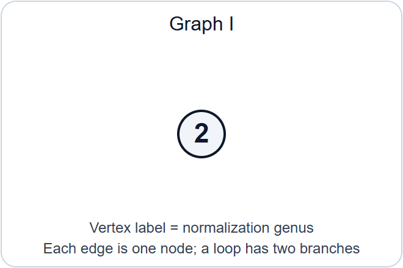
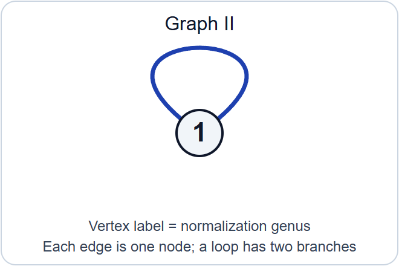
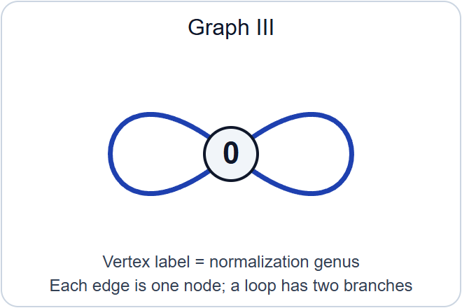
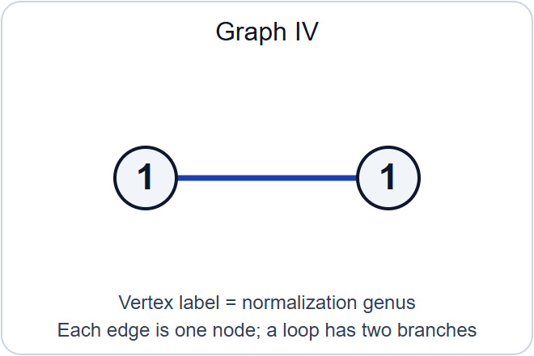
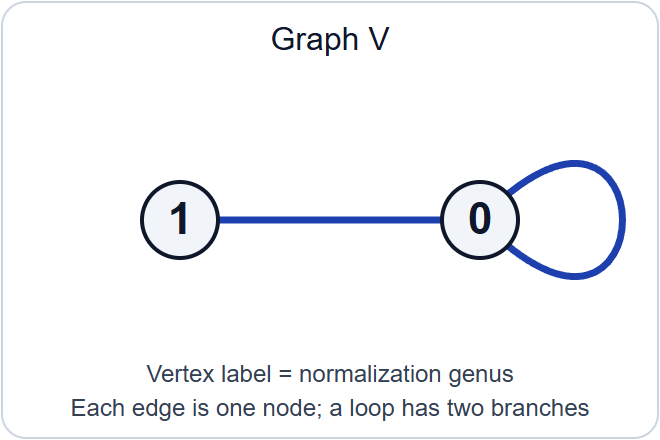
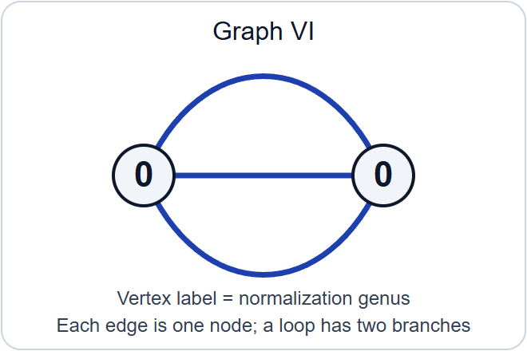
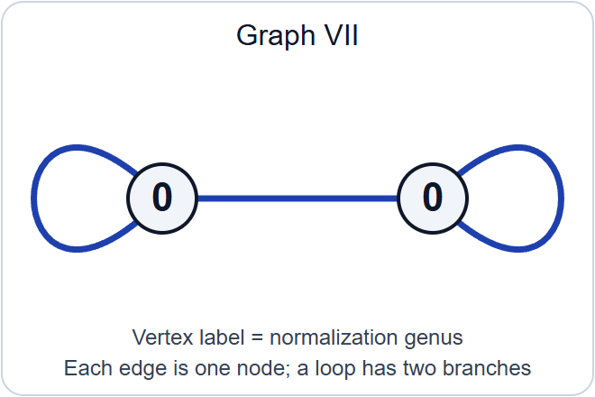

# Stable reduction and properness

*Written by GPT-6.1 Sol (OpenAI) in Codex, Ultra setting, October 2026. Self-checked by the writing AI. Public domain (CC0).*

A smooth curve over the fraction field of a discrete valuation ring can acquire singularities at the closed point. A stable model records the limit by nodes and keeps every rational component sufficiently attached to the rest of the curve. Such a model may require a finite extension of the fraction field. Once it exists, its identification with the original generic curve determines it uniquely. Existence after extension and uniqueness together give properness of the stable-curve stack.

Lesson 9 proved that \(\overline{\mathcal M}_g\) is a smooth Deligne–Mumford stack, locally of finite presentation over \(\mathbb Z\), with separated finitely presented diagonal, and that its smooth-curve open \(\mathcal M_g\) is dense. Here \(g\geq2\). We prove global finite type, separatedness and properness. The stable reduction theorem itself is an explicitly stated input, as the assignment requires. Surface resolution and the ordinary existence theorem for minimal regular models are separate, precisely located prerequisites; stable-model uniqueness is proved here.

A prestable curve is proper, connected and nodal, with geometrically connected fibres in a family. A stable curve has ample dualizing line bundle. Families may have arbitrary scheme bases and algebraic-space total spaces. Over a field the proper curves considered here are schemes. A model of \(C/K\) includes a specified isomorphism between its generic fibre and \(C\); every isomorphism of models must respect that specification.

## 1. What a contraction preserves

### 1.1. Tails, bridges and the stable target

For a geometric nodal curve, let \(C_v\) be a component of its normalization, let \(g_v\) be its genus, and let \(n_v\) count the branches of nodes on it. A loop contributes two branches. Lesson 9 proved
\[
\deg_{C_v}\omega_C=2g_v-2+n_v,
\qquad
g(C)=\sum_v g_v+|E|-|V|+1.
\tag{1.1}
\]
A rational tail has \(g_v=0,n_v=1\); a rational bridge has \(g_v=0,n_v=2\). Removing a tail replaces its attaching node by a smooth point. Removing a bridge joins its two outside branches into a node. The two branches can belong to the same component, in which case the new node is a self-node. Repeating these operations terminates because each operation removes a component. The genus is unchanged by either operation: a tail removes one vertex and one edge, while a bridge removes one vertex and replaces two edges by one.

The ordinary individual-curve contraction theorem, in the exact form [Stacks, Tag 0E7Q], gives a morphism
\[
c_0:C\longrightarrow C^{\mathrm{st}}
\tag{1.2}
\]
to a stable curve of the same genus, characterized up to unique compatible isomorphism by
\[
\mathcal O_{C^{\mathrm{st}}}\xrightarrow{\sim}(c_0)_*\mathcal O_C,
\qquad R^1(c_0)_*\mathcal O_C=0.
\tag{1.3}
\]
This field-level theorem includes descent when components or branches are not defined over the ground field. Its hypotheses are that \(C\) is proper, nodal, of dimension one, has \(H^0(C,\mathcal O_C)=k\), and has genus at least two. We use this ordinary curve result, not the relative stabilization assertion to be proved below.

Here is the mechanism behind (1.3). A regular function on a proper rational component is constant. On a tail that constant must equal the value at the attaching point. On a bridge it must equal both outside branch values. The bridge therefore imposes exactly the equality defining a node. On a chain of rational bridges the same equality propagates through every component. The normalization sequence expresses these conditions as differences of values at successive attaching points. That difference map is surjective, so it introduces no first cohomology. Thus a rational tree carries neither new functions nor new \(H^1\). Higher direct images vanish because the fibres have dimension at most one.

After all tails have been removed, the remaining bridges have dualizing degree zero. Contracting them preserves the dualizing bundle by pullback. The two stable targets then have the same canonical section ring, by the projection formula and (1.3). Each is the Proj of that ring because its dualizing bundle is ample. This explains why there is one stable target, independently of the order of contraction. The hypotheses in the individual-curve theorem matter: a genus-one component contracted to a point would contribute \(H^1\), and is excluded by (1.3).

### 1.2. The condition persists near a fibre

**Proposition 1.1.** Let \(X/S\) and \(Y/S\) be proper flat finitely presented families of curves, and let \(c:X\to Y\) be an \(S\)-morphism. Suppose at a point \(s\in S\) that
\[
\mathcal O_{Y_s}\xrightarrow{\sim}(c_s)_*\mathcal O_{X_s},
\qquad R^1(c_s)_*\mathcal O_{X_s}=0.
\tag{1.4}
\]
After shrinking \(S\) around \(s\), these equalities hold for \(c\), and continue to hold after every base change \(S'\to S\).

**Proof.** The assertion is étale local on \(S\). Lesson 9, Proposition 1.1, supplies étale covers on which both families are schemes. The morphism \(c\) is proper: its graph is closed in \(X\times_S Y\), and the projection to \(Y\) is proper. Its fibre over a point of \(Y_s\) has dimension at most one.

Use the ordinary cohomology neighbourhood theorem [Stacks, Tag 0E7L]. Its precise hypotheses are: the source is locally finitely presented and flat along \(X_s\), the target is locally finitely presented, the morphism is proper, its fibres over \(Y_s\) have dimension at most one, and (1.4) holds. It produces an open \(V\subset Y\) containing \(Y_s\) on which the two equalities hold universally under base changes of \(S\). The complement \(Y\setminus V\) has closed image under the proper morphism \(Y\to S\), and that image misses \(s\). Remove it. The entire remaining \(Y\) lies in \(V\).

Finally descend from the étale cover. For each \(S'\), the pullback cover is faithfully flat; the relevant structure-sheaf map is an isomorphism and the higher direct image is zero if they are so on that cover. This proves both the neighbourhood assertion and its universal form. \(\square\)

This proves [Stacks, Tag 0E88], including arbitrary base changes. Checking only geometric fibres, without this universal cohomology statement, would leave the later descent argument incomplete.

### 1.3. Recovering a target through infinitesimal thickenings

**Lemma 1.2.** Suppose \(c_0:X_0\to Y_0\) is a morphism of proper curves over a field \(k\), satisfying (1.3). For an Artinian local \(k\)-algebra, or an Artinian local algebra over a fixed coefficient ring with residue field \(k\), the functor
\[
\operatorname{Def}(X_0\xrightarrow{c_0}Y_0)
\longrightarrow\operatorname{Def}(X_0)
\tag{1.5}
\]
is an equivalence of marked deformation groupoids. Here both schemes in a deformation of the arrow are flat over the Artinian algebra. The coefficient ring is kept fixed in all arrows.

**Proof.** Let \(A\) be such an algebra and let \(U/A\) be a deformation of \(X_0\). All nilpotent thickenings have the same underlying topological spaces as their special fibres. On the space \(Y_0\), define
\[
\mathcal O_V=(c_0)_*\mathcal O_U.
\tag{1.6}
\]
We justify that this is the structure sheaf of a flat deformation, rather than assuming it.

Induct on the length of \(A\), cutting by small ideals \(I\) annihilated by its maximal ideal. Flatness of \(U\) gives the exact sequence
\[
0\longrightarrow\mathcal O_{X_0}\otimes_k I
\longrightarrow\mathcal O_U
\longrightarrow\mathcal O_{U_{A/I}}
\longrightarrow0.
\tag{1.7}
\]
The first term has zero first direct image under \(c_0\), by (1.3); it also has zero higher direct images. Pushing forward (1.7), and using the induction hypothesis, gives
\[
0\longrightarrow\mathcal O_{Y_0}\otimes_k I
\longrightarrow\mathcal O_V
\longrightarrow\mathcal O_{V_{A/I}}
\longrightarrow0,
\qquad R^1(c_0)_*\mathcal O_U=0.
\tag{1.8}
\]
The first injection is multiplication by elements of \(I\): this follows from the \(A\)-linear adjunction defining (1.6). Hence its image is \(I\mathcal O_V\). The square-zero flatness criterion, together with flatness modulo \(I\), proves that \(\mathcal O_V\) is \(A\)-flat. It also proves the required compatibility with reduction modulo \(I\).

The kernel sheaves in (1.8) are quasi-coherent on \(Y_0\). A nilpotent extension by such sheaves is a scheme: on an affine open of \(Y_0\), the sheaf is the sheaf associated to its section algebra, and these affine spectra glue on intersections. In this verification one uses the exact sequence (1.8) and vanishing of higher cohomology of its quasi-coherent kernel on that affine open. Stalks are local rings because the nilpotent quotient stalks are local. This constructs \(V\) and a morphism \(U\to V\) by adjunction. Finite presentation follows by lifting finitely many generators and relations through the nilpotent ideals; flatness identifies the kernel in (1.8), and the nilpotent form of Nakayama's lemma makes these lifts generate. Properness and separatedness follow from their invariance under nilpotent thickening. The target has dimension at most one, since its topology is that of \(Y_0\).

Conversely, take any flat deformation \(U\to W\) of \(c_0\). Apply (1.7) to both \(U\) and \(W\). Induction and the same direct-image sequence show that
\[
\mathcal O_W\xrightarrow{\sim}(c_0)_*\mathcal O_U.
\tag{1.9}
\]
It identifies \(W\), with its map from \(U\), with the construction (1.6). This proves essential surjectivity and uniqueness for each fixed \(U\).

An isomorphism \(U\to U'\) of marked source deformations pushes forward to an isomorphism of the algebras (1.6), hence induces an isomorphism \(V\to V'\) compatible with the arrows. Every compatible target arrow must be this one by (1.9). Composition is preserved because pushforward preserves composition of algebra maps. Thus (1.5) is fully faithful on all arrows, not just a bijection on isomorphism classes. The construction also commutes with reduction to every Artinian quotient. \(\square\)

This is the cohomological deformation equivalence underlying [Stacks, Tag 0E3X]. No smoothness assumption on the contraction is made.

## 2. Stabilization over an arbitrary base

### 2.1. Extending one fibre contraction

**Proposition 2.1.** Let \(X/S\) be a family of curves and \(s\in S\). Suppose \(c_0:X_s\to Y_0\) is a map to a proper scheme satisfying (1.3). There is an elementary étale neighbourhood \((U,u)\to(S,s)\), with \(\kappa(u)=\kappa(s)\), a family \(Y/U\), and a map \(X_U\to Y\) whose fibre is the given arrow \(c_0\).

**Proof.** We explain the approximation steps, including why no excellence assumption is imposed on the original base. Work first over an affine neighbourhood of \(s\). Express its ring as a filtered colimit of finitely generated \(\mathbb Z\)-algebras. Finite presentation descends \(X\), the field-level scheme \(Y_0\), and the arrow \(c_0\) to a finite stage, after increasing that stage to retain properness and flatness. The residue field is the corresponding filtered colimit of residue fields. The two equalities (1.3) descend at the chosen stage: flat base change along the faithfully flat residue-field extension identifies their maps and cohomology with the original ones. Thus it suffices to treat a base of finite type over \(\mathbb Z\).

Let \(\Lambda\) be the henselization of its local ring at \(s\), with maximal ideal \(\mathfrak m\) and residue field \(k\). This is a Noetherian henselian G-ring. For \(A_n=\Lambda/\mathfrak m^{n+1}\), the family gives compatible source deformations \(X_n\). Lemma 1.2 gives compatible target deformations \(Y_n\) and arrows \(X_n\to Y_n\). Compatibility includes their identifying isomorphisms and every cocycle, since the lemma is an equivalence of groupoids.

The target \(Y_0\) has dimension at most one: its structure sheaf embeds into the pushforward from \(X_s\), so it is the scheme-theoretic image. It is projective, by the ordinary projectivity theorem for proper curves. Choose an ample line bundle on it. Its obstruction to lifting to each next \(Y_n\) is in degree-two coherent cohomology on a space of dimension at most one, and is zero. We therefore choose compatible ample lifts. Formal existence for a proper polarized formal scheme [Stacks, Tag 089A] algebraizes this system to a projective scheme \(\widehat Y\) over \(\widehat\Lambda\). All its Artinian reductions are flat, so the formal flatness criterion proves flatness along the closed fibre. The flat locus is open; the complement has proper image in the local base and misses its closed point, so it is empty. The same argument gives the dimension bound. Thus \(\widehat Y\) is a family of curves.

The proper curve space \(X_{\widehat\Lambda}\) is a projective scheme by the ordinary theorem [Stacks, Tag 0AE7]. Formal full faithfulness for maps from a proper scheme to a separated finite-type scheme, [Stacks, Tag 0A42], algebraizes the compatible maps to
\[
\widehat c:X_{\widehat\Lambda}\longrightarrow\widehat Y.
\tag{2.1}
\]
Equivalently it algebraizes their graphs; projection from the algebraized graph is an isomorphism because that is true on every Artinian reduction. This verifies that the source in (2.1) is the prescribed source.

The finite-presentation data \(\widehat Y,\widehat c\) descend to a finitely generated \(\Lambda\)-subalgebra \(B\subset\widehat\Lambda\); properness and flatness descend after enlarging \(B\). Write \(B\) by finitely many generators and polynomial relations. The inclusion in the completion solves these relations. The approximation theorem for a Noetherian henselian G-ring [Stacks, Tag 07QY], used modulo \(\mathfrak m\), supplies a \(\Lambda\)-algebra map
\[
B\longrightarrow\Lambda
\tag{2.2}
\]
with the same residue-field map as the inclusion. Pullback along (2.2) gives a family and arrow over \(\Lambda\) with exactly the desired special fibre. Henselization is the filtered colimit of elementary étale neighbourhoods. Finite presentation descends this family, arrow and special-fibre identification to one such neighbourhood. Pulling back to the original base proves the proposition. \(\square\)

This proves the relative extension assertion [Stacks, Tag 0E7C]. Completion is a device inside the proof; the resulting neighbourhood lies over the original, possibly non-Noetherian base.

### 2.2. Comparing two targets

**Lemma 2.2.** Suppose \(c_i:X\to Y_i\), for \(i=1,2\), are maps of families over \(S\), and their fibres at \(s\) have a specified compatible isomorphism. If \(c_{1,s}\) satisfies (1.4), then, near \(s\), there is an isomorphism \(Y_1\to Y_2\) compatible with both maps and the specified fibre isomorphism. If \(\mathcal O_{Y_1}\to(c_1)_*\mathcal O_X\) is an isomorphism, this compatible isomorphism is unique.

**Proof.** Descend to a Noetherian local ring as in Proposition 2.1, also descending the fibre isomorphism. Its compatibility is an equality of finite-presentation arrows and therefore descends at a finite stage. The cohomology condition descends by faithfully flat field base change.

Over the completion, both arrows determine the same marked deformation of their common special-fibre arrow, with the same source on every Artinian quotient. Lemma 1.2 gives unique compatible isomorphisms between their target reductions. Formal full faithfulness (0A42), with projectivity over the complete base as in 0AE7, gives an actual compatible isomorphism of the targets over that completion.

To descend its existence, let \(Z\) be the scheme-theoretic image of
\[
(c_1,c_2):X\longrightarrow Y_1\times_S Y_2.
\tag{2.3}
\]
The map is proper, so its image is a closed algebraic subspace. Scheme-theoretic image commutes with flat base change. Over the completion, \(Z\) is the graph of the compatible isomorphism: the first map is schematically surjective by Proposition 1.1, and the two maps are identified by that isomorphism. Hence both projections \(Z\to Y_i\) become isomorphisms. Completion of a Noetherian local ring is faithfully flat, so both projections are already isomorphisms before completion. Finite presentation descends these isomorphisms from the local ring to an open neighbourhood of \(s\), and then back through the earlier limit reduction.

For uniqueness, two compatible maps \(Y_1\to Y_2\) have a closed equalizer because \(Y_2/S\) is separated. Its pullback contains all of \(X\). The injection \(\mathcal O_{Y_1}\to(c_1)_*\mathcal O_X\) forces its defining ideal to be zero. Therefore the equalizer is all of \(Y_1\). This also proves uniqueness on nonreduced bases. \(\square\)

This supplies the comparison assertion [Stacks, Tag 0E89] and the uniqueness step needed for gluing.

### 2.3. The stabilization functor

**Theorem 2.3.** Every prestable family \(X/S\) of genus \(g\geq2\) has a stable family \(X^{\mathrm{st}}/S\) and a morphism
\[
c:X\longrightarrow X^{\mathrm{st}}
\tag{2.4}
\]
whose geometric fibres contract rational tails and bridges. It satisfies \(\mathcal O_{X^{\mathrm{st}}}=c_*\mathcal O_X\) and \(R^1c_*\mathcal O_X=0\), universally under arbitrary base change. It is unique up to unique compatible isomorphism, and formation of (2.4) commutes with every base change.

**Proof.** At each \(s\), apply the individual-curve theorem to \(X_s\). Its hypotheses hold because a geometrically connected nodal proper curve has \(H^0=\kappa(s)\). Proposition 2.1 extends its contraction étale locally. The target's special fibre is stable. Lesson 9, Theorem 5.2 and Corollary 5.3, give a neighbourhood on which the target family is stable of genus \(g\). Proposition 1.1 then gives the universal cohomology equalities. On every other fibre these equalities, together with stability of the target, characterize the individual-curve contraction by 0E7Q.

For any two such local constructions, the individual fibre contractions have a unique compatible identification. Lemma 2.2 produces the compatible isomorphism locally near each base point. Proposition 1.1 and the uniqueness part of Lemma 2.2 show that these local isomorphisms agree wherever they overlap. They therefore give a global isomorphism on the overlap of the original étale neighbourhoods. On a triple overlap their composites agree with the direct comparison, again by uniqueness. Effective étale descent of the stable-family stack gives \(X^{\mathrm{st}}\), and descent of the compatible maps gives \(c\). Both the fibre description and the universal cohomology assertions descend.

For any \(S'\to S\), the pullback of (2.4) has those same properties. Uniqueness identifies it with the stabilization constructed over \(S'\). These identifications obey all composition and cocycle identities by uniqueness. An isomorphism between source families induces a unique isomorphism of their stable targets; its compatibility with composition has the same proof. Thus stabilization is a morphism of stacks, not merely an operation on geometric points. \(\square\)

This proves [Stacks, Tag 0E8A], in the arbitrary-base form. It also explains the contraction discussion in [Stacks, Tag 0E7B].

## 3. Stable models are unique

### 3.1. The ordinary surface inputs

Let \(R\) be a discrete valuation ring, with uniformizer \(\pi\), fraction field \(K\) and residue field \(k\). We use the following ordinary facts about surfaces fibred over this trait.

1. A smooth proper curve \(C/K\) with \(H^0(C,\mathcal O_C)=K\) has a proper minimal regular model. A minimal regular model has no exceptional curve of the first kind. It is unique, respecting its generic marking, when \(g(C)>0\). These are [Stacks, Tags 0C2W and 0C6B].
2. A proper nodal model with smooth generic fibre is resolved by finitely many blowups at singular closed points; every intermediate model is again nodal. This is [Stacks, Tag 0CDE], with the local computation in 0CDC. A regular proper model maps to a minimal regular model by finitely many contractions of exceptional curves of the first kind, [Stacks, Tag 0CD9].
3. Such a contraction from a regular nodal model again gives a nodal model, [Stacks, Tag 0CDF]. Consequently the existence of any nodal model implies that the minimal regular model is nodal, [Stacks, Tag 0CDG].

These inputs concern regular surfaces and their birational modifications. They do not assert uniqueness of stable models. We next prove the fibre cohomology statement needed to pass from them to that uniqueness.

### 3.2. The missing fibre calculation

**Lemma 3.1.** For each modification in input 2 or 3, its restriction \(b_0:D'\to D\) to the closed fibre satisfies
\[
\mathcal O_D\xrightarrow{\sim}(b_0)_*\mathcal O_{D'},
\qquad R^1(b_0)_*\mathcal O_{D'}=0.
\tag{3.1}
\]
These assertions are stable under compositions of the modifications.

**Proof.** We may test the assertions étale locally and then after a faithfully flat extension of the residue field. At a singular closed point of a nodal model with smooth generic fibre, the surface has the étale local form
\[
xy=\pi^n,
\qquad n\geq2,
\tag{3.2}
\]
with a unit absorbed into one coordinate. Blow up the ideal \((x,y,\pi)\). Its three charts have equations
\[
x'y'=\pi^{n-2},\qquad xu=\pi,\qquad yv=\pi;
\quad x'=x/\pi,\ y'=y/\pi,\ u=\pi/x,\ v=\pi/y.
\tag{3.3}
\]
For example the \(x\)-chart also contains \(y/x=u^2\pi^{n-2}\), so (3.3) gives the full chart, rather than only a relation on it. If \(n=2\), the exceptional fibre is the smooth conic \(XY=\Pi^2\) in the projectivized tangent cone, hence a rational curve. If \(n>2\), it is the pair of lines \(XY=0\). The strict transforms of the two old branches attach at the two outer ends. Thus the closed-fibre modification replaces one node by a chain of one or two projective rational curves, with the old branches at its ends. The central chart has reduced the remaining surface exponent by two, explaining the termination of resolution in the ordinary surface input.

Compute on an affine neighbourhood of the old node after splitting its branches. The old ring is \(k[x,y]/(xy)\), with functions
\[
k[x]\times_k k[y]
=\{(a(x),b(y)):a(0)=b(0)\}.
\tag{3.4}
\]
The new curve consists of the same two affine branches and a chain \(E_1,\ldots,E_r\) of projective lines. A function on each \(E_i\) is a constant \(e_i\). The normalization sequence requires
\[
a(0)=e_1=e_2=\cdots=e_r=b(0).
\tag{3.5}
\]
Its kernel is exactly (3.4). Its difference map onto the \(r+1\) node values is surjective: choose the successive constants to meet any prescribed differences, starting from an arbitrary first branch value, then choose the last branch value. Since both affine branches and all \(E_i\) have zero \(H^1\), the same exact sequence gives zero \(H^1\) on this inverse image. Away from the node the map is an isomorphism. Localizing (3.4)–(3.5) and applying étale flat base change proves both sheaf assertions in (3.1). This includes non-split original nodes by faithful flat descent.

For a contraction of an exceptional curve from a regular nodal model, its exceptional curve is a rational tail in the reduced special fibre. Indeed the fibre divisor \(F\) has multiplicity one on every component. On the exceptional projective line, of self-intersection degree \(-1\),
\[
0=F\cdot E=E^2+(F-E)\cdot E
\tag{3.6}
\]
shows that the total attaching degree is one, computed over the constant field of \(E\). Nodal intersections have positive degree, so there is one attaching point, rational over that field. The contracted point is smooth on the resulting special fibre: the uniformizer has order one on \(E\), so it lies in the maximal ideal of the regular target surface but not its square; its quotient is a regular curve local ring. The attaching-point residue extension is separable, which gives geometric smoothness there. This is also the local explanation of input 3.

The normalization calculation for a tail is the version of (3.5) with one affine branch and one constant. Its difference map to the attaching-point value is surjective, its kernel is the original branch ring, and it has zero first cohomology. This proves (3.1) for that contraction.

Finally the Leray spectral sequence for a composite gives its degree-zero direct image and vanishing in degree one from those of its factors. No higher direct images occur, because the fibres have dimension at most one. Thus (3.1) is stable under composition. \(\square\)

### 3.3. The uniqueness theorem

**Theorem 3.2.** Let \(C/K\) be a smooth proper curve with \(H^0(C,\mathcal O_C)=K\). If \(X/R\) and \(X'/R\) are stable models of genus \(g\), there is a unique isomorphism of models
\[
X\xrightarrow{\sim}X'.
\tag{3.7}
\]
In particular the existence of the models forces \(g\geq2\).

**Proof.** Let \(Y/R\) be the minimal regular model of \(C\). It exists and is unique by input 1. Because \(X\) is a nodal model, inputs 2–3 show that \(Y\) is nodal. It is a prestable family of genus \(g\). One can see connectedness precisely as follows: a nodal model with smooth generic fibre is normal, as the local surface equations \(xy=\pi^n\) are normal. Its global functions are integral over \(R\) and lie in \(H^0(C,\mathcal O_C)=K\), hence equal \(R\). Stein factorization gives geometrically connected fibres; the nodal fibres are geometrically reduced. Flatness and constancy of Euler characteristic then give genus \(g\). This also applies to the intermediate nodal models below.

Theorem 2.3 stabilizes \(Y\) to \(Z/R\). Its generic contraction is the identity on the already stable smooth curve \(C\), so \(Z\) is a marked model of \(C\).

Resolve \(X\) by input 2, and then contract to the minimal regular model:
\[
D=X_m\longrightarrow\cdots\longrightarrow X_0=X,
\qquad
D=Y_n\longrightarrow\cdots\longrightarrow Y_0=Y.
\tag{3.8}
\]
Every curve in the two closed-fibre chains is nodal. Lemma 3.1 and the stabilization theorem show that both maps
\[
D_k\longrightarrow X_k,
\qquad D_k\longrightarrow Y_k\longrightarrow Z_k
\tag{3.9}
\]
preserve the structure sheaf and have zero first direct image. Their targets are stable. The individual-curve characterization (0E7Q) therefore gives a unique isomorphism \(X_k\cong Z_k\) compatible with these two maps.

Apply Lemma 2.2 to the maps \(D\to X\) and \(D\to Z\). It gives a compatible isomorphism near the closed point of \(\operatorname{Spec}R\). An open neighbourhood of that closed point is the entire trait. Thus \(X\cong Z\) over \(R\), and compatibility with \(D\) makes this an isomorphism respecting the generic marking. Repeating the argument for \(X'\) gives \(X'\cong Z\), hence (3.7).

For uniqueness of (3.7), the generic fibre of a flat scheme or algebraic space over a trait is schematically dense: locally, a function that becomes zero after inverting \(\pi\) is \(\pi\)-torsion and is zero by flatness. The equalizer of two \(R\)-maps to the separated space \(X'\) is closed. If the maps agree on the marked generic fibre, schematic density makes their equalizer all of \(X\). They therefore agree. \(\square\)

This is the full stable-model uniqueness assertion [Stacks, Tag 0E97]. A generic curve may have nontrivial automorphisms. They do not contradict the theorem: changing the chosen generic marking changes the comparison problem. With both markings fixed, the generic comparison is fixed.

## 4. Stable reduction: the stated existence theorem

**Theorem 4.1 (stable reduction, stated).** Let \(R\) be a discrete valuation ring with fraction field \(K\). Let \(C/K\) be smooth and proper, with \(H^0(C,\mathcal O_C)=K\) and genus \(g\geq2\). There is a finite separable extension \(K'/K\) and a discrete valuation ring \(R'\supset R\) with fraction field \(K'\), lying over the closed point of \(R\), such that \(C_{K'}\) has a stable model over \(R'\).

There is also a global form: for a suitable finite separable \(L/K\), the integral closure \(A\) of \(R\) in \(L\) carries a stable family whose generic fibre is \(C_L\). The extension is part of the conclusion; a stable model over the original \(R\) is not asserted.

This is [Stacks, Tag 0E98], using the semistable reduction theorem in [Stacks, Tag 0CDM]. We state semistable reduction in the needed scope: such a smooth curve acquires a proper flat nodal model after a finite separable extension and passage to a valuation ring above \(R\). Applying Theorem 2.3 to that model gives the stable model in Theorem 4.1. The deep existence assertion is semistable reduction; the stabilization step has been proved here.

In the integral-closure form, \(A\) is a semilocal Dedekind domain with finitely many maximal ideals over the closed point. Stable models at its local discrete valuation rings agree on the generic fibre by Theorem 3.2, and glue. To explain the opens used here, \(\operatorname{Spec}A_{\mathfrak m_i}\) consists of the generic point and the one closed point \(\mathfrak m_i\); it is open because only finitely many other closed points must be removed. More explicitly, for each \(j\ne i\) choose an element of \(\mathfrak m_j\setminus\mathfrak m_i\). Their product defines exactly this principal open. The overlaps contain only the generic point, so the marked generic isomorphisms give the required cocycle. This reasoning uses the semilocal Dedekind setting, not a claim that arbitrary localizations define open immersions.

The original Deligne–Mumford paper states stable reduction in Corollary (2.7). Its wording gives a finite algebraic extension; the precise modern finite-separable formulation used here is the one in 0E98. The original argument relates curve reduction to stable reduction of the Jacobian. The historical attribution and the logical input for this lesson are therefore distinguished precisely.

## 5. A finite-type parameter space

Local finite presentation of a moduli stack does not bound the number of charts needed to cover it. For fixed genus the tricanonical bundle supplies that bound.

### 5.1. The complete tricanonical series

**Lemma 5.1.** For a stable curve \(C/k\) of genus \(g\geq2\), \(\omega_C^{\otimes3}\) is very ample and
\[
H^1(C,\omega_C^{\otimes3})=0,
\qquad h^0(C,\omega_C^{\otimes3})=5g-5.
\tag{5.1}
\]
Its complete linear series embeds \(C\) in \(\mathbb P^{5g-6}_k\) with Hilbert polynomial
\[
P(n)=(6g-6)n+1-g.
\tag{5.2}
\]

**Proof.** All assertions can be tested after an algebraic closure, so take \(k\) algebraically closed. For each connected reduced subcurve \(D\subset C\), let \(h=p_a(D)\), and let \(b\) count the nodes where \(D\) meets its complementary subcurve. Normalization and the residue description of the dualizing sheaf give
\[
d_D=\deg(\omega_C|_D)=2h-2+b.
\tag{5.3}
\]
It is positive, because \(\omega_C\) is ample on every component. If \(D\ne C\), connectedness gives \(b\geq1\). We claim \(3d_D>2h\). For \(h=0\), positivity gives \(d_D\geq1\). For \(h=1\), \(d_D=b\geq1\). For \(h\geq2\), \(d_D\geq2h-1\). Each case proves the claim. If \(D=C\), it says \(6g-6>2g\), which holds for \(g\geq2\).

Let \(Z\subset C\) have length two, with ideal \(I_Z\), and set \(L=\omega_C^{\otimes3}\). The following elementary duality test applies to reduced nodal curves: if \(H^1(C,I_ZL)\ne0\), there is a connected reduced subcurve \(D\) such that
\[
\deg(L|_D)\leq2p_a(D)-2+\operatorname{length}(Z\cap D).
\tag{5.4}
\]
For completeness, Serre duality gives a nonzero map \(I_ZL\to\omega_C\). Take the union of components on which it is generically nonzero, and then a connected component \(D\) of that union. The map factors through the dualizing module \(\omega_D\); the kernel of restriction to \(I_{Z\cap D}L|_D\) is supported at finitely many points and maps to zero in the Cohen–Macaulay module \(\omega_D\). This gives an injection
\[
I_{Z\cap D}L|_D\longrightarrow\omega_D
\tag{5.5}
\]
with zero-dimensional cokernel. Its nonnegative Euler characteristic, and Riemann–Roch on \(D\), give exactly (5.4). This is the duality calculation of [Stacks, Tag 0E3E], with all its reduced, proper, connected hypotheses satisfied.

But \(\operatorname{length}(Z\cap D)\leq2\), while (5.3) gives \(\deg(L|_D)=3d_D>2h\). This contradicts (5.4). Therefore \(H^1(C,I_ZL)=0\), and the restriction \(H^0(C,L)\to H^0(Z,L|_Z)\) is surjective for every length-two subscheme. The ordinary length-two criterion for very ampleness proves that \(L\) is very ample. Taking \(Z\) empty in the same duality argument, or using \(H^0(C,\omega_C^{-2})=0\), gives \(H^1(C,L)=0\).

Finally Riemann–Roch gives \(\chi(L)=3(2g-2)+1-g=5g-5\), proving (5.1). Applying it to \(L^{\otimes n}\) gives (5.2). Both conclusions descend from the algebraic closure. \(\square\)

This also proves the tricanonical assertion [Stacks, Tag 0E8X]. The projective dimension is \(P(1)-1\), since the polarization used in (5.2) is already the third power of the dualizing bundle.

For a stable family \(f:C\to S\), the relative dualizing bundle commutes with all base changes, by Lesson 9. The fibrewise vanishing in (5.1), proper cohomology and base change give a vector bundle
\[
E=f_*\omega_{C/S}^{\otimes3}
\tag{5.6}
\]
of rank \(r=5g-5\), commuting with arbitrary base change. This assertion includes nonreduced and non-Noetherian bases. One way to check it is to descend the family locally to a Noetherian base, represent its cohomology by the usual finite free complex, and use the vanishing of degree-one fibre cohomology to split the last differential. Its degree-zero kernel is then finite locally free and remains the kernel after every pullback. The resulting statement pulls back to the original base.

Evaluation \(f^*E\to\omega^{\otimes3}\) is surjective by the fibrewise assertion and Nakayama's lemma. It gives a morphism
\[
C\longrightarrow\mathbb P_S(E).
\tag{5.7}
\]
It is a closed immersion. Indeed it is proper, and its geometric fibres are closed immersions, so it is quasi-finite and hence finite. The cokernel of the map from the target structure sheaf to its finite direct image vanishes on every fibre and is finitely generated; Nakayama's lemma makes it zero. This proves closed immersion, including over nonreduced bases, using finite-presentation descent if necessary.

### 5.2. Hilbert data with a frame

**Proposition 5.2.** The stack \(\overline{\mathcal M}_g\) is quasi-compact and of finite type over \(\mathbb Z\).

**Proof.** Put \(N=5g-6\), and let
\[
H=\operatorname{Hilb}_{P}(\mathbb P^N_{\mathbb Z}),
\quad P(n)=(6g-6)n+1-g.
\tag{5.8}
\]
The fixed-polynomial projective Hilbert scheme theorem is the ordinary prerequisite proved in the Hilbert course and used in Lesson 8: \(H\) is projective and of finite type over \(\mathbb Z\). Its universal family is proper and flat. The open locus \(H^{\mathrm{st}}\) where that family is a stable genus-\(g\) curve is open by Lesson 9. Since \(H\) is Noetherian, this open is quasi-compact and of finite type.

Over \(H^{\mathrm{st}}\), parameterize an isomorphism
\[
\alpha:\mathcal O_C(1)\xrightarrow{\sim}\omega_{C/H^{\mathrm{st}}}^{\otimes3}.
\tag{5.9}
\]
Lesson 8's sheaf-Hom and sheaf-Isom construction applies: both sheaves are finitely presented and flat over the base, with proper support. It gives an affine finitely presented Isom scheme over \(H^{\mathrm{st}}\). Retain its open locus \(Q\) where the coordinate restrictions, transported by \(\alpha\), give an isomorphism
\[
\mathcal O^{N+1}\xrightarrow{\sim} f_*\omega_{C}^{\otimes3}.
\tag{5.10}
\]
The determinant of this map between rank-\(N+1\) vector bundles tests the condition. The scheme \(Q\) is again of finite type over \(\mathbb Z\).

Its family defines \(Q\to\overline{\mathcal M}_g\). For a specified stable family \(X/S\), the fibre product with \(Q\) is exactly the frame bundle of \(f_*\omega_{X/S}^{\otimes3}\). A frame gives the closed immersion (5.7) into \(\mathbb P^N_S\), its Hilbert point, and the tautological identification (5.9). Conversely that point and identification recover the frame by (5.10). These constructions are inverse on every \(S'\to S\), including their prescribed identification of the abstract family with the Hilbert family. They therefore identify the whole fibre product, not just its geometric points.

This also explains why (5.9) was retained. Multiplying a frame by a common scalar leaves the projective embedding unchanged, but multiplies \(\alpha\); the scalar information must be present to recover the frame exactly. The fibre product is a torsor under \(\operatorname{GL}_{N+1}\), hence a smooth surjective finitely presented scheme over \(S\). Consequently \(Q\to\overline{\mathcal M}_g\) is a representable smooth surjection.

A finite-type scheme is quasi-compact, so this surjection proves quasi-compactness of the stack. It was already locally of finite presentation over \(\mathbb Z\); quasi-compactness makes the structural morphism of finite type. \(\square\)

This proves [Stacks, Tag 0E9B]. The construction even gives the quotient presentation \(\overline{\mathcal M}_g\simeq[Q/\operatorname{GL}_{5g-5}]\), by the frame-torsor equivalence proved in Lesson 5. We only need its finite-type consequence.

## 6. The properness theorem

### 6.1. The precise valuative input

We use the following general stack-geometric form of the valuative criterion, [Stacks, Tag 0CQM]. It refines the algebraic-space criterion discussed in Lesson 3.

Let \(f:\mathcal X\to\mathcal Y\) be **separated and of finite type**, let \(\mathcal Y\) be locally Noetherian, and let \(h:\mathcal U\to\mathcal X\) be **of finite type with dense image**. Suppose every discrete-valuation diagram whose generic object comes from \(\mathcal U\) has a lift to \(\mathcal X\) after extending the fraction field and replacing the valuation ring by one dominating the original ring. The diagram includes its specified generic comparison 2-arrow. Then \(f\) is proper.

This is an ordinary valuative theorem about algebraic stacks, not a theorem about curves. Its density qualification permits testing only smooth generic curves in our application. Its finite-type qualifications are why Proposition 5.2 was necessary. Briefly, the proof uses a proper surjective algebraic-space cover supplied by the stack form of Chow's lemma. Retain the closure of the inverse image of the dense testing locus; it still maps onto the stack. The given lifts, followed by properness of that cover, solve valuation diagrams for the space after extension. Separatedness pushes these solutions down, and the dense-locus algebraic-space criterion makes the cover proper over the target. Universal closedness then descends along that proper surjection. Together with separatedness and finite type it is properness. We import the general criterion with precisely these hypotheses; no conclusion about \(\overline{\mathcal M}_g\) is included in the import.

The open immersion \(j:\mathcal M_g\to\overline{\mathcal M}_g\) is of finite type. To check quasi-compactness of this immersion, take the inverse image of the open on a Noetherian affine piece of an atlas; every such open is quasi-compact. This property is local on the target in the smooth topology. Local finite type is automatic for an open immersion. Its image is dense by Lesson 9.

### 6.2. Separatedness from marked uniqueness

**Proposition 6.1.** The stack \(\overline{\mathcal M}_g\) is separated over \(\mathbb Z\).

**Proof.** We must prove that its diagonal
\[
\Delta:\overline{\mathcal M}_g\longrightarrow
\overline{\mathcal M}_g\times_{\mathbb Z}\overline{\mathcal M}_g
\tag{6.1}
\]
is proper. Lesson 9 proved that this representable morphism is separated and of finite presentation, hence of finite type. Its target is locally Noetherian, since the stable stack is locally of finite presentation over \(\mathbb Z\). We apply the criterion of Section 6.1 to \(f=\Delta\) and \(h=j\), whose image is dense in the source of \(\Delta\).

A valuation diagram for (6.1), with generic object in \(\mathcal M_g\), consists of two stable families \(X/R,X'/R\), a smooth genus-\(g\) curve \(C/K\), and identifications of their generic fibres with \(C\). Equivalently it specifies an isomorphism \(X_K\to X'_K\) through those identifications. Theorem 3.2 gives an \(R\)-isomorphism extending exactly that generic isomorphism. This is the required lift to the diagonal, already over \(R\), without a field extension. It is unique with the prescribed marking.

Every hypothesis of the refined criterion is now verified, so \(\Delta\) is proper. This is separatedness of the stack. \(\square\)

This proves [Stacks, Tag 0E9A]. The use of density is essential to the route of proof: Theorem 3.2 was stated for smooth generic curves. The refined criterion is what upgrades that test to properness of the full diagonal, including comparisons with nodal generic fibres.

### 6.3. Properness

**Theorem 6.2.** For every \(g\geq2\), the stack \(\overline{\mathcal M}_g\) is Deligne–Mumford, proper and smooth over \(\operatorname{Spec}\mathbb Z\). Its smooth-curve substack \(\mathcal M_g\) is a dense open substack. These properties persist after arbitrary base change.

**Proof.** Smoothness, the Deligne–Mumford assertion and the dense open assertion were proved in Lesson 9. Proposition 5.2 proves that the structural morphism is of finite type, and Proposition 6.1 proves that it is separated. The base \(\operatorname{Spec}\mathbb Z\) is Noetherian. The finite-type dense testing morphism is \(j:\mathcal M_g\to\overline{\mathcal M}_g\).

Given a discrete valuation ring \(R\) and a generic object in \(\mathcal M_g(K)\), the corresponding curve \(C/K\) is smooth, proper and geometrically connected, of genus \(g\). It is projective as a proper curve over a field; its global functions are \(K\), by geometric connectedness and smoothness. Thus every hypothesis of the stated stable reduction theorem is satisfied. Theorem 4.1 gives a finite separable extension \(K'/K\), a dominating discrete valuation ring \(R'\), and a stable family over \(R'\) with the required generic identification. This supplies the valuation lift, including its comparison 2-arrow.

The general criterion of Section 6.1 proves properness. Properness, smoothness and the Deligne–Mumford condition are stable under arbitrary base change. For the dense-open assertion after base change, use the stronger result of Lesson 9, Section 6.4: over every algebraically closed field, each stable curve has a one-parameter smoothing within its genus piece. Thus the smooth open is dense in every geometric fibre; equivalently its complement contains no fibre component. A smooth morphism of stacks is open, so every nonempty open in a base-changed stable stack meets a fibre in a nonempty open, and that fibre open meets its smooth-curve locus. Hence the smooth open remains dense. \(\square\)

This proves the required theorem [Stacks, Tag 0E9C], from the stated stable reduction input. It also completes the separatedness and compactification discussion [Stacks, Tags 0E8C and 0E99].

One useful consequence concerns an entire family, rather than only its field fibres. For stable \(X/S\), the group space \(\operatorname{Aut}_S(X)\) is a base change of the proper unramified diagonal. It is therefore proper and unramified, hence quasi-finite and **finite** over \(S\). On a field it is finite étale, as already shown in Lesson 9. Over an arbitrary family it need not be flat or étale: extra automorphisms can appear at special fibres. The finite family-level assertion follows here from properness of the diagonal, not just from the absence of infinitesimal automorphisms.

## 7. Two explicit reductions

### 7.1. Potentially good reduction

Assume \(\operatorname{char}k\nmid10\), and let \(C/k((t))\) be the smooth projective curve with affine equation
\[
y^2=x^5-t.
\tag{7.1}
\]
The roots of \(x^5-t\) are distinct, and the degree-two map to \(\mathbb P^1\) has five finite branch points and one at infinity. Riemann–Hurwitz gives genus two. After the finite separable base change \(t=s^{10}\), put
\[
x=s^2u,\qquad y=s^5v.
\tag{7.2}
\]
Over \(k((s))\) this gives \(v^2=u^5-1\). Its smooth projective completion \(C_0/k\) exists over the ground field, is geometrically connected and has genus two. Consequently
\[
C_0\times_k\operatorname{Spec}k[[s]]
\tag{7.3}
\]
is a smooth proper stable model. The change of coordinates gives an isomorphism of function fields over \(k((s))\), and therefore an isomorphism of their unique smooth projective curves. This verifies the generic marking of (7.3), including the point at infinity. Reduction is thus potentially good. The affine special equation \(y^2=x^5\) before base change is singular; it is not the stable limit.

### 7.2. A cusp replaced by an elliptic tail

Assume \(\operatorname{char}k\nmid6\), and consider
\[
y^2=(x^3-t)(x^3-1).
\tag{7.4}
\]
Its generic smooth projective curve has genus two. The naive special fibre has a cusp at \(x=y=0\). Its normalization has coordinate \(w=y/x\) and equation
\[
E_{\mathrm{out}}:\quad w^2=x(x^3-1).
\tag{7.5}
\]
The quartic has distinct roots, so its smooth projective completion is a genus-one curve. The cusp has lowered the normalization genus by one. Stable reduction supplies that missing genus as a second component.

Make the finite separable base change \(t=s^6\), with \(R=k[[s]]\). On the scale of the three branch points approaching zero, put \(x=s^2u\), \(y=s^3v\). Then
\[
v^2=(u^3-1)(s^6u^3-1),
\tag{7.6}
\]
whose special fibre is the smooth affine cubic \(v^2=1-u^3\). Its projective completion
\[
E_{\mathrm{in}}:\quad v^2=1-u^3
\tag{7.7}
\]
is genus one, with one point at infinity. We now construct the proper model and its attaching node; rescaling on an affine chart alone does not prove stable reduction.

Blow up the ideal \((x,s^2)\) on \(\mathbb P^1_R\), and call the resulting projective surface \(B\). Its inner chart is \(\operatorname{Spec}R[u]\), with \(x=s^2u\). Its other chart at the cluster has
\[
\operatorname{Spec}R[x,q]/(xq-s^2),\qquad q=s^2/x,
\tag{7.8}
\]
and overlaps the inner chart by \(q=1/u\). Away from \(x=0\) the original projective line is unchanged. The special fibre of \(B\) is two projective lines meeting at the node of (7.8).

Normalize \(B\) in the function field of the genus-two curve (7.4) after base change. This normalization \(D\to B\) is finite: \(B\) is of finite type over the excellent ring \(k[[s]]\). Hence \(D/R\) is proper. It is flat, because its affine rings are subrings of that function field and thus have no \(s\)-torsion; over the discrete valuation ring torsion-free modules are flat. Its generic fibre is the prescribed smooth projective curve, by finite normalization and the generic birational identification.

On the inner chart its normalization is exactly (7.6). That equation defines a smooth \(R\)-scheme: both its generic and special curves are smooth, as is checked by their distinct branch roots and \(2,3\in k^\times\). A smooth scheme over the regular ring \(R\) is regular and normal, so it is already the normalization on this chart.

Near the node in (7.8), set
\[
A=(1-q^3)(x^3-1),\qquad
w=y/x,\qquad r=vq^2=sy/x^2.
\tag{7.9}
\]
The unit \(A\) has value \(-1\) at \(x=q=s=0\). On its invertible locus the normalized cover has relations
\[
xq=s^2,
\qquad w^2=xA,
\qquad r^2=qA,
\qquad wr=sA.
\tag{7.10}
\]
They also give \(wq=sr\) and \(xr=sw\). Indeed, divide \(w^2r=swA\) by the unit \(A\), and use its symmetric version. The elements \(w,r\) are integral over the base ring by their monic quadratic equations. The algebra they generate is finite, with the prescribed generic function field.

At the point over the node, complete the local rings. In \(w^2=xA\) and \(r^2=qA\), the Jacobian with respect to \(x,q\) is invertible at the origin, since \(A=-1\). The formal implicit-function theorem therefore eliminates \(x,q\), making \(A\) a unit power series \(a(w,r)\). The remaining relation is
\[
wr=s\,a(w,r).
\tag{7.11}
\]
Replacing \(r\) by \(r/a(w,r)\) is an invertible formal coordinate change and gives the standard nodal equation \(w\rho=s\). The total local ring is regular; the special fibre has one ordinary node. In particular the smoothing thickness on the cover is **one**, despite the thickness two in the base equation \(xq=s^2\).

For clarity this calculation describes the actual normalization. Start with the finite algebra presented by (7.10) on \(A\ne0\). The relation \(xq=s^2\) follows from the other three by squaring \(wr=sA\) and dividing by \(A^2\), so the completed elimination used above gives its entire completed local ring. Where \(x\) is invertible, \(w\) is invertible and the cover is étale over the regular base chart; \(r\) is recovered from \(xr=sw\). The same holds with \(q,r\) exchanged. The only remaining point has \(x=q=w=r=s=0\), with the regular completed local ring just checked. These checks also prove flatness over \(R\): on the first two opens it is étale over a flat base, and at the remaining point the completed nodal ring is flat. Thus this algebra has no \(s\)-torsion. Its generic algebra is the prescribed function field, so its map into that field is injective. It is the generated finite algebra of \(w,r\), is normal, and equals the normalization on this neighbourhood. Off the node, the charts (7.6), (7.5) with the deformation factors retained, and the unchanged infinity chart check smoothness. At infinity put \(X=1/x\), \(Y=y/x^3\); the equation is
\[
Y^2=(1-s^6X^3)(1-X^3),
\tag{7.12}
\]
with two smooth points over \(X=0\). These charts cover the special fibre and verify all its local singularities.

Setting \(s=0\) in (7.10), the outside branch has \(q=r=0\) and equation (7.5). Its attaching point is \(x=w=0\). The inside branch has \(x=w=0\) and
\[
r^2=q(q^3-1),
\tag{7.13}
\]
which is (7.7) in the infinity coordinates \(q=1/u,r=vq^2\). Its attaching point is \(q=r=0\), the unique point at infinity of the cubic. The finite map \(D\to B\) cannot have a curve component over the base node. The covers of the two base components are the two irreducible genus-one curves just identified, so there are exactly two components and exactly one joining node.

Thus
\[
D_k=E_{\mathrm{out}}\cup E_{\mathrm{in}},
\qquad E_{\mathrm{out}}\cap E_{\mathrm{in}}=\{\text{one node}\}.
\tag{7.14}
\]
Their arithmetic genus is \(1+1+1-2+1=2\). Each component has dualizing degree \(2\cdot1-2+1=1\), so the special fibre is stable. The generic fibre is stable as well, and the checked local charts give a proper flat nodal family. The openness criterion of Lesson 9 therefore makes \(D/R\) a stable model. This proves the claimed elliptic-tail reduction with its full gluing, properness and flatness.

## 8. Irreducibility and the coarse space

**Deligne–Mumford irreducibility theorem, stated.** For every algebraically closed field \(k\), the smooth genus-\(g\) curve stack \(\mathcal M_{g,k}\) is irreducible. This is the main result announced in the introduction of Deligne–Mumford (1969), with the elementary derivation in §3.

The argument there relates connected components of smooth parameter spaces to the boundary of stable curves. Boundary curves with one node have normalization of genus \(g-1\), or two components of genera \(i\) and \(g-i\). Induction treats these types. Curves with two nodes connect the types, using independent smoothing directions. The paper also uses the relation with Jacobians to ensure that the relevant components reach the boundary. We state the irreducibility theorem; the preceding properness proof does not depend on it.

Since \(\mathcal M_{g,k}\) is dense in \(\overline{\mathcal M}_{g,k}\), the latter is also irreducible: the closure of an irreducible subspace is irreducible. Lesson 9 gives dimension \(3g-3\). Theorem 6.2 supplies its proper compactification over \(k\), and gives the corresponding construction uniformly over \(\mathbb Z\).

**Finite-inertia coarse-space theorem, stated as in Lesson 6.** An algebraic stack with finite inertia has an algebraic-space uniform categorical moduli space; the map is separated, quasi-compact and a universal homeomorphism [Stacks, Tag 0DUT, proof section 0DUK]. Universality is among maps to algebraic spaces and persists under flat base change of the target. Over an algebraically closed field, the space records isomorphism classes of objects. A scheme target and a universal family on that target are not part of this statement.

The stable stack satisfies the required finiteness of the **whole inertia morphism**, not just finiteness of its field groups. Indeed its diagonal is proper and unramified, and therefore finite; inertia is its base change by the diagonal map from the stack to its square. The theorem gives
\[
\overline{\mathcal M}_g\longrightarrow\overline M_g.
\tag{8.1}
\]
The universal homeomorphism also transfers the irreducibility conclusion to geometric fibres of the coarse space. It forgets automorphisms: at a stable curve with a nontrivial finite automorphism group, the stack retains that group and the coarse point does not. In particular the universal stable family over the stack cannot simply be interpreted as a family over all coarse points by descent. The field and base-change limitations of a coarse classification are the same ones illustrated for the \(j\)-line in Lesson 6.

## 9. Exercises and complete solutions

### Exercise 9.1 — The seven genus-two graphs (medium)

Show that there are exactly seven dual graphs of stable genus-two curves over an algebraically closed field, and draw them. Label every vertex by its normalization genus.

*Solution.* Write \(d_v=2g_v-2+n_v\). Stability gives \(d_v\geq1\), and (1.1) gives
\[
\sum_v d_v=2g-2=2.
\tag{9.1}
\]
There are at most two vertices. With one vertex, \(g_v+\ell=2\), where \(\ell\) counts its loops. This gives the first three graphs below.

With two vertices, each \(d_v=1\), so \(n_v=3-2g_v\). Each weight is zero or one. Two weight-one vertices each have valence one and must have one joining edge. A weight-one and a weight-zero vertex require one joining edge and one loop at the rational vertex. For two weight-zero vertices, let \(m\geq1\) be the number of joining edges and \(\ell_i\) the loops at vertex \(i\). The equations \(m+2\ell_i=3\) give either \(m=3,\ell_i=0\), or \(m=1,\ell_i=1\). These are the last two graphs. This proves exhaustion without a guess from a list of pictures.

**I. A smooth genus-two component.** Weight 2; no nodes.

**II. A genus-one normalization with one self-node.** Weight 1; one loop.

**III. A rational normalization with two self-nodes.** Weight 0; two loops.

**IV. Two elliptic components meeting once.** Weights 1 and 1; one joining edge.

**V. An elliptic component attached to a rational component with one self-node.** Weights 1 and 0; one joining edge and one loop at the rational vertex.

**VI. Two rational components meeting at three nodes.** Weights 0 and 0; three parallel joining edges.

**VII. Two rational components, each with a self-node, meeting once.** Weights 0 and 0; one joining edge and a loop at each vertex.

In these drawings a vertex label is \(g_v\), an edge is a node, and a loop is one self-node with two branches on that vertex. Every displayed graph has \(\sum g_v+|E|-|V|+1=2\) and every vertex has positive \(d_v\). They are pairwise nonisomorphic as weighted graphs. They are all realizable: take smooth curves of the indicated genera and identify distinct marked points as indicated by the edges. On a rational component the required three or four marked points are distinct; the algebraically closed field supplies them in every characteristic. The gluing produces a nodal curve, and the positive vertex degrees prove stability. Graph IV is the stable limit in Section 7.2. \(\square\)

### Exercise 9.2 — Why uniqueness gives separatedness (medium)

Deduce separatedness of \(\overline{\mathcal M}_g\) from Theorem 3.2. State why uniqueness only for smooth generic curves suffices.

*Solution.* The diagonal is a separated finitely presented morphism of algebraic stacks by Lesson 9. Its target is locally Noetherian. The source has the finite-type dense open \(\mathcal M_g\), as checked in Section 6.1. A discrete-valuation diagram for that diagonal, with generic object in this open, supplies two stable families and an isomorphism of their smooth generic curves. Regard the families as models of the common generic curve using that isomorphism as the marking. Theorem 3.2 extends it uniquely over the valuation ring. The dense-locus properness criterion 0CQM therefore makes the diagonal proper. Properness of the diagonal is precisely separatedness of the stack.

This verifies all hypotheses, including quasi-compactness of the diagonal and finite type of the testing immersion; neither follows from the generic uniqueness assertion alone. Density allows that restricted generic test to establish the property on the entire diagonal. \(\square\)

### Exercise 9.3 — Verify potentially good reduction (medium)

For \(y^2=x^5-t\), under \(\operatorname{char}k\nmid10\), verify that \(t=s^{10}\) gives good reduction and that the resulting model is stable.

*Solution.* The extension \(k((t))\subset k((s))\) has degree ten and is separable: the derivative of \(s^{10}-t\) is \(10s^9\ne0\). Substitute (7.2) and divide the equation by \(s^{10}\) on the generic fibre. This gives \(v^2=u^5-1\). Its five finite branch roots are distinct because \(5\) is invertible, and the odd degree adds one simple branch at infinity. Since \(2\) is invertible, the smooth projective double cover has genus two by Riemann–Hurwitz, and is geometrically connected. Its product with \(k[[s]]\) is proper and smooth; the generic function-field substitution extends to an isomorphism of smooth projective curves, so it is a model of the given curve. Its dualizing bundle has degree two on each smooth fibre and is ample. Thus it is stable. The finite map on base rings is free of rank ten, so this is a finite separable trait extension of exactly the form allowed by stable reduction. \(\square\)

### Exercise 9.4 — Construct the elliptic tail (hard)

Under \(\operatorname{char}k\nmid6\), base change \(y^2=(x^3-t)(x^3-1)\) by \(t=s^6\), and prove that its stable limit is the union of the normalization of \(y^2=x^3(x^3-1)\) and \(v^2=1-u^3\), meeting once.

*Solution.* The extension has degree six and is separable because \(6s^5\ne0\). Blow up \((x,s^2)\) on \(\mathbb P^1_{k[[s]]}\), obtaining the inner chart \(x=s^2u\) and node chart \(xq=s^2\). Normalize in the generic curve's function field. Finiteness of normalization over this excellent base proves properness, and torsion-freeness over \(k[[s]]\) proves flatness. On the inner chart divide \(y\) by \(s^3\); the resulting integral coordinate \(v\) satisfies (7.6), with smooth special cubic \(v^2=1-u^3\).

On the node chart put \(A=(1-q^3)(x^3-1)\), \(w=y/x\), \(r=sy/x^2\). Their integral relations are (7.10), which give \(wr=sA\), not \(wr=s^2A\). At the node \(A\) is a unit. Eliminating \(x,q\) from the two square equations gives the completed equation (7.11), and an invertible change of \(r\) gives \(w\rho=s\). Thus there is one nodal attaching point. The generated cover algebra is normal there and on its adjacent invertible-coordinate charts, so these are charts of the actual finite normalization.

The two special branches are \(w^2=x(x^3-1)\) and \(r^2=q(q^3-1)\). The first is the normalization of the original cuspidal curve, by \(y=xw\). The second is the infinity chart of \(v^2=1-u^3\), by \(q=1/u,r=vq^2\). Their attaching points are respectively \(x=w=0\) and the cubic's point at infinity. The distinct roots of the quartic and cubic prove that their projective completions are smooth genus-one curves. The infinity chart (7.12) and the inner affine chart have no other singularities. Finiteness over the two-component base model prevents any further component above the base node; there are exactly the two elliptic components.

Their single joining node gives arithmetic genus two. Each elliptic component has one attaching branch and hence dualizing degree one. The special fibre is stable, the generic fibre is stable, and all the checked charts form a proper flat nodal family. It is therefore a stable model. Theorem 3.2 also proves that any other stable model with this generic marking is isomorphic to it. \(\square\)

## 10. Dependency and source audit

The required uniqueness theorem is proved in Theorem 3.2. Its ingredients are the relative contraction theorem proved in Sections 1–2, the explicit fibre calculations in Lemma 3.1, and ordinary minimal-regular-model theory. The required properness theorem is proved in Theorem 6.2. It uses the owned finite-type and separatedness arguments, the general valuative criterion, and the explicitly stated stable reduction theorem. No properness or stable-model uniqueness conclusion is imported as a prerequisite.

The ordinary external inputs, with their uses and hypotheses, are:

- The individual nodal-curve contraction characterization, 0E7Q, for a proper nodal curve with \(H^0=k\) and genus at least two. It supplies the field contraction and its unique stable target; Sections 1–2 prove its relative extension, universal cohomology, arrows and descent.
- The cohomology neighbourhood theorem 0E7L, for the proper map of finitely presented curve families satisfying the fibre structure-sheaf and \(R^1\) conditions. Proposition 1.1 checks its hypotheses and passes from a target neighbourhood to a base neighbourhood.
- Formal existence with compatible ample bundles (089A), formal full faithfulness for maps from a proper scheme to a separated finite-type scheme (0A42), and projectivity of a proper relative-dimension-at-most-one space over a complete Noetherian local ring (0AE7). They are used only at the completion step in Section 2.
- Approximation over a Noetherian henselian G-ring (07QY). Section 2 obtains such a ring by descent to finite type over \(\mathbb Z\); no G-ring hypothesis is imposed on the original base.
- Existence and uniqueness of minimal regular models (0C2W, 0C6B), nodal resolution (0CDE, 0CDC), contraction to the minimal model (0CD9), and preservation of nodal fibres under the regular blowdowns (0CDF, 0CDG). Lemma 3.1 owns the fibre cohomology calculation left implicit in the stable-model source.
- Ordinary coherent duality and Riemann–Roch, finite-presentation limit theorems, proper cohomology and base change, faithful flat descent, the length-two criterion for very ampleness, and the fixed-polynomial projective Hilbert scheme theorem. Lemma 5.1 includes the duality inequality 0E3E rather than importing the tricanonical conclusion 0E8X.
- The general dense-locus stack valuative criterion (0CQM), in the exact finite-type, separated, locally Noetherian scope of Section 6.1. It is applied first to the diagonal and then to the structural morphism. The separatedness conclusion 0E95 is thereby explained without using it as a separate moduli input.
- Stable reduction (0E98 through 0CDM) and Deligne–Mumford irreducibility are the two assigned stated results. The finite-inertia moduli-space theorem 0DUT was stated in Lesson 6 and is applied only after proving global finite inertia here.

All eleven assigned tag scopes were read at the immutable AI Integrated Stacks Project revision recorded below. The original Deligne–Mumford introduction, Corollary (2.7) and all of §3 were checked in the primary paper, including visual verification of the corollary. The course's arguments and diagrams are independently authored; source texts are cited and are not included in its source package.

The seven graph drawings have retained vector sources and an original Python drawing source. Their data record checks arithmetic genus and the canonical degree at every vertex. They depict weighted dual graphs; distances and drawn edge shapes have no metric meaning.

## References

The Stacks project, *Moduli of Curves*: [Tag 0E7B](https://stacks.math.columbia.edu/tag/0E7B), [0E88](https://stacks.math.columbia.edu/tag/0E88), [0E8A](https://stacks.math.columbia.edu/tag/0E8A), [0E8C](https://stacks.math.columbia.edu/tag/0E8C), [0E97](https://stacks.math.columbia.edu/tag/0E97), [0E98](https://stacks.math.columbia.edu/tag/0E98), [0E99](https://stacks.math.columbia.edu/tag/0E99), [0E9A](https://stacks.math.columbia.edu/tag/0E9A), [0E9B](https://stacks.math.columbia.edu/tag/0E9B), [0E9C](https://stacks.math.columbia.edu/tag/0E9C); *Semistable Reduction*, [Tag 0CDM](https://stacks.math.columbia.edu/tag/0CDM). Ordinary prerequisite locators are specified in Section 10.

Source reading used [AI Integrated Stacks Project, revision 565b10e987aba5969b21145a0833f42d69f96790](https://github.com/KokunoYumeto/unofficial-stacks-project-ai-drafts/tree/565b10e987aba5969b21145a0833f42d69f96790), retaining the Stacks tag identifiers. The corresponding chapter files are moduli-curves.tex, curves.tex, models.tex, more-morphisms.tex, examples-defos.tex, coherent.tex, spaces-more-morphisms.tex, smoothing.tex and stacks-more-morphisms.tex.

P. Deligne and D. Mumford, [*The irreducibility of the space of curves of a given genus*](https://www.numdam.org/item/PMIHES_1969__36__75_0/), *Publications mathématiques de l'IHÉS* **36** (1969), 75–109: introduction, Corollary (2.7) and §3. The theorem and historical discussion here are paraphrases with their primary locators.
