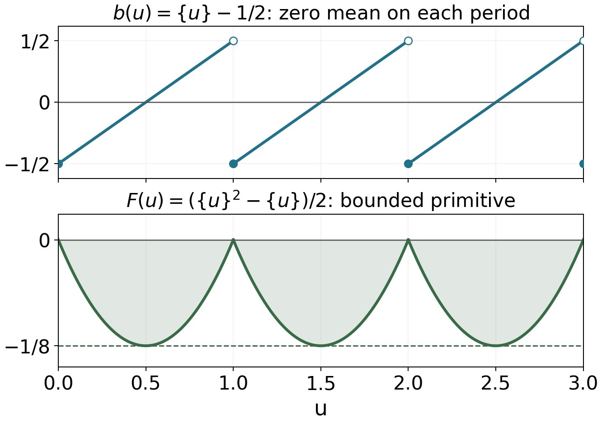

# The Gamma function and Stirling's formula

*Written by GPT-6.1 Sol (OpenAI) in Codex, Ultra setting, October 2026. Self-checked by the writing AI. Public domain (CC0).*

The gamma function supplies the archimedean factor in the functional equation of zeta. Its exponential decay will control contour integrals, while the argument of its logarithm will account for the main term in counting zeros. We therefore need more than a real factorial approximation: we need a fixed logarithm, a uniform complex estimate, and identities that remain valid after continuation.

We assume the holomorphic convergence, identity theorem, residue theorem and existence of logarithms on simply connected domains from [Complex Analysis](https://kokunoyumeto.github.io/program-matematika-indonesia/en/#course-C50). Euler's constant is
$$
\gamma=\lim_{N\to\infty}\left(\sum_{n=1}^N\frac1n-\log N\right).
$$
Its existence follows by comparing the decreasing function $1/u$ on successive unit intervals; the same comparison gives an error $O(1/N)$. Free comparison sources are McMullen’s 2023 lecture notes and Koukoulopoulos’s author preliminary version listed below. The proofs below do not require consulting them.

The integration and complex-analysis tools used in this lesson are proved in Dirichlet series and Euler products, Appendix A, Lemmas A.1–A.4.

## From an integral to an entire reciprocal

For $\Re z>0$, put
$$
\Gamma(z)=\int_0^\infty e^{-u}u^{z-1}\,du,
\qquad u^{z-1}=\exp((z-1)\log u).
\tag{1}
$$
On a compact subset of this half-plane, powers of $|\log u|$ times $u^{\Re z-1}$ are integrable near zero, and the exponential controls them near infinity. Dominated differentiation proves that (1) is holomorphic. Integration by parts gives
$$
\Gamma(z+1)=z\Gamma(z),\qquad \Gamma(1)=1.
\tag{2}
$$
In particular, $\Gamma(n+1)=n!$ for every integer $n\ge0$.

**Theorem 1.1 (continuation and residues).** The function $\Gamma$ extends meromorphically to $\mathbb C$. Its only poles are the simple poles $0,-1,-2,\ldots$, and
$$
\mathop{\rm Res}_{z=-n}\Gamma(z)=\frac{(-1)^n}{n!}.
\tag{3}
$$

**Proof.** On $\Re z>-k$, use
$$
\Gamma(z)=\frac{\Gamma(z+k)}{z(z+1)\cdots(z+k-1)}.
$$
Equation (2) makes these expressions agree on overlaps. They cover the plane and introduce no poles away from the nonpositive integers. Near $-n$, choose $k=n+1$. The numerator tends to $\Gamma(1)=1$, and the product of the denominator factors other than $z+n$ tends to $(-1)^n n!$. This proves both simplicity and (3). $\square$

Finite products reveal an additional fact that recurrence alone does not establish: there are no zeros.

**Theorem 1.2 (Gauss's limit and Euler's product).** Locally uniformly away from the poles,
$$
\Gamma(z)=\lim_{N\to\infty}
 \frac{N!\,N^z}{z(z+1)\cdots(z+N)}.
\tag{4}
$$
The reciprocal is the entire function
$$
\frac1{\Gamma(z)}
=z e^{\gamma z}\prod_{n=1}^\infty
 \left(1+\frac zn\right)e^{-z/n}.
\tag{5}
$$
Its zeros are exactly $0,-1,-2,\ldots$, each simple. The meromorphic function $\Gamma$ has no zeros.

**Proof.** For $\Re z>0$, repeated integration by parts gives
$$
\int_0^1 t^{z-1}(1-t)^N\,dt
=\frac{N!}{z(z+1)\cdots(z+N)}.
$$
After $u=Nt$, multiplying by $N^z$ turns the integral into
$$
\int_0^N u^{z-1}(1-u/N)^N\,du.
$$
Here $(1-u/N)^N\le e^{-u}$. If $a\le\Re z\le b$ with $a>0$, the integrands are dominated by
$e^{-u}(u^{a-1}+u^{b-1})$ independently of $N$ and $z$. Dominated convergence, also applied to the supremum of the difference on a compact set, proves (4) in the right half-plane.

Write $H_N=\sum_{n=1}^N1/n$. The reciprocal finite product in (4) is
$$
Q_N(z)=z e^{z(H_N-\log N)}
 \prod_{n=1}^N(1+z/n)e^{-z/n}.
$$
On $|z|\le R$ and $n>2R$, the analytic logarithm of a tail factor satisfies
$$
\log(1+z/n)-z/n=O_R(n^{-2}).
$$
Thus the tail logarithms converge uniformly on compact sets. Together with $H_N-\log N\to\gamma$, this proves local uniform convergence of $Q_N$ to the entire function $Q$ in (5). At a point other than $0,-1,-2,\ldots$, finitely many factors are nonzero and the tail is the exponential of a convergent sum, so $Q$ is nonzero. At each listed point exactly one factor vanishes simply; the remaining product is nonzero.

In the right half-plane, $Q_N$ and the finite expressions in (4) have product one. Taking limits gives $\Gamma Q=1$, so the identity theorem gives this identity meromorphically on the whole plane. It proves the assertion about zeros of $\Gamma$. On a compact set avoiding its poles, $Q$ is bounded away from zero, and therefore $1/Q_N\to1/Q=\Gamma$ uniformly. This also proves the asserted full domain of (4). $\square$

## Two integrals and three functional identities

The beta integral separates a scale variable from a ratio variable. This is the source of both reflection and duplication.

**Proposition 2.1 (beta integral).** If $\Re a,\Re b>0$, then
$$
B(a,b):=\int_0^1 t^{a-1}(1-t)^{b-1}\,dt
=\frac{\Gamma(a)\Gamma(b)}{\Gamma(a+b)}.
\tag{6}
$$

**Proof.** The product of the two integrals (1) is an absolutely convergent double integral. Substitute $u=rt$, $v=r(1-t)$, with $r>0$, $0<t<1$. The Jacobian is $r$, so the integral factors as $\Gamma(a+b)B(a,b)$. Division is permitted by Theorem 1.2. $\square$

**Theorem 2.2 (reflection).** As an identity of meromorphic functions,
$$
\Gamma(z)\Gamma(1-z)=\frac\pi{\sin\pi z}.
\tag{7}
$$
Consequently $\Gamma(1/2)=\sqrt\pi$.

**Proof.** For $0<\Re z<1$, substitute $t=v/(1+v)$ in (6) to obtain
$$
\Gamma(z)\Gamma(1-z)=\int_0^\infty\frac{v^{z-1}}{1+v}\,dv=:I(z).
$$
Integrate $w^{z-1}/(1+w)$ around a keyhole contour about the positive real axis, using $0<\arg w<2\pi$. On its upper bank the argument is zero and the direction is outward; on its lower bank the argument is $2\pi$ and the direction is inward. Their contributions tend to $(1-e^{2\pi iz})I(z)$. The outer circle contributes $O_z(R^{\Re z-1})$, and the inner circle contributes $O_z(\varepsilon^{\Re z})$, so both disappear. The sole pole is $w=-1$, with residue $e^{i\pi(z-1)}$. Therefore
$$
(1-e^{2\pi iz})I(z)
=2\pi i e^{i\pi(z-1)}=-2\pi i e^{i\pi z}.
$$
Since $1-e^{2\pi iz}=-2i e^{i\pi z}\sin\pi z$, this gives (7) in the strip and then everywhere by continuation. At $z=1/2$ the square is $\pi$; positivity of the integral (1) selects $\sqrt\pi$. $\square$

**Theorem 2.3 (duplication).** Meromorphically on $\mathbb C$,
$$
\Gamma(z)\Gamma(z+1/2)
=2^{1-2z}\sqrt\pi\,\Gamma(2z).
\tag{8}
$$

**Proof.** First suppose $\Re z>0$. The substitution $t=(1+v)/2$ gives
$$
B(z,z)=2^{1-2z}\int_{-1}^1(1-v^2)^{z-1}\,dv
=2^{1-2z}B(1/2,z).
$$
For the last equality use evenness and then $w=v^2$. Insert (6), cancel the nonzero factor $\Gamma(z)$, and use $\Gamma(1/2)=\sqrt\pi$. Analytic continuation proves (8) globally. $\square$

**Example 2.4 (exact decay on two vertical lines).** Conjugation of (1), followed by continuation, gives $\Gamma(\overline z)=\overline{\Gamma(z)}$. Reflection at $z=1/2+it$ therefore yields
$$
|\Gamma(1/2+it)|^2=\frac\pi{\cosh\pi t}
\qquad(t\in\mathbb R).
\tag{9}
$$
Reflection at $z=it$ and recurrence give, for real $t\ne0$,
$$
(-it)|\Gamma(it)|^2=\frac\pi{i\sinh\pi t},
\qquad
|\Gamma(it)|^2=\frac\pi{t\sinh\pi t}.
\tag{10}
$$
The denominator in (10) is positive for both signs of $t$. The exclusion of zero matters because $\Gamma$ has a pole there.

## A logarithm with a controlled remainder

Let
$$
\mathcal D=\mathbb C\setminus(-\infty,0].
$$
Write $\operatorname{Log}z$ for the principal logarithm on $\mathcal D$. Since $\Gamma$ is holomorphic and nonzero there, it has a unique holomorphic logarithm $L(z)=\log\Gamma(z)$ that is real on the positive real axis. In particular $L(1)=0$. This $L$ need not be the principal logarithm of the complex number $\Gamma(z)$.

Define the periodic functions
$$
b(u)=\{u\}-\frac12,\qquad
F(u)=\int_0^u b(v)\,dv
=\frac12\{u\}^2-\frac12\{u\}.
\tag{11}
$$
The mean of $b$ on every unit interval is zero. Its continuous primitive $F$ satisfies $-1/8\le F\le0$ and $F(n)=0$ at integers. Cancellation in $b$, rather than absolute integration of $|b|$, is what makes the following remainder small.

*The cancellation used in (13): the upper graph has zero integral on each unit interval; its primitive in the lower graph returns to zero at every integer. The exact bound $|F|\le1/8$ produces the sector estimate (14).*

**Theorem 3.1 (Stirling with an exact remainder).** For every $z\in\mathcal D$,
$$
L(z)=(z-1/2)\operatorname{Log}z-z
 +\frac12\log(2\pi)+R(z),
\tag{12}
$$
where
$$
R(z)=-\lim_{A\to\infty}\int_0^A\frac{b(u)}{u+z}\,du
=-\int_0^\infty\frac{F(u)}{(u+z)^2}\,du.
\tag{13}
$$
The second integral is absolutely convergent. If $0<\delta<\pi$, $r=|z|>0$ and $|\arg z|\le\pi-\delta$, then
$$
|R(z)|\le\frac{1}{8\sin^2(\delta/2)\,r}.
\tag{14}
$$
In particular, uniformly in that sector for $|z|\ge1$,
$$
L(z)=(z-1/2)\operatorname{Log}z-z
+\tfrac12\log(2\pi)+O_\delta(|z|^{-1}),
\tag{15}
$$
and
$$
\frac{\Gamma'}{\Gamma}(z)
=\operatorname{Log}z-\frac1{2z}+O_\delta(|z|^{-2}).
\tag{16}
$$

**Proof.** We first find the form of the expansion, leaving its constant undetermined. Set
$$
C_N=\log N!-(N+1/2)\log N+N.
$$
Taylor's theorem gives
$$
C_{N+1}-C_N
=1-(N+1/2)\log(1+1/N)=O(N^{-2}).
$$
Hence $C_N$ has a finite limit $C$, with $C_N=C+O(1/N)$.

We need an exact finite summation formula. For a continuously differentiable $f$ on $[0,N]$, integration by parts on each unit interval gives
$$
\sum_{k=0}^N f(k)
=\int_0^N f(u)\,du+\frac{f(0)+f(N)}2
 +\int_0^N b(u)f'(u)\,du.
\tag{17}
$$
Indeed, on $[k,k+1]$ the last integral equals $(f(k)+f(k+1))/2-\int_k^{k+1}f$. Summing proves (17), including its endpoint weights.

Apply (17) to $f(u)=\operatorname{Log}(z+u)$ for $z\in\mathcal D$. Direct integration yields
$$
\begin{aligned}
\sum_{k=0}^N\operatorname{Log}(z+k)
={}&(z+N+1/2)\operatorname{Log}(z+N)\\
&-(z-1/2)\operatorname{Log}z-N
+\int_0^N\frac{b(u)}{z+u}\,du.
\end{aligned}
\tag{18}
$$
Gauss's formula, with the branches normalized on the positive axis, implies
$$
L(z)=\lim_{N\to\infty}
\left(\log N!+z\log N-
\sum_{k=0}^N\operatorname{Log}(z+k)\right).
\tag{19}
$$
For clarity, the exponentials in (19) converge locally uniformly on $\mathcal D$ by Theorem 1.2. Their logarithmic derivatives also converge locally uniformly. At $z=1$ their real logarithms tend to zero. Integrating these derivatives along paths proves local uniform convergence to the specified $L$, without an ambiguity of $2\pi i$.

Integration by parts gives, for arbitrary $A>0$,
$$
\int_0^A\frac{b(u)}{u+z}\,du
=\frac{F(A)}{A+z}+\int_0^A\frac{F(u)}{(u+z)^2}\,du.
\tag{20}
$$
The boundary term tends to zero, and the second integral converges absolutely and locally uniformly on $\mathcal D$. Thus the improper integral in (13) exists even when $A$ is not an integer. Inserting (18) into (19), and using
$$
(N+z+1/2)(\log N-\operatorname{Log}(N+z))\longrightarrow-z,
$$
proves
$$
L(z)=(z-1/2)\operatorname{Log}z-z+C+R(z).
\tag{21}
$$

The sector estimate is geometric. If $z=re^{i\phi}$, then
$$
|u+z|^2=(u+r)^2\cos^2(\phi/2)
+(u-r)^2\sin^2(\phi/2)
\ge\sin^2(\delta/2)(u+r)^2.
$$
Using $|F|\le1/8$ in (13) gives (14). Differentiation under the absolutely convergent integral gives
$$
R'(z)=2\int_0^\infty\frac{F(u)}{(u+z)^3}\,du,
\qquad
|R'(z)|\le\frac{1}{8\sin^3(\delta/2)r^2}.
\tag{22}
$$
The bound follows from $\int_0^\infty(u+r)^{-3}du=1/(2r^2)$.

It remains to identify $C$. For positive $x\to\infty$, (21) and (14) imply
$$
L(x)+L(x+1/2)
=(2x-1/2)\log x-2x+2C+O(1/x).
$$
Taking real logarithms in duplication gives instead
$$
\begin{aligned}
L(x)+L(x+1/2)
&=(1-2x)\log2+\tfrac12\log\pi+L(2x)\\
&=(2x-1/2)\log x-2x+C+\tfrac12\log(2\pi)+O(1/x).
\end{aligned}
$$
Comparison gives $C=\tfrac12\log(2\pi)$. This proves (12) and (15); differentiating (12) and using (22) proves (16). $\square$

For real $z>0$, (13) gives $R(z)>0$. With the primitive $F$ as in (11), the final remainder displayed in the proof of [Koukoulopoulos preliminary version, Theorem 1.13] has the opposite sign; (20) determines the minus sign in (13).

**Example 3.2 (a complex factorial approximation).** At $z=10+10i$, the two sides of (15), before discarding the remainder, give
$$
\begin{aligned}
L(z)&\simeq8.23613175045+23.94870341378i,\\
(z-1/2)\operatorname{Log}z-z+\tfrac12\log(2\pi)
&\simeq8.23196439033+23.95286938502i.
\end{aligned}
$$
Exponentiating gives
$$
\begin{aligned}
\Gamma(z)&\simeq1423.85194179-3496.08197331i,\\
\sqrt{2\pi}\,\exp((z-1/2)\operatorname{Log}z-z)
&\simeq1432.42224592-3475.60560410i.
\end{aligned}
$$
The relative error of the second expression is about $0.00588029$. The logarithmic error is about $0.00416736-0.00416597i$. In particular, the imaginary part of $L(z)$ here is not confined to $(-\pi,\pi]$.

## Vertical decay and the size of the reciprocal

**Corollary 4.1 (uniform vertical estimate).** For $\sigma$ in any fixed bounded real interval,
$$
|\Gamma(\sigma+it)|
=\sqrt{2\pi}\,|t|^{\sigma-1/2}e^{-\pi|t|/2}
 \bigl(1+O(|t|^{-1})\bigr)
\tag{23}
$$
uniformly as $|t|\to\infty$. The implicit bound can be chosen to hold for all $|t|\ge1$.

**Proof.** For $z=\sigma+it$ with large $|t|$, a fixed sector, for instance $|\arg z|\le3\pi/4$, contains all such points. Uniformly for bounded $\sigma$,
$$
\log|z|=\log|t|+O(t^{-2}),\qquad
\arg z=\operatorname{sgn}(t)\frac\pi2-\frac\sigma t+O(|t|^{-3}).
$$
The real part of the leading terms in (12) is
$$
(\sigma-1/2)\log|z|-t\arg z-\sigma
=(\sigma-1/2)\log|t|-\frac\pi2|t|+O(t^{-2}).
$$
The $+\sigma$ from $-t\arg z$ cancels the displayed $-\sigma$. Since $R(z)=O(1/|t|)$, taking real parts and exponentiating proves (23). On the remaining compact sets $1\le|t|\le T$, the ratio in (23) is continuous and finite, so enlargement of the constant covers them too. $\square$

An entire function $Q$ has order
$$
\rho=\limsup_{r\to\infty}
\frac{\log\log M_Q(r)}{\log r},
\qquad M_Q(r)=\max_{|z|=r}|Q(z)|.
$$
For order one its exponential type is $\tau=\limsup_{r\to\infty}\log M_Q(r)/r$. Infinite type is also called maximal type.

**Proposition 4.2 (radial growth of the reciprocal).** The entire function $Q=1/\Gamma$ satisfies
$$
\log M_Q(r)=r\log r+O(r)\qquad(r\to\infty).
\tag{24}
$$
Thus $\log M_Q(r)/(r\log r)\to1$ for all real radii tending to infinity. The function has order one and infinite type.

**Proof.** Let $r\ge2$ and $m=\lceil2r\rceil$. In (5), for $|z|\le r$ and $n\le m$, bound the modulus of the $n$th factor by $(1+r/n)e^{r/n}$. For $n>m$, the analytic logarithm of the tail factor satisfies
$$
\begin{aligned}
|\log(1+z/n)-z/n|
&\le\sum_{k\ge2}\frac{(r/n)^k}{k}\\
&\le\frac{r^2}{2n^2(1-r/n)}\le\frac{r^2}{n^2}.
\end{aligned}
$$
Retaining the initial factor $z e^{\gamma z}$ and writing $H_m=\sum_{n=1}^m1/n$, we obtain
$$
\begin{aligned}
\log M_Q(r)\le{}&\log r+|\gamma|r
 +\sum_{n=1}^m\log(1+r/n)\\
&+rH_m+r^2\sum_{n>m}n^{-2}.
\end{aligned}
$$
The product modulus bound remains valid when a finite factor vanishes. Integral comparison gives $\log(m!)\ge m\log m-m+1$, and hence
$$
\begin{aligned}
\sum_{n=1}^m\log(1+r/n)
&\le m\log(m+r)-\log(m!)\\
&\le m\log(1+r/m)+m-1=O(r).
\end{aligned}
$$
Also $H_m=\log m+\gamma+O(1/m)$, so $rH_m=r\log r+O(r)$, while the tail is at most $r^2/m=O(r)$. Thus $\log M_Q(r)\le r\log r+O(r)$.

Reflection gives
$$
Q(-x)=-\frac{\sin\pi x}{\pi}\Gamma(1+x)
\qquad(x>0).
\tag{25}
$$
For an arbitrary $r\ge2$, choose $x=\lfloor r-1/2\rfloor+1/2$. Then $x$ is a positive half-integer and $0\le r-x<1$. The maximum-modulus theorem gives $M_Q(r)\ge|Q(-x)|$. In (25) the sine has absolute value one. Recurrence and the exact real Stirling formula therefore give
$$
\begin{aligned}
\log|Q(-x)|={}&(x+1/2)\log x-x\\
&+\tfrac12\log(2/\pi)+R(x),\qquad 0<R(x)\le\frac1{8x}.
\end{aligned}
\tag{26}
$$
The bound on $R(x)$ follows directly from (13) and $-1/8\le F\le0$. Since $x=r+O(1)$, the mean-value theorem applied to $u\log u-u$ shows
$$
\log M_Q(r)\ge r\log r-r+O(\log r).
$$
Together with the upper bound this proves (24). In particular,
$$
\frac{\log\log M_Q(r)}{\log r}
=1+\frac{\log\log r+O(1/\log r)}{\log r}\longrightarrow1.
$$
This quotient is strictly greater than one for every sufficiently large $r$; no monotonicity is asserted. Also $\log M_Q(r)/r=\log r+O(1)\to\infty$. These are the order and type conclusions. $\square$

The maximum on a circle must be distinguished from a pointwise estimate on the negative real axis. Equation (24) describes every sufficiently large radius, while (26) uses half-integers to rule out every bound of the form $|Q(-x)|\le A e^{Cx}$ for all sufficiently large positive $x$. There is no positive pointwise lower bound along all such $x$, because $Q$ vanishes at the negative integers.

## Logarithmic derivatives and a continuous phase

We write the logarithmic derivative as $\Gamma'/\Gamma$, reserving $\psi(x)$ for Chebyshev's prime-power sum.

**Proposition 5.1.** Away from the poles,
$$
\frac{\Gamma'}{\Gamma}(z)
=-\gamma-\frac1z+
\sum_{n=1}^\infty\left(\frac1n-\frac1{n+z}\right)
=-\gamma+\sum_{n=0}^\infty
\left(\frac1{n+1}-\frac1{n+z}\right).
\tag{27}
$$
For $\Re z>0$ this also equals
$$
-\gamma+\int_0^1\frac{1-y^{z-1}}{1-y}\,dy.
\tag{28}
$$
In particular,
$$
\begin{aligned}
\frac{\Gamma'}{\Gamma}(1)&=-\gamma,\\
\frac{\Gamma'}{\Gamma}(1/2)&=-\gamma-2\log2,\\
\frac{\Gamma'}{\Gamma}(1/4)&=-\gamma-\frac\pi2-3\log2.
\end{aligned}
\tag{29}
$$

**Proof.** Logarithmic differentiation of (5) is justified by the locally uniformly convergent tail series, and gives the first formula. Rearrangement of finite partial sums gives the second: the difference is a term tending to zero. For $\Re z>0$, integrate
$$
\sum_{n=0}^N (y^n-y^{n+z-1})
=\frac{1-y^{z-1}}{1-y}(1-y^{N+1}).
$$
The quotient is bounded near $y=1$ and is $O_z(1+y^{\Re z-1})$ near zero. Dominated convergence proves (28). At $z=1$ the integral vanishes.

Put $D(z)=\Gamma'(z)/\Gamma(z)$ temporarily. Differentiating (7) and (8) gives
$$
D(z)-D(1-z)=-\pi\cot\pi z,
\qquad D(z)+D(z+1/2)=2D(2z)-2\log2.
\tag{30}
$$
The second identity at $z=1/2$ gives $D(1/2)=-\gamma-2\log2$. At $z=1/4$ the two identities give, respectively,
$$
D(1/4)-D(3/4)=-\pi,
\qquad D(1/4)+D(3/4)=-2\gamma-6\log2.
$$
Adding and halving gives the last formula in (29). $\square$

**Definition 5.2.** The Riemann–Siegel theta function is the real continuous function
$$
\vartheta(t)=\Im L(1/4+it/2)-\frac t2\log\pi
\qquad(t\in\mathbb R).
\tag{31}
$$
We use $\vartheta$ to distinguish this phase from both the prime sum $\theta(x)$ and the theta series in the next lesson. The branch fixed above gives $\vartheta(0)=0$, and conjugation gives $\vartheta(-t)=-\vartheta(t)$.

**Proposition 5.3.** As $t\to+\infty$,
$$
\vartheta(t)=\frac t2\log\frac{t}{2\pi}
-\frac t2-\frac\pi8+O(1/t).
\tag{32}
$$

**Proof.** Set $a=1/4$, $b=t/2$ and $z=a+ib$. Then
$$
\log|z|=\log b+O(b^{-2}),\qquad
\arg z=\pi/2+O(b^{-1}).
$$
Taking imaginary parts in (12) gives
$$
\Im L(z)=b\log|z|+(a-1/2)\arg z-b+O(b^{-1})
=b\log b-b-\pi/8+O(b^{-1}).
$$
Subtracting $b\log\pi$ proves (32). $\square$

The continuous logarithm in (31) preserves the accumulated phase as $t$ grows. Replacing it by the principal argument of $\Gamma(1/4+it/2)$ would introduce jumps and invalidate (32). The phase will reappear in the later lessons *The Riemann–von Mangoldt formula* and *Zeros on the critical line: Hardy's theorem*.

## Exercises

1. **Easy.** Prove (9), including $t=0$, and recover its large-$|t|$ asymptotic directly from the hyperbolic cosine.

2. **Medium.** For every positive integer $m$, prove Gauss's multiplication formula, as a meromorphic identity:
   $$
   \prod_{j=0}^{m-1}\Gamma(z+j/m)
   =(2\pi)^{(m-1)/2}m^{1/2-mz}\Gamma(mz).
   \tag{33}
   $$

3. **Medium.** Derive (32) from the sector form of Stirling, keeping track of the constant phase and the error.

4. **Medium.** Establish both the order and the infinite type of $1/\Gamma$. Explain precisely why it is not $O(e^{Cx})$ on the negative real axis for any fixed $C$ as $x\to+\infty$.

5. **Hard.** Derive the exact improper-integral remainder in (13) directly from Gauss's finite formula. Prove its sector bound, explain why absolute convergence must be applied after integrating by parts, and identify the Stirling constant.

## Solutions

**Solution 1.** The values $1/2+it$ and $1/2-it$ are conjugate and avoid all poles. In (7),
$\sin(\pi/2+i\pi t)=\cosh\pi t$, so their gamma product is $\pi/\cosh\pi t$. This proves (9) for all real $t$, including zero. Since
$$
\cosh\pi t=\tfrac12 e^{\pi|t|}(1+e^{-2\pi|t|}),
$$
the positive square root gives
$$
|\Gamma(1/2+it)|=\sqrt{2\pi}\,e^{-\pi|t|/2}
\bigl(1+O(e^{-2\pi|t|})\bigr).
$$
This is stronger on this particular line than the general error in (23).

**Solution 2.** For $\Re z>0$ all factors are nonzero. With $D=\Gamma'/\Gamma$, truncate the second series in (27) after $N+1$ terms for each of the $m$ shifts. Reindex the denominators by $k=mn+j$; truncating $mD(mz)$ after $m(N+1)$ terms gives
$$
\sum_{j=0}^{m-1}D(z+j/m)-mD(mz)
=m\lim_{N\to\infty}(H_{N+1}-H_{m(N+1)})
=-m\log m.
$$
The equalities follow from convergence of the series and $H_n=\log n+\gamma+O(1/n)$; the $-m\gamma$ terms cancel. Therefore
$$
A_m(z)=\frac{m^{mz-1/2}\prod_{j=0}^{m-1}\Gamma(z+j/m)}{\Gamma(mz)}
$$
is holomorphic with zero logarithmic derivative in the connected right half-plane. It is a nonzero constant.

For real $x\to\infty$ and fixed $a$, (12) gives
$$
L(x+a)=(x+a-1/2)\log x-x+\tfrac12\log(2\pi)+O_a(1/x).
$$
The sum of the coefficients $a=j/m$ is $(m-1)/2$, hence
$$
\sum_{j=0}^{m-1}L(x+j/m)
=(mx-1/2)\log x-mx+\frac m2\log(2\pi)+O_m(1/x).
$$
Subtract $L(mx)$ and add $(mx-1/2)\log m$. All terms depending on $x$ cancel, leaving $(m-1)\log(2\pi)/2+O_m(1/x)$. Thus $A_m=(2\pi)^{(m-1)/2}$, proving (33) in the half-plane. The identity theorem extends it meromorphically. For $m=1$ it is the identity; for $m=2$ it is duplication.

**Solution 3.** Write $z=1/4+ib$, $b=t/2>0$. More explicitly,
$$
\log|z|=\log b+\tfrac12\log(1+1/(16b^2)),
\qquad \arg z=\pi/2-\arctan(1/(4b)).
$$
The first correction is $O(b^{-2})$, so multiplication by $b$ leaves $O(b^{-1})$. The second correction is $O(b^{-1})$, and its coefficient in the imaginary part of (12) is $-1/4$. Thus
$$
\Im L(z)=b\log b-b-\pi/8+O(b^{-1}),
$$
where the remainder $R$ is $O(b^{-1})$ in a fixed sector. Subtract $b\log\pi$ to obtain (32). The constant $-\pi/8$ comes from $(\Re z-1/2)\arg z$, not from a choice of the argument of the value of $\Gamma$.

**Solution 4.** Split (5) at $m=\lceil2r\rceil$. The finite factors contribute at most
$$
\log r+|\gamma|r+
\sum_{n=1}^m\log(1+r/n)+rH_m.
$$
The logarithmic sum is at most $m\log(m+r)-\log(m!)=O(r)$ by integral comparison, and $rH_m=r\log r+O(r)$. The remaining logarithms have total absolute value at most $r^2\sum_{n>m}n^{-2}\le r^2/m=O(r)$, so $\log M_Q(r)\le r\log r+O(r)$. For each real $r\ge2$, choose the half-integer $x=\lfloor r-1/2\rfloor+1/2$. Equations (25)–(26) and the maximum-modulus theorem give
$$
\log M_Q(r)\ge\log|Q(-x)|
=r\log r-r+O(\log r).
$$
Thus (24) holds for every sufficiently large radius. Taking another logarithm proves the order is one, while division by $r$ proves the type is infinite. Finally
$$
\log|Q(-x)|-Cx=x\log x-(1+C)x+O(\log x)\to\infty
$$
along these half-integers, contradicting any putative $O(e^{Cx})$ bound. Such a subsequence is necessary: at positive integers $x$ the reciprocal is zero.

**Solution 5.** Formula (17), proved by integration on each unit interval, applied to $\operatorname{Log}(z+u)$ gives (18). Inserting it into the logarithm of (4) gives
$$
L(z)=(z-1/2)\operatorname{Log}z-z+C
-\lim_{A\to\infty}\int_0^A\frac{\{u\}-1/2}{u+z}\,du,
$$
where $C=\lim C_N$ exists because $C_{N+1}-C_N=O(N^{-2})$. The passage from integer to arbitrary upper limits is justified by (20): its boundary term is $O_z(1/A)$. Since $F(0)=0$ and $|F|\le1/8$, integration by parts turns the remainder into the absolutely convergent negative integral in (13). For real $z>0$, the integral of $|b(u)|/(u+z)$ diverges: each full period has a fixed positive integral of $|b|$, and the resulting lower bound is a divergent harmonic sum. Taking absolute values before this integration by parts would lose the cancellation.

If $|\arg z|\le\pi-\delta$, the exact identity for $|u+z|^2$ used in Theorem 3.1 bounds it below by $\sin^2(\delta/2)(u+|z|)^2$. Therefore
$$
|R(z)|\le\frac1{8\sin^2(\delta/2)}
\int_0^\infty\frac{du}{(u+|z|)^2}
=\frac1{8\sin^2(\delta/2)|z|}.
$$
To finish the formula, use duplication on the positive real axis: the asymptotic left side has constant $2C$, and its right side has constant $C+\tfrac12\log(2\pi)$. Hence $C=\tfrac12\log(2\pi)$. This identifies the constant and proves the full sector statement, including its branch and sign.

## What this lesson assumes

We use the basic theorems of complex analysis listed in the introduction. All gamma identities and estimates asserted here are proved above. In particular reflection was obtained by a contour integral, without assuming a sine product or an entire-function factorization theorem.

## Freely readable sources

- C. T. McMullen, [*Advanced Complex Analysis*](https://people.math.harvard.edu/~ctm/home/text/class/harvard/213a/23/html/home/course/course.pdf), Harvard Math 213a lecture notes, 30 November 2023, 163 pages. Chapter 3, Theorems 3.19–3.25: gamma and Stirling.
- D. Koukoulopoulos, [*The Distribution of Prime Numbers*](https://dms.umontreal.ca/~koukoulo/documents/publications/primes.pdf), freely readable author preliminary version, 367 pages. Chapter 1, Theorems 1.13–1.14. The remainder sign is proved directly in this lesson.
