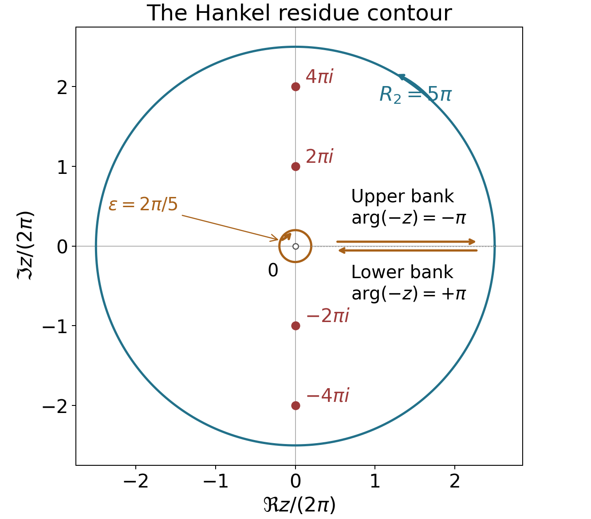

# Poisson summation, theta, and the functional equation

*Written by GPT-6.1 Sol (OpenAI) in Codex, Ultra setting, October 2026. Self-checked by the writing AI. Public domain (CC0).*

The functional equation of zeta comes from a symmetry of the Gaussian under Fourier transformation. Summing that Gaussian over the integers creates a theta series; taking its Mellin transform converts inversion of the positive real variable into reflection of the complex variable. A second route, through a contour around a branch cut, explains the special values and derives the same functional equation from residues.

We use Dirichlet series and Euler products, especially Proposition 3.1 for the Euler product and nonvanishing on $\Re s>1$, and Theorem 5.1 for
$$
\zeta(s)=\frac1{s-1}+\gamma+O(s-1).
\tag{1}
$$
We also use the proved gamma identities and continuous logarithm from The Gamma function and Stirling's formula, and the integration and residue theorems of [Complex Analysis](https://kokunoyumeto.github.io/program-matematika-indonesia/en/#course-C50). The freely readable primary comparison is Riemann’s memoir in the Wilkins transcription listed below.

Write $s=\sigma+it$. Our Fourier transform is
$$
\widehat f(\xi)=\int_{\mathbb R}f(u)e^{-2\pi iu\xi}\,du.
\tag{2}
$$
We denote the theta series by $\Theta(x)$, keeping $\theta(x)$ for the prime sum and $\vartheta(t)$ for the Riemann–Siegel phase. The completed functions are
$$
\zeta_{\mathbb Q}(s)=\pi^{-s/2}\Gamma(s/2)\zeta(s),
\qquad \xi(s)=\tfrac12s(s-1)\zeta_{\mathbb Q}(s),
\qquad \Xi(t)=\xi(1/2+it).
\tag{3}
$$
Thus $\zeta_{\mathbb Q}$ has two poles, while $\xi$ will be entire. Formula (3) also gives the dictionary with the completed zeta function used in *Weil's proof for curves and what is missing over the integers*.

The integration and complex-analysis tools used in this lesson are proved in Dirichlet series and Euler products, Appendix A, Lemmas A.1–A.4.

## Periodization and its Fourier coefficients

First we prove the uniqueness assertion needed to turn Fourier coefficients into an identity of functions.

**Lemma 1.1 (continuous Fourier uniqueness).** If a continuous one-periodic function $h$ has
$$
\int_0^1h(x)e^{-2\pi ikx}\,dx=0
\quad\text{for every }k\in\mathbb Z,
$$
then $h=0$.

**Proof.** The Fejér kernel is
$$
K_N(x)=\frac1{N+1}\left|\sum_{j=0}^Ne^{2\pi ijx}\right|^2.
$$
It is nonnegative, one-periodic, and has integral one: expansion of the square leaves exactly the $N+1$ diagonal terms after integration. If the distance of $x$ from an integer is at least $\eta>0$, the geometric-series formula gives
$$
K_N(x)\le\frac1{(N+1)\sin^2(\pi\eta)}.
$$
Uniform continuity of $h$ now proves $h*K_N\to h$ uniformly. Indeed, write the difference as $\int_0^1(h(y-x)-h(y))K_N(x)dx$. On the part within distance $\eta$ of an integer the difference is uniformly small; on the rest use the displayed bound and $2\|h\|_\infty$. On the other hand, $K_N$ is a finite linear combination of exponentials. All its convolutions with $h$ vanish by the assumed coefficients. Hence their uniform limit $h$ vanishes. $\square$

**Theorem 1.2 (Poisson summation).** Suppose $f$ and $\widehat f$ are continuous and, for some $\delta>0$,
$$
|f(u)|+|\widehat f(u)|\le C(1+|u|)^{-1-\delta}.
\tag{4}
$$
Then for every real $x$,
$$
\sum_{n\in\mathbb Z}f(n+x)
=\sum_{k\in\mathbb Z}\widehat f(k)e^{2\pi ikx}.
\tag{5}
$$
Both series converge absolutely, uniformly for $x$ in bounded intervals. In particular $\sum_nf(n)=\sum_k\widehat f(k)$.

**Proof.** The bound on $f$ makes its periodization $P(x)=\sum_nf(n+x)$ continuous and one-periodic, with uniform convergence on $[0,1]$. Absolute integration permits interchange with its Fourier coefficient:
$$
\begin{aligned}
\int_0^1P(x)e^{-2\pi ikx}dx
&=\sum_n\int_n^{n+1}f(u)e^{-2\pi iku}du\\
&=\widehat f(k).
\end{aligned}
$$
The right side of (5) converges absolutely and uniformly by (4), so it defines a continuous periodic function with those same coefficients. Their difference is zero by Lemma 1.1. Periodicity extends the uniform convergence assertion to bounded intervals. $\square$

## The Gaussian and inversion of the theta series

**Lemma 2.1.** For $a>0$,
$$
\widehat{\bigl(e^{-\pi a u^2}\bigr)}(\xi)
=a^{-1/2}e^{-\pi\xi^2/a}.
\tag{6}
$$

**Proof.** Let $g(\xi)$ be the transform on the left. Differentiation under the integral and integration by parts are justified by Gaussian decay. Since $f'(u)=-2\pi au f(u)$,
$$
g'(\xi)=\frac ia\int_{\mathbb R}f'(u)e^{-2\pi iu\xi}du
=-\frac{2\pi\xi}{a}g(\xi).
$$
Also $g(0)=a^{-1/2}$: substitution and $\Gamma(1/2)=\sqrt\pi$ give $\int_{\mathbb R}e^{-\pi u^2}du=1$. Solving the differential equation proves (6). $\square$

Define, for $x>0$,
$$
\Theta(x)=\sum_{n\in\mathbb Z}e^{-\pi n^2x},
\qquad \omega(x)=\frac{\Theta(x)-1}{2}
=\sum_{n=1}^\infty e^{-\pi n^2x}.
\tag{7}
$$
All derivatives of these series converge uniformly on compact subsets of $(0,\infty)$.

**Proposition 2.2 (Jacobi transformation).** For every $x>0$,
$$
\Theta(1/x)=\sqrt x\,\Theta(x),
\qquad
\omega(x)=x^{-1/2}\omega(1/x)+\tfrac12(x^{-1/2}-1).
\tag{8}
$$

**Proof.** Apply Theorem 1.2 at zero to $e^{-\pi xu^2}$ and use (6). This gives $\Theta(x)=x^{-1/2}\Theta(1/x)$. Subtract the constant terms to obtain the second identity. $\square$

For $x\ge1$,
$$
0<\omega(x)\le C e^{-\pi x},
\tag{9}
$$
because $e^{-\pi n^2x}\le e^{-\pi x}e^{-\pi(n^2-1)}$ and the remaining series converges. Together with (8), this describes both ends of the positive real axis.

**Example 2.3.** Direct summation gives
$$
\Theta(2)\simeq1.00373488549,\qquad
\Theta(1/2)\simeq1.41949548808.
$$
Multiplying the first number by $\sqrt2$ gives the second. The terms decay quickly: when computing $\Theta(x)$ by the terms $|n|\le N$, its omitted tail is at most
$$
\frac{2e^{-\pi x(N+1)^2}}{1-e^{-\pi x(2N+3)}}.
\tag{10}
$$
To see this, bound each successive ratio in the tail by $e^{-\pi x(2N+3)}$.

## Mellin transformation and reflection in the critical strip

**Theorem 3.1 (completed continuation).** The completed zeta function extends meromorphically to $\mathbb C$ by
$$
\zeta_{\mathbb Q}(s)
=-\frac1s+\frac1{s-1}
+\int_1^\infty\omega(x)
\left(x^{s/2}+x^{(1-s)/2}\right)\frac{dx}{x}.
\tag{11}
$$
Its only poles are simple poles at zero and one, of residues $-1$ and $1$. It satisfies $\zeta_{\mathbb Q}(s)=\zeta_{\mathbb Q}(1-s)$.

**Proof.** For $\sigma>1$, termwise integration, justified by the absolute majorant with exponent $\sigma$, gives
$$
\int_0^\infty\omega(x)x^{s/2}\frac{dx}{x}
=\sum_{n=1}^\infty(\pi n^2)^{-s/2}\Gamma(s/2)
=\zeta_{\mathbb Q}(s).
\tag{12}
$$
Split the integral at one. On $(0,1)$ insert (8), and change variables $x=1/y$ in its first term. The transformed term is $\int_1^\infty\omega(y)y^{(1-s)/2}dy/y$. The remaining terms integrate to
$$
\frac12\int_0^1(x^{(s-1)/2}-x^{s/2})\frac{dx}{x}
=\frac1{s-1}-\frac1s.
$$
This proves (11) initially on $\sigma>1$. By (9), its integral is entire: on any compact set in $s$, the integrand and each of its derivatives are bounded by a fixed power of $x$ and $\log x$ times $e^{-\pi x}$. The polar part has the specified residues. Both that part and the integral are unchanged by $s\mapsto1-s$. $\square$

**Corollary 3.2.** Zeta is meromorphic on $\mathbb C$, with only a simple pole at one, of residue one, and
$$
\zeta(1-s)=2(2\pi)^{-s}\cos(\pi s/2)\Gamma(s)\zeta(s).
\tag{13}
$$
Moreover $\zeta(0)=-1/2$.

**Proof.** Set $Q(z)=1/\Gamma(z)$. The formula
$\zeta(s)=\pi^{s/2}Q(s/2)\zeta_{\mathbb Q}(s)$ agrees with the defining series on $\sigma>1$ and gives a meromorphic continuation everywhere. The zero $Q(s/2)=s/2+O(s^2)$ cancels the pole $-1/s$ at zero, giving the stated value. At one, its prefactor is $\sqrt\pi/\Gamma(1/2)=1$, so the pole has residue one. All other possible poles are absent.

The symmetric equation gives
$$
\zeta(1-s)=\pi^{1/2-s}
\frac{\Gamma(s/2)}{\Gamma((1-s)/2)}\zeta(s).
$$
Reflection and duplication, both proved in the preceding lesson, give
$$
\frac{\Gamma(s/2)}{\Gamma((1-s)/2)}
=\frac{\cos(\pi s/2)}\pi
\Gamma(s/2)\Gamma((1+s)/2)
=2^{1-s}\pi^{-1/2}\cos(\pi s/2)\Gamma(s).
$$
Insertion proves (13) wherever the individual factors are finite, and hence as a meromorphic identity. The continuation agrees with the one in the first lesson by the identity theorem. $\square$

**Theorem 3.3 (zeros and the entire completion).** The zeros of $\zeta$ in $\sigma<0$ are exactly $-2,-4,-6,\ldots$, all simple. All remaining zeros lie in $0\le\sigma\le1$; these nontrivial zeros, with their multiplicities, are invariant under $s\mapsto1-s$ and $s\mapsto\overline s$. The function $\xi$ in (3) is entire, satisfies
$$
\xi(1-s)=\xi(s),\qquad
\xi(\overline s)=\overline{\xi(s)},\qquad
\xi(0)=\xi(1)=\tfrac12,
\tag{14}
$$
and is real on the real axis. For real $t$, $\Xi(t)$ is real and even.

**Proof.** In $\sigma>1$ the Euler product has no zeros, and neither does gamma. Hence $\zeta_{\mathbb Q}$ is nonzero there. Reflection makes it nonzero for $\sigma<0$ as well. In that left half-plane, its multiplication by $\pi^{s/2}Q(s/2)$ introduces precisely the simple zeros $s=-2,-4,\ldots$. There are no zeros for $\sigma>1$, so all others lie in the stated closed strip. We are not yet asserting nonvanishing on its two boundary lines.

Multiplying (11) by $s(s-1)/2$ removes both poles and gives an entire function, with endpoint values $1/2$. It satisfies reflection. Conjugation holds first for the zeta series and gamma integral, and then by continuation. Thus it holds for $\xi$ too. Within the closed strip the zeros of $\xi$ and of $\zeta$ agree, with multiplicity: the gamma factor is nonzero and finite except at zero, where the completed endpoint value is nonzero; one is also not a zero. Outside the strip $\xi$ has no zeros. This proves the zero symmetries. On $s=1/2+it$, reflection identifies $\xi(s)$ with $\xi(\overline s)$, so it is real and its value is unchanged by $t\mapsto-t$. $\square$

## A contour proof and the values at integers

We now give the other proof of the functional equation from [Riemann 1859], with a specified contour and an estimate at infinity. It also provides a short route to all the integer values.

Choose $0<\varepsilon<2\pi$. Let $H_\varepsilon$ run inward along the lower bank of the positive real axis from infinity to $\varepsilon$, clockwise around $|z|=\varepsilon$, and then outward along the upper bank to infinity. Use the principal $\operatorname{Log}(-z)$ on $\mathbb C\setminus[0,\infty)$: its values on the lower and upper banks are $\log x+i\pi$ and $\log x-i\pi$, respectively. Define
$$
J(s)=\int_{H_\varepsilon}
\frac{(-z)^{s-1}}{e^z-1}\,dz.
\tag{15}
$$
The rays have their limiting bank values. The small circle is clockwise; this orientation fixes the sign of every residue below.

*The contour in the proof of Theorem 4.1, with $N=2$, $R_2=5\pi$ and $\varepsilon=2\pi/5$. Coordinates are scaled by $2\pi$. The separated banks schematically show their limiting directions: upper outward, lower inward. Together with the clockwise inner and counterclockwise outer circles they bound the slit annulus positively. The four marked nonzero poles are enclosed; zero is excluded.*

**Theorem 4.1 (Hankel continuation).** The integral $J$ is entire and independent of $\varepsilon$ in $(0,2\pi)$, and
$$
\zeta(s)=\frac{\Gamma(1-s)}{2\pi i}J(s)
\tag{16}
$$
as a meromorphic identity. Enlarging this contour gives (13) without using the theta transformation.

**Proof.** For fixed $\varepsilon$, the rays decay exponentially at infinity, and the circle is compact and avoids all poles. The integrals converge locally uniformly in $s$, including after every differentiation, so $J$ is entire. Applying Cauchy's theorem to the slit annulus between two allowable radii proves independence of $\varepsilon$; there are no poles in that annulus.

For $\sigma>1$ we may let $\varepsilon\downarrow0$, since the small-circle contribution is $O_s(\varepsilon^{\sigma-1})$. The ray contributions, including their directions, give
$$
\begin{aligned}
J(s)&=\left(e^{-i\pi(s-1)}-e^{i\pi(s-1)}\right)
\int_0^\infty\frac{x^{s-1}}{e^x-1}\,dx\\
&=2i\sin(\pi s)\Gamma(s)\zeta(s).
\end{aligned}
\tag{17}
$$
The last integral identity follows by expanding $(e^x-1)^{-1}=\sum_{n\ge1}e^{-nx}$ and absolutely integrating, with majorant $\Gamma(\sigma)\zeta(\sigma)$. Reflection for gamma turns (17) into (16).

This also establishes continuation directly. The factor $\Gamma(1-s)$ has poles only at positive integers. At an integer $n$, the two rays in (15) cancel, and the circle gives
$$
J(n)=-2\pi i\mathop{\rm Res}_{z=0}
\frac{(-z)^{n-1}}{e^z-1}.
\tag{18}
$$
For $n\ge2$ the integrand is holomorphic at zero, so $J(n)=0$ and the pole of gamma is removable in (16). At $n=1$, $J(1)=-2\pi i$, while $\Gamma(1-s)=-1/(s-1)+O(1)$, producing the simple pole with residue one. There are no other poles. This reasoning is independent of (11).

To obtain the functional equation independently, suppose $\sigma<0$ and set $R_N=2\pi(N+1/2)$. Close the truncated Hankel contour by the outer circle $|z|=R_N$, traversed counterclockwise from the upper to the lower bank. It is the positively oriented boundary of a slit annulus. The enclosed poles are $z=2\pi ik$, $0<|k|\le N$, all simple with residues $(-2\pi ik)^{s-1}$.

The outer-circle integral tends to zero. Here are the bounds that justify that step. The distance of this circle from each $2\pi ik$ is at least $\pi$, by the reverse triangle inequality. On $\Re z\le-1$, $|e^z-1|\ge1-e^{-1}$; on $\Re z\ge1$, $|e^z-1|\ge(1-e^{-1})e^{\Re z}$. In the strip $|\Re z|\le1$, periodicity in $\Im z$ and the separation from the zeros give a fixed positive lower bound for $|e^z-1|$: reduce the imaginary part modulo $2\pi$ to a compact rectangle avoiding the zeros. Consequently its reciprocal is bounded uniformly on all the circles. Also
$$
|(-z)^{s-1}|\le e^{\pi|t|}R_N^{\sigma-1}.
$$
Multiplication by the circle length bounds its integral by $O_s(R_N^\sigma)$, which tends to zero. The truncated ray tails tend to zero exponentially.

The residue theorem therefore gives an absolutely convergent series
$$
\begin{aligned}
\frac{J(s)}{2\pi i}
&=\sum_{k\ne0}(-2\pi ik)^{s-1}\\
&=2(2\pi)^{s-1}\sin(\pi s/2)\zeta(1-s).
\end{aligned}
\tag{19}
$$
Indeed, the two arguments of $-2\pi ik$ are $-\pi/2$ for $k>0$ and $\pi/2$ for $k<0$. Their sum of phase factors is $2\cos(\pi(s-1)/2)=2\sin(\pi s/2)$, and $\sum_{k\ge1}k^{\sigma-1}$ converges. Equations (16) and (19) give
$$
\zeta(s)=2(2\pi)^{s-1}\Gamma(1-s)\sin(\pi s/2)\zeta(1-s).
\tag{20}
$$
Replacing $s$ by $1-s$ gives (13), first in a half-plane and then meromorphically everywhere. $\square$

Define the Bernoulli numbers by the convergent Taylor series
$$
\frac z{e^z-1}=\sum_{k=0}^\infty B_k\frac{z^k}{k!}
\quad(|z|<2\pi).
\tag{21}
$$

The singularity at zero on the left is removable. Its first coefficients are $B_0=1$, $B_1=-1/2$, $B_2=1/6$, $B_3=0$, $B_4=-1/30$. They follow by multiplying (21) by $(e^z-1)/z$ and comparing coefficients. Since $z/(e^z-1)+z/2$ is even, $B_{2k+1}=0$ for $k\ge1$. The convention $B_1=-1/2$ agrees with the first lesson.

**Theorem 4.2 (integer values).** For every integer $n\ge0$ and every integer $k\ge1$,
$$
\zeta(-n)=\frac{(-1)^n B_{n+1}}{n+1},
\qquad
\zeta(2k)=\frac{(-1)^{k+1}(2\pi)^{2k}B_{2k}}{2(2k)!}.
\tag{22}
$$
Also
$$
\zeta'(0)=-\tfrac12\log(2\pi),
\qquad \frac{\zeta'(0)}{\zeta(0)}=\log(2\pi).
\tag{23}
$$

**Proof.** At $s=-n$, the integrand in (18) is
$$
(-1)^{n+1}z^{-n-1}\frac1{e^z-1}.
$$
Its residue is $(-1)^{n+1}B_{n+1}/(n+1)!$ by (21). Multiply (18) by $\Gamma(1+n)/(2\pi i)=n!/(2\pi i)$ to obtain the negative-value formula, including zero. Set $s=2k$ in (13), use $\Gamma(2k)=(2k-1)!$ and $\cos\pi k=(-1)^k$, and insert $\zeta(1-2k)=-B_{2k}/(2k)$. Solving gives the positive-value formula.

For the derivative, put $s=w$ in (20) and let $w\to0$. Proposition 5.1 in the gamma lesson gives
$$
\Gamma(1-w)=1+\gamma w+O(w^2),
\qquad \zeta(1-w)=-\frac1w+\gamma+O(w).
$$
Their product is $-1/w+O(w)$: the two constant contributions cancel. Moreover
$$
2(2\pi)^{w-1}\sin(\pi w/2)
=\frac w2\bigl(1+w\log(2\pi)+O(w^2)\bigr).
$$
Thus $\zeta(w)=-1/2-w\log(2\pi)/2+O(w^2)$, proving (23). $\square$

**Example 4.3.** The coefficients just computed give
$$
\zeta(2)=\frac{\pi^2}6,\quad
\zeta(4)=\frac{\pi^4}{90},\quad
\zeta(-1)=-\frac1{12},\quad
\zeta(-3)=\frac1{120}.
$$
The negative even values vanish because the corresponding odd Bernoulli numbers vanish. The theorem says nothing comparable about a closed evaluation of $\zeta(3)$.

An integer is critical for the two gamma factors in the symmetric equation if neither $\Gamma(s/2)$ nor $\Gamma((1-s)/2)$ has a pole there. The poles proved in the gamma lesson show directly that these integers are exactly $2k$ and $1-2k$ for $k\ge1$. Thus the paired special values in (22) occur at precisely these integers.

## A shifted sum: Hurwitz zeta

The same separation of a singular small-variable expansion from an exponentially decaying tail works without the theta symmetry.

**Proposition 5.1.** For $0<a\le1$, the series
$$
\zeta(s,a)=\sum_{n=0}^\infty(n+a)^{-s}\quad(\sigma>1)
\tag{24}
$$
has a meromorphic continuation with only a simple pole at one, of residue one, and
$$
\zeta(0,a)=\tfrac12-a.
\tag{25}
$$

**Proof.** Absolute integration of the geometric series gives
$$
\Gamma(s)\zeta(s,a)=\int_0^\infty t^{s-1}K_a(t)dt,
\qquad K_a(t)=\frac{e^{-at}}{1-e^{-t}}.
$$
At infinity $K_a$ decays exponentially. At zero it has the convergent Laurent expansion
$$
K_a(t)=\sum_{j=0}^{M-1}c_jt^{j-1}+O_a(t^{M-1}),
\qquad c_0=1,\quad c_1=\tfrac12-a,
\tag{26}
$$
for every integer $M\ge1$. The coefficients exist because $tK_a(t)$ is analytic near zero. On $\sigma>1-M$, define
$$
\begin{aligned}
F_M(s)={}&\int_1^\infty t^{s-1}K_a(t)dt\\
&+\int_0^1 t^{s-1}
 \left(K_a(t)-\sum_{j=0}^{M-1}c_jt^{j-1}\right)dt
+\sum_{j=0}^{M-1}\frac{c_j}{s+j-1}.
\end{aligned}
\tag{27}
$$
The remainder integral is locally uniformly convergent there, as are its $s$ derivatives. Thus $F_M$ is meromorphic in that half-plane and agrees with $\Gamma(s)\zeta(s,a)$ for $\sigma>1$. Multiplication by the entire function $Q(s)=1/\Gamma(s)$ removes the possible simple poles at $s=0,-1,-2,\ldots$, because $Q$ has simple zeros at precisely those points. The remaining pole at one has residue $c_0Q(1)=1$. As $M$ varies, these continuations agree on overlaps by the identity theorem, and their domains cover the plane.

Take $M\ge2$ near zero. There $F_M(s)=c_1/s+O(1)$ and $Q(s)=s+O(s^2)$, so their product at zero is $c_1=1/2-a$. This proves (25). $\square$

For example $\zeta(0,1/3)=1/6$ and $\zeta(0,1)= -1/2$. At $a=1/2$, separating the odd positive integers gives
$$
\zeta(s,1/2)=(2^s-1)\zeta(s),
$$
first for $\sigma>1$ and then by continuation; at zero both sides vanish, agreeing with (25).

## Exercises

1. **Easy.** Derive (13) from the symmetric functional equation using gamma reflection and duplication.

2. **Medium.** Prove that $\Xi(t)$ is real and even for real $t$, and show
   $$
   \zeta(1/2+it)=e^{-2i\vartheta(t)}\zeta(1/2-it),
   \tag{28}
   $$
   where $\vartheta$ is the continuous phase defined in the gamma lesson.

3. **Medium.** Compute $\zeta'(0)$ from the functional equation and the Laurent expansion (1). Explain the cancellation involving Euler's constant.

4. **Medium.** Compute $\zeta(-1)$ and $\zeta(-3)$ both from Bernoulli numbers and from $\zeta(2)$ and $\zeta(4)$ in (13).

5. **Hard.** Give the Hankel proof of continuation and the functional equation. Specify the branch and orientation, justify cancellation of the gamma poles, and prove the outer-contour integral tends to zero.

6. **Hard.** Continue $\zeta(s,a)$ for $0<a\le1$ and evaluate it at zero by subtracting its small-variable kernel expansion.

## Solutions

**Solution 1.** Write $\pi^{-(1-s)/2}\Gamma((1-s)/2)\zeta(1-s)=\pi^{-s/2}\Gamma(s/2)\zeta(s)$. Reflection at $(1-s)/2$ gives
$$
\frac1{\Gamma((1-s)/2)}
=\frac{\cos(\pi s/2)}\pi\Gamma((1+s)/2).
$$
Duplication at $s/2$ gives $\Gamma(s/2)\Gamma((1+s)/2)=2^{1-s}\sqrt\pi\Gamma(s)$. Combining the powers of $\pi$ yields $2^{1-s}\pi^{-s}=2(2\pi)^{-s}$, proving (13). These manipulations first hold away from poles and then extend meromorphically.

**Solution 2.** For $s=1/2+it$, $1-s=\overline s$. Equations (14) give $\xi(s)=\xi(\overline s)=\overline{\xi(s)}$, proving reality. Replacing $t$ by $-t$ gives the same value, proving evenness. Let $A(s)=\pi^{-s/2}\Gamma(s/2)$. It is nonzero and finite at these points, and $A(\overline s)=\overline{A(s)}$. Completed reflection gives
$$
\zeta(s)=\frac{\overline{A(s)}}{A(s)}\zeta(\overline s).
$$
The continuous logarithm $L$ in the gamma lesson gives
$A(s)=\exp(L(1/4+it/2)-(s/2)\log\pi)$. The imaginary part of $L(1/4+it/2)-(s/2)\log\pi$ is exactly $\vartheta(t)$. Therefore $\overline{A(s)}/A(s)=e^{-2i\vartheta(t)}$, proving (28) even at zeros, since no division by zeta was used.

**Solution 3.** Equation (20) gives a product with a factor vanishing to first order and a factor with a simple pole. Write
$$
\Gamma(1-w)\zeta(1-w)
=(1+\gamma w+O(w^2))(-1/w+\gamma+O(w))
=-1/w+O(w).
$$
The $+\gamma$ and $-\gamma$ contributions cancel. The remaining factor is
$w/2+w^2\log(2\pi)/2+O(w^3)$. Multiplication gives $\zeta(w)=-1/2-w\log(2\pi)/2+O(w^2)$, hence $\zeta'(0)=-\log(2\pi)/2$. Dividing by $\zeta(0)=-1/2$ gives $\log(2\pi)$.

**Solution 4.** Formula (22) gives $\zeta(-1)=-B_2/2=-1/12$ and $\zeta(-3)=-B_4/4=1/120$. Independently, (13) at $s=2$ gives
$$
\zeta(-1)=-\frac{2}{(2\pi)^2}\Gamma(2)\zeta(2)
=-\frac{2}{4\pi^2}\frac{\pi^2}6=-\frac1{12}.
$$
At $s=4$ it gives
$$
\zeta(-3)=\frac{2}{(2\pi)^4}\Gamma(4)\zeta(4)
=\frac{12}{16\pi^4}\frac{\pi^4}{90}=\frac1{120}.
$$
Both calculations include the cosine sign and the factorial $\Gamma(4)=6$.

**Solution 5.** Take the clockwise contour $H_\varepsilon$ and principal $\operatorname{Log}(-z)$ specified before (15). Exponential decay on its two rays and compactness of its circle make $J(s)$ entire; Cauchy's theorem in a slit annulus makes it independent of $\varepsilon<2\pi$. For $\sigma>1$, shrinking the circle gives
$$
J(s)=2i\sin(\pi s)\int_0^\infty\frac{x^{s-1}}{e^x-1}dx
=2i\sin(\pi s)\Gamma(s)\zeta(s).
$$
Gamma reflection gives (16). At each positive integer $n\ge2$ the ray values agree and cancel. The remaining clockwise circle integrates a function holomorphic at zero, so $J(n)=0$ and the gamma pole cancels. At one its residue is one, so $J(1)=-2\pi i$, and the residue in (16) is one.

For $\sigma<0$, close the truncated contour by the counterclockwise circle of radius $2\pi(N+1/2)$. The full boundary is positively oriented around the poles $2\pi ik$ with $0<|k|\le N$. The reciprocal of $e^z-1$ is uniformly bounded on these circles: outside $|\Re z|\le1$ use $1-e^{-1}$ and $(1-e^{-1})e^{\Re z}$, while inside that strip reduce modulo $2\pi i$ and use the distance at least $\pi$ from every zero. The factor $(-z)^{s-1}$ has modulus at most $e^{\pi|t|}R^{\sigma-1}$, so the outer integral is $O_s(R^\sigma)\to0$. Thus
$$
\frac{J(s)}{2\pi i}
=\sum_{k\ne0}(-2\pi ik)^{s-1}
=2(2\pi)^{s-1}\sin(\pi s/2)\zeta(1-s),
$$
with an absolutely convergent sum because $\sigma-1<-1$. Multiplication by $\Gamma(1-s)$ proves (20), and continuation followed by $s\mapsto1-s$ proves (13). This establishes the entire second route with its limits and signs.

**Solution 6.** For $\sigma>1$, expand $e^{-at}/(1-e^{-t})=\sum_{n\ge0}e^{-(n+a)t}$ and integrate absolutely to obtain $\Gamma(s)\zeta(s,a)$. At zero,
$$
K_a(t)=t^{-1}+(1/2-a)+O_a(t),
$$
and its Laurent series can be subtracted to any order, since $tK_a$ is analytic near zero. After subtracting $\sum_{j=0}^{M-1}c_jt^{j-1}$ on $(0,1)$, the remainder integral converges for $\sigma>1-M$; adding $\sum_jc_j/(s+j-1)$ restores the original expression. This is precisely (27), and its derivatives converge locally uniformly away from the indicated rational poles. Multiplying by $Q(s)$ cancels every pole at $s\le0$ in this list; at one $Q(1)=1$ gives residue one. The compatible half-planes for arbitrary $M$ cover $\mathbb C$. Near zero, $F_M(s)=(1/2-a)/s+O(1)$ and $Q(s)=s+O(s^2)$, so $\zeta(0,a)=1/2-a$.

## What this lesson assumes

The internal preceding lessons supply the Euler product, the Laurent constant of zeta, and all gamma identities used here. Basic complex integration comes from Complex Analysis. Poisson summation, both functional-equation arguments and the special-value formulas are proved in this lesson. Nonvanishing on the boundary of the critical strip, the zero count and the Hadamard product belong to later lessons.

## Freely readable sources

- B. Riemann, [*Ueber die Anzahl der Primzahlen unter einer gegebenen Grösse*](https://www.claymath.org/wp-content/uploads/2023/04/Wilkins-transcription.pdf) (1859), freely readable D. R. Wilkins transcription, December 1998, 10 pages. Transcription pages 2–4: contour and theta arguments.
