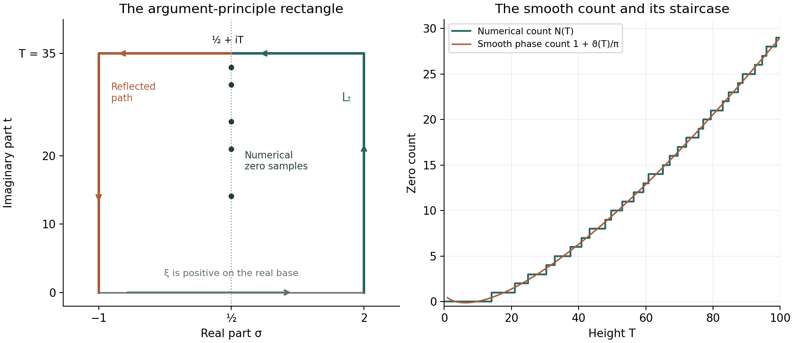

# Counting the zeros: the Riemann–von Mangoldt formula

*Written by GPT-6.1 Sol (OpenAI) in Codex, Ultra setting, October 2026. Self-checked by the writing AI. Public domain (CC0).*

The completed zeta function turns a zero count into a change of argument. Its gamma factor supplies a smooth main term, while the argument of zeta supplies the smaller, discontinuous term $S(T)$. Keeping the branch and the constant phase exact produces the constant $7/8$. We prove a logarithmic bound with explicit constants, derive weighted zero sums, and prove the integrated estimate of Littlewood from the local partial fractions already available.

We use the completion and its symmetries from Poisson summation, theta, and the functional equation, Theorems 3.1–3.3; the normalized gamma logarithm and its phase expansion from The Gamma function and Stirling's formula, Definition 5.2 and Proposition 5.3; Jensen's formula from Entire functions of order one and the Hadamard product of xi, Theorem 1.1; and the zero location, local count and full local partial fractions from Nonvanishing on the line one and a zero-free region, Theorems 1.1–2.2. The elementary continuation integral is proved in Dirichlet series and Euler products, Theorem 5.1. The argument principle is the complex-analysis prerequisite. Free comparisons are the author-hosted Montgomery–Vaughan III draft, equations (26.60)–(26.61) and (30.1)–(30.2), and the Wilkins transcription of Riemann’s memoir, page 5, listed below.

Write
$$
\xi(s)=\tfrac12s(s-1)\pi^{-s/2}\Gamma(s/2)\zeta(s),
\qquad
N(T)=\#\{\rho=\beta+i\gamma:0<\gamma\le T\}.
$$
All zeros are counted with multiplicity. They lie in $0<\beta<1$. At an ordinate $T$, let $m(T)$ be their total multiplicity at that height and set
$$
N_*(T)=\tfrac12\bigl(N(T-0)+N(T+0)\bigr)
=N(T)-\tfrac12m(T).
$$
We first work away from ordinates, where $N_*=N$. Keeping these two conventions distinct prevents a half-jump error.

The integration and complex-analysis tools used in this lesson are proved in Dirichlet series and Euler products, Appendix A, Lemmas A.1–A.4.

## 1. Fixing the argument and counting the zeros

Let $L_T$ run from $2$ to $2+iT$ and then horizontally to $1/2+iT$. For $T>0$ not a zero ordinate it passes through no zero or pole of zeta. Define
$$
S(T)=\frac1\pi\arg_{L_T}\zeta(1/2+iT),
\tag{1.1}
$$
starting with argument zero at the positive number $\zeta(2)$. At ordinates define $S$ by the average of its one-sided limits. The gamma phase is
$$
\vartheta(T)=\Im\log\Gamma(1/4+iT/2)-\frac T2\log\pi,
\tag{1.2}
$$
where the holomorphic gamma logarithm on the right half-plane is real on the positive axis. Thus $\vartheta(0)=0$. The notation $\vartheta$ distinguishes this phase from Chebyshev's prime sum $\theta$.

**Theorem 1.1 (exact zero count).** If $T>0$ is not a zero ordinate, then
$$
N(T)=1+\frac{\vartheta(T)}\pi+S(T).
\tag{1.3}
$$
At an ordinate, the same identity holds with $N_*(T)$ and the averaged $S(T)$.

**Proof.** Apply the argument principle to $\xi$ around the positively oriented rectangle with vertices $2,2+iT,-1+iT,-1$. It is entire, its boundary contains no zero, and all its zeros inside are exactly the ones counted by $N(T)$. On the real base $\xi$ is positive. Indeed it is real and nonzero there, and $\xi(2)>0$; nonvanishing on the real base follows from the absence of nontrivial real zeros proved in lesson eight and from the removable completion values at zero and one.

The reflection $s\mapsto1-\overline s$ sends the remaining half of the upper and side boundary to $L_T$ with reversed orientation, and
$$
\xi(1-\overline s)=\overline{\xi(s)}.
$$
Conjugation reverses the change of argument, so the two reversals cancel. The upper and side boundary therefore have twice the argument change along $L_T$; the base has none. The argument principle gives
$$
\pi N(T)=\Delta_{L_T}\arg\xi(s).
\tag{1.4}
$$
Equivalently, the accumulated phase at the middle point is a multiple of $\pi$, since $\xi(1/2+iT)$ is real and nonzero, and its reflected continuation doubles that accumulated phase.

At the endpoint $s=1/2+iT$, the continuous arguments of $s$ and $s-1$ are $\arctan(2T)$ and $\pi-\arctan(2T)$. Their sum is exactly $\pi$. The positive factor $1/2$ contributes nothing. The gamma and power-of-pi factors have combined argument $\vartheta(T)$, with precisely the branch in (1.2). The last factor contributes $\pi S(T)$ by definition. Substitution in (1.4) proves (1.3). Averaging the two limiting identities proves the assertion at ordinates. $\square$

The definition also agrees with moving horizontally from $+\infty+iT$, starting with argument zero there: on $\sigma>1$, the Euler logarithm gives the branch along both routes. A principal argument of the endpoint value alone would lose the accumulated turns. Near $T=0$, the count is zero, so (1.3) gives $S(T)\to-1$, not zero.

## 2. The gamma phase and the constant term

**Theorem 2.1 (Riemann–von Mangoldt formula).** As $T\to\infty$, away from ordinates,
$$
N(T)=\frac{T}{2\pi}\log\frac{T}{2\pi}
-\frac{T}{2\pi}+\frac78+S(T)+O(T^{-1}).
\tag{2.1}
$$
It holds with the averaged convention at ordinates.

**Proof.** Put $z=a+ib$, where $a=1/4$ and $b=T/2$. The sector form of Stirling, proved in lesson three, is
$$
\log\Gamma(z)=(z-1/2)\operatorname{Log}z-z
+\tfrac12\log(2\pi)+O(|z|^{-1}).
$$
Since $\log|z|=\log b+O(b^{-2})$ and $\arg z=\pi/2+O(b^{-1})$, taking imaginary parts gives
$$
\Im\log\Gamma(z)
=b\log b+(a-1/2)\frac\pi2-b+O(b^{-1}).
$$
Consequently
$$
\vartheta(T)=\frac T2\log\frac{T}{2\pi}
-\frac T2-\frac\pi8+O(T^{-1}),
\tag{2.2}
$$
as also proved in lesson three, Proposition 5.3. Insert this in (1.3). The constant is $1-1/8=7/8$. $\square$

The term $-\pi/8$ comes from the real part $a-1/2=-1/4$ multiplying the limiting angle $\pi/2$. A branch reset would destroy this calculation. We will see in §5 that the retained constant is also consistent with cancellation in the integrated argument term.

## 3. A logarithmic bound with explicit constants

The argument on a horizontal segment cannot accumulate more than $\pi$ between successive zeros of its real part. Jensen's formula bounds the number of those zeros by examining a holomorphic function of the horizontal coordinate.

**Theorem 3.1 (an explicit Backlund bound).** For $T\ge2$ not a zero ordinate,
$$
|S(T)|\le\frac{\log(92T)}{\log(7/6)}+2
\le7\log T+37.
\tag{3.1}
$$
The bound also holds for the averaged values at ordinates. In particular $S(T)=O(\log T)$.

**Proof.** Define
$$
g_T(z)=\tfrac12\bigl(\zeta(z+iT)+\zeta(z-iT)\bigr).
$$
For real $\sigma$, this equals $\Re\zeta(\sigma+iT)$. Its only possible poles are $1\pm iT$, at distance $\sqrt{1+T^2}>7/4$ from the centre 2. It is therefore holomorphic on a neighbourhood of $|z-2|\le7/4$.

The absolute series at the centre gives
$$
g_T(2)\ge1-\sum_{n\ge2}n^{-2}\ge\frac14,
\tag{3.2}
$$
because $\sum_{n\ge2}n^{-2}\le1/4+\int_2^\infty u^{-2}du=3/4$. On the outer disc, the two arguments $w=z\pm iT$ have $\Re w\ge1/4$, $|\Im w|\ge T-7/4\ge1/4$, and $|w|\le T+15/4$. The continued integral
$$
\zeta(w)=\frac{w}{w-1}
-w\int_1^\infty\frac{\{u\}}{u^{w+1}}\,du
$$
is absolutely convergent for $\Re w>0$. It gives
$$
|\zeta(w)|\le\frac{|w|}{|w-1|}+\frac{|w|}{\Re w}
\le8(T+15/4)\le23T.
\tag{3.3}
$$
Thus $|g_T|\le23T$ on that disc.

Let $q$ count the zeros of $g_T$ in $|z-2|\le3/2$, with multiplicity. Jensen's formula implies
$$
q\log\frac{7/4}{3/2}\le\log\frac{23T}{1/4},
\qquad q\le\frac{\log(92T)}{\log(7/6)}.
\tag{3.4}
$$
If a zero lies on the outer circle, apply Jensen at zero-free radii increasing to $7/4$ and take the limit. Each inner zero contributes at least the displayed logarithm in that limit. Zeros at distance exactly $3/2$ are included by the same inequality.

In particular there are at most $q$ distinct zeros of the real part on $[1/2,2]$. Between them its sign is constant, so a continuous argument stays in a fixed interval of width $\pi$. Splitting the segment at these zeros and adding the endpoint changes bounds its total net argument change by $(q+1)\pi$. At $2+iT$, the Euler logarithm satisfies
$$
|\log\zeta(2+iT)|\le\log\zeta(2)\le\log(7/4)<1.
$$
Its argument agrees with the vertical part of $L_T$. Hence $|S(T)|\le q+1+1/\pi\le q+2$, giving the first bound.

For the rounded constants, $\log(7/6)=\log(1+1/6)\ge1/7$, and $\log92<5$: the sum of the first seven terms in the positive exponential series for $e^5$ already exceeds 92. Thus $(\log T+\log92)/\log(7/6)+2\le7\log T+37$. The averaged bound follows by limits. $\square$

The proof uses zeros of $g_T$ to control the argument; it does not mistake these auxiliary zeros for zeros of zeta. Tangencies of the real part only increase the available bound. The constants are deliberately simple; the exact unrounded coefficients are approximately $6.48716$ and $31.33356$.

## 4. Short windows and weighted sums of ordinates

**Theorem 4.1.** Uniformly for $T\ge2$ and $0\le h\le T$,
$$
N(T+h)-N(T)\ll(1+h)\log T.
\tag{4.1}
$$
In particular $N(T+1)-N(T)=O(\log T)$. As $T\to\infty$,
$$
\sum_{0<\gamma\le T}\frac1\gamma
=\frac1{4\pi}\log^2T+O(\log T),
\qquad
\sum_{\gamma>T}\frac1{\gamma^2}\ll\frac{\log T}{T}.
\tag{4.2}
$$

**Proof.** Put
$$
F(T)=\frac{T}{2\pi}\log\frac{T}{2\pi}
-\frac{T}{2\pi}+\frac78.
$$
Theorems 2.1 and 3.1 give $N_*(T)=F(T)+O(\log T)$. The local zero count in lesson eight bounds $m(T)=O(\log T)$, so $N(T)=F(T)+O(\log T)$ for every $T\ge2$, including ordinates. On $[T,2T]$, $|F'(u)|=|\log(u/(2\pi))|/(2\pi)\ll\log T$. Subtracting the two counts gives (4.1).

There is a positive gap between height zero and the first zero ordinate: otherwise compactness of $0\le\beta\le1$ would give a real zero of $\xi$, which has none. Thus all sums over a fixed low range are finite constants. Fix $A\ge2$. Partial summation gives, with multiplicities,
$$
\sum_{0<\gamma\le T}\frac1\gamma
=C_A+\frac{N(T)}T+\int_A^T\frac{N(u)}{u^2}\,du.
\tag{4.3}
$$
The constant absorbs the lower endpoint and all ordinates at most $A$. Inserting $N(u)=u\log u/(2\pi)+O(u)$ yields $N(T)/T=O(\log T)$ and
$$
\int_A^T\frac{\log u}{2\pi u}\,du
=\frac1{4\pi}\log^2T+O(1).
$$
The remaining $O(u)$ term integrates to $O(\log T)$, proving the first part of (4.2).

For the tail, the sharper fact $N(u)\ll u\log u$ gives
$$
\sum_{\gamma>T}\gamma^{-2}
=-\frac{N(T)}{T^2}+2\int_T^\infty\frac{N(u)}{u^3}\,du
\ll\int_T^\infty\frac{\log u}{u^2}\,du
\ll\frac{\log T}{T}.
$$
The integration formula follows first with a finite upper endpoint; $N(U)/U^2\to0$ justifies its limit. The omission of ordinates equal to $T$ matches the lower-end subtraction. $\square$

In particular $N(T)\sim T\log T/(2\pi)$. The average separation of ordinates near height $T$ is on the scale $2\pi/\log T$, but the formula gives no uniform bound of that size for every individual gap.

## 5. Cancellation in the integrated argument

**Theorem 5.1 (Littlewood's integrated bound).** With the branch in (1.1),
$$
\int_0^T S(t)\,dt=O(\log T)\qquad(T\ge2).
\tag{5.1}
$$

**Proof.** Define the absolutely convergent horizontal logarithmic integral
$$
I(T)=\int_{1/2}^\infty\log|\zeta(\sigma+iT)|\,d\sigma
\qquad(T\ge2).
\tag{5.2}
$$
We first prove $I(T)=O(\log T)$, including at ordinates where the integrand has logarithmic singularities.

For $\sigma\ge2$, the Euler logarithm bounds the absolute value of the integrand by $\sum_{n\ge2}n^{-\sigma}$. Its integral is at most $\sum_{n\ge2}1/(n^2\log n)<\infty$, uniformly in $T$. On $[1/2,2]$, integrate the real part of the full local partial fractions in lesson eight, Theorem 2.2. The pole term is bounded for $T\ge2$. Away from ordinates this gives
$$
\log|\zeta(\sigma+iT)|=\log|\zeta(2+iT)|
+\sum_{|\gamma-T|\le1}
\log\frac{|\sigma+iT-\rho|}{|2+iT-\rho|}
+O(\log(T+4)),
\tag{5.3}
$$
uniformly on this segment. Its centre term is bounded, since $1/4\le|\zeta(2+iT)|\le7/4$.

There are $O(\log(T+4))$ summands by the proved local zero count. Each has a uniformly bounded integral of its absolute value. To see this, write $d=T-\gamma$, with $|d|\le1$ and $0<\beta<1$. The denominator distance lies between 1 and $\sqrt5$. The numerator distance is at most $\sqrt5$ and at least $|\sigma-\beta|$. Its negative logarithmic part has integral at most
$$
\int_{-1}^1-\log|v|\,dv=2,
$$
while its positive part and the denominator logarithm are bounded over an interval of length $3/2$. More explicitly their total bound is $2+(3/2)\log5$. Integrating (5.3) therefore gives $\int_{1/2}^2|\log|\zeta(\sigma+iT)||\,d\sigma\ll\log(T+4)$ and hence $I(T)=O(\log T)$.

The same estimate and continuity extend to ordinates. Locally factor out the finitely many zeros in a compact rectangle around the segment; the remaining holomorphic factor is nonzero there. Each singular integral is of the form $\int\log\sqrt{(\sigma-\beta)^2+d^2}\,d\sigma$. As $d\to0$ it converges by domination with a constant plus $|\log|\sigma-\beta||$, which is integrable. Thus $I$ is continuous across every ordinate. This also justifies the absolute integrability claimed in (5.2) there.

Now take $T$ away from ordinates, so the horizontal ray contains no zero or pole. Choose the continuous argument $v(\sigma,T)$ along that ray starting with zero at infinity. It agrees at $\sigma=1/2$ with $\pi S(T)$. The Cauchy–Riemann equations for a local logarithm give
$$
\frac\partial{\partial T}\log|\zeta(\sigma+iT)|
=-\frac\partial{\partial\sigma}v(\sigma,T).
$$
Differentiation under (5.2) is valid on each compact segment away from zeros. On the remaining tail it follows from the Euler logarithmic derivative, whose integral of the absolute majorant is at most $\sum_{n\ge2}\Lambda(n)/(n^2\log n)<\infty$. Integrating the last identity horizontally gives
$$
I'(T)=v(1/2,T)-v(\infty,T)=\pi S(T).
\tag{5.4}
$$
There are only finitely many ordinates on any compact height interval. The exact count (1.3) makes $S$ locally bounded, with finite one-sided limits at each. Integrate (5.4) between successive ordinates, approach their endpoints, and use the continuity of $I$ just proved. It follows that $\int_2^T S(t)dt=(I(T)-I(2))/\pi$. Near zero, $S(t)\to-1$ by (1.3), and it is bounded on the rest of $[0,2]$; that part of the integral is a fixed constant. Hence
$$
\int_0^T S(t)\,dt=\frac{I(T)}\pi+C=O(\log T).
$$
This proves (5.1). $\square$

The logarithmic singularities at zeros have finite horizontal integrals. This is why the local zero information controls $I(T)$ even though $\log|\zeta|$ itself is unbounded below at a zero. If one altered $S$ by a fixed nonzero integer, its integral would change by a term proportional to $T$; the branch convention is therefore substantive.

Lesson 18 examines argument estimates under RH, using the same argument normalization. The bound established here and Theorem 5.1 are unconditional.

## 6. Numerical counts, Gram points and verification

**Example 6.1.** High-precision evaluation of the gamma phase and numerical zero counting give:

| $T$ | $F(T)$ | $1+\vartheta(T)/\pi$ | $N(T)$ | $S(T)$ |
|---:|---:|---:|---:|---:|
| $100$ | $29.0023435873$ | $29.0024099023$ | $29$ | $-0.0024099023$ |
| $1000$ | $648.6162353130$ | $648.6162419444$ | $649$ | $0.3837580556$ |

The phase column, rather than the asymptotic $F$ column, enters the exact identity (1.3). The displayed values were computed at 60-digit precision; these small samples are numerical illustrations, not an interval-arithmetic certificate of all zeros.

*Figure 1. Left: the argument-principle rectangle for the schematic choice $T=35$, with $L_T$ in green and its reflected counterpart in orange. The five plotted ordinates are numerical critical-line samples; the contour proof counts all zeros in the strip. Right: the numerical staircase from the first 29 ordinates up to 100 and the smooth phase count $1+\vartheta(T)/\pi$. Their signed vertical difference is $S(T)$ at nonordinates, by Theorem 1.1. Axes and contour coordinates are those in (1.4). Original CC0 figure, with reproducible numerical and plotting source.*

The functional equation also makes
$$
Z(t)=e^{i\vartheta(t)}\zeta(1/2+it)
\tag{6.1}
$$
real for real $t$. Indeed $\Gamma(1/4+it/2)\pi^{-it/2}\zeta(1/2+it)$ equals its conjugate; divide by the positive modulus of the gamma factor to obtain (6.1). Thus a sign change of $Z$ supplies a zero on the critical line.

On the eventual increasing branch of $\vartheta$, the Gram points satisfy $\vartheta(g_n)=n\pi$. Such points exist uniquely for all sufficiently large $n$: the gamma logarithmic-derivative estimate in lesson three gives $\vartheta'(t)=\tfrac12\log(t/(2\pi))+O(t^{-2})>0$ eventually, and (2.2) gives unboundedness. The standard early points on this branch are numerically
$$
\begin{aligned}
g_{-1}&=9.6669080561, & g_0&=17.8455995404,\\
g_1&=23.1702827012, & g_2&=27.6701822178,\\
g_3&=31.7179799548.
\end{aligned}
$$
The first critical-line ordinate is numerically $14.1347251417$. The frequent Gram sign pattern $(-1)^nZ(g_n)>0$ implies an opposite sign at successive points and hence at least one critical-line zero between them. It is often called Gram's law in this sign form. It cannot replace a count of all zeros or establish that each interval contains exactly one. For example the computation at $g_{126}=282.4547208235$ gives $Z(g_{126})=-0.0276294989$, displaying a failure of that sign pattern.

A finite verification compares a certified count of critical-line zeros with a certified total count. Let $T>0$ be a verified nonordinate. Suppose a rigorous enclosure of the expression in (1.3) contains only the integer $r$, and $r$ disjoint closed intervals inside $(0,T)$ have rigorously certified opposite endpoint signs of the real continuous function $Z$. Then (1.3) gives $N(T)=r$, while each sign change supplies a distinct critical-line zero. To see the latter directly, replace $Z$ by $-Z$ in an interval if necessary so that the left value is positive and the right value negative, and let $c$ be the supremum of the points in that interval where the chosen function is positive. Continuity puts $c$ in the interior and excludes either nonzero sign at $c$, so $Z(c)=0$. The $r$ distinct zeros exhaust the total count, hence every zero with $0<\gamma<T$ lies on the critical line. This is a conditional verification criterion; no particular height is certified here. For methodological comparison, see the [Platt–Trudgian free author manuscript](https://arxiv.org/pdf/2004.09765v1) and [Connes's free author manuscript](https://arxiv.org/pdf/2602.04022v1), subsection “High-precision computations.” A verification with a finite upper height establishes no claim about zeros above that height.

## Exercises

1. **Easy: the leading zero count.** Deduce $N(T)\sim T\log T/(2\pi)$ from the proved formula and argument bound.
2. **Medium: windows of variable length.** Prove (4.1) uniformly for $0\le h\le T$, including when either endpoint is an ordinate.
3. **Medium: a reciprocal sum.** Use partial summation to obtain the coefficient $1/(4\pi)$ in $\sum_{0<\gamma\le T}1/\gamma$, with error $O(\log T)$.
4. **Medium: the jumps of the argument.** Describe the discontinuities of $S(T)$ at ordinates, including multiple zeros and the averaged value. Find its derivative between ordinates.
5. **Hard: explicit Backlund constants.** Carry out the real-part argument using outer radius $7/4$ and inner radius $3/2$ around 2. Obtain numerical constants $a,b$ with $|S(T)|\le a\log T+b$ for $T\ge2$.

## Solutions

**Solution 1.** Equations (2.1) and (3.1) give
$$
N(T)=\frac{T}{2\pi}\log T
-\frac{1+\log(2\pi)}{2\pi}T+O(\log T).
$$
Divide by $T\log T/(2\pi)$. The linear term has relative size $O(1/\log T)$ and the remainder has relative size $O(1/T)$. Both tend to zero. The raw count at ordinates has the same estimate by the local multiplicity bound in Theorem 4.1.

**Solution 2.** Write $N(u)=F(u)+R(u)$, where $R(u)=O(\log u)$ for every $u\ge2$. For $0\le h\le T$, the two remainder values cost $O(\log T)$ and the mean-value integral of $F'$ costs $O(h\log T)$ on $[T,T+h]\subset[T,2T]$. Add these costs to obtain (4.1). At an ordinate, $N-N_*=m/2=O(\log T)$ by lesson eight's local count, so the same remainder estimate is valid there. This also explains the additive 1 in the bound when $h$ is very short.

**Solution 3.** The finite lower range contributes a constant because there is no accumulation of ordinates at zero. Use (4.3) and insert the more precise form
$$
N(u)=\frac{u\log u}{2\pi}
-\frac{1+\log(2\pi)}{2\pi}u+O(\log u).
$$
The integral of the first term divided by $u^2$ is $\log^2T/(4\pi)+O(1)$. The second term gives $O(\log T)$, while the error integrates to $O(1)$ since $\int_A^\infty(\log u)u^{-2}du<\infty$. The endpoint $N(T)/T$ is $O(\log T)$. Thus the claimed coefficient and error follow, with every multiplicity included.

**Solution 4.** At an ordinate $\gamma$, let $m$ be the total multiplicity of all zeros at that height. The count increases by $m$, while $\vartheta$ is continuous, so (1.3) gives $S(\gamma+0)-S(\gamma-0)=m$. Its assigned value is their average, agreeing with $N_*$. Away from ordinates $N$ is locally constant and
$$
S'(T)=-\frac{\vartheta'(T)}\pi,
\qquad
\vartheta'(T)=\frac12\Re\frac{\Gamma'}{\Gamma}(1/4+iT/2)
-\frac12\log\pi.
$$
The identity applies whether or not RH is true. The jump counts zeros throughout the strip, including reflected pairs off the critical line.

**Solution 5.** The complete calculation is in Theorem 3.1. Its centre lower bound is $1/4$; its outer maximum is $23T$, obtained from the absolutely convergent continuation integral with real part at least $1/4$ and distance from the pole at least $1/4$. Jensen therefore bounds the number of zeros covering the horizontal segment by $\log(92T)/\log(7/6)$. Each resulting half-plane interval costs at most $\pi$ of net argument, and the initial argument costs less than one. Hence
$$
|S(T)|\le\frac{\log T}{\log(7/6)}
+\frac{\log92}{\log(7/6)}+2.
$$
The two unrounded coefficients are $6.4871591946$ and $31.3335623438$. For constants certified by elementary inequalities rather than decimal rounding, $\log(7/6)\ge1/7$ and $\log92<5$ give the pair $a=7$, $b=37$. At ordinates take averages of the limiting bound. The real-part zeros need not be simple or be zeros of zeta for this argument to work.

## Freely readable sources

- H. L. Montgomery and R. C. Vaughan, [*Multiplicative Number Theory III*](https://personal.science.psu.edu/rcv4/Vol3/Vol3.pdf), freely readable author-hosted 367-page draft. Equations (26.60)–(26.61); (30.1)–(30.2), printed page 322 in this free version.
- B. Riemann, [*Ueber die Anzahl der Primzahlen unter einer gegebenen Grösse*](https://www.claymath.org/wp-content/uploads/2023/04/Wilkins-transcription.pdf) (1859), freely readable D. R. Wilkins transcription, December 1998, 10 pages. Transcription page 5 contains the approximate zero count.
- D. Platt and T. Trudgian, [free author manuscript on finite-height verification](https://arxiv.org/pdf/2004.09765v1), arXiv:2004.09765v1 (2020). Methodological comparison for the certified count discussion; no numerical certification from the manuscript is imported.
- A. Connes, [*The Riemann Hypothesis: Past, Present and a Letter Through Time*](https://arxiv.org/pdf/2602.04022v1), arXiv:2602.04022v1 (2026). Sections 2.1.2–2.1.3 and 3.7.1 supply context.
