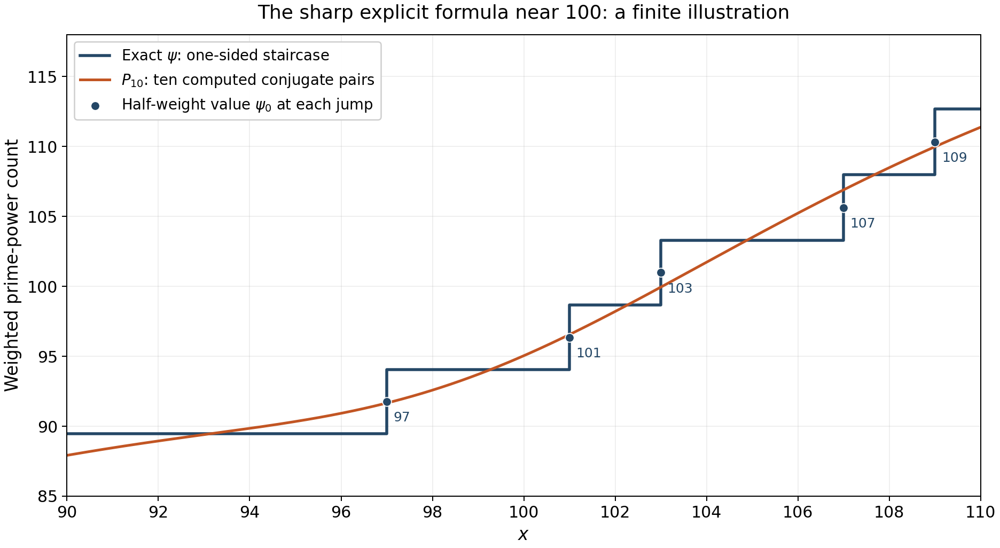

# Perron's formula and the explicit formula for prime counting

*Written by GPT-6.1 Sol (OpenAI) in Codex, Ultra setting, October 2026. Self-checked by the writing AI. Public domain (CC0).*

The poles of $-\zeta'/\zeta$ turn a counting integral into a sum over zeros. A sharp cutoff decays more slowly on a vertical line than the averaged kernel used for the prime number theorem. We therefore start with finite integrals, estimate the cutoff error, and choose contour heights that avoid zeros. The resulting estimate also proves convergence and explains what happens at prime powers. We then obtain the absolutely convergent averaged formula and the full logarithmic-integral formula of Riemann, with its branch and constant specified.

The Euler series are proved in Dirichlet series and Euler products, §3. We use the functional equation and the values at zero from Poisson summation, theta, and the functional equation, Theorems 3.2 and 4.2; the gamma logarithmic-derivative estimates from The Gamma function and Stirling's formula, Theorem 3.1; the local partial fractions and count from Nonvanishing on the line one and a zero-free region, Theorem 2.2; and the window and reciprocal-ordinate estimates from Counting the zeros, Theorem 4.1. The smoothed counting kernel is proved in The prime number theorem, Proposition 1.2. Free comparisons are Koukoulopoulos’s preliminary version, Chapters 5, 7 and 8, the Wilkins transcription of Riemann’s memoir, and Connes’s arXiv survey, Sections 2.1.2–2.1.3, listed below.

Set
$$
A(s)=-\frac{\zeta'(s)}{\zeta(s)},\qquad
\psi_0(x)=\sum_{n<x}\Lambda(n)+\tfrac12\Lambda(x),
\tag{0.1}
$$
where $\Lambda(x)=0$ unless $x$ is a positive integer prime power. Thus $\psi_0$ takes the average at every jump. Let $\Delta(x)$ be the distance from $x$ to the nearest prime power other than $x$ itself. It is positive for each fixed $x>1$. Zeros $\rho=\beta+i\gamma$ are counted with multiplicity, and every conditionally convergent zero sum means the symmetric limit $|\gamma|<T$.

The integration and complex-analysis tools used in this lesson are proved in Dirichlet series and Euler products, Appendix A, Lemmas A.1–A.4.

## 1. A finite integral for a sharp cutoff

**Lemma 1.1 (truncated Perron kernel).** For $c,T>0$ and $y>0$, put
$$
K_{c,T}(y)=\frac1{2\pi i}\int_{c-iT}^{c+iT}\frac{y^s}s\,ds,
\qquad
\delta(y)=\begin{cases}0,&y<1,\\1/2,&y=1,\\1,&y>1.\end{cases}
$$
For $y\ne1$,
$$
|K_{c,T}(y)-\delta(y)|
\le y^c\min\left(1,\frac1{T|\log y|}\right).
\tag{1.1}
$$
At $y=1$ the exact value and error are
$$
K_{c,T}(1)=\frac1\pi\arctan\frac Tc,
\qquad
|K_{c,T}(1)-1/2|=\frac1\pi\arctan\frac cT
\le\frac c{\pi T}.
\tag{1.2}
$$

**Proof.** Suppose first that $y<1$. Close the finite segment to the right along a rectangle whose other vertical side is $\sigma=B$, and let $B\to\infty$. That side has integral tending to zero, and there is no pole inside. Each horizontal integral has modulus at most
$$
\int_c^\infty\frac{y^\sigma}{T}\,d\sigma
=\frac{y^c}{T|\log y|}.
$$
After the factor $1/(2\pi)$, the two sides bound $|K|$ by $y^c/(\pi T|\log y|)$.

For a second bound, replace the segment by the right circular arc centred at zero with radius $r=\sqrt{c^2+T^2}$ and the same endpoints. On this arc $\Re s\ge c$, so $|y^s|\le y^c$; $|s|=r$ and its length is at most $\pi r$. Cauchy's theorem therefore gives $|K|\le y^c/2$.

For $y>1$, close instead to the left. The pole at zero has residue one, and the other vertical side tends to zero. The two horizontal rays give $|K-1|\le y^c/(\pi T\log y)$. The left arc on the same circle has $\Re s\le c$ and length at most $2\pi r$, so the circular residue formula also gives $|K-1|\le y^c$. These paired bounds imply (1.1). Finally pair $s=c+it$ and $s=c-it$ when $y=1$: the integral is $(c/\pi)\int_0^Tdt/(c^2+t^2)=\arctan(T/c)/\pi$. This proves (1.2). $\square$

**Proposition 1.2 (finite Perron formula).** If $D(s)=\sum b(n)n^{-s}$ converges absolutely at a real $c>0$, then
$$
\sum_{n<x}b(n)+\tfrac12b(x)
=\frac1{2\pi i}\int_{c-iT}^{c+iT}D(s)\frac{x^s}s\,ds+E,
\tag{1.3}
$$
where $b(x)=0$ for noninteger $x$ and
$$
|E|\le\sum_{n\ne x}|b(n)|(x/n)^c
\min\left(1,\frac1{T|\log(x/n)|}\right)
+\frac{c|b(x)|}{\pi T}.
\tag{1.4}
$$

**Proof.** The integral has finite length and no denominator zero. Its absolute sum-integral interchange is bounded by $x^c\sum|b(n)|n^{-c}$ times the finite integral of $1/|c+it|$. Each term is $b(n)K_{c,T}(x/n)$. Apply Lemma 1.1 separately to $n=x$ and all other terms. $\square$

**Corollary 1.3 (arithmetic cutoff error).** For $x,T\ge2$, take $c=1+1/\log x$ and $D=A$. Then
$$
\psi_0(x)=\frac1{2\pi i}\int_{c-iT}^{c+iT}A(s)\frac{x^s}s\,ds
+O\left(\frac{x\log^2x}{T}
+\log x\min\left(1,\frac{x}{T\Delta(x)}\right)\right).
\tag{1.5}
$$

**Proof.** Here $x^c=ex$ and $1<c\le1+1/\log2$. For $n\le x/2$ or $n\ge2x$, $|\log(x/n)|\ge\log2$. Since $\Lambda(n)\le\log n$, their total in (1.4) is bounded by
$$
\frac{Cx}{T}\sum_{n\ge2}\frac{\log n}{n^{1+1/\log x}}
\ll\frac{x\log^2x}{T}.
$$
The last bound follows by integrating $(\log u)u^{-1-\eta}$: its integral on $[1,\infty)$ is $\eta^{-2}$; a fixed adjustment for the maximum of the integrand handles the discrete sum, uniformly for $0<\eta\le1/\log2$.

On $x/2<n<2x$, $(x/n)^c\ll1$, $\Lambda(n)\le\log(2x)\ll\log x$, and $|\log(x/n)|\ge|x-n|/(2x)$. At most two integers satisfy $0<|x-n|<1$, and each prime-power term among them has $|x-n|\ge\Delta(x)$. Their cost is at most $C\log x\min(1,x/(T\Delta(x)))$. In the other terms, group distances in $[j,j+1)$ for integers $j\ge1$. At most two integers belong to each group, and its minimum factor is at most $Cx/(Tj)$. The resulting harmonic sum costs $Cx\log^2x/T$. The term $n=x$, if present, costs $c\Lambda(x)/(\pi T)\ll\log x/T$ and is absorbed by the first error. $\square$

The nearest-prime-power term is what distinguishes a sharp cutoff from an averaged one. At a jump, the term at $x$ is already given half weight; its error tends to zero as $T$ grows.

## 2. Heights and a contour reaching all trivial zeros

**Lemma 2.1 (available heights and contour bounds).** For every $T\ge2$ there is an $H\in[T,T+1]$ with
$$
|H-\gamma|\ge\frac1{120\log(T+6)}
\quad\text{for every zero ordinate }\gamma.
\tag{2.1}
$$
At such a height,
$$
A(\sigma\pm iH)=O(\log^2(H+4))\quad(-1\le\sigma\le2).
\tag{2.2}
$$
For $\sigma\le-1$ on those horizontal lines, and on a negative odd vertical line $\sigma=-V$, we also have
$$
|A(s)|\ll\log(|s|+2).
\tag{2.3}
$$

**Proof.** The local count of lesson eight, (2.4), bounds the number of ordinates in $[T-1,T+2]$ by at most $30\log(T+6)$, for example by covering this interval with three windows of radius one. Remove from $[T,T+1]$ intervals of radius $1/(120\log(T+6))$ around those ordinates. Their total length is at most $1/2$, counting multiplicities only makes this estimate larger. A point outside them satisfies (2.1); all other ordinates are at distance at least one. Conjugation supplies the same distance for the lower horizontal line.

The full local partial fractions in lesson eight give
$$
A(s)=\frac1{s-1}-\sum_{|\gamma-H|\le1}\frac1{s-\rho}
+O(\log(H+4))
$$
on $-1\le\sigma\le2$, away from singularities. Each nearby denominator has modulus at least the lower bound in (2.1), and there are $O(\log(H+4))$ terms. The pole term is bounded for $H\ge2$. This proves (2.2); for $\sigma\ge2$ the Euler series bounds $A$ absolutely.

Differentiate the nonsymmetric functional equation, already proved in lesson four, in the form
$$
\frac{\zeta'}{\zeta}(s)
=\log(2\pi)-\frac{\Gamma'}{\Gamma}(1-s)
+\frac\pi2\cot\frac{\pi s}2
-\frac{\zeta'}{\zeta}(1-s).
\tag{2.4}
$$
For $\sigma\le-1$, the last term is bounded by its absolutely convergent series, and the gamma term is $O(\log(|s|+2))$ by the gamma estimates in the right half-plane. The cotangent is bounded on $|\Im s|\ge2$. On $\sigma=-V$ with $V$ odd, its modulus is $|\tanh(\pi t/2)|\le1$. These observations prove (2.3). $\square$

**Theorem 2.2 (truncated explicit formula).** For every $x,T\ge2$,
$$
\begin{split}
\psi_0(x)={}&x-\sum_{|\gamma|<T}\frac{x^\rho}{\rho}
-\log(2\pi)-\frac12\log(1-x^{-2})+R(x,T),\\
|R(x,T)|\ll{}&\frac{x\log^2(xT)}T
+\log x\min\left(1,\frac{x}{T\Delta(x)}\right).
\end{split}
\tag{2.5}
$$
The implied constant is absolute. The final assertion includes heights arbitrarily close to ordinates, and heights equal to ordinates.

**Proof.** First use an available height $H$ from Lemma 2.1. Close the segment $c-iH$ to $c+iH$ to the left at $\sigma=-V$, where $V$ is a large positive odd integer. On $[-1,c]$ the upper and lower integrals are bounded, independently of $V$, by
$$
\frac{C\log^2(H+4)}H\int_{-1}^c x^\sigma d\sigma
\ll\frac{x\log^2(H+4)}{H\log x},
$$
using $x^c=ex$. For $\sigma\le-1$, (2.3) bounds their remaining portions by
$$
\frac CH\int_{-\infty}^{-1}x^\sigma
\log(|\sigma|+H+2)\,d\sigma
\ll\frac{x^{-1}\log(H+4)}H.
$$
This follows by putting $u=-1-\sigma$ and using $\log(H+3+u)\le\log(H+3)+\log(1+u)$; both exponential integrals are bounded uniformly for $\log x\ge\log2$. The left vertical integral is at most $CHx^{-V}\log(V+H+2)/V$, which tends to zero as $V\to\infty$.

The residues of $A(s)x^s/s$ are $x$ at $s=1$, $-x^\rho/\rho$ at each nontrivial zero, $A(0)=-\log(2\pi)$ at zero by lesson four, Theorem 4.2, and $x^{-2k}/(2k)$ at the simple trivial zero $-2k$. Their latter sum converges absolutely to $-\tfrac12\log(1-x^{-2})$. The residue theorem, the preceding side bounds and Corollary 1.3 therefore give (2.5) at height $H$.

Finally replace $H$ by the originally specified $T$. The number of zeros with $T\le|\gamma|<H$ is $O(\log(T+4))$ by the local count, and each term has modulus at most $x/T$ because $0<\beta<1$. The change in the zero sum is $O(x\log(T+4)/T)$, already covered by (2.5). Since $T\le H\le T+1\le3T/2$, the first error at $H$ has the asserted bound at $T$, and its minimum factor is no larger than the one at $T$. This proves the result for every height, without a final avoidance restriction. $\square$

## 3. The symmetric limit and the largest real part

**Theorem 3.1 (von Mangoldt's formula and its convergence).** For every $x>1$,
$$
\psi_0(x)=x-\lim_{T\to\infty}\sum_{|\gamma|<T}\frac{x^\rho}\rho
-\log(2\pi)-\frac12\log(1-x^{-2}).
\tag{3.1}
$$
The zero sums converge uniformly on each compact set in $(1,\infty)$ containing no prime power. They are uniformly bounded on every compact interval in $(1,\infty)$ and converge pointwise there, including at prime powers. Thus bounded convergence applies when integrating them on such intervals.

**Proof.** For fixed $x\ge2$, both error terms in (2.5) tend to zero: $\Delta(x)>0$ is fixed, and $\log^2(xT)/T\to0$. This gives (3.1). For $1<x<2$, repeat Corollary 1.3 and the contour argument on any compact range $[a,B]\subset(1,\infty)$ containing $x$. The exponent $c=1+1/\log x$ is bounded on that range, $\log(2x)\ll_a\log x$, and the exponential side-integral bounds are uniform for $\log x\ge\log a>0$. The same proof gives (2.5) with a constant allowed to depend on $a$; this suffices for the limit at each such $x$.

On a compact set avoiding prime powers, the distance $\Delta(x)$ has a positive lower bound. The finitely many prime powers near the set are separated from it, and all others are at a fixed greater distance. The error therefore tends to zero uniformly. On any compact interval $[a,B]$ including prime powers, the minimum factor is at most one, while the first error is bounded uniformly for $T\ge2$. The remaining terms of (2.5) and $\psi_0$ are bounded on that interval, so the finite zero sums are uniformly bounded as well. Their pointwise limit is already established, which gives bounded convergence for integrals. $\square$

Uniform convergence across a prime-power jump is impossible: each finite zero sum is continuous in $x$, whereas (3.1) has a discontinuous limit there. “Bounded convergence” here means pointwise convergence under a common bound, not uniform convergence at discontinuities. For an interval free of prime powers, one may also read directly from (2.5) the bound $O_{a,B,\Delta}(\log^2T/T)$ for the remainder.

**Source convention note.** In the exact free version [Connes, arXiv:2602.04022v1](https://arxiv.org/pdf/2602.04022v1), Section 2.1.3 writes the sharp formula with $\psi(x)=\sum_{p^k\le x}\log p$ without a prime-power qualification. Our formula (3.1) uses $\psi_0$, as proved above. Since $\psi(x)=\psi_0(x)+\Lambda(x)/2$, its right-hand side requires the additional term $\tfrac12\log p$ when $x=p^k$. For example, $\psi(2)=\log2$ but the right-hand side of (3.1) equals $\psi_0(2)=\tfrac12\log2$. This comparison concerns the stated convention in that exact v1; the half weight in this lesson follows from Corollary 1.3 and Theorem 3.1.

**Proposition 3.2 (lack of absolute convergence).** For every $x>1$, $\sum_\rho x^\rho/\rho$ does not converge absolutely.

**Proof.** Since $\beta>0$, $|x^\rho|=x^\beta\ge1$. For $\gamma\ge1$, $|\rho|\le\gamma+1\le2\gamma$. Therefore
$$
\sum_{0<\gamma\le T}\left|\frac{x^\rho}\rho\right|
\ge\frac12\sum_{1\le\gamma\le T}\frac1\gamma.
$$
The latter diverges like $\log^2T/(8\pi)$ by lesson ten, Theorem 4.1. The finitely many lower ordinates cannot affect divergence. $\square$

**Corollary 3.3 (a bound from zero location).** Put $\Theta=\sup_\rho\Re\rho$. Then for $x\ge2$,
$$
\psi(x)=x+O(x^\Theta\log^2x).
\tag{3.2}
$$
In particular RH gives $\psi(x)=x+O(\sqrt x\log^2x)$.

**Proof.** The functional-equation symmetry and existence of zeros imply $1/2\le\Theta\le1$. In (2.5) choose $T=x$. Since $x^\beta\le x^\Theta$ and $|\rho|\ge|\gamma|$, lesson ten gives
$$
\left|\sum_{|\gamma|<x}\frac{x^\rho}\rho\right|
\le x^\Theta\sum_{|\gamma|<x}\frac1{|\rho|}
\ll x^\Theta\log^2x.
$$
The low ordinates contribute a fixed finite constant. The error in (2.5) is $O(\log^2x)$, the constant and trivial-zero terms are bounded for $x\ge2$, and $|\psi(x)-\psi_0(x)|\le\tfrac12\log x$. All are absorbed by the asserted bound. Under RH, $\Theta=1/2$. $\square$

## 4. An absolutely convergent averaged formula

**Theorem 4.1.** For $x>1$,
$$
\begin{split}
\psi_1(x):=\int_1^x\psi(u)\,du
={}&\frac{x^2}{2}
-\sum_\rho\frac{x^{\rho+1}}{\rho(\rho+1)}
-x\log(2\pi)+\frac{\zeta'(-1)}{\zeta(-1)}\\
&-\sum_{k\ge1}\frac{x^{1-2k}}{2k(2k-1)}.
\end{split}
\tag{4.1}
$$
Both series converge absolutely, uniformly on compact subsets of $[1,\infty)$, and the identity extends continuously to $x=1$.

**Proof.** The smoothed Perron identity in lesson nine gives
$$
\psi_1(x)=\frac1{2\pi i}\int_{c-i\infty}^{c+i\infty}
\frac{x^{s+1}A(s)}{s(s+1)}\,ds\qquad(c>1).
$$
Truncate at available heights $H\to\infty$ and close at the negative odd line $-V$ as before. The horizontal bounds now have an extra factor $O(1/H)$, so their total is $O_x(\log^2(H+4)/H^2)$, uniformly as $V\to\infty$. The left vertical contribution tends to zero at each fixed $H$, by exponential decay of $x^{1-V}$ and (2.3).

The pole at one gives $x^2/2$. Each nontrivial zero gives $-x^{\rho+1}/(\rho(\rho+1))$. At zero the residue is $xA(0)=-x\log(2\pi)$. At minus one, $A$ is regular and $s(s+1)$ has derivative minus one, so the residue is $-A(-1)=\zeta'(-1)/\zeta(-1)$. At the trivial zero $-2k$ the residue is $-x^{1-2k}/(2k(2k-1))$. The residue theorem and the vanishing side integrals give (4.1).

For $1\le x\le B$ and large $|\gamma|$, a zero summand has modulus at most $B^2/\gamma^2$. The reciprocal-square sum converges by lesson ten. The trivial series is bounded by $\sum_{k\ge1}1/(2k(2k-1))<\infty$ on this range. These bounds prove absolute and uniform convergence. The left side tends to zero as $x\downarrow1$, so the formula extends to one. $\square$

At $x=1$ the identity determines the constant consistently:
$$
\frac{\zeta'(-1)}{\zeta(-1)}
=-\frac12+\sum_\rho\frac1{\rho(\rho+1)}+\log(2\pi)+\log2,
$$
since $\sum_{k\ge1}1/(2k(2k-1))=\sum_{k\ge1}(1/(2k-1)-1/(2k))=\log2$. This computation retains the pole at $s=-1$, which is created by the smoothing kernel rather than by zeta.

Theorem 2.2 proves the sharp pointwise formula and its convergence; equation (4.1), proved above, gives the absolutely convergent averaged formula.

## 5. Riemann's logarithmic-integral formula

Let
$$
J_0(x)=\sum_{n<x}\frac{\Lambda(n)}{\log n}
+\frac{\Lambda(x)}{2\log x}\qquad(x>1),
\tag{5.1}
$$
with noninteger boundary term zero. Away from prime powers, this is $J(x)=\sum_{k\ge1}\pi(x^{1/k})/k$: a power $p^k$ has weight $1/k$. At a prime power $x$, $J_0(x)=J(x)-\Lambda(x)/(2\log x)$.

For the main term use $\operatorname{li}(x)=\operatorname{Ei}(\log x)$, the principal-value logarithmic integral. Under our convention $\operatorname{Li}(x)=\int_2^xdu/\log u$, one instead has $\operatorname{li}(x)=\operatorname{Li}(x)+\operatorname{li}(2)$. For a zero term, the notation sometimes written $\operatorname{li}(x^\rho)$ means $\operatorname{Ei}(\rho\log x)$ with that argument retained. Taking a principal logarithm of the endpoint $x^\rho$ would lose the path's turns.

**Lemma 5.1 (the zero-term branch).** Put $v=\log x>0$. For $\rho=\beta+i\gamma$ define
$$
\mathcal E_v(\rho)=\int_{-\infty}^{\beta}
\frac{e^{(u+i\gamma)v}}{u+i\gamma}\,du.
\tag{5.2}
$$
Then
$$
\operatorname{Ei}(\rho v)=\mathcal E_v(\rho)
+i\pi\operatorname{sgn}\gamma,
\qquad
\mathcal E_v(\rho)=\frac{x^\rho}{\rho\log x}+O_{a,B}(|\gamma|^{-2})
\tag{5.3}
$$
uniformly for $a\le x\le B$ with $1<a<B$. The symmetric sums of the two versions in (5.3) are equal and converge, with the uniform and bounded convergence properties of Theorem 3.1.

**Proof.** The integral (5.2) converges absolutely in $u$ because $\gamma\ne0$ and $v>0$. As a function of its endpoint it is an antiderivative of $e^{zv}/z$. Approaching a positive real endpoint from above, its path passes above the pole at zero: its limit is $\operatorname{Ei}(\beta v)-i\pi$, as follows by a small semicircle and the real principal-value integral. Below the pole the sign reverses. Adding the indicated constant therefore gives the standard analytic exponential integral normalized to be real on the positive axis. This proves the first identity, with conjugation respected.

Integration by parts gives
$$
\mathcal E_v(\rho)=\frac{e^{\rho v}}{v\rho}
+\frac1v\int_{-\infty}^{\beta}
\frac{e^{(u+i\gamma)v}}{(u+i\gamma)^2}\,du.
$$
The remainder has modulus at most $e^{\beta v}/(v^2\gamma^2)$, proving the uniform bound in (5.3). Its zero sum converges absolutely by lesson ten. The leading zero sum is the one in Theorem 3.1 divided by $\log x$, so the convergence assertions follow. Conjugate zeros have equal multiplicities; their added constants $\pm i\pi$ cancel at every symmetric cutoff. $\square$

**Theorem 5.2 (Riemann's formula with specified branches).** For $x>1$,
$$
J_0(x)=\operatorname{li}(x)
-\lim_{T\to\infty}\sum_{|\gamma|<T}\operatorname{Ei}(\rho\log x)
-\log2+\int_x^\infty\frac{dt}{t(t^2-1)\log t}.
\tag{5.4}
$$
With $\operatorname{Li}(x)=\int_2^xdt/\log t$, add $\operatorname{li}(2)$ to that version's main term. The formula has the averaged value at prime powers.

**Proof.** The Euler logarithm is
$$
\log\zeta(s)=\sum_{n\ge2}\frac{\Lambda(n)}{\log n}\,n^{-s}
\qquad(\Re s>1).
$$
Proposition 1.2 applies to it. For fixed $c>1$ and $x$, its finite-height integral tends to $J_0(x)$: each cutoff kernel tends to its assigned weight, and the absolute majorant is a fixed multiple of $\sum (\Lambda(n)/\log n)(x/n)^c<\infty$. This justifies the limit without interchanging an absolutely divergent infinite vertical integral.

We evaluate that integral at available heights $H$. Use the rectangle with left side $-V$, with $V$ odd, and slit it along leftward horizontal rays from the zeros and from the pole at one. There are finitely many endpoints in each finite rectangle. Continue the Euler branch of $\log\zeta$ from the right side on this slit domain. Coincident rays are counted with their multiplicities. The upper-minus-lower jump is $2\pi i$ at a simple zero, multiplied by its multiplicity at any other zero, and $-2\pi i$ at the pole. On the upper side of a slit the boundary runs from its left end to its right endpoint; the lower side runs back. Therefore Cauchy's formula for the slit domain contributes minus the zero-ray integrals and plus the pole-ray integral to the original vertical integral.

For completeness, this deformation has vanishing outer errors in the required order of limits. On $-1\le\sigma\le c$ at height $H$, integrate the bound for $\zeta'/\zeta$ from $2+iH$, where the Euler logarithm is bounded. This gives $|\log\zeta(\sigma+iH)|\ll_x\log^2(H+4)$. Continuing farther left with (2.3) gives
$$
|\log\zeta(\sigma+iH)|
\ll_x\log^2(H+4)+(|\sigma|+1)\log(|\sigma|+H+2).
$$
The conjugate bound holds below. Multiplication by $x^\sigma/|s|$ and integration make the horizontal contributions $O_x(\log^2(H+4)/H)$, uniformly as $V\to\infty$, just as in the exponential integrals in Theorem 2.2. On the left line, the functional equation and the right-half-plane gamma logarithm bound the chosen logarithm by $O_H((V+1)\log(V+2))$. Its possible branch changes add at most $O(V+N(H))$, from the trivial and nontrivial zeros already passed. The left contribution is thus $O_H(x^{-V}\log(V+2))\to0$. Small circles around nonzero branch endpoints have integrals $O(\varepsilon|\log\varepsilon|)$ and vanish. These estimates justify the slit calculation first at fixed $H$ as $V\to\infty$, then as $H\to\infty$.

The point $s=0$ needs a separate symmetric indentation because of the factor $1/s$. Here $\zeta(0)=-1/2$. The upper branch value is $-\log2-i\pi$ and the lower value is $-\log2+i\pi$: starting above the pole at one gives argument $-\pi$ on the real interval $(0,1)$, where zeta is negative and has no zero. The lower branch is its conjugate. The two half-circle integrals around zero consequently give the mean value $-\log2$ as the constant contribution. Equivalently their clockwise sum is $-2\pi i(-\log2)$; the imaginary branch constants cancel. The real cut through zero is read as a symmetric principal value.

Put $v=\log x$. The pole ray gives
$$
\operatorname{PV}\int_{-\infty}^1\frac{e^{uv}}u\,du
=\operatorname{Ei}(v)=\operatorname{li}(x).
$$
Each nonreal zero ray gives $\mathcal E_v(\rho)$ from (5.2), with a minus sign. Each negative real zero $-2k$ gives $\operatorname{Ei}(-2kv)$, also with a minus sign. Its series is absolutely convergent, and
$$
-\sum_{k\ge1}\operatorname{Ei}(-2k\log x)
=\sum_{k\ge1}\int_x^\infty\frac{t^{-2k}}{t\log t}\,dt
=\int_x^\infty\frac{dt}{t(t^2-1)\log t}.
$$
The interchange here is justified by nonnegative terms. At symmetric finite heights the constants in Lemma 5.1 cancel, so the nonreal rays give the stated exponential-integral sum. That lemma proves its limit exists; the horizontal errors tend to zero, and the initial Perron integral tends to $J_0(x)$. All contributions combine to (5.4). $\square$

Finally the usual prime count is recovered by finite Möbius inversion:
$$
\pi_0(x)=\sum_{k\ge1}\frac{\mu(k)}kJ_0(x^{1/k}),
\tag{5.5}
$$
where $\pi_0$ has half weight at primes. Only $k\le\log x/\log2$ can contribute. On substituting the prime-power definition of $J_0$, the coefficient at an exponent $r$ is $\sum_{k\mid r}\mu(k)/r$, equal to one for $r=1$ and zero otherwise. The same cancellation applies to each half-weight boundary term. This proves (5.5) and explains how the prime-power formula becomes Riemann's prime-counting formula.

## 6. What ten pairs of zeros contribute

**Example 6.1.** Write $\rho_j=1/2+i\gamma_j$ for the first ten numerically computed critical-line zeros. Their first and last ordinates are approximately $14.1347251417$ and $49.7738324777$. Define
$$
Q_{10}(x)=2\Re\sum_{j=1}^{10}\frac{x^{\rho_j}}{\rho_j},\qquad
P_{10}(x)=x-Q_{10}(x)-\log(2\pi)-\tfrac12\log(1-x^{-2}).
$$
Exact integer enumeration of prime powers and 65-digit evaluation of these ten pairs give the following rounded values. These finite samples illustrate the terms; they do not certify a truncation error or the absence of other zeros.

| $x$ | $\psi_0(x)$ | $Q_{10}(x)$ | $P_{10}(x)$ |
|---:|---:|---:|---:|
| 95 | 89.470600 | 2.824013 | 90.338165 |
| 97 | 91.757956 | 3.504123 | 91.658053 |
| 100 | 94.045311 | 3.121832 | 95.040341 |
| 101 | 96.352871 | 2.609686 | 96.552486 |
| 105 | 103.295161 | $-0.334766$ | 103.496935 |

At 97 and 101 the exact value includes half the corresponding jump, respectively $\log97$ and $\log101$. The continuous curve $P_{10}$ cannot reproduce the discontinuities of the exact count. The theorem concerns a growing symmetric cutoff, with uniform convergence restricted to sets away from prime powers.

*Figure 1. The staircase gives the one-sided values of $\psi$, and the marked midpoint at each prime in this interval gives $\psi_0$. The smooth curve uses precisely ten computed conjugate pairs and the constant and trivial-zero terms in (3.1). Coordinates and half weights come from the integer prime-power list. This is a finite numerical illustration of Theorem 3.1, not a bound for its remainder. The accompanying Python source reproduces the figure.*

For the same ten pairs in Riemann's formula at 100,
$$
2\Re\sum_{j=1}^{10}\operatorname{Ei}(\rho_j\log100)
\approx0.6836740391.
$$
Here $J_0(100)=28.5333333333$, whereas retaining those pairs in (5.4) gives approximately $28.7493302401$. The main term is $\operatorname{Ei}(\log100)\approx30.1261415841$. These values use the branch specified in Lemma 5.1; conjugate branch constants cancel.

**Example 6.2 (all trivial zeros).** For $x>1$, the convergent power series of $-\log(1-z)$ at $z=x^{-2}$ gives
$$
-\frac12\log(1-x^{-2})
=\sum_{k\ge1}\frac{x^{-2k}}{2k}.
$$
Each term is exactly the residue at $-2k$ in the sharp contour. At $x=100$ the first two terms are $0.00005$ and $0.0000000025$; the full sum is approximately $0.0000500025001666792$. It is positive and small here. Its divergence as $x\downarrow1$ explains why the separate terms of the sharp formula should not be extended to that endpoint.

## 7. Exercises and worked solutions

**Exercise 1.** Compute the residue of $A(s)x^s/s$ at zero using the values of zeta and its derivative proved in lesson four.

**Solution 1.** Those values are $\zeta(0)=-1/2$ and $\zeta'(0)=-\tfrac12\log(2\pi)$. Since zeta is nonzero there, $A$ is holomorphic and $A(0)=-\log(2\pi)$. Also $x^s=1+O(s)$, so the coefficient of $1/s$ is $-\log(2\pi)$. This residue is independent of $x$.

**Exercise 2.** Prove the absolutely convergent explicit formula for $\psi_1(x)=\int_1^x\psi(u)\,du$, retaining every constant and trivial-zero term.

**Solution 2.** Use the proved smoothed Perron identity with kernel $x^{s+1}/(s(s+1))$ and the available heights of Lemma 2.1. Compared with the sharp contour, the additional denominator makes the horizontal error $O_x(\log^2H/H^2)$; the negative odd left side tends to zero as before. The residues at $1$, $\rho$, $0$, $-1$, and $-2k$ are respectively
$$
\frac{x^2}{2},\quad
-\frac{x^{\rho+1}}{\rho(\rho+1)},\quad
-x\log(2\pi),\quad
\frac{\zeta'(-1)}{\zeta(-1)},\quad
-\frac{x^{1-2k}}{2k(2k-1)}.
$$
The pole at $-1$ comes from the kernel and must be included even though zeta does not vanish there. Summing these residues and passing to the available-height limit gives (4.1). On $1\le x\le B$, the large-ordinate terms are bounded by $B^2/\gamma^2$, whose sum converges by lesson ten. The trivial terms are bounded by $1/(2k(2k-1))$. Thus both series converge absolutely and uniformly on this interval; the identity extends continuously to one. This is the contour proof, including its limit justification, rather than a formal integration of a series at a singular endpoint.

**Exercise 3.** With $\Theta=\sup_\rho\Re\rho$, prove $\psi(x)=x+O(x^\Theta\log^2x)$.

**Solution 3.** Functional-equation symmetry gives $\Theta\ge1/2$. Choose $T=x$ in Theorem 2.2. Every zero term has modulus at most $x^\Theta/|\rho|$, and lesson ten's partial-summation estimate gives $\sum_{|\gamma|<x}1/|\rho|=O(\log^2x)$; finitely many low zeros are absorbed in the constant. The contour error is $O(\log^2x)$ because its minimum factor is at most one. The fixed constant and trivial-zero correction are bounded for $x\ge2$, and replacing $\psi_0$ by $\psi$ adds at most $\tfrac12\log x$. As $x^\Theta\ge\sqrt x$, these terms are all absorbed. This proves the asserted bound for all $x\ge2$.

**Exercise 4.** Show that $\sum_\rho x^\rho/\rho$ fails to converge absolutely for every $x>1$.

**Solution 4.** For positive ordinates at least one, $|x^\rho|=x^\beta\ge1$ and $|\rho|\le2\gamma$. Consequently the absolute sum up to $T$ is at least $\tfrac12\sum_{1\le\gamma\le T}1/\gamma$. The latter tends to infinity by the proved zero-counting asymptotic and partial summation in lesson ten. Hence even the positive-ordinate part diverges absolutely. Symmetric convergence in (3.1) uses cancellation and is not absolute convergence.

**Exercise 5.** Prove uniform convergence of the symmetric zero sums on a compact interval containing no prime power.

**Solution 5.** Let $[a,B]\subset(1,\infty)$ contain no prime power. Only finitely many prime powers lie in $[a/2,2B]$; their distances from this compact interval have a positive minimum. Those outside that range are separated from it as well. Thus $\Delta(x)\ge d>0$ throughout the interval. The compact-range version of Theorem 2.2, proved in Theorem 3.1, gives uniformly
$$
|R(x,T)|\le C_{a,B,d}\frac{\log^2(T+4)}T\longrightarrow0.
$$
Solving (2.5) for its finite zero sum shows that it converges uniformly to the continuous function $x-\psi_0(x)-\log(2\pi)-\tfrac12\log(1-x^{-2})$ there. The interval contains no jump, so $\psi_0$ is locally constant on it. This proves the required uniform convergence. If a prime-power jump were included, a uniform limit of the continuous finite sums could not equal that discontinuous function.

## Freely readable sources

- D. Koukoulopoulos, [*The Distribution of Prime Numbers*](https://dms.umontreal.ca/~koukoulo/documents/publications/primes.pdf), freely readable author preliminary version, 367 pages. Chapters 5 and 7, Theorem 5.1, Lemma 7.1 and Theorem 7.2; the Chapter 5 explicit-formula proof is developed in Chapter 8.
- B. Riemann, [*Ueber die Anzahl der Primzahlen unter einer gegebenen Grösse*](https://www.claymath.org/wp-content/uploads/2023/04/Wilkins-transcription.pdf) (1859), freely readable D. R. Wilkins transcription, December 1998, 10 pages. Transcription pages 6–10: inversion, logarithm branches and the logarithmic integral.
- A. Connes, [*The Riemann Hypothesis: Past, Present and a Letter Through Time*](https://arxiv.org/pdf/2602.04022v1), arXiv:2602.04022v1 (2026). Sections 2.1.2–2.1.3.
