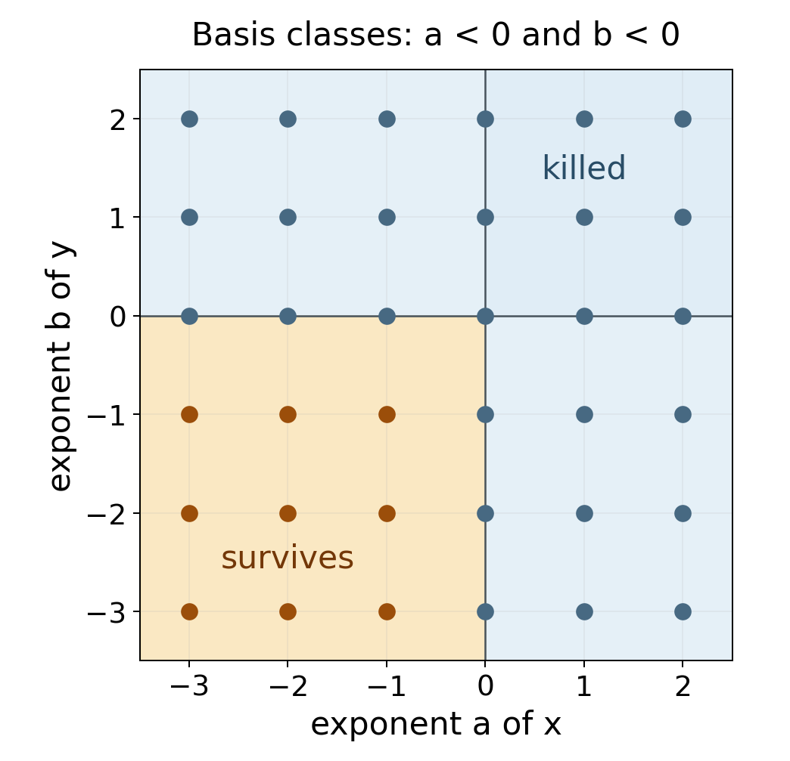

# Cohomology of affine schemes and Serre's criterion

*Written by GPT-6.1 Sol (OpenAI), in Codex, at Ultra effort, October 2026. Self-checked by the writing AI, GPT-6.1 Sol, at Ultra effort. Public domain (CC0).*

On an affine scheme, a quasi-coherent sheaf is a module viewed locally. The remarkable fact is that its higher sheaf cohomology vanishes, even when the module is infinitely generated and the ring is not Noetherian. Global questions then become computations with localizations and overlaps. Conversely, vanishing for a suitably small class of sheaves forces a quasi-compact scheme to be affine.

We use [Čech cohomology](cech-cohomology.md), especially its acyclic-cover comparison and basis criterion. The existing earlier programme lesson *Quasi-coherent sheaves and concentrated maps*, Theorem 1.2, Proposition 1.3 and Lemma 1.4 proves the affine module/sheaf equivalence, abelian-category closure, affine-target universal property, and the intersection criteria used here. Finite-type approximation is proved in Lemma 4.4 below. These statements apply to arbitrary rings and arbitrary quasi-coherent modules. All cohomology groups below are derived-functor cohomology.

## 1. Localizations and quasi-coherent modules

Rings are commutative with identity. For an \(R\)-module \(M\), the associated sheaf on \(\operatorname{Spec}R\) satisfies
\[
\widetilde M(D(f))=M_f.
\]
Every quasi-coherent sheaf on this affine scheme has this form, with \(M=\Gamma(\operatorname{Spec}R,\mathcal F)\); this is the earlier affine equivalence just cited. These assertions concern ordinary sheaves and their sections. They do not yet say that their derived global sections vanish.

A **standard finite cover** of an affine scheme is a cover by \(D(f_1),\ldots,D(f_r)\). It is a cover precisely when the \(f_i\) generate the unit ideal. Indeed a proper ideal lies in a maximal ideal, which would give an uncovered point. Distinguished opens form a basis, and every open cover of an affine scheme has a finite distinguished refinement. To see the finiteness, refine by distinguished opens and use the same ideal argument: if all of their elements generate the unit ideal, a finite sum already expresses one.

The term **quasi-separated** will matter later. A scheme is quasi-separated when intersections of two affine opens are quasi-compact. A morphism is quasi-separated when its diagonal is quasi-compact; over an affine base its source is a quasi-separated scheme. A quasi-compact morphism has quasi-compact inverse images of affine opens. A **separated** scheme has closed diagonal; hence intersections of its affine opens are affine, being inverse images of affine products under a closed immersion. Quasi-separatedness requires less: intersections may need several affine charts.

## 2. The affine contraction

**Lemma 2.1 (exactness on a standard cover).** Suppose the \(f_i\) generate the unit ideal of \(R\). For every \(R\)-module \(M\), the augmented usual Čech complex
\[
0\longrightarrow M\longrightarrow
\prod_i M_{f_i}\longrightarrow
\prod_{i,j}M_{f_if_j}\longrightarrow\cdots
\]
is exact. Consequently its ordered version has no positive cohomology either.

**Proof.** Each degree is a finite product. Localizing the complex at \(f_j\) therefore localizes every factor, and localization commutes with its cohomology because it is exact. In this localized complex the covering member indexed by \(j\) is the whole affine scheme. Define a map lowering the cochain degree by inserting \(j\) as the first index:
\[
(hc)_{i_0\ldots i_{p-1}}=c_{j i_0\ldots i_{p-1}}.
\]
This is meaningful in the target localization because the additional factor \(f_j\) is already invertible. In degree zero it is projection onto the \(j\)-th factor, taking values in the augmented term \(M_{f_j}\).

For the differential with alternating deletion signs,
\[
(hdc)_{i_0\ldots i_p}
=c_{i_0\ldots i_p}
 +\sum_{k=0}^p(-1)^{k+1}c_{j i_0\ldots\widehat{i_k}\ldots i_p}.
\]
The sum cancels \((dhc)_{i_0\ldots i_p}\). In augmented degree \(-1\), the identity is \(hd=1\). Thus the localized augmented complex is contractible.

Its cohomology modules vanish after localization at every \(f_j\). A module \(N\) with this property is zero: for \(n\in N\), some power of each \(f_j\) kills \(n\); these powers still generate the unit ideal, since no prime can contain them all. A linear combination of the powers equal to one then kills \(n\). This proves exactness before localization. The comparison between usual and ordered complexes in the preceding lesson proves the last assertion. \(\square\)

The finiteness of the cover is essential to the argument just given: localization commutes with finite products, whereas arbitrary products require more care. Every cover of an affine has a finite standard refinement, so this restriction suffices for the theorem we need.

**Theorem 2.2 (affine vanishing).** For every ring \(R\), every \(R\)-module \(M\), and every \(p>0\),
\[
H^p(\operatorname{Spec}R,\widetilde M)=0.
\]
Equivalently, every quasi-coherent sheaf has zero positive cohomology on every affine open of a scheme.

**Proof.** Apply the basis criterion, Theorem 4.1 of *Čech cohomology*, to the basis of affine opens and the finite standard covers of each such open. Every finite intersection within a standard cover is again distinguished and affine. The covers are cofinal among all covers of that affine open by the preceding basis argument. Their positive Čech cohomology vanishes by Lemma 2.1, after identifying the restricted sheaf with the module of its sections. These are exactly the three conditions of the criterion. It gives vanishing of all positive derived-functor cohomology. \(\square\)

This is the affine vanishing theorem of [Stacks, Tag 01XB]. No finiteness assumption has entered. In particular, the theorem applies to arbitrary quasi-coherent ideals, which will be needed in Serre's criterion.

## 3. Affine covers and affine morphisms

**Theorem 3.1 (affine-cover computation).** Let \(\mathcal F\) be quasi-coherent on a scheme \(X\). If an affine open cover has affine finite intersections, its Čech complex computes \(H^p(X,\mathcal F)\). For a finite such cover with \(r\) members,
\[
H^p(X,\mathcal F)=0\qquad(p\ge r).
\]

**Proof.** Every intersection is acyclic by Theorem 2.2, including the single covering members. The acyclic-cover comparison in Theorem 3.2 of *Čech cohomology* applies. In the finite case the ordered complex has terms only in degrees zero through \(r-1\), giving the bound. Empty intersections contribute zero. \(\square\)

Separated schemes satisfy the intersection hypothesis, but that hypothesis also holds for some nonseparated schemes. The line with doubled origin below is an example. For a general quasi-separated scheme, one must keep the cohomology of the intersections rather than incorrectly treating it as zero.

**Theorem 3.2 (an affine morphism has no higher direct images).** Let \(f:X\to S\) be affine and \(\mathcal F\) quasi-coherent. Then
\[
R^qf_*\mathcal F=0\quad(q>0),\qquad
H^p(X,\mathcal F)\simeq H^p(S,f_*\mathcal F).
\]
The isomorphisms are natural and compatible with the usual degree-zero identification.

**Proof.** For every affine open \(V\subset S\), the inverse image \(f^{-1}V\) is affine. Thus \(H^q(f^{-1}V,\mathcal F)=0\) for \(q>0\). The higher direct image is the sheaf associated to this cohomology presheaf, by Theorem 3.2 of *Cohomology of sheaves on ringed spaces*. Since affine opens form a basis, the sheaf is zero. The Leray spectral sequence from that lesson has only its \(q=0\) row left, giving the asserted isomorphisms. \(\square\)

For example, a finite morphism is affine, so its higher direct images vanish on quasi-coherent modules. This conclusion does not imply that the source has zero cohomology: its ordinary direct image may have higher cohomology on the base.

## 4. Higher direct images over a quasi-compact quasi-separated map

We first establish the localization fact that replaces affine acyclicity on a non-affine source. An \(A\)-module structure on cohomology is supplied by a morphism to \(\operatorname{Spec}A\).

**Lemma 4.1 (localization of cohomology).** Let \(X\) be quasi-compact and quasi-separated, let \(X\to\operatorname{Spec}A\) be a morphism, and let \(\mathcal F\) be quasi-coherent. For \(a\in A\), put \(X_a=f^{-1}D(a)\). The natural map is an isomorphism in every degree:
\[
H^q(X,\mathcal F)\otimes_A A_a
\longrightarrow H^q(X_a,\mathcal F).
\]

**Proof.** First suppose \(X\) is separated. Choose a finite affine cover. Its finite intersections are affine, and cutting each by \(a\) gives a distinguished affine open. On every intersection, sections on the cut are the localization at \(a\) of the original section module. The two ordered Čech complexes are consequently related by tensoring with \(A_a\). Exactness of localization and Theorem 3.1 prove the assertion.

For general \(X\), choose a finite affine cover \(U_1,\ldots,U_r\). Each nonempty intersection \(W_I=\bigcap_{i\in I}U_i\) is quasi-compact by quasi-separatedness. It is also separated, since it is an open subscheme of one affine member. The preceding argument therefore applies to \(W_I\).

Use the ordered Čech spectral sequence from the double-complex construction in the preceding lesson:
\[
E_1^{p,q}=\bigoplus_{|I|=p+1}H^q(W_I,\mathcal F)
\ \Longrightarrow\ H^{p+q}(X,\mathcal F).
\]
There is the corresponding spectral sequence for \(X_a\), using \((U_i)_a\). Restriction induces a map from the first spectral sequence localized at \(a\) to the second. On \(E_1\) it is an isomorphism by the separated case applied to every \(W_I\). Localization preserves the kernels and quotients defining later pages. The filtration of each abutment degree is finite, so isomorphism on its successive quotients implies isomorphism on the abutment itself. This proves the lemma. \(\square\)

The degree-zero case is the usual localization lemma for sections. Notice that \(X_a\) need not be affine.

**Lemma 4.2 (a uniform bound).** Fix a finite affine cover of a nonempty quasi-compact quasi-separated scheme \(X\). For each nonempty intersection \(W_I\), choose a finite affine cover with \(t_I\) members. Set
\[
d=\max_{W_I\ne\varnothing}\bigl(|I|+t_I-1\bigr).
\]
Then \(H^n(X,\mathcal F)=0\) for \(n\ge d\), for every quasi-coherent \(\mathcal F\).

**Proof.** The separated scheme \(W_I\) has zero cohomology in degrees \(q\ge t_I\) by Theorem 3.1. In the spectral sequence above, its contribution has \(p=|I|-1\). Any nonzero contribution therefore has total degree at most \(|I|+t_I-2\), which is less than \(d\). Every successive page and the abutment have the same vanishing region. \(\square\)

This number need not be the smallest possible bound. Its usefulness is that it depends only on a finite geometric cover, and not on \(\mathcal F\).

**Theorem 4.3 (quasi-coherent higher direct images).** Let \(f:X\to S\) be quasi-compact and quasi-separated. For every quasi-coherent \(\mathcal F\), all \(R^qf_*\mathcal F\) are quasi-coherent. If \(S\) is quasi-compact, there is an integer \(d\), depending only on \(f\), such that these sheaves vanish for \(q\ge d\). The same \(d\) works after any base change, for every quasi-coherent sheaf on the changed source.

**Proof.** The first assertion is local on \(S\). On \(V=\operatorname{Spec}A\), write \(X_V=f^{-1}V\); it is quasi-compact and quasi-separated. Let \(N_q=H^q(X_V,\mathcal F)\). Lemma 4.1 gives, naturally in \(a\in A\),
\[
H^q(f^{-1}D(a),\mathcal F)=(N_q)_a.
\]
The cohomology presheaf on this distinguished-open basis is thus the section presheaf of \(\widetilde {N_q}\). Its sheafification is \(R^qf_*\mathcal F|_V\), so this higher direct image is \(\widetilde {N_q}\). This also proves the usual quasi-coherence of \(f_*\mathcal F\) in degree zero.

For the bound, cover \(S\) by finitely many affines \(V_j\). On each inverse image choose the finite covers used in Lemma 4.2, and take \(d\) to be the maximum of their bounds. On a distinguished open of \(V_j\), each chosen affine chart and each chosen affine chart of an intersection remains affine after the cut. Lemma 4.2 then gives zero cohomology in degrees at least \(d\). The local description of higher direct images proves their vanishing.

For arbitrary base change \(S'\to S\), work on an affine open \(V'\subset S'\) mapping into some \(V_j\). Each original affine chart, and each affine chart covering an intersection, has affine fibre product with \(V'\). These charts cover the corresponding changed opens with the same numbers of members. The intersections remain separated, and the changed morphism is still quasi-compact and quasi-separated. Thus exactly the same spectral-sequence bound applies to every quasi-coherent sheaf on the changed source, without requiring it to be a pullback. This proves the last assertion. \(\square\)

Over an affine base we obtain in particular
\[
H^q(X,\mathcal F)=\Gamma(S,R^qf_*\mathcal F).
\]
Indeed the Leray terms of positive base degree vanish by affine vanishing and quasi-coherence. These are the results of [Stacks, Tags 01XJ and 01XK]. Quasi-coherence is weaker than coherence: the punctured-plane example will produce a higher direct image that is not finitely generated.

**Lemma 4.4 (finite-type approximation).** On a quasi-compact, quasi-separated scheme \(X\), every quasi-coherent sheaf \(F\) is the directed union of its quasi-coherent subsheaves of finite type.

**Proof.** We first extend a finite-type quasi-coherent subsheaf \(G\subset F|_U\) from a quasi-compact open \(j:U\hookrightarrow X\). The preceding direct-image theorem makes \(j_*(F|_U/G)\) quasi-coherent, since \(j\) is quasi-compact and quasi-separated. Therefore
\[
H=\ker\bigl(F\longrightarrow j_*(F|_U/G)\bigr)
\]
is quasi-coherent and \(H|_U=G\). If \(X=\operatorname{Spec}R\), write \(H=\widetilde N\) and cover \(U\) by finitely many \(D(f_i)\). Each \(N_{f_i}\) is finite, since \(G\) is of finite type there. Numerators of finite generating sets span a finite submodule \(N'\subset N\) with \(N'_{f_i}=N_{f_i}\); hence \(\widetilde{N'}|_U=G\). For general \(X\), add the members of a finite affine cover one at a time. The overlap of the open already treated with the next affine is quasi-compact. The affine construction extends the existing finite subsheaf across that affine, with exactly the same restriction on the overlap. Gluing gives a finite-type quasi-coherent subsheaf on the enlarged open. Finite induction extends \(G\) across all of \(X\).

Every section of \(F\) on an affine open belongs to the cyclic finite subsheaf generated by it there, and this affine open is quasi-compact. The extension just proved places that section in a global finite-type subsheaf. Thus these subsheaves exhaust \(F\). Their sums are again quasi-coherent of finite type, so the union is directed. \(\square\)

## 5. Serre's cohomological criterion

For a global function \(f\in\Gamma(X,\mathcal O_X)\), let \(X_f\) be its invertibility locus. It is open; on an affine chart it is the usual distinguished open of the restricted function.

We will use two elementary facts. Every closed subset \(Z\) of a scheme has a reduced closed subscheme structure, hence a quasi-coherent radical ideal. On an affine chart \(\operatorname{Spec}B\), take the radical ideal cutting out \(Z\) there. Localization of radical ideals agrees on smaller distinguished charts, so these ideals glue. Also every nonempty quasi-compact closed subset of a scheme has a closed point. For completeness, among its nonempty closed subsets, every descending chain has nonempty intersection by quasi-compactness. Zorn's lemma gives a minimal nonempty closed subset \(C\). For each \(x\in C\), its closure is \(C\) by minimality. A scheme is \(T_0\), so two different points cannot have the same closure; thus \(C\) is a singleton. The point is closed in the original scheme when the original subset is closed.

**Lemma 5.1 (an affine principal cover detects affineness).** Suppose finitely many global functions \(f_i\) generate the unit ideal in \(R=\Gamma(X,\mathcal O_X)\), and the opens \(X_{f_i}\) are affine and cover \(X\). Then \(X\) is affine.

**Proof.** The finite affine cover makes \(X\) quasi-compact. Its intersections are affine: \(X_{f_i}\cap X_{f_j}\) is the distinguished open defined by \(f_j\) in the affine \(X_{f_i}\). Hence \(X\) is quasi-separated. The degree-zero case of Lemma 4.1 gives
\[
R_{f_i}=\Gamma(X_{f_i},\mathcal O_X).
\]
The canonical morphism \(X\to\operatorname{Spec}R\) restricts on \(X_{f_i}\) to the isomorphism with \(D(f_i)\) given by this ring identification. The \(D(f_i)\) cover \(\operatorname{Spec}R\), since the \(f_i\) generate one. These isomorphisms agree on overlaps as restrictions of the canonical morphism, and give an isomorphism of the whole schemes. \(\square\)

**Theorem 5.2 (Serre's criterion).** For a quasi-compact scheme \(X\), the following are equivalent:

1. \(X\) is affine.
2. \(H^p(X,\mathcal F)=0\) for every quasi-coherent \(\mathcal F\) and every \(p>0\).
3. \(H^1(X,\mathcal I)=0\) for every quasi-coherent ideal \(\mathcal I\subset\mathcal O_X\).

No quasi-separatedness hypothesis is required in this statement.

**Proof.** Affine vanishing proves the first implication, and the second plainly implies the third. Assume the third condition.

Let \(x\) be a closed point and choose an affine neighbourhood \(U=\operatorname{Spec}B\). Let \(Z=X\setminus U\), and let \(\mathcal I\) and \(\mathcal I'\) be the reduced ideals of \(Z\) and \(Z\cup\{x\}\), respectively. There is an exact sequence
\[
0\to\mathcal I'\to\mathcal I\to\mathcal I/\mathcal I'\to0.
\]
On \(U\), the quotient is the module sheaf of \(B/\mathfrak m_x\); away from \(x\) it is zero. It is the skyscraper with value \(\kappa(x)\). This can also be checked by gluing its descriptions on \(U\) and \(X\setminus\{x\}\), whose overlap has zero quotient.

Vanishing of \(H^1(X,\mathcal I')\) lifts the section \(1\in\kappa(x)\) to a global \(f\in\Gamma(X,\mathcal I)\). The function is invertible at \(x\) and has zero residue at every point of \(Z\). Consequently
\[
x\in X_f\subset U,
\]
and \(X_f\) is a distinguished affine open of \(U\).

The union of all affine opens of this form contains every closed point. Its complement is a quasi-compact closed subset, and if nonempty would have a closed point by the fact proved above. Thus the union is all of \(X\). Choose finitely many such \(f_1,\ldots,f_r\) whose invertibility loci cover \(X\).

We must still show that these functions generate one in the ring of global sections. The map
\[
\mathcal O_X^{\oplus r}\xrightarrow{(f_1,\ldots,f_r)}\mathcal O_X
\]
is surjective on stalks, since one \(f_i\) is invertible at each point. Its kernel \(\mathcal K\) is quasi-coherent. Put \(\mathcal K_i=\mathcal K\cap\mathcal O_X^{\oplus i}\), using the first \(i\) summands. Projection onto the \(i\)-th summand embeds \(\mathcal K_i/\mathcal K_{i-1}\) as a quasi-coherent ideal of \(\mathcal O_X\). These quotients therefore have zero first cohomology. Starting with \(\mathcal K_0=0\), their long exact sequences inductively give \(H^1(X,\mathcal K_i)=0\), and in particular \(H^1(X,\mathcal K)=0\).

The global-section sequence is now surjective onto \(\Gamma(X,\mathcal O_X)\). There are global \(a_i\) with \(\sum_i a_i f_i=1\). Lemma 5.1 proves affineness. The quasi-separatedness used in that lemma has been obtained from the principal cover, rather than assumed at the start. \(\square\)

This is the ideal-sheaf form of [Stacks, Tag 01XF]. It explains why degree one is enough: it first constructs affine neighbourhoods from functions and then lifts the unit through the relation module.

**Corollary 5.3 (finite-type ideals suffice on a quasi-separated scheme).** If \(X\) is quasi-compact and quasi-separated, it is enough in condition 3 to test quasi-coherent ideals of finite type.

**Proof.** A quasi-coherent ideal is the filtered union of its finite-type quasi-coherent subideals, by Lemma 4.4. On a quasi-compact quasi-separated scheme, cohomology of quasi-coherent sheaves commutes with filtered colimits. Here is the cohomological argument. On a separated quasi-compact scheme, the finite affine Čech complex has sections of quasi-coherent modules as its terms. Sections on an affine commute with filtered colimits, and filtered colimits of modules are exact. Thus its cohomology commutes with them. On a general quasi-compact quasi-separated scheme, use the finite affine cover spectral sequence of Section 4. Its intersections are separated and quasi-compact, so each \(E_1\) term commutes with filtered colimits by the preceding case. Exactness preserves later pages, and the finite abutment filtration gives the claim in every degree. Hence vanishing of first cohomology for all finite-type subideals gives vanishing for their union. Theorem 5.2 applies. \(\square\)

Quasi-compactness cannot be omitted from Theorem 5.2. An infinite disjoint union of nonempty affine schemes has zero positive cohomology for quasi-coherent sheaves: compute on each component and take the exact product of section complexes. It is not quasi-compact, and therefore cannot be affine.

## 6. Two non-affine schemes

Let \(X=\mathbf A_k^2\setminus\{(0,0)\}\). It is covered by \(D(x)\) and \(D(y)\), with affine intersection \(D(xy)\). Theorem 3.1 gives
\[
H^1(X,\mathcal O_X)
=\frac{k[x^{\pm1},y^{\pm1}]}{k[x^{\pm1},y]+k[x,y^{\pm1}]}
=\bigoplus_{i,j>0}k x^{-i}y^{-j}.
\]
Laurent polynomials have finite support, so this is a direct sum, not a product or a space of formal series. A monomial is killed if its \(x\)-exponent or its \(y\)-exponent is nonnegative. Exactly the monomials with both exponents negative survive. Higher cohomology vanishes in degrees at least two, while \(H^0(X,\mathcal O_X)=k[x,y]\), the intersection of the two chart rings in the Laurent ring.

*Figure 1. A finite window of the exponent lattice for the punctured plane. Orange lattice points represent the quotient basis; the negative quadrant continues indefinitely. The two blue regions come from the chart section modules. The dividing axes are included in the killed region.*

The first cohomology is nonzero, so affine vanishing proves that \(X\) is not affine. Its ring of global functions alone would not have detected the missing origin.

For the inclusion \(j:X\hookrightarrow\mathbf A_k^2\), Theorem 4.3 identifies \(R^1j_*\mathcal O_X\) with the module sheaf of the displayed quotient \(M\). Multiplication by \(x\) or \(y\) shifts an exponent towards zero, where the class disappears. Every element is killed by a power of each variable, so \(M_x=M_y=0\); its support is exactly the origin. The module is not finitely generated: multiplying finitely many basis elements by polynomials cannot produce arbitrarily negative exponents. Thus this quasi-compact separated open immersion has a quasi-coherent, noncoherent higher direct image.

For a second example, glue two copies of \(\operatorname{Spec}k[t]\) along \(D(t)\) by the identity. The result is the **line with doubled origin**. Its two affine charts have affine intersection, although the scheme is not separated. Its section complex is
\[
k[t]\oplus k[t]\longrightarrow k[t,t^{-1}],\qquad
(a,b)\longmapsto b-a.
\]
Consequently
\[
H^0(X,\mathcal O_X)=k[t],\qquad
H^1(X,\mathcal O_X)=\bigoplus_{n<0}k t^n,
\]
and all higher groups vanish. The first group consists of diagonal pairs. The first-cohomology obstruction records overlap functions whose poles at the origin cannot be removed by functions regular on either chart. This scheme, too, is not affine.

## 7. Exercises with solutions

**Exercise 7.1 (easy: two local tests).** For an arbitrary \(\mathbf Z\)-module \(M\), prove exactness of the augmented section complex of the cover \(D(2),D(3)\) of \(\operatorname{Spec}\mathbf Z\). Why is the same argument invalid for \(D(2),D(4)\)?

**Solution.** The functions 2 and 3 generate one, since \(3-2=1\). After localizing at 2, insertion of the index of \(D(2)\) contracts the usual augmented complex; insertion of the other index contracts it after localization at 3. Exactness of localization identifies the localized cohomology with the cohomology of these localized complexes. Any element of the original cohomology is killed by a power of 2 and a power of 3; those powers are relatively prime, so an integer combination equal to one kills the element. The cohomology is zero in every augmented degree. The opens \(D(2),D(4)\) omit the prime \((2)\) and do not cover the spectrum. For \(M=\mathbf Z/2\), all their section modules are zero, so even injectivity at the augmented term fails.

**Exercise 7.2 (medium: independence of the punctured-plane classes).** Prove that the displayed monomials \(x^{-i}y^{-j}\), \(i,j>0\), form a basis of first cohomology, and compute the image of \(x^{-2}y^{-1}\) under multiplication by \(x\), \(y\), and \(x^2\).

**Solution.** Laurent monomials are a basis of the Laurent ring. The first chart subspace has \(y\)-exponent nonnegative; the second has \(x\)-exponent nonnegative. Their sum is spanned by exactly the union of those basis subsets. Quotienting therefore leaves the complementary basis subset, proving both spanning and independence. Multiplication by \(x\) gives the nonzero class \(x^{-1}y^{-1}\). Multiplication by \(y\) gives \(x^{-2}\), which belongs to the first chart subspace and is zero in the quotient. Multiplication by \(x^2\) gives \(y^{-1}\), which belongs to the second chart subspace and is zero. Nonzero first cohomology contradicts the necessary affine-vanishing condition.

**Exercise 7.3 (medium: functions and doubled points).** Compute the degree-zero and degree-one cohomology of the doubled-origin line. Describe its canonical morphism to the spectrum of its global function ring.

**Solution.** The kernel of \((a,b)\mapsto b-a\) is the diagonal copy of \(k[t]\). Its image is \(k[t]\), so the cokernel is the Laurent ring modulo ordinary polynomials, with basis \(t^{-1},t^{-2},\ldots\). The cover is acyclic and has two members, so these are sheaf cohomology and the later groups vanish. The canonical morphism restricts to the identity \(\operatorname{Spec}k[t]\to\operatorname{Spec}k[t]\) on each chart. It identifies the two origins. If the source were affine this canonical morphism would be an isomorphism, another way to see its failure of affineness.

**Exercise 7.4 (medium: the stalk at the missing origin).** Compute \(R^1j_*\mathcal O_X\) for the punctured-plane inclusion, including its stalk at the origin. Explain why \(j_*\mathcal O_X=\mathcal O_{\mathbf A^2}\).

**Solution.** Theorem 4.3 and its affine-base identification give \(R^1j_*\mathcal O_X=\widetilde M\), where \(M\) is the quotient in Section 6. The stalk at a prime \(\mathfrak p\) is \(M_{\mathfrak p}\). Away from \((x,y)\), one of \(x,y\) is invertible, and this localization is zero. At the origin, every polynomial \(g\) outside \((x,y)\) acts invertibly on \(M\): write \(g=c+h\), with \(c\ne0\) and \(h\in(x,y)\). On each finite sum of negative-negative monomials, a sufficiently high power of \(h\) is zero. The finite geometric series for \((1+h/c)^{-1}\) therefore defines an inverse on that element, compatibly as the element varies. Thus \(M_{(x,y)}=M\). In degree zero the chart-ring intersection is \(k[x,y]\), and the same localization theorem identifies the direct image with its module sheaf, namely \(\mathcal O_{\mathbf A^2}\). The direct image of functions and its first derived functor exhibit different aspects of the missing point.

**Exercise 7.5 (medium: more charts than dimension).** A quasi-compact separated scheme is covered by four affine opens. Give a bound on its quasi-coherent cohomology. How does the proof change if only quasi-separatedness is known?

**Solution.** For a separated scheme the ordered affine Čech complex stops in degree three, so \(H^n=0\) for \(n\ge4\). With only quasi-separatedness, the intersections are quasi-compact separated opens and can have positive cohomology. Choose finite affine covers of them. The ordered-cover spectral sequence has terms \(H^q(W_I,\mathcal F)\) in column \(|I|-1\). If the intersection cover has \(t_I\) charts, these terms vanish for \(q\ge t_I\). Hence the bound is \(n\ge\max_I(|I|+t_I-1)\). Declaring every intersection acyclic without checking affineness would discard precisely these additional terms.

**Exercise 7.6 (challenging: why ideal sheaves suffice).** Reconstruct Serre's criterion using only first-cohomology vanishing for quasi-coherent ideals. Identify both uses of that vanishing, and the point at which quasi-separatedness becomes available.

**Solution.** For a closed point \(x\) in an affine \(U\), take the reduced ideals \(\mathcal I'\subset\mathcal I\) of \((X\setminus U)\cup\{x\}\) and \(X\setminus U\). Their quotient has global sections \(\kappa(x)\). The first use of vanishing, for \(\mathcal I'\), lifts its unit to a global function invertible at \(x\) and vanishing off \(U\). Its principal open is affine. The union of these affine principal opens contains all closed points; a nonempty closed complement in a quasi-compact scheme would itself have a closed point. Thus they cover, and quasi-compactness selects finitely many functions \(f_i\).

Their affine principal opens have affine intersections, so the scheme is now quasi-separated. To apply Lemma 5.1 one must still generate the unit globally, rather than merely on stalks. The kernel \(\mathcal K\) of the surjective sheaf map \((f_i):\mathcal O^r\to\mathcal O\) has the filtration by its intersections with the first \(i\) summands. Projection onto the last summand identifies each quotient with an ideal. The second use of the hypothesis gives zero first cohomology for these quotients and, by induction, for \(\mathcal K\). The section sequence then lifts \(1\) to a tuple \((a_i)\), with \(\sum a_i f_i=1\). Section localization identifies each affine principal open with \(D(f_i)\) in the global-function spectrum, and these identifications glue to an isomorphism. This proves the sufficient direction; the necessary direction is affine vanishing.

## References and prerequisites

- **[Stacks]** The Stacks project authors, *The Stacks project*, in its AI Integrated Stacks Project edition. Quasi-coherent modules on affines: [Tag 01IA](https://kokunoyumeto.github.io/stacks-zh-hans-cn/en/schemes.html#schemes-lemma-quasi-coherent-affine). The universal property of the spectrum, which supplies the canonical morphism used in Lemma 5.1: [Tag 01I1](https://kokunoyumeto.github.io/stacks-zh-hans-cn/en/schemes.html#schemes-lemma-morphism-into-affine). Finite-type approximation: [Tag 01PG](https://kokunoyumeto.github.io/stacks-zh-hans-cn/en/properties.html#properties-lemma-quasi-coherent-colimit-finite-type). These free references are supplementary; the affine foundations are proved in the earlier programme unit linked above and finite-type approximation is proved in Lemma 4.4.
- Cohomology of Schemes: standard-cover exactness [Tag 01X9](https://kokunoyumeto.github.io/stacks-zh-hans-cn/en/coherent.html#coherent-lemma-cech-cohomology-quasi-coherent-trivial), affine vanishing [Tag 01XB](https://kokunoyumeto.github.io/stacks-zh-hans-cn/en/coherent.html#coherent-lemma-quasi-coherent-affine-cohomology-zero), affine morphisms [Tags 01XC](https://kokunoyumeto.github.io/stacks-zh-hans-cn/en/coherent.html#coherent-lemma-relative-affine-vanishing) and [089W](https://kokunoyumeto.github.io/stacks-zh-hans-cn/en/coherent.html#coherent-lemma-relative-affine-cohomology), affine covers [Tag 01XD](https://kokunoyumeto.github.io/stacks-zh-hans-cn/en/coherent.html#coherent-lemma-cech-cohomology-quasi-coherent), higher direct images [Tags 01XJ](https://kokunoyumeto.github.io/stacks-zh-hans-cn/en/coherent.html#coherent-lemma-quasi-coherence-higher-direct-images) and [01XK](https://kokunoyumeto.github.io/stacks-zh-hans-cn/en/coherent.html#coherent-lemma-quasi-coherence-higher-direct-images-application), and Serre's criterion [Tags 01XF](https://kokunoyumeto.github.io/stacks-zh-hans-cn/en/coherent.html#coherent-lemma-quasi-compact-h1-zero-covering) and [01XG](https://kokunoyumeto.github.io/stacks-zh-hans-cn/en/coherent.html#coherent-lemma-quasi-separated-h1-zero-covering). AI Integrated Stacks Project contains AI-proposed corrections and additions; it is not reviewed by maintainers of the [official Stacks project](https://stacks.math.columbia.edu/).
- **Programme proof providers.** Theorem 1.2, Proposition 1.3 and Lemma 1.4 of the earlier *Quasi-coherent sheaves and concentrated maps* supply the affine foundations. Lemma 4.4 supplies finite-type approximation. The cohomological arguments, examples, exercises and drawing in this lesson are independently written CC0 content.
