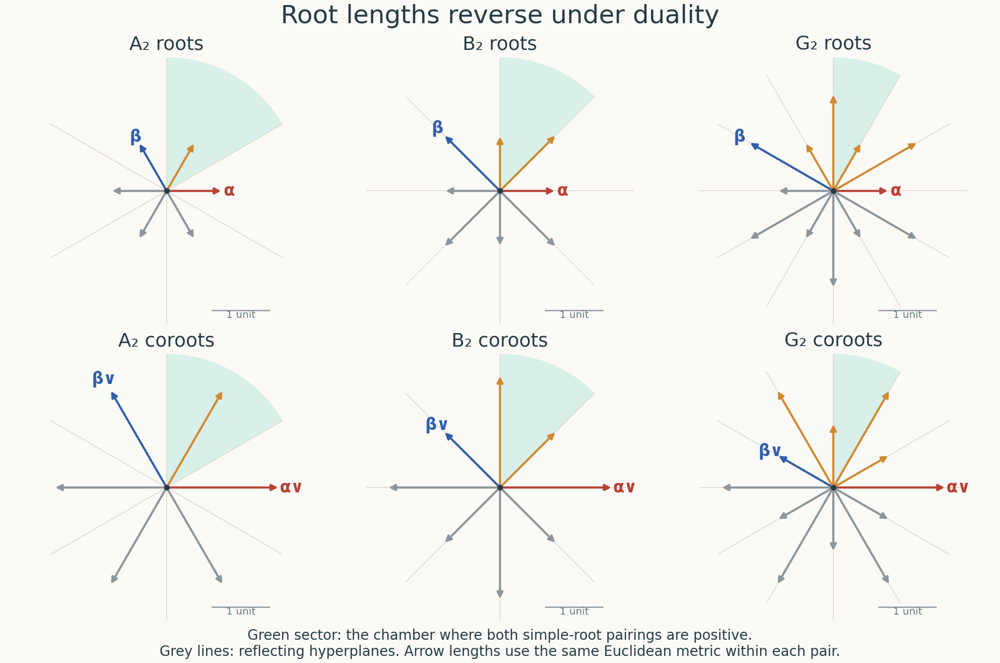

# Root data, Weyl chambers and the Bruhat decomposition

*Written by GPT-6.1 Sol (OpenAI) in Codex, Ultra setting, October 2026. Self-checked by the writing AI, GPT-6.1 Sol (OpenAI). Public domain (CC0).*

A root records how a torus moves a one-dimensional subgroup. Its coroot records the diagonal direction in the associated rank-one group. Keeping both, together with the integral character and cocharacter lattices, distinguishes groups that have the same root system. We first assemble these data, then use cocharacters to describe Borel subgroups and the Bruhat cells. The last part explains which of these constructions survive over an arbitrary base.

The preceding lesson supplies root groups, their canonical line-bundle parametrizations, coroots, and the limit subgroups $U_G(\lambda)$ and $P_G(\lambda)$. For the field arguments we also use the geometric Borel quotient and the simply transitive action of $N_G(T)/T$ on the Borels containing $T$, proved in the first two lessons. We prove the identification of this normalizer quotient with the reflection group here; Theorem 4.2 then proves arbitrary-base finiteness using this field calculation.

## 1. The integral data and their reflections

A **root datum** consists of finite free lattices $X$ and $X^\vee$, a perfect pairing

$$
\langle\ ,\ \rangle:X\times X^\vee\longrightarrow\mathbf Z,
$$

finite subsets $\Phi\subset X\setminus\{0\}$ and $\Phi^\vee\subset X^\vee\setminus\{0\}$, and a bijection $\alpha\mapsto\alpha^\vee$ between them. Its axioms are

$$
\langle\alpha,\alpha^\vee\rangle=2,
\qquad
s_\alpha(\Phi)=\Phi,
\qquad
s_\alpha^\vee(\Phi^\vee)=\Phi^\vee,
$$

where

$$
s_\alpha(x)=x-\langle x,\alpha^\vee\rangle\alpha,
\qquad
s_\alpha^\vee(y)=y-\langle\alpha,y\rangle\alpha^\vee.
\tag{1.1}
$$

We require the bijection to respect these reflections. The reflections square to the identity, are dual under the pairing, and send $\alpha$ and $\alpha^\vee$ to their negatives. These assertions follow by substituting $\langle\alpha,\alpha^\vee\rangle=2$ in (1.1). A datum is **reduced** if $\Phi\cap\mathbf Q\alpha=\{\alpha,-\alpha\}$ for every root. The empty root set is allowed: it describes a torus. Roots need not span $X_\mathbf Q$.

The **Weyl group** $W(\mathcal R)$ is the subgroup of $\operatorname{Aut}(X)$ generated by the $s_\alpha$. Here is a proof of its finiteness which also isolates the central directions. Let $V=\mathbf Q\Phi$. The image of $W(\mathcal R)$ on $V$ is finite, since it permutes a finite spanning set. Average a positive definite inner product on $V_\mathbf R$ over this image. Each $s_\alpha|_V$ is then an orthogonal reflection, and hence

$$
\langle v,\alpha^\vee\rangle
=\frac{2(v,\alpha)}{(\alpha,\alpha)}\quad(v\in V).
\tag{1.2}
$$

Consequently these functionals span $V^*$. Set

$$
Z_\mathbf Q=\{x\in X_\mathbf Q:\langle x,\alpha^\vee\rangle=0
\text{ for every }\alpha\}.
$$

The restriction map $X_\mathbf Q\to V^*$ is surjective and is an isomorphism on $V$, by (1.2). Thus $X_\mathbf Q=V\oplus Z_\mathbf Q$. Every reflection fixes $Z_\mathbf Q$ pointwise. The action on $V$ is therefore faithful on the entire Weyl group, proving finiteness. Equation (1.2) also shows that different roots have different coroots, and that proportional coroots come from proportional roots.

The **dual datum** interchanges $X$ with $X^\vee$ and $\Phi$ with $\Phi^\vee$. Its axioms are the same identities read in the other direction. Reducedness is preserved, by (1.2). A datum is semisimple if $\mathbf Q\Phi=X_\mathbf Q$; in that case

$$
\mathbf Z\Phi\subset X\subset
\operatorname{Hom}(\mathbf Z\Phi^\vee,\mathbf Z)
$$

inside $X_\mathbf Q$. The left and right lattices are the root and weight lattices. The intermediate lattice is information that a picture of the roots alone cannot retain.

**Figure 1. Roots and coroots in rank two.** The top row uses the Euclidean coordinates $\alpha=(1,0)$ and, respectively, $\beta=(-1/2,\sqrt3/2)$, $(-1,1)$ and $(-3/2,\sqrt3/2)$. Red and blue mark the simple roots; orange marks the other positive roots; grey arrows are negative roots. The bottom row applies the metric identification $r^\vee=2r/(r,r)$ from (1.2). The common scale makes the reversal of long and short lengths visible. Grey lines are reflecting hyperplanes, and the green sector consists of vectors pairing positively with both simple roots. This is a Euclidean realization of the rational spaces, not an identification of the integral character and cocharacter lattices. The definitions above and the reflection proof in Section 3 explain its mathematical content. The [reproducible figure source](https://kokunoyumeto.github.io/open-math-courses-public/courses/AG-RG/figure_sources/rank_two_roots.py) and figure are original CC0 contributions.

## 2. The root datum of a reductive group

Let $G$ be split connected reductive over a field $k$, and let $T$ be a split maximal torus. Take

$$
X=X^*(T),\qquad X^\vee=X_*(T),\qquad
\mathfrak g=\mathfrak t\oplus\bigoplus_{\alpha\in\Phi}\mathfrak g_\alpha.
$$

The pairing is composition of a character and a cocharacter. The preceding lesson proves that every root space is a line, that there are only the two roots $\pm\alpha$ on its rational line, and that the rank-one map $\varphi_\alpha:\operatorname{SL}_2\to G$ provides an intrinsic coroot with pairing two.

Choose a nonzero vector in $\mathfrak g_\alpha$ and its linked dual in $\mathfrak g_{-\alpha}$. Write the corresponding root parametrizations as $x_\alpha$ and $x_{-\alpha}$. The element

$$
n_\alpha=x_\alpha(1)x_{-\alpha}(-1)x_\alpha(1)
\tag{2.1}
$$

is the image of $\begin{pmatrix}0&1\\-1&0\end{pmatrix}$. It normalizes $T$. On the coroot torus it acts by inversion, and on the codimension-one torus killed by $\alpha$ it acts trivially. These statements follow in the rank-one group and remain valid after its central quotient. On the rational character lattice they give precisely the reflection (1.1), since the two rational torus directions form an isogeny decomposition. Equality on the rational lattice is equality on the integral lattice, which is torsion-free. Thus

$$
n_\alpha t n_\alpha^{-1}
=t\,\alpha^\vee(\alpha(t)^{-1}).
\tag{2.2}
$$

Conjugation by any normalizer element permutes the root spaces and their root groups. The uniqueness of the rank-one coroot construction then permutes the coroots in the same way. Applied to (2.1), this proves both reflection axioms and their compatibility.

**Theorem 2.1.** $(X^*(T),\Phi,X_*(T),\Phi^\vee)$ is a reduced root datum. Its formation commutes with extension of the field.

**Proof.** The preceding paragraphs verify all its axioms. Reducedness is the rank-one result of the preceding lesson. A split torus has unchanged character lattice under field extension; its weight decomposition and the canonical rank-one maps extend with it. This proves the last assertion. $\square$

For $\operatorname{GL}_n$, both lattices are $\mathbf Z^n$, with dual bases $e_i$ and $e_i^\vee$. The roots and coroots are

$$
\alpha_{ij}=e_i-e_j,\qquad
\alpha_{ij}^\vee=e_i^\vee-e_j^\vee\quad(i\ne j).
\tag{2.3}
$$

For $\operatorname{SL}_2$, write $T=\{\operatorname{diag}(t,t^{-1})\}$. In the resulting copies of $\mathbf Z$, the positive root is $2$ and its coroot is $1$. For $\operatorname{PGL}_2$, use $t\mapsto\operatorname{diag}(t,1)$ modulo scalars: the positive root is $1$ and its coroot is $2$. These two data are dual. Their root systems have the same two-point shape, but their integral data distinguish the groups even in characteristic two.

## 3. Reflections and chambers

In $X^\vee_\mathbf R$, remove the hyperplanes $\langle\alpha,\lambda\rangle=0$. The connected components are **Weyl chambers**. They are open convex cones, possibly with an unrestricted central factor. A chamber determines the positive system

$$
\Phi^+_\lambda=\{\alpha:\langle\alpha,\lambda\rangle>0\}.
\tag{3.1}
$$

Conversely its signs determine the chamber. Each chamber contains a rational point, and therefore an integral cocharacter after multiplication by a positive integer.

The reflection group is transitive on the chambers. To prove this, connect interior points of two chambers by a polygonal path that crosses only one hyperplane at a time and never their pairwise intersections. Such a path exists after a small perturbation. At a crossing, the reflection in that hyperplane interchanges the two adjacent chambers: choose a point of the wall on no other hyperplane, and a sufficiently small ball around it; the reflection reverses the normal direction and permutes the entire hyperplane arrangement. Successive reflections carry the first chamber to the last. This argument proves transitivity without assuming the normalizer calculation that follows.

We will also use the elementary description of simple roots. In a positive system, a positive root is **simple** if it is not a sum of two positive roots. The simple roots form a basis of $\mathbf R\Phi$, and every positive root is a nonnegative integral combination of them. Here are the combinatorial details.

First, for nonparallel roots $a,b$, if $(a,b)>0$, at least one of $a-b$ and $b-a$ is a root. This can be checked within their two-dimensional root system. The complete reduced crystallographic possibilities, with $a$ chosen short in the last two, have positive roots

$$
\begin{array}{c|l}
A_1\times A_1&a,b\\
A_2&a,b,a+b\\
B_2&a,b,a+b,2a+b\\
G_2&a,b,a+b,2a+b,3a+b,3a+2b.
\end{array}
\tag{3.2}
$$

For completeness, this list follows from the reflection axioms, rather than an algebraic-group classification. Two adjacent root lines make an angle $\theta$ for which the product of the two integral Cartan numbers is $4\cos^2\theta$. It is a nonnegative integer less than four. The successive reflections in adjacent lines fill their finite dihedral orbit, so the adjacent angles are respectively $\pi/2,\pi/3,\pi/4,\pi/6$. In the odd case all lines are one orbit and have equal root lengths. In the even nonorthogonal cases there are two orbits; the two Cartan numbers force the squared length ratios two and three. Reflecting two adjacent roots now gives exactly the sets (3.2) and their negatives. Checking subtraction in these displayed sets gives the assertion for every pair; orthogonal pairs have zero inner product and need no assertion.

Distinct simple roots consequently have nonpositive inner product: otherwise the positive one of their differences would decompose one of them. They are linearly independent. Indeed, a linear dependence can be separated into an equality of positive linear combinations with disjoint supports. The inner product of the two sides is nonpositive, while their common squared norm is positive unless both are zero. Applying the chamber functional excludes a nonempty positive combination equal to zero. Finally, decompose any nonsimple positive root into two positive roots and repeat. There is no infinite descent, since the chamber functional has a positive minimum on the finite positive root set. This gives a nonnegative integral expansion in the simple roots and proves spanning.

If $\alpha$ is simple, $s_\alpha$ permutes $\Phi^+\setminus\{\alpha\}$. In the simple-root expansion of a different positive root, at least one other coefficient is nonzero; reflection changes only the coefficient of $\alpha$. All coefficients of a root have the same sign, so the reflected root remains positive. The walls of the chamber are therefore its simple-root walls. The reflections in these walls generate the whole reflection group: their subgroup is already transitive on chambers by the crossing argument, and every root wall becomes a wall of the initial chamber after such a transport. Every root reflection is consequently conjugate to a simple-root reflection in that subgroup.

### Length and standard parabolic cosets

We first prove the reflection assertion entirely in the root space, before using any group normalizer. This also makes the length and word results available for every reduced root datum.

**Lemma 3.A (a chamber has trivial stabilizer).** The reflection group acts freely on chambers.

**Proof.** For an empty root set the group is the identity, so the assertion holds. Otherwise work in the Euclidean root space, discarding the central factor, on which all reflections act trivially. Reflection across a wall carries either adjacent chamber to the other. Starting with a fixed chamber $C$, a path crossing one wall at a time therefore transports $C$ by a product of the crossed-wall reflections. If the current transport is $v$, a wall of $vC$ is $v$ applied to a simple wall of $C$; crossing it replaces $v$ by $vs_i$. Thus words in the simple reflections and such wall galleries give the same transports.

We show that a closed gallery has identity transport. Realize it by a polygonal loop avoiding intersections of two hyperplanes at its crossings. Fill the loop by a polygonal disk in the root space; for example join each of its edges to an auxiliary interior vertex. Subdivide and perturb the interior vertices slightly. Because there are finitely many hyperplanes, the vertices can be chosen so that the disk avoids their intersections of codimension at least three, meets each codimension-two intersection transversely in finitely many interior points, and crosses single hyperplanes transversely away from these points. These choices exclude finitely many proper algebraic conditions on the perturbations. Intersections of codimension greater than two can be avoided by a two-dimensional disk; the same statement in dimensions one and two has no such intersections to avoid.

The inverse images of the walls now divide the disk into regions. Passing a path across an ordinary wall arc and back inserts two copies of the same reflection, whose product is the identity. Passing across an intersection point changes its gallery by the small circuit around that point. Its walls have normals in the two-dimensional orthogonal complement of the intersection. The roots in this plane form exactly one of the rank-two systems (3.2). By the calculation preceding that list, consecutive reflecting lines have angle $\pi/m$, for $m=2,3,4,6$. The $2m$ successive crossings around a small full circle have product the identity: consecutive pairs rotate this plane by $2\pi/m$, and $m$ such pairs make a full rotation. Every factor fixes the common orthogonal complement, so the product is the identity on the whole root space. The orientation-reversed circuit has the inverse product and gives the same conclusion.

To see that these are all changes needed, cut the disk along disjoint arcs from its finitely many intersection points to its boundary. In the cut polygon any closed path can be reduced by successively removing its innermost crossings of wall arcs. Restoring each cut inserts the corresponding small circuit or its inverse. Hence the boundary gallery has identity transport, by the two calculations just given. In dimension one a loop consists directly of back-and-forth crossings and has the same conclusion.

Suppose $wC=C$. Choose a word for $w$ in simple reflections. Its successive chambers give a gallery from $C$ back to $C$. Join the two endpoint representatives inside the convex chamber, producing a closed gallery without an additional crossing. Its transport is $w$, so the preceding argument gives $w=1$ on the root space. Section 1 proved that this action determines $w$ on the full lattice. Thus $w=1$. $\square$

The cell dimensions below now follow from this independent chamber proof. No normalizer identification is used in the length calculation.

**Proposition 3.1.** Let $\ell(w)$ be the minimum number of simple reflections in an expression for $w$. Then $\ell(w)=|\Psi_w|$, where $\Psi_w=\{\alpha\in\Phi^+:w^{-1}\alpha<0\}$. For $J\subset\Delta$, each right coset of $W_J=\langle s_\alpha:\alpha\in J\rangle$ has a unique element $w$ of minimum length. It is characterized by $w(\Phi_J^+)\subset\Phi^+$. For this $w$ and every $z\in W_J$,

$$
\Psi_{wz}=\Psi_w\sqcup w\Psi_z,
\qquad \ell(wz)=\ell(w)+\ell(z).
$$

**Proof.** Fix the positive chamber $C$. A word in simple reflections gives a gallery of adjacent chambers from $C$ to $wC$: if the current chamber is $vC$, its wall corresponding to a simple root leads to $vs_\alpha C$. Every such gallery must cross each hyperplane separating $C$ from $wC$. There are $|\Psi_w|$ of these, since the sign of a positive root on $wC$ is the sign of $w^{-1}\alpha$ on $C$.

Conversely choose interior points of $C$ and $wC$ generically, so the straight segment between them never meets an intersection of distinct root hyperplanes. A hyperplane with endpoints on the same side is not crossed; each separating hyperplane is crossed exactly once. The segment therefore supplies a gallery with $|\Psi_w|$ steps. Write its successive chambers as $vC$ by the preceding adjacent-wall rule. At the end, $vC=wC$; freeness from Lemma 3.A gives $v=w$. Thus the gallery supplies a word of that length and proves the length formula. The same wall calculation gives $\ell(ws_\alpha)=\ell(w)+1$ or $\ell(w)-1$ according as $w\alpha$ is positive or negative.

Choose a minimum-length element $w$ of a right coset, which exists because $W$ is finite. The last calculation gives $w\alpha>0$ for every $\alpha\in J$. Every root in $\Phi_J^+$ is a nonnegative integral combination of those simple roots; its image is consequently positive. Thus $w(\Phi_J^+)\subset\Phi^+$.

Each generator of $W_J$ changes only the coefficient of its own simple root in a root's simple-root expansion. A positive root outside $\Phi_J$ has a positive coefficient outside $J$, which remains unchanged. Since all coefficients of a root have the same sign, every element of $W_J$ preserves its positivity. The corresponding assertion holds for negative roots outside $\Phi_J$. In particular $\Psi_z\subset\Phi_J^+$ for $z\in W_J$.

Now suppose $w$ sends $\Phi_J^+$ to positive roots. If $\alpha\in\Psi_w$, then $w^{-1}\alpha$ is negative and outside the Levi subsystem: a negative Levi root would have negative image under $w$, whereas $\alpha$ is positive. Applying $z^{-1}$ therefore leaves it negative. If $\alpha\notin\Psi_w$ is positive, then $w^{-1}\alpha$ is positive, and $z^{-1}w^{-1}\alpha$ is negative precisely when $w^{-1}\alpha\in\Psi_z$. These two cases prove the displayed disjoint inversion-root identity. Its cardinalities and the length formula prove length additivity. They also show that any element with the positive-Levi condition is a minimum in its right coset.

Finally, if two such minima satisfy $w'=wz$, applying additivity in both directions gives $\ell(w')=\ell(w)+\ell(z)$ and $\ell(w)=\ell(w')+\ell(z^{-1})$. Since $\ell(z^{-1})=\ell(z)$, we get $\ell(z)=0$ and $z=1$. This proves uniqueness. $\square$

### Relations between reflection words

The same length calculation determines all relations between simple reflections. This is the Coxeter presentation used in the pinned isomorphism argument of the next lesson. Its inputs are the rank-two root calculation (3.2), chamber freeness in Lemma 3.A, and the standard-parabolic coset calculation in Proposition 3.1. The proof below applies to every reduced root datum, including its central lattice directions.

For distinct simple roots $\alpha_i,\alpha_j$, put $c_{ij}=\langle\alpha_i,\alpha_j^\vee\rangle\langle\alpha_j,\alpha_i^\vee\rangle$. The invariant positive definite form gives $c_{ij}=4\cos^2\theta$, where $\theta$ is the obtuse angle between these roots. The rank-two calculation (3.2) gives $c_{ij}=0,1,2,3$ and $m_{ij}=2,3,4,6$, respectively. On the plane spanned by these roots, the product $s_i s_j$ is a rotation through $2\pi/m_{ij}$, up to orientation, and on its orthogonal complement it is the identity. Hence it has order $m_{ij}$. The group $W_{ij}=\langle s_i,s_j\rangle$ consists of the $m_{ij}$ rotations $(s_i s_j)^a$ and the $m_{ij}$ reflections $(s_i s_j)^a s_i$.

After cancelling adjacent equal letters, words in two involutions alternate. Write $R=s_i s_j$. Alternating words of length $2a$ are $R^a$ and $R^{-a}$, while those of length $2a+1$ are $R^a s_i$ and $R^{-a-1}s_i$. Comparing these exponents modulo $m_{ij}$ shows that all alternating words of length less than $m_{ij}$ are distinct and reduced. The two alternating words of length $m_{ij}$ agree and give the unique longest element. These words exhaust the $2m_{ij}$ elements: there is one empty word, two words at each length $1,\ldots,m_{ij}-1$, and one element at length $m_{ij}$.

A **braid move** replaces either alternating block of length $m_{ij}$ by the other. With the involution relations, it is equivalent to $(s_i s_j)^{m_{ij}}=1$.

**Lemma 3.2 (two left descents).** If both $s_i$ and $s_j$ shorten $w$ on the left, there is a length-additive factorization $w=v_0u$, where $v_0$ is the longest element of $W_{ij}$ and $u$ has minimum length in $W_{ij}w$.

**Proof.** Invert the unique minimum representative assertion of Proposition 3.1 to obtain the left-coset version. It gives $w=vu$, $v\in W_{ij}$, with $u^{-1}(\Phi_{ij}^+)\subset\Phi^+$ and $\ell(vu)=\ell(v)+\ell(u)$. A positive root outside $\Phi_{ij}$ has a positive coefficient on some other simple root; neither $s_i$ nor $s_j$ changes that coefficient. Such a root remains positive under $W_{ij}$, so the ambient length of $v$ equals its rank-two length.

For $k=i,j$, the root $v^{-1}\alpha_k$ belongs to $\Phi_{ij}$, and $u^{-1}$ preserves its sign. Thus $w^{-1}\alpha_k<0$ implies $v^{-1}\alpha_k<0$. Every positive root in $\Phi_{ij}$ is a nonnegative combination of $\alpha_i,\alpha_j$, so $v^{-1}$ makes all of them negative. Its length is consequently the number of rank-two positive roots. This is the rank-two longest element just calculated. $\square$

**Lemma 3.3 (reduced words).** Any two reduced words for the same element are connected by braid moves.

**Proof.** Induct on the length $k$. If the first letters agree, cancel them, apply induction to the two tails of length $k-1$, and restore the first letter. Otherwise the two first letters are $s_i\ne s_j$, so both shorten $w$ on the left. Lemma 3.2 gives $w=v_0u$, with $\ell(w)=m_{ij}+\ell(u)$. Fix a reduced word for $u$. Prefix it with either alternating length-$m_{ij}$ word for $v_0$. Both resulting words are reduced; one starts with $s_i$, the other with $s_j$. After cancelling the first $s_i$, induction connects the first original word to the first constructed word. The same induction with $s_j$ treats the second original word. A single braid move connects the two constructed prefixes. Composing these moves proves the assertion. $\square$

**Theorem 3.4 (Coxeter presentation).** For the Weyl group of the root datum under consideration,

$$
W=\langle s_i\mid s_i^2=1,\ (s_i s_j)^{m_{ij}}=1\ (i\ne j)\rangle.
$$

**Proof.** The relations hold by the reflection and rank-two calculations, so the presented group surjects onto $W$. Reduce an arbitrary word by induction on its number of letters. First reduce its prefix to a reduced word for its value $a$. If the final letter $s_i$ increases length, the word is reduced. If it decreases length, choose a reduced word $A$ for $as_i$. Then $A s_i$ is reduced for $a$, by Proposition 3.1. Lemma 3.3 changes the reduced prefix to $A s_i$ by braid moves. The entire word becomes $A s_i s_i$, and the involution relation cancels the last two letters. Thus the given relations turn every word into a reduced word for its actual value. A word representing $1$ reduces to the empty word. The kernel is zero. $\square$

The argument applies to the full character lattice, including its central summand: reflections fix that summand, and the faithful action on the root span in Section 1 determines their relations.

## 4. Borel subgroups are positive systems

We first work over an algebraic closure. A Borel subgroup $B$ containing $T$ contains exactly one of $U_\alpha,U_{-\alpha}$ for every root. Indeed, $B\cap C_G(T_\alpha)$ is a Borel subgroup of the rank-one centralizer, by the centralizer–Borel argument of the preceding lesson. There its two possibilities are the two triangular subgroups constructed in rank one. In particular,

$$
\dim B=\dim T+\tfrac12|\Phi|.
\tag{4.1}
$$

For an integral cocharacter $\lambda$ in a chamber, the limit construction gives

$$
L_G(\lambda)=T,\qquad
P_G(\lambda)=T\ltimes U_G(\lambda),
\qquad
\operatorname{Lie}U_G(\lambda)
=\bigoplus_{\langle\alpha,\lambda\rangle>0}\mathfrak g_\alpha.
\tag{4.2}
$$

The equality $L_G(\lambda)=T$ follows because the smooth connected centralizer has Lie algebra $\mathfrak t$. The second group is connected solvable and hence lies in a Borel subgroup. Its dimension is (4.1), so it is that Borel subgroup. The root groups of positive sign lie in $U_G(\lambda)$: their rank-one parametrizations are multiplied by $t^{\langle\alpha,\lambda\rangle}$, which tends to zero. Thus $P_G(\lambda)$ depends only on the chamber. Conversely, two such subgroups with different signs have different Lie algebras, so their chambers are different.

Every Borel containing $T$ arises this way. Choose one $P_G(\lambda)$. The normalizer quotient acts transitively on Borels containing $T$, by the earlier torus conjugacy argument. If $n$ carries this subgroup to $B$, then it carries the cocharacter to $n\lambda n^{-1}$ and (4.2) to the Lie algebra of $B$. Thus $B=P_G(n\lambda n^{-1})$.

The construction is defined over $k$ because $T$ is split and $\lambda$ is integral in its character-dual lattice. Geometric equality of the resulting smooth closed subgroups descends. It follows that all the geometric Borels containing $T$ are defined over $k$.

**Theorem 4.1.** For a split reductive group over any field, Borels containing its split maximal torus correspond bijectively to positive systems. The normalizer Weyl group equals the reflection Weyl group and acts simply transitively on these systems.

**Proof.** We have proved the correspondence, and it respects the normalizer action. Each root reflection is represented by (2.1), so the reflection group embeds in the normalizer quotient. It is transitive on chambers by Section 3. The normalizer quotient is simply transitive on the corresponding Borels: a normalizer element fixing a Borel lies in $N_G(B)\cap N_G(T)=B\cap N_G(T)=T$. Hence a transitive subgroup of this simply transitive permutation group must be the whole group. This proves both equality and freeness. Products of (2.1) give representatives $n_w\in N_G(T)(k)$ for every $w$. $\square$

**Theorem 4.2 (the relative Weyl scheme).** $W_G(T)$ is represented by a finite étale group scheme over $S$.

**Proof.** We prove representability directly as a functor before forming a quotient. Work on an étale cover on which $T=D_S(X)$ is split, and then on open subsets on which the finite roots and coroots are constant. The weight summands of $\operatorname{Lie}G$ have locally constant ranks, and coroots are locally constant lattice maps by *Diagonalizable groups*, Proposition 7.4. Choose a positive base and trivialize its finitely many simple root lines. All these choices are available on this cover; no global pinning is required.

The earlier AG-RG-03 Theorems 4.1 and 7.1 provide the paired root parameters and the rank-one $\operatorname{SL}_2$ homomorphism. For a simple root define $n_\alpha=x_\alpha(1)x_{-\alpha}(-1)x_\alpha(1)$. It normalizes $T$: in $G_\alpha$ the preimage of its adjoint diagonal torus is $T$, and the rank-one matrix normalizes that torus. Its action on $T$ is the reflection
\[
n_\alpha t n_\alpha^{-1}=t\,\alpha^\vee(\alpha(t)^{-1}).
\]
This identity holds on all test schemes. To verify it without discarding central or nilpotent elements, lift $\alpha(t)$ fppf locally through the square map on $\mathbf G_m$, say $\alpha(t)=r^2$. Then $t=z\alpha^\vee(r)$ with $z\in\ker\alpha=Z(G_\alpha)$, and the rank-one matrix sends $\alpha^\vee(r)$ to $\alpha^\vee(r^{-1})$. This gives the formula locally and hence by descent. The square cover is faithfully flat even in characteristic two.

For every element $w$ of the finite reflection group from Section 3, choose one simple-reflection word and multiply its $n_\alpha$ to obtain a section $n_w$ with that action on $X$. No independence of the chosen word is needed. Theorem 4.1 identifies, on every geometric fibre, the normalizer's torus action with exactly this reflection group, including its action on the full character lattice.

Now let $S'\to S$ be any test scheme and $n\in N_G(T)(S')$. Proposition 7.4 represents automorphisms of $D_{S'}(X)$ by the discrete constant scheme $\operatorname{Aut}(X)_{S'}$. Thus the action of $n$ is a locally constant lattice automorphism. Its value at every geometric point is in the finite subset $W$, by Theorem 4.1. A locally constant map to a discrete scheme therefore factors through $W_{S'}$ on the whole test scheme, including its nilpotents. On the open and closed region labelled $w$, the element $n_w^{-1}n$ centralizes $T$, and the earlier AG-RG-02 Theorem 2.2 identifies this schematic centralizer with $T$. Conversely every $n_wt$ normalizes $T$. We have proved an isomorphism of functors
\[
\coprod_{w\in W}T\xrightarrow{\sim}N_G(T),\qquad (w,t)\longmapsto n_wt.
\]
Its inverse is the locally constant action label together with $n_w^{-1}n$. In particular the normalizer is represented and smooth on this cover. Right multiplication by $T$ acts within each labelled copy, so its fppf quotient is exactly the constant finite étale scheme $W_S$ there.

On overlaps these quotients represent the same fppf normalizer-quotient sheaf, so their unique identifications satisfy the cocycle identity and respect multiplication. Effective affine algebra descent, proved at the beginning of *Quotients and torsors*, glues them to a group scheme over $S$. Finite locally free algebras descend by the finite-presentation and finite-projectivity descent proofs; here their local algebras are finite products of the base algebra. Étaleness also descends: over a square-zero test extension the local constant finite schemes have unique lifts, and uniqueness makes these lifts agree on the faithfully flat overlaps. Thus the descended finite-presentation algebra is formally étale. The quotient is finite étale over the original arbitrary base. $\square$

## 5. Coordinates on the unipotent radicals

We need actual scheme coordinates, rather than only equality of dimensions. The following graded argument works over a base ring $R$ as well as over a field.

**Lemma 5.1.** Suppose a smooth affine $R$-scheme $Y$ of finite presentation has a section $e$ and a $\mathbf G_m$-action which extends to $\mathbf A^1$ and sends $0\times Y$ to $e$. Suppose the tangent module at $e$ is free with positive weights $d_1,\ldots,d_N$. A $\mathbf G_m$-equivariant map from $\mathbf A_R^N$, with these weights, to $Y$ whose differential at zero is an isomorphism is an isomorphism.

**Proof.** Write $A=\Gamma(Y,\mathcal O_Y)$. Extension of the action gives a nonnegative grading. Contraction to $e$ makes $A_0=R$, and the augmentation ideal is $I=\bigoplus_{d>0}A_d$. Choose finitely many homogeneous algebra generators; their positive degrees imply that the degree filtration and the $I$-adic filtration are cofinal. Thus completion retains every finite degree component faithfully.

The given map is étale along the zero section, since both schemes are smooth and its differential is invertible there. Equivalently, in coordinates its invertible linear term allows unique successive solution modulo $I^m$: once a solution is known modulo $I^m$, the next correction is the solution of the same invertible linear system in $I^m/I^{m+1}$. It induces an isomorphism on the formal completions at the sections. The isomorphism respects degrees. Restricting it and its inverse to each finite degree component, and then taking their direct sums, gives an isomorphism of the original graded algebras. This proves the assertion. $\square$

For any ordering $\alpha_1,\ldots,\alpha_N$ of $\Phi^+$, multiplication gives

$$
\prod_i U_{\alpha_i}\xrightarrow{\sim}U_G(\lambda).
\tag{5.1}
$$

Indeed both sides are contracted by $\lambda$, and the differential is the direct-sum identification of their distinct root lines. After trivializing these lines, Lemma 5.1 applies; the result descends from these local trivializations. We denote the group by $U^+$, independently of the ordering. Applying the same argument to $-\lambda$ and using the open immersion in the preceding lesson gives the **big cell**

$$
U^-\times T\times U^+\hookrightarrow G.
\tag{5.2}
$$

The inverse of (5.1) provides root coordinates. For roots $a,b$ with $b\ne\pm a$, choose a positive system containing them. The commutator has the form

$$
[x_a(u),x_b(v)]
=\prod_{ia+jb\in\Phi,\ i,j>0}
x_{ia+jb}(C_{ij}u^iv^j).
\tag{5.3}
$$

Here the order is fixed, and the coefficients depend on the parametrizations and order. To prove the formula, take any root coordinate of the commutator. It is a polynomial in $u,v$, equivariant for $T$. Its monomials must have weight equal to that root. Setting either variable to zero makes the commutator one, so both exponents must be positive. Since $a,b$ are linearly independent, the exponents for a given target root are unique. This proves (5.3), including over rings with nilpotents; distinct torus characters are distinct homogeneous degrees, so no cancellation by a characteristic is involved.

We shall need root subsets $\Psi=\Phi^+\cap C$ where $C$ is closed under addition. Setting the coordinates outside $\Psi$ to zero in (5.1) gives a smooth closed subgroup $U_\Psi$, directly parametrized by the groups in $\Psi$ in any order. To check the subgroup assertion, use the torus-equivariant coordinate polynomials for multiplication and inversion. Every nonconstant monomial has target weight equal to the sum of its input weights. A sum of weights in $C$ is in $C$, so a coordinate outside $\Psi$ remains zero. Different orderings give the same subgroup: in the coordinates of one ordering the product in another has no component outside $\Psi$, and its invertible differential and contraction give an isomorphism by Lemma 5.1.

In particular this applies to the two subsets

$$
\Psi_w=\Phi^+\cap w\Phi^- ,\qquad
\Theta_w=\Phi^+\cap w\Phi^+.
\tag{5.4}
$$

Their cones are the intersections of two open linear half-spaces. Ordering the first subset before the second in (5.1) gives $U^+=U_{\Psi_w}U_{\Theta_w}$ as a product of schemes.

## 6. The Bruhat cells from a projective limit

We spell out the projective geometric argument used here.

**Lemma 6.1.** Let a $\mathbf G_m$ act on a smooth projective variety with an equivariant projective embedding. Suppose its fixed points are isolated. The points whose limit at zero is a fixed point $p$ form an affine locally closed scheme $Y_p$, contracted to $p$, and its tangent space at $p$ is the positive-weight part of $T_pY$. An equivariant map from a positive-weight affine space to $Y_p$, with invertible differential at zero, is an isomorphism.

**Proof.** Diagonalize the action on the vector space of the embedding. Represent $p$ by an eigenvector of weight $m$ and choose one of its nonzero coordinates. In the corresponding affine chart, the limit is $p$ precisely when all coordinates of weight less than $m$ vanish and all ratios of weight $m$ coordinates equal their values at $p$. The remaining coordinates have strictly positive relative weights. Intersect this affine linear space with the projective variety. This constructs $Y_p$ as a closed subscheme of an affine space, with the stated limit condition.

At $p$, choose homogeneous formal parameters in the smooth completed local ring; this is possible by the weight decomposition and lifting a basis of the cotangent space. The limit equations set the negative-weight parameters to zero. There are no zero-weight parameters because the fixed scheme is smooth with zero tangent dimension. Thus the completed local ring of $Y_p$ is the formal power-series ring in the positive parameters. It is smooth at $p$ and has the asserted tangent space. The nonsmooth locus of $Y_p$ would be a closed invariant subset. If nonempty, contraction would put $p$ in it, a contradiction. Hence $Y_p$ is smooth everywhere. Lemma 5.1 proves the last assertion. These constructions commute with extension of the field. $\square$

Let $B$ correspond to $\Phi^+$ and choose an integral cocharacter $\lambda$ in its chamber. The projective variety $G/B$ has an equivariant projective embedding, from the ample homogeneous line bundle in the quotient construction of the preceding lesson. Its $T$-fixed points are the points $n_wB$, $w\in W$. To see this, a fixed coset represents a Borel containing $T$, and Theorem 4.1 applies.

There are no additional fixed points of $\lambda$. Each connected component of the proper fixed scheme is $T$-stable and therefore contains a $T$-fixed point by the torus fixed-point theorem. At such a point the tangent weights are roots, all nonzero on $\lambda$. Its fixed tangent space is zero. Smoothness of fixed schemes for a torus then makes the component a point. The fixed scheme is consequently the same finite reduced set $\{n_wB\}$.

At $n_wB$, the tangent weights of $G/B$ are $\Phi\setminus w\Phi^+$, with the toral summand removed. Its positive-weight part is precisely

$$
\bigoplus_{\alpha\in\Psi_w}\mathfrak g_\alpha.
$$

The map $U_{\Psi_w}\to G/B$, $u\mapsto un_wB$, lands in the attracting scheme of this point. It is equivariant and its differential is the displayed isomorphism. Lemma 6.1 therefore gives an isomorphism

$$
U_{\Psi_w}\xrightarrow{\sim}(G/B)_{n_wB}^+.
\tag{6.1}
$$

Every geometric point of a projective variety has a limit under $\lambda(t)$ as $t\to0$, as follows directly from the least nonzero weight in its projective coordinates. That limit is fixed and unique. Thus the schemes (6.1) are disjoint locally closed strata covering $G/B$.

They are also exactly its $B$-orbits. In (5.4), $U_{\Theta_w}$ fixes $n_wB$, since each of its root groups is contained in $n_wBn_w^{-1}$. The torus fixes the same point. The product decomposition of $U^+$ therefore shows

$$
Bn_wB/B=U_{\Psi_w}n_wB/B.
$$

Pull back the principal $B$-bundle $G\to G/B$ to this stratum. It has the section $u\mapsto un_w$, so it is trivial. We obtain an isomorphism of locally closed schemes

$$
U_{\Psi_w}\times B\xrightarrow{\sim}Bn_wB,
\qquad (u,b)\longmapsto un_wb.
\tag{6.2}
$$

**Theorem 6.2 (Bruhat decomposition).** For a split connected reductive group over any field $k$,

$$
G=\coprod_{w\in W}Bn_wB
\quad\text{as a locally closed stratification},
\qquad
G(k)=\coprod_{w\in W}B(k)n_wB(k).
\tag{6.3}
$$

Moreover $Bn_wB$ has dimension $\dim B+|\Psi_w|$, and its quotient by the right $B$-action is an affine space of dimension $|\Psi_w|$.

**Proof.** The geometric stratification and the scheme isomorphisms were just proved. They are defined over $k$: the root groups, cocharacter, and representatives (2.1) all are. For $g\in G(k)$ its image in $G/B$ belongs to exactly one stratum; the inverse of (6.1) is defined over $k$, so it supplies $u\in U_{\Psi_w}(k)$. Equality of the two cosets means $(un_w)^{-1}g\in B(k)$. This proves (6.3) without assuming that rational points are dense or that the field is infinite. Conversely (6.2) makes every such product a point of the indicated stratum. Its dimension and affine-space assertion follow from (5.1). $\square$

The disjoint-union notation in (6.3) describes strata and points. It does not assert that the cells are open-and-closed components, or that a morphism from a general scheme lands in one cell globally. In $\operatorname{SL}_2$ the two cells have dimensions two and three, and the latter is open dense.

## 7. Central quotients and their root coordinates

**Theorem 7.1.** Let $G$ be reductive over $S$ and $H\subset Z(G)$ a closed subgroup of multiplicative type of finite presentation. Its affine reductive quotient $G/H$, constructed in the preceding lesson, Theorem 1.1, commutes with every base change. For a split maximal torus $T$ its maximal torus is $T/H$, and its root groups are the images of those of $G$.

**Proof.** The preceding lesson proves the affine quotient, torsor, finite-presentation, arbitrary-base-change and reductivity assertions. We now prove the additional coordinate assertions, using the root groups already constructed.

Finally, after making $T$ split, $H\subset T$, and $T/H$ is a torus: its characters are the kernel of $X^*(T)\to X^*(H)$, a free sublattice. The big cell is $H$-stable, with $H$ acting only on its torus factor. Its quotient is the open subscheme

$$
U^-\times(T/H)\times U^+\subset Q.
\tag{7.1}
$$

Root groups intersect $H$ trivially and hence embed in $Q$. Their images are closed: the inverse image of such an image is $H U_\alpha$, a closed subscheme of the triangular rank-one subgroup, and closedness descends along $q$. The cells (7.1) show that their weights are the same roots, now regarded as characters of $T/H$. There are no additional zero weights, so $T/H$ is a maximal torus by the centralizer criterion. Everything constructed by invariants commutes with base change, and the local constructions glue uniquely as fppf quotients. $\square$

The only general morphism tools used in this proof are the fibre criteria for flatness, smoothness and étaleness: a finite-presentation morphism between schemes flat over the same base is flat if its fibre morphisms are flat; a flat finite-presentation morphism with smooth (respectively étale) fibres is smooth (respectively étale). These are general algebraic-geometry prerequisites, not reductive-group classification results.

## 8. Splittings and subgroup constructions in families

Over a scheme, saying that a maximal torus is split does not trivialize its root lines. We call a reductive group **split with specified root datum** when its maximal torus is identified with $D_S(X)$, its root datum is the indicated constant datum, and its root lines are trivializable. A **pinning** additionally chooses a nowhere-vanishing section in each simple root line. These are the objects classified in the next lesson.

Every reductive group acquires such a splitting and a pinning étale locally. The second lesson, Theorem 2.3, provides a maximal torus; the first lesson provides its étale splitting. Its finite weight decomposition has locally constant ranks; the root set can therefore be made constant after an open localization. Coroots are sections of the locally constant cocharacter sheaf and can likewise be made constant. Trivialize the finitely many simple root lines on a further open cover. The root groups and rank-one constructions then supply the pinning. No assumption that the original base is reduced is used.

The coordinate proof in Section 5 works over this cover and descends without chosen parametrizations. Thus for a positive system the product of its root **line bundles** is $U^+$, and (5.2) is an open immersion over the base. For a cocharacter $\lambda$, the smooth closed subgroup $P_G(\lambda)$ has roots of nonnegative pairing; its Levi subgroup $L_G(\lambda)$ has roots of zero pairing and is reductive, being a torus centralizer. Its unipotent subgroup $U_G(\lambda)$ has roots of positive pairing. The limit homomorphism gives the actual Levi decomposition $P_G(\lambda)=L_G(\lambda)\ltimes U_G(\lambda)$. Relative parabolic quotients and their parameter scheme are the subject of the last lesson.

For the quotient in Theorem 7.1, the root datum is especially transparent. Let $X'=\ker(X\to X^*(H))$. The roots lie in $X'$ because $H$ is central. Characters change from $X$ to $X'$, cocharacters by the dual map, and each coroot becomes its image under $T\to T/H$. The pairing with every root remains two. A central quotient can change the integral lattice without changing the root system.

The torus example warns against silently choosing one datum on a disconnected base. On one component take $\mathbf G_m$ and on another take $\mathbf G_m^2$. This is a reductive group with no single constant character lattice on the whole base. All constant-datum statements are made componentwise or on the explicitly stated covers.

### Bruhat cells over a base

The field theorem also gives actual cells over the integers; the following argument identifies their scheme structures before using their fibres.

**Theorem 8.1 (relative Bruhat cells).** Let $G/S$ be a pinned split reductive group of constant reduced root datum. Fix its split torus $T$, positive Borel $B$, Weyl group $W$, and the pinning representatives $n_w$. Let $N=|\Phi^+|$, $r=\operatorname{rank}X^*(T)$, and $\Psi_w=\{\alpha\in\Phi^+:w^{-1}\alpha\in-\Phi^+\}$. Multiplication gives locally closed immersions

$$
U_{\Psi_w}\times B\longrightarrow G,\qquad (u,b)\longmapsto un_wb,
$$

whose images $C_w$ form a finite, disjoint stratification of $G$. With the root frames and a basis of $X^*(T)$, they have coordinates

$$
C_w\simeq\mathbf A_S^{\ell(w)}\times\mathbf G_{m,S}^{r}\times\mathbf A_S^N.
$$

The construction commutes with arbitrary base change, including to nonreduced schemes. For $S=\operatorname{Spec}\mathbf Z$, each stratum is a product of a split torus and an affine space over the integers. The assertion is a stratification of schemes; it does not identify $G$ with their coproduct as schemes or partition $G(R)$ for an arbitrary ring $R$.

**Proof.** The ordered root-product theorem of Section 5, applied relatively as above, identifies $U_{\Psi_w}$ with the product of its root lines. The set $\Psi_w$ is closed under addition of roots. Conjugation by $n_w^{-1}$ identifies it with a closed root-product subscheme of $U^-$: complete its root ordering by the remaining negative roots, and set those remaining coordinates to zero. This is a closed immersion over $S$, since the ordered product identifies the whole $U^-$ with a product of root lines. After left translation by $n_w^{-1}$, the displayed map is the composite

$$
n_w^{-1}U_{\Psi_w}n_w\times B\ \hookrightarrow\ U^-\times B\ \hookrightarrow\ G.
$$

The second map is the relative open-cell immersion already proved. Thus the original map is a locally closed immersion, with precisely the stated product as its source and image. This argument is over the base, rather than an inference of an immersion from geometric fibres. Inversion applied to the cell indexed by $w^{-1}$ also gives the opposite-order coordinates $B\times U_{\Psi_{w^{-1}}}\to C_w$, $(b,u)\mapsto bn_wu$. A different pinning representative of the same Weyl element differs by an element of $T$ and only changes the torus coordinate. Thus one can equally use $U^+\times T\times U_{\Psi_{w^{-1}}}$. The inversion convention in this order is $\Psi_{w^{-1}}=\{\alpha>0:w\alpha<0\}$.

On each geometric fibre, Theorem 6.2 identifies these images with the Bruhat cells. Hence their underlying sets cover $G$ and are pairwise disjoint: every point lies over a point of $S$, and a geometric point above it tests both assertions. The length formula of Section 3 gives $|\Psi_w|=\ell(w)$. Finally $B=T\ltimes U^+$ as a group and $T\times U^+$ as a scheme, with $U^+\simeq\mathbf A_S^N$ after choosing the root frames. These identifications prove the coordinate formula. All maps, coordinate-zero immersions and representatives base change, proving the last assertion. $\square$

For a finite field $\mathbf F_q$ this gives the useful count

$$
|G(\mathbf F_q)|=(q-1)^r q^N\sum_{w\in W}q^{\ell(w)}.
$$

For a torification of the integral scheme, partition each affine coordinate by zero versus invertible. On a cell with $d=N+\ell(w)$ affine coordinates, a subset $I$ of invertible coordinates gives a locally closed torus $\mathbf G_m^{r+|I|}$, with every other coordinate zero. These finitely many pieces partition geometric points and points over every field. They do not make each point over a ring belong to exactly one such piece. Thus the construction supplies the relative cells and counting hypotheses used in the lessons on finite-field counting and torified varieties without a claim about general ring-valued Bruhat double cosets.

### A global equation for the longest cell

The longest cell is already open. An integral equation for this open will also control denominators in its coordinates.

**Proposition 8.2 (the normalized longest-cell equation).** Let \(G/\mathbb Z\) be a pinned split reductive group with constant root datum and split torus \(T=D_{\mathbb Z}(X)\). Fix positive roots \(\Phi^+\), put \(s=|\Phi^+|\), and choose integral root frames \(E_\alpha=dx_\alpha(1)\) for all roots. Write
\[
\mathfrak g=\mathfrak t\oplus\bigoplus_{\alpha\in\Phi}\mathbb ZE_\alpha,
\qquad V=\bigwedge^s\mathfrak g,
\qquad \eta=\sum_{\alpha\in\Phi^+}\alpha\in X.
\]
Let \(v_+\) and \(v_-\) be the ordered wedges of the positive and negative root frames. Choose a basis of \(\mathfrak t\) and let \(\varphi_-:V\to\mathbb Z\) extract the \(v_-\)-coefficient in the resulting wedge basis. If \(n_0\) represents the longest Weyl element, write
\[
(\bigwedge^s\operatorname{Ad})(n_0)v_+=\epsilon v_-,
\qquad\epsilon\in\{\pm1\}.
\]
Then the regular function
\[
d(g)=\epsilon^{-1}\varphi_-\bigl((\bigwedge^s\operatorname{Ad})(g)v_+\bigr)
\]
satisfies \(d(n_0)=1\), and the opposite-order longest-cell map
\[
\theta:\mathbb A^{\Phi^+}\times T\times\mathbb A^{\Phi^+}\longrightarrow G,
\qquad(a,t,b)\longmapsto\psi(a)t n_0\psi(b)
\]
is an isomorphism onto \(D(d)\). This holds for every reduced root datum, including rootless tori and every isogeny type.

**Proof.** AG-RG-03 Theorem 4.1 supplies the root line bundles and their canonical parametrizations; the split integral frames give the displayed decomposition. Its Theorem 7.1 supplies the linked negative frame, the rank-one homomorphism and its Weyl representative. For each simple root, the image of $\left(\begin{smallmatrix}0&1\\-1&0\end{smallmatrix}\right)$ is the integral element $n_\alpha$ of (2.1), and (2.2) gives its reflection action on $T$. Choose one word in simple reflections for each $w$, as allowed by Section 3, and multiply the corresponding $n_\alpha$. This produces $n_w\in N_G(T)(\mathbf Z)$ with the required action. Conjugation carries each integral root line isomorphically to the reflected line. Its coefficient relative to two $\mathbf Z$-frames has an integral inverse, so is $1$ or $-1$. These facts prove the signed-wedge assertion used below. Choose an integral cocharacter $\lambda$ strictly positive on $\Phi^+$. There are exactly $s$ positive-weight basis vectors of $\mathfrak g$, all remaining vectors having weight zero or negative. Consequently the unique maximal-weight line of $V$ is $\mathbf Zv_+$, and its unique minimal-weight line is $\mathbf Zv_-$. Their torus characters are $\eta$ and $-\eta$.

For a representation \(R\) on a finite free torus-graded module \(M\) and a vector \(m\) of weight \(\nu\), write
\[
R(x_\alpha(z))m=m+\sum_{j>0}z^j m_j.
\]
Conjugation by the universal torus and comparison of Laurent characters give \(m_j\in M_{\nu+j\alpha}\). This comparison is an integral polynomial identity; it does not differentiate characters or divide by a prime. Positive root groups therefore fix \(v_+\), and preserve the coefficient extracted by \(\varphi_-\). By the ordered root-product theorem, for \(u\in U\) these identities give
\[
R(u)v_+=v_+,
\qquad\varphi_-\circ R(u)=\varphi_-.
\]

Take \(R=\bigwedge^s\operatorname{Ad}\). Integral normalizer representatives permute the integral root lines by units, so \(R(n_w)v_+\) is a signed wedge indexed by \(w\Phi^+\). Its \(v_-\)-coefficient is zero unless \(w\Phi^+=\Phi^-\), which is precisely \(w=w_0\). In the opposite-order coordinates of AG-RG-04 Theorem 8.1, the preceding identities thus show
\[
d(utn_wu')=0\quad(w\ne w_0),
\qquad d(utn_0u')=\eta(t)^{-1}.
\]
These are identities on the coordinate schemes, and remain true after every base change. The last expression is a unit and equals one at \(n_0\).

The relative open-cell immersion of AG-RG-04 (5.2), translated and inverted as in Theorem 8.1, makes \(\theta\) an open immersion. Its image is the longest Bruhat stratum. The strata cover all scheme points, so the computed restrictions show that this image and \(D(d)\) have exactly the same underlying open set. Open subschemes carry the restricted structure sheaf and are determined by that set. They are therefore equal as schemes, including after nonreduced base changes.

If \(\Phi\) is empty, set \(V=\bigwedge^0\mathfrak g=\mathbb Z\) and \(d=1\). Then \(G=T\), and the assertion remains true. \(\square\)

The sum \(\eta\) lies in the root lattice, hence in \(X\), for every isogeny type. The proof requires neither individual fundamental weights in \(X\), a perfect Killing form, nor a factorial coordinate ring or trivial Picard group. Orthogonal examples are understood as the smooth split reductive models of the stated root data; reductivity of every geometric fibre is among the hypotheses.

For \(\operatorname{PGL}_2\), take the class of \(n_0=\left(\begin{smallmatrix}0&1\\-1&0\end{smallmatrix}\right)\). Pull back the function to \(\operatorname{GL}_2\) and write \(g=\left(\begin{smallmatrix}a&b\\c&e\end{smallmatrix}\right)\), \(\delta=ae-bc\). Then
\[
gE_{12}g^{-1}=\delta^{-1}
\begin{pmatrix}-ac&a^2\\-c^2&ac\end{pmatrix},
\qquad d\big|_{\operatorname{GL}_2}=c^2/\delta.
\]
Here \(\epsilon=-1\). The formula is scalar invariant and is the pullback of the already constructed regular function on \(\operatorname{PGL}_2\). Its value at \(n_0\) is one. The boundary can have multiplicity two in this equation; a principal open does not require a reduced boundary equation. This calculation is a pullback formula: it does not assert that every \(\operatorname{PGL}_2(A)\)-point has a \(\operatorname{GL}_2(A)\)-lift.

The exterior-power construction is due to Claude Chevalley, [*Certains schémas de groupes semi-simples*](https://www.numdam.org/article/SB_1960-1961__6__219_0.pdf), Section 4, Proposition 1, pp. 226–229. The proof here gives its normalized longest-cell form for every reduced root datum. Its integral representative input is the preceding rank-one construction, AG-RG-03 Theorem 7.1, together with (2.1)–(2.2) and the reflection words in Section 3 of this lesson.

## 9. Exercises and solutions

**Exercise 9.1 (easy).** Write the complete root datum of $\operatorname{GL}_n$ and identify its central rational direction.

**Solution.** The lattices and roots are (2.3), with $\langle e_i,e_j^\vee\rangle=\delta_{ij}$. Reflection in $e_i-e_j$ exchanges coordinates $i,j$. The root span is $\{(a_i):\sum a_i=0\}$, while its orthogonal central direction is $\mathbf Q(1,\ldots,1)$. The centre has character group $\mathbf Z^n/\mathbf Z\Phi\simeq\mathbf Z$, the quotient map being summation. For $n=1$ the root set is empty and the entire lattice is central.

**Exercise 9.2 (medium).** Verify integrally that the data of $\operatorname{SL}_2$ and $\operatorname{PGL}_2$ are dual. Explain why identifying their rational root systems does not identify their groups.

**Solution.** In the coordinates of Section 2, the pairs (positive root, positive coroot) are $(2,1)$ and $(1,2)$ in dual copies of $\mathbf Z$. Interchanging lattices interchanges these pairs. The reflection is multiplication by $-1$ in both. The quotient of the character lattice by the root lattice is $\mathbf Z/2$ for the first and zero for the second, so their centres are $\mu_2$ and the trivial group. This distinction holds scheme-theoretically in characteristic two.

**Exercise 9.3 (medium).** Show that the Weyl group of $\operatorname{GL}_n$ is $S_n$, generated by its root reflections.

**Solution.** Formula (1.1) for $e_i-e_j$ sends $e_i$ to $e_j$, $e_j$ to $e_i$, and fixes the other basis vectors. Thus its reflection is the transposition $(ij)$. Transpositions generate every permutation, by breaking each cycle into transpositions. Conversely all products of these reflections are coordinate permutations. The lattice representation is faithful, so the reflection group is exactly $S_n$; Theorem 4.1 identifies it with the normalizer quotient.

**Exercise 9.4 (hard).** Prove $\operatorname{GL}_n(k)=\coprod_{w\in S_n}B(k)wB(k)$ by upper triangular row and column operations, where $B$ is upper triangular. Prove uniqueness of the permutation.

**Solution.** In the bottom row choose its leftmost nonzero entry, in column $j$. Scale that row to make the entry one. Add multiples of column $j$ to columns to its right, making the other bottom-row entries zero; these are permitted right upper triangular operations. Entries to its left were already zero. Add multiples of the bottom row to higher rows to clear column $j$; these are permitted left upper triangular operations. Delete the bottom row and column $j$. The remaining square matrix is invertible, by expansion of the determinant along the cleared row. Repeat with its bottom row, retaining the original order of the surviving columns. Operations on these rows and columns extend to upper triangular operations on the original matrix and preserve every previously cleared pivot. Induction gives one nonzero pivot in every row and column, all scaled to one, hence a permutation matrix. This proves existence over every field.

For uniqueness consider, for every $i,j$, the rank $r_{ij}$ of the submatrix in rows $i,\ldots,n$ and columns $1,\ldots,j$. Left upper triangular operations mix these bottom rows only with one another, and right upper triangular operations mix these first columns only with one another. Hence all $r_{ij}$ are invariant. In a permutation matrix they count pivots in that rectangle. The difference

$$
r_{ij}-r_{i+1,j}-r_{i,j-1}+r_{i+1,j-1}
$$

is one exactly at a pivot $(i,j)$ and zero otherwise, with empty boundary rectangles having rank zero. These invariants recover the permutation uniquely. The double cosets are therefore disjoint.

**Exercise 9.5 (families).** Let $L$ be a nontrivial line bundle. For $G=\operatorname{SL}(\mathcal O\oplus L)$, describe the positive unipotent radical and decide whether the displayed diagonal torus has a global pinning.

**Solution.** Choose the upper root as positive. Its group is the additive line bundle $\mathbf V(L^{-1})$, and the triangular subgroup is $T\ltimes\mathbf V(L^{-1})$. A pinning would choose a nowhere-vanishing section of $L^{-1}$ and therefore trivialize $L$. Hence this pair has no global pinning, although it has one on every open set trivializing $L$. Its relative big cell is $\mathbf V(L)\times T\times\mathbf V(L^{-1})$.

The course prerequisite guide records the exact supporting statements, their full proof routes, and the hypotheses needed in their applications.

## References and prerequisites

The root datum terminology is due to Demazure; freely accessible comparison is [SGA 3, Exposé XXI, 13 October 2024 re-edition](https://webusers.imj-prg.fr/~patrick.polo/SGA3/Exp21-13oct24.pdf). For the group constructions see [Conrad’s author manuscript, *Reductive group schemes*](https://math.stanford.edu/~conrad/papers/luminysga3.pdf) and [Milne’s freely accessible *Algebraic Groups*, version 2.00 (2015)](https://www.jmilne.org/math/CourseNotes/iAG200.pdf). The reflection, word, coordinate and cell arguments are written here; these sources do not replace a programme proof.

The general fibre criteria used in Section 7 belong to the programme's morphism theory. The geometric homogeneous quotient used in Section 6 is the field quotient construction introduced in [Quotients and torsors](https://kokunoyumeto.github.io/open-math-courses-public/courses/AG-GS/AG-GS-04.html), together with the self-normalizing projective-quotient construction in the preceding lesson. Their precise prerequisite locators and proof states are recorded in the course dependency list.
