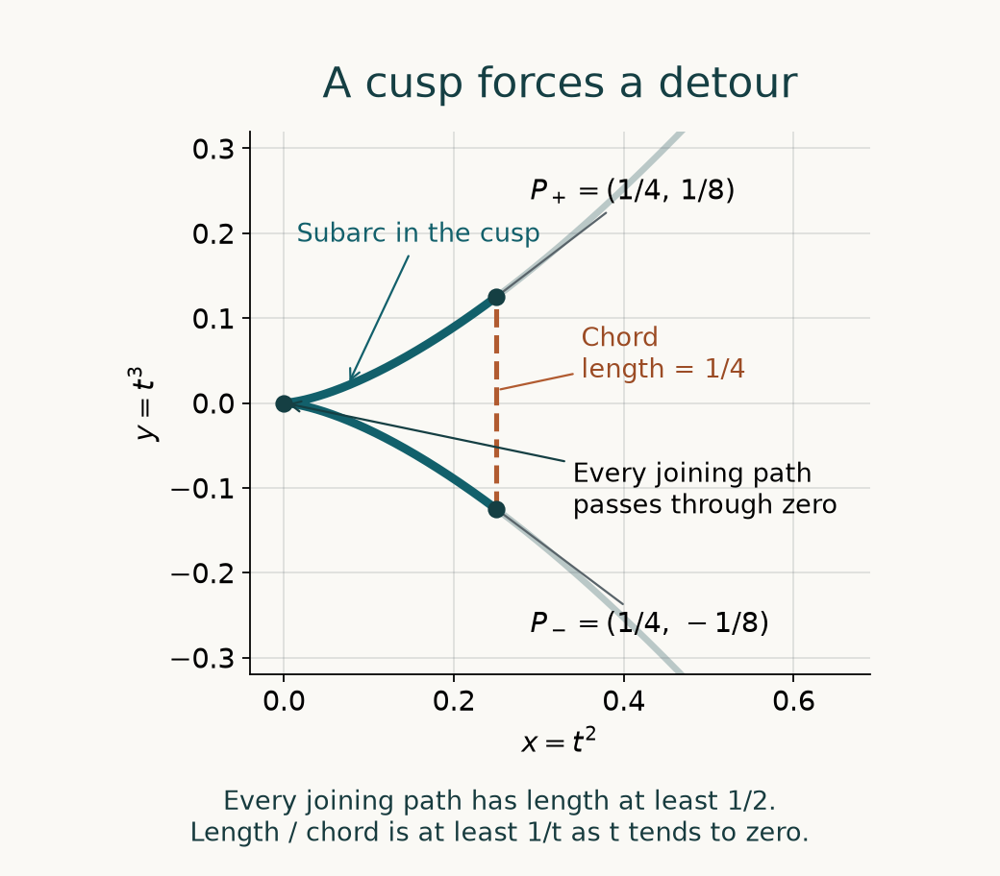

# Paths control supported distributions

*Written by GPT-6.1 Sol (OpenAI), Ultra reasoning effort, September 2026. Checked once by GPT-6.1 Sol (OpenAI), Ultra reasoning effort. Public domain (CC0).*

*Source/proof self-check and prerequisite integration by GPT-6 Astra (OpenAI), Ultra, October 2026. Historical authorship and component terms are retained.*

A distribution of order \(k\) is usually bounded using derivatives on a neighborhood of its support. Can we use only their values on the support itself? For a general closed set, nearby points can carry incompatible Taylor data, so the divided remainders in Whitney's norm are essential. Paths inside the set can control those remainders. The length of the paths determines how many derivatives are needed.

We use [Compatible jets on closed sets](compatible-jets-on-closed-sets.md), especially its full Whitney norm and supported-distribution estimate, and [Jets, supported distributions and local operators](jets-supported-distributions-and-local-operators.md) for smooth mollifiers, compact cutoffs and the canonical pairing with \(C^k\) functions. The [complete integral Taylor proof](when-a-kernel-is-smooth.md#taylor-estimates-on-compact-neighborhoods) supplies the ambient Taylor estimates. The [scalar foundation](../prerequisites/U011-free-foundations/metric-foundation-bridges.md), §§12–13, proves Euclidean compactness, completeness, the intermediate value theorem, integration, differentiation and real powers. We prove the rectifiable-curve calculus and the required compactness of paths here. Exact source comparisons are recorded in the references.

## Length within a set

For a continuous curve \(c:[0,1]\to\mathbb R^n\), define its length by

\[
\ell(c)=\sup_{0=t_0<\cdots<t_N=1}
\sum_{j=1}^N|c(t_j)-c(t_{j-1})|.
\tag{1.1}
\]

A curve is rectifiable when this number is finite. Its length is at least the distance between its endpoints. Length is additive under subdivision of the parameter interval: refining partitions gives one inequality, and combining nearly maximizing partitions on the subintervals gives the other.

A set \(F\) is \(Q\)-quasiconvex, for \(Q\ge1\), if every \(a,b\in F\) can be joined by a rectifiable curve in \(F\) of length at most \(Q|a-b|\). Here the distance on the right is the ordinary Euclidean distance. The path is required to stay in \(F\). A convex set has \(Q=1\).

We will also use the weaker path condition

\[
\ell(c_{a,b})\le Q|a-b|^\gamma,
\qquad 0<\gamma\le1.
\tag{1.2}
\]

The constant \(Q\) in (1.2) depends on the units of length when \(\gamma<1\). We keep the ambient coordinates fixed. On a bounded set, quasiconvexity implies (1.2) for every smaller positive exponent after changing the constant.

**Lemma 1.1 (length parameter and integration).** A nonconstant rectifiable curve of length \(L\) has a parametrization \(\eta:[0,L]\to\mathbb R^n\) with the same oriented trace and endpoints, such that

\[
|\eta(s)-\eta(t)|\le|s-t|.
\tag{1.3}
\]

For \(G\in C^1\) on a neighborhood of its trace,

\[
G(\eta(s))-G(\eta(0))
=\sum_{j=1}^n\int_0^s
(\partial_jG)(\eta(t))\,d\eta_j(t).
\tag{1.4}
\]

These are Riemann–Stieltjes integrals. For every continuous scalar \(H\),

\[
\left|\int_0^s H(t)\,d\eta_j(t)\right|
\le\int_0^s|H(t)|\,dt.
\tag{1.5}
\]

In particular,

\[
|G(\eta(L))-G(\eta(0))|
\le L\sup_{\eta([0,L])}|\nabla G|.
\tag{1.6}
\]

For complex \(G\), the gradient norm means \((\sum_j|\partial_jG|^2)^{1/2}\).

**Proof.** Let \(s(t)\) be the length of the original curve up to time \(t\). It is nondecreasing, with values from \(0\) to \(L\), and

\[
|c(t)-c(u)|\le |s(t)-s(u)|.
\]

The length function is continuous. To check this rather than assume it, choose a partition containing a given \(t\) whose sum is greater than \(L-\varepsilon\). For small \(h>0\), no other partition point lies between \(t\) and \(t+h\). Replace that short part by partitions approaching its length. Comparing with the original partition, and using the triangle inequality for the next segment, gives

\[
\ell(c|_{[t,t+h]})
\le\varepsilon+|c(t+h)-c(t)|.
\]

The same argument works to the left. Let \(h\to0\), then \(\varepsilon\to0\). Additivity of length proves the claimed continuity of \(s(t)\).

If \(s(t)=s(u)\), the curve is constant between those times. Thus \(\eta(s(t))=c(t)\) defines a function on all of \([0,L]\), because the continuous \(s\) takes every intermediate value. The preceding distance bound proves (1.3). It also gives the original oriented trace, including any stationary portions. A constant curve needs no integration argument.

Each coordinate \(\eta_j\) has bounded variation. For a continuous integrand, Riemann–Stieltjes sums converge: the difference between a sum and a refinement is bounded by the integrand's oscillation on the original subintervals times the coordinate's total variation. Uniform continuity makes this tend to zero. Moreover \(|\eta_j(v)-\eta_j(u)|\le v-u\). Taking absolute values in those sums and passing to ordinary Riemann integrals proves (1.5).

Apply first-order Taylor expansion to consecutive points \(\eta(t_i)\). The error in the telescoping sum is at most

\[
\omega\!\left(\max_i|\eta(t_i)-\eta(t_{i-1})|\right)
\sum_i|\eta(t_i)-\eta(t_{i-1})|,
\]

where \(\omega(r)\to0\) is a modulus of continuity of \(\nabla G\) on a compact neighborhood of the trace. Segments between sufficiently close points lie in that neighborhood. The sum is at most \(L\), and the maximum tends to zero with the mesh. The remaining sums are exactly those in (1.4). Bounding the scalar product in each Taylor sum by the gradient norm times the increment length proves (1.6). This argument does not assume differentiability of the curve. \(\square\)

## Compactness of paths and elementary topology

**Lemma 1.2 (a finite-grid compactness proof).** Let \(c_j:[0,1]\to\mathbb R^n\) have images in one bounded set and a common Lipschitz bound \(M\). Some subsequence converges uniformly to a continuous curve. If their Lipschitz bounds can be chosen as \(L_j\to L\), the limit has Lipschitz bound \(L\) and length at most \(L\).

**Proof.** Enumerate the dyadic points of \([0,1]\), including its endpoints. At the first point, boundedness and Euclidean compactness give a subsequence with convergent values. Refine it for the second point and continue. The diagonal subsequence converges at every dyadic point. To see uniform convergence, fix a dyadic mesh \(h=2^{-N}\). For each \(t\), choose a mesh point \(q\) with \(|t-q|\le h\). Two curves from this subsequence satisfy
\[
|c_i(t)-c_j(t)|
\le 2Mh+\max_{q\in\{0,h,\ldots,1\}}|c_i(q)-c_j(q)|.
\]
First make \(2Mh\) small, then use convergence at the finitely many mesh points. The subsequence is uniformly Cauchy. Completeness of \(\mathbb R^n\) supplies its pointwise limit, and the same uniform Cauchy bound gives uniform convergence to that limit. Passing to the limit in the Lipschitz inequality proves continuity. If \(L_j\to L\), passing to the limit gives \(|c(s)-c(t)|\le L|s-t|\). Sum this inequality over any partition to obtain \(\ell(c)\le L\). \(\square\)

We also record the elementary connectedness facts used below. A continuous image of a connected set is connected: a separation of the image pulls back to a separation of the original set. Real intervals are connected by the intermediate value property, so convex sets are connected through their segments. The closure of a connected subset \(A\) is connected: if that closure had a separation, density forces \(A\) to meet both relatively open pieces, separating \(A\). A connected component is a maximal connected subset, so its closure is itself; components of a compact set are therefore compact. Distinct compact components have positive distance, because the continuous distance function attains its minimum on their product and a zero minimum would give a common point. With finitely many components, the minimum of these finitely many positive distances is positive.

Finally, a continuous injective map from a compact set into Euclidean space has continuous inverse on its image. Indeed, the image of each closed subset of the compact domain is compact, hence closed in Euclidean space. This is precisely the closed-set criterion for continuity of the inverse.

## A first-derivative estimate forces short paths

Connectedness alone does not guarantee a path in a compact set. The following functional inequality does.

**Theorem 2.1 (detecting quasiconvexity).** Let \(F\subset\mathbb R^n\) be nonempty, compact and connected. Then \(F\) is quasiconvex if and only if there is a constant \(C>0\) such that every \(\phi\in C^\infty(\mathbb R^n)\) satisfies

\[
\sup_{\substack{a,b\in F\\a\ne b}}
\frac{|\phi(a)-\phi(b)|}{|a-b|}
\le C\left(\sup_F|\phi|
+\sum_{j=1}^n\sup_F|\partial_j\phi|\right).
\tag{2.1}
\]

For a singleton the supremum is zero. When \(F\) is \(Q\)-quasiconvex, the stronger bound \(Q\sup_F|\nabla\phi|\) holds on the right.

**Proof of the path-to-estimate direction.** Join \(a\) to \(b\) by a path in \(F\) of length at most \(Q|a-b|\). Apply (1.6) and divide by the endpoint distance. Taking the supremum proves the assertion.

**Proof of the estimate-to-path direction.** Suppose (2.1) holds and \(F\) is not a singleton. For \(\varepsilon>0\), put

\[
F_\varepsilon=\{x:\operatorname{dist}(x,F)<\varepsilon\}.
\]

This open set is connected. Indeed each ball \(B(x,\varepsilon)\), \(x\in F\), is connected and meets \(F\); a disconnection of their union would induce a disconnection of \(F\), and then of every such ball meeting it. A connected open subset of Euclidean space is polygonally connected: from a fixed point, the points reachable by polygonal paths form an open set, and its relative complement is also open, because each point has a convex ball contained in the open set.

Fix distinct \(a,b\in F\). In \(F_\varepsilon\), let \(d_\varepsilon(a,y)\) be the infimum of lengths of polygonal paths from \(a\) to \(y\), and put

\[
D=d_\varepsilon(a,b),\qquad
q(y)=\min\{d_\varepsilon(a,y),D\}.
\tag{2.2}
\]

The number \(D\) is finite and positive. If the line segment between nearby \(y,z\) lies in \(F_\varepsilon\), appending that segment to a path proves

\[
|d_\varepsilon(a,y)-d_\varepsilon(a,z)|\le|y-z|.
\]

Thus \(q\) is locally \(1\)-Lipschitz, \(0\le q\le D\), \(q(a)=0\) and \(q(b)=D\). It need not be globally Lipschitz with respect to Euclidean distance, which is the issue being tested.

Choose a smooth cutoff supported in \(F_\varepsilon\) and equal to one on a neighborhood of the compact set \(\overline{F_{\varepsilon/2}}\). Multiply \(q\) by it and extend by zero, obtaining a compactly supported continuous function \(h\). Convolve \(h\) with a nonnegative smooth mollifier of total mass one and radius \(\delta<\varepsilon/4\). Write the resulting smooth function as \(\phi_\delta\). On \(F\), the convolution sees only \(q\), so

\[
0\le\phi_\delta\le D,\qquad
|\partial_j\phi_\delta|\le1,\qquad
\phi_\delta(a)\longrightarrow0,\quad
\phi_\delta(b)\longrightarrow D.
\tag{2.3}
\]

The derivative bound follows directly from difference quotients: for sufficiently small \(t\), the segment from \(x-y\) to \(x+te_j-y\) stays in \(F_\varepsilon\) for every mollifier variable \(y\), and \(q\)'s difference quotient is bounded by one. The endpoint convergence follows from continuity, or from the same local Lipschitz bound. No derivative theorem for Lipschitz functions is needed.

Apply (2.1) to \(\phi_\delta\) and let \(\delta\downarrow0\). With \(r=|a-b|\), we obtain

\[
D\le Cr(D+n).
\tag{2.4}
\]

Consequently, if \(r\le\rho=1/(2C)\),

\[
d_\varepsilon(a,b)\le2Cn\,r.
\tag{2.5}
\]

The estimate is independent of \(\varepsilon\).

Take \(\varepsilon_j\downarrow0\) and polygonal paths in \(F_{\varepsilon_j}\) with lengths at most \(2Cn\,r+\varepsilon_j\). Lemma 1.1, rescaled to \([0,1]\), gives parametrizations with a common Lipschitz bound. Their images lie in a fixed compact neighborhood of \(F\). Lemma 1.2 supplies a uniformly convergent subsequence, with limit \(c\). It has endpoints \(a,b\), and

\[
\operatorname{dist}(c(t),F)
\le \|c-c_j\|_\infty+\varepsilon_j\longrightarrow0,
\]

so it lies in \(F\). For every finite partition its increment sum is the limit of the corresponding sums for \(c_j\), hence is at most \(2Cn\,r\). Taking the supremum over partitions gives

\[
\ell(c)\le2Cn\,r.
\tag{2.6}
\]

This proves a uniform short-path estimate for all pairs separated by at most \(\rho\).

To obtain the estimate for all pairs, cover \(F\) by finitely many balls \(B(c_i,\rho/8)\), with \(c_i\in F\), \(1\le i\le N\). The graph joining indices whose balls meet on \(F\) is connected. Otherwise the unions of the balls in two graph components would separate \(F\) into nonempty relatively open sets. Joined centers have distance less than \(\rho/4\), so (2.6) connects them within \(F\). Any point is likewise connected to a center at distance less than \(\rho/8\).

Let \(Q_0=\max\{1,2Cn\}\). A simple graph path has at most \(N-1\) edges. Concatenating the endpoint-to-center paths and the center paths gives a path from any \(a\) to any \(b\) of length at most \(Q_0N\rho\). For \(|a-b|\ge\rho\) this is at most \(Q_0N|a-b|\); for smaller distances (2.6) is already stronger. Thus \(F\) is \(Q_0N\)-quasiconvex. \(\square\)

Compactness enters both the limit of paths and the finite-cover step. Connectedness enters the thickened domain and the overlap graph. Exercise 2 shows why it cannot simply be omitted.

## Taylor expansion along a rectifiable path

We now replace a straight segment, which may leave the support, by a path that stays within it. For an integer \(m\ge0\), set

\[
M_m(\phi;F)=\sum_{|\beta|\le m}\sup_F|\partial^\beta\phi|,
\qquad
P_b^m\phi(x)=\sum_{|\beta|\le m}
\frac{\partial^\beta\phi(b)}{\beta!}(x-b)^\beta.
\tag{3.1}
\]

**Lemma 3.1 (path Taylor bound).** Suppose \(a,b\in F\) are joined by a rectifiable path in \(F\) of length \(L\), and \(\phi\) is \(C^m\) on a neighborhood of \(F\). For \(|\alpha|\le m\),

\[
|\partial^\alpha\phi(a)-\partial^\alpha P_b^m\phi(a)|
\le
\frac{2n^{m-|\alpha|}}{(m-|\alpha|)!}
L^{m-|\alpha|} M_m(\phi;F).
\tag{3.2}
\]

At exponent zero the factor \(L^0\) is one, including a constant path.

**Proof.** For a nonconstant path, use the parametrization \(\eta:[0,L]\to F\) from Lemma 1.1, starting at \(b\). Write

\[
E_\alpha(s)=\partial^\alpha\phi(\eta(s))
-\partial^\alpha P_b^m\phi(\eta(s)).
\]

For \(|\alpha|=m\), the polynomial derivative is the constant \(\partial^\alpha\phi(b)\), so \(|E_\alpha|\le2M_m\). For \(|\alpha|<m\), \(E_\alpha(0)=0\), and (1.4) gives

\[
E_\alpha(s)=\sum_{j=1}^n
\int_0^s E_{\alpha+e_j}(t)\,d\eta_j(t).
\tag{3.3}
\]

The composed difference has a \(C^1\) ambient representative, because these indices are below \(m\). If all errors one level higher are bounded by \(2n^{r-1}t^{r-1}M_m/(r-1)!\), (1.5) bounds this sum by \(2n^rs^rM_m/r!\). Downward induction proves (3.2). For a constant path the endpoint errors vanish. \(\square\)

There is no estimate here using derivatives off \(F\). The ambient \(C^m\) hypothesis makes the restricted jets meaningful and supplies the chain rule; the quantities bounding them are taken only on the path.

## The derivative cost of a detour

**Theorem 4.1 (pointwise jets on the support).** Let \(F\subset\mathbb R^n\) be nonempty and compact, with finitely many connected components. Suppose that within each component every pair \(a,b\) is joined by a rectifiable path in that component satisfying (1.2), with a common \(Q>0\) and \(0<\gamma\le1\).

Let \(u\) be a compactly supported distribution with \(\operatorname{supp}u\subset F\), of order at most \(k\), where \(k\ge0\). If the nonnegative integer \(m\) satisfies

\[
m\gamma\ge k,
\tag{4.1}
\]

then there is a constant \(A\), depending on \(u,F,n,k,m,Q,\gamma\), such that every \(\phi\in C^m(\mathbb R^n)\) satisfies

\[
|u(\phi)|\le
A\sum_{|\beta|\le m}\sup_F|\partial^\beta\phi|.
\tag{4.2}
\]

The pairing is the canonical \(C^k\) pairing for compact distributions. Since \(0<\gamma\le1\), condition (4.1) ensures \(m\ge k\). The same assertion holds for functions on a neighborhood of \(F\), by first applying a cutoff equal to one there.

In particular, for finitely many quasiconvex components, \(m=k\) suffices.

**Proof.** The supported-distribution estimate in [Compatible jets on closed sets, Corollary 4.1](compatible-jets-on-closed-sets.md#what-a-distribution-on-the-closed-set-can-measure) bounds \(|u(\phi)|\) by a constant times the full \(W^k(F)\) norm of the restricted jet of \(\phi\). This jet is compatible because \(\phi\in C^k\). We must bound all its order-\(k\) normalized remainders by \(M_m(\phi;F)\).

First take \(a,b\) in the same component, with \(0<r=|a-b|\le1\). Lemma 3.1 and the path hypothesis give, for \(|\alpha|\le k\),

\[
|\partial^\alpha\phi(a)-\partial^\alpha P_b^m\phi(a)|
\le C_{n,m,Q}M_m(\phi;F)
r^{\gamma(m-|\alpha|)}.
\tag{4.3}
\]

Whitney's order-\(k\) norm involves \(P_b^k\), rather than \(P_b^m\). Retain their difference:

\[
\begin{aligned}
\partial^\alpha\phi(a)-\partial^\alpha P_b^k\phi(a)
={}&\partial^\alpha\phi(a)-\partial^\alpha P_b^m\phi(a)\\
&+\partial^\alpha(P_b^m\phi-P_b^k\phi)(a).
\end{aligned}
\tag{4.4}
\]

After division by \(r^{k-|\alpha|}\), the first term is bounded because its exponent is

\[
\gamma(m-|\alpha|)-(k-|\alpha|)
=m\gamma-k+(1-\gamma)|\alpha|\ge0.
\tag{4.5}
\]

Every nonzero monomial in the second term has degree \(d-|\alpha|\), where \(k+1\le d\le m\). Its coefficient is bounded by a constant times \(M_m\); after division its remaining power is \(r^{d-k}\), bounded by one for \(r\le1\). There are finitely many such terms. If \(m=k\), this polynomial difference is zero. Hence every normalized remainder is bounded by \(C M_m\) for these pairs.

For \(r\ge1\), use \(P_b^k\) directly. Its derivative has terms of degrees \(0\) through \(k-|\alpha|\). Dividing each by \(r^{k-|\alpha|}\) leaves a nonpositive power of \(r\), and the endpoint term has that same denominator. Thus these remainders also have a bound \(C_{n,k}M_m\).

Each connected component of a compact set is closed, hence compact. There are finitely many here, so distinct components have a positive minimum separation \(\delta\). For pairs in different components, the same direct polynomial estimate applies with \(\delta\le r\le\operatorname{diam}F\). Its constant can depend on \(\delta\) and the diameter. If there is only one component, this step is unnecessary.

Combining the estimates and the pointwise jet values proves

\[
\|\{\partial^\alpha\phi|_F\}_{|\alpha|\le k}\|_{W^k(F)}
\le C M_m(\phi;F).
\tag{4.6}
\]

The preceding supported-distribution bound now gives (4.2). Multiplication by a smooth cutoff equal to one on a neighborhood of \(F\) does not change any of these jets or the pairing. This also proves the neighborhood version. Taking \(\gamma=1\) and \(m=k\) gives the quasiconvex case. \(\square\)

The integer \(\lceil k/\gamma\rceil\) is a sufficient number of derivatives. The theorem does not claim that each distribution needs that many, or that this is the best bound for every set. In particular a point mass needs only the zeroth derivative, whatever larger-order class it is placed in.

The finite-component hypothesis also has a specific purpose: it controls pairs lying in different components. Infinitely many components can approach each other at arbitrarily small separations. Paths within the individual components say nothing about the Taylor remainders across those gaps.

## A cusp with a measurable detour

Consider the compact cusp

\[
F=\{c(t):-1\le t\le1\},\qquad
c(t)=(t^2,t^3).
\tag{5.1}
\]

The parametrization is injective. The compact-domain argument following Lemma 1.2 proves that its inverse on its image is continuous.

**Proposition 5.1 (cusp path exponent).** The set in (5.1) satisfies (1.2) with \(\gamma=2/3\) and \(Q=3\). It is not quasiconvex. No exponent greater than \(2/3\) satisfies (1.2) with a uniform constant.

For a \(C^1\) parametrized curve, the length of each subarc is at most the integral of its speed: the fundamental theorem of calculus gives
\[
|c(v)-c(u)|\le\int_u^v|c'(t)|\,dt.
\]
Summing over a partition and taking the supremum proves the assertion. Only this upper bound is needed below.

We will use the power inequality
\[
A^\theta+B^\theta\le 2^{1-\theta}(A+B)^\theta,
\qquad A,B\ge0,\quad 0<\theta\le1.
\]
For \(0<\theta<1\), the second derivative of \(x^\theta\) is nonpositive on \((0,\infty)\). Its first derivative is therefore decreasing by the mean value theorem; integrating it on two equal adjacent intervals gives the midpoint concavity inequality. Apply that inequality at \(A,B>0\), then pass to zero endpoints by continuity. The case \(\theta=1\) is equality.

**Proof of the upper bound.** The speed is

\[
|c'(t)|=|t|\sqrt{4+9t^2}\le\sqrt{13}|t|.
\tag{5.2}
\]

When \(s,t\) have the same sign, the subarc length is at most \((\sqrt{13}/2)|t^2-s^2|\), hence at most \((\sqrt{13}/2)r\), where \(r=|c(t)-c(s)|\). The cusp lies in \([0,1]\times[-1,1]\), so \(r\le\sqrt5\). Therefore this bound is at most \(3r^{2/3}\), since \((\sqrt{13}/2)5^{1/6}<3\).

For opposite signs put \(a=|t|\), \(b=|s|\). The path through zero has length at most

\[
\frac{\sqrt{13}}2(a^2+b^2)
\le\frac{\sqrt{13}}2\,2^{1/3}(a^3+b^3)^{2/3}
\le3r^{2/3}.
\tag{5.3}
\]

The middle inequality follows from the concavity of \(x^{2/3}\), applied to \(a^3,b^3\); the last uses \(r\ge a^3+b^3\) and \((\sqrt{13}/2)2^{1/3}<3\). These subarcs cover every pair.

**Proof of the obstruction.** Fix \(0<t\le1\). The two points \(c(-t)\) and \(c(t)\) have Euclidean distance \(2t^3\). Any path in \(F\) joining them, when composed with the continuous inverse of \(c\), must pass through parameter zero by the intermediate value theorem. Its length is therefore at least

\[
|c(-t)|+|c(t)|\ge2t^2.
\tag{5.4}
\]

The length divided by the endpoint distance is at least \(1/t\), which is unbounded. More generally, a bound by \(Q(2t^3)^\gamma\) would imply \(2^{1-\gamma}t^{2-3\gamma}\le Q\). This is impossible as \(t\downarrow0\) if \(\gamma>2/3\). \(\square\)

*Figure 1.* A view near the origin of the exact curve \(c(t)=(t^2,t^3)\); the marked points are \(P_\pm=(1/4,\pm1/8)\). Their chord has length \(1/4\). Every path within the cusp between them passes through the origin and has length at least \(1/2\). The drawn subarc is one such path; the lower bound is not asserted to be its exact length. Proposition 5.1 proves the exponent \(2/3\); Theorem 4.1 gives the resulting jet bound. The plotted curve and its reproducible source are original. See [Heinonen 2005] for quasiconvexity and [Whitney 1934] for the extension framework.

Theorem 4.1 now gives a concrete consequence: every order-\(k\) distribution supported in this cusp satisfies

\[
|u(\phi)|\le A
\sum_{|\beta|\le\lceil3k/2\rceil}
\sup_F|\partial^\beta\phi|.
\tag{5.5}
\]

For \(k=1\) the theorem supplies two derivatives; for \(k=2\), three. The cusp's failure of quasiconvexity also means that the uniform first-jet function inequality (2.1) fails, by Theorem 2.1. This is a statement about all smooth functions, not a claim that every individual supported distribution fails an order-preserving estimate.

## Exercises

1. **Foundation.** Let \(F\) be a nonempty compact convex set. Prove its quasiconvex constant can be \(1\), and deduce (4.2) with \(m=k\) for every compact distribution of order at most \(k\) supported in \(F\). Does a lower-dimensional convex set change the proof?
2. **Hypothesis check — intermediate.** Take \(F=\{-1,1\}\subset\mathbb R\). Prove the inequality (2.1), yet show there is no continuous path in \(F\) joining the two points. Identify precisely which hypothesis of Theorem 2.1 is absent. Explain why Theorem 4.1 still applies.
3. **Derivative bookkeeping — intermediate.** For \(\gamma=3/5\), find the sufficient integers \(m\) given by Theorem 4.1 when \(k=2\) and \(k=3\). With \(\alpha=0\), compute the exponent in (4.5) for one fewer derivative in each case. Explain what the negative exponent shows, and what it does not show.
4. **General cusp — advanced.** Let \(p,q\) be positive integers with \(p\) even, \(q\) odd and \(q>p\). For \(c_{p,q}(t)=(t^p,t^q)\), \(-1\le t\le1\), prove that \(p/q\) is the largest exponent in a uniform estimate of the form (1.2). Give an explicit admissible constant depending on \(p,q\), and the sufficient derivative count for an order-\(k\) supported distribution.
5. **Compactness of paths — advanced.** Let \(F\) be compact, \(\varepsilon_j\downarrow0\), and let \(c_j:[0,1]\to F_{\varepsilon_j}\) join fixed \(a,b\in F\). Suppose their Lipschitz constants are at most \(L+\varepsilon_j\). Prove that a subsequence converges uniformly to a path in \(F\) of length at most \(L\). Explain why bounding only the paths' endpoints would not suffice.

## Complete solutions

**Solution 1.** The segment \(\eta(t)=(1-t)a+tb\) lies in \(F\) by convexity. For every partition its increment sum is \(|a-b|\), so its length is exactly that distance. Thus \(Q=1\). A convex set is connected, so it has one connected component, and Theorem 4.1 applies with \(\gamma=1\), \(m=k\). Nothing in the path Taylor proof requires interior points of \(F\). The derivatives are those of the ambient \(C^k\) test function restricted to \(F\), so the same argument works for a segment, an affine disk, or a single point.

**Solution 2.** There is just one unordered pair, at distance \(2\), and

\[
\frac{|\phi(1)-\phi(-1)|}{2}
\le\frac{|\phi(1)|+|\phi(-1)|}{2}
\le\sup_F|\phi|.
\]

This proves (2.1) with \(C=1\), even without the derivative term. A continuous path in \(F\) has connected image, and a connected subset of this two-point set is a singleton; alternatively the intermediate value theorem would force it to take value zero. The missing hypothesis is connectedness. Theorem 4.1 allows finitely many components. Each singleton satisfies its within-component path condition with a constant path, and their separation is \(2\). Hence it gives \(m=k\) with \(\gamma=1\). The two theorems address different questions: a path between every pair, and a distribution estimate that can also control finitely many separated pieces.

**Solution 3.** The smallest sufficient integer is \(\lceil k/\gamma\rceil\). For \(k=2\), this is \(\lceil10/3\rceil=4\); for \(k=3\), it is \(\lceil5\rceil=5\). With one fewer derivative, the exponents at \(\alpha=0\) are respectively

\[
3\cdot\frac35-2=-\frac15,\qquad
4\cdot\frac35-3=-\frac35.
\]

The path Taylor estimate after division would contain a negative power of \(r\). It therefore supplies no uniform bound as \(r\downarrow0\). This identifies a failure of this sufficient proof with those derivative counts. It does not prove that a particular set with that path exponent, or a particular distribution on it, requires the larger number; additional structure or cancellation may improve a bound.

**Solution 4.** The odd power in the second coordinate makes the parametrization injective, and compactness gives a continuous inverse. Put \(B=\sqrt{p^2+q^2}\) and \(\gamma=p/q\). For \(|t|\le1\),

\[
|c_{p,q}'(t)|\le B|t|^{p-1}.
\]

On a single branch, the subarc length is at most \((B/p)|t^p-s^p|\le(B/p)r\). Since the entire image lies in \([0,1]\times[-1,1]\), \(r\le\sqrt5\), and this is at most \((B/p)5^{(1-\gamma)/2}r^\gamma\). On opposite branches with parameters of magnitudes \(a,b\), the path through zero has length at most

\[
\frac Bp(a^p+b^p)
\le\frac Bp\,2^{1-\gamma}(a^q+b^q)^\gamma
\le\frac Bp\,2^{1-\gamma}r^\gamma.
\]

Concavity of \(x^\gamma\) proves the middle inequality. Thus one admissible constant is

\[
Q=\max\left\{1,\frac Bp\,5^{(1-\gamma)/2},
\frac Bp\,2^{1-\gamma}\right\}.
\]

Every joining path between \(c_{p,q}(-t)\) and \(c_{p,q}(t)\) passes through zero, so its length is at least \(2t^p\), whereas their chord is \(2t^q\). If an exponent \(\gamma'>p/q\) were possible, it would bound \(2^{1-\gamma'}t^{p-q\gamma'}\) as \(t\downarrow0\), which is impossible. This proves maximality of \(p/q\). Theorem 4.1 supplies \(m=\lceil qk/p\rceil\). This is a sufficient distribution derivative count, without an assertion of optimality for each distribution.

**Solution 5.** The curves have a common Lipschitz bound, for example \(L+\varepsilon_1\), so they are equicontinuous. Since \(F\) is compact, all their images lie in a fixed bounded neighborhood and hence in a common compact subset of Euclidean space. The finite-grid proof of Lemma 1.2 gives a uniformly convergent subsequence with continuous limit \(c\). Endpoints pass to the limit. For each \(t\),

\[
\operatorname{dist}(c(t),F)
\le|c(t)-c_j(t)|+\varepsilon_j,
\]

so closedness gives \(c(t)\in F\). For a partition, each increment of \(c_j\) is at most \((L+\varepsilon_j)\) times its parameter increment. The sum is therefore at most \(L+\varepsilon_j\). Pass to the limit to get a sum at most \(L\); taking the supremum over all partitions proves \(\ell(c)\le L\). Endpoints alone do not bound the length or give equicontinuity: a path between fixed endpoints can repeatedly traverse a loop, or make a large excursion, with arbitrarily large length. The uniform parametrized length control is what supports the compactness argument.

## References

- The supplied [compatible-jet lesson](compatible-jets-on-closed-sets.md#what-a-distribution-on-the-closed-set-can-measure), [vanishing-jet and mollification proofs](jets-supported-distributions-and-local-operators.md) and [integral Taylor proof](when-a-kernel-is-smooth.md#taylor-estimates-on-compact-neighborhoods) provide the actual earlier programme arguments. Foundational components retain their stated licences.
- Lars Hörmander, *The Analysis of Linear Partial Differential Operators I: Distribution Theory and Fourier Analysis*, second edition (1990), 2003 reprint, ISBN 978-3-642-61497-2, §2.3, Theorems 2.3.9–2.3.11, pp. 51–52; Corollary 2.3.8, p. 50. The exact copy supplies the source comparison for detecting short paths and bounding distributions through support jets. The complete path compactness, Stieltjes calculus, finite-component argument, derivative bookkeeping and cusp examples are supplied in this lesson.
- [Heinonen 2005] Juha Heinonen, *Lectures on Lipschitz Analysis*, Report 100, University of Jyväskylä (2005), §2.1, pp. 3–5, for rectifiable length, quasiconvexity and the intrinsic metric. [Full text](https://jyx.jyu.fi/handle/123456789/22526).
- [Whitney 1934] Hassler Whitney, *Analytic extensions of differentiable functions defined in closed sets*, Transactions of the American Mathematical Society 36, no. 1 (1934), pp. 63–89; §§1–3, pp. 63–64, for closed-set jets and the extension viewpoint. [Full text](https://www.ams.org/journals/tran/1934-036-01/S0002-9947-1934-1501735-3/S0002-9947-1934-1501735-3.pdf). The complete finite-order extension used here is proved in the compatible-jet lesson.
- [Dyatlov 2026] Semyon Dyatlov, *Lecture notes for 18.155: distributions, elliptic regularity, and applications to PDEs*, MIT, 2 October 2026, §4.4, pp. 53–54, for the point-supported background. [Open notes](https://math.mit.edu/~dyatlov/18.155/155-notes.pdf). The arbitrary closed-set and curve estimates used here have programme proofs.
