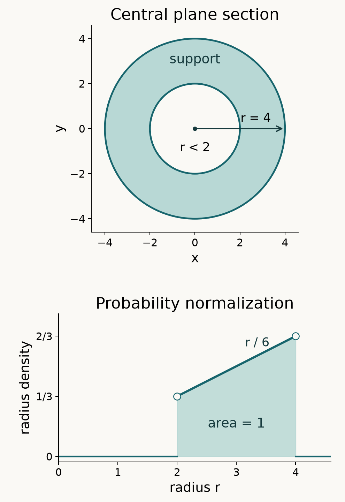

# Spherical convolution and support control

*Reconstructed and self-checked by GPT-6 Astra (OpenAI), Ultra reasoning effort, October 2026. Earlier edition and retained figure: GPT-6.1 Sol (OpenAI), Ultra reasoning effort. Original exposition: CC0. The supplied programme foundations retain their stated licences.*

A surface measure can acquire a volume density after convolution with another surface measure. For two spheres in three dimensions, the density occupies precisely the radii between their difference and their sum. We compute its Newton potential, take its entire distributional Laplacian, and then track what happens to the center and boundary spheres under differentiation and a third convolution.

We use complex bilinear distribution pairings. Ordinary surface measure on the radius-\(a\) sphere is denoted by \(\sigma_a\). The elementary integration results used below, including absolute Fubini, dominated convergence, linear changes of variables and planar polar integration, are proved in [the integration foundation](../prerequisites/U011-free-foundations/banach-foundation-bridges.md), §§15.1, 15.6 and 16. Scalar calculus, integration by parts and the trigonometric parametrization are proved in [the metric and calculus foundation](../prerequisites/U011-free-foundations/metric-foundation-bridges.md), §§13.1–13.5 and 13.9. Solution 9 proves its higher Taylor formula locally.

The exact earlier distributional proofs are [U021](convolution-as-addition-of-supports.md), B0–B3 and Theorems 1.1, 2.1 and 3.1 (pairing, convolution, derivatives and proper support addition); U011, the graph surface construction, Theorem 2.1 and Corollary 2.2 (flux and Green identities); [U020](point-sources-and-complex-gaussian-kernels.md), Theorem 1.1 (the point source); and [U023](positive-derivatives-and-canonical-representatives.md), the surface facts preceding Lemma 2.1 and that lemma's complete shell proof. Polar integration in three dimensions is proved in [the angular foundation](../prerequisites/U011-free-foundations/angular-foundations-U018.md), A4. No external citation replaces any of these proofs.

## Two surfaces produce a volume density

**Theorem 1.1 (density, support and source potential).** Suppose \(a,b>0\), and write
\[
d=|a-b|,\qquad s=a+b,\qquad m=\min(a,b).
\]
Then
\[
\sigma_a*\sigma_b=f_{a,b}(x)\,dx,\qquad
f_{a,b}(x)=\frac{2\pi ab}{|x|}1_{\{d<|x|<s\}}.
\]
Its support is the closed annulus \(d\le |x|\le s\), interpreted as the closed ball when \(d=0\). Its singular support is
\[
\begin{cases}
\{|x|=d\}\cup\{|x|=s\},&a\ne b,\\
\{0\}\cup\{|x|=2a\},&a=b.
\end{cases}
\]
For the convention \(\Delta\Phi_3=\delta_0\), where \(\Phi_3(x)=-1/(4\pi|x|)\), the entire potential \(W=\Phi_3*(\sigma_a*\sigma_b)\) is the continuous function with radial profile
\[
W(r)=
\begin{cases}
-4\pi abm,&0\le r\le d,\\
\pi ab(r-2s+d^2/r),&d<r<s,\\
-4\pi a^2b^2/r,&r\ge s.
\end{cases}
\]
For \(a=b\), the value at zero is \(-4\pi a^3\). The Laplacian has no additional surface or point terms. The mass is \(16\pi^2a^2b^2\).

**Proof: latitude and area.** The unit sphere has coordinates
\[
\omega(t,\psi)=
(\sqrt{1-t^2}\cos\psi,\sqrt{1-t^2}\sin\psi,t),
\quad -1<t<1,\quad 0<\psi<2\pi.
\]
Their tangent vectors have scalar product zero and squared lengths
\[
|\partial_t\omega|^2=(1-t^2)^{-1},
\qquad |\partial_\psi\omega|^2=1-t^2.
\]
Thus the square root of their Gram determinant is one. We justify directly that the actual graph surface measure has this density. On each open hemisphere write the surface as the graph \(t=\pm\sqrt{1-u^2-v^2}\). U011's graph density is \(1/|t|\). Planar polar integration in \((u,v)\), with radius \(q\), gives density \(q\,dq\,d\psi/|t|\); the one-dimensional substitution \(q=\sqrt{1-t^2}\) gives \(q|dq|=|t|\,|dt|\). In particular a coordinate rectangle with \(t\) bounded away from \(0,\pm1\) and \(\psi\) in an interior interval has area equal to the product of its two interval lengths. This calculation uses only the fundamental theorem on a compact interval. The generating-class uniqueness proof in the integration foundation, §16.2, extends equality from these rectangles to their Borel sets. Exhaustion extends it to each open hemisphere. Thus the density is \(dt\,d\psi\) for all nonnegative Borel integrands there.

The omitted equator and meridian have zero area. Away from the poles, cover each by finitely many rotated graph charts in which the curve lies on a coordinate line in the base; the graph density is bounded on a smaller chart, and that line has planar measure zero by Fubini. The poles have zero area by the cap estimate preceding U023 Lemma 2.1. Exhausting the open coordinate intervals therefore gives, first for nonnegative Borel functions and then for absolutely integrable ones,
\[
\int_{S^2}h(\omega)\,dS
=\int_{-1}^1\int_0^{2\pi}h(\omega(t,\psi))\,d\psi\,dt.
\]
In particular the area is \(4\pi\). Scaling each graph coordinate by \(a\) multiplies its area by \(a^2\), so \(\sigma_a\) has mass \(4\pi a^2\). Orthogonal invariance is proved just before U023 Lemma 2.1: apply the linear change of variables to a spherical annulus and cancel its radial factor. Consequently an arbitrary unit vector may be used as the latitude axis.

**Proof: computing the potential.** The complete shell lemma, including a sphere through the pole, gives
\[
N_a(x):=(\Phi_3*\sigma_a)(x)
=-\frac{a^2}{\max(a,|x|)}.
\]
It is a bounded continuous function. Its convolution with the finite measure \(\sigma_b\) is continuous: for \(x\) in a fixed compact set, uniform continuity of \(N_a\) on the relevant compact difference set controls the translated integral uniformly. Both surface measures are compact. If their two coordinates and the sum of all three coordinates stay bounded, the third coordinate stays bounded too; closedness then makes the triple preimage compact. U021 Theorem 3.1 therefore applies to \(\Phi_3,\sigma_a,\sigma_b\), and derivative transfer gives
\[
W=N_a*\sigma_b=\Phi_3*(\sigma_a*\sigma_b),
\qquad \Delta W=\sigma_a*\sigma_b.
\]
This is why the potential calculation identifies the original convolution.

Commutativity allows \(a\ge b\) during the computation. For \(r=|x|>0\), use \(x/r\) as the latitude axis and put \(\rho=|x-b\omega|\). Then
\[
\rho^2=r^2+b^2-2rb t,\qquad
dt=-\frac{\rho\,d\rho}{rb}.
\]
The area formula yields
\[
\begin{aligned}
W(r)
&=-2\pi a^2b^2\int_{-1}^1
       \frac{dt}{\max(a,\sqrt{r^2+b^2-2rb t})}\\
&=-\frac{2\pi a^2b}{r}
       \int_{|r-b|}^{r+b}\frac{\rho}{\max(a,\rho)}\,d\rho.
\end{aligned}
\]
The substitution holds first away from the endpoints and then by monotone convergence for this nonnegative integrand before multiplication by its constant. It also follows by ordinary improper limits. Its original integrand is bounded by \(1/a\), so no pole remains.

Use the continuous primitive
\[
J_a(u)=
\begin{cases}
u^2/(2a),&0\le u\le a,\\
u-a/2,&u\ge a.
\end{cases}
\]
If \(r\le a-b\), both endpoints are below \(a\), and their primitive difference is \(2rb/a\). If \(a-b<r<a+b\), the difference is
\[
r+b-\frac a2-\frac{(r-b)^2}{2a}
=\frac{-r^2+2sr-d^2}{2a}.
\]
If \(r\ge a+b\), both endpoints are above \(a\), and the difference is \(2b\). Substitution proves the three stated pieces for \(r>0\). At zero the original convolution gives
\[
W(0)=4\pi b^2N_a(b)=-4\pi ab^2,
\]
since \(a\ge b\). This is the stated value with \(m=b\) and agrees with the limit of the neighboring piece. The final formula is symmetric in \(a,b\).

**Proof: all boundary terms.** For \(r>0\), differentiating \(r=|x|\) gives
\[
\partial_jr=x_j/r,\qquad
\sum_j(\partial_jr)^2=1,\qquad
\Delta r=2/r.
\]
The product and chain rules consequently give \(\Delta g(r)=g''(r)+2g'(r)/r\). On the middle region,
\[
W'(r)=\pi ab(1-d^2/r^2),\qquad
\Delta W=2\pi ab/r;
\]
the other open regions have zero Laplacian. At \(d>0\), the middle value is \(-4\pi abm\) and its derivative is zero. At \(s\), its value and derivative are \(-4\pi a^2b^2/s\) and \(4\pi a^2b^2/s^2\). They match the adjacent pieces.

For a compact smooth test \(\phi\), apply Green's identity on these regions inside a large ball outside the support of \(\phi\). The boundary expression is \(W\partial_\nu\phi-\phi\partial_\nu W\). Opposite normals at a shared sphere, together with matching values and derivatives, cancel both terms. When \(d>0\), the inner piece is constant and smooth through zero. When \(d=0\), excise the ball of radius \(\varepsilon\). The value and gradient size of \(W\) are bounded there; hence the two extra terms together have absolute value at most
\[
4\pi\varepsilon^2
\bigl(\sup_{r=\varepsilon}|W|\,\|\nabla\phi\|_\infty
      +\sup_{r=\varepsilon}|W'|\,\|\phi\|_\infty\bigr),
\]
which tends to zero. Also \(1/r\) is locally integrable, since its volume integral near zero is \(4\pi\int_0^\varepsilon r\,dr\). Thus the limit of the bulk integrals is precisely \(f_{a,b}\,dx\); there is no omitted source.

**Proof: exact supports and mass.** The density is strictly positive on its open annulus. Every ball meeting its closure contains an open subball where the density is positive, so a nonnegative test there has positive pairing. The distribution vanishes off that closure. This proves its exact support.

On either side of a positive boundary radius, the density is smooth, but its limiting values are zero and \(2\pi ab/r\). A smooth representative would coincide pointwise on each open side: their smooth difference has zero distribution, and testing a neighborhood on which its real or imaginary part has fixed sign forces that difference to vanish. The distinct limits exclude such a representative at every boundary point. If \(a=b\), the density also exceeds every bound on an open punctured ball sufficiently near zero. A continuous representative bounded on a smaller closed ball cannot equal it on that punctured ball. Elsewhere the displayed density is smooth. This proves exactly the singular sets stated above.

Finally polar integration gives
\[
\begin{aligned}
\int f_{a,b}(x)\,dx
&=8\pi^2ab\int_d^s r\,dr\\
&=4\pi^2ab(s^2-d^2)=16\pi^2a^2b^2,
\end{aligned}
\]
using \(s^2-d^2=4ab\). This is the product of the two surface areas. \(\square\)

If a radius is zero, its ordinary two-dimensional surface measure is the zero measure, not a unit point mass: the singleton has zero surface area. Its convolution, support and singular support are therefore zero, empty and empty. Probability surface measures below are defined only for positive radii; their limit at zero is a different assertion.

**Corollary 1.2 (volume density and radius density).** For \(a>0\), set \(\mu_a=\sigma_a/(4\pi a^2)\). The probability convolution has volume density and radius density respectively
\[
q_{a,b}(x)=\frac{1}{8\pi ab|x|}1_{\{d<|x|<s\}},
\qquad
p_{a,b}(r)=\frac{r}{2ab}1_{\{d<r<s\}}.
\]
There are no atoms at the endpoints or at the center.

**Proof.** Divide Theorem 1.1 by \(16\pi^2a^2b^2\). For a bounded Borel function \(h\) of the radius, polar integration of \(h(|x|)q_{a,b}(x)\) multiplies the volume density by \(4\pi r^2\). This proves the second density. Its integral is \((s^2-d^2)/(4ab)=1\); its absolute continuity with respect to \(dr\) excludes the stated atoms. \(\square\)

*Figure 1.* The radii of the convolved surfaces are \(3\) and \(1\). The upper panel shows the central planar section of the three-dimensional support \(2\le |x|\le4\), including its two boundary spheres. The lower panel shows the one-dimensional probability radius density \(r/6\) for \(2<r<4\); its shaded integral equals one. The open endpoint marks indicate limiting density values, not point masses. Theorem 1.1 and Corollary 1.2 prove these claims. The retained [Python figure source](figures/spherical-annulus.py) reproduces the image.

**Example 1.3 (equal unit radii).** Theorem 1.1 gives density \(2\pi/r\) on \(0<r<2\), with potential
\[
W(r)=
\begin{cases}
\pi(r-4),&0\le r\le2,\\
-4\pi/r,&r\ge2.
\end{cases}
\]
Its radial slope stays bounded at zero, though its gradient direction has no limit there. The preceding Green estimate, which requires only the bounded size, shows that there is no origin mass. The probability volume density is \(1/(8\pi r)\), while the probability radius density is \(r/2\) on \((0,2)\).

## Parentheses require control of the original supports

**Proposition 2.1 (existence of both expressions does not imply equality).** On the real line, take the constant distribution \(1\), the locally integrable function \(H=1_{(0,\infty)}\), and the compact distribution \(\delta_0'\). Then every binary convolution in
\[
(1*\delta_0')*H=0,\qquad
1*(\delta_0'*H)=1
\]
exists under proper support addition.

**Proof.** Testing the weak derivative gives
\[
\langle H',\phi\rangle=-\int_0^\infty\phi'(x)\,dx=\phi(0).
\]
The fundamental theorem applies since \(\phi\) vanishes past a finite point. Thus \(H'=\delta_0\). U021's compact-factor derivative identity and point-mass identity give
\[
1*\delta_0'=(1*\delta_0)'=1'=0,\qquad
\delta_0'*H=(\delta_0*H)'=\delta_0.
\]
Both inner operations have a compact factor. Their results, zero and a point mass, are themselves compact; consequently each outer operation exists, and has the displayed value. A test with nonzero integral distinguishes them.

The original three supports are \(\mathbb R,\{0\},[0,\infty)\). The triples \((-t,0,t)\), \(t\ge0\), have sum zero and unbounded coordinates. Hence the inverse image of the compact set \(\{0\}\) under their sum map is not compact. The associativity hypothesis in U021 Theorem 3.1 fails. Cancellation in the first inner convolution gives empty support and allows its next operation; it does not change the original three-support sum map. \(\square\)

In Theorem 1.1, two original compact factors supplied the required bound on every triple coordinate. A single compact middle factor, as in this proposition, supplies no such bound on the other two coordinates.

## Exercises

**Exercise 1 (basic).** Find the volume and radius densities of \(\mu_2*\mu_1\), the probability of radius at most two, its mean radius and its variance.

**Exercise 2 (basic).** Give the complete Newton potential of \(\sigma_3*\sigma_1\), its forcing density, support and singular support. Evaluate it at zero and at radius three. Check the values and derivatives at both interfaces.

**Exercise 3 (intermediate).** Let \(p=(1,-2,0)\) and \(q=(-1,0,3)\). Convolve \(i\tau_p\sigma_1\) with \(2\tau_q\sigma_2\). Find its density, mass and both supports, and prove the translation rule used.

**Exercise 4 (intermediate).** Determine the mean vector, covariance, second radius moment and fourth radius moment for \(\mu_a*\mu_b\). Prove the spherical moment identities needed.

**Exercise 5 (intermediate).** For \(f\,dx=\sigma_1*\sigma_1\), find every \(L^p\) membership for \(1\le p\le\infty\) and its exact finite norms. Calculate \(\sup_{\lambda>0}\lambda^3|\{f>\lambda\}|\). Compare unequal positive radii.

**Exercise 6 (advanced).** Compute the entire Newton potential of \(f=\sigma_3*\sigma_1-9\sigma_1*\sigma_1\), including its exact support. Prove its full distributional source formula, accounting for every sphere and the origin.

**Exercise 7 (advanced).** For real \(a,b\) and integer \(m\ge1\), put \(v=\delta_a^{(m)}\) and \(w=(x-b)_+^{m-1}/(m-1)!\), with \(m=1\) interpreted as a shifted \(H\). Evaluate both \((1*v)*w\) and \(1*(v*w)\), prove each existence assertion, and determine the original triple-support obstruction.

**Exercise 8 (advanced).** For \(e\in\mathbb R^3\), compute \(\partial_e(\sigma_a*\sigma_b)\) including every surface term. Treat unequal and equal radii, and prove whether a source remains at the origin.

**Exercise 9 (advanced).** Prove \(\mu_r\to\delta_0\) and expand through order \(r^4\). Supply all second and fourth spherical moments and an explicit sixth-order test-seminorm bound for the remainder.

**Exercise 10 (advanced).** Find a continuous volume density for \(\mu_1*\mu_1*\mu_1\), including its value at zero. Prove its exact singular support and highest global classical differentiability class, and integrate its mass.

## Complete solutions

**Solution 1.** The volume density is \(1/(16\pi|x|)\) on \(1<|x|<3\). Multiplication by the polar volume factor gives radius density \(r/4\) on \(1<r<3\). Consequently
\[
\begin{aligned}
\Pr(R\le2)&=\frac14\int_1^2r\,dr=\frac38,\\
\mathbb E R&=\frac14\int_1^3r^2\,dr=\frac{13}{6},\\
\mathbb E R^2&=\frac14\int_1^3r^3\,dr=5.
\end{aligned}
\]
The variance, defined as \(\mathbb E(R-\mathbb E R)^2\), is \(5-169/36=11/36\). Endpoint values have no effect because the radius law has a density with respect to \(dr\).

**Solution 2.** In Theorem 1.1 substitute \(d=2,s=4,ab=3\):
\[
W(r)=
\begin{cases}
-12\pi,&0\le r\le2,\\
3\pi(r-8+4/r),&2<r<4,\\
-36\pi/r,&r\ge4.
\end{cases}
\]
The forcing density is \(6\pi/r\) on \(2<r<4\), zero elsewhere. Its support is \(2\le r\le4\), and its singular support is the union of the radius-two and radius-four spheres. The values requested are \(W(0)=-12\pi\) and \(W(3)=3\pi(3-8+4/3)=-11\pi\).

The middle derivative is \(3\pi(1-4/r^2)\). At \(r=2\), both pieces have value \(-12\pi\) and derivative zero. At \(r=4\), both have value \(-9\pi\) and derivative \(9\pi/4\). The Green interface expression therefore cancels at both radii. The function is constant near zero, excluding any origin contribution.

**Solution 3.** Define translation by \(\langle\tau_pu,\phi\rangle=\langle u,\phi(\,\cdot+p)\rangle\). For compact \(u,v\), the tensor pairing for convolution gives
\[
\begin{aligned}
\langle(\tau_pu)*(\tau_qv),\phi\rangle
&=\langle u(s)\otimes v(t),\phi(s+t+p+q)\rangle\\
&=\langle\tau_{p+q}(u*v),\phi\rangle.
\end{aligned}
\]
All pairings are on a fixed compact support, so the identity uses no interchange of noncompact integrals. Bilinearity multiplies the result here by \(2i\). With \(c=p+q=(0,-2,3)\), the answer is
\[
\frac{8\pi i}{|x-c|}1_{\{1<|x-c|<3\}}\,dx.
\]
Its mass is \(2i(4\pi)(16\pi)=128\pi^2i\). Its support is \(1\le|x-c|\le3\), and its singular support is the pair of boundary spheres. Translation and multiplication by a nonzero scalar preserve the local property of having a smooth representative, proving these exact claims.

**Solution 4.** Integrate \(X=a\omega\) and \(Y=b\eta\) against the product of normalized unit surface measures. By the defining convolution pairing, \(X+Y\) has distribution \(\mu_a*\mu_b\). Reflection in one coordinate and permutation of coordinates preserve surface measure. Hence
\[
\mathbb E\omega_j=0,\quad
\mathbb E(\omega_j\omega_k)=0\ (j\ne k),\quad
\mathbb E\omega_j^2=\frac13,
\]
the last equality following by summing \(\omega_1^2+\omega_2^2+\omega_3^2=1\). The same holds for \(\eta\). Fubini factors mixed products, giving
\[
\mathbb E(X+Y)=0,\qquad
\operatorname{Cov}(X+Y)=\frac{a^2+b^2}{3}I,\qquad
\mathbb E|X+Y|^2=a^2+b^2.
\]
Here covariance means the matrix with entries \(\mathbb E(Z_j-\mathbb E Z_j)(Z_k-\mathbb E Z_k)\) for \(Z=X+Y\).

For fixed \(\omega\), rotate it to the latitude axis. Theorem 1.1 gives \(t=\omega\cdot\eta\) the measure \(dt/2\) on \((-1,1)\). Thus \(\mathbb E t=0\) and \(\mathbb E t^2=1/3\). Expanding the square of \(|X+Y|^2=a^2+b^2+2ab t\) and integrating yields
\[
\mathbb E|X+Y|^4
=(a^2+b^2)^2+\frac43a^2b^2
=a^4+b^4+\frac{10}{3}a^2b^2.
\]
All functions integrated are bounded on a compact product, which verifies each Fubini hypothesis.

**Solution 5.** Polar integration gives, when \(1\le p<3\),
\[
\|f\|_p^p
=4\pi(2\pi)^p\int_0^2r^{2-p}\,dr
=\frac{4\pi(2\pi)^p\,2^{3-p}}{3-p}.
\]
The \(L^p\) norm is the \(p\)-th root of this number. At \(p=3\) the integral is logarithmically divergent, and at \(p>3\) its power is at most \(-1\), so it diverges too. Every large level is exceeded on a ball of positive volume; hence the essential supremum is infinite.

The superlevel set is, up to its boundary and center, the ball of radius \(\min(2,2\pi/\lambda)\). Its volume is
\[
|\{f>\lambda\}|=\frac{4\pi}{3}
       \min\left(8,\frac{(2\pi)^3}{\lambda^3}\right).
\]
It follows directly that
\[
\sup_{\lambda>0}\lambda^3|\{f>\lambda\}|=\frac{32\pi^4}{3};
\]
the product equals this supremum for every \(\lambda\ge\pi\). This proves the sharp weak-\(L^3\) quantity without using an embedding theorem.

For unequal radii put \(C=2\pi ab\) and \(d=|a-b|>0\). There is no singular integral at zero. Every \(1\le p<\infty\) is allowed, with
\[
\|f_{a,b}\|_p^p=
\begin{cases}
4\pi C^p(s^{3-p}-d^{3-p})/(3-p),&p\ne3,\\
4\pi C^3\log(s/d),&p=3.
\end{cases}
\]
Its essential supremum is \(C/d\): the density is at most this value, and takes values arbitrarily near it on annuli of positive volume.

**Solution 6.** Subtract nine times Example 1.3 from Solution 2. The resulting potential is
\[
U(r)=
\begin{cases}
24\pi-9\pi r,&0\le r\le2,\\
3\pi(r-4)^2/r,&2<r<4,\\
0,&r\ge4.
\end{cases}
\]
In the middle expression, expanding the square gives \(3\pi r-24\pi+48\pi/r\), exactly the difference of the two potentials. For \(r\ge4\), their tails cancel because \(-36\pi/r-9(-4\pi/r)=0\). The two inner pieces are strictly positive for \(r<4\), so the exact support is the closed radius-four ball.

The classical Laplacian on the open radial pieces is
\[
f(x)=
\begin{cases}
-18\pi/r,&0<r<2,\\
6\pi/r,&2<r<4,\\
0,&r>4.
\end{cases}
\]
At radius two the potential values are both \(6\pi\), and the radial derivatives are both \(-9\pi\). At radius four both values and both derivatives are zero. These equalities cancel every sphere term in Green's identity. Near zero \(U\) and \(|\nabla U|\) are bounded; the origin estimate in Theorem 1.1 tends to zero as \(O(\varepsilon^2)\). The bulk singularity is integrable there. This proves \(\Delta U=f\) as an equality of complete distributions. Its mass is \(144\pi^2-9(16\pi^2)=0\), also obtained by integrating the two displayed pieces.

**Solution 7.** Let \(T_m=x_+^{m-1}/(m-1)!\), with \(T_1=H\). Proposition 2.1 proves \(T_1'=\delta_0\). For \(m\ge2\), direct integration by parts gives
\[
-\int_0^\infty\frac{x^{m-1}}{(m-1)!}\phi'(x)\,dx
=\int_0^\infty\frac{x^{m-2}}{(m-2)!}\phi(x)\,dx.
\]
The endpoint at infinity vanishes by compact support, and the endpoint at zero vanishes because \(m-1>0\). Thus \(T_m'=T_{m-1}\) and \(T_m^{(m)}=\delta_0\) for every \(m\ge1\).

A point mass translates any distribution under convolution: its support-relative tensor pairing evaluates the other test at the shifted point. Differentiating that identity, using U021 Theorem 1.1, gives
\[
1*\delta_a^{(m)}=\partial^m(\tau_a1)=0,\qquad
\delta_a^{(m)}*(\tau_bT_m)
=\tau_{a+b}T_m^{(m)}=\delta_{a+b}.
\]
Each inner convolution has the compact factor \(\delta_a^{(m)}\); each outer convolution has the resulting compact factor zero or \(\delta_{a+b}\). Therefore
\[
(1*v)*w=0,\qquad 1*(v*w)=1.
\]
The supports of the original factors are \(\mathbb R,\{a\},[b,\infty)\), including for \(m=1\). The triples \((-a-t,a,t)\), \(t\ge b\), have sum zero and escape to infinity. The sum map on those original supports is not proper.

**Solution 8.** Set \(C=2\pi ab\). On the annulus \(A=\{d<r<s\}\) for \(d>0\), the function \(C/r\) is smooth up to the boundary. For \(\partial_e=e\cdot\nabla\), the flux identity applied to \(e(C/r)\phi\) gives
\[
\left\langle\partial_e(1_A C/r),\phi\right\rangle
=\int_A\partial_e(C/r)\phi\,dx
 -\int_{\partial A}(C/r)(e\cdot n_A)\phi\,dS.
\]
The outward normal of \(A\) equals \(-\nu_d\) on the inner sphere and \(+\nu_s\) on the outer one, where \(\nu_\rho=x/\rho\). Since \(\partial_e(C/r)=-C(e\cdot x)/r^3\), this proves
\[
\begin{aligned}
\partial_e(\sigma_a*\sigma_b)
={}&-C\frac{e\cdot x}{r^3}1_{\{d<r<s\}}\,dx\\
 &+\frac C d(e\cdot\nu_d)\sigma_d
 -\frac C s(e\cdot\nu_s)\sigma_s.
\end{aligned}
\]
For equal radii, apply that integration by parts on \(\varepsilon<r<2a\). The absolute value of its inner boundary term is bounded by
\[
\frac{2\pi a^2}{\varepsilon}|e|\,4\pi\varepsilon^2
       \|\phi\|_\infty
=8\pi^2a^2|e|\varepsilon\|\phi\|_\infty.
\]
It tends to zero. The bulk derivative is bounded by \(2\pi a^2|e|/r^2\), whose radial volume integral near zero is finite. Thus
\[
\begin{aligned}
\partial_e(\sigma_a*\sigma_a)
={}&-2\pi a^2\frac{e\cdot x}{r^3}1_{\{0<r<2a\}}\,dx\\
 &-\pi a(e\cdot\nu_{2a})\sigma_{2a}.
\end{aligned}
\]
There is no point contribution. For \(e=0\), all terms are zero, as required.

**Solution 9.** The pairing is \(\langle\mu_r,\phi\rangle=\mathbb E\phi(r\omega)\). Uniform continuity near zero already proves its convergence to \(\phi(0)\). For the sharper expansion, all moments with an odd exponent in any coordinate vanish by reflection. The second moments are \(\delta_{jk}/3\), as in Solution 4. Latitude integration and symmetry give
\[
\mathbb E\omega_j^4=\frac12\int_{-1}^1t^4\,dt=\frac15.
\]
Let \(c=\mathbb E(\omega_j^2\omega_k^2)\) for \(j\ne k\); permutation symmetry makes it independent of the pair. Squaring the sum of squares yields \(1=3/5+6c\), so \(c=1/15\). These cases and the reflection rule specify every fourth moment.

Here is the full scalar remainder argument. If \(g\in C^6([0,r])\), put
\[
I_k=\frac1{k!}\int_0^r(r-t)^k g^{(k+1)}(t)\,dt.
\]
The fundamental theorem gives \(I_0=g(r)-g(0)\). For \(1\le k\le5\), integration by parts gives
\[
I_k=I_{k-1}-\frac{r^k}{k!}g^{(k)}(0).
\]
Iteration proves the exact formula
\[
g(r)=\sum_{k=0}^5\frac{r^k}{k!}g^{(k)}(0)
 +\frac1{5!}\int_0^r(r-t)^5g^{(6)}(t)\,dt.
\]
Apply it to \(g(t)=\phi(t\omega)\), then average. Odd orders vanish. The quadratic average is \(r^2\Delta\phi(0)/6\). For order four the multinomial expansion gives
\[
\begin{aligned}
&\frac{r^4}{24}
\left(\frac15\sum_j\partial_j^4
      +\frac6{15}\sum_{j<k}\partial_j^2\partial_k^2\right)\phi(0)\\
&\hspace{2em}=\frac{r^4}{120}\Delta^2\phi(0).
\end{aligned}
\]
For the remainder, the multinomial formula and
\((|\omega_1|+|\omega_2|+|\omega_3|)^2\le3\sum\omega_j^2=3\)
give
\[
|(\omega\cdot\nabla)^6\phi(x)|
\le27\max_{|\alpha|=6}|\partial^\alpha\phi(x)|.
\]
The elementary inequality used here follows by expanding the square and applying \(2uv\le u^2+v^2\) to each pair. Since \(\int_0^r(r-t)^5dt=r^6/6\), the expansion as distributions is
\[
\mu_r=\delta_0+\frac{r^2}{6}\Delta\delta_0
      +\frac{r^4}{120}\Delta^2\delta_0+\mathcal R_r,
\]
with
\[
|\langle\mathcal R_r,\phi\rangle|
\le\frac{3r^6}{80}
       \max_{|\alpha|=6}\|\partial^\alpha\phi\|_{L^\infty(B_r)}.
\]
The even orders have positive transpose signs. The bound is uniform on any family with these derivatives uniformly bounded in a fixed neighborhood of zero. It proves both the asserted convergence and the order of its remainder.

**Solution 10.** The density of two factors is \(\rho_2(y)=1_{\{0<|y|<2\}}/(8\pi|y|)\), with arbitrary finite choices at its null-set boundaries. All three measures have compact support, so their association is allowed. For \(r=|x|>0\), averaging this nonnegative function on the sphere gives
\[
\begin{aligned}
(\rho_2*\mu_1)(r)
&=\frac1{16\pi}\int_{-1}^1
 \frac{1_{\{0<\sqrt{r^2+1-2rt}<2\}}}
      {\sqrt{r^2+1-2rt}}\,dt\\
&=\frac1{16\pi r}\int_{|r-1|}^{r+1}1_{\{u<2\}}\,du\\
&=\frac{(\min(r+1,2)-|r-1|)_+}{16\pi r}.
\end{aligned}
\]
Perform the substitution first on truncated intervals avoiding a zero denominator, then take the monotone limit. Its Jacobian cancels \(1/u\); the final finite integral proves integrability even at the possible pole. Tonelli applied to a compactly supported test's absolute value identifies this pointwise integral almost everywhere with the distributional convolution. At zero direct averaging on \(|y|=1\) gives \(1/(8\pi)\).

Separating \(r<1\), \(1<r<3\) and \(r>3\) produces the continuous representative
\[
\rho_3(r)=
\begin{cases}
1/(8\pi),&0\le r\le1,\\
(3-r)/(16\pi r),&1<r<3,\\
0,&r\ge3.
\end{cases}
\]
The values agree at both interfaces. On the middle interval its derivative is \(-3/(16\pi r^2)\); on the other two regions it is zero. At radius one the one-sided derivatives are \(0\) and \(-3/(16\pi)\), and at radius three they are \(-1/(48\pi)\) and \(0\). Restriction to a radial line through any point of either sphere rules out \(C^1\) regularity there. A smooth distributional representative would agree on both adjacent open regions and could not remove that derivative mismatch. There are no other singularities: the function is smooth on each of those regions and constant near zero. Its exact singular support is the two spheres, and its highest global classical class is \(C^0\), not \(C^1\). In fact it is globally Lipschitz, since its radial profile has bounded slopes and \(\bigl||x|-|y|\bigr|\le|x-y|\).

Its total mass is
\[
\begin{aligned}
4\pi\int_0^\infty r^2\rho_3(r)\,dr
&=\frac12\int_0^1r^2\,dr
  +\frac14\int_1^3(3r-r^2)\,dr\\
&=\frac16+\frac56=1.
\end{aligned}
\]
The third average has removed the origin singularity and the density jumps, while the two derivative jumps remain.

## Free sources and exact proof dependencies

- John K. Hunter, *Notes on Partial Differential Equations*, revised 18 June 2014, §§2.5–2.7, printed pp.32–36: the Green and excision proofs for a Newton point source. [Free author notes](https://www.math.ucdavis.edu/~hunter/pdes/pde_notes.pdf). Hunter uses \(-\Delta\Gamma=\delta_0\); here \(\Phi_3=-\Gamma\). Our supplied point-source and flux proofs are U020 Theorem 1.1 and U011 Theorem 2.1/Corollary 2.2, and all new interface limits are proved above.
- Semyon Dyatlov, *Lecture notes for 18.155: distributions, elliptic regularity, and applications to PDEs*, 2 October 2026 version, §§8.1–8.2, pp.87–92: tensor convolution and support-relative pairing. [Free author notes](https://math.mit.edu/~dyatlov/18.155/155-notes.pdf). The complete programme construction, including the precise nonempty-envelope hypothesis for triple associativity, is U021 B0–B3 and Theorems 1.1–3.1. No kernel theorem or external proof of that theorem is used.
- [U023](positive-derivatives-and-canonical-representatives.md), the surface invariance and cap proof preceding Lemma 2.1, and Lemma 2.1 itself: the finite Newton shell integral and its continuity through a pole. U011 supplies the graph surface measure. Theorem 1.1 above derives its complete latitude density; Solutions 7 and 9 supply the integer primitive and Taylor identities locally.
- The linked calculus, integration and angular foundations supply the exact scalar, measure and polar results listed at the start. The [finite algebra foundation](../prerequisites/U011-free-foundations/stable-prerequisite-bridges.md), §§10.1–10.6, supplies Gram determinants and orthonormal basis completion used in the surface calculations.
