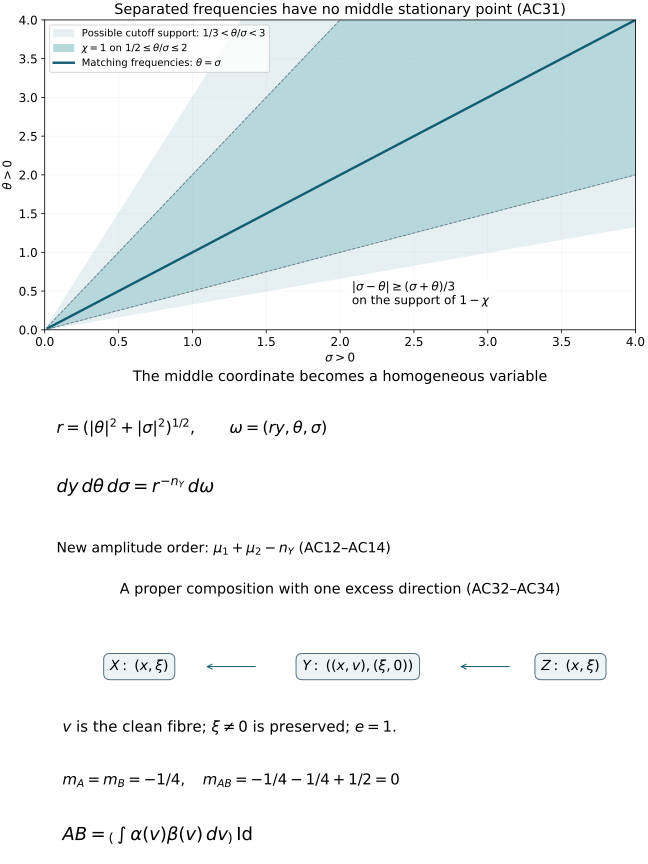

# Clean composition of Fourier integral operators

For ordinary symbols, a clean composition has order
\(m_1+m_2+e/2\). Its principal symbol is the integral of the
composed Maslov half-densities, with the normalization
\((2\pi)^{-e/2}\). We prove both assertions, including the frequency
cutoffs, the noncompact tails and every differentiated symbol remainder.

Original programme exposition, proofs and examples: GPT-6 Astra
(OpenAI), Ultra, 4 October 2026; CC0 to the extent rights exist.
Earlier components retain their separate terms.

## A0. Statement, supports and exact earlier proofs

Write \(n_X=\dim X\), \(n_Y=\dim Y\), \(n_Z=\dim Z\), and
\(n=n_X+n_Z\). Kernels act on half-densities; a finite-rank bundle
coefficient is a linear map, and its product is in operator order.
Let \(C\) and \(D\) be homogeneous canonical relations from
\(T^*Y\setminus0\) to \(T^*X\setminus0\), and from
\(T^*Z\setminus0\) to \(T^*Y\setminus0\). We assume the kernel
wavefronts are contained in their primed versions and meet neither
zero-covector axis. All support assertions below concern the closed
supports actually used, including the closed conic amplitude supports.
Use closed embedded primed relations on the region under consideration,
as in PS0; a smaller conic image branch is interpreted microlocally.

The operators are properly supported in both base projections.
Their matching set is clean of locally constant excess \(e\), with
embedded composed image \(L=C\circ D\), and the matching projection
\(q:F\to L\) is a submersion. On the supports being composed, \(q\)
is proper. The statements apply on each fixed-excess component.
Embeddedness and properness are hypotheses; the sufficient
proper-connected-fibre criterion in C3 supplies them in an important
case. We do not infer them from cleanness alone.

For properly supported \(A\in I^{m_1}(X\times Y,C')\) and
\(B\in I^{m_2}(Y\times Z,D')\), using ordinary \(S_{1,0}\) symbols,
the conclusion is
\[
 AB\in I^{m_1+m_2+e/2}(X\times Z,L').
 \tag{AC1}
\]
If \(a_C,a_D\) represent their geometric principal symbols, then
\[
 \sigma(AB)=(2\pi)^{-e/2}
       \int_{F/L}\mathfrak b(a_C,a_D)
       \pmod{S^{m_1+m_2+e/2+n/4-1}} .
 \tag{AC2}
\]
Here \(\mathfrak b\) is exactly the bundle map G24, including its
full excess density and Maslov-line map. Thus this formula fixes the
constant as well as the order. It is a statement about classes modulo
one lower ordinary order; homogeneous leading terms are not required.

The exact earlier proofs used are:

- [C0–C5](clean-canonical-composition.md), for clean geometry,
  the normalized density sequence, properness and fibre integration;
- [G0–G7](maslov-composition-and-gaussian-factors.md), for quadratic
  equivalence, phase frames, the intrinsic Maslov map and its dilation law;
- [F0–F7](../20261004-free-intrinsic-graph/prerequisites/prescribed-phase-representation.md),
  for the distributional meaning of a phase integral, its complete
  Fourier symbol expansion, the intrinsic class and prescribed phases;
- [PS1–PS6](../20261004-free-intrinsic-graph/prerequisites/global-principal-symbol.md),
  for critical densities, symbol classes, the geometric principal symbol
  and finite phase partitions over compact base sets;
- [O0.1](../20261004-free-intrinsic-graph/prerequisites/ordinary-operator-calculus.md),
  for the proof that product test functions determine a distributional kernel;
- the exact integration, inverse-function, cutoff, Fourier inversion and
  stationary-phase proofs already included in those dependency chains.

All calculations first take place in compact coordinate pieces. Their
global assembly is proved in A9. No product of arbitrary distributions
is taken as a definition of the kernel of \(AB\).

## A1. Smooth action, adjoints and uniform frequency cutoffs

Consider a nondegenerate phase \(\phi(x,y,\theta)\) for \(C'\) and
an amplitude supported in a compact base/unit-direction set strictly
inside its phase domain. It vanishes for small \(|\theta|\). Put
\[
 \begin{gathered}
 c_{d,N}=(2\pi)^{-(d+2N)/4},\qquad
 \mu_1=m_1+\frac{n_X+n_Y}{4}-\frac{N_1}{2},\\
 A_\epsilon f(x)=c_{n_X+n_Y,N_1}
   \iint e^{i\phi(x,y,\theta)}
        a(x,y,\theta)\rho(\epsilon\theta)f(y)\,dy\,d\theta .
 \end{gathered}
 \tag{AC3}
\]
The cutoff \(\rho\) is smooth, compactly supported, and one near zero;
\(a\in S^{\mu_1}\). Every frequency derivative of
\(\rho(\epsilon\theta)\) is uniformly bounded by the corresponding
inverse power of \(\langle\theta\rangle\). For a nonzero derivative,
its support has \(|\theta|\asymp\epsilon^{-1}\); the zeroth derivative
is bounded. This proves the assertion also when the cutoff radius varies.

Off a neighborhood of \(\phi_\theta'=0\), F2's operator
\(\phi_\theta'\cdot\partial_\theta/(i|\phi_\theta'|^2)\)
lowers the amplitude order by one at each transposition. It proves a
smooth kernel there, with uniform bounds and smooth convergence as
\(\epsilon\downarrow0\). Derivatives falling on the cutoff have the
same order gain. This is precisely the compact-plus-integrable-tail
proof of F2, with any prescribed number of base derivatives.

On a sufficiently small fixed neighborhood of the remaining critical
support, the absence of the input zero axis gives
\(|\phi_y'|\ge c|\theta|\). Compactness of the normalized support and
homogeneity give this uniform inequality. Use
\[
             V_y=\frac{\phi_y'}{i|\phi_y'|^2}\cdot\partial_y,
             \qquad V_y e^{i\phi}=e^{i\phi}.
 \tag{AC4}
\]
Its coefficients, with every base derivative, have order \(-1\).
After any fixed \(k\) output derivatives and \(M\) transpositions,
the absolute integrand is bounded by
\[
 C_{kM}\langle\theta\rangle^{\mu_1+k-M}
          \max_{|\gamma|\le M+k}|\partial_y^\gamma f(y)|.
 \tag{AC5}
\]
The product rule proves this inductively: an output derivative of
the exponential costs at most one power; each transposition either
differentiates an amplitude or test function, or a coefficient whose
base derivatives retain order \(-1\). The cutoff has no \(y\)
derivatives. Choose \(M>\mu_1+k+N_1\). Compact \(y\) support and
the radial power integral prove an absolutely integrable majorant.
They prove a uniform finite-seminorm bound for
\(A_\epsilon:C^\infty\to C^\infty\), and convergence to \(A\)
in every compact output seminorm for each fixed smooth input.

The output zero-axis exclusion gives the identical argument for
the transpose and the Hermitian adjoint: exchange \(x,y\), negate
the phase for the adjoint, and transpose or conjugate the amplitude.
Proper support allows compact cutoffs before these local arguments.
In particular \(A\) and its transpose map compactly supported smooth
inputs to compactly supported smooth outputs, with a common compact
support and finite derivative estimates on each fixed input support.

Define \(Au\), for a distribution \(u\), by pairing \(u\) with the
transpose applied to a test half-density. The preceding support and
seminorm bounds make this a distribution. They prove continuity:
for a bounded family of tests, its transpose image has one compact
support and all derivative seminorms bounded. The supremum of
\(|\langle Au,f\rangle|\) over that family is the corresponding
distribution seminorm of \(u\) over this image. Single-test convergence
also gives weak continuity. No kernel multiplication theorem is used.
The same statements hold for \(B\).

## A2. Unequal frequencies give a smooth kernel

After the smooth pieces from A1 have been removed, arrange
\[
 \begin{aligned}
 c_1|\theta|&\le|\phi_y'|\le C_1|\theta|,\\
 c_2|\sigma|&\le|\psi_y'|\le C_2|\sigma|,
 \end{aligned}
 \tag{AC6}
\]
where \(\psi(y,z,\sigma)\) is the second phase and
\(b\in S^{\mu_2}\),
\(\mu_2=m_2+(n_Y+n_Z)/4-N_2/2\). All constants are positive.
The equations for matching covectors require
\(\phi_y'+\psi_y'=0\), so require comparable \(|\theta|,|\sigma|\).

Choose a smooth degree-zero \(\chi(\theta,\sigma)\), equal to one
when
\[
 \frac{c_2}{2C_1}|\sigma|\le|\theta|
                 \le\frac{2C_2}{c_1}|\sigma|,
 \tag{AC7}
\]
with support in a slightly larger comparable cone. For example use a
smooth cutoff of \(|\theta|^2/(|\theta|^2+|\sigma|^2)\). The finite
cutoff construction is U001 A.4. Its support avoids both frequency axes.
On \(\operatorname{supp}(1-\chi)\), the reverse triangle inequality
and (AC6) give
\[
 |h|:=|\phi_y'+\psi_y'|\ge c(|\theta|+|\sigma|).
 \tag{AC8}
\]
For instance in the upper region,
\(c_1|\theta|-C_2|\sigma|\ge c_1|\theta|/2\), and
\(|\sigma|\le c_1|\theta|/(2C_2)\); the lower region is identical
with the roles exchanged. These two inequalities give a positive
constant for (AC8).

Set
\[
 R(x,z,\theta,\sigma)=\int
 e^{i(\phi+\psi)}(1-\chi)a(x,y,\theta)b(y,z,\sigma)\,dy .
 \tag{AC9}
\]
This function is rapidly decreasing jointly in \(\theta,\sigma\),
with all base and frequency derivatives. Here is a bound that does
not falsely treat \(ab\) as a joint symbol. On the support, both
frequencies are bounded below. With \(s=1+|\theta|+|\sigma|\) and
\(M_0=\max(\mu_1,0)+\max(\mu_2,0)\), every fixed amplitude
derivative has the crude bound \(C s^{M_0}\). Every fixed derivative
of \(h\) is \(O(s)\): the separate homogeneous phase estimates,
and the lower frequency bounds, suffice even close to one joint axis.
Quotient differentiation of (AC8) therefore bounds every fixed
derivative of \(h/(i|h|^2)\) by \(C s^{-1}\).

Integrate repeatedly in \(y\) with that vector field. After \(j\)
transpositions the amplitude, with any fixed derivatives, is bounded
by \(C_j s^{M_0-j}\). Differentiating the exponential a fixed number
\(k\) of times costs at most \(s^k\). Compact \(y\) integration gives
\[
 |\partial_{x,z}^\beta\partial_{\theta,\sigma}^\alpha R|
             \le C_{\alpha\beta j}s^{M_0+|\alpha|+|\beta|-j}.
 \tag{AC10}
\]
Since \(j\) is arbitrary, this proves every required rapid bound.
The frequency cutoffs in A1 do not depend on \(y\), so the same
bounds are uniform with two independent cutoff radii. Dominated
convergence, with \(j\) large, removes those cutoffs and proves that
\(\iint R\,d\theta\,d\sigma\) is a smooth kernel, including every
base derivative. Bounded frequencies obey the same conclusion or
ordinary compact integration. Thus none of the unequal-frequency
region contributes a symbol.

## A3. A genuine homogeneous phase and its exact Jacobian

On the support of \(\chi\), put
\[
 r=(|\theta|^2+|\sigma|^2)^{1/2},\qquad
 \omega=(t,\theta,\sigma)=(ry,\theta,\sigma),\qquad
 N=N_1+N_2+n_Y .
 \tag{AC11}
\]
This is a diffeomorphism onto its open conic image, with inverse
\(y=t/r\). Compact \(y\) support gives \(|\omega|\asymp r\), and
the comparable-frequency support gives
\(|\theta|\asymp|\sigma|\asymp r\). Its derivative is block
triangular with diagonal blocks \(rI_{n_Y},I_{N_1},I_{N_2}\), so
\[
             dy\,d\theta\,d\sigma=r^{-n_Y}\,d\omega .
 \tag{AC12}
\]
Define
\[
 \begin{aligned}
 \Phi(x,z,\omega)&=\phi(x,t/r,\theta)+\psi(t/r,z,\sigma),\\
 d(x,z,\omega)&=r^{-n_Y}\chi(\theta,\sigma)
                   a(x,t/r,\theta)b(t/r,z,\sigma).
 \end{aligned}
 \tag{AC13}
\]
The phase has degree one in \(\omega\). The amplitude is an ordinary
joint symbol of order
\[
 \mu=\mu_1+\mu_2-n_Y
        =m_1+m_2+\frac n4-\frac N2 .
 \tag{AC14}
\]
To prove all its estimates, on a compact normalized support use
\(\partial_\omega^\alpha(t/r)=O(r^{-|\alpha|})\),
\(\partial_\omega^\alpha r=O(r^{1-|\alpha|})\), and the analogous
degree-zero cutoff estimates. In a chain-rule term, derivatives of
\(a\) in its own frequency cost one order each; derivatives in its
base cost none and are multiplied by the corresponding derivatives
of \(t/r\). Thus \(|\alpha|\) joint derivatives cost exactly
\(|\alpha|\) powers. The same count holds for \(b\), and
\(r^{-n_Y}\) supplies its displayed order. Base derivatives cost no
power. This proves finite-seminorm bilinear bounds, with support
strictly inside the new phase domain. Extension by zero at the
angular boundary is smooth because of that support condition.

The normalization is exact, rather than an unspecified constant:
\[
        c_{n_X+n_Y,N_1}\,c_{n_Y+n_Z,N_2}=c_{n,N}.
 \tag{AC15}
\]
Equations (AC12) and (AC15) turn the comparable-frequency part of
the two cutoff kernels into \(I_\Phi(d)\), with the two cutoff
functions pulled back by (AC11).

## A4. The combined phase is clean of the geometric excess

Before the change (AC11), its critical equations are
\[
                 \phi_\theta'=0,\qquad \psi_\sigma'=0,
                 \qquad \phi_y'+\psi_y'=0 .
 \tag{AC16}
\]
Each input critical map is a diffeomorphism onto its local relation
branch. Therefore (AC16) identifies its solution set with the
matching set \(F\), with output critical map equal to \(q\).
The geometric clean tangent equality says precisely that the
tangent of this solution set is the kernel of the derivatives of
(AC16). Its dimension is \(n+e\), by C1–C2. Since the ambient
dimension is \(n+N\), that derivative has rank \(N-e\).

Under the fibre diffeomorphism (AC11), the vector of critical
derivatives is multiplied by an invertible matrix. At a critical
point, differentiating this matrix creates no extra term, because
the vector being multiplied is zero. The rank, zero set and tangent
kernel therefore remain exactly the same. This proves F3's full
clean-phase condition, including its tangent requirement.

At a critical point the output derivatives of \(\Phi\) are
\((\phi_x',\psi_z')\). They are nonzero by the zero-axis exclusion.
Thus the full phase differential is nonzero on a neighborhood of
the compact critical support. Parts away from that support can be
discarded by F2's integration by parts; shrink the remaining domain
to a genuine phase domain. Its conic Lagrangian image is \(L'\).

F6 now gives
\[
 I_\Phi(d)\in I^{\mu-n/4+(N+e)/2}(L')
                    =I^{m_1+m_2+e/2}(L').
 \tag{AC17}
\]
This uses the proved intrinsic characterization. Membership is not
being defined merely by writing down the combined oscillatory integral.

## A5. Equality with the composed operator and all remainders

For finite cutoff radii, all frequency integrations are compact.
Fubini's theorem for the compact smooth integrands, proved among the
earlier integration inputs, gives
\(A_\epsilon B_\delta=I_\Phi(d_{\epsilon\delta})+R_{\epsilon\delta}\).
The remainder kernels converge smoothly by A2.
The joint amplitudes \(d_{\epsilon\delta}\) are uniformly bounded in
\(S^\mu\), by A1 and A3. They converge to \(d\) in every seminorm
of \(S^{\mu+\eta}\), for every fixed \(\eta>0\). Indeed the difference
vanishes below a joint radius tending to infinity, and the extra
weight is bounded by that radius to the power \(-\eta\). Product
derivatives of the cutoffs satisfy the same argument.
F2's finite-seminorm distributional estimate therefore gives
\(I_\Phi(d_{\epsilon\delta})\to I_\Phi(d)\) as a distribution.

For a fixed compactly supported smooth \(f\), A1 gives
\(B_\delta f\to Bf\) in every smooth seminorm, on one compact
support. The uniform bounds for \(A_\epsilon\) give
\[
 A_\epsilon(B_\delta f-Bf)+(A_\epsilon-A)Bf\longrightarrow0
                         \quad\text{in }C^\infty .
 \tag{AC18}
\]
Hence the limiting kernel has the same pairing as \(AB\) against
every product of compact smooth tests in \(x,z\). O0.1 proves that
these pairings determine a distributional kernel. This establishes
\(AB=I_\Phi(d)+R\), with \(R\) smooth, for the local pieces. It
justifies the joint cutoff limit without multiplying singular kernels.

Here are the complete symbol remainders. Use F1's output frequency
chart \(L'=\{(H'(\xi),\xi)\}\), after the allowed base change,
and a compactly localized kernel coefficient \(K\). Put
\[
 b_{AB}(\xi)=e^{iH(\xi)}\widehat K(\xi),\qquad
 s=m_1+m_2+\frac e2-\frac n4 .
 \tag{AC19}
\]
F3 applies to the clean phase proved in A4. Its normal rank is
\(n+N-e\). For every \(k\ge0\), it gives finite-jet bilinear
coefficient operations \(B_j(a,b)\in S^{s-j}\) such that
\[
 \left|\partial_\xi^\alpha
    \left(b_{AB}-\sum_{j<k}B_j(a,b)\right)\right|
             \le C_{k\alpha}\langle\xi\rangle^{s-k-|\alpha|}.
 \tag{AC20}
\]
The bound uses finitely many seminorms of each input amplitude.
To see the order directly, F3's exponent is
\(\mu+(N-n+e)/2=s\), by (AC14). The normalized integration
variables are compact; its scale and angular remainder bounds
become exactly (AC20), by F3's iterated polar derivative proof.
A2's tails and the smooth compact kernel contribute every negative
order. Thus (AC20) includes all frequency derivatives, not merely a
pointwise error or a formal expansion.

For classical input amplitudes, multiply their finite homogeneous
expansions and apply these same coefficient operations. Each term
has the corresponding homogeneous degree, and the finite product
remainder has its asserted lower symbol order by A3. F3 then proves
the classical expansion as well. No infinite convergent series is
asserted. If another nondegenerate output phase is prescribed, F4–F5
lift \(b_{AB}\) and correct it successively, with the proved support
preserving asymptotic sum. This gives a same-order amplitude in that
phase and every lower-order remainder. This use of an earlier full
proof does not assume a nonlinear phase-equivalence theorem.

## A6. Ordinary symbol estimates for the fibre integral

We need more than the homogeneous degree calculation G7.
Take a conic frequency chart \(\lambda\) on \(L'\), of dimension
\(n\). On the matching space choose coordinates \((\lambda,t)\),
where \(t\in\mathbb R^e\) has degree zero. Construct them on
\(|\lambda|=1\) by the submersion chart C2, then extend along rays.
The map and its inverse are smooth and have those weights by
uniqueness of the inverse. Properness on support supplies finitely
many such charts and common compact \(t\) supports over each compact
normalized output set, exactly as in C5.

Choose input conic frequency charts \(\xi_C,\xi_D\). Their pullbacks
to these charts have degree one and have norms comparable to
\(|\lambda|\). Positivity and compactness on the normalized support
give both constants; the nonzero axes ensure that neither input
covector vanishes. Write the input sections in homogeneous Maslov
frames as
\[
 \begin{gathered}
 a_C=f_C(\xi_C)|d\xi_C|^{1/2},\qquad
 a_D=f_D(\xi_D)|d\xi_D|^{1/2},\\
 f_C\in S^{m_1-(n_X+n_Y)/4},\qquad
 f_D\in S^{m_2-(n_Y+n_Z)/4}.
 \end{gathered}
 \tag{AC21}
\]
Bundle frames and the locally fixed Maslov frames are suppressed in
this formula. Their pullbacks have degree zero. G27 implies that
the image of the two displayed unit half-density frames under
\(\mathfrak b\), relative to \(|dt|\,|d\lambda|^{1/2}\), has the form
\[
       |\lambda|^{(n_Y+e)/2}
             w(\lambda/|\lambda|,t),
 \tag{AC22}
\]
where \(w\) is smooth. Indeed the input frames have total degree
\((n+2n_Y)/2\); subtracting \((n_Y-e)/2\) from G27 and then the
output frame degree \(n/2\) gives \((n_Y+e)/2\).

All ordinary estimates now follow by the chain rule. A derivative
of order \(j\) of a degree-one map has degree \(1-j\). In a term
with \(k\) derivatives on \(f_C\), the derivative maps contribute
total degree \(k-|\alpha|\), which cancels all but the required
\(|\alpha|\) order loss. Derivatives in \(t\) contribute degree
zero net cost. Apply the same count to \(f_D\), and the product
rule to (AC22) and the degree-zero partition functions. The
coefficient of \(\mathfrak b(a_C,a_D)\) therefore has ordinary order
\[
 m_1-\frac{n_X+n_Y}{4}
 +m_2-\frac{n_Y+n_Z}{4}+\frac{n_Y+e}{2}
           =m_1+m_2+\frac e2-\frac n4=s .
 \tag{AC23}
\]
Integration over the fixed compact \(t\) supports retains all these
estimates, by the earlier compact parameter integration proof.
C5 proves independence of those charts and partitions. Thus the
integral in (AC2) is in \(S^{s+n/2}\), continuously in finite input
seminorms on every fixed compact normalized support. Lowering either
input order by one lowers this output order by one. This proves
that (AC2) is well defined on the actual principal-symbol quotient.
It proves the specific homogeneous pullback and integration needed
here, without assuming a general symbol-pullback theorem.

## A7. The density and signature comparison in full

The leading clean stationary-phase coefficient depends only on
the tangent quadratic phase, the amplitude value and the ambient
density. We compare that coefficient with \(\mathfrak b\) by a
pointwise calculation. There is no nonlinear phase-equivalence
assumption in this comparison.

**A common choice of frequency coordinates.** At a matching point
we can choose separate base coordinates on \(X,Y,Z\) so that
\(C',D',L'\) all project isomorphically onto their frequency spaces.
Here is the simultaneous-choice argument. In a cotangent tangent
space a vertical-preserving shear has the form
\((q,p)\mapsto(q,p+Bq)\), with \(B\) symmetric. For a Lagrangian
in \(T^*Q\), the projection \(p+tq\) is invertible except for
finitely many real \(t\). Indeed, with G1's projection space \(W\)
and symmetric form \(A\), its kernel requires
\((A+tI)q=0\), \(q\in W\); \(q=0\) then also forces \(p=0\).
M0a diagonalizes \(A\), so only its finitely many negative
eigenvalues are excluded. This includes \(W=0\).

For separate symmetric matrices \(B_X,B_Y,B_Z\), the three
frequency-projection determinants are polynomials in their entries.
Each is a nonzero polynomial: for \(C'\), take
\(B_X=tI,-B_Y=tI\) as above; for \(D'\) take
\(B_Y=tI,-B_Z=tI\); for \(L'\) take
\(B_X=tI,-B_Z=tI\). Their product is nonzero, because the product
of the highest lexicographic nonzero monomials has a nonzero
coefficient. A nonzero polynomial has a point where it is nonzero:
in one variable a nonzero polynomial of degree \(d\) has at most
\(d\) roots, by division by \(x-a\) and induction; in several
variables apply that argument successively to a nonzero coefficient
polynomial. Thus one triple of matrices works for all three.

These shears are realized by actual base coordinate changes at the
point. If a covector component \(p_k\ne0\), a coordinate map with
derivative the identity and prescribed second derivative in its
\(k\)-th component realizes any symmetric covector shear; explicitly
use \(f_k(q)=q_k-q^TBq/(2p_k)\), with the other components unchanged,
after centering the point. Differentiating
\(p'=(Df)^{-T}p\) gives \(dp'=dp+B\,dq\) there. The inverse theorem
makes it a local coordinate change. The shared middle covector
produces opposite signs in the two primed relations, as required.
The nonzero-axis hypotheses give the needed component on each space.

**Quadratic reduction.** Work in those tangent coordinates. The
quadratic frequency-graph phases can be written
\[
 \begin{aligned}
 \phi&=x\cdot p+y\cdot q-H_1(p,q),\\
 \psi&=y\cdot r+z\cdot s-H_2(r,s),
 \end{aligned}
 \tag{AC24}
\]
where \(H_1,H_2\) are quadratic forms. The letter \(q\) in
(AC24) denotes a frequency variable only; the matching projection
continues to be the map \(F\to L\). Put
\[
 \lambda=(p,s),\qquad v=q+r,\qquad
 S(\lambda,q)=H_1(p,q)+H_2(-q,s),\qquad R=S_{qq}'' .
 \tag{AC25}
\]
The matching equations are \(v=0,S_q'=0\). The latter is
\(Rq+A\lambda=0\) for a fixed matrix \(A\). Since output frequency
coordinates parametrize \(L'\), every \(\lambda\) has a solution.
Consequently \(\operatorname{im}A\subset\operatorname{im}R\).
Choose a linear solution \(q_0(\lambda)\). The solutions are
\(q=q_0(\lambda)+t\), with \(t\in E_0:=\ker R\).
Their fibre dimension is \(e\); hence \(\dim E_0=e\) and
\(\operatorname{rank}R=n_Y-e\).
Split \(\mathbb R^{n_Y}=E_0\oplus U\) orthogonally. Then \(R_U\)
is invertible, by M0a, and \(q=q_0(\lambda)+t+u\).

Equation (PS4) gives input critical densities \(|dp\,dq|\) and \(|dr\,ds|\):
the critical equations have identity derivative in their respective
base variables. In the product, changing \((q,r)\) to \((q,v)\),
then to \((t,u,v)\) with the shift \(q_0(\lambda)\), has absolute
Jacobian one. The product half-density is therefore
\(|d\lambda\,dt\,du\,dv|^{1/2}\).

We evaluate C4's exact density sequence on these bases. The physical
middle excess vector associated with \(t\) is
\((H_{1,qq}''t,-t)\). Apply the symplectic shear of middle tangent
coordinates \((y,\eta)\mapsto(y+H_{1,qq}''\eta,\eta)\).
It sends that excess vector to \((0,-t)\) and has determinant one.
The matching-difference map in these coordinates is
\[
                 (\lambda,t,u,v)\longmapsto(R(u-v),-v).
 \tag{AC26}
\]
Indeed before the shear its two components are
\(Rq+A\lambda-H_{2,rr}''v\) and \(-v\); insert
\(Rq_0+A\lambda=0\) and \(R=H_{1,qq}''+H_{2,rr}''\).

Take orthonormal bases of \(E_0,U\). Lifts for the image of the
matching map are the \(u\) and \(v\) coordinate vectors. For the
cokernel pairing C4, dual lifts to the excess basis \((0,-t_i)\)
are the middle vectors \((-t_i,0)\): with \(\omega=dp\wedge dq\)
their pairings are \(\delta_{ij}\). The middle symplectic density
evaluated on these image vectors and dual lifts has value
\(|\det R_U|\). To compute it, use the \(-v\) momentum columns
to eliminate the \(-Rv\) position columns in (AC26). The remaining
position blocks are \(R_U\) on \(U\) and \(-I\) on \(E_0\).
The momentum block is \(-I\). Their absolute determinant is the
claimed value. Thus C4, which divides by its square root, gives
\[
             |\det R_U|^{-1/2}|dt|\,|d\lambda|^{1/2}.
 \tag{AC27}
\]
Empty normal blocks have determinant one; this calculation includes
\(e=n_Y\), as well as \(e=0\).

For the phase, changing \(r\) to \(v-q\) gives
\(x\cdot p+z\cdot s+y\cdot v-S(\lambda,q)\), plus terms
linear or quadratic in \(v\). A triangular shift of \(y\) removes
all those terms, since each contains \(v\). Completing the square
by \(q_0(\lambda)\) leaves
\(-\tfrac12u^TR_Uu\), a quadratic form in \(\lambda\), and the
hyperbolic pairs \((x,p),(z,s),(y,v)\). A triangular shift of
\((x,z)\) removes the remaining quadratic form in \(\lambda\).
All these changes have determinant one. The full test Hessian,
normal to its \(t\) kernel, therefore has determinant magnitude
\(|\det R_U|\) and signature \(-\operatorname{sgn}R_U\).
The hyperbolic pairs contribute determinant magnitude one and
signature zero. The input full test Hessians have only hyperbolic
pairs, and hence signature zero. G16 consequently gives exactly
\[
          e^{-i\pi\operatorname{sgn}R_U/4}
             |\det R_U|^{-1/2}|dt|\,|d\lambda|^{1/2}
 \tag{AC28}
\]
for the combined unit Maslov half-densities, evaluated at the
horizontal output test plane. This is also the normal Gaussian
phase factor and quotient density in clean stationary phase.

**Why this calculation covers arbitrary input phases.** At the
point in question, their tangent quadratic presentations generate
the same tangent Lagrangians as (AC24). G1 proves complete quadratic
equivalence. Under an invertible fibre change, PS6–PS7 give the
critical-density and amplitude Jacobians, while the full test
Hessian changes by congruence. The stationary quotient density has
the same covariance by U001 A.5. Under stabilization by an invertible
form \(T\), the critical density gains \(|\det T|^{-1}\) and
the phase frame gains \(e^{i\pi\operatorname{sgn}T/4}\).
The normalized Gaussian integration gains exactly their product
\(e^{i\pi\operatorname{sgn}T/4}|\det T|^{-1/2}\): its
\((2\pi)^{\dim T/2}\) cancels the change in \(c_{d,N}\).
Thus both sides of the comparison transform identically under each
of G1's generating moves. The actual base coordinate changes obey
PS7 and G17–G18; their middle shear terms cancel. This proves the
comparison for every presentation. It uses only the Hessian and
density at the point, so it applies to the leading coefficient of
arbitrary smooth phases by the already proved stationary theorem.

## A8. Principal symbol, its constant and the lower-order criterion

For a clean phase in \(n\) base variables with \(N\) fibre variables,
F16–F19 give the leading Fourier coefficient as the integral of its
normal Gaussian quotient density, times
\((2\pi)^{n/4-e/2}\). PS29 multiplies the Fourier coefficient by
\((2\pi)^{-n/4}|d\xi|^{1/2}\) to give the geometric symbol.
Their product is
\[
                 (2\pi)^{n/4-e/2}(2\pi)^{-n/4}
                           =(2\pi)^{-e/2}.
 \tag{AC29}
\]
A7 proves that this leading density and phase factor for the
combined integral are exactly \(\mathfrak b(a_C,a_D)\).
The coordinate change (AC11) introduces no additional factor:
its Jacobian is already in \(d\), and the normal quotient-density
change of variables was part of A7's covariance argument.
This proves (AC2), with precisely the frames of G16 and PS28.
If M22's phase coordinates are used instead, G20 supplies their
stated conversion factor; it is not silently dropped.

The first omitted Fourier term has order \(s-1\) by (AC20).
PS29 and its exact kernel theorem give the stated one-order
ambiguity in (AC2). In particular,
\[
 AB\in I^{m_1+m_2+e/2-1}
 \quad\Longleftrightarrow\quad
 \int_{F/L}\mathfrak b(a_C,a_D)
       \in S^{m_1+m_2+e/2+n/4-1},
 \tag{AC30}
\]
on a smaller output neighborhood, with the analogous global
assertion when it holds everywhere. This is PS18 and PS6 applied
to the already established membership (AC17). A nonzero product
at some fibre point need not give a nonzero integral: cancellation
along excess fibres or among different matching points is allowed.

## A9. Global assembly, support and the precise continuity obtained

On a compact output base set, proper support of \(A\) bounds its
possible intermediate base points in a compact set; proper support
of \(B\) then bounds the possible input base points. The same
argument with the two projections reversed starts from compact
input support. Thus the base-composed support is proper in both
directions. It is closed: near a given output pair, choose compact
neighborhoods; the relevant triples lie in a compact set by those
properness bounds, and their projection is compact and closed.
This is also C3's elementary local closed-image argument. To prove
kernel support, take a product neighborhood disjoint from that
closed composed support. For a smooth test supported in its input
neighborhood, the support property of the actual kernel of \(B\)
places \(Bf\) in the corresponding intermediate support projection.
It is smooth by A1. This closed support misses all intermediate
points allowed by the actual kernel of \(A\) over a smaller compact
output neighborhood. Properness makes the relevant sets compact,
so \(Bf\) vanishes on a neighborhood of those points. The kernel
pairing for \(A\) is therefore zero. O0.1 turns the resulting zero
pairings on product tests into vanishing of the composed kernel
on that product neighborhood. This proves the support assertion
using the actual kernels; a frequency-regularized kernel need not
have their exact support.

To carry this out without assuming that an enlarged phase support
is itself globally proper, first fix compact external cutoffs.
Choose a compact middle cutoff equal to one on a neighborhood of
all intermediate points allowed by the first kernel over the fixed
output support. Inserting it in the product changes nothing there.
Both localized input kernels now have compact base support. Only
these compact pieces are expanded into phases.

Over the compact base sets just obtained, the closed wavefronts
have compact unit sections. They avoid the two zero axes. PS5
therefore supplies finite sufficiently small phase pieces there,
whose critical supports have uniform nonzero input and output
covector bounds. F6 supplies their nondegenerate phase
representations, and PS5's base partition makes this a finite
calculation locally. Terms outside these critical neighborhoods
are smooth by F2. Changing a kernel by one of these properly
supported smooth pieces changes its composition by a smooth kernel:
for \(AS\), apply the uniform smooth action from A1 to the smooth
compact family \(S(\,\cdot\,,z)\), with every \(z\) derivative; for
\(SA\), use the transpose argument. This proves the assertion
without any singular kernel product.

Apply A2–A5 to each remaining pair. Properness of the matching
projection on the closed supports ensures that over a compact
normalized output neighborhood only a compact part of the
critical matching set contributes. Cover it by finitely many
clean submersion charts as in C5 and F1. The remaining normalized
support has no critical point over a smaller output neighborhood;
F2's Fourier nonstationary estimates give rapid decay there.
Thus all local expansions and fibre integrals are finite over
the output neighborhood in question. This is where the support
properness in A0 enters the symbol argument.

Finite summation, and then K6's exact microlocal characterization
on all output covectors, prove (AC1) globally. On overlaps the
principal symbols agree by PS3, while C5 and G19 prove that their
fibre integrals are the same intrinsic section. This proves (AC2)
globally. The kernel wavefront is contained in the composition of
the closed input critical supports, by the same no-critical-point
estimate. Empty matching support gives a smooth kernel.

All finite symbol seminorm bounds in A3, A5 and A6 are bilinear
in finite lists of input amplitude seminorms, for fixed phases
and support sets. They provide the complete local ordinary-symbol
continuity of composition and its differentiated remainders.
A1 also proves the continuous smooth and distributional actions
of each properly supported operator. We have not asserted an
optimal Sobolev mapping theorem for arbitrary canonical relations,
or a calculus for symbols with derivative losses; those are
separate remaining parts of the course.

## A10. Four exercises with complete solutions

The frequency panel is the positive-frequency model in Exercise A1.
The variable change and its Jacobian are (AC11)–(AC12). The last
panel depicts the exact relations in Exercise A3: the intermediate
coordinate \(v\) is integrated over, while the nonzero covector
\(\xi\) is preserved. [Reproducible figure source](figures/draw_analytic_composition.py).

**Exercise A1 — why the comparable-frequency cutoff is necessary.**
Let \(h\) be a smooth function, zero for \(\theta\le1\), one for
\(\theta\ge2\), with \(h'(\theta_0)\ne0\) at some \(1<\theta_0<2\).
Show that \(h(\theta)h(\sigma)\), though a product of ordinary
order-zero symbols on the positive rays, is not a joint order-zero
symbol. Then use \(\phi=(x-y)\theta\), \(\psi=(y-z)\sigma\) to
explain the smooth unequal-frequency contribution.

**Solution.** At \((\theta_0,\sigma)\), \(\sigma\ge2\), the
\(\theta\) derivative equals the fixed nonzero number
\(h'(\theta_0)\). A joint \(S^0\) estimate would bound it by
\(C(1+\sigma)^{-1}\), a contradiction as \(\sigma\to\infty\).
The middle phase derivative is \(\sigma-\theta\). If a cutoff
equals one for \(1/2\le\theta/\sigma\le2\), then on the support
of its complement
\[
             |\sigma-\theta|\ge(\sigma+\theta)/3.
 \tag{AC31}
\]
For \(\theta\ge2\sigma\), subtracting one third of the sum leaves
\((2\theta-4\sigma)/3\ge0\); the other region is symmetric.
Each integration in a compact middle variable with
\((i(\sigma-\theta))^{-1}\partial_y\) gains an inverse power of
the joint frequency. Differentiating in \(x,z\) inserts only fixed
powers of the frequencies, absorbed by further integrations.
This is A2's smooth remainder, even though the original product
fails the joint symbol estimate.

**Exercise A2 — retain the change-of-variables factor.**
Take \(n_Y=2,N_1=N_2=1\). Compute the Jacobian of
\((y_1,y_2,\theta,\sigma)\mapsto(ry_1,ry_2,\theta,\sigma)\),
and the apparent error in the operator order if it is omitted.

**Solution.** The derivative has diagonal blocks \(rI_2,I_2\),
so its determinant is \(r^2\), irrespective of the off-diagonal
derivatives of \(r\). Thus the new amplitude contains \(r^{-2}\).
Without it the amplitude order in (AC14) would be two too large;
F6 would consequently assign operator order
\(m_1+m_2+e/2+2\). The clean correction \(e/2\) does not replace
this Jacobian. For example at \((\theta,\sigma)=(3,4)\), the
Jacobian is \(25\), and the inverse measure factor is \(1/25\).

**Exercise A3 — a proper composition with excess one.**
Let \(X=Z=\mathbb R\), \(Y=\mathbb R_u\times\mathbb R_v\),
and \(\alpha,\beta\in C_c^\infty(\mathbb R)\). In the coordinate
half-density frames define
\[
 Af(x)=\int\alpha(v)f(x,v)\,dv,\qquad
 Bg(u,v)=\beta(v)g(u).
 \tag{AC32}
\]
Find their orders, excess and composed symbol.

**Solution.** Their kernels are \(\alpha(v)\delta(x-u)\) and
\(\beta(v)\delta(u-z)\). Fourier inversion gives phases
\((x-u)\theta\), \((u-z)\sigma\), with one phase variable each.
In dimension three the normalizing constant is
\((2\pi)^{-5/4}\), so the amplitudes are
\((2\pi)^{1/4}\alpha\), \((2\pi)^{1/4}\beta\).
Their amplitude order is zero, hence their operator orders are
\(m_1=m_2=-1/4\). The missing low-frequency cutoffs only add
smooth kernels, by the same Fourier integral with compact frequencies.

Their relations, away from \(\xi=0\), are
\[
 \begin{aligned}
 C&=\{(x,\xi;(x,v),(\xi,0))\},\\
 D&=\{((z,v),(\xi,0);z,\xi)\}.
 \end{aligned}
 \tag{AC33}
\]
The matching equations set \(x=z\) and preserve \(\xi\); \(v\)
is free. Direct differentiation gives exactly the same tangent
kernel, so the composition is clean with \(e=1\) and identity
image. Compact supports of \(\alpha,\beta\) make the operators
proper and the symbol integration proper on its support.
The order is \(-1/4-1/4+1/2=0\), as for the identity.

The input critical densities are \(|dx\,dv\,d\xi|\) in both
relations. C4 sends their square roots to
\(|dv|\,|dx\,d\xi|^{1/2}\): the matching directions in \(x,\xi\)
cancel by the identity calculation G5, leaving the full \(v\)
density. The total phase has a hyperbolic middle pair and the
redundant \(v\), so G16 gives the identity Maslov frame.
The input amplitudes supply \((2\pi)^{1/2}\alpha\beta\); (AC29)
supplies \((2\pi)^{-1/2}\). Thus the symbol is
\[
       \left(\int\alpha(v)\beta(v)\,dv\right)
                    s_{\mathrm{Id}}|dx\,d\xi|^{1/2}.
 \tag{AC34}
\]
This agrees with the exact operator identity
\(AB=(\int\alpha\beta)\,\mathrm{Id}\), obtained directly from
(AC32). Omitting the clean constant would give an incorrect factor
\(\sqrt{2\pi}\).

**Exercise A4 — cancellation along an excess fibre.**
In Exercise A3 choose a nonconstant compactly supported smooth
\(\gamma\), set \(\beta=\gamma'\), and choose compact smooth
\(\alpha=1\) near \(\operatorname{supp}\gamma\). Determine the
product and its leading symbol.

**Solution.** The product \(\alpha\beta=\gamma'\) is not identically
zero, but its integral is zero by the fundamental theorem of calculus
on an interval outside the compact support. Hence \(AB=0\) exactly,
and (AC34) has zero symbol. This is cancellation of a genuine
fibre integral, not failure of the clean hypotheses. The general
one-order improvement criterion is (AC30); in this example every
order vanishes because the explicit operator is zero.

## Freely accessible human sources and remaining scope

The frequency separation and homogeneous-variable route are developed
from [Lars Hörmander, *Fourier integral operators. I*, the freely
accessible Acta Mathematica 127 (1971) paper, Section 4.2, printed
pages 174–181](https://projecteuclid.org/journals/acta-mathematica/volume-127/issue-none/Fourier-integral-operators-I/10.1007/BF02392052.pdf).
The clean comparison was also checked against [Victor Guillemin and
Shlomo Sternberg, *Semi-classical Analysis*, free author draft of
13 January 2010, Sections 8.11–8.13](https://math.mit.edu/~vwg/semiclassGuilleminSternberg.pdf).
Only these identified free versions are mathematical sources.

The draft uses semiclassical order conventions, so its signed order
labels are not copied into the homogeneous convention here. A1–A5
supply the cutoff and all ordinary-symbol estimates; A6 supplies
the needed ordinary symbol integration; A7 gives the full density
calculation omitted in the draft. No source text or PDF is
redistributed. The course still has broader symbol classes, general
Sobolev continuity, propagation, hyperbolic and boundary problems,
glancing and complex phases to complete.

