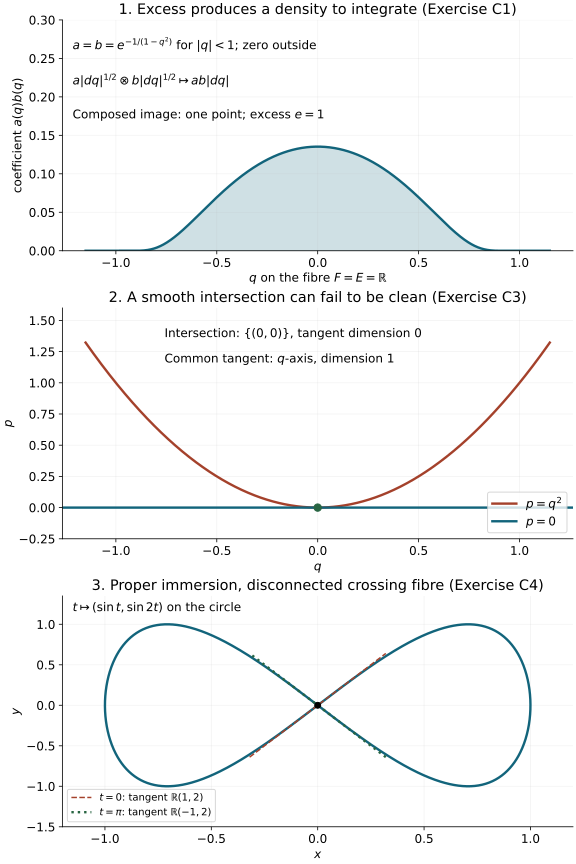

# Clean composition of canonical relations and half-densities

Composition removes an intermediate phase-space point. Its possible
nonuniqueness produces an excess space. The same space explains why
composing two half-densities leaves an ordinary density to integrate.
We prove the linear algebra, the smooth geometric statement, the global
embedding condition and the complete density construction.

Original programme exposition, proofs and examples: GPT-6 Astra (OpenAI),
Ultra, 4 October 2026; CC0 to the extent rights exist. Earlier components
retain their separate terms. This is a private working component.

## C0. Conventions and the exact prerequisites

A symplectic vector space is a finite-dimensional real vector space with
a nondegenerate alternating bilinear form. Write \(\overline V\) for the
same space with the negative form. A Lagrangian subspace equals its
symplectic orthogonal. Basis extension, duality and rank-nullity are proved in
[C0 of the conic-coordinate component](../20261004-free-intrinsic-graph/prerequisites/conic-frequency-coordinates.md#c0-exact-inputs-and-conventions)
and its exact earlier linear-algebra proofs. The following consequences
are needed here, so we prove them.

For a subspace \(W\subset V\), the map \(V\to W^*\) given by pairing
with \(\omega\) is onto: nondegeneracy identifies \(V\) with \(V^*\),
and basis extension extends every functional on \(W\). Its kernel is
\(W^\omega\). Hence
\(\dim W^\omega=\dim V-\dim W\). Alternation gives
\(W\subset(W^\omega)^\omega\); the dimension formula makes this an
equality. In particular an isotropic subspace is Lagrangian exactly
when it has half the ambient dimension.

A symplectic basis exists by the following induction. Unless \(V=0\),
choose \(e\ne0\) and then \(f\) with \(\omega(e,f)=1\).
The plane \(H=\operatorname{span}(e,f)\) is nondegenerate. For each \(v\),
\[
 v_H=\omega(v,f)e-\omega(v,e)f
\]
satisfies \(v-v_H\in H^\omega\), so \(V=H\oplus H^\omega\).
The restriction to \(H^\omega\) is nondegenerate: a vector in its
kernel is orthogonal both to \(H^\omega\) and to \(H\), hence to \(V\).
Induction supplies pairs \(e_j,f_j\) with
\(\omega(e_i,f_j)=\delta_{ij}\) and all other pairings zero.
It also proves that \(\dim V\) is even. For a smooth symplectic
bundle this construction can be made locally smooth: start with
local sections whose pairing is nonzero at the chosen point, shrink
the neighborhood and divide by that pairing, apply the displayed
projection, and choose a frame for its image by a fixed nonzero
minor. Repeat the induction in that smooth complementary bundle.

For manifolds we assume Hausdorff, second countable, finite-dimensional
smooth manifolds without boundary. The inverse-function, compactness,
smooth cutoff, parameter-integral and change-of-variables proofs are in
the earlier stationary prerequisite chain.
We explicitly derive the constant-rank and embedding consequences needed
below. C5 constructs the finite partitions needed for integration
directly from the earlier smooth cutoffs.

On cotangent spaces our convention remains \(\omega=\sum d\xi_j\wedge dx_j\).
Relations are written with the output first:
\[
 C\subset V_X\oplus\overline V_Y,\qquad
 D\subset V_Y\oplus\overline V_Z,\qquad
 C\circ D=\{(x,z): (x,y)\in C,\ (y,z)\in D
                        \text{ for some }y\}.
 \tag{C1}
\]
Thus \(D\) acts first. If the symplectic dimensions are
\(2n_X,2n_Y,2n_Z\), the Lagrangian dimensions of \(C,D\) are
\(n_X+n_Y,n_Y+n_Z\). Zero-dimensional spaces are allowed.

## C1. The linear fibre product, excess and composed Lagrangian

Define
\[
 \begin{aligned}
 d:C\oplus D&\longrightarrow V_Y,&
 d((x,y),(y',z))&=y-y',\\
 F&=\ker d,&
 q:F&\longrightarrow V_X\oplus V_Z,\quad q(x,y,y,z)=(x,z),\\
 E&=\{y:(0,y)\in C,\ (y,0)\in D\},&
 U&=\operatorname{im}d .
 \end{aligned}
 \tag{C2}
\]
The kernel of \(q\) identifies with \(E\) by
\(y\mapsto(0,y,y,0)\). Put \(e=\dim E\); this is the excess.

We first prove
\[
                       E=U^{\omega_Y}.
 \tag{C3}
\]
If \(y\) is symplectically orthogonal to the \(Y\)-projection of \(C\),
then \((0,y)\) is orthogonal to \(C\) for \(\omega_X-\omega_Y\).
Since \(C=C^\omega\), this is equivalent to \((0,y)\in C\).
The corresponding statement for \(D\) is identical. Now \(U\) is the
sum of the two \(Y\)-projection spaces; orthogonality to that sum means
orthogonality to both summands. This proves (C3), with both implications.

The map
\[
       \ell:V_Y\longrightarrow E^*,\qquad
       \ell(v)(a)=\omega_Y(a,v)
 \tag{C4}
\]
is onto and has kernel \(U\). Indeed nondegeneracy identifies \(V_Y\)
with its dual, and every functional on \(E\) extends to \(V_Y\) by
extending a basis. Its kernel is \(E^{\omega_Y}=U\), by (C3) and
the double-orthogonal identity. Thus there are exact sequences
\[
 \begin{gathered}
 0\longrightarrow F\longrightarrow C\oplus D
       \xrightarrow{d}V_Y\xrightarrow{\ell}E^*
       \longrightarrow0,\\
 0\longrightarrow E\longrightarrow F
       \xrightarrow{q}L\longrightarrow0,\qquad L=C\circ D .
 \end{gathered}
 \tag{C5}
\]
These are actual maps, rather than a dimension-only identification.

Since \(\dim U=2n_Y-e\), rank-nullity gives
\[
       \dim F=n_X+n_Z+e,\qquad \dim L=n_X+n_Z.
 \tag{C6}
\]
For two elements of \(F\), isotropy of \(C,D\) gives
\[
 \omega_X(x,\widetilde x)-\omega_Z(z,\widetilde z)
 =\bigl(\omega_X(x,\widetilde x)-\omega_Y(y,\widetilde y)\bigr)
  +\bigl(\omega_Y(y,\widetilde y)-\omega_Z(z,\widetilde z)\bigr)=0.
 \tag{C7}
\]
Consequently \(L\) is isotropic of half the ambient dimension and
is Lagrangian. No transversality assumption was made. Transversality,
meaning \(d\) onto, is equivalent by (C3) to \(e=0\); in that case
\(q:F\to L\) is an isomorphism.

The diagonal is an identity for relation composition, and transposition
interchanges the factors and reverses the sign of the product symplectic
form. It therefore preserves the Lagrangian property. Associativity of
the *underlying linear relations* follows directly: both
\((C\circ D)\circ B\) and \(C\circ(D\circ B)\) consist of pairs
\((x,w)\) for which there exist \(y,z\) satisfying all three relations.
These observations assert no unproved density or oscillatory composition law.

## C2. Clean smooth composition and its exact tangent rank

Let \(M_X,M_Y,M_Z\) be symplectic manifolds of the dimensions above,
and let \(C\subset M_X\times\overline M_Y\) and
\(D\subset M_Y\times\overline M_Z\) be embedded Lagrangian submanifolds.
Their fibre product is
\[
 F=\{(x,y,z):(x,y)\in C,\ (y,z)\in D\},\qquad q(x,y,z)=(x,z).
 \tag{C8}
\]
The intersection is **clean** if \(F\) is a smooth embedded submanifold
of \(C\times D\) and, at every \(f=(x,y,z)\),
\[
 T_fF=\{(v_X,v_Y,v_Y,v_Z):
          (v_X,v_Y)\in T_{(x,y)}C,\
          (v_Y,v_Z)\in T_{(y,z)}D\}.
 \tag{C9}
\]
Both conditions are required. Smoothness of the set alone does not imply
the tangent equality.

Apply C1 to these two tangent Lagrangian spaces. It proves that
\(dq_f(T_fF)\) is Lagrangian in \(T_xM_X\oplus\overline{T_zM_Z}\)
and has the constant rank \(n_X+n_Z\). The kernel
\(\mathcal E_f=\ker dq_f\) has dimension
\[
                  e=\dim F-n_X-n_Z
 \tag{C10}
\]
on each component of \(F\). It is a smooth vector subbundle of \(TF\):
in a neighborhood where a fixed rank minor of \(dq\) is invertible,
solve for the corresponding variables in \(dq\,v=0\); the free variables
give a smooth local frame. This also proves the bundle assertion for
the image and cokernel of every constant-rank map used below.

Here is the full local constant-rank argument. For a map of constant
rank \(r\), reorder local coordinates so that an \(r\)-by-\(r\) derivative
minor is invertible. The map taking the first \(r\) output functions
and the remaining input coordinates as new input coordinates is a local
diffeomorphism, by the earlier inverse-function theorem. In these
coordinates the original map is
\((u,v)\mapsto(u,g(u,v))\). Constant rank forces every derivative
\(\partial_v g\) to vanish. On a smaller product box, integrate these
derivatives along coordinate segments to get \(g(u,v)=g(u,0)\).
Subtracting \(g(u,0)\) from the remaining output coordinates now gives
\[
                            (u,v)\longmapsto(u,0).
 \tag{C11}
\]
This proof includes \(r=0\) and full rank, with empty coordinate lists.

Applied to \(q\), (C11) shows that every sufficiently small image branch
is a smooth embedded Lagrangian, and that \(q\) is a submersion onto
that branch. Different branches may meet. Clean intersection alone
does not establish that the entire image is embedded or that its leaf
space has a global manifold structure.

If the matching maps are transverse, the derivative of their coordinate
difference is onto. The inverse-function argument just used, with the
difference functions among the new coordinates, proves that their zero
set is a submanifold with exactly the kernel tangent space. Thus
transversality implies cleanness with \(e=0\), and \(q\) is locally an
immersion. Global injectivity is still a separate condition.

## C3. A complete global embedding criterion

**Theorem.** Suppose \(f:N\to P\) is a smooth map of constant rank
between the manifolds specified in C0. If \(f\) is proper and every
nonempty fibre is connected, then \(f(N)\) is a closed embedded
submanifold of \(P\), and \(f:N\to f(N)\) is a proper submersion.
The dimensions may be read componentwise. Simple connectedness of the
fibres is not needed for this statement.

**Proof.** A proper map into a locally compact Hausdorff space is closed
in this setting. To see this, let \(A\subset N\) be closed and choose,
near a point of \(P\), a neighborhood \(W\) with compact closure.
Then \(A\cap f^{-1}(\overline W)\) is compact, so its image is compact
and closed in \(P\). Its intersection with \(W\) equals \(f(A)\cap W\).
This proves that \(f(A)\) is closed locally, hence globally. The facts
used here are elementary: compact subsets of a Hausdorff space are
closed because finitely many disjoint-neighborhood choices separate a
point from a compact set, and continuous images of compact sets are
compact by pulling back open covers. Relatively compact \(W\) comes
from a smaller Euclidean ball in a chart.

Fix \(p\in f(N)\) and its compact connected fibre \(K=f^{-1}(p)\).
C2's local normal form gives, at each \(a\in K\), a neighborhood
\(U_a\) whose image is a relative open piece of an embedded
rank-\(r\) submanifold through \(p\). Denote the germ of this image at
\(p\) by \(L_a\).

This germ is locally constant as \(a\) varies in \(K\). Indeed, if
\(b\in K\cap U_a\), choose a smaller normal-form neighborhood of \(b\)
inside \(U_a\). A submersion in product coordinates maps a sufficiently
small neighborhood of \(b\) onto a relative neighborhood of \(p\) in
the same image submanifold. Its germ therefore equals \(L_a\).
The same argument compares any two choices at \(b\), by taking a
smaller common neighborhood. The sets of fibre points with a given
germ are open in \(K\); their complements are unions of the other
such open sets. Connectedness implies that there is just one germ.

Choose finitely many \(U_{a_i}\) covering \(K\). Their image germs
agree, so shrink one ambient neighborhood \(W\) of \(p\) until their
images in \(W\) lie in a common embedded submanifold \(L\); also shrink
until one image contains \(L\cap W\). This is precisely the meaning
of equality of finitely many germs of embedded submanifolds and
of a relative open image.

There are no additional branches arbitrarily near \(p\) from outside
\(U=\bigcup_iU_{a_i}\): \(N\setminus U\) is closed, its image is
closed by the first paragraph, and that image does not contain \(p\).
Shrink \(W\) to avoid it. Now \(f(N)\cap W=L\cap W\), an embedded
submanifold. The local normal forms give a submersion onto it.
Doing this for each \(p\), and using closedness of \(f(N)\), proves
the theorem. Properness into the image follows because a compact subset
of the image is still compact in \(P\). \(\square\)

For C2, the theorem proves a global embedded Lagrangian
\(L=C\circ D\) whenever \(q\) is proper with connected nonempty fibres.
Its fibres are compact smooth \(e\)-manifolds. For \(e=0\) they are
discrete and connected, hence singletons; the local inverses in (C11)
then combine to show that \(q:F\to L\) is a diffeomorphism.
We do not assert a locally trivial bundle theorem here.

The density construction below also applies when embeddedness of \(L\)
and the submersion \(q:F\to L\) are established in another way.
Only properness on the support being integrated is required for that
integration; connectedness is not required there.

## C4. The density isomorphism, with its normalization

For a real \(d\)-dimensional vector space \(V\), define
\(\mathcal D^a(V)\) to consist of complex-valued functions on its
bases satisfying
\[
                    \rho(vA)=|\det A|^a\rho(v)
                    \quad(A\in GL(d,\mathbb R)).
 \tag{C12}
\]
We need \(a=1,\tfrac12,-\tfrac12,-1\). Specifying the value on one
basis identifies this with a one-dimensional complex vector space:
every other basis has a unique invertible change matrix. We make
no definition on singular frames for negative powers.
Multiplication gives
\(\mathcal D^a(V)\otimes\mathcal D^b(V)=\mathcal D^{a+b}(V)\).
For \(V=0\), the empty basis gives the canonical identification with
\(\mathbb C\).

There are two canonical rules, with full justifications. First, for an
exact sequence \(0\to A\to B\to C\to0\), choose a basis of \(A\)
and lifts of a basis of \(C\). These form a basis of \(B\). Replacing
the lifts adds an upper block triangular matrix with diagonal identities,
so does not change a density's value. Changing the two bases multiplies
the determinant by the product of their determinants. Hence
\[
                  \mathcal D^a(B)
                  \simeq\mathcal D^a(A)\otimes\mathcal D^a(C).
 \tag{C13}
\]
Second, the basis dual to \(vA\) changes by \(A^{-T}\). Evaluation on
dual bases therefore gives
\[
                    \mathcal D^a(V^*)\simeq\mathcal D^{-a}(V).
 \tag{C14}
\]
These proofs also establish naturality under isomorphisms of the vector
spaces and exact sequences. Applying (C13) twice proves the alternating
density identity for a four-term exact sequence, without assuming a
separate determinant-line theorem.

On a symplectic \(2n\)-space define its positive density \(\nu_V\) to
have value one on a symplectic basis. It is independent of the choice:
if \(S\) changes symplectic bases, \(S^TJS=J\), so \(|\det S|=1\).
Existence and local smoothness of such bases follow from C0 above. The positive half-density
\(\nu_V^{1/2}\) has the same unit value. This normalization includes
the zero space and requires no metric or orientation choice.

Apply (C13) to the two short sequences through \(U\) in the first
sequence (C5), and then apply (C14). They give
\[
 \mathcal D^{1/2}(C)\otimes\mathcal D^{1/2}(D)
 \simeq \mathcal D^{1/2}(F)\otimes
        \mathcal D^{1/2}(V_Y)\otimes\mathcal D^{1/2}(E).
 \tag{C15}
\]
The second sequence (C5) gives
\(\mathcal D^{1/2}(F)\simeq
\mathcal D^{1/2}(E)\otimes\mathcal D^{1/2}(L)\).
Divide the middle-space density factor in (C15) by the specified
\(\nu_{V_Y}^{1/2}\). The resulting canonical isomorphism is
\[
 \boxed{\ \mathcal D^{1/2}(C)\otimes\mathcal D^{1/2}(D)
        \simeq \mathcal D(E)\otimes\mathcal D^{1/2}(L)\ }.
 \tag{C16}
\]
In particular the excess factor is a full density, not a half-density.
All determinant factors and the middle-space normalization have now
been specified. Their basis proofs establish independence of every
complement and lift used to compute this map.

## C5. Smooth density composition and integration over the fibre

Assume the clean composition has embedded image \(L\), and that
\(q:F\to L\) is the submersion just proved or independently established.
The tangent exact sequences (C5) form smooth vector-bundle sequences:
C2's invertible-minor argument gives all their local frames and ranks.
In those frames (C13)–(C16) depend smoothly on the base point, because
their nonzero determinants and positive square roots do. Thus (C16)
gives over \(F\)
\[
 \operatorname{pr}_C^*\Omega_C^{1/2}\otimes
 \operatorname{pr}_D^*\Omega_D^{1/2}
 \simeq \Omega_{\ker dq}\otimes q^*\Omega_L^{1/2}.
 \tag{C17}
\]

Let \(a,b\) be smooth half-density sections on \(C,D\), respectively.
Let \(h\) be the image of their pulled-back tensor product under (C17).
Suppose \(q:\operatorname{supp}h\to L\) is proper. Define
\[
                         a\circ b=\int_{F/L}h .
 \tag{C18}
\]
Here is a full construction and proof of smoothness. Fix a relatively
compact coordinate neighborhood of a point of \(L\). Above a smaller
closed neighborhood, the support of \(h\) is compact by the stated
properness. Cover that compact set by finitely many submersion charts
with compactly contained smaller charts. Smooth bumps positive on the
smaller charts, divided by their sum on its positive set, give a partition
near the compact support. Multiply by a further bump equal to one on
a neighborhood of that support and supported in this positive set.
Such a bump follows from the same finite chart construction. Extend
the resulting pieces by zero; they have compact support in their
submersion charts. Their sum is \(h\) over the smaller base neighborhood.
This explicitly supplies the only partition needed for the local integral.

In a submersion chart \(q(u,v)=u\), a piece is
\[
                       h_i(u,v)|dv|\otimes|du|^{1/2}.
 \tag{C19}
\]
Its integral is
\((\int h_i(u,v)\,dv)|du|^{1/2}\). The coefficient is smooth:
all parameter derivatives have common compact support and may be
passed through the integral by the earlier compact parameter-integral
proof. There are only finitely many pieces near the selected base point.

For another chart, write \(u'=g(u)\), \(v'=k(u,v)\). The transformation
of (C19) uses precisely
\(|\det\partial_vk|\) for the fibre density and
\(|\det Dg|^{1/2}\) for the base half-density. The ordinary
change-of-variables theorem in \(v\) cancels the first factor and leaves
the second. This proves the half-density transformation of the integral.
Refining two partitions by their pairwise products proves independence
of the partition, using finite additivity and \(\sum_i\rho_i=1\).
The locally defined answers consequently agree and give a smooth global
half-density on \(L\). Their support is contained in
\(q(\operatorname{supp}h)\), a closed set by the proper-map argument
in C3 applied to that closed support. No unproved fibre integration
theorem has been used.

For finite-rank complex bundles \(E_X,E_Y,E_Z\), one can instead take
\[
 a\in\Omega_C^{1/2}\otimes\operatorname{Hom}(E_Y,E_X),\qquad
 b\in\Omega_D^{1/2}\otimes\operatorname{Hom}(E_Z,E_Y),
 \tag{C20}
\]
with the bundles pulled back from the appropriate factors. Compose
the linear maps in the order \(a b\) on \(F\), then apply the same
density construction and integral componentwise. A change of frame
in \(E_Y\) cancels between the two factors. Changes in \(E_X,E_Z\)
depend only on the output point \((x,z)\) and pass through the fibre
integral. Therefore the result is an intrinsic
\(\Omega_L^{1/2}\otimes\operatorname{Hom}(E_Z,E_X)\) section.
The finitely many component estimates also prove its smoothness.

## C6. Worked checks and counterexamples

The first panel plots the coefficient of the density in (C21); its
shaded area represents the integral. The second shows the failure of
the tangent equality (C9). The third shows why C3 needs a condition
excluding multiple image branches. These are the exact examples
proved below, drawn from their formulas; plotted samples are not proofs.
[Reproducible figure source](figures/draw_composition_geometry.py).

**Exercise C1 — excess and its density.** Let \(M_X=M_Z\) be a point,
\(M_Y=T^*\mathbb R\) with coordinates \((q,p)\), and let both relations
be the zero section \(p=0\). Compute (C16) and (C18).

**Solution.** Here \(F=E=\mathbb R_q\), the image is a point, and \(e=1\).
In the bases of the two copies of the zero section,
\(d(q_1,q_2)=(q_1-q_2,0)\). The basis of its kernel is \((1,1)\);
adjoining \((1,0)\) has determinant of absolute value one. The cokernel
pairing with \(E\) is \(\omega_Y((1,0),(0,p))=-p\), again of absolute
determinant one. Thus
\[
  a(q)|dq|^{1/2}\ \otimes\ b(q)|dq|^{1/2}
                 \longmapsto a(q)b(q)|dq|,
 \qquad a\circ b=\int_{\mathbb R}a(q)b(q)\,dq .
 \tag{C21}
\]
Compact support of the product supplies the required properness.
For \(a=b=1\) the integral diverges. Linear or clean geometric
composability alone therefore supplies no convergence claim.

**Exercise C2 — symplectic graphs.** Let \(S:V_Y\to V_X\) and
\(T:V_Z\to V_Y\) be symplectic isomorphisms. Use the input-space
symplectic half-densities on their graphs. Compute the composition.

**Solution.** The fibre product is parameterized by \(z\), with
\((x,y,z)=(STz,Tz,z)\); the excess is zero. To compute the density,
use on \(C\oplus D\) coordinates \((y,z)\). Coordinates \((w,z)\)
with \(w=y-Tz\) differ by a triangular matrix of determinant one.
They identify \(d\) with \(w\) and the kernel with \(z\).
Dividing by \(\nu_{V_Y}^{1/2}\) in (C15) therefore leaves exactly
\(\nu_{V_Z}^{1/2}\), the specified half-density on the graph of \(ST\).
For coefficients the result is \(a(Tz)b(z)\nu_{V_Z}^{1/2}\).
This includes the left and right identity relations and verifies
that no Euclidean graph-length or extra power of two is present.

**Exercise C3 — smooth intersection need not be clean.** In
\(T^*\mathbb R\), compose the relations from and to a point given
by \(p=0\) and \(p=q^2\). Is the intersection clean?

**Solution.** Both curves are Lagrangian, since every one-dimensional
submanifold in this symplectic surface is isotropic. Their intersection
is the single point \((0,0)\), a smooth zero-dimensional manifold.
Both tangent lines there are the \(q\)-axis. The tangent fibre product
therefore has dimension one, whereas the actual tangent of their
intersection has dimension zero. Equality (C9) fails. The dimension
and density conclusions for clean composition cannot be applied.

**Exercise C4 — proper constant rank does not imply embedding.**
Show why connected fibres in C3 cannot simply be omitted.

**Solution.** Consider the map of the circle
\[
                  t\pmod{2\pi}\longmapsto(\sin t,\sin 2t)
                  \quad\text{into }\mathbb R^2.
 \tag{C22}
\]
Its derivative \((\cos t,2\cos2t)\) never vanishes: if \(\cos t=0\),
then \(\cos2t=-1\). It has constant rank one and is proper, because
its domain is compact. The points \(t=0,\pi\) have the same image,
with different tangent lines \(\mathbb R(1,2)\) and
\(\mathbb R(-1,2)\). Its image is not an embedded one-dimensional
submanifold at zero: such a submanifold would have a single tangent
line containing both derivatives. The fibre over zero is the two
points \(0,\pi\), hence disconnected. This is a counterexample to
the general constant-rank inference; it does not assert that arbitrary
immersions have been realized by our two given canonical relations.

## Free source and what this component proves

The exact human source is Victor Guillemin and Shlomo Sternberg,
[*Semi-classical Analysis*, freely accessible author draft dated
13 January 2010](https://math.mit.edu/~vwg/semiclassGuilleminSternberg.pdf),
Sections 3.4, 4.1–4.3, 6.1 and 7.1–7.2. The selected full source
pages supply the linear relations and density constructions.
The programme proofs above include the exact-sequence maps,
constant-rank argument, global embedding proof and fibre-integral
construction. C3 proves the needed embedding criterion directly and
shows that its connected-fibre version needs no additional simple
connectedness hypothesis.

No source prose or PDF is redistributed. This component proves geometry
and ordinary half-density composition. The Maslov factor, Gaussian-symbol
composition and the analytic Fourier-integral operator composition theorem
remain separate obligations of the full course. No external citation is
used in place of a prerequisite proof.
