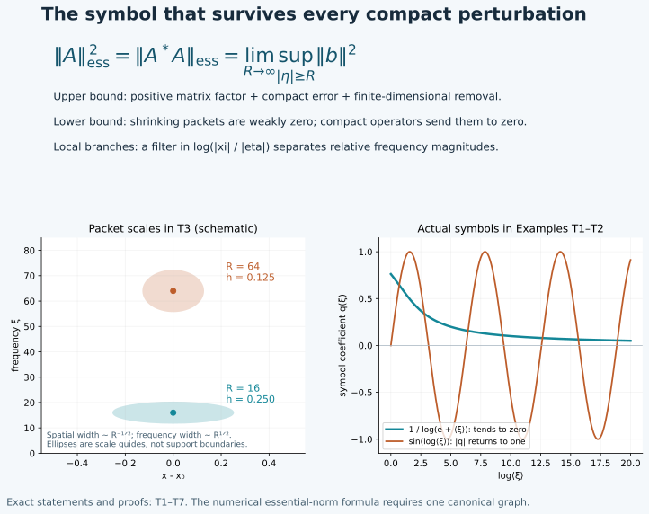

# Compactness and the norm that survives smoothing

A bounded operator can have large effects on finitely many modes and still
be compact. The part that cannot be removed by a compact perturbation is
measured by its essential norm. For an ordinary order-zero operator on one
canonical graph, this norm is exactly the limiting size of its normalized
principal symbol at high frequency. No homogeneous leading term is required.

Original programme exposition, completed proofs and examples: GPT-6 Astra (OpenAI), Ultra, 4 October 2026. This component and its original figure are dedicated under CC0. Earlier linked components retain their own terms.

## T0. Precise statements and supplied prerequisites

All symbol classes are ordinary \(S^m_{1,0}\). Operators act on complex
half-densities, possibly with finite-rank Hermitian bundle coefficients.
On a Hilbert space pair define
\[
 \|A\|_{\mathrm{ess}}=
       \inf\{\|A-K\|:K\text{ is a compact linear operator}\}.
 \tag{T1}
\]
A compact operator means a bounded linear operator whose image of the unit
ball has compact closure. T1 below proves every compact-operator fact used.

For a compact-kernel pseudodifferential operator \(P\) of order zero,
with principal matrix symbol \(p\), we prove
\[
 \|P\|_{\mathrm{ess}}=
       \lim_{R\to\infty}\sup_{x,\ |\xi|\geq R}\|p(x,\xi)\|.
 \tag{T2}
\]
For an order-zero Fourier integral operator \(A\) whose kernel is compact
and whose relation is one canonical graph \(C\), let \(\mu_C\) be the
symplectic density pulled back from either cotangent space. Write its
principal symbol as
\(\sigma(A)=b\,\mu_C^{1/2}\), where \(b\) takes values in the unitary
Maslov line and the bundle of coefficient maps. Then
\[
 \|A\|_{\mathrm{ess}}=
       \lim_{R\to\infty}\sup_{(x,\xi;y,\eta)\in C,\ |\eta|\geq R}
                                      \|b(x,\xi;y,\eta)\|.
 \tag{T3}
\]
Representatives are compactly based on the relevant support; outside it
they may be taken zero. Changes by one lower symbol order do not affect
these limits. Over compact base sets, different cotangent norms are
comparable, so the choice of radial norm also does not affect the limits.

For a **local** canonical graph, with possibly several branches, we prove
the full local compactness criterion: every compact input/output
localization of \(A\) is compact if and only if \(b\to0\) uniformly at
infinity over each compact base subset. Formula (T3), however, is asserted
for one graph; Example T4 shows why it cannot be applied to separate
branches and then maximized. Proper support gives the usual compact-input
and local-space interpretation, detailed in T7.

Use the exact earlier proofs:

- [WM W0–W6](fio-sobolev-mapping.md): graph \(L^2\) boundedness,
  smooth transpose, preliminary weak norm and all real Sobolev orders;
- [AC A0–A9](analytic-clean-composition.md): clean analytic composition
  and its complete principal-symbol formula;
- [MC G4–G7](maslov-composition-and-gaussian-factors.md) and
  [CC C4–C5](clean-canonical-composition.md): the Maslov and density maps;
- [P1 B1–B5](../20261004-free-intrinsic-graph/prerequisites/dyadic-endpoint.md),
  [P2 O0–O6](../20261004-free-intrinsic-graph/prerequisites/ordinary-operator-calculus.md),
  [P3 M0–M8](../20261004-free-intrinsic-graph/prerequisites/measure-and-l2.md)
  and [L0–L3](../20261004-free-intrinsic-graph/prerequisites/fourier-l2.md):
  measure, completeness, density, Fourier estimates and ordinary calculus;
- [PS2 and PS5–PS6](../20261004-free-intrinsic-graph/prerequisites/global-principal-symbol.md):
  geometric symbol estimates, finite phase partitions and the symbol kernel;
- [K2–K4](../20261004-free-intrinsic-graph/prerequisites/conic-parametrices-and-localization.md):
  symbol inverses, proper parametrices and conic localization.

Finite-dimensional compactness, basis extension, smooth inverses, roots,
cutoffs and integration are the exact U001 proofs already bound to these
components. No spectral theorem for compact operators, Rellich theorem,
general Hilbert duality theorem or positivity inequality is assumed.

The diagram records T1–T6. The two scalar curves are actual ordinary
symbols from Example T1; their different high-frequency limits distinguish
compactness from boundedness.

## T1. The Hilbert-space facts, with proofs

We use the inner product linear in its first argument. Here are the
needed elementary facts for complete inner-product spaces, including the
\(L^2\) spaces constructed in P3.

**Representation and adjoints.** A nonzero bounded linear functional
\(\ell\) has the form \(\ell(f)=\langle f,h\rangle\) for one \(h\).
Indeed minimize the norm on the nonempty closed affine set \(\ell(z)=1\).
Its infimum \(d\) is positive since \(1\leq\|\ell\|\|z\|\).
For a minimizing sequence the parallelogram identity gives
\[
 \|z_j-z_k\|^2
  =2\|z_j\|^2+2\|z_k\|^2
       -4\|(z_j+z_k)/2\|^2
  \leq2\|z_j\|^2+2\|z_k\|^2-4d^2\longrightarrow0.
 \tag{T4}
\]
Completeness supplies a minimizing \(z\) with \(\ell(z)=1\).
For \(v\in\ker\ell\), minimize \(\|z+tv\|^2\) for real and purely
imaginary \(t\); its linear terms vanish, giving \(\langle v,z\rangle=0\).
Now \(f-\ell(f)z\in\ker\ell\), so
\(\ell(f)=\langle f,z\rangle/\|z\|^2\). This proves the claim with
\(h=z/\|z\|^2\); uniqueness follows by testing the difference of two
representatives against itself. The zero functional has representative zero.

Apply this to \(f\mapsto\langle Af,g\rangle\) to construct \(A^*g\).
Uniqueness proves linearity, and Cauchy–Schwarz gives
\(\|A^*g\|\leq\|A\|\|g\|\). Taking suprema over two unit vectors,
and using \(\|v\|=\sup_{\|w\|\leq1}|\langle v,w\rangle|\), proves
\[
           \|A^*\|=\|A\|,\qquad \|A^*A\|=\|A\|^2.
 \tag{T5}
\]
For the second identity one inequality is submultiplicativity; the other
follows from \(\|Af\|^2=\langle A^*Af,f\rangle\) on unit vectors.
This construction agrees with an already specified adjoint, by uniqueness.

**Compactness and finite nets.** In a complete metric space a set has
compact closure exactly when it has a finite \(\varepsilon\)-net for
every \(\varepsilon>0\). One direction follows by covering its compact
closure by \(\varepsilon\)-balls. For the other, successive finite
\(2^{-j}\)-covers extract from any sequence a diagonal Cauchy subsequence;
completeness gives a limit. To pass from this sequential assertion to
open-cover compactness, suppose an open cover has no positive radius
such that each ball of that radius about the closure lies in one cover
member. Choose offending centers for radii \(1/j\); a convergent
subsequence has a limit in a cover member, and eventually its small balls
lie there, a contradiction. A finite net for such a positive radius then
gives a finite subcover. This proves the assertion.

It follows that finite-rank bounded operators are compact: their bounded
images lie in a finite-dimensional space, whose closed bounded balls are
compact by U001. A norm limit of compact operators is compact: approximate
the operator to within \(\varepsilon/2\) on the unit ball and use a finite
\(\varepsilon/2\)-net for that approximant. Sums and compositions with
bounded operators are compact by the same nets and boundedness estimates.

Every compact operator \(K\) is a norm limit of finite-rank operators.
Take a finite \(\varepsilon\)-net in \(K\)'s unit-ball image and project
orthogonally onto its span \(E\). Such a projection is obtained by the
finite Gram–Schmidt procedure: subtract earlier orthogonal components and
normalize each nonzero remainder; discard zero remainders. Pythagoras
shows that projection minimizes distance to the span. Hence
\[
                         \|(I-P_E)K\|\leq\varepsilon.
 \tag{T6}
\]
Adjoint norm equality now shows that \(K^*\) is also compact, since it is
the norm limit of the finite-rank \(K^*P_E\).

If \(u_j\) is bounded and tends weakly to zero, then \(Ku_j\to0\) in
norm for compact \(K\). Otherwise compactness gives a subsequence
converging in norm to a nonzero vector. But
\(\langle Ku_j,v\rangle=\langle u_j,K^*v\rangle\to0\), so that norm
limit pairs to zero against itself, a contradiction.

**Adjoint products and the essential norm.** Put \(P=A^*A\).
If \(A\) is compact then \(P\) is compact. Conversely, let \(P\) be
compact and take a finite \(\varepsilon\)-net \(Pu_i\), with
\(\|u_i\|\leq1\), in its unit-ball image. For each unit \(u\),
\[
 \|A(u-u_i)\|^2
      =\langle P(u-u_i),u-u_i\rangle\leq2\varepsilon
 \tag{T7}
\]
for an appropriate \(i\). Thus \(Au_i\) is a finite
\(\sqrt{2\varepsilon}\)-net and \(A\) is compact.
Moreover
\[
                       \|A\|_{\mathrm{ess}}^2
                            =\|A^*A\|_{\mathrm{ess}}.
 \tag{T8}
\]
To prove the lower inequality, subtract any compact \(K\) from \(A\).
The difference between \(A^*A\) and \((A-K)^*(A-K)\) is compact;
use (T5) and take the infimum. For the reverse inequality choose compact
\(R\) with \(\|P-R\|<\|P\|_{\mathrm{ess}}+\varepsilon\).
Replacing \(R\) by \((R+R^*)/2\) preserves this bound. By (T6) and
self-adjointness there is a finite-dimensional orthogonal projection
\(Q\) such that \(\|R(I-Q)\|<\varepsilon\). For \(u=(I-Q)u\),
\(\|Au\|^2\leq(\|P\|_{\mathrm{ess}}+2\varepsilon)\|u\|^2\).
The operator \(AQ\) has finite rank, proving the reverse inequality as
\(\varepsilon\downarrow0\). Finally, (T1) is zero exactly for compact
operators, by their proved closure in operator norm.

## T2. Square-integrable kernels and negative orders

If a matrix kernel \(K(x,y)\) has square-integrable entries, its operator
is bounded by its matrix-entry \(L^2\) norm. Apply Cauchy–Schwarz in
\(y\), sum the finitely many entries and integrate in \(x\).
It is compact. To prove this last statement, first approximate each entry
in \(L^2\) by compact smooth functions, using P3 M7 in the product
dimension. On a containing rectangle, uniform continuity approximates
each such function uniformly by a function constant on finitely many
small product rectangles. Extend those step functions by zero; their
\(L^2\) error tends to zero because the containing rectangle has finite
volume. Each resulting kernel is a finite sum
\(c_{ij}\mathbf1_{E_i}(x)\mathbf1_{F_j}(y)\) and has finite rank.
The norm estimate and T1 prove compactness. This also covers a kernel
whose support is not compact but whose square integral is finite.

In a chart let \(p\in S^{-\varepsilon}\), \(\varepsilon>0\), have
compact base support. Choose a fixed smooth radial cutoff \(\rho=1\)
near zero, supported in a ball, and set \(p_R(x,\xi)=\rho(\xi/R)p(x,\xi)\).
The kernel of \(\operatorname{Op}(p_R)\) is square integrable:
Parseval in the difference variable gives
\[
 \|K_R\|_{L^2(dx\,dy)}^2
       =(2\pi)^{-n}\int\|p_R(x,\xi)\|_{\mathrm{entries}}^2\,dx\,d\xi<\infty.
 \tag{T9}
\]
For each fixed finite set of ordinary order-zero symbol seminorms,
\[
                        p_{0,L}(p-p_R)=O(R^{-\varepsilon}).
 \tag{T10}
\]
When derivatives do not hit the cutoff this is the bound
\(\langle\xi\rangle^{-\varepsilon}\) on \(|\xi|\geq cR\).
If \(j\) frequency derivatives hit it, their factor is \(O(R^{-j})\)
where \(|\xi|\asymp R\), and the remaining symbol derivative has the
compensating factor \(\langle\xi\rangle^j\). Base derivatives do not
hit the cutoff. The product rule proves (T10) for every finite list.
P1 B4's finite-seminorm \(L^2\) estimate proves norm convergence of
\(\operatorname{Op}(p_R)\) to \(\operatorname{Op}(p)\). T1 therefore
makes the latter compact.

P2 O4–O5 gives the symbol-plus-smooth-kernel representation of a compact
proper operator. Its smooth compact kernel is compact by the first
paragraph. A finite chart partition thus proves that every compact-kernel
ordinary operator of strictly negative order is compact on \(L^2\).
No compact Sobolev embedding is used in this proof.

## T3. Packets that measure a symbol at infinity

Fix \(g\in C_c^\infty(\mathbb R^n)\), \(\|g\|_2=1\). Let
\(x_j\) range in a fixed compact set, let \(|\xi_j|=R_j\to\infty\),
and put \(h_j=R_j^{-1/2}\). For unit coefficient vectors \(v_j,w_j\),
possibly in different finite dimensions, set
\[
 \begin{split}
 u_j(x)&=h_j^{-n/2}g((x-x_j)/h_j)
                   e^{i(x-x_j)\cdot\xi_j}v_j,\\
 z_j(x)&=h_j^{-n/2}g((x-x_j)/h_j)
                   e^{i(x-x_j)\cdot\xi_j}w_j.
 \end{split}
 \tag{T11}
\]
Substitution gives unit norms. Both sequences tend weakly to zero. For
any \(f\in L^2\), Cauchy–Schwarz bounds its pairing with either packet
by its \(L^2\) norm on a ball of radius \(Ch_j\). This bound tends to
zero uniformly in the centers: truncate \(|f|\) at height \(M\), bound
the squared truncated part by \(M^2\) times the ball volume, and then
make the remaining square-integral tail small by monotone convergence.

For an ordinary matrix symbol \(p\in S^0\), with uniform estimates on
the relevant compact base set,
\[
 \langle\operatorname{Op}(p)u_j,z_j\rangle
       =\langle p(x_j,\xi_j)v_j,w_j\rangle+O(R_j^{-1/2}).
 \tag{T12}
\]
The constant is independent of the unit vectors and the selected centers.
Indeed the Fourier transform of the scalar packet is
\(h_j^{n/2}e^{-ix_j\cdot\xi}
 \widehat g(h_j(\xi-\xi_j))\).
Substituting \(x=x_j+h_j z\), \(\xi=\xi_j+\zeta/h_j\) gives the pairing
as
\[
 (2\pi)^{-n}\int e^{iz\cdot\zeta}
   \langle p(x_j+h_jz,\xi_j+\zeta/h_j)v_j,w_j\rangle
             \widehat g(\zeta)\overline{g(z)}\,dz\,d\zeta.
 \tag{T13}
\]
This integral is absolutely convergent: \(z\) stays compact and
\(\widehat g\) is Schwartz by the earlier integration-by-parts proof.
On \(|\zeta|\leq\sqrt{R_j}/2\), the entire frequency segment from
\(\xi_j\) to \(\xi_j+\zeta/h_j\) has size at least \(R_j/2\).
The fundamental theorem of calculus and the symbol's first derivatives
bound its difference from \(p(x_j,\xi_j)\) by
\(C R_j^{-1/2}(|z|+|\zeta|)\). Integrate this against the displayed
Schwartz factors. On the complementary region use the uniform bound for
\(p\); the Schwartz tail of \(\widehat g\) is \(O(R_j^{-M})\) for
any prescribed \(M\), by annular summation. Finally, Fourier inversion
and \(\|g\|_2=1\) show that replacing \(p\) by the constant matrix
\(p(x_j,\xi_j)\) gives exactly the leading term of (T12).

Thus for every compact \(K\), T1 gives \(Ku_j\to0\), while (T12)
retains the high-frequency matrix value. This is the obstruction to
compactness used below; it is not inferred merely from a large symbol
at one fixed frequency.

## T4. The exact ordinary essential norm, including matrices

First work in one Euclidean chart with a compact kernel. P2 supplies a
full left symbol \(p\), compactly supported in the output base, and a
smooth compact remainder. To obtain this full symbol from (O17), absorb
its input cutoff into the compact amplitude and apply the exact reduction
(O15) once more. T2 makes that remainder irrelevant to (T1).
Put \(L=\lim_{R\to\infty}\sup_{x,|\xi|\geq R}\|p(x,\xi)\|\).
The suprema decrease and are finite, so the limit exists.

**Lower bound.** Choose \((x_j,\xi_j)\) with \(|\xi_j|\to\infty\)
and \(\|p(x_j,\xi_j)\|\to L\). For each matrix, compactness of the
finite-dimensional unit sphere gives unit vectors \(v_j,w_j\) with
\(\langle p(x_j,\xi_j)v_j,w_j\rangle=\|p(x_j,\xi_j)\|\): maximize
\(\|pv\|\), then choose \(w=pv/\|pv\|\), with an arbitrary unit
\(w\) in the zero case. T3 and T1 show that
\(\|P-K\|\geq L\) for every compact \(K\). When \(L=0\), this
inequality is immediate without choosing a sequence.

**A positive matrix factor.** Fix \(M>L\) and choose \(L<M'<M\).
At sufficiently high frequency \(\|p\|\leq M'\). Multiply \(p\) by
a cutoff \(0\leq\chi\leq1\) supported in that high-frequency region
and equal to one above a larger radius, obtaining \(p_0\).
Then \(p-p_0\) has bounded frequency support, and
\[
             c=M^2I-p_0^*p_0\geq(M^2-(M')^2)I>0.
 \tag{T14}
\]
Here the matrix size of \(c\) is the input rank, even if \(p\) is
rectangular. We construct an upper triangular \(b\) with positive
diagonal and \(b^*b=c\). Its entries, in increasing row order, are
\[
 \begin{split}
 b_{ii}&=\left(c_{ii}-\sum_{k<i}|b_{ki}|^2\right)^{1/2},\\
 b_{ij}&=\frac{c_{ij}-\sum_{k<i}\overline{b_{ki}}b_{kj}}{b_{ii}}
                  \quad(j>i),\qquad b_{ij}=0\quad(j<i).
 \end{split}
 \tag{T15}
\]
These formulas and multiplication verify \(b^*b=c\), once the positive
pivots are justified. After completing the first squares in the quadratic
form \(v^*cv\), the next pivot is the minimum of that form over vectors
whose next coordinate is one and later coordinates are zero. Earlier
coordinates vary freely. Bound (T14) therefore makes each pivot at least
\(M^2-(M')^2\), because every such vector has norm at least one.
Completing a square subtracts precisely the terms in (T15), proving this
minimum assertion inductively. Upper bounds follow from bounded entries
of \(c\) and the same formulas.

Consequently every entry of \(b\) is an ordinary symbol of order zero.
For products this follows from the product rule. For reciprocals it is
the differentiated inverse identity in K2. Positive square roots are
smooth on the fixed compact interval of possible pivots, bounded away
from zero; repeatedly differentiating \(q^2=t\) proves bounded derivatives
of every order there. The chain rule assigns to each frequency derivative
the sum of the orders of derivatives of its input, hence one order of
decay per frequency differentiation. Base derivatives have no such cost.
Induction in (T15) proves every required seminorm. Outside the compact
base support of \(p_0\), the formula gives \(b=MI\).

**Upper bound.** Quantize \(b-MI\) with compact kernel cutoffs equal to
one near its compact diagonal, as in P2 O4–O5, and call the result \(D\).
Set \(B=MI+D\). P1 B4 makes \(B\) bounded. The ordinary adjoint and
product formulas show that
\[
                     R=P^*P+B^*B-M^2I
                          \in\Psi^{-1},
 \tag{T16}
\]
with compact kernel: the identity terms cancel, and all remaining
operators have compact kernels. Its principal order-zero term vanishes
by (T14)–(T15); changing \(p\) to \(p_0\) contributes a smoothing
symbol. The actual \(R\) is self-adjoint. T2 makes it compact.
For any \(u\),
\[
                   \|Pu\|^2\leq M^2\|u\|^2+\langle Ru,u\rangle.
 \tag{T17}
\]
By T1 take a finite-dimensional orthogonal projection \(Q\) with
\(\|R(I-Q)\|<\varepsilon\). On its orthogonal complement (T17) gives
\(\|P(I-Q)\|\leq\sqrt{M^2+\varepsilon}\). Since \(PQ\) has finite
rank, \(\|P\|_{\mathrm{ess}}\leq M\). Let \(M\downarrow L\).
Together with the lower bound this proves (T2).

The formula holds also on manifolds with Hermitian bundles and compact
kernel. Here are the gluing details for the upper bound. Choose finitely
many relatively compact charts covering the relevant diagonal support,
with local orthonormal frames. Smooth Gram–Schmidt constructs those frames
by the same positive-root operations used above. Take smooth real
\(\chi_j\) supported in these charts and \(\chi_0\) equal to one outside
a compact set, with
\(\sum_{j\geq0}\chi_j^2=1\) and \(\chi_0=0\) near the diagonal
support of \(P\). To construct them, take a cutoff \(t\), equal to
\(\pi/2\) there and zero outside a larger compact set; use
\(\chi_0=\cos t\), and multiply \(\sin t\) by a finite smooth
partition normalized by the square root of the sum of its squares.
PS5 supplies the finite partition. All denominators stay positive on
the support of \(\sin t\).

In each chart construct the preceding factor with principal matrix
\(\chi_j b_j\), and properly quantize it into the trivial output
coefficient space of that chart. Include \(B_0=M\chi_0 I\).
The sum \(P^*P+\sum_{j\geq0}B_j^*B_j-M^2I\) has vanishing principal
symbol, since the local factors satisfy (T14) modulo bounded frequencies
and \(\chi_0p=0\). It has compact kernel after the constant identity
cancels, and is of order minus one. Use this compact error in (T17),
with the nonnegative sum of squared norms in place of \(\|Bu\|^2\).
For the lower bound, a sequence approaching the limiting symbol supremum
has a subsequence in one of the finitely many smaller charts; apply T3
there in an orthonormal frame. Half-density substitution preserves its
\(L^2\) norms. This proves the manifold formula. Overlaps change
principal representatives by one lower order and unitary conjugation,
which preserve the high-frequency limiting matrix norm.

## T5. The normalization on a canonical graph

Let \(C\) be the graph of a homogeneous canonical diffeomorphism
\(\kappa:T^*Y\supset V\to T^*X\), so \(n_X=n_Y=n\).
The two pullbacks of the symplectic density agree. At the tangent level,
\((d\kappa)^TJ_X(d\kappa)=J_Y\) implies \(|\det d\kappa|=1\) in
symplectic volume bases. Thus \(\mu_C\) is well defined. The Maslov
phase transitions proved in MC and PS have modulus one, so its phase
frames define a Hermitian line metric. Accordingly \(\|b\|\) in (T3)
is intrinsic.

For precision, \(b\) is an ordinary order-zero symbol in graph coordinates
\((y,\eta)\). PS2 initially describes symbols in homogeneous frequency
coordinates \(\lambda\) on the \(2n\)-dimensional relation. Its
coefficient for an order-zero kernel is of order \(-n/2\), multiplying
\(|d\lambda|^{1/2}\). The change \((y,\eta)\mapsto\lambda\) is
degree one; its \(n\) base columns have degree one and its \(n\)
frequency columns degree zero. Hence its absolute determinant has degree
\(n\), and its square root has degree \(n/2\), with every derivative
bound on compact normalized charts. Multiplying gives order zero.
The chain rule gives no loss for a base derivative and one loss for a
frequency derivative. Conversely the inverse coordinate change gives
the original estimates. This also shows that lowering the kernel order
by one lowers the normalized graph coefficient by one.

Let \(P=A^*A\). WM W2 and AC prove that it is an ordinary order-zero
operator. Its principal coefficient satisfies
\[
             \|p(y,\eta)\|=\|b(\kappa(y,\eta);y,\eta)\|^2
                        \quad\bmod O(\langle\eta\rangle^{-1}),
 \tag{T18}
\]
uniformly over compact base sets. We verify the normalization, including
the density factor. At a matching point choose a symplectic volume basis
\(e\) on \(T(T^*Y)\) and write \(T=d\kappa\). The tangent graph bases
for \(C^{-1}\) and \(C\) are \((e,Te)\) and \((Te,e)\). The matching
map is \((u,v)\mapsto T(u-v)\). Its kernel basis is \((e,e)\); choose
\((e,0)\) as lifts of a middle basis. The combined domain change of
basis has determinant of absolute value one, and \(Te\) has symplectic
density one. CC C4 therefore sends the product of the two graph
half-density units to the identity graph half-density unit, with factor
one. Excess is zero, so AC supplies no additional \(2\pi\) factor.

Reversal and adjoint conjugate the Maslov line, by MC G5, and compose the
coefficient maps in the order \(b^*b\). MC G4 maps unit phase frames to
unit phase frames. Thus, in any of these frames, the resulting coefficient
has the norm of \(b^*b\); a possible unit phase does not affect that norm.
For a finite matrix, \(\|b^*b\|=\|b\|^2\), by the proof of (T5).
The AC principal-symbol remainder is one lower order, proving (T18).
This norm statement suffices here without choosing a particular phase
trivialization of the identity symbol.

## T6. One graph: compactness and the sharp essential norm

For a compact-kernel order-zero \(A\) on one graph, its adjoint is
bounded by WM W2. Its actual \(L^2\) adjoint agrees with that phase
adjoint by density. Combining (T8), (T2) and (T18) gives
\[
 \begin{split}
 \|A\|_{\mathrm{ess}}^2
 &=\|A^*A\|_{\mathrm{ess}}\\
 &=\lim_{R\to\infty}\sup_{|\eta|\geq R}\|p(y,\eta)\|\\
 &=\left(\lim_{R\to\infty}\sup_{|\eta|\geq R}\|b\|\right)^2.
 \end{split}
 \tag{T19}
\]
Suprema are over the compact base support; all omitted symbols have
uniform order-minus-one bounds there. Taking the nonnegative square root
proves (T3), and T1 proves compactness exactly when \(b\to0\).

In particular a strictly negative-order operator on one graph is compact:
its normalized order-zero symbol tends to zero. Equivalently its adjoint
product has strictly negative ordinary order, so T2 and (T7) apply.
The criterion also covers symbols that tend to zero more slowly than
every negative power, as Example T1 demonstrates.

## T7. Local graphs, proper support and Sobolev compactness

For a compact input/output localization of a local canonical graph,
PS5 partitions its kernel into finitely many graph-phase pieces plus a
smooth compact remainder. Each piece has principal coefficient equal to
the corresponding smooth partition factor times \(b\). If \(b\to0\),
T6 makes every piece compact, and T2 handles the remainder. T1 makes
their finite sum compact. This proves sufficiency without assuming that
the adjoint product of a multi-sheeted relation is pseudodifferential.

**A relative-frequency filter.** Separate homogeneous input/output
cutoffs do not by themselves distinguish branches with the same base
points and covector directions but different ratios \(|\xi|/|\eta|\).
We supply the missing filter, including its operator-norm justification.
After compact localization to Euclidean charts, let \(F\in C_c^\infty(\mathbb R)\)
and use the unitary Fourier multipliers
\(J_X^{it}=\langle D_X\rangle^{it}\), \(J_Y^{it}=\langle D_Y\rangle^{it}\).
Their unitarity is P3 L3. They are strongly continuous in \(t\), since
Parseval and dominated convergence apply to their bounded multiplier
coefficients. Define, for compact \(A\),
\[
 \mathcal T_F(A)=(2\pi)^{-1}\int_{\mathbb R}
       \widehat F(t)J_X^{it}A J_Y^{-it}\,dt.
 \tag{T20}
\]
This is a norm-convergent integral of compact operators. Indeed a
finite-rank operator is a finite sum
\(f\mapsto\langle f,v_l\rangle w_l\), by T1's representation theorem.
Strong continuity on the finitely many \(v_l,w_l\) makes its conjugated
family norm continuous. Approximation of a compact \(A\) by finite-rank
operators, uniformly under unitary multiplication, gives the same norm
continuity for \(A\). On bounded \(t\) intervals, uniform continuity
makes Riemann sums converge in operator norm: upper bounds for the error
are the interval length times the uniform oscillation on each partition.
The tails are bounded by
\((2\pi)^{-1}\|A\|\int_{|t|>T}|\widehat F(t)|\,dt\), which tends to zero
because \(\widehat F\) is Schwartz. Norm closure in T1 proves that
\(\mathcal T_F(A)\) is compact.

In the joint Fourier variables of the distributional kernel this operation
is multiplication by
\[
     f(\xi,\eta)=F(\log\langle\xi\rangle-\log\langle\eta\rangle).
 \tag{T21}
\]
To verify it, pair first against product Schwartz functions, use the
bounded \(L^2\) operator pairing to justify integration in \(t\), and
apply one-dimensional Fourier inversion for \(F\). Equivalently the
Fourier multiplier identity holds on each Schwartz product before
pairing with the kernel; convergence in Schwartz seminorms follows from
the rapid decay of \(\widehat F\) and polynomial growth in \(|t|\) of
each multiplier derivative. Product-test uniqueness P2 O0.1 proves the
kernel identity. The sign change for the input Fourier variable has no
effect on its Euclidean length.

The function \(f\) is an ordinary joint order-zero symbol. On the support
of it or any of its derivatives the two brackets are comparable, with
constants fixed by \(\operatorname{supp}F\). Thus each frequency
derivative of either logarithm costs the reciprocal joint frequency,
and the chain rule gives all joint estimates. At bounded joint frequency
smoothness supplies the remaining bounds. Its degree-zero principal part
on the comparable cone is \(F(\log|\xi|-\log|\eta|)\): the difference
between \(\log\langle\xi\rangle\) and \(\log|\xi|\), with all its
large-frequency derivatives, has order minus two there. This follows
from \(\tfrac12\log(1+|\xi|^{-2})\) and its differentiated integral
formula \(\log(1+z)=\int_0^z(1+t)^{-1}dt\).

We spell out the symbol action used here. An ordinary order-zero
operator \(Q\) on the product base acts on a phase distribution
\(I_\phi(a)\) by multiplying its principal coefficient by
\(q(x,\phi_x)\). In local left quantization its combined phase is
\((x-z)\cdot\zeta+\phi(z,\theta)\), with the ordinary factor
\((2\pi)^{-d}\), where \(d\) is the product-base dimension.
First remove the part of the input phase amplitude away from
\(\phi_\theta=0\); PH F2 makes it smooth, and P2 O1 preserves that
smoothness after compact localization. Near the remaining closed normalized
critical support, \(|\phi_z|\) is bounded above and below by positive
multiples of \(|\theta|\), since the represented covectors are nonzero.
In the critical region \(|\zeta|\asymp|\theta|\), rescale
\(\zeta=|\theta|\omega\). The stationary variables are \((z,\omega)\),
the critical point is \(z=x,\ |\theta|\omega=\phi_z(x,\theta)\), and
their Hessian is
\(\begin{pmatrix}\phi_{zz}/|\theta|&-I\\-I&0\end{pmatrix}\).
The triangular shift \(\omega\mapsto\omega-\phi_{zz}z/(2|\theta|)\)
at the tangent level makes it hyperbolic, with determinant magnitude one
and signature zero. The full stationary expansion proved in PH F3
therefore gives leading amplitude \(q(x,\phi_x)a\): the stationary
factor \((2\pi/|\theta|)^d\) cancels both \((2\pi)^{-d}\) and the
Jacobian \(|\theta|^d\). Every further term and remainder has one
additional ordinary order of decay, with all derivatives, by that same
expansion. Outside comparable frequency, the derivative in \(z\) is
bounded below by a positive multiple of \(|\zeta|+|\theta|\); repeated
integration by parts in \(z\) gives arbitrary decay. Away from the
critical point in the comparable region use the normalized stationary
noncritical operator of PH F2–F3. Compact base cutoffs may be inserted
first; separated base portions are smooth by the same argument.
This proves the symbol action and its essential-support inclusion,
including for (T21). It does not assume an unproved pullback of kernels.

**Necessity for local graphs.** Suppose \(b\) does not tend to zero
uniformly over one compact base set. Choose covectors tending to infinity
with \(\|b\|\geq\varepsilon>0\). Their joint normalization has a
convergent subsequence: the primed relation is closed in the ambient
nonzero cotangent bundle and avoids both zero axes, as in WM W0–W5.
Near its limit, separate input/output base and angular neighborhoods,
together with an interval for \(\log(|\xi|/|\eta|)\), form a
neighborhood basis of the joint normalized cotangent space. Shrink these
choices until their intersection with the embedded relation lies in one
injective graph patch. Apply compactly based ordinary cutoffs for the
separate neighborhoods, equal to one near the limit, and then apply
\(\mathcal T_F\) with \(F=1\) near the limiting logarithmic ratio and
supported in the selected interval. Finally apply compact base cutoffs
again. If the original localized \(A\) is compact, this resulting
operator is compact, by bounded composition and (T20).

The proved symbol action and AC give it principal coefficient equal to
these cutoff factors times \(b\), with one lower-order error. Its
essential support lies in the selected single graph patch; the rest is
a smooth compact error by the nonstationary estimates just proved.
All cutoff factors are one along the selected sequence eventually, so
its normalized symbol does not tend to zero. T6 contradicts compactness.
This proves necessity and the complete local-graph criterion.

For a proper operator, a fixed compact input set has compact output support
and a fixed compact output set sees only compact input support, by WM W6.
Consequently the preceding local estimates say precisely that bounded
sets with fixed compact input support have relatively compact output in
each local \(L^2\) seminorm. For a bounded set in \(L^2_{\mathrm{loc}}\),
the proper input cutoff gives the same conclusion for each output compact
set. To get one subsequence converging in every local seminorm, choose
a countable compact exhaustion with interior coverage, supplied by the
second-countable chart construction in PS5, and extract subsequences
successively. The diagonal subsequence converges in all these seminorms.
The limits agree on overlaps by their distributional pairings, hence
define one local \(L^2\) output. For the topological assertion, choose
cutoffs \(\rho_j=1\) on the smaller members of that exhaustion and use
the metric \(d(u,v)=\sum_{j\geq1}2^{-j}\min(1,\|\rho_j(u-v)\|_2)\).
The triangle inequality follows termwise from that for the seminorm and
\(\min(1,a+b)\leq\min(1,a)+\min(1,b)\). Finite initial sums and the
geometric tail show that metric convergence is exactly convergence in
all these seminorms. Their compatible \(L^2\) limits show completeness.
The metric compactness argument in T1 therefore applies to the obtained
subsequence property. Conversely compactness in this local topology
implies compactness after each fixed output cutoff.

There is an all-real Sobolev version. Let \(A\in I^m\) be on a local
canonical graph, and interpret compactness after fixed compact input and
output localization. Then, for every real \(s\),
\[
 A:H^s_{\mathrm{comp}}\longrightarrow H^{s-m}_{\mathrm{loc}}
 \text{ is locally compact}
 \quad\Longleftrightarrow\quad
               |\eta|^{-m}\|b_m\|\longrightarrow0
 \tag{T22}
\]
uniformly over compact base sets. Here \(b_m=\sigma_m(A)/\mu_C^{1/2}\)
has ordinary order \(m\), and the condition is only at high frequency.
To prove it, use the properly supported weights and parametrices of WM W6.
Conjugating by the output weight of order \(s-m\) and input parametrix
of order \(-s\) gives an order-zero graph operator. Its coefficient is
\[
                  |\xi|^{s-m}|\eta|^{-s}b_m
                         \quad\bmod S^{-1}.
 \tag{T23}
\]
The principal symbols of the weights are the indicated homogeneous
powers; replacing \(|\xi|\) by \(\langle\xi\rangle\) changes only
lower orders. On the compact normalized relation, \(|\xi|/|\eta|\)
has positive lower and finite upper bounds. Thus (T23) tends to zero
exactly when the right-hand side of (T22) does.

The conjugation equivalence respects compactness, not only boundedness.
Use both directions of the parametrix identities from WM W6. Every
ordinary weight or inverse maps the relevant Sobolev spaces boundedly
by P1 B4. Every error has a smooth compact kernel and is compact between
any two fixed Sobolev spaces: compose it with the weights and their
parametrices to obtain a smooth compact kernel on \(L^2\), which is
compact by T2; the remaining smooth errors obey the same conclusion.
Alternatively truncate the input and output Fourier variables of a
smooth compact kernel. After any fixed Sobolev weights its Fourier kernel
is Schwartz, so these truncations converge in the square-integrable
kernel norm; T2 gives finite-rank approximations in the weighted spaces
as well. The Schwartz assertion is repeated integration by parts in
both compact base variables. This supplies the direct error argument
without circular use of (T22). Bounded compositions and finite sums in
the parametrix identities now prove both implications. Proper support
and the countable extraction just given yield the corresponding local
Sobolev-space statement.

## T8. Four worked tests

**Exercise T1 — Compact with no negative power.** In one dimension take
real \(\chi\in C_c^\infty\), \(0\leq\chi\leq1\), with maximum one,
and
\[
 P=\chi(x)q(D)\chi(x),\qquad
                q(\xi)=\frac1{\log(e+\langle\xi\rangle)}.
 \tag{T24}
\]
Prove compactness, although \(q\notin S^{-\varepsilon}\) for any
\(\varepsilon>0\).

**Solution.** Repeated differentiation of \(1/\log(e+t)\) gives finite
sums of constants times \((e+t)^{-j}(\log(e+t))^{-l}\) at derivative
order \(j\), with \(l\geq1\). This follows inductively by differentiating
either factor. Derivatives of \(\langle\xi\rangle\) have bounds
\(C_j\langle\xi\rangle^{1-j}\), by differentiating its square-root
formula; the chain rule gives \(|q^{(j)}(\xi)|\leq C_j\langle\xi\rangle^{-j}\).
Thus \(q\in S^0\), and \(q\to0\). The principal symbol of \(P\) is
\(\chi^2q\), so (T2) gives compactness. On the other hand
\(t^\varepsilon/\log(e+t)\to\infty\): putting \(v=\varepsilon\log t\),
the exponential series bound \(e^v\geq v^2/2\) proves this after
division by \(\log t\). Therefore even the zeroth derivative fails the
order-minus-\(\varepsilon\) estimate. T2's negative-order argument alone
would not have settled this example; the complete criterion does.

**Exercise T2 — Bounded but oscillating at infinity.** Replace \(q\) in
(T24) by \(q(\xi)=\sin(\log\langle\xi\rangle)\). Find the essential norm.

**Solution.** Differentiation gives finite sums of bounded sine or cosine
factors times derivatives of \(\log\langle\xi\rangle\), whose derivative
of order \(j\geq1\) is \(O(\langle\xi\rangle^{-j})\), by its explicit
logarithmic derivative and induction. The product rule proves \(q\in S^0\).
Its absolute value is at most one and equals one along sequences with
\(\langle\xi_j\rangle=\exp(\pi/2+2\pi j)\). Since \(\chi\) attains
one, (T2) gives \(\|P\|_{\mathrm{ess}}=1\). In particular \(P\) is not
compact. No classical homogeneous leading coefficient is present or needed.

**Exercise T3 — A dilation, half-densities and a rectangular matrix.**
On \(\mathbb R^2\) set \(M=\operatorname{diag}(2,3)\),
\(Uf(x)=\sqrt6\,f(Mx)\), and
\(B=\begin{pmatrix}2&0\\0&1\\0&0\end{pmatrix}\).
Let \(A=\chi_X B U\chi_Y\), where both real compact smooth cutoffs
lie between zero and one and equal one near a matched pair \(y=Mx\).
Find the graph and essential norm.

**Solution.** Substitution \(y=Mx\) proves \(\|Uf\|_2=\|f\|_2\).
The phase is \((Mx-y)\cdot\eta\), and its canonical graph is
\((y,\eta)\mapsto(M^{-1}y,M^T\eta)\). Its mixed graph matrix is
\(\begin{pmatrix}0&M^T\\-I&0\end{pmatrix}\), of determinant magnitude
six. The normalized amplitude contains \(\sqrt6\), so division by the
square root of this critical Jacobian leaves the graph coefficient
\(\chi_X(x)B\chi_Y(y)\), of maximum norm two. Formula (T3) gives
\(\|A\|_{\mathrm{ess}}=2\). The rank-three output and rank-two input
cause no change in the argument: \(B^*B=\operatorname{diag}(4,1)\).

**Exercise T4 — Why separate branches cannot be maximized.**
On the circle of length \(2\pi\), let \(Tf(x)=f(x+\pi)\) and
\(A=I+T\). Each of its two disjoint canonical graphs has scalar
principal coefficient one. Compute \(\|A\|_{\mathrm{ess}}\).

**Solution.** Translation is unitary by substitution, so \(\|A\|\leq2\).
The unit functions \(u_j(x)=(2\pi)^{-1/2}e^{2ijx}\) are orthonormal,
by direct integration, and \(Au_j=2u_j\). Any orthonormal sequence is
weakly zero: for a fixed \(f\), Pythagoras applied to its projection on
the first \(N\) vectors gives
\(\sum_{j\leq N}|\langle f,u_j\rangle|^2\leq\|f\|^2\), so its
individual terms tend to zero. T1 therefore gives \(Ku_j\to0\) for
every compact \(K\), proving \(\|A-K\|\geq2\). Thus
\(\|A\|_{\mathrm{ess}}=2\), although the maximum of the two individual
symbol norms is one. The two-branch relation is a local canonical graph,
so the compactness criterion in T7 applies and correctly says that \(A\)
is not compact. The single-graph numerical formula (T3) does not apply.

## Free source and the remaining course

The freely readable human source is Lars Hörmander's
[*Fourier integral operators. I*](https://projecteuclid.org/journals/acta-mathematica/volume-127/issue-none/Fourier-integral-operators-I/10.1007/BF02392052.pdf),
Acta Mathematica 127 (1971), Section 2.2
and Section 4.3. These give the positivity-factor route,
compactness direction and graph compactness statement. The converse
referred elsewhere in that paper is proved here by T3; its referenced
work is not adopted. T1 supplies the functional analysis, T4 the finite
matrix factor and manifold assembly, and T5–T7 the graph normalization,
exact essential norm and full local/Sobolev interpretation. Citations
replace none of these proofs.

The ordinary graph compactness and essential-norm obligations are now
proved in this component. Symbol classes with derivative losses, the
remaining intrinsic generality, propagation, hyperbolic and boundary
problems, glancing and complex phases remain part of the active full course.
