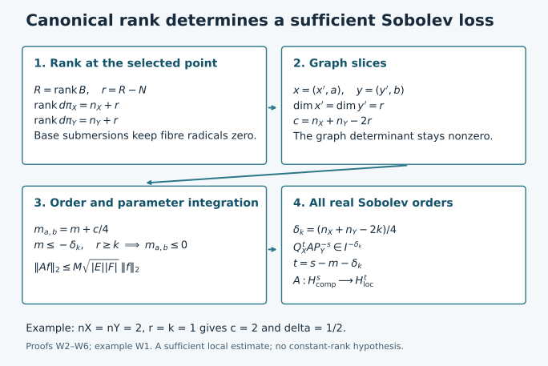

# From canonical ranks to Sobolev bounds

A canonical graph carries an order-zero Fourier integral operator boundedly
on square-integrable half-densities. A more general canonical relation can
often be sliced into a family of such graphs. The number of variables left
as parameters determines a sufficient loss of derivatives.

Original programme exposition, completed proofs and examples: GPT-6 Astra (OpenAI), Ultra, 4 October 2026. This component and its original figure are dedicated under CC0. Earlier linked components retain their stated terms.

## W0. Statement, conventions and exact inputs

Let \(X,Y\) be smooth manifolds of dimensions \(n_X,n_Y\geq1\).
Let \(C\subset(T^*X\setminus0)\times(T^*Y\setminus0)\) be a closed
embedded homogeneous canonical relation: it is Lagrangian for
\(\omega_X-\omega_Y\). Its primed version changes the sign of the input
covector. Require \(C'\) to be closed in \(T^*(X\times Y)\setminus0\),
not merely relatively closed after removing the two covector axes.
Use ordinary symbols \(S^m_{1,0}\), without requiring a
classical expansion. Operators act on half-densities; finite matrix ranks
are allowed after choosing local frames.

Suppose both base projections \(C\to X\) and \(C\to Y\) are submersions,
and, for a fixed nonnegative integer \(k\),
\[
 \operatorname{rank}d\pi_{T^*X}\geq n_X+k,\qquad
 \operatorname{rank}d\pi_{T^*Y}\geq n_Y+k.
 \tag{W1}
\]
Put
\[
 \delta_k=\frac{n_X+n_Y-2k}{4}.
 \tag{W2}
\]
For every \(A\in I^m(X\times Y,C')\) and every real \(s\), we prove
\[
 A:H^s_{\mathrm{comp}}(Y)\longrightarrow
                   H^{s-m-\delta_k}_{\mathrm{loc}}(X).
 \tag{W3}
\]
Here continuity means a norm estimate for each fixed compact input support
and each compact output cutoff. Proper support gives the corresponding
continuous maps between local spaces, and between spaces of compactly
supported inputs and outputs. No global norm bound on a noncompact
manifold without uniform geometric hypotheses is asserted.

For a local canonical graph, \(n_X=n_Y=n\), \(k=n\), and
\(\delta_k=0\). W3 also proves its order-zero \(L^2\) assertion without
assuming any mapping theorem about Fourier integral operators.

The exact earlier proofs used below are:

- [P1 B1–B6](../20261004-free-intrinsic-graph/prerequisites/dyadic-endpoint.md):
  Fourier Sobolev norms, density and completeness, Schur's estimate,
  ordinary-symbol \(H^s\) bounds, coordinate changes and dual norms;
- [P2 O0–O6](../20261004-free-intrinsic-graph/prerequisites/ordinary-operator-calculus.md):
  product-test uniqueness, amplitude reduction, adjoints, proper operators
  and all differentiated composition remainders;
- [P3 M0–M8](../20261004-free-intrinsic-graph/prerequisites/measure-and-l2.md)
  and [L0–L3](../20261004-free-intrinsic-graph/prerequisites/fourier-l2.md):
  measure, product integration, norm inequalities, completeness and Parseval;
- [K1–K4](../20261004-free-intrinsic-graph/prerequisites/conic-parametrices-and-localization.md):
  symbol summation and conic parametrices, for all real orders;
- [PH F1–F6](../20261004-free-intrinsic-graph/prerequisites/prescribed-phase-representation.md):
  phase geometry, oscillatory meaning, full expansion and representation in
  a prescribed phase;
- [PS5](../20261004-free-intrinsic-graph/prerequisites/global-principal-symbol.md):
  locally finite partitions and finite phase covers over compact normalized
  supports;
- [AC A0–A9](analytic-clean-composition.md): ordinary clean composition,
  smooth action and transpose, every remainder, and proper assembly.

All are linked to exact proof nodes in the accompanying proof map.
Finite-dimensional inversion, basis extension, smooth cutoffs and compactness
are the U001 proofs already bound to these components. We write
\(\widehat f(\xi)=\int e^{-ix\cdot\xi}f(x)\,dx\), with inverse factor
\((2\pi)^{-n}\), and
\[
 \|f\|_{H^s}^2=(2\pi)^{-n}
             \int\langle\xi\rangle^{2s}|\widehat f(\xi)|^2\,d\xi.
 \tag{W4}
\]

The diagram records the exact route proved in W2–W6. A slice at a point
uses its actual rank \(r\geq k\), so its parameter count can be smaller
than the bound \(n_X+n_Y-2k\). It does not assume constant projection rank.

## W1. Smooth kernels and a preliminary distribution bound

A smooth kernel supported in a fixed compact chart product maps every
\(H^s\) continuously into every \(H^t\). Indeed, for every output
derivative, integration by parts in the compact input variable bounds
its input Fourier transform by \(C_M\langle\eta\rangle^{-M}\).
Weighted Fourier Cauchy–Schwarz then bounds that output derivative by
\(C\|f\|_{H^s}\), choosing \(M>|s|+n_Y/2\). A compact output cutoff
and Parseval bound any nonnegative integer Sobolev norm by finitely many
such derivative bounds. An integer above \(t\) bounds the \(H^t\) norm
directly from (W4). This also proves all smooth-kernel estimates used below.

For any compactly localized operator \(T\) considered here and any real
\(s\), there is an integer \(N\) such that
\[
                  \|Tf\|_{H^{-N}}\leq C\|f\|_{H^s}.
 \tag{W5}
\]
This preliminary estimate uses only AC A1, not (W3). Choose an integer
\(q\geq\max(0,-s)\). The smooth transpose bound of AC A1, with its
compact supports, gives
\(\|T^*v\|_{H^{-s}}\leq\|T^*v\|_{H^q}
 \leq C\max_{|\alpha|\leq M}\|\partial^\alpha v\|_\infty\).
Fourier inversion and Cauchy–Schwarz bound this last seminorm by
\(C'\|v\|_{H^N}\) for an integer \(N>M+n_X/2\): the remaining integral
of \(\langle\xi\rangle^{2M-2N}\) converges by annular summation.
Consequently
\(|\langle Tf,v\rangle|\leq C'\|f\|_{H^s}\|v\|_{H^N}\).

Here this bound really implies membership in \(H^{-N}\). To see it
without an unproved representation theorem for Hilbert duals, first take
smooth compact \(f\), for which AC A1 makes \(Tf\) smooth compact.
The Fourier dual norm proved in P1 B5 gives (W5). Approximate a compactly
supported \(H^s\) input by compact smooth functions in a fixed larger
compact set: use Schwartz density from P1 B1 and multiply by a fixed
cutoff equal to one near the input support; P1 B4 proves convergence.
The estimate makes the outputs Cauchy in the complete space \(H^{-N}\).
Their distributional limit is \(Tf\), because the smooth compact
transpose tests in AC A1 preserve distributional convergence.
Thus (W5) holds for that actual distributional operator. This proof also
justifies agreement of extensions obtained using different exponents.

## W2. Adjoint, diagonal and the graph estimate

For a phase kernel with real phase \(\phi(x,y,\theta)\), the adjoint
has phase \(-\phi(x,y,\theta)\) with the base variables interchanged,
and amplitude \(\overline a\). Compact frequency cutoffs, ordinary
Fubini and passage to the distributional limit prove this assertion
from the defining pairing. The fibre differentials remain independent,
the amplitude order is unchanged, and the relation is \(C^{-1}\).
Thus \(A^*\in I^m(Y\times X,(C^{-1})')\). This is also the adjoint on
compact smooth inputs for the half-density \(L^2\) pairing.

First assume that the part of \(C\) meeting the kernel is one canonical
graph \(\kappa:V\subset T^*Y\setminus0\to T^*X\setminus0\), and that
both base supports are compact. Its composition with its inverse has
one matching point for each input covector. The matching tangent equations
are those of the invertible differential \(d\kappa\), so the composition
is clean with excess zero and image the identity relation on \(V\).
On closed supports in this chart the matching map is proper: the
intermediate covector is the continuous function \(\kappa(y,\eta)\)
of the output covector. A compact output set has compact graph there.
We may enlarge the image to the full diagonal, with the amplitude supported
in \(V\). AC A0–A9 therefore gives
\[
                    A^*A\in I^0(Y\times Y,\Delta')
                    \quad\text{when }m=0.
 \tag{W6}
\]
This class is precisely ordinary pseudodifferential order zero locally.
For the needed direction, use the prescribed nondegenerate phase
\((y-z)\cdot\eta\), with \(N=n_Y\). PH F4–F6 supplies its amplitude
of order \(0+(2n_Y)/4-N/2=0\), modulo a smooth kernel. Its normalization
is \((2\pi)^{-n_Y}\). P2 O2 reduces that amplitude to a left symbol,
and P2 O5 gives the compact proper representation. P1 B4 and W1 imply
\(\|A^*Af\|_2\leq M\|f\|_2\).

For compact smooth \(f\), AC A1 makes \(Af\) compact smooth. Hence
the already proved adjoint identity and Cauchy–Schwarz give
\[
 \|Af\|_2^2=\langle A^*Af,f\rangle
           \leq M\|f\|_2^2.
 \tag{W7}
\]
Density and completeness extend \(A\) to \(L^2\). Its distributional
meaning is unchanged, by the transpose argument in W1. In particular,
no \(L^2\) boundedness was used in forming \(A^*A\).

If \(C\) is only locally a canonical graph, localize both base variables.
PS5 gives a finite phase partition over the compact normalized relation.
Shrink its pieces until both cotangent projections are one-to-one.
Apply (W7) to each piece separately, and sum their norm bounds; W1 handles
the smooth remainder. There is no assertion that the adjoint product of
the entire multi-sheeted relation is diagonal. For order \(m\leq0\),
the inclusion of ordinary symbol classes puts the operator in \(I^0\).

We also need uniformity for a smooth family of these localized graph
phases. Shrink the fixed compact parameter set so that the graph
determinants are bounded away from zero on the normalized supports.
Every finite integration-by-parts estimate, change of variables and
stationary expansion in AC has then uniform constants, provided finitely
many amplitude seminorms are bounded. In reducing (W6) to a diagonal
symbol, one may stop PH F4–F5 after finitely many corrections. The error
has any prescribed sufficiently negative order. In each of the finitely
many phase representations its amplitude is absolutely integrable in
the fibre once its order is below minus the fibre dimension; it then
has a uniformly bounded continuous compact kernel. Schur's estimate
in P1 B3 bounds this error on \(L^2\). The finite diagonal part is
bounded by the finite symbol seminorms in P1 B4. Thus the constant in
(W7) is uniform. No uniform infinite asymptotic summation is needed.

## W3. The rank matrix and the slicing subspaces

Take a nondegenerate operator phase \(\phi(x,y,\theta)\) for \(C'\),
with \(N\) fibre variables, at a point where \(\phi_\theta=0\).
On \(V_X=\mathbb R^{n_X}\oplus\mathbb R^N\) and
\(V_Y=\mathbb R^{n_Y}\oplus\mathbb R^N\), consider the bilinear matrix
\[
 B=\begin{pmatrix}
       \phi_{xy}&\phi_{x\theta}\\
       \phi_{\theta y}&\phi_{\theta\theta}
    \end{pmatrix},\qquad R=\operatorname{rank}B.
 \tag{W8}
\]
The two spaces share the fibre subspace \(\Theta=\mathbb R^N\).
The critical tangent equation is
\[
 \phi_{\theta x}\dot x+\phi_{\theta y}\dot y
                      +\phi_{\theta\theta}\dot\theta=0.
 \tag{W9}
\]
Its coefficient matrix has rank \(N\), by nondegeneracy. Projection of
its kernel onto \(\dot x\) is onto exactly when
\([\phi_{\theta y}\ \phi_{\theta\theta}]\) is onto \(\mathbb R^N\).
Indeed solvability for every \(\dot x\) says that its image contains
the image of \(\phi_{\theta x}\); their combined image is already all
of \(\mathbb R^N\). The converse is immediate. Likewise for \(y\).
Thus the base submersion assumptions say exactly that the left and right
radicals of \(B\) intersect \(\Theta\) only in zero.

The kernel of the cotangent projection to \(T^*X\) consists of
\(\dot x=0\) and
\(B(\dot y,\dot\theta)^T=0\). Its dimension is \(n_Y+N-R\).
Since the critical manifold has dimension \(n_X+n_Y\), and its map
to \(C\) is a local diffeomorphism by PH F1, this proves
\[
 \operatorname{rank}d\pi_{T^*X}=n_X+r,\qquad
 \operatorname{rank}d\pi_{T^*Y}=n_Y+r,\qquad r=R-N.
 \tag{W10}
\]
The second equality follows by the same kernel computation with the
transpose of \(B\). In particular the two rank excesses agree pointwise,
\(r\geq k\), and \(r\leq\min(n_X,n_Y)\).

Here is the full linear-algebra step. For any bilinear form whose two
radicals miss a common subspace \(\Theta\), extend a basis of its image
from \(\Theta\) to a basis of the entire image of dimension \(R\).
Choose lifts of the added basis vectors. This constructs subspaces
\(W_X\supset\Theta\), \(W_Y\supset\Theta\), each of dimension \(R\),
on which the two maps into the opposite dual space are injective.
Their images equal the full images. If \(w\in W_Y\) annihilates
\(W_X\), it therefore annihilates all of \(V_X\), and injectivity on
\(W_Y\) forces \(w=0\). Hence \(B|_{W_X\times W_Y}\) is nonsingular.
Subtracting fibre components from the lifted bases shows that
\[
 W_X=E_X\oplus\Theta,\qquad W_Y=E_Y\oplus\Theta,
                   \qquad\dim E_X=\dim E_Y=r,
 \tag{W11}
\]
with \(E_X\subset\mathbb R^{n_X}\), \(E_Y\subset\mathbb R^{n_Y}\).

In this setting \(r\geq1\). If \(r=0\), (W11) would make
\(\phi_{\theta\theta}\) invertible. Homogeneity differentiated in
\(\theta\) gives
\(\phi_{\theta\theta}\theta=0\) at a critical point, whereas
\(\theta\ne0\). This is a contradiction.

The restricted covectors are automatically nonzero for these subspaces.
Euler's identity differentiated in the base variables gives
\(\phi_{x\theta}\theta=\phi_x\) and
\(\phi_{y\theta}\theta=\phi_y\). If \(\phi_x|_{E_X}=0\), the nonzero
right fibre vector \(\theta\in\Theta\subset W_Y\) is annihilated by
the restricted matrix: its upper block is that restricted covector and
its lower block is \(\phi_{\theta\theta}\theta=0\). This contradicts
nonsingularity. The left fibre vector proves \(\phi_y|_{E_Y}\ne0\)
in the same way. Thus no generic-choice assertion is needed.

## W4. Actual graph slices and the quarter-codimension shift

Choose separate linear coordinates
\(x=(x',a)\), \(y=(y',b)\) with tangent \(x',y'\) directions
\(E_X,E_Y\); both primed variables have dimension \(r\). Regard
\(a\in\mathbb R^{n_X-r}\), \(b\in\mathbb R^{n_Y-r}\) as parameters.
The restricted phase is
\(\phi_{a,b}(x',y',\theta)=\phi(x',a,y',b,\theta)\).
Its graph matrix is the nonsingular restriction of (W8):
\[
 D=\begin{pmatrix}
       \phi_{x'y'}&\phi_{x'\theta}\\
       \phi_{\theta y'}&\phi_{\theta\theta}
    \end{pmatrix}.
 \tag{W12}
\]
In particular its last \(N\) rows are independent, so this is a
nondegenerate phase. The two restricted base covectors are nonzero.
For fixed \(x'\), the derivative of
\((y',\theta)\mapsto(\phi_{x'},\phi_\theta)\) is \(D\).
The inverse theorem therefore makes the cotangent projection to
\((x',\xi')\) a local diffeomorphism on its critical manifold. The
transpose calculation does the same for the other projection.
The critical image is Lagrangian: on the critical manifold,
\(d\phi=\phi_{x'}dx'+\phi_{y'}dy'\), so taking its differential
makes the pulled-back symplectic form zero; the dimension is \(2r\).
It is consequently a local canonical graph.

These assertions persist in a neighborhood in \((a,b)\), the base
variables and normalized frequency. The inverse theorem with parameters,
and homogeneity in the radial variable, give one uniformly controlled
conic graph chart after shrinking. In particular both sliced covectors
are bounded below by a positive multiple of \(|\theta|\) on the
closed normalized support. This is exactly the uniform setting in W2.
No constant-rank hypothesis on the original projections was used.

Write the original kernel coefficient in this phase as
\[
 K(x,y)=(2\pi)^{-(n_X+n_Y+2N)/4}
             \int e^{i\phi(x,y,\theta)}a_0(x,y,\theta)\,d\theta,
 \quad a_0\in S^{m+(n_X+n_Y)/4-N/2}.
 \tag{W13}
\]
Coordinate half-density factors are smooth and are included in \(a_0\).
Let \(c=n_X+n_Y-2r\). The sliced kernel has normalization
\((2\pi)^{-(2r+2N)/4}\), amplitude \((2\pi)^{-c/4}a_0\), and order
\[
                         m_{a,b}=m+\frac c4.
 \tag{W14}
\]
Indeed the unchanged amplitude order equals
\((m+c/4)+(2r)/4-N/2\). Base parameter derivatives preserve all ordinary
symbol bounds on the compact parameter set.

This slicing is defined by the displayed phase integrals. No general
restriction theorem for distributions is being assumed. For compact
smooth inputs, fibre cutoffs make every integral ordinary. The uniform
nonstationary estimates of AC A1, now in \(y'\), give smooth convergence
after applying the sliced kernels. Their constants are uniform in
\((a,b)\), by the lower covector bounds just proved. Compact parameter
integration therefore commutes with that limit and agrees with the
original distributional kernel, using P2 O0.1 product-test uniqueness.

## W5. Integrating the graph estimates

Assume first \(m\leq-\delta_k\). At each selected point \(r\geq k\),
so (W14) gives
\[
             m+\frac{n_X+n_Y-2r}{4}
                        \leq\frac{k-r}{2}\leq0.
 \tag{W15}
\]
W2 supplies a uniform \(L^2(\mathbb R^r)\) bound \(M\) for every
sliced operator \(T_{a,b}\). Choose bounded parameter boxes \(E,F\)
containing the kernel support. For compact smooth \(f\), W4 gives
\[
                Af(\,\cdot,a)=\int_F T_{a,b}f(\,\cdot,b)\,db.
 \tag{W16}
\]
Pointwise Cauchy–Schwarz in \(b\), followed by Tonelli and the sliced
estimate, yields
\[
 \begin{split}
 \|Af\|_2^2
 &\leq |F|\int_E\int_F\|T_{a,b}f(\,\cdot,b)\|_2^2\,db\,da\\
 &\leq M^2|E||F|\int_F\|f(\,\cdot,b)\|_2^2\,db.
 \end{split}
 \tag{W17}
\]
For a zero-dimensional parameter space its box has measure one and
its integral means evaluation. Thus the proof includes graph relations.
All integrands for smooth \(f\) are continuous in the parameters by
the convergence in W4, so measurability is established before Tonelli.
Density extends the estimate to \(L^2\); the transpose proves agreement
with the original operator as in W1.

For fixed compact input and output localizations, the relation has compact
normalized support. It lies away from both zero covector axes: a sequence
approaching one axis in that compact normalization would contradict
closedness and the assumed exclusion of the axes. PS5 gives a finite
cover by the sliced phase neighborhoods just proved. Sum their bounds,
and use W1 for the smooth remainder. Finite coordinate changes preserve
\(L^2\) half-density norms by substitution; finite frame changes have
bounded coefficients. We have proved
\[
 m\leq-\delta_k\quad\Longrightarrow\quad
          A:L^2_{\mathrm{comp}}(Y)\longrightarrow L^2_{\mathrm{loc}}(X).
 \tag{W18}
\]

## W6. All real Sobolev orders and proper supports

We give the localization details of the usual conjugation argument.
In a fixed chart, let \(Q^a\) be a properly supported ordinary operator
of order \(a\), elliptic with leading symbol \(\langle\xi\rangle^a\)
near a selected compact base set. Such an operator is constructed by
inserting a smooth kernel cutoff equal to one near the diagonal in the
Fourier multiplier: P2 O4–O5 proves its order and the smooth off-diagonal
error. Repeated differentiation shows
\(|\partial_\xi^\alpha\langle\xi\rangle^a|
 \leq C_\alpha\langle\xi\rangle^{a-|\alpha|}\), since each derivative
is a sum of a polynomial of degree at most its number of differentiations
times a lower power of \(1+|\xi|^2\). This verifies the symbol hypothesis.
K1–K3 constructs a left parametrix \(P^{-a}\) of order \(-a\), with
\[
                         P^{-a}Q^a=I+R
 \tag{W19}
\]
near that compact set, where the localized error has smooth kernel.
Compact cutoffs may be chosen around every input and output used here.
For clarity, K3's conic inverses give this full-direction assertion as
follows. Cover the compact base/unit-sphere set by finitely many of its
inverse cones. K4 supplies operators \(E_j\) supported in these cones
with \(\sum E_j=I\) near the selected compact set, modulo a smooth
error. If \(P_jQ^a=I+R_j\) on the corresponding cone, take
\(P^{-a}=\sum E_jP_j\). The localized products \(E_jR_j\) are smoothing
by the essential-support product inclusion proved in P2 and K0.
Their finite sum proves (W19), and has the stated order and proper support.

Two consequences, with actual norm bounds, will be useful. First
\(Q^a:H^a_{\mathrm{comp}}\to L^2_{\mathrm{comp}}\), by P1 B4 and
proper support. Second, if \(u\) is supported in the selected compact
set, \(u\in H^{-N}\), and \(Q^a u\in L^2\), multiply (W19) by a
cutoff equal to one on that support to obtain
\[
       \|u\|_{H^a}\leq C\bigl(\|Q^a u\|_2+\|u\|_{H^{-N}}\bigr).
 \tag{W20}
\]
The first term uses P1 B4 for \(P^{-a}\); the second uses W1 for the
compact smooth error. Thus elliptic regularity here has a supplied proof.

Now fix compact input support and an output cutoff \(\chi\). Put
\(t=s-m-\delta_k\). For an input \(f\in H^s\) with that support, set
\(g=Q_Y^s f\). Equation (W19), followed by a cutoff \(\rho=1\) near
the input support, gives the exact identity
\[
 f=Dg+Sf,\qquad D=\rho P_Y^{-s}\in\Psi^{-s},\qquad S=-\rho R_Y.
 \tag{W21}
\]
All sampled supports are fixed compact sets; the smooth operator \(S\)
maps \(H^s\) to compact smooth functions with each required seminorm
bounded. AC A1 therefore makes \(\chi ASf\) bounded in every \(H^t\).

Apply AC composition to
\[
                      B=Q_X^t\chi A D.
 \tag{W22}
\]
Composition on either side with an identity canonical graph is transverse
with excess zero: matching determines the identity covector uniquely,
and imposes no additional equation on the tangent to \(C\).
The base cutoffs give proper compact supports. Its relation is contained
in \(C\), its order is
\(t+m-s=-\delta_k\), and the same rank and base submersion conditions
hold on that relation. Thus (W18) gives
\(\|Bg\|_2\leq C\|g\|_2\), with compact supports chosen for these
localizations. Also \(u=\chi A Dg\) satisfies
\(\|u\|_{H^{-N}}\leq C\|g\|_2\) for some \(N\), by W1 applied
to the composed FIO \(\chi AD\). Use (W20) with \(a=t\) to conclude
\[
           \|\chi Af\|_{H^t}
                \leq C\|g\|_2+C'\|f\|_{H^s}
                \leq C''\|f\|_{H^s}.
 \tag{W23}
\]
The estimates initially valid on compact smooth inputs extend by their
proved density to the specified spaces; W1 identifies all limits with
the distributional operators. This proves (W3) for every real \(s\).
Coordinate invariance for these real orders is P1 B5, and finite-rank
bundle changes are finite smooth multiplications, so chartwise estimates
give the manifold statement.

Finally, if \(A\) is proper, a fixed compact output cutoff sees only
one compact input set. Multiply the input by a cutoff equal to one there
and apply (W23); this proves the local-space continuity. A fixed compact
input support has compact output support under a proper kernel. For
smooth approximants this follows from the actual kernel support, and
the distributional limit has the same support by testing outside it.
A finite cover of that output compact set gives the compact-space
estimate. No support assertion about frequency-regularized kernels is
needed.

## W7. Four worked tests of the theorem

**Exercise W1 — Quarter orders in a redundant base variable.**
Take \(X=Y=\mathbb R^2\), with coordinates \((x,a),(y,b)\), and phase
\(\phi=(x-y)\theta\), \(\theta\ne0\). With compact smooth factors
\(\alpha(a),\beta(b)\), consider
\[
 Af(x,a)=\alpha(a)\int\beta(b)f(x,b)\,db.
 \tag{W24}
\]
Find the canonical ranks, its FIO order and its \(L^2\) norm.

**Solution.** Its relation is
\(x=y,\ \xi_x=\eta_y=\theta,\ \xi_a=\eta_b=0\), with free \(a,b\).
Both base projections are onto. Each cotangent projection has rank three,
so \(r=k=1\), \(c=2\), \(\delta_k=1/2\). In the variables ordered
\((x,a,\theta)\) and \((y,b,\theta)\), the matrix (W8) is
\[
             \begin{pmatrix}0&0&1\\0&0&0\\-1&0&0\end{pmatrix}.
 \tag{W25}
\]
It has rank two, giving \(r=R-N=1\). The usual delta normalization
is \((2\pi)^{-1}\int e^{i(x-y)\theta}\,d\theta\), whereas (W13)
has factor \((2\pi)^{-3/2}\). Its normalized amplitude is therefore
\((2\pi)^{1/2}\alpha\beta\), of order zero, so \(m=-1/2\).
The sliced normalized amplitude is \(\alpha\beta\), by (W14), and
the sliced order is zero. Cauchy–Schwarz gives the exact norm
\(\|A\|_{2\to2}=\|\alpha\|_2\|\beta\|_2\): equality is attained
on \(f(x,b)=h(x)\overline{\beta(b)}\) with nonzero \(h\in L^2\),
after normalization. If either factor is zero both sides are zero.
One may multiply by compact \(x\) cutoffs for the local statement.

**Exercise W2 — Why the rank bound is a sufficient bound.**
In (W24), replace the input integral by
\(\int\beta(b)f(x,b)\,db\) as before, and apply the Fourier multiplier
\(\langle D_x\rangle^\nu\) in the common variable \(x\), for
\(\nu>0\). Determine the FIO order and show failure of an \(L^2\)
bound on this model when \(\alpha,\beta\) are nonzero.

**Solution.** The normalized amplitude gains order \(\nu\), so
\(m=\nu-1/2\). The threshold in (W18) would require \(\nu\leq0\).
Choose smooth frequency functions \(\widehat h_R\) supported in
\([R,R+1]\), normalized so that \(\|h_R\|_2=1\), and put
\(f_R(x,b)=h_R(x)\overline{\beta(b)}/\|\beta\|_2\).
Parseval gives
\(\|Af_R\|_2\geq\|\alpha\|_2\|\beta\|_2\langle R\rangle^\nu\).
Thus the global model is unbounded on \(L^2\). This example illustrates
the threshold; it does not claim that (W18) is a necessary condition for
every relation or every cancelling amplitude.

**Exercise W3 — Base surjectivity cannot be omitted.**
For \(X=Y=\mathbb R\), use \(\phi=x\theta+y\sigma\), localized
to a cone where \(\theta,\sigma\ne0\). Compute (W8) and identify
the failed hypothesis.

**Solution.** Its critical manifold has \(x=y=0\), with free
\(\theta,\sigma\). The relation is a product of the nonzero conormals
of two points, so both base projections have rank zero. With rows
\((x,\theta,\sigma)\), columns \((y,\theta,\sigma)\),
\[
 B=\begin{pmatrix}0&1&0\\0&0&0\\1&0&0\end{pmatrix}.
 \tag{W26}
\]
Its rank is two and \(R-N=0\); its radicals meet the fibre subspaces.
The construction of (W11) is unavailable. Sufficiently low symbol orders
can still give bounded operators, but the graph-slicing proof and the
claimed rank criterion cannot be applied without their base hypotheses.

**Exercise W4 — Compute the promised Sobolev loss.**
Suppose \(n_X=3,n_Y=2\), the base projections are submersions and
the cotangent ranks are at least four and three. For an order
\(m=1/4\) operator, find the guaranteed output order for an \(H^s\)
input. Compare a point where the actual ranks are five and four.

**Solution.** The uniform lower bound is \(k=1\), so
\(\delta_k=(3+2-2)/4=3/4\). Formula (W3) gives \(H^{s-1}\).
At the specified point \(r=2\); on a sufficiently small sliced
neighborhood the construction instead gives loss
\(m+(3+2-4)/4=1/2\), hence the local estimate \(H^{s-1/2}\).
The improved local bound follows because the chosen graph determinant
remains invertible there. No assertion that projection ranks are
constant nearby is needed.

## Free source and remaining scope

The human source used for the graph argument, rank matrix, slicing lemma
and sufficient rank bound is Lars Hörmander's freely readable
[*Fourier integral operators. I*](https://projecteuclid.org/journals/acta-mathematica/volume-127/issue-none/Fourier-integral-operators-I/10.1007/BF02392052.pdf),
Acta Mathematica 127 (1971), Sections 4.1 and 4.3, especially Propositions
4.1.3–4.1.4, Lemma 4.1.8 and Theorems 4.1.9, 4.3.1–4.3.2.
The actual reading and exact free snapshot are recorded separately.
W1–W6 supply the proofs and parameter, normalization, density and
Sobolev-extension details needed here. No reference in that paper's
bibliography is adopted by citing the paper.

This component proves the ordinary-symbol mapping theorem (W3). The
graph compactness criterion, sharp essential norms, symbol classes with
derivative losses, and the remaining propagation and boundary course
are still separate obligations. A source citation settles none of them.
