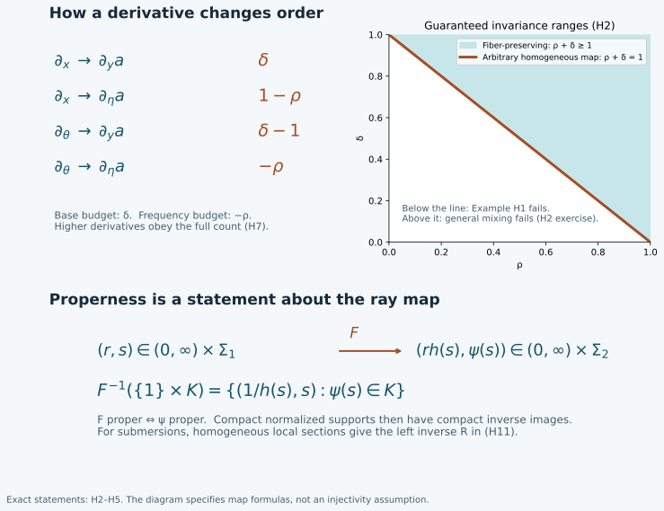

# Homogeneous maps, symbol estimates and completeness

Changing conic coordinates can mix a base variable with a frequency direction.
The derivative count must survive that mixing before a symbol definition can
be called intrinsic. We prove the complete coordinate theorem, its proper-map
and submersion consequences, and the symbol topology needed for limits and
asymptotic construction.

Original programme exposition, complete proofs, examples and figure: GPT-6 Astra (OpenAI), Ultra, 4 October 2026; dedicated under CC0. Exact earlier components retain their stated terms.

## H0. Classes, conventions and exact inputs

Let \(\Gamma\subset X\times(\mathbb R^N\setminus0)\) be an open cone,
where \(X\) is open in Euclidean space. Write \(r=|\theta|\) and
\(\Sigma=\Gamma\cap\{r=1\}\). Fix
\(0\leq\rho\leq1\), \(0\leq\delta\leq1\), and \(m\in\mathbb R\).
A smooth function belongs to \(S^m_{\rho,\delta}(\Gamma)\) when, for
every compact \(K\subset\Sigma\) and every pair of multiindices,
\[
 p^m_{K,\alpha,\beta}(a)=
 \sup_{(x,\omega)\in K,\ r\geq1}
 r^{-m+\rho|\alpha|-\delta|\beta|}
 |\partial_\theta^\alpha\partial_x^\beta a(x,r\omega)|<\infty.
 \tag{H1}
\]
Also retain the usual smooth seminorms on compact subsets of \(\Gamma\).
They impose no uniform condition as \(r\downarrow0\). Using compact
sets of nonunit radii and their outward dilations gives the same space:
on each such compact set the starting radii have positive lower and finite
upper bounds, and the remaining finite radial interval is compact. On the
full vector bundle including zero, impose smoothness there and replace
\(r\) by \(\langle\theta\rangle\); the proofs below then include the
bounded-frequency region directly. Set
\[
 S^{-\infty}=\bigcap_{q\in\mathbb R}S^q_{\rho,\delta},
 \qquad S^m_\rho=S^m_{\rho,1-\rho}.
 \tag{H2}
\]
The intersection is independent of the two parameters: for any fixed
derivative its finite weight shift can be absorbed by choosing a more
negative order. All assertions apply component by component to finite matrices.

The exact earlier programme inputs are the U001 proofs of the chain and
product rules, the smooth inverse theorem, finite-dimensional compactness,
smooth cutoffs, the fundamental theorem of calculus and completeness of real
numbers. They are bound by their individual identifiers in the proof map.
[PS5](../20261004-free-intrinsic-graph/prerequisites/global-principal-symbol.md)
supplies the proved locally finite partition construction when a manifold is
used. No completeness, interpolation or symbol summation theorem is imported
without proof. The specific ordinary phase lift in
[PH F4](../20261004-free-intrinsic-graph/prerequisites/prescribed-phase-representation.md)
is an earlier application; the theorem here permits arbitrary homogeneous maps.

The upper panel gives the exact order costs in H2. The lower panel displays
the exact radial form in H5; arrows represent a general map, not a claim that
every map is injective or a submersion.

## H1. A complete locally convex symbol space

Choose compact sets \(K_j\) exhausting \(\Sigma\), each inside the
interior of the next, and compact sets \(L_j\) similarly exhausting
\(\Gamma\). Such exhaustions are obtained from finitely many closed
rational boxes in successively larger coordinate regions; shrink boxes
inside the open domain and enlarge at each step. Use the maximum of (H1)
for \(K_j\), \(|\alpha|+|\beta|\leq j\), and the smooth seminorms
on \(L_j\) of order at most \(j\), denoting the result by \(p_j\).
Enlarge to increasing seminorms if necessary. These seminorms separate
functions, and their balls are convex by the triangle inequality. The metric
\[
 d(a,b)=\sum_{j\geq1}2^{-j}\min\{1,p_j(a-b)\}
 \tag{H3}
\]
has the same topology. Indeed, finitely many small seminorms bound the finite
initial sum and the geometric tail; conversely a small metric bounds each
fixed summand. The inequality
\(\min(1,s+t)\leq\min(1,s)+\min(1,t)\) proves the triangle inequality.

If \(a_\nu\) is Cauchy, every derivative is uniformly Cauchy on each
compact coordinate box and hence has a continuous limit there: real and
imaginary parts converge pointwise by completeness of the reals, and the
uniform Cauchy estimate passes to the limit. These limits are the derivatives
of the limiting function. To prove this, apply the fundamental theorem on a
coordinate segment to \(a_\nu\), pass to the uniform limits inside its
integral, and divide by the segment length. Continuity of the candidate
derivative gives the derivative after the length tends to zero. Repeat for
each derivative order. Overlaps agree by uniqueness of pointwise limits.
For a fixed weighted seminorm the Cauchy bound also passes to the pointwise
limit throughout its unbounded set. It follows that the limit satisfies
(H1) and that \(p_j(a_\nu-a)\to0\) for every \(j\). Thus the metric
is complete. This proves the Fréchet assertion, including its completeness.

Differentiation and multiplication are continuous with the exact orders
\[
 \partial_\theta^\alpha\partial_x^\beta:
 S^m_{\rho,\delta}\to S^{m-\rho|\alpha|+\delta|\beta|}_{\rho,\delta},
 \qquad S^m_{\rho,\delta}S^{m'}_{\rho,\delta}
 \subset S^{m+m'}_{\rho,\delta}.
 \tag{H4}
\]
For differentiation these are identical seminorms. For a product, the
iterated product rule is a finite sum of products of derivatives, obtained
inductively by differentiating each factor. The exponents add to the stated
weight. The same estimate gives bilinear continuity and shows that only
derivatives up to the tested order are needed.

## H2. The full homogeneous pullback theorem

Let \(F:\Gamma_1\to\Gamma_2\) be smooth and commute with positive
fiber dilation. In coordinates write
\[
 F(x,\theta)=(y(x,\theta),\eta(x,\theta)),\qquad
 y(x,t\theta)=y(x,\theta),\quad
 \eta(x,t\theta)=t\eta(x,\theta),\quad\eta\ne0.
 \tag{H5}
\]
Pullback is continuous \(S^m_{\rho,\delta}(\Gamma_2)\to
S^m_{\rho,\delta}(\Gamma_1)\) in each of these cases:

1. \(\rho+\delta=1\), with no further restriction on \(F\).
2. \(\rho+\delta\geq1\) and \(y\) depends only on \(x\).
3. \(y=y(x)\), \(\eta=\eta(\theta)\), with any allowed \(\rho,\delta\).
4. \(\rho+\delta\leq1\) and \(\eta\) is independent of \(x\).

Properness is not required for this local estimate. On a compact normalized
source set, positivity and continuity of \(|\eta(x,\omega)|\) give
\[
 0<c r\leq|\eta(x,r\omega)|\leq C r.
 \tag{H6}
\]
The normalized image is compact. Homogeneity, differentiated by the chain
rule, gives bounds of degree \(-|\alpha|\) for derivatives
\(\partial_\theta^\alpha\partial_x^\beta y\), and of degree
\(1-|\alpha|\) for the corresponding derivatives of \(\eta\).
The bounds hold for every derivative, since its restriction to the compact
normalized set is bounded. The target region where \(|\eta|<1\) has a
bounded source radius by (H6) and is handled by smooth compact seminorms.

Here is the full higher derivative count. Repeated differentiation of
\(a\circ F\) produces finite terms consisting of a target derivative
with \(k_0\) base differentiations and \(k_1\) frequency differentiations,
times \(k_0\) derivatives of components of \(y\) and \(k_1\)
derivatives of components of \(\eta\). Each such factor has positive
total derivative order; their multiindices add to \((\alpha,\beta)\).
This description follows by induction: a new derivative either increases
the target derivative and adds a differentiated component of \(F\), or
differentiates a component already present. Its resulting exponent is
\[
 m+\delta k_0+(1-\rho)k_1-|\alpha|,
 \qquad k_0+k_1\leq|\alpha|+|\beta|.
 \tag{H7}
\]
In case 1, replace both coefficients of \(k_0,k_1\) by \(\delta\)
to obtain \(m-\rho|\alpha|+\delta|\beta|\).
In case 2, \(k_0\leq|\beta|\); hence (H7) is at most
\(m-\rho|\alpha|+(1-\rho)|\beta|+
(\rho+\delta-1)k_0\), which gives the same bound.
In case 3 also \(k_1\leq|\alpha|\); (H7) is bounded by the desired
exponent directly. In case 4, \(k_1\leq|\alpha|\); writing the
nonconstant part as
\(\delta(k_0+k_1)+(1-\rho-\delta)k_1-|\alpha|\)
proves the claim. Nonnegativity of the coefficients used in each case is
exactly the displayed hypothesis.

Every source seminorm is bounded by finitely many target seminorms up to
the same derivative order, times constants depending on \(F\) and the
compact set. This proves continuity, not just membership. Pullback respects
composition because evaluation does. It preserves smoothing symbols and
every fixed-order remainder by applying the same proof at that order.

## H3. Conic manifolds and equivariant vector bundles

A conic manifold here has smooth homogeneous coordinate charts and a
positive homogeneous radius \(r\); equivalently its dilation identifies
it with \((0,\infty)\times\Sigma\), with \(\Sigma\) a second-countable
smooth manifold. For a cone bundle, charts are fiber preserving over its
base. A positive radius can be made from local radii by a locally finite
partition on the ray manifold: extend each partition function constantly
along rays and sum its product with the local radius. The sum is positive,
smooth, homogeneous, and locally finite. PS5 proves the required partition.
The maps \(v\mapsto(r(v),v/r(v))\) and dilation give the asserted
smooth product identification.

Case 1 of H2 and its application to the inverse chart show that
\(S^m_\rho\) and its topology are independent of all homogeneous
coordinates. Case 2 similarly proves the intrinsic cone-bundle definition
of \(S^m_{\rho,\delta}\) when \(\rho+\delta\geq1\).
Each compact set meets finitely many members of a locally finite chart
refinement; taking their finitely many seminorm bounds proves topology
independence. The compatible closed subspace of the product of the chart
Fréchet spaces is complete: a Cauchy sequence converges in each chart by H1,
and compatibility passes to the pointwise limit. There is a countable
refinement, so the resulting seminorm family is countable.

Let \(E\) be a finite-rank smooth vector bundle on the conic manifold,
with a smooth linear dilation action covering the action on its base.
Choose a frame on a small part of \(r=1\) and carry it along the rays
by that action. The resulting frame is equivariant. Two such frames have
transition matrices homogeneous of degree zero. Their derivatives have
bounds \(O(r^{-|\alpha|})\), hence satisfy order-zero
\((\rho,\delta)\) estimates for our parameter range. H4 and the inverse
transition matrix prove that the section class and its topology are
independent of the frame. H2 therefore applies to pulled-back sections as
well as scalar functions. A homogeneous bundle morphism of degree \(w\)
in these frames has coefficient derivatives of order \(w-|\alpha|\),
so its action sends \(S^m\) continuously into \(S^{m+w}\).
This states the weight shift explicitly; a half-density normalization
must use its actual degree rather than treating every frame as degree zero.

## H4. Submersions, reflection and a continuous left inverse

Suppose \(F:V_1\to V_2\) is a surjective homogeneous submersion.
For the intrinsic classes \(S^m_\rho\), pullback reflects membership:
\[
 b\in C^\infty(V_2),\quad F^*b\in S^m_\rho(V_1)
 \quad\Longleftrightarrow\quad b\in S^m_\rho(V_2).
 \tag{H8}
\]
We prove a continuous linear operator \(R\), simultaneously on all
orders, satisfying \(R F^*=1\). Write the map in radial coordinates as
\[
 F(r,s)=(r h(s),\psi(s)),\qquad h(s)>0.
 \tag{H9}
\]
Its radial derivative is nonzero; eliminating this derivative from the
other columns shows that \(F\) is a submersion exactly when \(\psi\)
is. A local section of \(\psi\) through any prescribed source point
can be constructed without a fibration theorem: select an invertible minor
of its derivative, append the unused source coordinates to \(\psi\),
and apply the proved smooth inverse theorem. Fix the appended coordinates
at their value at that point. If \(\sigma_i:U_i\to\Sigma_1\)
is this section, then
\[
 S_i(t,z)=\bigl(t/h(\sigma_i(z)),\sigma_i(z)\bigr)
 \quad\hbox{satisfies}\quad F S_i(t,z)=(t,z).
 \tag{H10}
\]
Take a locally finite smooth partition \(\chi_i\) on \(\Sigma_2\),
with supports inside the section neighborhoods, and extend it by degree zero.
Define
\[
 Ra=\sum_i\chi_i S_i^*a.
 \tag{H11}
\]
Each term extends smoothly by zero outside its neighborhood because its
partition support lies inside that neighborhood. The sum is locally finite.
H2 and the product estimate (H4) give a finite-seminorm bound on every
compact normalized target set. Thus (H11) is continuous on every
\(S^m_\rho\), and \(RF^*b=(\sum_i\chi_i)b=b\). This proves (H8).
For an equivariant target bundle use sections of \(F^*E\) in (H11):
their values at \(S_i(q)\) lie in the same fiber \(E_q\), so addition
is defined independently of a frame. The preceding estimates still apply.
Properness is not needed for this local construction.

Define essential support as the complement of the largest open conic set
on which the symbol is in \(S^{-\infty}\). For any homogeneous map in
H2, smoothing pullback gives an inclusion. For a submersion it is equality:
\[
 \operatorname{ess\,supp}(F^*b)
       =F^{-1}(\operatorname{ess\,supp}b).
 \tag{H12}
\]
To prove the reverse inclusion at a point \(p\), choose the section in
(H10) through \(p\). If \(F^*b\) is smoothing on a conic neighborhood
of \(p\), shrink the section so its image is inside that neighborhood.
Its pullback is \(b\), smoothing near \(F(p)\), by H2 at every negative
order. This also explains why a critical map need not give equality.

## H5. What properness supplies

In (H9), \(F\) is proper if and only if \(\psi\) is proper, where
proper means that inverse images of compact sets are compact. For the forward
direction take compact \(K\subset\Sigma_2\). The map
\[
 s\longmapsto(1/h(s),s)
 \tag{H13}
\]
identifies \(\psi^{-1}(K)\) with \(F^{-1}(\{1\}\times K)\);
its inverse is projection onto the source ray. If \(F\) is proper,
this inverse image is compact, so \(\psi^{-1}(K)\) is compact.
Conversely, a compact target set is contained in
\([a,b]\times K\), where \(0<a\leq b<\infty\) and \(K\)
is compact. If \(\psi\) is proper, \(h\) has positive lower and
finite upper bounds \(c,C\) on \(\psi^{-1}(K)\). The inverse image
lies in the compact product \([a/C,b/c]\times\psi^{-1}(K)\),
and is closed there by continuity and closedness of the target compact set.
It is therefore compact. These uses of compactness are the earlier
finite-cover and continuous-image proofs, not an assertion about unbounded
radial intervals.

Consequently, when \(F\) is proper and the normalized essential support
of \(b\) is compact, the normalized essential support of \(F^*b\)
is compact as well: it is closed and contained in the compact inverse image
under \(\psi\), by H2. If \(F\) is also a submersion, (H12) identifies
it exactly. The same inclusion holds for ordinary support. Conversely, the
estimate in H2 is local and remains valid for nonproper maps; Exercise H3
shows why that does not control normalized compact supports.

For a surjective submersion, the left inverse (H11) satisfies
\(\operatorname{supp}(Ra)\subset F(\operatorname{supp}a)\) if
\(F\) is proper. Indeed, outside that image all section evaluations
vanish; the image is closed. Here is the needed closed-image proof. If
\(q_j\to q\) in the image of a closed set, choose preimages \(p_j\)
in that set. The convergent sequence together with its limit is compact.
Properness places the \(p_j\) in a compact inverse image; a convergent
subsequence has limit in the closed set and maps to \(q\). In coordinate
spaces sequential closedness is closedness, as follows by choosing points
in balls of radii \(1/j\). The same proof in normalized coordinates
gives the corresponding essential-support inclusion for (H11). It uses
local finite sums and the smoothing property on the complement of the
closed image. In particular a compact normalized source support gives a
compact normalized support of \(Ra\).

## H6. Asymptotic summation with every derivative controlled

Let \(a_j\in S^{m_j}_{\rho,\delta}\), \(j\geq0\), and assume
\(m_j\to-\infty\). Put \(M_k=\sup_{j\geq k}m_j\). We construct
\(a\in S^{M_0}_{\rho,\delta}\) with
\[
 a-\sum_{j<k}a_j\in S^{M_k}_{\rho,\delta}\quad(k\geq0).
 \tag{H14}
\]
The construction works on cone bundles in the intrinsic parameter ranges
of H3, including equivariant vector bundles, and on every single coordinate
cone for all parameters in H0.

Choose a smooth scalar \(\zeta\) equal to zero on \([0,1]\) and one
on \([2,\infty)\). Use \(\zeta(r/R)\) to remove low radii.
On its derivative support, \(r\) is comparable to \(R\).
Its \(\alpha\) frequency derivatives are bounded by \(C_\alpha
r^{-|\alpha|}\); with a general smooth homogeneous radius, mixed base
derivatives obey the same degree bound on compact normalized sets.
The product rule therefore proves, for \(q>m_j\),
\[
 p^q_{K,\alpha,\beta}\bigl(\zeta(r/R)a_j\bigr)
 \leq C_{j,K,\alpha,\beta}\,R^{m_j-q},\qquad R\geq1.
 \tag{H15}
\]
Indeed, each frequency derivative placed on the cutoff gives an additional
gain \(1-\rho\geq0\), and each base derivative placed there removes
a potential loss \(\delta\geq0\). Smooth compact seminorms are zero
once the cutoff radius is beyond that compact set. Thus (H15) also holds
in the form of decay to zero for each of the countably many full seminorms.

Choose \(q_j>m_j\) tending to minus infinity; for example take
\(q_j=m_j/2\) once \(m_j<0\), treating the finitely many earlier
indices separately. Enumerate the compact sets, derivatives and frames
as in H1 and H3. Select increasing \(R_j\geq j+1\) so that the first
\(j\) order-\(q_j\) seminorms of \(\zeta(r/R_j)a_j\) are at most
\(2^{-j}\). This is possible by (H15) and requires only finitely many
conditions at stage \(j\). Define
\[
 a=\sum_{j\geq0}\zeta(r/R_j)a_j.
 \tag{H16}
\]
The sum is locally finite at bounded radius, so it is smooth. Fix a
seminorm and \(k\). For sufficiently large \(j\), that seminorm is
among the first \(j\) and \(q_j\leq M_k\); since \(r\geq1\),
its order-\(M_k\) value is at most \(2^{-j}\). The finite intervening
terms with \(j\geq k\) have order at most \(M_k\). Finally
\(\sum_{j<k}(\zeta(r/R_j)-1)a_j\) has bounded radial support and
is smoothing on each compact normalized region. This proves (H14) in
every seminorm. If two choices satisfy (H14), their difference belongs to
every order since \(M_k\to-\infty\); this is exactly uniqueness
modulo \(S^{-\infty}\).

The same asymptotic symbol works after any rearrangement of the sequence.
Fix a rearranged initial segment and let \(M'\) be the supremum of the
orders of its remaining terms. Choose an original initial segment containing
all terms of the chosen rearranged segment and so long that its tail has
order at most \(M'\). This is possible because \(m_j\to-\infty\).
Subtracting the chosen rearranged segment from \(a\) gives that original
tail plus finitely many terms from the rearranged remainder. Every such term
has order at most \(M'\), so (H14) proves the required remainder estimate.
This works for every rearranged initial segment. If all \(a_j\) are
supported in one fixed closed normalized set, (H16) has that same support
constraint. No convergence of the uncut formal series is assumed.

## H7. Recovering differentiated asymptotics from value estimates

Suppose \(a\) is smooth and each of its derivatives has some polynomial
bound on every compact normalized set, with the exponent allowed to depend
on the derivative and the set. Suppose \(a_j\) and \(m_j\) are as in
H6, and there are \(\mu_k\to-\infty\) for which
\[
 \left|a-\sum_{j<k}a_j\right|\leq C_{K,k}r^{\mu_k}
 \quad\hbox{on }K,\ r\geq1.
 \tag{H17}
\]
Then (H14) holds with all derivatives for this same \(a\).

We give the interpolation argument. Fix a derivative \(D^\gamma\)
of total order \(d\), a compact normalized set, and a slightly larger
compact coordinate neighborhood. For
\(f_N=a-\sum_{j<N}a_j\), all derivatives of order at most \(d+1\)
are bounded by \(C_N r^H\), where the exponent \(H\) is independent
of \(N\). To see this, use the finitely many polynomial exponents for
\(a\) and the common upper order \(M_0\) for all \(a_j\);
constants of the finite sums may depend on \(N\), but their exponents
are bounded by \(M_0+\delta(d+1)\).

Let \(\Delta_h^\gamma\) be the iterated forward coordinate difference
with step \(h\). Repeated application of the fundamental theorem gives
\(h^{-d}\Delta_h^\gamma f\) as the average of \(D^\gamma f\)
over the corresponding \(d\) step parameters. One further application
of that theorem to \(D^\gamma f\) gives
\[
 |D^\gamma f_N|
 \leq C_d h^{-d}\sup|f_N|
       +C'_d h\sup_{|\nu|=d+1}|D^\nu f_N|.
 \tag{H18}
\]
All suprema are in a box of side at most \(d h\) about the point.
For \(h=c r^{-B}\), with \(B\geq0\) and a sufficiently small fixed
\(c>0\), these boxes stay in the enlarged conic region and have comparable
radius, for all sufficiently large \(r\). Thus (H17) and (H18) bound
the two terms by constants times \(r^{\mu_N+Bd}\) and \(r^{H-B}\).
Given any desired exponent \(Q\), first choose \(B\) with
\(H-B\leq Q\), then choose \(N\) large enough that
\(\mu_N+Bd\leq Q\). This order of choices is legitimate because
\(H\) did not depend on \(N\).

For fixed \(k,\alpha,\beta\), choose
\(Q=M_k-\rho|\alpha|+\delta|\beta|\) and \(N\geq k\) in that
argument. It bounds the derivative of \(f_N\) with precisely the needed
weight. The finite sum \(\sum_{k\leq j<N}a_j\) has order \(M_k\),
so adding it proves the same bound for
\(a-\sum_{j<k}a_j\). Each derivative may use a different \(N\);
the assertion being proved is a separate finite bound for each derivative.
Bounded radii follow from smoothness. This proves the entire assertion.

## H8. Bounded-set convergence and frequency cutoffs

On a bounded subset of \(S^m_{\rho,\delta}\), the topologies of
pointwise convergence, local smooth convergence and convergence in
\(S^{m+\varepsilon}_{\rho,\delta}\), for any \(\varepsilon>0\),
coincide. Bounded means bounded in every defining seminorm. We prove this
as a statement about topologies, not just particular sequences.

On a compact coordinate box, bounded first derivatives give a common
Lipschitz estimate by the fundamental theorem along segments. A finite grid
therefore reduces uniform smallness of function differences to smallness
at finitely many points. Such grids exist by dividing the box into finitely
many smaller boxes. For derivative order \(d\), the forward-difference
argument in (H18), now with bounded derivatives of order \(d+1\) on a
slightly larger box, shows that a sufficiently small fixed step makes the
error small uniformly over the bounded family. Finitely many function values
on a sufficiently fine grid then make the difference quotients small.
This proves that finitely many pointwise conditions control every fixed
smooth seminorm. It applies to differences of members of the bounded set.

For a weighted seminorm of order \(m+\varepsilon\), the part \(r\geq R\)
is bounded by \(R^{-\varepsilon}\) times the bounded order-\(m\)
seminorm. The part \(1\leq r\leq R\) is compact and is controlled by
the just proved smooth convergence. The near-zero compact seminorms are
already smooth ones. This proves the desired finite-neighborhood implication.
Conversely, a weighted seminorm bounds smooth derivatives on a fixed compact
region, and smooth convergence implies pointwise convergence. All three
topologies therefore agree on the bounded set.

Take a smooth \(\chi\) equal to one for \(r\leq1\) and zero for
\(r\geq2\), and put \(a_R=\chi(r/R)a\), \(R\geq1\). Product
differentiation as in H6 shows that \(\{a_R\}\) is bounded in
\(S^m_{\rho,\delta}\), while on every compact subset \(a_R=a\)
for sufficiently large \(R\). Consequently
\[
 a_R\longrightarrow a\quad\hbox{in }S^{m+\varepsilon}_{\rho,\delta}
 \quad(\varepsilon>0).
 \tag{H19}
\]
For each fixed high-frequency seminorm the error is in fact bounded by
\(C R^{-\varepsilon}\) times finitely many order-\(m\) seminorms
of \(a\), since it vanishes for \(r\leq R\) and the differentiated
cutoff terms have the same gain. The compact seminorm errors eventually
vanish. Same-order convergence is false in general, as Exercise H4 shows.

There is also a useful extension principle. Let \(L\) be a linear map
from smooth symbols of bounded radial support to a complete metrizable
locally convex space \(E\). Suppose its restriction is continuous for
the induced \(S^q_{\rho,\delta}\) topology for every real \(q\).
Then there is a unique extension to the union of all symbol orders,
continuous on each order. Indeed, for \(a\in S^m\), (H19) makes
\(L a_R\) Cauchy by continuity at any fixed order \(q>m\); completeness
gives a limit. Differences of cutoffs converge to zero at that same order,
so the limit is independent of the cutoff. It is linear by using one cutoff
for any finite linear combination. For each target seminorm, continuity
of the original linear map at order \(m\) gives a bound by a finite sum
of order-\(m\) source seminorms: this follows by scaling a neighborhood
bound at zero, including the zero-seminorm case by arbitrary scaling.
The uniform product bounds for \(a_R\) let this estimate pass to the
limit, proving continuity at order \(m\). Any other extension continuous
on every order must agree by applying continuity at \(q>m\) to (H19).
This argument does not claim that bounded-frequency symbols are dense in
the original order topology.

## H9. Transport of expansions and the exact scope now proved

Let \(F\) satisfy any case in H2. If \(a\sim\sum_j a_j\) with
orders tending to minus infinity as in H6, then
\[
 F^*a\sim\sum_j F^*a_j.
 \tag{H20}
\]
For each finite partial sum the difference is the pullback of the remainder;
H2 bounds it at its unchanged remainder order. This also proves that the
action on \(S^m/S^{m-\epsilon}\), for every \(\epsilon>0\), is
well defined. On equivariant bundles use H3, adding the stated degree shift
if a nonzero-degree bundle morphism is applied. The support properties in
H4–H5 apply to the resulting symbols, including their smoothing ambiguity.

The general homogeneous-map prerequisite is now supplied, with properness
controlling normalized compact supports, submersions reflecting symbol
regularity, and explicit finite-seminorm continuity. The symbol spaces have
proved completeness, asymptotic summation, differentiated-asymptotic recovery,
and the exact weaker-order cutoff topology. These results include the
derivative-loss classes, but they do not by themselves extend the earlier
ordinary-symbol stationary-phase, composition or Sobolev theorems to those
classes. Those analytic estimates, involutivity, propagation and the remaining
full AN-04 scope are still open obligations.

## Four exercises with complete solutions

**Exercise H1 — Why a fiber-preserving map needs the lower parameter bound.**
Assume \(\rho+\delta<1\), and on positive frequency let
\(F(x,\theta)=(x,e^x\theta)\). Show that pullback need not preserve
\(S^0_{\rho,\delta}\).

**Solution.** Here \(\rho<1\). Let
\(a(y,\eta)=\exp(i\eta^{1-\rho})\). Repeated frequency differentiation
is a finite sum of products of derivatives of \(\eta^{1-\rho}\)
times this exponential. A term with \(k\leq l\) phase derivatives
and total derivative order \(l\) has size
\(C\eta^{k(1-\rho)-l}\leq C\eta^{-\rho l}\) for \(\eta\geq1\).
There are no base derivatives. Thus \(a\in S^0_{\rho,\delta}\).
But at \(x=0\), the absolute value of \(\partial_x(F^*a)\) is
\((1-\rho)\theta^{1-\rho}\), which exceeds every constant multiple
of \(\theta^\delta\) because \(1-\rho>\delta\). This proves failure.

**Exercise H2 — Why general mixing needs the upper parameter bound.**
Assume \(\rho+\delta>1\). On the cone \(\theta_2>0\), use
\(F(x,\theta_1,\theta_2)=(x+\theta_1/\theta_2,\theta_2)\).
Construct an order-zero symbol whose pullback fails the claimed order.

**Solution.** Choose \(g\in C_c^\infty(\mathbb R)\) with \(g'(0)\ne0\),
and set \(a(y,\eta)=g(y\eta^\delta)\). After \(\beta\) base
derivatives, every additional frequency derivative gives a factor
\(\eta^{-1}\) times a polynomial in \(y\eta^\delta\) multiplying
a derivative of \(g\), in addition to the prefactor \(\eta^{\delta\beta}\).
That polynomial is bounded on the support of the derivative of \(g\).
Induction proves the estimates
\(C_{l,\beta}\eta^{\delta\beta-l}\), hence membership in
\(S^0_{\rho,\delta}\). At \(x=0,\theta_1=0,\theta_2=r\),
\[
 \partial_{\theta_1}(F^*a)=r^{\delta-1}g'(0).
 \tag{H21}
\]
The required bound would be \(C r^{-\rho}\), which fails when
\(\rho+\delta>1\). Together with H1 this proves the sharpness of
the equality line for unrestricted homogeneous maps.

**Exercise H3 — Local estimates do not give proper support.**
Let \(F(r,s)=r\) from \((0,\infty)\times\mathbb R\) onto the
positive ray, with dilation in \(r\). Explain the support failure and
give a left inverse to pullback.

**Solution.** The normalized source is \(\mathbb R\) and the normalized
target is a point. Their map is not proper; explicitly \(F^{-1}(\{1\})
=\{1\}\times\mathbb R\) is not compact. The symbol \(b(r)=1\)
has compact normalized support, while \(F^*b=1\) has the entire
noncompact normalized source as support and essential support. H2 still
applies. Evaluation \(Ra(r)=a(r,0)\) is continuous on each intrinsic
symbol class by its seminorm definition and satisfies \(RF^*=1\).
Thus the support conclusion and the local symbol theorem are distinct.

**Exercise H4 — Which topology permits removing the cutoff?**
On the positive ray let \(a=1\) and \(a_R=\chi(r/R)\), with \(\chi\)
as in H8. Determine convergence in orders zero and \(\varepsilon>0\).

**Solution.** For \(r\geq2R\), \(|a_R-a|=1\), so its zeroth
order-zero seminorm is at least one and convergence in order zero is
impossible. At positive order the undifferentiated weighted error is at most
\(R^{-\varepsilon}\). A derivative of order \(l\geq1\) is supported
where \(R\leq r\leq2R\), is bounded by \(C_l R^{-l}\), and its
order-\(\varepsilon\) weight gives at most
\(C'_l R^{-\varepsilon-(1-\rho)l}\leq C'_l R^{-\varepsilon}\).
Compact seminorms vanish eventually. This proves (H19) in this example
and shows why continuity at all orders appears in the extension principle.

## Free source and programme continuation

The human source is Lars Hörmander's freely readable
[*Fourier integral operators. I*](https://projecteuclid.org/journals/acta-mathematica/volume-127/issue-none/Fourier-integral-operators-I/10.1007/BF02392052.pdf),
Section 1.1. It supplies the symbol-class framework
and homogeneous-map parameter ranges. H1–H9 give the proofs in the programme,
including the completeness and asymptotic arguments whose proofs that paper
refers elsewhere. No work appearing only in its bibliography is adopted.
The properness argument, explicit local-section left inverse and the full
finite-difference estimates are supplied here. Source citations replace none
of the exact proof dependencies. All earlier component notices remain intact.
