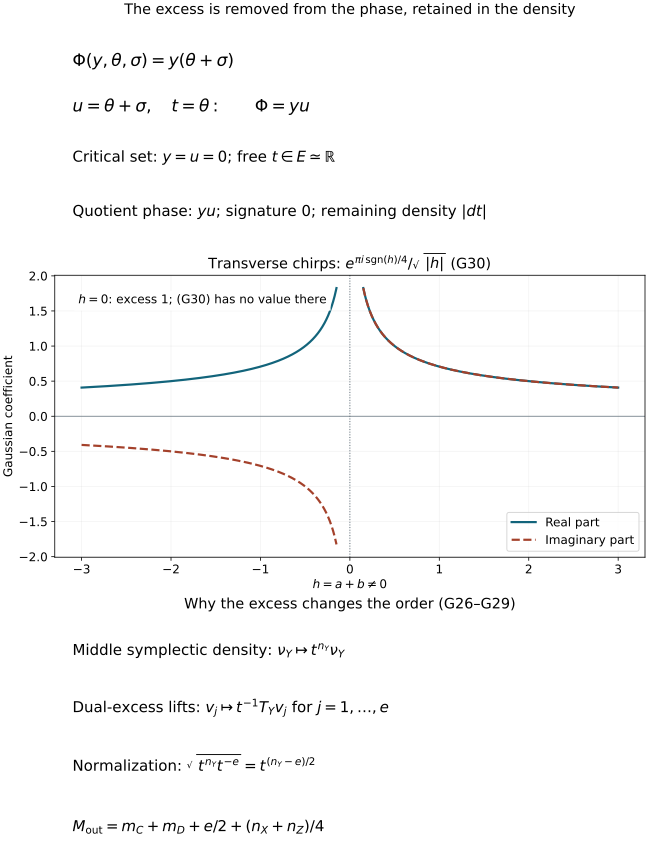

# Maslov composition, Gaussian factors and clean excess

Composing canonical relations also composes their Maslov lines. The signs
are determined by quadratic phases, including phases with redundant
variables. We construct that map directly, prove independence of every
quadratic presentation, and combine it with the excess density. This
explains the half-order gained for each clean excess dimension.

Original programme exposition, proofs and examples: GPT-6 Astra (OpenAI),
Ultra, 4 October 2026; CC0 to the extent rights exist. Earlier components
retain their separate terms. This is a private working component.

## G0. Exact inputs and conventions

Use the full proofs in [C0–C5](clean-canonical-composition.md): symplectic
orthogonals, clean tangent composition, excess, the two exact sequences,
the normalized density map and proper-support fibre integration. Write
\(\mathcal D(V)=\mathcal D^1(V)\).

The earlier [Maslov component](../20261004-free-intrinsic-graph/prerequisites/relative-maslov-line.md)
supplies M0a's inertia and signature proof, M1–M2's description of a
Lagrangian relative to a vertical plane, M3's full Hessian comparison,
and M4–M6's relative Maslov line and phase frames. The earlier
quadratic stationary component
supplies Q4–Q6, including distributional Fourier inversion and the
regularized Gaussian integral. Inverse matrices and compact parameter
integration use the exact earlier proofs identified there.

Use \(\omega=dp\wedge dq\). For vector spaces \(X,Y,Z\) of dimensions
\(n_X,n_Y,n_Z\), a relation \(C\subset T^*X\oplus\overline{T^*Y}\)
is identified symplectically with the Lagrangian
\[
 C'=\{(x,y;\xi,-\eta):(x,\xi;y,\eta)\in C\}
                      \subset T^*(X\oplus Y).
 \tag{G1}
\]
Its Maslov line is the relative line \(\mathscr L(V_{X\oplus Y},C')\),
where \(V_Q=\{0\}\oplus Q^*\). Write this line as \(\mathscr L_C\).
We use output-first composition, so \(C\circ D\) applies \(D\) first.
All statements allow zero-dimensional vector spaces.

## G1. Quadratic presentations and their complete equivalence proof

Let \(Q\) be a vector space of dimension \(n\). In chosen linear
coordinates a quadratic phase is
\[
 \phi(q,\theta)=\tfrac12q^TPq+q^TB\theta+\tfrac12\theta^TH\theta,
 \qquad P=P^T,\quad H=H^T,\quad\theta\in\mathbb R^N.
 \tag{G2}
\]
It is nondegenerate as a phase when
\(\operatorname{rank}(B^T\ H)=N\). Its critical set and Lagrangian are
\[
 K_\phi=\{B^Tq+H\theta=0\},\qquad
 L_\phi=\{(q,Pq+B\theta):(q,\theta)\in K_\phi\}.
 \tag{G3}
\]
M3 proves that the displayed critical map is an isomorphism onto a
Lagrangian. Here and below “isomorphism” for these spaces means linear
isomorphism, not merely a bijection of their dimensions.

Every Lagrangian \(L\subset T^*Q\) has such a presentation.
To see this explicitly, let \(W\) be its projection to \(Q\).
The covectors in \(L\) above \(q=0\) are exactly \(W^\circ\): inclusion
follows by isotropy, and equality follows by rank-nullity, since their
dimension is \(n-\dim W\). Thus for \((q,p)\in L\), the restriction
\(p|_W\) is determined by \(q\in W\). Isotropy makes the resulting
bilinear form on \(W\) symmetric. Denote it by \(A\).
Choose a complement \(Z\) of \(W\), write \(q=(w,z)\), and use
\[
                    \phi_0(w,z,\vartheta)
                       =\tfrac12 A(w,w)+z\cdot\vartheta.
 \tag{G4}
\]
Its critical equation is \(z=0\), and its covectors are exactly those
in \(L\). Its critical derivative has full row rank.

**Quadratic equivalence theorem.** Two nondegenerate quadratic phases
presenting the same \(L\) are related by a finite sequence of the following
operations: invertible linear changes of auxiliary variables with a
linear base-dependent shift, and addition or deletion of a nondegenerate
quadratic form in independent auxiliary variables.

**Proof.** Split the auxiliary space as \(\ker H\oplus U\), with
\(H_U\) invertible. Such a splitting follows from M0a; symmetry makes
the mixed blocks vanish. Completing the square by
\(\theta_U'=\theta_U+H_U^{-1}B_U^Tq\) gives
\[
 \phi=\tfrac12(\theta_U')^TH_U\theta_U'
       +\tfrac12q^T\widetilde Pq+q^TB_0\theta_0,\qquad
 \widetilde P=P-B_UH_U^{-1}B_U^T .
 \tag{G5}
\]
The map \(B_0:\ker H\to Q^*\) is injective: a vector in both
\(\ker H\) and \(\ker B\) is in the kernel of the transpose of the
full-row-rank matrix in (G3), hence is zero.
Put \(k=\dim\ker H\). The remaining critical equation is
\(B_0^Tq=0\), so \(W=\ker B_0^T\), \(k=n-\dim W\), and
\(\widetilde P|_{W\times W}=A\).

Fix the decomposition and coordinates used in (G4). An invertible
change of \(\theta_0\) makes \(q^TB_0\theta_0=z\cdot\vartheta\).
The difference between \(\tfrac12q^T\widetilde Pq\) and
\(\tfrac12A(w,w)\) is
\[
                       w^TEz+\tfrac12z^TGz
 \tag{G6}
\]
for some matrices \(E\) and symmetric \(G\); there is no \(w,w\)
term because the restrictions to \(W\) agree. The shift
\(\vartheta'=\vartheta+E^Tw+Gz/2\) absorbs (G6).
Thus every phase reduces, using the stated operations, to the same
\(\phi_0\), together with the independent nondegenerate summand in
(G5). Reduce both phases in this way and reverse one finite sequence.
This proves the theorem, including \(k=0\), \(U=0\) and \(N=0\).
\(\square\)

This is a proof about quadratic forms. It assumes no general nonlinear
phase-equivalence theorem.

## G2. Gaussian phase frames in the relative Maslov line

For a common transversal \(\mu\) to \(V_Q,L_\phi\), write
\(\mu=\{(q,Jq)\}\), with \(J=J^T\). Define the full test Hessian
and the phase frame by
\[
 Q_{\phi,J}=
 \begin{pmatrix}P-J&B\\B^T&H\end{pmatrix},
 \qquad
 s_\phi(\mu)=\exp\!\left(\frac{\pi i}{4}
                              \operatorname{sgn}Q_{\phi,J}\right).
 \tag{G7}
\]
M3 proves that this Hessian is nonsingular and that
\[
 \operatorname{sgn}Q_{\phi,J}
              =\operatorname{sgn}H-\tau(V_Q,L_\phi;\mu).
 \tag{G8}
\]
Consequently the ratio of the two values in (G7) at
\(\mu_1,\mu_2\) is \(i^{\sigma(V_Q,L_\phi;\mu_1,\mu_2)}\).
This is precisely the defining relation M19. Hence \(s_\phi\) is a
nonzero element of the actual relative Maslov line.

An invertible fibre change with a base-dependent linear shift transforms
the full test Hessian by congruence. M0a proves that its signature is
unchanged. Adding an independent invertible quadratic matrix \(R\) gives
\[
                    s_{\phi+\frac12u^TRu}
                       =e^{\pi i\,\operatorname{sgn}R/4}s_\phi .
 \tag{G9}
\]
These are also the exact Gaussian phase factors. In the distributional
regularization established by Q4–Q6,
\[
 \int_{\mathbb R^r}^{\mathrm{osc}}e^{iu^TRu/2}\,du
       =(2\pi)^{r/2}|\det R|^{-1/2}
                        e^{\pi i\,\operatorname{sgn}R/4}.
 \tag{G10}
\]
Here \(R\) is invertible. No integral in a zero-eigenvalue direction is
assigned a finite value by (G10).

For clarity about conventions, M22 used the frame
\[
                         e_\phi=e^{-\pi iN/4}s_\phi .
 \tag{G11}
\]
Thus adding \(R\) of rank \(r\) changes that frame by
\(e^{\pi i(\operatorname{sgn}R-r)/4}=i^{-n_-(R)}\).
Both conventions describe the same line, but their numerical
composition factors differ. We retain (G11) when comparing them.

## G3. Compose quadratic phases and remove exactly the excess

Choose nondegenerate quadratic presentations
\(\phi(x,y,\theta)\) of \(C'\) and \(\psi(y,z,\sigma)\) of \(D'\).
Form
\[
 \Phi(x,z;y,\theta,\sigma)
       =\phi(x,y,\theta)+\psi(y,z,\sigma),\qquad
 w=(y,\theta,\sigma),\quad N_{\rm tot}=n_Y+N_\phi+N_\psi .
 \tag{G12}
\]
The fibre critical equations are
\[
                 \phi_\theta=0,\qquad\psi_\sigma=0,\qquad
                 \phi_y+\psi_y=0 .
 \tag{G13}
\]
Their solution space is isomorphic to the matching space \(F\) of C1:
send a solution to the matching covectors
\((x,\phi_x;y,-\phi_y)=(x,\phi_x;y,\psi_y)\) and
\((y,\psi_y;z,-\psi_z)\).
The nondegenerate critical maps of the two input phases give both
existence and uniqueness of the inverse. Under this identification,
the output critical map is exactly \(q:F\to C\circ D\).

Let \(e=\dim\ker q\). C1 proves \(\dim F=n_X+n_Z+e\).
Write the matrix of (G13), as a map in all variables, as
\((B^T\ H)\), using the notation (G2) for external variables \((x,z)\)
and internal variables \(w\). It follows that
\(\operatorname{rank}(B^T\ H)=N_{\rm tot}-e\). Its transpose has kernel
\[
                           K=\ker B\cap\ker H,\qquad\dim K=e .
 \tag{G14}
\]
For \(t\in K\), \(\Phi(x,z;w+t)=\Phi(x,z;w)\). Thus the phase descends
to \(w/K\). Choosing a complement of \(K\) gives a quadratic phase
\(\bar\Phi\) with
\[
                        N_{\bar\Phi}=N_\phi+N_\psi+n_Y-e .
 \tag{G15}
\]
The transpose of its critical derivative is injective: a vector in its
kernel would belong both to the chosen complement and to \(K\).
Therefore \(\bar\Phi\) is nondegenerate, and its critical map
parametrizes \(L=C\circ D\). Different complements give invertibly
equivalent fibre coordinates on the same quotient \(w/K\).

The excess identification is explicit. A vector \(t\in K\) has zero
external coordinates, satisfies (G13), and has zero output covectors
because \(Bt=0\). Its image in \(F\) therefore lies in \(\ker q\).
Conversely a vector in \(\ker q\) has exactly these properties.
This gives \(K\simeq\ker q\simeq E\), with the last map supplied by C1.
No excess direction has been removed from a density integral; only
the redundant quadratic phase variables have been quotiented.

## G4. The canonical Maslov composition map

Define
\[
 \mathfrak m_{C,D}:\mathscr L_C\otimes\mathscr L_D
                         \longrightarrow\mathscr L_{C\circ D},
 \qquad
                     s_\phi\otimes s_\psi\longmapsto s_{\bar\Phi}.
 \tag{G16}
\]
Since each displayed frame is nonzero, this defines a line isomorphism.
We now prove that it is intrinsic.

First change the quadratic presentation of \(C\). By G1 it suffices to
check the two stated operations. A fibre change
\(\theta'=A\theta+T(x,y)\) is an invertible fibre change of the total
variables \((y,\theta,\sigma)\), keeping \((x,z)\) fixed. It therefore
changes neither side of (G16), by G2. Adding an independent invertible
quadratic form \(R\) to \(\phi\) adds the same \(R\) to the total phase.
It adds no excess: its new critical equations have an invertible
derivative in the new variables. After quotienting \(K\), \(R\) remains
as an independent summand of \(\bar\Phi\). Both sides of (G16) therefore
acquire the same factor in (G9). Deleting that summand reverses the
argument. The proof for a change of \(\psi\) is identical.
G3 already proves independence of the excess complement.

We also verify the coordinate issue, including the shears that arise
from differentiating a nonlinear cotangent coordinate change at a
nonzero covector. Every linear symplectic map preserving the vertical
subspace has the form
\[
                q'=Aq,\qquad p'=A^{-T}(p+Bq),\qquad B=B^T .
 \tag{G17}
\]
Indeed preservation of the vertical space makes the upper-right block
zero. Invertibility gives invertible \(A\); the symplectic matrix
identity forces the lower-right block to be \(A^{-T}\) and \(A^T\)
times the lower-left block to be symmetric. This proves (G17).
A phase is transformed by substituting \(q=A^{-1}q'\) and adding
\(\tfrac12q^TBq\). Transform the test graph by the same rule.
The two added quadratic forms cancel in phase minus test, so its
full Hessian changes by congruence. Hence (G7) is transported exactly.

Apply (G17) separately on \(T^*X,T^*Y,T^*Z\). The added base forms
in the two relation phases have signs
\[
              b_X(x)-b_Y(y),\qquad b_Y(y)-b_Z(z).
 \tag{G18}
\]
Their middle terms cancel in (G12), leaving precisely the form for
the output relation. This proves naturality of (G16) and independence
of cotangent coordinates. The argument also applies to common
positive conformal symplectic scaling: multiplying the relevant
quadratic forms by a positive number preserves every signature.

For smooth clean relations, apply this construction to their tangent
relations at each \(f\in F\). The fibre critical maps above can be
chosen smoothly locally. One direct construction is M4's local
frequency-graph quadratic phase, after a fixed transverse shear;
its coefficients are smooth inverses of a fixed matrix minor.
The kernel in (G14) has constant dimension \(e\) on a clean component.
An invertible-minor construction gives a smooth frame for it and a
smooth complementary bundle. Thus \(\bar\Phi\) varies smoothly.
Full test Hessians in (G7) stay invertible after shrinking the neighborhood,
so M0a makes their signatures locally constant. The resulting maps
are smooth and agree on overlaps by the independence just proved.
For an embedded composed image \(L\) and submersion \(q:F\to L\), this gives
\[
      \operatorname{pr}_C^*\mathscr L_C\otimes
      \operatorname{pr}_D^*\mathscr L_D
                         \simeq q^*\mathscr L_L .
 \tag{G19}
\]
It is a map on \(F\); no separate choice of a trivialization along a
possibly non-simply-connected fibre is required.

In the phase convention M22, (G11) and (G15) give the useful check
\[
       \mathfrak m_{C,D}(e_\phi\otimes e_\psi)
                   =e^{\pi i(n_Y-e)/4}e_{\bar\Phi}.
 \tag{G20}
\]
In particular, silently multiplying those particular phase coordinates
without this factor would use a different normalization.

## G5. Identity, conjugation and associativity

For the identity relation on \(T^*X\), use
\(\iota(x,y,\theta)=(x-y)\cdot\theta\) and its frame \(s_\iota\).
Compose it on the left with any quadratic phase \(\psi(y,z,\sigma)\).
Write \(y=x+v\). Quadratic Taylor expansion is exact:
\[
 \iota+\psi
 =\psi(x,z,\sigma)-v\cdot\theta
       +v\cdot\psi_y(x,z,\sigma)+\tfrac12v^T\psi_{yy}v .
 \tag{G21}
\]
The shift
\(\theta'=\theta-\psi_y(x,z,\sigma)-\psi_{yy}v/2\)
leaves \(\psi(x,z,\sigma)-v\cdot\theta'\).
The last summand is a nondegenerate hyperbolic form with equal
positive and negative indices, so its signature is zero.
Equations (G9) and (G16) prove that \(s_\iota\) is a left unit.
The same calculation with the other intermediate variable gives the
right unit.

The density unit is the symplectic half-density on the diagonal,
identified with \(T^*X\). In the matching sequence for composing an
identity, the change \((u,d)\mapsto(u-\operatorname{pr}_Yd,d)\)
is triangular of determinant one. Dividing by the middle symplectic
half-density therefore leaves exactly the half-density on \(D\),
as in C4. Thus the tensor of the two specified units is a unit for
the full Maslov half-density map.

Reversing a relation and complex-conjugating its line uses the phase
\(-\phi(y,x,\theta)\). Reversing the symplectic form and the test
plane negates the full test Hessian, while switching base factors is
an invertible congruence. Consequently its phase frame is the conjugate
of (G7). The total phase becomes the negative of (G12), with variables
reordered, and its excess kernel is the same reordered kernel.
This proves that conjugation and reversal take the composition map
to the composition of the reversed factors, in reversed order.

For associativity, start with three linear relations and quadratic phases.
Use the single total phase
\[
                  \phi(x,y,\theta)+\psi(y,z,\sigma)+\chi(z,w,\tau).
 \tag{G22}
\]
Quotient the redundant kernel of the first pair. Its vectors have
zero \(x,z\) coordinates and zero output covectors, so they are still
redundant for (G22). The remaining redundant kernel is the quotient
of the full kernel by this first one: this follows by applying the
kernel equation \(Bt=Ht=0\) to the descended quadratic form.
Thus the two successive quotients give the same quotient by the
full kernel. Taking the other pair first gives that same quotient.
All complementary realizations differ by invertible fibre coordinates,
so G2 assigns them the same final phase frame. Equation (G16) is
therefore associative for linear canonical relations.

The excess dimensions add in these successive quotients. Equivalently,
the total matching space maps onto the matching space for
\((C\circ D)\circ B\), with kernel \(E_{C,D}\): a point in the latter
space has a linear lift through \(F_{C,D}\to C\circ D\), and the
ambiguity of the lift is precisely that kernel. Rank-nullity gives
\[
                   e_{\rm total}=e_{C,D}+e_{C\circ D,B},
 \tag{G23}
\]
and likewise for the other parenthesization. This also checks the
factors in (G20). For smooth relations the same line-map identity
holds on a clean triple matching space whenever both intermediate
clean compositions and their tangent identifications are defined.
This is a statement about the constructed line maps; the analytic
operator associativity theorem is not being assumed.

## G6. The complete symbol-fibre map and proper-support integration

Put \(\mathscr B_C=\Omega_C^{1/2}\otimes\mathscr L_C\), and similarly
for \(D,L\). Tensor (G19) with the already proved density isomorphism
C17. It gives the actual bundle map
\[
 \operatorname{pr}_C^*\mathscr B_C\otimes
 \operatorname{pr}_D^*\mathscr B_D
                 \simeq \Omega_{\ker dq}\otimes q^*\mathscr B_L .
 \tag{G24}
\]
All factors, including the full excess density, are specified. For
smooth sections \(a,b\), let \(h\) be their image under (G24).
If \(q:\operatorname{supp}h\to L\) is proper, set
\[
                             a\star b=\int_{F/L}h .
 \tag{G25}
\]
The proof in C5 applies in a local frame of \(\mathscr B_L\), pulled
back by \(q\). Its finite partitions, compact parameter estimates and
change-of-variables proof establish a smooth section independent of
that frame. A change of frame depends only on the output point and
passes through the fibre integral. This proves (G25), with support
in the closed set \(q(\operatorname{supp}h)\).
Finite-rank bundle maps compose in the order \(ab\); their intermediate
frame changes cancel exactly as in C5.

This is composition of symbol fibres and sections. Clean geometry alone
does not define the product of arbitrary distributional Gaussian kernels.
In particular no uncut infinite integral over an excess direction is
hidden in (G25). The third example below exhibits this distinction.

## G7. Positive dilation and the clean half-order shift

We prove the scaling of the density map, since omitting its excess
factor gives the wrong operator order. Let \(T_X,T_Y,T_Z\) carry the
three symplectic spaces to other such spaces, each multiplying its
form by the same \(\lambda>0\). Use the induced maps on the relations,
on \(E\), and on \(L\). The symplectic density on \(T^*Y\), whose
dimension is \(2n_Y\), scales by \(\lambda^{n_Y}\): in a symplectic
basis this follows by taking determinants of \(T_Y^TJ'T_Y=\lambda J\).

Choose a basis \(a\) of \(E\), a basis \(u\) of
\(U=\operatorname{im}d\), and lifts \(v_1,\ldots,v_e\) in \(T^*Y\)
with \(\ell(v_j)(a_i)=\delta_{ij}\), using C4's map \(\ell\).
For the transformed bases \(T_Ea,T_Yu\), the corresponding lifts are
\(\lambda^{-1}T_Yv_j\), because
\(\omega'_Y(T_Ea_i,T_Yv_j)=\lambda\omega_Y(a_i,v_j)\).
Consequently the middle density on this full basis scales by
\[
                             \lambda^{n_Y-e}.
 \tag{G26}
\]
In C13–C16 all other basis lifts may be transported unchanged.
The only normalization is division by the square root of this
middle density. The Maslov map is invariant under positive conformal
scaling by G4. Hence, writing \(\mathfrak b\) for (G24),
\[
 T_F^*\mathfrak b'(a',b')
       =\lambda^{-(n_Y-e)/2}
                       \mathfrak b(T_C^*a',T_D^*b').
 \tag{G27}
\]
This argument uses the actual cokernel pairing, not just a count of
the dimensions of \(C,D,L\).

For conic cotangent relations, apply this with fibre dilation
\(\delta_t(q,p)=(q,tp)\), \(\lambda=t>0\). If \(a,b\) are homogeneous
sections of degrees
\[
               M_C=m_C+\frac{n_X+n_Y}{4},\qquad
               M_D=m_D+\frac{n_Y+n_Z}{4},
 \tag{G28}
\]
then \(h=\mathfrak b(a,b)\) has degree
\[
                    M_C+M_D-\frac{n_Y-e}{2}
                      =m_C+m_D+\frac e2+\frac{n_X+n_Z}{4}.
 \tag{G29}
\]
Here degree means pullback by the actual dilation on the density and
Maslov line, not homogeneity of a coefficient in an unrelated frame.
Fibre integration commutes with this pullback: in C5's charts this
is the change of variables induced on each fibre, including its full
density Jacobian. Thus, whenever the support condition of G6 holds,
\(a\star b\) has the degree in (G29).

These are the symbol degrees belonging to the prospective clean order
\(m_C+m_D+e/2\). This proves the geometric degree law. Establishing
that the composition of the original oscillatory operators has this
symbol, with every ordinary-symbol remainder, is the separate analytic
composition theorem still to be proved.

## G8. Four worked Gaussian and normalization checks

The top panel is the exact change of variables of Exercise G3.
The middle panel samples the real and imaginary parts of (G30) away
from zero; the missing value at zero is deliberate. The bottom panel
records the basis and density factors proved in G7.
[Reproducible figure source](figures/draw_maslov_composition.py).

**Exercise G1 — two chirps.** Take \(X=Z=\{\mathrm{pt}\}\),
\(Y=\mathbb R\), \(\phi(y)=ay^2/2\), and \(\psi(y)=by^2/2\).
Compute the Maslov and density factors when \(a+b\ne0\).

**Solution.** The physical middle covectors are \(-ay\) and \(by\).
Thus the intersection is \(y=0\) and is transverse. The composed
phase is \((a+b)y^2/2\). The output line is canonically \(\mathbb C\),
so (G16) gives \(e^{\pi i\operatorname{sgn}(a+b)/4}\).
In the input bases \(\partial_y,\partial_y\), the matching map has
columns \((1,-a)\) and \((-1,-b)\), with determinant \(-(a+b)\).
C4 therefore gives the density coefficient \(|a+b|^{-1/2}\).
Together they are
\[
                   \frac{e^{\pi i\operatorname{sgn}(a+b)/4}}
                        {\sqrt{|a+b|}} .
 \tag{G30}
\]
The normalized Gaussian integral
\((2\pi)^{-1/2}\int^{\mathrm{osc}}e^{i(a+b)y^2/2}\,dy\)
has exactly this value by (G10). For \(a=b=1\) the value is
\(e^{\pi i/4}/\sqrt2\); for \(a=1,b=-2\) it is \(e^{-\pi i/4}\).

**Exercise G2 — when that Hessian vanishes.** Continue the example
with \(b=-a\). Explain why (G30) is inapplicable.

**Solution.** Now the matching set is the whole graph
\(\eta=-ay\), with \(E\simeq\mathbb R_y\), \(e=1\), and point image.
The total phase is zero and its sole variable is redundant.
The reduced phase has no variables, so the Maslov factor is one.
The middle shear \((y,\eta)\mapsto(y,\eta+ay)\) is symplectic and
carries the two matching graphs to the zero section. By naturality
and Exercise C1, the density factor is \(|dy|\).
For a smooth compactly supported coefficient \(\gamma\) the symbol
integral is \(\int\gamma(y)\,dy\).
With the two normalized chirp prefactors \((2\pi)^{-1/4}\), the
corresponding scalar phase integral is
\((2\pi)^{-1/2}\int\gamma(y)\,dy\).
For \(\gamma=1\) it diverges. No finite limit of (G30) is claimed
as \(a+b\) tends to zero; that family changes excess at zero.

**Exercise G3 — two delta models.** Let
\(\phi(y,\theta)=y\theta\) and \(\psi(y,\sigma)=y\sigma\).
Determine the excess and explain why multiplying the two individual
Gaussian distributions is not the construction of G6.

**Solution.** Both relations have base \(y=0\); their covectors are
\(-\theta\) and \(\sigma\). Matching gives \(\sigma=-\theta\),
so the excess is one. Put \(u=\theta+\sigma\), \(t=\theta\).
This change has determinant of absolute value one and the total
phase is \(yu\), independent of \(t\). Its reduced Hessian is
\(\left(\begin{smallmatrix}0&1\\1&0\end{smallmatrix}\right)\),
of signature zero and determinant \(-1\). Hence the Maslov factor
is one, while the excess density is \(|dt|\); C4 gives unit coefficient
in the frequency bases, just as after interchanging base and momentum
in Exercise C1.

Each separate normalized phase integral is
\((2\pi)^{1/4}\delta(y)\). An unrestricted pointwise product of those
distributions has not been defined. Instead, a specified compact
excess coefficient \(\gamma(t)\) gives the combined phase integral
\[
 (2\pi)^{-3/2}\int^{\mathrm{osc}}e^{iyu}\gamma(t)\,dy\,du\,dt
                       =(2\pi)^{-1/2}\int\gamma(t)\,dt .
 \tag{G31}
\]
The equality follows from Fourier inversion in \((y,u)\), or (G10)
for its invertible hyperbolic Hessian, followed by the ordinary compact
integral in \(t\). It does not assign a meaning to \(\delta(y)^2\).

**Exercise G4 — a negative stabilization and a change of order.**
Check the phase convention under addition of \(-u^2/2\).
Then compute a two-variable Gaussian by eliminating either variable
first, for
\[
                         H=\begin{pmatrix}2&1\\1&-1\end{pmatrix}.
 \tag{G32}
\]

**Solution.** Formula (G9) multiplies \(s_\phi\) by \(e^{-\pi i/4}\).
The number of auxiliary variables also increases by one, so (G11)
multiplies \(e_\phi\) by \(e^{-\pi i/2}=-i\). This checks both the
negative index and the \(N\)-dependent convention.

Eliminating the first variable of (G32) leaves the scalar Schur
complement \(-1-1/2=-3/2\). The signatures add to \(1-1=0\);
the determinant magnitudes multiply to \(2(3/2)=3\).
Eliminating the second variable first leaves \(2-1/(-1)=3\);
again the signature is \(-1+1=0\), and the determinant magnitude is
\(1\cdot3=3\). Therefore both iterated normalized Gaussian
computations give \(1/\sqrt3\), agreeing with the full Hessian,
whose determinant is \(-3\). Completing the square is an invertible
triangular substitution of determinant one in each calculation.
This verifies an explicit instance of G5's independence of the
elimination order; the general proof is G1–G5.

## Free sources and the remaining analytic theorem

The freely accessible human sources used for this construction are
Guillemin and Sternberg,
[*Semi-classical Analysis*, author draft of 13 January 2010](https://math.mit.edu/~vwg/semiclassGuilleminSternberg.pdf),
Sections 5.13.5–5.14, 7.8 and 8.4.1, and Hörmander,
[*Fourier integral operators. I*, freely accessible Acta Mathematica
127 (1971) paper](https://projecteuclid.org/journals/acta-mathematica/volume-127/issue-none/Fourier-integral-operators-I/10.1007/BF02392052.pdf),
Section 4.2, especially the density and Maslov comparison on printed
pages 178–181. Only the identified free editions are mathematical sources.

Their phase-change arguments are completed here by G1's quadratic
equivalence proof. G3 handles the clean redundant directions, G4 proves
the global line map, and G7 derives the excess contribution using the
actual cokernel pairing. No source text or PDF is redistributed.
The operator composition theorem, the ordinary-symbol remainder
estimates and subsequent continuity and propagation theory remain
unfinished parts of the full course.
