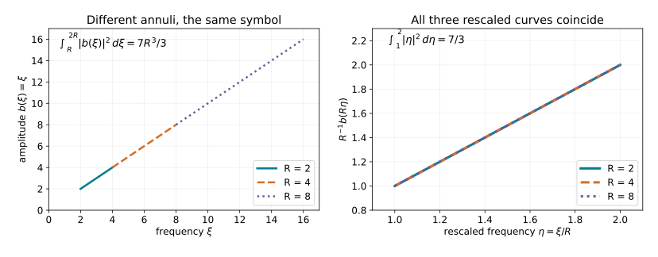

# Recovering a frequency amplitude from iterated regularity

An oscillation can conceal the amplitude that determines a distribution's
order. In a frequency graph the concealed factor is explicit. Removing it
turns suitable operators on the distribution into ordinary derivatives of
the amplitude. Dyadic \(L^2\) estimates then recover the exact symbol order.

**Private receiving draft.** The graph argument below is written in full.
The selected operator, \(L^2\) and dyadic analytic proofs are supplied
in the linked companions, including the proper local representation
needed to apply the endpoint estimate. This draft does not
certify the whole intrinsic lesson, its general phase theorem, its global
bundle theorem, or publication eligibility.

## 1. Conventions and exact earlier proofs

We use \(\widehat f(\xi)=\int e^{-ix\cdot\xi}f(x)\,dx\), inverse coefficient
\((2\pi)^{-n}\), and \(D_j=-i\partial_{x_j}\). All orders are real unless
specified. An ordinary symbol \(b\in S^r(\mathbb R^n)\) satisfies
\[
 |\partial_\xi^\alpha b(\xi)|\le C_\alpha\langle\xi\rangle^{r-|\alpha|}.
 \tag{G1}
\]
For a symbol depending on a base variable, every base derivative has the
same order. Matrix symbols use any fixed finite-dimensional norm.

The earlier programme proofs used here are exact, bounded selections:

| ID | Used result | Earlier programme proof |
|---|---|---|
| P1 | Dyadic Besov definition, multiplication and coordinate bounds, ordinary symbol endpoint bound, local frequency Sobolev estimate | Exact modified AN03-U008 Section 1 selection [B0–B6](prerequisites/dyadic-endpoint.md); its local operator representation is proved in P2 |
| P2 | Quantization on distributions; adjoints and composition with every remainder; properly supported localization and smoothing errors | Exact modified AN03 ordinary selection [O0–O6](prerequisites/ordinary-operator-calculus.md), with its linked metric localization, quadratic multiplier and finite-dimensional proofs |
| P3 | Completed Lebesgue measure, \(L^2\) completeness and smooth density; both inverse Fourier maps, distributional compatibility, Parseval and measurable multipliers | Exact modified AN03-P004 selection [M0–M8](prerequisites/measure-and-l2.md), and AN03-P001 selection [L0–L3](prerequisites/fourier-l2.md), with the earlier U001 Schwartz proofs linked there |
| P4 | Uniform stationary phase with ordinary symbol amplitudes, including differentiated remainders | [AN04-U001](../20261004-free-stationary-phase/stationary-phase-and-critical-manifolds.md), Sections 4–6; its analytic and finite-dimensional proofs are included in that reconstruction |
| P5 | Conic frequency-graph coordinates from a base diffeomorphism; nondegenerate critical-map geometry | [C0–C5](prerequisites/conic-frequency-coordinates.md), with exact earlier U001 linear algebra and calculus |
| P6 | Ordinary coordinate transport; intrinsic chart and frame invariance; Fourier wavefront covariance, compact conic cutoffs and wavefront containment | [T0–T3 and W1–W5](prerequisites/coordinate-and-wavefront-localization.md), with the exact P1–P3 inputs above |
| P7 | Conic two-sided parametrices with every remainder; finite conic Besov reconstruction; the full intrinsic localization theorem and cutoff independence | [K0–K7](prerequisites/conic-parametrices-and-localization.md), with the exact P1–P3 and P6 inputs above |
| P8 | Representation using a prescribed nondegenerate or clean phase; exact excess correction; all symbol remainders and lower-order criteria | [F0–F7](prerequisites/prescribed-phase-representation.md), using the proved graph criterion, P5–P7 and exact U001 stationary-phase proofs |

These are programme proof dependencies, not replacements by human-source
citations. Section 1 of AN03-U008 proves its endpoint estimate directly by
Fourier kernel bounds and Schur's inequality. Only that selection is needed
here; the transmission and complex-analysis parts of that lesson are not.
The selected companion fills the endpoint summations and extension steps,
without asserting Schwartz density in the endpoint norm. Its supplied
local representation hypothesis keeps the operator-calculus dependency
visible. Earlier whole-lesson approvals are not adopted as current source
decisions.

Write \(B^s=B^s_{2,\infty}\). If \(A_j\) is the low-frequency ball for
\(j=0\) and a dyadic annulus for \(j\ge1\), then
\[
 \|u\|_{B^s}=\sup_{j\ge0}2^{js}\|\mathbf1_{A_j}\widehat u\|_2
 \tag{G2}
\]
up to the fixed Plancherel constant. Membership includes local square
integrability of the Fourier transform. The local space requires (G2)
after every compactly supported smooth multiplication.
Summing the weighted annular squares gives
\(H^s\subset B^s\subset H^{s-\epsilon}\) for each \(\epsilon>0\): the
first inclusion bounds a supremum by an \(\ell^2\) norm; the second uses
\(\sum_j2^{-2j\epsilon}<\infty\).

Let \(H\) be real, smooth on \(\mathbb R^n\setminus0\), and homogeneous
of degree one. Fix a real smooth extension \(H_e\in S^1\) equal to \(H\)
for \(|\xi|\ge2\). The graph is
\[
 \Gamma_H=\{(H'(\xi),\xi):\xi\ne0\}.
 \tag{G3}
\]
It is Lagrangian: the pullback of \(\sum_jd\xi_j\wedge dx_j\) vanishes
because \(H''\) is symmetric; its frequency projection is the identity,
so its dimension is \(n\) and the parametrization is an embedding.

An admissible first-order operator is a properly supported ordinary
\(\Psi^1\) operator whose principal symbol vanishes on this graph.
For symbols not assumed classical this means that the restriction of a
representative to \(x=H'(\xi)\) belongs to \(S^0\), locally in the base
variables; changing the representative by \(S^0\) preserves the condition.
All compact frequency regions can be changed freely. Define
\(\mathcal I^m(\Gamma_H)\) by
\[
 L_1\cdots L_Nu\in B^{-m-n/4}_{\mathrm{loc}}
 \quad\hbox{for every admissible word, including }N=0.
 \tag{G4}
\]
This definition retains the exact dyadic endpoint.

## 2. A real frequency phase with a properly supported kernel

**G5.** There is a real \(h\in S^1\) with \(h-H_e\in S^{-\infty}\)
such that the inverse Fourier transforms of \(h\) and all \(h_j=\partial_jh\)
have compact support.

**Proof.** Put \(K=\mathcal F^{-1}H_e\). Take a smooth dyadic partition
in frequency and write \(K=\sum_{j\ge0}K_j\) as a tempered-distribution
sum. For the large-frequency pieces, changing variables \(\xi=2^j\eta\)
and integrating by parts on a fixed annulus gives
\[
 |\partial_x^\beta K_j(x)|
 \le C_{N,\beta}2^{j(n+1+|\beta|)}(1+2^j|x|)^{-N}.
 \tag{G5}
\]
Indeed every derivative of the rescaled symbol is bounded by \(C2^j\);
each \(x\)-derivative contributes at most \(2^j\), and the volume is
\(2^{jn}\). Moving \((1-\Delta_\eta)^M\) off the exponential supplies
arbitrarily high even powers of the final denominator, which imply the
displayed estimate for every integer \(N\).
The low-frequency piece is Schwartz by the same integration by parts.

On \(|x|\ge\epsilon>0\), choose \(N>n+1+|\beta|\) and sum the geometric
series. Increasing \(N\) proves arbitrary decay as \(|x|\to\infty\), for
every derivative. Thus \(K\) is smooth off zero and
\((1-\kappa)K\) is Schwartz whenever \(\kappa\in C_c^\infty\) is one
near zero. Choose \(\kappa\) real and even. Set
\[
 h=\mathcal F(\kappa K)
   =H_e-\mathcal F((1-\kappa)K).
 \tag{G6}
\]
Schwartz Fourier invariance, proved in AN04-U001's quadratic companion,
shows that the difference is Schwartz. Since \(H_e\) is real,
\(K(-x)=\overline{K(x)}\) distributionally. The same identity holds for
\(\kappa K\), hence its Fourier transform is real. Finally
\(\mathcal F^{-1}h_j=-ix_j\kappa K\), which has the same compact
support. Convolution with each of these compact kernels is properly
supported: if one variable is in a compact set, the other is in its sum
with a fixed compact set. This proves every assertion. ∎

The use of a real \(h\) matters: multiplication by \(e^{ih}\) preserves
Fourier absolute values. The compact kernel matters independently: words
in the operators below preserve compact support, with a larger compact
set allowed for each fixed word.

## 3. Removing the frequency phase after a base localization

For a base-compact ordinary symbol \(a(x,\theta)\) of order \(r\), set
\[
 w(x)=(2\pi)^{-n}\int e^{i(x\cdot\theta-H_e(\theta))}
 a(x,\theta)\,d\theta.
 \tag{G7}
\]
This is a distribution: in its pairing with a compact test function move
\((1-\Delta_x)^N\) off \(e^{ix\cdot\theta}\), divide by
\(\langle\theta\rangle^{2N}\), and take \(2N>r+n\). All resulting
integrals are absolutely convergent and controlled by finitely many test
seminorms. A frequency cutoff and the same estimate justify its removal
and every integration by parts used below.

**G8 (exact-order reduction).** The smooth function
\[
 \mathcal R_Ha(\xi)=e^{iH_e(\xi)}\widehat w(\xi)
 \tag{G8}
\]
belongs to \(S^r\), with finite-seminorm bounds. Its first coefficient is
\[
 \mathcal R_Ha(\xi)-a(H'(\xi),\xi)\in S^{r-1}
 \quad (|\xi|\ge2).
 \tag{G9}
\]
There is a full expansion with a remainder in \(S^{r-N}\) after \(N\)
terms. No positive definiteness of \(H''\) is required.

**Proof.** For \(\xi=R\omega\), \(R\ge2\), \(|\omega|=1\), the defining
double integral has phase
\(x\cdot(\theta-R\omega)-H_e(\theta)+H(R\omega)\).
First split it into a region \(|\theta/R-\omega|<c\), with fixed
\(0<c<1/4\), and its complement, using a smooth cutoff equal to one
on a smaller such region.

The complement is rapidly decreasing in \(R\), with all radial and
angular derivatives. Here are the bounds for its unbounded frequency
domain. On \(|\theta|\le4R\), away from that smaller region,
\(|\theta-R\omega|\ge c'R\). Repeated integration by parts in \(x\)
gives any power \(R^{-M}\) times a polynomially growing integral in
\(R\). A possible logarithm at a borderline order is bounded by an
extra factor \(R\). On \(|\theta|>4R\), the same denominator is
comparable to \(|\theta|\); integration of
\(\langle\theta\rangle^{r-M}\) gives any negative power of \(R\) once
\(M\) is large. Differentiation by any prescribed number of
\(R\partial_R\) and angular derivatives only adds polynomial factors
in \(R,\theta\); increasing \(M\) absorbs them. Cutoff derivatives obey
the same bounds. This proves the assertion about the complement without
an unsupported compact-frequency truncation.

In the remaining region write \(\theta=R\eta\). The phase becomes
\(R\Phi\), where
\[
 \Phi(x,\eta,\omega)=x\cdot(\eta-\omega)-H(\eta)+H(\omega).
 \tag{G10}
\]
There is exactly one critical point in \((x,\eta)\):
\((H'(\omega),\omega)\). Euler's identity
\(H'(\omega)\cdot\omega=H(\omega)\), obtained by differentiating
\(H(t\omega)=tH(\omega)\), also shows that its critical value is zero.
The Hessian there is
\[
 Q_\omega=\begin{pmatrix}0&I\\ I&-H''(\omega)\end{pmatrix}.
 \tag{G11}
\]
The quadratic form \(2X\cdot E-E^TH''(\omega)E\) becomes
\(2Y\cdot E\) under \(Y=X-\tfrac12H''(\omega)E\). This change has
determinant one. A further orthogonal change to \((Y+E)/\sqrt2\) and
\((Y-E)/\sqrt2\) gives \(n\) positive and \(n\) negative squares.
Consequently \(|\det Q_\omega|=1\) and its signature is zero.

The rescaled amplitude \(a(x,R\eta)\) is an ordinary symbol of order
\(r\) in \(R\), uniformly with all compact \((x,\eta,\omega)\)
derivatives. A fixed base cutoff can include the compact set
\(\{H'(\omega):|\omega|=1\}\); outside the support of \(a\) this just
extends a zero amplitude. Compact parameter patches and the finite
cutoffs of AN04-U001, Appendix A.4, now allow its Sections 5–6 to apply
uniformly. The stationary-phase coefficient \((2\pi/R)^n\) cancels
the Jacobian and normalization \((2\pi)^{-n}R^n\). The determinant
and signature factors are both one. This gives (G9), and each further
term loses one power of \(R\).

The same theorem gives the differentiated remainders, not merely
undifferentiated \(O\)-bounds. On the zero critical value in (G10), it
bounds every \((R\partial_R)^k\partial_\omega^\beta\) of the remainder
by \(C R^{r-N}\). In polar coordinates a Cartesian derivative is
\(R^{-1}\) times a smooth angular combination of \(R\partial_R\)
and angular derivatives. Induction therefore gives exactly
\(C_\alpha R^{r-N-|\alpha|}\). Low frequencies are smooth because
\(w\) is compactly supported. This proves (G8)–(G9), the full
remainder orders and finite-seminorm continuity. ∎

In particular multiplication by a compact smooth function preserves the
class \\(\mathcal F^{-1}(e^{-iH_e}S^r)\). This conclusion follows by
applying G8 to \(a(x,\theta)=\chi(x)b(\theta)\); it is not an
unproved assertion that multiplying an oscillatory distribution simply
multiplies its frequency amplitude.

## 4. The graph criterion, in both directions

**G12.** If \(u\in\mathcal E'(\mathbb R^n;\mathbb C^q)\), then
\[
 u\in\mathcal I^m(\Gamma_H)
 \quad\Longleftrightarrow\quad
 e^{iH_e(\xi)}\widehat u(\xi)\in S^{m-n/4}(\mathbb R^n;\mathbb C^q).
 \tag{G12}
\]
Conversely, without a compact-support requirement, every
\(\mathcal F^{-1}(e^{-iH_e}b)\), \(b\in S^{m-n/4}\), belongs locally
to the class on the left. Low-frequency changes add a smooth function
and do not alter the assertion.

**Forward proof.** Choose \(h\) from G5 and put
\[
 Q_j=x_j-h_j(D),\qquad v=e^{ih}\widehat u,\qquad r=m-n/4.
 \tag{G13}
\]
These are proper operators. Direct Fourier differentiation gives
\[
 \widehat{Q_ju}=e^{-ih}i\partial_jv,
 \quad [Q_j,Q_k]=0,
 \quad [Q_j,D_k]=i\delta_{jk}.
 \tag{G14}
\]
The first identity follows from
\(i\partial_j(e^{-ih}v)-h_j e^{-ih}v=e^{-ih}i\partial_jv\).
For the second, \([x_j,h_k(D)]=i(\partial_jh_k)(D)\) and mixed
derivatives of \(h\) commute. Every \(Q_jD_k\) is an admissible
first-order operator: its principal symbol is
\((x_j-H_j(\xi))\xi_k\).

For \(|\alpha|=|\beta|=a\), the operator \(D^\beta Q^\alpha\) is a
finite linear combination of words of length at most \(a\) in the
\(Q_jD_k\), and the identity. To see this without assuming commutativity,
pair the \(a\) labels from \(Q^\alpha\) with those of \(D^\beta\) and
form a product of these pairs. Moving all \(D\)'s to the left using
\(Q_jD_k=D_kQ_j+i\delta_{jk}\) gives \(D^\beta Q^\alpha\) plus terms
with one fewer \(D\) and one fewer \(Q\). Induction proves the claim.

Each resulting distribution has compact support because the word is
proper and \(u\) is compact. Its local bound (G4) is therefore a global
bound: take a compact cutoff equal to one on its support. Using P3 and
\(|e^{-ih}|=1\), its dyadic estimate is
\[
 \int_{R/2<|\xi|<2R}
 |\xi^\beta\partial^\alpha v(\xi)|^2\,d\xi
 \le C_{\alpha\beta}R^{2m+n/2},\qquad R\ge2.
 \tag{G15}
\]
A fixed annulus meets only finitely many dyadic blocks, so powers of two
are not required. On that annulus
\(\sum_{|\beta|=a}|\xi^\beta|^2\ge c_aR^{2a}\), as follows by
expanding \((\sum_j\xi_j^2)^a\). Consequently
\[
 \int_{R/2<|\xi|<2R}|\partial^\alpha v|^2
 \le C_\alpha R^{2r+n-2|\alpha|}.
 \tag{G16}
\]
Put \(v_R(\eta)=R^{-r}v(R\eta)\). Changing variables gives
\[
 \int_{1/2<|\eta|<2}|\partial_\eta^\alpha v_R|^2\,d\eta
 \le C_\alpha,
 \tag{G17}
\]
because the power is
\(-2r+2|\alpha|-n+2r+n-2|\alpha|=0\).
Cover the unit sphere by finitely many balls whose larger concentric
balls lie in this annulus. P1's local frequency Sobolev estimate applied
to each derivative of \(v_R\) makes that derivative bounded on the
smaller balls. Scaling back gives (G1).

The Fourier transform of a compact distribution is smooth with
polynomially bounded derivatives. Here is the needed proof, without a
dependency on the later tangent lesson. Choose a compact smooth cutoff
\(\chi\) equal to one near its support. A fixed finite-order distribution
bound controls its pairing with any test supported in
\(\operatorname{supp}\chi\) by the supremum of that test's derivatives
through some order \(M\). Apply it to
\(\chi(x)(-ix)^\alpha e^{-ix\cdot\xi}\). On this fixed compact set the
bound is \(C_\alpha\langle\xi\rangle^M\). Taylor's formula in the
parameter \(\xi\), applied also to every test derivative through order
\(M\), justifies differentiating the pairing, successively for every
\(\alpha\). Thus the Fourier transform has all the asserted derivatives
and bounds. Low frequencies cause no difficulty.
Finally \(H_e-h\) is Schwartz.
Repeated chain and product rules give
\(e^{i(H_e-h)}-1\in S^{-\infty}\), since each nonzero derivative
contains a derivative of that Schwartz difference, while the zeroth
order uses \(e^{it}-1=it\int_0^1e^{ist}\,ds\). Multiplication by this
factor preserves \(S^r\). Therefore \(e^{iH_e}\widehat u\in S^r\).

**Reverse proof.** Let \(u=\mathcal F^{-1}(e^{-iH_e}b)\), with
\(b\in S^r\). G8 shows that every compact localization has Fourier
transform equal to \(e^{-iH_e}\) times an \(S^r\) symbol. Its squared
Fourier mass in an annulus of radius \(R\) is bounded by
\(CR^{2r+n}\). Thus it lies in
\(B^{-r-n/2}=B^{-m-n/4}\), including when the order is negative.

We must preserve that amplitude order under every admissible operator,
not just the displayed generators. Work on a fixed output compact set.
P2 gives a left symbol \(p(x,\theta)\) of order one after output
localization; a smoothing remainder contributes a smooth function.
For large \(\theta\), put
\[
 p_0(\theta)=p(H'(\theta),\theta),\qquad
 b_j(x,\theta)=\int_0^1
 (\partial_{x_j}p)(H'(\theta)+t(x-H'(\theta)),\theta)\,dt.
 \tag{G18}
\]
The restriction assumption gives \(p_0\in S^0\). All \(b_j\) belong
locally to \(S^1\): \(H'\) is degree zero and each of its frequency
derivatives lowers degree by one; repeated differentiation under the
compact \(t\)-integral gives the required estimates. The fundamental
theorem of calculus yields the exact identity
\[
 p(x,\theta)=p_0(\theta)+
 \sum_j(x_j-H_j(\theta))b_j(x,\theta).
 \tag{G19}
\]
For the phase \(\phi=x\cdot\theta-H(\theta)\),
\((x_j-H_j)e^{i\phi}=(1/i)\partial_{\theta_j}e^{i\phi}\).
Integration by parts therefore changes the amplitude \(pb\) into
\[
 d(x,\theta)=p_0(\theta)b(\theta)
       +i\sum_j\partial_{\theta_j}(b_j(x,\theta)b(\theta)).
 \tag{G20}
\]
Every term is of order \(r\), with the written matrix factor order
unchanged. Insert a compact output cutoff and use G8 to remove its base
dependence. Compact-frequency differences are smooth. This proves that
the localized \(Pu\) again has the form \(\mathcal F^{-1}(e^{-iH_e}S^r)\).

For completeness, proper support makes this local argument iterable.
For a chosen output compact set and a fixed finite word, successively
choose input cutoffs equal to one on the compact kernel projections
needed for the next factor. Terms outside these cutoffs vanish on the
working output set; off-diagonal smoothing terms have the same smooth
conclusion by P2. At each step G8 supplies the localized graph amplitude
of the same order. Induction on word length gives (G4). This proves both
the reverse implication and the noncompact local assertion. ∎

For \(n=1\), take \(H(\xi)=a\xi\) and
\(b(\xi)=\chi(\xi)\xi\), where \(\chi=0\) for \(\xi\le1\) and
\(\chi=1\) for \(\xi\ge2\). On every positive annulus
\(R\le\xi\le2R\), \(R\ge2\), the amplitude is exactly \(\xi\).
The three curves in the right panel are all
\(R^{-1}b(R\eta)=\eta\), and their squared integral is \(7/3\).
The corresponding unscaled squared integral is \(7R^3/3\).
This is the exact cancellation of powers in (G16)–(G17), illustrated
for \(r=1\), not a numerical substitute for the proof.

## 5. What localization does and does not establish

An ordinary proper \(A\in\Psi^0\), including a matrix-valued one,
preserves the class (G4). If \(L\) is admissible, then
\(C=[L,A]\in\Psi^1\) is admissible as well. Its order-one principal
symbol is the matrix commutator of the order-one symbol of \(L\) and
the order-zero symbol of \(A\), so it vanishes on the graph. All
frequency-derivative terms are lower order. This does not assert that
the matrix commutator has order zero.

Here is the word induction. P1 supplies the assertion for a word of
length zero. For a word \(W=L_1\cdots L_{N-1}\), write
\[
 WL_NAu=WA(L_Nu)+W[L_N,A]u.
 \tag{G21}
\]
The first term is controlled by the induction hypothesis, since
\(L_Nu\) itself satisfies (G4); the second is already an admissible
word of length \(N\). No commutator of two matrix first-order
operators has been inserted. Smooth multiplication is the special case
needed for compactly supported receivers.

G12 is a theorem for a specified frequency graph. The complete
[geometric coordinate proof, C0–C5](prerequisites/conic-frequency-coordinates.md)
now supplies such a graph near any nonzero point of a conic Lagrangian,
using a base diffeomorphism. The complete
[coordinate and directional-localization proofs, T0–W5](prerequisites/coordinate-and-wavefront-localization.md)
transport both the intrinsic word condition and its wavefront set, and
construct proper compact microlocal cutoffs. They also prove that the
word condition forces wavefront into the Lagrangian. The complete
[conic inverse and localization proof, K0–K7](prerequisites/conic-parametrices-and-localization.md)
now supplies the converse for arbitrary elliptic tests, finite conic
reconstruction, and independence of sufficiently small cutoffs and
Lagrangian extensions. Its matrix proof retains the original factor
order and every symbol remainder on one fixed cone.

The [prescribed-phase proof, F0–F7](prerequisites/prescribed-phase-representation.md)
uses this graph criterion to prove both directions for a given ordinary
nondegenerate or clean phase. It supplies the excess correction, the
amplitude construction to every order, and the lower-order criteria.
Thus the intrinsic definition is retained throughout.
The full original lesson's example and exercise coverage, the global
principal-symbol and Maslov interpretation, and the remaining course
retain their separate outstanding obligations.

## 6. Three exercises with complete solutions

**1. Check the shift.** Why is the symbol order in G12 \(m-n/4\)?

**Solution.** An amplitude of order \(r\) has squared annular energy
bounded by \(R^{2r+n}\). Multiplication of the block norm by
\(R^{-m-n/4}\) is bounded at the critical exponent exactly when
\(r+n/2=m+n/4\), or \(r=m-n/4\). For a point mass the Fourier
amplitude is constant, so \(r=0\), \(m=n/4\) and the endpoint is
\(B^{-n/2}\). Its \(H^{-n/2}\) norm diverges because every large
dyadic block contributes a fixed positive amount to the squared norm.

**2. Verify a balanced word.** In one dimension set \(T=QD\) and
assume \([Q,D]=i\). Express \(D^2Q^2\) in terms of \(T\).

**Solution.** \(DQ=T-i\). Also \(DQ^2=Q^2D-2iQ\), so
\(D^2Q^2=Q^2D^2-4iQD-2\). On the other hand
\(T^2=QDQD=Q^2D^2-iQD\). Substituting gives
\(D^2Q^2=T^2-3iT-2\). This checks both the shorter identity term
and the sign in the reordering used for (G15).

**3. Explain why an arbitrarily small Sobolev loss is insufficient.**
For \(n=1\), take disjoint dyadic bumps
\(b(\xi)=\sum_{j\ge2}j\,\psi(2^{-j}\xi)\), where
\(\psi\in C_c^\infty((1,3/2))\) is nonzero. Show that this smooth
polynomially bounded amplitude is not \(S^0\), although its inverse
Fourier transform and all words in \(xD\) lie in
\(H^{-1/2-\epsilon}\) for every \(\epsilon>0\).

**Solution.** On the \(j\)-th support, differentiation \(k\) times
is bounded by \(C_kj2^{-jk}\). Its peak grows like \(j\), so the
zeroth symbol estimate of order zero fails. Applying \(xD\) replaces
the Fourier amplitude by \(i\partial_\xi(\xi b)\). Every fixed word
therefore replaces \(\psi\) by a fixed finite sum of its derivatives
times powers of its argument, retaining the factor \(j\) and the
support scale \(2^j\). Its weighted squared Fourier integral is at
most \(C\sum_j j^2 2^{-2j\epsilon}<\infty\). To verify convergence,
the ratio of successive terms tends to \(2^{-2\epsilon}<1\), so a
geometric series bounds the tail. In contrast, the endpoint annular
sequence for the empty word is a nonzero constant times \(j\), hence
unbounded. The lost endpoint cannot recover the missing \(S^0\)
bound. This example uses \(H=0\), so no frequency phase conceals the
failure.

## Free human sources and derivation

[Lars Hörmander, *Fourier integral operators. I*, Acta Mathematica
127 (1971)](https://projecteuclid.org/journals/acta-mathematica/volume-127/issue-none/Fourier-integral-operators-I/10.1007/BF02392052.pdf),
pp. 150–154, supplies the free primary-source stationary-testing route.
G8 gives the exact graph specialization using the already proved
AN04-U001 parameter estimates, including the noncompact-frequency tail.
The dyadic derivative argument in G12 is developed from the selected
earlier programme conormal proof and the explicit identities (G14)–(G17).
The free article is distinct from any paid book.

[Jared Wunsch's version 3 lecture notes](https://arxiv.org/abs/0812.3181v3),
Section 8.2, Proposition 8.6, provide a freely accessible comparison for
iterated regularity. They expressly leave the precise order relationship
aside. They are not the proof of the endpoint theorem here. Their
classical-amplitude definition is not silently substituted for the
ordinary-symbol class in G12.

The exposition and new figure in this receiving component are dedicated
to CC0 to the extent rights exist. No human-source PDF or prose is
reproduced. Any later incorporated programme selections must keep their
own component terms, attribution and version history.
