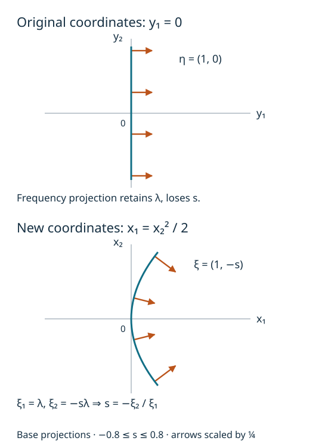

# Conic Lagrangians in frequency coordinates

This companion supplies the geometric coordinate theorem needed by the
[frequency-graph criterion](../intrinsic-frequency-graphs.md).
It proves a statement about a change of base coordinates and its cotangent
lift. Transporting an operator class under that change, or cutting a
distribution off microlocally, requires additional analytic proofs.

The freely readable source is Lars Hörmander's *Fourier integral
operators. I*, Section 3.1, especially Theorems 3.1.3 and 3.1.4, printed
pages 134–137. The [original paper is freely available](https://projecteuclid.org/journals/acta-mathematica/volume-127/issue-none/Fourier-integral-operators-I/10.1007/BF02392052.pdf).
The arguments below include the finite-dimensional and chart details used
here; the reference does not replace any of those proofs.

## C0. Exact inputs and conventions

We work in dimension \(n\ge1\). A smooth embedded \(n\)-dimensional
submanifold means a set locally given by an injective smooth
parametrization with a smooth inverse onto its image, whose derivative
has rank \(n\). Its tangent space is the image of that derivative.
A conic set is invariant under every positive dilation of the frequency
variable, leaving the base variable fixed.

The earlier programme proofs are:

| Used input | Exact earlier proof |
|---|---|
| Finite bases and extension | Lebl's retained Propositions 8.1.14, 8.1.17 and 8.1.18; [finite-dimensional completions P9.1 and P9.4](../../20261004-free-stationary-phase/differential-prerequisite-completions.md) |
| Euclidean Cauchy–Schwarz | The retained proof of Lebl's Proposition 7.1.4 in the earlier U001 human selection |
| Matrix inversion and smooth inverse/implicit maps | [P2 and P3](../../20261004-free-stationary-phase/prerequisite-completions.md), with their retained human proofs |
| Product and chain rules, equality of mixed second derivatives | The earlier U001 contracts F0-DIFF and P4, with [differential completions](../../20261004-free-stationary-phase/differential-prerequisite-completions.md) |
| Finite smooth cutoffs, supported strictly inside an open set | [U001 Appendix A.4](../../20261004-free-stationary-phase/stationary-phase-and-critical-manifolds.md) |

Their exact source bytes, actual proof locators and transitive dependencies
are recorded in the companion proof bindings. All uses of inverse or
implicit maps below are finite-dimensional applications of P3.
No general normal-form theorem or theorem about closed one-forms is imported.

**The finite rank facts used below.** If \(A:V\to W\) is linear,
choose a basis of \(\ker A\) and extend it to a basis of \(V\).
The images of the added vectors span \(A(V)\). They are independent:
a linear combination with zero image belongs to \(\ker A\),
so independence of the full basis makes its added coefficients zero.
It follows that
\(\dim V=\dim\ker A+\dim A(V)\).
In particular a linear injection between spaces of the same finite
dimension is an isomorphism.
If the rows of a real \(N\)-by-\(d\) matrix are independent, its image
is all of \(\mathbb R^N\). Otherwise an orthogonal complement of its
proper image contains a nonzero vector, giving a nonzero linear
combination of the rows equal to zero. The columns therefore span,
and a basis chosen from them gives an invertible \(N\)-column minor.
If a \(d\)-by-\(n\) matrix is injective, its rows span
\(\mathbb R^n\): a nonzero vector perpendicular to all the rows
would be in its kernel. Choosing a basis of rows gives an invertible
\(n\)-row minor. These arguments use the basis-extension and
orthonormal-complement proofs cited above, and supply every rank,
nullity and minor-selection fact used in C1, C3 and C5.

For tangent vectors \((v,w)\) and \((v',w')\), use
\[
 \omega((v,w),(v',w'))=w\cdot v'-w'\cdot v,
 \qquad \alpha_{(x,\xi)}(v,w)=\xi\cdot v.
 \tag{C1}
\]
Thus \(\omega=\sum_jd\xi_j\wedge dx_j\). An \(n\)-plane is
Lagrangian when \(\omega\) vanishes on it. A smooth \(n\)-submanifold is
Lagrangian when every tangent plane has this property.

If \(x=f(y)\) is a base diffeomorphism, write \(J=df_y\). The frequency
coordinates obey
\[
 \eta=J^T\xi,\qquad \xi=J^{-T}\eta.
 \tag{C2}
\]
This identity follows by pairing with every vector \(dy\):
\(\eta\cdot dy=\xi\cdot J\,dy=\xi\cdot dx\).
It proves invariance of \(\alpha\). It also proves invariance of
\(\omega\) directly: differentiating (C2), the extra term in
\(\sum_jd\eta_j\wedge dy_j\) has coefficients
\(\sum_k\xi_k\partial_{y_\ell}\partial_{y_j}f_k\).
They are symmetric in \(j,\ell\), so their contributions to the
alternating form cancel in pairs. The remaining term is
\(\sum_kd\xi_k\wedge dx_k\). The smooth inverse in (C2) is supplied
by P2. This verifies the cotangent lift without an exterior-calculus
identity left as a prerequisite.

## C1. A horizontal graph transverse to a Lagrangian plane

**Lemma.** Let \(L\) be a Lagrangian \(n\)-plane in
\(\mathbb R_y^n\oplus\mathbb R_\eta^n\). There is a real \(t\) such that
\[
 M_t=\{(q,tq):q\in\mathbb R^n\}
 \quad\hbox{has}\quad M_t\cap L=\{0\}.
 \tag{C3}
\]
This graph is also transverse to the vertical plane \(q=0\).

**Proof.** Let \(E\) be the image of the base projection \(L\to\mathbb R^n\),
of dimension \(k\), and let
\(V=\{p:(0,p)\in L\}\). For \(p\in V\) and \(q\in E\), choose
\((q,r)\in L\). Isotropy gives \(p\cdot q=0\); hence
\(V\subset E^\perp\). Rank and nullity give
\(\dim V=n-k=\dim E^\perp\), so these two spaces are equal.
The orthogonal complement has that dimension because an orthonormal
basis of \(E\) extends to one of \(\mathbb R^n\), by the finite
Gram–Schmidt proof P9.4.

For \(q\in E\), choose \((q,p)\in L\) and define \(Bq\) to be the
orthogonal projection of \(p\) on \(E\). Any other choice differs by
an element of \(V=E^\perp\), so \(Bq\) is well-defined. Addition and
scalar multiplication in \(L\) show that \(B\) is linear. Isotropy
applied to two such lifts gives
\((Bq)\cdot q'=q\cdot(Bq')\); thus \(B\) is symmetric.
In fact
\[
 L=\{(q,Bq+v):q\in E,\ v\in E^\perp\}.
 \tag{C4}
\]
Both inclusions follow from the definition and from
\(\{0\}\oplus E^\perp\subset L\).

If \(k=0\), the plane \(L\) is vertical and any \(t\) works. Otherwise,
in an orthonormal basis of \(E\), let
\(C=k\max_{i,j}|B_{ij}|\). Each component of \(Bq\) is at most
\(\max|B_{ij}|\sum_j|q_j|\); Cauchy–Schwarz therefore gives
\(|Bq|\le C|q|\). Choose \(t=C+1\).
If \((q,tq)\in L\), then \(q\in E\) and projection of (C4) onto
\(E\) gives \(tq=Bq\). The bound forces \(q=0\).
This proves (C3). The graph itself is Lagrangian because
\((tq)\cdot q'-(tq')\cdot q=0\), and it has dimension \(n\).
Its intersection with the vertical plane is zero by its definition.
\(\square\)

This is the particular common-transversal statement the coordinate
construction needs. It uses only real linear algebra and avoids
importing a parametrization of all Lagrangian planes.

## C2. The radial vector kills the canonical one-form

At \((y,\eta)\) on a conic Lagrangian \(\Lambda\), the curve
\(s\mapsto(y,s\eta)\) lies in \(\Lambda\). Its derivative at \(s=1\)
is \(R=(0,\eta)\), so \(R\in T\Lambda\). For every tangent
\((v,w)\in T\Lambda\), (C1) gives
\[
 0=\omega(R,(v,w))=\eta\cdot v=\alpha(v,w).
 \tag{C5}
\]
Consequently \(\alpha\) vanishes on \(\Lambda\).
This proof uses conicity as well as the Lagrangian hypothesis.

## C3. Construct the base coordinates and the conic chart

**Theorem.** Given a conic embedded Lagrangian
\(\Lambda\subset T^*X\setminus0\) and a point \(\rho\in\Lambda\),
there are base coordinates \(x\) near \(\pi(\rho)\), an open cone
\(\Omega\subset\mathbb R^n\setminus0\), and a smooth
degree-zero map \(g:\Omega\to\mathbb R^n\) such that the conic
germ of \(\Lambda\) at the positive ray of \(\rho\) is
\[
 \{(g(\xi),\xi):\xi\in\Omega\}.
 \tag{C6}
\]
In particular the change comes from a base diffeomorphism.

**Proof.** Start with coordinates \(y\) centered at \(\pi(\rho)\)
in which the covector at \(\rho\) is \(dy_1\).
To obtain them, extend that nonzero covector to a basis of the
dual vector space and use those linear functions as coordinates.
Thus \(\rho=(0,e_1)\). Apply C1 to \(L=T_\rho\Lambda\), and fix
the resulting \(t\). Define
\[
 x_1=y_1+\frac t2\sum_{j=1}^n y_j^2,\qquad
 x_j=y_j\quad(2\le j\le n).
 \tag{C7}
\]
Its derivative at zero is the identity, so P3 makes this a smooth
base diffeomorphism on a sufficiently small neighborhood.

The section \(\eta=d_yx_1=e_1+ty\) has tangent plane \(M_t\)
at \(\rho\). In the new cotangent coordinates it is the section
\(\xi=e_1\), by (C2). Equivalently, differentiating
\(\eta=(df_y)^T\xi\) at \((y,\xi)=(0,e_1)\) gives
\[
 d\eta=d\xi+t\,dy,\qquad dx=dy.
 \tag{C8}
\]
Thus the kernel of \(d\xi\) is precisely \(M_t\).
Since \(M_t\cap T_\rho\Lambda=0\), the restriction
\(d\xi:T_\rho\Lambda\to\mathbb R^n\) is injective and hence
an isomorphism. C0 shows that \(\Lambda\) is still Lagrangian
in the new coordinates.

Here is the passage from an ordinary inverse chart to a conic one.
Work where \(\xi_1>0\), and use ambient coordinates
\[
 (x,\nu,s),\qquad \nu=\xi'/\xi_1,\quad s=\xi_1>0.
 \tag{C9}
\]
This is a smooth coordinate map with the explicit inverse
\((x,\nu,s)\mapsto(x,s(1,\nu))\). Conicity says that membership
in \(\Lambda\) is unchanged by varying \(s\) with \((x,\nu)\)
fixed. The section \(\Lambda_1=\Lambda\cap\{\xi_1=1\}\) is
smooth of dimension \(n-1\): \(d\xi_1(R)=1\) on that section,
and the implicit map theorem in a parametrization of \(\Lambda\)
solves for this one coordinate.
On its tangent space at \(\rho\), \(d\nu=d\xi'\).
If \(d\nu\) vanishes, so does all of \(d\xi\), and the tangent
vector is zero. Dimension now makes this map an isomorphism.
P3 therefore gives a unique local chart
\[
 (x,\xi)=(g_1(\nu),(1,\nu)),\qquad \nu\in V,
 \tag{C10}
\]
after shrinking an open neighborhood \(V\) of \(0\).
When \(n=1\), this section is a single point and (C10) is the
corresponding zero-dimensional chart.

Saturate this chart by positive dilation. In the product coordinates
(C9), it is an open part of \(\Lambda\), containing the entire
positive ray of \(\rho\). Its frequency image is the open cone
\(\Omega=\{s(1,\nu):s>0,\ \nu\in V\}\).
Set \(g(s(1,\nu))=g_1(\nu)\). This map is smooth and degree zero,
and gives (C6). All charts can be restricted in the base variable,
so the chosen base coordinate neighborhood is respected.
\(\square\)

## C4. The homogeneous generating function and its extension

Define
\[
 H(\xi)=\xi\cdot g(\xi),\qquad \xi\in\Omega.
 \tag{C11}
\]
C2, applied to the chart (C6), says
\(\sum_j\xi_j\,dg_j=0\). The product rule then gives
\[
 dH=g\cdot d\xi+\xi\cdot dg=g\cdot d\xi.
 \tag{C12}
\]
Thus \(H'=g\). Since \(g(s\xi)=g(\xi)\), the function \(H\)
is homogeneous of degree one. Conversely, if a degree-one smooth
function \(K\) has \(K'=g\), differentiating
\(K(s\xi)=sK(\xi)\) at \(s=1\) gives
\(K(\xi)=\xi\cdot K'(\xi)=\xi\cdot g(\xi)=H(\xi)\).
This proves uniqueness, including the additive constant.
Differentiating \(H'(s\xi)=H'(\xi)\) also gives
\[
 H''(\xi)\xi=0.
 \tag{C13}
\]

For the analytic receiver, a globally defined homogeneous extension
may be chosen after shrinking the angular cone.
Take an open \(V_0\) with compact closure inside \(V\).
U001 Appendix A.4 supplies a smooth \(\beta\), supported in \(V\),
equal to one near \(\overline V_0\), with compact support in that
ratio chart. Put \(h(\nu)=H(1,\nu)\) and define
\[
 \widetilde H(\xi)=
 \begin{cases}
 \xi_1\,\beta(\xi'/\xi_1)h(\xi'/\xi_1),&\xi_1>0,\\
 0,&\xi_1\le0 .
 \end{cases}
 \tag{C14}
\]
The product \(\beta h\) extends smoothly by zero outside \(V\),
by the strictly interior support. Its support has
\(|\xi'|/\xi_1\le M\) for some finite \(M\). At any nonzero
point with \(\xi_1=0\), a sufficiently small neighborhood has
\(|\xi'|>M\xi_1\) whenever \(\xi_1>0\); hence (C14) is zero
there. This proves smoothness across that boundary. It is visibly
smooth elsewhere and homogeneous of degree one.
All derivatives of \(H\) and \(\widetilde H\) agree on a
neighborhood of the smaller cone.
For \(n=1\), take \(\beta=1\) on the one-point ratio space;
the two half-lines are separate components of
\(\mathbb R\setminus0\), so the same conclusion holds.

The graph phase
\[
 \phi(x,\theta)=x\cdot\theta-H(\theta)
 \tag{C15}
\]
has critical equations \(\phi_\theta'=x-H'(\theta)=0\).
Their derivatives in \(x\) form the identity matrix, so they
are independent. Moreover \(\phi_x'=\theta\ne0\).
Its critical map is exactly
\((x,\theta)\mapsto(H'(\theta),\theta)\).
This proves directly that it is a nondegenerate phase for the
germ (C6). The extension in (C14) changes none of these
statements in the smaller cone. It makes no claim about the
Lagrangian outside that cone.

## C5. The geometry supplied by any nondegenerate phase

Let \(\phi(x,\theta)\) be real and smooth on an open cone in
\(\mathbb R^n\times(\mathbb R^N\setminus0)\), homogeneous of
degree one in \(\theta\). Suppose its full differential is
nonzero, and the \(N\) differentials \(d(\partial_{\theta_j}\phi)\)
are independent on
\(C_\phi=\{\phi_\theta'=0\}\).
Then the critical map
\[
 \kappa:C_\phi\longrightarrow T^*\mathbb R^n\setminus0,
 \qquad (x,\theta)\longmapsto(x,\phi_x'(x,\theta))
 \tag{C16}
\]
is locally an embedding onto a conic Lagrangian.

**Proof.** Choose an invertible \(N\)-column minor of the
derivative of \(\phi_\theta'\). The implicit map theorem
solves for those \(N\) variables, leaving a smooth
\(n\)-dimensional critical chart. Its tangent equation is
\[
 \phi_{\theta x}''\,v+\phi_{\theta\theta}''\,w=0.
 \tag{C17}
\]
If \(d\kappa(v,w)=0\), then \(v=0\) and
\(\phi_{x\theta}''w=0\); (C17) adds
\(\phi_{\theta\theta}''w=0\). Mixed-partial symmetry says
this is the transpose of the full \(N\)-row derivative of
\(\phi_\theta'\) applied to \(w\). Independence of those rows
forces \(w=0\). Thus \(d\kappa\) is injective.
In critical-chart coordinates choose \(n\) output components
whose derivative minor is invertible. Applying P3 to those
components makes the remaining output components smooth
functions of them. This gives the asserted local embedding,
without invoking a separate immersion theorem.

At a critical point, nonvanishing of the full differential
implies \(\phi_x'\ne0\), so the image avoids the zero section.
The equation \(\phi_\theta'(x,s\theta)=\phi_\theta'(x,\theta)\)
and \(\phi_x'(x,s\theta)=s\phi_x'(x,\theta)\) prove conicity
of its saturated local germ. Euler's identity gives
\(\phi=\theta\cdot\phi_\theta'=0\) on \(C_\phi\).
Consequently the differential of its restriction is zero:
\(\phi_x'\cdot dx=0\) on every critical tangent.
To see isotropy explicitly, write a critical chart as
\(t\mapsto(x(t),\theta(t))\) and \(\zeta(t)=\phi_x'(x(t),\theta(t))\).
Then \(\sum_j\zeta_j\partial_{t_a}x_j=0\).
Differentiate in \(t_b\), subtract the equation with \(a,b\)
reversed, and cancel the mixed derivatives of \(x_j\).
The result is the vanishing of (C1) on those two image tangents.
The image has dimension \(n\), so it is Lagrangian.
\(\square\)

There is also an exact rank identity at each critical point:
\[
 N-\operatorname{rank}\phi_{\theta\theta}''
   =n-\operatorname{rank}(d\pi|_{T_{\kappa(x,\theta)}\Lambda}).
 \tag{C18}
\]
Indeed \(d\kappa\) is a tangent isomorphism onto the image.
The kernel of \(d\pi\) therefore corresponds to the vectors
\((0,w)\) satisfying (C17), namely
\(\ker\phi_{\theta\theta}''\). Rank and nullity on these two
finite-dimensional spaces prove (C18). Euler's identity
differentiated in \(\theta\) gives
\(\phi_{\theta\theta}''\theta=0\). Since \(\theta\ne0\),
the common nullity is at least one, as conicity also requires.

## C6. An exact model and two exercises

Take the positive conormal of the line \(y_1=0\) in
\(\mathbb R^2\):
\[
 (y,\eta)=((0,s),(\lambda,0)),\qquad \lambda>0.
 \tag{C19}
\]
At \(s=0,\lambda=1\), choose \(t=1\) in (C7).
Formula (C2), with
\(df_y=\begin{pmatrix}1+y_1&y_2\\0&1\end{pmatrix}\),
gives
\[
 x=(s^2/2,s),\qquad \xi=(\lambda,-s\lambda).
 \tag{C20}
\]
The old frequency projection loses \(s\); the new one recovers
\(\lambda=\xi_1\) and \(s=-\xi_2/\xi_1\). The generating function is
\[
 H(\xi_1,\xi_2)=-\frac{\xi_2^2}{2\xi_1},\qquad \xi_1>0.
 \tag{C21}
\]
Its gradient is
\((\xi_2^2/(2\xi_1^2),-\xi_2/\xi_1)\), exactly (C20).
These are a line and a parabola in the respective base coordinates;
the full Lagrangians also contain the indicated positive covector rays.

**Figure C1.** Base projections of (C19) and (C20) for
\(-0.8\le s\le0.8\). The arrows display the Euclidean representatives
of the exact covectors with \(\lambda=1\), multiplied by the same
positive plotting factor \(0.25\). They are normal to their respective
curves, not trajectory arrows. Equations (C19)–(C21) give all coordinates
and prove the conversion. The human source for the general construction
is the free paper cited above, Theorem 3.1.3.

**Exercise C1: verify that this coordinate change is a base diffeomorphism.**
Give its inverse near zero and check both the Jacobian and the covector law.

**Solution.** We have \(y_2=x_2\) and
\((1+y_1)^2=1+2x_1-x_2^2\).
Near zero the right side is positive, and the branch with \(y_1=0\)
at \(x=0\) is
\(y_1=-1+\sqrt{1+2x_1-x_2^2}\).
Its smoothness follows from the earlier smooth-root proof in F0-DIFF.
Substitution proves both inverse identities. The determinant of \(df_y\)
is \(1+y_1\), nonzero there. On \(y_1=0,y_2=s\),
\((df_y)^T(\lambda,-s\lambda)=(\lambda,0)\), exactly (C2).
\(\square\)

**Exercise C2: identify the radial degeneracy of the model phase.**
For \(\phi=x\cdot\theta-H(\theta)\) with (C21), determine the
rank of \(\phi_{\theta\theta}''\) and of the base projection of
its critical Lagrangian.

**Solution.** Direct differentiation gives
\[
 H''(\xi)=
 \begin{pmatrix}
 -\xi_2^2/\xi_1^3&\xi_2/\xi_1^2\\
 \xi_2/\xi_1^2&-1/\xi_1
 \end{pmatrix}
 =-\xi_1^{-3}
 \begin{pmatrix}\xi_2\\-\xi_1\end{pmatrix}
 \begin{pmatrix}\xi_2&-\xi_1\end{pmatrix}.
 \tag{C22}
\]
It has rank one since \(\xi_1>0\), and its kernel is the radial
line spanned by \(\xi\). Therefore \(\phi_{\theta\theta}''=-H''\)
also has rank one. The base projection in (C20) has derivative
\(\partial_sx=(s,1)\ne0\) and \(\partial_\lambda x=0\), so
its rank is one. Both sides of (C18) equal \(2-1=1\).
\(\square\)

## What this component supplies

C3–C4 supply the geometric frequency graph in a base coordinate chart. C5 supplies the local critical-map geometry and its rank identity. These facts are proved relative to the exact earlier programme inputs in C0. The general intrinsic lesson still needs the analytic coordinate and microlocal localization proofs, its prescribed nondegenerate and clean phase representation results, its refined order theorem, and its full examples and exercises. Global density and Maslov transitions remain a separate requirement.

*This companion and its figure were written by GPT-6 Astra (OpenAI),
Ultra, 4 October 2026. Original exposition: CC0. It uses mathematical
results from the freely readable source identified above; no source
prose or source figure is reproduced. Earlier linked components keep
their separately recorded authorship and licences.*
