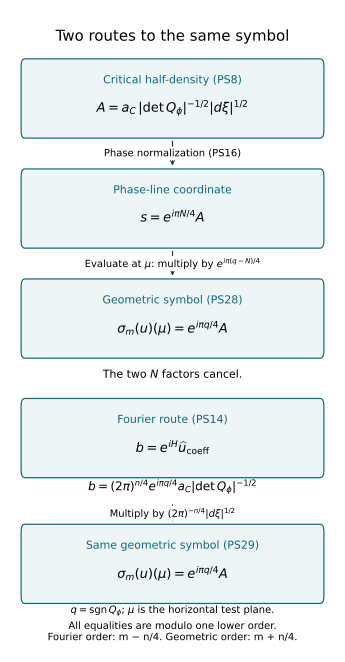

# The global principal symbol of a Lagrangian distribution

A local amplitude becomes a geometric symbol after its critical density
and phase transition have both been included. We construct that symbol,
prove its exact kernel, and realize every global symbol class. The proof
includes the support construction on a noncompact base manifold.

Original programme exposition and examples: GPT-6 Astra (OpenAI), Ultra,
4 October 2026; CC0 to the extent rights exist. Earlier components retain
their own licences.

## PS0. Statement and exact inputs

Let \(X\) be a Hausdorff second-countable smooth manifold of dimension
\(n\ge1\), let \(E\to X\) be a smooth finite-rank complex vector bundle,
and let \(\Lambda\subset T^*X\setminus0\) be a smooth **closed** conic
Lagrangian. Use \(\omega=\sum d\xi_j\wedge dx_j\), \(D=-i\partial\), and
\[
 u=I_\phi(a)|dx|^{1/2},\qquad
 I_\phi(a)=(2\pi)^{-(n+2N)/4}\int e^{i\phi(x,\theta)}a(x,\theta)\,d\theta .
 \tag{PS1}
\]
Coefficients take values in a local frame of \(E\). The integral has
the distributional meaning proved in F2. The intrinsic space \(I^m\)
uses the iterated \(B^{-m-n/4}_{2,\infty,\mathrm{loc}}\) condition of K6;
T3 proves its coordinate and frame invariance.

Let \(\mathscr L\) be the relative Maslov line in M5, with phase
coordinates as in M6, and put
\[
 \mathscr B=\Omega_\Lambda^{1/2}\otimes\mathscr L\otimes\pi^*E,
 \qquad M=m+n/4 .
 \tag{PS2}
\]
With the ordinary-symbol spaces defined in PS2 below, the theorem is
the exact sequence
\[
 \begin{gathered}
 0\longrightarrow I^{m-1}(X,\Lambda;E\otimes\Omega_X^{1/2})
 \longrightarrow I^m(X,\Lambda;E\otimes\Omega_X^{1/2})\\
 \xrightarrow{\ \sigma_m\ }
 S^M(\Lambda;\mathscr B)/S^{M-1}(\Lambda;\mathscr B)
 \longrightarrow0 .
 \end{gathered}
 \tag{PS3}
\]
All orders are real. A principal symbol here is a class modulo one
lower order; an ordinary symbol need not have a homogeneous leading term.

The complete earlier programme proofs are:

- [C0–C5](conic-frequency-coordinates.md): cotangent coordinates,
  frequency graphs, critical sets and inverse charts;
- [M0a–M7](relative-maslov-line.md): inertia, phase signatures,
  the relative line, its phase transitions and dilation;
- [F2–F7](prescribed-phase-representation.md): all ordinary stationary
  remainders, phase representation, support and the lower-order criterion;
- [T0–T3 and W1–W5](coordinate-and-wavefront-localization.md):
  distribution transport, wavefront and conic cutoffs;
- [K6–K7](conic-parametrices-and-localization.md): intrinsic localization,
  sufficiently small cutoffs and Lagrangian extension independence;
- [U001 A.4–A.6](../../20261004-free-stationary-phase/stationary-phase-and-critical-manifolds.md)
  and its exact earlier proofs: finite smooth bumps, quotient densities
  and compact integration; U001 P2–P4, P8, P13–P16 and P21.3–P21.4:
  matrix and smooth inverses, derivatives, roots, powers, exponentials
  and change of variables.

PS5 proves the global partition needed here. No global partition,
sheaf or phase-equivalence theorem is imported as a prerequisite.

## PS1. Critical density and coordinate changes

Fix a nondegenerate phase chart whose critical map
\(\kappa_\phi:C_\phi\to\Lambda\) is a diffeomorphism onto its conic
image. Put \(v=\phi_\theta'\). Extend coordinates
\(\lambda=(\lambda_1,\ldots,\lambda_n)\) of \(C_\phi\) to a neighborhood.
Then \((\lambda,v)\) is an inverse chart after shrinking: on
\(\ker dv=T C_\phi\), \(d\lambda\) is an isomorphism.
Define
\[
 d_\phi=
 \left|\det\frac{\partial(\lambda,v)}{\partial(x,\theta)}\right|^{-1}
 |d\lambda| \quad\text{on }v=0 .
 \tag{PS4}
\]
This is independent of the extension. Another extension of the same
critical coordinates has derivative
\(\begin{pmatrix}I&A\\0&I\end{pmatrix}\) in \((\lambda,v)\) at \(v=0\),
with determinant one. Replacing the critical coordinates by
\(\widetilde\lambda=h(\lambda)\) instead gives
\(\begin{pmatrix}Dh&A\\0&I\end{pmatrix}\).
The factor \(|\det Dh|^{-1}\) in (PS4) cancels
\(|d\widetilde\lambda|=|\det Dh||d\lambda|\).
Thus \(d_\phi\) is a positive density, and its positive square root
has the half-density overlap law. We also denote its image on
\(\Lambda\) under \(\kappa_\phi\) by \(d_\phi\).

For a joint base and degree-one fibre change, write
\[
 x=k(y),\quad \theta=\Theta(y,\eta),\quad K=D_yk,\quad T=D_\eta\Theta,
 \quad \widetilde\phi=\phi(k(y),\Theta(y,\eta)).
 \tag{PS5}
\]
The matrices \(K,T\) are invertible. On the critical set,
\(\widetilde v=T^Tv\) and \(d\widetilde v=T^Tdv\), since the term
involving \(dT\) is multiplied by \(v=0\).
The ambient Jacobian is \(\det K\det T\).
Using the same geometric \(\lambda\) on both critical sets gives
\[
 \left|\det\frac{\partial(\lambda,\widetilde v)}{\partial(y,\eta)}\right|
 =|\det K|\,|\det T|^2
 \left|\det\frac{\partial(\lambda,v)}{\partial(x,\theta)}\right|.
 \tag{PS6}
\]
Old-coordinate expressions are pulled back in this identity. Hence
\[
 \begin{gathered}
 d_{\widetilde\phi}=|\det K|^{-1}|\det T|^{-2}d_\phi,\qquad
 \widetilde a=|\det K|^{1/2}|\det T|\,a,\\
 \widetilde a\sqrt{d_{\widetilde\phi}}=a\sqrt{d_\phi}.
 \end{gathered}
 \tag{PS7}
\]
The amplitude law follows by fibre change of variables in (PS1) and
the base half-density law. Apply it first with compact frequency
cutoffs, then use F2's cutoff-independent limit. At the critical set
the extra base derivative of \(\Theta\) also vanishes because it
multiplies \(\phi_\theta'=0\); the output covector therefore obeys
the usual cotangent law. A change of \(E\) frame multiplies both
sides by the same matrix at the base point.

In frequency coordinates on \(\Lambda\), take
\(\lambda=\xi=\phi_x'\). Formula (PS4) then reads
\[
 Q_\phi=\begin{pmatrix}\phi_{xx}''&\phi_{x\theta}''\\
                 \phi_{\theta x}''&\phi_{\theta\theta}''\end{pmatrix},
 \qquad d_\phi=|\det Q_\phi|^{-1}|d\xi|.
 \tag{PS8}
\]
Here \(Q_\phi\) is the full Hessian at the unique critical point over
\(\xi\). It is nonsingular by F1, or M3 with horizontal test plane.

## PS2. Ordinary symbols with half-density values

In a conic frequency chart, a phase trivialization of \(\mathscr L\)
and a base frame of \(E\), write a section of \(\mathscr B\) as
\[
                         s=t(\xi)|d\xi|^{1/2}.
 \tag{PS9}
\]
It belongs to \(S^M\) when, on every compact normalized subchart,
\[
 |\partial_\xi^\alpha t(\xi)|
       \le C_\alpha|\xi|^{M-n/2-|\alpha|},\qquad |\xi|\ge1 .
 \tag{PS10}
\]
Estimates are local over compact base sets; no uniform geometry
or bound at base infinity is imposed. Bounded-frequency changes
belong to every order class. Equivalently these are germs at large
positive radial parameter, with no required behavior at the missing
zero section.

This definition is invariant. Two conic frequency charts are related
by a degree-one diffeomorphism \(\eta=h(\xi)\). On compact normalized
overlaps, \(|h(\xi)|\asymp|\xi|\) and
\(\partial^\alpha h\) has degree \(1-|\alpha|\).
The Jacobian half-density factor and its reciprocal have degree zero.
The base point has degree zero, so pulled-back frame matrices have
the same degree-zero derivative estimates. Maslov transitions are
locally constant by M6. In an iterated chain-rule term involving
\(j\) derivatives of \(t\), the total order is
\[
 (M-n/2-j)+(j-|\alpha|)=M-n/2-|\alpha|.
 \tag{PS11}
\]
Product differentiation of the degree-zero factors preserves this
bound. The inverse chart gives the converse. Compact normalized
sets have finite subcovers, so a finite maximum bounds all constants.

For a degree-one phase the unscaled full Hessian satisfies
\[
 Q_\phi(x,r\theta)
 =r\,\operatorname{diag}(I_n,r^{-1}I_N)\,
 Q_\phi(x,\theta)\,\operatorname{diag}(I_n,r^{-1}I_N).
 \tag{PS12}
\]
Thus its determinant has degree \(n-N\).
More generally (PS4), using degree-one critical coordinates,
has the same degree: the output weights of \((\lambda,v)\)
are \(n\) ones and \(N\) zeros, while the input dilation
Jacobian has weight \(N\). The density \(d_\phi\) has total
dilation weight \(N\), and its coefficient relative to
\(|d\xi|\) has degree \(N-n\).

Restriction of an amplitude to \(C_\phi\) retains its ordinary
order: \(x(\xi)\) has degree zero and \(\theta(\xi)\) degree one.
In every chain-rule term a frequency derivative of the amplitude
costs one order, compensated by the degree-one part of derivatives
of \(\theta\); derivatives of \(x\) have only their negative derivative
degree. This proves all estimates, using
\(|\theta|\asymp|\xi|\) on compact normalized subcharts.
Consequently
\[
 \begin{gathered}
 \mu=m+n/4-N/2,\qquad
 a\sqrt{d_\phi}=t_\phi(\xi)|d\xi|^{1/2},\\
 t_\phi\in S^{\,\mu+(N-n)/2}=S^{m-n/4},\qquad
 a\sqrt{d_\phi}\in S^{m+n/4}.
 \end{gathered}
 \tag{PS13}
\]
Degree-zero smooth cutoffs preserve these spaces. So do sums with
only finitely many terms above each compact base set: every
seminorm is bounded by a finite sum. PS5 constructs such cutoffs.

## PS3. Fourier testing and the local symbol

Write \(\Lambda=\{(H'(\xi),\xi)\}\) and use the small compact
normalized amplitude supports of F3. Put \(q_\phi=\operatorname{sgn}Q_\phi\).
The nondegenerate case of F3 gives
\[
 e^{iH}\widehat{I_\phi(a)}
 =(2\pi)^{n/4}e^{i\pi q_\phi/4}
        a|_{C_\phi}|\det Q_\phi|^{-1/2}
                      \pmod{S^{m-n/4-1}} .
 \tag{PS14}
\]
The Hessian here is unscaled at frequency \(\xi\); (PS12) absorbs
F3's factor \(|\xi|^{(N-n)/2}\). Every further term and differentiated
remainder is supplied by F3, without convergence of a formal series.

Compare two phase representations of the same distribution
microlocally near a point of \(\Lambda\). Transform both into a
common base frequency chart using PS1, and localize their amplitudes
to smaller critical neighborhoods, with cutoffs one near the point.
F2 shows that discarded parts have no wavefront there. On a smaller
angular cone the only possible wavefront base point of either
remaining integral is \(H'(\xi)\). Their difference has no wavefront
there by microlocal equality, and hence nowhere over that cone.
The distributions have compact base support. The finite base-cover
and convolution-cutoff proof in F6 shows that their Fourier
difference is rapidly decreasing there with all derivatives.
Multiplication by \(e^{iH}\) preserves this property.
Their expressions (PS14) therefore agree modulo the stated lower order.

Let \(c_j=\operatorname{sgn}\phi_{j,\theta\theta}''\).
M3 gives \(q_j=c_j-\tau\) with the same \(\tau\) for the common
horizontal test plane. The preceding equality gives
\[
 a_j\sqrt{d_{\phi_j}}
 =e^{i\pi(c_k-c_j)/4}a_k\sqrt{d_{\phi_k}}\pmod{S^{M-1}} .
 \tag{PS15}
\]
Define the phase coordinate of the principal symbol by
\[
                    s_j=e^{i\pi N_j/4}a_j\sqrt{d_{\phi_j}}.
 \tag{PS16}
\]
Then
\[
 s_j=i^{a_{jk}}s_k\pmod{S^{M-1}},\qquad
 a_{jk}=\frac{(c_k-N_k)-(c_j-N_j)}2 .
 \tag{PS17}
\]
These are precisely M6's phase transitions. The factor depending on
\(N_j\) is part of this fourth-root normalization. Together with PS1
this proves invariance under phase, base coordinates and bundle frame.

Every intrinsic \(u\in I^m\) has these local representatives.
Choose a sufficiently small proper conic cutoff with full symbol one
near the point; K7 and F6 represent its output in any prescribed
nondegenerate phase modulo a smooth remainder. W4 says that this
output differs microlocally smoothly from \(u\). The comparison above
proves independence of cutoff, representative and smooth remainder.
Representing summands in the same phase also proves linearity.

The local kernel is exact:
\[
 \begin{gathered}
 s_j\in S^{M-1}
 \ \Longleftrightarrow\
 e^{iH}\widehat{I_{\phi_j}(a_j)}\in S^{m-n/4-1}\\
 \Longleftrightarrow\
 I_{\phi_j}(a_j)\in I^{m-1}\quad\text{microlocally}.
 \end{gathered}
 \tag{PS18}
\]
The first equivalence uses the nonzero leading weight and the
one-order remainder in F3. The second is F6a–F7, already proved
in both directions. Conversely an \(I^{m-1}\) representation
has its amplitude order reduced by one and hence its symbol
order reduced by one in (PS13). These arguments work in every
component of \(E\).

## PS4. Extending a local symbol to an amplitude

Suppose \(s=t(\xi)|d\xi|^{1/2}\) is supported in a compact normalized
subset of one sufficiently small phase chart. Prescribe
\[
 a_C(\xi)=e^{-i\pi N/4}\,t(\xi)|\det Q_\phi(\xi)|^{1/2}.
 \tag{PS19}
\]
It has order \(m+n/4-N/2\), by (PS12).
Here is a same-order smooth extension with the needed support.
F4 proves that
\[
 (x,\theta)\longmapsto(\xi,v)
                    =(\phi_x'(x,\theta),\phi_\theta'(x,\theta))
 \tag{PS20}
\]
is an inverse chart near \(C_\phi\), with weights \(1,0\).
Refine the compact normalized support finitely if necessary.
Choose a small product angular/normal box inside this chart.
Multiply \(a_C(\xi)\) by a compact normal cutoff \(\eta(v)\)
equal to one near zero, an angular cutoff one near its prescribed
support, and a high-frequency cutoff. Pull back by (PS20)
and extend by zero. Strictly interior supports make that extension
smooth. By continuity on the compact critical support, the
normal box can be chosen so its compact base projection lies
inside any prescribed base neighborhood of that support.

Derivatives of \(v\) have degree \(-1\) in frequency and zero
in the base. Derivatives of \(\xi\) have degree zero in frequency
and one in the base. Each degree-one base factor compensates
the loss from differentiating \(a_C\) in \(\xi\); every frequency
derivative has one net order loss. Repeated chain and product
rules give all ordinary symbol estimates, since
\(|\xi|\asymp|\theta|\). The low-frequency change has all negative
orders. This proves the extension claim in full.

F6 puts the integral in \(I^m\), and (PS16) gives its requested
symbol modulo \(S^{M-1}\). F2 confines its wavefront to the
chosen critical support: away from the original angular support,
the extension vanishes on a full neighborhood of critical points.
Different extensions or phase choices with the same symbol differ
by \(I^{m-1}\) locally. Their difference is in \(I^m\), has zero
symbol by PS3's comparison and linearity, and (PS18) applies.
This is the local right inverse with its exact ambiguity and support.

## PS5. A partition with locally finite base supports

First construct a countable precompact coordinate-ball cover
\(B_1,B_2,\ldots\) of \(X\). At each point, nested Euclidean
balls in a chart provide such neighborhoods, with compact closed
smaller balls. Their images are closed because \(X\) is Hausdorff.
A countable basis reduces this cover to a countable subcover:
for each basis element contained in a cover member choose one
such member; every point belongs to a choice.

There is a compact exhaustion
\[
 K_j\subset\operatorname{int}K_{j+1},\qquad
 X=\bigcup_{j\ge1}\operatorname{int}K_j .
 \tag{PS21}
\]
Recursively cover the compact union of \(K_j\) and
\(\overline B_1,\ldots,\overline B_{j+1}\) by finitely many
precompact open balls, and take their closed union as \(K_{j+1}\).
Start with a finite such cover of \(\overline B_1\).
This proves compactness, the interior inclusion and exhaustion.
Every compact set lies in some \(\operatorname{int}K_J\):
a finite subcover of these nested open sets has a largest index.

Put \(K_0=K_{-1}=\varnothing\). The compact layer
\(K_j\setminus\operatorname{int}K_{j-1}\) lies in
\(\operatorname{int}K_{j+1}\setminus K_{j-2}\).
Cover it by finitely many small balls, each with two larger
precompact balls inside that open set and a chart trivializing
\(E\). Call the largest balls \(O_i\), using one index over all
layers. This family is locally finite: a compact set in \(K_J\)
meets no layer balls with \(j\ge J+2\), and the earlier layers
contain finitely many balls. The small balls cover \(X\),
because every point belongs to a first layer in the exhaustion.

U001 A.4 supplies nonnegative \(h_i\), positive on the small
ball and supported in the middle ball. Their locally finite
sum \(h\) is positive and smooth; its reciprocal is smooth.
Thus
\[
 \psi_i=h_i/h,\qquad \sum_i\psi_i=1,\qquad
                         \operatorname{supp}\psi_i\Subset O_i .
 \tag{PS22}
\]
This proves the required base partition, rather than assuming it.

Let \(|\xi|_i^2\) be the Euclidean covector norm in the chart
of \(O_i\), and define
\[
                    \rho(x,\xi)^2=\sum_i\psi_i(x)|\xi|_i^2 .
 \tag{PS23}
\]
Each term extends smoothly by zero; the locally finite sum is
positive away from the zero section. Its positive square root
is smooth there and homogeneous of degree one.
The radial derivative of \(\rho\) equals \(\rho\); the implicit
theorem therefore makes
\(\Sigma=\Lambda\cap\{\rho=1\}\) a smooth \((n-1)\)-manifold.
There is an explicit diffeomorphism
\[
 \Sigma\times(0,\infty)\longrightarrow\Lambda,\qquad
 (\lambda,r)\longmapsto r\lambda,\qquad
 (x,\xi)\longmapsto((x,\xi/\rho),\rho)
 \quad\text{for its inverse}.
 \tag{PS24}
\]
For each compact \(K\subset X\), the set
\(\Sigma_K=\Sigma\cap\pi^{-1}K\) is compact.
Cover \(K\) by finitely many smaller coordinate neighborhoods
with compact closures in larger charts. On each closure, the
continuous positive quadratic form (PS23) has a positive
minimum and a finite maximum on the Euclidean unit sphere.
Thus \(\rho=1\) bounds the covector above and away from zero.
The points lie in finitely many compact base-times-annulus sets.
In each, intersect with \(\pi^{-1}K\), \(\rho=1\), and the
closed subset \(\Lambda\) of the punctured cotangent bundle.
The resulting sets are compact and their finite union is
\(\Sigma_K\). This is the use of closedness of \(\Lambda\).

For each \(i\), cover \(\Sigma_{\operatorname{supp}\psi_i}\)
by finitely many small normalized phase charts, with compact
closures in larger phase charts and base projections in \(O_i\).
C3 may change base coordinates within \(O_i\). Refine sufficiently
for the product construction of PS4. Nonnegative chart bumps
\(\beta_{ij}\) supported in the larger charts can be chosen so
\(B_i=\sum_j\beta_{ij}>0\) near that compact set.
Choose a compact smooth \(\zeta_i\), supported in \(\{B_i>0\}\)
and one near the compact set, using finitely many bumps and
U001 A.4. On \(\Sigma\) define \(\chi_{ij}=0\) where \(B_i=0\).
Where \(B_i>0\), use the first formula below. These functions
satisfy the displayed partition identity on all of \(\Sigma\):
\[
 \begin{gathered}
 \chi_{ij}=(\psi_i\circ\pi)\zeta_i\beta_{ij}/B_i,\\
 \sum_{i,j}\chi_{ij}=1 .
 \end{gathered}
 \tag{PS25}
\]
The support of \(\zeta_i\) proves smoothness at \(B_i=0\).
Where \(\psi_i\circ\pi\ne0\), \(\zeta_i=1\), so summing in
\(j\) gives \(\psi_i\circ\pi\), and then summing in \(i\) gives
one. An empty compact set contributes no terms.
Extend homogeneously by (PS24). Each normalized support is
compactly inside one phase chart. There are finitely many
\(j\)'s per \(i\), and PS4's amplitude base supports can be
chosen compactly inside \(O_i\). They are therefore locally
finite in the base. Local finiteness on \(\Lambda\) alone
would not have proved this last property.

## PS6. Global gluing, surjectivity and the kernel

For \(u\in I^m\), take its local symbol representatives \(s_{ij}\)
on the phase charts from PS5. They are genuine local sections
of \(\mathscr B\), whose differences on overlaps lie in \(S^{M-1}\).
The sum
\[
                         s=\sum_{i,j}\chi_{ij}s_{ij}
 \tag{PS26}
\]
is a global section of \(S^M\): terms extend by zero at their
normalized chart boundaries, and there are finitely many above
each compact base set. In a selected chart subtract a local
representative \(s_0\). The identity \(\sum\chi_{ij}=1\) leaves
the locally finite sum \(\sum\chi_{ij}(s_{ij}-s_0)\), in
\(S^{M-1}\). Finite normalized covers give estimates over each
compact base set. Thus (PS26) represents all the local classes.
The same argument for another choice of representatives or
partition proves independence modulo \(S^{M-1}\).
This defines the global linear map \(\sigma_m(u)=[s]\).

For surjectivity, split an arbitrary \(s\in S^M\) into
\(\chi_{ij}s\). PS4 extends each summand to an amplitude
supported in its phase chart, with compact base support in
\(O_i\). A bounded-frequency cutoff changes its symbol only
by \(S^{M-1}\). Extend the resulting half-density \(u_{ij}\)
by zero to \(X\); its base support is strictly inside its
coordinate domain. F6 proves intrinsic order \(m\) near its
critical image. F2 confines its wavefront to that image,
contained in \(\Lambda\); elsewhere it is microlocally smooth.
K6, using sufficiently small tests and K7 where a graph
extension was introduced, gives \(u_{ij}\in I^m(X,\Lambda)\).
Its global symbol is \(\chi_{ij}s\) modulo lower order;
outside its critical support both local symbol classes vanish.

The sum
\[
                           u=\sum_{i,j}u_{ij}
 \tag{PS27}
\]
defines a distribution because every compact test support
meets only finitely many \(O_i\)'s. It belongs to \(I^m\).
Indeed a compact proper conic cutoff \(P\) has a compact
input projection, so \(Pu\) is a finite sum of \(Pu_{ij}\).
Each term is in \(I^m\) by K6. Such cutoffs exist elliptic
at every nonzero covector, so K6's converse gives \(u\in I^m\).
Local linearity yields
\(\sigma_m(u)=\sum\chi_{ij}[s]=[s]\), proving surjectivity.

If \(\sigma_m(u)=0\), PS18 gives intrinsic order \(m-1\)
microlocally at every point of \(\Lambda\). Outside \(\Lambda\),
K6's wavefront containment makes \(u\) microlocally smooth.
Choose sufficiently small compact proper tests at every
covector and apply K6's converse at order \(m-1\).
This proves \(u\in I^{m-1}\) globally.
The reverse inclusion follows from local amplitude representation
at order \(m-1\) and (PS13). The left map in (PS3) is inclusion;
\(I^{m-1}\subset I^m\) follows by the dyadic order inclusion
of P1, applied to every admissible word. This proves (PS3).
\(\square\)

Combining (PS16) with the explicit geometric isomorphism M22
gives evaluation at a common transversal \(\mu\):
\[
 \sigma_m(u)(\mu)=e^{i\pi q_\phi(\mu)/4}a\sqrt{d_\phi}
                                  \pmod{S^{M-1}} .
 \tag{PS28}
\]
The half-density and \(E\) factors remain unchanged. The two
\(N\) factors cancel. In a frequency chart with horizontal
test plane, (PS14) therefore gives
\[
 \sigma_m(u)(\mu)=(2\pi)^{-n/4}
       e^{iH(\xi)}\widehat u_{\rm coeff}(\xi)|d\xi|^{1/2}
                                  \pmod{S^{M-1}} .
 \tag{PS29}
\]
The coefficient is a sufficiently small compactly localized
representative as in PS3. This is a local test interpretation,
not a global Fourier transform on an arbitrary manifold.

*Figure PS1.* These are the exact maps of PS1–PS3 and PS28–PS29,
modulo one lower order. The two \(N\) factors cancel on the
phase-line route. The Fourier coefficient has order \(m-n/4\);
its half-density has geometric order \(m+n/4\).
The diagram depicts maps, not a spatial projection.

## PS7. Three examples with complete solutions

**Exercise PS1: both Jacobians matter.** Start with
\(\phi(x,\theta)=x\theta\) and make \(x=cy,\theta=d\eta\),
where \(c,d>0\). Compute the density and symbol,
including the output frequency \(\zeta=cd\eta\).

**Solution.** Initially \(v=x\), \(C_\phi=\{x=0\}\), and
\(d_\phi=|d\theta|\). The transformed phase is \(cdy\eta\)
and its critical equation is \(cd\,y=0\). Hence
\[
 d_{\widetilde\phi}=(cd)^{-1}|d\eta|,\qquad
                  \widetilde a=c^{1/2}d\,a(0,d\eta).
 \tag{PS30}
\]
Their product is \(d^{1/2}a(0,d\eta)|d\eta|^{1/2}\), exactly
the pullback of \(a(0,\theta)|d\theta|^{1/2}\).
In \(\zeta\) it is
\(c^{-1/2}a(0,\zeta/c)|d\zeta|^{1/2}\).
Both phases have \(N=1\), so the common factor \(e^{i\pi/4}\)
in (PS16) preserves equality. Omitting one fibre determinant
factor from (PS6) would fail this calculation. \(\square\)

**Exercise PS2: stabilization.** On \(\theta>0\), replace
\(x\theta\) by \(x\theta+\epsilon z^2/(2\theta)\), \(\epsilon=\pm1\).
Find the leading new amplitude representing the symbol of
an old amplitude \(a_0(\theta)\).

**Solution.** At \(x=z=0\), the output is \(\xi=\theta\), and
\[
 Q_{\widetilde\phi}=
 \begin{pmatrix}0&1&0\\1&0&0\\0&0&\epsilon/\theta\end{pmatrix},
 \quad |\det Q_{\widetilde\phi}|=\theta^{-1},\quad
 q_{\widetilde\phi}=\epsilon .
 \tag{PS31}
\]
Thus \(d_{\widetilde\phi}=\theta|d\theta|\).
Formula (PS14) gives the old leading coefficient when
\[
       \widetilde a_C=e^{-i\pi\epsilon/4}\theta^{-1/2}a_0.
 \tag{PS32}
\]
PS4 supplies such an amplitude. Its order is one half lower,
as required when \(N\) increases by one.
The old phase symbol is
\(e^{i\pi/4}a_0|d\theta|^{1/2}\); the new is
\(e^{i\pi(2-\epsilon)/4}a_0|d\theta|^{1/2}\).
The ratio is \(e^{i\pi(\epsilon-1)/4}\), equal to \(1\)
for the positive square and \(-i\) for the negative square,
exactly M6's transition. Geometric evaluation (PS28) gives
\(a_0|d\theta|^{1/2}\) in both descriptions.
The distributions agree modulo \(I^{m-1}\); agreement to
all orders requires F5's further amplitude correction. \(\square\)

**Exercise PS3: the point mass.** For \(X=\mathbb R\) and
\(\Lambda=\{(0,\xi):\xi\ne0\}\), compute the principal symbol
and intrinsic order of \(\delta_0|dx|^{1/2}\).

**Solution.** Fourier inversion gives
\(\delta_0=(2\pi)^{-1}\int e^{ix\theta}\,d\theta\) in distributions.
For \(n=N=1\), (PS1) therefore uses \(a=(2\pi)^{-1/4}\).
Cutting off near zero frequency changes only a smooth function.
Use the two half-lines separately if a connected phase cone
is desired. The amplitude order zero equals \(m-1/4\),
so \(m=1/4\), and
\[
 \begin{gathered}
 s=e^{i\pi/4}(2\pi)^{-1/4}|d\xi|^{1/2},\\
 M=1/2 .
 \end{gathered}
 \tag{PS33}
\]
Its coefficient has order \(M-n/2=0\).
Here \(c=0,N=1\), so M7's constant-intersection
trivialization multiplies by \(e^{-i\pi/4}\), giving the
geometric half-density \((2\pi)^{-1/4}|d\xi|^{1/2}\).
Equivalently use \(H=0,\widehat{\delta_0}=1\) in (PS29).
This symbol is not in \(S^{M-1}\) on either ray, so the exact
sequence also gives \(\delta_0\notin I^{-3/4}(\Lambda)\).
\(\square\)

## Free human source and scope

The freely readable source is Lars Hörmander,
[*Fourier integral operators. I*](https://projecteuclid.org/journals/acta-mathematica/volume-127/issue-none/Fourier-integral-operators-I/10.1007/BF02392052.pdf),
Section 3.2, printed pages 142–154: critical densities, phase
normalization and the global symbol construction.
The internal proof uses the already proved ordinary Fourier-testing
argument; the global support construction is supplied in PS5–PS6.
No source prose, figure, PDF, phase-equivalence proof or cohomology
argument is imported.

The theorem concerns ordinary symbols on a closed embedded conic
Lagrangian, finite-rank bundle values, all real orders and local
estimates on an arbitrary such base manifold. It does not choose
a natural global trivialization of the Maslov line.
The tangent lesson still needs its Gaussian-model identification
and convention reconciliation. Fourier-integral composition
and the remaining AN-04 course are separate obligations.

