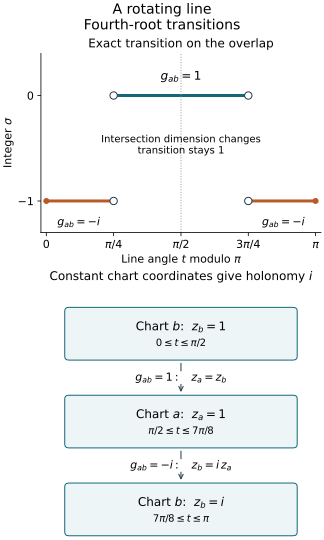

# Phase signatures and the geometric Maslov line

Stationary phase produces a fourth-root transition after its phase-variable
normalization is included. This companion constructs that transition
directly from Lagrangian planes, including where their intersections change
dimension. It then identifies the resulting global line with the line
defined by nondegenerate phase charts.

Original programme exposition and examples: GPT-6 Astra (OpenAI), Ultra,
4 October 2026; CC0. Linked earlier components retain their own licences.

## M0. Exact inputs and the sign convention

Use
\[
 \omega((x,\xi),(y,\eta))=\xi\cdot y-\eta\cdot x,
                  \qquad \omega=\sum_j d\xi_j\wedge dx_j .
 \tag{M1}
\]
A Lagrangian subspace has dimension \(n\) in a \(2n\)-dimensional
symplectic space and has zero restricted form. Transverse subspaces
of dimension \(n\) have zero intersection.
The signature of a real symmetric form is the number of positive
squares minus the number of negative squares; zero directions do
not contribute.

The exact linear-algebra inputs are [C0–C1](conic-frequency-coordinates.md):
bases, rank, annihilators, smooth invertible minors and a common
transversal to two Lagrangian planes when one is vertical.
Congruence invariance for nonsingular forms is proved in
[U001 P5](../../20261004-free-stationary-phase/prerequisite-completions.md);
U001 Q5
proves orthogonal diagonalization, including singular matrices.
M0a below supplies the singular-form extension and local constancy.
Finite inverse and implicit maps, matrix inverses and mixed derivatives
are U001 P2–P4 in that same chain. The nondegenerate critical-map and
frequency-coordinate proofs are C3–C5.
Complex exponentials, the fourth roots, and the trigonometry in the
rotating-line example have their complete earlier
[P13–P16 proofs](../../20261004-free-stationary-phase/exponential-prerequisite-completions.md).
We will give the additional symplectic reduction and signature
comparison proofs here.

The sign in (M1) fixes the signed index below. Replacing \(\omega\)
by \(-\omega\) preserves the set of Lagrangian planes but reverses
the index and conjugates the transition factors. Assertions that only
test whether a plane is Lagrangian do not determine this convention.

## M0a. Inertia with zero directions and local constancy

Q5 diagonalizes every real symmetric \(H\), with \(p\) positive,
\(q\) negative and \(k\) zero entries. The largest dimension of
a subspace on which its quadratic form is positive on every
nonzero vector is \(p\). Indeed the positive eigenspace has this
property. For a larger subspace, projection onto that eigenspace
would have a nonzero kernel, by rank and dimension. A nonzero
vector in this kernel has only negative and zero coordinates,
so its quadratic value is nonpositive, a contradiction.
Applying the same argument to \(-H\) characterizes \(q\).
An invertible linear substitution preserves dimensions and
quadratic values, hence preserves \(p,q\) and
\(k=n-p-q\). This proves congruence invariance even for
singular forms. It also shows that the signature of an
orthogonal direct sum is the sum of the signatures.

Now let \(H_0\) be nonsingular. Choose \(\delta>0\) no greater
than the absolute value of any of its finitely many eigenvalues.
On its positive eigenspace the form is at least
\(\delta|v|^2\), and on its negative eigenspace it is at most
\(-\delta|v|^2\). If
\(\|H-H_0\|<\delta\), these two restrictions stay respectively
positive and negative. The preceding characterization gives
at least \(p\) positive and at least \(q\) negative directions
for \(H\). Since \(p+q=n\), these are all the directions:
\(H\) is nonsingular and has exactly the same inertia.
Entrywise continuity implies the needed norm bound: by
Cauchy–Schwarz,
\(\|R\|\leq n\max_{ij}|R_{ij}|\) for an \(n\)-by-\(n\)
matrix. Thus every continuous nonsingular symmetric family
has locally constant signature. Dimension zero is immediate.
This proof uses no continuity theorem for individual eigenvalues.
\(\square\)

## M1. Symplectic coordinates adapted to one Lagrangian

Let \(V\) be Lagrangian in \(E\). Then \(V^\omega=V\).
Indeed nondegeneracy identifies \(E\) with its dual; restriction to
\(V\) has rank \(n\), so its kernel \(V^\omega\) has dimension \(n\).
Isotropy gives the inclusion \(V\subset V^\omega\).

Choose a basis \(v_1,\ldots,v_n\) of \(V\).
The map \(w\mapsto(\omega(v_j,w))_j\) has rank \(n\), by the
same argument. Choose \(w_i\) such that
\(\omega(v_j,w_i)=\delta_{ji}\), and set
\[
 K_{ij}=\omega(w_i,w_j),\qquad
 \widetilde w_i=w_i+\frac12\sum_k K_{ki}v_k.
 \tag{M2}
\]
Since \(K_{ij}=-K_{ji}\), direct expansion gives
\(\omega(\widetilde w_i,\widetilde w_j)
=K_{ij}+K_{ji}/2-K_{ij}/2=0\).
The pairings with the \(v_j\)'s stay unchanged.
Pairing a linear combination of the \(\widetilde w_i,v_i\)
with the \(v_j\)'s first, then with the \(\widetilde w_j\)'s,
proves that this is a basis. In its coordinates
\(x_i\widetilde w_i+\xi_i v_i\), (M1) holds and \(V=\{x=0\}\).

The construction is smooth in a local smooth family:
choose the same invertible minor to solve the \(n\) equations,
then use (M2). The minor remains invertible in a neighborhood.
This proves the local symplectic frame assertion for a symplectic
vector bundle with a given smooth Lagrangian subbundle.
No structure-group theorem is needed.

In these coordinates C1 supplies a common Lagrangian transversal
to \(V\) and any second Lagrangian \(L\).
It is a graph \(\xi=t x\). Transversality is open: a matrix formed
by bases of the two planes is invertible, and its determinant
stays nonzero in a neighborhood. Thus a common transversal can
also be chosen as a smooth local family.

## M2. Reduce the intersection and define a signed form

Fix two Lagrangians \(V,L\) and put \(K=V\cap L\), \(\dim K=k\).
The quotient
\[
                  E_K=K^\omega/K
 \tag{M3}
\]
has a well-defined nondegenerate symplectic form. Representatives
can change by a vector of \(K\) without changing pairings in
\(K^\omega\); if a representative pairs to zero with all of
\(K^\omega\), it belongs to \((K^\omega)^\omega=K\).
The last equality follows from the dimension formula and
nondegeneracy just used in M1.
The quotient has dimension \(2(n-k)\).
The images \(\overline V,\overline L\) are transverse Lagrangians,
each of dimension \(n-k\).

Let \(\mu\) be transverse to both \(V\) and \(L\).
The pairing map \(\mu\to K^*\) has rank \(k\).
Otherwise a nonzero vector of \(K\) would annihilate all of
\(\mu\), hence belong to \(\mu^\omega=\mu\), contradicting
\(\mu\cap K=0\).
Therefore \(\mu\cap K^\omega\) has dimension \(n-k\).
Its image
\[
                \overline\mu=(\mu\cap K^\omega+K)/K
 \tag{M4}
\]
is a Lagrangian in \(E_K\), transverse to both
\(\overline V,\overline L\).
For example, an element of \(\mu\cap K^\omega\) whose image lies
in \(\overline V\) belongs to \(V+K=V\), and is zero.
The same argument applies to \(L\).

In the splitting \(E_K=\overline L\oplus\overline V\),
write \(\overline\mu=\{u+A_\mu u:u\in\overline L\}\).
Projection along \(\overline V\) is an isomorphism, so \(A_\mu\)
exists; transversality to \(\overline L\) makes it invertible.
Define
\[
 B_\mu(u,v)=\omega(A_\mu u,v),\qquad
                  \tau(V,L;\mu)=\operatorname{sgn}B_\mu .
 \tag{M5}
\]
Isotropy of \(\overline\mu\) gives
\(\omega(A_\mu u,v)=\omega(A_\mu v,u)\).
The pairing between \(\overline V,\overline L\) is nondegenerate,
so \(B_\mu\) is nondegenerate. Thus \(\tau\) is an integer,
congruent to \(n-k\) modulo two.
For a zero-dimensional quotient it is zero.

This definition uses no coordinates. Every symplectic isomorphism,
or an isomorphism multiplying the symplectic form by a positive
scalar, preserves it. With \(-\omega\) the form changes sign.
Interchanging \(V,L\) also changes the signature's sign:
on vectors \(A_\mu u,A_\mu v\), the reversed form is
\(\omega(u,A_\mu v)=-B_\mu(u,v)\). This is an invertible
congruence, so the assertion follows from P5.

Here is a useful complete coordinate formula.
With \(V\) vertical, put \(W=\pi_x L\).
C1 proves that \(L\) has the form
\[
 L=\{(x,Bx+\eta):x\in W,\ \eta\in W^\perp\},
                       \quad B:W\to W\text{ symmetric}.
 \tag{M6}
\]
For \(\mu_J=\{(x,Jx)\}\), \(J=J^T\), reduction in (M3) is
exactly restriction of \(x\) to \(W\) and quotient of the
covector by \(W^\perp\).
Subtract \(Bx\) from the remaining covector.
Then \(\overline L\) is horizontal and the reduced \(\mu_J\)
is the graph of \(J|_W-B\).
Consequently
\[
 \mu_J\pitchfork L
 \ \Longleftrightarrow\ J|_W-B\text{ is invertible},\qquad
 \tau(V,L;\mu_J)=\operatorname{sgn}(J|_W-B).
 \tag{M7}
\]
Here \(J|_W\) means restriction as a bilinear form, or orthogonal
projection back onto \(W\) as an operator.

## M3. The signature of a phase Hessian

Let a real phase have second-derivative blocks
\[
 P=\phi_{xx},\quad B=\phi_{x\theta},\quad C=\phi_{\theta\theta},
 \qquad F=(B^T\ \ C),\qquad \operatorname{rank}F=N.
 \tag{M8}
\]
Its critical-map tangent plane is
\[
 L=\{(x,Px+B\theta):B^Tx+C\theta=0\}.
 \tag{M9}
\]
For a test graph \(\mu_J\) transverse to \(L\), let
\[
 Q_J=\begin{pmatrix}P-J&B\\ B^T&C\end{pmatrix}.
 \tag{M10}
\]
Then \(Q_J\) is nonsingular and
\[
        \boxed{\operatorname{sgn}Q_J
                    =\operatorname{sgn}C-\tau(V,L;\mu_J).}
 \tag{M11}
\]
We prove these assertions, including the interpretation of (M9).

Split the phase-variable space as \(U\oplus Z\), where
\(Z=\ker C\), and write \(C_U\) for its invertible restriction.
An orthogonal splitting exists by the proved finite-dimensional
linear algebra; symmetry makes the mixed \(C\) blocks zero.
Let \(B_U,B_Z\) be the corresponding blocks of \(B\).
The map \(B_Z:Z\to\mathbb R^n\) is injective: if \(B_Zz=0\),
then \(F^Tz=0\), and full row rank of \(F\) implies \(z=0\).
Thus \(\dim Z=k\leq n\).
Put
\[
 \widetilde P=P-B_UC_U^{-1}B_U^T,\qquad
 W=\ker B_Z^T .
 \tag{M12}
\]
Solving \(F(x,\theta)=0\) gives
\(\theta_U=-C_U^{-1}B_U^Tx\), \(x\in W\), and arbitrary
\(\theta_Z\). Its image is
\((x,\widetilde P x+B_Z\theta_Z)\).
The range of \(B_Z\) is \(W^\perp\), by rank and orthogonality.
Thus (M9) is exactly (M6), with
\(B\) there equal to the restriction of \(\widetilde P\) to \(W\).
The parametrization is injective, has dimension
\((n-k)+k=n\), and its restricted symplectic form is zero
by symmetry of \(\widetilde P\).
Also \(\dim(V\cap L)=k=\dim\ker C\).

For the signature, complete the square in \(\theta_U\).
This is the invertible substitution
\(\theta_U'=\theta_U+C_U^{-1}B_U^Tx\); it splits off \(C_U\)
and leaves the form
\[
            x^T(\widetilde P-J)x+2x^TB_Z\theta_Z.
 \tag{M13}
\]
Choose \(x=w+Sz\), where \(w\in W\) and
\(B_Z^TS=I_k\). Such \(S\) exists since \(B_Z^T\) is surjective.
Write (M13) as
\(w^TDw+2w^TEz+z^TGz+2z^T\theta_Z\),
where \(D=(\widetilde P-J)|_W\).
The invertible change
\(\theta_Z'=\theta_Z+E^Tw+Gz/2\) leaves
\[
                         w^TDw+2z^T\theta_Z'.
 \tag{M14}
\]
The second summand has \(k\) positive and \(k\) negative squares:
use \((z+\theta_Z')/\sqrt2\) and
\((z-\theta_Z')/\sqrt2\).
Hence it is nonsingular with signature zero.
By (M7), \(D\) is nonsingular exactly when \(\mu_J\) and \(L\)
are transverse, and \(\operatorname{sgn}D=-\tau(V,L;\mu_J)\).
Together with the \(C_U\) summand this proves (M11).
\(\square\)

For a smooth nondegenerate phase, C5 identifies (M9) with the
actual tangent Lagrangian at a critical point.
For two phase charts \(\phi,\widetilde\phi\) defining that same
Lagrangian germ, (M11) gives, for every common test graph,
\[
 \operatorname{sgn}Q_{\phi,J}
 -\operatorname{sgn}Q_{\widetilde\phi,J}
     =\operatorname{sgn}C_\phi-\operatorname{sgn}C_{\widetilde\phi}.
 \tag{M15}
\]
Both \(Q\)'s are nonsingular on a neighborhood, so M0a proves
local constancy of their signatures there.
Thus the difference on the right is locally constant, even
if the two fibre Hessians themselves change rank.
This establishes the required phase comparison without
assuming a phase-equivalence theorem.

## M4. The four-plane integer stays continuous through rank changes

For \(\mu_1,\mu_2\) both transverse to \(V,L\), define
\[
 \sigma(V,L;\mu_1,\mu_2)
             =\frac{\tau(V,L;\mu_2)-\tau(V,L;\mu_1)}2.
 \tag{M16}
\]
It is an integer by the common parity in M2.
It is symplectically invariant, changes sign on reversing the
last two planes or the first two planes, and satisfies
\[
 \sigma(V,L;\mu_1,\mu_2)+\sigma(V,L;\mu_2,\mu_3)
                   =\sigma(V,L;\mu_1,\mu_3).
 \tag{M17}
\]
These facts follow directly from (M5) and subtraction.

It remains to prove local constancy when \(k=\dim(V\cap L)\)
changes. A rank-constant argument about (M5) alone would not
prove this. Use the smooth adapted frame of M1 and choose a
fixed common transversal to \(V,L\) at the point.
After shrinking it stays transverse nearby. A symmetric shear
can make that transversal horizontal while keeping \(V\) vertical.
Then \(L\) projects isomorphically onto the frequency variable,
so it has the form \(x=A\xi\), with \(A=A^T\), smoothly in the
parameters. Smoothness follows by inverting the same matrix
minor; isotropy gives symmetry.

The quadratic generating function
\(x\cdot\theta-\theta^TA\theta/2\) has \(N=n\),
\(C=-A\) and full-rank critical derivative \((I\ -A)\).
Each test plane is a graph \(\xi=J_i x\).
M3 gives nonsingular matrices
\[
 Q_i=\begin{pmatrix}-J_i&I\\I&-A\end{pmatrix},\qquad
 \sigma(V,L;\mu_1,\mu_2)
                =\frac{\operatorname{sgn}Q_1-\operatorname{sgn}Q_2}{2}.
 \tag{M18}
\]
Their signatures are locally constant by M0a. This proves local
constancy of \(\sigma\) on its entire domain of transversality,
with no restriction on \(\dim(V\cap L)\).
The argument works in smooth bundles as well as a fixed space.
\(\square\)

## M5. Construct the relative Maslov line globally

For each pair \(V,L\), let \(\mathcal M(V,L)\) denote its common
Lagrangian transversals. It is nonempty by M1.
Define the complex vector space
\[
 \mathscr L(V,L)=
 \left\{f:\mathcal M(V,L)\to\mathbb C:
 f(\mu_1)=i^{\sigma(V,L;\mu_1,\mu_2)}f(\mu_2)
                  \text{ for all }\mu_1,\mu_2\right\}.
 \tag{M19}
\]
Evaluation at any fixed \(\mu_0\) is a linear isomorphism with
\(\mathbb C\). Its inverse sends \(c\) to
\(f(\mu)=i^{\sigma(V,L;\mu,\mu_0)}c\);
(M17) verifies every required relation. In particular the space
is one-dimensional; no choice of values on separate components
of \(\mathcal M(V,L)\) is free.

For smooth Lagrangian subbundles \(V,L\) of a symplectic bundle
over a manifold \(Y\), M1 supplies local smooth choices \(\mu_i\).
On an overlap put
\[
              g_{ij}=i^{\sigma(V,L;\mu_i,\mu_j)}.
 \tag{M20}
\]
M4 proves that \(g_{ij}\) is locally constant and takes values
in \(\{1,i,-1,-i\}\).
Equation (M17) gives \(g_{ij}g_{jk}=g_{ik}\), and \(g_{ii}=1\).
Glue \(U_i\times\mathbb C\) by \(z_i=g_{ij}z_j\).
The cocycle identities prove that this relation is reflexive,
symmetric and transitive, including on triple overlaps.
On each \(U_i\), every class has exactly one coordinate \(z_i\),
so these are compatible local bundle charts.
They define the topology and smooth structure of a complex line bundle.
Two points over different base points are separated using the
Hausdorff base; two distinct points over the same base point are
separated in a common local chart. The total space is therefore
Hausdorff. A countable base on \(Y\) gives a countable subcover
of these charts: for each base element contained in a cover member
choose one such member. Product countable bases with rational
discs in \(\mathbb C\) then give a countable base on the total space.

The bundle so constructed has exactly the fibres (M19):
send a class with coordinate \(z_i\) to the function determined
by \(f(\mu_i)=z_i\). Equation (M17) makes this independent of the
chosen local section. It also proves independence of the covering
and all \(\mu_i\)'s: evaluation gives the transition between any
two constructions. This is the **relative Maslov line**
\(\mathscr L(V,L)\), with its flat fourth-root transition structure.

Symplectic bundle isomorphisms transport transversals and preserve
\(\sigma\), hence transport this line canonically.
Changing the sign of the symplectic form conjugates its transition
functions; \(f\mapsto\overline f\) identifies the corresponding
conjugate lines. These statements include their actual gluing maps,
not merely an equality of unnamed topological classes.

For a conic Lagrangian \(\Lambda\subset T^*X\setminus0\), take
\(Y=\Lambda\), \(V=\ker d\pi\) and \(L=T\Lambda\).
The vertical space is Lagrangian in each cotangent coordinate
chart, by (M1), and the cotangent coordinate change preserves
\(\omega\), as proved in C0. Thus this is an intrinsic global line
on \(\Lambda\).
Positive fibre dilation \(d_t(x,\xi)=(x,t\xi)\) multiplies
\(\omega\) by \(t>0\), preserves \(V\), and maps \(T\Lambda\)
to itself at the new point. M2 therefore gives a canonical
positive-dilation action on the line, with the group law inherited
from the differential of \(d_t\).

## M6. Identify the line defined by phase charts

Cover the conic Lagrangian by nondegenerate phase charts
\(\phi_j(x,\theta_j)\), with \(N_j\) phase variables.
Such charts exist: C3–C4 gives \(x\cdot\theta-H(\theta)\),
whose critical derivative has an identity block.
On the critical set of each chart write
\[
 c_j=\operatorname{sgn}(\phi_{j,\theta\theta}),\qquad
       a_{jk}=\frac{(c_k-N_k)-(c_j-N_j)}2 .
 \tag{M21}
\]
M3 shows that both fibre kernels have dimension
\(\dim(V\cap L)\).
Since \(c_j\equiv N_j-\dim(V\cap L)\pmod2\),
\(a_{jk}\) is an integer.
Equation (M15) proves its local constancy.
Differences telescope, so \(a_{ij}+a_{jk}=a_{ik}\).
Consequently \(z_j=i^{a_{jk}}z_k\) glues a flat complex line
exactly as in M5.

Here is its canonical identification with (M19).
For a common transversal \(\mu\), represent it in the base
coordinates of the phase as \(\xi=Jx\).
It is the tangent plane of a local test function with the desired
first derivative and Hessian \(J\): take its quadratic Taylor
polynomial. Put \(q_j(\mu)=\operatorname{sgn}Q_{\phi_j,J}\).
For a phase-line element with coordinates \(z_j\), define
\[
                  f(\mu)=z_j
                       \exp\!\left(\frac{\pi i}{4}(q_j(\mu)-N_j)\right).
 \tag{M22}
\]
By (M11), \(q_j=c_j-\tau(V,L;\mu)\).
Substituting \(z_j=i^{a_{jk}}z_k\) into (M22) cancels
\((c_k-N_k)-(c_j-N_j)\), so the result is independent of \(j\).
Also
\[
 \frac{f(\mu_1)}{f(\mu_2)}
   =\exp\!\left(\frac{\pi i}{4}
                   (\tau(V,L;\mu_2)-\tau(V,L;\mu_1))\right)
   =i^{\sigma(V,L;\mu_1,\mu_2)}
 \tag{M23}
\]
when the element is nonzero; the zero element satisfies the
same identity without division. Thus \(f\) belongs to (M19).
Conversely, evaluation at one \(\mu\) and the inverse of the
nonzero factor in (M22) recover every \(z_j\).
The same calculation proves the required overlap relations.
This gives a linear isomorphism in every fibre and a smooth
bundle isomorphism in the local charts.

Under a base coordinate change the Hessian of
\(\phi-\psi\) at its critical point transforms by congruence:
the chain rule's extra second-derivative term is multiplied
by its zero first derivative. The fibre Hessian of \(\phi\)
is unchanged by a base change, and transforms by congruence
under an invertible fibre-variable change at a critical point.
Thus all signatures used above are invariant under these
changes. For general base charts, use these facts or the
intrinsic formula \(q_j=c_j-\tau\).
Positive homogeneity of a phase multiplies its fibre Hessian
by a positive factor \(t^{-1}\) along a ray. Its signature
does not change. The identification (M22) therefore also
respects the dilation action.
\(\square\)

This is an identification of the **global geometric and phase
Maslov lines**. The additional analytic assertion that principal
symbols of distributions take their values in this line, with
the density normalization and a surjective global symbol map,
requires the separate stationary-phase and assembly proof.
It is not inferred from bundle gluing alone.

## M7. Constant intersection dimension gives a canonical trivialization

Suppose \(k=\dim(V\cap L)\) is constant on \(Y\).
Then (M5) depends continuously on its data where \(\mu\) is a
common transversal. To check this assertion, choose one nonzero
minor of the constant-rank defining matrices; their kernels and
ranges have smooth local bases by solving that minor and taking
the remaining entries as free variables. This gives smooth
frames for \(K,K^\omega/K,\overline V,\overline L,\overline\mu\).
The maps \(A_\mu\) are then smooth matrix inverses in these frames.
The forms \(B_\mu\) are nonsingular throughout, so M0a makes their
signatures locally constant.

The formula
\[
       \mathcal T(f)=f(\mu)
                   \exp\!\left(\frac{\pi i}{4}\tau(V,L;\mu)\right)
 \tag{M24}
\]
is independent of the common transversal by (M16) and (M19).
It is nonzero on every nonzero fibre element and is smooth by
the preceding local constancy, so it is a canonical flat
trivialization when \(k\) is constant.
In phase coordinates it is
\[
                 \mathcal T(f)=z_j
                    \exp\!\left(\frac{\pi i}{4}(c_j-N_j)\right).
 \tag{M25}
\]
If \(k\) varies, (M24) is still an algebraic fibrewise formula,
but it need not be continuous; M4 proved continuity only for
the **difference** of the two signatures. The next example
shows that this distinction has real consequences.

## M8. Examples and complete solutions

**Exercise M1: a rotating line.** Let \(E=\mathbb R_x\oplus
\mathbb R_\xi\), with (M1), let \(V=\{x=0\}\), and let
\(L_t=\mathbb R(\cos t,\sin t)\), where \(t\) is taken modulo
\(\pi\). Use the two test lines
\(\mu_a=\{\xi=x\}\), \(\mu_b=\{\xi=-x\}\).
Compute the transition and the holonomy on the parameter circle.

**Solution.** The first test is allowed except at \(t=\pi/4\);
the second is allowed except at \(t=3\pi/4\). Thus they give
two charts covering the circle. Away from \(t=\pi/2\),
(M7) gives
\(\tau_a=\operatorname{sgn}(1-\tan t)\) and
\(\tau_b=\operatorname{sgn}(-1-\tan t)\).
At \(t=\pi/2\), \(V=L_t\), so the reduced space is zero and
both signatures are zero.
Their difference yields
\[
 g_{ab}=i^{(\tau_b-\tau_a)/2}=
 \begin{cases}
 -i,&0\leq t<\pi/4\ \text{or}\ 3\pi/4<t\leq\pi,\\
 1,&\pi/4<t<3\pi/4.
 \end{cases}
 \tag{M26}
\]
The values \(0,\pi\) are identified. The excluded endpoints
are not in the overlap. At \(t=\pi/2\), both \(\tau\)'s jump
on either side, but \(g_{ab}=1\) throughout that overlap
component, exactly as M4 predicts.

Parallel transport for the flat structure means constant
coordinates within a chart. Start at \(t=0\) with \(z_b=1\).
Keep the \(b\) chart past \(\pi/4\), switch to the \(a\) chart
where \(g_{ab}=1\), and keep it past \(3\pi/4\).
On the final overlap \(z_a=-iz_b\), so \(z_b=iz_a=i\).
Returning to \(t=\pi\equiv0\) therefore multiplies the initial
coordinate by \(i\). This is a nontrivial flat line.
The computation is for a family of Lagrangian planes; it does
not assert that this one-dimensional family is itself a conic
Lagrangian submanifold of a cotangent bundle. \(\square\)

*Figure M1.* The horizontal variable is the line angle \(t\)
modulo \(\pi\), not a spatial coordinate. The first panel shows
the exact integer \(\sigma(V,L_t;\mu_a,\mu_b)\) on its two
overlap components. Hollow endpoints are excluded; \(0\) and
\(\pi\) are identified. The second panel records the two
coordinate switches in the proved transport calculation.
The rank change at \(\pi/2\) does not change the transition.

**Exercise M2: one quadratic stabilization.** Near a positive
frequency coordinate \(r\), add
\(\epsilon z^2/(2r)\), \(\epsilon\in\{1,-1\}\), to a phase.
Determine the fourth-root transition between the old phase
coordinate and the stabilized one.

**Solution.** At its critical point \(z=0\), the new fibre
Hessian splits as the old Hessian and the scalar \(\epsilon/r\).
The cross terms vanish there.
Thus \(N\) increases by one and \(c\) increases by \(\epsilon\).
Equation (M21) gives
\[
 \begin{gathered}
 z_{\rm old}=\exp\!\left(\frac{\pi i}{4}(\epsilon-1)\right)z_{\rm new},\\
 z_{\rm old}=
          \begin{cases}z_{\rm new},&\epsilon=1,\\
                        -i z_{\rm new},&\epsilon=-1.
          \end{cases}
 \end{gathered}
 \tag{M27}
\]
For several nondegenerate added variables, each negative
square contributes \(-i\), and positive squares contribute one.
This follows by diagonalization and addition of signatures.
The \(N\) term in (M21) is essential. \(\square\)

**Exercise M3: the kernel of a fibre Hessian need not be stable.**
For \(n=N=1\), take
\(\phi_a(x,\theta)=x\theta-a\theta^2/2\) and fixed tests
\(J_1=1,J_2=-1\), for \(|a|<1/2\).
Check (M18) at \(a=0\) and on either side.

**Solution.** Both full matrices
\(Q_i=\begin{pmatrix}-J_i&1\\1&-a\end{pmatrix}\)
have determinant \(aJ_i-1<0\), hence one positive and one
negative eigenvalue, and signature zero.
Therefore \(\sigma=0\) throughout.
For \(a\ne0\), \(L=\{x=a\xi\}\) and \(k=0\);
for \(a=0\), \(L=V\) and \(k=1\).
The fibre Hessian \(C=-a\) changes signature and kernel,
while the full test Hessians remain nonsingular.
This explicitly checks the mechanism behind M4.
This quadratic generating family is used for linear algebra;
it is not asserted to be homogeneous of degree one. \(\square\)

## Free source and remaining scope

The freely readable human source is Lars Hörmander,
[*Fourier integral operators. I*](https://projecteuclid.org/journals/acta-mathematica/volume-127/issue-none/Fourier-integral-operators-I/10.1007/BF02392052.pdf),
Section 3.3, especially the common-transversal description
(3.3.9), the reduced forms (3.3.15)–(3.3.18), and the
constant-intersection trivialization. M1–M7 supply the complete
linear-algebra and bundle proofs used here. The source's
phase-equivalence prerequisite, sheaf and cohomology arguments,
and external bibliography are not imported.

This component does not claim a classification of the fundamental
group of the Lagrangian Grassmannian or a general cohomology theorem.
The relative line and its identification with the phase transition
line have been constructed directly. The global principal-symbol
map, its density factors, the tangent receiver's analytic
identification and the full course remain separate proof obligations.
