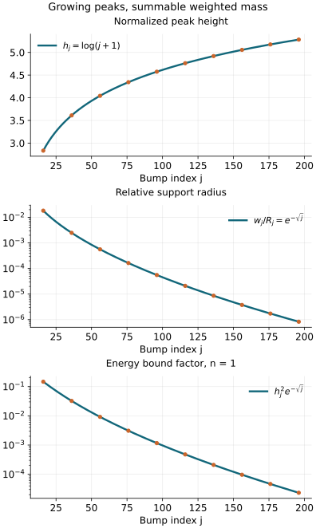

# Sobolev regularity and the strict symbol threshold

A weighted integral can be small while a function has tall narrow peaks.
An ordinary symbol cannot develop those peaks at an arbitrary rate:
all its derivatives have prescribed bounds. Combining these two facts
improves the symbol order to every order strictly above a threshold.
Equality can still fail.

Original programme exposition and examples: GPT-6 Astra (OpenAI),
Ultra, 4 October 2026. This component and its original figure are
dedicated under CC0. Earlier linked components keep their stated licences.
This is a private reconstruction; it does not authorize publication.

## S0. Conventions and exact inputs

Use the Fourier convention
\(\widehat f(\xi)=\int e^{-ix\cdot\xi}f(x)\,dx\), with inverse
coefficient \((2\pi)^{-n}\), and \(n\geq1\).
The vector rank is finite; every scalar inequality below applies
componentwise, with a finite sum of constants.

The complete proofs of Fourier inversion, Parseval, weighted
\(L^2\) completeness and the integral inequalities are
[P3, M0–M8](measure-and-l2.md) and [L0–L3](fourier-l2.md).
We use [P1, B1–B5](dyadic-endpoint.md) for the dyadic square norm,
Schur bounds, ordinary operators and integer coordinate estimates;
[K0–K7](conic-parametrices-and-localization.md) for conic inverses
and intrinsic localization; [T0–T3 and W1–W5](coordinate-and-wavefront-localization.md)
for coordinates, proper cutoffs and wavefront locality;
[C0–C4](conic-frequency-coordinates.md) for a frequency-graph chart;
and both directions of [G12](../intrinsic-frequency-graphs.md#4-the-graph-criterion-in-both-directions)
for the exact intrinsic order. The phase companion's
[F2 and F6a](prescribed-phase-representation.md) supplies its already
proved wavefront and microlocal symbol statements.
Their exact dependency selections accompany this component.

An ordinary symbol \(b\in S^r\) satisfies
\(|\partial^\alpha b(\xi)|\leq C_\alpha\langle\xi\rangle^{r-|\alpha|}\).
The Sobolev norm is
\[
 \|f\|_{H^s}^2=(2\pi)^{-n}
       \int\langle\xi\rangle^{2s}|\widehat f(\xi)|^2\,d\xi .
 \tag{S1}
\]
Microlocal \(H^s\) membership at a nonzero covector means that a
proper order-zero elliptic test there sends the distribution into
\(H^s_{\mathrm{loc}}\). S3 proves the cutoff and coordinate facts
needed with this definition; they are not additional assumptions.

## S1. A Fourier estimate with an adjustable split

Let \(f\in C_c^\infty(\mathbb R^n)\), let \(\beta\) be a multiindex,
and put \(a=|\beta|+n/2>0\). For every integer \(M>a\) and \(L\geq1\),
\[
 \|\partial^\beta f\|_\infty
 \leq C_{\beta,M,n}\left(
      L^a\|f\|_2+
      L^{a-M}\sum_{|\gamma|\leq M}\|\partial^\gamma f\|_2
                      \right).
 \tag{S2}
\]
The constant is independent of \(f,L\) and its support.

**Proof.** Fourier inversion bounds the left side by
\((2\pi)^{-n}\int|\zeta|^{|\beta|}|\widehat f(\zeta)|\,d\zeta\).
On \(|\zeta|\leq L\), Cauchy–Schwarz and Parseval give a bound
\(C L^{|\beta|+n/2}\|f\|_2\). The power follows by the affine
substitution \(\zeta=Lz\); the remaining integral on the unit
ball is bounded by that on a containing cube.

On \(|\zeta|>L\), insert the factors
\(|\zeta|^{|\beta|-M}\) and \(|\zeta|^M|\widehat f|\).
The squared first factor has integral at most
\[
 C\sum_{j\geq0}(2^jL)^{2|\beta|-2M+n}
       \leq C' L^{2(a-M)}.
 \tag{S3}
\]
Indeed the annulus \(2^jL<|\zeta|\leq2^{j+1}L\) has volume at most
a dimensional constant times \((2^jL)^n\); the geometric series
converges since \(M>a\). The multinomial expansion of
\((\sum\zeta_i^2)^M\) and Parseval bound the second factor's
\(L^2\) norm by \(C\sum_{|\gamma|=M}\|\partial^\gamma f\|_2\).
These estimates prove (S2). All integrals converge because a compact
smooth function has Schwartz Fourier transform, as proved in P3.
\(\square\)

## S2. Weighted square integrability improves every symbol derivative

**Theorem.** If \(b\in S^r(\mathbb R^n)\) for some finite real \(r\),
and \(\langle\xi\rangle^s b\in L^2\), then, with \(q=-s-n/2\),
\[
             b\in S^{q+\varepsilon}
             \quad\hbox{for every }\varepsilon>0.
 \tag{S4}
\]
The assertion also holds on a smaller closed cone when both hypotheses
hold on an open cone containing it.

**Proof.** Fix \(\varepsilon>0\) and a multiindex \(\beta\).
Choose a compact smooth annular cutoff \(\chi\) equal to one on
\(1\leq|\eta|\leq2\), supported in \(1/2<|\eta|<4\), and set
\(f_R(\eta)=\chi(\eta)b(R\eta)\), \(R\geq2\).
The change of variables and comparable weights on this annulus give
\[
 \|f_R\|_2\leq C R^{-s-n/2}=C R^q,\qquad
 \sum_{|\gamma|\leq M}\|\partial_\eta^\gamma f_R\|_2
                       \leq C_M R^r.
 \tag{S5}
\]
For the first bound, square the norm, substitute \(\xi=R\eta\),
and use \(\langle\xi\rangle^{-2s}\leq C_sR^{-2s}\) on its
support. For the second, a derivative of \(b(R\eta)\) of order
\(k\) contributes \(R^k\partial^k b(R\eta)=O(R^r)\).
The product rule involves finitely many bounded derivatives of
\(\chi\); its support has fixed finite volume.

With \(a=|\beta|+n/2\), choose \(d=\varepsilon/(2a)>0\)
and then an integer
\[
       M>a+\max\{0,(r-q)/d\}.
 \tag{S6}
\]
Apply (S2) with \(L=R^d\). Its first term has exponent
\(q+da=q+\varepsilon/2\), and its second has exponent
\(r+d(a-M)<q\). Thus, where \(\chi=1\),
\[
 R^{|\beta|}|\partial^\beta b(R\eta)|
        \leq C_{\beta,\varepsilon}R^{q+\varepsilon/2}.
 \tag{S7}
\]
Choose a dyadic \(R\) with \(R\leq|\xi|\leq2R\), and absorb the
bounded-frequency ball into the constant. This is every required
order-\(q+\varepsilon\) derivative estimate. The choices of \(M\)
may depend on \(\beta,\varepsilon\), as ordinary symbol membership
permits; the initial order \(r\) is fixed.

For the conic version choose an angular cutoff supported in the
hypothesis cone and equal to one near the selected closed angular
set, multiply it into \(\chi\), and repeat the proof. Its derivatives
are bounded on the same compact annulus. A finite cover handles a
compact union of such angular pieces. \(\square\)

No conclusion at \(\varepsilon=0\) follows from this argument.
The scale in (S6) was chosen separately for each positive
\(\varepsilon\); S5 below shows why that distinction is necessary.

## S3. Sobolev localization and coordinate transport

Two consequences of the proved dyadic estimates are needed for
all real \(s\).

First, a compactly localized ordinary operator of order zero is
bounded on \(H^s\). P1 B4 proves the weighted dyadic block estimate
(B6), and P1 B3 proves its square-sum bound. P1 B1 identifies that
square sum with (S1). With a compact smooth kernel added, its output
has every derivative bounded by weighted Fourier Cauchy–Schwarz
against the input and the uniformly Schwartz Fourier transforms of
the kernel slices. Thus it maps \(H^s\) into every local \(H^t\).
P2 O5 supplies this symbol-plus-smooth-kernel representation for each
compact localization of a proper operator. Proper support allows a
single compact input cutoff for each fixed compact output cutoff.
Consequently such operators preserve \(H^s_{\mathrm{loc}}\).

Second, compactly localized changes of base coordinates preserve
\(H^s\). P1 B5 proves their integer bounds and the two estimates
(B14). Choose integers \(a_0<s<b_0\). The weighted block norms obey
\[
 2^{(l-j)s}\|\Pi_l T\Pi_j\|_{2\to2}
       \leq C\,2^{-\delta|l-j|},\qquad
 \delta=\min(s-a_0,b_0-s)>0.
 \tag{S8}
\]
For \(j\geq l\), use the integer \(a_0\) bound; for \(j<l\),
use the integer \(b_0\) bound. P1 B3's proved convolution estimate
on squared sequences gives the \(H^s\) bound for finite block sums.
P1 B1 gives density and completeness, hence extension to every
\(H^s\) input. The extended operator agrees with the distributional
pullback: the transpose sends compact smooth tests continuously to
compact smooth tests, by T0, so both limits have the same pairings.
Apply the same proof to the inverse coordinate map. Smooth frame
and density factors are finite smooth multiplications, already
covered by the first assertion.

Now suppose \(Au\in H^s_{\mathrm{loc}}\), with \(A\) proper,
order zero and elliptic at \(\rho\). K3 gives a proper order-zero
left inverse \(B\) with \(E=I-BA\) smoothing on a fixed cone about
\(\rho\). If \(P\) has compact kernel and sufficiently small
essential support in that cone, then
\[
                       Pu=PBAu+PEu\in H^s.
 \tag{S9}
\]
The first term has compact output and belongs to \(H^s\) by the
first assertion. The second has a smooth compact kernel by the
conic product theorem K0 and is therefore compact smooth on
distributions. This proves replacement by any sufficiently small
cutoff. The coordinate symbol rule T1 transports ellipticity;
combining it with the second assertion proves invariance of the
microlocal \(H^s\) definition. No fractional interpolation theorem
has been left as an external prerequisite. \(\square\)

## S4. The intrinsic order improves, with a strict inequality

**Theorem.** Let \(\Lambda\subset T^*X\setminus0\) be a smooth
conic Lagrangian, let \(E\) have finite rank, and let
\(\rho\in\Lambda\). Suppose \(u\) is microlocally in
\(I^m(X,\Lambda;E)\) and in \(H^{s_0}\) at \(\rho\).
Then
\[
 \boxed{\begin{gathered}
 u\in I^\mu(X,\Lambda;E)\text{ at }\rho\\
 \text{whenever }\mu+s_0+n/4>0 .
 \end{gathered}}
 \tag{S10}
\]

**Proof.** Choose the base coordinates of C3–C4, in which the
selected Lagrangian branch is \(\Gamma_H=\{(H'(\xi),\xi)\}\)
for a real degree-one \(H\). T3 and S3 preserve the two hypotheses.
Intersect their sufficiently small conic neighborhoods.
K7 and S3 allow a compact proper order-zero cutoff \(P\), elliptic
at the transformed covector, with essential support in that
intersection. The cutoff can also have its support strictly inside
the graph chart. Set \(v=Pu\) in the new coordinates.
K7's Lagrangian-extension assertion gives \(v\in I^m(\Gamma_H)\),
and (S9) gives \(v\in H^{s_0}\), both globally in this chart.
Its base support is compact.

G12 now supplies the exact ordinary symbol
\[
 b=e^{iH_e}\widehat v\in S^{m-n/4},\qquad
 \langle\xi\rangle^{s_0}b\in L^2.
 \tag{S11}
\]
The second assertion follows from (S1) and the reality of the
smooth extension \(H_e\). S2 gives
\(b\in S^{-s_0-n/2+\varepsilon}\) for every \(\varepsilon>0\).
The reverse direction of G12 gives
\[
                v\in I^{-s_0-n/4+\varepsilon}(\Gamma_H).
 \tag{S12}
\]
K7 transfers this back to the original Lagrangian germ, and T3
transfers it back to the original coordinates and frame.
Putting \(\varepsilon=\mu+s_0+n/4>0\) proves (S10).
Each appeal to a graph or coordinate theorem has its complete
earlier programme proof specified in S0. \(\square\)

## S5. A counterexample at equality, including its microlocal location

Fix \(s_0\in\mathbb R\), put \(q=-s_0-n/2\), and choose a smooth
bump \(\psi\) supported in the unit ball, with \(\psi(0)=1\).
The bump construction is the one proved in U001 A4.
For integers \(j\geq16\) set
\[
 \begin{gathered}
 R_j=4^j,\qquad h_j=\log(j+1),\\
 w_j=R_j e^{-\sqrt j},\qquad \xi_j=R_j e_1,\\
 b(\xi)=\sum_{j\geq16}R_j^q h_j
             \psi\!\left(\frac{\xi-\xi_j}{w_j}\right).
 \end{gathered}
 \tag{S13}
\]
These are ordinary translated and dilated bumps, not a claim of
classical homogeneous expansion.

The support balls are disjoint. Indeed \(w_j<R_j/4\), and
\(R_{j+1}=4R_j\), so their radial ranges are contained in
\((3R_j/4,5R_j/4)\), with disjoint consecutive ranges.
They escape every compact set, so their sum is locally finite and
smooth. On the \(j\)-th support, \(\langle\xi\rangle\asymp R_j\);
the product and chain rules give, for \(k=|\alpha|\),
\[
 |\partial^\alpha b(\xi)|
       \leq C_\alpha R_j^{q-k}h_j e^{k\sqrt j}.
 \tag{S14}
\]
For any \(\varepsilon>0\) and fixed \(k\),
\(\log h_j+k\sqrt j-\varepsilon j\log4\) tends to \(-\infty\).
For example \(k\sqrt j\leq(\varepsilon\log4)j/3\) for large \(j\);
also \(\log h_j\leq\sqrt j\) eventually, by the elementary
exponential domination proved in U001 P14.3.
The remaining finite set of \(j\)'s changes only the constant.
Thus (S14) proves \(b\in S^{q+\varepsilon}\) for every
\(\varepsilon>0\). At its centers,
\(R_j^{-q}b(\xi_j)=h_j\to\infty\), so \(b\notin S^q\).

Affine substitution in each disjoint ball gives
\[
 \begin{aligned}
 \int\langle\xi\rangle^{2s_0}|b(\xi)|^2\,d\xi
  &\leq C\sum_{j\geq16}R_j^{2s_0+2q}h_j^2w_j^n\\
  &=C\sum_{j\geq16}h_j^2e^{-n\sqrt j}<\infty .
 \end{aligned}
 \tag{S15}
\]
For the last assertion group \(k^2\leq j<(k+1)^2\).
There are \(2k+1\) terms, \(h_j\leq2\log(k+2)\), and
\(e^{-n\sqrt j}\leq e^{-nk}\). A polynomial times this geometric
decay is summable: its successive-term ratio is eventually
less than a fixed number below one. Hence
\(u=\mathcal F^{-1}b\in H^{s_0}\).
G12 gives \(u\in I^{q+n/4+\varepsilon}(T^*_0\mathbb R^n\setminus0)\)
for every \(\varepsilon>0\).

Here is the necessary microlocal obstruction, rather than merely
failure of a global symbol bound. The angular radii of the support
balls tend to zero, and their directions approach \(e_1\).
The proved wavefront statement F2 for the linear phase \(x\cdot\xi\)
therefore gives
\[
          \operatorname{WF}(u)
              \subset\{(0,t e_1):t>0\}.
 \tag{S16}
\]
On every other closed angular set the amplitude is zero at
sufficiently large frequency. Thus F2's amplitude essential-support
qualification applies exactly here.

For a compact smooth \(\chi\) equal to one near zero,
\(\widehat{\chi u}=(2\pi)^{-n}\widehat\chi*b\).
This identity follows first for a frequency-truncated \(b\) by
Fubini, then in distributions and pointwise in the convolution
by the Schwartz decay of \(\widehat\chi\) and the polynomial
growth of \(b\). At \(\xi=\xi_j\), use \(b\in S^{q+1/2}\).
For \(|\zeta|\leq R_j/2\), the segment from \(\xi_j\) to
\(\xi_j-\zeta\) has size comparable to \(R_j\); the fundamental
theorem of calculus bounds
\[
 |b(\xi_j-\zeta)-b(\xi_j)|
               \leq C|\zeta|R_j^{q-1/2}.
 \tag{S17}
\]
Integrating against \(|\widehat\chi(\zeta)|\) gives this same
power. On \(|\zeta|>R_j/2\), both the convolution term and the
subtracted \(b(\xi_j)\) term are \(O(R_j^{-N})\) for every \(N\):
bound \(b(z)\) by \(C\langle z\rangle^{\max(q+1/2,0)}\), and use
an arbitrarily high Schwartz power of \(\widehat\chi\).
Fourier inversion gives \((2\pi)^{-n}\int\widehat\chi=\chi(0)=1\).
Consequently
\[
 R_j^{-q}\widehat{\chi u}(\xi_j)
                    =h_j+O(R_j^{-1/2})+O(R_j^{-1})
                    \longrightarrow+\infty .
 \tag{S18}
\]
The last expression means its real part tends to \(+\infty\);
the error may be complex.

If \(u\) were microlocally in \(I^{q+n/4}\) at \((0,e_1)\),
K7 would provide \(v=Pu\in I^{q+n/4}\) with \(P\) compact,
proper, supported in that neighborhood, and full symbol one
modulo smoothing on a smaller cone about \((0,e_1)\).
By (S16), pseudolocality and this full-symbol identity,
\(\chi u-Pu\) is smooth everywhere: it is smooth near that ray
by conic smoothing, and has no possible wavefront elsewhere.
It is compactly supported, hence Schwartz.
G12 would give \(\widehat{Pu}\in S^q\), since \(H=0\).
It would follow that \(\widehat{\chi u}\in S^q\), contradicting
(S18). Thus equality in (S10) really fails at that covector.
\(\square\)

*Figure S1.* Samples of the exact sequence in (S13).
The third panel plots the dimension-one factor in the bound (S15),
not the exact Sobolev integral and not a proof by numerical experiment.
For general \(n\), replace \(e^{-\sqrt j}\) there by
\(e^{-n\sqrt j}\). The proofs of summability and derivative bounds
are (S14)–(S18).

## S6. Worked checks of orders, systems and phase normalization

**Exercise S1: the dimension shift.** For real \(r\), put
\(b(\xi)=\langle\xi\rangle^r\) and
\(u=\mathcal F^{-1}(e^{-iH_e}b)\). Determine its intrinsic order,
the immediate Sobolev inclusion and the exact Fourier-weight test.

**Solution.** Differentiating \((1+|\xi|^2)^{r/2}\) repeatedly
gives the ordinary order \(r\), so G12 yields \(m=r+n/4\).
Its intrinsic empty-word endpoint is \(B^{-r-n/2}_{2,\infty}\)
locally; P1 B1 gives every smaller Sobolev order. Globally (S1)
is finite exactly when \(s+r<-n/2\). To see both directions,
on \(2^j\leq|\xi|<2^{j+1}\) its integrand is comparable to
\(2^{2j(s+r)}\); the annular volume is a positive constant
times \(2^{jn}\), by affine substitution. The geometric series
converges precisely with a negative exponent. At equality its
terms stay bounded below. The factor \(e^{-iH_e}\) has modulus
one; localization and word estimates still come from G12.
For \(r=0,H=0\), Fourier inversion on tests identifies \(u\)
with the point mass, of intrinsic order \(n/4\).
\(\square\)

**Exercise S2: a matrix commutator that keeps order one.**
On the line let
\[
 M=\begin{pmatrix}1&1\\0&1\end{pmatrix},\qquad
 N=\begin{pmatrix}2&0\\0&3\end{pmatrix},\qquad
 L=xMD_x,\qquad A=N.
 \tag{S19}
\]
Compute \([L,A]\) and explain why this does not break intrinsic
localization for the fibre over zero.

**Solution.** Since \(N\) is constant,
\([L,A]=x(MN-NM)D_x\), and
\(MN-NM=\begin{pmatrix}0&1\\0&0\end{pmatrix}\ne0\).
The commutator has order one, with principal symbol zero at
\(x=0\). It is therefore an admissible operator itself.
The finite identity
\(L_1\cdots L_kA=AL_1\cdots L_k+
\sum_{j=1}^kL_1\cdots L_{j-1}[L_j,A]L_{j+1}\cdots L_k\)
is proved by repeatedly inserting \(LA=AL+[L,A]\);
its terms retain their matrix order.
K6 applies its order-zero bound to the first term and the
admissible-word bound to the others. There is no assertion
that a matrix commutator automatically lowers order. \(\square\)

**Exercise S3: equal numbers of derivatives and vanishing factors.**
Suppose \([Q,D]=i\), and put \(T=QD\).
Show that \(D^kQ^k=\prod_{\ell=1}^k(T-i\ell)\).

**Solution.** Induction on \(k\) gives
\(DQ^k=Q^kD-ikQ^{k-1}=Q^{k-1}(T-ik)\).
Therefore \(D^kQ^k=D^{k-1}Q^{k-1}(T-ik)\).
The initial case is \(DQ=T-i\); induction gives the asserted
polynomial. All its factors are polynomials in the same operator,
so they commute. In particular
\(D^2Q^2=T^2-3iT-2\) and
\(D^3Q^3=T^3-6iT^2-11T+6i\).
This is the one-dimensional instance of G12's finite word
reordering, with every lower-order term retained. \(\square\)

**Exercise S4: normalization of a clean right inverse.**
For \(\phi(x,t,z)=xt\), \(t>0\), \(|z|<ct\), use the convention
\(I_\phi(a)=(2\pi)^{-5/4}\int e^{ixt}a(x,t,z)\,dt\,dz\).
For a symbol \(v(t)\) supported in \(t\geq2\), construct a
leading right inverse of intrinsic order \(m\), where
\(v\in S^{m-1/4}\).

**Solution.** The critical equations give \(x=0\) with \(z\)
free, so \(n=1,N=2,e=1\). F6 gives amplitude order \(m-5/4\).
Choose \(p\in C_c^\infty((-c,c))\), \(\int p=1\), and a compact
base cutoff \(\chi=1\) near zero. Define
\[
 a(x,t,z)=(2\pi)^{1/4}\chi(x)\frac{v(t)}{t}p(z/t).
 \tag{S20}
\]
Every \(t,z\) derivative lowers its order by one on this cone,
by the product and chain rules; \(x\) derivatives cost no order.
Substitute \(z=t\tau\) to integrate exactly:
\[
 I_\phi(a)(x)=\frac{\chi(x)}{2\pi}
                       \int_0^\infty e^{ixt}v(t)\,dt .
 \tag{S21}
\]
The equality holds first with a finite frequency cutoff and then
distributionally by F2. The full normal Hessian in the \((x,t)\)
variables is \(\begin{pmatrix}0&1\\1&0\end{pmatrix}\), with
signature zero and determinant \(-1\).
F3's leading Fourier coefficient is
\((2\pi)^{-1/4}t\int a(0,t,t\tau)\,d\tau=v(t)\), in agreement
with the direct integral. The Fourier convolution from \(\chi\)
can add lower-order terms; F5 supplies their complete correction
if a prescribed full Fourier symbol is required.
This calculation states its normalization explicitly. \(\square\)

**Exercise S5: locate the lost endpoint.** In (S13), replace
\(h_j\) by \(j^2\), keeping the same \(R_j,w_j\).
Does the counterexample still work?

**Solution.** Yes. For every fixed \(k,\varepsilon>0\),
\(j^2e^{k\sqrt j}4^{-\varepsilon j}\) is bounded, so every
positive-loss symbol bound survives. The energy series becomes
\(\sum j^4e^{-n\sqrt j}\), still summable by grouping consecutive
squares. The normalized peak heights \(j^2\) diverge. The
localization estimate (S17) uses only the already established
order \(q+1/2\), so the microlocal obstruction also survives.
\(\square\)

## Free human source and scope

Terence Tao's freely readable author notes,
[245C, Notes 4: Sobolev spaces, 30 April 2009](https://terrytao.wordpress.com/2009/04/30/245c-notes-4-sobolev-spaces/),
provide the Fourier weighted-norm and rescaled-bump approach
(introduction and Section 3 through Exercise 40).
S1–S5 give all estimates and counterexample proofs used here;
the source's exercises and external references are not programme
proof providers. Its text, HTML, figures and bibliography are
not reproduced.

This component completes the strict Sobolev-to-intrinsic-order
implication, separately from F7's leading-symbol cancellation
criterion. Global principal-symbol and Maslov identification,
the complete receiving editions and the remaining AN-04 course
are separate unfinished obligations.
