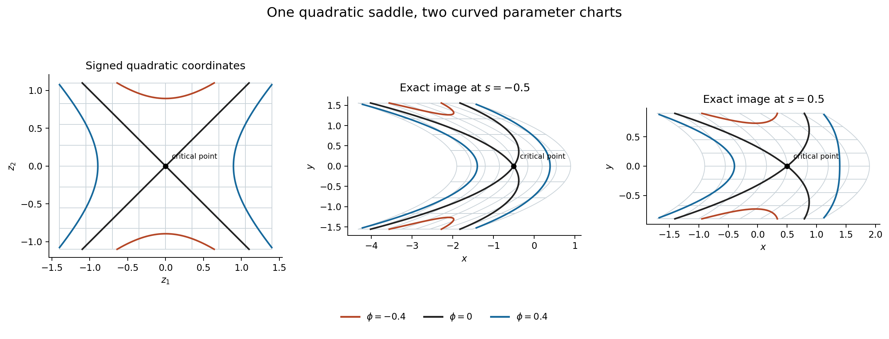

# A smooth quadratic reduction with parameters

Prerequisite companion to the stationary-phase lesson. This supplies the full local reduction needed
between the quadratic calculation and the isolated/clean stationary-phase
formulae. It retains the parameter scope of the earlier AN04-U001 Lemma 4.1
and makes its inverse-function, elimination and signature steps explicit.

The free human inputs are Lebl's *Basic Analysis II*, version 6.3,
[§8.5](https://www.jirka.org/ra/html/sec_svinvfuncthm.html), and the
Morse lemma in Guillemin–Sternberg's
[13 January 2010 author draft](https://math.mit.edu/~vwg/semiclassGuilleminSternberg.pdf),
§13.14.3, pp.455–457. The latter explains the parameter normal-form target;
the proof below uses scalar elimination and the programme's inverse theorem.
It does not import an unproved ODE flow. The supporting completions P2–P5 are
in [the preceding companion](prerequisite-completions.md); the Gaussian and
quadratic arguments Q1–Q9 are in
[the analytic module](quadratic-stationary-phase.md).

This exposition is an adaptation and extension of the openly licensed Lebl
material and is offered under
[CC BY-SA 4.0](https://creativecommons.org/licenses/by-sa/4.0/).
The Guillemin–Sternberg source is cited for mathematics actually read, without
copying its text or distributing its PDF. The selected local Morse inputs are
bound in `integration-proof-chain.json`.

## M1. Parameter Morse lemma and its Jacobian

Let \(U\subset\mathbb R^n\) and \(S\subset\mathbb R^p\) be open, and
let \(\phi\in C^\infty(U\times S;\mathbb R)\). Suppose
\[
 D_x\phi(x_0,s_0)=0,\qquad H_0=D_x^2\phi(x_0,s_0)
 \text{ is invertible}.
\]
There are neighbourhoods of \(s_0\) and of \(z=0\), a smooth critical
branch \(x_c(s)\), and a smooth map \(F(z,s)\) such that for each
nearby \(s\), \(z\mapsto F(z,s)\) is a local diffeomorphism and
\[
 F(0,s)=x_c(s),\qquad
 \phi(F(z,s),s)=c(s)+\tfrac12\sum_{j=1}^n\sigma_j z_j^2,
 \qquad c(s)=\phi(x_c(s),s),\quad \sigma_j\in\{1,-1\}.
 \tag{M1.1}
\]
The signs are independent of \(s\) on this neighbourhood. If
\(H(s)=D_x^2\phi(x_c(s),s)\), then
\[
 \sum_j\sigma_j=\operatorname{sgn}H(s),\qquad
 |\det D_zF(0,s)|=|\det H(s)|^{-1/2}.
 \tag{M1.2}
\]

**Programme inputs.** The \(C^1\) inverse and implicit proofs already
present in Lebl's programme §8.5; the smooth upgrade P3; P4–P5; the mixed
derivative and compact-integral completions P11–P12; and the root and
compactness inputs in the earlier exact chains. These exact inputs are not
replaced by the two external human-source links above.

For \(n=0\), the coordinate space is a singleton. Take \(x_c(s)=x_0\),
\(F(0,s)=x_0\), and \(c(s)=\phi(x_0,s)\). The quadratic sum and
signature are 0, while the empty determinant and its Jacobian factor are 1.
This proves all assertions in that case. In the proof below, \(n\geq1\).

**Proof: locate and translate the critical point.** Apply the implicit
theorem, upgraded by P3, to the smooth map \(D_x\phi(x,s)\).
Its derivative in \(x\) at \((x_0,s_0)\) is \(H_0\), so there is a
unique smooth branch \(x_c(s)\) in a sufficiently small fixed product
neighbourhood. Replace \(x\) by \(x_c(s)+u\) and subtract \(c(s)\).
The resulting smooth function \(f(u,s)\) has
\(f(0,s)=0\), \(D_uf(0,s)=0\) and an invertible Hessian for every
nearby \(s\). The last assertion follows by continuity of the determinant
and its nonzero value at \(s_0\).

**Choose a nonzero scalar pivot.** A nonzero symmetric matrix has a vector
with nonzero quadratic value. To verify this without assuming a normal form,
if a diagonal entry is nonzero, use its coordinate vector. If every diagonal
entry is zero, some off-diagonal entry \(h_{ij}\) is nonzero, and
\((e_i+e_j)^TH(e_i+e_j)=2h_{ij}\ne0\). Make a fixed invertible linear
change of variables taking that vector to the first coordinate direction.
Such a change can be constructed by adjoining all coordinate vectors except
one in which the chosen vector has a nonzero component; expansion of the
resulting matrix in that row gives a nonzero determinant. This change is
fixed at \(s_0\), so it is smooth in the parameters. After shrinking the
neighbourhood, \(\partial_1^2 f(0,s)\) stays nonzero with one fixed sign.

**Eliminate one variable.** Write \(u=(u_1,u')\). P3 applied to
\(\partial_1 f\) gives a smooth function \(u_1=q(u',s)\) for which
\(\partial_1 f(q(u',s),u',s)=0\). Since \(u=0\) is critical and the
solution is locally unique, \(q(0,s)=0\). Put
\(g(u',s)=f(q(u',s),u',s)\). With \(v=u_1-q(u',s)\), the integral
Taylor formula proved in P12.6 gives
\[
 f(q(u',s)+v,u',s)=g(u',s)+\tfrac12v^2 A(v,u',s),
\]
\[
 A(v,u',s)=2\int_0^1(1-t)
             \partial_1^2 f(q(u',s)+tv,u',s)\,dt.
 \tag{M1.3}
\]
Shrink the product neighbourhood so that \(q(u',s)\) and
\(q(u',s)+v\) lie in a smaller coordinate interval whose closure stays
inside the phase domain, with the other coordinates fixed. The whole segment
between them then stays in that interval. Specifically apply P12.6 to the function
\(t\mapsto f(q(u',s)+tv,u',s)\) on \([0,1]\). Its first derivative
at 0 is zero and its second derivative is
\(v^2\partial_1^2f(q(u',s)+tv,u',s)\). This proves (M1.3) for every
sign of \(v\), including zero. The parameter integration is over a fixed
compact interval, so P12.7 proves that \(A\) is jointly smooth. No global
improper-integral input from Q1 is needed for this step. At \((v,u')=0\),
\(A(0,0,s)=\partial_1^2 f(0,s)\ne0\).

Shrink once more so that \(A\) is nonzero throughout the neighbourhood
with a single sign \(\sigma_1\). Define
\[
 z_1=v\sqrt{|A(v,u',s)|}.
\]
Its \(v\)-derivative at \((v,u')=(0,0)\) is
\(\sqrt{|A(0,0,s)|}>0\). Apply P3 to the map
\((v,u',s)\mapsto(z_1,u',s)\): its derivative is block triangular,
with this nonzero entry and identity blocks, hence invertible. We obtain
a smooth local inverse, jointly in \(z_1,u',s\). In these coordinates,
\[
 f=g(u',s)+\sigma_1z_1^2/2.\tag{M1.4}
\]
In particular the residual function is independent of \(z_1\).

**Induct with an invertible residual Hessian.** The function \(g\) has
\(g(0,s)=0\), and its first derivative vanishes at zero: differentiating
the composite contributes only first derivatives of \(f\) there. P4
computes its Hessian as the Schur complement of the chosen scalar pivot.
That complement is invertible because the original Hessian is invertible.
For \(n=1\), (M1.4) already completes the construction. For \(n>1\),
apply the same construction to \(g(u',s)\), in \(n-1\) variables and
with the same parameters. Finite induction yields a signed quadratic
form in all \(n\) coordinates. At each of the finitely many steps,
the nonzero pivot and the inverse map persist on an open neighbourhood
of the relevant base point. Take preimages of these neighbourhoods under
the preceding continuous coordinate maps, so they are neighbourhoods of
the same original base point. Their finite intersection is still a neighbourhood;
choose smaller product neighbourhoods inside it. Composing the inverse
coordinate maps and the initial translation gives the smooth map \(F\)
in (M1.1).

**Identify its signature and volume factor.** Differentiate (M1.1) twice
in \(z\) at zero. Terms containing second derivatives of \(F\) are
multiplied by \(D_x\phi(x_c(s),s)=0\), so the chain rule reduces to
\[
 [D_zF(0,s)]^T H(s)D_zF(0,s)
       =\operatorname{diag}(\sigma_1,\ldots,\sigma_n).
\]
P5 gives both the signature identity and the determinant identity
in (M1.2). This also proves local constancy of the Hessian signature
for this critical family; it has not been assumed as an unproved
spectral-continuity assertion. \(\square\)

## M2. The precise compact-parameter consequence

Suppose a smooth critical branch is defined on an open neighbourhood of a
compact parameter set \(S_0\), and its Hessian is invertible on \(S_0\).
For each point of \(S_0\),
M1 supplies a local parameter neighbourhood and a signed Morse chart.
Before selecting the cover, choose around each parameter point a smaller
open parameter neighbourhood with compact closure in its chart domain,
and a smaller coordinate ball with compact closure in the coordinate
domain. These smaller parameter neighbourhoods still cover \(S_0\).
P1 and the earlier compactness proofs supply a finite subcover.
On each selected product closure, every fixed finite list of derivatives
of the coordinate map is bounded by the earlier extreme-value theorem.
Its image under \((z,s)\mapsto(F(z,s),s)\) is compact, by the proved
continuous-image theorem, and is contained in the inverse map's open
domain. Derivatives of the inverse are bounded on that compact image by
the same extreme-value theorem. The largest of finitely many bounds is finite.

Thus later stationary-phase estimates can be proved in finitely many local
charts with uniform finite constants. This conclusion does not assert a
single global signed frame, nor a uniform coordinate size for a collection
of phases whose Hessians approach singularity. It also does not itself
construct the partition of unity or identify the clean quotient density;
those are additional steps in the full lesson.

## M3. A curved family with an exact signed quadratic chart

For \(s>-1\) put
\[
 \phi_s(x,y)=\tfrac12(x-s+y^2)^2-\tfrac12(1+s)y^2,
 \qquad
 F_s(z_1,z_2)=\left(s+z_1-\frac{z_2^2}{1+s},
                         \frac{z_2}{\sqrt{1+s}}\right).
 \tag{M3.1}
\]
This is an exact example of M1, not a truncation. The inverse coordinates
are \(z_1=x-s+y^2\), \(z_2=\sqrt{1+s}\,y\), so \(F_s\) is a global
smooth diffeomorphism and
\[
 \phi_s(F_s(z))=(z_1^2-z_2^2)/2,\qquad
 \det DF_s=(1+s)^{-1/2}.\tag{M3.2}
\]
To check the critical point and Hessian, write \(u=x-s+y^2\). Then
\(\partial_x\phi_s=u\), \(\partial_y\phi_s=2yu-(1+s)y\).
Both vanish only at \((x,y)=(s,0)\). Differentiating once more gives
\[
 D^2\phi_s=
 \begin{pmatrix}1&2y\\2y&2u+4y^2-(1+s)\end{pmatrix},\qquad
 D^2\phi_s(s,0)=\operatorname{diag}(1,-(1+s)).
\]
Its signature is zero and its determinant is \(-(1+s)\), which verifies
the Jacobian predicted by (M1.2). The direct derivative of \(F_s\) is
upper triangular with diagonal entries \(1,(1+s)^{-1/2}\), independently
checking that factor. On \(-1/2\leq s\leq1/2\) these maps have bounded
derivatives of every fixed order on each fixed compact \(z\)-set.
As \(s\downarrow-1\), the Hessian loses invertibility and its determinant
factor becomes unbounded, illustrating the limitation in M2.
Indeed, for every \(B>0\), the inequality \(0<1+s<B^{-2}\) gives
\((1+s)^{-1/2}>B\), by the positive-root comparison proved in P8.

**Figure 2.** The left panel shows the \(z\)-coordinate rectangle
\([-1.4,1.4]\times[-1.1,1.1]\). The other panels show its exact images
under \(F_s\) for \(s=-1/2\) and \(s=1/2\). Light curves are images of
the same coordinate grid. The three labelled phase levels are mapped by
(M3.1), so they have exactly the same phase values by (M3.2). The black
point is the critical point, \((0,0)\) in the first panel and \((s,0)\)
in the others. Curves are numerical samples of these exact formulae,
not numerical proofs. Reproducible source: `figures/draw_parameter_morse.py`.
The example is constructed here from the parameter normal-form mechanism
in M1, with the free human sources identified at the start of this module.
