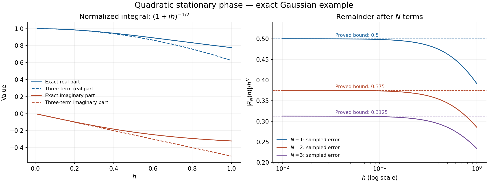

# Gaussian regularization and quadratic stationary phase

Written 4 October 2026. This is newly written exposition
from the freely accessible sources named below. It is not a revision obtained
by deleting references from an inherited lesson.
The exact elementary programme proofs used are listed in F0.
The parameter Morse argument is now written in
[its companion](parameter-morse-reduction.md), with specific prerequisite
completions. The existing full stationary-phase revision is retained for
proof-by-proof reconciliation; its correct free-source arguments are to be
preserved. The complete lesson has not yet been cleared.

## F0. The exact earlier programme proofs

The proofs below use the following elementary results. This list declares
actual dependencies; it does not grant an exception to the requirement to prove
every used result inside the programme.

| ID | Result used | Uses below | Current programme binding |
|---|---|---|---|
| F0-CALC | Fundamental theorem of one-variable calculus, product and chain rules, elementary real and complex exponential differentiation, and smoothness of the positive square root | Q1–Q9 | Exact combined chain in `exponential-proof-chain.json`: differential rules and roots, compact FTC/Taylor, real and complex exponentials, their modulus and derivative rules, and the right-half-plane root phase are proved. Global integration remains separate |
| F0-INT | Construction, linearity and norm bounds for the used compact and absolutely convergent improper integrals, their tails, and iteration under the explicit product majorants in these proofs | Q1–Q9 | Exact chain in `global-integral-proof-chain.json`, including full compact-rectangle Fubini and its omitted steps, global tails, compact-uniform limits and the interchanges in Q3–Q6. Change of variables remains separate |
| F0-COV | Change of variables for orthogonal linear maps, positive dilations, and planar polar coordinates, with their Jacobians | Q2, Q4, Q6 | Exact chain in `change-of-variables-proof-chain.json`: full compact Jordan substitution, determinant–volume scaling, global affine changes, compact chart substitution and the polar exhaustion needed for the Gaussian are proved |
| F0-COMP | Compactness of a closed bounded Euclidean set; attainment of extrema and uniform continuity for continuous functions on it | Q1, Q5, Q9 | Exact transitive proof chain in `topology-proof-chain.json`, including P1/P6/P8 and existing compactness, extrema and uniform-continuity proofs; closed relative to its explicit axioms |
| F0-ALG | Determinant multiplication, the cofactor inverse formula, and their smooth dependence on matrix entries | Q5, Q6, Q8 | Exact algebra and differentiation chain in `differential-proof-chain.json`, with specific omissions supplied by P7/P9/P10; closed relative to its declared axioms |

Finite sums, multi-indices, Euclidean scalar products and the determinant are
used with their usual algebraic definitions. An exact earlier linear-algebra
binding for the determinant identities is recorded in
`prerequisite-bindings.json` and `differential-proof-chain.json`.
All integrals in this module have the compact Riemann or absolutely convergent
improper meaning proved in P17–P18 of
`global-integral-prerequisite-completions.md`. In particular the global
interchanges below satisfy the product-majorant hypotheses of P18.4.
All of Q1–Q9 and E1 now have exact closed prerequisite chains, recorded in
`change-of-variables-proof-chain.json`. This completes the proofs of this
quadratic module; it does not complete the proofs of the full stationary-phase
lesson.

Set
\[
 \widehat a(\xi)=\int_{\mathbb R^n}e^{-ix\cdot\xi}a(x)\,dx,
 \qquad
 a(x)=(2\pi)^{-n}\int_{\mathbb R^n}e^{ix\cdot\xi}
                                  \widehat a(\xi)\,d\xi.
 \tag{F}
\]
The second equality will be proved in Q4, before it is used. A function belongs
to \(\mathcal S(\mathbb R^n)\) when it is smooth and
\(\sup_x(1+|x|)^m|\partial^\alpha a(x)|<\infty\) for every integer
\(m\geq0\) and every multi-index \(\alpha\).

## Q1. The limit and differentiation rules actually used here

Suppose continuous functions \(f_t\) converge to \(f_0\) uniformly on every
compact set as \(t\to0\), and \(|f_t(x)|\leq g(x)\) for one integrable
\(g\), including \(t=0\). Then \(\int f_t\to\int f_0\).

**Proof.** Given \(\delta>0\), choose a cube \(K\) so that
\(\int_{K^c}g<\delta\). The difference of the integrals on \(K^c\) is
at most \(2\delta\). On \(K\) it is at most
\(|K|\sup_K|f_t-f_0|\), which tends to zero. Taking a limit superior and
then letting \(\delta\) decrease to zero proves the claim.

For a parameter derivative, suppose \(f(t,x)\) and \(\partial_t f(t,x)\)
are continuous for \(t\) in a neighbourhood of \(t_0\), the integral at
\(t_0\) exists absolutely, and \(|\partial_t f(t,x)|\leq g(x)\) there.
The fundamental theorem of calculus gives
\[
 \frac{f(t_0+s,x)-f(t_0,x)}s
 =\int_0^1\partial_t f(t_0+us,x)\,du.
\]
These quotients are bounded by \(g\) and converge uniformly on compact sets
to \(\partial_t f(t_0,x)\). The first part proves differentiation under
the integral. It also proves continuity of that derivative when the same
local bound holds. Repeating the argument proves any finite order for which
the corresponding bounds are available. This proof uses F0, not a general
unproved appeal to dominated convergence. \(\square\)

## Q2. A complex Gaussian without an analytic-continuation import

For \(z\in\mathbb C\) with \(\operatorname{Re}z>0\) and real \(\eta\),
\[
 \int_{\mathbb R}\exp(-zx^2/2+i\eta x)\,dx
 =\sqrt{2\pi}\,z^{-1/2}\exp(-\eta^2/(2z)).
 \tag{G}
\]
Here \(\sqrt z\) is the square root with positive real part.

**Proof.** The integral and all derivatives used below converge absolutely:
on a compact subset of the right half-plane their absolute values are
bounded by a polynomial in \(|x|\) times \(e^{-c x^2}\), for some
\(c>0\). Such bounds are integrable: differentiation shows that
\(r^m e^{-cr^2/2}\), for \(r\geq0\), has a finite maximum, so the
remaining factor is bounded by \(C e^{-cr^2/2}\), and hence by
\(C e^{-cr/2}\) for \(r\geq1\). The latter has a finite integral by
the fundamental theorem. Q1 therefore applies.

First let \(J=\int e^{-x^2/2}\,dx>0\). Squaring, using absolute iteration
and then planar polar coordinates, gives
\[
 J^2=\int_{\mathbb R^2}e^{-(x^2+y^2)/2}\,dx\,dy
 =\int_0^{2\pi}\int_0^\infty e^{-r^2/2}r\,dr\,d\theta=2\pi.
\]
Thus \(J=\sqrt{2\pi}\). P21.5 in
`change-of-variables-prerequisite-completions.md` proves the polar Jacobian,
the compact-sector substitution, and the limits at the origin, missing ray
and infinity used in this step.

For fixed \(z\) join 1 to \(z\) by \(z_t=1+t(z-1)\), \(0\leq t\leq1\).
Its real part is positive. Put \(J(t)=\int e^{-z_t x^2/2}\,dx\).
Integration of \(\partial_x(xe^{-z_t x^2/2})\) over \([-R,R]\), followed
by \(R\to\infty\), gives
\(\int x^2e^{-z_t x^2/2}\,dx=J(t)/z_t\), because the boundary terms
vanish exponentially. Consequently
\[
 J'(t)=-\frac{z'_t}{2z_t}J(t).
\]
The chosen root \(s(t)=\sqrt{z_t}\) is differentiable and satisfies
\(2s(t)s'(t)=z'_t\). One can see this without a complex-analysis theorem
by writing \(z_t=r_t e^{i\theta_t}\), with
\(-\pi/2<\theta_t<\pi/2\), and setting
\(s(t)=\sqrt{r_t}e^{i\theta_t/2}\). P16.3 in
`exponential-prerequisite-completions.md` proves the smooth angle, the
unique positive-real-part root and this differentiation rule. The product rule now gives
\((sJ)'=0\); hence \(J(1)=\sqrt{2\pi}\,z^{-1/2}\).

Finally, with \(z\) fixed write the left side of (G) as \(F(\eta)\).
The integral of \(\partial_x e^{-zx^2/2+i\eta x}\) vanishes, so
\(\int xe^{-zx^2/2+i\eta x}\,dx=(i\eta/z)F(\eta)\). Thus
\(F'(\eta)=-(\eta/z)F(\eta)\), and
\(\partial_\eta(e^{\eta^2/(2z)}F(\eta))=0\). The value at zero already
computed proves (G). \(\square\)

## Q3. Schwartz estimates and the signs in the Fourier rules

If \(a\in\mathcal S\), then \(\widehat a\in\mathcal S\), and
\[
 \partial_\xi^\alpha\widehat a=\widehat{(-ix)^\alpha a},\qquad
 \widehat{\partial_x^\beta a}=(i\xi)^\beta\widehat a.
 \tag{D}
\]
These maps are continuous for the defining Schwartz seminorms.

**Proof.** Polynomial multiples of derivatives of \(a\) are integrable.
For example use the rectangular shells between \([-2^j,2^j]^n\) and
\([-2^{j+1},2^{j+1}]^n\). P18.3 proves their integral bounds directly
from finite rectangle partitions. Decay \((1+|x|)^{-m}\), \(m>n\),
reduces the bound to a convergent geometric series.
Q1 proves every differentiation in the first
formula. For the second, integrate first in a single coordinate on
\([-R,R]\). Its boundary terms tend to zero by rapid decrease; the
remaining integrals converge absolutely. Iteration proves the multi-index
formula. Applying these identities together shows that each
\(\xi^\beta\partial_\xi^\alpha\widehat a\) is the Fourier transform of
a finite linear combination of polynomial multiples of derivatives of
\(a\). Its supremum is bounded by their \(L^1\) norms. The rectangular-shell
estimate bounds each such norm by finitely many input seminorms, proving
both rapid decrease and continuity.

A useful quantitative consequence is, for integers \(M>N+n/2\),
\[
 \int |\xi|^{2N}|\widehat a(\xi)|\,d\xi
 \leq C_{n,N,M}\,\|(1-\Delta)^M a\|_{L^1},\qquad
 C_{n,N,M}=\int\frac{|\xi|^{2N}}{(1+|\xi|^2)^M}\,d\xi<\infty.
 \tag{W}
\]
Indeed (D) gives
\((1+|\xi|^2)^M\widehat a=\widehat{(1-\Delta)^M a}\); take absolute
values and integrate. The same rectangular-shell bound proves finiteness
of \(C_{n,N,M}\), with its stated threshold unchanged.
\(\square\)

## Q4. Fourier inversion proved before stationary phase

For every \(a\in\mathcal S\), the inversion identity in (F) holds.

**Proof.** For \(\varepsilon>0\) define
\[
 A_\varepsilon(x)=(2\pi)^{-n}\int e^{ix\cdot\xi}
           e^{-\varepsilon|\xi|^2/2}\widehat a(\xi)\,d\xi.
\]
Insert the definition of \(\widehat a\). The double absolute integral
is bounded by \(\|a\|_1\int e^{-\varepsilon|\xi|^2/2}\,d\xi<\infty\),
so F0-INT permits interchange. Applying (G) in every coordinate yields
\[
 A_\varepsilon(x)=\int K_\varepsilon(x-y)a(y)\,dy,\qquad
 K_\varepsilon(v)=(2\pi\varepsilon)^{-n/2}
                         e^{-|v|^2/(2\varepsilon)}.
\]
By positive dilation and Q2, \(\int K_\varepsilon=1\). Since
\(a\) has bounded gradient, the fundamental theorem along a line segment
gives \(|a(x-v)-a(x)|\leq\|\nabla a\|_\infty|v|\), with the Euclidean
norm for the gradient. Therefore
\[
 |A_\varepsilon(x)-a(x)|
 \leq\sqrt\varepsilon\,\|\nabla a\|_\infty
           \int |w|K_1(w)\,dw\longrightarrow0.
\]
On the Fourier side the multiplier converges uniformly on compact sets
to 1 and is bounded by 1. Q3 supplies integrability of \(\widehat a\),
so Q1 shows that \(A_\varepsilon(x)\) tends to the right side of (F).
This proves inversion without using stationary phase. Applying the same
argument to \(\partial^\alpha a\) also gives every derivative of (F).
\(\square\)

## Q5. Diagonalizing a real symmetric matrix

A real symmetric \(n\times n\) matrix \(H\) has an orthonormal basis
of real eigenvectors. If \(H\) is invertible, all its eigenvalues are
nonzero. Define \(\operatorname{sgn}H\) to be their number of positive
entries minus their number of negative entries.

**Proof.** In dimension 0 the empty orthonormal basis proves the assertion.
For \(n\geq1\), the function \(v\mapsto v^THv\) attains a maximum on the
unit sphere, by F0-COMP. Let \(v\) be a maximizing unit vector. For
\(w\perp v\), differentiate this function along
\(p(t)=(v+tw)/\sqrt{1+t^2|w|^2}\) at \(t=0\). The product, chain
and positive-root derivative rules give \(p'(0)=w\). The scalar Fermat
theorem at this maximum therefore gives \(2w^THv=0\).
Set \(\lambda=v^THv\). The vector \(w=Hv-\lambda v\) is perpendicular
to \(v\), and the preceding identity gives \(|w|^2=w^THv=0\).
Thus \(Hv=\lambda v\). If \(w\perp v\),
then \(v^THw=(Hv)^Tw=0\); hence \(v^\perp\) is invariant under
\(H\). P9.4 in `differential-prerequisite-completions.md` constructs
an orthonormal basis of this complement and proves that the restriction is
a symmetric \((n-1)\)-dimensional matrix. Apply induction to that matrix,
starting with dimension 0 or 1.
This gives an orthogonal matrix \(U\) with
\(U^THU=\operatorname{diag}(\lambda_1,\ldots,\lambda_n)\).
If any \(\lambda_j=0\), its eigenvector lies in the kernel, and conversely.
Since \(U^TU=I\), determinant multiplication gives \((\det U)^2=1\)
and \(\det(U^THU)=\det H\). In the permutation formula for a diagonal
matrix only the identity permutation can have a nonzero term; its term is
\(\prod_j\lambda_j\). Hence \(\det H=\prod_j\lambda_j\).
\(\square\)

## Q6. Exact quadratic identity, with a justified regularization

Let \(H\) be real, symmetric and invertible, \(h>0\),
\(B=H^{-1}\), and \(a\in\mathcal S(\mathbb R^n)\). Then
\[
 \int e^{ix^THx/(2h)}a(x)\,dx
 =C_H(h)(2\pi)^{-n}\int e^{-ih\xi^TB\xi/2}
                                  \widehat a(\xi)\,d\xi,
 \qquad
 C_H(h)=\frac{(2\pi h)^{n/2}e^{i\pi\operatorname{sgn}H/4}}
                {\sqrt{|\det H|}}.
 \tag{QI}
\]
Both integrals displayed here are absolutely convergent because the
amplitudes are Schwartz. The bare quadratic exponential is not treated as
an absolutely integrable function.

**Proof.** Multiply the integrand on the left by
\(e^{-\varepsilon|x|^2/2}\), \(\varepsilon>0\), and insert Q4. The
double absolute integral is finite, bounded by
\((2\pi)^{-n}\|\widehat a\|_1\int e^{-\varepsilon|x|^2/2}\,dx\).
Thus its order can be exchanged. Diagonalize \(H\) using Q5 and make
the orthogonal change \(x=Uy\), \(\eta=U^T\xi\). The inner integral
is the product of (G) with
\(z_j=\varepsilon-i\lambda_j/h\). Its value is
\[
 (2\pi)^{n/2}\prod_{j=1}^n z_j^{-1/2}
                 \exp\!\left(-\sum_{j=1}^n\frac{\eta_j^2}{2z_j}\right).
 \tag{RG}
\]
Since \(\operatorname{Re}(1/z_j)>0\), the modulus of the exponential
is at most 1, while
\(|z_j|^{-1/2}\leq(h/|\lambda_j|)^{1/2}\). This supplies an
\(\varepsilon\)-independent integrable bound after multiplication by
\(|\widehat a(\xi)|\).

As \(\varepsilon\downarrow0\), with each root continued through the
right half-plane,
\[
 z_j^{-1/2}\longrightarrow
 (h/|\lambda_j|)^{1/2}e^{i\pi\operatorname{sgn}(\lambda_j)/4},
 \qquad z_j^{-1}\longrightarrow ih/\lambda_j.
\]
The convergence is uniform for \(\xi\) in compact sets. Q1 therefore
takes the limit on the Fourier side of (RG), giving the right side of
(QI). On the original side it applies with bound \(|a|\), removing
the regularization. The product of the root phases is precisely
\(e^{i\pi\operatorname{sgn}H/4}\). \(\square\)

Original text: public domain (CC0).

The root limit and its \(\pi/4\) phase in this proof are established
explicitly in P16.3, including both signs of \(\lambda_j\).

## Q7. Every coefficient and an explicit remainder

Put \(\Delta_B=\sum_{j,k}B_{jk}\partial_j\partial_k\). For every integer
\(N\geq1\),
\[
 \int e^{ix^THx/(2h)}a(x)\,dx
 =C_H(h)\left[\sum_{k=0}^{N-1}\frac{(ih/2)^k}{k!}
                  (\Delta_B^ka)(0)+R_N(h;H,a)\right],
 \tag{SP}
\]
where
\[
 |R_N(h;H,a)|\leq
 \frac{h^N}{2^NN!(2\pi)^n}
    \int |\xi^TB\xi|^N|\widehat a(\xi)|\,d\xi
 \leq\frac{h^N\|B\|^N C_{n,N,M}}{2^NN!(2\pi)^n}
             \|(1-\Delta)^M a\|_1
 \tag{R}
\]
for any integer \(M>N+n/2\). Here \(\|B\|\) is its Euclidean operator
norm. The error in the unnormalized integral is \(|C_H(h)R_N|\),
of order \(h^{n/2+N}\) for fixed \(H,a\).

**Proof.** Repeatedly apply the fundamental theorem of calculus to the
function \(t\mapsto e^{it}\), or inductively integrate its remainder
once. This gives, for real \(t\),
\[
 e^{it}-\sum_{k=0}^{N-1}\frac{(it)^k}{k!}
 =\frac{(it)^N}{(N-1)!}\int_0^1(1-s)^{N-1}e^{ist}\,ds,
 \quad
 \left|e^{it}-\sum_{k<N}\frac{(it)^k}{k!}\right|
 \leq\frac{|t|^N}{N!}.
 \tag{T}
\]
For completeness, the inductive integral form starts with
\(f(1)-f(0)=\int_0^1 f'(s)ds\). Integration by parts changes
\(\int_0^1 (1-s)^{N-1}f^{(N)}(s)/(N-1)!\,ds\) into
\(-f^{(N-1)}(0)/(N-1)!+
\int_0^1(1-s)^{N-2}f^{(N-1)}(s)/(N-2)!\,ds\);
descending to the first identity proves the formula for
\(f(s)=e^{its}\).

Apply (T) with \(t=-h\xi^TB\xi/2\) in (QI). The remainder integrates
absolutely by Q3, giving the first inequality (R). Moreover, (D) and Q4
give
\[
 (2\pi)^{-n}\int(\xi^TB\xi)^k\widehat a(\xi)\,d\xi
 =(-1)^k(\Delta_B^ka)(0).
\]
Thus \((-ih/2)^k\) becomes \((ih/2)^k\), establishing the sign in
(SP). Finally \(|\xi^TB\xi|\leq\|B\||\xi|^2\), and (W) proves the
second inequality. \(\square\)

## Q8. What is uniform when the Hessian varies

Let \(p\) range over an open parameter set, let \(H(p)\) be smooth,
real symmetric and invertible, and let \(a(p,\cdot)\) be smooth with
values in \(\mathcal S\): every parameter derivative has locally bounded
Schwartz seminorms. On every compact parameter subset, the normalized
integral in (QI), divided by \(C_{H(p)}(h)\), extends smoothly through
\(h=0\) as a function of real \(h\). Its Taylor coefficients are the
ones in (SP), and the normalized remainder is \(O(h^N)\) after any
fixed number of parameter derivatives.

**Proof.** Matrix inversion is smooth where the determinant is nonzero,
by the cofactor formula, so \(B(p)\) and all derivatives are bounded
on a compact parameter subset contained in the open set. For real \(h\)
define the normalized expression directly by
\[
 A(p,h)=(2\pi)^{-n}\int
     e^{-ih\xi^TB(p)\xi/2}\widehat {a(p,\cdot)}(\xi)\,d\xi.
\]
Each \(h\)-derivative multiplies the integrand by a power of the
quadratic polynomial \(-i\xi^TB(p)\xi/2\). A parameter derivative
either differentiates the Fourier amplitude or contributes a derivative
of this polynomial multiplied by \(h\). Repeated product rules
therefore give a finite sum of polynomial factors in \(\xi\), with
bounded coefficients for \(p\) in a compact set and \(|h|\leq1\),
times a Fourier transform of a parameter derivative of \(a\).
Q3 makes all these factors uniformly integrable. Q1 proves smoothness
and permits all the derivatives just described.

At \(h=0\), Q4 and (D) give
\(\partial_h^k A(p,0)=(i/2)^k\Delta_{B(p)}^k a(p,0)\).
Apply the integral Taylor formula proved in Q7 to
\(h\mapsto\partial_p^\alpha A(p,h)\). Its \(N\)th \(h\)-derivative
is uniformly bounded by the preceding integral estimates. The remainder
is bounded by \(C_{N,\alpha}|h|^N\), uniformly on the compact
parameter subset. This proves the asserted parameter estimate. It is
not an estimate for unnormalized parameter derivatives of an additional
oscillatory factor \(e^{i\phi(p)/h}\); that factor must be kept separate.
\(\square\)

## Q9. The region with no stationary point

Suppose \(\phi\) is smooth and real on an open neighbourhood of the
compact support of \(a\in C_c^\infty\), and
\(|\nabla\phi|\geq c>0\) on such a neighbourhood. Set
\(v=\nabla\phi/|\nabla\phi|^2\) there and
\(Ta=-\operatorname{div}(va)\). Then, for \(h>0\) and each integer \(N\geq0\),
\[
 \int e^{i\phi(x)/h}a(x)\,dx
 =(h/i)^N\int e^{i\phi(x)/h}T^Na(x)\,dx,
 \qquad
 \left|\int e^{i\phi/h}a\right|\leq h^N\|T^Na\|_1.
 \tag{NS}
\]
The right side is finite and independent of \(h\).

**Proof.** The identity
\(v\cdot\nabla e^{i\phi/h}=(i/h)e^{i\phi/h}\) follows by the chain
rule. Integrating it against \(a\) and using integration by parts in
each coordinate gives (NS) for \(N=1\). Each \(T^j a\) has support
inside \(\operatorname{supp}a\), because derivatives and multiplication
do not enlarge support. Thus the same argument applies repeatedly.
There are no boundary terms: one can choose the integration box outside
the compact support. The final bound follows from the absolute-value
bound on the integral and \(|e^{i\phi/h}|=1\). For a family with a
common compact support, a uniform lower bound on \(|\nabla\phi|\),
and bounded derivatives of \(\phi,a\) to the required finite order,
the same finite product-rule expansion bounds \(\|T^Na\|_1\)
uniformly. A parameter derivative of the oscillatory factor costs a
power of \(h^{-1}\); applying (NS) sufficiently many extra times
still proves decay to every order for each fixed derivative order.
\(\square\)

## E1. An exact model that checks the normalization and the error

Take \(n=1\), \(H=1\), \(a(x)=e^{-x^2/2}\). Q2 gives
\[
 I(h)=\sqrt{2\pi}\,(1-i/h)^{-1/2},\qquad
 \frac{I(h)}{\sqrt{2\pi h}\,e^{i\pi/4}}=(1+ih)^{-1/2}.
 \tag{EX}
\]
The roots in this equality have the branches specified in Q2: their
arguments add to \(-\pi/2+\arctan h\), which lies in
\((-\pi/2,0)\). Hence no sign ambiguity is hidden in the factorization.

Repeated integration by parts gives the Gaussian moments
\(\int\xi^{2N}e^{-\xi^2/2}d\xi=(2N-1)!!\sqrt{2\pi}\): the boundary
term in \(\int\xi^{2N-1}\xi e^{-\xi^2/2}\) vanishes and each step
reduces the exponent by two; the base case is Q2. For the derivatives of
the amplitude, use \(a'=-xa\). Its \((m-1)\)st derivative at zero,
for \(m\geq2\), gives \(a^{(m)}(0)=-(m-1)a^{(m-2)}(0)\).
Together with \(a(0)=1\), \(a'(0)=0\), induction gives
\(a^{(2k)}(0)=(-1)^k(2k)!/(2^kk!)\). Consequently Q7 reads
\[
 (1+ih)^{-1/2}
 =\sum_{k=0}^{N-1}(-1)^k\frac{\binom{2k}{k}}{4^k}(ih)^k+R_N(h),
 \qquad
 |R_N(h)|\leq\frac{\binom{2N}{N}}{4^N}h^N.
 \tag{ER}
\]
For example the first three terms are
\(1-ih/2-3h^2/8\). The bound holds for every \(h>0\); convergence of
an infinite Taylor series for large \(h\) is neither asserted nor used.

**Figure 1.** The left panel samples the real and imaginary parts of the exact
normalized integral (EX) and of \(1-ih/2-3h^2/8\). The right panel samples
\(|R_N(h)|/h^N\) for \(N=1,2,3\); the horizontal dashed lines are the
proved constants \(\binom{2N}{N}/4^N\) in (ER), not fitted estimates.
The horizontal variable is \(0.01\leq h\leq1\). The sampled curves
illustrate Q7 and E1; the proof of the bound is (T), (QI), and the moment
calculation above. Reproducible source: `figures/draw_quadratic_remainder.py`.
The human-source route for the Gaussian and quadratic calculation is
Guillemin–Sternberg, author draft, §§14.1–14.5; the displayed example and
figure are written for this reconstruction.

## Free source reading and remaining work

The mathematical source versions actually consulted are:

- Victor Guillemin and Shlomo Sternberg, *Semi-classical analysis*, author-posted
  draft dated 13 January 2010, [MIT PDF](https://math.mit.edu/~vwg/semiclassGuilleminSternberg.pdf),
  §§14.1–14.5, printed pp.459–466: Gaussian evaluation, regularization,
  quadratic Fourier identity and Taylor remainder. Section 13.14.3,
  pp.455–457, was read for the later Morse reduction, which is not proved
  in this module. Section 14.8, p.472, was read to identify that its reverse
  argument cannot be used to justify the Fourier inversion already needed
  by quadratic stationary phase.
- Richard Melrose, *Tempered distributions and the Fourier transform*,
  [author-posted Chapter 1](https://math.mit.edu/~rbm/iml/Chapter1.pdf),
  §1.7, printed pp.21–23, linked from the
  [MIT 18.157 course page](https://math.mit.edu/~rbm/18.157-F09/18.157-F09.html):
  Fourier normalization, Schwartz estimates and inversion. Q4 gives a
  Gaussian-regularization proof explicitly, so no distribution-kernel
  theorem or exercise is silently imported.

The source PDFs are not redistributed here.
No permission to copy their text is inferred from free access. All arguments
above are written out here in new exposition, and the displayed normalization
is verified directly by (G) and (EX), rather than copied without checking.

The F0 programme proofs use the verified free author edition of Jiří Lebl,
*Basic Analysis* 6.3, with exact earlier proof locators and the used exercises completed in the prerequisite companions. P21 supplies the
change-of-variables steps instead of invoking a free citation in their place.

Next required mathematical work: integrate the smooth
parameter inverse-function and Morse arguments now written in P2–P5 and M1;
and reconcile the existing cutoff, invariant isolated-point and clean
critical-manifold proofs, including parameter derivatives and normal density.
Only an actual gap needs a replacement proof. The exact full lesson and all
its transitive prerequisite files still require source and P514 review before
any publication.
