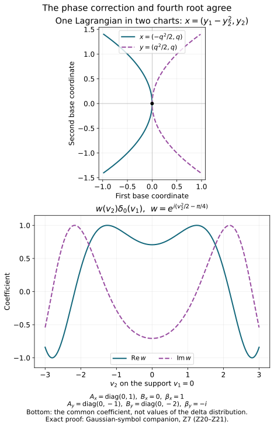

# The intrinsic symbol as a family of tangent Gaussians

The tangent comparison becomes intrinsic once its coefficient is identified
with the principal symbol and its Gaussian is allowed to depend on the
second jet of the modulating phase. We prove that identification, including
ordinary symbols without a fixed leading limit and Hessians of changing rank.

Original programme proof and examples: GPT-6 Astra (OpenAI), Ultra,
4 October 2026; CC0 to the extent rights exist. Earlier components keep
their separate licences. This private component does not authorize release.

## Z0. Objects and exact earlier proofs

Let \(X\) be a Hausdorff second-countable smooth \(n\)-manifold,
\(n\ge1\), and let \(\Lambda\subset T^*X\setminus0\) be a closed
smooth conic Lagrangian. Use
\(\omega=\sum d\xi_j\wedge dx_j\), \(D=-i\partial\), and distributional
half-densities. Fix \(\rho=(x_0,\xi_0)\in\Lambda\).
Finite-rank complex bundle values are treated at the end of each construction.

Use the actual earlier programme proofs:

- [C0–C5](../../20261004-free-intrinsic-graph/prerequisites/conic-frequency-coordinates.md)
  construct local conic frequency coordinates and their homogeneous potential;
- [F2–F7](../../20261004-free-intrinsic-graph/prerequisites/prescribed-phase-representation.md)
  prove phase representation, differentiated remainders and their exact orders;
- [K6–K7](../../20261004-free-intrinsic-graph/prerequisites/conic-parametrices-and-localization.md)
  prove intrinsic localization and sufficiently small cutoff independence;
- [M0a–M7](../../20261004-free-intrinsic-graph/prerequisites/relative-maslov-line.md)
  construct the relative Maslov line and its geometric evaluation;
- [PS1–PS6](../../20261004-free-intrinsic-graph/prerequisites/global-principal-symbol.md)
  prove the density law and global principal-symbol exact sequence;
- T1–T6 prove the full ordinary zoom
  estimate, rapid regular zoom, nonlinear half-density transport and the
  singular Gaussian formula;
- the earlier quadratic component
  supplies Q1–Q6: limit estimates, Gaussians, Schwartz bounds, inversion
  and symmetric diagonalization.

Write
\[
 \mathscr B_\rho=\Omega^{1/2}_{\Lambda,\rho}\otimes\mathscr L_\rho,
 \qquad r=m-n/4,\qquad M=m+n/4 .
 \tag{Z1}
\]
Here \(\mathscr L\) is M5's relative geometric Maslov line.
Its evaluation at a common transversal has the convention of M22.

A phase jet at \(\rho\) is the second jet of a real smooth function
\(\psi\) with \(\psi(x_0)=0\) and \(d\psi(x_0)=\xi_0\).
The difference of two such jets is an intrinsic real symmetric quadratic
form on \(T_{x_0}X\): the chain rule terms containing its first derivative
vanish. Every symmetric form occurs by taking a quadratic polynomial
in any base chart. We retain the whole family of phase jets.

## Z1. From the intrinsic class to the graph used by the zoom theorem

Choose the coordinates of C3–C4 near \(\rho\). They give
\(\Lambda=\{(H'(\xi),\xi)\}\) on a smaller conic set, with \(H\)
real and homogeneous of degree one. The phase
\(\phi(x,\theta)=x\cdot\theta-H(\theta)\) is nondegenerate:
its critical derivative has the identity block in the \(x\) variables.

For \(u\in I^m(X,\Lambda;\Omega_X^{1/2})\), K7 and F6 give a
sufficiently small compact proper cutoff \(P\), with full symbol one
near \(\rho\), such that \(Pu\) belongs to the frequency-graph class.
The forward graph criterion gives
\(e^{iH_e}\widehat{(Pu)_{\mathrm{coeff}}}\in S^{m-n/4}\).
Set
\[
 b=(2\pi)^{-n/4}e^{iH_e}\widehat{(Pu)_{\mathrm{coeff}}}.
 \quad\text{Then}\quad
 Pu=(2\pi)^{-3n/4}\int e^{i(x\cdot\xi-H_e(\xi))}b(\xi)\,d\xi
       \,|dx|^{1/2}.
 \tag{Z2}
\]
Fourier inversion and the proved distributional pairing justify the
identity. W4 makes \(u-Pu\) regular at \(\rho\); T4 makes its normalized
zoom rapidly decreasing, for every real \(m\). Consequently T1 applies
to every intrinsic \(u\), with its exact constant and exponent.

For this graph phase,
\[
 Q_\phi=\begin{pmatrix}0&I\\I&-H''\end{pmatrix},\qquad
 |\det Q_\phi|=1,\qquad \operatorname{sgn}Q_\phi=0,\qquad
 d_\phi=|d\xi|.
 \tag{Z3}
\]
Indeed the change \(x=\widetilde x+\tfrac12H''\theta\) reduces its
quadratic form to \(2\widetilde x\cdot\theta\). Splitting each such pair
into its sum and difference gives one positive and one negative square.
The change has determinant one. This proves all assertions in (Z3),
also for singular \(H''\).
PS28–PS29 therefore identify the principal symbol in the geometric
evaluation at the horizontal transversal \(\mu_0=\{(v,0)\}\) as
\[
                  \sigma_m(u)(\mu_0)=b(\xi)|d\xi|^{1/2}
                                  \pmod{S^{M-1}} .
 \tag{Z4}
\]
The horizontal plane is transverse to the frequency graph tangent
\(\{(H''\eta,\eta)\}\), regardless of the rank of \(H''\).

## Z2. Nonzero Gaussian frames, including changes of rank

In this chart put \(A=H''(\xi_0)\). For a phase jet with Hessian
\(B=\psi''(x_0)\), use T1's model
\[
 U_{A,B}(v)=(2\pi)^{-3n/4}
       \int e^{i(v\cdot\eta-v^TBv/2-\eta^TA\eta/2)}\,d\eta .
 \tag{Z5}
\]
It is a distribution on the tangent vector space with its indicated
coordinate half-density attached below.

First, \(U_{A,B}\ne0\) for every real symmetric \(A,B\).
In T6's range/kernel coordinates take a compact test
\[
 \varphi(y,z)=e^{-iy^T(A_R^{-1}-B_R)y/2}\alpha(y)\gamma(z),
\]
where \(\int\alpha>0\) and \(\gamma(0)=1\). Smooth nonnegative bumps
provide these choices. Formula T6 gives its pairing as a nonzero
constant times \(\int\alpha\). When the range is zero, use \(\gamma\)
alone; when the kernel is zero, use \(\alpha\) alone. Thus all ranks
are included.

Second, \(U_{A,B}\) depends smoothly on \(A,B\) as a distribution, even
across rank changes. For a compactly supported test \(\varphi\),
integrate in \(v\) first in (Z5). Each parameter derivative in \(A\)
inserts a polynomial in \(\eta\). Each derivative in \(B\) inserts
a polynomial in \(v\) before taking that Fourier transform.
For parameters in a compact set, Q3 bounds the latter transform by
any inverse power of \(\langle\eta\rangle\), uniformly in finitely
many seminorms of \(\varphi\). Choose that inverse power larger than
the inserted polynomial degree plus \(n+1\). The resulting integrable
bound justifies each derivative by Q1 and the segment difference-quotient
formula. Repeating the argument gives derivatives of every order and
their local finite-seminorm bounds. No inverse of \(A\) is used here.

Finally, changing the phase jet by a symmetric form \(C\) gives
\[
                  U_{A,B+C}=e^{-iv^TCv/2}U_{A,B}.
 \tag{Z6}
\]
This is the test integral itself. These multipliers are invertible and
compose by addition of \(C\).

Thus, in one frequency chart, the families
\[
             \bigl(\beta\,U_{A,B}|dv|^{1/2}\bigr)_{\text{phase jets }B},
             \qquad \beta\in\mathbb C,
 \tag{Z7}
\]
form a one-dimensional complex vector space. We next prove that this
space, with its half-density transformation, is independent of the chart.

## Z3. Realize any fibre value by a local leading homogeneous symbol

In a frequency chart, evaluation at \(\mu_0\) writes any
\(s_0\in\mathscr B_\rho\) uniquely as
\(\beta|d\xi|^{1/2}\). Evaluation is an isomorphism by M5.
Choose a smooth angular cutoff equal to one near \(\xi_0\) and supported
inside the chart. At sufficiently large \(|\xi|\), set
\[
 b_r(\xi)=
       \beta\left(\frac{|\xi|}{|\xi_0|}\right)^r
                \chi(\xi/|\xi|).
 \tag{Z8}
\]
Extend with a smooth high-frequency cutoff. This has ordinary symbol
order \(r\), by the proved homogeneous derivative estimates.
Its leading homogeneous value at \(\xi_0\) is \(\beta\).

Use this amplitude in the graph integral (Z2), and multiply the result
by a compact base cutoff equal to one near the relevant critical base
points. Such points form a compact set after a smaller angular restriction,
by continuity of \(H'\). F6 proves local \(I^m\) membership. F2 confines
the wavefront to this phase image; K6 gives the required intrinsic
membership after extension by zero if a global representative is desired.
The base and angular cutoffs have supports strictly inside their charts.

At those critical points the base cutoff is one. F3's leading formula
and its full one-order remainder therefore show that the actual reduced
frequency symbol equals \(b_r\) modulo \(S^{r-1}\) on a smaller cone.
By (Z4), the principal symbol has leading homogeneous section \(s_M\)
with \(s_M(\rho)=s_0\). This constructs the needed realization without
assuming a new theorem about classical symbol surjectivity.

A leading homogeneous section is unique. If a degree-\(M\) section is
of order \(M-1\), its coefficient in frequency coordinates is homogeneous
of degree \(r\) and has order \(r-1\). Along a ray, division by \(R^r\)
bounds its fixed value by \(C/R\). Letting \(R\to\infty\) proves that
value is zero. The argument works for every real \(r\).

In another frequency chart, PS3 transforms the symbol by the exact
Maslov and half-density laws. The frequency transition is homogeneous
of degree one; its Jacobian factor has degree zero, and Maslov
transitions are locally constant. Hence the transformed leading
coefficient is again homogeneous of degree \(r\), with an
\(S^{r-1}\) remainder. This verifies the classical leading hypothesis
of T2 in both charts for the same realizing distribution.

## Z4. The intrinsic Gaussian line and its canonical map

Define in a chosen chart
\[
 \mathcal J_\rho(s_0)_\psi
      =\beta\,U_{A,B}|dv|^{1/2},
 \qquad s_0(\mu_0)=\beta|d\xi|^{1/2}.
 \tag{Z9}
\]
We prove coordinate independence, rather than postulating a Gaussian
transformation formula.

Realize \(s_0\) by the distribution just constructed in Z3. In each
of two frequency charts, T2 identifies its normalized half-density
zoom limit with the corresponding expression (Z9). T5 proves that
these limits transform by the tangent linear change of variables,
with the absolute determinant to the one-half power. The modulating
function is the same geometric \(\psi\) in both charts.
Therefore the two expressions define the same distributional
half-density on \(T_{x_0}X\).

This argument applies to every \(s_0\), because Z3 realizes every fibre
value. It is independent of the chosen realization: T2's limit in any
fixed chart is exactly the right side of (Z9), determined solely by
\(\beta,A,B\). It also applies to every phase jet. Jets differing only
in terms of order three give the same limit, by T1's Taylor estimate;
jets differing in their Hessian obey (Z6).

There is a useful explicit warning about nonlinear charts. For
\(x=\kappa(y)\), \(T=D\kappa(y_0)\), the Hessian of the same phase is
\[
 B_y=T^TB_xT+
       \sum_j(\xi_0)_j D^2\kappa_j(y_0).
 \tag{Z10}
\]
This is the second derivative chain rule. The second term need not
vanish even if \(T=I\). The proof above uses this actual transformed
phase. Dropping that term would give a false model transformation.

Call the intrinsic space of families in (Z7), now identified between
charts, \(\mathscr G_\rho\). Equations (Z7) and (Z9) give a linear
isomorphism
\[
                     \mathcal J_\rho:\mathscr B_\rho
                                        \longrightarrow\mathscr G_\rho .
 \tag{Z11}
\]
It is injective because the Gaussian frame is nonzero, and surjective
by (Z7). On chart overlaps its transition is exactly the transition
of \(\mathscr B\), by coordinate independence. These nonzero smooth
transitions glue a complex line bundle over \(\Lambda\): one can
transport M5's bundle charts for \(\mathscr B\) through \(\mathcal J\).
This also gives the Hausdorff and countable chart structure, rather
than assuming it separately. The local Gaussian frames are smooth
families of distributions by Z2, including at changes of rank.
Consequently \(\mathcal J:\mathscr B\to\mathscr G\) is a smooth line
bundle isomorphism.

For a finite-rank complex bundle \(E\), take components in a local
frame and tensor (Z11) with \(E_{x_0}\). T5 replaces a smooth frame
change by its value at \(x_0\), with \(O_{\mathcal D'}(t^{-1})\) error.
Thus the construction is independent of that frame as well.
This proves the global Gaussian/Maslov identification with its exact
half-density normalization; it makes no assertion of a preferred
trivialization of either line.

## Z5. Ordinary intrinsic symbols and the actual tangent comparison

For a symbol representative \(s\in S^M(\Lambda;\mathscr B\otimes\pi^*E)\),
let \(\delta_R(x,\xi)=(x,R\xi)\) and form at \(\rho\)
\[
       s_t=t^{-2M}\,(\delta_{t^2}^*s)_\rho,\qquad t\to\infty .
 \tag{Z12}
\]
The pullback uses the natural half-density action on \(\Lambda\),
the positive dilation action on \(\mathscr L\) proved in M5–M6,
and the unchanged base fibre of \(E\).
In frequency coordinates the half-density contributes \(t^n\).
The horizontal transversal is preserved by this dilation.
Using (Z4), its coefficient is therefore
\[
       s_t(\mu_0)
       =t^{-2r}b(t^2\xi_0)|d\xi|^{1/2}
                       +O(t^{-2})|d\xi|^{1/2}.
 \tag{Z13}
\]
A different representative of the same principal-symbol class changes
\(s_t\) by \(O(t^{-2})\): the lower-order coefficient has size
\(O((t^2)^{r-1})\), and the normalizing factor is \(t^{-2r}\).
This is a bound in a fixed finite-dimensional fibre, so its image under
\(\mathcal J_\rho\), evaluated at a fixed phase jet, is
\(O_{\mathcal D'}(t^{-2})\).

Let \(a_t(v)\) denote the local map with coordinates \(x_0+v/t\).
Then for every \(u\in I^m(X,\Lambda;E\otimes\Omega_X^{1/2})\),
\[
 t^{-2m}a_t^*(e^{-it^2\psi}u)
       =\mathcal J_\rho(s_t)_\psi+O_{\mathcal D'}(t^{-1}).
 \tag{Z14}
\]
To prove it, use Z1 to replace \(u\) by its exact local graph
representative; T4 handles the regular difference. The half-density
pullback contributes \(t^{-n/2}\), so its coefficient on the left
is T1's \(W_t\). Equations T1, (Z9) and (Z13) give (Z14).
T5 proves its invariance under nonlinear coordinates and frames
with the same finite-order error. The phase two-jet rule is (Z6).
Every used error is uniform in a finite test seminorm on each fixed
compact support, as required by the definition of \(O_{\mathcal D'}\).

If \(\sigma_m(u)\) has leading homogeneous section \(s_M\), then
\[
           t^{-2m}a_t^*(e^{-it^2\psi}u)
                  \longrightarrow\mathcal J_\rho(s_M(\rho))_\psi .
 \tag{Z15}
\]
Indeed \(s_t=s_M(\rho)+O(t^{-2})\). For a leading section of complex
degree \(M+i\nu\), multiply the left side by \(t^{-2i\nu}\);
the limit is the corresponding leading fibre value under \(\mathcal J\).
This follows from the same radial identity and \(|t^{-2i\nu}|=1\).

For ordinary symbols no homogeneous leading section is assumed,
and \(s_t\) can fail to converge. T1's bounded moving coefficient
and its \(O(t^{-1})\) comparison are the conclusion. The six worked
examples of the tangent lesson, including its nonconvergent compactly
localized example and sharp first error, remain in force.

## Z6. Dilation and the signature on a constant-rank stratum

These checks identify the factors in (Z11) more explicitly.
For a positive scalar \(R\), homogeneity gives
\(H''(R\xi_0)=R^{-1}A\), while the phase \(R\psi\) has Hessian \(RB\).
Substitution \(\eta=\sqrt R\,\zeta\) in the tested integral gives
\[
 U_{A/R,RB}(v)=R^{n/2}U_{A,B}(\sqrt R\,v).
 \tag{Z16}
\]
The same identity for half-densities is
\[
 U_{A/R,RB}|dv|^{1/2}
       =R^{n/4}d_{\sqrt R}^{\,*}
                    (U_{A,B}|dv|^{1/2}),\qquad d_{\sqrt R}(v)=\sqrt R\,v .
 \tag{Z17}
\]
The substitution is justified in the Schwartz test pairing.
If \(s_M\) is homogeneous of degree \(M=m+n/4\), its coefficient
at \(R\rho\) is \(R^{m-n/4}\) times that at \(\rho\).
Combining this with (Z17) gives the exact classical scaling
\[
 \mathcal J_{R\rho}(s_M(R\rho))_{R\psi}
       =R^m d_{\sqrt R}^{\,*}\mathcal J_\rho(s_M(\rho))_\psi .
 \tag{Z18}
\]

On a constant-rank stratum of \(A\), M7's canonical relative-line
trivialization has coefficient
\[
                      \beta\,e^{-i\pi\operatorname{sgn}A_R/4}.
 \tag{Z19}
\]
In fact the graph phase has \(N=n\), fibre signature
\(c=-\operatorname{sgn}A_R\), and phase coordinate
\(z=e^{i\pi n/4}\beta\). M7 multiplies \(z\) by
\(e^{i\pi(c-n)/4}\), proving (Z19).
This is exactly the signature factor in T6.
The determinant \(|\det A_R|^{-1/2}\), the power
\((2\pi)^{n/4-k/2}\), the range chirp and the kernel delta are the
additional explicit factors in the Gaussian distribution.

When the rank changes, (Z19) is a stratum-specific description;
it is not a global smooth frame through that change. Z2 and Z11
supply the smooth distribution family and bundle identification
there without dividing by a vanishing determinant.

## Z7. A nonlinear chart with a nontrivial fourth-root factor

This example checks the simultaneous phase, density and Maslov changes.
Take \(n=2\), \(\rho=(0;(1,0))\), and
\[
 H(\xi)=\frac{\xi_2^2}{2\xi_1},\quad \xi_1>0,\qquad
 \psi(x)=x_1,\qquad x=\kappa(y)=(y_1-y_2^2,y_2).
 \tag{Z20}
\]
At zero \(D\kappa=I\) and \(\det D\kappa=1\).
Originally \(A=\operatorname{diag}(0,1)\) and \(B=0\).
The transformed phase is \(\psi\circ\kappa=y_1-y_2^2\), so
\(B_y=\operatorname{diag}(0,-2)\).

On the original Lagrangian put \(q=\xi_2/\xi_1\).
Then \(x=(-q^2/2,q)\), \(y=(q^2/2,q)\), and
\(\zeta=D\kappa(y)^T\xi=(\xi_1,-\xi_2)\).
Thus the new frequency potential is
\(\widetilde H(\zeta)=-\zeta_2^2/(2\zeta_1)\), and
\(A_y=\operatorname{diag}(0,-1)\).
The half-density frequency Jacobian has absolute determinant one.

Choose a leading symbol with old geometric coefficient \(\beta=1\).
The canonical coefficient (Z19) is \(e^{-i\pi/4}\).
In the new coordinates it is \(\beta_y e^{i\pi/4}\), with the
same density and intrinsic constant-intersection trivialization.
Therefore \(\beta_y=-i\).
T6 gives, writing \(v=(v_1,v_2)\),
\[
 \begin{aligned}
 U_{A,0}&=e^{-i\pi/4}e^{iv_2^2/2}\delta_0(v_1),\\
 U_{A_y,B_y}&=e^{i\pi/4}e^{iv_2^2/2}\delta_0(v_1),\\
                   (-i)U_{A_y,B_y}&=U_{A,0}.
 \end{aligned}
 \tag{Z21}
\]
The range determinants and the \((2\pi)\) factors are one.
The tangent coordinate change is the identity, so the last equality
is exactly the required half-density covariance.
Both the quadratic term in (Z10) and the fourth-root transition are
necessary for this equality.

*The upper curves use the exact parametrizations in (Z20); they are two
coordinate descriptions of one Lagrangian base image. The lower plot shows
the coefficient \(w(v_2)=e^{i(v_2^2/2-\pi/4)}\) multiplying
\(\delta_0(v_1)\), not pointwise values of that distribution. The two
normalized models coincide by (Z21). The sampling illustrates the proved
identity. [Reproducible figure source](../figures/draw_gaussian_covariance.py).*

## Free sources and the completed scope

The local rescaling comparison uses the free human sources and exact
programme proofs listed in the tangent lesson.
The relative-line and principal-symbol inputs come from the programme
proofs based on Lars Hörmander's freely readable
[*Fourier integral operators. I*](https://projecteuclid.org/journals/acta-mathematica/volume-127/issue-none/Fourier-integral-operators-I/10.1007/BF02392052.pdf),
Sections 3.2–3.3. Guillemin and Sternberg's free author draft,
[*Semi-classical Analysis*, 13 January 2010](https://math.mit.edu/~vwg/semiclassGuilleminSternberg.pdf),
Section 5.15.4, supplies a quadratic generating-function comparison.
No source prose, Gaussian transformation formula, phase-equivalence theorem,
or unproved reduction or surjectivity assertion is imported.

Z1 supplies the intrinsic graph input. Z2–Z6 supply the global
Gaussian/Maslov identification, including all ranks, all real orders,
ordinary symbol classes and finite-rank bundle values. Further
Fourier-integral composition and the rest of AN-04 remain separate work.

