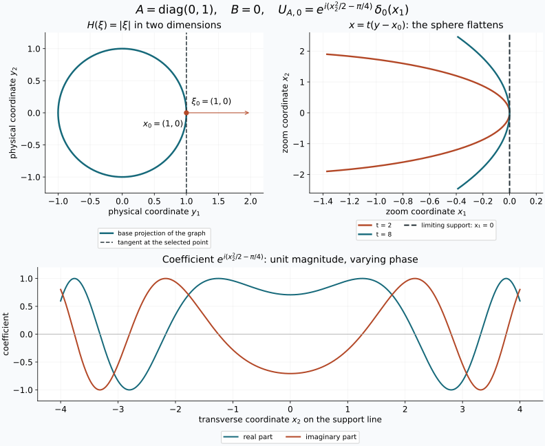

# Tangent zoom and quadratic models

Private receiving draft for AN04-U005, 4 October 2026. The local estimates below apply to every intrinsic \(I^m\) distribution through the completed earlier graph theorem. The [Gaussian-symbol companion](prerequisites/gaussian-symbol-line.md) proves the exact intrinsic normalization and global Gaussian/Maslov identification.

At a selected nonzero covector, modulation removes a rapidly oscillating
linear phase. Spatial magnification then leaves a quadratic phase and a
distribution supported on the range of its frequency Hessian. A singular
Hessian produces a delta distribution in the complementary directions.
An ordinary symbol can retain an oscillating leading coefficient, so the
quadratic model need not be a limit with a fixed coefficient.

## 1. Conventions and the earlier proofs

All distributions and pairings are complex linear. Put \(D_j=-i\partial_j\),
\(\widehat f(\xi)=\int e^{-ix\cdot\xi}f(x)\,dx\), and use inverse factor
\((2\pi)^{-n}\). A test is a smooth compactly supported function. On a fixed
compact \(K\), write
\[
 p_{K,N}(\phi)=\max_{|\alpha|\leq N}\sup|\partial^\alpha\phi|.
\]
A distribution obeys \(|v(\phi)|\leq C_Kp_{K,N_K}(\phi)\) for each such
\(K\). Weak convergence means convergence on every fixed test. In this lesson
\(v_t=O_{\mathcal D'}(t^{-a})\) means that for every fixed compact test
support there are \(C,N,t_0\) such that
\[
 |v_t(\phi)|\leq Ct^{-a}p_{K,N}(\phi),\qquad t\geq t_0.
\tag{1.1}
\]
This includes uniformity over all tests with the indicated seminorm bounded.

The earlier [quadratic stationary-phase component](../20261004-free-stationary-phase/quadratic-stationary-phase.md)
proves the integration limit rule Q1, complex Gaussian Q2, Schwartz Fourier
estimates Q3, inversion Q4, symmetric diagonalization Q5 and quadratic
Fourier identity Q6. Its complete F0 chains supply the elementary calculus,
integration, compactness and matrix results used here. The earlier
[stationary lesson](../20261004-free-stationary-phase/stationary-phase-and-critical-manifolds.md),
Appendix A.4, supplies smooth cutoffs. The selected
[uniform-bound proof U1](prerequisites/uniform-distribution-bounds.md) includes
its full [complete-test-space and Baire prerequisites](prerequisites/complete-test-spaces.md).
These are programme proof texts, with their separate licences.

A smooth symbol \(b\in S^r(\mathbb R^n)\), \(r\in\mathbb R\), satisfies
\[
 |\partial^\alpha b(\xi)|\leq C_\alpha\langle\xi\rangle^{r-|\alpha|},
 \qquad \langle\xi\rangle=(1+|\xi|^2)^{1/2}.
\tag{1.2}
\]
Let \(H\) be real, smooth away from zero and positively homogeneous of
degree one. Choose a real smooth extension \(H_e\) agreeing with \(H\)
for \(|\xi|\geq R_0\). For example multiply \(H\) by a smooth radial
cutoff vanishing near zero. Define the graph distribution by
\[
 u(x)=c_n\int e^{i(x\cdot\xi-H_e(\xi))}b(\xi)\,d\xi,
 \qquad c_n=(2\pi)^{-3n/4}.
\tag{1.3}
\]
The integral means
\(u(\phi)=c_n\int e^{-iH_e(\xi)}b(\xi)\widehat\phi(-\xi)\,d\xi\).
It converges absolutely and is bounded by finitely many Schwartz seminorms
of \(\phi\), by (1.2) and Q3. Thus it defines a tempered distribution and,
on compact test supports, a distribution. Its Fourier transform is
\((2\pi)^{n/4}e^{-iH_e}b\), by Q4 and transposition.

The normalization corresponding to the programme's graph order is
\(r=m-n/4\). The earlier
[prescribed-phase theorem F6](../20261004-free-intrinsic-graph/prerequisites/prescribed-phase-representation.md)
and [intrinsic localization K7](../20261004-free-intrinsic-graph/prerequisites/conic-parametrices-and-localization.md)
supply the localized graph representation of an intrinsic \(I^m\)
distribution modulo an error regular at the selected covector.
The forward graph criterion puts its reduced Fourier coefficient in
\(S^{m-n/4}\); multiplying it by \((2\pi)^{-n/4}\) gives exactly
the amplitude \(b\) in (1.3). T4 below handles the regular remainder.
The companion's Z1 records this argument with all normalization factors.

## 2. The frequency-graph zoom

Fix \(\xi_0\ne0\), set \(x_0=H'(\xi_0)\), and choose a real smooth
\(\psi\) near \(x_0\) with \(\psi(x_0)=0\), \(\psi'(x_0)=\xi_0\).
Write
\[
 A=H''(\xi_0),\quad B=\psi''(x_0),\quad
 Q_{A,B}(x,\eta)=x\cdot\eta-\tfrac12x^TBx-\tfrac12\eta^TA\eta.
\tag{2.1}
\]
Both matrices are real symmetric.
Define
\[
 U_{A,B}=c_n\int e^{iQ_{A,B}(x,\eta)}\,d\eta,
 \qquad
 W_t=t^{-(2r+n)}(u e^{-it^2\psi})(x_0+x/t),\quad t\geq1.
\tag{2.2}
\]
For distributions the last expression is the pullback by the affine map
\(x\mapsto x_0+x/t\), followed by the scalar factor. Equivalently,
\[
 \langle W_t,\phi\rangle
  =t^{-2r}\langle u,e^{-it^2\psi(y)}\phi(t(y-x_0))\rangle.
\tag{2.3}
\]
For fixed test support this is defined for all sufficiently large \(t\).
In \(U_{A,B}\), integrate against the test in \(x\) first. The resulting
Fourier transform of \(e^{-ix^TBx/2}\phi\) decreases faster than every
power, so this definition also converges absolutely.

**Theorem T1 (the ordinary-symbol comparison).** For every symbol (1.2),
\[
 W_t-c_tU_{A,B}=O_{\mathcal D'}(t^{-1}),\qquad
 c_t=t^{-2r}b(t^2\xi_0).
\tag{2.4}
\]
The coefficients \(c_t\) are bounded; they need not converge. The result
holds componentwise for symbols in any fixed finite-dimensional vector
space. The weaker conclusion that the difference tends to zero follows
without choosing any leading homogeneous coefficient.

**Proof.** Differentiating \(H(s\xi)=sH(\xi)\) in \(s\) at one gives
Euler's identity \(H(\xi)=\xi\cdot H'(\xi)\). Introduce
\[
 \begin{split}
 b_t(\eta)&=t^{-2r}b(t^2\xi_0+t\eta),\\
 R_t(\eta)&=H_e(t^2\xi_0+t\eta)-t^2H(\xi_0)-t x_0\cdot\eta,\\
 q_t(x)&=t^2\bigl(\psi(x_0+x/t)-\xi_0\cdot x/t\bigr),\\
 F_t(\eta)&=\int e^{i(x\cdot\eta-q_t(x))}\phi(x)\,dx.
 \end{split}
\tag{2.5}
\]
The substitution \(\xi=t^2\xi_0+t\eta\), justified in the absolutely
convergent test pairing, and Euler's identity give exactly
\[
 \langle W_t,\phi\rangle
   =c_n\int b_t(\eta)e^{-iR_t(\eta)}F_t(\eta)\,d\eta.
\tag{2.6}
\]
The Jacobian is \(t^n\); it cancels the \(t^{-n}\) in (2.2).

The integral Taylor formula, obtained by applying the fundamental theorem
twice on a segment, gives
\[
 q_t(x)=\int_0^1(1-s)\,x^T\psi''(x_0+sx/t)x\,ds.
\tag{2.7}
\]
On each fixed compact \(K\), its difference from \(x^TBx/2\) is
\(O(t^{-1})\) in every derivative. Indeed subtract \(\psi''(x_0)\)
and apply the fundamental theorem once more; every derivative of the
resulting compact integral is bounded, with its explicit factor \(1/t\).
Product and chain rules then show, by Q3, that for each \(L\) there are
\(N,C\) with
\[
 |F_t(\eta)|\leq Cp_{K,N}(\phi)\langle\eta\rangle^{-L},\quad
 |F_t(\eta)-F_\infty(\eta)|
 \leq Ct^{-1}p_{K,N}(\phi)\langle\eta\rangle^{-L},
\tag{2.8}
\]
where \(F_\infty=\int e^{ix\cdot\eta-ix^TBx/2}\phi(x)\,dx\).
This argument uses the fully proved Fourier derivative estimates; it
does not drop a divergence term from a transposed vector field.

Choose \(0<c<|\xi_0|/2\). In \(|\eta|\leq ct\) the frequency segment
between \(t^2\xi_0\) and \(t^2\xi_0+t\eta\) has size comparable to
\(t^2\). The symbol derivative bound and one segment integral give
\[
 |b_t(\eta)-c_t|\leq Ct^{-1}|\eta|.
\tag{2.9}
\]
For large \(t\), homogeneity and the third-order integral remainder give
on that same region
\[
 R_t(\eta)=\tfrac12\eta^TA\eta+E_t(\eta),\qquad
 |E_t(\eta)|\leq Ct^{-1}|\eta|^3.
\tag{2.10}
\]
All points \(\xi_0+s\eta/t\) stay in one compact set away from zero,
so the required third derivatives of \(H\) have a common bound.

There is also a global estimate
\[
 |b_t(\eta)|+|c_t|\leq C\langle\eta\rangle^{2|r|}.
\tag{2.11}
\]
For \(r\geq0\), use
\(\langle t^2\xi_0+t\eta\rangle\leq Ct^2\langle\eta\rangle\).
For \(r<0\), the near region just considered gives a constant bound;
outside it use \(\langle t^2\xi_0+t\eta\rangle^r\leq1\) and
\(t^{2|r|}\leq C\langle\eta\rangle^{2|r|}\).

Subtract \(c_t\langle U_{A,B},\phi\rangle\) from (2.6). Replacing
\(F_t\) by \(F_\infty\) costs at most \(Ct^{-1}p_{K,N}(\phi)\), by
(2.8), (2.11) and an integrable power bound. In \(|\eta|\leq ct\),
(2.9), (2.10) and \(|e^{is}-e^{iv}|\leq|s-v|\) for real \(s,v\)
give the same bound after integration against \(F_\infty\).
Outside this region, bound both exponential factors by one and use
(2.11). Taking \(L>n+2|r|+4\) in (2.8) makes that tail at most
\(Ct^{-1}p_{K,N}(\phi)\); the rectangular-shell proof is Q3/P18.3.
All constants involve finitely many fixed seminorms. This proves (2.4),
including its uniform test estimate. Finitely many component estimates
give the vector-valued assertion. \(\square\)

**Corollary T2 (classical and complex degrees).** If
\(b(\xi)=b_r(\xi)+S^{r-1}\) at large frequency, with \(b_r\)
homogeneous of real degree \(r\), then
\[
 c_t=b_r(\xi_0)+O(t^{-2}),\qquad W_t\longrightarrow b_r(\xi_0)U_{A,B}.
\tag{2.12}
\]
The error of the full distribution is still in general only
\(O_{\mathcal D'}(t^{-1})\). For a leading term of complex degree
\(r+i\nu\), \(\nu\in\mathbb R\), with remainder in \(S^{r-1}\),
\[
 t^{-2i\nu}W_t\longrightarrow b_{r+i\nu}(\xi_0)U_{A,B}.
\tag{2.13}
\]
Here \(t^{2i\nu}=e^{2i\nu\log t}\); without this demodulation there
need not be a limit. These conclusions follow by evaluating the stated
homogeneity at \(t^2\xi_0\) in (2.4). A different smooth low-frequency
extension changes (1.3) by an inverse transform of a smooth compact
function, hence by a smooth function by differentiation under its compact
integral. The next theorem proves that such a change has no effect.

## 3. Covectors where the distribution is regular

We use the Fourier definition: \((x_0,\xi_0)\), \(\xi_0\ne0\), is
regular for \(v\) if some compact smooth \(\chi\), equal to one near
\(x_0\), has \(\widehat{\chi v}\) decreasing faster than every power in
an open cone about \(\xi_0\). No coordinate-invariance theorem about
wavefront sets is assumed in the proof that follows.

**Lemma T3 (the compact-distribution Fourier bound).** A compactly supported
distribution has a smooth Fourier transform of polynomial growth, and for
every test \(f\)
\[
 v(f)=(2\pi)^{-n}\int\widehat v(\xi)\widehat f(-\xi)\,d\xi.
\tag{3.1}
\]

**Proof.** Choose a smooth compact cutoff \(\chi=1\) near the support
and define \(\widehat v(\xi)=v(\chi(x)e^{-ix\cdot\xi})\). Independence
of \(\chi\) follows from the definition of support. The fixed-support
finite-order bound gives \(|\widehat v(\xi)|\leq C\langle\xi\rangle^M\).
Difference quotients of the exponential converge with all derivatives on
\(\operatorname{supp}\chi\), by the integral Taylor formula; applying
that bound proves smoothness and all differentiated formulas. Invert
\(f\) by Q4, multiply by \(\chi\), and apply \(v\). To justify moving
\(v\) inside the integral, truncate frequency to a cube and approximate
its integral by Riemann sums in the finitely many derivative supremum
norms used by \(v\). Uniform continuity on the two compact sets gives
this convergence. The derivative tails are bounded by
\(C\int_{|\xi|>R}\langle\xi\rangle^M|\widehat f(-\xi)|\,d\xi\to0\),
by Q3. Linearity and the finite-order estimate now give (3.1).
\(\square\)

**Theorem T4 (rapid regular zoom).** If \((x_0,\xi_0)\) is regular for
\(v\), then for every real \(K\) and real smooth \(\psi\) with the
same value and first derivative as in Section 2,
\[
 t^K(v e^{-it^2\psi})(x_0+x/t)=O_{\mathcal D'}(t^{-L})
 \quad\hbox{for every }L>0.
\tag{3.2}
\]

**Proof.** Fixed compact tests use only a neighborhood on which \(\chi=1\)
for large \(t\), so replace \(v\) by \(\chi v\). For linear
\(\psi(y)=\xi_0\cdot(y-x_0)\), (3.1) and the affine substitution give
the pairing
\[
 (2\pi)^{-n}t^{K+n}\int e^{ix_0\cdot(t^2\xi_0+t\eta)}
 \widehat{\chi v}(t^2\xi_0+t\eta)\widehat\phi(-\eta)\,d\eta.
\tag{3.3}
\]
For some \(c>0\), \(|\eta|<ct\) puts the Fourier argument in the
regular cone with norm at least \(ct^2\). Arbitrarily high cone decay
makes this part smaller than any specified power of \(t\), uniformly
in finitely many test seminorms. On \(|\eta|\geq ct\), Lemma T3 bounds
the Fourier factor by \(Ct^{2M}\langle\eta\rangle^M\). Q3 bounds
\(\widehat\phi\) by any inverse power with a finite test seminorm.
Choose that power greater than \(K+n+2M+L+M+n+1\), increasing it to a
positive integer if necessary. The tail in (3.3) is \(O(t^{-L})\).
For general \(\psi\), replace the test by \(e^{-iq_t}\phi\).
Formula (2.7) bounds every required seminorm of these tests uniformly,
so the same estimates apply. This proves the asserted uniform result.
\(\square\)

A smooth error is regular at each nonzero covector: its localized smooth
compact representative has rapid Fourier decay by Q3. More generally,
any remainder satisfying the specified microlocal regularity is harmless
in T1 for every real \(r\), by taking \(K=-(2r+n)\) in T4.

## 4. Nonlinear coordinates, frames and phases

**Lemma T5 (tangent pullback).** Let \(\kappa\) be a smooth local
diffeomorphism, \(\kappa(0)=0\), \(T=\kappa'(0)\). Put
\(\kappa_t(x)=t\kappa(x/t)\). If \(v_t\to v\) weakly as \(t\to\infty\),
then, locally on every fixed compact test support,
\[
 \kappa_t^*v_t\longrightarrow T^*v.
\tag{4.1}
\]
This holds both for scalar distributions and for distributional
half-densities. Scalar pullback sends a test \(\phi\) to
\(\phi\circ\kappa_t^{-1}|\det D\kappa_t^{-1}|\); half-density pullback
uses the power \(1/2\) instead of one.

**Proof.** The segment identity
\(\kappa_t(x)=\int_0^1\kappa'(sx/t)x\,ds\) proves convergence to
\(Tx\) in every derivative on bounded sets. The inverse map is explicitly
\(\kappa_t^{-1}(y)=t\kappa^{-1}(y/t)\) wherever needed, so the same
proof gives convergence to \(T^{-1}y\). For a fixed test support \(K\),
the images \(\kappa_t(K)\) lie in one compact set \(K'\) and in a
common domain of these inverses for large \(t\). This follows directly
from the uniform convergence to \(T\) and the expanding scaled domain
of the original local inverse. Choose \(K'\) slightly larger than those
images. Extending the transformed tests by zero is smooth, and their
supports stay in the interior of \(K'\).

The determinant is a polynomial in the derivative entries. Its absolute
value is bounded away from zero near the compact sets in question,
because the limiting matrix is invertible. Thus the absolute determinant
and its positive square root, with all derivatives, converge to the
constant factors for \(T^{-1}\). Chain and product rules show convergence
of the transformed tests in every derivative on \(K'\).

To apply a weakly convergent distribution to these moving tests, take
any sequence \(t_j\to\infty\). The selected programme theorem U1 gives
one finite-order bound for \(v_{t_j}\) on \(K'\), and its moving-test
conclusion gives (4.1) along that sequence. If a scalar test pairing failed
to converge as \(t\to\infty\), its failure would supply a sequence
\(t_j\geq j\) bounded away from the proposed limit, a contradiction.
Thus (4.1) holds for the parameter itself. This argument does not assume
uniform boundedness over unexamined finite intervals of \(t\).
\(\square\)

The same proof gives an \(O(t^{-1})\) difference between
\(\kappa_t^*v_t\) and \(T^*v_t\) whenever \(v_t\) already has a
uniform local finite-order bound: the transformed tests differ by
\(O(t^{-1})\) in every derivative, using one more segment Taylor formula.
T1 supplies such a bound even when \(c_t\) does not converge. Thus the
ordinary-symbol comparison itself, as well as a convergent classical
limit, transforms by the tangent linear map.

For a smooth finite-dimensional frame change \(G\),
\(G(x_0+x/t)-G(x_0)=O(t^{-1})\) in every compact derivative norm.
The same finite-order estimate therefore replaces the frame by its
value at \(x_0\). For half-densities the pullback exponent above follows
also from the ordinary-function rule
\(f(\kappa(x))|\det D\kappa(x)|^{1/2}\): substituting variables in the
pairing leaves \(|\det D\kappa^{-1}|^{1/2}\). This establishes the
convention without assuming a transformation formula for distributions.

In particular, if the original object is \(u(y)|dy|^{1/2}\), its
normalized half-density zoom is \(t^{-2m}\) times the pullback of
\(e^{-it^2\psi}u(y)|dy|^{1/2}\) by \(y=x_0+x/t\).
The pullback contributes \(t^{-n/2}\), so its coefficient in
\(|dx|^{1/2}\) is exactly \(W_t\), since \(2m=2r+n/2\).
Under a nonlinear chart change, the two scaled charts differ by
\(\kappa_t\); T5 therefore gives the tangent half-density rule
with the same normalization.

If \(p(x_0)=0\), \(p'(x_0)=0\), and \(C=p''(x_0)\), then (2.7) gives
\(t^2p(x_0+x/t)\to x^TCx/2\) in every compact derivative norm. Hence
changing \(\psi\) to \(\psi+p\) gives
\[
 U_{A,B+C}=e^{-ix^TCx/2}U_{A,B}.
\tag{4.2}
\]
The exact equality also follows directly from the defining test integral.
These changes compose by addition of symmetric matrices. Every such
matrix is realized by the quadratic function \(p(y)=(y-x_0)^TC(y-x_0)/2\),
so the action on phase second derivatives is transitive.

## 5. The singular quadratic distribution

Let \(k=\operatorname{rank}A\), \(R=\operatorname{ran}A\),
\(Z=\ker A\), and use the orthogonal split \(x=(y,z)\in R\oplus Z\).
Symmetry gives \(R=Z^\perp\): \(A\eta\) is orthogonal to each kernel
vector, and the dimensions agree by the rank-nullity proof in the earlier
linear-algebra chain. The restriction \(A_R:R\to R\) is invertible;
write \(B_R\) for the restriction of the quadratic form \(B\) to \(R\).

**Theorem T6.** In the orthonormal coordinates just specified,
\[
 U_{A,B}(y,z)=
 (2\pi)^{n/4-k/2}|\det A_R|^{-1/2}
 e^{-i\pi\operatorname{sgn}A_R/4}
 e^{\frac i2 y^T(A_R^{-1}-B_R)y}\,\delta_0(z).
\tag{5.1}
\]
For \(k=0\), the empty determinant is one and the signature is zero;
the formula is \((2\pi)^{n/4}\delta_0(x)\).

**Proof.** Diagonalize \(A_R\) by the proved Q5. Insert
\(e^{-\varepsilon|\eta|^2/2}\) in the defining integral. On testing,
the limit as \(\varepsilon\downarrow0\) follows from the integrable
Schwartz bound already used in (2.2), by Q1. Each nonzero eigenvalue
\(a\) contributes the elementary Gaussian
\[
 (2\pi)^{1/2}(\varepsilon+ia)^{-1/2}
 \exp\!\left(-\frac{y^2}{2(\varepsilon+ia)}\right),
\tag{5.2}
\]
where the square root has positive real part. Q2 gives its limit
\((2\pi)^{1/2}|a|^{-1/2}e^{-i\pi\operatorname{sgn}(a)/4}e^{iy^2/(2a)}\).
The factors are uniformly bounded in absolute value for small positive
\(\varepsilon\), including their prefactors. Each kernel direction
contributes \((2\pi/\varepsilon)^{1/2}e^{-z^2/(2\varepsilon)}\).
Its integral is \(2\pi\), and its mass outside any fixed neighborhood
of zero tends to zero after the substitution \(z=\sqrt\varepsilon w\),
by the Gaussian tail estimate from Q2. Thus in \(d=n-k\) such directions
the product tends to \((2\pi)^d\delta_0(z)\).

For completeness, these limits can be combined against a Schwartz test:
the kernel Gaussian has uniformly bounded total mass; on a large compact
\(y\)-set the other factors converge uniformly and the test is uniformly
continuous in \(z\); outside that \(y\)-set, a sufficiently high power
of \(\langle y\rangle^{-1}\) bounds the test uniformly in \(z\).
The uniform bound on the oscillatory factors then makes the remaining
tail arbitrarily small. This is the compact-plus-tail argument Q1 and
does not require an interchange of two unevaluated oscillatory integrals.
Finally multiply by \(e^{-ix^TBx/2}\). At \(z=0\) this is precisely
\(e^{-iy^TB_Ry/2}\); cross terms vanish. Combining powers gives
\(-3n/4+k/2+(n-k)=n/4-k/2\), proving (5.1).
\(\square\)

Multiplication by this chirp preserves the Schwartz test space:
each derivative of the chirp is the chirp times a polynomial, by induction
with the product rule. Every weighted derivative of its product with a
Schwartz function is therefore bounded by finitely many Schwartz
seminorms. This also proves continuity of the tempered distribution
defined in (5.1).

Differentiating Euler's identity in \(\xi\) gives
\(H''(\xi)\xi=0\). Consequently the radial direction \(\xi_0\) is
always in the kernel in this homogeneous graph problem. Assuming the
full matrix \(A\) invertible would discard the actual conic case.

## 6. The two tangent planes

In the cotangent coordinates \((x,\xi)\), use
\(\omega=\sum d\xi_j\wedge dx_j\), so
\(\omega((v,w),(v',w'))=w\cdot v'-w'\cdot v\). The graph
\(\xi\mapsto(H'(\xi),\xi)\) has tangent plane
\(\{(A\eta,\eta)\}\). The graph of \(d\psi\) has tangent plane
\(\{(v,Bv)\}\). Both have dimension \(n\); their symplectic pairings
vanish by symmetry of \(A\) or \(B\). This verifies the Lagrangian
property directly, where a Lagrangian plane means an \(n\)-dimensional
subspace with zero restricted symplectic form.

Subtracting the phase gradient applies the linear shear
\((v,w)\mapsto(v,w-Bv)\). It preserves \(\omega\), since its additional
terms cancel by symmetry of \(B\), and sends the second plane to
\(\{(v,0)\}\). The first becomes
\[
 \lambda_{A,B}=\{(A\eta,\eta-BA\eta):\eta\in\mathbb R^n\}.
\tag{6.1}
\]
Its parametrization is injective: if both components vanish, the second
is \(\eta\). It therefore still has dimension \(n\). The generating
quadratic \(Q_{A,B}\) yields exactly this plane, because
\(\partial_\eta Q=x-A\eta=0\) and
\(\partial_x Q=\eta-Bx\). These calculations establish all assertions
about the planes without importing a general normal-form theorem.

### 6.1. The intrinsic symbol and Gaussian line

Put \(\mathscr B=\Omega_\Lambda^{1/2}\otimes\mathscr L\otimes\pi^*E\),
where \(\mathscr L\) is the relative Maslov line, and let
\(s\in S^{m+n/4}(\Lambda;\mathscr B)\) represent the principal-symbol class.
The [companion Z2–Z4](prerequisites/gaussian-symbol-line.md#z4-the-intrinsic-gaussian-line-and-its-canonical-map)
constructs the canonical map \(\mathcal J_\rho\) to families of
distributional half-densities on \(T_{x_0}X\), indexed by phase second jets.
In a frequency chart it sends \(\beta|d\xi|^{1/2}\), evaluated in
the geometric Maslov line at the horizontal transversal, to
\(\beta U_{A,B}|dv|^{1/2}\).

**Theorem T8 (intrinsic tangent comparison).** Write
\(\delta_R(x,\xi)=(x,R\xi)\) and \(a_t(v)=x_0+v/t\) in a local chart.
Then
\[
 t^{-2m}a_t^*(e^{-it^2\psi}u)
   =\mathcal J_\rho\!\left(
       t^{-2m-n/2}(\delta_{t^2}^*s)_\rho
      \right)_\psi+O_{\mathcal D'}(t^{-1}).
\tag{6.2}
\]
The complete proof is [Z5](prerequisites/gaussian-symbol-line.md#z5-ordinary-intrinsic-symbols-and-the-actual-tangent-comparison):
the intrinsic graph representative gives T1, T4 removes its microlocally
regular error, and the half-density radial factor is \(t^n\), giving
precisely \(c_t=t^{-2r}b(t^2\xi_0)\).
A lower-order symbol changes the right side by only
\(O_{\mathcal D'}(t^{-2})\). Z4 and T5 prove coordinate and frame
independence, including the second-derivative term of a nonlinear chart.
For a leading homogeneous symbol, (6.2) converges to its fibre value
under \(\mathcal J_\rho\). Ordinary symbols need not have that limit.
Z6 checks dilation and all signature factors; Z7 gives an exact nonlinear
chart example with a nontrivial fourth-root transition.

## 7. Exercises and complete solutions

**Figure 1.** The exact two-dimensional case \(c=\rho=1\), \(B=0\),
in Exercise 2. The first panel is the base projection \(y=(\cos\theta,
\sin\theta)\); it does not depict the full cotangent graph. The second
plots \(x=t(\cos(s/t)-1,\sin(s/t))\), \(|s|\leq2.5\), for \(t=2,8\),
with limiting support \(x_1=0\). The last panel shows the real and
imaginary parts of the coefficient of \(\delta_0(x_1)\), not a pointwise
graph of a delta distribution. Its magnitude is one. T1 and T6 prove the
zoom and its exact normalization; Section 6 gives the corresponding
cotangent plane. The free generating-function comparison is
Guillemin–Sternberg §5.15.4. [Reproducible figure source](figures/draw_tangent_sphere.py).

**Exercise 1 — the three scales.** Suppose the carrier frequency is of
size \(t^a\), the spatial zoom is \(t^{-b}\), and the frequency window
is \(t^c\), with \(b,c>0\). Find the scales for which the mixed term
and both generic quadratic terms survive at order one.

**Solution.** The mixed term scales as \(t^{c-b}\). A homogeneous
degree-one frequency Hessian at frequency \(t^a\xi_0\) has size
\(t^{-a}\), so the frequency quadratic scales as \(t^{2c-a}\).
The modulating phase quadratic scales as \(t^{a-2b}\). Setting all
three exponents to zero gives \(a=2b=2c\). Conversely those equalities
make all three factors one. This concerns the generic quadratic model;
a particular vanishing Hessian does not force its absent term to survive.

**Exercise 2 — a sphere.** For \(H(\xi)=c|\xi|\), \(\xi_0=\rho\omega\),
\(\rho>0\), \(|\omega|=1\), compute (5.1), including \(n=1\).

**Solution.** Differentiating the positive square root gives
\(x_0=c\omega\) and \(A=(c/\rho)(I-\omega\omega^T)\). For \(c\ne0\),
\(R=\omega^\perp\), \(Z=\mathbb R\omega\), and \(k=n-1\). Writing
\(x=y+z\omega\), the answer is
\[
 (2\pi)^{(2-n)/4}(\rho/|c|)^{(n-1)/2}
 e^{-i\pi(n-1)\operatorname{sgn}(c)/4}
 e^{\frac i2y^T((\rho/c)I-B_R)y}\delta_0(z).
\tag{7.1}
\]
For \(n=1\) all transverse matrices are empty, giving
\((2\pi)^{1/4}\delta_0(x)\). For \(c=0\), the rank is zero in every
dimension and (5.1) gives \((2\pi)^{n/4}\delta_0(x)\).

**Exercise 3 — no fixed limit for an ordinary symbol.** In one dimension
take \(H=0\), \(x_0=0\), \(\xi_0=1\), \(\psi(x)=x\), and a smooth
symbol equal to \(\xi^r(2+\sin\log\xi)\) for \(\xi\geq2\) and zero
for \(\xi\leq1\). Prove that the zoom does not converge. Preserve the
example after cutting off the distribution near zero.

**Solution.** Repeated differentiation of the expression on \(\xi\geq2\)
gives \(\xi^{r-j}\) times a fixed linear combination of one, sine and
cosine. On the compact transition region all derivatives are bounded.
Thus \(b\in S^r\), while \(c_t=2+\sin(2\log t)\) for large \(t\).
Here \(U_{0,0}=(2\pi)^{1/4}\delta_0\). Along
\(t_j=e^{\pi j+\pi/4}\) the coefficient is three, and along
\(s_j=e^{\pi j+3\pi/4}\) it is one. T1 and a test with value one at
zero give distinct limits.

Let \(\chi\) be compact smooth and equal to one near zero. The reduced
symbol of \(\chi u\), obtained by testing (1.3) with
\(\chi(x)e^{-ix\xi}\), is the absolutely convergent convolution
\[
 b_\chi(\xi)=(2\pi)^{-1}\int\widehat\chi(\zeta)b(\xi-\zeta)\,d\zeta.
\tag{7.2}
\]
Fourier inversion gives \((2\pi)^{-1}\int\widehat\chi=\chi(0)=1\).
For every \(j\), differentiate (7.2) under its integrable Schwartz
majorant and subtract \(b^{(j)}(\xi)\). On
\(|\zeta|\leq|\xi|/2\), \(|\xi|\geq2\), the segment derivative estimate
bounds the difference by \(C|\zeta|\langle\xi\rangle^{r-j-1}\).
On its complement,
\(|b^{(j)}(\xi-\zeta)|+|b^{(j)}(\xi)|\) is bounded by a fixed
polynomial in \(\langle\xi\rangle\) and \(\langle\zeta\rangle\);
arbitrary Schwartz decay of \(\widehat\chi\), together with
\(|\zeta|>|\xi|/2\), gives the same desired bound, even when
\(r-j-1<0\). Bounded \(\xi\) is handled by the common integrable
majorant. Hence \(b_\chi-b\in S^{r-1}\), including every derivative.
Its contribution to \(c_t\) is \(O(t^{-2})\), so the two limits persist
for this compactly supported example. No general unproved symbol
composition rule is used.

**Exercise 4 — a nonlinear half-density pullback.** Near zero let
\(\kappa(x)=ax+dx^2\), \(a\ne0\). Compute the pullback of
\(\delta_0|dy|^{1/2}\), and compare its tangent zoom.

**Solution.** Restrict to a neighborhood on which \(\kappa\) is a
diffeomorphism. Its inverse derivative at zero is \(1/a\), so the test
formula in T5 gives
\(\kappa^*(\delta_0|dy|^{1/2})=|a|^{-1/2}\delta_0|dx|^{1/2}\).
The scalar factor would instead be \(|a|^{-1}\). Now
\(\kappa_t(x)=ax+dx^2/t\) has the same derivative at zero for every
\(t\); its half-density pullback of the delta is exactly the same
distribution. In particular its tangent limit agrees, for either sign
of \(a\), without an orientation sign.

**Exercise 5 — conjugation.** Determine the model of \(\overline u\)
at the opposite covector and compare (5.1).

**Solution.** Complex conjugation of a distribution means
\(\overline u(\phi)=\overline{u(\overline\phi)}\). Conjugate the
absolutely convergent test pairing (1.3) and change \(\xi\) to \(-\xi\).
Then \(\widetilde H(\xi)=-H(-\xi)\),
\(\widetilde b(\xi)=\overline{b(-\xi)}\), and the chosen covector is
\(-\xi_0\), with the same base point. Its Hessian is \(-A\).
Taking phase \(-\psi\) gives \(-B\), and
\[
 \overline{U_{A,B}}=U_{-A,-B}.
\tag{7.3}
\]
This follows either by \(\eta\mapsto-\eta\) in the test integral or
directly from (5.1): the absolute determinant is unchanged and the
signature and quadratic exponent change sign. Half-density Jacobian
factors are real positive, so they commute with conjugation. A complex
bundle frame changes to its conjugate frame. Thus the local Gaussian
transition factors also conjugate. The global identification is supplied
separately by Z4 of the Gaussian-symbol companion; the local conjugation
calculation agrees with it.

**Exercise 6 — the first error can be \(t^{-1}\).** In one dimension
take \(u=D^q\delta_0\), \(q\geq0\), and \(\psi(x)=\xi_0x\),
\(\xi_0\ne0\). Compute the normalized zoom exactly.

**Solution.** Its Fourier transform is \(\xi^q\), so
\(b=(2\pi)^{-1/4}\xi^q\), \(r=q\), \(m=q+1/4\). Leibniz's rule
inside the delta derivative pairing gives
\[
 e^{-it^2\xi_0x}D^q\delta_0
   =\sum_{k=0}^q\binom qk(t^2\xi_0)^{q-k}D^k\delta_0.
\]
Indeed the \(q-k\) derivatives falling on the exponential cancel the
corresponding factors of \(i\) in the distributional derivative pairing.
The affine test formula gives
\((D^k\delta_0)(x/t)=t^{k+1}D^k\delta_0(x)\). Consequently
\[
 W_t=\sum_{k=0}^q\binom qk\xi_0^{q-k}t^{-k}D^k\delta_0.
\tag{7.4}
\]
The leading term is \(\xi_0^q\delta_0\), exactly T2 and (5.1).
For \(q\geq1\), the first error is
\(q\xi_0^{q-1}t^{-1}D\delta_0\), which is nonzero: test with a compact
smooth function whose derivative at zero is one. The higher terms are
\(O(t^{-2})\) on that test. Thus a universal \(O(t^{-2})\) error for
the complete zoom is false even for a classical symbol. For \(q=0\),
the formula is exact with zero error.

## 8. Free readings and programme closure

- Sombuddha Bhattacharyya, Maarten V. de Hoop, Vitaly Katsnelson and Gunther
  Uhlmann, [*Recovery of piecewise smooth density and Lamé parameters from
  high-frequency exterior Cauchy data*](https://arxiv.org/abs/2203.08735v1),
  version 1, 16 March 2022, Section 3.1 and Proposition 3.3 with its
  Appendix A argument. These motivate the distributional rescaling and
  coordinate comparison. The present proof supplies the common-support
  estimate and keeps one modulation sign throughout; the paper's other
  operator claims and its bibliography are not imported.
- Victor Guillemin and Shlomo Sternberg, [*Semi-classical Analysis*, free
  author draft of 13 January 2010](https://math.mit.edu/~vwg/semiclassGuilleminSternberg.pdf),
  Section 5.15.4 and Chapter 14. The quadratic generating-function viewpoint
  is compared in Section 6; every map and dimension assertion used there
  is calculated directly. The earlier stationary component proves the
  Gaussian normalization and limit estimates used here.
- Semyon Dyatlov, [*Lecture notes for 18.155*](https://math.mit.edu/~dyatlov/18.155/155-notes.pdf),
  Section 4.3, supplies the free comparison for the selected programme
  uniform-bound and moving-test proofs. Their actual proofs accompany
  this lesson; the citation does not replace them.

The completed intrinsic graph, localization, phase and principal-symbol
proofs are linked in the Gaussian-symbol companion. Its Z1–Z6 prove the
remaining graph-to-zoom and global bundle connection. No paid work supplies any
argument in this receiving draft.

*Original receiving exposition and exercises: GPT-6 Astra (OpenAI), Ultra,
4 October 2026, CC0. The separate earlier programme components retain
their own CC BY-SA 4.0, CC0 or GFDL 1.2-only notices. The withdrawn earlier
lesson and its authorship are preserved privately as provenance and a
coverage checklist; it is not redistributed by this draft.*
