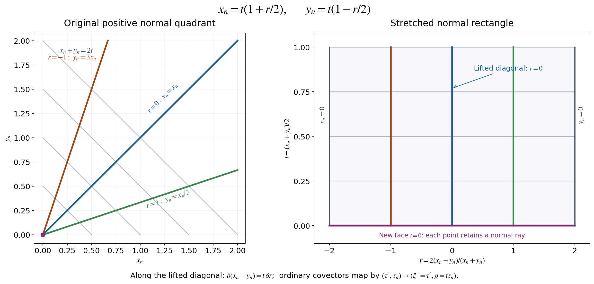

# Stretched kernels and the full compressed geometry

This component retains Section 1 of AN03-U034, *Global boundary operators, compressed wave fronts, and normal extension*. Original author: Codex, September 2026, CC0. Current exact proof connections and clarifications: AN-04 course-writing task and OpenAI Codex, 5 October 2026, CC0. The companion [global operator calculus](global-boundary-operator-calculus.md) supplies proper composition, adjoints, all-real bounds, dual action and the ordered local parametrix.

## Conventions and complete providers

All manifolds are smooth, Hausdorff and second countable. The boundary is a closed embedded hypersurface. The general projective construction is local along an embedded submanifold; its global version uses a closed embedded submanifold. Smooth functions and coordinate maps on a manifold with boundary extend smoothly to local open coordinate neighborhoods. Symbols have every compact-base estimate in the ordinary class \(S^m_{1,0}\), for any real \(m\); no classical expansion is assumed.

Use \(D=-i\partial\), the forward Fourier exponential \(e^{-ix\cdot\xi}\), and inverse coefficient \((2\pi)^{-n}\). A conormal family at \(t=0\) means a distribution in the normal variables represented by a symbol whose derivatives of every order in \(t\ge0\) and the other base parameters satisfy the same symbol bounds on compact sets. Equivalently use the full normal amplitude reduction below, with \(t\) a smooth parameter. This is the precise family interpretation throughout the two companions.

The [conormal amplitude and test-space proofs](../20261005-conormal-test-foundations/conormal-amplitudes-and-test-spaces.md) give (C1)–(C17), including the complete normal reduction and every finite remainder. The [intrinsic conormal symbols](../20261005-conormal-symbols-and-corners/intrinsic-conormal-symbols.md) give (C18)–(C24), all determinant factors and exact quotient kernel. The [local boundary test and symbol calculus](../20261005-local-boundary-calculus/boundary-tests-and-lacunary-symbols.md), [resolved kernels](../20261005-local-boundary-calculus/resolved-corner-kernels.md), [adjoints and composition](../20261005-local-boundary-calculus/boundary-adjoints-composition-and-distributions.md), and [bounds and conormal action](../20261005-local-boundary-calculus/boundary-bounds-and-conormal-action.md) are the exact providers for the original numbered local formulas (4.8), (5.2), (7.3), (8.1)–(8.3) and (9.1)–(9.2). The [full corner characterization](../20261005-conormal-symbols-and-corners/polyhomogeneous-corner-kernels.md) identifies residual conormal kernels without omitting logarithmic terms.

The [Fourier](../20261004-free-intrinsic-graph/prerequisites/fourier-l2.md), [measure](../20261004-free-intrinsic-graph/prerequisites/measure-and-l2.md), [distributional coordinate](../20261004-free-intrinsic-graph/prerequisites/coordinate-and-wavefront-localization.md), and [locally finite partition PS5](../20261004-free-intrinsic-graph/prerequisites/global-principal-symbol.md) proofs supply the remaining foundations. The approved mathematical antecedent is Hörmander III, 2007 eBook, ISBN 978-3-540-49938-1, Sections 18.2–18.3. Reading, proof development and ordinary citation to that source are valid.

## 1. Stretched kernels and compressed covectors

### 1.1. The real projective blowup

Let \(Y\) be a smooth embedded submanifold of codimension \(k\ge1\) in \(X\).
In coordinates \((z,y)\), \(Y=\{y=0\}\), \(y\in\mathbb R^k\).
Replace the normal origin by its lines:
\[
 \{(z,L,v):L\in\mathbb{RP}^{k-1},\ v\in L\},
 \qquad \beta(z,L,v)=(z,v).
 \tag{GL1}
\]
Here \(v\) is the actual normal vector, with both signs. Equivalently the model
is \((z,s,\omega)\), \(\omega\in S^{k-1}\), modulo
\((s,\omega)\sim(-s,-\omega)\), with \(v=s\omega\).
For the chart in which the \(i\)-th component of the line is nonzero, represent
that line by a vector \(w\) with \(w_i=1\). Coordinates are
\((z,s,w_j:j\ne i)\), and \(y=s w\). On overlaps,
\[
 s_j=s_i w_j,\qquad w_\ell^{(j)}=w_\ell^{(i)}/w_j^{(i)} .
 \tag{GL2}
\]
These are smooth invertible changes where \(w_j\ne0\), including \(s_i=0\).
They give a smooth manifold; the exceptional set is its projectivized normal
bundle, and the projection is a diffeomorphism away from \(Y\).
For \(k=1\), there is one line and the local projection is the identity.

To prove independence of coordinates, let \(\bar y(z,y)\) be another normal
coordinate system vanishing on \(Y\). Hadamard's formula gives
\[
 \bar y(z,y)=A(z,y)y,\qquad
 A(z,y)=\int_0^1\partial_y\bar y(z,\lambda y)\,d\lambda ,
 \quad A(z,0)\in GL(k,\mathbb R).
 \tag{GL3}
\]
In a chart \(y=s w\), choose an index \(j\) for which
\((A(z,0)w)_j\ne0\). The new coordinates are
\(\bar s=s(A(z,s w)w)_j\),
\(\bar w_\ell=(A(z,s w)w)_\ell/(A(z,s w)w)_j\), and
the actual transformed tangential coordinate \(\bar z(z,s w)\).
The denominator stays nonzero locally; all these functions are smooth at
\(s=0\). The inverse coordinate change has the same construction. The maps
agree away from the exceptional set, and therefore everywhere by continuity,
so their cocycle identities hold. This proves coordinate independence and
identifies the exceptional transition with the actual normal derivative.

If \(f,g\) vanish on \(Y\), their pullbacks have the form \(sF,sG\) by the
same integral formula. Wherever the normal derivative of \(g\) on the line
is nonzero, \(G(z,0,w)\ne0\), and \(f/g=F/G\) extends smoothly. These ratio
charts are thus intrinsic. No positive-ray quotient replaces the projective
quotient in this construction.

### 1.2. The positive corner and its exact coordinates

For boundary charts on two manifolds, keep \(x_n,y_n\ge0\) and their positive
normal rays. The projective interior normal cone at the corner is
\((\mathbb R_+^2\setminus\{0\})/\mathbb R_{>0}\). Its coordinate and the
radial coordinate are
\[
 t=\frac{x_n+y_n}{2},\qquad
 r=\frac{2(x_n-y_n)}{x_n+y_n},\qquad
 x_n=t(1+r/2),\quad y_n=t(1-r/2),
 \quad t\ge0,\ -2\le r\le2 .
 \tag{GL4}
\]
At \(t=0\), \(r\) records the ray; the projection collapses this interval
to the original corner. The two side faces are \(r=-2\), where \(x_n=0\),
and \(r=2\), where \(y_n=0\).

Boundary coordinate changes have normal parts
\(\bar x_n=\alpha(x)x_n\), \(\bar y_n=\gamma(y)y_n\), with
\(\alpha,\gamma>0\). Set \(a=1+r/2\), \(b=1-r/2\).
Their exact lifted law is
\[
 \bar t=\frac t2\,[\alpha(x)a+\gamma(y)b],\qquad
 \bar r=\frac{2[\alpha(x)a-\gamma(y)b]}
                  {\alpha(x)a+\gamma(y)b}.
 \tag{GL5}
\]
The denominator is strictly positive on the entire closed interval:
\(a,b\ge0\), \(a+b=2\), and both coefficients are positive.
The tangential coordinates are the original coordinate changes evaluated
at \(x_n=t a,y_n=t b\). Thus the full lift is smooth up to every face and
corner, and its inverse is the lift of the inverse changes. It preserves
each side face and multiplies \(t\) by a smooth positive function.
These laws glue the stretched product intrinsically.

Figure GL-F1. The two panels retain the exact coordinates in (GL4).
The new face retains the ray when both normal variables vanish. The lifted
diagonal crosses that face. Only the two normal variables are drawn;
tangential coordinates and covectors retain their full dimensions in
(GL7)–(GL10). Reproducible source: [the retained figure script](figures/compressed_corner_geometry.py). Click the figure for the scalable version.

For the square of one manifold the interior diagonal lifts to
\[
 \widehat\Delta=\{x'=y',\ r=0,\ t\ge0\}.
 \tag{GL6}
\]
The projection restricts to \((x',t)\mapsto(x',x_n=t)\), a diffeomorphism
with the original diagonal. The lifted diagonal avoids \(r=\pm2\), and
is transverse to \(t=0\) because its tangent includes the \(t\) direction.
This proves all these assertions at boundary points as well as in the
interior.

### 1.3. The compressed bundle and both natural maps

Pull \(N^*\widehat\Delta\) back by (GL6). In local coordinates its covectors
have the form
\(\xi'\cdot d(x'-y')+\rho\,dr\).
The normal differential of the projection at the lifted diagonal is
\[
 (\delta(x'-y'),\delta r)\longmapsto
       (\delta(x'-y'),\,t\,\delta r).
 \tag{GL7}
\]
This follows by differentiating \(x_n-y_n=t r\) at \(r=0\).
Dualizing gives the natural map from the ordinary cotangent bundle:
\[
 \lambda:T^*X\longrightarrow\widetilde T^*X,\qquad
 (\tau',\tau_n)\longmapsto(\xi'=\tau',\,\rho=x_n\tau_n).
 \tag{GL8}
\]
It is an isomorphism for \(x_n>0\). At \(x_n=0\) its kernel is precisely
the ordinary conormal line to the boundary, and its image is the hyperplane
\(\rho=0\), canonically \(T^*\partial X\). The compressed fibre itself
still has dimension \(n\); its other covectors have not been discarded.

The dual anchor is
\[
 \widetilde TX\longrightarrow TX,\qquad
 (v',v_n)\longmapsto
       \sum_{j<n}v_j\partial_{x_j}+x_n v_n\partial_{x_n}.
 \tag{GL9}
\]
Its smooth sections map bijectively onto smooth vector fields tangent to
the boundary. Indeed a tangent normal coefficient \(b(x',x_n)\) vanishes
at \(x_n=0\) and equals
\(x_n\int_0^1\partial_{x_n}b(x',s x_n)\,ds\).
This constructs its smooth inverse coefficient. Uniqueness follows in
the interior and hence at the boundary by continuity.

For an exact coordinate law write
\(\bar x'=F(x',x_n)\), \(\bar x_n=\alpha(x',x_n)x_n\), \(\alpha>0\).
In the interior a compressed covector is
\(\xi'\cdot dx'+\rho\,dx_n/x_n\).
Differentiating the original coordinate functions, without dropping terms,
gives
\[
 \begin{aligned}
 \xi'&=(\partial_{x'}F)^T\bar\xi'
               +(\partial_{x'}\log\alpha)\bar\rho,\\
 \rho&=x_n(\partial_{x_n}F)^T\bar\xi'
               +(1+x_n\partial_{x_n}\log\alpha)\bar\rho .
 \end{aligned}
 \tag{GL10}
\]
These expressions extend smoothly to the boundary. There their determinant
is \(\det\partial_{x'}F\ne0\); locally in the collar the matrix is invertible,
and its inverse is furnished by the inverse boundary coordinate change.
The law agrees with the pulled-back conormal law in the interior by
(GL7)–(GL8), and hence agrees everywhere. It proves the intrinsic bundle
identification, both anchors, and the invariant hyperplane \(\rho=0\).

### 1.4. The original symplectic form and density

In the interior substitute the full formula \(\tau_n=\rho/t\) into the
ordinary cotangent form \(\sum_j d\tau_j\wedge dx_j\). Since
\(d(\rho/t)=t^{-1}d\rho-\rho t^{-2}dt\), its exact expression is
\[
 \omega=\sum_{j<n}d\xi_j\wedge dx_j+t^{-1}d\rho\wedge dt .
 \tag{GL11}
\]
It is nondegenerate for \(t>0\). The \(t^{-1}\) factor is a boundary
singularity; there is no smooth symplectic form asserted there.
In the indicated order of coordinates,
\[
 \frac{\omega^n}{n!}
 =(-1)^{n(n+1)/2}t^{-1}
       dx'\wedge dt\wedge d\xi'\wedge d\rho,\qquad
 |\omega^n/n!|^{1/2}
 =t^{-1/2}|dx'\,dt\,d\xi'\,d\rho|^{1/2}.
 \tag{GL12}
\]
For the sign, move the original ordered pairs
\((d\xi_1,dx_1,\ldots,d\rho,dt)\) to the displayed base-then-fibre order;
the number of transpositions is \(n(n+1)/2\).
The density law is intrinsic because (GL11) was pulled from the original
cotangent form. Its singular factor remains explicit.

### 1.5. The full stretched kernel for every symbol order

Let \(a\in S_{\mathrm{la}}^m\), \(m\in\mathbb R\), in the local half-space
calculus. Keep its exact inverse Fourier distribution
\[
 A(x,z)=(2\pi)^{-n}\int e^{iz\cdot\xi}a(x,\xi)\,d\xi,\qquad
 K(x,y)=x_n^{-1}
       A\left(x',x_n,x'-y',\frac{x_n-y_n}{x_n}\right)
       \quad(x_n>0).
 \tag{GL13}
\]
Oscillatory integrals are defined by the cutoff-independent distribution
construction in (C4)–(C5). No residual assumption is made.
Differentiation in \(z\) raises the amplitude order by its exact degree;
integration by parts in \(\xi\) to a degree exceeding that order plus
\(n\) proves that \(A\) is smooth off \(z=0\), with arbitrary decay in
\(|z|\ge1\), uniformly with every base derivative on compact sets.
Near \(z=0\) its full phase and amplitude exhibit a conormal distribution
of order \(m\) by (C16), with ambient dimension \(2n\) and codimension \(n\).

The Fourier support in the original definition implies
\(\operatorname{supp}_{z_n}A\subset(-\infty,1]\). In fact the partial
Fourier transform of \(a\) is supported in \([-1,\infty)\); inverse
transformation evaluates it at \(-z_n\), with the original inverse
Fourier factor. At \(z_n=1\) the distribution is already smooth, since
that point is away from \(z=0\). Its vanishing on \(z_n>1\) therefore
makes every derivative vanish on \(z_n=1\).

The determinant of (GL4) is \(-t\), so a kernel half-density pulls back
with coefficient \(k=t^{1/2}K\). Put \(H=t^{1/2}k=tK\). The entire formula is
\[
 k=t^{-1/2}(1+r/2)^{-1}
 A\left(x',t(1+r/2),x'-y',\frac{r}{1+r/2}\right),\qquad
 H=(1+r/2)^{-1}
 A\left(x',t(1+r/2),x'-y',\frac{r}{1+r/2}\right).
 \tag{GL14}
\]
Thus both square-root factors, the normal Jacobian and the complete
argument of \(A\) are retained.

Near the lifted diagonal \(1+r/2>0\). In (GL13) change only the integration
variable \(\xi_n=(1+r/2)\rho\). Its positive Jacobian cancels exactly
the displayed \((1+r/2)^{-1}\), giving
\[
 H=(2\pi)^{-n}\int
 e^{i[(x'-y')\cdot\xi'+r\rho]}\,
 a\bigl(x',t(1+r/2),\xi',(1+r/2)\rho\bigr)\,d\xi'\,d\rho .
 \tag{GL15}
\]
The amplitude has all order-\(m\) estimates on compact base sets: an
\(r\)-derivative gives \(t\partial_{x_n}a/2\) or
\(\rho\partial_{\xi_n}a/2\); the latter has the original order \(m\).
A \(t\)-derivative has the bounded factor \(1+r/2\); frequency derivatives
lower the order normally. The same argument handles any iterated mixed
derivative. Equations (GL14) and (GL15) are exact descriptions of the same
kernel, not a substitution omitting a density factor. They prove that
\(H|dx'\,dy'\,dt\,dr|^{1/2}\) is conormal along \(\widehat\Delta\),
smooth in \(t\ge0\).

At \(r=2\), the last argument of \(A\) is \(1\), so the preceding support
argument gives side flatness, including all \(t\) and tangential derivatives.
At \(r=-2\), that argument tends to minus infinity. Its derivatives and the
displayed prefactor grow only as fixed powers of \((2+r)^{-1}\).
The arbitrary large-\(|z|\) decay absorbs each such power, proving flatness
there as well. These estimates are uniform for compact \(t,x',y'\) ranges.
Off \(\widehat\Delta\), the same Fourier argument proves smoothness.

### 1.6. The exact principal half-density and inverse reconstruction

In the full amplitude of (GL15), the difference from its \(r=0\) value is
\[
 \frac r2\int_0^1
 [\,t\partial_{x_n}a+\rho\partial_{\xi_n}a\,]
 \bigl(x',t(1+s r/2),\xi',(1+s r/2)\rho\bigr)\,ds .
 \tag{GL16}
\]
Retain this entire integral. Integration by parts in \(\rho\), using
\(r e^{ir\rho}=i^{-1}\partial_\rho e^{ir\rho}\), changes it to the exact
order-\((m-1)\) amplitude
\[
 \frac i2\,\partial_\rho\int_0^1
 [\,t\partial_{x_n}a+\rho\partial_{\xi_n}a\,]
 \bigl(x',t(1+s r/2),\xi',(1+s r/2)\rho\bigr)\,ds .
 \tag{GL17}
\]
A compact cutoff in \(r\) on this chart is independent of \(\rho\) and
does not change that calculation. The defining cutoff limit justifies
the integration by parts, by (C4)–(C5).
Hence the principal conormal half-density of \(H\), in the parametrization
\((x',x',t,0;\xi',-\xi',0,\rho)\), is precisely the class of
\[
 a(x',t,\xi',\rho)\,|dx'\,dt\,d\xi'\,d\rho|^{1/2}
 \quad\pmod{\text{one lower amplitude order}} .
 \tag{GL18}
\]
For \(k\), the additional \(t^{-1/2}\) is still present. Comparing
(GL18) with (GL12) makes its scalar coefficient \(a\) a principal
symbol on the compressed cotangent bundle. The full remainder is
(GL16)–(GL17); it has not been removed from the original kernel.
The coordinate invariance follows from the full determinant law
(C19)–(C20) and the actual conormal coordinate change (GL10).
In the intrinsic convention of (C21), the half-density in (GL18) has
symbol order \(m+n/2\): its fibre half-density has dilation degree \(n/2\).
Dividing the original principal half-density of \(k\) by (GL12) leaves the
ordinary scalar or matrix symbol order \(m\). Neither convention changes
the amplitude or the original operator.

Conversely, take a compactly supported conormal family \(H\) along
\(\widehat\Delta\), of this order and smooth parameter type, flat at
both side faces. For \(z_n<1\) its inverse kernel is
\[
 A(x,z)=\frac{2}{2-z_n}
 H\left(x',x'-z',\,\frac{x_n(2-z_n)}2,\,
                         \frac{2z_n}{2-z_n}\right),\qquad
 A(x,z)=0\quad(z_n\ge1).
 \tag{GL19}
\]
These are the inverse of the full coordinate and prefactor formulas,
not just their diagonal restrictions. Near \(z=0\), pull back an
oscillatory conormal amplitude for \(H\) by this smooth map. Its normal
phase is \(z'\cdot\xi'+[z_n/(1-z_n/2)]\rho\). The change
\(\rho=(1-z_n/2)\eta_n\) has positive Jacobian \(1-z_n/2\), which cancels
the prefactor \(1/(1-z_n/2)\) in (GL19). The resulting amplitude has order
\(m\) with all base derivatives, including \(x_n\), by the same product
and chain rules used for (GL15). Compact localization and the full
amplitude reduction (C5) therefore give a smooth \(x\)-dependent inverse
Fourier symbol of order \(m\), with all finite-seminorm bounds.

Away from \(z=0\), (GL19) is smooth. Flatness at \(r=-2\) gives arbitrary
decay as \(z_n\to-\infty\): each \(x_n\)-derivative introduces at most
one additional power of \(2-z_n\), absorbed by another flatness order.
Flatness at \(r=2\) gives a smooth zero extension at \(z_n=1\).
Compact tangential support controls \(z'=x'-y'\); all these far
contributions are Schwartz in \(z\), uniformly with every \(x\)-derivative.
If \(H\) is supported in \(t\le T\), then \(A\) is supported in
\(x_n\le2T\), since \(x_n=t(1+r/2)\le2t\). Its base derivatives thus
have every original \((1+x_n)^{-\nu}\) estimate.

Define the exact symbol
\[
 a(x,\xi)=\int e^{-iz\cdot\xi}A(x,z)\,dz .
 \tag{GL20}
\]
The near contribution is order \(m\) by the preceding reduction and the
far contribution is residual. Since \(A=0\) for \(z_n>1\),
\[
 \mathcal F_{\xi_n}a(x,\xi',s)
 =2\pi\int e^{-iz'\cdot\xi'}A(x,z',-s)\,dz',
 \qquad \operatorname{supp}_s\mathcal F_{\xi_n}a\subset[-1,\infty).
 \tag{GL21}
\]
This proves lacunarity with its exact sign and Fourier constant.
Thus \(a\in S_{\mathrm{la}}^m\), and (GL13)–(GL15) recover the original
half-density kernel exactly. Fourier inversion proves uniqueness of the
symbol on \(x_n>0\), and smoothness in \(x_n\) gives uniqueness at zero.
This proves the compact local converse as well as the forward statement
for every real \(m\).

### 1.7. The exact boundary action

Let \(u\) be smooth up to the boundary with compact support. Write
\(s=x_n>0\), \(a_r=1+r/2\). At fixed \(s\), the actual changes of
integration variables are
\[
 y_n=s\frac{1-r/2}{1+r/2},\qquad
 t=s/a_r,\qquad |dy_n|=s a_r^{-2}|dr|,
 \qquad K(x,y)|dy_n|=a_r^{-1}H(x',y',s/a_r,r)|dr|.
 \tag{GL22}
\]
Thus the full operator action, interpreted as a distributional pairing at
the diagonal, is
\[
 (T_a u)(x',s)=\int_{-2}^{2}\int
 \frac{H(x',y',s/a_r,r)}{a_r}
 u\left(y',s\frac{1-r/2}{a_r}\right)\,dy'\,dr .
 \tag{GL23}
\]
For a forward symbol, compactly localize the base variables on the
output region; (GL14) retains the same uniform side estimates there.
For an inverse kernel its given compact support provides this localization.
Choose a partition in \((x'-y',r)\) which is one near its origin and
supported away from \(r=\pm2\). On that part the smooth conormal family
and the compact smooth test function in (GL23) converge, with every
\(x'\) derivative, as \(s\) decreases to zero. Oscillatory formula (GL15)
justifies the convergence: integrate by parts in its normal base variables
to an order exceeding the amplitude order plus \(n\), exactly as in (C4).
The resulting integrable frequency majorant is uniform in \(s\).

The compact input support also controls the resolved radial variable in this argument: if \(0\le s\le s_0\) and the input normal coordinate is at most \(M\), every nonzero integrand has \(t=(s+y_n)/2\le(s_0+M)/2\). Derivatives of the input have the same support. Thus the compact-\(t\) side-flatness estimates apply uniformly even when \(r\) approaches \(-2\).

On the complementary part the kernel is a smooth function. Near \(r=-2\),
every \(s\), \(x'\) or integration-variable derivative of (GL23) introduces
only a fixed negative power of \(a_r\). The arbitrary side-flatness order
in (GL14) absorbs that power. Near \(r=2\), the same statement follows
from smooth flatness at that side. Away from those sides all factors have
ordinary compact smooth bounds. Dominated convergence, including each
derivative, proves the boundary limit
\[
 \begin{aligned}
 (T_a u)(x',0)
 &=\int_{-2}^{2}\int a_r^{-1}H(x',y',0,r)u(y',0)\,dy'\,dr\\
 &=\int\!\int_{-\infty}^{1}
       A(x',0,x'-y',z_n)u(y',0)\,dz_n\,dy'\\
 &=(2\pi)^{-(n-1)}\int e^{ix'\cdot\xi'}
       a(x',0,\xi',0)\widehat{u(\cdot,0)}(\xi')\,d\xi'.
 \end{aligned}
 \tag{GL24}
\]
The second equality uses the full change \(z_n=r/a_r\),
\(dz_n=a_r^{-2}dr\), and \(H(x',y',0,r)=a_r^{-1}A(x',0,x'-y',z_n)\).
The last equality is exact partial Fourier inversion at normal frequency
zero. The preceding localization and integration by parts justify both
equalities even when \(A\) is not a function at \(z=0\). When \(n=1\),
the tangential integrals have dimension zero and the factor is one.
This is the full boundary action, with all orders and all kernel factors,
and it agrees with the original jet formula (5.2) for \(k=0\).

