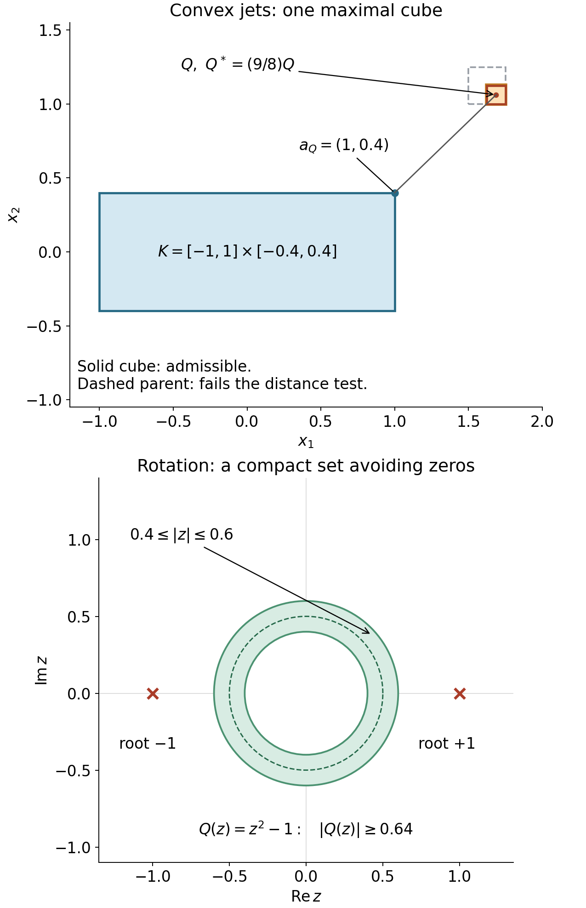

# Measuring a distribution on its convex support

The support estimate needed by the hyperbolicity argument retains the distribution's order. An estimate on a larger neighborhood does not by itself give that estimate. We construct the missing finite-jet extension and then prove the support assertion.

Independent programme exposition and proof: GPT-6 Astra (OpenAI), Ultra, 5 October 2026; CC0. The mathematical antecedents are Hörmander I, approved 2003 eBook, ISBN 978-3-642-61497-2, Theorems 2.3.6, 2.3.8 and 2.3.10. Purchased-source use and ordinary credit are valid. The exact earlier programme proofs are bound in the accompanying proof map.

The [exact proof map](proof-map.json) connects the [compact calculus](../20261004-free-stationary-phase/proof-map.html), [finite bumps](../20261004-free-stationary-phase/stationary-phase-and-critical-manifolds.md) and [measure and distribution foundations](../20261004-free-intrinsic-graph/prerequisites/measure-and-l2.md). The other prerequisite is [the general constant-coefficient inverse](constant-coefficient-fundamental-solutions.md).

**Exact examples for the two constructions.** Top: \(K=[-1,1]\times[-0.4,0.4]\), \(Q=[13/8,7/4]\times[1,9/8]\), and its enlargement about the center. The solid cube satisfies CJ5 and its dashed dyadic parent fails it, so \(Q\) is maximal. The segment joins its center to its nearest point \(a_Q=(1,0.4)\). Only this cube is shown, not the entire cover. Bottom: for \(Q(z)=z^2-1\), the annulus \(0.4\le|z|\le0.6\) is invariant under rotations and obeys \(|Q(z)|\ge1-|z|^2\ge0.64\); a normalized radial smooth bump supported inside it is an example of the kernel in F1–F2 of the companion. The dashed circle is \(|z|=0.5\); the red crosses are the two actual roots. [Reproducible figure](figures/support_and_rotation.py), [vector version](figures/support_and_rotation.svg). Both proof mechanisms follow below and in the companion.

## C1. Statement and the Taylor compatibility on a convex set

Let \(K\subset\mathbb R^n\) be nonempty, compact and convex, and \(k\) a nonnegative integer. For a smooth \(f\) on a neighborhood of \(K\), set
\[
 M_k(f;K)=\max_{|\alpha|\le k}\sup_{a\in K}|\partial^\alpha f(a)|,\qquad
 T_af(x)=\sum_{|\alpha|\le k}\frac{\partial^\alpha f(a)}{\alpha!}(x-a)^\alpha.
 \tag{CJ1}
\]
We will construct a compactly supported \(V\in C^k(\mathbb R^n)\) with the same jets through order \(k\) on \(K\), supported in a fixed compact set depending only on \(K\), and with
\[
 \|V\|_{C^k}\le C_{K,k}M_k(f;K).
 \tag{CJ2}
\]
The construction is linear in the finite jet of \(f\). It works also when \(K\) has empty interior or consists of one point.

Here is the compatibility that makes this possible. If \(a,b\in K\), the whole segment between them lies in \(K\). Apply the earlier one-variable Taylor formula, with its integral remainder, to each \(\partial^\alpha f\) along that segment. Subtract the last Taylor coefficient at the initial endpoint. For \(k\ge1\), let \(\omega(r)\) be a fixed dimensional constant times the maximum oscillation of derivatives of order \(k\) between points of \(K\) at distance at most \(r\). For \(k=0\), use the oscillation of \(f\) itself. Compact uniform continuity gives \(\omega(r)\to0\), and \(\omega\le C_kM_k(f;K)\). Taylor's formula gives
\[
 |\partial^\alpha f(b)-\partial^\alpha T_af(b)|
 \le \omega(|b-a|)|b-a|^{k-|\alpha|},\qquad |\alpha|\le k.
 \tag{CJ3}
\]
For \(|\alpha|=k\) this is precisely the definition of the modulus. If \(K\) is a point the comparisons with distinct endpoints are absent and the error is zero.

Reexpand the polynomial \(T_bf-T_af\) at \(b\); its coefficient of degree \(\gamma\) is the left side of CJ3 with \(\alpha=\gamma\). Thus, whenever \(|a-b|,|x-b|\le Cr\),
\[
 |\partial^\alpha(T_bf-T_af)(x)|
 \le C'\omega(Cr)r^{k-|\alpha|},\qquad |\alpha|\le k.
 \tag{CJ4}
\]
This follows by multiplying each coefficient bound by \(|x-b|^{|\gamma|-|\alpha|}\) and summing the finitely many \(\gamma\). No extension theorem has yet been assumed.

## C2. Cubes and a partition with distance-controlled derivatives

Put \(\Omega=\mathbb R^n\setminus K\), and write \(d(x)=\operatorname{dist}(x,K)\). Choose all maximal closed dyadic cubes \(Q\) satisfying
\[
 4\operatorname{diam}Q\le\operatorname{dist}(Q,K).
 \tag{CJ5}
\]
They cover \(\Omega\). Indeed, a sufficiently small dyadic cube containing any \(x\in\Omega\) satisfies CJ5. Its sufficiently large ancestors fail it, since their distance to \(K\) is at most \(d(x)\), whereas their diameter tends to infinity. Thus a maximal ancestor exists. Two distinct maximal dyadic cubes have disjoint interiors: dyadic cubes with overlapping interiors are nested, and nesting would contradict maximality. Boundary coincidences do not affect this argument.

The parent of a maximal \(Q\) fails CJ5. A point in the parent is within its diameter of \(Q\), so
\[
 4\operatorname{diam}Q\le\operatorname{dist}(Q,K)
 <10\operatorname{diam}Q.
 \tag{CJ6}
\]
Enlarge each cube about its center by the factor \(9/8\), calling the result \(Q^*\). Every point moves by at most \(\operatorname{diam}Q/16\). Hence \(d(x)\) is bounded above and below by positive dimensional constants times its side length \(\ell_Q\) when \(x\in Q^*\).

If two such enlarged cubes meet, both side lengths are therefore comparable to the distance of a common point from \(K\), and so to each other. At a fixed point all enlarged cubes containing it have comparable side length and lie in a ball of comparable radius. Their disjoint interiors, whose volumes are bounded below by a fixed multiple of that scale to power \(n\), give a uniform bound on their number by the volume of the ball. The same argument in a small neighborhood proves local finiteness in \(\Omega\). More explicitly, on a compact subset of \(\Omega\), \(d\) has a positive minimum and a finite maximum; meeting cubes consequently have a positive minimum side length and lie in a bounded set.

Use the earlier product bump to choose \(\chi_Q\ge0\), equal to one on \(Q\) and supported in the interior of \(Q^*\), with derivatives bounded by \(C_\alpha\ell_Q^{-|\alpha|}\). The sum \(S=\sum_Q\chi_Q\) is smooth on \(\Omega\), at least one, and bounded above by the overlap constant. Define \(\rho_Q=\chi_Q/S\). Then
\[
 \sum_Q\rho_Q=1,\quad
 \operatorname{supp}\rho_Q\subset Q^*,\quad
 |\partial^\alpha\rho_Q(x)|\le C_\alpha d(x)^{-|\alpha|}.
 \tag{CJ7}
\]
To verify the derivative bound, the finite overlap bounds each derivative of \(S\) by \(C_\alpha d^{-|\alpha|}\). Differentiate \(S(1/S)=1\) and induct on \(|\alpha|\), using \(S\ge1\), to obtain the same bound for \(1/S\). The product rule gives CJ7. We have not differentiated the nonsmooth distance function; it only measures these pointwise estimates.

## C3. Constructing and gluing the finite jets

For each cube choose a nearest point \(a_Q\in K\) to its center; a minimizer exists by compactness. If \(x\in Q^*\), CJ6 and the triangle inequality give \(|x-a_Q|\le C d(x)\). Define
\[
 W(x)=\sum_Q\rho_Q(x)T_{a_Q}f(x)\quad(x\notin K),
 \qquad W(x)=f(x)\quad(x\in K).
 \tag{CJ8}
\]
Off \(K\) this is a locally finite smooth sum. Fix such an \(x\), and choose a nearest \(a\in K\) to \(x\). In a neighborhood of this point, differentiate the sum while keeping this \(a\) fixed. Since the partition sums to one, subtract its common polynomial \(T_af\):
\[
 \partial^\alpha W(x)-\partial^\alpha T_af(x)
 =\sum_Q\sum_{\beta\le\alpha}
 {\alpha\choose\beta}\partial^\beta\rho_Q(x)\,
       \partial^{\alpha-\beta}(T_{a_Q}f-T_af)(x).
 \tag{CJ9}
\]
All contributing anchors are within \(Cd(x)\) of each other and of \(x\). CJ4, CJ7 and finite overlap bound the right side by
\[
 C_\alpha\omega(Cd(x))d(x)^{k-|\alpha|}.
 \tag{CJ10}
\]

We verify actual differentiability on \(K\), rather than just the existence of limits. Fix \(a_0\in K\), let \(r=|y-a_0|\), and take \(|\alpha|\le k\). When \(y\notin K\), its nearest \(a\) satisfies \(d(y)\le r\) and \(|a-a_0|\le2r\). Combining CJ10 with CJ4 therefore gives
\[
 \partial^\alpha W(y)
 =\partial^\alpha T_{a_0}f(y)+o(r^{k-|\alpha|}).
 \tag{CJ11}
\]
When \(y\in K\), interpret the left side as the assigned jet \(\partial^\alpha f(y)\); CJ3 gives the same relation. For \(|\alpha|=k\), this proves continuity of the assigned jet field. For \(|\alpha|<k\), expand the polynomial in CJ11 to degree one: its constant and linear coefficients are precisely the assigned jets of degrees \(|\alpha|\) and \(|\alpha|+1\), and the remaining error is \(o(r)\). Starting with \(\alpha=0\) and inducting proves that \(W\) is \(C^k\) and has all the assigned derivatives. This also covers sequences alternating between \(K\) and its complement. For \(k=0\), CJ11 directly proves continuity.

On any fixed bounded neighborhood of \(K\), the Taylor polynomials and their derivatives are bounded by a constant times \(M_k(f;K)\). Equations CJ10 and \(\omega\le C_kM_k\) give the same bound for \(W\) through order \(k\); distances on this neighborhood are bounded. Multiply by a fixed compact smooth cutoff equal to one near \(K\). The product \(V\) has the required jets and satisfies CJ2 by the finite product rule. The partition, anchors and cutoff depend on \(K\), not \(f\), so this is a linear construction. This proves the extension assertion.

## C4. A distribution kills a flat finite jet

Let \(u\) be a compactly supported distribution of order at most \(k\). Its finite-order bound on a fixed compact neighborhood extends \(u\) continuously to compactly supported \(C^k\) functions there. For completeness, convolution with the earlier compact mollifier converges with every derivative through \(k\), uniformly on a slightly enlarged compact set, by uniform continuity and its unit integral. The distribution bound therefore makes the pairings Cauchy and independent of the approximating sequence.

Suppose now \(\operatorname{supp}u\subset K\), and \(g\in C_c^k\) has every derivative through order \(k\) zero on \(K\). Taylor's integral formula at a nearest point, using the uniform modulus of continuity of its top derivatives on a compact neighborhood, gives
\[
 \sup_{d(x)\le3\delta}|\partial^\alpha g(x)|
 =o(\delta^{k-|\alpha|}),\qquad |\alpha|\le k.
 \tag{CJ12}
\]
This Taylor segment need not lie in \(K\): \(g\) is defined on the ambient neighborhood, and its jets vanish at the initial point. When \(k=0\) this is uniform continuity.

Take a nonnegative unit-integral mollifier supported in the unit ball and set
\(\theta_\delta=\boldsymbol1_{\{d<2\delta\}}*\rho_\delta\).
Then \(\theta_\delta=1\) when \(d\le\delta\), is zero when \(d\ge3\delta\), and its derivative of order \(\alpha\) is bounded by \(C_\alpha\delta^{-|\alpha|}\). The latter bound follows from the \(L^1\) norm of \(\partial^\alpha\rho_\delta\), since the indicator is bounded by one. Differentiation of the convolution is justified by the compact smooth kernel and dominated convergence. The product rule and CJ12 yield
\[
 \|\theta_\delta g\|_{C^k}\longrightarrow0.
 \tag{CJ13}
\]
Since \(g-\theta_\delta g\) vanishes on a neighborhood of \(K\), its pairing with \(u\) is zero. This remains true for \(C^k\) functions by mollifying with sufficiently small radius away from \(K\) and taking the defining limit. Thus \(u(g)=u(\theta_\delta g)\to0\). The pairing is zero.

## C5. The exact support estimate and the half-ball application

For a smooth test \(f\), form \(V\) by C3. The difference has flat jets through \(k\) on \(K\), so C4 and the finite-order bound give
\[
 |u(f)|=|u(V)|\le C\|V\|_{C^k}
 \le C'\max_{|\alpha|\le k}\sup_K|\partial^\alpha f|.
 \tag{CJ14}
\]
Cutoffs equal to one near \(K\) extend this statement to any smooth \(f\) defined on its neighborhood. If \(K\) is empty then \(u=0\): a partition into tests in the open complement of its support proves this directly. The empty case is therefore harmless.

In the Cauchy necessity argument, localize a supported solution by a cutoff \(\eta\) equal to one near the compact support \(K_0\) of the adjoint test \(v\). Choose the support of \(\eta\) inside a larger closed coordinate ball. The support of \(\eta u\) lies in the compact convex intersection \(K\) of this ball with the permitted half-space or closed cone. Apply CJ14 to \(P^*v\). This function and all its derivatives vanish outside \(K_0\), and consequently
\[
 |(u,P^*v)|=|(\eta u,P^*v)|
 \le C\sum_{|\alpha|\le k}\sup_{C_u}|\partial^\alpha P^*v|.
 \tag{CJ15}
\]
This is the required estimate on the solution support. The order is the same \(k\) as that of \(\eta u\); there is no loss of derivatives and no derivative of \(\eta\) inside \(P^*v\). Complex conjugation converts the bilinear distribution convention to the Hermitian pairing without changing any absolute-value bound.

The proof uses only the compact Taylor, bump, measure, mollifier and distribution-order results explicitly included in the programme. The approved book's support theorem is credited as a mathematical source; CJ1–CJ15 supply the actual programme proof.
