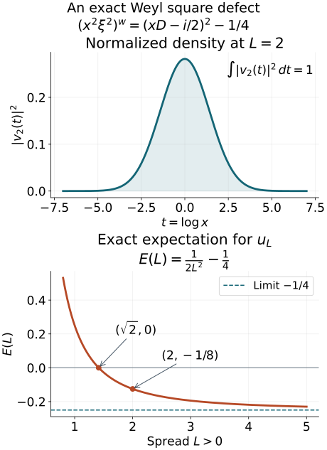

# Scalar positivity with a bounded negative part

A nonnegative scalar symbol need not quantize to a nonnegative operator. The theorem proved here bounds its negative part on the precise scale \(h^{-2}\). Squared localization has a two-derivative error; a scalar splitting and induction on spatial dimension give uniform local lower bounds.

This is a modified selection of AN03-U019, *When a nonnegative scalar symbol acquires a negative part*, from *Elliptic Operators & Boundary Problems: Renewed 2026 Course Draft*. Original principal author: AN-03 course-writing task. Original publisher: AN-03 local course project. The AN-03 course-writing task and OpenAI Codex are responsible for the renewed edition. Selection, exact prerequisite connections and identified additions: GPT-6 Astra (OpenAI), Ultra, 5 October 2026; publisher: AN-04 local course project.

Original text: CC0. See the rights notice.

## F0. Statement, conventions and exact earlier proofs

Use \(D=-i\partial\), the symplectic form in B1 of the [operator-bound companion](metric-operator-bounds.md), and its permissible metric \(g\le g^\sigma\). Put \(h^2=\sup_{T\ne0}g(T)/g^\sigma(T)\). All symbol derivatives are normed in the original moving metric. For scalar \(a\), the conclusion is
\[
0\le a\in S(h^{-2},g)
\quad\Longrightarrow\quad
(a^wu,u)\ge-C\|u\|_{L^2}^2,\qquad u\in\mathcal S(\mathbb R^n).
\tag{MP3}
\]
The constant uses only finitely many symbol seminorms and the metric structural constants. This is a quadratic-form assertion on the stated domain; it does not assert positivity.

The [scalar splitting and adaptive-scale companion](../20261005-positivity-foundations/scalar-splitting-and-adaptive-scale.md) contains the full nonnegative gradient bound, polarization, normalized jet lemma, local splitting with all derivative bounds, squared partition, and value/Hessian metric. Its retained formulas F14–F20 and F25–F30 are used below with their original meanings; in particular
\[
|\partial^k a|\le\lambda^{(k-4)/2},\qquad
H(X)=\bigl[\max(1,\sqrt{a(X)},\|a''(X)\|)\bigr]^{-1},
\quad G_X=H(X)e,\quad\lambda\le H\le1.
\tag{MP4}
\]
The referenced companion proves both directions of temperateness of \(G\) and \(H\), every frozen derivative bound, and the strict support margins. Its normalization rescales \(a\) to \(f_\nu(z)=H_\nu^2a(X_\nu+z/\sqrt{H_\nu})\). The present [operator-bound companion](metric-operator-bounds.md) supplies the complete coefficient product, uniform Hilbert \(L^2\) theorem and symplectic axes. [Weyl action and covariance](../20261005-metric-weyl-calculus/weyl-action-and-covariance.md) identifies all products on Schwartz space. Its [quantization companion](../20261005-metric-weyl-calculus/reflection-and-quantization.md) supplies every real conversion parameter, derivative gain and remainder. No positivity theorem is assumed in these prerequisites.

References below to the adaptive construction F25–F30 mean the earlier companion, and references to the normalized splitting lemma mean its Section S3. The numbered sections retained below preserve the AN03 source's locators.

## 5. Squared localization and its two-derivative error

Let \(g\) be permissible and \(m=h^{-2}\). Choose real smooth functions \(\phi_\nu\), supported in permissible metric balls, with
\[
\sum_\nu\phi_\nu^2=1,
\qquad (\phi_\nu)_\nu\text{ bounded in }S(1,g;\ell^2).
\tag{F21}
\]
They are obtained from the ellipsoid cover of Section 2 of [Localizing symbols with moving metrics](../20261004-free-intrinsic-graph/prerequisites/metric-localization.md): take cutoffs \(\theta_\nu\) equal to one on its smaller covering balls and set
\(\phi_\nu=\theta_\nu/(\sum_\mu\theta_\mu^2)^{1/2}\).
The denominator is bounded below by one. Only a fixed number of terms occur at each point, and the product and chain rules give every seminorm in (F21). This also proves boundedness of all derivatives of the column in \(\ell^2\), without a factor depending on the number of balls.

Suppose real symbols \(a_\nu\) are supported in fixed slightly larger balls, have uniform \(S(m,g)\) seminorms there, and satisfy \(\phi_\nu^2a_\nu=\phi_\nu^2a\). Then
\[
\sum_\nu\|\phi_\nu^wu\|^2\leq C\|u\|^2,
\qquad
\sum_\nu\phi_\nu^wa_\nu^w\phi_\nu^w=a^w+R^w,
\quad R\in S(1,g).
\tag{F22}
\]
The sum in the second identity is interpreted weakly on Schwartz functions. The norm of the remainder uses only finitely many input seminorms. The finite-derivative theorem below applies this identity to compactly supported approximants before taking its final limit.

The first estimate applies Section 7 of [When a moving symbol scale controls an operator](metric-operator-bounds.md) to the column in (F21). For a finite index set, apply the operator-norm Weyl product to that column, the diagonal matrix with entries \(a_\nu\), and its real row. Finite overlap gives uniform symbol bounds for the diagonal as well. The zeroth term is \(\sum\phi_\nu^2a_\nu\). For each scalar entry the first terms cancel:
\[
\{\phi_\nu,a_\nu\}\phi_\nu+
                  \{\phi_\nu a_\nu,\phi_\nu\}=0.
\tag{F23}
\]
Expanding the two products to order two, and using the product rule on the first correction, shows that all remaining terms have weight \(mh^2=1\). The constants involve only finitely many input seminorms and the fixed overlap. This calculation uses the scalar nature of \(\phi_\nu\); it does not discard a noncommutative first correction between two arbitrary operator-valued symbols.

For an exhaustion by finite sets, embed all finite columns and diagonal matrices into the same space \(\ell^2\) by inserting zero entries. Local finiteness of the larger supports makes these symbols converge locally smoothly in operator norm to their full column and diagonal, with uniform symbol seminorms. The bounded-set local-smooth continuity in Section 1 of [When a moving symbol scale controls an operator](metric-operator-bounds.md) therefore makes their Weyl products and each finite remainder converge in the corresponding symbol classes in this sense. The principal sums converge locally smoothly to \(a\), and the remainders converge to a symbol \(R\in S(1,g)\). Polynomial control from temperateness makes these bounded local convergences distributional. The Weyl kernel pairing with Schwartz functions passes to the limit and proves (F22), including its weak sum interpretation.

In particular, if every localized operator obeys
\(\langle a_\nu^wv,v\rangle\geq-C_0\|v\|^2\)
with the same \(C_0\), the finite identities followed by this limit give
\[
\langle a^wu,u\rangle\geq-C\|u\|^2.
\tag{F24}
\]
This implication uses no positivity of the quantized cutoffs themselves. It uses their squared \(L^2\) estimate, the local lower bounds, and a bounded remainder.

## 7. The uniform estimate for every constant metric

**Theorem.** For each spatial dimension \(n\), there are an integer \(N_n\) and a constant \(C_n\) with the following property. Let \(g\) be any constant positive quadratic form with \(h_g\leq\lambda\leq1\). If \(a\geq0\) is scalar and
\[
|a|_{k,g}\leq\lambda^{-2}\quad(0\leq k\leq N_n),
\tag{F31}
\]
then \(\langle a^wu,u\rangle\geq-C_n\|u\|^2\). The constants are independent of \(g,a,\lambda\).

**Symplectic normalization.** A positive quadratic form has symplectic coordinates in which it is \(\sum_j\lambda_j(dx_j^2+d\xi_j^2)\), with \(\lambda_j>0\) and \(\max_j\lambda_j=h_g\). Here is a direct construction. In a \(g\)-orthonormal basis, the matrix of the symplectic form is real, invertible and skew-adjoint. Orthogonal spectral decomposition produces orthogonal pairs \(v_j,w_j\) with \(\sigma(v_j,w_j)=\kappa_j>0\), all cross-pair symplectic products zero, and all \(g\)-lengths one. Divide both vectors of pair \(j\) by \(\sqrt{\kappa_j}\). Their symplectic product becomes one and their squared \(g\)-lengths become \(\lambda_j=\kappa_j^{-1}\). Order the pairs with the sign convention in F0. In these coordinates the dual form has reciprocal coefficients, so the definition of \(h\) gives \(h_g=\max_j\lambda_j\). This uses only finite-dimensional spectral decomposition. Unitary covariance transports (F31) and the form inequality. Enlarging the diagonal form to \(\lambda e\) preserves the derivative bounds, since its unit directions are smaller. Thus it suffices to prove the assertion under (F25), equivalently the first inequality of (MP4).

**Induction.** In spatial dimension zero the quantization is a nonnegative scalar. Assume the constant-metric theorem in dimension \(n-1\). A nonnegative symbol in dimension \(n\) that is independent of \(\xi_1\) acts, at each fixed \(x_1\), as a Weyl operator in the other \(n-1\) variables. Its remaining derivatives obey the same constant-metric bounds, uniformly in the parameter \(x_1\). Apply the inductive estimate and integrate in \(x_1\). The identity follows first from the Weyl kernel on Schwartz functions, where Fourier inversion in \(\xi_1\) produces the delta function in that coordinate; the quadratic-form estimate then follows by Fubini. The same conclusion holds for a symbol independent of any fixed real phase direction. Indeed an orthogonal symplectic map sends a unit vector in that direction to the \(\xi_1\) direction: complete the pair \(v,Jv\) to orthonormal symplectic pairs in its invariant orthogonal complement. This map preserves \(e\), and its unitary covariance preserves the lower bound.

Apply the adaptive construction (F26)–(F30). If \(H_\nu=1\), the localized symbol has uniformly bounded derivatives through the required order in \(S(1,e)\). Section 7 of [When a moving symbol scale controls an operator](metric-operator-bounds.md) immediately bounds its entire operator norm. This treats the floor of the adaptive scale without subtracting a large constant from a nonnegative function.

If \(H_\nu<1\), the rescaled function (F27) satisfies the normalized splitting lemma. Write it as \(v(z_\perp)+q(z)^2\) on the larger cutoff ball. Choose a nonnegative smooth cutoff in the transverse variables, equal to one on the projection of \(\operatorname{supp}\chi\), supported inside the domain of \(v\). Multiplying \(v\) by it and extending by zero gives a global smooth nonnegative function \(\widetilde v\) independent of the same direction. Define
\[
\begin{split}
\chi_\nu(Y)&=\chi(\sqrt{H_\nu}(Y-X_\nu)),\\
b_\nu(Y)&=H_\nu^{-2}\widetilde v(\sqrt{H_\nu}(Y-X_\nu)),\\
c_\nu(Y)&=H_\nu^{-1}(\chi q)(\sqrt{H_\nu}(Y-X_\nu)).
\end{split}
\tag{F32}
\]
The real function \(\chi q\) is extended by zero from a domain strictly larger than its support. We have the global identity
\[
a_\nu=\chi_\nu^2b_\nu+c_\nu^2.
\tag{F33}
\]
The derivative bounds from the splitting lemma give uniform seminorms, through order \(N_n-2\), in
\[
\chi_\nu\in S(1,H_\nu e),\quad
b_\nu\in S(H_\nu^{-2},H_\nu e),\quad
c_\nu\in S(H_\nu^{-1},H_\nu e).
\tag{F34}
\]
Since \(b_\nu\) is independent of one direction, induction yields \(b_\nu^w\geq-C\) uniformly. Its symbol bounds may have a fixed constant instead of one; division by that constant before using induction and multiplication afterward give the same conclusion with another fixed \(C\).

Expand the two products in
\[
T_\nu=\chi_\nu^wb_\nu^w\chi_\nu^w+(c_\nu^w)^2.
\tag{F35}
\]
The first-order terms cancel by (F23) and \(\{c_\nu,c_\nu\}=0\). Their remaining symbol weight is \(H_\nu^2H_\nu^{-2}=1\). Constant-metric continuity therefore bounds \(\|a_\nu^w-T_\nu\|\) independently of \(\nu,\lambda\). The cutoff operator \(\chi_\nu^w\) is uniformly bounded. Since \(c_\nu\) is real, its contribution is a square, so
\[
\langle a_\nu^wu,u\rangle
\geq-C\|\chi_\nu^wu\|^2-C'\|u\|^2
\geq-C''\|u\|^2.
\tag{F36}
\]
These bounds also hold in the previously treated \(H_\nu=1\) branch. Apply (F24) for the adaptive metric to obtain the desired bound for \(a\).

**Finite derivative dependence and approximation.** Every use of the product, remainder, partition and continuity estimates above asks for finitely many input seminorms. The structural constants of the adaptive metric depend only on the fourth-derivative normalization and dimension. Let \(J_n\) exceed all input orders needed to bound the order-two product errors, their required output seminorms, the cutoff operators and the squared-localization error in this proof. These are finite indices supplied by the continuity estimates, independent of \(a,\lambda\). Choose
\[
N_0=0,\qquad N_n\geq\max\{4,J_n+2,N_{n-1}+2\}.
\tag{F37}
\]
The two additional derivatives pay for the splitting lemma. Formula (F28) bounds all the rescaled input derivatives up to this chosen order. Thus neither the induction nor the summation asks for infinitely many uniformly bounded derivatives.

To justify the symbol calculus when only these finite global bounds are assumed, first multiply \(a\) by \(\zeta(X/R)^2\), with a fixed nonnegative compactly supported cutoff equal to one near zero. Take \(R\geq\lambda^{-1/2}\). The product rule and (F25) give the same finite bounds up to a fixed constant independent of \(R,\lambda\), because a derivative on the cutoff contributes at most \(\lambda^{1/2}\). A fixed normalization absorbs that constant. The compactly supported symbols have every seminorm finite, so all preceding calculus operations are legitimate. Their adaptive structural constants and all constants actually used are uniform. Let \(R\to\infty\) at fixed \(\lambda,a\). The cutoffs converge locally smoothly to one, with a common polynomial bound, and pairing against the Schwartz Wigner function passes to the limit. This proves the theorem as stated. \(\square\)

## 8. Gluing the constant estimates for a variable metric

**Scalar Fefferman–Phong theorem.** Let \(g\) be permissible and let \(0\leq a\in S(h^{-2},g)\) be scalar. Then the second line of (F5) holds.

**Proof.** Construct a real squared partition for \(g\). Choose nonnegative cutoffs \(\psi_\nu\) in slightly larger metric balls, equal to one on \(\operatorname{supp}\phi_\nu\), with uniform \(S(1,g)\) bounds. Put \(a_\nu=\psi_\nu a\). The functions are nonnegative. On each support, slow variation compares \(g\) with \(g_\nu=g_{X_\nu}\), and \(h\) with \(h_\nu=h(X_\nu)\). The product rule gives
\[
|a_\nu|_{k,g_\nu}\leq C_k h_\nu^{-2}
\tag{F38}
\]
globally, since the function vanishes outside its support. The constant metric \(g_\nu\) has Planck parameter \(h_\nu\leq1\). Divide by \(\max_{k\leq N_n}C_k\), apply Section 7 with \(\lambda=h_\nu\), and multiply back. The lower bound is uniform in \(\nu\). Section 5 applies because \(\phi_\nu^2a_\nu=\phi_\nu^2a\), so (F24) proves the theorem. This application uses the completed constant-metric induction, never the theorem currently being proved. \(\square\)

## 9. The classical endpoint and a change of quantization

For \(0\leq\delta<\rho\leq1\), take
\[
g_{x,\xi}=\langle\xi\rangle^{2\delta}|dx|^2+
                  \langle\xi\rangle^{-2\rho}|d\xi|^2,
\qquad h=\langle\xi\rangle^{\delta-\rho}.
\tag{F39}
\]
The following direct verification shows that this metric is permissible, and \(h^{-2}=\langle\xi\rangle^{2(\rho-\delta)}\). Therefore
\[
0\leq a\in S_{\rho,\delta}^{2(\rho-\delta)}
\quad\Longrightarrow\quad a^w\geq-C.
\tag{F40}
\]
**The metric hypotheses in the original coordinates.** Write \(w(\xi)=\langle\xi\rangle\), which satisfies \(|w(\xi)-w(\eta)|\le|\xi-\eta|\) by the Euclidean triangle inequality in one extra dimension. If \(g_X(X-Y)\le r^2\), \(r<1/2\), then \(|\xi-\eta|\le r w(\xi)^\rho\le r w(\xi)\), giving \(1-r\le w(\eta)/w(\xi)\le1+r\). The two coefficient ratios of \(g\), and every fixed power of \(w\), are therefore locally comparable.

For temperateness based at \(Y=(y,\eta)\), put \(d=|\xi-\eta|/w(\eta)^\delta\). If \(|\xi-\eta|\le w(\eta)/2\), the ratios of \(w(\xi)\) and \(w(\eta)\) are bounded by two. Otherwise \(d\ge w(\eta)^{1-\delta}/2\). In both cases
\[
\max\!\left(\frac{w(\xi)}{w(\eta)},\frac{w(\eta)}{w(\xi)}\right)
\le C_\delta(1+d)^{1/(1-\delta)}
\le C'_\delta\bigl(1+g_Y^\sigma(X-Y)\bigr)^{1/[2(1-\delta)]}.
\tag{MP5}
\]
Indeed the forward ratio is at most \(1+d\), since \(w(\eta)^{\delta-1}\le1\); in the second case the reverse ratio is at most \(w(\eta)\le(2d)^{1/(1-\delta)}\), since \(w(\xi)\ge1\). Raising these estimates to the fixed coefficient powers proves both metric and weight temperateness, with the stated distance base. The dual is \(g_X^\sigma=w(\xi)^{2\rho}|dx|^2+w(\xi)^{-2\delta}|d\xi|^2\), so \(h=w^{\delta-\rho}\le1\). The coordinate derivative bounds defining \(S_{\rho,\delta}^m\) are equivalent, in finite dimension, to the multilinear metric seminorms of \(S(w^m,g)\): expand each direction in the normalized coordinate frame for one implication, and test coordinate directions for the other. This verifies every hypothesis of the variable-metric theorem and its reflection-compatible quantization conversion. Constants may depend on \(\rho,\delta\); no uniform limit as \(\delta\uparrow1\) is asserted.

The same conclusion, with another constant, holds for the symmetric part \(a(x,D)+a(x,D)^*\). Indeed the Weyl symbol of the left quantization has expansion
\[
b=a+\frac{i}{2}\sum_j\partial_{x_j}\partial_{\xi_j}a+r,
\qquad r\in S_{\rho,\delta}^{0},
\tag{F41}
\]
with the sign fixed by \(D=-i\partial\); for instance the left symbol \(x\xi\) has Weyl symbol \(x\xi+i/2\). The first correction is purely imaginary since \(a\) is real. Thus the symmetric part has Weyl symbol \(b+\overline b=2a+2\operatorname{Re}r\), and the last term is bounded on \(L^2\). Apply (F40) to \(2a\). The stated corollary retains the strict inequality \(\delta<\rho\); no type \((1,1)\) endpoint is being added by this argument.

## F10. An exact square defect

The necessity of a bounded negative allowance can already be seen in one dimension. Let \(s(x,\xi)=x\xi\) and \(A=s^w=xD-i/2\). Direct multiplication on Schwartz functions gives
\[
(x^2\xi^2)^w=-x^2\partial_x^2-2x\partial_x-\tfrac12
=A^2-\tfrac14,\qquad x^2\xi^2\ge0.
\tag{MP6}
\]
The same sign follows from the second Weyl correction \(s\#s=s^2+1/4\); all higher terms vanish. On \(x>0\), the substitution \(t=\log x\) and \(u(x)=x^{-1/2}v(\log x)\) is an isometry from \(L^2(dt)\) to \(L^2(dx)\) and gives \(Au=-ix^{-1/2}v'(t)\). Choose
\[
\begin{aligned}
v_L(t)&=\pi^{-1/4}L^{-1/2}e^{-t^2/(2L^2)},\\
u_L(x)&=
\begin{cases}x^{-1/2}v_L(\log x),&x>0,\\0,&x\le0.\end{cases}
\quad
\|u_L\|=1,\\
((x^2\xi^2)^wu_L,u_L)&=\frac1{2L^2}-\frac14.
\end{aligned}
\tag{MP7}
\]
Gaussian integration gives \(\|v_L\|=1\) and \(\|v_L'\|^2=1/(2L^2)\). Each derivative of \(u_L\) is \(x^{-k-1/2}\) times a polynomial in \(\log x\) times the same Gaussian. For every real \(b\), \(e^{bt-t^2/(2L^2)}\) tends to zero faster than any polynomial as \(t\to\pm\infty\), by completing the square. Hence the extension is smooth and flat at zero and is Schwartz at both ends. The integration by parts for \(A^2\) has no boundary terms. The expectation is negative when \(L>\sqrt2\), and tends to \(-1/4\). This polynomial calculation is an exact example of the square correction; it is not an application of the bounded-symbol constant-metric hypothesis.

The left panel shows the probability density \(|v_2(t)|^2\) in the actual logarithmic coordinate \(t=\log x\), with Lebesgue measure \(dt\). The right panel plots the proved expectation \(1/(2L^2)-1/4\), with its zero at \(\sqrt2\), its value \(-1/8\) at \(L=2\), and its limiting lower value \(-1/4\). These are exact formulas sampled for drawing, not a numerical proof of the theorem. [Editable figure source](figures/weyl_square_defect.py).

## F11. Sources and receiving scope

The mathematical bodies of AN03-U019 Sections 5 and 7–9 through F41 are retained, with exact current prerequisite connections and the added verification MP5 of the classical metrics. The general scalar theorem, constant-form uniformity, finite-derivative dependence, cutoff limits, squared-localization weak sum and the classical range \(0\le\delta<\rho\le1\) are preserved. The source's separate endpoint extensions are not selected.

The approved antecedents are Hörmander, *The Analysis of Linear Partial Differential Operators III*, 2007 eBook, ISBN 978-3-540-49938-1, §18.6, Theorem 18.6.8 and its scalar splitting and constant-metric lemmas (printed 171–175; PDF 186–190), and Theorem 18.1.15 for the classical statement. The explicit programme proofs supply every required step; citations are attribution, not proof substitutes. MP6–MP7 are direct calculations in the Weyl convention already proved.

For the boundary Cauchy receiver, a real nonnegative ordinary symbol \(b\in S^2_{1,0}\) therefore satisfies \((b^wu,u)\ge-C\|u\|^2\), uniformly for a family with bounded relevant seminorms. The symmetric part of left quantization obeys the same form bound, with the imaginary first correction retained as in F41. This completes that positivity prerequisite; the complete boundary-energy lesson and its remaining arguments still require their own review.
