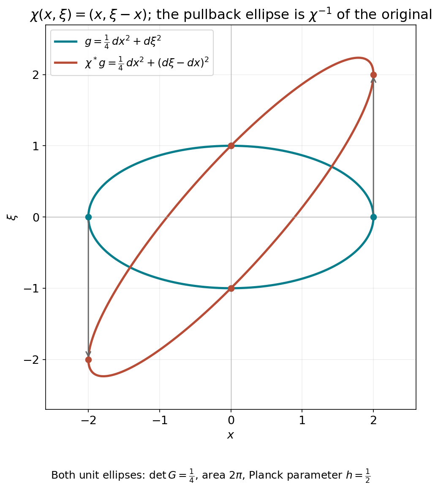

# Weyl action and affine symplectic covariance

The metric symbol product becomes an operator product only after its factors have a common domain. This companion proves the full Schwartz and tempered-distribution action, including bounded-set continuity and the strong-dual topology, before identifying the product. It then proves affine symplectic covariance, including the singular position-block case and uniqueness up to a scalar phase.

This is a modified selection of AN03-U009, *From Weyl symbols to operators and changes of coordinates*, from *Elliptic Operators & Boundary Problems: Renewed 2026 Course Draft*. Original principal author: AN-03 course-writing task. Original publisher: AN-03 local course project. Copyright © 2026 AN-03 course project contributors. The AN-03 course-writing task and OpenAI Codex are responsible for the renewed edition. Selection, exact prerequisite connections and identified additions: GPT-6 Astra (OpenAI), Ultra, 5 October 2026; publisher: AN-04 local course project.

Permission is granted to copy, distribute and modify this component under the GNU Free Documentation License, Version 1.2 only, with no Invariant Sections, no Front-Cover Texts and no Back-Cover Texts. The [complete licence](notices/COPYING), [title information](notices/TITLE_PAGE.md), [history](notices/HISTORY.md) and [rights notice](notices/RIGHTS.md) accompany it.

## A0. Exact inputs and selected scope

Use the [metric Weyl product and affine-domain companion](metric-weyl-products.md) and its complete metric, Gaussian and Fourier prerequisites. [The complete countable-seminorm metric and Baire proofs](../20261004-free-tangent-zoom/prerequisites/complete-test-spaces.md) supply the topological inputs in Section 1; completeness of the Schwartz space with the stated norms is proved in Section 1 below. The [measure and \(L^2\) proofs](../20261004-free-intrinsic-graph/prerequisites/measure-and-l2.md) supply all convergence, density and null-set statements below. Every additional use of a finite spectral theorem, compactness, inverse, product, Taylor or exponential identity has an exact earlier entry in the [proof map](proof-map.json).

The retained source sections are 1–4 and 6, including the full original Jacobian calculation AF1–AF2. The source's conformal-enlargement theorem and larger cross-parameter extension are separate and are not used here. The [quantization companion](reflection-and-quantization.md) gives the remaining reflection-compatible conversion.

The convention is \(D=-i\partial\), on \(W=\mathbb R_x^n\oplus\mathbb R_\xi^n\), \(n\ge1\), with
\[
\sigma((x,\xi),(y,\eta))=\xi\cdot y-x\cdot\eta.
\tag{A1}
\]
Write \(q_X=g_X^\sigma\). A symplectically temperate metric is slowly varying and satisfies, with \(C\ge1\), \(N\ge0\),
\[
q_X(T)\le Cq_Y(T)(1+q_Y(X-Y))^N.
\tag{A2}
\]
A weight is positive, locally \(g\)-continuous, and satisfies
\(m(Y)\le Cm(X)(1+q_Y(X-Y))^N\), with its own constants.

## 1. Polynomial growth and the two topologies

Let \(e(X)=|X|^2\) in the fixed canonical coordinates; \(e^\sigma=e\). Constants in comparisons with \(e\) may depend on the forms at the origin. There is a finite \(K\) such that
\[
C^{-1}(1+|X|^2)^{-K}e
\le g_X,q_X\le C(1+|X|^2)^K e,
\qquad
C^{-1}(1+|X|^2)^{-K}\le m(X)\le C(1+|X|^2)^K.
\tag{A3}
\]
These statements require no uncertainty inequality.

Indeed, (A2) with \(Y=0\) bounds \(q_X\) by a fixed form times a power of \(1+|X|^2\). In particular \(q_X(X)\) has such a bound. The primal version of (A2), with the other point at the origin, now gives
\(g_X\le Cg_0(1+q_X(X))^N\).
Dualizing the two upper bounds gives both lower bounds. The weight inequality with one point at zero gives its upper bound. Its reciprocal is temperate by Section 2 of [Two measuring scales, one Weyl product](metric-weyl-products.md), giving the lower bound. Enlarging a common \(K\) proves (A3).

Consequently every coordinate derivative of \(a\in S(m,g)\) has polynomial growth, with degree allowed to depend on the derivative order. In particular \(a\) defines a tempered distribution. On a bounded symbol set the growth bound for each fixed derivative is uniform. Thus bounded symbols converging in \(C^\infty_{\rm loc}\) converge in \(\mathcal S'\): pair their zeroth-order common polynomial bound with the rapid decay of a test function, and apply dominated convergence. We call this bounded-set local-smooth topology the **weak symbol topology**, as in [Quadratic Fourier multipliers at a moving scale](../20261004-free-intrinsic-graph/prerequisites/gauss-transform-estimates.md).

For \(u\in\mathcal S(\mathbb R^n)\), use the increasing norms
\[
Q_r(u)=\sum_{|\alpha|+|\beta|\le r}\|x^\alpha D^\beta u\|_2.
\tag{A4}
\]
They define the usual Schwartz topology. One direction follows by integrating a sufficiently rapidly decreasing bound. For the other, choose an integer \(s>n/2\). Fourier inversion, Cauchy–Schwarz and Schwartz Plancherel give
\[
\|v\|_\infty\le (2\pi)^{-n}\|\widehat v\|_1
\le C_s\sum_{|\gamma|\le s}\|D^\gamma v\|_2.
\tag{A5}
\]
Apply this to \(v=x^\alpha D^\beta u\) and expand its derivatives. This controls every usual Schwartz seminorm by a finite \(Q_r\). The familiar completeness of Schwartz space also follows directly: uniform limits of all weighted derivatives are compatible derivatives by the fundamental theorem of calculus on coordinate boxes.

On the complex-linear distribution dual \(\mathcal S'\) we use the **strong dual topology**. In particular, the distribution bracket is linear in its test function; Hilbert-space adjoints will be converted to bilinear transposes explicitly. The strong-dual seminorms are
\[
p_B(u)=\sup_{\phi\in B}|\langle u,\phi\rangle|,
\tag{A6}
\]
where \(B\) ranges over bounded subsets of \(\mathcal S\). A bounded subset \(\mathcal U\) of this dual satisfies a common finite-order estimate
\[
|\langle u,\phi\rangle|\le C Q_r(\phi)
\quad(u\in\mathcal U,\ \phi\in\mathcal S).
\tag{A7}
\]
Here is the Baire argument, including the point where that prerequisite enters. Strong boundedness gives pointwise boundedness on each \(\phi\). The closed sets
\(\{\phi:\sup_{u\in\mathcal U}|\langle u,\phi\rangle|\le j\}\), \(j=1,2,\ldots\), cover the complete metrizable space \(\mathcal S\). One has interior. Subtract two points in a small neighborhood inside it to obtain a uniform bound on a neighborhood of zero. That neighborhood contains a set \(Q_r<\varepsilon\); rescaling proves (A7). No assertion of joint continuity of the unrestricted distribution action follows from this argument.

## 2. An affine-invariant Fourier norm

For \(a\in\mathcal S(W)\), set
\[
\|a\|_{\mathcal F L^1}=(2\pi)^{-2n}\|\widehat a\|_{L^1(W^*)}.
\tag{A8}
\]
Then
\[
\|a^w\|_{L^2\to L^2}\le \|a\|_{\mathcal F L^1}.
\tag{A9}
\]
To prove it, write \(a\) by Fourier inversion as the integral of plane waves. Section 5 of [Two measuring scales, one Weyl product](metric-weyl-products.md) gives norm-one operators for every such wave. For \(u\in\mathcal S\), their actions depend continuously on the wave frequency in \(L^2\), by the explicit translation and modulation formulas. Multiply this continuous Hilbert-space-valued function by \(\widehat a\). On every compact cube its Riemann sums converge in \(L^2\): uniform continuity makes the difference between any two sufficiently fine sums arbitrarily small, and \(L^2\) is complete. The norm of each resulting integral is at most the integral of \(|\widehat a|\|u\|_2\). This also bounds differences between integrals over increasing cubes, whose tails tend to zero because \(\widehat a\in L^1\). It constructs the full integral in \(L^2\) and proves its triangle inequality. Pairing with a Schwartz test and using scalar Fourier inversion identifies it with \(a^wu\). Formula (A9) follows, first on Schwartz inputs and then on \(L^2\) by density. Thus no estimate for a general oscillatory kernel or general vector-valued integration theorem is being assumed.

This norm is unchanged by any invertible affine change of the phase-space variables, even one that is not symplectic. If \(b(X)=a(TX+Z)\), then
\[
\widehat b(\Theta)
=|\det T|^{-1}e^{i\langle T^{-t}\Theta,Z\rangle}
\widehat a(T^{-t}\Theta).
\]
Changing variables in its \(L^1\) norm cancels the determinant.

It is also controlled by finitely many Schwartz seminorms. More particularly, if \(a\) is supported in a fixed-radius ball for a positive form \(Q\), centered at \(X_0\), then
\[
\|a^w\|\le C\sum_{j\le s}\sup_X|a|_{j,Q}(X),
\qquad s>n\text{ an integer}.
\tag{A10}
\]
Use an affine map making \(Q\) Euclidean and its center zero. The Fourier \(L^1\) estimate used in (A5), now in dimension \(2n\), requires \(s>(2n)/2=n\). On the fixed support, the derivative \(L^2\) norms are bounded by their suprema. Affine invariance proves (A10) with no determinant of \(Q\) left over.

**Editorial reconstruction: the original support form and every Jacobian.**
Retain the positive form \(Q\), its original coordinate matrix \(G\), the center \(X_0\), and the support condition \(Q(X-X_0)\le R^2\). Write \(d=2n\). Choose an invertible real matrix \(L\) with \(L^tGL=I\), and put \(J=|\det L|\), \(b(z)=a(X_0+Lz)\). This is a comparison map; the original form and symbol remain the objects in (A10). The original Fourier transforms give
\[
\begin{aligned}
\widehat b(\eta)&=J^{-1}e^{i\langle L^{-t}\eta,X_0\rangle}
                  \widehat a(L^{-t}\eta),\\
\widehat a(\Theta)&=J e^{-i\langle\Theta,X_0\rangle}
                    \widehat b(L^t\Theta),\\
\int|\widehat a(\Theta)|\,d\Theta
 &=\int J|\widehat b(L^t\Theta)|\,d\Theta
  =\int J|\widehat b(\eta)|J^{-1}\,d\eta.
\end{aligned}
\tag{AF1}
\]
The inverse Fourier factor is still \((2\pi)^{-d}\). For an integer \(s>d/2\), put \(I_{d,s}=\int(1+|\eta|^2)^{-s}\,d\eta\). It is finite: the unit ball contributes at most its finite volume, and the shell \(2^r\le|\eta|<2^{r+1}\) contributes at most \(\omega_d2^d2^{r(d-2s)}\), a summable geometric series. Cauchy--Schwarz, the full multinomial and Plancherel give
\[
\begin{aligned}
\|a\|_{\mathcal FL^1}
 &\le (2\pi)^{-d/2}I_{d,s}^{1/2}
 \left(\sum_{|\alpha|\le s}
 \frac{s!}{(s-|\alpha|)!\,\alpha!}\|D_z^\alpha b\|_2^2\right)^{1/2},\\
\|D_z^\alpha b\|_2^2
 &=J^{-1}\int_{Q(X-X_0)\le R^2}
  \left|\prod_{r=1}^d\left(\sum_{i=1}^dL_{ir}D_{X_i}\right)^{\alpha_r}a(X)\right|^2dX\\
 &\le J^{-1}(J\omega_dR^d)
                \left(\sup_X|a|_{|\alpha|,Q}(X)\right)^2.
\end{aligned}
\tag{AF2}
\]
Each column \(Le_r\) has original \(Q\)-length one. The full coordinate expansion in the second line is the sum over all \(\beta_{ir}\ge0\) with \(\sum_i\beta_{ir}=\alpha_r\), with coefficient \(\prod_r\alpha_r!\prod_{i,r}L_{ir}^{\beta_{ir}}/\beta_{ir}!\) and derivative \(\prod_iD_{X_i}^{\sum_r\beta_{ir}}a\). Thus no coordinate coefficient or derivative has been removed. The support measure is exactly \(J\omega_dR^d\), and the derivative integral has the separate factor \(J^{-1}\); (AF2) displays both before their cancellation. Applying (A9) proves (A10), with its original operator and original directional seminorms. This arbitrary affine comparison proves a Fourier norm estimate. Unitary covariance of a Weyl operator has the separate symplectic hypothesis in Section6.

## 3. Localized decay and counting

Choose the partition \((\phi_\nu)\) of [Localizing symbols with moving metrics](../20261004-free-intrinsic-graph/prerequisites/metric-localization.md) and fixed radii
\(0<a<b<c<r_*\), with supports in \(B_{X_\nu}(a)\). Put
\[
g_\nu=g_{X_\nu},\quad m_\nu=m(X_\nu),\quad
U_\nu=B_{X_\nu}(b),\quad U'_\nu=B_{X_\nu}(c),\quad
a_\nu=\phi_\nu a.
\]
The larger balls have bounded multiplicity. Localization gives
\(\sup|a_\nu|_{j,g_\nu}\le C_jm_\nu p_{\le j}(a;m,g)\).
The notation \(p_{\le j}\) denotes the sum of symbol seminorms of orders at most \(j\).

The form
\[
r_\nu=(e+g_\nu)^\sigma,\qquad
r_\nu(Y)=\min_{Y=U+V}\big(g_\nu^\sigma(U)+|V|^2\big),
\qquad
R_\nu=\inf_{Y\in U_\nu}r_\nu(Y)^{1/2}
\tag{A11}
\]
uses the dual-of-a-sum identity proved in Section 1 of [Two measuring scales, one Weyl product](metric-weyl-products.md). There is no factor2 here, since the primal form is a sum rather than a mean. All forms are positive definite and the balls nonempty, so \(R_\nu\) is finite; it can be zero.

One may replace \(e\) throughout this construction by any fixed positive form \(e_0\). There are constants \(c,C>0\) with \(ce\le e_0\le Ce\). Adding \(g_\nu\), and then dualizing, shows that \((e_0+g_\nu)^\sigma\) and \(r_\nu\) are comparable with constants independent of \(\nu\). Their distances and center-growth bounds are consequently equivalent. Choosing canonical Euclidean coordinates therefore imposes no restriction on the reference form.

**Localized decay.** For each integer \(M\ge0\) there is a finite \(J_M\) such that
\[
\|a_\nu^w u\|_2
\le C_Mm_\nu(1+R_\nu)^{-M}
p_{\le J_M}(a;m,g)Q_M(u).
\tag{A12}
\]
The constants are uniform in \(\nu\).

Here are the geometric and differential details. If \(R_\nu>0\), minimize the \(r_\nu\)-norm on the compact closure of \(U_\nu\). Let \(P\) be a minimizing point. Differentiating along each segment from \(P\) into that closed ellipsoid gives a supporting linear form
\[
L(Y)=r_\nu(P,Y)/r_\nu(P)^{1/2}
=\sigma(Y,t),\qquad
e(t)+g_\nu(t)=1,\qquad
L(Y)\ge R_\nu\quad(Y\in U_\nu).
\tag{A13}
\]
The normalization follows by ordinary quadratic duality, composed with \(\sigma\). In particular \(L_\nu=L(X_\nu)\ge R_\nu\). Positivity on the \(g_\nu\)-ball of radius \(b\) gives
\(\sqrt{g_\nu^\sigma(t)}\le L_\nu/b\).
On the support ball of radius \(a\), therefore,
\(L\ge(1-a/b)L_\nu\).
Differentiating the reciprocal shows explicitly that
\[
\sup|L_\nu/L|_{k,g_\nu}
\le k!\,b^{-k}(1-a/b)^{-k-1}.
\tag{A14}
\]
Division of a supported smooth symbol by \(L\), followed by extension by zero outside \(U_\nu\), is consequently smooth and preserves its support.

The affine Weyl identity of Section 5 of [Two measuring scales, one Weyl product](metric-weyl-products.md), used on the right, is
\[
a_\nu^wu
=(a_\nu/L)^w L^wu
+\frac{i}{2}\{a_\nu/L,L\}^wu,
\qquad
\{a_\nu/L,L\}=-L^{-1}\partial_t a_\nu.
\tag{A15}
\]
There is no derivative of \(L\) in the last expression, since
\(\partial_t L=\sigma(t,t)=0\).
Both new symbols have frozen seminorm bounds with weight
\(m_\nu/L_\nu\); the differentiated one uses one additional source derivative and \(g_\nu(t)^{1/2}\le1\). Repeat (A15) \(M\) times. Every resulting symbol has weight \(m_\nu L_\nu^{-M}\), and every input is \((L^w)^j u\) with \(j\le M\). Since \(|t|\le1\), expanding these powers and commuting coordinates and derivatives bounds their \(L^2\) norms by \(C_MQ_M(u)\). Apply (A10) to each of the finitely many terms. This proves (A12) when \(R_\nu>1\). For \(R_\nu\le1\), (A10) itself proves it after enlarging the constant. Thus zero distance causes no division by zero.

**Polynomial counting.** There are finite constants \(B,P,C\) such that
\[
|X_\nu|^2\le C(1+R_\nu^2)^B,\qquad
\#\{\nu:R_\nu\le r\}\le C(1+r)^P.
\tag{A16}
\]
Consequently
\[
\sum_\nu(1+R_\nu)^{-L}<\infty\qquad(L>P).
\tag{A17}
\]

We give the missing volume argument in full. Let \(T\ge1\) and \(R_\nu^2\le T\). Choose \(Y\in U_\nu\) with \(r_\nu(Y)\le2T\), and take a minimizing decomposition \(Y=U+V\) in (A11). Then
\(g_\nu^\sigma(U)\le2T\) and \(|V|^2\le2T\).
Slow variation gives \(q_Y(U)\le C T\). Formula (A2), comparing \(V\) to \(Y\), implies
\[
q_V\le CT^Nq_Y,\qquad q_V(U)\le CT^{N+1}.
\tag{A18}
\]
By (A3), both \(g_V\) and \(q_V\) lie between
\(C^{-1}T^{-K}e\) and \(CT^Ke\). Hence
\(|U|^2\le CT^{K+N+1}\).
Applying (A2) in the other direction, with its now controlled distance \(q_V(U)\), gives
\[
q_Y\le CT^{K+N(N+1)}e,
\qquad
g_Y\le CT^{K+N}e.
\tag{A19}
\]
Dualizing supplies the lower bounds as well. Take, for example,
\(B=K+(N+1)^2\), enlarged if needed to absorb the preceding fixed exponents. Local comparison with \(g_\nu\), and
\(g_\nu(X_\nu-Y)<b^2\), now give
\[
C^{-1}T^{-B}e\le g_\nu\le CT^Be,\qquad
|Y|^2+|X_\nu|^2\le CT^B.
\tag{A20}
\]

A Euclidean ball centered at this \(Y\) with radius
\(\kappa T^{-B/2}\) lies in \(U'_\nu\), for a fixed small \(\kappa>0\), because its \(g_\nu\)-radius is less than the gap \(c-b\). These small balls inherit the bounded multiplicity of \(U'_\nu\), while all lie in one Euclidean ball of radius \(C T^{B/2}\). Integrating their characteristic functions bounds the number of indices by \(CT^{2nB}\). The argument applies first to every finite subcollection, so it bounds the whole index set. This proves (A16), for example with \(P=4nB\). Its center bound follows by taking \(T=1+R_\nu^2\). Finally split the indices into dyadic bands of \(1+R_\nu\); their contributions in (A17) form a geometric series when \(L>P\). No uncertainty assumption or bound on a vertical part of the metric was used.

## 4. Action on Schwartz functions and distributions

**Theorem 4.1 (Schwartz and distribution action).** If \(g\) is symplectically temperate and \(m\) is a temperate weight for \(g\), then
\[
a^w:\mathcal S\longrightarrow\mathcal S,\qquad
a^w:\mathcal S'\longrightarrow\mathcal S'
\quad(a\in S(m,g))
\tag{A21}
\]
are continuous. For each \(r\) there are finite \(J,t\) such that
\[
Q_r(a^wu)\le C_r p_{\le J}(a;m,g)Q_t(u).
\tag{A22}
\]
The first action is jointly continuous in symbol and function. Both actions depend continuously on a bounded symbol set with its weak symbol topology, uniformly on bounded sets of inputs, using the Schwartz topology or the strong distribution topology respectively. The distribution action is separately continuous and hypocontinuous: fixing a bounded set in either factor gives continuity uniformly over that set. It is not, in general, jointly continuous on the unrestricted product.

To prove (A22) first for \(r=0\), sum (A12). By (A3) and (A16), \(m_\nu\) is bounded by a power of \(1+R_\nu\). Choosing \(M\) larger than that power plus \(P\) makes the sum finite by (A17).

For all output derivatives and moments, let \(F(X)=\sigma(X,t)+d\) be a fixed affine form. The distributional identity
\[
F^w a_\nu^w
=\big(Fa_\nu+\{F,a_\nu\}/(2i)\big)^w
\tag{A23}
\]
holds before any general operator-composition theorem. On the support ball,
\[
|F(X)|\le |F(X_\nu)|+a\sqrt{g_\nu^\sigma(t)},\qquad
|\partial_t a_\nu|_{k,g_\nu}
\le \sqrt{g_\nu(t)}\,|a_\nu|_{k+1,g_\nu}.
\]
Both forms \(g_\nu,g_\nu^\sigma\) obey (A3). Thus the new symbol in (A23) has frozen seminorms bounded by
\(C_km_\nu(1+|X_\nu|^2)^{K_1}p_{\le k+1}(a;m,g)\).
Iterating for any fixed word of \(r\) coordinates and derivatives gives the same assertion with a finite exponent \(K_r\) and \(r\) additional derivatives. Apply (A12) to these new supported symbols, then use (A16) and choose its decay order large enough to dominate the polynomial factors and the counting exponent. This proves (A22) for every word, hence every \(Q_r\).

Each partial sum \(\sum a_\nu^wu\) is Schwartz, and the estimates just proved make the series Cauchy in all Schwartz seminorms. It therefore converges in \(\mathcal S\). The symbol partial sums remain bounded in \(S(m,g)\) and converge locally smoothly to \(a\). By (A3) they converge in \(\mathcal S'\), so continuity of the distributional kernel construction identifies the Schwartz limit with the already defined \(a^wu\). This also proves independence of the partition.

For weak symbol continuity, the summable tails of these estimates are uniform on bounded symbol sets and on bounded sets of Schwartz inputs. Each finite sum is continuous under local smooth convergence: its symbols have fixed compact support, and (A10) and the preceding finite derivative estimates apply. Uniformly small tails and continuous finite sums prove the assertion for \(\mathcal S\).

Let \(C\phi=\overline\phi\). The adjoint identity \((a^w)^*=(\overline a)^w\) gives the bilinear transpose test map \((a^w)^t=C(\overline a)^wC\). Define the extension by
\(\langle a^wu,\phi\rangle=\langle u,(a^w)^t\phi\rangle\).
It agrees with the operator already constructed on regular distributions from Schwartz functions. Conjugation preserves every \(Q_r\), so a bounded set of tests has bounded image under this transpose for fixed \(a\), proving strong-dual continuity through (A6). For symbols in a bounded set, (A22) makes the union of those images bounded, giving uniform continuity in the distribution input. For distributions in a bounded set, apply (A7) and then (A22) to the transpose tests; this gives a finite symbol-seminorm estimate, uniformly over that set. The weak symbol continuity already proved for bounded sets of test functions gives the corresponding strong-dual conclusion. These observations prove all stated hypocontinuity and bounded-set assertions.

The distinction from unrestricted joint continuity is necessary. Already take \(g=e\), \(m=1\), and symbols independent of \(\xi\), so that quantization is ordinary multiplication. A symbol neighborhood controls only finitely many seminorms, say through order \(J\). With a fixed cutoff \(\chi=1\) near zero, the functions
\[
a_k(x)=c k^{-J}\chi(x)e^{ikx_1}
\tag{A24}
\]
lie in that neighborhood for a sufficiently small fixed \(c>0\). Every neighborhood of zero in \(\mathcal S'\) contains a sufficiently small fixed multiple of
\(\partial_{x_1}^{J+1}\delta_0\), because scalar multiplication is continuous. Pairing its product with \(a_k\) against a test equal to one near zero has magnitude proportional to \(k\). Thus no pair of unrestricted input neighborhoods controls even this one scalar output seminorm. The same argument applies to the weak distribution topology. For a bounded set of distributions, (A7) rules out this defect by supplying a common order.

**Theorem 4.2 (operator composition).** Under either the one-metric or the compatible two-metric hypotheses of Theorem 7.1 of [Two measuring scales, one Weyl product](metric-weyl-products.md),
\[
(a\#b)^w=a^wb^w
\quad\hbox{on both }\mathcal S\hbox{ and }\mathcal S'.
\tag{A25}
\]
Choose bounded Schwartz approximants \(a_j,b_j\) from [Localizing symbols with moving metrics](../20261004-free-intrinsic-graph/prerequisites/metric-localization.md). The identity holds for them by Section 6 of [Two measuring scales, one Weyl product](metric-weyl-products.md). Formula (A22) makes the family \(a_j^w\) equicontinuous on Schwartz space, while weak symbol continuity gives
\(b_j^wu\to b^wu\) and \(a_j^wb^wu\to a^wb^wu\) in \(\mathcal S\).
Thus their composites converge to \(a^wb^wu\). The symbol products are bounded and converge weakly to \(a\#b\) by Theorem 7.1 of [Two measuring scales, one Weyl product](metric-weyl-products.md); the theorem just proved identifies the other limit with \((a\#b)^wu\). This proves (A25) on \(\mathcal S\) without circularity.

For completeness, Schwartz functions are weakly dense in \(\mathcal S'\). If \(\rho\) is a compact smooth mollifier of integral one and \(\chi\) a compact cutoff equal to one near zero, then
\(\chi(X/R)(u*\rho_{1/R})(X)\) is Schwartz and converges to \(u\) distributionally. On tests this is the convergence
\(\check\rho_{1/R}*(\chi(\cdot/R)\phi)\to\phi\) in \(\mathcal S\), proved by Taylor's formula and the rapid decay seminorms. All fixed operators in (A25) are transposes of continuous Schwartz maps and are therefore weakly continuous on \(\mathcal S'\). The identity extends from the dense subspace to every distribution.

## 6. Affine symplectic covariance

A map \(\chi(X)=SX+Z\) is affine symplectic when
\(\sigma(ST,SU)=\sigma(T,U)\). The following five types generate all such maps:
\[
\begin{gathered}
(x,\xi)\mapsto(x+a,\xi),\qquad
(x,\xi)\mapsto(x,\xi+b),\\
(x_j,\xi_j)\mapsto(\xi_j,-x_j),\\
(x,\xi)\mapsto(Tx,T^{-t}\xi),\qquad
(x,\xi)\mapsto(x,\xi-Ax),\quad A=A^t.
\end{gathered}
\tag{A28}
\]

Here is a block proof that also handles singular position blocks. Translations remove \(Z\). Write the linear symplectic matrix as
\(S=\left(\begin{smallmatrix}A&B\\ C&D\end{smallmatrix}\right)\).
Its first \(n\) columns are linearly independent and \(A^tC=C^tA\). Consequently
\[
(A+iC)^*(A+iC)=A^tA+C^tC
\]
is positive definite: the right side vanishes on a vector only if both \(A\) and \(C\) annihilate it. Thus the real polynomial \(\det(A+tC)\) is not identically zero, since its value at \(t=i\) is nonzero. It has degree at most \(n\), so one of any \(n+1\) distinct real values of \(t\) makes \(A+tC\) invertible. The root bound used here follows by dividing out \(t-t_j\) at each distinct root \(t_j\); each division lowers the degree by one. Left multiplication by the upper shear
\(\left(\begin{smallmatrix}I&tI\\0&I\end{smallmatrix}\right)\) makes the position block invertible. Upper shears are conjugates of lower shears by the product of the pair swaps in (A28).

For an invertible position block, the symplectic identities imply that
\(CA^{-1}\) and \(A^{-1}B\) are symmetric and
\(D=A^{-t}+CA^{-1}B\). Hence
\[
S=
\begin{pmatrix}I&0\\ CA^{-1}&I\end{pmatrix}
\begin{pmatrix}A&0\\0&A^{-t}\end{pmatrix}
\begin{pmatrix}I&A^{-1}B\\0&I\end{pmatrix}.
\tag{A29}
\]
Each factor is generated by (A28); undo the preliminary shear to finish the proof. This uses only determinants, elementary polynomial division and the positive quadratic identity above.

**Theorem 6.1 (affine symplectic covariance).** For every affine symplectic \(\chi\) there is a unitary \(U_\chi\) on \(L^2(\mathbb R^n)\), preserving \(\mathcal S\) and extending to an automorphism of \(\mathcal S'\), such that
\[
U_\chi^{-1}L^wU_\chi=(L\circ\chi)^w,\qquad
U_\chi^{-1}a^wU_\chi=(a\circ\chi)^w.
\tag{A30}
\]
The first identity holds for every real affine \(L\), as an equality of the selfadjoint closures described in Section 5 of [Two measuring scales, one Weyl product](metric-weyl-products.md). The second holds for every tempered symbol \(a\), as an identity \(\mathcal S\to\mathcal S'\). The unitary is unique up to a constant of modulus one.

For the generators, take respectively
\[
\begin{array}{c|c}
\chi& U_\chi u(x)\\ \hline
(x+a,\xi)&u(x-a)\\
(x,\xi+b)&e^{ib\cdot x}u(x)\\
(x_j,\xi_j)\mapsto(\xi_j,-x_j)&\mathcal F_{0,j}u(x)\\
(Tx,T^{-t}\xi)&|\det T|^{-1/2}u(T^{-1}x)\\
(x,\xi-Ax)&e^{-ix\cdot Ax/2}u(x).
\end{array}
\tag{A31}
\]
Here \(\mathcal F_{0,j}\) is the normalized Fourier transform in just the \(j\)-th variable. Change of variables and Plancherel prove unitarity. Differentiation proves preservation of Schwartz space and of its topology; each inverse has the same property. The bilinear transpose \(U_\chi^t=CU_\chi^{-1}C\) therefore defines the distribution extension by \(\langle U_\chi u,\phi\rangle=\langle u,U_\chi^t\phi\rangle\); it agrees with the original map on Schwartz functions. Direct substitution gives the intertwining of \(x_j,D_j\), hence of every affine \(L\). Since Schwartz space is a core for each real affine observable, these identities pass to the selfadjoint closures. Products of the displayed unitaries implement products of the affine maps.

We justify both uniqueness and the distributional extension of covariance. A bounded unitary commuting with all closed \(x_j,D_j\) commutes with their translation and modulation groups. For example, on the domain of \(x_j\), differentiate
\(e^{-itx_j}Ue^{itx_j}u\); domain preservation follows from commutation with the closed operator, and the derivative is zero. Density extends the resulting equality to \(L^2\). The same argument applies to \(D_j\), whose group is the translation group explicitly proved in Section 5 of [Two measuring scales, one Weyl product](metric-weyl-products.md). Thus no prior preservation of \(\mathcal S\) by this unknown unitary has been assumed.

Fourier inversion of \(\phi\in\mathcal S(\mathbb R^n)\) then shows that \(U\) commutes with multiplication by \(\phi\). Fix \(h(x)=e^{-|x|^2}>0\) and set \(b=Uh/h\), initially a locally square-integrable function. For every \(\phi\in C_c^\infty\),
\[
U(\phi h)=\phi Uh=b\phi h.
\]
Since every compact smooth function is of the form \(\phi h\), boundedness gives
\(\|b\psi\|_2\le\|U\|\|\psi\|_2\) for all such \(\psi\).
For a bounded measurable set \(E\), approximate its indicator in \(L^2\) by compact smooth functions and select a subsequence converging almost everywhere. To obtain that subsequence, choose squared errors at most \(2^{-j}\); Tonelli makes the sum of the pointwise squared errors finite almost everywhere. Fatou's inequality gives
\(\int_E|b|^2\le\|U\|^2|E|\). The needed nonnegative Fatou inequality follows from the increasing tail infima: their integrals are bounded by the liminf of the original integrals, and monotone convergence follows from Tonelli applied to their nonnegative successive differences. Applying the resulting set inequality to the intersection of a ball with \(\{|b|>\|U\|+\varepsilon\}\) proves \(|b|\le\|U\|\) almost everywhere. Density now gives \(Uu=bu\) on all \(L^2\). Commutation with translations means
\(b(x+t)=b(x)\) almost everywhere for each fixed \(t\). Convolving with a compact smooth mollifier makes this an everywhere translation-invariant smooth function, hence a constant. Letting the mollifier radius tend to zero in distributions shows that \(b\) itself is constant: the constants converge by testing against one function of integral one. Unitarity makes its modulus one. Comparing any two implementations of \(\chi\) reduces to this commuting case, proving uniqueness.

For covariance of symbols, first exponentiate the affine intertwining. This can be checked without an abstract functional calculus: the explicit affine groups in Section 5 of [Two measuring scales, one Weyl product](metric-weyl-products.md) preserve \(\mathcal S\); differentiating the product of one inverse group with the conjugate of the other gives zero there. Density supplies equality on \(L^2\). Thus (A30) holds for all plane-wave symbols. Fourier inversion and their norm-one operator bounds extend it to Schwartz symbols. Finally, the symbol-to-kernel map, affine pullback of distributions, and conjugation by \(U_\chi\) are continuous in distributional pairings. The weak density proved after (A25) extends (A30) to every \(a\in\mathcal S'(W)\).

An affine pullback here uses the usual distributional change of variables. Symplectic matrices have \(|\det S|=1\), as follows already by taking determinants in \(S^tJS=J\). The conclusion does not supply a canonical simultaneous choice of the phases of all \(U_\chi\); products implement composition but may differ from another chosen implementation by a scalar.

The metric version follows directly. Define
\[
(\chi^*g)_X(T)=g_{\chi(X)}(ST),\qquad \chi^*m=m\circ\chi.
\tag{A32}
\]
Symplectic duality commutes with this pullback, slow variation and temperateness keep the same constants, and \(h_{\chi^*g}=h_g\circ\chi\). The chain rule identifies the symbol seminorms under \(a\mapsto a\circ\chi\). Thus covariance also transports the full metric symbol classes without changing their structural hypotheses.

## A8. An exact shear and its metric

In one position variable take \(\chi(x,\xi)=(x,\xi-x)\). The implementing unitary and a metric pullback are
\[
U_\chi u(x)=e^{-ix^2/2}u(x),\qquad
g=\tfrac14\,dx^2+d\xi^2,\qquad
\chi^*g=\tfrac14\,dx^2+(d\xi-dx)^2.
\tag{WC1}
\]
Differentiating the displayed phase gives \(U_\chi^{-1}DU_\chi=D-x\), which fixes the sign of the shear. The matrices of \(g\) and \(\chi^*g\) have determinant \(1/4\); direct symplectic duality gives \(h=1/2\) for both. Their unit ellipses therefore both have area \(2\pi\). The image by \(\chi^{-1}\) of the first ellipse is the second. These conclusions also follow from A32; here every constant can be checked directly.

The curves are parameterized by \((2\cos t,\sin t)\) and \((2\cos t,2\cos t+\sin t)\), \(0\le t\le2\pi\). They are unit ellipses of the original and pulled-back metrics in the same coordinates. Their four marked points correspond to \(t=0,\pi/2,\pi,3\pi/2\). This illustrates the exact pullback in WC1; it is not a numerical proof of general covariance. The [editable figure source](figures/symplectic_metric_shear.py) accompanies it.

The selected programme exposition is AN03-U009. The approved mathematical antecedents are Hörmander III, the admitted 2007 eBook, Lemma 18.5.8, Theorem 18.5.9 and the Schwartz-action discussion in §18.6. The approved covariance statement and proof at printed 157–159 (PDF 172–174) were compared with the retained block-factorization and explicit uniqueness proofs. The book uses an induction on symplectic generators; the programme proof uses the invertible \(A+tC\) block. No book text or files are included.
