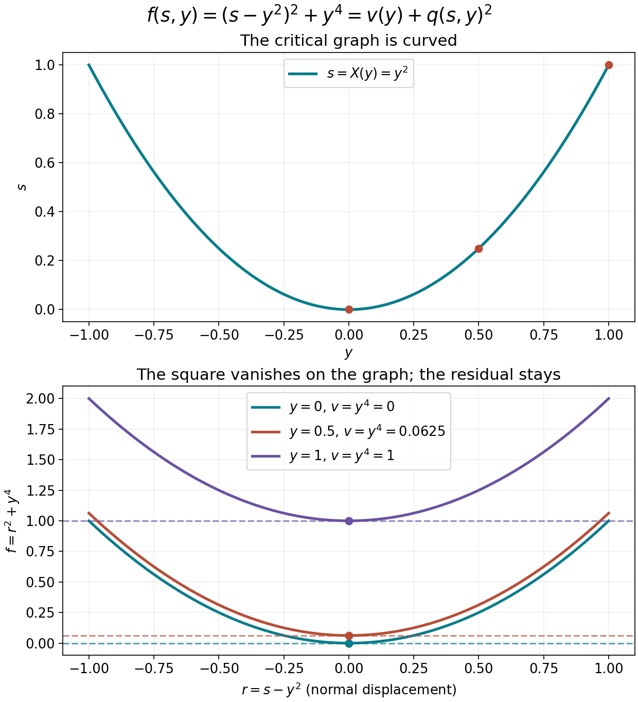

# Scalar splitting and the scale selected by a nonnegative function

The scalar lower-bound argument starts with a local decomposition of a nonnegative function into a square and a function independent of one constant direction. This companion proves that decomposition, its uniform derivative bounds, and the adaptive metric and squared partition used to localize it. These are elementary prerequisites for the Fefferman–Phong operator estimate; that operator estimate is not asserted here.

This is a modified selection of AN03-U019, *When a nonnegative scalar symbol acquires a negative part*, from *Elliptic Operators & Boundary Problems: Renewed 2026 Course Draft*. Original principal author: AN-03 course-writing task. Original publisher: AN-03 local course project. Copyright © 2026 AN-03 course project contributors. The renewed edition is the work of the AN-03 course-writing task and OpenAI Codex. Selection, exact prerequisite connections and identified additions: GPT-6 Astra (OpenAI), Ultra, 5 October 2026; publisher: AN-04 local course project.

Permission is granted to copy, distribute and modify this component under the GNU Free Documentation License, Version 1.2 only, with no Invariant Sections, no Front-Cover Texts and no Back-Cover Texts. The [complete licence](notices/COPYING), [title information](notices/TITLE_PAGE.md), [history](notices/HISTORY.md) and [rights notice](notices/RIGHTS.md) accompany it.

## S0. Conventions and exact earlier inputs

Use the Euclidean norm on \(E=\mathbb R^{2n}\) and
\(\sigma((x,\xi),(y,\eta))=\xi\cdot y-x\cdot\eta\).
For a positive form \(g_X\), define
\[
g_X^\sigma(T)=\sup_{S\ne0}\frac{|\sigma(T,S)|^2}{g_X(S)},
\qquad h_g(X)^2=\sup_{T\ne0}\frac{g_X(T)}{g_X^\sigma(T)}.
\tag{SP1}
\]
Slow variation means that \(g_X(X-Y)\le r_*^2\) implies uniform two-sided comparison of \(g_X,g_Y\). Symplectic temperateness means, with the distance based at \(Y\),
\[
g_Y(T)\le C g_X(T)\bigl(1+g_Y^\sigma(X-Y)\bigr)^M.
\tag{SP2}
\]
A permissible metric has both properties and \(h_g\le1\). A weight is temperate when its ratio in either direction is bounded by a fixed power of this distance. Symbol seminorms use the multilinear derivatives evaluated on directions of metric length at most one.

The [included moving-ellipsoid proof, Sections 1–4](../20261004-free-intrinsic-graph/prerequisites/metric-localization.md) supplies the countable cover, local finiteness, fixed overlap and derivative bounds, including frozen and moving norms. The [current proof map](proof-map.json) connects every use of finite-dimensional compactness, the spectral theorem, Taylor's formula, smooth cutoffs and the implicit function theorem to complete earlier programme proofs. In particular, the implicit map is [U001 P3](../20261004-free-stationary-phase/proof-map.html#P3), and the spectral theorem is [U001 Q5](../20261004-free-stationary-phase/quadratic-stationary-phase.md#q5-diagonalizing-a-real-symmetric-matrix).

## S1. The gradient bound for a nonnegative function

On a fixed ball let \(F\ge0\), with \(F\) and its second derivatives bounded. On a smaller concentric ball,
\[
|F'(z)|\le C\sqrt{F(z)}.
\tag{SP3}
\]
For a unit vector \(v\), choose a segment of fixed length in both signs staying in the larger ball. Taylor's formula and nonnegativity give
\(s|F'(z)v|\le F(z)+C_2s^2\) after choosing the sign opposite to the derivative. For small \(F(z)>0\), choose \(s=\sqrt{F(z)/C_2}\), enlarging \(C_2\) to be positive; when this exceeds the allowed segment use that fixed segment and the uniform upper bound on \(F\). The case \(F(z)=0\) follows by \(s\downarrow0\). Taking the supremum over \(v\) proves SP3 with constants depending only on the bounds and the distance to the larger boundary.

## S2. Diagonal norms, normalized jets and uniform radii

Here \(B_r\subset\mathbb R^d\) is the Euclidean ball of radius \(r\). For this finite-dimensional lemma only, write
\(j_k(f,x)=\sup_{|v|=1}|D^kf(x)[v,\ldots,v]|\).
These diagonal seminorms are equivalent to multilinear norms. To see this directly, a symmetric \(k\)-linear form satisfies
\[
T(v_1,\ldots,v_k)=\frac1{2^k k!}
\sum_{\varepsilon\in\{-1,1\}^k}
\left(\prod_j\varepsilon_j\right)
T\left(\sum_j\varepsilon_jv_j,\ldots,\sum_j\varepsilon_jv_j\right).
\tag{SP4}
\]
Multilinear expansion makes every term vanish in the sign sum unless every index occurs an odd number of times; with \(k\) slots this means exactly once, leaving \(2^k k!\) identical terms. For unit inputs this bounds the multilinear norm by \(k^k/k!\) times the diagonal norm. All constants below may depend on \(d,k\). For \(k\leq3\), real symmetric derivatives have exactly the same diagonal and multilinear norms. Thus the numerical bounds below also hold in the multilinear convention of Section S0. The cases \(k\leq1\) are immediate, and \(k=2\) is the spectral norm identity for a real symmetric matrix.

Here is a finite-dimensional proof for \(k=3\), to retain the numerical constants. Let \(T\) be a real symmetric trilinear form and \(M\) its multilinear norm. The zero form is immediate. Among unit triples attaining \(|T(x,y,z)|=M\), choose one maximizing \(\|x+y+z\|\), using compactness. Fix \(z\) and let \(B\) be the symmetric operator with \(\langle Bx,y\rangle=T(x,y,z)\). At an extremal triple, differentiation on each unit sphere gives \(Bx=\varepsilon My\) and \(By=\varepsilon Mx\), where \(\varepsilon\) is the sign of \(T(x,y,z)\). If \(0<r=\|x+y\|<2\), set \(v=(x+y)/r\). Then \(Bv=\varepsilon Mv\), so \((v,v,z)\) is another maximizing triple. Its squared sum norm exceeds the previous one by
\[
(2-r)\bigl(2+r+2\langle v,z\rangle\bigr)\geq(2-r)r>0,
\]
a contradiction. If \(x=-y\), replacing the pair by \((v,v)\), where \(v\) is either \(x\) or \(-x\) and \(\langle v,z\rangle\geq0\), preserves the absolute trilinear value and increases the squared sum norm from one to at least five. Hence \(x=y\). Applying the same argument to each pair shows \(x=y=z\), which proves equality with the diagonal norm. At order four we only need that a multilinear bound implies the same diagonal bound, and that polarization controls mixed derivatives by a fixed dimensional constant.

**Normalized jet lemma.** Suppose \(f\geq0\) is smooth on \(B_2\), \(j_4(f,x)\leq1\) there, and
\[
\max\{f(0),j_2(f,0)\}=1.
\tag{F14}
\]
There is a radius \(r>0\), independent of \(f\), such that on \(B_r\)
\[
\frac12<\max\{f(x),j_2(f,x)\}<2,
\qquad j_k(f,x)<8\quad(0\leq k<4).
\tag{F15}
\]
For \(k=0\) use \(j_0=f\).

**Proof.** Fix a unit vector \(v\), put \(L=Df(0)v\), \(T=D^3f(0)[v,v,v]/6\), and evaluate Taylor's formula at \(\pm v\) and at \(\pm2v\), using limits from inside \(B_2\) for the latter. Nonnegativity and (F14) imply
\[
|L+T|\leq\frac{37}{24},\qquad
|2L+8T|\leq\frac{11}{3}.
\tag{F16}
\]
Subtracting twice the first expression from the second gives \(|6T|\leq27/4<7\). Subtracting one quarter of the second from twice the first gives \(|3L/2|\leq4\), hence \(|L|\leq8/3<3\). Therefore the diagonal third and first derivatives at zero are uniformly bounded, with strict room below eight. Polarization bounds their mixed versions. Taylor's formula now bounds the change of the Hessian by \(C|x|\), the change of the first derivative by \(C|x|\), and the change of the third derivative by \(C|x|\), using the fourth derivative bound. The same holds for \(f\). Choose a single small radius so that these changes preserve the strict inequalities in (F15). One of the two quantities in (F14) equals one, which gives its lower bound as well. \(\square\)

The argument also gives a version without normalization: if \(f(0),j_2(f,0)\leq1\) and \(j_4\leq1\), all derivatives through order three are uniformly bounded on a fixed smaller ball. Apply the preceding proof to \(f+1-f(0)\), which remains nonnegative and has value one at zero. This variant gives upper bounds; it does not produce a nonnegative splitting of the original \(f\) by subtracting the added constant.

## S3. Removing one constant direction by scalar splitting

**Splitting lemma.** Under (F14), there is a fixed smaller radius on which
\[
f(s,y)=v(y)+q(s,y)^2,
\qquad v\geq0,
\tag{F17}
\]
after an orthogonal coordinate change. Here \(s\) is one real direction, \(v\) is independent of it, and \(q,v\) are smooth and real. Their derivatives through order \(k\) are controlled by finitely many bounds for \(f\) through order \(k+2\) on a fixed larger working ball. Both balls and all constants are independent of \(f\) when these bounds are fixed. In particular no nondegeneracy assumption on the entire Hessian is imposed.

**Proof.** The jet lemma first gives uniform bounds through order three on a fixed ball. We choose radii and a positive threshold \(\eta\) using only those bounds.

If \(f(0)\geq\eta\), shrink the output ball until \(f\geq\eta/2\), using the uniform first derivative bound. Set \(v=0\), choose any direction, and take \(q=\sqrt f\). Repeated chain differentiation controls \(q\) to order \(k\) by derivatives of \(f\) to order \(k\) and the fixed positive lower bound.

Suppose instead \(f(0)<\eta\). Then the Hessian has spectral norm one. It has an eigenvalue of absolute value one. Such an eigenvalue cannot be \(-1\) when \(\eta\leq1/16\): for a corresponding unit vector, the average of Taylor's formulas at \(v/2\) and \(-v/2\) would give
\[
0\leq\frac{f(v/2)+f(-v/2)}2
\leq f(0)-\frac18+\frac1{384}<0.
\tag{F18}
\]
The odd terms cancel in this test. Hence there is an eigenvector with eigenvalue \(+1\). Choose it as the \(s\) direction. At the origin \(f_{ss}=1\) and \(f_{sy_j}=0\). The third derivative bound gives \(f_{ss}\geq1/2\) on a fixed ball \(B_R\).

By (SP3), \(|f_s(0)|\leq C\sqrt{f(0)}\). Taylor expansion in \(y\), and the vanishing mixed Hessian at the origin, give
\[
|f_s(0,y)|\leq C\sqrt\eta+C|y|^2.
\tag{F19}
\]
Choose a transverse radius smaller than \(R/4\), then choose it smaller if needed, and finally choose \(\eta\) small enough so that this bound is less than \(R/8\). On the line segment \(|s|\leq R/2\) the derivative \(f_s(s,y)\) is strictly increasing, and has opposite signs at its endpoints. There is a unique zero \(s=X(y)\) in that segment. The implicit function theorem gives a smooth \(X\). The whole graph and every segment between it and the output ball remain inside \(B_R\), by the chosen margins.

Set \(v(y)=f(X(y),y)\geq0\). Taylor expansion about this critical point is the exact identity
\[
f(s,y)=v(y)+(s-X(y))^2 A(s,y),
\quad
A(s,y)=\int_0^1(1-t)
 f_{ss}(X(y)+t(s-X(y)),y)\,dt.
\tag{F20}
\]
The coefficient \(A\geq1/4\); take \(q=(s-X(y))\sqrt A\). To track regularity, differentiate \(f_s(X(y),y)=0\). The term containing a derivative of \(X\) of order \(k\) has coefficient \(f_{ss}\geq1/2\); every other term involves a derivative of \(X\) of lower order and a derivative of \(f\) of order at most \(k+1\). Induction therefore bounds \(X\) through order \(k\). Differentiating the integral in (F20) uses derivatives of \(f\) through order \(k+2\). Its fixed positive lower bound permits the square-root chain rule. This proves the stated bounds for \(q\), and the chain rule for \(f(X(y),y)\) proves those for \(v\). \(\square\)

The function \(v\) can have several zeros in the transverse neighborhood, and the critical graph need not be linear. What matters is that \(v\) is independent of the *constant* direction \(\partial_s\). The decomposition is not a change of phase coordinates in the quantization; later only a linear symplectic rotation of that direction will be used.

## S4. A squared partition with all derivative bounds

For any slowly varying metric, take the locally finite ellipsoid cover and cutoffs \(\theta_\nu\) from the complete earlier cover proof. Choose their supports strictly inside slightly larger balls, with overlap bounded by \(N\), and with at least one cutoff equal to one at each point. Put
\[
S(X)=\sum_\mu\theta_\mu(X)^2,\qquad
\phi_\nu(X)=\theta_\nu(X)S(X)^{-1/2}.
\tag{SP5}
\]
Local finiteness gives smoothness and \(1\le S\le N\). The finite product and chain formulas show that every derivative of \(S^{-1/2}\), in directions measured at the fixed point \(X\), is bounded: the derivatives of \(S\) are bounded by the overlap times the uniform cutoff bounds, and every denominator is at least one. Thus
\[
\sum_\nu\phi_\nu^2=1,\qquad
\sum_\nu|D^k\phi_\nu(X)[T_1,\ldots,T_k]|^2
\le C_k\prod_j g_X(T_j).
\tag{SP6}
\]
For the second estimate at most \(N\) terms can be nonzero and each has the product-rule bound. All derivatives vanish outside the corresponding support. The same slow-variation comparison gives the frozen-metric estimates on each ball. This proves the pointwise square sum and every derivative bound; it does not claim a bound for the quantized square sum.

## S5. A metric selected by the value and Hessian

Consider a nonnegative smooth function \(a\) on \(\mathbb R^{2n}\) satisfying, for \(0<\lambda\leq1\),
\[
|a^{(k)}(X)|\leq\lambda^{(k-4)/2}
\quad(0\leq k\leq N),
\tag{F25}
\]
where the norms are Euclidean multilinear norms and the integer \(N\) is at least four. Set
\[
L(X)=\max\{1,\sqrt{a(X)},|a''(X)|\},\qquad
H(X)=L(X)^{-1},\qquad G_X=H(X)e.
\tag{F26}
\]
Then \(\lambda\leq H\leq1\) by the bounds at orders zero and two. We prove that \(G\) is permissible with uniform structural constants, and that the localized seminorms of \(a\) in \(S(H^{-2},G)\) through order \(N\) are uniformly bounded. The nonsmooth maximum in (F26) causes no difficulty for the definition of a metric.

At a center \(X\), use the rescaled function
\[
f_X(z)=H(X)^2 a(X+H(X)^{-1/2}z).
\tag{F27}
\]
It has value and Hessian norm at zero at most one. Its fourth derivative is bounded by one. For \(k\geq4\), (F25) gives
\[
|f_X^{(k)}(z)|\leq
 (\lambda/H(X))^{(k-4)/2}\leq1.
\tag{F28}
\]
The unnormalized variant of the jet lemma gives uniform bounds for its lower derivatives on a fixed small ball. Consequently, when \(|Y-X|\sqrt{H(X)}\) is small, \(L(Y)\leq2L(X)\), after decreasing the radius to make the bounds for the value and Hessian smaller than two.

If \(H(X)<1\), at least one of \(f_X(0)\) and \(|f_X''(0)|\) equals one. The lower bound of (F15) then gives \(L(Y)\geq L(X)/2\) on a fixed smaller ball. If \(H(X)=1\), this lower bound follows directly from \(L(Y)\geq1\). We have proved both sides of slow variation, with constants independent of \(a,\lambda\). The same argument and (F28) give the asserted derivative bounds after returning to the original coordinates.

Write \(\sigma(T,S)=\langle JT,S\rangle\), where \(J\) is orthogonal. Cauchy–Schwarz, with equality for \(S=JT\), gives \(G_X^\sigma=H(X)^{-1}e\) and \(h_G=H\leq1\). Temperateness here has a particularly short verification. If \(G_X(X-Y)\) is within the slow-variation radius, use local comparison. Otherwise \(H(X)|X-Y|^2\geq c>0\), and, since \(H(Y)\leq1\),
\[
\frac{H(Y)}{H(X)}
\leq\frac1c\frac{|X-Y|^2}{H(Y)}.
\tag{F29}
\]
Together the two cases prove (SP2) for \(G\) with fixed constants. For clarity this also controls the reverse ratio with the same distance base. Put \(r=|X-Y|\). When \(H(X)r^2\) is small, slow variation applies. In the other case \(r^2\ge c\), since \(H(X)\le1\), and
\[
\frac{H(X)}{H(Y)}\le\frac1{H(Y)}
\le\frac{r^2}{cH(Y)}.
\tag{SP7}
\]
Together with F29, this bounds both ratios by \(C(1+G_Y^\sigma(X-Y))\). Squaring proves the asserted temperateness of \(H^{-2}\), with fixed constants.

**Frozen localized symbols.** Choose the squared partition of Section S4 for \(G\), with supports in balls small enough for (F27) and the splitting lemma. Let \(\chi\) be a fixed cutoff equal to one on the smaller partition support, with support inside the splitting ball, and set
\[
a_\nu(Y)=\chi(\sqrt{H_\nu}(Y-X_\nu))^2a(Y),
\qquad H_\nu=H(X_\nu).
\tag{F30}
\]
The symbols \(a_\nu\) have uniform seminorms in both their frozen classes \(S(H_\nu^{-2},H_\nu e)\) and the moving class \(S(H^{-2},G)\), to the controlled finite order. These statements follow by the product rule, (F27)–(F28), and local comparison; the functions are zero off their larger balls. No derivative of \(H\) is taken.

## S6. A curved critical graph and the exact scope

For \(f(s,y)=(s-y^2)^2+y^4\) the decomposition is explicit:
\[
X(y)=y^2,\quad v(y)=y^4,\quad q(s,y)=s-y^2,\qquad f=v+q^2.
\tag{SP8}
\]
Indeed \(f_s=2(s-y^2)\), \(f_{ss}=2\), so the critical graph is the stated parabola. The integral coefficient in F20 is one. The direction removed from \(v\) is the constant \(s\) direction, although the critical graph curves. This example illustrates the identity; it is not an assertion that this unscaled polynomial has the normalized F14–F15 bounds on \(B_2\).

The left panel shows the exact graph \(s=y^2\). The right panel uses the normal displacement \(r=s-y^2\) at three fixed values of \(y\): \(f=r^2+y^4\). Each marked minimum equals the residual \(v(y)\); the horizontal lines show that residual. This plot depicts the function decomposition, not a symplectic change of variables or a quantized inequality. Its [editable plotting source](figures/scalar_splitting.py) accompanies it.

The selected proofs retain the mathematical content of AN03-U019 Sections 3–4 and 6, with the gradient proof and an explicit squared-partition adapter. SP4 supplies the polarization identity used in the norm comparison, and SP7 proves the reverse weight ratio with the same distance base. The approved mathematical antecedents are Lars Hörmander, *The Analysis of Linear Partial Differential Operators III*, 2007 eBook, ISBN 978-3-540-49938-1, Lemma 18.6.9 and the adaptive construction in Lemma 18.6.10, printed 171–174 (PDF pages 186–189). The course exposition is independently written; book text and files are not included.

The full Fefferman–Phong inequality still needs the Weyl product with controlled order-two remainders, symplectic covariance, the metric operator bound and the dimension induction. Those statements are not replaced by this companion or by its source citation.
