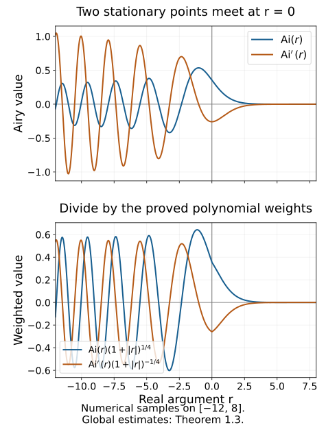

# Airy functions and fold model operators

At a fold, two stationary points merge. The cubic integral retains both points in one smooth function: the Airy function. This lesson proves the derivative estimates needed for that function, realizes the full fold model by two Airy coefficients, and proves the model's local \(L^2\) bound at order \(-1/6\).

The phase, density and normalization are those of [Fold amplitudes and critical densities](../20261005-restored-fold-densities/fold-amplitudes-and-critical-densities.md). The uniform even/odd coefficient construction is in [Folds, reflections and uniform smooth descent](../20261005-restored-smooth-descent/folds-reflections-and-uniform-descent.md). We use the one-dimensional stationary-phase theorem of [Stationary phase and critical manifolds](../20261004-free-stationary-phase/stationary-phase-and-critical-manifolds.md), the principal-symbol isomorphism of [Gaussian lines, densities and invariant symbols](../20261005-restored-gaussian-symbols/gaussian-lines-and-invariant-symbols.md), and the every-order regularity criterion of [Recognizing a Lagrangian distribution intrinsically](../20261005-restored-intrinsic-regularity/intrinsic-lagrangian-regularity.md).

The support-preserving sum E6 is supplied by the complete [programme proof K1](../20261004-free-intrinsic-graph/prerequisites/conic-parametrices-and-localization.md). The full [AN-03 finite-derivative estimate E23](bounded-derivative-operators.md) is included with its complete packet proof and GFDL notices. It requires finitely many bounded base and frequency derivatives, without ordinary frequency-order improvement. Fourier inversion, Plancherel, Schur's estimate and vector integration have exact earlier providers in the [proof map](proof-map.json). The primary sources are the reprints of Hörmander I, second edition (1990), §7.6, printed 213–215 / PDF 228–230, and Hörmander IV, corrected second printing (1994), §25.3, printed 33–34 / PDF 44–45. Every symbol coefficient below is an ordinary \(S_{1,0}\) symbol; the combined Airy amplitude need not be one.

## 1. Define the cubic integral and justify all its derivatives

Our Fourier convention is \(\widehat f(t)=\int e^{-irt}f(r)\,dr\), with inverse factor \((2\pi)^{-1}\). Define the Airy distribution by
\[
\operatorname{Ai}=\mathcal F^{-1}\big(e^{it^3/3}\big).
\tag{1.1}
\]
The multiplier has absolute value one on the real line, so it defines a tempered distribution. An unqualified Lebesgue integral of that multiplier is not the definition.

**Lemma 1.1 (smooth cutoff realization).** For \(\eta\in C_c^\infty(\mathbb R)\) equal to one near zero, the functions
\[
I_\varepsilon(r)=\frac1{2\pi}\int
e^{i(t^3/3+rt)}\eta(\varepsilon t)\,dt
\tag{1.2}
\]
converge in \(C^\infty\) on every compact real \(r\) interval as \(\varepsilon\downarrow0\). Their limit is (1.1), independently of \(\eta\). In particular
\[
\operatorname{Ai}^{(k)}(r)=\frac1{2\pi}\operatorname{Os}\!\int
(it)^k e^{i(t^3/3+rt)}\,dt
\quad(k\geq0).
\tag{1.3}
\]

**Proof.** Fix \(|r|\leq M\), and split the integral with a smooth cutoff equal to one on \(|t|\leq T\), where \(T^2>2M+2\). On the complementary support,
\[
q_r(t)=t^2+r,\qquad |q_r(t)|\geq t^2/2.
\]
For every fixed number of \(t,r\) derivatives, \(1/q_r\) has the corresponding polynomial bounds. The transpose of the field \((iq_r)^{-1}\partial_t\) is
\[
P_r a=-\partial_t\left(\frac{a}{i q_r}\right).
\tag{1.4}
\]
It sends a function with \(j\)-th \(t\) derivative bounded by \(C_j\langle t\rangle^{d-j}\) to one with weight \(d-3\). The estimates are uniform for \(|r|\leq M\). Indeed \(1/q_r\) has weight \(-2\), and the final derivative loses one more power. Derivatives in \(r\) only improve the denominator or differentiate other bounded factors.

For a prescribed derivative \(k\), apply (1.4) \(N\) times to the complementary part of \((it)^k\eta(\varepsilon t)\). Derivatives of \(\eta(\varepsilon t)\) satisfy the same weighted estimates uniformly in \(\varepsilon\): on their supports \(|t|\asymp\varepsilon^{-1}\), so each derivative costs \(\langle t\rangle^{-1}\). The result is bounded by \(C\langle t\rangle^{k-3N}\). Choose \(3N>k+1\). It is integrable uniformly in \(r,\varepsilon\), and converges locally with every prescribed derivative as the cutoff recedes. Integrating by parts before removing the cutoff removes all boundary terms. Dominated convergence now gives uniform convergence of the differentiated tail; on the fixed inner interval ordinary dominated convergence applies. This proves convergence for every \(k\), and hence smoothness and (1.3).

Pairing (1.2) with a Schwartz test function gives an integral of \(e^{it^3/3}\eta(\varepsilon t)\) against a Schwartz Fourier transform. Dominated convergence identifies the distributional limit with (1.1). Its smooth realization is therefore unique, including for different cutoffs. ∎

**Lemma 1.2 (contour and differential equation).** The smooth function in Lemma 1.1 extends to an entire function. For every \(a>0\),
\[
\operatorname{Ai}(z)=\frac1{2\pi}\int_{\mathbb R}
\exp\left(i\left(\frac{(t+ia)^3}{3}+z(t+ia)\right)\right)dt.
\tag{1.5}
\]
The integral is independent of \(a\), and
\[
\operatorname{Ai}''(z)=z\operatorname{Ai}(z).
\tag{1.6}
\]

**Proof.** For real \(r\), the real part of the exponent in (1.5) is
\[
-a t^2+a^3/3-ar.
\tag{1.7}
\]
For \(z\) in a compact complex set there is additionally a term \(-t\operatorname{Im}z\); the Gaussian still dominates every polynomial. Thus the integral and all \(z\) derivatives converge locally uniformly. For a direct analytic justification, fix \(z_0\) and write \(z=z_0+h\). Expand the factor \(e^{ih(t+ia)}\) in its exponential power series. On \(|h|\leq H\) the sum of the absolute values is bounded by \(e^{H|t+ia|}\). Multiplying by the fixed contour integrand gives an integrable bound of the form \(C e^{-at^2+C'|t|}\), and the same holds for each fixed differentiated series. Dominated convergence permits integration term by term and yields a convergent complex power series in \(h\) on every such disk. This proves that the function is entire, as well as the claimed derivative formulas.

On a compact positive \(a\) interval, the derivative of the integrand with respect to \(a\) is \(i\) times its \(t\) derivative. Integrating that derivative gives zero, since both ends decay with a Gaussian. This proves independence of \(a\). To identify the real restriction, pair it with \(f\in C_c^\infty(\mathbb R)\). The resulting \(t\) integral contains
\[
e^{i(t+ia)^3/3}\int e^{itr-ar}f(r)\,dr.
\]
The first factor has absolute value at most \(e^{a^3/3}\); the second has uniform Schwartz bounds for \(0<a\leq1\), by the fixed compact support of \(f\). Dominated convergence as \(a\downarrow0\) gives precisely the pairing in (1.1). This proves (1.5).

Differentiating twice in \(z\) produces \(-(t+ia)^2\). The integral of the \(t\) derivative of the exponential is zero, and that derivative is \(i((t+ia)^2+z)\) times the exponential. Consequently the second \(z\) derivative equals \(z\) times the original integral. This proves (1.6), with its sign. ∎

**Theorem 1.3 (all Airy derivative bounds).** For every integer \(k\geq0\),
\[
|\operatorname{Ai}^{(k)}(r)|
\leq C_k(1+|r|)^{k/2-1/4}
\quad(r\in\mathbb R).
\tag{1.8}
\]
More precisely, for \(R\geq1\),
\[
|\operatorname{Ai}^{(k)}(R)|
\leq C_k R^{k/2-1/4}e^{-2R^{3/2}/3},
\tag{1.9}
\]
whereas
\[
\begin{split}
\operatorname{Ai}^{(k)}(-R)
={}&\pi^{-1/2}R^{k/2-1/4}
\cos\left(\frac23R^{3/2}-\frac\pi4-\frac{k\pi}2\right)\\
&+O_k\left(R^{k/2-7/4}\right).
\end{split}
\tag{1.10}
\]
Each exponent in (1.8) is optimal as a uniform polynomial bound on the negative real ray.

**Proof.** For the positive ray choose \(a=\sqrt R\) in (1.5). To evaluate the \(k\)-th derivative at \(R\), first differentiate at a fixed \(a\), then choose this value of \(a\); no derivative of \(\sqrt R\) is taken. We obtain
\[
\operatorname{Ai}^{(k)}(R)=\frac{e^{-2R^{3/2}/3}}{2\pi}
\int (i(t+i\sqrt R))^k e^{-\sqrt R t^2}e^{it^3/3}\,dt.
\tag{1.11}
\]
The polynomial is bounded by \(C_k(|t|^k+R^{k/2})\). Substituting \(v=R^{1/4}t\) in the Gaussian integrals bounds the two terms by constants times \(R^{-(k+1)/4}\) and \(R^{k/2-1/4}\). For \(R\geq1\) the former is no larger than the latter. This proves (1.9).

For the negative ray use \(t=\sqrt R\,u\), \(\lambda=R^{3/2}\), and
\[
\psi(u)=u^3/3-u.
\]
Then (1.3) becomes
\[
\operatorname{Ai}^{(k)}(-R)
=\frac{R^{(k+1)/2}}{2\pi}
\operatorname{Os}\!\int e^{i\lambda\psi(u)}(iu)^k\,du.
\tag{1.12}
\]
The stationary points are \(u=1,-1\), with values \(-2/3,2/3\) and Hessians \(2,-2\). Fix disjoint compact cutoffs equal to one near these points. The one-dimensional stationary-phase theorem gives for their integrals
\[
\left(\frac\pi\lambda\right)^{1/2}
\left[i^k e^{-2i\lambda/3+i\pi/4}
      +(-i)^k e^{2i\lambda/3-i\pi/4}\right]
+O_k(\lambda^{-3/2}).
\tag{1.13}
\]
Its hypotheses concern only two fixed compact neighborhoods and their nonzero Hessians.

On the remaining bounded interval \(\psi'\) is bounded away from zero, giving \(O(\lambda^{-N})\) for every \(N\). On \(|u|\geq2\), the transpose field is
\[
-\frac1{i\lambda}\partial_u\left(\frac{\,\cdot\,}{u^2-1}\right).
\]
Each application loses three powers of \(u\) and one power of \(\lambda\). Start with a receding cutoff as in Lemma 1.1. For \(3N>k+1\), the final amplitude is bounded by \(C_k\lambda^{-N}\langle u\rangle^{k-3N}\), uniformly as the cutoff recedes. Thus its limit is also \(O_k(\lambda^{-N})\). Taking \(N\geq2\) as well makes this smaller than the remainder in (1.13). This explicitly handles the noncompact amplitude; the compact stationary-phase theorem was not applied to the whole real line.

The bracket in (1.13) is twice the cosine in (1.10). Multiplication by \(R^{(k+1)/2}/(2\pi)\) gives (1.10), including the error exponent. Its absolute bound gives (1.8) on \(r\leq-1\); (1.9) gives it on \(r\geq1\), and smoothness handles the middle interval. Finally take \(R_j=[\tfrac32(2\pi j+\pi/4+k\pi/2)]^{2/3}\) for all sufficiently large integers \(j\). These are positive and tend to infinity, and the cosine in (1.10) equals one. The relative error is \(O(R^{-3/2})\), so the magnitude is bounded below by a positive constant times \(R^{k/2-1/4}\) along that sequence. No smaller polynomial exponent can hold everywhere. ∎

The curves are numerical samples on a finite real interval, drawn from the standard Airy function with the normalization (1.1). The lower panel divides each curve by its weight in (1.8). These samples illustrate oscillation and decay; the uniform bounds and their optimality are proved in Theorem 1.3, independently of this plot.

## 2. Put the two Airy coefficients on the fold model

Let \(n\geq2\), \(\xi'=(\xi_2,\ldots,\xi_n)\), and \(\rho=\xi_n>0\). The canonical relation is
\[
\xi=\eta=(s^2\rho,\xi'),\qquad
y_1=x_1+s,\quad y_j=x_j\ (2\leq j<n),\quad
y_n=x_n-s^3/3.
\tag{2.1}
\]
Its kernel Lagrangian has covectors \((\xi,-\eta)\). The degree-zero cubic parameter \(s\) belongs to the expression
\[
\Phi=(x-y)\cdot\xi+s\xi_1-s^3\rho/3.
\tag{2.2}
\]
The actual homogeneous auxiliary parameter is \(\tau=\rho s\). The preceding density lesson proves that the cubic convention has amplitude order \(m+1/2\), prefactor \((2\pi)^{-n-1/2}\), and critical half density \(|dx\,ds\,d\xi'|^{1/2}\).

Choose ordinary coefficients
\[
b_0\in S^{m+1/6},\qquad b_1\in S^{m-1/6},
\tag{2.3}
\]
with fixed compact \(x\) support when a global \(L^2\) estimate is desired. We work at high frequency, with smooth radial cutoffs so that
\[
\rho\geq1,\qquad |\xi|\leq C\rho
\quad\text{on their supports}.
\tag{2.4}
\]
Changes within a bounded frequency set give smooth localized kernels and can be added separately. All estimates involving fractional powers of \(\rho\) are made on (2.4), not at \(\rho=0\).

Set
\[
r(\xi)=-\xi_1\rho^{-1/3},\qquad
\widehat a(x,\xi)
=\operatorname{Ai}(r(\xi))b_0(x,\xi)
 +\operatorname{Ai}'(r(\xi))b_1(x,\xi).
\tag{2.5}
\]
The hat here names the Fourier-side amplitude; it does not assert that it is the Fourier transform of a chosen base symbol. Define, initially on Schwartz functions,
\[
Bf(x)=(2\pi)^{-n+1/2}
\int e^{ix\cdot\xi}\widehat a(x,\xi)\widehat f(\xi)\,d\xi.
\tag{2.6}
\]
Theorem 1.3 and (2.4) give polynomial growth of every fixed base derivative of the integrand's amplitude. Since \(\widehat f\) is Schwartz, the integral and every base derivative converge absolutely on compact \(x\) sets. It defines a continuous operator into smooth functions, and its kernel is defined distributionally by the same Fourier formula.

## 3. The noncompact cubic tail is a smoothing symbol

**Lemma 3.1 (exact cubic realization).** With oscillatory integrals defined by receding smooth cutoffs,
\[
\begin{split}
\operatorname{Os}\!\int e^{i(s\xi_1-s^3\rho/3)}\,ds
 &=2\pi\rho^{-1/3}\operatorname{Ai}(r),\\
\operatorname{Os}\!\int s e^{i(s\xi_1-s^3\rho/3)}\,ds
 &=2\pi i\rho^{-2/3}\operatorname{Ai}'(r).
\end{split}
\tag{3.1}
\]
Consequently, with
\[
a_\infty(x,s,\xi)
=\rho^{1/3}b_0(x,\xi)-is\rho^{2/3}b_1(x,\xi),
\tag{3.2}
\]
the oscillatory \(s\) integral equals \(2\pi\widehat a\).

**Proof.** Substitute \(t=-\rho^{1/3}s\). Reversing the integration limits cancels the negative Jacobian, so the measure factor is \(\rho^{-1/3}\). The phase becomes \(t^3/3+rt\). The factor \(s\) is \(-\rho^{-1/3}t\), and (1.3) with \(k=1\) gives \(\operatorname{Os}\int t e^{i(t^3/3+rt)}dt=(2\pi/i)\operatorname{Ai}'(r)\). Their product is the positive \(i\) in the second line of (3.1). Multiplying it by the negative \(i\) in (3.2) gives \(2\pi b_1\operatorname{Ai}'(r)\). Cutoff independence in Lemma 1.1 justifies the scaled cutoffs. ∎

**Lemma 3.2 (all differentiated tail estimates).** Choose \(S>1\) with \(S^2>2C\), and \(\chi\in C_c^\infty(\mathbb R)\) equal to one on \([-S,S]\). Then
\[
T(x,\xi)=\operatorname{Os}\!\int
e^{i(s\xi_1-s^3\rho/3)}(1-\chi(s))a_\infty(x,s,\xi)\,ds
\tag{3.3}
\]
is an ordinary \(S^{-\infty}\) symbol on the cone (2.4), extended by zero with the specified smooth frequency cutoffs. For all \(M,\alpha,\beta\),
\[
|\partial_x^\alpha\partial_\xi^\beta T(x,\xi)|
\leq C_{M,\alpha,\beta}\langle\xi\rangle^{-M-|\beta|}.
\tag{3.4}
\]

**Proof.** On the support of \(1-\chi\),
\[
q(s,\xi)=\xi_1-s^2\rho,
\qquad |q|\geq s^2\rho/2.
\tag{3.5}
\]
Here \(|\xi_1|\leq C\rho\) and \(|s|\geq S\). Writing \(q=\rho(\xi_1/\rho-s^2)\), the chain rule and homogeneity give for every \(p,\gamma\)
\[
|\partial_s^p\partial_\xi^\gamma(q^{-1})|
\leq C_{p,\gamma}\rho^{-1-|\gamma|}
\langle s\rangle^{-2-p}.
\tag{3.6}
\]
For example a \(\rho\) derivative differentiates \(q\) by \(-s^2\), but its two denominator factors still leave weight \(s^{-2}\). Each derivative of the bounded degree-zero angular ratio costs one power of \(\rho\). Iterating these observations proves (3.6); the denominator remains uniformly separated from zero.

Put \(\mu=m+1/2\). The amplitude \((1-\chi)a_\infty\) has mixed estimates of frequency order \(\mu\) and \(s\) weight one:
\[
|\partial_x^\alpha\partial_s^p\partial_\xi^\gamma
((1-\chi)a_\infty)|
\leq C_{\alpha,p,\gamma}\rho^{\mu-|\gamma|}
\langle s\rangle^{1-p}.
\tag{3.7}
\]
Derivatives of the fixed transition cutoff have bounded \(s\) support and also satisfy this estimate. The transpose field
\[
P_\xi a=-\partial_s\left(\frac{a}{i q}\right)
\tag{3.8}
\]
sends frequency order \(\nu\), \(s\) weight \(d\) to order \(\nu-1\), weight \(d-3\), with all mixed estimates. This follows from (3.6), the product rule and the final \(s\) derivative. After \(N\) integrations the amplitude therefore has order \(\mu-N\) and weight \(1-3N\).

To justify the integrations, first insert \(\eta(s/R)\) with \(R\to\infty\). Its derivatives obey the weighted bounds used in Lemma 1.1. Already \(N=1\) gives the integrable weight \(-2\); larger \(N\) allow every derivative below. A frequency derivative of the exponential contributes \(is\) or \(-is^3/3\); the phase is linear in \(\xi\). Thus a derivative of total order \(|\beta|\) introduces a polynomial of degree at most \(3|\beta|\). After differentiating the integrated expression \(N\) times in the sense of (3.8), its absolute integrand is bounded by a finite sum dominated by
\[
C\rho^{\mu-N}\langle s\rangle^{1-3N+3|\beta|}.
\tag{3.9}
\]
Possible frequency derivatives of the amplitude improve its \(\rho\) order, and \(\rho\geq1\), so this bound is sufficient. Choose \(N\) with
\[
3N>2+3|\beta|,\qquad N\geq\mu+M+|\beta|.
\tag{3.10}
\]
For clarity, first differentiate the finite-cutoff identity obtained after the \(N\) transpose operations. A fixed multi-index derivative distributes over its exponential and the already transposed amplitude. A derivative hitting the exponential contributes a monomial in \(s,s^3\); derivatives hitting that amplitude or the denominator satisfy the mixed bounds just proved. This is exactly the finite sum bounded in (3.9). On a compact frequency neighborhood one common integrable majorant applies to each prescribed derivative set, while (3.9) also provides the stated uniform weighted estimate on the whole cone. Thus differentiation of the limit follows from the fundamental theorem of calculus and dominated convergence.

The first inequality makes (3.9) integrable in \(s\); the second gives (3.4), since \(\rho\asymp\langle\xi\rangle\) on (2.4). All derivatives of the receding cutoff disappear locally, and dominated convergence supplies the limit and its derivatives. The resulting expressions are independent of the number of integrations, since each is the same cutoff limit. Base derivatives merely differentiate the coefficients. This proves every seminorm in (3.4), not only the undifferentiated tail. ∎

This tail has noncompact \(s\) support. It is different from the excluded first-frequency tail with compact \(s\) support in the density lesson. The two arguments use different nonstationary regions.

## 4. Membership, symbol and the whole local representation

**Theorem 4.1 (Airy model realization).** The kernel of (2.6) belongs locally to \(I^m(C')\) for (2.1). In the phase frame fixed by (2.2), its principal symbol is represented by
\[
\begin{split}
a_c(x,s,\xi')
={}&\rho^{1/3}b_0(x,s^2\rho,\xi')\\
&-is\rho^{2/3}b_1(x,s^2\rho,\xi'),
\end{split}
\tag{4.1}
\]
times \(|dx\,ds\,d\xi'|^{1/2}\), modulo one lower order. Every locally supported model kernel in \(I^m(C')\), whose entire wavefront is compactly generated inside the chart and in \(|\xi|\leq C_2\rho\), has a representation of the form (2.6) modulo a smooth localized kernel, with coefficients (2.3) in a fixed slightly larger cone.

**Proof of membership and symbol.** Lemma 3.1 identifies the full cubic integral with \(2\pi\widehat a\). Lemma 3.2 removes its noncompact tail modulo a smoothing symbol. Consequently the kernel of (2.6), modulo a smooth kernel, is
\[
(2\pi)^{-n-1/2}\iint
e^{i\Phi(x,y,s,\xi)}\chi(s)
\left(\rho^{1/3}b_0-is\rho^{2/3}b_1\right)ds\,d\xi.
\tag{4.2}
\]
This equality is distributional. It can first be tested with compact frequency cutoffs, where Lemma 3.1 identifies the inner oscillatory integral; the polynomial bounds and Schwartz test transforms permit removal of the frequency cutoff. The factor \(2\pi\) changes \((2\pi)^{-n-1/2}\) to exactly \((2\pi)^{-n+1/2}\).

On compact \(s\) support the amplitude in (4.2) is an ordinary symbol of order \(m+1/2\). The density lesson converts it to an amplitude of order \(m-1/2\) for the actual homogeneous phase with \(n+1\) auxiliary variables and base dimension \(2n\). The normalized phase-integral theorem then gives order \(m\), with wavefront in \(C'\). Its critical density in cubic parameters is \(|dx\,ds\,d\xi'|\). Critical points have \(\xi_1=s^2\rho\). Whenever either coefficient is nonzero there, \(s^2\leq C<S^2\), so \(\chi(s)=1\). This proves (4.1), including the odd sign, density and phase frame. On bounded \((x,y)\) sets one may insert a compact base cutoff equal to one there to apply the local phase theorem. ∎

**Proof of surjectivity.** First prescribe a critical coefficient \(a_c\in S^{m+1/2}\) in a fixed compact \((x,s)\) set and angular cone. The uniform descent theorem splits it exactly as
\[
a_c(x,s,\xi')=F_0(x,s^2,\xi')+sF_1(x,s^2,\xi'),
\tag{4.3}
\]
with smooth full-neighborhood extensions \(F_j\), all finite mixed symbol seminorms, and a fixed angular/support neighborhood. It supplies coefficients
\[
\begin{split}
b_0(x,\xi)&=\rho^{-1/3}F_0(x,\xi_1/\rho,\xi'),\\
b_1(x,\xi)&=i\rho^{-2/3}F_1(x,\xi_1/\rho,\xi'),
\end{split}
\tag{4.4}
\]
with ordinary orders \(m+1/6,m-1/6\). Use its support cutoffs so that (4.4) agrees on the entire prescribed critical support. The negative-square extension is needed for smoothness across \(\xi_1=0\); its unprescribed values never meet the critical equation \(\xi_1=s^2\rho\). Substitution in (4.1) gives exactly (4.3), because \((-i)i=1\).

For a whole compact \(s\) interval, the near-zero construction is joined to the explicit attained-side formulas
\[
F_0(v)=\frac{a_c(\sqrt v)+a_c(-\sqrt v)}2,\qquad
F_1(v)=\frac{a_c(\sqrt v)-a_c(-\sqrt v)}{2\sqrt v}
\quad(v>0),
\tag{4.5}
\]
with the other parameters retained. On intervals separated from zero, their differentiated symbol bounds follow from the ordinary chain rule and a lower bound for \(\sqrt v\). Near zero the uniform descent theorem proves the matching smooth jets. The formulas agree on their overlap, so a fixed square-variable partition joins them without changing (4.3). If \(a_c\) is zero outside \(|s|\leq S_0\), both attained-side functions are zero for \(v>S_0^2\); the fixed negative extension has compact support as well. Thus the construction covers the whole prescribed interval, not merely its germ at zero.

Now let \(A\in I^m(C')\) satisfy the stated whole-wavefront localization. The symbol isomorphism gives its leading coefficient in the fixed phase frame. Formula (4.4) and membership construct \(B_0\) with that same symbol. The kernel part of the isomorphism gives \(A-B_0\in I^{m-1}\). Repeat on the residual to construct coefficients
\[
b_{0,j}\in S^{m+1/6-j},\qquad
b_{1,j}\in S^{m-1/6-j},\qquad j=0,1,\ldots.
\tag{4.6}
\]
Here the support induction needs care. Choose once a compact \(x\) neighborhood, a compact angular \(\xi'\) neighborhood and a symmetric interval \(|s|\leq S_0\) containing the original critical wavefront support, with fixed larger cutoff neighborhoods in the full model. Call their product \(K\). Its symmetry is essential: splitting a coefficient into even and odd parts uses its values at both \(s\) and \(-s\). It can create lower-order terms on the reflected sheet even when the sum of the leading coefficients cancels there. We do not assert that each realizing operator has wavefront only in the original set.

Inductively suppose the residual's critical wavefront is contained in \(K\). Fourier-graph symbol extraction in the density lesson gives a representative rapidly decreasing, with all derivatives, on closed parameter neighborhoods disjoint from \(K\); smooth critical-coordinate and frame changes preserve this property. Formulas (4.5) only use the two reflected parameter points. Outside the fixed symmetric interval, or the fixed \(x,\xi'\) neighborhoods, both are outside \(K\), so every prescribed derivative of the descended coefficients is rapidly decreasing there. At zero the same conclusion follows from the finite mixed-seminorm estimates of the descent and extension. The unattained-side extension meets no critical point. The phase wavefront theorem consequently places the realizing operator's entire critical wavefront in \(K\), and the new residual's wavefront is also in \(K\). Fixed larger cutoffs discard only rapidly decreasing coefficients. This proves the induction with one symmetric neighborhood, without successive support growth or a false claim about the individual sheets.

Apply the imported E6 separately to the two sequences, with base variable \(x\), full frequency variable \(\xi\), and their fixed supports. It gives ordinary coefficients \(b_0,b_1\) satisfying, for every \(N\),
\[
b_0-\sum_{j<N}b_{0,j}\in S^{m+1/6-N},\qquad
b_1-\sum_{j<N}b_{1,j}\in S^{m-1/6-N}.
\tag{4.7}
\]
The membership argument is linear in the coefficients and respects these orders: a remainder in (4.7) gives a kernel in \(I^{m-N}\), with a smooth tail by Lemma 3.2. The finite residual after \(N\) symbol matches has that same order. Hence \(A-B(b_0,b_1)\in I^{m-N}\) for every \(N\). The every-order Lagrangian regularity criterion makes this residual smooth. This proves the full representation, including all lower orders. Matching only the leading symbol would have given one lower order, not a smooth residual. ∎

## 5. Bound the model without ordinary symbol improvement

**Lemma 5.1 (bounded mixed derivatives).** On (2.4), for every \(\alpha,\beta\),
\[
|\partial_x^\alpha\partial_\xi^\beta\widehat a(x,\xi)|
\leq C_{\alpha,\beta}\langle\xi\rangle^{m+1/6}.
\tag{5.1}
\]
This exponent does not decrease by \(|\beta|\). In particular all mixed derivatives are bounded if \(m\leq-1/6\).

**Proof.** On the cone, \(|r|\leq C\rho^{2/3}\). Homogeneity and differentiation of \(-\xi_1\rho^{-1/3}\) give
\[
|\partial_\xi^\gamma r|\leq C_\gamma\rho^{2/3-|\gamma|}
\quad(|\gamma|\geq1).
\tag{5.2}
\]
For a derivative of order \(\ell\geq1\) of \(\operatorname{Ai}(r)\), the chain rule has finitely many terms of the form \(\operatorname{Ai}^{(q)}(r)\prod_{j=1}^q\partial_\xi^{\gamma_j}r\), with \(1\leq q\leq\ell\), \(\sum|\gamma_j|=\ell\). Theorem 1.3 and \(q\geq1\) imply
\[
|\operatorname{Ai}^{(q)}(r)|\leq C\rho^{q/3-1/6}.
\]
Together with (5.2), this term is at most \(C\rho^{q-\ell-1/6}\leq C\rho^{-1/6}\). For \(\ell=0\), \(\operatorname{Ai}(r)\) is uniformly bounded by (1.8).

For \(\operatorname{Ai}'(r)\), including \(\ell=0\), the corresponding term has \(q\) chain factors and derivative \(q+1\). Its bound is
\[
C\rho^{(q+1)/3-1/6+2q/3-\ell}
=C\rho^{q-\ell+1/6}
\leq C\rho^{1/6}.
\tag{5.3}
\]
Here \(q=0\) is the undifferentiated case, and otherwise \(q\leq\ell\). Product derivatives of \(b_0\) have order at most \(m+1/6\), since every actual frequency derivative lowers their ordinary order. Thus the first term of (2.5) satisfies (5.1). Derivatives of the second term are bounded by \(C\rho^{m-1/6+1/6}=C\rho^m\), which is no larger than \(C\rho^{m+1/6}\) for \(\rho\geq1\). Base derivatives act only on \(b_j\), with the same orders. Smooth cone/radial cutoffs obey the same estimates. This proves every mixed derivative in (5.1). ∎

**Theorem 5.2 (model \(L^2\) theorem).** If the coefficients in (2.3) have compact base support and \(m\leq-1/6\), then (2.6) extends continuously to \(L^2(\mathbb R^n)\). Its norm is bounded by finitely many ordinary symbol seminorms of \(b_0,b_1\), with constants depending on the fixed cone, support and dimension. Every model kernel covered by Theorem 4.1 is consequently continuous from \(L^2\) on a fixed compact input set to \(L^2\) on a fixed compact output set.

**Proof.** With the ordinary inverse-Fourier normalization,
\[
B=(2\pi)^{1/2}\operatorname{Op}(\widehat a).
\tag{5.4}
\]
Choose an integer \(N>n/2\) and the explicit count \(L_n=4N\) from the included packet proof of E23. That proof first estimates the matrix between normalized packets and only then constructs the bounded operator; it never presumes the boundedness being proved here. Lemma 5.1 bounds every derivative of total order at most \(L_n\). Its constants use finitely many derivatives of the two coefficients and the fixed Airy constants. E23 therefore gives
\[
\|Bf\|_2\leq (2\pi)^{1/2} C_n
\max_{|\alpha|+|\beta|\leq L_n}
\|\partial_x^\alpha\partial_\xi^\beta\widehat a\|_\infty
\|f\|_2.
\tag{5.5}
\]
The bounded extension agrees with (2.6) on Schwartz functions by that theorem and density. No \(S^0_{1,0}\) assertion about \(\widehat a\) was used.

For a localized general model kernel, use its representation from Theorem 4.1 after compact base localization. The representing coefficients can be chosen with compact \(x\) support. Its Airy operator is bounded by (5.5). The remaining smooth kernel, restricted to the fixed compact input and output sets, has finite \(L^2\) kernel norm and is Hilbert–Schmidt. Input and output multiplication by fixed cutoffs are bounded on \(L^2\). Adding these pieces gives the stated local result. Smoothness alone on a noncompact product would not have justified a global Hilbert–Schmidt claim. ∎

**Example 5.3 (a bounded amplitude with no ordinary derivative gain).** Take \(m=-1/6\), \(b_1=0\), and let \(b_0\) be one on a high-frequency conic neighborhood of \(\xi_1=\rho\), with compact \(x\) support and \(b_0=1\) in an inner base region. On that region,
\[
\partial_{\xi_1}\widehat a
=-\rho^{-1/3}\operatorname{Ai}'(-\rho^{2/3}).
\tag{5.6}
\]
Formula (1.10) with \(k=1\) gives
\[
\partial_{\xi_1}\widehat a
=-\pi^{-1/2}\rho^{-1/6}
\sin(2\rho/3-\pi/4)+O(\rho^{-7/6}).
\tag{5.7}
\]
Along \(\rho_j=\tfrac32(3\pi/4+2\pi j)\), the sine equals one. Thus (5.6) is not \(O(\rho^{-1})\). The amplitude is bounded with all mixed derivatives by Lemma 5.1, but it is not an ordinary \(S^0_{1,0}\) symbol. The \(L^2\) proof above still applies.

## 6. Exercises with complete solutions

**Exercise 6.1 (contour height; introductory).** For real \(r\) and \(a>0\), compute the real part of \(i((t+ia)^3/3+r(t+ia))\). Why does choosing \(a=\sqrt r\) for \(r>0\) give exponential decay? Does differentiating (1.11) as an expression in \(R\) prove its formula for arbitrary \(k\)?

**Solution.** Expansion gives real part \(-at^2+a^3/3-ar\). If \(a=\sqrt r\), the constant part is \(-2r^{3/2}/3\), and the Gaussian is \(e^{-\sqrt r t^2}\). The formula for the \(k\)-th derivative is obtained by differentiating (1.5) with \(a\) held fixed, inserting \((i(t+ia))^k\), then choosing \(a=\sqrt R\) at the evaluation point. Differentiating the displayed \(R\)-dependent expression naively introduces derivatives of the contour height and its prefactor; those terms must cancel by contour independence. Holding the height fixed avoids that extra argument and proves exactly (1.11).

**Exercise 6.2 (both stationary points; intermediate).** Derive the leading terms of \(\operatorname{Ai}(-R)\) and \(\operatorname{Ai}'(-R)\) from the stationary points of \(u^3/3-u\). Explain why discarding either point gives a wrong real answer.

**Solution.** The points \(1,-1\) have Hessians \(2,-2\), values \(-2/3,2/3\), and stationary factors \(e^{i\pi/4},e^{-i\pi/4}\). With \(\theta=2R^{3/2}/3-\pi/4\), their contributions for \(k=0\) sum to \(2\cos\theta\), and for \(k=1\) to \(2\sin\theta\). The prefactor calculation in (1.12) gives \(\pi^{-1/2}R^{-1/4}\cos\theta\) and \(\pi^{-1/2}R^{1/4}\sin\theta\), with errors \(O(R^{-7/4})\) and \(O(R^{-5/4})\). A single contribution is complex and has half the real cosine/sine combination. The conjugate stationary point is required by the real Airy integral; neither its signature nor its amplitude may be omitted.

**Exercise 6.3 (how many tail integrations; intermediate).** In (1.12), consider derivative \(k=8\). Give an integer \(N\) which both makes the noncompact tail integrable and makes it smaller than the compact stationary-phase error. What is its \(R\) order after the prefactor is restored?

**Solution.** We require \(3N>9\) and \(N\geq2\), so \(N=4\) works. The amplitude then has weight \(8-12=-4\), which is integrable, and the oscillatory estimate is \(O(\lambda^{-4})\). The restored factor is \(R^{9/2}\), while \(\lambda^{-4}=R^{-6}\); hence the tail is \(O(R^{-3/2})\). The stationary-phase error is \(O(R^{4-7/4})=O(R^{9/4})\). Thus the tail is smaller. A single integration would leave weight five and would not even supply an absolute integrable remainder for this derivative.

**Exercise 6.4 (odd cubic sign; introductory).** For \(\rho>0\), derive \(\operatorname{Os}\int s e^{i(s\xi_1-s^3\rho/3)}ds\) by differentiating the first line of (3.1) with respect to \(\xi_1\). What sign would using \(+is\rho^{2/3}b_1\) in (3.2) produce?

**Solution.** Differentiation of the first line gives \(i\operatorname{Os}\int s e^{i(s\xi_1-s^3\rho/3)}ds=-2\pi\rho^{-2/3}\operatorname{Ai}'(r)\). Division by \(i\) gives \(+2\pi i\rho^{-2/3}\operatorname{Ai}'(r)\), as in (3.1). Multiplying by \(+i\rho^{2/3}b_1\) gives \(-2\pi b_1\operatorname{Ai}'\), reversing the desired term. The negative \(i\) in (3.2) is forced by the inverse-Fourier convention.

**Exercise 6.5 (a differentiated smoothing tail; advanced).** In Lemma 3.2 take \(m=1/2\), so \(\mu=1\), and ask for \(|\beta|=3\) and \(M=5\). Choose \(N\) proving (3.4). Give the resulting \(s\) weight and \(\rho\) power in (3.9).

**Solution.** Conditions (3.10) require \(3N>11\) and \(N\geq1+5+3=9\); choose \(N=9\). The weight is \(1-27+9=-17\), integrable on the two tails. The frequency factor is \(\rho^{1-9}=\rho^{-8}\), exactly the requested \(\rho^{-M-|\beta|}\). The constants involve finitely many coefficient and cutoff derivatives. Integrating once would give only an undifferentiated \(s^{-2}\) weight, which the three phase derivatives could change to \(s^7\); it would not prove this differentiated estimate.

**Exercise 6.6 (orders in a concrete model; intermediate).** For \(n=2,m=-1/6\), give the orders of \(b_0,b_1\), of the two terms in (3.2) on compact \(s\) support, and of the homogeneous amplitude. Give both kernel prefactors before and after the \(s\) integral.

**Solution.** The coefficient orders are \(0,-1/3\). Multiplication by \(\rho^{1/3}\) or \(\rho^{2/3}\) makes both cubic terms order \(1/3=m+1/2\); the compact factor \(s\) does not change order. The homogeneous change \(\tau=\rho s\) divides that amplitude by \(\rho\), giving order \(-2/3=m-1/2\). The normalized cubic kernel factor is \((2\pi)^{-5/2}\), while the Airy Fourier factor is \((2\pi)^{-3/2}\). Their ratio is \(2\pi\), the factor in Lemma 3.1. Relative to the ordinary \((2\pi)^{-2}\) pseudodifferential normalization the operator factor is \((2\pi)^{1/2}\).

**Exercise 6.7 (extend to negative square values; intermediate).** On the attained side let \(a_c=\langle\xi'\rangle^{m+1/2}(1+s+s^2)\), with fixed support cutoffs. Compute the local \(F_0,F_1\) and the corresponding coefficients. Why must \(F_0,F_1\) be defined for negative \(\xi_1/\rho\) as well?

**Solution.** On the inner region \(F_0(x,v,\xi')=\langle\xi'\rangle^{m+1/2}(1+v)\) and \(F_1(x,v,\xi')=\langle\xi'\rangle^{m+1/2}\). Thus \(b_0=\rho^{-1/3}\langle\xi'\rangle^{m+1/2}(1+\xi_1/\rho)\) and \(b_1=i\rho^{-2/3}\langle\xi'\rangle^{m+1/2}\), with the controlled outer cutoffs. Their orders are those of (2.3), since \(\langle\xi'\rangle\asymp\rho\) on the angular cone. Restriction to \(\xi_1=s^2\rho\) reproduces \(1+s^2+s\). A full frequency amplitude must be smooth across \(\xi_1=0\), so values on the negative side are needed even though that side is not attained critically. Setting arbitrary nonzero boundary data to zero immediately on that side would fail smoothness. The controlled extension theorem supplies matching jets without imposing analytic continuation.

**Exercise 6.8 (bounded derivatives and the \(L^2\) theorem; advanced).** Explain exactly why Example 5.3 violates \(S^0_{1,0}\), while meeting the imported E23 contract. Does boundedness of \(\widehat a\) alone meet that contract?

**Solution.** Ordinary order zero would require its first \(\xi_1\) derivative to be bounded by \(C\langle\xi\rangle^{-1}\). On the specified interior sequence the derivative has size asymptotic to \(\pi^{-1/2}\rho_j^{-1/6}\); multiplying by \(\rho_j\) tends to infinity. Therefore no such constant exists. Lemma 5.1 nevertheless bounds every mixed derivative at \(m=-1/6\), including the finite set of total order at most \(L_n\) required by E23. That finite set, with the normalization (5.4), proves \(L^2\) boundedness. Zeroth boundedness alone does not meet E23: its contract explicitly includes the prescribed positive-order derivatives, which must be checked.

**Exercise 6.9 (why matching one symbol is insufficient; intermediate).** Suppose an Airy operator \(B_0\) matches the principal symbol of \(A\in I^m(C')\). State the guaranteed residual order. Explain the two coefficient sums needed to make it smooth, and why summing the critical coefficients only is insufficient for the claimed Fourier representation.

**Solution.** The symbol isomorphism gives \(A-B_0\in I^{m-1}\). That class can have nonsmooth kernels. Recursively construct both sequences (4.6), then sum them as actual ordinary symbols in \((x,\xi)\) by E6. The two summed coefficients satisfy (4.7), so membership leaves a residual in \(I^{m-N}\) for every \(N\), which is smooth by the every-order criterion. A sum expressed only on \((x,s,\xi')\) has not yet produced smooth full-frequency coefficients on both sides of \(\xi_1=0\), with their separate orders and fixed supports. The descent and two coefficient sums supply those missing data and preserve the actual Airy formula.

**Exercise 6.10 (localization and a smooth remainder; advanced).** A local representation has a smooth residual kernel on a coordinate neighborhood. Explain how to conclude the compact-input/compact-output \(L^2\) bound, and give a smooth kernel showing why a global Hilbert–Schmidt claim needs more than smoothness.

**Solution.** Insert fixed smooth cutoffs supported in that coordinate neighborhood on the input and output. The residual is then a smooth compactly supported kernel, whose square is integrable, so its operator is Hilbert–Schmidt and bounded. The Airy part is bounded by Theorem 5.2, and the cutoffs are bounded multipliers; their sum yields the local estimate. The globally constant kernel \(K(x,y)=1\) on \(\mathbb R^n\times\mathbb R^n\) is smooth but has infinite squared kernel integral. It does not define a bounded operator on all \(L^2\): for \(f_R=|E_R|^{-1/2}\mathbf1_{E_R}\), with finite sets of volume tending to infinity, its formal output is the nonzero constant \(|E_R|^{1/2}\), which is not in \(L^2\). Thus the localized smooth remainder and its support, not smoothness alone, complete the argument.

## References

- [Hörmander I, §7.6] Lars Hörmander, *The Analysis of Linear Partial Differential Operators I: Distribution Theory and Fourier Analysis*, reprint of the second edition (1990), Definition 7.6.8 and formulas (7.6.16)–(7.6.21), printed 213–215 / PDF 228–230. The cutoff, contour, noncompact stationary-phase tail and every derivative estimate used here are proved explicitly in §1.
- [Hörmander IV, §25.3] Lars Hörmander, *The Analysis of Linear Partial Differential Operators IV: Fourier Integral Operators*, reprint of the corrected second printing (1994), formulas (25.3.9)–(25.3.12) and Theorem 25.3.10, printed 33–34 / PDF 44–45. This lesson proves the localized model representation and continuity statement with its exact coefficient orders, supports, frame and constants. The invariant manifold and all-real Sobolev theorem 25.3.11 requires the subsequent canonical-localization argument.
- AN-03, *Euclidean symbol calculus*: [complete E23 proof](bounded-derivative-operators.md), with its GFDL notices; [complete support-preserving sum K1](../20261004-free-intrinsic-graph/prerequisites/conic-parametrices-and-localization.md), the earlier E6 contract.
- Exact source identities are recorded in source provenance. The original numerical diagram retains its [DejaVu font notice](figures/notices/LICENSE_DEJAVU.txt).

*Original lesson, ten solutions and numerical illustration: GPT-6.1 Sol (OpenAI), Ultra, September 2026, CC0. Restoration and exact programme prerequisite review: GPT-6 Astra (OpenAI), Ultra, 5 October 2026. The separate AN-03 proof extract is GFDL 1.2 only; fonts and linked components retain their own rights. No book text or file is included.*
