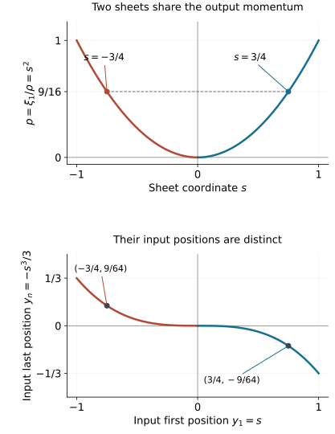

# Canonical relations with two folding projections

A canonical relation can fold over both phase spaces while remaining a smooth Lagrangian manifold in their product. Its two projection kernels are different lines on the same critical hypersurface. The normal forms proved here describe the entire local relation: the two sheets, their shared frequencies, the displacement of both positions, and the full symplectic charts on the targets.

The primary source is the approved purchased reprint of Hörmander III, corrected second printing (1994), Theorem 21.4.5, printed page 310 / PDF page 325, and Theorem 21.4.11 with the model (21.4.20)–(21.4.21), printed pages 318–319 / PDF pages 333–334 in this exact edition. We use the complete simultaneous folded-form theorems in [Two reflections in folded symplectic coordinates](../20261005-restored-symplectic-reflections/two-reflections-in-folded-symplectic-coordinates.md), the full target converses in [Folded forms and symplectic target coordinates](../20261005-restored-folded-forms/folded-forms-and-symplectic-targets.md), and the intrinsic fold and involution results in [Folds, reflections and uniform smooth descent](../20261005-restored-smooth-descent/folds-reflections-and-uniform-descent.md). Ordinary symplectic signs and nondegenerate generating families are established in [Phase space and generating families](../20261005-restored-phase-space/phase-space-and-generating-families.md).

We take \(\omega_X=d\xi\wedge dx\), \(\omega_Y=d\eta\wedge dy\), and use \(\omega_X-\omega_Y\) on the product. Thus the relation generated by a phase \(\phi(x,y,\theta)\) has output covector \(\phi_x\) and input covector \(-\phi_y\). Every assertion is local at a marked point; a locally immersed relation is treated on a branch where its product map is an embedding.

The [proof map](proof-map.json) binds the two complete target converses, simultaneous form theorems, fold criterion, elementary inverse theorem and form calculus to exact current programme proofs. The [earlier homogeneous phase companion, P0](../20261005-restored-smooth-descent/homogeneous-fold-phase-and-order.md) already proves the explicit conic phase calculation used for the smooth-descent lesson. Section 5 retains its full geometric calculation here to identify the actual two-sided relation; no later amplitude or Airy argument is assumed.

For the local branch statement, let the relation initially be given by an immersion from a \(2n\)-dimensional manifold into the product. Choose \(2n\) ambient coordinate components whose differential has a nonzero minor at the marked point. The smooth inverse theorem makes these components coordinates on a smaller source neighborhood. Every remaining ambient component is then a smooth function of them, so the product image of that branch is a graph and the inverse on it is smooth. This proves the local embedded-branch reduction used below.

## 1. One folded form belongs to both projections

Let \(X_s,Y_s\) be symplectic manifolds of the same dimension \(2n\), and let
\[
 C\subset X_s\times Y_s,\qquad
 \dim C=2n,\qquad
 (\omega_X-\omega_Y)|_{TC}=0.
 \tag{1.1}
\]
Write \(\pi_X,\pi_Y\) for the projections. Suppose both are folds at \(c\in C\). The common closed two-form on \(C\) is
\[
 \sigma=\pi_X^*\omega_X=\pi_Y^*\omega_Y.
 \tag{1.2}
\]

Fix a nonzero local volume form \(\mu\) on \(C\), and write \(\sigma^n=m\mu\). Since the target forms \(\omega_X^n,\omega_Y^n\) are nonzero volumes, \(m\) is the Jacobian scalar for either projection, up to the nonzero coordinate volume factors. A fold has a simple Jacobian zero with kernel transverse to its critical hypersurface. Therefore
\[
 m(c)=0,\quad dm(c)\ne0,\qquad
 \Gamma=\{m=0\}
 \tag{1.3}
\]
is the critical hypersurface of both projections. The equality is an equality of germs: shrink so the two fold descriptions and their single critical hypersurfaces hold throughout.

The restriction of a fold to its critical hypersurface is a local diffeomorphism onto the critical image hypersurface. In fold coordinates this is simply \(w\mapsto(w,0)\). For a hypersurface \(H\) in a symplectic vector space, its restricted two-form has rank \(2n-2\): its symplectic orthogonal \(H^\omega\) is a line, and lies in \(H\), since an alternating form vanishes on that line. For a direct proof of that hyperplane assertion, write \(H=\ker\alpha\) with \(\alpha\ne0\). Nondegeneracy gives a unique nonzero \(v\) with \(\omega(v,\cdot)=\alpha\). Alternation gives \(\alpha(v)=0\), so \(v\in H\). Every vector orthogonal to \(H\) corresponds under the same invertible pairing to a multiple of \(\alpha\), hence \(H^\omega=\mathbb Rv\). The radical of the restricted form is exactly \(H\cap H^\omega=\mathbb Rv\), proving its rank. Pulling back by \(\pi_X|_\Gamma\) gives
\[
 \operatorname{rank}\sigma_\Gamma=2n-2,\qquad
 (\sigma^{n-1})|_{T\Gamma}\ne0.
 \tag{1.4}
\]
Thus both folded-form hypotheses have been proved from actual projections.

Let
\[
 \ell_X=\ker d\pi_X|_\Gamma,\qquad
 \ell_Y=\ker d\pi_Y|_\Gamma.
\]
Each is a line transverse to \(\Gamma\). Each is contained in the ambient radical \(E=\ker\sigma|_\Gamma\), by (1.2). Their intersection is zero: a vector killed by both projection differentials is killed by the differential of the product inclusion of \(C\), which is injective. Consequently
\[
 E=\ell_X+\ell_Y,\qquad
 K=\ker\sigma_\Gamma=E\cap T\Gamma.
 \tag{1.5}
\]
The ambient radical has dimension two by (1.3)–(1.4).

Each fold supplies its unique nonidentity local sheet exchange \(i_X,i_Y\). The exchanges fix \(\Gamma\), preserve \(\sigma\), and have reflection lines \(\ell_X,\ell_Y\). Indeed \(\pi_Xi_X=\pi_X\) gives invariance of its pulled-back form; the differential of the fold-coordinate reflection has its minus-one line equal to the projection kernel. The corresponding statement holds for \(Y\). We may now use the full simultaneous folded-form theorem.

The simple zero in (1.3) alone would not identify a fold for an arbitrary second map. Transversality of its own kernel is part of the stated fold hypothesis and remains essential.

## 2. The full ordinary canonical relation normal form

**Theorem 2.1 (ordinary two-sided fold).** Under (1.1) and the two fold hypotheses, there are local symplectic coordinates \((x,\xi)\) and \((y,\eta)\), centered at the two marked target points, in which
\[
 C=\left\{\,\xi=\eta,\quad x'=y',\quad
                  \xi_1=\eta_1=2(x_1-y_1)^2\,\right\}.
 \tag{2.1}
\]
Here \(x'=(x_2,\ldots,x_n)\). The statement includes \(n=1\), when the primed coordinates are absent.

**Proof.** Apply the ordinary simultaneous theorem with \(f=i_Y\), \(g=i_X\). It gives source coordinates \((t,u,p')\), centered at \(c\), with
\[
 \sigma=u\,du\wedge dt_1+\sum_{j=2}^n dp_j\wedge dt_j,
 \tag{2.2}
\]
\[
 i_Y(t,u,p')=(t,-u,p'),\qquad
 i_X(t,u,p')=(t_1+u,t',-u,p').
 \tag{2.3}
\]
For \(\pi_Y\), the source positions \(t_j\) and momenta \(p_j\), \(j\ge2\), are invariant; \(u\) is odd. The full target converse gives symplectic coordinates on an entire target neighborhood with
\[
 y=t,\qquad \eta_1=u^2/2,\quad \eta'=p'
 \quad\hbox{after pullback to }C.
 \tag{2.4}
\]

For \(\pi_X\), use positions \(t_1+u/2,t'\), spectator momenta \(p'\), and odd normal variable \(u\). These positions are invariant under \(i_X\): \(t_1+u+(-u)/2=t_1+u/2\). They are full source coordinates, and
\[
 u\,du\wedge d(t_1+u/2)=u\,du\wedge dt_1.
\]
The same target converse gives symplectic coordinates on a full neighborhood with
\[
 x_1=t_1+u/2,\quad x'=t',\qquad
 \xi_1=u^2/2,\quad \xi'=p'
 \quad\hbox{after pullback}.
 \tag{2.5}
\]
In both uses, the converse constructs the attained-side chart first and extends it by a transverse Hamiltonian flow. Thus no arbitrary extension of descended functions is presumed symplectic on the unattained side.

Eliminate \(u=2(x_1-y_1)\) from (2.4)–(2.5). This gives exactly (2.1). Conversely every nearby point satisfying those equations is obtained by \(t=y,u=2(x_1-y_1),p'=\eta'\), so the result describes the whole local relation. \(\square\)

The coefficient \(2\) is fixed by the half-shift and square \(u^2/2\); dropping either factor would change the model. Each projection attains the side where its first momentum is nonnegative.

There is an ordinary generating family
\[
 \psi(x,y,\vartheta')=\frac23(x_1-y_1)^3
                              +(x'-y')\cdot\vartheta'.
 \tag{2.6}
\]
The critical equations are \(x'=y'\); differentiation in \(x,y\) yields (2.1). The constraint differentials are independent, and the parametrization by \(x_1,y_1,x',\vartheta'\) is an immersion. For \(n=1\), (2.6) is a generating function with no auxiliary variables. This is an ordinary local symplectic generating family; the homogeneous FIO phase is constructed in Section 5.

The ordinary canonical one-forms satisfy on this relation
\[
 \xi\cdot dx-\eta\cdot dy
       =2(x_1-y_1)^2\,d(x_1-y_1)
       =d\!\left(\frac23(x_1-y_1)^3\right).
 \tag{2.7}
\]
An ordinary Lagrangian relation need not make the pulled-back one-forms equal; its signed two-form vanishes.

## 3. The homogeneous one-form hypothesis gives radial independence

Now let \(X_s,Y_s\) be conic symplectic manifolds, with nonzero radial fields \(R_X,R_Y\) and degree-one symplectic forms. Their canonical one-forms are
\[
 \lambda_X=\iota_{R_X}\omega_X,\qquad
 \lambda_Y=\iota_{R_Y}\omega_Y,\qquad
 d\lambda_X=\omega_X,\quad d\lambda_Y=\omega_Y.
 \tag{3.1}
\]
The last identities follow from Cartan's formula and degree one. Suppose \(C\) is invariant under simultaneous dilation. Its radial field \(R_C\) is tangent and nonzero, and is related to \(R_X,R_Y\) by the projections. Contracting (1.2) gives the exact equality
\[
 \lambda_C=\iota_{R_C}\sigma
                   =\pi_X^*\lambda_X=\pi_Y^*\lambda_Y.
 \tag{3.2}
\]
In particular the source hypothesis that the two pulled-back one-forms do not both vanish on \(T_cC\) is equivalent to
\[
 \lambda_C(c)\ne0.
 \tag{3.3}
\]
This is a statement about the pulled-back covectors on the relation. Its conic structure is also inherited explicitly. In a target equivariant cone chart choose a positive linear degree-one radius \(\rho_X\), rescaled to have value one at \(\pi_X(c)\), and put \(r=\pi_X^*\rho_X>0\). Then \(R_Cr=r\), so \(r=1\) is transverse to the source radial field. Choose coordinates \(z\) on a smaller piece of this level set. Dilation gives the unique product of this piece with \(r>0\): a point normalizes to its \(r=1\) representative by dilation with factor \(1/r\), and projection equivariance ensures uniqueness of that factor. These maps and their inverse are smooth. The coordinates \((r,rz)\) give an equivariant chart into an open cone. Thus the precise conic-manifold hypothesis required by the simultaneous theorem holds for the relation itself, after restricting to this positive saturation.

On the fold, (3.3) says \(R_C(c)\notin E_c\). Combining this with (1.5) shows that
\[
 R_C(c),\quad \ell_X(c),\quad\ell_Y(c)
 \quad\hbox{are linearly independent}.
 \tag{3.4}
\]
The hypothesis is therefore exactly strong enough for the homogeneous simultaneous folded-form theorem. It also forces \(n\ge2\).

The sheet exchanges are homogeneous. To see this without choosing their coordinates, conjugate an exchange by dilation. Projection equivariance makes the conjugated germ another nonidentity exchange of the same fold fibers. Uniqueness of the fold exchange makes it the original germ. Thus both commute with dilation.

## 4. Reduce the complete homogeneous relation to the model

**Theorem 4.1 (homogeneous two-sided fold).** Suppose \(X_s,Y_s\) are conic symplectic manifolds of dimension \(2n\), \(C\) is a homogeneous canonical relation as in (1.1), both projections fold at \(c\), and (3.3) holds. Then \(n\ge2\). There are homogeneous symplectic target coordinates of degrees zero and one, marked \((0,e_n)\) on each side, in which \(C\) is parametrized by
\[
 \begin{split}
 &(x,\xi;\ y,\eta),\\
 &\xi_1=\eta_1=s^2\rho,\qquad
       \xi_j=\eta_j=\zeta_j\ (j\ge2),\qquad \rho=\zeta_n>0,\\
 &y_1=x_1+s,\qquad y_n=x_n-s^3/3,\qquad
       y_j=x_j\ (1<j<n).
 \end{split}
 \tag{4.1}
\]
The source parameters are \((x,s,\zeta_2,\ldots,\zeta_n)\). The positions and \(s\) have degree zero; the \(\zeta_j\) have degree one.

**Proof.** Sections 1 and 3 verify every hypothesis of the homogeneous simultaneous folded-form theorem. Apply it with \(f=i_X,g=i_Y\). Write its source coordinates as \((t,a,\zeta')\), where \(a\) is the first degree-one folded normal coordinate, \(\rho=\zeta_n>0\), all \(t_j\) have degree zero, and the marked values are \(t=a=0,\zeta'=e_n\). Put \(s=a/\rho\). The resulting exact identities are
\[
 \sigma=d(s^2\rho)\wedge dt_1+\sum_{j=2}^n d\zeta_j\wedge dt_j,
 \tag{4.2}
\]
\[
 \begin{split}
 i_X(t,s,\zeta')&=(t,-s,\zeta'),\\
 i_Y(t,s,\zeta')&=(t_1+2s,t_2,\ldots,t_{n-1},
                                      t_n-2s^3/3,-s,\zeta').
 \end{split}
 \tag{4.3}
\]
The change \(a=s\rho\) is a full conic diffeomorphism because \(\rho>0\).

To apply the target converse precisely, define the half-degree normal variable
\[
 h=s\sqrt{2\rho},\qquad h^2/2=s^2\rho.
 \tag{4.4}
\]
For \(\pi_X\), use source coordinates \((t,h,\zeta')\). They are a full chart, have the required degrees and parities under \(i_X\), and (4.2) reads
\[
 \sigma=h\,dh\wedge dt_1+\sum_{j=2}^n d\zeta_j\wedge dt_j.
\]
The homogeneous full target converse gives \((x,\xi)\) of degrees zero and one, with
\[
 \pi_X^*x_j=t_j,\quad \pi_X^*\xi_j=\zeta_j\ (j\ge2),
 \qquad \pi_X^*\xi_1=s^2\rho.
 \tag{4.5}
\]
The marked target value is \((0,e_n)\).

For \(\pi_Y\), choose the source positions
\[
 \widetilde t_1=t_1+s,\quad
 \widetilde t_n=t_n-s^3/3,\quad
 \widetilde t_j=t_j\ (1<j<n).
 \tag{4.6}
\]
They are invariant under \(i_Y\); \(h\) is odd and \(\zeta'\) invariant. The chart \((\widetilde t,h,\zeta')\) is full: its position derivative in \(t\) is the identity and \(h_s=\sqrt{2\rho}\ne0\). Its positions still have degree zero and marked value zero.

The form identity required for this second converse is exact:
\[
 \begin{split}
 &d(s^2\rho)\wedge d(t_1+s)
       +d\rho\wedge d(t_n-s^3/3)\\
 &\hspace{18pt}=d(s^2\rho)\wedge dt_1+d\rho\wedge dt_n .
 \end{split}
 \tag{4.7}
\]
Indeed the additional terms are \(s^2d\rho\wedge ds\) and \(-s^2d\rho\wedge ds\). All spectators are unchanged. The homogeneous converse now gives full target coordinates \((y,\eta)\), also marked \((0,e_n)\), with
\[
 \pi_Y^*y=\widetilde t,\quad
 \pi_Y^*\eta_j=\zeta_j\ (j\ge2),\qquad
 \pi_Y^*\eta_1=s^2\rho.
 \tag{4.8}
\]
Both target charts are symplectic on full neighborhoods across their critical image hypersurfaces, including where their first momenta are negative. Their degrees on those full neighborhoods follow from the dilation/time identity in the target-converse theorem.

Combining (4.5) and (4.8), and writing \(x=t\), proves (4.1). The product parametrization is an embedding: its output positions recover \(x\), its position difference \(y_1-x_1\) recovers \(s\), and its spectator frequencies recover \(\zeta'\). Thus no sheet of the local relation has been omitted. \(\square\)

An equivalent description by equations is
\[
 \begin{gathered}
 \xi=\eta,\quad \xi_n>0,\qquad x_j=y_j\ (1<j<n),\\
 \xi_1=(y_1-x_1)^2\xi_n,\qquad
 y_n-x_n+\tfrac13(y_1-x_1)^3=0.
 \end{gathered}
 \tag{4.9}
\]
These equations give the full smooth relation near the marked point. In particular each projection image is the attained side \(\xi_1\ge0\) or \(\eta_1\ge0\), while the relation itself has the signed coordinate \(s\).

## 5. A genuinely homogeneous nondegenerate phase

The convenient model function is
\[
 \Phi(x,y,s,\xi)=(x-y)\cdot\xi+s\xi_1-\tfrac13s^3\xi_n,
 \qquad \xi_n>0.
 \tag{5.1}
\]
It has degree one when frequencies scale and \(s\) stays fixed. The critical equations in \((s,\xi)\) are
\[
 x_1-y_1+s=0,\quad x_n-y_n-s^3/3=0,\quad
 x_j-y_j=0\ (1<j<n),\quad \xi_1-s^2\xi_n=0.
 \tag{5.2}
\]
They yield (4.1), with output and input covectors both \(\xi\).

To express this as a homogeneous phase in an ordinary conic auxiliary variable, put
\[
 \tau=s\xi_n,\qquad \theta=(\xi,\tau),\qquad
 \phi(x,y,\xi,\tau)=(x-y)\cdot\xi+
       \frac{\tau\xi_1}{\xi_n}-\frac{\tau^3}{3\xi_n^2}.
 \tag{5.3}
\]
It is smooth on \(\xi_n>0\), and
\(\phi(x,y,\kappa\xi,\kappa\tau)=\kappa\phi(x,y,\xi,\tau)\).
Thus all \(n+1\) auxiliary variables have degree one.

The critical functions for (5.3) are
\[
 \begin{split}
 \phi_{\xi_1}&=x_1-y_1+\tau/\xi_n,\\
 \phi_{\xi_j}&=x_j-y_j\quad (1<j<n),\\
 \phi_{\xi_n}&=x_n-y_n-\tau\xi_1/\xi_n^2
                                      +2\tau^3/(3\xi_n^3),\\
 \phi_\tau&=\xi_1/\xi_n-\tau^2/\xi_n^2.
 \end{split}
 \tag{5.4}
\]
The last equation gives \(\xi_1=s^2\xi_n\), and substitution in the third gives \(x_n-y_n-s^3/3=0\). Hence the critical set is precisely (5.2) after the full change \(\tau=s\xi_n\).

The differentials of all \(n+1\) functions in (5.4) are independent. Each of the first \(n\) has its own \(-dy_j\) coefficient. The last has no base differential and has \(\partial_{\xi_1}\phi_\tau=1/\xi_n\ne0\). A linear dependence would first have all the first \(n\) coefficients zero by the \(dy\) terms, and then its last coefficient zero. This proves nondegeneracy, including at \(s=0\).

The nonzero full phase differential is also explicit: \(\phi_y=-\xi\), whose last component is nonzero. The inverse theorem applied to the independent critical equations therefore gives a smooth critical set of codimension \(n+1\). The critical set has dimension \(2n\), parametrized by \((x,s,\xi')\). The map
\[
 (x,y,\theta)\longmapsto
               (x,\phi_x;\ y,-\phi_y)
 \tag{5.5}
\]
on it gives the embedding in Theorem 4.1. The covectors are nonzero since their last frequency is positive. Thus (5.3) is an actual homogeneous nondegenerate phase for the full canonical relation, rather than a formal cubic expansion.

The phase has zero critical value. From (5.2),
\[
 (x-y)\cdot\xi=-s\xi_1+s^3\xi_n/3,
\]
which cancels the remaining terms in (5.1). Its differential along the critical set is therefore zero, agreeing with the equality of pulled-back canonical one-forms in (3.2). This phase construction does not yet determine the normalized amplitude density, Airy integral, tail remainder or operator continuity; those require their separate proofs.

## 6. Verify both folds, all signs and the two sheets

For the model parameters \((x,s,\zeta')\), the common canonical one-form is
\[
 \lambda_C=s^2\rho\,dx_1+\sum_{j=2}^n\zeta_jdx_j,
 \qquad
 \sigma=d\lambda_C.
 \tag{6.1}
\]
Pullback from the input gives exactly the same one-form:
\[
 s^2\rho\,d(x_1+s)+
 \rho\,d(x_n-s^3/3)+
                  \sum_{j=2}^{n-1}\zeta_jdx_j
     =\lambda_C.
 \tag{6.2}
\]
The two normal \(ds\) terms cancel. Since the product embedding has dimension \(2n\), equality of the pulled-back two-forms proves it is Lagrangian for \(\omega_X-\omega_Y\).

Order source coordinates as \((x_1,\ldots,x_n,s,\zeta_2,\ldots,\zeta_n)\) and each target as its positions followed by its momenta. Direct differentiation of both projection maps gives
\[
 \det d\pi_X=2s\rho,\qquad \det d\pi_Y=2s\rho.
 \tag{6.3}
\]
For the second map, its position derivative in \(x\) is the identity, while its frequency rows are independent of \(x\); the triangular determinant calculation leaves the same frequency block.

On \(\Gamma=\{s=0\}\),
\[
 \ker d\pi_X=\mathbb R\partial_s,\qquad
 \ker d\pi_Y=\mathbb R(\partial_s-\partial_{x_1}).
 \tag{6.4}
\]
The derivative of the relevant determinant in either kernel direction is \(2\rho\ne0\). The rank is \(2n-1\), so each is a fold. This verifies the intrinsic kernel-to-cokernel Hessian criterion, rather than merely checking a zero determinant. The equivalence used here is proved in the earlier fold lesson, Section 1: a nonzero \((2n-1)\)-minor reduces the differential to an identity block and one remaining scalar derivative. Differentiation of the determinant in the kernel direction is that block determinant times the kernel-to-cokernel second derivative. Both factors tested here are nonzero. Thus the criterion concerns the second derivative of each actual projection.

The top form and restricted rank are
\[
 \sigma^n=2\,n!\,s\rho\,ds\wedge dx_1\wedge
                         \bigwedge_{j=2}^n(d\zeta_j\wedge dx_j),
 \qquad \operatorname{rank}\sigma_\Gamma=2n-2.
 \tag{6.5}
\]
Its ambient radical on the fold is
\(\mathbb R\partial_s+\mathbb R\partial_{x_1}\), and its characteristic line is \(\mathbb R\partial_{x_1}\). The radial field is
\[
 R_C=\sum_{j=2}^n\zeta_j\partial_{\zeta_j}.
\]
At the marked point it is independent of the two projection kernels and \(\lambda_C=dx_n\ne0\).

For a fixed output covector with \(p=\xi_1>0,\rho=\xi_n>0\), the two local sheets have
\[
 s_\pm=\pm\sqrt{p/\rho},\qquad
 y_1=x_1+s_\pm,\quad y_n=x_n-s_\pm^3/3,\quad \eta=\xi.
 \tag{6.6}
\]
They coalesce at \(p=0\). There is no nearby real sheet for \(p<0\). Sheet exchanges refer to fibers of the individual projections: \(i_X\) fixes the output and exchanges its two inputs; \(i_Y\) fixes the input and exchanges its two outputs. The maps in (4.3) preserve the common form and square to identity.

**Figure 6.1.** This is an exact normal slice of (4.1), with fixed output positions \(x=0\), positive frequency \(\rho=1\), and remaining spectators fixed. The upper panel shows \(p=s^2\); the two marked values \(s=\pm3/4\) share output momentum \(p=9/16\). The lower panel shows the corresponding input positions \((y_1,y_n)=(s,-s^3/3)\); the marked points are \((3/4,-9/64)\) and \((-3/4,9/64)\). At these points the input momenta agree with the fixed output momenta. The curves parameterize relation points and projection fibers, rather than bicharacteristic trajectories. Formula locators are (4.1), (6.3)–(6.6); the full rank and Lagrangian proofs are in Sections 1, 4 and 6.

## 7. A relation excluded by the one-form hypothesis

The nonvanishing requirement in (3.3) cannot be dropped merely because both target covectors and both target radial fields are nonzero. Here is a full homogeneous canonical relation with two genuine folds where the pulled-back one-form is zero at the marked point.

Use source parameters \((q,z,u,r)\), with \(q>0\), near \((1,0,0,0)\), and dilation
\[
 D_\kappa(q,z,u,r)=(\kappa q,z,u,\kappa r).
\]
Take both targets to be four-dimensional cotangent charts with standard degree-zero positions and degree-one frequencies. Define
\[
 \begin{split}
 \pi_X(q,z,u,r)&=(x_1=-u^2/2,\ x_2=z;\
                                      \xi_1=q,\ \xi_2=r),\\
 \pi_Y(q,z,u,r)&=(y_1=-J(u),\ y_2=z;\
                                      \eta_1=q(1+u)^{3/2},\ \eta_2=r),\\
 J(u)&=\frac{2(2+u)}{\sqrt{1+u}}-4.
 \end{split}
 \tag{7.1}
\]
All functions are smooth for \(u\) near zero. Both covectors are nonzero near the marked point since their first momenta are positive. Each map is homogeneous.

The exact derivative
\[
 J'(u)=\frac{u}{(1+u)^{3/2}}
 \tag{7.2}
\]
gives equal pulled-back canonical one-forms:
\[
 \pi_X^*\lambda_X=-qu\,du+r\,dz
                   =\pi_Y^*\lambda_Y.
 \tag{7.3}
\]
Their common two-form is \(u\,du\wedge dq+dr\wedge dz\), with simple top zero and restricted rank two. With source order \((q,z,u,r)\) and target positions followed by momenta, both projection determinants are exactly \(u\). For the input, the nontrivial factor is \(J'(u)(1+u)^{3/2}=u\); for the output it is \(u\) directly. At \(u=0\), the \(z,r\) rows and the nonzero \(q\)-derivative of the first momentum are independent, giving rank three. Both projection Jacobians therefore have a simple zero at \(u=0\); their kernels there are
\[
 \ell_X=\mathbb R\partial_u,\qquad
 \ell_Y=\mathbb R(\partial_u-\tfrac32q\partial_q).
 \tag{7.4}
\]
They are transverse to the critical hypersurface and distinct for \(q>0\), and their determinant derivatives in those directions are nonzero. Thus both maps are folds.

The product map is an embedding near the marked point. The reconstruction below is a smooth left inverse on its image because \(\eta_1/\xi_1>0\), and the real power \(2/3\) is smooth there. Differentiating the left-inverse identity proves injectivity of the product differential, and the continuous inverse proves the embedding. Its output recovers \(q,z,r\); the ratio of the input and output first momenta recovers
\[
 u=(\eta_1/\xi_1)^{2/3}-1.
\]
The equality of the two pulled-back forms and dimension four makes its image a homogeneous Lagrangian relation. At the marked point, (7.3) is zero as a covector on the relation. The source radial vector \(q\partial_q+r\partial_r\) is in the span (7.4) there. The target covectors are both \((1,0)\), but their one-forms annihilate the tangent of the relation.

A homogeneous canonical equivalence preserves (3.2) and whether its value vanishes. The model in Theorem 4.1 has nonzero value \(dx_n\); this example therefore cannot be taken to that marked model. It supplies a genuine excluded case with all the other homogeneous fold hypotheses intact.

## 8. Exercises with complete solutions

**Exercise 8.1 (introductory: common critical set).** Prove that the two fold critical hypersurfaces coincide. Explain exactly where equal target dimensions and the Lagrangian identity enter.

**Solution.** Equal target dimensions \(2n\) and the Lagrangian dimension give \(\dim C=2n\), so each projection has a square Jacobian and its pulled-back target top form is a scalar times a source volume. The Lagrangian identity gives \(\pi_X^*\omega_X=\pi_Y^*\omega_Y=\sigma\), hence equality of their \(n\)-th powers. Each target top form is a nonzero volume, so its pullback vanishes exactly where its projection Jacobian vanishes. Both critical sets are therefore the zero set of \(\sigma^n\). The fold assumption makes this zero simple and each critical set a single smooth hypersurface germ. The equality does not require identifying unrelated coordinate volume coefficients as literal determinants; their nonzero factors do not change the zero set.

**Exercise 8.2 (intermediate: restricted rank and kernel lines).** Derive the rank \(2n-2\) of the common form on the critical hypersurface and prove independence of the projection kernels.

**Solution.** A fold restricts to a diffeomorphism from its critical hypersurface onto the target critical image hypersurface. The restriction of a symplectic form to a hyperplane \(H\) has radical \(H^\omega\), a one-dimensional line contained in \(H\), and thus rank \(2n-2\). Pullback gives the same restricted rank on \(\Gamma\). The ambient form has at least that rank, cannot have full rank because its top power vanishes, and therefore has rank \(2n-2\) and radical dimension two. Each projection kernel lies in that radical. A vector lying in both kernels would have zero product differential, impossible for a submanifold inclusion. Since each kernel is one-dimensional, they are independent and span the radical.

**Exercise 8.3 (intermediate: the ordinary constant).** Starting from (2.2)–(2.3), derive both target maps and the coefficient in (2.1). Then derive the signed canonical one-form (2.7).

**Solution.** The reflection \(i_Y\) leaves \(t,p'\) invariant, so its target positions are \(y=t\) and its first momentum \(u^2/2\). The other exchange fixes \(t_1+u/2,t',p'\), while changing the sign of \(u\); the normal two-form is unchanged when \(dt_1\) is replaced by \(d(t_1+u/2)\). Hence its target has \(x_1=t_1+u/2,x'=t'\) and first momentum \(u^2/2\). Since \(u=2(x_1-y_1)\), that momentum is \(2(x_1-y_1)^2\). Spectator one-form terms cancel between targets, leaving \(2(x_1-y_1)^2d(x_1-y_1)\), the exact differential of \(2(x_1-y_1)^3/3\).

**Exercise 8.4 (advanced: radial exclusion on the actual relation).** Show that in the homogeneous case the two pulled-back one-forms are equal. Prove that their nonvanishing is equivalent to the radial vector being outside the span of the two projection kernel lines at the fold.

**Solution.** Projection equivariance gives \(d\pi_XR_C=R_X\) and \(d\pi_YR_C=R_Y\). Contracting the common form therefore gives \(\pi_X^*\lambda_X=\iota_{R_C}\sigma=\pi_Y^*\lambda_Y\). This common covector is zero exactly when \(R_C\) belongs to the ambient radical \(E\). Section 1 proves \(E=\ell_X+\ell_Y\) with independent lines. Thus nonvanishing is equivalent to radial independence from that plane. Because a homogeneous canonical relation has the product radial vector tangent, this is a statement about an actual vector of \(TC\), not an extra ambient vector one may choose separately.

**Exercise 8.5 (advanced: both full target converses).** Verify all source-coordinate, parity, degree and form requirements for the two homogeneous target converses in Section 4. Why does square descent alone not finish the theorem?

**Solution.** The common normal \(h=s\sqrt{2\rho}\) has degree \(1/2\), nonzero normal derivative and square \(h^2/2=s^2\rho\). With \(t,\zeta'\), it is a full source chart and has even positions, odd normal and invariant spectator momenta under \(i_X\). The second positions are \(t_1+s,t_n-s^3/3\), with other positions unchanged; their values are invariant under \(i_Y\), and their \(t\) differential is the identity. They have degree zero, the spectator momenta degree one and \(h\) again degree \(1/2\). Expanding the form gives the two extra terms \(s^2d\rho\wedge ds\) and \(-s^2d\rho\wedge ds\), which cancel exactly. Thus both converses apply to full charts with the required marked values. Descent first gives smooth functions with the symplectic identity on the attained sides and their boundary. Their arbitrary negative-side extensions need not preserve the target forms. The proved converse uses a transverse Hamiltonian flow to extend the canonical identities to full target neighborhoods, with homogeneity supplied by its unique flow equations.

**Exercise 8.6 (advanced: conic phase nondegeneracy).** Derive (5.4), verify equivalence with (5.2), and prove independence of the \(n+1\) critical differentials at the fold.

**Solution.** Differentiation of \(\tau\xi_1/\rho-\tau^3/(3\rho^2)\), holding \(\tau\) fixed, gives \(\tau/\rho\) in the first frequency equation, \(-\tau\xi_1/\rho^2+2\tau^3/(3\rho^3)\) in the last, and \(\xi_1/\rho-\tau^2/\rho^2\) in the \(\tau\) equation. Set \(s=\tau/\rho\). The last equation gives \(\xi_1=s^2\rho\); substituting it in the last frequency equation gives \(x_n-y_n-s^3/3=0\). The other frequency equations give the remaining position equalities. In any linear dependence of their differentials, the coefficients of the distinct \(dy_j\) first force the coefficients of the \(n\) frequency equations to zero. The final critical differential has a nonzero \(d\xi_1\) coefficient \(1/\rho\), so its coefficient must also vanish. This argument holds on a full positive-\(\rho\) neighborhood and includes \(s=0\).

**Exercise 8.7 (intermediate: Jacobian and fold criterion).** Compute both model projection determinants in the ordering specified before (6.3), and identify their kernel directions and kernel derivatives at \(s=0\).

**Solution.** For the output, the position block is \(I_n\), followed by a frequency block whose first row differentiates \(s^2\rho\) and whose remaining rows are the identity in \(\zeta'\). Its determinant is \(2s\rho\). For the input, the position block in \(x\) remains \(I_n\); its \(s\) column is \((1,0,\ldots,0,-s^2)^T\), and its frequency rows have no \(x\) derivatives. The same block-triangular determinant is \(2s\rho\). At \(s=0\), the output kernel is \(\partial_s\). The input kernel is \(\partial_s-\partial_{x_1}\), since this cancels its first position derivative and all other derivatives are zero. Both ranks are \(2n-1\). Applying either kernel to its determinant gives \(2\rho\ne0\), so the kernel-to-cokernel Hessian is nonzero and the kernel crosses the critical hypersurface.

**Exercise 8.8 (intermediate: two fibers and the exact diagram).** With \(x=0,\rho=1,p=9/16\), find both input points and their common frequencies. Apply the output sheet exchange and check all constants in Figure 6.1.

**Solution.** The two values are \(s_\pm=\pm3/4\). The input first positions are \(y_1=\pm3/4\), and the last positions are
\[
 y_n=-s_\pm^3/3=\mp9/64.
\]
All intermediate positions agree with their fixed output values. Both input frequencies equal the fixed output frequencies, including first momentum \(9/16\) and last momentum \(1\). The output sheet exchange fixes \(x,\zeta'\) and sends \(s\) to \(-s\), so it exchanges these two input points while keeping their common output. The displayed lower curve is exactly \(y_n=-y_1^3/3\) on this slice. It records base displacement between relation points and does not assert a Hamilton trajectory.

**Exercise 8.9 (advanced: a full excluded relation).** Verify that (7.1) gives an embedded homogeneous canonical relation with two folds, nonzero target covectors and zero pulled-back canonical one-form at the marked point. Compute its reflection lines and radial vector.

**Solution.** The derivative (7.2) gives input canonical pullback \(-q(1+u)^{3/2}J'(u)du+r\,dz=-qu\,du+r\,dz\), exactly equal to the output pullback. Their derivatives agree, and the product map is an embedding by the inverse formula for \(u\), with \(q,z,r\) recovered from the output. Its dimension is four, half the product dimension, so the signed form vanishes on a Lagrangian tangent. Every target position is degree zero and each momentum degree one; positive \(q\) makes both target covectors nonzero. The output normal Jacobian is a nonzero signed multiple of \(u\). For the input, the product of \(J'(u)\) and the nonzero \(q\)-derivative of its first momentum is \(u\); the same simple-zero statement follows. At \(u=0\), the kernels are those in (7.4). Their \(u\) components are nonzero, so each is transverse and each determinant kernel derivative is nonzero. The corresponding reflection lines are these kernels. The source radial vector is \(q\partial_q+r\partial_r\); at \((1,0,0,0)\) it is \(\partial_q\), in the plane of the two lines. Equation (7.3) is zero there as a covector. This verifies a true failure of the specific nonvanishing hypothesis while retaining both folds and all nonzero conic target conditions.

**Exercise 8.10 (advanced: exactness and the necessity of the cubic displacement).** Keep \(\xi=\eta\), \(\xi_1=s^2\rho\), \(y_1=x_1+s\), but omit the last position displacement. Compute the signed one-form and signed two-form defects. Restore the correct displacement and explain why it also gives zero critical phase value.

**Solution.** Without the last displacement, the input pullback exceeds the output pullback by \(s^2\rho\,ds\). The signed output-minus-input one-form is \(-s^2\rho\,ds\), whose derivative is \(-s^2d\rho\wedge ds\), nonzero for general \(s,\rho\). Thus this modified product is not Lagrangian. Restoring \(y_n=x_n-s^3/3\) adds the input term \(-\rho s^2ds\), which cancels the first-position term exactly; both the signed one-form and its derivative become zero. For the phase (5.1), the position contribution on the critical set is \(-s\xi_1+s^3\rho/3\), which cancels \(s\xi_1-s^3\rho/3\). The critical value is zero, agreeing with the exact homogeneous one-form identity rather than only with vanishing of its derivative.

The complete ordinary and homogeneous local canonical relation normal forms and the explicit homogeneous phase are proved here. Airy amplitude/density normalization, oscillatory realization, tail control and operator/Sobolev estimates remain subsequent work.

## References and component notices

- Lars Hörmander, *The Analysis of Linear Partial Differential Operators III: Pseudo-Differential Operators*, approved purchased reprint of the corrected second printing (1994), Theorems 21.4.5 and 21.4.11 and model (21.4.20)–(21.4.21); printed 310 and 318–319, PDF 325 and 333–334. Exact source identity is recorded in [source provenance](source-provenance.json).
- The original two-sheet figure retains its embedded DejaVu font outlines under the [DejaVu notice](figures/notices/LICENSE_DEJAVU.txt).

*Original lesson, exercises and coordinate artwork: GPT-6.1 Sol (OpenAI), Ultra, September 2026, CC0. Restoration, supporting details and exact programme prerequisite review: GPT-6 Astra (OpenAI), Ultra, 5 October 2026. Human mathematical review remains pending. The cited book and linked prerequisite components retain their own rights; no book text or file is included in this reader.*
