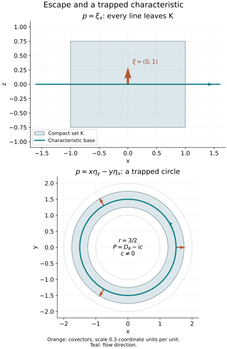

# Solving near a compact set from characteristic escape

Propagation describes the directions in which a solution can fail to be regular. It also gives an existence theorem. A compactly supported adjoint solution cannot carry a singularity along a characteristic that eventually leaves its support. The remaining smooth adjoint solutions form a finite-dimensional obstruction, and an estimate on their complement permits us to construct a solution. For smooth data, a further argument is needed to obtain one smooth solution, rather than unrelated solutions at each finite regularity order.

Throughout, \(X\) is a Hausdorff, second-countable smooth manifold without boundary, of dimension at least one. We work with scalar complex half-densities and use \(D=-i\partial\). The integrated pairing \((u,v)\) is linear in \(u\) and conjugate-linear in \(v\). The operator \(P\in\Psi^m_{1,0}(X)\) is properly supported, \(m\in\mathbb R\), and its principal symbol has a real representative \(p(x,\xi)\), homogeneous of degree \(m\) for \(\xi\ne0\). Scalar lower terms may be complex. No selfadjointness assumption is made.

The preceding lessons [Singularities along a real characteristic direction](../20261005-restored-real-principal/real-principal-type-kernels-and-propagation.md), Sections 2–5, and [Sobolev regularity along real characteristics](../20261005-restored-sobolev-propagation/sobolev-regularity-along-real-characteristics.md), Sections 1–5, supply the complete smooth and fixed-order propagation proofs. Their radial qualification is retained here. The complete [fixed-support Sobolev companion S1–S4](fixed-support-sobolev-compactness.md) proves all real norms, their actual completion, compact inclusions on one compact support and finite-chart anti-duality. The complete [closed-graph and smooth-quotient companion](closed-graphs-and-smooth-quotients.md) retains BF10–BF13 and FQ1–FQ10 with the exact earlier Baire, smooth-space and Hahn–Banach proofs. The [Hilbert proof T1](../20261004-free-canonical-composition/compactness-and-essential-norms.md#t1-the-hilbert-space-facts-with-proofs) and S4 prove representation and projections. The [ordinary adjoint and proper calculus O2–O6](../20261004-free-intrinsic-graph/prerequisites/ordinary-operator-calculus.md), [all-real Sobolev mapping G1](../20261005-cauchy-foundations/sharp-lower-bound.md#g1-global-sobolev-bounds-with-the-original-norms) and [half-density coordinate transfer M2](../20261005-restored-invariant-folds/invariant-fold-continuity-and-sobolev-transfer.md) give their actual manifold versions.

[Base exhaustion, smooth partitions and the positive cotangent norm PS5](../20261004-free-intrinsic-graph/prerequisites/global-principal-symbol.md) and [finite-coordinate flows NF1–NF7](../20261005-restored-phase-space/finite-coordinate-flows.md) supply the geometric inputs. [Scalar kernels and strong topology](../20261005-restored-analytic-composition/scalar-kernels-and-strong-topology.md) supplies compact distributional orders, proper actions and exact smooth duals. [Finite calculus](../20261004-free-stationary-phase/prerequisite-completions.md) and [powers, logarithms and trigonometric functions](../20261004-free-stationary-phase/exponential-prerequisite-completions.md) include every scalar calculation used below. These are written programme proofs, with exact current dependencies in the [proof map](proof-map.json). We supply the characteristic and smooth-jet receiving arguments below.

The source antecedent is the approved purchased Hörmander IV, Theorem 26.1.7 and its proof, printed 63–64, followed by the qualifications on printed 65. Our proof of the smooth conclusion uses the programme's seminorm extension and summable-correction arguments directly. It does not assume an external theorem about weakly closed transposed ranges.

## 1. Escape is a condition on complete characteristics

Write \(\operatorname{Char}(p)=\{(x,\xi):\xi\ne0, p(x,\xi)=0\}\). A complete bicharacteristic means a maximal characteristic strip; completeness here does not assert that its original Hamilton parameter runs over all of \(\mathbb R\). We say that a compact set \(K\subset X\) has the **escape property** if no complete bicharacteristic is entirely over \(K\).

To express this condition without a choice of homogeneous order, use the actual locally finite quadratic-norm construction PS5 to fix a smooth positive cotangent norm \(w(x,\xi)\), of degree one, and put

\[
\widetilde p=w^{1-m}p,
\qquad H_{\widetilde p}=w^{1-m}H_p
\quad\hbox{on }\operatorname{Char}(p).
\tag{CS1}
\]

The second identity follows from the product rule for Hamilton fields, because the term \(pH_{w^{1-m}}\) vanishes on the characteristic set. The positive factor changes the parameter but preserves the oriented strips and their base projections. The field of the degree-one symbol \(\widetilde p\) descends to a smooth field \(W\) on the characteristic subset of the positive cosphere bundle \(S^*X\).

The cosphere bundle over a compact base set is compact. A projected characteristic remaining there cannot cease to exist at a finite parameter time: in finitely many coordinate neighborhoods the field and its first derivatives are bounded, so the local existence and uniqueness intervals extend it past any proposed finite endpoint. Its homogeneous lift is complete as well. Indeed, along the lift, homogeneity gives

\[
\frac{d}{dt}\log w(x(t),\xi(t))=a(x(t),[\xi(t)]),
\tag{CS2}
\]

where \(a\) is smooth and bounded on that compact cosphere set. On any bounded time interval, \(w\) stays between two positive exponential bounds. Thus neither the zero section nor infinite fiber length is reached in finite time. This proves that a complete projected curve over \(K\) is the same obstruction to escape as a complete strip for \(p\). The projected field can be regarded as the restriction of a smooth field on all of \(S^*X\); an initially singular characteristic zero set does not prevent this ordinary differential equation argument.

It also explains the radial case. If \(W=0\) at a characteristic point over \(K\), its projected curve is constant and its lift has the bounds (CS2) for all finite times. That gives a complete strip over one point of \(K\), contradicting escape. Consequently every characteristic point over an escaping compact set satisfies the nonradial hypothesis of the preceding propagation lessons. Along a characteristic containing such a point, \(W\) cannot reach a zero in finite time, by uniqueness.

**Lemma 1.1.** The escape property persists on some compact neighborhood of \(K\).

**Proof.** Choose nested compact neighborhoods \(K_j\) of \(K\), contained in one fixed compact neighborhood, with \(\bigcap_jK_j=K\). Here is an explicit construction without a metrization premise. PS5 gives a compact neighborhood \(K_0\) of \(K\). Apply that same proved exhaustion to the open manifold \(X\setminus K\), obtaining compact \(C_j\subset\operatorname{int}C_{j+1}\) whose interiors cover \(X\setminus K\). Set \(K_j=K_0\setminus\operatorname{int}C_j\). Each is compact and contains the open neighborhood \(\operatorname{int}K_0\setminus C_j\) of \(K\). They decrease and their intersection is exactly \(K\). If the complement is empty take all \(C_j=\varnothing\); the same statements hold. If every \(K_j\) failed escape, choose a complete projected curve over \(K_j\) and its point \(\gamma_j\) at time zero. A subsequence of these points converges in the compact cosphere bundle to a point \(\gamma\) over \(K\).

The maximal solution of \(W\) through \(\gamma\) is the limit of those curves on each compact interval inside its domain, by continuous dependence of the ordinary differential equation. Its base point belongs to every closed \(K_j\), hence to \(K\), at each such time. Its image therefore stays in the compact cosphere bundle over \(K\). The continuation argument above makes its domain all of \(\mathbb R\), and (CS2) lifts it to a complete strip over \(K\). This contradicts escape. Hence some \(K_j\) is an escaping compact neighborhood. Every smaller compact neighborhood contained in it also has escape. \(\square\)

## 2. Propagation gives a global norm on a fixed support

For a compact set \(A\), denote by \(H^q_A(X)\) the closed Hilbert subspace of distributions of class \(H^q\) with support in \(A\). Its norm is a finite sum of chart norms after compact localization. Different such finite families give equivalent norms by M2 and S3 of the exact current providers above. Properness gives a compact set \(L_A\) containing the supports of \(P^*v\) for all \(v\) supported in \(A\). We use a fixed-support \(H^r\) norm on this output set.

Suppose that \(A\) has escape. For every real \(r\),

\[
v\in\mathcal E'_A(X),\quad P^*v\in H^r(X)
\quad\Longrightarrow\quad v\in H^{r+m-1}_A(X).
\tag{CS3}
\]

To prove this, the principal symbol of \(P^*\) is the same real \(p\), by the half-density adjoint formula. At a noncharacteristic covector, elliptic regularity gives \(H^{r+m}\), hence \(H^{r+m-1}\). At a characteristic covector over \(A\), follow its complete strip until its base leaves \(A\). Some finite point of the maximal strip lies outside \(A\), since otherwise escape fails. At that point \(v\) vanishes on a neighborhood and is therefore microlocally \(H^{r+m-1}\). Along the finite segment back to the original covector, the forcing \(P^*v\) is microlocally \(H^r\). Fixed-order propagation gives the required membership. The nonradial condition along that segment follows from Section 1. Outside \(A\), \(v\) is zero. Finally a finite cover of the cosphere bundle over the compact support and the common-base-cutoff argument SP1 of the Sobolev propagation lesson turn these microlocal memberships into the actual fixed-support norm in (CS3).

Set \(q=r+m-1\). There is a constant \(C_{A,r}\) such that

\[
\|v\|_{H^q_A}\leq C_{A,r}
\bigl(\|P^*v\|_{H^r_{L_A}}+\|v\|_{H^{q-1}_A}\bigr)
\tag{CS4}
\]

whenever the quantities on the right are finite. Here is the complete closed-graph application. The space

\[
\mathcal G_r=
\{v\in H^{q-1}_A:P^*v\in H^r_{L_A}\},
\qquad
\|v\|_{\mathcal G_r}=
\|v\|_{H^{q-1}_A}+\|P^*v\|_{H^r_{L_A}}
\tag{CS5}
\]

is Banach. For a Cauchy sequence, its two Hilbert limits satisfy the same equation in distributions: \(P^*:H^{q-1}_A\to H^{r-2}_{L_A}\) is continuous, and \(H^r\) embeds continuously in \(H^{r-2}\). Supports persist under distributional limits. By (CS3) the identity \(\mathcal G_r\to H^q_A\) is everywhere defined. Its graph is closed, since both convergences determine the same distribution. The programme closed-graph theorem, BF13, gives (CS4). The lower term has precisely one less derivative than the norm being recovered.

## 3. The adjoint obstruction is smooth and finite

Define

\[
N(A)=\{v\in\mathcal E'_A(X):P^*v=0\}.
\tag{CS6}
\]

Smooth propagation and escape imply \(N(A)\subset C^\infty_c(X)\). Indeed, ellipticity excludes noncharacteristic wavefront, and any characteristic wavefront point would propagate along its complete strip while the forcing is zero. It would reach a point outside the support, where wavefront is absent. This is impossible. Equivalently, applying (CS3) with every \(r\) gives all Sobolev orders and therefore smoothness by Fourier inversion and Cauchy–Schwarz.

The space \(N(A)\) is closed in \(L^2_A\): \(P^*\) is continuous from this space to \(H^{-m}_{L_A}\), and its zero set is closed. In (CS4) take \(r=1-m\), so \(q=0\). On \(N(A)\) it gives

\[
\|v\|_{L^2}\leq C\|v\|_{H^{-1}}.
\tag{CS7}
\]

The fixed-support inclusion \(L^2_A\to H^{-1}_A\) is compact by the complete Fourier truncation proof I2 and its fixed-support form S3 in the companion. Therefore every sequence in the \(L^2\) unit ball of \(N(A)\) has a subsequence Cauchy in \(H^{-1}\). Applying (CS7) to pairwise differences makes it Cauchy in \(L^2\), with limit still in that closed unit ball. The ball is compact. An infinite-dimensional Hilbert subspace would contain an orthonormal sequence, whose pairwise distances are \(\sqrt2\); such a sequence has no Cauchy subsequence. Hence \(N(A)\) is finite-dimensional.

For any real \(r\), let \(\Pi_q\) be orthogonal projection in \(H^q_A\) onto this finite-dimensional smooth space, where \(q=r+m-1\). Then

\[
\|v-\Pi_qv\|_{H^q_A}
\leq C'_{A,r}\|P^*v\|_{H^r_{L_A}}.
\tag{CS8}
\]

To prove it, if no such constant existed, choose \(v_j\perp N(A)\) with \(\|v_j\|_{H^q}=1\) and \(P^*v_j\to0\) in \(H^r\). Fixed-support compactness gives a subsequence Cauchy in \(H^{q-1}\). Formula (CS4) applied to differences makes it Cauchy in \(H^q\). Its limit \(v\) has norm one, remains orthogonal to \(N(A)\), and satisfies \(P^*v=0\). It belongs both to \(N(A)\) and its orthogonal complement, a contradiction. Subtracting \(\Pi_qv\) proves (CS8) for arbitrary \(v\). This argument uses compactness at every real \(q\), including negative orders.

The obstruction space annihilates all distributional outputs: if \(v\in N(A)\) and \(u\in\mathcal D'(X)\), then

\[
(Pu,v)=(u,P^*v)=0.
\tag{CS9}
\]

Both tests on the right are legitimate, since \(v\) is compactly supported and smooth and \(P^*v\) has these properties. Thus the annihilation condition below is necessary, independently of the method of construction.

## 4. Enlarge the set without adding an obstruction

We need an equation on a neighborhood of \(K\), not only on its interior. Use Lemma 1.1 and choose nested escaping compact neighborhoods \(A_j\) of \(K\) with intersection \(K\). Their obstruction spaces form a descending chain of finite-dimensional spaces. The nonnegative integer \(\dim N(A_j)\) eventually stabilizes. Once dimensions agree, inclusion implies equality. The common stabilized space equals their intersection, and

\[
\bigcap_j N(A_j)=N(K),
\tag{CS10}
\]

because supports in all \(A_j\) are precisely supports in \(K\). Choose one such stabilized neighborhood \(A\). Then \(K\subset\operatorname{int}A\), \(A\) has escape, and \(N(A)=N(K)\). This equality is essential: assuming orthogonality only to \(N(K)\) would not justify solving on an arbitrary larger set with additional adjoint solutions.

## 5. An equation with the exact Sobolev gain

**Theorem 5.1.** Suppose that \(K\) has escape. Its space \(N(K)\) is a finite-dimensional subspace of \(C^\infty_c(X)\). If \(f\in H^s_{\mathrm{loc}}(X)\), \(s\in\mathbb R\), and \((f,n)=0\) for every \(n\in N(K)\), there is \(u\in H^{s+m-1}_{\mathrm{loc}}(X)\) such that \(Pu=f\) on a neighborhood of \(K\). If \(f\in C^\infty(X)\) satisfies this same condition, one can choose one \(u\in C^\infty(X)\).

**Proof of the Sobolev assertion.** Choose \(A\) as in Section 4 and set

\[
r=1-m-s,
\qquad q=r+m-1=-s.
\tag{CS11}
\]

For \(v\in C^\infty_c(X)\) supported in \(A\), subtract its \(H^{-s}_A\) projection onto \(N(A)=N(K)\). This does not change either \((f,v)\) or \(P^*v\). The dual Sobolev pairing and (CS8) give

\[
|(f,v)|
\leq C_f\|v-\Pi_{-s}v\|_{H^{-s}_A}
\leq C_f C'_{A,r}\|P^*v\|_{H^r_{L_A}}.
\tag{CS12}
\]

Here a cutoff equal to one near \(A\) reduces \(f\) to a compact \(H^s\) input; continuity of the weighted Fourier pairing is the exact anti-duality statement S1 and finite-chart realization S4 in the companion. Define the conjugate-linear functional \(F(P^*v)=(f,v)\) on the space of these adjoint outputs. It is well-defined because a difference in the kernel lies in \(N(A)\), and (CS12) bounds it in the actual \(H^r\) norm.

For completeness, realize the fixed-support norm by a finite family of chart cutoffs: \(Jw=(\chi_\alpha w)_\alpha\), with each component extended by zero in its Euclidean chart. It embeds the supported output space into a finite Hilbert sum of \(H^r(\mathbb R^n)\). Extend \(F\circ J^{-1}\) from the subspace \(J(P^*C^\infty_A)\) to this Hilbert sum using the norm-preserving Hahn–Banach theorem, applied after conjugation. Hilbert representation and reciprocal Fourier weights give components \(u_\alpha\in H^{-r}(\mathbb R^n)\). Transposing the chart cutoffs and summing them gives a global distribution \(u\in H^{-r}_{\mathrm{loc}}(X)\) satisfying

\[
(u,P^*v)=(f,v),\qquad v\in C^\infty_A.
\tag{CS13}
\]

The transposed cutoffs have compact support inside their charts, so extension to \(X\) has no chart-boundary defect. Thus \(Pu=f\) on \(\operatorname{int}A\), which contains \(K\), and \(-r=s+m-1\) is the asserted order. This argument neither claims uniqueness nor requires a bounded linear choice of \(u\). \(\square\)

## 6. A smooth solution requires a smooth range argument

We now prove the smooth assertion of Theorem 5.1. Keep the same \(A\). Let \(E=C^\infty(X;\Omega^{1/2})\), and let \(Z_A\subset E\) be the sections whose derivatives of every order vanish at every point of \(A\). This is a closed subspace: in finitely many local frames at each point, every derivative evaluation is continuous. Define the smooth jet space

\[
F_A=E/Z_A.
\tag{CS14}
\]

The programme quotient proof FQ4–FQ10 makes \(F_A\) Fréchet with its actual quotient seminorms. A jet records all derivatives on \(A\), including at its boundary; it is more than a continuous restriction to that compact set.

### 6.1. The continuous dual retains exactly this support

The continuous linear functionals on \(F_A\) are precisely the pairings \( [h]\mapsto(h,v)\) with \(v\in\mathcal E'_A(X)\). Here is the support and flatness check. Pulling a quotient functional back to \(E\) gives a continuous linear functional bounded by finitely many smooth compact seminorms. It is a compactly supported distribution, and it vanishes on all compact tests outside \(A\), since those tests are flat on \(A\). Its support therefore lies in \(A\).

Conversely a distribution \(v\) supported in \(A\) annihilates \(Z_A\). Localize into finitely many charts, and let \(M\) be a common order of the resulting compact distributions. For each localized support \(B\subset A\), convolve the indicator of the \(2\delta\) neighborhood of \(B\) with a nonnegative smooth unit-mass kernel supported in the \(\delta/2\) ball. The resulting cutoff is one near \(B\), supported within its \(3\delta\) neighborhood, and has derivative bounds \(C_\alpha\delta^{-|\alpha|}\). A fixed chart cutoff keeps its support in that chart. For a section \(h\) flat on \(A\), Taylor's formula about a nearest point of \(B\), on these small chart neighborhoods, gives for every chosen \(L\)

\[
\max_{|\alpha|\leq M}|\partial^\alpha h(x)|
\leq C_L\delta^L
\quad\text{when }\operatorname{dist}(x,B)\leq3\delta.
\tag{CS15}
\]

All derivatives at that nearest point vanish; bounded derivatives of the next \(L\) orders on a fixed compact chart set give the uniform remainder. The complete product rule bounds the \(C^M\) norm of the cutoff times \(h\) by \(C\delta^{L-M}\). With \(L>M\) this tends to zero. Pairing with \(v\) is unchanged by the cutoff, since it is one near the support, so \((h,v)=0.\) Summing the finite chart pieces proves the assertion on \(X\). No regularity of the boundary of \(A\) has been used.

Let

\[
Y_A=\{[h]\in F_A:(h,n)=0\text{ for every }n\in N(A)\}.
\tag{CS16}
\]

It is a closed Fréchet subspace. Properness and the Sobolev mapping theorem followed by local Sobolev embedding show that \(P:E\to E\) is continuous in every compact smooth seminorm. By (CS9),

\[
T:E\longrightarrow Y_A,
\qquad Th=[Ph],
\tag{CS17}
\]

is therefore a continuous linear map. We prove that it is onto.

### 6.2. A bound for every source seminorm

Choose a compact exhaustion, starting with a compact neighborhood of \(A\cup L_A\). For each exhaustion set choose finitely many compact chart cutoffs whose squared sum is one near that set. For every \(j\geq1\), let \(J_jh\) collect the chart components from families \(i\leq j\), with the components from family \(i\) measured in \(H^i(\mathbb R^n)\), and set

\[
p_j(h)=\|J_jh\|_{\bigoplus_{i\leq j,\alpha}H^i},
\qquad q_j([h])=\inf_{z\in Z_A}p_j(h+z).
\tag{CS18}
\]

The \(p_j\) are increasing seminorms giving exactly the smooth topology of \(E\). Each is bounded by finitely many compact derivative seminorms. Conversely, to control \(k\) derivatives on a prescribed compact set, choose a later family with \(i>k+n/2\) covering it and use Fourier Sobolev embedding and its squared partition. Completeness follows from the programme smooth-space proof on these charts: a sequence Cauchy in all these seminorms has limits for every derivative on each compact chart set; the limits agree on overlaps, and the coordinate fundamental theorem of calculus identifies them as the derivatives of one smooth global section. The \(q_j\) give the quotient topology by FQ5–FQ10; their restrictions give the topology of \(Y_A\).

If \(\ell\in Y_A'\), the seminorm Hahn–Banach theorem FQ1–FQ3 extends it to \(F_A\). By Section 6.1 it is represented by a distribution \(v\in\mathcal E'_A\). Different extensions differ by an element of \(N(A)\). Indeed \(Y_A\) is the common kernel of finitely many functionals supplied by a basis of \(N(A)\); a functional zero on that common kernel factors through their finite-dimensional image and is a linear combination of them. The pullback of \(\ell\) by \(T\) is represented by \(P^*v\), independently of that choice.

For fixed \(j\), define its possibly infinite source bound

\[
\sigma_j(\ell T)=
\sup_{p_j(h)\leq1}|\ell(Th)|.
\tag{CS19}
\]

Suppose this is finite. Extension of the functional on the subspace \(J_jE\) to its finite Hilbert sum, by the same Hahn–Banach and Fourier representation used in Section 5, expresses \(P^*v\) as the sum of transposed cutoff components of orders \(H^{-i}\), \(i\leq j\). Localization back to its known support \(L_A\) therefore gives

\[
\|P^*v\|_{H^{-j}_{L_A}}\leq C_j\sigma_j(\ell T).
\tag{CS20}
\]

The fixed chart transformations and multiplications are bounded at those real orders. Although the representing Hilbert components may extend to the larger exhaustion set, a cutoff equal to one near \(L_A\) recovers the actual distribution there and yields the displayed fixed-support norm.

Apply (CS3) and (CS8) with \(r=-j\), \(q=m-1-j\), and set \(v_0=v-\Pi_qv\). Then

\[
\|v_0\|_{H^{m-1-j}_A}
\leq C_j'\sigma_j(\ell T).
\tag{CS21}
\]

For \(h\) representing a point of \(Y_A\), \((h,v)=(h,v_0)\). Choose an integer \(k=k(j)\) large enough that its family covers a cutoff neighborhood of \(A\) and \(k\geq j+1-m\). Local Sobolev pairing yields

\[
|\ell([h])|\leq C_j''\sigma_j(\ell T)\,p_k(h).
\]

Every representative \(h+z\), \(z\in Z_A\), gives the same pairing. Taking the infimum gives the required quotient estimate

\[
|\ell(y)|\leq B_j\sigma_j(\ell T)\,q_{k(j)}(y)
\qquad(y\in Y_A).
\tag{CS22}
\]

This is a bound for the dual of each original source seminorm, with a definite later quotient seminorm; choose \(B_j>0\). When \(\sigma_j=0\), (CS20) gives \(P^*v=0\), hence \(v\in N(A)\) and \(\ell=0\) on \(Y_A\). No division by a zero bound is needed.

### 6.3. Remove the closure with summable corrections

Formula (CS22) implies

\[
\{y\in Y_A:q_{k(j)}(y)<B_j^{-1}\}
\subset\overline{T\{h\in E:p_j(h)<1\}}.
\tag{CS23}
\]

To verify this implication, if \(y\) were outside the closed balanced convex set on the right, Hahn–Banach would supply a continuous linear functional \(\ell\) separating it strictly:

\[
|\ell(y)|>
\sup_{p_j(h)<1}|\ell(Th)|=\sigma_j(\ell T).
\tag{CS24}
\]

Here the separation follows from exactly the seminorm theorem already supplied in the programme. If \(C\) is that closed balanced convex set, choose \(t>1\) sufficiently close to one that \(y/t\notin C\), and a balanced convex open neighborhood \(V\) with \(y/t\notin C+V\). The Minkowski functional of \(C+V\) is a continuous seminorm: balance gives absolute homogeneity, convexity gives its triangle inequality, and the contained neighborhood \(V\) gives continuity and absorption. Its value at \(y\) is at least \(t>1\), while it is at most one on \(C\). Extend the functional on the complex line through \(y\), with value this seminorm at \(y\), by FQ1–FQ3. This proves (CS24), including in a nonnormable space. The supremum in (CS24) is finite by strict separation. Its equality to the closed-ball supremum follows by scaling each vector toward zero. Now (CS22) and the assumed bound on \(q_{k(j)}(y)\) contradict (CS24), proving (CS23).

We apply the closure-removal part BF11–BF12 of the programme Fréchet proof. Its use here does not assume surjectivity: (CS23) supplies the closure neighborhoods that its correction series needs. To give the receiving choices explicitly, for each \(j\) take

\[
U_j=\{h:p_j(h)<2^{-j}\}
\]

and choose a balanced open neighborhood \(V_j\subset\overline{T U_j}\), shrinking it further so that \(q_i(y)<2^{-j}\) for \(i\leq j\). Such a neighborhood is given by the scaled (CS23). Given \(y\in V_1\), choose \(h_j\in U_j\) recursively so that

\[
r_0=y,
\qquad r_j=r_{j-1}-Th_j\in V_{j+1}.
\tag{CS25}
\]

Since \(r_{j-1}\in V_j\subset\overline{T U_j}\), approximation in the open neighborhood \(r_{j-1}-V_{j+1}\) makes this choice possible. For fixed \(i\), the tail \(j\geq i\) satisfies \(p_i(h_j)\leq p_j(h_j)<2^{-j}\). Thus \(\sum_jh_j\) converges in every original smooth seminorm to a single \(h\in E\), by the programme completeness proof. The retained target bounds make \(r_j\to0\) in every quotient seminorm. Continuity gives \(Th=y.\) Finally \(V_1\) is a neighborhood of zero and absorbs every vector of \(Y_A\). Scaling this construction proves that \(T\) is onto all of \(Y_A\).

If the original \(f\) is smooth and annihilates \(N(K)=N(A)\), its class belongs to \(Y_A\). Choose the single smooth \(u\) with \(Tu=[f]\). Then \(Pu-f\) is flat on \(A\), in particular zero at every point of \(\operatorname{int}A\). This proves the equation on a neighborhood of \(K\) and completes Theorem 5.1. \(\square\)

## 7. Two models distinguish the hypotheses

Escape is sufficient; it is not a necessary condition for smooth solvability. On an annulus, write polar coordinates \((r,\theta)\), and take

\[
P=D_\theta-ic=-i(\partial_\theta+c),
\qquad c\in\mathbb R\setminus\{0\}.
\tag{CS26}
\]

Its real principal symbol is \(\eta_\theta\). The Hamilton field is \(\partial_\theta\), and characteristic radial covectors lie over complete circular curves in compact subsets of the annulus. Escape fails. Nevertheless, for smooth periodic \(f\),

\[
u(r,\theta)=
\frac{i}{1-e^{-2\pi c}}
\int_0^{2\pi}e^{-ct}f(r,\theta-t)\,dt
\tag{CS27}
\]

is smooth and satisfies \(Pu=f\). Differentiation in \(r,\theta\) passes through a finite integral of smooth functions. Using \(\partial_\theta f(r,\theta-t)=-\partial_t f(r,\theta-t)\), integration by parts gives

\[
(\partial_\theta+c)
\int_0^{2\pi}e^{-ct}f(r,\theta-t)\,dt
=(1-e^{-2\pi c})f(r,\theta),
\]

where periodicity supplies the last endpoint value. The factor in (CS27) gives \(Pu=f\) with \(D=-i\partial\). If \(c=0\), integrating \(D_\theta u=f\) around a circle forces the angular mean of \(f\) to vanish. Thus lower terms can decide solvability when escape fails; Theorem 5.1 permits arbitrary scalar lower terms when escape holds.

For the terminology used in Hörmander IV, Definition 26.1.8, **real principal type on \(X\)** includes both a real homogeneous principal symbol and the condition that no complete strip stays over any compact subset of \(X\). A real principal symbol alone does not assert this global escape condition. The propagation lessons use their stated local nonradial hypotheses; the present local existence theorem uses escape over the particular compact set.

The finite-dimensional obstruction can be nonzero even when the characteristic set is empty. Let \(X=\mathbb R\), choose a real \(\phi\in C_c^\infty(\mathbb R)\) with \(\|\phi\|_2=1\), and define the proper order-one operator

\[
Pu=D_tu-(u,D_t\phi)\phi,
\qquad
P^*v=D_tv-(v,\phi)D_t\phi.
\tag{CS28}
\]

The rank-one kernels have compact support in both variables, and the principal symbol is the elliptic symbol \(\tau\). If \(A\) contains the support of \(\phi\), the compact adjoint solutions are exactly \(N(A)=\mathbb C\phi\): the equation says \(D_t(v-(v,\phi)\phi)=0\), so that compact distribution is a constant distribution and therefore zero. Conversely \(P^*\phi=0\). Thus \(f=\phi\) fails the necessary condition (CS9). There is no solution on a neighborhood of its support. Escape eliminates singular adjoint obstructions; it does not eliminate every smooth one.

### Exact characteristic models

The left panel uses \(X=\mathbb R^2\), \(P=D_x\), \(p=\xi_x\), and the compact rectangle \(K=[-1,1]\times[-3/4,3/4]\). The displayed characteristic has base \((x,z)=(t,0)\), covector \((\xi_x,\xi_z)=(0,1)\), and Hamilton derivative \((1,0;0,0)\). Every characteristic over this rectangle has the same nonzero horizontal base velocity, so it exits in finite time. The finite segment drawn is part of its complete line.

The right panel uses the annulus \(1<\sqrt{x^2+y^2}<2\), its compact subannulus \(5/4\le\sqrt{x^2+y^2}\le7/4\), and \(p=x\eta_y-y\eta_x\). The displayed complete characteristic is
\[
 (x,y)=\tfrac32(\cos t,\sin t),\qquad
 (\eta_x,\eta_y)=(\cos t,\sin t),\qquad t\in\mathbb R.
 \tag{CSA1}
\]
Substitution gives \(p=0\). Differentiation gives \(H_p=(-y,x;-\eta_y,\eta_x)\), exactly the derivatives of these four functions. It stays over that compact subannulus and is periodic, so escape fails. Radial covector arrows in this panel denote \((\cos t,\sin t)\); they are distinct from the tangential base velocity. The added scalar term \(-ic\), \(c\ne0\), changes neither this principal symbol nor its characteristic curves, but (CS27) gives a smooth inverse. The trigonometric identities and derivatives are the complete earlier P16 proofs.

*Actual base projections and covectors in the two models above. The shaded sets are the stated compact sets; arrows marked as covectors use Euclidean coordinate identification only for this drawing. The circular model illustrates the proved sufficiency qualification, not a converse to Theorem 5.1.*

## 8. Exercises with complete solutions

**1. The order in the dual extension.** Suppose \(m=3/2\) and \(f\in H^{-2}_{\mathrm{loc}}\). Determine the orders \(r,q\) used in the adjoint estimate, and the regularity of the constructed solution. Then give the formula at arbitrary \(m,s\).

**Solution.** Formula (CS11) gives \(r=1-3/2-(-2)=3/2\) and \(q=r+m-1=2=-s\). Thus the forcing norm of \(P^*v\) in the extension is \(H^{3/2}\), the adjoint input norm is \(H^2\), and the represented solution belongs to \(H^{-3/2}_{\mathrm{loc}}\). This is \(s+m-1=-2+3/2-1=-3/2\), with a gain of \(m-1=1/2\) relative to the data. In general the test order is \(q=-s\), the extension order is \(r=1-m-s\), and reciprocal Fourier weights give \(u\in H^{-r}_{\mathrm{loc}}=H^{s+m-1}_{\mathrm{loc}}\). The adjoint estimate relates \(H^q\) to \(H^r\), not to the output order \(H^{s+m-1}\); confusing these orders reverses the duality step.

**2. A smooth obstruction with an explicit solution.** For the rank-one operator (CS28), let \(f\in C_c^\infty(\mathbb R)\). Prove that \(Pu=f\) has a global smooth solution exactly when \((f,\phi)=0\), and construct it when this condition holds.

**Solution.** Necessity follows by pairing the equation with the compact smooth adjoint solution \(\phi\), since \(P^*\phi=0\). If \((f,\phi)=0\), set

\[
u(t)=i\int_{-\infty}^t f(a)\,da.
\]

This is smooth and satisfies \(D_tu=f\), with the required factor \(i\). Integration by parts against the compact test \(\phi\) gives \((u,D_t\phi)=(D_tu,\phi)=(f,\phi)=0\); no decay of \(u\) at the other end is needed for that compact pairing. Hence (CS28) gives \(Pu=f\). The solution may have a constant tail, and global \(L^2\) membership is not asserted. For \(f=\phi\), its pairing with \(\phi\) is one, so no solution exists even on a neighborhood of the support. This proves both directions and displays the exact obstruction.

**3. Summability in a smooth topology.** Suppose a continuous linear map between the actual spaces \(E,Y_A\) has the closure neighborhoods (CS23). Why is approximation with a uniform bound in one norm insufficient to conclude smooth solvability? Show that the choices (CS25) give a single smooth solution and that no linear right inverse is asserted.

**Solution.** A bound in one \(p_i\) leaves every higher derivative seminorm uncontrolled. Separate solutions with higher and higher finite regularity may also be unrelated, so they do not define a common smooth limit. With (CS25), however, for every fixed \(i\) and all \(j\geq i\) we have \(p_i(h_j)<2^{-j}\). Every tail sum is bounded by the corresponding geometric tail in that same seminorm. The full sequence of partial sums is therefore Cauchy for every \(p_i\), and the exact Fréchet completeness proof gives one smooth limit \(h\). Also \(r_j\in V_{j+1}\) implies \(q_i(r_j)<2^{-j-1}\) for every \(j+1\geq i\), so the residual tends to zero in all quotient seminorms. Continuity of \(T\) gives \(Th=y.\) Scaling from the absorbing neighborhood \(V_1\) gives this conclusion for every \(y\in Y_A\). At each stage a preimage approximant is selected from a closure neighborhood. These choices have not been made linearly in \(y\), and the proof gives no bounded linear right inverse.

## References and scope

Lars Hörmander, *The Analysis of Linear Partial Differential Operators IV: Fourier Integral Operators*, approved corrected second printing (1994), Springer eBook ISBN 978-3-642-00136-9 (2009), §26.1, Theorem 26.1.7, printed 63–64, and the remarks and Definition 26.1.8 on printed 65 (PDF 74–76), supply the mathematical antecedents for this lesson. The exposition, receiving estimates, smooth-jet argument and exercises are independently written. The rotation example follows the source's distinction between escape and solvability, with \(D=-i\partial\) and its scalar phase fixed explicitly. No error in the cited source and no new theorem are claimed.

The two accompanying selections from AN-03 retain GFDL 1.2 only, with no Invariant Sections or Cover Texts, and their complete notices. This independently written receiving lesson and its new original illustration retain the course CC0 dedication. The exact source and dependency record distinguishes these components.

This lesson proves existence near a compact set with escape, including the smooth conclusion and the exact Sobolev gain. Global solvability modulo smooth functions, propagation parametrices, systems and boundary problems require their own full arguments. A compact-set existence theorem does not prove those further claims.

*Preserved programme exposition and all three original complete solutions retained. Current source and proof review: GPT-6 Astra (OpenAI), Ultra, 5 October 2026 UTC. Independent human review and the wider course remain unfinished.*
