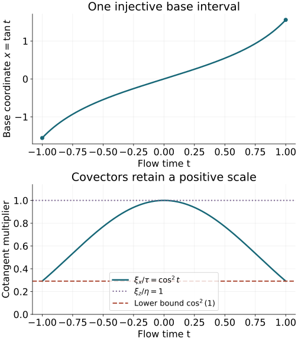

# One canonical tube along a compact characteristic

Straightening a characteristic at one point gives a local model. Prescribing a singularity along a whole finite ray requires one model over the entire ray, with compatible phase data and one pair of inverse operators. We construct that tube and remove every lower-order term on it. The assumption concerns the ray in the cosphere bundle: a ray that returns to the same positive covector direction cannot be represented injectively by a single straight coordinate interval.

The signs and Hamiltonian flow identities are proved in Section 1 of [Phase space and generating families](../20261005-restored-phase-space/phase-space-and-generating-families.md). The exact local homogeneous straightening is Theorem 1.1 of [Real and complex symplectic normal forms of functions](../20261005-restored-function-normal-forms/real-and-complex-symplectic-function-normal-forms.md), using the coordinate-completion theorem in Section 3 of [Prescribed canonical coordinates and isotropic fibers](../20261005-restored-prescribed-coordinates/prescribed-canonical-coordinates-and-isotropic-fibers.md). Section 4 and Theorem 7.1 of [Gaussian lines, densities and invariant symbols](../20261005-restored-gaussian-symbols/gaussian-lines-and-invariant-symbols.md) give the intrinsic Maslov line and full symbol surjectivity. Section 7 of [Maslov index, crossings and global phase](../20261005-restored-maslov-topology/maslov-index-crossings-and-global-phase.md) proves the chart-cocycle and path-independence argument for its transport. Sections 1, 6, 7 of [Graph operators, continuity and Egorov](../20261005-restored-graph-egorov/graph-operators-continuity-and-egorov.md) supply the reduced graph symbol, both inverse constructions, ordered Egorov formula and complete ordinary-symbol removal of lower terms. We use those full programme proofs and prove the additional compact-tube and gluing steps here. The complete [finite-coordinate flows NF1–NF7](../20261005-restored-phase-space/finite-coordinate-flows.md) prove local existence, uniqueness, every parameter derivative, variable initial times and continuation in manifold charts. The [inverse and implicit function proofs P2–P3](../20261004-free-stationary-phase/prerequisite-completions.md) and [compactness proof F0-COMP](../20261004-free-stationary-phase/proof-map.html#F0-COMP) supply the finite-domain and injectivity steps. The [full conic inverse K3](../20261004-free-intrinsic-graph/prerequisites/conic-parametrices-and-localization.md) and [ordinary composition and proper-kernel proofs O1–O6](../20261004-free-intrinsic-graph/prerequisites/ordinary-operator-calculus.md) supply the operator remainders. The examples use the complete [exponential, trigonometric and arctangent proofs P15–P16](../20261004-free-stationary-phase/exponential-prerequisite-completions.md). Every used programme proof has an exact current locator in the [proof map](proof-map.json). Linked components retain their licences.

The mathematical antecedents are the approved purchased Hörmander IV, Proposition 26.1.6 and Proposition 26.1.3′. Our argument retains a single neighborhood, positive homogeneity, both ordered inverse identities and all smoothing defects. It does not require the projection of the ray to the base manifold to be injective.

## 1. The cosphere condition excludes a radial characteristic

Let \(X\) be an \(n\)-dimensional smooth manifold. On its punctured cotangent bundle use
\[
 \alpha=\xi\,dx,\qquad \omega=d\alpha,\qquad
 \iota_{H_p}\omega=-dp,\qquad
 R=\xi\partial_\xi.
 \tag{CT1}
\]
The notation is intrinsic: \(R\) generates positive cotangent dilation and \(\alpha\) is the cotangent pairing. The **cosphere bundle** is the quotient
\[
 S^*X=(T^*X\setminus0)/\mathbb R_+,
 \qquad \pi:T^*X\setminus0\longrightarrow S^*X.
 \tag{CT2}
\]
A smooth positive norm on covectors identifies this quotient with its unit sphere bundle. The quotient itself does not depend on that norm. Its actual local coordinates need no global metric: in a cotangent chart choose a component of fixed nonzero sign, write its absolute value as \(\rho>0\), and divide every covector component by \(\rho\). The base coordinates and the remaining ratios are quotient coordinates. On overlaps their transitions are the original smooth cotangent transition followed by division by a nonzero signed component. Thus they are smooth with smooth inverses; dropping \(\rho\) is a submersion with kernel exactly the radial line.

Suppose \(p\) is real, smooth and homogeneous of degree one. Let \(I=[a,b]\), \(a<b\), and let \(\gamma\) be a bicharacteristic defined on a neighborhood of \(I\):
\[
 p(\gamma(t))=0,\qquad \gamma'(t)=H_p(\gamma(t)).
 \tag{CT3}
\]
For a bicharacteristic initially specified on the closed interval, ordinary local existence extends it slightly at its endpoints. Assume that \(\bar\gamma=\pi\gamma\) is injective on \(I\).

**Lemma 1.1.** The Hamilton field descends to a smooth vector field on \(S^*X\). That vector field is nonzero at every point of \(\bar\gamma(I)\). Consequently \(H_p\) and \(R\) are independent everywhere on \(\gamma(I)\), and \(n\ge2\).

**Proof.** The homogeneous Hamilton identity gives \([R,H_p]=0\), since \(p\) has degree one. Equivalently, the Hamilton field is carried to itself by positive cotangent dilations. It therefore projects to a smooth vector field \(\bar H_p\) on the quotient. Its projected integral curve is \(\bar\gamma\). If \(\bar H_p\) vanished at one point of that curve, uniqueness would identify the curve through that point with the constant solution. Uniqueness on overlapping time neighborhoods, in both time directions, would make \(\bar\gamma\) constant on all of \(I\). This contradicts injectivity because \(a<b\). The kernel of \(d\pi\) is exactly the line spanned by \(R\); thus \(d\pi(H_p)\ne0\) is the claimed independence. At \(p=0\), both \(R\) and \(H_p\) are in the symplectic orthogonal of \(R\), because \(dp(R)=p=0\). In dimension two that orthogonal is the radial line itself. The independence is therefore impossible when \(n=1\). \(\square\)

Injectivity alone would not exclude a zero derivative for an arbitrary smooth curve. The uniqueness of this autonomous projected ODE supplies that missing implication. The hypothesis includes the endpoints of the nontrivial segment.

## 2. Continue the local chart on one fixed neighborhood

Write model coordinates as \((t,z;\tau,\eta)\in T^*\mathbb R^n\), where \(z,\eta\) have \(n-1\) components. Denote by \(e_n\) the last standard covector in the full \((\tau,\eta)\) space; its temporal component is zero. Put
\[
 J=\{(t,0;e_n):t\in I\}.
 \tag{CT4}
\]

**Theorem 2.1 (compact homogeneous tube).** Under the hypotheses in Section 1 there is an open conic neighborhood \(V\) of \(J\) and a homogeneous canonical diffeomorphism
\[
 \chi:V\longrightarrow\chi(V)\subset T^*X\setminus0,
 \qquad
 \chi(t,0;e_n)=\gamma(t),\qquad
 p\circ\chi=\tau.
 \tag{CT5}
\]
The image is an open conic neighborhood of \(\gamma(I)\). The tube can be chosen contractible and convex in the time variable. Its neighborhood in both the base and the positive covector direction may be made as small as desired along the segment.

**Construct the map and its common domain.** Choose \(t_0\) in the interior of \(I\). Lemma 1.1 and the full local homogeneous straightening theorem give a canonical homogeneous chart \(\chi_0\) near \((t_0,0;e_n)\), with
\(p\circ\chi_0=\tau\) and \(\chi_0(t_0,0;e_n)=\gamma(t_0)\).
Translate its first position coordinate to obtain the displayed mark. Preservation of the symplectic form and of this exact function implies
\(d\chi_0(\partial_t)=H_p\circ\chi_0\).

On the initial slice \(t=t_0\), use the positive last covector component \(\rho=\eta_{n-1}>0\). Write
\[
 (\tau,\eta)=\rho(\sigma,\vartheta,1),
 \qquad w=(z,\sigma,\vartheta),
 \tag{CT6}
\]
where \(\vartheta\in\mathbb R^{n-2}\); that list is empty when \(n=2\). The normalized transverse variable \(w\) has \(2n-2\) components. Start with \(w\) in a small ball about zero and \(\rho=1\). If \(\Phi_s\) denotes the Hamilton flow of \(p\), define
\[
 \chi(t,z;\tau,\eta)
  =\Phi_{t-t_0}\bigl(\chi_0(t_0,z;\tau,\eta)\bigr).
 \tag{CT7}
\]

Here is why one transverse ball works for all \(t\in I\). The central solution \(\gamma(I)\) is compact and avoids the zero section. Extend it to a slightly larger closed interval \(I_1\). Cover its image there by finitely many relatively compact coordinate neighborhoods in the punctured cotangent bundle. Local smooth ODE existence and dependence give, in each of these neighborhoods, a common short time interval and an open neighborhood of the marked initial data. Divide \(I_1\) into finitely many steps subordinate to those intervals. Compose the finitely many solution maps and successively restrict the initial neighborhood so that each intermediate image remains in the next available neighborhood. Each restriction is open and contains the central initial point. Their finite intersection still contains a ball of normalized initial data. Make this construction in the positive and negative directions from \(t_0\). The result is one ball of \(w\)'s on which (CT7) is smooth for every time in a neighborhood of \(I\). It supplies all parameter derivatives on that fixed domain; no decreasing sequence of neighborhoods is used.

The Hamilton flow commutes with positive dilation, by \([R,H_p]=0\) and uniqueness. Extend the construction from \(\rho=1\) by this dilation. Equation (CT7) then holds for every \(\rho>0\) and defines a homogeneous map on a conic domain. Its central solution equals \(\gamma(t)\) by uniqueness with the same initial value. Also \(p\) is constant along its own Hamilton flow, so \(p\circ\chi=\tau\) on the entire domain, not merely at \(J\). Near the initial slice it agrees with \(\chi_0\), again by uniqueness.

## 3. Preserve the full form and exclude distant collisions

**Preservation of the symplectic form.** At each fixed \(t\), tangent vectors to the model time slice are sent by the differential of the Hamilton flow applied to their initial images. The Hamilton flow preserves \(\omega\), by Proposition 1.1 of the phase-space lesson. Since \(\chi_0\) is canonical, for any two such vectors \(v_1,v_2\) this gives
\[
 (\chi^*\omega)(v_1,v_2)=\omega_0(v_1,v_2),
 \qquad
 \omega_0=d\tau\wedge dt+\sum_jd\eta_j\wedge dz_j.
 \tag{CT8}
\]
The mixed time components are just as essential. From (CT7),
\(d\chi(\partial_t)=H_p\circ\chi\), and hence for every vector \(v\) tangent to the time slice,
\[
 (\chi^*\omega)(\partial_t,v)
   =-d(p\circ\chi)(v)=-d\tau(v)
   =\omega_0(\partial_t,v).
 \tag{CT9}
\]
The value on two time directions is zero by antisymmetry. Every tangent vector is a sum of a time component and a time-slice vector. Thus (CT8)–(CT9) prove \(\chi^*\omega=\omega_0\) everywhere on the common domain. Nondegeneracy of \(\omega_0\) makes \(d\chi\) injective; equal dimensions make it invertible. The map is a local canonical diffeomorphism throughout the tube.

Homogeneity identifies the radial fields, \(d\chi(R_0)=R\circ\chi\). Since \(\iota_R\omega=\alpha\), it also gives the exact primitive identity
\[
 \chi^*\alpha=\alpha_0
             =\tau\,dt+\sum_j\eta_jdz_j.
 \tag{CT10}
\]
This follows directly by contracting the proved two-form identity; there is no undetermined exact one-form in (CT10).

**Global injectivity after one shrinking.** The homogeneous local diffeomorphism descends to a local diffeomorphism
\(\bar\chi(t,w)\) on the quotient by \(\rho\). To check its differential, quotient the invertible differential of \(\chi\) by the radial line, which it maps isomorphically to the target radial line. Its central curve is \(\bar\chi(t,0)=\bar\gamma(t)\).

We claim that for some \(\delta>0\) it is injective on
\[
 (a-\delta,b+\delta)\times B_\delta(0).
 \tag{CT11}
\]
Choose these sets within the common existence domain. If no such choice were injective, take \(\delta_k\downarrow0\) and distinct colliding pairs \((t_k,w_k)\), \((s_k,v_k)\) in the corresponding sets. Their transverse variables tend to zero. Compactness of \(I\) gives a subsequence with \(t_k\to t\in I\), \(s_k\to s\in I\). Continuity gives \(\bar\gamma(t)=\bar\gamma(s)\), so the hypothesis forces \(t=s\). Both pairs then approach the same point \((t,0)\). The local inverse theorem supplies one open neighborhood of that point on which \(\bar\chi\) is injective. For large \(k\) both pairs lie in it, a contradiction. This argument also covers limits at \(a\) and \(b\), because the existence domain was extended across the endpoints.

Take \(V\) to be the conic domain defined by (CT11) and \(\rho>0\). If two points of \(V\) have equal images under \(\chi\), quotienting first gives the same \((t,w)\). Their images are then positive scalar multiples of the same nonzero covector, by homogeneity. Equality forces their two scalars \(\rho\) to agree. This proves injectivity of \(\chi\). A bijective local diffeomorphism onto its image has a smooth inverse; its image is open. Its canonical and homogeneous properties were already proved.

Finally \(V\) is parametrized by an interval, a ball and \((0,\infty)\), so it is contractible and convex in time. In these actual coordinates, the contraction to \((t_0,0,1)\) is
\[
 H_s(t,w,\rho)=\bigl((1-s)t+st_0,\ (1-s)w,\ (1-s)\rho+s\bigr),
 \qquad 0\le s\le1.
 \tag{CTA1}
\]
The interval and ball are convex and the last coordinate remains positive, so the entire homotopy stays in \(V\); it fixes the marked point. In particular it contracts every based loop without leaving this single tube. Shrinking \(\delta\) further retains every assertion. For any specified open neighborhood of the projected central curve and its graph, compactness and continuity make a sufficiently small such tube lie in it. Theorem 2.1 follows. \(\square\)

The compact collision argument is stronger than merely noting that the central curve has no repeated points. It excludes all possible collisions between nearby rays, including pairs at distant time parameters. Base-space self-intersections are harmless when their positive covector directions differ.

## 4. Quantize the whole tube with compatible phase data

Let \(C\) be the canonical graph of \(\chi\). A graph point is written \((\chi(v),v)\); its kernel relation \(C'\subset T^*(X\times\mathbb R^n)\setminus0\) reflects the input covector. Both graph covectors are nonzero. Work with scalar half densities, so no coordinate density choice is needed on \(X\).

**Lemma 4.1 (one elliptic graph quantization).** For every real \(\mu\), there are properly supported graph operators \(A_1\) and \(B_1\), of orders \(\mu\) and \(-\mu\), elliptic along \(J\) and \(\gamma(I)\), with
\[
 A_1B_1-I\text{ smoothing near }\gamma(I),\qquad
 B_1A_1-I\text{ smoothing near }J.
 \tag{CT12}
\]
Their graph wavefront relations may be confined to arbitrarily small conic neighborhoods of the graph over \(J\) and its inverse.

**Proof of the symbol choice.** The graph is diffeomorphic to \(V\), hence contractible. Its intrinsic Maslov line has the locally constant fourth-root transitions proved in the Gaussian lesson. It has a nonzero flat section on this tube. To see the needed global assertion explicitly, transport a nonzero coefficient from one point through successive local phase charts. Within a chart keep its coefficient constant and at a switch apply the proved coefficient transition. Any two paths have the same transport: their joined loop contracts in the tube; subdivide the compact contraction disk into small chart rectangles. Each internal transition occurs in opposite directions and cancels, and the exact cocycle cancels the transitions at corners. The boundary transport is therefore one. More explicitly, pull the phase-chart cover back to the compact parameter square of the contraction (CTA1). A sufficiently fine rectangular grid has each closed small cell in one member: otherwise shrinking cells with no such member would have a common limiting point, contradicting that an open member contains a neighborhood of that point. Transport around each cell is one when computed in its own chart; the exact overlap cocycle makes the answer independent of that choice. In the product of all cell boundaries, each interior edge is traversed twice in opposite directions and cancels. The remaining outer boundary compares the loop with the constant loop. This proves the assertion directly for the intrinsic line charts, without a global symplectic trivialization of the ambient manifold. Local path extensions show that the resulting section is smooth and nonzero. This argument uses the intrinsic line and does not presume a single fixed ambient symplectic frame on \(X\).

Choose the section on the normalized slice \(\rho=1\) and extend it constantly along positive dilations. The phase-chart transitions are dilation invariant, so it is a homogeneous degree-zero section \(m_C\). The common symplectic half volume on the graph is \(v_C^{1/2}\), defined in Section 1 of the graph lesson; it has degree \(n/2\). On a smaller tube take reduced symbol
\[
 \alpha_1=\rho^\mu m_C,
 \qquad \sigma(A_1)=\alpha_1v_C^{1/2}
                        \quad\bmod\text{ one lower order}.
 \tag{CT13}
\]
The positive model component \(\rho\) is comparable to the full model covector length on every retained angular patch. On compact normalized tube subsets, the homogeneous coefficients and every derivative are bounded. Each covector derivative of \(\rho^\mu\) or a smooth angular coefficient reduces its degree by one; base derivatives do not change degree. Thus (CT13) is an ordinary symbol of the required order, and its reduced inverse \(\rho^{-\mu}m_C^{-1}\) has every corresponding inverse-symbol bound. This is ellipticity with estimates, rather than only pointwise nonvanishing.

Choose a smooth degree-zero cutoff in \((t,w)\), equal to one on a neighborhood of \(I\times\{0\}\), with compact support inside the larger normalized tube. Multiply (CT13) by it and cut off bounded frequencies. The full invariant-symbol surjectivity theorem, applied with interior supports, supplies an FIO with this symbol. For clarity, its construction uses a finite cover of this compact normalized support by the local phase charts and a homogeneous partition of unity. Each local integral realizes its own symbol piece. The Maslov transitions and density law identify their symbols on overlaps, so their finite sum has exactly the global symbol (CT13) on the smaller tube. No single phase covering the whole graph is assumed. Each piece has wavefront only on its permitted graph subset. Shrinking the support and phase neighborhoods puts the whole relation in the requested graph neighborhood.

The input and output base images of the normalized support are compact. On that support the output covector length is bounded above and away from zero after normalizing the input, by continuity and the nonzero homogeneous map. There are therefore no limiting covectors on either axis. Choose a smooth compactly supported cutoff on the base product equal to one near these two base images. Multiplying the kernel by it gives proper support in both variables and retains the symbol and all graph germs in question. Any discarded part is smooth at the retained graph points. This proves a proper elliptic choice of \(A_1\).

**Both inverses on one smaller tube.** Realize the inverse reduced symbol on the inverse graph, with the same interior cutoffs, obtaining a proper \(B_0\) of order \(-\mu\). The proved zero-excess graph compositions give the two proper order-zero PDOs \(A_1B_0\) and \(B_0A_1\). Their principal symbols are one on the matched smaller cones. Apply the full conic PDO parametrix construction used in Theorem 6.1 of the graph lesson to these two operators. It supplies a right inverse on the output and a left inverse on the input. Multiplying these by \(B_0\) gives graph operators \(B_R,B_L\). Their exact comparison is
\[
 B_L-B_R=B_L(I-A_1B_R)+(B_LA_1-I)B_R.
 \tag{CT14}
\]
The proper smoothing ideal and the separated-cone remainder estimates proved there make both terms smoothing on the matched tube. Thus either choice gives both identities in (CT12). All cutoffs can be chosen before these constructions on nested tubes containing the compact central set. A finite normalized cover gives one smaller time cylinder and angular patch on which both defects are smoothing; this is not separate unrelated inversion at successive times. Composition with the PDO parametrices introduces no new graph relation. Their interior microsupport cutoffs and those of \(B_0\) retain the specified wavefront neighborhoods. \(\square\)

Here and below “smoothing near” a cotangent tube means that the proper PDO defect has no microsupport there; equivalently its kernel is microlocally smooth near the corresponding diagonal relation. The graph cutoffs retain the paired input and output neighborhoods for every composition.

## 5. Remove all lower terms on the same finite cylinder

**Theorem 5.1 (full compact-tube conjugation).** Let \(P\in\Psi^1_{1,0}(X)\) be a scalar properly supported operator whose principal symbol is the real degree-one function \(p\) in Section 1. For every \(\mu\in\mathbb R\) there are proper
\[
 A\in I^\mu(X\times\mathbb R^n,C'),\qquad
 B\in I^{-\mu}(\mathbb R^n\times X,(C^{-1})')
 \tag{CT15}
\]
with arbitrarily small graph wavefront neighborhoods over the central segment, such that
\[
 \begin{aligned}
 AB-I,&\quad AD_tB-P&&\text{are smoothing near }\gamma(I),\\
 BA-I,&\quad BPA-D_t&&\text{are smoothing near }J,
 \qquad D_t=-i\partial_t.
 \end{aligned}
 \tag{CT16}
\]
In addition, \(PA-AD_t\) is microlocally smoothing on the paired central graph.

**Proof.** Take \(A_1,B_1\) from Lemma 4.1. The full ordered Egorov formula and \(p\circ\chi=\tau\) give
\[
 B_1PA_1=D_t+Q\quad\bmod\text{ smoothing},
 \qquad Q\in\Psi^0_{1,0},
 \tag{CT17}
\]
on the retained input tube. The statement uses the inverse symbol of \(B_1\); the order \(\mu\) does not leave an extra principal factor. Its lower-order symbol need not be real or homogeneous.

Choose a time interval containing \(I\) in its interior and small fixed transverse base and angular patches whose product closure lies in that tube. Such a product exists by compactness of the central normalized interval. Fix slightly larger available patches before extending the full symbol of \(Q\). The all-order ordinary-symbol construction in Section 7 of the graph lesson, equations GT1–GT17, now applies on this whole finite cylinder, with initial slice \(t_0\). It gives proper elliptic order-zero PDOs \(A_2,B_2\) with both inverse defects smoothing and
\[
 B_2(D_t+Q)A_2-D_t\text{ smoothing}
 \tag{CT18}
\]
on one smaller cylinder still containing \(J\).

This application uses the complete transport argument there, not only its leading scalar ODE. Its leading matrix and inverse obey uniform exponential bounds on the finite time interval; every parameter derivative has the ordinary symbol weight. Each decreasing-order residual is solved by the ordered variation-of-constants integral on that same interval. Support-preserving asymptotic summation and the full differentiated composition remainder give a smoothing residual at every order. In the present scalar case the same proof applies without any restriction on complex lower terms. The finite interval and fixed patch just constructed supply precisely the uniform domain required by that theorem.

Define \(A=A_1A_2\), \(B=B_2B_1\). The proper zero-excess composition theorem preserves their relations and the orders in (CT15). The two inverse identities follow by composing the two inverse pairs on the matched cones. Equations (CT17)–(CT18) give \(BPA-D_t\) smoothing near \(J\). For the other conjugation identity retain the exact order of all factors:
\[
 AD_tB-P
  =A(D_t-BPA)B+(AB-I)P(AB)+P(AB-I).
 \tag{CT19}
\]
Every term is smoothing near \(\gamma(I)\), by the full proper microlocal smoothing ideal with the already matched graph cutoffs. The same argument in
\[
 PA-AD_t=(I-AB)PA+A(BPA-D_t)
 \tag{CT20}
\]
proves the paired intertwining assertion. All discarded separated support pieces have full smoothing remainders on those cones; a vanishing principal symbol alone would not suffice. This proves (CT16) and the additional identity. \(\square\)

The theorem treats scalar principal direction and all its lower terms. The existing finite-matrix transport proof also applies when the principal symbol is \(pI_r\) in a compatible bundle frame over the tube, with both graph symbol maps actual bundle isomorphisms. No reduction of a general matrix principal symbol with different eigenvalues is inferred. For a real operator of order \(m\), the positive order reduction used in the preceding propagation lesson first gives order one; its Hamilton flow on the characteristic set is a positive reparametrization. The present theorem uses the specified order-one flow time. Existence of a nontrivial compact injective cosphere segment remains part of its hypotheses.

## 6. Examples and exercises with complete solutions

**Exercise 6.1 (a periodic ray; intermediate).** Let \(X=S^1\times\mathbb R\), with angular coordinate \(x\) modulo \(2\pi\) and transverse coordinate \(z\). Take \(p=\xi_x\) and the characteristic \(\gamma(t)=(t\bmod2\pi,0;0,1)\). Determine which intervals \([0,L]\), \(L>0\), meet the hypothesis. Explain the obstruction when it fails.

**Solution.** Hamilton's equations give \(H_p=\partial_x\); the indicated curve is therefore a bicharacteristic. Its covector already has unit length in the product metric, and its projected curve returns exactly when two time parameters differ by a nonzero multiple of \(2\pi\). The projection is injective on the closed interval exactly when \(0<L<2\pi\). The equality case fails because both endpoints are included. In this range restrict the covering coordinate \(x=t\bmod2\pi\) to an open interval slightly longer than \([0,L]\) but shorter than \(2\pi\). The cotangent lift
\(\chi(t,z;\tau,\eta)=(t\bmod2\pi,z;\tau,\eta)\)
is homogeneous canonical, has \(p\circ\chi=\tau\), and gives the required tube. If \(L\ge2\pi\), the prescribed central values already identify the two distinct model points at times 0 and \(2\pi\). No map with those values could be injective, regardless of the transverse neighborhood size. This does not contradict local straightening at each point.

**Exercise 6.2 (different radii do not separate a radial ray; intermediate).** On \(T^*\mathbb R^n\setminus0\), take \(p=x\cdot\xi\) and initial point \((0,e_n)\), with \(n\ge2\). Compute its characteristic, its positive-direction projection, and the obstruction to homogeneous straightening by \(p\circ\chi=\tau\) at this marked point.

**Solution.** The exact Hamilton field is
\(H_p=x\partial_x-\xi\partial_\xi\).
Thus \(\gamma(t)=(0,e^{-t}e_n)\) and \(p\gamma=0\). Distinct times give distinct covectors in the punctured cotangent bundle, but all lie on the same positive ray, so the projected curve is constant. At these points \(H_p=-R\). A homogeneous canonical map with \(p\circ\chi=\tau\) would send \(\partial_t=H_\tau\) to \(H_p\), and homogeneity would send \(R_0\) to \(R\). At the model point \((t,0;e_n)\), \(\partial_t\) and \(R_0\) are independent. An invertible differential cannot send them to the dependent pair \(-R,R\). Hence this marked homogeneous normal form is impossible. Injectivity of the original nonprojected characteristic was insufficient; quotient injectivity is the relevant condition.

**Exercise 6.3 (finite flow time and the covector scale; advanced).** Let \(X=\mathbb R^2\), with coordinates \((x,z)\), and let \(p=(1+x^2)\xi_x\). Starting from \((0,0;0,1)\), construct the tube explicitly. Check the full primitive, the Hamilton equation and the uniform radial comparisons on \([-T,T]\) for \(0<T<\pi/2\). Explain what happens at \(T=\pi/2\).

**Solution.** The base equation is \(x'=1+x^2\), with \(x(0)=0\), so \(x=\tan t\). The transverse coordinate and covector are fixed. For the full tube define
\[
 \chi(t,z;\tau,\eta)
    =(\tan t,z;\tau\cos^2t,\eta),
 \qquad -\pi/2<t<\pi/2.
 \tag{CT21}
\]
It is homogeneous, injective with inverse \(t=\arctan x\), and
\(p\circ\chi=\sec^2t\,\tau\cos^2t=\tau\).
Its pullback primitive is
\(\tau\cos^2t\,d(\tan t)+\eta\,dz=\tau\,dt+\eta\,dz\);
differentiation proves full canonicity. The Hamilton field is
\((1+x^2)\partial_x-2x\xi_x\partial_{\xi_x}\).
Differentiating (CT21) in time gives base component \(\sec^2t\) and covector component \(-2\tau\sin t\cos t\), equal to those Hamilton components at its image. The central covector is \((0,1)\), so its projected base parameter \(\tan t\) is injective on every stated compact interval.

On \([-T,T]\), \(\cos^2t\ge\cos^2T>0\). In the Euclidean covector norms,
\[
 \cos^2T\,|(\tau,\eta)|
 \le |(\tau\cos^2t,\eta)|
 \le |(\tau,\eta)|.
 \tag{CT22}
\]
Every fixed derivative of the chart and its inverse is bounded on a slightly larger compact time interval and retained normalized angular patch. These are the compact estimates used in graph symbol quantization. At \(t=\pi/2\) the base solution escapes to infinity; no bicharacteristic through this initial point is defined there as a point of \(T^*\mathbb R^2\). The closed-interval hypothesis of Theorem 2.1 is then absent. The deterioration of (CT22) does not license extending that theorem across a missing endpoint.

### Exact coordinate illustration of the finite tube

The figure uses the explicit chart in Exercise 6.3 with \(T=1<\pi/2\). The upper panel is the base projection \(x(t)=\tan t\). The lower panel is the cotangent multiplier \(\cos^2t\) in \(\xi_x=\tau\cos^2t\), together with the unchanged factor one in \(\xi_z=\eta\). They are precisely the functions in (CT21), rather than a schematic approximation to another flow. Since \(\cos^2t\) is even and its derivative is \(-2\sin t\cos t<0\) for \(0<t\le1\), its minimum on this interval is exactly \(\cos^2(1)>0\). Squaring the two covector components gives both bounds in (CT22). The characteristic itself has \(\tau=0,\eta=1\); the multiplier panel describes nearby covectors in the full chart. The proofs of the trigonometric signs and derivatives are P16.1–P16.3 linked above.

*The base map and covector multipliers of (CT21) on the compact interval \([-1,1]\). The displayed lower bound is the exact constant in (CT22). This coordinate view omits the unchanged transverse position \(z\); it does not depict the whole cotangent bundle or claim extension through \(t=\pi/2\).*

## References

- Lars Hörmander, *The Analysis of Linear Partial Differential Operators IV: Fourier Integral Operators*, approved corrected second printing (1994), Springer eBook ISBN 978-3-642-00136-9 (2009), Section 26.1, Proposition 26.1.6 and Proposition 26.1.3′ PDF 73–74. Source comparison and mathematical credit; the complete geometric extension and quantization bridges are supplied here, using the exact programme proofs named above.
- Lars Hörmander, *The Analysis of Linear Partial Differential Operators III: Pseudo-Differential Operators*, approved Springer eBook ISBN 978-3-540-49938-1 (2007), Section 21.3, Theorem 21.3.1. Its full receiving local homogeneous-coordinate proof is in the linked prescribed-coordinate and function-normal-form lessons.

*Preserved programme exposition and all three original solutions retained. Current source and proof review: GPT-6 Astra (OpenAI), Ultra, 5 October 2026 UTC. Independent human review and the wider course remain unfinished.*
