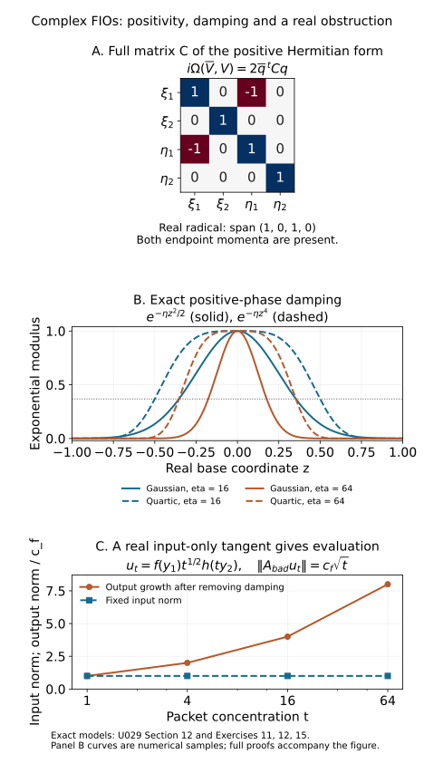

# Complex-phase Fourier integral operators

Positive imaginary parts damp oscillation. They also allow the real zeros of a canonical ideal to be singular. Composition and continuity therefore have to be formulated using the complex tangent plane of the ideal at each real zero. This lesson proves transverse composition and the exact geometric criterion under which **every** order-zero operator associated with such an ideal is locally bounded on \(L^2\).

The symplectic convention is \(\Omega=d\xi\wedge dx\), extended complex bilinearly; a positive plane satisfies \(i\Omega(\overline V,V)\ge0\). We use \(D=-i\partial\), Fourier transform \(\widehat u(\eta)=\int e^{-iy\cdot\eta}u(y)\,dy\), and inverse factor \((2\pi)^{-n}\). All frequency cones exclude zero. Phase domains and closed conic amplitude supports are localized near a marked ray. Bounded frequencies and smooth kernel terms are kept as smoothing remainders.

The preceding [positive-ideal lesson](../20261005-restored-positive-ideals/positive-lagrangian-ideals-and-distributions.md) supplies smooth complex graph division, flat-residue necessity and sufficiency, positive critical values, partial Legendre reduction, complex nonstationary estimates and the two-way oscillatory representation theorem. The [positive-plane lesson](../20261005-restored-quadratic-forms/quadratic-hamilton-maps-and-positive-complex-planes.md) supplies its exact Hermitian nullspace theorem, and the [composition lesson](../20261005-restored-analytic-composition/clean-composition-of-fourier-integral-operators.md) supplies Fourier localization and support conventions. A symbol residue retains the bounded normalized coefficient families constructed in the positive-ideal lesson; ordinary smooth ideal membership alone does not give uniform symbol damping estimates. The real phase-equivalence theorem is not being applied to complex phases.

Section 11 needs the endpoint symbol class \(S^0_{1/2,1/2}\), which the ordinary calculus with \(\delta<\rho\) does not cover. The [complete endpoint proof](endpoint-half-order-bound.md) connects this case directly to the AN-03 packet estimate already included in the programme. The metric calculations remain explicit; the broader AN-03 metric route is recorded as comparison.

## 1. Twisted ideals, bundles and adjoints

Let \(\iota(x,\xi,y,\eta)=(x,\xi,y,-\eta)\). It is an involution and takes \(\Omega_X+\Omega_Y\) to \(\Omega_X-\Omega_Y\). If \(J'\) is a positive conic Lagrangian ideal on \(T^*(X\times Y)\setminus0\), its twist \(J\) is a **positive conic canonical ideal**. Its tangent plane is Lagrangian and positive for \(\Omega_X-\Omega_Y\). The prime denotes this twist, not a derivative. Its real zero set is denoted \(J_{\mathbb R}\); its complex tangent at a real zero \(p\) is \(T_pJ\).

Suppose
\[
 J_{\mathbb R}\subset(T^*X\setminus0)\times(T^*Y\setminus0).
 \tag{1.1}
\]
For finite-dimensional smooth bundles \(E\to X\), \(F\to Y\), an FIO of order \(m\) has kernel
\[
 K_A\in I^m\bigl(X\times Y,J';
 \Omega_{X\times Y}^{1/2}\otimes\operatorname{Hom}(F,E)\bigr).
 \tag{1.2}
\]
It takes compactly supported smooth sections of \(\Omega_Y^{1/2}\otimes F\) to distribution sections of \(\Omega_X^{1/2}\otimes E\). In coordinates the kernel half-density is \(|dx\,dy|^{1/2}\). Multiplying it by \(u(y)|dy|^{1/2}\) produces \(|dx|^{1/2}|dy|\), which can be integrated in \(y\). This explains the density type without an arbitrary choice of volume form. Smooth positive Hermitian metrics give the local \(L^2\) norms used below; changing such a metric on a compact patch gives equivalent norms.

Write \(n=n_X+n_Y\). In local trivializations an oscillatory representative is
\[
 K_A(x,y)=c_{n,N}\int e^{i\phi(x,y,\theta)}a(x,y,\theta)\,d\theta,
 \quad c_{n,N}=(2\pi)^{-(n+2N)/4},
 \quad a\in S^{m+(n-2N)/4}.
 \tag{1.3}
\]
Here \(\phi\) is homogeneous of degree one, \(\operatorname{Im}\phi\ge0\), and its critical differentials are independent over \(\mathbb C\) at the marked real critical point. The extended twisted ideal has generators
\[
 \phi_x-\xi,\qquad \phi_y+\eta,\qquad \phi_\theta.
 \tag{1.4}
\]
Its functions independent of \(\theta\) form \(J\).

The sesquilinear adjoint uses phase \(-\overline\phi\), whose imaginary part is \(\operatorname{Im}\phi\). Swapping the base factors, its generators are
\[
 -\overline{\phi_y}-\eta,\qquad
 -\overline{\phi_x}+\xi,\qquad
 -\overline{\phi_\theta}.
 \tag{1.5}
\]
They are minus the conjugates of (1.4), in swapped order. Therefore
\[
 K_{A^*}\in I^m\bigl(Y\times X,(\overline{J^{-1}})';
 \Omega_{Y\times X}^{1/2}\otimes\operatorname{Hom}(E^*,F^*)\bigr).
 \tag{1.6}
\]
Here the stars on bundles denote the conjugate duals for the sesquilinear pairing; Hermitian identifications express the same adjoint as an operator from \(E\) to \(F\). A bilinear transpose is a different operation. The order is unchanged because both the total base dimension and \(N\) are unchanged. In a trivialization the amplitude is the coefficient adjoint \(a^*\). In particular, replacing the phase by \(-\phi\) would be incorrect when there is damping.

## 2. Transversality and simultaneous normal coordinates

Consider matching real points of \(J_1\) and \(J_2\), with nonzero covectors in \(T^*X,T^*Y,T^*Z\). Put
\[
 V_X=T(T^*X)\otimes\mathbb C,\quad
 V_Y=T(T^*Y)\otimes\mathbb C,\quad
 V_Z=T(T^*Z)\otimes\mathbb C,
\]
and let \(L_1\subset V_X\times V_Y\), \(L_2\subset V_Y\times V_Z\) be their complex tangent planes. Composition is **transverse** when \(L=L_1\times L_2\) is transverse to
\[
 D=V_X\times\Delta(V_Y)\times V_Z.
 \tag{2.1}
\]
The ambient symplectic form is \(\Omega_X-\Omega_{Y_1}+\Omega_{Y_2}-\Omega_Z\). The subspace \(D\) is coisotropic, with
\[
 D^\perp=\{(0,v,v,0):v\in V_Y\}.
\]
Since \(L^\perp=L\), transversality is equivalent to
\[
 (0,v)\in L_1,\quad(v,0)\in L_2\quad\Longrightarrow\quad v=0.
 \tag{2.2}
\]
These vectors are complex. Indeed \((L+D)^\perp=L\cap D^\perp\), so (2.2) is exactly \(L+D\) equal to the ambient space. The expected intersection dimension is \(n_X+n_Z\). Projection \(L\cap D\to V_X\times V_Z\) has kernel \(L\cap D^\perp=0\). Its image is consequently Lagrangian. Positivity descends because the two middle symplectic terms cancel on \(D\).

We need real base coordinates in which **both** ideals have momentum graph descriptions. Here is the simultaneous-coordinate argument, including its complex-plane step. If a positive Lagrangian plane in ordinary cotangent coordinates is parametrized by columns \((Q,P)\), then \(P+iQ\) is invertible. A vector in its kernel has \(p=-iq\); hence
\[
 i\Omega(\overline{(q,p)},(q,p))=-2|q|^2,
\]
which contradicts positivity unless the vector is zero. The determinant of a momentum projection after a symmetric cotangent shear is therefore a nonzero polynomial in the shear entries: the complex shear just exhibited gives a nonzero value.

For the first twisted plane use shear variables \(S_X,S_Y\); for the second use \(S_Y,S_Z\). Twisting converts them to block shears with opposite signs on the input factor. Each determinant polynomial is nonzero, since its own two blocks can be chosen to realize the preceding \(iQ\) test. Their product is a nonzero complex polynomial in the shared collection \((S_X,S_Y,S_Z)\). A nonzero complex polynomial cannot vanish at every real tuple: apply the one-variable polynomial identity successively to the real coordinates. Thus one real choice makes both determinants nonzero.

At a marked nonzero covector a real base-coordinate change with first derivative identity can realize any symmetric shear. If \(\xi_k\ne0\), prescribe its second derivatives in that base component so that their contraction with \(\xi\) is the desired symmetric matrix, and set the other second derivatives to zero. A sufficiently small neighborhood preserves a diffeomorphism. Do this in \(X,Y,Z\); the common \(Y\) choice is used by both ideals. The positive-ideal momentum-graph theorem now gives phases
\[
 \begin{split}
 \phi_1(x,y,\xi,\eta)&=x\cdot\xi-y\cdot\eta-H_1(\xi,\eta),\\
 \phi_2(y,z,\eta',\zeta)&=y\cdot\eta'-z\cdot\zeta-H_2(\eta',\zeta),
 \end{split}
 \qquad \operatorname{Im}H_j\le0,
 \tag{2.3}
\]
where each \(H_j\) has degree one. This does not presume a smooth real canonical relation.

## 3. The composed ideal in normal phases

The graph generators for the two ideals are
\[
 x-H_{1\xi},\ y+H_{1\eta};\qquad
 y'-H_{2\eta'},\ z+H_{2\zeta}.
\]
Before restricting to the middle diagonal, adjoin \(y-y'\) and \(\eta-\eta'\). Real division by these diagonal equations is exact. Restriction gives the ideal
\[
 \bigl(x-H_{1\xi},\ H_{1\eta}+H_{2\eta},\ y+H_{1\eta},\ z+H_{2\zeta}\bigr).
 \tag{3.1}
\]
Its functions independent of \(y,\eta\) define \(J_1\circ J_2\). Equivalently, lift a function of \((x,\xi,z,\zeta)\) to the middle diagonal and require it to belong to the restricted sum of the two ideals. This intrinsic restriction-and-elimination definition makes sense even when the real matching set is singular.

In these coordinates (2.2) says that a vector \(v\in\mathbb C^{n_Y}\) satisfying
\[
 H_{1\xi\eta}v=0,\qquad H_{2\zeta\eta}v=0,\qquad
 (H_1+H_2)_{\eta\eta}v=0
 \tag{3.2}
\]
is zero. Thus the \(n_Y\) complex differentials \(d(H_{1\eta}+H_{2\eta})\), in all of \((\xi,\eta,\zeta)\), are independent. Invertibility of the middle Hessian is sufficient, but is not the definition; the outer blocks in (3.2) matter.

Set \(\Phi=\phi_1+\phi_2\) and use mixed parameters \((y,\xi,\eta,\eta',\zeta)\). The critical functions are
\[
 \eta'-\eta,\quad x-H_{1\xi},\quad
 -y-H_{1\eta},\quad y-H_{2\eta'},\quad -z-H_{2\zeta}.
 \tag{3.3}
\]
To prove their differential independence, take a linear relation. The \(dx,dz\) coefficients remove the second and fifth groups. The \(dy\) coefficients make the coefficients of the third and fourth groups equal. The remaining relation has the form
\[
 a\cdot d(\eta'-\eta)+b\cdot d(H_{1\eta}+H_{2\eta'})=0.
\]
Write \(d\eta'=d\eta+d(\eta'-\eta)\). Independence from (3.2) forces \(b=0\), after which \(a=0\). Also \(\operatorname{Im}\Phi\ge0\). Section 5 below homogenizes the mixed parameters, so this is a nondegenerate positive homogeneous phase.

Its extended canonical generators add \(\Phi_x-\xi_{\rm out}\) and \(\Phi_z+\zeta_{\rm out}\) to (3.3). These simply identify the normal parameters \(\xi,\zeta\) with the endpoint cotangent coordinates. Restriction by \(\eta'-\eta=0\) then leaves exactly (3.1). Thus the phase defines the composed ideal, and the positive-phase ideal theorem makes it positive and conic. This proves existence and coordinate independence of the local composed ideal, rather than only a claim about its real set.

## 4. Arbitrary phases: rank and exact elimination

Let \(\phi(x,y,\theta)\), \(\chi(y,z,\tau)\) be any positive nondegenerate phases for the two ideals at the matching point. The sum
\[
 \Phi(x,z;y,\theta,\tau)=\phi(x,y,\theta)+\chi(y,z,\tau)
 \tag{4.1}
\]
has critical equations \(\Phi_y=0,\phi_\theta=0,\chi_\tau=0\). We first prove their independence directly.

Suppose \(a\cdot d\Phi_y+b\cdot d\phi_\theta+c\cdot d\chi_\tau=0\), with complex coefficients. By symmetry of the Hessians, its \(\theta,x\) components say that \((\delta x,\delta y,\delta\theta)=(0,a,b)\) is a critical tangent for \(\phi\) with zero output covector variation. Its \(\tau,z\) components say that \((\delta y,\delta z,\delta\tau)=(a,0,c)\) is a critical tangent for \(\chi\) with zero input covector variation. The \(y\) component identifies their intermediate twisted covector variations: \(-d\phi_y=d\chi_y\). Equation (2.2) makes this common intermediate tangent zero, including \(a=0\). The critical-map differential of either nondegenerate phase is injective over \(\mathbb C\): if base variations and all cotangent variations are zero, a parameter vector annihilates every column of \(d\phi_\theta\), and their independence makes it zero. Consequently \(b=c=0\). This proves the missing rank assertion without complex phase equivalence.

We also need equality of smooth ideals, not merely equality of tangent planes. If \(f(x,\xi,z,\zeta)\) belongs to the intrinsic composed ideal, its lifted local representation uses
\[
 \phi_x-\xi,\quad\phi_y+\eta,\quad\phi_\theta,\quad
 \Phi_y,\quad\chi_z+\zeta,\quad\chi_\tau.
 \tag{4.2}
\]
Divide each coefficient except the one multiplying \(\phi_y+\eta\) by that graph ideal in \(\eta\); its graph Jacobian is the identity. Absorb the quotients into the exceptional coefficient. All the other coefficients become independent of \(\eta\). Their residual difference \(R\) is therefore independent of \(\eta\) and belongs to \((\eta+\phi_y)\).

The flat-residue theorem gives, on a smaller fixed patch, for every derivative and every \(L\),
\[
 |\partial^\gamma R|\le C_{\gamma L}|\operatorname{Im}\phi_y|^L.
 \tag{4.3}
\]
For a smooth nonnegative function \(G=\operatorname{Im}\phi\), Taylor's theorem on a compact neighborhood gives \(|dG|^2\le CG\). Euler's identity gives \(G=\theta\cdot\operatorname{Im}\phi_\theta\). On a normalized frequency patch this implies \(|\operatorname{Im}\phi_y|^2\le C|\phi_\theta|\). Taking arbitrary powers in (4.3) yields derivative flatness with respect to \(\phi_\theta\).

For completeness, the division is explicit away from \(\phi_\theta=0\): write
\[
 R=\sum_j\phi_{\theta_j}
       \frac{R\,\overline{\phi_{\theta_j}}}{|\phi_\theta|^2}.
 \tag{4.4}
\]
Every derivative of a coefficient has only a finite additional denominator power; (4.3) with arbitrarily large \(L\) controls it and makes its derivatives tend to zero at the zero set. Extension by zero is smooth and flat. Thus \(R\in(\phi_\theta)\), and the exceptional \(\eta\)-term can be removed. What remains in (4.2) is exactly the extended ideal of (4.1).

We have proved inclusion of the intrinsic composed ideal in the phase ideal. Both are canonical ideals with \(n_X+n_Z\) independent generators. Write one generating system in the other: its differential matrix at the common real zero is invertible, so its coefficient matrix is invertible on a smaller patch. The inclusion is equality. In symbol applications graph division and (4.4) retain the bounded normalized coefficient families of the positive-ideal lesson; no uniform estimate is inferred from bare smooth ideal membership.

## 5. Operator composition, supports and orders

Assume the following global conditions on the cones in question:

1. Every real zero of \(J_1,J_2\) has both endpoint covectors nonzero.
2. The complex tangent composition is transverse at every real matching point.
3. The real matching set
   \[
   M=(J_{1\mathbb R}\times J_{2\mathbb R})
      \cap\bigl(T^*X\times\Delta(T^*Y)\times T^*Z\bigr)
   \]
   projects injectively and properly to \(T^*(X\times Z)\setminus0\).

If \(A_1\) and \(A_2\) are properly supported FIOs of orders \(m_1,m_2\), then
\[
 A_1A_2\in I^{m_1+m_2}\bigl(X\times Z,(J_1\circ J_2)';
 \Omega_{X\times Z}^{1/2}\otimes\operatorname{Hom}(G,E)\bigr).
 \tag{5.1}
\]
The middle bundle is \(F\); contraction composes \(\operatorname{Hom}(F,E)\) with \(\operatorname{Hom}(G,F)\), in that order. The middle half-densities produce \(|dy|\). No clean excess is included in this theorem.

Here are the support and convergence details. Localize both kernels in base coordinates and by homogeneous frequency partitions. Smooth factors give smooth compositions: for example a compactly supported smooth output test applied to one kernel has empty compatible wavefront by the nonzero endpoint condition, and the other smooth factor can then be paired with it. Proper support keeps the integrated base variables compact on compact endpoint sets. The same argument, with derivatives of endpoint tests, gives smoothness of these remainders.

In a nonsmooth pair of phase patches, a critical real matching point of the sum must satisfy
\[
 \phi_\theta=0,\quad\chi_\tau=0,\quad\phi_y+\chi_y=0.
 \tag{5.2}
\]
In particular the two intermediate covectors agree and are nonzero. On small patches, the intermediate covector size is comparable to \(|\theta|\) in the first patch and to \(|\tau|\) in the second; hence a matching contribution has these parameter sizes comparable. Away from a compact neighborhood of (5.2), either one phase has positive damping bounded below on the unit patch, or a normalized critical derivative is bounded below. Compactness supplies a uniform lower bound. The positive complex nonstationary theorem, applied to the sum and tested also in endpoint variables, gives arbitrary inverse frequency powers there, with all endpoint derivatives. Dyadic integration then converges in every smooth seminorm. This deals both with unmatched rays and with the noncomparable-frequency regions; low frequencies are smooth separately.

The noncomparable-frequency assertion can be made quantitative without a compactness claim at a zero parameter. Decompose into shells \(|\theta|\asymp2^j\), \(|\tau|\asymp2^k\). If \(j\ge k+C_0\), near the first phase's real critical set its nonzero intermediate covector gives \(|\phi_y|\ge c2^j\), whereas \(|\chi_y|\le C2^k\); take \(C_0\) large enough to obtain \(|\Phi_y|\ge(c/2)2^j\). Away from that critical set the first phase supplies damping or a normalized critical derivative bounded below. The complex nonstationary estimate in the dominant phase variables, with \(\tau/2^k\) as a bounded parameter, gives \(2^{-Lj}\) for arbitrary \(L\). Every fixed endpoint derivative and the two shell volumes cost at most \(2^{C_1j}\) for a finite \(C_1\), by the symbol estimates and \(k\le j\). Summing the at most \(O(1+j)\) smaller shells is absorbed by choosing \(L\) larger. The case \(k\ge j+C_0\) is symmetric. Comparable unmatched shells have the compact normalized lower bound already described. Thus all unmatched pieces have arbitrary smooth decay after summation, including arbitrarily unequal frequency scales.

Properness in condition 3 supplies a finite cover of the matching points over a compact output cone. Indeed its inverse image of a compact normalized output neighborhood is compact. Injectivity gives a single matching point for each projected real point, so the local composed ideal germs obtained in Sections 3–4 agree wherever their real domains overlap. Restriction away from real zeros gives the entire local smooth ideal, as usual. A finite partition and cutoff construction consequently glues the local ideals and their oscillatory representations. The real set of \(M\) was never assumed smooth.

On a matching patch use (4.1). To turn its mixed parameters into ordinary homogeneous parameters, set
\[
 R=(|\theta|^2+|\tau|^2)^{1/2},\qquad
 \omega=(R y,\theta,\tau),\qquad N=N_1+N_2+n_Y.
 \tag{5.3}
\]
This is a smooth invertible map on the combined nonzero cone. Scaling \(\omega\) scales \(\theta,\tau\) and leaves \(y\) fixed, so \(\Phi\) is homogeneous of degree one. Its block triangular derivative has determinant \(R^{n_Y}\). Therefore \(dy\,d\theta\,d\tau=R^{-n_Y}d\omega\).

Before this Jacobian, the product amplitude has order
\[
 m_1+m_2+\frac{n_X+n_Z+2n_Y-2N_1-2N_2}{4}.
\]
On comparable cones \(R\) is comparable to both parameter sizes, and differentiation of \(y=\omega_y/R\) or either normalized direction has the appropriate symbol loss. Multiplication by \(R^{-n_Y}\) thus gives order
\[
 m_1+m_2+\frac{n_X+n_Z-2N}{4}.
 \tag{5.4}
\]
The constants also match exactly:
\[
 c_{n_X+n_Y,N_1}c_{n_Y+n_Z,N_2}
 =(2\pi)^{-(n_X+n_Z+2N)/4}.
 \tag{5.5}
\]
This is the normalization for (5.1).

To justify the kernel identity, first impose compact frequency cutoffs on both integrals. Fubini applies and gives their actual composition integral. On the matching part the transformed amplitudes stay in a bounded set of the symbol class (5.4) and converge locally with every derivative; the positive oscillatory construction is continuous for such cutoff limits after testing and integrating by parts sufficiently many times. The unmatched parts converge to the smooth remainders just estimated, uniformly in every prescribed finite number of derivatives. These two limits identify the distributional composition and its representation. This proves (5.1) with its exact order, supports and bundle contraction.

## 6. What the universal L² theorem says

For a positive conic canonical ideal satisfying (1.1), the following are equivalent:

1. Every scalar order-zero FIO associated with \(J\) is continuous
   \(L^2_{\mathrm{comp}}(Y;\Omega_Y^{1/2})\to L^2_{\mathrm{loc}}(X;\Omega_X^{1/2})\).
2. At each real zero, \(T_pJ\) contains no nonzero **real** vector of either form
   \[
   (t_X,0)\quad\hbox{or}\quad(0,t_Y).
   \tag{6.1}
   \]

The first statement has a universal quantifier over amplitudes and operators. Extra decay can make an individual operator bounded even if (6.1) fails. The condition permits complex one-sided vectors that are not real. Finite-rank bundle versions follow by local trivialization and matrix entries; scalar necessity embeds in one nonzero input and output fiber direction. Proper support or compact localization gives the corresponding bounded \(L^2\) maps between the chosen patches, not an automatic uniform bound on a noncompact manifold.

We prove necessity in Section 7 and sufficiency in Sections 8–11. The distinction between the real condition here and the complex condition (2.2) is central to the proof.

## 7. Necessity: a quadratic zoom and a real transport obstruction

Fix a real zero. Section 2, for a single ideal, gives a normal phase
\[
 x\cdot\xi-y\cdot\eta-H(\xi,\eta).
 \tag{7.1}
\]
Translate the bases so that the marked point has \(x=y=0\), and put \(p_0=(\xi_0,\eta_0)\). Then \(dH(p_0)=0\), and Euler's identity also gives \(H(p_0)=0\). Write \(n=n_X+n_Y\) and let \(Q(q)=\tfrac12 H''(p_0)[q,q]\). Since \(-\operatorname{Im}H\ge0\) has a minimum at \(p_0\), \(\operatorname{Im}Q\le0\).

Choose a smooth amplitude in \(S^{-n/4}\), supported in a small cone about \(p_0\), equal there at high frequency to
\[
 a(p)=\left(1+\frac{|p|^2}{|p_0|^2}\right)^{-n/8}.
 \tag{7.2}
\]
Use base cutoffs equal to one near \((0,0)\). By the positive representation theorem this gives an order-zero FIO \(A\), because the normal phase has \(N=n\). The universal hypothesis makes this chosen operator locally \(L^2\) bounded, with a bound \(M\) on fixed compact base patches.

For compactly supported smooth \(u,v\), form norm-preserving packets
\[
 u_t(y)=e^{it^2y\cdot\eta_0}t^{n_Y/2}u(ty),\qquad
 v_t(x)=e^{it^2x\cdot\xi_0}t^{n_X/2}v(tx),\qquad t\to\infty.
 \tag{7.3}
\]
Their supports shrink into the regions where the base cutoffs are one. Their Fourier transforms are
\(t^{-n_Y/2}\widehat u((\eta-t^2\eta_0)/t)\) and the analogous expression for \(v\). Thus, with \(c=c_{n,n}\),
\[
 \langle Au_t,v_t\rangle
 =c\int t^{n/2}a(t^2p_0+tq)
       e^{-iH(t^2p_0+tq)}
       \widehat u(q_\eta)\overline{\widehat v(q_\xi)}\,dq.
 \tag{7.4}
\]
Homogeneity gives
\[
 H(t^2p_0+tq)=t^2H(p_0+q/t)\longrightarrow Q(q),\qquad
 t^{n/2}a(t^2p_0+tq)\longrightarrow1.
 \tag{7.5}
\]
The factor \(1/2\) is already in \(Q\); there is no additional factor from the zoom.

Here is a uniform domination for this limit. When \(|q|\le c_0t\), with \(c_0<|p_0|/2\), the frequency \(t^2p_0+tq\) has size comparable to \(t^2\), and the scaled amplitude is bounded. Otherwise \(t\le C|q|\); boundedness of \(a\) gives the majorant \(C(1+|q|)^{n/2}\). On the amplitude support \(|e^{-iH}|\le1\). The Schwartz Fourier transforms in (7.4) absorb this polynomial majorant. Dominated convergence therefore gives
\[
 \left|c\int e^{-iQ(q)}\widehat u(q_\eta)
                 \overline{\widehat v(q_\xi)}\,dq\right|
 \le M\|u\|_2\|v\|_2.
 \tag{7.6}
\]
The quadratic model \(A_0\), with kernel
\[
 K_0(x,y)=c\int e^{i(x\cdot\xi-y\cdot\eta-Q(\xi,\eta))}\,d\xi\,d\eta,
 \tag{7.7}
\]
is consequently a bounded map \(L^2(Y)\to L^2(X)\). Equation (7.6), density of compact tests and the Riesz representation theorem give this extension. Its distribution kernel is nonzero: \(e^{-iQ}\) is a nonzero bounded smooth tempered function, and Fourier inversion is injective. Tensor products of compact tests detect every nonzero distribution kernel. Hence some compact smooth \(u\) has nonzero \(L^2\) output \(f=A_0u\).

The tangent canonical plane is
\[
 L=\{(Q_\xi(\xi,\eta),\xi;-Q_\eta(\xi,\eta),\eta):
                         (\xi,\eta)\in\mathbb C^n\}.
 \tag{7.8}
\]
Suppose a nonzero real \((b,c;0,0)\) belongs to \(L\). Symplectic orthogonality to every graph vector gives
\[
 b\cdot\xi-c\cdot Q_\xi(\xi,\eta)=0.
 \tag{7.9}
\]
Applying \(b\cdot D_x-c\cdot x\) to (7.7), the resulting integrand factor is
\(b\cdot\xi-c\cdot x=-c\cdot(x-Q_\xi)\). This is a frequency derivative of the exponential. Integration by parts, first with cutoff and then in the tempered distribution limit, yields
\[
 (b\cdot D_x-c\cdot x)f=0.
 \tag{7.10}
\]
If \(b=0\), multiplication by \(c\cdot x\) forces the \(L^2\) function \(f\) to vanish off a measure-zero hyperplane. Nonzero \(f\) therefore requires \(c=0\), contradicting the assumed vector.

If \(b\ne0\), choose real linear coordinates with \(b=\lambda e_1\), \(\lambda\ne0\). A real quadratic solution of \(b\cdot\nabla S=c\cdot x\) is
\[
 S(x)=\frac{c_1x_1^2}{2\lambda}
           +\sum_{j>1}\frac{c_jx_1x_j}{\lambda}.
 \tag{7.11}
\]
Equation (7.10) says \(b\cdot D(e^{-iS}f)=0\). This gauge is unitary on \(L^2\). The Fourier transform of the gauged function is supported on \(b\cdot\xi=0\), also a measure-zero hyperplane; an \(L^2\) function with that support is zero by Plancherel. This again contradicts nonzero \(f\).

There is thus no real output-only vector. The bounded adjoint of \(A_0\) has conjugate inverse canonical plane; a real input-only vector of \(L\) becomes a real output-only vector there. The same argument excludes it. This proves both sides of (6.1) at the marked point, and hence necessity everywhere.

## 8. Sufficiency begins with positive-plane geometry

Assume (6.1). Localize both bases compactly and microlocalize \(A\) near one real ray. Pseudodifferential partitions and the positive representation theorem supply these localizations; smooth remainders on compact patches are bounded by their square-integrable kernels. Only finitely many localized terms occur for a compact input/output patch. It is enough to bound each term.

Let \(L=T_pJ\). The positive-plane theorem says that its Hermitian nullspace is
\[
 L\cap\overline L=(L\cap V_{\mathbb R})\otimes_{\mathbb R}\mathbb C.
 \tag{8.1}
\]
In particular a one-sided vector in \(L\cap\overline L\) is zero under (6.1): its real and imaginary parts would be forbidden real one-sided vectors.

Failure of transversality for \(\overline{J^{-1}}\circ J\) would give a nonzero common intermediate \(X\)-vector with zero \(Y\) component in both \(L\) and \(\overline L\). Equation (8.1) excludes it. The local sum-phase composition proof therefore applies to \(B=A^*A\).

We need a particular graph projection of its composed plane. Write its vectors as \((t_Y',t_Y'')\), represented by
\[
 (t_X,t_Y')\in\overline L,\qquad (t_X,t_Y'')\in L.
 \tag{8.2}
\]
Suppose the left base variation of \(t_Y'\) and the right covector variation of \(t_Y''\) are zero. Each \(Y\) self symplectic product is then zero. Positivity in \(L\) and the reversed inequality in \(\overline L\) force \(i\Omega_X(\overline{t_X},t_X)=0\). Both pairs in (8.2) are therefore in the Hermitian nullspace and belong to \(L\cap\overline L\). Their difference \((0,t_Y'-t_Y'')\) belongs to that space and is zero by (8.1) and (6.1). The equal \(Y\)-vectors now have both base and covector variations zero. Finally \((t_X,0)\in L\cap\overline L\) is also zero. We have proved injectivity of
\[
 T(\overline{J^{-1}}\circ J)\longrightarrow
   \{(\delta z,\delta\eta)\},
 \tag{8.3}
\]
where \(z\) is the left \(Y\) base and \(\eta\) the right \(Y\) covector. The dimensions agree, so this is an isomorphism.

The partial Legendre theorem for positive ideals now gives a defining phase
\[
 \widehat\phi(z,\eta)-y\cdot\eta,\qquad
 \operatorname{Im}\widehat\phi\ge0.
 \tag{8.4}
\]
There is a local unique graph for the intermediate critical variables in these external coordinates. This also gives local injectivity of the real matching projection: a real matching point has its intermediate variables equal to this graph's values. With smaller closed conic supports, the intermediate variables and normalized directions stay in compact subsets of their patches; the localized matching projection is proper. Thus the local use of composition is consistent with the injectivity/properness hypotheses of Section 5. It makes no global assertion about other matching rays.

The order of \(B\) is zero. The phase (8.4) has base dimension \(2n_Y\) and \(n_Y\) parameters, so its amplitude has ordinary order zero. Modulo the already bounded smooth terms, write
\[
 B(z,y)=(2\pi)^{-n_Y}\int
        e^{i((z-y)\cdot\eta+\psi(z,\eta))}
        b(z,y,\eta)\,d\eta,
 \quad b\in S^0,\quad
 \psi=\widehat\phi-z\cdot\eta.
 \tag{8.5}
\]
The amplitude may depend on both bases; Section 11 handles that dependence by a uniform localized Fourier series in \(y\). The key new estimate is
\[
 \frac{|\psi_z|^2}{|\eta|}+|\eta||\psi_\eta|^2
       \le C\operatorname{Im}\psi.
 \tag{8.6}
\]
An arbitrary positive phase does not satisfy (8.6). We prove it from the self-composition structure.

## 9. Why self-composition controls the phase gradient

Let \(\phi(x,y,\theta)\) represent the localized \(A\). Define
\[
 \mathcal P(z,\eta;x,y,\theta,\tau)
   =\phi(x,y,\theta)-\overline{\phi(x,z,\tau)}+y\cdot\eta.
 \tag{9.1}
\]
Let \(\mathcal I\) be its ideal of derivatives in \((x,y,\theta,\tau)\). The projection isomorphism (8.3), together with sum-phase nondegeneracy, makes the Jacobian of these critical derivatives in the same variables invertible over \(\mathbb C\). To see this, a vector in its kernel is a critical tangent with \(\delta z=\delta\eta=0\); its composed canonical vector is zero by (8.3), and injectivity of the critical-map differential makes the entire vector zero. The positive critical-value/graph theorem therefore supplies generators
\[
 x-X(z,\eta),\quad y-Y(z,\eta),\quad
 \theta-\Theta(z,\eta),\quad\tau-T(z,\eta),
 \tag{9.2}
\]
and
\[
 \widehat\phi-\mathcal P\in\mathcal I^2.
 \tag{9.3}
\]
The degrees of \(X,Y,\Theta,T\) are \(0,0,1,1\), respectively. On a fixed unit-frequency patch the positive critical-value estimate is
\[
 |\operatorname{Im}(X,Y,\Theta,T)|^2
          \le C\operatorname{Im}\widehat\phi.
 \tag{9.4}
\]
This is non-strict positivity; no invertible imaginary Hessian is assumed.

Put \(G=\operatorname{Im}\widehat\phi=\operatorname{Im}\psi\) and let primes denote real parts of the four graph functions. At \((X',Y',\Theta',T')\), each generator (9.2) has size at most \(C\sqrt G\). Evaluating (9.3) there gives an error \(O(G)\). Its imaginary part, using that \(y\cdot\eta\) is real, gives
\[
 \operatorname{Im}\phi(X',Y',\Theta')
  +\operatorname{Im}\phi(X',z,T')\le CG.
 \tag{9.5}
\]
Each summand is nonnegative. The elementary nonnegative-function gradient inequality therefore bounds every imaginary phase gradient at either point by \(C\sqrt G\).

The critical generators \(\mathcal P_x\), \(\mathcal P_\theta\), \(\mathcal P_\tau\) give, at the same real points,
\[
 |\phi_x(X',Y',\Theta')-\overline{\phi_x(X',z,T')}|
       +|\phi_\theta(X',Y',\Theta')|
       +|\phi_\theta(X',z,T')|\le C\sqrt G.
 \tag{9.6}
\]
Here \(\phi_\theta(X',z,T')\) denotes differentiation in its own third variable. The imaginary gradients are already controlled by (9.5), so (9.6) controls differences of the real \(x\) gradients and of the real parameter gradients.

Write \(\phi=\phi_1+i\phi_2\) and introduce the real map
\[
 f(x,y,\theta)=\bigl(\partial_{(x,\theta)}\phi_1,
                         \partial_{(x,y,\theta)}\phi_2\bigr).
 \tag{9.7}
\]
Equations (9.5)–(9.6) imply
\[
 |f(X',Y',\Theta')-f(X',z,T')|\le C\sqrt G.
 \tag{9.8}
\]
We now prove that \(\partial_{(y,\theta)}f\), for fixed \(x\), is injective at the mark. A real vector in its kernel has \(d\phi_\theta=0\), \(d\phi_x=0\), and real \(d\phi_y\). Its critical-map image is the real canonical tangent \((0,0;dy,-d\phi_y)\). Condition (6.1) makes \(dy=d\phi_y=0\). The critical-map differential is injective, so \(d\theta=0\) as well.

Select an injective square minor of this derivative. The real inverse-function theorem applied to \((x,y,\theta)\mapsto(x,f_{\rm minor})\), after choosing a product box in the image of this local diffeomorphism and a smaller compact preimage, gives a uniformly bounded inverse derivative. For fixed \(x\), the segment between the two minor-coordinate values lies in that box. The mean value theorem for the inverse gives
\[
 |y-z|+|\theta-\tau|
 \le C|f(x,y,\theta)-f(x,z,\tau)|.
\]
Apply this to (9.8):
\[
 |Y'-z|+|\Theta'-T'|\le C\sqrt G.
 \tag{9.9}
\]

Differentiate (9.3) with respect to the external variables \(z,\eta\). Differentiating a product of two ideal generators gives a function in \(\mathcal I\). Thus at the real graph point,
\[
 \widehat\phi_\eta=Y'+O(\sqrt G),\qquad
 \widehat\phi_z=-\overline{\phi_y(X',z,T')}+O(\sqrt G).
 \tag{9.10}
\]
Also \(\mathcal P_y=\phi_y(x,y,\theta)+\eta\in\mathcal I\), whence
\(\phi_y(X',Y',\Theta')+\eta=O(\sqrt G)\).
Equation (9.9) and a uniform derivative bound compare this gradient with the one at \((X',z,T')\); conjugation changes it by another \(O(\sqrt G)\) using (9.5). Subtracting the derivatives of \(z\cdot\eta\) in (9.10) now gives
\[
 |\psi_z|+|\psi_\eta|\le C\sqrt G
 \quad\text{on the unit-frequency patch}.
 \tag{9.11}
\]
Finally restore homogeneity. At \(\eta=r\widehat\eta\), \(\psi_z\) scales by \(r\), \(\psi_\eta\) has degree zero and \(G\) scales by \(r\). Multiplying the two squared bounds by \(r^{-1}\) and \(r\), respectively, proves (8.6). Both weights are necessary.

## 10. Damping produces the endpoint symbol class

For a compact base patch define \(S^0_{1/2,1/2}\) by
\[
 |\partial_z^\alpha\partial_\eta^\beta q(z,\eta)|
       \le C_{\alpha\beta}\langle\eta\rangle^{(|\alpha|-|\beta|)/2}.
 \tag{10.1}
\]
We prove the stronger estimate
\[
 |\partial_z^\alpha\partial_\eta^\beta e^{i\psi}|
       \le C_{\alpha\beta}|\eta|^{(|\alpha|-|\beta|)/2}e^{-G/2},
 \qquad |\eta|>1.
 \tag{10.2}
\]
A differentiated exponential is a finite sum of products
\(e^{i\psi}\prod_j\partial_z^{\alpha_j}\partial_\eta^{\beta_j}\psi\),
where each factor has positive total derivative order and the multiindices sum to \((\alpha,\beta)\). If a factor has total order at least two, homogeneity on the fixed angular patch gives
\[
 |\partial_z^{\alpha_j}\partial_\eta^{\beta_j}\psi|
   \le C|\eta|^{1-|\beta_j|}
   \le C|\eta|^{(|\alpha_j|-|\beta_j|)/2}.
 \tag{10.3}
\]
The second inequality is exactly \(|\alpha_j|+|\beta_j|\ge2\). A first-order factor instead uses (8.6):
\[
 |\partial_z^{\alpha_j}\partial_\eta^{\beta_j}\psi|
   \le C|\eta|^{(|\alpha_j|-|\beta_j|)/2}\sqrt G.
\]
A term with \(k\) first-order factors is bounded by the right radial power times \(G^{k/2}e^{-G}\). Since \(\sup_{G\ge0}G^{k/2}e^{-G/2}<\infty\), it obeys (10.2). Summing the finite product expansion proves the estimate at every derivative order. Ordinary order-zero amplitudes, including extra compact base variables, can be multiplied into this estimate by Leibniz's rule.

The converse also holds for a smooth homogeneous \(\psi\) on such a patch: \(e^{i\psi}\in S^0_{1/2,1/2}\) implies (8.6). Fix a unit direction and write \(g=G(z,\widehat\eta)\). The first derivative bounds at \(t\widehat\eta\) give
\[
 t|\psi_z(z,\widehat\eta)|e^{-tg}\le C t^{1/2},\qquad
 |\psi_\eta(z,\widehat\eta)|e^{-tg}\le C t^{-1/2}.
 \tag{10.4}
\]
For \(0<g\le1\), choose \(t=1/g\); both gradients are bounded by \(C e\sqrt g\). If \(g=0\), let \(t\to\infty\), forcing both gradients to zero. If \(g>1\), the gradients are uniformly bounded on the normalized compact patch and their squares are bounded by a constant times \(g\). Homogeneity restores (8.6). This argument uses all radii; division by a finite-radius exponentially small quantity would not give the conclusion.

## 11. The exact endpoint proof and completion of sufficiency

The exact analytic input used here is proved in [E0–E4 of the endpoint companion](endpoint-half-order-bound.md): a left symbol in \(S^0_{1/2,1/2}\), with support in a fixed compact base set, is \(L^2\) bounded by a finite number of its symbol seminorms. The proof uses the complete earlier AN-03 E23 packet estimate, a balanced dilation on each frequency shell, explicit summable off-diagonal Fourier kernels and the bounded overlap of neighboring shells. It includes the two-base amplitude actually occurring in (8.5). The broader AN-03 metric theorem B26 and conversion B8a were the original proof route; their role is recorded in the source comparison. The metric computations below identify the same endpoint class and its absence of a decreasing Planck factor.

Put \(R=\langle\eta\rangle\) and
\[
 g_{(z,\eta)}(v,w)=R|v|^2+R^{-1}|w|^2.
 \tag{11.1}
\]
The symplectic dual is the same form: with the canonical symplectic matrix \(J_0\), the matrix \(J_0^t\operatorname{diag}(R,R^{-1})^{-1}J_0\) is \(\operatorname{diag}(R,R^{-1})\), in every coordinate pair. Thus \(g=g^\sigma\) and the Planck function is one. No lower-order gain from a Planck factor is asserted.

To check slow variation and temperateness, compare centers \(X=(z,\eta)\), \(Y=(z',\eta')\). Write \(S=\langle\eta'\rangle\) and
\[
 d=g_Y(X-Y)=S|z-z'|^2+S^{-1}|\eta-\eta'|^2.
\]
The map \(\eta\mapsto\langle\eta\rangle\) is 1-Lipschitz. If \(d\le c^2\), with \(c<1/2\), then \(|R-S|\le c\sqrt S\le cS\). The ratios \(R/S\) and \(S/R\) are therefore uniformly bounded in this metric ball, proving slow variation.

Globally \(R/S\le1+\sqrt{d/S}\le2(1+d)\). If \(R\ge S/2\), then \(S/R\le2\). Otherwise \(|\eta-\eta'|\ge|S-R|>S/2\), so \(d>S/4\); since \(R\ge1\), \(S/R\le S<4d\). Consequently
\[
 \max(R/S,S/R)\le4(1+d),\qquad
 g_X(V)\le4(1+g_Y(X-Y))g_Y(V).
 \tag{11.2}
\]
Self-duality makes this exactly symplectic temperateness. The constant weight one satisfies its weight conditions. The metric is even in frequency directions. Derivatives measured on \(g\)-unit vectors are bounded exactly when the Cartesian estimates (10.1) hold; a base derivative costs \(R^{1/2}\) and a frequency derivative gains \(R^{-1/2}\). Hence \(S(1,g)=S^0_{1/2,1/2}\) with equivalent seminorms. The complete endpoint theorem E0–E4 applies directly to the compactly supported left symbols used below. No quantization change is needed.

We still justify the two-base amplitude in (8.5), without assuming an undeclared endpoint reduction theorem. Extend the compactly localized \(y\) dependence of \(b\) periodically in a cube of side \(L\), with a smooth cutoff whose support is inside that cube. Its Fourier series is
\[
 b(z,y,\eta)=\sum_{k\in\mathbb Z^{n_Y}}b_k(z,\eta)e^{2\pi i k\cdot y/L}.
 \tag{11.3}
\]
For every \(M,\alpha,\beta\), integration by parts in \(y\) gives
\[
 |\partial_z^\alpha\partial_\eta^\beta b_k|
     \le C_{M\alpha\beta}\langle k\rangle^{-M}
                                   \langle\eta\rangle^{-|\beta|}.
\]
Thus \(q_k=e^{i\psi}b_k\) is in \(S(1,g)\), with every fixed seminorm bounded by \(C_M\langle k\rangle^{-M}\). The operator from its series term is \(\operatorname{Op}_{\rm left}(q_k)\) followed by the unitary modulation \(u(y)\mapsto e^{2\pi i k\cdot y/L}u(y)\), and by the compact input cutoff if needed. The finite-seminorm bound E2 of the endpoint companion is therefore summable in \(k\), taking \(M>n_Y\). Its constant uses the same compact \(z\) support for every mode. The operator series converges in norm. Smooth Fourier-series reconstruction and the oscillatory cutoff continuity from Section 5 identify its distribution kernel with (8.5). This proves \(B\) bounded without a formal expansion at \(\rho=\delta\).

Finally for compact smooth \(u\), the original properly localized FIO sends \(u\) to a smooth compactly supported function: its kernel has no wavefront with zero input covector, and the output base cutoff is compact. The adjoint/composition identity on these tests is consequently legitimate, and
\[
 \|Au\|_2^2=\langle A^*Au,u\rangle
             \le\|B\|\,\|u\|_2^2.
 \tag{11.4}
\]
Density gives the unique bounded extension for this localized term. The finite partitions from Section 8 give continuity \(L^2_{\rm comp}\to L^2_{\rm loc}\). This completes sufficiency and the universal theorem. Other orders, Sobolev conjugations or noncompact uniform estimates require their own stated hypotheses.

## 12. Three original models

### 12.1. A genuinely conic positive composition

Take one-dimensional bases, positive frequencies near \(\xi=\eta=\eta'=\zeta=1\), and \(a,b>0\). Set
\[
 H_1=-\frac{ia(\xi-\eta)^2}{2\eta},\qquad
 H_2=-\frac{ib(\eta'-\zeta)^2}{2\zeta}.
 \tag{12.1}
\]
Both functions have degree one and nonpositive imaginary part. In the variable order \((x,z,y,\xi,\eta,\eta',\zeta)\), at the zero base point and marked frequencies, the five critical differentials of their sum form the matrix
\[
 \begin{pmatrix}
 0&0&0&0&-1&1&0\\
 1&0&0&ia&-ia&0&0\\
 0&0&-1&-ia&ia&0&0\\
 0&0&1&0&0&ib&-ib\\
 0&-1&0&0&0&-ib&ib
 \end{pmatrix}.
 \tag{12.2}
\]
Its rank is five: eliminate the \(x,z,y\) columns and use \(a+b\ne0\) for the remaining relation. The determinant of the entire seven-variable phase Hessian is \(-i(a+b)\). This is a full conic phase, not merely a selected quadratic block.

On \(\eta'=\eta\) put
\[
 G=i(H_1+H_2)=\frac{a(\xi-\eta)^2}{2\eta}
                          +\frac{b(\eta-\zeta)^2}{2\zeta}.
\]
At the mark \(dG_\eta=(-a,a+b,-b)\), so transversality holds. More globally
\(G_{\eta\eta}=a\xi^2/\eta^3+b/\zeta>0\). For fixed positive \(\xi,\zeta\), \(G_\eta\) increases from \(-\infty\) to \(+\infty\); it has a unique positive zero \(\eta_0(\xi,\zeta)\). The implicit-function theorem and homogeneity make it smooth and degree one. The composed generating function is \(H_{\rm comp}=-iG(\xi,\eta_0,\zeta)\), with nonpositive imaginary part. Its Hessian at \((1,1)\) is the Schur complement
\[
 H_{{\rm comp}}''=-i\frac{ab}{a+b}
                  \begin{pmatrix}1&-1\\-1&1\end{pmatrix}.
 \tag{12.3}
\]
Thus the quadratic damping coefficient combines as \(ab/(a+b)\). When \(a=b=0\), (12.2) has rank four: the free intermediate frequency is an excess direction and the transverse theorem no longer applies.

### 12.2. Complex one-sided vectors can be allowed

Let \(n_X=n_Y=2\), \(q=(\xi_1,\xi_2,\eta_1,\eta_2)\), and
\[
 Q(q)=-\frac i2\bigl((\xi_1-\eta_1)^2+\xi_2^2+\eta_2^2\bigr),\qquad
 C=\begin{pmatrix}1&0&-1&0\\0&1&0&0\\-1&0&1&0\\0&0&0&1\end{pmatrix}.
 \tag{12.4}
\]
The whole graph \(V(q)=(Q_\xi,q_\xi;-Q_\eta,q_\eta)\) is Lagrangian, by symmetry of \(Q''=-iC\). Direct substitution gives
\[
 i(\Omega_X-\Omega_Y)(\overline{V(q)},V(q))=2\overline q^{\,t}Cq\ge0.
\]
For a graph vector to be real, its momenta \(q\) must be real and its purely imaginary bases must vanish. This is exactly \(Cq=0\), so \(q=s(1,0,1,0)\). The only real directions have both endpoint momenta nonzero unless \(s=0\); there is no nonzero real one-sided vector. Nevertheless \(q=(0,0,0,1)\) gives the complex input-only vector \((0,0;ie_2,e_2)\). It is permitted by (6.1).

This plane is an actual conic tangent model. On \(r=(\xi_1+\eta_1)/2>0\) set
\[
 H(q)=-\frac{i\bigl((\xi_1-\eta_1)^2+\xi_2^2+\eta_2^2\bigr)}{2r}.
 \tag{12.5}
\]
It has degree one, nonpositive imaginary part, and Hessian \(-iC\) at \(q_0=(1,0,1,0)\). The vanishing numerator and its first derivative at that mark give this Hessian directly. The radial real direction is therefore consistent with homogeneity.

For an explicit **quadratic** operator, choose inverse Fourier normalization \((2\pi)^{-4}\) and multiplier \(e^{-iQ}\); this is a scalar normalization of the quadratic model, not an assertion that (12.5) is quadratic globally. Change variables \(v=\xi_1-\eta_1\), \(w=\eta_1\). The \(w\) integral gives \(2\pi\delta(x_1-y_1)\); the other three Gaussian integrals give \((2\pi)^{3/2}e^{-(x_1^2+x_2^2+y_2^2)/2}\). Thus
\[
 K(x,y)=(2\pi)^{-3/2}e^{-x_1^2/2}
           e^{-(x_2^2+y_2^2)/2}\delta(x_1-y_1).
 \tag{12.6}
\]
It is multiplication by \(e^{-x_1^2/2}\) tensor the rank-one map formed from \(g(s)=e^{-s^2/2}\). Since \(\|g\|_2^2=\sqrt\pi\), its operator norm is
\[
 (2\pi)^{-3/2}\sqrt\pi=\frac{\sqrt2}{4\pi}.
 \tag{12.7}
\]
The norm of the multiplication factor is one, approached by functions concentrated near \(x_1=0\).

Remove the \(\eta_2^2\) term from \(Q\). The vector just exhibited becomes the real input-only vector \((0,0;0,e_2)\). The exact kernel is now
\[
 K_{\rm bad}(x,y)=(2\pi)^{-1}e^{-(x_1^2+x_2^2)/2}
                       \delta(x_1-y_1)\delta(y_2).
 \tag{12.8}
\]
For \(u_t(y)=f(y_1)t^{1/2}h(ty_2)\), with compact smooth nonzero \(f,h\) and \(h(0)\ne0\), the input norm is fixed while the output norm is a positive constant times \(t^{1/2}\). This demonstrates the actual real-vector obstruction. Additional smoothing could still make a particular operator bounded; the criterion describes the entire class.

### 12.3. Endpoint damping need not have a strict quadratic minimum

For \(\eta>0\), \(\psi=i\kappa\eta z^2/2\), \(\kappa>0\), one has
\[
 \frac{|\psi_z|^2}{\eta}+\eta|\psi_\eta|^2
       =\kappa^2\eta(z^2+z^4/4)
       \le2\kappa(1+L^2/4)\operatorname{Im}\psi
 \quad (|z|\le L).
 \tag{12.9}
\]
Its exponential is Gaussian. With \(u=z\sqrt\eta\), all derivatives for \(\kappa=1\) have the form
\[
 \partial_z^\alpha\partial_\eta^\beta e^{-\eta z^2/2}
   =\eta^{\alpha/2-\beta}P_{\alpha\beta}(u)e^{-u^2/2}.
 \tag{12.10}
\]
The polynomials start at \(P_{00}=1\), satisfy \(P_{\alpha+1,0}=P_{\alpha0}'-uP_{\alpha0}\), and
\[
 P_{\alpha,\beta+1}=(\alpha/2-\beta)P_{\alpha\beta}
                 +\tfrac12uP_{\alpha\beta}'-\tfrac12u^2P_{\alpha\beta}.
\]
These identities follow by the chain rule and prove the actual radial estimates at every derivative order.

For the degenerate phase \(\psi=i\eta z^4\), the corresponding left side of (8.6) is \(\eta(16z^6+z^8)\), bounded by \((16L^2+L^4)\operatorname{Im}\psi\) on \(|z|\le L\). Its imaginary Hessian vanishes at \(z=0\), yet the theorem applies. Its damping width is \(\eta^{-1/4}\), compared with \(\eta^{-1/2}\) for the Gaussian. By contrast, the real phase \(\psi=\eta z^3\) has \(\operatorname{Im}\psi=0\) and nonzero gradient for \(z\ne0\); at a fixed such point \(|\partial_z e^{i\psi}|=3\eta z^2\), exceeding the allowed \(O(\eta^{1/2})\). Positivity alone cannot replace (8.6).

**Figure 12.1.** Panel A displays the entire matrix \(C\) in (12.4), with the real radial radical having both endpoint momenta. It is the quadratic tangent of the conic example (12.5). Panel B samples the exact moduli \(e^{-\eta z^2/2}\) and \(e^{-\eta z^4}\) at \(\eta=16,64\); the dotted level is \(e^{-1}\), and the respective half-widths are \(\sqrt{2/\eta}\), \(\eta^{-1/4}\). Panel C shows the input norm one and output norm divided by the fixed positive \(c_f\) from Exercise 12, at \(t=1,4,16,64\). These models explain the geometric criterion and damping mechanism; the sampled curves accompany the exact proofs in Section 12 and Exercises 11, 12 and 15. The drawing code and model data are reproducible from the course source edition.

## 13. Graded original exercises with complete solutions

**Exercise 1 (beginning: adjoint damping).** On \(\theta>0\) use \(\phi(x,y,\theta)=\theta(x-y)+i\theta(x-y)^2\). Compute its adjoint phase and all three twisted critical generators. Check nondegeneracy at \(x=y\). Explain the effect of omitting conjugation.

**Solution.** The adjoint phase in output \(y\), input \(x\) is \(\theta(y-x)+i\theta(x-y)^2\). Its generators are \(-\overline{\phi_y}-\eta\), \(-\overline{\phi_x}+\xi\), \(-\overline{\phi_\theta}\), as in (1.5). At \(x=y\), \(d\phi_\theta=dx-dy\ne0\); hence the one critical equation is nondegenerate. Both original and adjoint imaginary parts are \(\theta(x-y)^2\ge0\). Using \(-\phi\) instead gives the negative imaginary part and exponential growth away from the diagonal, so it does not define the positive adjoint representation.

**Exercise 2 (beginning: densities and numerical orders).** Let \(n_X=2,n_Y=3,n_Z=1\), \(N_1=4,N_2=5\), \(m_1=-1/3,m_2=5/6\). Determine the two amplitude orders, the homogeneous parameter count after composition, the Jacobian loss, the final amplitude and operator orders, and the normalizing constant. State the bundle contraction.

**Solution.** The first amplitude order is \(-1/3+(5-8)/4=-13/12\), the second \(5/6+(4-10)/4=-2/3\). Their product has order \(-7/4\). The new parameter count is \(4+5+3=12\); its Jacobian is \(R^{-3}\), giving amplitude order \(-19/4\). Subtracting \((3-24)/4=-21/4\) gives operator order \(1/2=m_1+m_2\). The constant is \((2\pi)^{-27/4}\), the product of constants with exponents \(-13/4\) and \(-14/4\). The middle factors \(|dy|^{1/2}|dy|^{1/2}\) are integrated as \(|dy|\), and \(\operatorname{Hom}(F,E)\operatorname{Hom}(G,F)\) contracts to \(\operatorname{Hom}(G,E)\).

**Exercise 3 (intermediate: the middle Hessian need not be invertible).** With \(n_X=2,n_Y=n_Z=1\), take the real degree-one functions \(H_1=\xi_2(\eta/\xi_1-1)\), \(H_2=0\), near \((\xi_1,\xi_2,\eta,\zeta)=(1,0,1,1)\). Verify transverse composition although \((H_1+H_2)_{\eta\eta}=0\).

**Solution.** \(H_{1\eta}=\xi_2/\xi_1\), so its derivative at the mark in \((\xi_1,\xi_2,\eta,\zeta)\) is \((0,1,0,0)\). It is nonzero and the sole middle critical differential is independent. In (3.2) the outer block \(H_{1\xi\eta}=(0,1)^t\) makes \(v=0\), even though both other blocks vanish. Both phases (2.3) are real and thus positive; their separate graph critical differentials contain the identity base blocks and are nondegenerate. The chosen covectors in all three factors are nonzero. This is an actual homogeneous example and shows why testing only the middle Hessian loses valid compositions.

**Exercise 4 (intermediate: positive conic elimination).** For (12.1), prove existence, uniqueness and homogeneity of \(\eta_0\). Compute its derivatives at \((\xi,\zeta)=(1,1)\), and recover (12.3).

**Solution.** Here \(G_\eta=a/2-a\xi^2/(2\eta^2)+b\eta/\zeta-b\); its derivative is strictly positive and its endpoint limits have opposite signs. The implicit-function theorem gives a smooth unique root. The equation is degree zero, so uniqueness gives \(\eta_0(t\xi,t\zeta)=t\eta_0(\xi,\zeta)\). At the mark, \(G_{\eta\xi}=-a\), \(G_{\eta\zeta}=-b\), \(G_{\eta\eta}=a+b\), so \(\partial_\xi\eta_0=a/(a+b)\), \(\partial_\zeta\eta_0=b/(a+b)\). The outer Hessian of \(G\) is \(\operatorname{diag}(a,b)\); subtracting \((a,b)^t(a,b)/(a+b)\) leaves \(ab/(a+b)\begin{pmatrix}1&-1\\-1&1\end{pmatrix}\). Multiplying by \(-i\) proves (12.3), with the correct damping sign.

**Exercise 5 (intermediate: loss of transversality).** Set \(a=b=0\) in that model. Find a nonzero complex vector that violates (2.2), determine the critical rank and explain why the transverse order formula cannot be asserted from this representation.

**Solution.** Both ideals have fixed zero bases and arbitrary endpoint momenta. Take the middle tangent with zero base and nonzero covector variation, while both outer factors are zero. It belongs to both one-sided planes and violates (2.2). In (12.2) the third and fourth rows are opposites, while the first, second, third and fifth rows are independent: the rank is four. The parameter system has one excess direction; a clean excess analysis would be needed before assigning its order. The transverse theorem has a failed hypothesis, so its order conclusion is unavailable. This says nothing against a separately constructed identity or smoothing operator.

**Exercise 6 (advanced: the arbitrary-phase rank proof).** Supply the signs in the linear-dependence argument for (4.1), and explain why injectivity of a real critical map alone would not suffice.

**Solution.** From \(a\cdot d\Phi_y+b\cdot d\phi_\theta+c\cdot d\chi_\tau=0\), the \(x,\theta\) components give \(d\phi_x(0,a,b)=0\), \(d\phi_\theta(0,a,b)=0\). The \(z,\tau\) components give \(d\chi_z(a,0,c)=0\), \(d\chi_\tau(a,0,c)=0\). The \(y\) component is \(d\phi_y(0,a,b)+d\chi_y(a,0,c)=0\). Thus the middle twisted momenta \(-d\phi_y\) and \(d\chi_y\) agree, with common base variation \(a\). Complex transversality makes both zero and also \(a=0\). A vector with all base and cotangent variations zero annihilates the transpose of the independent critical differential matrix, so its parameter component is zero over \(\mathbb C\). This gives \(b=c=0\). The original relation has complex coefficients; an injectivity statement restricted to real vectors would leave those complex possibilities unproved.

**Exercise 7 (advanced: flat elimination with all derivatives).** Explain precisely how a parameter-independent residual in \((\eta+\phi_y)\) can be removed from (4.2). Identify the use of positivity, homogeneity, and bounded symbol coefficients.

**Solution.** Flat-residue necessity bounds every derivative of \(R\) by every power of \(|\operatorname{Im}\phi_y|\). Positivity gives \(|d\operatorname{Im}\phi|^2\le C\operatorname{Im}\phi\); homogeneity gives \(\operatorname{Im}\phi=\theta\cdot\operatorname{Im}\phi_\theta\). On a normalized compact patch these convert the former powers to arbitrarily high powers of \(|\phi_\theta|\). Formula (4.4) then divides the residual. Differentiating its denominator produces only finite power losses; arbitrarily high numerator flatness supplies smooth zero extensions. This removes the intermediate covector term exactly. For a family of symbols the constants and the divided coefficients must be bounded in the normalized family topology. The preceding lesson's smooth-membership counterexample shows why one cannot deduce this last requirement solely from \(R\in S^\nu\) and ordinary smooth ideal membership.

**Exercise 8 (intermediate: properness and injectivity have different jobs).** Give two mechanisms that can prevent a global composed ideal from being obtained by the local theorem: infinitely many escaping intermediate matches over a compact output region, and two different local matching branches over one output point. Explain which global hypothesis controls each.

**Solution.** In the first mechanism the inverse image of a compact output set is not compact. A finite matching-phase cover is unavailable, and intermediate supports may escape the estimates; properness excludes it. In the second mechanism local elimination can assign two different ideal germs to the same projected real point. Injectivity excludes this branch ambiguity. Transversality is a local differential condition and excludes neither mechanism by itself. One can compose some particular operators under weaker hypotheses, but Section 5 makes no such unrestricted conclusion.

**Exercise 9 (advanced: exact packet scaling).** Derive (7.4), including its radial factor, and give a polynomial integrable majorant. Explain why boundedness of just one arbitrary smoother operator would not prove necessity.

**Solution.** Each packet Fourier transform has the factor \(t^{-n_j/2}\) and argument \((p_j-t^2p_{0j})/t\). Changing both frequency variables to \(p=t^2p_0+tq\) contributes \(t^n\), leaving \(t^{n/2}\). The original FIO constant \(c_{n,n}\) remains. Homogeneity and the vanished value and gradient of \(H\) give the quadratic limit (7.5). For \(|q|\le c_0t\), the scaled amplitude is bounded; outside this region it is bounded by \(C(1+|q|)^{n/2}\). Multiply by the Schwartz Fourier transforms and by the exponential modulus, at most one, to obtain an integrable majorant. An arbitrary smoother amplitude can have zero scaled limit, producing a zero model and no obstruction. The universal hypothesis allows selection of the precise nonzero order-zero amplitude (7.2).

**Exercise 10 (advanced: the transport gauge).** With \(b=(2,0,0)\), \(c=(3,-1,4)\), find a real quadratic \(S\) and prove that no nonzero \(L^2(\mathbb R^3)\) function satisfies \((b\cdot D-c\cdot x)f=0\). Include the distributional justification.

**Solution.** Take \(S=3x_1^2/4-x_1x_2/2+2x_1x_3\). Then \(2\partial_1S=3x_1-x_2+4x_3\). Multiplication by the smooth unit-modulus factor \(e^{-iS}\) is locally legitimate in distributions and preserves the global \(L^2\) norm. The equation becomes \(\partial_1(e^{-iS}f)=0\). The gauged \(L^2\) function is tempered; Fourier transformation places its transform on \(\xi_1=0\). An \(L^2\) function supported on this measure-zero plane vanishes almost everywhere. Plancherel gives \(f=0\). The argument does not require pointwise derivatives of \(f\).

**Exercise 11 (advanced: full real-versus-complex plane).** For (12.4), verify the whole positive form, find all real vectors of the plane, and exhibit a complex input-only vector. Explain what changes if the fourth diagonal entry of \(C\) is replaced by zero.

**Solution.** Let \(P=(\xi_1,\xi_2)\), \(R=(\eta_1,\eta_2)\). The graph is \((-i(Cq)_{1,2},P;i(Cq)_{3,4},R)\). Symmetry of \(C\) cancels all cross terms in its bilinear self symplectic pairing, making it Lagrangian. Pairing with its conjugate gives \(2\overline q^tCq=2(|\xi_1-\eta_1|^2+|\xi_2|^2+|\eta_2|^2)\ge0\). For real graph vectors the momenta force real \(q\), and the bases force \(Cq=0\), giving \(q=s(1,0,1,0)\). These nonzero vectors have both endpoint momenta. At \(q=e_4\) the input factor is \((ie_2,e_2)\) and the output factor is zero; it is complex but not real. Removing the fourth entry puts \(e_4\) in the real radical and turns this vector into \((0,e_2)\) in the input factor. The universal criterion then fails. This uses the full four-dimensional plane, not just one positive block.

**Exercise 12 (intermediate: sharp Gaussian norm and its failure).** Derive the exact norm in (12.7). For the removed-damping model prove unboundedness using normalized compact smooth packets, with no informal evaluation of arbitrary \(L^2\) functions.

**Solution.** Fourier integration gives (12.6). On the second coordinate its rank-one map is \(v\mapsto g\int gv\), with norm \(\|g\|_2^2=\sqrt\pi\), attained by a multiple of \(g\). Multiplication by \(e^{-x_1^2/2}\) has norm one, approached by unit functions supported in arbitrarily small intervals around zero. Tensoring gives \((2\pi)^{-3/2}\sqrt\pi\), proving sharpness as well as the upper bound. For (12.8), take compact smooth \(f,h\) of unit \(L^2\) norm with \(h(0)\ne0\). The input \(f(y_1)t^{1/2}h(ty_2)\) has norm one. The output is \((2\pi)^{-1}t^{1/2}h(0)e^{-(x_1^2+x_2^2)/2}f(x_1)\), whose norm is \(c_f t^{1/2}\), \(c_f>0\). These are actual smooth test inputs, so no bounded extension to \(L^2\) is possible.

**Exercise 13 (advanced: why the mixed projection is injective).** Prove (8.3) from positivity and the absence of real one-sided vectors. Identify exactly where a nullspace theorem, rather than strict positivity, is needed.

**Solution.** A kernel vector has zero left base and zero right covector components, so both \(Y\) self symplectic products vanish. Choose its common intermediate \(X\) component as in (8.2). The inequalities for \(L\) and \(\overline L\) give opposite signs for the same \(X\) Hermitian product; it must be zero. Each pair is therefore a Hermitian-null vector. The theorem (8.1) puts both pairs in \(L\cap\overline L\). Their difference is a one-sided vector there, and its real and imaginary parts are real one-sided vectors in \(L\), so it vanishes. The equal \(Y\) components now have both coordinates zero, after which the remaining \(X\)-only vector also vanishes. Strict positivity is unavailable in a conic plane, which already has a real radial null vector; (8.1) is the precise replacement that makes this argument work.

**Exercise 14 (advanced: the missing endpoint).** Verify (11.2) in arbitrary dimension and show how it identifies the metric form of the proved endpoint class. State the Planck factor and explain why an asymptotic expansion with decreasing orders cannot be invoked solely from this metric.

**Solution.** The 1-Lipschitz inequality \(|\langle\eta\rangle-\langle\eta'\rangle|\le|\eta-\eta'|\) gives slow variation on \(d\le c^2\). It also gives \(R/S\le1+\sqrt{d/S}\le2(1+d)\). If \(R\ge S/2\), the inverse ratio is at most two; otherwise \(d>S/4\) and \(S/R\le S<4d\). The maximum of the two ratios is the maximum ratio of the two diagonal metric forms, so (11.2) holds for every tangent vector. The symplectic dual matrix swaps and inverts the two weights, recovering the same form in every pair. Thus the inequality is symplectic temperateness with constant four and exponent one, and uncertainty holds with equality. The weight one and frequency-direction parity are immediate. The Planck function is one, so a remainder factor given only by its powers does not decay. The proof needs the actual boundedness theorem, not a formal decreasing-order expansion.

**Exercise 15 (intermediate: quadratic and quartic damping).** Prove the derivative recurrence (12.10), determine the widths where the two exponentials \(e^{-\eta z^2/2}\), \(e^{-\eta z^4}\) equal \(e^{-1}\), and verify the weighted gradient estimate for the quartic phase.

**Solution.** Each \(z\) derivative contributes \(\sqrt\eta(\partial_u-u)\). At fixed \(z\), differentiating \(\eta^{\alpha/2-\beta}P(u)e^{-u^2/2}\) in \(\eta\), using \(\partial_\eta u=u/(2\eta)\), gives exactly the recurrence in Section 12.3. Induction proves the formula for all \(\alpha,\beta\), and polynomial times Gaussian boundedness gives radial size \(\eta^{\alpha/2-\beta}\), which is stronger than (10.1). The positive half-widths at level \(e^{-1}\) are \(\sqrt{2/\eta}\) and \(\eta^{-1/4}\), respectively. For \(\psi=i\eta z^4\), direct differentiation gives \(|\psi_z|^2/\eta+\eta|\psi_\eta|^2=\eta(16z^6+z^8)\le(16L^2+L^4)\eta z^4\) on \(|z|\le L\). The zero imaginary Hessian at the center therefore causes no failure of this estimate.

**Exercise 16 (advanced: the converse exponential estimate).** Derive the weighted gradient bound from the first derivative symbol estimates along rays. Explain both the zero-damping case and why the real cubic example fails.

**Solution.** At a unit direction with imaginary value \(g\), homogeneity turns the two first derivative bounds into (10.4). If \(0<g\le1\), choose radius \(t=1/g\): the spatial and frequency gradients at unit radius are both at most \(Ce\sqrt g\). If \(g=0\), taking arbitrarily large \(t\) forces each gradient to zero. For \(g>1\), bounded unit-patch gradients suffice. Squaring, summing and restoring the degree-one radial factors proves (8.6). For \(\psi=\eta z^3\), the imaginary value is zero but \(\psi_z=3\eta z^2\), so it is nonzero at every fixed \(z\ne0\). The derivative of its exponential grows like \(\eta\), exceeding the permitted \(\eta^{1/2}\); neither direction of the criterion can hold. A finite-radius bound cannot replace the ray argument.

**Exercise 17 (advanced: two-base amplitudes without an endpoint expansion).** Complete the operator-norm argument for (11.3), keeping track of which amplitude derivatives give Fourier coefficient decay. Explain why the modulation does not increase the operator norm and why a general amplitude already of type \((1/2,1/2)\) in the extra base variable would require a different argument.

**Solution.** After compact cutoff and periodic extension, integrate \((1-\Delta_y)^M b\) against the Fourier mode. Ordinary \(S^0\) bounds give \(|\partial_z^\alpha\partial_\eta^\beta b_k|\le C_{M\alpha\beta}\langle k\rangle^{-2M}\langle\eta\rangle^{-|\beta|}\), with no extra positive radial factor from these \(y\) derivatives. Leibniz's rule and (10.2) give the same mode decay in each fixed \(S(1,g)\) seminorm of \(q_k\). The endpoint theorem E2 uses only a finite number \(J\) of them, so \(\|\operatorname{Op}_{\rm left}(q_k)\|\le C_M\langle k\rangle^{-2M}\). Multiplication by \(e^{2\pi i k\cdot y/L}\) is unitary because its modulus is one; composing on the input leaves this bound unchanged. Choose \(2M>n_Y\) and sum to obtain norm convergence. Fourier reconstruction in the smooth amplitude topology and the positive oscillatory cutoff limit identify the kernel. If the original \(y\) derivatives had half-order radial growth, the Fourier coefficient decay would instead come with such growth; the stated uniform summation would not follow. The argument applies to the ordinary \(b\) supplied by positive phase representation, not to an undeclared general endpoint amplitude class.

## 14. Source and scope

The underlying definitions and theorems are Hörmander, *The Analysis of Linear Partial Differential Operators IV: Fourier Integral Operators*, the approved purchased reprint of the 1994 edition, Section 25.5, printed pages 43–52: Definition 25.5.1, adjoint Theorem 25.5.2, ideal Propositions 25.5.3–25.5.4, composition Theorem 25.5.5 and universal continuity Theorem 25.5.6, through estimates (25.5.12)–(25.5.13). This lesson supplies expanded original proofs, a direct arbitrary-phase rank argument, explicit endpoint-amplitude handling and original examples and exercises. Its prerequisites are the exact earlier course lessons on positive planes, positive ideals and distributions, Fourier localization, Gaussian normalization and composition geometry, together with the complete endpoint companion and the exact earlier AN-03 packet estimate it uses.

The transverse theorem does not close nontransverse complex composition, general complex principal-symbol bundles, arbitrary symbol types, propagation, hyperbolic or mixed problems, or global uniform bounds without support assumptions. The whole course remains in development.

Self-checked by the writing AI. The recorded finite controls verify specific conic, quadratic, Gaussian and metric calculations.

## Sources and restoration

The source is Lars Hörmander, *The Analysis of Linear Partial Differential Operators IV*, ISBN 978-3-642-00136-9, PDF 54–63 / printed 43–52, from the Section 25.5 heading through its final endpoint estimate. Reading, proof construction and ordinary citations to that approved book are valid. The source supports the mathematics; the explanations, expanded arguments, examples and solutions are independently written.

The [source record](source-provenance.json) and [proof map](proof-map.json) identify the exact source and programme providers. All seventeen original solved exercises remain, with only the stated endpoint-provider wording updated in Exercises 14 and 17. The original illustration is retained with its portable source and the [DejaVu](figures/notices/LICENSE_DEJAVU.txt), [STIX](figures/notices/LICENSE_STIX.txt) and [BaKoMa](figures/notices/BAKOMA_SECTION.txt) notices. The endpoint companion adds a reproducible illustration of its precise scaling and summation bounds.

Original lesson, examples, seventeen solutions and original illustration: GPT-6.1 Sol (OpenAI), Ultra, October 2026, CC0. Restoration, explicit corrections and additional endpoint proof: GPT-6 Astra (OpenAI), Ultra, 5 October 2026, CC0. Earlier programme components keep their own licences. No book text, pages, exercises or figures are reproduced. The restored lesson and complete endpoint bridge have been reviewed against exact current programme proofs. Independent human review, remaining course work and public-release clearance remain pending.
