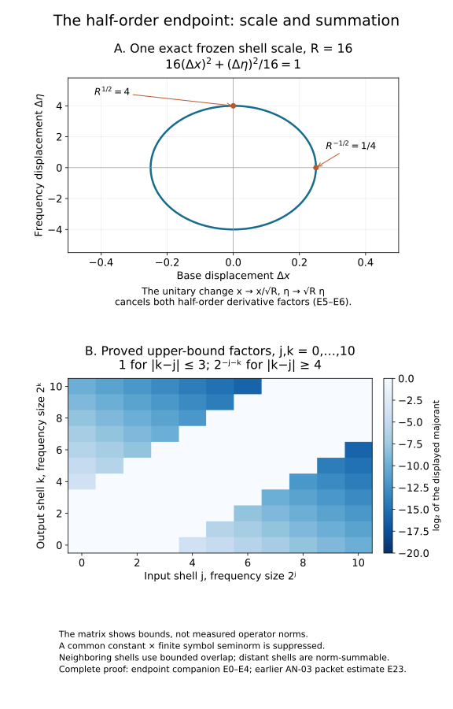

# The half-order endpoint from the existing packet estimate

This proof supplies the particular endpoint needed by the complex FIO lesson: a left symbol of type \((1/2,1/2)\), with compact support in its base variable, defines a bounded operator on \(L^2\). Its constants use only finitely many symbol derivatives and a fixed compact base support. It also applies to a fixed finite matrix of such symbols.

The earlier [complete AN-03 packet estimate E23–E27](../20261005-restored-airy-models/bounded-derivative-operators.md) supplies the bounded-derivative operator theorem and Schur's estimate. Its GFDL component and notices remain at that link. [Fourier L1–L3](../20261004-free-intrinsic-graph/prerequisites/fourier-l2.md) supplies Fourier inversion and Plancherel; [measure M0–M8](../20261004-free-intrinsic-graph/prerequisites/measure-and-l2.md) supplies integration, completeness and density. The cutoff construction is the earlier programme proof, bound in the accompanying proof map.

The general admissible-metric theorem in AN-03, *When a moving symbol scale controls an operator*, B26, gives a broader route, with B8a handling quantization changes. The present argument connects the particular endpoint directly to the complete packet proof already included in this course. It does not invoke the general moving-metric calculus or its quantization conversion.

## E0. Statement and fixed seminorms

Let \(K\subset\mathbb R^n\) be compact. Suppose \(a(x,\eta)\) is smooth, vanishes for \(x\notin K\), and
\[
 |\partial_x^\alpha\partial_\eta^\beta a(x,\eta)|
 \le p_l(a)\langle\eta\rangle^{(|\alpha|-|\beta|)/2},
 \qquad |\alpha|+|\beta|\le l.
 \tag{E1}
\]
Here \(p_l(a)\) is the maximum of the corresponding weighted suprema; the assumption holds for every \(l\). There are finite \(J\) and \(C_{n,K}\) such that
\[
 \|\operatorname{Op}_{L}(a)u\|_2
 \le C_{n,K}p_J(a)\|u\|_2,\qquad
 \operatorname{Op}_{L}(a)u(x)
 =(2\pi)^{-n}\int e^{ix\cdot\eta}a(x,\eta)\widehat u(\eta)\,d\eta.
 \tag{E2}
\]
Initially \(u\) is Schwartz. Since \(a\) is bounded and \(\widehat u\) is integrable, this integral is an ordinary bounded function supported in \(K\). The proof below gives the stated bound uniformly and hence its unique extension by density.

Choose a smooth radial \(\chi_0\), equal to one on \(|\eta|\le1\), zero on \(|\eta|\ge2\), and nonincreasing in the radius. For \(j\ge1\), put
\[
 R_j=2^j,\qquad
 \chi_j(\eta)=\chi_0(2^{-j}\eta)-\chi_0(2^{-(j-1)}\eta);
 \quad R_0=1.
 \tag{E3}
\]
Then \(\sum_{j\ge0}\chi_j=1\), \(0\le\chi_j\le1\), and
\(\operatorname{supp}\chi_j\subset E_j=\{2^{j-1}\le|\eta|\le2^{j+1}\}\) for \(j\ge1\); take \(E_0=\{|\eta|\le2\}\). At every frequency at most four sets \(E_j\) meet (boundaries cause no difficulty). Differentiating the scaled cutoff gives \(|\partial^\beta\chi_j|\le C_\beta R_j^{-|\beta|}\). Leibniz's rule therefore makes \(a_j=a\chi_j\) satisfy (E1) with \(\langle\eta\rangle\) replaced by \(R_j\), uniformly in \(j\), with each required constant bounded by a fixed \(p_l(a)\).

Let \(P_j\) be the Fourier multiplier by the indicator of \(E_j\). It is an \(L^2\) contraction by Plancherel, and
\[
 T_j=\operatorname{Op}_L(a_j)=T_jP_j,\qquad
 \sum_{j\ge0}\|P_ju\|_2^2\le4\|u\|_2^2.
 \tag{E4}
\]
Indicators here are only Hilbert-space projections; we never differentiate them as symbols.

## E1. Balanced dilation gives a uniform bound on each shell

Define the unitary dilation \(U_su(x)=s^{n/2}u(sx)\), \(s>0\). Its norm follows by change of variables. Fourier transformation gives \(\widehat{U_su}(\eta)=s^{-n/2}\widehat u(\eta/s)\). Substituting in the quantization formula yields exactly
\[
 U_s^{-1}\operatorname{Op}_L(a_j)U_s
 =\operatorname{Op}_L\bigl(a_j(x/s,s\eta)\bigr).
 \tag{E5}
\]
For \(s=R_j^{1/2}\), a mixed derivative of the symbol on the right has the factor \(s^{-|\alpha|+|\beta|}\), cancelling the factor \(R_j^{(|\alpha|-|\beta|)/2}\) in (E1). All derivatives through any fixed order are bounded uniformly in \(j\). The complete E23 packet estimate therefore gives
\[
 \|T_j\|\le C_np_{L_n}(a)
 \tag{E6}
\]
after increasing \(C_n\) for the fixed cutoffs. The dilated base support may grow with \(j\); E23 has no compact-support or support-volume hypothesis, so this does not affect its constant. This step alone does not justify summing infinitely many shells.

## E2. Off-diagonal output shells are summable

Use disjoint output shells
\[
 F_0=\{|\zeta|<2\},\qquad
 F_k=\{2^k\le|\zeta|<2^{k+1}\}\quad(k\ge1),
 \tag{E7}
\]
with Fourier projections \(Q_k\). They are mutually orthogonal and sum strongly to the identity: the squared norm of the omitted Fourier tail tends to zero by integrability of \(|\widehat u|^2\).

With unitary Fourier transforms on the input and output, the integral kernel of \(T_j\) in frequency variables is
\[
 \mathcal K_j(\zeta,\eta)
 =(2\pi)^{-n}\widehat{a_j}^{\,x}(\zeta-\eta,\eta).
 \tag{E8}
\]
This follows by Fubini for compact frequency inputs and then by the already proved bounded extension of \(T_j\). Superscript \(x\) denotes the unnormalized Fourier transform in \(x\) alone. Integration by parts with \((1-R_j^{-1}\Delta_x)^N\), using the fixed compact support \(K\), gives
\[
 |\mathcal K_j(\zeta,\eta)|
 \le C_{N,K}p_{2N}(a)
       \left(1+\frac{|\zeta-\eta|^2}{R_j}\right)^{-N}
       \mathbf1_{E_j}(\eta).
 \tag{E9}
\]
Indeed every term \(R_j^{-h}\partial_x^{2h}a_j\), \(h\le N\), is uniformly bounded; its \(L^1_x\) norm is bounded by the volume of a fixed box containing \(K\). Compact support removes boundary terms. This proves the full off-diagonal estimate rather than postulating almost orthogonality.

If \(|k-j|\ge4\), \(\zeta\in F_k\) and \(\eta\in E_j\), the triangle inequality gives
\[
 |\zeta-\eta|\ge c\max(R_j,R_k)
 \tag{E10}
\]
with a fixed \(c>0\), including \(j=0\) or \(k=0\). The respective frequency volumes are at most \(C_nR_k^n\) and \(C_nR_j^n\). Bounding the two marginals of (E8) by (E9) and applying Schur's estimate gives
\[
 \|Q_kT_j\|
 \le C_{N,n,K}p_{2N}(a)
 R_j^{N+n/2}R_k^{n/2}\max(R_j,R_k)^{-2N}.
 \tag{E11}
\]
Take the integer \(N=n+2\). If \(j\ge k\), the radial factor is at most \(R_j^{-N+n}=2^{-2j}\); if \(k\ge j\), it is at most \(R_k^{-N+n}=2^{-2k}\). In either case it is at most \(2^{-j-k}\). Thus
\[
 \sum_{\substack{j,k\ge0\\|k-j|\ge4}}\|Q_kT_j\|
 \le C_{n,K}p_{2n+4}(a)
       \sum_{j,k\ge0}2^{-j-k}<\infty .
 \tag{E12}
\]
The far-shell series consequently converges in operator norm. Completeness follows directly: operator-norm Cauchy sequences have limits on each vector in the complete target Hilbert space, and the common bound passes to the limit.

## E3. The neighboring shells converge strongly

For the remaining pairs, use (E4), (E6), and the orthogonality of the \(Q_k\). A finite partial sum obeys
\[
 \begin{aligned}
 \left\|\sum_{j\le M}\ \sum_{|k-j|\le3}Q_kT_ju\right\|_2^2
 &=\sum_k\left\|\sum_{\substack{j\le M\\|k-j|\le3}}
                   Q_kT_jP_ju\right\|_2^2\\
 &\le 7C_n^2p_{L_n}(a)^2
       \sum_k\sum_{\substack{j\le M\\|k-j|\le3}}\|P_ju\|_2^2\\
 &\le 196C_n^2p_{L_n}(a)^2\|u\|_2^2.
 \end{aligned}
 \tag{E13}
\]
The factor seven bounds the number of neighboring indices in either direction; the final factor four is the input overlap in (E4). The same estimate for a tail \(M<j\le M'\) is bounded by \(49C_n^2p_{L_n}(a)^2\sum_{j>M}\|P_ju\|_2^2\), which tends to zero. Thus the neighboring series converges strongly for every \(u\), with a uniform norm bound. No claim of operator-norm convergence of this neighboring series is needed.

For each finite set of \(j\), the full sum over \(k\) equals \(\sum_jT_j\), by the strong resolution \(\sum Q_k=I\). The far and neighboring estimates therefore bound \(\sum_{j\le M}T_j\) uniformly and prove strong convergence to a bounded operator \(T\). For Schwartz \(u\), the telescoping sum of cutoffs is \(\chi_0(2^{-M}\eta)\); it tends to one, is bounded by one, and the integrable majorant \(p_0(a)|\widehat u(\eta)|\) is independent of \(M\). Dominated convergence identifies the resulting integral with (E2), uniformly in \(x\). On the fixed compact \(K\) this is also \(L^2\) convergence. Hence \(T=\operatorname{Op}_L(a)\), proving (E2). One may take
\[
 J=\max(L_n,\,2n+4).
 \tag{E14}
\]
All constants depend only on the dimension, fixed cutoffs, and a fixed box containing the base support, together with the displayed finite seminorm. Taking matrix norms throughout gives the fixed finite-dimensional coefficient version.

The first panel gives the exact frozen scale used in (E5). The second displays the proved upper-bound factors from (E6) and (E12) for integer shells \(0,\ldots,10\), after suppressing one common constant and the finite symbol seminorm. It displays estimates, not measured operator norms. The complete infinite summation arguments are (E12)–(E13). The [drawing source](figures/draw_endpoint_shells.py) and [model data](figures/endpoint-shells-data.json) are reproducible; outlined glyphs retain their [DejaVu](figures/notices/LICENSE_DEJAVU.txt), [STIX](figures/notices/LICENSE_STIX.txt) and [BaKoMa](figures/notices/BAKOMA_SECTION.txt) notices.

## E4. The actual FIO amplitude and comparison with the metric notation

For the metric \(g=R|dx|^2+R^{-1}|d\eta|^2\), \(R=\langle\eta\rangle\), the class \(S(1,g)\) is precisely (E1). To see both directions, insert scaled coordinate vectors \(R^{-1/2}e_x\) and \(R^{1/2}e_\eta\) into each derivative tensor. Conversely expand arbitrary \(g\)-unit vectors in these scaled coordinates and bound the finite sum of coordinate derivatives. Each coordinate is bounded by one in that normalized basis. This proves equivalence at every fixed derivative order. Thus (E2) proves exactly the compact-base left-quantized metric bound needed here.

In the self-composition formula of the FIO lesson, the ordinary amplitude \(b(z,y,\eta)\) is compactly localized in \(z,y\). Extend its \(y\) dependence smoothly and periodically after a cutoff equal to one on the input patch. Its coefficients \(b_\ell(z,\eta)\) satisfy
\[
 |\partial_z^\alpha\partial_\eta^\beta b_\ell|
 \le C_{m,\alpha,\beta}\langle\ell\rangle^{-2m}
                   \langle\eta\rangle^{-|\beta|},
 \tag{E15}
\]
by integrating \((1-\Delta_y)^m b\) against the Fourier modes; the period merely changes fixed constants. Ordinary symbol estimates impose no positive frequency cost on these \(y\) derivatives. The full damping estimate in Section 10 of the FIO lesson makes \(a_\ell=e^{i\psi}b_\ell\) satisfy (E1), on a common compact \(z\) support, with \(p_J(a_\ell)\le C_m\langle\ell\rangle^{-2m}\). Angular and low-frequency cutoffs extend each local symbol to a global smooth symbol with these same estimates.

Applying (E2) and the unitary input modulation for each mode gives a norm-summable series when \(2m>n\). The elementary lattice bound follows by counting at most \(C_n2^{hn}\) integer points in a shell \(2^h\le|\ell|<2^{h+1}\), so the sum is bounded by a geometric series \(\sum_h C_n2^{h(n-2m)}\). Fourier reconstruction and the cutoff limit identify its kernel with the original two-base amplitude. This proves the endpoint step for the actual \(A^*A\) kernel, with a finite number of controlled derivatives, without a formal decreasing-order expansion.

The Gaussian and quartic examples in the FIO lesson belong to this class after the stated cutoffs. The metric has Planck function one, so no strict uncertainty or strictly positive imaginary Hessian has entered this argument. These facts concern the required endpoint estimate, not general noncompact uniform FIO bounds or arbitrary moving metrics.

Original bridge: GPT-6 Astra (OpenAI), Ultra, 5 October 2026, CC0. The E23 proof is reused by reference to the exact earlier programme component, with its original credit and licence retained.
