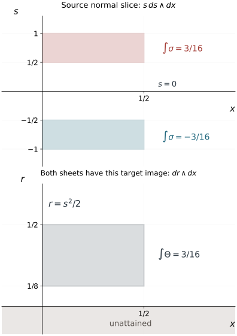

# Folded forms and symplectic target coordinates

A fold loses one projection direction. The pulled-back symplectic form consequently loses two directions on the critical hypersurface, while its restriction to that hypersurface loses only one. Keeping those two radicals distinct is essential. This lesson proves the full ordinary and homogeneous normal forms for a closed two-form with a simple fold, includes a symmetry-preserving version for one sheet exchange, and constructs symplectic coordinates on the target of an actual folding map.

The primary source is the reprint of Hörmander III, corrected second printing (1994), Theorems 21.1.7 and 21.1.10, Theorem 21.4.2 and its converse, and Theorems 21.4.3 and 21.4.9: printed pages 274–277, 282, 305–307 and 315; PDF pages 289–292, 297, 320–322 and 330 in this exact edition. Our proof of the folded-form theorems uses a relative Moser construction, with its primitive, inverse bounds and symmetry properties proved below.

We use \(\omega=d\xi\wedge dx\), \(\iota_{H_a}\omega=-da\), and \(\{a,b\}=H_ab\). [Phase space and generating families](../20261005-restored-phase-space/phase-space-and-generating-families.md) proves ordinary Darboux and Hamiltonian identities. [Corank geometry and sufficient continuity](../20261005-restored-corank-continuity/corank-geometry-and-sufficient-continuity.md) proves homogeneous Darboux. [Homogeneous submanifold normal forms](../20261005-restored-submanifolds/homogeneous-submanifold-normal-forms.md), Lemma 2.1, proves a function-preserving homogeneous canonical pair. [Folds, reflections and uniform smooth descent](../20261005-restored-smooth-descent/folds-reflections-and-uniform-descent.md) proves fold coordinates, the sheet exchange and controlled smooth descent. The simultaneous theorem for two involutions is not used to prove the single-involution results here.

The [proof map](proof-map.json) binds every result and exercise to current programme proofs. The [flow, bundle and leaf companion F0–F2](../20261005-restored-submanifolds/flows-constant-rank-and-leaves.md) supplies smooth kernel bundles, transverse collars and commuting-flow coordinates. The [form and flow companion F0–F4](../20261005-restored-phase-space/differential-forms-and-flow-pullbacks.md) proves exterior calculus, pullback differentiation, the radial homotopy and existence on a common full time interval. We use the precise equivariant-cone definition and the transverse-slice product proved in [Simultaneous reflections, §6](../20261005-restored-simultaneous-reflections/simultaneous-reflections-and-flat-corrections.md); no two-involution theorem is needed for the form normalization.

## 1. The two rank conditions describe different tangent spaces

Let \(\sigma\) be a smooth closed two-form on a manifold \(M\) of dimension \(2n\). In a neighborhood of \(c\), suppose
\[
\sigma^n=m\mu,\qquad m(c)=0,\quad dm(c)\ne0,
\tag{1.1}
\]
where \(\mu\) is a nowhere-zero \(2n\)-form. Set \(\Gamma=\{m=0\}\). Changing \(\mu\) multiplies \(m\) by a nonvanishing smooth factor, so the simple-zero condition is intrinsic. We also require
\[
\left.(\sigma^{n-1})\right|_{T_c\Gamma}\ne0.
\tag{1.2}
\]
For \(n=1\), the zeroth exterior power is the constant one, so this condition is automatic.

For the linear algebra behind the rank statements, an alternating form is either zero or has vectors \(e,f\) with pairing one. The projection \(v\mapsto v-\sigma(v,f)e+\sigma(v,e)f\) lands in the orthogonal complement of their plane and splits off that nondegenerate plane. Repeat on the complement. After \(k\) steps the remaining form is zero, the rank is \(2k\), its \(k\)-th exterior power is a nonzero product of the \(k\) plane forms, and its next power is zero. The finite wedge expansion proves the last assertions, including the factor \(k!\). This argument applies to both the ambient tangent and its hypersurface tangent, even when their dimensions differ.

Shrink the neighborhood so \(dm\ne0\) and (1.2) holds along \(\Gamma\). The restricted form \(\sigma_\Gamma\) then has rank \(2n-2\). Its radical
\[
K=\ker(\sigma_\Gamma:T\Gamma\longrightarrow T^*\Gamma)
\tag{1.3}
\]
is a smooth line bundle. Smoothness follows from the explicit constant-rank kernel construction in companion F2; the same argument applies to the ambient radical below. The ambient form at \(\Gamma\) also has rank \(2n-2\): it has at least that rank by restriction, and cannot have rank \(2n\) because \(\sigma^n=0\). Its radical \(E=\ker\sigma|_\Gamma\) has dimension two, and
\[
E\cap T\Gamma=K.
\tag{1.4}
\]
Indeed the intersection has dimension at least one, is contained in \(K\), and \(K\) has dimension one. In particular \(E\) has a direction transverse to \(\Gamma\). The form is nondegenerate off \(\Gamma\) in this smaller neighborhood.

The condition on the restricted rank does not follow just from the simple zero in (1.1). Exercise 9.2 gives a closed counterexample. It prevents the entire ambient radical from being tangent to the critical hypersurface.

## 2. Choose a characteristic coordinate and a kernel collar

Choose a nonzero local field \(Z\) spanning \(K\) on \(\Gamma\). Its local flow gives coordinates \((x_1,z)\) there with \(Z=\partial_{x_1}\). Since
\[
\iota_Z\sigma_\Gamma=0,\qquad d\sigma_\Gamma=0,
\]
Cartan's formula gives \(\mathcal L_Z\sigma_\Gamma=0\). Thus the form has no \(dx_1\) component and its remaining coefficients are independent of \(x_1\). Its restriction to the transverse section \(x_1=0\) is symplectic. Ordinary Darboux on that section, followed by extension constant along \(Z\), gives
\[
\sigma_\Gamma=\sum_{j=2}^n d\xi_j\wedge dx_j.
\tag{2.1}
\]
All these coordinates can be centered at \(c\). For \(n=1\) the sum and the transverse section are empty, and \(x_1\) is just a coordinate on \(\Gamma\).

Choose a smooth section \(V\) of \(E\) transverse to \(\Gamma\), and extend it smoothly to a full neighborhood. Such a section exists by the smooth kernel frame: choose a linear combination transverse at \(c\), and retain transversality after shrinking. In an ordinary hypersurface chart, extend its coefficients constantly in the transverse variable. The smooth-flow theorem and the transverse-chart proof in companion F0 then justify the actual collar. Its flow
\[
(z,s)\longmapsto \exp(sV)z,\qquad z\in\Gamma,
\tag{2.2}
\]
is a local diffeomorphism by transversality. Extend the coordinates in (2.1) constantly along this collar. At \(s=0\), the vector \(\partial_s\) is in the ambient radical. Therefore, as a form on the full tangent space there,
\[
\sigma\big|_{s=0}=\sigma_{\mathrm{sp}},
\qquad
\sigma_{\mathrm{sp}}=\sum_{j=2}^n d\xi_j\wedge dx_j.
\tag{2.3}
\]
This matches the ambient form, not just its tangential restriction.

Suppose in addition that a smooth involution \(i\) fixes exactly \(\Gamma\) and preserves \(\sigma\). Its minus-one line \(L_i\) is transverse to \(\Gamma\). For \(v\in L_i\) and \(w\in T\Gamma\),
\[
\sigma(v,w)=\sigma(di\,v,di\,w)=-\sigma(v,w)=0.
\]
Since \(v\) together with \(T\Gamma\) spans \(TM\), it follows that \(L_i\subset E\). We may choose \(V\) in this line on \(\Gamma\). Replace its extension by the antisymmetric average \((V-i_*V)/2\); it still has the required nonzero values on \(\Gamma\), and \(i_*V=-V\). The flow collar then satisfies
\[
i(z,s)=(z,-s).
\tag{2.4}
\]
The tangential coordinates are even and the normal coordinate odd under the involution.

## 3. Normalize the first jet and remove the full remainder

**Theorem 3.1 (ordinary folded Darboux).** Under (1.1)–(1.2), there are local coordinates \((x,\xi)\), centered at \(c\), in which
\[
\sigma=\xi_1\,d\xi_1\wedge dx_1+
                 \sum_{j=2}^n d\xi_j\wedge dx_j.
\tag{3.1}
\]
If an involution \(i\) preserves \(\sigma\) and has fixed set \(\Gamma\), the coordinates can be chosen so that it fixes every coordinate except \(\xi_1\), whose sign it changes.

**Proof.** In the collar from Section 2, the difference from \(\sigma_{\mathrm{sp}}\) is divisible by \(s\). Write it \(s\theta\). Closedness, evaluated at \(s=0\), gives
\[
ds\wedge\theta|_{s=0}=0.
\]
Consequently the purely tangential part of \(\theta|_{s=0}\) is zero. For a tangential one-form \(\alpha\) on \(\Gamma\), extended independently of \(s\), we have
\[
\sigma=\sigma_{\mathrm{sp}}+s\,ds\wedge\alpha+O(s^2),
\quad
\alpha=A\,dx_1+\sum_{j=2}^n(a_jdx_j+b_jd\xi_j).
\tag{3.2}
\]
Here \(O(s^2)\) means a smooth two-form all of whose coefficients are divisible by \(s^2\).

The first coefficient of the top exterior power is
\[
\sigma^n=n!sA\,ds\wedge dx_1\wedge
                     \bigwedge_{j=2}^n(d\xi_j\wedge dx_j)+O(s^2).
\tag{3.3}
\]
The simple-zero hypothesis forces \(A(c)\ne0\). Change the sign of \(x_1\), if necessary, and shrink so \(A>0\) on \(\Gamma\).

For \(j\ge2\), introduce
\[
\widetilde\xi_j=\xi_j+a_js^2/2,\qquad
\widetilde x_j=x_j-b_js^2/2.
\tag{3.4}
\]
Their differential on \(\Gamma\) is the identity. Expanding gives
\[
\sum_{j=2}^n d\widetilde\xi_j\wedge d\widetilde x_j
=\sigma_{\mathrm{sp}}+
 s\,ds\wedge\sum_{j=2}^n(a_jdx_j+b_jd\xi_j)+O(s^2).
\]
Also set \(\tau=s\sqrt A\), with \(A\) extended from \(\Gamma\). Then
\[
\tau\,d\tau\wedge dx_1
=sA\,ds\wedge dx_1+\tfrac12s^2dA\wedge dx_1.
\]
These changes are local diffeomorphisms. After relabeling their coordinates and writing the normal variable as \(s\) again, they give
\[
\sigma=\sigma_0+\Delta,\qquad
\sigma_0=s\,ds\wedge dx_1+\sigma_{\mathrm{sp}},
\qquad \Delta=O(s^2).
\tag{3.5}
\]
Both forms are closed. Every change made so far commutes with (2.4), when that symmetry is present.

We produce a relative primitive with one extra order of vanishing. Write
\[
\Delta=ds\wedge a(y,s)+b(y,s),
\]
where \(y=(x,\xi_2,\ldots,\xi_n)\), and \(a,b\) are tangential forms. Closedness says
\[
\partial_s b=d_y a,\qquad d_y b=0.
\]
Since \(\Delta|_{s=0}=0\), also \(b(y,0)=0\). Define
\[
\beta(y,s)=\int_0^s a(y,u)\,du.
\tag{3.6}
\]
Then \(d\beta=\Delta\), by the displayed relations, and \(\beta=O(s^3)\) since \(a=O(s^2)\). This is a smooth identity across \(s=0\), for positive and negative \(s\).

Let \(\sigma_t=\sigma_0+t\Delta\), \(0\le t\le1\). Off \(\Gamma\), the inverse coefficient matrix of \(\sigma_0\) has only a simple \(1/s\) singularity. Multiplying it by the coefficient matrix of \(\Delta=O(s^2)\) gives a smooth matrix \(B=O(s)\). In matrix notation, after the consistent choice of the contraction map,
\[
\sigma_t=\sigma_0(I+tB),\qquad
\sigma_t^{-1}=(I+tB)^{-1}\sigma_0^{-1}.
\tag{3.7}
\]
On a sufficiently small neighborhood \(I+tB\) is invertible uniformly for \(0\le t\le1\). In detail, write \(\Delta=s^2\Delta_2\). The model inverse has the form \(s^{-1}M_{-1}+M_0\), where the matrices \(M_{-1},M_0\) are smooth (in these coordinates they are constant). Thus \(B=sM_{-1}\Delta_2+s^2M_0\Delta_2\) is genuinely smooth and divisible by \(s\). On a smaller compact coordinate box its norm is less than \(1/2\). Then \((I+tB)v=0\) implies \(|v|\leq|v|/2\), hence \(v=0\); finite-dimensional injectivity gives invertibility. The cofactor formula gives a smooth inverse jointly in \(t\) and the coordinates, including \(s=0\). Thus \(\sigma_t\) is nondegenerate for \(s\ne0\), with an inverse having at most the same simple singularity.

Define \(W_t\) off \(\Gamma\) by
\[
\iota_{W_t}\sigma_t=-\beta.
\tag{3.8}
\]
Equations (3.6)–(3.7) show that \(W_t\) extends smoothly and is \(O(s^2)\). Indeed \(\beta=s^3\beta_3\) with smooth \(\beta_3\), by the change \(u=sv\) in (3.6) and compact-parameter integration. Before multiplication by the smooth inverse \( (I+tB)^{-1}\), applying the model inverse to \(\beta\) gives \(s^2M_{-1}\beta_3+s^3M_0\beta_3\). Every coefficient therefore has a smooth factor \(s^2\); this proves smoothness of all derivatives, rather than just boundedness of the vector field. This supplies the needed smooth field even where \(\sigma_t\) is degenerate. Its extension is zero on \(\Gamma\), with zero first differential there. The common-time flow argument in companion F4 applies because \(W_t(c)=0\) for all \(t\): the constant solution through \(c\), openness of the smooth solution domain, and a finite cover of \([0,1]\) give one initial neighborhood with flow \(\phi_t\) throughout the interval. Every point of \(\Gamma\) is fixed by uniqueness. At those points the variational equation is \(\partial_tD\phi_t=DW_t\,D\phi_t=0\), with initial matrix \(I\); hence the flow fixes \(\Gamma\) to first order. By closedness and (3.8),
\[
\frac{d}{dt}\phi_t^*\sigma_t
=\phi_t^*(\Delta+d\iota_{W_t}\sigma_t)=0.
\tag{3.9}
\]
The identities extend to \(\Gamma\) by smoothness. Therefore \(\phi_1^*\sigma=\sigma_0\). Coordinates transported by the inverse of \(\phi_1\) give (3.1).

For the involution assertion, use its collar (2.4). The fiber contraction \(H_u(y,s)=(y,us)\) commutes with \(i\), as does the field \(s\partial_s\). The primitive in (3.6) can equivalently be written
\[
\beta=\int_0^1 H_u^*(\iota_{s\partial_s}\Delta)\,\frac{du}{u}.
\tag{3.10}
\]
The integrand in (3.10) equals \(s\,a(y,us)\), so its apparent division by \(u\) extends smoothly at \(u=0\); because \(a=O(s^2)\), it is \(O(s^3u^2)\). Compact-parameter differentiation is therefore legitimate. The pullback and contraction identities now prove that \(\beta\) is invariant under \(i\). Both \(\sigma_t\) and \(\beta\) are invariant, so the uniquely solved field \(W_t\) off \(\Gamma\) is equivariant under \(i\); its smooth extension is equivariant as well. Its flow commutes with \(i\). The final coordinates therefore retain exactly the reflection (2.4). \(\square\)

The order \(O(s^2)\) of the form remainder and the order \(O(s^3)\) of its relative primitive are sufficient. A pointwise inverse of the folded form alone is singular; the extra vanishing of the primitive is what makes the actual Moser field smooth.

## 4. The homogeneous theorem and the half-degree coordinate

Assume now that \(M\) is conic, with a nonzero radial field \(R\), and
\[
D_\kappa^*\sigma=\kappa\sigma,\qquad \kappa>0.
\tag{4.1}
\]
The critical hypersurface is conic. Its restricted radical \(K\) is preserved by dilation. In addition to (1.1)–(1.2), require
\[
R_c\notin K_c.
\tag{4.2}
\]
Equivalently the one-form \(\lambda=\iota_R\sigma\), restricted to \(T_c\Gamma\), is nonzero.

**Theorem 4.1 (homogeneous folded Darboux).** Under these hypotheses, \(n\ge2\). There are coordinates in a conic neighborhood of the marked ray such that (3.1) holds, \(x_j\) have degree zero, \(\xi_1\) has degree \(1/2\), and \(\xi_j\), \(j\ge2\), have degree one. Their marked values can be chosen
\[
x(c)=0,\qquad \xi(c)=(0,\ldots,0,1).
\tag{4.3}
\]
If a homogeneous involution preserves the form and fixes \(\Gamma\), it changes exactly the sign of \(\xi_1\) in these coordinates.

**Proof.** We carry out every part of Theorem 3.1 equivariantly. First choose a field \(Z\) spanning \(K\) with \([R,Z]=0\). To obtain it, choose a nonzero section on a transverse radial slice and extend by dilation pushforward. Condition (4.2) makes \(R,Z\) independent. Their joint local flows, proved to commute and give coordinates in companion F1, give a function \(x_1\) with
\[
Rx_1=0,\qquad Zx_1=1,\qquad x_1(c)=0.
\]
The conic section \(\Gamma_1=\{x_1=0\}\subset\Gamma\) is transverse to \(K\), so its restricted form is symplectic and homogeneous of degree one. The radial field is tangent and nonzero on it. Homogeneous Darboux on \(\Gamma_1\) gives \(x_j\) of degree zero and \(\xi_j\) of degree one for \(j\ge2\), with the marked values in (4.3). Extend these functions constant along the \(Z\) flow. Commutativity with \(R\) preserves their degrees. This proves (2.1) homogeneously. The nonzero radial field in this symplectic section also shows that its dimension \(2n-2\) is positive, so \(n\ge2\).

Next choose the transverse ambient-kernel field on \(\Gamma\) with
\[
[R,V]=-\tfrac12V.
\tag{4.4}
\]
On a radial slice, choose any transverse section of \(E\), and at a dilated point define it as \(\kappa^{-1/2}\) times the dilation pushforward. Extend it to a neighborhood with the same rule. This can be done without assuming a globally chosen section: use an equivariant cone chart, extend the section smoothly off \(\Gamma\) on a transverse radial slice, and then use its unique positive-dilation product. Differentiating its defining weight gives (4.4). The pushforward form of that identity is \(D_{\kappa*}V=\kappa^{1/2}V\), which yields (4.5) by uniqueness of integral curves. If an involution is present, the antisymmetric average used in Section 2 preserves this weight, because the involution commutes with dilation.

The collar (2.2) is equivariant:
\[
D_\kappa\exp(sV)z=\exp(\kappa^{1/2}sV)D_\kappa z.
\tag{4.5}
\]
Its normal coordinate has degree \(1/2\), while its tangential coordinates retain the degrees already assigned. In (3.2), the form \(s\,ds\) has degree one. Hence \(\alpha\) has degree zero; its coefficients \(A,a_j\) have degree zero and \(b_j\) have degree minus one. These assertions also follow by taking the leading normal coefficient of the homogeneous form. Thus the changes (3.4) preserve the degree-one \(\xi_j\) and degree-zero \(x_j\), and \(s\sqrt A\) still has degree \(1/2\). They preserve the stated marked values and any reflection parity.

The model \(\sigma_0\), the remainder \(\Delta\), and every \(\sigma_t\) now have degree one. The fiber contraction \(H_u\) in (3.10) commutes with dilation, and \(s\partial_s\) is invariant. Consequently \(\beta\) has degree one. Applying a dilation to (3.8), both sides acquire the same factor, so uniqueness off \(\Gamma\) gives
\[
(D_\kappa)_*W_t=W_t.
\]
The smooth extension has the same property. Its flow commutes with dilation; it therefore retains all the coordinate degrees. The same argument for the involution retains its exact sign change. For the time-one map on a conic neighborhood, first choose the common initial neighborhood around a compact smaller radial slice, using the smooth-flow result just proved. Extend the flow by dilation equivariance along its positive saturation. Uniqueness makes these extensions agree with the original local flows wherever both are defined, and the unique slice product prevents ambiguity along the ray. Thus the inverse-flow coordinates exist on the stated conic neighborhood and complete the proof. \(\square\)

In these coordinates,
\[
R=\tfrac12\xi_1\partial_{\xi_1}
                   +\sum_{j=2}^n\xi_j\partial_{\xi_j},
\qquad
\lambda=\tfrac12\xi_1^2dx_1+\sum_{j=2}^n\xi_jdx_j.
\tag{4.6}
\]
The factor \(1/2\) comes from the degree of the normal coordinate. On \(\Gamma\), its characteristic line is \(\mathbb R\partial_{x_1}\), its ambient radical is \(\mathbb R\partial_{x_1}+\mathbb R\partial_{\xi_1}\), and \(\lambda|_{T\Gamma}\ne0\) at the marked point because \(\xi_n=1\).

## 5. Symplectic coordinates on the target of a fold

We first record the function-preserving ordinary Darboux step.

**Lemma 5.1 (keep a defining momentum).** In a symplectic manifold, if \(dr(c)\ne0\), \(r(c)=0\), one can choose symplectic coordinates centered at \(c\) with \(\xi_1=r\).

**Proof.** The field \(H_r\) is nonzero. Its flow gives a function \(q\), zero at \(c\), with \(H_rq=1\). The Hamiltonian fields \(H_r,H_q\) commute because \(\{r,q\}=1\). Their plane is symplectic; its orthogonal is the tangent of the symplectic section \(\Sigma=\{q=r=0\}\). For \(z\in\Sigma\), the actual map
\[
(q,p,z)\longmapsto \exp(qH_r)\exp(-pH_q)z
\tag{5.1}
\]
has \(q\) and \(r=p\) as its parameter values. Its differential is invertible, and its pulled-back form is \(dp\wedge dq+\omega_\Sigma\): the two parameter vectors are \(H_r,-H_q\), and the section directions annihilate \(dr,dq\). Ordinary Darboux on \(\Sigma\) gives the remaining pairs. This keeps \(\xi_1=r\) exactly. \(\square\)

**Theorem 5.2 (a fold over a symplectic target, with converse).** Let \(F:T\to M\) be a smooth fold at \(a\), where both manifolds have dimension \(2n\) and \(M\) is symplectic. There are local symplectic target coordinates \((x,\xi)\), centered at \(F(a)\), and source coordinates \((y,\eta)\), centered at \(a\), in which
\[
F(y,\eta)=(x=y,\ \xi_1=\eta_1^2/2,\
                         \xi_j=\eta_j\ (j\ge2)).
\tag{5.2}
\]
Consequently
\[
F^*\omega=\eta_1d\eta_1\wedge dy_1+
                         \sum_{j=2}^n d\eta_j\wedge dy_j.
\tag{5.3}
\]
Conversely, suppose source coordinates have the parity of this model under the fold involution and (5.3) holds. There are symplectic target coordinates on a full neighborhood for which (5.2) holds with those source coordinates.

**Proof.** Ordinary fold coordinates supply \(F(w,s)=(w,s^2/2)\). Let \(r\) be the last target coordinate. By Lemma 5.1 choose a symplectic chart with \(\xi_1=r\). Set \(y_j=F^*x_j\), \(\eta_j=F^*\xi_j\) for \(j\ge2\), and \(\eta_1=s\). At a source critical point, \(dF\) maps the tangent of \(s=0\) isomorphically onto the tangent of \(r=0\). In the target chart the functions \((x,\xi_2,\ldots,\xi_n)\) are coordinates on \(r=0\). Their pullbacks give all tangential source coordinates, while \(s\) supplies the transverse coordinate. The differential is invertible. Equations (5.2)–(5.3) follow.

For the converse, smooth invariant descent supplies target functions \(q_j,p_j\) with
\[
F^*q_j=y_j,\quad F^*p_j=\eta_j\ (j\ge2),
\qquad F^*p_1=\eta_1^2/2.
\tag{5.4}
\]
On the interior of the attained side, \(F\) is a local diffeomorphism on either sheet. Equation (5.3) therefore implies
\[
\omega=\sum_j dp_j\wedge dq_j
\tag{5.5}
\]
there. By smoothness it also holds at the critical image. Its nondegeneracy proves that the differentials of \(p,q\) are independent there, so these functions give a full target chart. The attained side is \(p_1\ge0\), after shrinking: its boundary is the critical image, and \(F^*p_1\) is the positive square in (5.4).

The arbitrary descended extensions need not be symplectic for \(p_1<0\). Use the actual field \(H_{q_1}\) of the target form. On \(p_1\ge0\), (5.5) gives
\[
H_{q_1}q_j=0,\qquad H_{q_1}p_j=-\delta_{1j}.
\tag{5.6}
\]
In particular this field is transverse to the boundary. Its flow from a boundary point \(z\) provides a full local collar. Define
\[
x_j(\exp(\tau H_{q_1})z)=q_j(z),\quad
\xi_1(\exp(\tau H_{q_1})z)=-\tau,\quad
\xi_j(\exp(\tau H_{q_1})z)=p_j(z)\ (j\ge2).
\tag{5.7}
\]
These functions agree with \(q,p\) on the attained side by uniqueness of the equations (5.6). They form coordinates: the initial boundary functions give its \(2n-1\) coordinates, and the transverse time gives the last one. Also \(x_1=q_1\) on the full collar, because \(H_{q_1}q_1=0\).

The new and old coordinate functions have equal full first derivatives at the boundary. Their restrictions there agree, so all tangent derivatives agree. Their \(H_{q_1}\) derivatives agree by (5.6)–(5.7); transversality supplies the remaining derivative direction. Therefore their bracket values at the boundary really are the canonical constants from (5.5), including brackets that involve normal derivatives.

All their canonical brackets propagate from the boundary. For example, the Hamiltonian derivation identity gives
\[
H_{q_1}\{\xi_j,x_k\}
=\{H_{q_1}\xi_j,x_k\}+\{\xi_j,H_{q_1}x_k\}=0.
\]
The other bracket families have the same zero derivative. Their boundary values are the canonical constants by (5.5), so those constants hold everywhere in the collar. The chart (5.7) is symplectic on the full neighborhood and still satisfies (5.2). \(\square\)

## 6. Homogeneous descent and the full target extension

**Lemma 6.1 (homogeneous invariant descent).** Suppose a folding map \(F\) commutes with the positive dilation actions on source and target, whose radial fields are nonzero. A smooth function \(a\) of degree \(\gamma\), invariant under the fold involution, has a smooth descended extension of degree \(\gamma\) to a full target conic neighborhood.

**Proof.** An equivariant cone chart supplies a positive degree-one target function \(\rho\): choose a linear functional positive at the marked vector and restrict to its positive subcone. The positive-radius and transverse-slice product construction from the simultaneous-reflection lesson applies to both source and target. Its pullback is positive, degree one and invariant under the fold involution. The map restricts from \(\{F^*\rho=1\}\) to \(\{\rho=1\}\). Both hypersurfaces are transverse to their radial fields, and the radial fields are mapped to one another. The restriction is still a fold. Indeed its kernel is the original fold kernel, which annihilates \(F^*\rho\); its differential loses exactly one rank between the two slices. The full target radial direction lies in the image of \(dF\) and complements the target slice, so its slice cokernel maps isomorphically to the full cokernel. Curves tangent to the kernel can be taken in the source slice. Changing their acceleration contributes a term in the image of \(dF\), so under that cokernel identification the nonzero kernel-to-cokernel Hessian is retained.

On the source slice, descend \(a/(F^*\rho)^\gamma\) by the full smooth invariant descent theorem. Extend the resulting degree-zero function constantly along target rays, then multiply it by \(\rho^\gamma\). The result is smooth, has the prescribed degree, and pulls back to \(a\). The normalized source and target points are related by \(F\): homogeneity gives \(F(D_{1/(F^*\rho)}y)=D_{1/\rho(Fy)}F(y)\). Thus the equality first proved on the two slices extends exactly along each ray, including every mixed derivative by smoothness of the product charts. Its values on the unattained side are an extension choice. \(\square\)

Suppose the source coordinates in the converse of Theorem 5.2 have degrees
\[
\deg y_j=0,\qquad \deg\eta_1=1/2,\qquad
\deg\eta_j=1\ (j\ge2),
\tag{6.1}
\]
and \(F,\omega\) are homogeneous, with \(\omega\) of degree one. Lemma 6.1 lets us choose \(q_j\) of degree zero and \(p_j\) of degree one in (5.4). The full symplectic extension (5.7) is homogeneous.

To verify the last assertion, \([R,H_{q_1}]=-H_{q_1}\), since \(q_1\) has degree zero and \(\omega\) degree one. Thus
\[
D_\kappa\exp(\tau H_{q_1})z
=\exp(\kappa\tau H_{q_1})D_\kappa z.
\tag{6.2}
\]
The boundary is conic; its \(q_j\) values are invariant under dilation and its \(p_j\) values scale by \(\kappa\). Equation (5.7) consequently gives \(x_j\) degree zero and \(\xi_j\) degree one on the full collar. This verifies the extension on the negative side as well.

For a homogeneous fold the sheet exchange itself is homogeneous. Indeed \(D_\kappa^{-1}iD_\kappa\) is a nonidentity local map preserving \(F\); uniqueness of the fold involution makes it equal to \(i\) wherever both germs are defined. This justifies the invariant radial slices and homogeneous parity extensions used next.

There is a homogeneous forward version too. Suppose \(F\) is a homogeneous fold over a conic symplectic target and the radial field of the target is outside the characteristic line of the critical image. Choose a degree-one defining function \(r\) for that image, positive on the attained side: take a defining function on a radial slice and multiply its degree-zero extension by a positive degree-one function. The field \(H_r\) spans the characteristic line of \(r=0\). The stated radial exclusion therefore makes \(H_r,R\) independent. The function-preserving homogeneous pair from Lemma 2.1 of the submanifold lesson gives a homogeneous symplectic chart with \(\xi_1=r\). Its hypotheses are exactly \(r=0\), \(dr\ne0\), degree one, and independence of \(R,H_r\) at the marked point. The pair proof constructs the conic symplectic residual slice and retains a nonzero radial vector there; homogeneous Darboux on that slice supplies the remaining pairs. Thus the zero value of this prescribed momentum does not remove the nonzero radial direction needed for the remaining homogeneous chart.

On a source radial slice, the pulled-back function \(F^*r\) has a positive quadratic zero in its transverse fold variable. Choose an invariant radial slice and an odd, degree-zero defining variable \(s_0\) for the fold hypersurface. Such a slice comes from the even positive function \(F^*\rho\), and the single-involution reflection theorem on it. Taylor division gives
\[
F^*r=s_0^2 A,\qquad A>0,\quad \deg A=1.
\]
Invariance makes \(A\) even in \(s_0\). Set \(\eta_1=s_0\sqrt{2A}\). This is a smooth odd coordinate of degree \(1/2\). With \(y_j=F^*x_j\) and \(\eta_j=F^*\xi_j\) for \(j\ge2\), the same tangential-plus-transverse differential argument as in Theorem 5.2 proves (5.2) with exactly the degrees (6.1). The target radial exclusion is equivalent to the source radial exclusion for the restricted pulled-back form, since \(F\) maps the critical hypersurfaces diffeomorphically.

## 7. Closed two-forms also descend through the sheet quotient

The preceding theorems give one route to the normal form. The quotient route explains directly why extending coefficients is not by itself enough to obtain a symplectic form on a full target.

**Proposition 7.1 (closed symplectic quotient extension).** Under the hypotheses of Theorem 3.1 with one involution, choose reflection coordinates \((w,s)\), and put
\[
Q(w,s)=(w,r=s^2/2).
\tag{7.1}
\]
On \(r\ge0\) there is a smooth closed two-form \(\Theta\), nondegenerate near the marked boundary point, such that \(Q^*\Theta=\sigma\). It has a closed nondegenerate extension to a full target neighborhood. In the homogeneous setting of Theorem 4.1 the quotient and its extension can be chosen homogeneous, with the squared normal target coordinate of degree one.

**Proof.** Write
\[
\sigma=\sum_{j<k}a_{jk}(w,s)\,dw_j\wedge dw_k
                    +\sum_j b_j(w,s)\,ds\wedge dw_j.
\]
Invariance under \(s\mapsto-s\) makes \(a_{jk}\) even and \(b_j\) odd. Smooth odd division gives \(b_j=s c_j\) with \(c_j\) even. Smooth square descent gives
\[
a_{jk}=A_{jk}(w,s^2/2),\qquad c_j=C_j(w,s^2/2).
\]
The factor \(1/2\) in the square is accommodated by the smooth rescaling of the descended variable. Thus
\[
\Theta=\sum_{j<k}A_{jk}\,dw_j\wedge dw_k+
                      \sum_j C_j\,dr\wedge dw_j
\tag{7.2}
\]
has the required pullback. It is closed for \(r>0\), since \(Q\) is locally invertible on each sheet there; smoothness gives closedness at \(r=0\). The top-form pullback multiplies its coordinate coefficient by the Jacobian \(s\). The simple-zero hypothesis on \(\sigma^n\) therefore says precisely that the top coefficient of \(\Theta^n\) is nonzero at \(r=0\). This proves nondegeneracy.

For the ordinary extension, work on a small star-shaped half-neighborhood centered at the boundary point. The radial homotopy primitive is
\[
\alpha_v(h)=\int_0^1 u\,\Theta_{uv}(v,h)\,du.
\tag{7.3}
\]
The homotopy identity for a closed two-form gives \(d\alpha=\Theta\) on the closed half-neighborhood. The earlier homotopy proof applies on interior radial segments from \(u=\varepsilon\) to \(1\). Letting \(\varepsilon\downarrow0\), smoothness up to the boundary makes the discarded pullback of the two-form tend to zero and permits every derivative under the compact integral. The resulting identity extends to the boundary by continuity. This verifies the half-neighborhood version without assuming an already closed extension on its other side. It can also be verified by differentiating (7.3); the pullback of a two-form to the center point is zero. Extend each coefficient of \(\alpha\) smoothly across \(r=0\) using the controlled half-line extension. Then \(d\widehat\alpha\) is closed, agrees with \(\Theta\) on \(r\ge0\), and is nondegenerate on a smaller full neighborhood by its nondegenerate value at the boundary.

For the homogeneous assertion, reflection coordinates with a half-degree odd variable can be obtained before this descent. Choose a positive even degree-one function \(\rho\) by averaging such a positive function under the involution. On its invariant level set \(\rho=1\), choose even tangential and odd normal coordinates by the single-involution theorem. Extend them as degree-zero functions along rays. Multiply the odd variable by \(\sqrt\rho\); if desired multiply the even degree-zero variables by \(\rho\). This gives equivariant quotient coordinates with \(r\) of degree one and a nonzero induced target radial field \(\widehat R\).

The descended form has degree one on \(r\ge0\), because its pullback does and \(Q\) is invertible on either open sheet. Use the homogeneous primitive
\[
\alpha=\iota_{\widehat R}\Theta,\qquad d\alpha=\Theta,
\tag{7.4}
\]
by Cartan's formula. In normalized target coordinates \((u,v=r/\rho,\rho)\), all \(u,v\) have degree zero and \(\widehat R=\rho\partial_\rho\). Since \(\alpha(\widehat R)=0\), it has form
\[
\alpha=\rho\left(\sum_j A_j(u,v)\,du_j+B(u,v)\,dv\right).
\tag{7.5}
\]
Extend \(A_j,B\) smoothly from \(v\ge0\) to negative \(v\), with a fixed local half-line extension. Formula (7.5) then defines a full degree-one one-form. Its exterior derivative is a homogeneous closed extension of \(\Theta\), and is nondegenerate after shrinking the normalized conic neighborhood. \(\square\)

The extension of a primitive enforces closedness. An arbitrary extension of the coefficients in (7.2) can fail to be closed on the negative side, even though it agrees with every boundary jet; Exercise 9.7 shows this explicitly.

## 8. The exact model preserves signed form integrals

For the normal pair in (3.1), fix every spectator coordinate and write \(x=x_1\), \(s=\xi_1\). The source slice carries \(s\,ds\wedge dx\), and its target carries \(dr\wedge dx\), under
\[
(x,s)\longmapsto(x,r=s^2/2).
\tag{8.1}
\]
The slice form vanishes at \(s=0\). On the full \(2n\)-dimensional source, the spectator pairs remain, so the ambient rank there is \(2n-2\), as proved in Section 1.

**Figure 8.1.** The upper panel shows the exact source patches \(0\le x\le1/2\), \(1/2\le s\le1\), and \(0\le x\le1/2\), \(-1\le s\le-1/2\). With source orientation \(ds\wedge dx\), their form integrals are \(3/16\) and \(-3/16\). Both map to the lower patch \(0\le x\le1/2\), \(1/8\le r\le1/2\), whose integral with orientation \(dr\wedge dx\) is \(3/16\). The negative sheet reverses that coordinate orientation. The shaded \(r<0\) region is unattained. Spectator coordinates are held fixed: this is a normal slice, not the whole manifold. The constants follow from (8.1) and are calculated in Exercise 9.10. The figure uses the proved normal-form map rather than a numerical approximation.

The coordinate \(r=s^2/2\) is a valid target momentum. It is not a valid source coordinate at the fold, since its differential is zero in the normal direction there and it identifies both sheet values. The half-degree source coordinate in the homogeneous theorem squares to the degree-one target momentum.

## 9. Exercises with complete solutions

**Exercise 9.1 (first level: both radicals).** For (3.1), compute the ambient rank, restricted rank on \(\Gamma\), their radicals, and the first top-form coefficient.

**Solution.** Off \(\xi_1=0\), every pair is nondegenerate and the rank is \(2n\). On \(\Gamma=\{\xi_1=0\}\), the remaining \(n-1\) pairs give rank \(2n-2\) in the ambient tangent; its radical is spanned by \(\partial_{x_1},\partial_{\xi_1}\). Restriction to \(T\Gamma\) removes \(\partial_{\xi_1}\), and retains rank \(2n-2\) and radical \(\mathbb R\partial_{x_1}\). The top form is
\[
\sigma^n=n!\xi_1\,d\xi_1\wedge dx_1\wedge
                      \bigwedge_{j=2}^n(d\xi_j\wedge dx_j),
\]
whose coefficient has a simple zero. When \(n=1\), the restricted form has rank zero on a one-dimensional hypersurface and its radical is that whole tangent line, consistent with the formula.

**Exercise 9.2 (second level: a simple top zero is insufficient).** On coordinates \((x,y,z,s)\), consider
\[
\sigma=dx\wedge ds+dy\wedge d(sz).
\]
Verify closedness and a simple top zero at \(s=0\), then show that it cannot have the folded normal form of Theorem 3.1 near that hypersurface.

**Solution.** Each summand is a wedge of differentials, hence closed. Expanding gives
\[
\sigma=(dx+z\,dy)\wedge ds+s\,dy\wedge dz,\qquad
\sigma^2=2s\,dx\wedge ds\wedge dy\wedge dz.
\]
The top zero is simple. But restriction to \(s=0\) kills every \(ds\) term and also the last term, so the restricted form is zero, of rank zero. In dimension four the normal form requires restricted rank two. Rank of a restricted form is invariant under a coordinate change of the critical hypersurface, so equivalence is impossible. The ambient radical on \(s=0\) is spanned by \(\partial_z\) and \(\partial_y-z\partial_x\), both tangent to it; this is exactly what (1.2) excludes.

**Exercise 9.3 (second level: eliminate the first mixed coefficients).** In dimension four, let
\[
\alpha=(1+x_2^2)dx_1+(x_2+\xi_2)dx_2+(1+\xi_2^2)d\xi_2,
\quad
\sigma=d\xi_2\wedge dx_2+d(s^2\alpha/2).
\]
Give the first-jet coordinate changes from Section 3 and verify their coefficient orders.

**Solution.** The form is closed and equals
\[
d\xi_2\wedge dx_2+s\,ds\wedge\alpha+\tfrac12s^2d\alpha.
\]
Here \(A=1+x_2^2>0\), \(a_2=x_2+\xi_2\), \(b_2=1+\xi_2^2\). Take
\[
\widetilde\xi_2=\xi_2+(x_2+\xi_2)s^2/2,\quad
\widetilde x_2=x_2-(1+\xi_2^2)s^2/2,\quad
\tau=s\sqrt{1+x_2^2}.
\]
The first two changes have identity differential at \(s=0\); the normal derivative of the last is \(\sqrt{1+x_2^2}\ne0\). Expanding their wedges gives the mixed part \(s\,ds\wedge(a_2dx_2+b_2d\xi_2)\), with every omitted coefficient divisible by \(s^2\). The last change gives \(sA\,ds\wedge dx_1\) plus an \(s^2\) term. Thus the total difference from the resulting model is a smooth \(O(\tau^2)\) form. The simple top coefficient is nonzero since \(A>0\), and the restricted spectator form has rank two.

**Exercise 9.4 (third level: an actual smooth Moser field).** Let \(\sigma_0=s\,ds\wedge dx_1+\sigma_{\mathrm{sp}}\), and \(\Delta=d(\kappa s^3dx_1)\), for constant \(\kappa\). Find the relative primitive and \(W_t\). Describe its actual local flow without dividing by \(s\) at zero.

**Solution.** The primitive is \(\beta=\kappa s^3dx_1\), and
\[
\sigma_t=(s+3t\kappa s^2)\,ds\wedge dx_1+\sigma_{\mathrm{sp}},
\qquad
W_t=-\frac{\kappa s^2}{1+3t\kappa s}\partial_s.
\]
The field is smooth and \(O(s^2)\) on a neighborhood where the denominator is nonzero. All other coordinates stay fixed. Its normal flow \(s_t\) is characterized by
\[
s_t^2/2+t\kappa s_t^3=s^2/2.
\]
Write \(s_t=s\,w(s,t)\). The equation becomes \(w^2/2+t\kappa s w^3=1/2\). At \(s=0,w=1\), its derivative in \(w\) is one, so the implicit function theorem gives a smooth \(w\), positive after shrinking and equal to one at \(s=0\). Differentiation gives precisely the displayed flow field. Differentiating the invariant equation in the initial \(s\) gives \((s_t+3t\kappa s_t^2)\partial_s s_t=s\), proving the exact pulled-back normal form, including its smooth extension at zero.

**Exercise 9.5 (third level: reflection survives the full correction).** For
\[
\sigma=s(1+4\kappa s^2)\,ds\wedge dx_1+\sigma_{\mathrm{sp}},
\]
show that reflection preserves the form, and find an exact reflection-preserving normal coordinate.

**Solution.** Under \(s\mapsto-s\), both the coefficient \(s(1+4\kappa s^2)\) and \(ds\) change sign, so the product is invariant. On a neighborhood with \(1+2\kappa s^2>0\), set
\[
\eta_1=s\sqrt{1+2\kappa s^2}.
\]
It is odd and has derivative one at zero. Since \(\eta_1^2/2=s^2/2+\kappa s^4\), we have \(\eta_1d\eta_1=s(1+4\kappa s^2)ds\). Keeping the spectator pairs gives the exact normal form. The Moser primitive \(\kappa s^4dx_1\) is even, and its field is \(-\kappa s^3/(1+4t\kappa s^2)\,\partial_s\), an equivariant field whose flow commutes with reflection.

**Exercise 9.6 (third level: arbitrary negative extensions need repair).** In a target with \(\omega=dp_1\wedge dq_1+dp_2\wedge dq_2\), let \(b(p_1)\) be zero for \(p_1\ge0\) and \(e^{-1/p_1^2}\) for \(p_1<0\). Consider descended candidate coordinates \(Q_1=q_1\), \(Q_2=q_2+b(p_1)q_1\), \(P_j=p_j\). Are they symplectic on a full neighborhood? What does the extension (5.7) give?

**Solution.** They agree with the standard chart on \(p_1\ge0\), with every boundary jet. But
\[
\sum dP_j\wedge dQ_j-\omega
=b\,dp_2\wedge dq_1+q_1b'\,dp_2\wedge dp_1,
\]
which is generally nonzero for negative \(p_1\). The actual field \(H_{Q_1}=-\partial_{p_1}\) moves only \(p_1\). Its boundary data have \(Q_2=q_2\), so (5.7) gives \(x_1=q_1,x_2=q_2,\xi_j=p_j\) everywhere in the collar. This repaired chart is symplectic and retains the specified attained-side values. Equality of all boundary jets did not make the original negative extension canonical.

**Exercise 9.7 (third level: extend a primitive, not arbitrary coefficients).** On \((x,r,z,\rho)\), let the attained-side form be \(\Theta=dr\wedge dx+d\rho\wedge dz\). With \(b(r)\) as in Exercise 9.6, extend it to
\[
\widetilde\Theta=(1+\rho b(r))dr\wedge dx+d\rho\wedge dz.
\]
Check whether this extension is closed and give a closed full extension by a primitive.

**Solution.** Differentiating gives
\[
d\widetilde\Theta=b(r)d\rho\wedge dr\wedge dx,
\]
since the \(b'(r)dr\) contribution wedges with \(dr\) and vanishes. This is nonzero where \(r<0\). It is a smooth extension with identical positive values and boundary jets, but is not closed. The one-form \(\alpha=r\,dx+\rho\,dz\) satisfies \(d\alpha=\Theta\) on the attained side and is already smooth on the full neighborhood. Extending this primitive by its same formula produces the closed nondegenerate standard form everywhere.

**Exercise 9.8 (fourth level: an exact nonlinear homogeneous normalization).** On \(\rho>0\) use dilation \((x,z,s,\rho)\mapsto(x,z,\kappa^{1/2}s,\kappa\rho)\) and
\[
\sigma=d(s^2/2+a s^4/\rho)\wedge dx+d\rho\wedge dz,
\]
where \(a\) is constant. Verify all homogeneous folded hypotheses near \((x,z,s,\rho)=(0,0,0,1)\), and give a full homogeneous normalizing map.

**Solution.** The primitive \(\lambda=(s^2/2+a s^4/\rho)dx+\rho dz\) has degree one, so \(\sigma=d\lambda\) is closed and degree one. Its top coefficient is \(2s(1+4as^2/\rho)\) in the orientation \(ds\wedge dx\wedge d\rho\wedge dz\); it has a simple zero at \(s=0\) after shrinking. Restriction there is \(d\rho\wedge dz\), of rank two, with characteristic line \(\mathbb R\partial_x\). The radial field is \(R=\frac12s\partial_s+\rho\partial_\rho\), and at the marked point is outside that line. Reflection in \(s\) preserves the form.

Set \(y_1=x,y_2=z,\eta_2=\rho\) and
\[
\eta_1=s\sqrt{1+2as^2/\rho}.
\]
It is smooth on a smaller normalized cone, odd in \(s\), and of degree \(1/2\); its derivative at the marked point is one. Because \(\eta_1^2/2=s^2/2+as^4/\rho\), the full pulled-back one-form is exactly \(\eta_1^2dy_1/2+\eta_2dy_2=\lambda\). Its derivative gives the entire normal form, including the mixed \(d\rho\wedge dx\) term. This checks a full coordinate map, not only a tangent transformation.

**Exercise 9.9 (fourth level: why the radial exclusion is needed).** On \(t>0\), use dilation
\[
D_\kappa(t,z,s,\rho)=(\kappa t,z,s,\kappa\rho),
\qquad
\sigma=s\,ds\wedge dt+d\rho\wedge dz.
\]
At \((t,z,s,\rho)=(1,0,0,0)\), verify the ordinary folded hypotheses and degree-one homogeneity, and show that the marked homogeneous form in Theorem 4.1 is impossible.

**Solution.** The form is closed, its top form has a simple factor \(s\), and its restriction to \(s=0\) is \(d\rho\wedge dz\), of rank two. Dilation multiplies both summands by \(\kappa\). The radial field \(R=t\partial_t+\rho\partial_\rho\) is nonzero on this conic manifold, but at the marked point lies in the characteristic line \(\mathbb R\partial_t\). Direct contraction gives
\[
\lambda=-s t\,ds+\rho dz,
\]
which is zero there, in particular on the critical hypersurface tangent. In Theorem 4.1, the marked value \(\xi_n=1\) gives a nonzero restricted one-form. A homogeneous form-preserving coordinate change preserves \(\iota_R\sigma\) and its restricted zero or nonzero value. Thus the required marked homogeneous form cannot exist. Ordinary folded coordinates still exist; condition (4.2) distinguishes the homogeneous assertion.

**Exercise 9.10 (second level: signed patch integrals).** Calculate both source integrals and the target integral in Figure 8.1, with the orientations stated in its caption. Identify the sign of the square-map Jacobian on each sheet.

**Solution.** On the positive patch,
\[
\int_0^{1/2}dx\int_{1/2}^1s\,ds
=\tfrac12(\tfrac12-\tfrac18)=\tfrac3{16}.
\]
On the negative patch the inner integral from \(-1\) to \(-1/2\) is \(1/8-1/2=-3/8\), so the result is \(-3/16\). On the target rectangle,
\[
\int_0^{1/2}dx\int_{1/8}^{1/2}dr=3/16.
\]
The derivative \(dr/ds=s\) is positive on the positive sheet and negative on the negative sheet. Both source patches have the same unoriented image, while the negative map reverses the specified coordinate orientation. These are integrals of the displayed differential forms; no claim equates the source's Euclidean rectangle area with its weighted form integral.

## 10. Scope and next geometry

The ordinary folded Darboux theorem, its homogeneous version, both single-involution versions, the ordinary symplectic fold theorem and its full target converse are proved. Homogeneous invariant descent, the homogeneous target extension, and the nonradial forward construction are also proved, together with a closed symplectic quotient extension. The next step is to preserve the folded form while normalizing two involutions simultaneously, then construct both symplectic targets of a canonical relation. Neither that two-involution symplectic theorem nor the Airy integral or continuity theorem is asserted here.

## References and component notices

- Lars Hörmander, *The Analysis of Linear Partial Differential Operators III: Pseudo-Differential Operators*, reprint of the corrected second printing (1994), Theorems 21.1.7, 21.1.10, 21.4.2, 21.4.3 and 21.4.9; printed 274–277, 282, 305–307 and 315. Exact source details are in [source provenance](source-provenance.json). The relative Moser argument here provides the full smooth, equivariant construction.
- The original coordinate figure retains its embedded DejaVu font outlines under the [DejaVu notice](figures/notices/LICENSE_DEJAVU.txt).

*Original lesson, exercises and coordinate artwork: GPT-6.1 Sol (OpenAI), Ultra, September 2026, CC0. Restoration, supporting details and exact programme prerequisite review: GPT-6 Astra (OpenAI), Ultra, 5 October 2026. The cited book and linked prerequisite components retain their own rights; no book text or file is included in this reader.*
