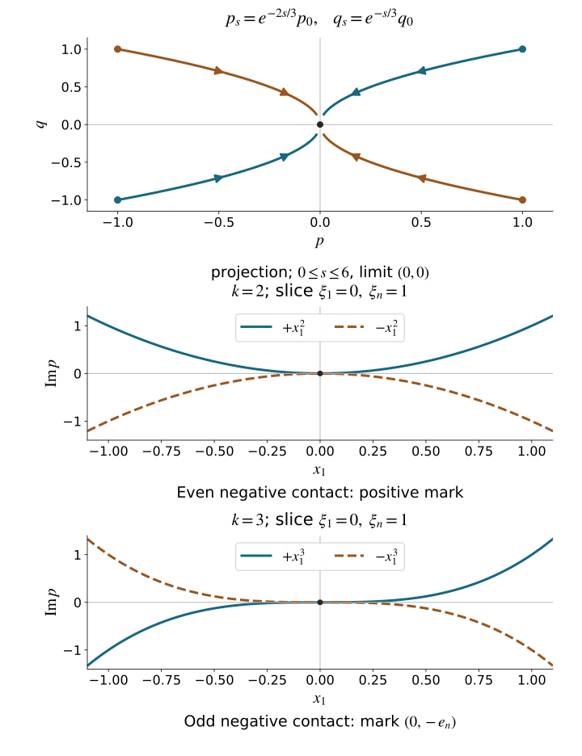

# Real and complex symplectic normal forms of functions

A canonical coordinate change preserves Poisson brackets. Multiplication by a nonzero function gives additional freedom, and for a complex symbol that freedom can remove an entire sequence of transverse errors. We develop the local models, including the exact marked covector, the homogeneity of every multiplier, and the distinction between a simple bracket and fixed higher contact.

We retain the conventions and geometry of [Phase space and generating families](../20261005-restored-phase-space/phase-space-and-generating-families.md), the nonzero restricted primitive theorem in [Homogeneous submanifold normal forms](../20261005-restored-submanifolds/homogeneous-submanifold-normal-forms.md), and the full coordinate completion in [Prescribed canonical coordinates and isotropic fibers](../20261005-restored-prescribed-coordinates/prescribed-canonical-coordinates-and-isotropic-fibers.md). The exact prerequisites are [finite-coordinate flows, NF1–NF7](../20261005-restored-phase-space/finite-coordinate-flows.md), [tangent and commuting flows, F0–F1](../20261005-restored-submanifolds/flows-constant-rank-and-leaves.md), and [inverse and implicit functions, P2–P3](../20261004-free-stationary-phase/prerequisite-completions.md). The [measure and norm proofs, M3–M8](../20261004-free-intrinsic-graph/prerequisites/measure-and-l2.md) give Fatou, dominated convergence, product integration, completeness and smooth density; [Fourier proofs L1–L3](../20261004-free-intrinsic-graph/prerequisites/fourier-l2.md) give the actual inverse maps, distributional compatibility and measurable multipliers. [B1–B2](../20261004-free-intrinsic-graph/prerequisites/dyadic-endpoint.md) prove the weighted Fourier norms and their local frequency estimate. The [proof map](proof-map.json) supplies exact locators and all earlier inputs. Section 4 proves smooth division by a complex function of one real variable, using an almost-analytic extension and a smooth complex root. The geometric source is Hörmander III, Section 21.3, Theorems 21.3.1–21.3.6, including the proof ending on; the division theorem is credited to Hörmander I, Theorem 7.5.6. The present proof supplies the needed one-variable division and parameter solver.

## 1. Allowed changes and the real normal form

Write
\[
 \omega=\sum_jd\xi_j\wedge dx_j,\qquad
 \iota_{H_f}\omega=-df,\qquad
 \{f,g\}=H_fg,\qquad
 R=\sum_j\xi_j\partial_{\xi_j}.
 \tag{1.1}
\]
Thus \(H_{\xi_j}=\partial_{x_j}\), \(H_{x_j}=-\partial_{\xi_j}\), and \(\{\xi_j,x_k\}=\delta_{jk}\). A function of degree \(m\) satisfies \(Rf=mf\). Its Hamilton field satisfies
\[
 [R,H_f]=(m-1)H_f,\qquad
 \deg\{f,g\}=\deg f+\deg g-1.
 \tag{1.2}
\]
The first identity follows by differentiating the coordinate expression for \(H_f\); the second follows either from that expression or by applying \(R\) to the bracket.

Fix \(c\in T^*\mathbb R^n\setminus0\). Our changes are multiplication \(p\mapsto ap\) by a nowhere zero smooth homogeneous complex function and a local homogeneous canonical map \(\chi\), with the convention that \(\chi\) carries model coordinates to a neighborhood of \(c\). All conclusions are local conic germs. The multiplier can change degree: if \(p\) has degree \(m\), multiplying by \(|\xi|^{1-m}\) makes it degree one.

**Theorem 1.1 (real principal-type model).** Suppose \(p\) is real, smooth and homogeneous of degree one, \(p(c)=0\), and \(H_p(c)\) and \(R(c)\) are independent. There are homogeneous canonical coordinates, with \(c\) represented by \((0,e_n)\), such that
\[
 \chi^*p=\xi_1.
 \tag{1.3}
\]

**Proof.** Prescribe the degree-one momentum \(p_1=p\), no position coordinates, and the marked values \(p_j(c)=\delta_{jn}\), \(q_j(c)=0\). The homogeneous coordinate-completion theorem applies precisely because the given Hamilton field and \(R\) are independent. Its unused position index is \(n\), whose prescribed momentum is nonzero. The completed coordinate map has the stated mark and retains \(p\) as an actual function. Its inverse is \(\chi\). \(\square\)

The hypothesis includes the marked compatibility. In dimension one it cannot hold at a zero: \(dp(R)=p=0\), so \(H_p\) and \(R\) lie in the same one-dimensional symplectic orthogonal. For example \(p=x\xi\) near \((0,1)\) has \(H_p=-R\) at its zero. A homogeneous transformation could not turn this zero into the model momentum at \((0,e_1)\), where that momentum equals one.

If a real symbol initially has degree \(m\), the positive preliminary multiplier scales its Hamilton field at a zero by a positive number, so it preserves nonradiality and gives (1.3) for the multiplied symbol.

## 2. A positive weighted bracket normalizer

The complex models will require a pair of functions with bracket one. A scalar multiplier can accomplish this even when the functions have fractional degrees.

**Theorem 2.1 (weighted normalization).** Let \(p,q\) be real smooth functions on a symplectic manifold, \(p(c)=q(c)=0\), and \(C=\{p,q\}>0\) near \(c\). If \(\alpha,\beta>0\) and \(\alpha+\beta=1\), there is a unique positive smooth local germ \(u\) such that
\[
 \{u^\alpha p,u^\beta q\}=1.
 \tag{2.1}
\]
In a conic symplectic manifold, if \(p,q\) have degrees \(m,m'\), this germ extends homogeneously with
\[
 \begin{aligned}
 \deg u&=1-m-m',\\
 \deg(u^\alpha p)&=\alpha(1-m')+\beta m,\\
 \deg(u^\beta q)&=\alpha m'+\beta(1-m).
 \end{aligned}
 \tag{2.2}
\]

**Proof.** The full product rule, using \(\alpha+\beta=1\), gives
\[
 \{u^\alpha p,u^\beta q\}
 =Cu+Vu,\qquad
 V=\beta qH_p-\alpha pH_q.
 \tag{2.3}
\]
The two normal coordinates are independent because \(C\ne0\). Put \(X=V/C\). Crucially,
\[
 Xp=\alpha p,\qquad Xq=\beta q.
 \tag{2.4}
\]
Choose submersion coordinates \((p,q,z)\) near \(c\). The field \(X\) vanishes when \(p=q=0\). Taylor division therefore writes its tangential component as \(pA+qB\), with \(A,B\) smooth vector functions. For its backwards flow \(\Phi_{-s}\),
\[
 \begin{aligned}
 p_s&=e^{-\alpha s}p,\qquad q_s=e^{-\beta s}q,\\
 \dot z_s&=-e^{-\alpha s}pA(p_s,q_s,z_s)
            -e^{-\beta s}qB(p_s,q_s,z_s),\qquad s\ge0.
 \end{aligned}
 \tag{2.5}
\]

Take nested relatively compact \(z\) neighborhoods, with the smaller closure inside the larger. Bounds for \(A,B\) on the larger box give
\[
 |z_s-z_0|\le K\bigl(|p|/\alpha+|q|/\beta\bigr).
 \tag{2.6}
\]
Make the initial normal box small enough that this bound is less than the distance between the two \(z\) boundaries. The backwards orbit remains in the larger box for every \(s\), so the local flow extends to all \(s\ge0\). The integrable right side of (2.5) also makes \(z_s\) converge.

We need estimates for every derivative in the initial data, not only orbit convergence. In the nonautonomous \(z\) equation, each derivative of its right side with respect to \((p,q,z)\) is bounded by \(K_l e^{-\delta s}\), where \(\delta=\min(\alpha,\beta)>0\), on the fixed box. First derivatives of \(z_s\) satisfy a linear equation whose coefficient has finite integral and whose forcing is integrable. The integral inequality gives a uniform bound in \(s\). Explicitly, if \(y(s)\le B+\int_0^s a(t)y(t)\,dt\), where \(B\) bounds the initial value and the total forcing integral and \(a\ge0\) is integrable, put \(Y(s)=B+\int_0^s a(t)y(t)\,dt\). Then \(Y'\le aY\), so multiplication by \(\exp(-\int_0^s a)\) and the fundamental theorem give \(y(s)\le B\exp(\int_0^\infty a)\). Replace \(B\) by \(B+\epsilon\) and let \(\epsilon\downarrow0\) if \(B=0\). Apply this to the norms of the differentiated finite-time integral equations from NF2–NF5. The bound does not depend on the final time. Inductively, a derivative of order \(l\) satisfies the same linear equation, plus a finite sum of products of bounded lower derivatives with derivatives of the right side. That forcing is again integrable. Thus every finite-order derivative of \(z_s\) is uniformly bounded on a smaller initial box. The explicit derivatives of \(p_s,q_s\) have the same property.

Define
\[
 u(w)=\int_0^\infty e^{-s}\frac{1}{C(\Phi_{-s}w)}\,ds.
 \tag{2.7}
\]
The positive function \(C\) has upper and lower positive bounds on the larger box. The derivative estimates just proved allow differentiation of (2.7) to every order, with an integrable bound \(K_l e^{-s}\). Consequently \(u\) is smooth and positive, and \(u|_{\{p=q=0\}}=1/C\).

To verify the equation, put \(F=1/C\). Differentiation along \(X\), followed by integration by parts, gives
\[
 Xu=-\int_0^\infty e^{-s}\partial_s(F\circ\Phi_{-s})\,ds
     =F-u.
 \tag{2.8}
\]
Thus \(Cu+Vu=1\), as required. If \(v+Xv=0\), then
\[
 v(\Phi_{-s}w)=e^s v(w).
 \tag{2.9}
\]
Shrink the initial box so the entire backwards orbit lies in the domain of the proposed smooth germ \(v\). Its closure is compact there, so \(v\) is bounded on the orbit. Letting \(s\to\infty\) in (2.9) gives \(v(w)=0\). This proves uniqueness of the scalar equation among all smooth germs and hence uniqueness in (2.1).

For the conic assertion let \(\delta_t\) multiply covectors by \(t>0\). Pullback of a bracket under \(\delta_t\) obeys
\[
 \{\delta_t^*f,\delta_t^*g\}=t\,\delta_t^*\{f,g\}.
 \tag{2.10}
\]
Set \(d=1-m-m'\). Applying (2.10) to (2.1) shows that \(t^{-d}\delta_t^*u\) satisfies that same equation, since the powers of \(t\) in the bracket cancel. Uniqueness gives \(\delta_t^*u=t^du\) for \(t\) close to one on a common germ. Extend along the positive covector ray; these identities make the local extensions agree on overlaps. Equation (2.2) follows by adding degrees. \(\square\)

The formula remains local in the tangential variables. The backwards time is unbounded, but estimate (2.6) keeps the entire integral inside a fixed local neighborhood. No data are prescribed on the singular fixed set beyond the forced value \(1/C\).

## 3. A nonzero complex bracket and its marked sign

Write \(p=p_1+ip_2\), with real \(p_j\). At a zero of \(p\), every derivative of a scalar multiplier \(a\) is accompanied by a factor \(p\) or \(\bar p\), so
\[
 \{\operatorname{Re}(ap),\operatorname{Im}(ap)\}
 =|a|^2\{p_1,p_2\}\quad\hbox{on }p=0.
 \tag{3.1}
\]
The sign of a nonzero bracket is therefore invariant under our changes.

We first supply the homogeneous auxiliary momentum used in this and the higher-contact construction.

**Lemma 3.1 (a commuting positive momentum).** Suppose \(\phi,\psi\) are real homogeneous functions of degrees \(a,b\), \(a+b=1\), \(\phi(c)=\psi(c)=0\), and \(\{\phi,\psi\}=1\). There is a positive degree-one function \(h\), with \(h(c)=1\), such that
\[
 \{\phi,h\}=\{\psi,h\}=0.
 \tag{3.2}
\]
Moreover
\[
 P=h^b\phi,\qquad Q=h^{-b}\psi,\qquad h
 \tag{3.3}
\]
can be retained as the first momentum, first position and last momentum of a homogeneous canonical coordinate system with mark \((0,e_n)\).

**Proof.** The fields \(H_\phi,H_\psi\) commute because their bracket is the Hamilton field of the constant one. Their span is symplectic: \(\omega(H_\phi,H_\psi)=\{\phi,\psi\}=1\). The zero set \(Z=\{\phi=\psi=0\}\) is a transverse section for their two commuting flows. The radial field lies in \(TZ\), and is nonzero there. Choose a positive degree-one function \(h_0\) on \(Z\), equal to one at \(c\), by using a transverse section to its radial flow and extending its positive datum.

The product of the two Hamilton flows from \(Z\) is a local diffeomorphism. Extend \(h_0\) constantly in both flow times. This proves (3.2), positivity and the marked value. Dilations carry each flow to the same flow with a rescaled time, because of (1.2), and carry \(Z\) to itself. The extension of \(t^{-1}\delta_t^*h\) has the same datum and the same two zero transport equations as \(h\). Flow uniqueness proves its equality to \(h\). Thus \(h\) has degree one.

The product rule in (3.3) gives
\[
 \{P,Q\}=1,\qquad \{P,h\}=\{Q,h\}=0,\qquad
 \deg P=1,\quad\deg Q=0.
 \tag{3.4}
\]
At \(c\), \(H_P=H_\phi\), \(H_Q=H_\psi\). The field \(H_h\) is orthogonal to their symplectic span and nonzero, since \(dh(R)=h=1\). If \(R\) were in the span of these three fields, pairing with \(H_P,H_Q\) would force its first two coefficients to vanish. Then \(R\) would be a multiple of \(H_h\), contradicting \(dh(R)=1\) and \(dh(H_h)=0\). Hence the three prescribed Hamilton fields and \(R\) are independent. The homogeneous coordinate theorem applies with \(Q=q_1\), \(P=p_1\), \(h=p_n\), and the unused position index \(n\), whose momentum value is one. It completes the coordinates and preserves these functions exactly. \(\square\)

**Theorem 3.2 (simple complex normal form).** Let \(p\) be smooth and homogeneous near \(c\), \(p(c)=0\), and \(\{p_1,p_2\}(c)\ne0\). There is a nonzero homogeneous multiplier \(a\) and a homogeneous canonical map such that
\[
 \chi^*(ap)=\xi_1+i x_1\xi_n.
 \tag{3.5}
\]
The model mark is \((0,e_n)\) for positive bracket and \((0,-e_n)\) for negative bracket.

**Proof.** The nonzero bracket makes \(dp_1,dp_2\) independent. Homogeneity gives \(dp_j(R)=0\) at the zero. The nondegenerate Hamilton plane therefore cannot contain \(R\); in particular the fields and the radial direction are independent.

First make the degree one by a positive multiplier, which preserves the bracket sign at the zero. In the positive case apply Theorem 2.1 with weights \(1/2,1/2\). Then
\[
 \phi=u^{1/2}p_1,\qquad \psi=u^{1/2}p_2,\qquad
 \{\phi,\psi\}=1,\qquad\deg\phi=\deg\psi=\tfrac12.
 \tag{3.6}
\]
Lemma 3.1 with \(b=1/2\) provides coordinates
\[
 \eta_1=h^{1/2}\phi,\qquad y_1=h^{-1/2}\psi,\qquad\eta_n=h.
 \tag{3.7}
\]
Their exact identity is
\[
 h^{1/2}u^{1/2}p=\eta_1+i y_1\eta_n.
 \tag{3.8}
\]
All factors are positive smooth on the chosen conic germ; the multiplier has the required degree.

For negative bracket perform the positive construction on \(\bar p\), then conjugate the resulting identity. This gives \(\eta_1-i y_1\eta_n\) at \((0,e_n)\). The simultaneous canonical flip \((y_n,\eta_n)\mapsto(-y_n,-\eta_n)\) produces (3.5) at \((0,-e_n)\). The model's bracket at either mark is \(\xi_n=\pm1\), so (3.1) also proves that the two marked signs cannot be exchanged by an admissible equivalence at the same mark. \(\square\)

## 4. Remove one momentum from the imaginary part

**Smooth complex division.** If a complex \(C^\infty\) function \(F(t,z)\), with real \(t,z\), has \(F(0,0)=0\) and \(\partial_tF(0,0)\ne0\), then every smooth \(G(t,z)\) has a representation
\[
 G=QF+S(z)
 \tag{4.1}
\]
on a neighborhood chosen from \(F\) and the original domain, with \(Q,S\) smooth and complex valued. The remainder is independent of \(t\). This is the \(k=1\) case of Hörmander I, Theorem 7.5.6; its hypotheses are those of Theorem 7.5.5. Neither the quotient nor the remainder is asserted to be unique. The following proof treats complex functions in real variables; it does not assume that their real zeros form a parameter graph.

**Proof.** First extend a smooth function \(a(t,z)\) almost analytically in \(t\). Multiply it by a fixed real cutoff equal to one on the patch in use. For \(v=t+iw\), choose a fixed smooth cutoff \(\chi\), equal to one near zero, and put
\[
 A(t+iw,z)=\sum_{k=0}^{\infty}
       \chi(w/\varepsilon_k)\frac{(iw)^k}{k!}\partial_t^ka(t,z).
\]
All coefficients and their derivatives are bounded on a fixed larger compact patch. A derivative of total order \(l<k\) of the \(k\)-th term is bounded by \(C_{kl}\varepsilon_k^{k-l}\). Choose positive radii decreasing to zero so that these bounds are at most \(2^{-k}\) for every \(l\le k/2\). Each fixed derivative series then converges uniformly after finitely many terms. The sum is smooth on a fixed complex domain; only the radii and its seminorm bounds depend on \(a\). Its normal jets at \(w=0\) are the formal analytic jets. Thus, with \(\partial_{\bar v}=(\partial_t+i\partial_w)/2\), Taylor's integral remainder gives
\[
 A(t,z)=a(t,z),\qquad
 |D^\beta\partial_{\bar v}A(t+iw,z)|\le C_{\beta L}|w|^L
 \quad\text{for every }\beta,L.
\]
The derivatives here include all real parameters \(z\). No holomorphic continuation of an arbitrary smooth function is claimed.

Apply this construction to \(F\), writing its extension as \(\widetilde F(v,z)\). At the mark, its real derivative in \((t,w)\) is complex multiplication by \(\lambda=\partial_tF(0,0)\ne0\). In particular it is invertible. A direct parameter argument produces a smooth complex root \(T(z)\), with \(T(0)=0\). Indeed the real map
\[
 v\longmapsto v-\lambda^{-1}\widetilde F(v,z)
\]
has derivative zero at the mark. On a sufficiently small closed complex disc its derivative norm is at most \(q<1\), uniformly on a smaller parameter patch. Shrink that patch so that its value at \(v=0\) has modulus at most \((1-q)/2\) times the disc radius. It maps the disc into itself and its fixed point lies in the interior. Iteration from zero has geometrically summable successive differences, so completeness of \(\mathbb C\) gives its unique fixed point \(T(z)\). The same contraction estimate first bounds parameter differences of \(T\) by a constant times the parameter differences. Taylor's formula in the fixed-point identity then proves differentiability, with real derivative
\[
 D_zT=-(D_v\widetilde F(T,z))^{-1}D_z\widetilde F(T,z).
\]
The inverse exists throughout the disc by the contraction bound. This formula has continuous coefficients. Induction differentiating it proves smoothness of every order. Thus \(\widetilde F(T(z),z)=0\), with no real-zero or holomorphic-root assumption.

We next divide by the known graph \(t-T(z)\). For any almost-analytic extension \(A\) as above, the segment \(v_s=T+s(t-T)\) stays inside its fixed domain after one shrink depending on \(T\). Set \(R(z)=A(T(z),z)\). The full real chain rule gives
\[
 \begin{split}
 a(t,z)-R(z)&=(t-T(z))U_0(t,z)+E(t,z),\\
 U_0&=\int_0^1(\partial_v+\partial_{\bar v})A(v_s,z)\,ds,\\
 E&=2i\operatorname{Im}T(z)
                       \int_0^1\partial_{\bar v}A(v_s,z)\,ds.
 \end{split}
\]
The sign and the error term follow from \(t-\overline T=(t-T)+2i\operatorname{Im}T\). Every derivative of \(E\) is bounded by every positive power of \(|\operatorname{Im}T|\), because the imaginary part of \(v_s\) is \((1-s)\operatorname{Im}T\) and the antiholomorphic derivative has all the preceding flat estimates. Put \(s_0=|t-T(z)|^2\ge|\operatorname{Im}T|^2\). For \(s_0>0\), define
\[
 e(t,z)=\frac{\overline{t-T(z)}\,E(t,z)}{s_0}.
\]
Each derivative of this expression costs only finitely many negative powers of \(s_0\). The arbitrary positive powers in the bounds for \(E\) absorb them, so every derivative tends to zero faster than every power of \(s_0\). Its zero extension across \(s_0=0\) is smooth even if that zero set is singular: multiply the expression by a smooth cutoff vanishing for \(s_0\le\delta\) and equal to one for \(s_0\ge2\delta\). On the transition region all differentiated cutoff factors cost finitely many powers of \(\delta^{-1}\), while the flat estimates give arbitrarily many positive powers. These smooth functions and all their derivatives converge uniformly to the zero extension. The fundamental theorem of calculus identifies those derivative limits with the derivatives of the limit. Consequently
\[
 a=(t-T)(U_0+e)+R(z)
\]
holds smoothly and exactly, including real zeros of the graph.

For \(a=F\), use the particular extension \(\widetilde F\) which constructed \(T\). Its remainder is zero, so \(F=(t-T)U\). Differentiating at the mark gives \(U(0,0)=\partial_tF(0,0)\ne0\); shrink once so \(U\) never vanishes. Apply the same graph division to \(a=G\), obtaining \(G=(t-T)V+S(z)\). Then \(Q=V/U\) proves (4.1). The real and complex neighborhoods were fixed before choosing \(G\); its extension radii and coefficient bounds may depend on \(G\). This proves exactly the needed common-neighborhood division. \(\square\)

**Example (a nonreal root).** For \(F(t,z)=t-iz\) and \(G(t,z)=t^2\), the root is \(T(z)=iz\), and the exact division is
\[
 t^2=(t+iz)(t-iz)-z^2.
\]
The remainder depends only on \(z\). For \(z\ne0\) there is no real root in \(t\); the proof uses the smooth complex root instead.

**Theorem 4.1 (one-momentum reduction).** Suppose \(p\) is smooth and homogeneous, \(p(c)=0\), and \(H_{\operatorname{Re}p}(c)\) is independent of \(R(c)\). There are a nonzero homogeneous multiplier \(a\) and homogeneous canonical coordinates at \((0,e_n)\) such that
\[
 ap=\eta_1+i f(y,\eta'),\qquad
 \eta'=(\eta_2,\ldots,\eta_n).
 \tag{4.2}
\]
The smooth real \(f\) has degree one and is independent of \(\eta_1\).

**Proof.** Make \(p\) degree one by a positive multiplier. Theorem 1.1 then makes \(\operatorname{Re}p=\xi_1\) at the mark \((0,e_n)\). In particular \(\partial_{\xi_1}p\ne0\).

Apply (4.1) to divide the real function \(\xi_1\) by \(p\):
\[
 \xi_1=qp+r,\qquad r=r_1+i r_2,\qquad
 \partial_{\xi_1}r=0.
 \tag{4.3}
\]
For homogeneity, perform this division on the positive \(\xi_n=1\) slice, in the real variable \(\xi_1/\xi_n\), with all remaining slice coordinates as parameters. Extend \(q\) to degree zero and \(r\) to degree one. This preserves (4.3). At the mark \(r=0\), and differentiation in \(\xi_1\) gives \(q(c)=1/\partial_{\xi_1}p(c)\ne0\). Shrink so \(q\) is nonzero.

Prescribe
\[
 y_1=x_1,\qquad \eta_1=\xi_1-r_1.
 \tag{4.4}
\]
These functions have degrees zero and one and bracket \(\{\eta_1,y_1\}=1\). At the mark \(R\) has its nonzero last-momentum component, \(H_{y_1}=-\partial_{\xi_1}\), and \(H_{\eta_1}\) has \(x_1\) component one. Thus their fields and \(R\) are independent. The homogeneous coordinate theorem completes them with mark \((0,e_n)\).

Equation (4.3) becomes \(qp=\eta_1-i r_2\). The identity \(H_{y_1}r_2=-\partial_{\xi_1}r_2=0\) is invariant under the coordinate change. In the new coordinates \(H_{y_1}=-\partial_{\eta_1}\), so \(f=-r_2\) is independent of \(\eta_1\), as asserted. The product of \(q\) and the initial positive multiplier is \(a\). \(\square\)

The function \(f\) may depend on \(y_1\). That dependence carries the contact information in the next section.

## 5. Fixed higher contact, a filtration and the multiplier law

Let \(p=p_1+ip_2\), \(p(c)=0\), and \(H_{p_1}(c)\ne0\). The hypersurface \(V_1=\{p_1=0\}\) is foliated by its nonzero Hamilton field. We assume a fixed integer \(k>1\): in a small flow box, \(p_2\) has a zero of exactly order \(k\) on every nearby Hamilton curve. On the resulting nearby zero set,
\[
 H_{p_1}^jp_2=0\quad(0\le j<k),\qquad
 H_{p_1}^kp_2\ne0.
 \tag{5.1}
\]
The assumption includes existence of the fixed-order zero on each nearby curve. A single nonzero kth derivative at \(c\), or a statement concerning only those curves that happen to have zeros, is insufficient.

**Lemma 5.1 (the smooth zero set and its brackets).** Under this assumption the zero set \(V=\{p_1=p_2=0\}\) is smooth of codimension two. Near \(V\), choose a smooth function \(g\) with \(\{p_1,g\}\ne0\) such that
\[
 p_2=b p_1+c_0 g^k,\qquad c_0\ne0.
 \tag{5.2}
\]
On \(V\), \(H_{p_2}=bH_{p_1}\), and every iterated Poisson bracket of at most \(k\) factors chosen from \(p_1,p_2\) vanishes.

**Proof.** Use flow-box coordinates \((t,z)\) on \(V_1\), with \(H_{p_1}=\partial_t\). The function \(\partial_t^{k-1}p_2\) has a simple zero at \(c\). The implicit function theorem gives its unique nearby zero graph \(t=T(z)\). The fixed-order zero supplied on each nearby curve has all lower derivatives zero and must therefore be this graph. Shrinking the flow box, Taylor's formula below also shows that there are no other zeros in it.

All derivatives of order \(<k\) vanish on this graph. Taylor's integral formula gives
\[
 p_2(t,z)=(t-T(z))^k
 \frac{1}{(k-1)!}\int_0^1(1-s)^{k-1}
       \partial_t^kp_2(T(z)+s(t-T(z)),z)\,ds
 \tag{5.3}
\]
on \(V_1\). The last factor is smooth and nonzero. Extend \(g=t-T(z)\) and that factor to a neighborhood of \(V_1\). The difference between \(p_2\) and \(c_0g^k\) vanishes on \(p_1=0\), so real Taylor division gives (5.2). Its zero set is \(\{p_1=g=0\}\), and the two differentials are independent because \(\{p_1,g\}\ne0\). Since \(k>1\), differentiating (5.2) on \(V\) gives \(dp_2=b\,dp_1\), proving the Hamilton-field identity.

For the bracket assertion put
\[
 \mathcal D_j=(p_1,g^j),\qquad 1\le j\le k,\qquad \mathcal D_0=C^\infty.
 \tag{5.4}
\]
These are ideals of smooth local functions. Direct product rules give
\[
 H_{p_1}\mathcal D_j\subset\mathcal D_{j-1},\qquad
 H_{p_2}\mathcal D_j\subset\mathcal D_{j-1}.
 \tag{5.5}
\]
For the second inclusion use
\[
 H_{p_2}=bH_{p_1}+p_1H_b+c_0k g^{k-1}H_g+g^kH_{c_0}.
 \tag{5.6}
\]
The only potentially low-order contribution of \(g^{k-1}H_g\) acting on \(p_1A+g^jB\) is \(g^{k-1}\{g,p_1\}A\), and \(k-1\ge j-1\). The other terms retain \(p_1\) or at least \(g^{j-1}\).

Both \(p_1,p_2\) lie in \(\mathcal D_k\). A right-nested bracket of \(\ell\) factors lies in \(\mathcal D_{k-\ell+1}\); for \(\ell\le k\) this vanishes on \(V\). Any bracket tree is a linear combination of right-nested brackets with the same factors: apply the Jacobi identity to move a bracket in the first argument successively to the right, and induct on its number of internal brackets. This proves the assertion for every tree. \(\square\)

**Theorem 5.2 (finite-contact multiplier law).** For every smooth complex multiplier \(a=A+iB\), on \(V\),
\[
 H_{\operatorname{Re}(ap)}^k\operatorname{Im}(ap)
 =|a|^2(A-bB)^{k-1}H_{p_1}^kp_2.
 \tag{5.7}
\]
If \(a\ne0\) and \(A-bB\ne0\), the transformed symbol has the same fixed order \(k\). For odd \(k\) its kth derivative sign is unchanged.

**Proof.** Put \(F=A-bB\), \(G=B+bA\), and write (5.2) as
\[
 f=\operatorname{Re}(ap)=Fp_1-Bc_0g^k,\qquad
 v=\operatorname{Im}(ap)=Gp_1+Ac_0g^k.
 \tag{5.8}
\]
The product rule extends (5.5) to \(H_f\mathcal D_j\subset\mathcal D_{j-1}\). Indeed \(H_f=A H_{p_1}-B H_{p_2}+p_1H_A-p_2H_B\), and the last two terms acting on \(\mathcal D_j\) still lie in \(\mathcal D_{j-1}\). Thus \(H_f^{k-1}(p_1U+p_2W)\) vanishes on \(V\) for arbitrary smooth \(U,W\).

The full first bracket has the form
\[
 \{f,v\}=(A^2+B^2)\{p_1,p_2\}+p_1U+p_2W.
 \tag{5.9}
\]
This follows by expanding all factors; every term differentiating \(A\) or \(B\) contains \(p_1\) or \(p_2\). Also
\[
 \{p_1,p_2\}=p_1\{p_1,b\}+g^k\{p_1,c_0\}
                  +k c_0g^{k-1}\{p_1,g\}.
 \tag{5.10}
\]
After \(k-1\) applications of \(H_f\), the first two terms and all extra terms in (5.9) vanish on \(V\). In the last term, every surviving derivative must hit a different one of its \(k-1\) factors \(g\); a derivative hitting its coefficient would leave a zero factor. Since \(H_fg=F H_{p_1}g\) on \(V\), the result is
\[
 |a|^2 k!c_0F^{k-1}(H_{p_1}g)^k.
 \tag{5.11}
\]
The same Taylor product rule gives \(H_{p_1}^kp_2=k!c_0(H_{p_1}g)^k\). This proves (5.7) with all differentiated multiplier terms accounted for.

If \(F\ne0\), the equation \(f=0\) solves \(p_1=(Bc_0/F)g^k\). On that hypersurface,
\[
 v=\frac{c_0|a|^2}{F}g^k.
 \tag{5.12}
\]
Its factor is nonzero, and \(H_fg=F H_{p_1}g\ne0\) on the zero set. Here \(df=F\,dp_1\ne0\) on \(V\), so the implicit function theorem makes \(f=0\) a smooth hypersurface. Inside it, \(g=0\) is transverse to \(H_f\). The transverse-flow chart F0 identifies a neighborhood with a time interval times that zero section. Thus every nearby Hamilton curve meets it, and (5.12) gives exactly a kth-order zero there. If \(k\) is odd, \(k-1\) is even, so the factor in (5.7) is positive. If \(F=0\), \(H_f=0\) on \(V\); that case fails the nonzero real-field hypothesis. \(\square\)

## 6. The homogeneous finite-contact normal form

**Theorem 6.1 (fixed-contact model).** Let \(p=p_1+ip_2\) be homogeneous and satisfy the fixed-order hypothesis of Section 5 with \(k>1\). There is a nonzero homogeneous multiplier and a homogeneous canonical map such that
\[
 \chi^*(ap)=\xi_1+i x_1^k\xi_n.
 \tag{6.1}
\]
The mark is \((0,e_n)\), except when \(k\) is odd and \(H_{p_1}^kp_2(c)<0\); that case has mark \((0,-e_n)\). The exceptional negative odd case cannot have the displayed model at the positive mark.

**Proof.** First \(H_{p_1}(c)\) cannot be radial. If it were a nonzero multiple of \(R(c)\), homogeneity would make its field radial along the covector ray through \(c\). Flow uniqueness would keep its orbit on that ray. Since \(p_2\) vanishes along the ray, it would have infinite, rather than finite, zero order on this orbit.

A positive preliminary degree change gives degree one and preserves the nearby Hamilton curves in \(p_1=0\), their zero order and the leading derivative sign. Use Theorem 1.1 to make \(p_1=\xi_1\), then Theorem 4.1 to reduce the symbol to
\[
 \widetilde p=\eta_1+i f(y,\eta'),\qquad
 \partial_{\eta_1}f=0.
 \tag{6.2}
\]
We check that the division multiplier is admissible for finite contact. On \(V\), \(H_{p_2}=bH_{\xi_1}\), so \(\partial_{\xi_1}p=1+ib\). The multiplier \(q\) in (4.3) satisfies \(q(c)=(1+ib(c))^{-1}\). Therefore
\[
 \operatorname{Re}q(c)-b(c)\operatorname{Im}q(c)=1.
 \tag{6.3}
\]
It stays nonzero after shrinking. Theorem 5.2 preserves fixed contact, and its positive factor at \(c\) preserves the kth derivative sign in this particular reduction. Canonical changes preserve all the Hamilton identities.

Rename these coordinates \((x,\xi)\). The equation \(\partial_{x_1}^{k-1}f=0\) has a unique nearby solution
\[
 x_1=X(x',\xi'),\qquad x'=(x_2,\ldots,x_n),
 \tag{6.4}
\]
by the nonzero kth derivative. Each nearby \(H_{\xi_1}=\partial_{x_1}\) curve has its fixed-order zero there. Because \(f\) is independent of \(\xi_1\), this describes it for all \(\xi_1\) in the patch. Its lower derivatives all vanish on the graph. Taylor's formula gives
\[
 f=(x_1-X)^k F,\qquad
 F=\frac1{(k-1)!}\int_0^1(1-s)^{k-1}
   \partial_{x_1}^kf(X+s(x_1-X),x',\xi')\,ds.
 \tag{6.5}
\]
Uniqueness of the graph and homogeneity give \(\deg X=0\), \(\deg F=1\). Initially assume the kth derivative is positive. Then \(F>0\), and
\[
 g=(x_1-X)F^{1/k},\qquad f=g^k,\qquad
 \deg g=\tfrac1k,\qquad
 \{\xi_1,g\}(c)=F(c)^{1/k}>0.
 \tag{6.6}
\]
This is a signed smooth coordinate; taking a nonnegative root of \(f\) would lose that property.

Apply Theorem 2.1 to \(\xi_1,g\) with
\[
 \alpha=\frac{k}{k+1},\qquad \beta=\frac1{k+1}.
 \tag{6.7}
\]
The normalizer has degree \(-1/k\). The functions \(\phi=u^\alpha\xi_1\), \(\psi=u^\beta g\) have degrees \(\alpha,\beta\) and bracket one. Lemma 3.1 supplies \(h>0\), degree one and commuting with them, and retains
\[
 \eta_1=h^\beta\phi,\qquad y_1=h^{-\beta}\psi,\qquad
 \eta_n=h
 \tag{6.8}
\]
as canonical coordinates at the positive mark. The exact identity, including its multiplier, is
\[
 u^\alpha h^\beta(\xi_1+i g^k)
   =\eta_1+i y_1^k\eta_n.
 \tag{6.9}
\]
Indeed \(k\beta=\alpha\) and \(1-k\beta=\beta\). The product \(u^\alpha h^\beta\) has degree zero.

For negative kth derivative, apply the positive construction to \(\bar p\) and conjugate the resulting identity. This gives \(\eta_1-i y_1^k\eta_n\) for a nonzero multiplier times \(p\), at \((0,e_n)\). If \(k\) is even, multiply by \(-1\) and flip the canonical pair \((y_1,\eta_1)\); the result is the positive displayed model at that same mark. If \(k\) is odd, flip the last pair \((y_n,\eta_n)\); the result is (6.1) at \((0,-e_n)\). For odd \(k\), (5.7) has positive factor for every admissible multiplier and the positive model has kth derivative \(k!>0\). This proves the obstruction at the positive mark. \(\square\)

## 7. A smooth elliptic solver with parameters

The remaining normal form has a complex Hamilton field tangent to a two-dimensional characteristic leaf. Solving it needs a common open set for all transverse parameters and all derivative orders. We prove that input.

**Lemma 7.1 (two-variable parameter solvability).** Let
\[
 L_\lambda=a(x,\lambda)\partial_{x_1}
                  +b(x,\lambda)\partial_{x_2}
 \tag{7.1}
\]
have smooth complex coefficients, where \(x\in\mathbb R^2\) and \(\lambda\in\mathbb R^d\). Suppose the real map \((\tau_1,\tau_2)\mapsto a(0,0)\tau_1+b(0,0)\tau_2\) is invertible. Every smooth \(f(x,\lambda)\) has a joint smooth local solution \(L_\lambda u=f\) on a fixed smaller product neighborhood. The solution can be chosen linearly and continuously in \(f\) in the smooth seminorms on fixed compact subsets.

**Proof.** A real linear change of \(x\), followed if needed by a fixed nonzero scalar, makes the frozen operator \(L_0=\partial_{x_1}+i\partial_{x_2}\). Put \(z=x_1+ix_2\). The locally integrable function
\[
 E(z)=\frac1{2\pi z}
 \tag{7.2}
\]
is its distributional fundamental solution. Here is a direct real-variable calculation of the constant. In polar coordinates \(L_0=e^{i\theta}(\partial_r+i r^{-1}\partial_\theta)\), while \(E=e^{-i\theta}/(2\pi r)\) is locally integrable. For a test function \(\varphi\) supported inside the disk of radius \(R\), polar substitution gives the punctured distributional pairing as \(-(2\pi)^{-1}\int_\varepsilon^R\int_0^{2\pi}[\partial_r\varphi+i r^{-1}\partial_\theta\varphi]\,d\theta\,dr\). Periodicity makes the angular derivative integral zero. The radial fundamental theorem leaves \((2\pi)^{-1}\int_0^{2\pi}\varphi(\varepsilon,\theta)\,d\theta\), which tends to \(\varphi(0)\) by continuity. The omitted disk contribution tends to zero since \(E\) is locally integrable and \(L_0\varphi\) is bounded. Thus \(L_0E=\delta_0\), with the stated factor and sign.

Choose a compact smooth cutoff \(\rho\), equal to one on \(|z|\le1\), and let \(F=\rho E\), \(Tg=F*g\). Then
\[
 L_0F=\delta_0+G,\qquad G=(L_0\rho)E\in C_c^\infty,
 \qquad\operatorname{supp}G\cap\{|z|<1\}=\varnothing.
 \tag{7.3}
\]
Our Fourier convention gives
\[
 (i\tau_1-\tau_2)\widehat F=1+\widehat G.
 \tag{7.4}
\]
Since \(F\in L^1\) and \(G\in L^1\), this identity yields
\[
 |\widehat F(\tau)|\le\frac{C}{1+|\tau|}.
 \tag{7.5}
\]
For high frequencies use \(|i\tau_1-\tau_2|=|\tau|\); for bounded frequencies use \(\|F\|_1\). Plancherel proves that \(T:H^s\to H^{s+1}\) is bounded for every real \(s\), and that both \(\partial_{x_j}T\) are bounded on \(L^2\). Constant derivatives commute with \(T\). To identify this multiplier with the actual convolution, weighted Cauchy–Schwarz gives \(|F*g(x)|^2\le\|F\|_1\int|F(y)|\,|g(x-y)|^2\,dy\); Tonelli and translation give \(\|F*g\|_2\le\|F\|_1\|g\|_2\). For compact smooth \(g\), Fubini proves its Fourier transform is \(\widehat F\,\widehat g\). Approximate any \(L^2\) input by the compact smooth functions of M7. Both the convolution bound and the Fourier multiplier bound pass to that limit, so the two operators coincide. Distributional differentiation, or their Fourier multipliers, then proves the asserted derivative commutation.

Let \(\chi\) be a spatial cutoff supported in \(|x|<2\varepsilon\), equal to one on \(|x|\le\varepsilon\). Choose \(3\varepsilon<1\). If \(g\) is supported in this cutoff, (7.3) gives \(L_0Tg=g\) on \(|x|<\varepsilon\).

For small \(\varepsilon\) and a small fixed parameter ball, the coefficients of \(L_\lambda-L_0\) are uniformly small in supremum norm on the support of \(\chi\). Extend their products with \(\chi\) by zero and define
\[
 A_\lambda=\chi(L_\lambda-L_0)T.
 \tag{7.6}
\]
The \(L^2\) bounds for \(\partial_jT\) make \(\|A_\lambda\|_{L^2\to L^2}<1/2\) uniformly. With a fixed compact extension of \(f\), solve
\[
 (I+A_\lambda)g_\lambda=\chi f_\lambda,\qquad
 g_\lambda=\sum_{\ell=0}^\infty(-A_\lambda)^\ell\chi f_\lambda.
 \tag{7.7}
\]
This is a bounded \(L^2\) inverse: M6 proves completeness, and the sum of the term norms is at most \(\sum_{\ell\ge0}2^{-\ell}\|\chi f_\lambda\|_2\). Multiplying a finite partial sum by \(I+A_\lambda\) leaves only the initial datum and a tail tending to zero. If \((I+A_\lambda)v=0\), then \(\|v\|_2\le\frac12\|v\|_2\), so \(v=0\). Thus existence, uniqueness and the uniform inverse bound follow on this one fixed space. The equation itself shows \(g_\lambda\) is supported where \(\chi\) is supported. Thus \(u_\lambda=Tg_\lambda\) satisfies \(L_\lambda u_\lambda=f_\lambda\) on \(|x|<\varepsilon\).

It remains to justify joint smoothness; a contraction in one norm alone would not prove it. Every parameter derivative of \(A_\lambda\) exists in operator norm, because it differentiates bounded smooth coefficient multipliers on a fixed compact set. The inverse identity
\[
 \partial_\lambda(I+A_\lambda)^{-1}
 =-(I+A_\lambda)^{-1}(\partial_\lambda A_\lambda)
                   (I+A_\lambda)^{-1}
 \tag{7.8}
\]
and its iterates give smooth parameter dependence in \(L^2\).

For spatial derivatives use difference quotients before assuming differentiability. Write \(A_\lambda=\sum_j c_j(x,\lambda)\partial_jT\). For a spatial difference quotient \(D_h\), its product rule gives
\[
 (I+A_\lambda)D_hg_\lambda
 =D_h(\chi f_\lambda)
       -\sum_j(D_hc_j)(\partial_jTg_\lambda)(x+h).
 \tag{7.9}
\]
The right side is uniformly bounded in \(L^2\), so \(D_hg_\lambda\) is uniformly bounded there. We can identify the derivative directly in Fourier space. For an increment \(h\) in direction \(j\), the Fourier multiplier of \(D_h\) is \(m_h(\tau)=(e^{ih\tau_j}-1)/h\). Plancherel and Fatou, as \(h\to0\) along any nonzero sequence, give \(\int|\tau_j\widehat g_\lambda|^2\le\liminf\int|m_h\widehat g_\lambda|^2<\infty\). Since \(|m_h|\le|\tau_j|\), dominated convergence now proves \(m_h\widehat g_\lambda\to i\tau_j\widehat g_\lambda\) in \(L^2\). Fourier inversion gives convergence of the actual difference quotients; testing against a compact smooth function identifies this limit with \(\partial_jg_\lambda\). This proves the derivative and its bound using the exact Fatou and Fourier prerequisites.

Inductively, after \(l-1\) derivatives have been established, commute that differentiated equation with one more difference quotient. Each commutator differentiates a coefficient and applies \(\partial_jT\) to an already established lower derivative. It is bounded in \(L^2\), while the highest derivative is still acted on by the same invertible \(I+A_\lambda\). This proves every spatial derivative and its uniform compact-parameter bounds. Differentiate (7.7) in parameters and repeat the same induction; the extra forcing contains derivatives of coefficients and lower parameter derivatives already controlled by (7.8). Every mixed derivative is locally \(L^2\) in \((x,\lambda)\). To obtain a joint smooth representative, multiply \(u_\lambda=Tg_\lambda\) by compact space and parameter cutoffs inside the proved domain. Every mixed weak derivative of the resulting \(v\), in \(D=2+d\) real variables, lies in \(L^2\); testing and Fubini justify the parameter weak derivatives from the proved \(L^2\) parameter derivatives. Fourier differentiation and the multinomial identity give \(\langle\zeta\rangle^N\widehat v\in L^2\) for every integer \(N\). For a multiindex \(\gamma\), choose \(N>|\gamma|+D/2\). The annular integral bound in B2 and Cauchy–Schwarz give \(\zeta^\gamma\widehat v\in L^1\). Its inverse Fourier integral is continuous by dominated convergence and represents the weak derivative by L2 of the Fourier prerequisite. Applying this to every \(\gamma\), with differentiation under the absolutely integrable inverse integrals, gives a joint \(C^\infty\) representative. The derivative estimates also give the asserted linear continuity in smooth seminorms. \(\square\)

This specializes and makes the parameter dependence explicit in the local solvability used in Hörmander II, Theorem 13.3.3 and Corollary 13.3.5. It requires ellipticity in two real variables, rather than an interpretation as a complex ordinary differential equation.

## 8. An involutive complex zero set

**Theorem 8.1 (involutive complex model).** Let \(p\) be smooth and homogeneous near \(c\), \(p(c)=0\). Suppose
\[
 H_{\operatorname{Re}p}(c),\quad
 H_{\operatorname{Im}p}(c),\quad R(c)
 \ \hbox{are independent},
 \qquad \{p,\bar p\}=0\ \hbox{on the nearby set }V=\{p=0\}.
 \tag{8.1}
\]
There are a nonzero homogeneous multiplier \(a\) and a homogeneous canonical map with mark \((0,e_n)\) such that
\[
 \chi^*(ap)=\xi_1+i\xi_2.
 \tag{8.2}
\]

**Proof.** The two real differentials of \(p\) are independent, so \(V\) is a conic codimension-two submanifold. Its symplectic orthogonal is the span of the two real Hamilton fields. The bracket hypothesis puts this span in \(TV\), so \(V\) is coisotropic and its restricted form has constant rank \(2n-4\). Also \(\lambda=\iota_R\omega\) does not vanish on \(TV\) at \(c\): otherwise \(R(c)\in(T_cV)^\omega\), contradicting the three-field independence. The nonzero restricted primitive normal-form theorem puts \(V\) at two zero momenta, with a nonzero shared momentum vector at the mark. A linear cotangent change of the shared variables aligns that vector to \(e_n\); constant translations of the positions put their marked values at zero. These changes preserve the two zero-momentum constraints and homogeneity. Consequently
\[
 V=\{\xi_1=\xi_2=0\},\qquad c=(0,e_n).
 \tag{8.3}
\]
These hypotheses force \(n\ge3\): for \(n=2\), a codimension-two coisotropic is Lagrangian and its tangent radial direction already lies in its symplectic orthogonal.

Make \(p\) degree one. On \(V\) its differential is a complex combination of \(d\xi_1,d\xi_2\), so
\[
 H_p=A\partial_{x_1}+B\partial_{x_2}\quad\hbox{on }V,
 \tag{8.4}
\]
where \(A,B\) have degree zero. The two real coefficient rows are independent. Thus (8.4) is elliptic in the two displayed variables. Lemma 7.1 solves \(H_p w=f\) smoothly on a common smaller patch of \(V\), with all remaining coordinates as parameters. If \(f\) has degree \(d\), perform the solution on \(\xi_n=1\) and extend it to degree \(d\): the coefficients in (8.4) have degree zero and there are no normal or parameter derivatives in this restricted operator. This proves homogeneous parameter solvability.

We now eliminate the bracket first to infinite order and then exactly.

Let \(I=(p_1,p_2)=(p,\bar p)\) be the complexified smooth ideal of \(V\). Repeated Taylor division in the two real normal coordinates proves that \(I^k\) consists exactly of functions whose normal derivatives of orders \(<k\) vanish on \(V\). This description holds on a fixed smaller patch. The exact multiplier formula is
\[
 \begin{aligned}
 \{e^w p,e^{\bar w}\bar p\}
 =e^{w+\bar w}\bigl(
   \{p,\bar p\}+\{p,\bar w\}\bar p
   +\{w,\bar p\}p+\{w,\bar w\}p\bar p\bigr).
 \end{aligned}
 \tag{8.5}
\]

Initially divide
\[
 \{p,\bar p\}=f_0\bar p+f_1p,\qquad f_1=-\bar f_0.
 \tag{8.6}
\]
The anti-conjugacy follows by replacing the two coefficients by their averages under \(\overline{\{p,\bar p\}}=-\{p,\bar p\}\). Solve \(H_p\bar w=-f_0\) on \(V\) by Lemma 7.1. The conjugate equation cancels the other coefficient. Extend \(w\) smoothly off \(V\) with degree zero. Formula (8.5) then has bracket in \(I^2\); its last term already has two factors in \(I\).

For \(k>1\), suppose the current bracket lies in \(I^k\). Divide and symmetrize it as
\[
 \{p,\bar p\}=\sum_{j=0}^k f_jp^j\bar p^{k-j},
 \qquad f_{k-j}=-\bar f_j,\qquad \deg f_j=1-k.
 \tag{8.7}
\]
Degrees can be obtained by performing the normal Taylor division on the positive \(\xi_n=1\) slice and extending its coefficients. Choose a correction
\[
 \bar w=\sum_{j=0}^{k-1}w_jp^j\bar p^{k-1-j},
 \qquad \deg w_j=1-k,
 \tag{8.8}
\]
and set the unused \(w_k=0\). Modulo \(I^{k+1}\), its new degree-\(k\) coefficients inside (8.5) are
\[
 f_j+H_pw_j-H_{\bar p}\bar w_{k-j}.
 \tag{8.9}
\]
To verify the omission, whenever \(H_p\) or \(H_{\bar p}\) differentiates a power of the other symbol it produces the current \(I^k\) bracket, giving order at least \(2k-1\). The last term in (8.5) also has order at least \(2k-1\): a bracket hitting a coefficient loses at most one of the \(2k-2\) normal factors and the outside \(p\bar p\) adds two; a bracket hitting two symbol factors additionally contains the current \(I^k\) bracket. Since \(2k-1\ge k+1\), none contributes to (8.9).

Set \(w_j=0\) for \(j>k/2\). For \(j<k/2\) solve \(H_pw_j=-f_j\). The partner equation with index \(k-j\) follows by conjugation. If \(k\) is even, \(f_{k/2}\) is imaginary; solve \(H_pw_{k/2}=-f_{k/2}/2\). Its conjugate gives the other half in (8.9). This improves the bracket to \(I^{k+1}\).

All corrections (8.8) have degree zero and normal order \(k-1\). After the first correction, the restricted field \(H_p|V\) stays fixed in all later steps, because every subsequent multiplier equals one on \(V\). Thus one fixed smaller parameter-solver domain works at every order.

For completeness, realize the formal corrections as a smooth function. On the degree-one slice, let \(W_0\) be the first correction and \(W_j\), \(j\ge1\), the successive smooth corrections, of normal order \(j\). Work over a compact smaller tangential patch with a cutoff equal to one there. If \(r=(r_1,r_2)\) are its normal coordinates, choose a smooth cutoff \(\theta(r)\), equal to one near zero, and radii \(\varepsilon_j\downarrow0\). Taylor estimates give, for each derivative order \(l<j\),
\[
 \|\theta(r/\varepsilon_j)W_j\|_{C^l}
       \le C_{j,l}\varepsilon_j^{j-l}.
 \tag{8.10}
\]
Choose each radius so that this is at most \(2^{-j}\) for every \(l\le j/2\). Then
\[
 W=W_0+\sum_{j\ge1}\theta(r/\varepsilon_j)W_j
 \tag{8.11}
\]
converges with every fixed number of derivatives. Its normal jets agree with the finite sums: every cutoff equals one near \(r=0\), and the higher terms have zero lower jets. Extend \(W\) homogeneously to degree zero. At any finite order, (8.5) involves only finitely many jets, so the bracket of \(e^Wp\) and its conjugate vanishes to that order. It is consequently flat on \(V\).

Rename \(e^Wp=p_1+ip_2\). Taylor division of its flat real bracket gives
\[
 \{p_1,p_2\}=c_1p_1+c_2p_2,\qquad c_1,c_2\ \hbox{flat on }V,
 \qquad\deg c_j=0.
 \tag{8.12}
\]
Indeed in normal coordinates integrate the two first normal derivatives along \((tp_1,tp_2)\), \(0\le t\le1\); all derivatives of these coefficients are still flat. Slice division gives their degrees.

The real fields \(H_{p_j}\) are nonzero, tangent to \(V\), and commute with \(R\), since \(p_j\) have degree one. Choose a conic transverse hypersurface for \(H_{p_2}\) and solve with zero data
\[
 H_{p_2}f_1=c_1.
 \tag{8.13}
\]
The real-flow solution is an integral of a flat function along a smooth flow preserving \(V\), so it is flat on \(V\): in coordinates supplied by that flow, differentiation under its finite integral preserves every zero normal jet. Zero data and uniqueness under dilation make \(f_1\) degree zero. With \(P_1=e^{f_1}p_1\), the exact product rule gives
\[
 \{P_1,p_2\}=e^{f_1}c_2p_2.
 \tag{8.14}
\]
Now use a conic transverse hypersurface for \(H_{P_1}\), and solve with zero data
\[
 H_{P_1}f_2=-e^{f_1}c_2.
 \tag{8.15}
\]
The same flow argument makes \(f_2\) flat and degree zero. Then \(P_2=e^{f_2}p_2\) satisfies \(\{P_1,P_2\}=0\) exactly.

The quotient
\[
 a_0=\frac{P_1+iP_2}{p_1+ip_2}
 =1+\frac{(e^{f_1}-1)p_1+i(e^{f_2}-1)p_2}{p_1+ip_2}
 \tag{8.16}
\]
extends smoothly and flatly from one across \(V\). To justify division, use real normal coordinates \((p_1,p_2,z)\) and \(r=(p_1^2+p_2^2)^{1/2}\). A derivative of order \(l\) of the reciprocal is \(O(r^{-1-l})\). Every derivative of the numerator is \(O(r^N)\) for arbitrary \(N\), uniformly on a compact tangential patch. Leibniz gives an arbitrarily high power bound for every derivative of the quotient. Define those derivatives as zero on \(r=0\); difference quotients and induction show that they are the actual continuous derivatives of the zero extension. Thus (8.16) is smooth, equals one on \(V\), and is nonzero after shrinking. It has degree zero.

Finally \(P_1,P_2\) have degree one, commute and have their Hamilton fields independent with \(R\) at the mark, because all preceding multipliers were nonzero and the flat corrections leave the fields there unchanged. The homogeneous coordinate-completion theorem makes them the first two momenta at \((0,e_n)\), using the unused last position index. Combining the preliminary degree change, \(e^W\) and \(a_0\) gives the multiplier in (8.2). \(\square\)

## 9. Coordinates, tangential drift and contact profiles

### 9.1. Turn a position times momentum into a momentum

On \(\xi_2=h>0\), the real symbol \(p=x_1h\) satisfies the nonradial hypothesis at \((0,e_2)\). An explicit coordinate map is
\[
 \eta_1=x_1h,\quad y_1=-\xi_1/h,\quad
 \eta_2=h,\quad y_2=x_2+x_1\xi_1/h.
 \tag{9.1}
\]
The full one-form calculation is
\[
 \eta_1dy_1+\eta_2dy_2
 =-x_1d\xi_1+x_1\xi_1\,dh/h
   +h\,dx_2+\xi_1dx_1+x_1d\xi_1-x_1\xi_1\,dh/h
 =\xi_1dx_1+h\,dx_2.
 \tag{9.2}
\]
Thus the transformation is canonical, including its last position correction. It is homogeneous and invertible: \(h=\eta_2\), \(x_1=\eta_1/h\), \(\xi_1=-y_1h\), \(x_2=y_2+x_1y_1\). It preserves the mark and gives \(p=\eta_1\).

### 9.2. The backwards flow can move tangentially

Take \(K=1+x_2>0\), \(p=\xi_1\), \(q=x_1K\), and weights \(\alpha,\beta\) as in Theorem 2.1. Then \(C=K\) and \(u=K^{-1}\). The field \(X\) is
\[
 X=\beta x_1\partial_{x_1}+\alpha\xi_1\partial_{\xi_1}
                         +\alpha\xi_1x_1K^{-1}\partial_h,
 \qquad h=\xi_2.
 \tag{9.3}
\]
The tangential position \(x_2\) stays fixed, but
\[
 h_s=h-\frac{\alpha\xi_1x_1}{K}(1-e^{-s})
 \tag{9.4}
\]
along the backwards flow. Its limiting value is the invariant momentum
\[
 \eta_2=h-\alpha\xi_1x_1/K.
 \tag{9.5}
\]
Indeed the normalized pair and the full completion are
\[
 P=\xi_1K^{-\alpha},\quad Q=x_1K^\alpha,\quad
 y_2=x_2,\quad\eta_2=h-\alpha\xi_1x_1/K,
 \qquad P\,dQ+\eta_2\,dy_2=\xi_1dx_1+h\,dx_2.
 \tag{9.6}
\]
This shows why a proof of (2.7) must control tangential drift.

### 9.3. Even and odd contact

For \(p=\xi_1+i x_1^k h\) on \(h>0\), the zero set is \(\xi_1=x_1=0\). Its real Hamilton field is \(\partial_{x_1}\), and its kth imaginary derivative equals \(k!h\). The imaginary profile on \(\xi_1=0,h=1\) is exactly \(x_1^k\). Its negative is equivalent at the positive mark for even \(k\), using the first-pair flip and multiplier \(-1\); for odd \(k\), the negative case requires the last marked momentum \(-1\).

The top panel is the \((p,q)\) projection of (2.5) for \(\alpha=2/3,\beta=1/3\), drawn for \(0\le s\le6\), with arrows at increasing backwards time and the limiting origin marked separately. Tangential coordinates may move as in (9.4). The other panels show the exact slices \(h=1,\xi_1=0\) for \(k=2,3\). Each curve uses 1001 samples. The drawing illustrates Theorems 2.1 and 6.1 and their marked sign distinction; the identities and bounds are proved above.

## 10. Graded exercises with complete solutions

**Exercise 1 (degrees).** In Theorem 2.1 take \(m=5/2\), \(m'=3/4\), \(\alpha=2/5\), \(\beta=3/5\). Find the three degrees and check that the normalized bracket has degree zero.

**Solution.** The normalizer degree is \(1-5/2-3/4=-9/4\). The first normalized function has degree \(5/2+(2/5)(-9/4)=8/5\), and the second has degree \(3/4+(3/5)(-9/4)=-3/5\). Their bracket has degree \(8/5-3/5-1=0\). A negative degree in the second function is compatible with the lemma: positive real powers concern the positive function \(u\), and all functions live on a conic germ away from the zero covector.

**Exercise 2 (marked real map).** Verify the inverse of (9.1), and explain why its last position term is necessary. Compare the nonradial field for \(x_1\xi_2\) at \((0,e_2)\) with that for \(x_1\xi_1\) at \((0,e_1)\).

**Solution.** The inverse listed after (9.2) follows successively from \(\eta_2=h\), \(\eta_1=x_1h\), \(y_1=-\xi_1/h\), and \(y_2=x_2-x_1y_1\). It is smooth for \(h>0\) and has the required degrees. Omitting the correction in \(y_2\) leaves \(P\,dQ=-x_1d\xi_1+x_1\xi_1dh/h\), which does not restore the original one-form; (9.2) displays both necessary cancellations. At the first mark \(H_{x_1\xi_2}=-\partial_{\xi_1}\) and \(R=\partial_{\xi_2}\) are independent. At the second mark \(H_{x_1\xi_1}=-\partial_{\xi_1}=-R\), so Theorem 1.1 fails.

**Exercise 3 (a nonconstant normalizer).** Put \(K=1+x\), \(p=\xi K^{-\alpha}\), \(q=xK^{-\beta}\), with \(\alpha+\beta=1\). Near \(x=\xi=0\), find the unique normalizer and its bracket \(C\).

**Solution.** Taking \(u=K\) gives \(u^\alpha p=\xi\), \(u^\beta q=x\), whose bracket equals one. Its positivity holds on \(K>0\). Direct differentiation gives
\[
 C=K^{-1}(1-\beta x/K)=\frac{1+\alpha x}{(1+x)^2},
\]
which is positive near zero. Theorem 2.1 proves uniqueness. Both raw functions are homogeneous in \(\xi\), with degrees one and zero, so \(u\) has degree zero, as required by (2.2). In particular a nonconstant positive \(C\) need not make the normalizer constant.

**Exercise 4 (an integral with exact coefficients).** For \(X=(2/3)p\partial_p+(1/3)q\partial_q\), solve \(u+Xu=1+2p-3q+4pq+p^2+5q^3\) by the backwards-flow integral.

**Solution.** A monomial \(p^iq^j\) becomes \(e^{-(2i+j)s/3}p^iq^j\) under \(\Phi_{-s}\). Integrating with the extra \(e^{-s}\) divides its coefficient by \(1+(2i+j)/3\). Hence
\[
 u=1+\frac65p-\frac94q+2pq+\frac37p^2+\frac52q^3.
\]
Applying \(1+X\) multiplies each displayed monomial by that same denominator and recovers the datum. The datum and \(u\) are positive on a sufficiently small neighborhood of zero. A bounded solution of the homogeneous equation must vanish by (2.9), so this is the unique smooth germ.

**Exercise 5 (tangential correction).** In (9.3) take \(\alpha=2/3\), \(\beta=1/3\). Find \(h_s\), its limit and the correction in the normalized canonical one-form.

**Solution.** The product \(\xi_1(s)x_1(s)=e^{-s}\xi_1x_1\), and \(K\) stays fixed. Thus \(\dot h_s=-(2/3)e^{-s}\xi_1x_1/K\), yielding
\[
 h_s=h-\frac{2\xi_1x_1}{3K}(1-e^{-s}),\qquad
 h_\infty=h-\frac{2\xi_1x_1}{3K}.
\]
With \(P=\xi_1K^{-2/3}\), \(Q=x_1K^{2/3}\), differentiation gives \(P\,dQ=\xi_1dx_1+(2/3)\xi_1x_1K^{-1}dx_2\). Choosing \(\eta_2=h_\infty\) and \(y_2=x_2\) gives (9.6). The correction is degree one and smooth on \(K>0\).

**Exercise 6 (a simple bracket with a multiplier).** On \(h=\xi_2>0\), let \(p=e^{x_2}(\xi_1+i x_1h)\). Compute its real/imaginary bracket and give an exact normalizing multiplier. Find the marked sign for its conjugate.

**Solution.** The first coordinate contributes \(e^{2x_2}h\) to the bracket. The second contributes \(-e^{2x_2}x_1\xi_1\), so
\[
 \{\operatorname{Re}p,\operatorname{Im}p\}
          =e^{2x_2}(h-x_1\xi_1).
\]
On the zero set \(x_1=\xi_1=0\), this is \(e^{2x_2}h>0\). The nonzero degree-zero multiplier \(e^{-x_2}\) gives the positive model exactly, with identity coordinates. For \(\bar p\), the bracket is negative. After that same multiplier its form is \(\xi_1-i x_1h\). The simultaneous flip \((x_2,h)\mapsto(-x_2,-h)\) gives the positive displayed polynomial at mark \((0,-e_2)\).

**Exercise 7 (an imaginary remainder).** On \(h=\xi_3>0\), put \(Q=(1+i x_1x_2)/(1+x_1^2)\) and \(p=(\xi_1-x_1h-i x_2h)/Q\). Give a homogeneous canonical map which realizes the one-momentum reduction.

**Solution.** The multiplier \(Q\) is nowhere zero for real \(x_1,x_2\), since its numerator has real part one. Its division identity is \(\xi_1=Qp+x_1h+i x_2h\). Choose
\[
 y_1=x_1,\quad y_2=x_2,\quad y_3=x_3+x_1^2/2,\qquad
 \eta_1=\xi_1-x_1h,\quad\eta_2=\xi_2,\quad\eta_3=h.
\]
Then \(\eta_1dy_1+\eta_2dy_2+\eta_3dy_3=\sum_j\xi_jdx_j\); the \(x_1h\,dx_1\) terms cancel. The inverse is \(x_3=y_3-y_1^2/2\), \(\xi_1=\eta_1+y_1\eta_3\), with the other coordinates unchanged. The mark is preserved and \(Qp=\eta_1-i y_2\eta_3\), whose imaginary part is independent of \(\eta_1\).

**Exercise 8 (two inadequate higher-contact hypotheses).** On \(\xi_3=h>0\), consider \(\xi_1+i h(x_1^3+x_1x_2)\) and \(\xi_1+i h(x_1^2+x_2^2)\). Explain why neither satisfies the fixed-order premise near \((0,e_3)\), although the relevant derivative at that point is nonzero.

**Solution.** For the cubic, \(H_{\xi_1}^3p_2=6h\) at the mark. On nearby curves with \(x_2\ne0\), the zero \(x_1=0\) has first derivative \(hx_2\ne0\), so its order is one. For the quadratic, the second derivative at the mark is \(2h\), but nearby curves with real \(x_2\ne0\) have no zero at all. Requiring order two only at existing zeros would be vacuous on those curves. Both examples violate the existence of a fixed-order zero on every nearby Hamilton curve.

**Exercise 9 (a full fourth-order coordinate map).** Let \(p=\xi_1+(2/3)x_1h+i x_1^4h\), \(h=\xi_3>0\). Produce the exact fourth-order normal form and verify its fixed contact.

**Solution.** Take \(y_1=x_1\), \(y_2=x_2\), \(y_3=x_3-x_1^2/3\), \(\eta_1=\xi_1+(2/3)x_1h\), \(\eta_2=\xi_2\), \(\eta_3=h\). The extra one-form terms are \(+(2/3)x_1h\,dx_1\) and \(-(2/3)x_1h\,dx_1\), so the map is canonical and invertible, homogeneous, and fixes the mark. It gives \(p=\eta_1+i y_1^4\eta_3\) with multiplier one. In the original coordinates \(H_{\operatorname{Re}p}x_1=1\), \(H_{\operatorname{Re}p}h=0\). Every nearby curve in \(\operatorname{Re}p=0\) crosses \(x_1=0\), and the imaginary part has order four there, with fourth derivative \(24h>0\).

**Exercise 10 (nonconstant multiplier law).** Let \(p_1=\xi_1\), \(p_2=(1/3+x_1)\xi_1+x_1^3h\), and \(a=1+x_1+\xi_1/h+i(2-x_1^2)\), with \(h=\xi_3>0\). Compute \(H_{\operatorname{Re}(ap)}^3\operatorname{Im}(ap)\) on \(V\).

**Solution.** Here \(V=\{\xi_1=x_1=0\}\), \(b=1/3\) on \(V\), \(a=1+2i\), and \(H_{p_1}^3p_2=6h\). Thus \(|a|^2=5\), \(A-bB=1-2/3=1/3\). Theorem 5.2 gives \(5(1/3)^2\,6h=(10/3)h\). The derivatives of \(a\) and of the off-set coefficient \(b=1/3+x_1\) are already included in that theorem's filtration proof; replacing the multiplier by a constant before taking the three derivatives would need exactly that justification. The nonzero factor \(1/3\) also proves the transformed fixed-order hypothesis.

**Exercise 11 (negative contact and parity).** Normalize \(\xi_1-i x_1^k h\), \(h>0\), separately for \(k=2\) and \(k=3\), recording the mark.

**Solution.** For \(k=2\), set \(y_1=-x_1\), \(\eta_1=-\xi_1\), retain the last pair, and multiply the symbol by \(-1\). It becomes \(\eta_1+i y_1^2h\) at the positive mark. For \(k=3\), retain the first pair and set \(y_3=-x_3\), \(\eta_3=-h\). It becomes \(\xi_1+i x_1^3\eta_3\) at the negative last-momentum mark. Both pair flips preserve the canonical two-form. A positive-mark cubic model has third derivative \(6\), while the original has \(-6\); equation (5.7) preserves that sign for every admissible nonzero multiplier, so the second mark is necessary.

**Exercise 12 (uniform smooth jets).** Let \(W_j(r,z)\) vanish to order \(j\) at \(r=0\), with \(z\) in a fixed compact parameter patch. Explain how to choose radii in (8.11), and identify which normal jets of the sum are prescribed.

**Solution.** For each \(j\) and \(l\le j/2\), Taylor's formula and the cutoff product rule give a finite bound \(C_{j,l}\varepsilon^{j-l}\) for the \(C^l\) norm. Choose \(\varepsilon_j<\min(2^{-j},\varepsilon_{j-1}/2)\) and small enough that all those finitely many bounds are at most \(2^{-j}\). For any fixed \(l\), every term with \(j\ge2l\) is then summable in \(C^l\); the finitely many earlier terms are smooth. At \(r=0\), each cutoff is identically one near zero and terms with \(j>N\) have zero normal derivatives through order \(N\). Therefore the sum's normal jet through order \(N\) is that of \(W_0+\cdots+W_N\), with all parameter derivatives as well. No convergence of the uncut formal series is required.

**Exercise 13 (flat division).** Let \(N(s,t,z)\) be smooth and flat at \(s=t=0\). Prove that \(N/(s+it)\), defined as zero there, is smooth and flat. Explain the failure for \(N=s\).

**Solution.** On a compact parameter patch, Taylor's formula gives \(|D^\gamma N|\le C_{\gamma,M}(s^2+t^2)^{M/2}\) for every \(M\). Each derivative of order \(l\) of \((s+it)^{-1}\) is bounded by \(C_l(s^2+t^2)^{-(1+l)/2}\). Every Leibniz term consequently has any desired positive power bound by choosing \(M\) large. All candidate derivatives extend continuously as zero. Inductively, their difference quotients in a normal direction tend to zero at the set, because one can use a power bound greater than one; tangential derivatives there are derivatives of the identically zero restriction. They are the true derivatives, proving smoothness and flatness. For \(N=s\), the quotient is one along \(t=0,s\ne0\), and zero along \(s=0,t\ne0\), so it has no continuous extension.

**Exercise 14 (involutive without an identically zero bracket).** In dimension three let \(p=e^{x_1+i x_2}(\xi_1+i\xi_2)\), near \((0,e_3)\). Verify all hypotheses of Theorem 8.1 and give an exact multiplier.

**Solution.** The zero set is \(\xi_1=\xi_2=0\), and at the mark its two real Hamilton fields are \(\partial_{x_1},\partial_{x_2}\), independent of \(R=\partial_{\xi_3}\). More generally the coefficient matrix on \(V\) is the real matrix of multiplication by the nonzero complex number \(e^{x_1+i x_2}\), hence invertible. Direct differentiation in both coordinate pairs gives
\[
 \{p,\bar p\}=-4i e^{2x_1}\xi_2.
\]
It vanishes on \(V\), while it is nonzero at nearby points with \(\xi_2\ne0\). The nonzero homogeneous degree-zero multiplier \(e^{-x_1-i x_2}\) gives \(\xi_1+i\xi_2\) exactly, with identity coordinates and the positive third-momentum mark. This example satisfies the source's on-zero-set bracket condition in its full intended scope.

The restored proof and its exact current programme dependencies have been reviewed for this lesson.

## Sources and restoration

- Lars Hörmander, *The Analysis of Linear Partial Differential Operators III: Pseudo-Differential Operators*, reprint of the second edition (1994), Section 21.3, printed 296–303 / PDF 311–318. The full real, simple complex, fixed-contact and involutive models are retained, including both marked signs.
- Hörmander, *The Analysis of Linear Partial Differential Operators I: Distribution Theory and Fourier Analysis*, reprint of the second edition (1990), Theorems 7.5.5–7.5.6, printed 200–201 / PDF 215–216. Section 4 proves the precise one-variable complex division used here, including its common domain and lack of uniqueness.
- Hörmander, *The Analysis of Linear Partial Differential Operators II: Differential Operators with Constant Coefficients*, reprint of the 1983 edition, Theorem 13.3.3 and Corollary 13.3.5, printed 187–189 / PDF 200–202. Section 7 proves the needed two-variable elliptic specialization with its common parameter domain and every derivative estimate.
- The [source and restoration record](source-provenance.json) identifies the exact sources and proof dependencies. The numerical illustration retains its DejaVu font notice.

Original lesson, fourteen solutions and illustration: GPT-6.1 Sol (OpenAI), Ultra, October 2026, CC0. Restoration and prerequisite review: GPT-6 Astra (OpenAI), Ultra, 5 October 2026. Original additions here are CC0. Linked components retain their individual licences. No book file or text is included.
