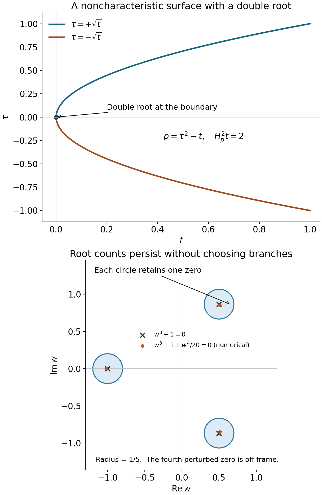

# Why supported Cauchy solvability forces hyperbolicity

Original programme exposition and all twenty original complete exercise solutions are retained here. Current source and proof review: GPT-6 Astra (OpenAI), Ultra, 5 October 2026. This independently written lesson and its added illustration are dedicated under CC0. Earlier linked components retain their own licences and notices. All nine user-approved purchased books are valid mathematical sources and ordinary citations; no citation replaces a complete programme proof.

Begin with [higher-order Cauchy roots, jets and propagation](../20261005-restored-higher-order-cauchy/higher-order-cauchy-roots-jets-and-propagation.md), which proves sufficiency for strictly hyperbolic operators. The planar local solver used below is proved in the [function normal-form lesson](../20261005-restored-function-normal-forms/real-and-complex-symplectic-function-normal-forms.md). Here we ask what the support of solutions forces on the principal symbol.

The argument has three stages. A support hypothesis produces a uniform dual estimate. A forbidden principal symbol then produces adjoint tests whose residuals are arbitrarily small on the permitted solution support, although their pairing with concentrated sources stays nonzero. Finally, a root-count argument describes the multiple real roots that can remain at the initial surface under a principal-type hypothesis.

## 1. Two support hypotheses and their different conclusions

Write \(D_j=-i\partial_{x_j}\). For an order-\(m\) scalar smooth differential operator \(P\), write \(p(x,\xi)\) for its homogeneous principal polynomial. We use the Hermitian pairing \((f,v)=\int f\overline v\,dx\), linear in its first entry, and the formal adjoint \(P^*\) for Lebesgue measure in the local coordinates used below. After flattening the surface we make this choice in the flattened coordinates; each subsequent linear dilation then has exactly its displayed constant Jacobian. Its principal polynomial is the coefficientwise conjugate of \(p\). The lower terms of the adjoint will be retained throughout the construction. The discussion of nonconstant principal polynomials assumes \(m\ge1\); the order-zero nonzero case has the elementary conclusions directly.

**Theorem 1.1 (one-sided solvability forces real normal roots).** Let \(X\) be smooth, \(Y\subset X\) open, and \(\phi\) real and smooth with \(d\phi\ne0\). Suppose that for every \(f\in C_c^\infty(X)\) supported in \(\overline{\{\phi>0\}}\) there is an ambient distribution \(u\) supported in that same closed set such that \(Pu=f\) in \(Y\). At every \(x_0\in Y\cap\{\phi=0\}\) and every real covector \(\xi\),

\[
 \tau\longmapsto p(x_0,\xi+\tau d\phi(x_0))
 \quad\hbox{has only real roots, or is identically zero.}                 \tag{HN1}
\]

The ambient support condition permits the adjoint test to cross the surface. It is not merely a statement about a distribution defined on the open positive side. Compact smooth sources suffice; in particular the conclusion remains valid under the original stronger hypothesis allowing every smooth supported source. No continuous choice of solutions is assumed. The identically-zero exception matters: this theorem alone does not make the initial surface noncharacteristic.

For the second statement use coordinates \(x=(x',t)\) on \(\mathbb R^n\), and put

\[
 K_a=\{(x',t):t\ge a|x'|\}.                                             \tag{HN2}
\]

**Theorem 1.2 (a finite cone of support forces a noncharacteristic normal).** Let \(X\subset\mathbb R^n\) be open, fix \(0<B\le A\), and let \(0\in Y\subset X\) with \(Y\) open. Suppose every \(f\in C_c^\infty(X)\) supported in \(K_A\) has an ambient distribution \(u\in\mathcal D'(X)\) supported in \(K_B\), satisfying \(Pu=f\) on \(Y\). If \(p(0,\cdot)\) is not the zero polynomial, then

\[
 p(0,dt)\ne0.                                                          \tag{HN3}
\]

The inequality \(B\le A\) lets the allowed solution cone contain the source cone. The strict inequality \(B>0\) is a separate geometric requirement. It will make a normal exponential decay along every nonzero direction of the test cone. Neither theorem asserts a Section23.4 existence result or deals with arbitrary systems.

## 2. From arbitrary supported solutions to one dual estimate

Flatten the first surface to \(t=0\), localize inside \(Y\), and fix a compact test neighborhood \(K\) of the chosen boundary point inside a sufficiently small coordinate ball. For the cone problem keep the stated Euclidean coordinates. Let \(C_f\) be the permitted closed source support and \(C_u\) the permitted solution support. They are respectively the same half-space, or \(K_A,K_B\).

Let \(E\) be the space of smooth functions on \(\mathbb R^n\) with bounded derivatives of every order and support in \(C_f\). Give it the increasing seminorms

\[
 F_k(f)=\sum_{|\alpha|\le k}\sup_{\mathbb R^n}|D^\alpha f|.
                                                                         \tag{HN4}
\]

It is a Fréchet space: a sequence Cauchy in every seminorm has uniform limits of every derivative, these limits are compatible derivatives of one smooth function, and the support condition passes to the limit. A fixed compact chart cutoff equal to one near \(K\) turns each member into an admissible source on \(X\), without changing its pairing with a test in \(K\). In the cone theorem the resulting source is compactly supported in \(X\), exactly as its hypothesis requires. This also proves continuity of that extension in all these seminorms. The complete countable-seminorm metric and Baire proofs are [Sections 14.1–14.2 and 6 of the included test-space foundations](../20261004-free-tangent-zoom/prerequisites/complete-test-spaces.md). Here the same coordinate fundamental-theorem argument applies to uniform derivative limits on all of Euclidean space: pass each uniform limit through every fixed coordinate segment, then identify the derivative of the limit. The global suprema stay finite and the function is zero off the closed permitted support. Thus the stated source space is complete for exactly these seminorms. Operator coefficients may be extended smoothly beyond the chart for notation; every test and every use of the equation remain inside it.

Let \(V\) consist of smooth tests supported in \(K\), and give it the increasing seminorms

\[
 Q_k(v)=\sum_{|\beta|\le k}\sup_{C_u}|D^\beta P^*v|.                      \tag{HN5}
\]

These need not give a complete or initially Hausdorff topology. Their common null space will cause no difficulty.

For fixed \(v\), the functional \(f\mapsto(f,v)\) is continuous in \(E\), since its integral is over a fixed compact set. For fixed \(f\), choose any solution \(u\) supplied by the hypothesis. The distributional equation and support give

\[
 (f,v)=(u,P^*v),\qquad |(f,v)|\le C_f Q_{k_f}(v).                         \tag{HN6}
\]

Here is the precise support estimate behind this assertion. Choose a cutoff \(\eta\) supported in a larger closed coordinate ball and equal to one near \(K\). The compactly supported distribution \(\eta u\) has some finite order \(k_f\), and its support lies in the compact convex set formed by intersecting that ball with \(C_u\). Every two points in that set are connected by their straight segment. [The complete same-order convex-support proof, C1–C5](../20261005-hyperbolicity-necessity-foundations/convex-support-and-finite-jets.md), therefore bounds the action of \(\eta u\) by derivatives through that same order on the set itself. Since \(P^*v\) and all its derivatives vanish off \(K\), the supremum is bounded by the one on \(C_u\). Also \((u,P^*v)=(\eta u,P^*v)\). No cutoff derivative has been inserted into \(P^*v\). This proves HN6 for both the half-space and the cone. A whole-space estimate without the support restriction would not prove the needed assertion.

We now make the two derivative budgets uniform. Choose a countable zero-neighborhood base \(V_j\) for the seminorm topology of \(V\), for instance with \(Q_j(v)<1/j\), and set

\[
 A_j=\{f\in E: |(f,v)|\le1\text{ for every }v\in V_j\}.                 \tag{HN7}
\]

Each \(A_j\) is closed by continuity for fixed \(v\). Their union is \(E\) by HN6. The Baire property of \(E\) gives an \(A_j\) with nonempty interior. Differences of two points of this interior contain a neighborhood of zero on which the pairing has absolute value at most two against every \(v\in V_j\). Scaling the two neighborhoods gives joint continuity. Taking the largest of the finitely many derivative orders in these neighborhoods yields some \(N,C\), independent of \(f,v\), such that

\[
 |(f,v)|\le C F_N(f) Q_N(v).                                            \tag{HN8}
\]

If either seminorm on the right is zero, scaling and continuity make the pairing zero, so the inequality still holds. In particular it vanishes on the common null space of the \(Q_k\). We may quotient by that space. Completeness of \(V\), uniqueness of \(u\), and a linear selection \(f\mapsto u\) have not been used.

## 3. The smooth local inverses used in transport

We need actual smooth local solutions of two fixed differential equations, with fixed neighborhoods at every step of a finite recursion.

**Lemma 3.1 (convolution gives a joint smooth local solver).** Let \(Q(D)\ne0\) have constant coefficients. On nested relatively compact patches, its equation has a linear local right inverse continuous in smooth seminorms. It also preserves smooth dependence on passive parameters, on fixed parameter patches.

**Proof.** [F1–F4 of the included constant-coefficient companion](../20261005-hyperbolicity-necessity-foundations/constant-coefficient-fundamental-solutions.md) construct a distribution \(E_Q\) with \(Q(D)E_Q=\delta\) for every nonzero \(Q\), without ellipticity. That proof gives the actual compact rotation average, uniform denominator bound, absolutely convergent distribution integral, transpose identity and Fourier inversion. For an input \(g\) with fixed compact support \(S\), define \(Tg=E_Q*g\). On an output compact set \(A\), only the restriction of \(E_Q\) to a slightly enlarged compact difference set \(A-S\) contributes. That restriction has finite order \(k\). All output and passive parameter derivatives pass to \(g\), and hence

\[
 \sup_A|\partial_y^\alpha\partial_\lambda^\beta Tg|
 \le C\sum_{|\gamma|\le k}
             \sup_S|\partial_y^{\alpha+\gamma}\partial_\lambda^\beta g|.  \tag{HN9}
\]

This proves joint smoothness and continuity; the difference-quotient justification for every derivative and the fixed compact difference set are supplied in F5 of that companion. Constant-coefficient differentiation of convolution gives \(Q(D)Tg=g\). For a local right side, multiply by a fixed cutoff equal to one on the target patch and supported in the larger patch, then extend by zero before convolution. The equation remains valid on the target patch. The distribution \(E_Q\) is fixed; no smoothly chosen family as \(Q\) varies, temperedness, or support condition on \(E_Q\) is needed. \(\square\)

For \(z=s+it\), the other operator is

\[
 L=D_t-iD_s=-(\partial_s+i\partial_t)=-2\partial_{\bar z},
 \qquad E_L=-\frac1{2\pi z},\qquad LE_L=\delta.                          \tag{HN10}
\]

The distributional identity \(\partial_{\bar z}(1/(\pi z))=\delta\) fixes the sign. This is the constant case of the planar solver proved in U026, Lemma7.1. Convolving compact smooth planar extensions proves the same estimates with every other coordinate treated as a passive parameter. Repeat this local inverse \(r\) times, using fixed cutoffs equal to one on the same smaller patch. Each intermediate function is smooth on the larger patch, and each equation holds on a neighborhood of the smaller patch. Differentiating these local identities shows that the repeated inverse solves \(L^r w=g\) there. If \(a\) is smooth and nonzero, first solve \(L^r w=g/a\); this is a right inverse for \(aL^r\). Dividing the right side does not require commuting a variable coefficient through \(L\).

## 4. A finite transport construction with an explicit derivative budget

The following form of the construction will be used twice. Let \(h\in(0,1]\), let \(P_h\) be the pulled-back full adjoint operator, and let \(\Psi\) be a fixed smooth complex phase on a small neighborhood \(U\) of zero. Suppose that, for an integer \(A_0\),

\[
 R_h=h^{A_0}e^{-i\Psi/h}P_he^{i\Psi/h}                                  \tag{HN11}
\]

is a differential operator of bounded order whose coefficients extend smoothly in \((h,y)\) to \(h=0\). Suppose \(T_0=R_0\) has a fixed smooth local right inverse as above, and \(T_0 1=0\). Assume \(\operatorname{Im}\Psi\ge0\) on the permitted test cone \(C_u\cap U\), and that it is strictly positive there away from zero. These assertions will be checked for each actual phase.

For any fixed integer \(J\), ordinary finite Taylor expansion in \(h\) gives

\[
 R_h=\sum_{\ell=0}^J h^\ell T_\ell+h^{J+1}S_{J,h}.                       \tag{HN12}
\]

The coefficient derivatives of \(S_{J,h}\), through any prescribed finite order, are uniformly bounded on compact subsets of \(U\). This is Taylor's theorem with its integral remainder, not an analytic series. The expansion may be taken to higher finite order whenever a higher derivative budget is required.

Set \(v_0=1\) on \(U\). With the same larger and smaller patches at every step, solve recursively

\[
 T_0v_j=-\sum_{\ell=1}^jT_\ell v_{j-\ell},\qquad 1\le j\le J.            \tag{HN13}
\]

Each right side is a smooth function on the larger patch because the preceding amplitudes are smooth there. The right inverse extends it by a fixed compact cutoff before solving. Each equation holds on one common smaller patch \(V\). There are finitely many amplitudes, so all their derivatives needed below are bounded on its compact subsets. There is no shrinking neighborhood as the recursion proceeds.

Choose \(\chi\) supported in \(V\) and equal to one near zero, and define

\[
 v_h=\chi e^{i\Psi/h}\sum_{j=0}^J h^jv_j.                               \tag{HN14}
\]

On the region where the transport equations hold, substituting HN13 in HN12 cancels every power through \(h^J\). Differentiation of the exponential costs at most one factor \(h^{-1}\) per derivative. On \(C_u\) its modulus is at most one. Thus, before the cutoff commutator, derivatives of \(P_hv_h\) through order \(N\) are bounded by

\[
 C_{J,N}h^{J+1-A_0-N}.                                                  \tag{HN15}
\]

The coefficients of \(P_h\) and each of their fixed derivatives grow at most as a fixed power of \(h^{-1}\) in the applications. The commutator \([P_h,\chi]\) is supported in a fixed compact annulus away from zero. On its intersection with \(C_u\), the imaginary part of the phase has a positive minimum \(c\). Every differentiated commutator term is therefore bounded by \(C h^{-b}e^{-c/h}\), for some fixed \(b\). This is \(O(h^M)\) for every prescribed \(M\): with \(s=1/h\), the function \(s^{b+M}e^{-cs}\) is bounded on \([1,\infty)\).

Consequently, given the budget \(N\) and a target power \(M\), take for example

\[
 J=A_0+N+M.
 \quad\Longrightarrow\quad
 \sum_{|\beta|\le N}\sup_{C_u}|D^\beta P_hv_h|\le C_{N,M}h^M.             \tag{HN16}
\]

All coefficient expansions, inverses and cutoffs are finite. The constants can depend on \(N,M\), the fixed operator and the selected point. They are independent of \(h\). The dual estimate chooses \(N\) first; the construction then chooses \(M,J\). It does not need one test that satisfies every derivative budget at once.

## 5. A nonreal root contradicts the one-sided estimate

Fix a point of the initial surface and flatten it to \(t=0\), with the selected point at zero. Suppose the principal polynomial in HN1 is not identically zero and has a nonreal root. By absorbing any real normal component of the covector into the root, write the covector as a real tangential one \(\xi'\). It is nonzero: when \(\xi'=0\), homogeneity gives either a constant multiple of \(\tau^m\) or the zero polynomial, and neither has a finite nonreal root.

Multiply \(\xi'\) and the root by the real nonzero scalar \(-1/\operatorname{Im}\tau\). Homogeneity retains the root and makes its imaginary part \(-1\). Use \(s=\langle x',\xi'\rangle+t\operatorname{Re}\tau\) as one tangential coordinate, keeping \(t\) and completing to coordinates \((x'',s,t)\). The root covector becomes \(ds-i\,dt\). Restricting the principal polynomial to the last two frequency variables gives

\[
 p(0,0,\eta_s,\eta_t)=(\eta_t+i\eta_s)^r Q(\eta_s,\eta_t),
 \qquad 1\le r\le m,\qquad Q(1,-i)\ne0.                                \tag{HN17}
\]

The first zero here abbreviates the other frequency variables. The multiplicity \(r\) is finite, and \(Q\) is homogeneous of degree \(m-r\). The adjoint factor is \((\eta_t-i\eta_s)^r\overline Q\), with coefficientwise conjugation.

Choose an integer \(\nu>r\), put \(h=1/\rho\), and use the shrinking map

\[
 x''=h^\nu y'',\qquad (s,t)=h^{2\nu}(y_s,y_t).
 \quad dx=h^{\nu(n+2)}dy.                                               \tag{HN18}
\]

The derivatives in the first variables scale by \(h^{-\nu}\); the last two scale by \(h^{-2\nu}\). Let \(P_h\) be the pullback of the full formal adjoint, including every lower-order and adjoint coefficient term. On a fixed small \(y\)-patch,

\[
 h^{2m\nu}P_h
   =\overline p(0,0,D_{y_s},D_{y_t})+h^\nu B_h,                         \tag{HN19}
\]

where \(B_h\) has order at most \(m\) and smooth coefficient extensions to \(h=0\), with all fixed derivative bounds.

To verify this fully, a monomial with differential order \(k\) and \(\ell\) derivatives in the last two variables has scaling weight \(\nu(k+\ell)\). The maximal weight \(2m\nu\) is attained only by the order-\(m\), purely planar terms. Every other principal monomial loses at least \(\nu\), and every lower-order monomial loses at least \(2\nu\). The coefficients of the surviving planar terms differ from their values at zero by \(h^\nu\) times a smooth function of \((h,y)\), by Taylor's integral formula along the shrinking map. Derivatives falling on coefficients in the adjoint are already in lower differential orders. These facts prove HN19 and its differentiated version. For negative \(h\), the same integer-power coordinate map gives a smooth extension; only positive \(h\) is used in the estimate.

Write \(z=y_s+i y_t\), and choose the fixed phase

\[
 \Psi(y)=i|y''|^2+2z+iz^2,
 \qquad L\Psi=0,
 \qquad \operatorname{Im}\Psi=|y''|^2+y_s^2+2y_t-y_t^2.                  \tag{HN20}
\]

For \(0\le y_t\le1\),

\[
 \operatorname{Im}\Psi-|y|^2=2y_t(1-y_t)\ge0.                            \tag{HN21}
\]

Choose \(U\) so small that this applies everywhere on its positive side. Thus the phase satisfies the positivity and annulus requirements of Section4 for exactly the support half-space used in HN8.

The leading conjugated frozen operator has power \(h^{-(m-r)}\): its \(r\) factors \(L\) differentiate only the amplitude because \(L\Psi=0\), while the remaining degree-\(m-r\) factor contributes its phase gradient. Put

\[
 A_0=2m\nu+m-r,\qquad
 a(y)=\overline Q(\Psi_{y_s},\Psi_{y_t}),\qquad T_0=a(y)L^r.              \tag{HN22}
\]

At zero the phase gradient is \((2,2i)\), so
\(a(0)=2^{m-r}\overline{Q(1,-i)}\ne0\). Shrink \(U\) until \(a\) stays nonzero. In fact \(La=0\), because the planar gradient components are holomorphic in \(z\); the right-inverse construction only needs nonvanishing. The constant amplitude satisfies \(T_0 1=0\).

We must check that HN11 really is smooth at \(h=0\), not just identify its first symbol. The frozen planar factor \(\overline Q(D_s,D_t)L^r\) conjugates to a polynomial in \(h^{-1}\) of degree at most \(m-r\), with leading coefficient \(aL^r\). Its lower powers become nonnegative integer powers after multiplication by \(h^{m-r}\). The perturbation \(h^\nu B_h\) in HN19 can acquire at most \(h^{-m}\) from phase differentiation. After the same normalization, its smallest power is \(h^{\nu-r}\), which is positive because \(\nu>r\). Its coefficients are smooth jointly in \((h,y)\). Thus the entire normalized operator extends smoothly and has precisely the \(T_0\) in HN22. Lemma3.1 and HN10 provide the required fixed local right inverse, including all passive-variable derivatives.

Apply Section4. For any prescribed \(M\), it supplies a compact test \(v_h\) with the full adjoint residual bounded by \(h^M\) through the order \(N\) already supplied by HN8.

Pull HN8 back by HN18. Each source or residual derivative costs at most \(h^{-2\nu N}\), and the pairing costs the reciprocal Jacobian. Hence the safe rescaled estimate is

\[
 |(f,v)|\le C h^{-\kappa}F_N(f)
             \sum_{|\beta|\le N}\sup_{y_t\ge0}|D_y^\beta P_hv|,
 \qquad \kappa=\nu(n+2+4N).                                             \tag{HN23}
\]

For small \(h\), all pulled-back tests lie inside the original fixed test set, so its estimate applies. Global sources can be extended by zero through the fixed chart because their supports shrink strictly inside it.

Choose a compact smooth \(F\) supported in the open positive half-space and set \(f_h(y)=h^{-n}F(y/h)\). Then \(F_N(f_h)\le C h^{-n-N}\). On changing variables \(y=hw\) in the Hermitian pairing, the amplitude sum tends to one and

\[
 \Psi(hw)/h\longrightarrow2(w_s+iw_t),\qquad
 (f_h,v_h)\longrightarrow\int F(w)e^{-2iw_s-2w_t}\,dw.                  \tag{HN24}
\]

The convergence is uniform on the fixed compact support of \(F\), so passage through the integral is justified. Take \(F=e^{2iw_s}G\), with \(G\) nonzero, nonnegative, smooth and compactly supported in that open half-space. The limit is the positive number \(\int G e^{-2w_t}\). This is the conjugate-pairing convention corresponding to the source's displayed conjugated integral; its absolute value gives the same contradiction.

Choose \(M>\kappa+n+N\). By HN16 and HN23, the right side is \(O(h^{M-\kappa-n-N})\), tending to zero. HN24 gives a nonzero limit on the left. This contradiction excludes the chosen nonreal root and proves Theorem1.1. \(\square\)

## 6. The cone proof and its nonelliptic tangential equation

Assume the hypotheses of Theorem1.2, but suppose \(p(0,dt)=0\). In one dimension a nonzero homogeneous polynomial is a nonzero multiple of the normal monomial, so this is already impossible. For \(n\ge2\), expand the nonzero frozen homogeneous polynomial as

\[
 p(0,\eta',\eta_t)=\sum_{j=r}^m q_j(\eta')\eta_t^{m-j},
 \qquad 1\le r\le m,\qquad q_r\ne0.                                    \tag{HN25}
\]

Each \(q_j\) is homogeneous of degree \(j\). The degree-zero tangential coefficient is zero because \(p(0,dt)=0\); take \(r\) to be the first nonzero tangential degree.

Choose an integer \(\nu>r\) and the isotropic shrinking pullback

\[
 x=h^\nu y,\qquad D_x=h^{-\nu}D_y,\qquad dx=h^{n\nu}dy.                  \tag{HN26}
\]

It preserves both cones exactly. This is equivalently \(y=\rho^\nu x\). The printed coordinate formula on the approved 2007 H3 edition, PDF page 418 has the inverse dilation; the following coefficient-freezing estimate requires HN26. For example, a coefficient \(1+x_1\) becomes \(1+h^\nu y_1\) under HN26, whereas the inverse formula would sample \(1+h^{-\nu}y_1\). We use the actual shrinking map throughout.

For the full pulled-back adjoint,

\[
 h^{m\nu}P_h=\sum_{j=r}^m\overline{q_j}(D_{y'})D_{y_t}^{m-j}
                  +h^\nu B_h.                                        \tag{HN27}
\]

Here \(B_h\) has smooth coefficient extensions and bounded differential order. Principal coefficient variation is divisible by \(h^\nu\), and every lower-order term loses at least that power before conjugation. This includes terms generated by adjoint differentiation of coefficients.

Take

\[
 \Psi=iy_t,\qquad A_0=m\nu+m-r,
 \qquad T_0=i^{m-r}\overline{q_r}(D_{y'}).                               \tag{HN28}
\]

Conjugation replaces \(D_{y_t}\) by \(D_{y_t}+i/h\) and leaves the tangential derivatives unchanged. In the frozen operator the first power is \(h^{-(m-r)}T_0\). All other frozen terms, and all other terms from the binomial expansion of the first one, have lower powers of \(h^{-1}\). The perturbation in HN27 can have at most \(h^{-m}\) from its phase, so after normalization its smallest exponent is \(\nu-r>0\). More explicitly, a lower-order monomial of order \(k\le m-1\) has exponent at least \((m-k)\nu+m-k-r\ge\nu+1-r>0\) in HN11. Thus \(R_h\) extends smoothly to zero, and its limiting operator is exactly HN28.

This is a fixed nonzero constant-coefficient tangential operator. Its order is \(r\ge1\), so \(T_0 1=0\). It need not be elliptic. Lemma3.1 gives its smooth local right inverse, with \(y_t\) as a passive parameter. The fixed cutoffs and common neighborhoods from Section4 therefore apply.

The required phase positivity on the test cone is stronger than on a half-space. If \(y\in K_B\), then

\[
 y_t\ge \frac{B}{\sqrt{1+B^2}}|y|.                                      \tag{HN29}
\]

Indeed \(|y'|\le y_t/B\) implies \(|y|^2\le(1+B^{-2})y_t^2\). On the support of a cutoff derivative at distance at least \(\delta>0\) from zero, HN29 gives \(y_t\ge B\delta/\sqrt{1+B^2}>0\). The factor \(e^{-y_t/h}\) suppresses every polynomial derivative loss there. When \(B=0\), the boundary plane is undamped, which is why this proof cannot drop that assumption.

The pullback of HN8 has a safe loss

\[
 |(f,v)|\le C h^{-\kappa_c}F_N(f)
          \sum_{|\beta|\le N}\sup_{K_B}|D_y^\beta P_hv|,
 \qquad \kappa_c=\nu(n+2N).                                             \tag{HN30}
\]

Choose a nonzero nonnegative smooth \(F\) supported compactly in the interior of \(K_A\), and put \(f_h=h^{-n}F(y/h)\). Isotropic dilations preserve its cone support; it is an admissible concentrated source. Section4 supplies the test with residual \(O(h^M)\) in the exact \(K_B\) seminorm. Its pairing satisfies

\[
 (f_h,v_h)\longrightarrow\int F(w)e^{-w_t}\,dw>0.                        \tag{HN31}
\]

Taking \(M>\kappa_c+n+N\) makes the right side of HN30 tend to zero, a contradiction. Hence \(p(0,dt)\ne0\), proving Theorem1.2. \(\square\)

## 7. A multiple real root and the allowed parameter directions

The next assertion is a statement about a **real** smooth fiber polynomial \(p\). The real representative matters for the sign of its Hamilton square. The covector at the root must also be nonzero: a principal-type condition on the punctured cotangent bundle gives no information at its zero section.

**Theorem 7.1 (simple roots inside, positive double contact on the boundary).** Let \(\phi\) be real and smooth and let \(p\) be a real smooth polynomial along the cotangent fibers, with

\[
 dp\ne0\quad\hbox{on }T^*X\setminus0.                                  \tag{HN32}
\]

Suppose for \(\phi(x)\ge0\) every finite root of \(p(x,\xi+\tau d\phi(x))\) is real, unless that polynomial is identically zero. At a root whose resulting covector \(\xi+\tau d\phi(x)\) is nonzero, a finite multiplicity \(k>1\) is possible only if

\[
 \phi(x)=0,\qquad k=2,\qquad
 H_p^2\phi(x,\xi+\tau d\phi(x))>0.                                      \tag{HN33}
\]

Only nonvanishing of \(dp\) at the root will be needed in the proof; HN32 states the hypothesis of the source. The polynomial here need not be homogeneous. If \(d\phi=0\), the directional polynomial is constant, so it has no finite root of a positive order: a zero constant belongs to the identically-zero exception. Otherwise flatten \(\phi=x_n\), shift the normal-frequency root to zero, and write its normal-frequency displacement as \(\theta\). For a multiplicity \(k>1\),

\[
 p(0,\theta)=b\theta^k+O(|\theta|^{k+1}),\qquad
 b=\frac1{k!}\partial_{\xi_n}^k p\ne0.                                 \tag{HN34}
\]

All points in the following perturbations stay in a neighborhood of the original nonzero covector.

**Lemma 7.2 (a two-sided parameter derivative vanishes).** If an allowed real parameter direction \(\sigma\) can be varied with both signs while retaining the all-real-root hypothesis, then \(\partial_\sigma p=0\) at this multiple root.

**Proof.** If \(a=\partial_\sigma p\ne0\), finite Taylor expansion gives

\[
 p(\sigma,\theta)=a\sigma+b\theta^k
          +O(\sigma^2+|\sigma\theta|+|\theta|^{k+1}).                    \tag{HN35}
\]

The estimates also hold for complex \(\theta\) on small discs: dependence in that variable is polynomial, and its finitely many coefficients are smooth in \(\sigma\). Set \(\sigma=\varepsilon^k s\), \(\theta=\varepsilon w\), divide by \(\varepsilon^k\), and let positive \(\varepsilon\) tend to zero. The resulting polynomials converge uniformly on every fixed complex disc to

\[
 a s+b w^k.                                                            \tag{HN36}
\]

**Complete circle-count bridge.** The earlier [polynomial factorization and circle moments, A1 and A5](../20261005-restored-quadratic-forms/spectral-algebra-and-contour-projections.md), suffice. If a nonzero polynomial \(R\) has no zero on a positively oriented circle \(\gamma\), factor it as \(c\prod_j(w-\lambda_j)\), counting multiplicities. Finite differentiation gives \(R'/R=\sum_j(w-\lambda_j)^{-1}\). The proved circle integral for each summand is one when its root is inside and zero when outside. Consequently
\[
 N_\gamma(R)=\frac1{2\pi i}\oint_\gamma\frac{R'(w)}{R(w)}\,dw
      =\#\{\hbox{zeros inside }\gamma,\hbox{ with multiplicity}\}.
 \tag{HN43}
\]
For a continuous coefficient family nonzero on the circle, compactness of the parameter interval and circle gives a positive denominator lower bound. The numerator is continuous, so the integral is continuous in the parameter. It is integer valued by the factorization identity at each parameter, and therefore constant on the interval by the intermediate value theorem. Degrees may drop: no constant-degree hypothesis or root labeling enters. In our straight homotopy the boundary difference is smaller than the limiting modulus, so the triangle inequality gives precisely that uniform nonvanishing. It also excludes an identically-zero approximating polynomial. Thus the root count used in the next paragraph has its full programme proof.

For \(s\ne0\), this binomial has \(k\) simple roots. Surround them by small disjoint circles. Its modulus has a positive minimum on their boundaries. Uniform convergence makes the difference smaller than that minimum. The straight homotopy between the limiting polynomial and each approximating polynomial then stays nonzero on every circle, so its winding count, and hence its number of enclosed zeros with multiplicity, is unchanged. Each limiting root is approximated by a root of the original polynomial. A nonreal limiting root can be surrounded by a disc avoiding the real axis, contradicting the all-real-root hypothesis. Thus all \(k\) binomial roots must be real.

For \(k\ge3\), a real equation \(w^k=c\ne0\) has at most two real roots, strictly fewer than \(k\). For \(k=2\), one sign of \(s\) makes \(-as/b\) negative. Both cases contradict the permitted two signs. Hence \(a=0\). \(\square\)

This proves the first-derivative consequence needed here without smooth individual root branches. H1 Lemma8.7.2 gives a stronger lower-jet conclusion in its microhyperbolic setting. H3 applies its directional analyticity mechanism to fiber polynomials. We declare that stronger result as context; the full proof here needs only Lemma7.2, whose finite expansion uses smooth parameter dependence and polynomial root dependence directly.

At an interior point \(x_n>0\), every base and cotangent parameter direction other than \(\xi_n\) can be perturbed with both signs. Lemma7.2 makes all their first derivatives vanish. The derivative in \(\xi_n\) already vanishes at a multiple root. Thus \(dp=0\), contradicting HN32. Every finite root at a nonzero covector is simple in the interior.

At \(x_n=0\), both signs are available for all tangential base variables and every cotangent parameter other than \(\xi_n\). Therefore their first derivatives vanish. The only remaining possible derivative is

\[
 a=p_{x_n}\ne0,                                                        \tag{HN37}
\]

by HN32. In this normal base direction only \(s\ge0\) is allowed. Applying the same scaling and circle argument to \(s>0\) shows that HN36 must have \(k\) real roots. This happens only for \(k=2\) and \(ab<0\).

With the convention

\[
 H_p=\sum_j\bigl(p_{\xi_j}\partial_{x_j}
                              -p_{x_j}\partial_{\xi_j}\bigr),           \tag{HN38}
\]

we have at the root

\[
 H_p x_n=p_{\xi_n}=0,\qquad
 H_p^2x_n=\sum_j p_{\xi_j}p_{x_j\xi_n}
                    -\sum_j p_{x_j}p_{\xi_j\xi_n}
          =-p_{x_n}p_{\xi_n\xi_n}=-2ab>0.                              \tag{HN39}
\]

Every first-half term vanishes because all \(p_{\xi_j}\) vanish; every tangential term in the second half vanishes because \(p_{x_j}=0\) for \(j<n\). This accounts for the complete Hamilton derivative, not just its normal contribution. It proves Theorem7.1. \(\square\)

## 8. What the boundary model says, and what it leaves open

Consider

\[
 p(t,x,\tau,\eta)=\tau^2-t|\eta|^2.                                    \tag{HN40}
\]

At \(t=0,\eta\ne0,\tau=0\),

\[
 dp=-|\eta|^2dt,\qquad H_p^2t=2|\eta|^2>0.                             \tag{HN41}
\]

For \(t>0\) and \(\eta\ne0\) the two normal roots are \(\pm\sqrt t\,|\eta|\). They merge at the initial surface and are not smooth uniformly separated branches through it. The normal polynomial remains noncharacteristic because its \(\tau^2\) coefficient is one. A surface can therefore be noncharacteristic while carrying such a double normal root at a nonzero characteristic covector. Those are two different tests of the polynomial.

At a double root the sign conclusion survives replacing \(p\) by \(c p\), for any smooth nonvanishing **real** \(c\). Indeed \(H_{cp}=cH_p+pH_c\); using \(p=0\), \(H_pp=0\), and \(H_p\phi=0\) at the root gives

\[
 H_{cp}^2\phi=c^2H_p^2\phi.                                            \tag{HN42}
\]

For a complex multiplier \(i\), instead, \(H_{ip}^2\phi=-H_p^2\phi\). Thus a real representative must be explicit in a theorem that states a positive Hamilton square. Also the one-dimensional symbol \(p(\tau)=\tau^3\) has \(dp\ne0\) for \(\tau\ne0\), but its triple root lies at the zero covector. It confirms why a punctured-bundle hypothesis cannot control roots there.

**Two exact root mechanisms.** Top: in HN40 set \(|\eta|=1\). The two branches \(\tau=\pm\sqrt t\), shown for \(0\le t\le1\), meet at the nonzero characteristic covector with \(\tau=0,\eta=1\). The normal leading coefficient is one and \(H_p^2t=2\); their merger does not make the initial surface characteristic. Bottom: the black crosses are the three exact roots of \(w^3+1\), and each blue circle has radius \(1/5\). On any such circle, the limiting modulus is at least \((1/5)(\sqrt3-1/5)^2\), since the other two roots are at distance \(\sqrt3\) from its center. The perturbation \(\varepsilon w^4\), \(0\le\varepsilon\le1/20\), has size at most \((1/20)(6/5)^4=0.10368\), strictly smaller than that lower bound. HN43 therefore proves that each circle contains exactly one zero throughout this homotopy. The orange points are numerical roots at \(\varepsilon=1/20\), provided only as an illustration; the additional fourth root lies outside the plotted window. The two nonreal circles avoid the real axis, which is the obstruction used in Lemma 7.2. [Reproducible figure](figures/boundary_roots_and_counts.py), [vector version](figures/boundary_roots_and_counts.svg).

Finally, a genuine double characteristic with \(dp=0\) falls outside Theorem7.1. The real-root and support conditions alone do not supply the principal-type hypothesis or settle the effect of lower-order terms there. The source points toward subprincipal restrictions and later theory. No such sufficiency theorem follows from the contradictions proved above. The next principal-type lesson must address the boundary double-root construction itself.

## 9. Graded original exercises with complete solutions

**Exercise 1 (foundation: support and distributional order).** Let \(a\) be smooth and compactly supported on the boundary plane, and let \(w=\partial_t^k(a(x')\delta(t))\). Bound its action on a smooth function by derivatives on a compact convex half-ball containing its support. Explain why localization of a general supported distribution requires the support theorem, rather than simply replacing a whole-space supremum by a smaller one.

**Solution.** By the definition of a distributional derivative,
\[
 w(\psi)=(-1)^k\int a(x')\partial_t^k\psi(x',0)\,dx',
 \qquad |w(\psi)|\le\|a\|_{L^1}\sup_{\operatorname{supp}a\times\{0\}}
                                     |\partial_t^k\psi|.
\]
The support lies in the convex half-ball, so its supremum is bounded by the derivative supremum on that half-ball, through exactly order \(k\). For a general distribution the original finite-order bound concerns an ambient compact neighborhood. An inequality with that larger supremum does not imply one with the smaller support supremum. H1 Theorem2.3.10 supplies that implication under the compact-set curve hypothesis. Intersecting the support half-space or cone with a closed ball verifies the hypothesis by straight segments. Multiplying the distribution by a cutoff equal to one near the test support preserves its action there and creates the required compact support. This is the additional analytic step.

**Current complete provider.** The straight-segment convex case just used is proved in [C1–C5 of the included convex-support companion](../20261005-hyperbolicity-necessity-foundations/convex-support-and-finite-jets.md), including the finite-jet extension and the same-order estimate. This supplies the programme proof for the cited mathematical antecedent without replacing the original solution above.

**Exercise 2 (foundation: null directions in the dual topology).** Suppose all \(Q_k(v)\) vanish. Show that \((f,v)=0\) for every \(f\in E\), and explain why the Baire proof is valid even if solutions are neither unique nor selected linearly.

**Solution.** Fix \(f\), choose any one supported solution, and use HN6. It gives \(|(f,v)|\le C_f Q_{k_f}(v)=0\). Thus the pairing descends to the quotient by the common null space. For each fixed test, source continuity is an integral estimate independent of solutions. For each fixed source, one solution proves continuity in the quotient test topology. The closed sets HN7 depend on the pairing itself, not on a solution selection. Their union is \(E\), and the only complete space used in the Baire argument is the source Fréchet space. Different choices of solutions give the same pairings by the equation. Neither linear dependence nor uniqueness enters the joint-continuity step.

**Exercise 3 (foundation: why the zero polynomial exception is necessary).** In two variables let \(P=D_x\), and let the initial side be \(t\ge0\). Construct a supported smooth solution for every smooth supported source, and compare the conclusion with noncharacteristicity.

**Solution.** Define
\[
 u(x,t)=i\int_0^x f(s,t)\,ds.
\]
It is smooth, and \(D_xu=-i\partial_xu=f\). For \(t<0\) the source vanishes for every \(s\), so \(u=0\) there. Hence its support lies in the closed positive side. The principal symbol is \(p(\eta,\tau)=\eta\), and the normal directional polynomial is a nonzero constant when \(\eta\ne0\), with no roots, or identically zero when \(\eta=0\). This satisfies Theorem1.1 exactly. Nevertheless \(p(dt)=0\), so the surface is characteristic. One-sided support alone has not proved Theorem1.2's cone conclusion.

**Exercise 4 (foundation: an elliptic polynomial supplies the forbidden root).** For \(P=D_s^2+D_t^2\), compute the root multiplicity and quotient in HN17, then the leading transport coefficient for the phase HN20. State the supported-solvability conclusion precisely.

**Solution.** At tangential frequency one, the normal polynomial is \(\tau^2+1\), with roots \(\pm i\). Normalize the root \(-i\). The factorization is
\[
 p=(\eta_t+i\eta_s)(\eta_t-i\eta_s),\qquad r=1,
 \qquad Q=\eta_t-i\eta_s.
\]
Its coefficientwise conjugate is \(\overline Q=\eta_t+i\eta_s\). Since \(\Psi_s=2+2iz\) and \(\Psi_t=2i-2z=i\Psi_s\),
\[
 a=\Psi_t+i\Psi_s=4i-4z,
 \qquad a(0)=4i\ne0.
\]
The leading transport operator is \((4i-4z)L\) on a small fixed neighborhood. Theorem1.1 says that the hypothesis “every smooth source supported in \(t\ge0\) has an ambient solution supported there” cannot hold for this operator near the boundary. It does not say that no individual supported source has a solution; for instance a source already equal to \(P\) applied to a compact supported smooth function does.

**Exercise 5 (intermediate: check every anisotropic monomial).** In three variables consider
\[
 P=D_s^2+D_t^2+(1+x_1)D_1D_s+cD_t+b(x),
\]
with constant \(c\) and smooth \(b\). Use \(r=1,\nu=2\), pull back the full formal adjoint under \(x_1=h^2y_1,(s,t)=h^4(y_s,y_t)\), and identify the leading normalization and the first perturbation gap. Use Lebesgue density.

**Solution.** The mixed term has adjoint
\(D_sD_1(1+x_1)= (1+x_1)D_1D_s-iD_s\), because \(D_1(1+x_1)=-i\). Therefore
\[
 h^8P_h=D_s^2+D_t^2+h^2(1+h^2y_1)D_1D_s
                       +h^4(\overline cD_t-iD_s)+h^8\overline b(S_hy).
\]
The mixed term costs at most two phase powers \(h^{-2}\), while the planar frozen operator costs only \(h^{-1}\) because its characteristic factor annihilates the phase. The full normalization is \(A_0=2\cdot2\cdot2+2-1=9\). After multiplication by \(h^9\) and conjugation, the planar leading operator is \(aL\), the mixed perturbation first appears at \(h^{2-1}=h\), and the displayed first-order terms have still higher powers. The extra \(-iD_s\) confirms that the formal adjoint's coefficient derivative must be retained. Every power is an integer, and the smooth coefficient \(b(S_hy)\) has smooth extension in \(h\), so the normalized full operator has the claimed smooth Taylor expansion.

**Exercise 6 (intermediate: powers of a local inverse).** Let \(Tg=E_L*(\chi_0g)\) in the planar variables, with \(\chi_0=1\) on a neighborhood of a fixed inner patch. Prove that \(L^rT^rg=g\) there, provided all intermediate functions are defined on the larger patch. Explain how to solve \(aL^rw=F\).

**Solution.** Each application is smooth by the finite-order convolution estimate, with passive derivatives passed to its input. On the inner neighborhood, \(LTg=g\). Thus \(LT^rg=T^{r-1}g\) there; differentiating that identity within the same open neighborhood yields \(L^2T^rg=LT^{r-1}g\). Repeating gives \(L^rT^rg=g\). Each equality holds on an open set, so derivatives of the fixed outer cutoff cannot appear in that set. The products with \(\chi_0\) keep every convolution input compactly supported and are legitimate because all intermediate functions are smooth on the larger patch. For a nonvanishing smooth \(a\), take \(g=F/a\) and \(w=T^rg\). Then \(aL^rw=F\) on the target patch. We have not asserted that \(a\) commutes with \(L\).

**Exercise 7 (intermediate: a concrete finite budget).** In the anisotropic case take \(n=3,m=2,r=1,\nu=2,N=2\). Choose an integer \(M\) making the dual contradiction work, and give a sufficient transport truncation order \(J\).

**Solution.** The leading normalization is \(A_0=9\), and \(\kappa=2(3+2+4\cdot2)=26\). The source costs \(h^{-n-N}=h^{-5}\). Choose \(M=32>26+5\), and \(J=A_0+N+M=43\). HN15 then gives the interior residual \(O(h^{44-9-2})=O(h^{33})\), in particular \(O(h^{32})\); the cutoff terms also satisfy that bound. The dual right side is \(O(h^{-26-5+32})=O(h)\). The nonzero pairing limit remains fixed. This is a finite construction depending on the actual budget \(N\), not a requirement to sum an infinite formal solution.

**Exercise 8 (intermediate: both complex conjugations in the pairing).** Evaluate the limit for a source \(F=e^{2iw_s}G\), with \(G\ge0\) a nonzero positive-side bump. Compare it with the convention \(\int\overline{f_h}v_h\).

**Solution.** The phase limit is \(2w_s+2iw_t\). In our pairing the test is conjugated, so its limiting factor is
\[
 \exp\bigl(-i\overline{2w_s+2iw_t}\bigr)=e^{-2iw_s-2w_t}.
\]
Multiplying by \(F=e^{2iw_s}G\) leaves \(G e^{-2w_t}\), with strictly positive integral. Under the other convention the source is conjugated and the test factor is \(e^{2iw_s-2w_t}\); the same product again leaves \(G e^{-2w_t}\). More generally the two integrals are complex conjugates. The contradiction uses their equal absolute values, not a removal of the source's complex phase.

**Exercise 9 (intermediate: a genuinely nonelliptic transport operator).** In two tangential variables find a fundamental solution for \(D_1D_2\), then write a smooth local right inverse. Why does this example matter for the cone proof?

**Solution.** Let \(H\) be the Heaviside distribution. Since \(D_1D_2=-\partial_1\partial_2\),
\[
 E(y_1,y_2)=-H(y_1)H(y_2),\qquad D_1D_2E=\delta_1\delta_2.
\]
For compact smooth \(g\),
\[
 (E*g)(y)=-\int_{-\infty}^{y_1}\int_{-\infty}^{y_2}g(s_1,s_2)\,ds_2\,ds_1
\]
is smooth and has \(D_1D_2(E*g)=g\). Compactly cut off a local right side before applying it; the equation holds wherever that cutoff is one. Passive derivatives pass through the integrals. The symbol \(\eta_1\eta_2\) vanishes on both frequency axes and is not elliptic. It can nevertheless be \(q_r\) in HN25. Nonzero constant-coefficient solvability, not ellipticity, is the correct input.

**Exercise 10 (intermediate: the theorem fails if the cone parameter is zero).** Set \(P=D_x\) in two variables. For every \(A>0\), show that every smooth source supported in \(K_A\) has a solution supported in \(K_0=\{t\ge0\}\), despite \(p(dt)=0\).

**Solution.** The same integral \(u(x,t)=i\int_0^x f(s,t)\,ds\) satisfies the equation. Since a source supported in \(K_A\) vanishes for \(t<0\), so does \(u\). Thus its support lies in \(K_0\). The principal polynomial is the nonzero tangential symbol \(\eta\), with \(p(dt)=0\). This gives the supported-solvability hypothesis with \(B=0\) and contradicts the noncharacteristic conclusion if that parameter were allowed. For a nonnegative source supported near a point \((x_0,t_0)\) with \(0<x_0<t_0/A\), the integral can be nonzero at arbitrarily large positive \(x\) with the same \(t_0\). It therefore need not have any positive-speed cone support. Geometrically, \(e^{-t/h}\) is undamped on the whole boundary line \(t=0\), exactly where the cutoff argument fails for \(B=0\).

**Exercise 11 (intermediate: distinguish the two dilations).** For the coefficient \(a(x)=1+x_1\), compare \(x=h^\nu y\) with \(y=h^\nu x\). Include the derivative scaling, not just the values of the coefficient.

**Solution.** The first gives \(a=1+h^\nu y_1\), \(D_x=h^{-\nu}D_y\), and a coefficient difference from \(a(0)\) that is \(O(h^\nu)\) in every fixed derivative seminorm on a bounded \(y\)-patch. Its Jacobian is \(h^{n\nu}\). The second gives \(x=h^{-\nu}y\), so \(a=1+h^{-\nu}y_1\), \(D_x=h^\nu D_y\), and a growing first derivative of the pulled-back coefficient. For nonzero fixed \(y\), it samples points escaping the original coordinate neighborhood. It cannot yield the variable-coefficient freezing step. These formulas check the correction in HN26 directly.

**Exercise 12 (advanced: compute a cone transport equation).** Let \(m=3\) and
\(p(\eta',\eta_t)=\eta_1^2\eta_t+\eta_2^3\). Use \(\nu=3\), with constant real coefficients, and compute the first two normalized operators for \(\Psi=iy_t\).

**Solution.** Here \(r=2\), \(q_2=\eta_1^2\), \(q_3=\eta_2^3\), and \(p(dt)=0\). The isotropic pullback is \(P_h=h^{-9}(D_1^2D_t+D_2^3)\). The leading normalization is \(A_0=3\cdot3+3-2=10\). Conjugation replaces \(D_t\) by \(D_t+i/h\), so
\[
 R_h=iD_1^2+h(D_1^2D_t+D_2^3).
\]
Thus \(T_0=iD_1^2\), \(T_1=D_1^2D_t+D_2^3\), and all higher Taylor coefficients are zero in this constant example. Take \(v_0=1\); then \(T_1v_0=0\), so every later amplitude may also be zero locally. The only residual after a compact cutoff occurs away from zero, where the positive cone gives exponential suppression. Under the assumed cone-solvability hypothesis, that test would give the contradiction. The normalization and the factor \(i^{m-r}=i\) are both essential.

**Exercise 13 (advanced: do not choose root branches).** For \(p(\sigma,\theta)=\theta^3+\sigma\), show directly that the real-root condition fails for any nonzero small \(\sigma\). Relate this to the circle argument in Lemma7.2.

**Solution.** The equation is \(\theta^3=-\sigma\). It has one real root and two nonreal roots, obtained by multiplying a real cube root by the two nonreal cube roots of unity. They are simple when \(\sigma\ne0\). Under \(\sigma=\varepsilon^3s,\theta=\varepsilon w\), the normalized polynomial is exactly \(w^3+s\). Small circles around its simple nonreal roots avoid the real axis, and their winding count is one. A smooth polynomial perturbation whose normalized coefficients converge to these coefficients must still have a zero in each such circle. This proves the obstruction without selecting differentiable roots or assuming the roots are uniformly separated before scaling.

**Exercise 14 (advanced: compute the complete Hamilton square).** For \(p=\tau^2-t|\eta|^2\), verify the punctured-bundle differential condition, compute \(H_p t\) and \(H_p^2t\), and distinguish the two relevant notions of characteristic behavior at \(t=0\).

**Solution.** We have \(p_\tau=2\tau\) and \(p_t=-|\eta|^2\). At any nonzero covector, either \(\tau\ne0\), making the first derivative nonzero, or \(\eta\ne0\), making the second derivative nonzero. Thus \(dp\ne0\) throughout the punctured bundle. Since \(H_pt=2\tau\),
\[
 H_p^2t=2H_p\tau=-2p_t=2|\eta|^2.
\]
At \(t=0,\tau=0,\eta\ne0\), the characteristic covector has a double root in the normal polynomial and positive Hamilton square. But \(p(dt)=1\), so the initial hypersurface itself is noncharacteristic. A double root in \(\tau\) for a tangential frequency does not mean that the leading normal coefficient vanishes. The two roots \(\pm\sqrt t|\eta|\) are simple at \(t>0\) and coalesce at the boundary.

**Exercise 15 (advanced: real and complex rescalings).** Prove HN42 at a double characteristic normal root for a nonvanishing smooth real multiplier \(c\), and give a constant complex multiplier for which positivity reverses.

**Solution.** Write \(H_{cp}=cH_p+pH_c\). Apply this twice to \(\phi\). At the point, \(p=0\), \(H_pp=0\), and \(H_p\phi=0\). Terms containing a factor \(p\) vanish. The derivative of \(c\) multiplying \(H_p\phi\) vanishes as well, and the possible term \(c(H_pp)H_c\phi\) is zero by skew symmetry of the Poisson bracket. Only \(c^2H_p^2\phi\) remains. Because real nonzero \(c\) has \(c^2>0\), the sign is preserved. For \(c=i\), \(H_{ip}=iH_p\) and its square is \(-H_p^2\), reversing a positive value. The all-real-root polynomial condition alone is unchanged by this constant complex scalar, so the real-representative qualification is necessary for the stated sign conclusion.

**Exercise 16 (advanced: the zero covector is outside the conclusion).** On a one-dimensional base take \(p(\tau)=\tau^3\) and \(\phi(t)=t\). Check both source hypotheses of the root proposition on their stated domains, then identify why its qualified conclusion says nothing about the triple root.

**Solution.** On \(T^*\mathbb R\setminus0\), \(dp=3\tau^2d\tau\ne0\). For every base point and every covector \(\xi\), the normal polynomial is \((\xi+\lambda)^3\), with its only root \(\lambda=-\xi\), which is real. But its resulting root covector is \(\xi+\lambda=0\). The punctured differential condition gives no information there; indeed \(dp=0\) there. Theorem7.1 explicitly restricts the root covector to be nonzero, so its simple/double alternative does not apply. Omitting that domain would make the claim false even in this elementary example.

**Exercise 17 (advanced: a critical level function).** At a point where \(d\phi=0\), determine all possibilities for \(p(x,\xi+\tau d\phi(x))\) and explain the phrase “finite root of finite order.”

**Solution.** The expression is the constant \(p(x,\xi)\), independent of \(\tau\). If it is nonzero it has no roots. If it is zero it vanishes identically, and none of its values can be assigned a finite positive order of vanishing in \(\tau\): every derivative is zero. This is the identically-zero alternative. Therefore there is no finite-order root to which Lemma7.2 or Theorem7.1 could apply, and the flattening of \(\phi\) is only needed when \(d\phi\ne0\).

**Exercise 18 (advanced: two different failures of the boundary conclusion).** Compare \(p_1=\tau^4-t\eta^4\) and \(p_2=(\tau^2-t\eta^2)^2\) at \(t=0,\eta\ne0,\tau=0\). Which hypothesis prevents applying Theorem7.1 to each?

**Solution.** For \(p_1\), the differential at the selected point is \(-\eta^4dt\ne0\), and the normal root has order four. However, at any small \(t>0\), the normal roots solve \(\tau^4=t\eta^4\) and include \(\pm i t^{1/4}|\eta|\) as well as two real roots. The all-real-root hypothesis fails. Its Hamilton square at the boundary is zero because \(p_{1,\tau\tau}=0\) there, so it cannot have the asserted positive double contact. For \(p_2\), all normal roots are real for \(t\ge0\), but \(dp_2=2(\tau^2-t\eta^2)d(\tau^2-t\eta^2)\) vanishes at every characteristic covector. Thus it has genuine multiple characteristics outside the principal-type hypothesis. At the boundary its order-four root is allowed by these weaker conditions. The two examples test different assumptions.

**Exercise 19 (capstone: why an interior residual is insufficient).** Explain why checking \(P_hv_h=O(h^M)\) only near zero cannot finish either support proof. Compare the phases HN20 and \(iy_t\) on their actual support sets.

**Solution.** The dual seminorm takes a supremum of the full compact test's residual over the entire permitted solution support. Cutting off a locally constructed amplitude adds \([P_h,\chi]\) terms on a fixed annulus. These may grow as negative powers of \(h\) after differentiating the exponential. For HN20, on the positive half-space in the chosen small patch, \(\operatorname{Im}\Psi\ge|y|^2\); on that annulus it is at least \(\delta^2\). Thus \(e^{-\delta^2/h}\) absorbs every fixed derivative loss. For \(iy_t\), the half-space alone does not suffice: on its boundary \(y_t=0\) the modulus is one, even far from zero. The cone \(K_B\) with \(B>0\) replaces this by \(y_t\ge B|y|/\sqrt{1+B^2}\), giving a positive minimum on the annulus. This verifies the full test seminorm, including cutoff derivatives, rather than merely a local transport equation.

**Exercise 20 (capstone: classify three principal symbols).** With initial surface \(t=0\), compare
\[
 p_a=\tau-\eta,\qquad p_b=\tau^2-t\eta^2,
 \qquad p_c=(\tau^2-t\eta^2)^2.
\]
For \(t\ge0\), classify the normal leading coefficient, normal roots at nonzero tangential frequencies, and principal-type condition. State what the necessity results do and do not decide.

**Solution.** All three have nonzero highest normal coefficient, respectively one, one and one; their initial surfaces are noncharacteristic. The first has one simple real root \(\tau=\eta\), and \(dp_a=d\tau-d\eta\ne0\). The second has two simple real roots \(\pm\sqrt t|\eta|\) for \(t>0\), merging to a double root at \(t=0\); its differential is nonzero on the punctured bundle, and the boundary Hamilton square is \(2\eta^2>0\). The third has those same two values as roots but with multiplicity two already for \(t>0\), and order four at the boundary. Its differential vanishes on its characteristic set, so it lacks the principal-type hypothesis.

The real-root and noncharacteristic conclusions of Theorems1.1–1.2 do not distinguish the third symbol from the second in these respects. Theorem7.1 applies to the first two and explains their root behavior; it cannot be applied to the third. The symbol computations are necessary conditions and classifications. They do not by themselves construct solutions for all lower-order perturbations, prove the next lesson's parametrix, or close the genuine-multiple-characteristic theory.

## 10. Source and prerequisite notes

The mathematical source is Lars Hörmander, *The Analysis of Linear Partial Differential Operators III*, approved 2007 eBook, ISBN 978-3-540-49938-1, Section 23.3: Theorems 23.3.1–23.3.2 and Proposition 23.3.3, printed pages 400–404 (PDF pages 415–419). The complete source section was read. The retained independent teaching proofs preserve compact supported-source hypotheses, ambient solution support, the identically-zero alternative, full adjoint tests, damping geometry and the real-root alternative. The shrinking isotropic map corrects the inverse dilation printed on PDF page 418. Positivity is stated for a real representative at a nonzero root covector.

Hörmander I, approved 2003 eBook, second edition, ISBN 978-3-642-61497-2, Theorem 2.3.10 is the antecedent of the [complete same-order compact-convex support proof](../20261005-hyperbolicity-necessity-foundations/convex-support-and-finite-jets.md). Theorems 7.3.10–7.3.12 are the antecedents of the [general constant-coefficient fundamental solution and smooth local inverse](../20261005-hyperbolicity-necessity-foundations/constant-coefficient-fundamental-solutions.md). The stronger regularity treatment is Hörmander II, approved 2005 eBook, ISBN 978-3-540-26964-9, Theorem 10.2.1. The actual needed programme proofs, with all parameter and domain bounds, are included; these references replace none of them.

The planar solver is [U026, Lemma 7.1 and its full parameter proof](../20261005-restored-function-normal-forms/real-and-complex-symplectic-function-normal-forms.md). Baire and the complete countable-seminorm metric are [the included test-space foundations](../20261004-free-tangent-zoom/prerequisites/complete-test-spaces.md). Finite Taylor remainders, smooth cutoffs, affine substitutions and exponential decay have exact [earlier U001 proofs](../20261004-free-stationary-phase/proof-map.html). The added root count uses the complete [A1 factorization and A5 circle integrals](../20261005-restored-quadratic-forms/spectral-algebra-and-contour-projections.md). The exact dependencies and their current source bytes are listed in the [proof map](proof-map.json).

Hörmander I, Lemma 8.7.2, printed pages 318–319 (PDF pages 333–334), was checked as stronger real-analytic microhyperbolic context. Its lower-jet assertion is not used as an imported result: Lemma 7.2 above proves exactly the smooth-parameter, polynomial-root first-derivative statement needed for the full alternative. The strictly hyperbolic sufficiency remains the complete earlier [U031 lesson](../20261005-restored-higher-order-cauchy/higher-order-cauchy-roots-jets-and-propagation.md).

Self-checked by the writing AI. Nine retained finite diagnostic groups and one added circle-homotopy group supplement the written proofs. Independent human review, the remaining full course and any future public clearance remain pending.
