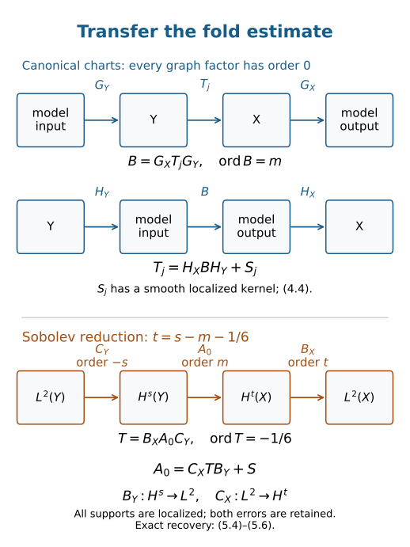

# Invariant fold continuity and Sobolev transfer

A cubic fold model has a local \(L^2\) bound at order \(-1/6\). To obtain a theorem on manifolds we must identify every singular point with that model, keep a finite set of coordinate patches, undo the coordinate operators with full inverses, and transfer the estimate to every real Sobolev order. This lesson supplies those steps.

We use the homogeneous normal form in [Canonical relations with two folding projections](../20261005-restored-canonical-folds/canonical-relations-with-two-folds.md), the complete model estimate in Airy functions and fold model operators, and the order-zero graph estimates and two-sided parametrices in [Graph operators, continuity and Egorov](../20261005-restored-graph-egorov/graph-operators-continuity-and-egorov.md). Kernels, adjoints and clean composition supplies excess-zero graph composition, distributional kernel action, and composition with smooth kernels. Order-zero operators acting on a kernel preserve its Lagrangian class by [Recognizing a Lagrangian distribution intrinsically](../20261005-restored-intrinsic-regularity/intrinsic-lagrangian-regularity.md).

The quantitative prerequisite proofs are [B1–B6, ordinary operators on all real Sobolev scales](../20261004-free-intrinsic-graph/prerequisites/dyadic-endpoint.md), including coordinate and frame invariance B5; [O3–O6, ordinary composition, proper support and smoothing](../20261004-free-intrinsic-graph/prerequisites/ordinary-operator-calculus.md); and [K3–K4, full conic inverses and finite localization](../20261004-free-intrinsic-graph/prerequisites/conic-parametrices-and-localization.md). [G0, global proper elliptic inverses](../20261005-restored-graph-egorov/global-inverses-and-periodic-multipliers.md) proves the complete two-sided construction on a manifold. [W1 and W6](../20261004-free-canonical-composition/fio-sobolev-mapping.md) supply every real-order smooth-kernel estimate, order reducers and support-controlled approximation. These exact programme proofs provide the former G20/G31/G32 contracts; the [proof map](proof-map.json) binds their transitive inputs. The primary source is the reprint of Hörmander IV, corrected second printing (1994), Theorem 25.3.11, printed 35 / PDF 46. We retain ordinary \(S_{1,0}\) symbols, all real orders and the complete compact-to-local conclusion.

## 1. State the theorem with its full closure condition

Let \(X,Y\) be smooth manifolds of dimension \(n\geq1\). Write \(\lambda_X=\xi\cdot dx\), \(\omega_X=d\lambda_X\), and similarly on \(Y\). A homogeneous canonical relation is an embedded, simultaneously conic Lagrangian submanifold
\[
 C\subset(T^*X\setminus0)\times(T^*Y\setminus0)
\]
for \(\Omega=\omega_X-\omega_Y\). Its kernel relation is
\[
 C'=\{(x,y;\xi,-\eta):(x,\xi;y,\eta)\in C\}.
 \tag{1.1}
\]
The closure required below is closure of \(C'\) in the **whole**
\(T^*(X\times Y)\setminus0\). That ambient space also includes nonzero covectors with \(\xi=0\) or \(\eta=0\); those points are excluded from \(C'\) itself.

For a map between manifolds of equal dimension, “at most folds” means that every point is either regular or has coordinates in which the map is
\[
 (w,r)\longmapsto(w,r^2).
 \tag{1.2}
\]
In particular its critical hypersurface has a simple Jacobian zero and its one-dimensional kernel is transverse to that hypersurface. A mere corank-one differential does not establish this condition.

Let \(E\to Y\), \(F\to X\) be finite-rank smooth bundles. Operators act on bundle-valued half-densities. Sobolev spaces are defined in compact coordinate charts and bundle frames, with the usual all-real Fourier weights. Smooth Hermitian structures give \(L^2\) norms; on every fixed compact set different choices give equivalent norms.

**Theorem 1.1 (invariant fold continuity).** Suppose \(C'\) is closed in \(T^*(X\times Y)\setminus0\), both projections
\[
 \pi_X:C\to T^*X\setminus0,\qquad
 \pi_Y:C\to T^*Y\setminus0
\]
have at most folds, and the restrictions of \(\lambda_X,\lambda_Y\) do not both vanish on \(T_cC\) at any point \(c\in C\). Then every
\[
 A\in I^m(X\times Y,C';\operatorname{Hom}(E,F)\otimes\Omega^{1/2})
\]
defines, for every real \(s,m\), a continuous map
\[
 A:H^s_{\mathrm{comp}}(Y;E\otimes\Omega_Y^{1/2})
 \longrightarrow
 H^{\,s-m-1/6}_{\mathrm{loc}}(X;F\otimes\Omega_X^{1/2}).
 \tag{1.3}
\]
Here \(m\) is the operator order used in the preceding lessons. For fixed compact input support \(L\) and a fixed compact output cutoff \(\chi\), continuity means a bound
\[
 \|\chi Au\|_{H^{s-m-1/6}}
 \leq C_{L,\chi,s,A}\|u\|_{H^s},
 \qquad \operatorname{supp}u\subset L.
 \tag{1.4}
\]
A finite chart norm is understood on each side. No uniform constant over all compact sets of a noncompact manifold is asserted. Proper support of \(A\) is not required for the displayed compact-to-local map.

The separate nonzero covectors ensure that the kernel and its adjoint send compact smooth inputs to smooth outputs and that the kernel acts on compact distributions, as proved in the kernel lesson. The estimates below agree with this distributional action.

## 2. Identify the common form and the two types of point

The common pulled-back form is
\[
 \sigma=\pi_X^*\omega_X=\pi_Y^*\omega_Y.
 \tag{2.1}
\]
Let \(R_C\) be the vector field generating simultaneous dilation. It is tangent to \(C\), projects to the two fiber radial fields, and is nonzero. Consequently
\[
 \lambda_C:=\iota_{R_C}\sigma
       =\pi_X^*\lambda_X=\pi_Y^*\lambda_Y.
 \tag{2.2}
\]
Thus the one-form hypothesis says exactly \(\lambda_C(c)\ne0\) as a linear functional on \(T_cC\). The equality uses homogeneity, in addition to the Lagrangian condition.

**Lemma 2.1 (regular or two-sided fold).** The regular sets of the two projections agree. At a critical point both are folds, their kernel lines are distinct and transverse to the same critical hypersurface, and
\[
 \operatorname{rank}\sigma=2n-2.
 \tag{2.3}
\]
The nonvanishing condition (2.2) puts such a point under the homogeneous two-sided fold normal-form theorem. In particular an actual fold here requires \(n\geq2\).

**Proof.** Choose a nonzero local volume form \(\mu\) on \(C\), and write \(\sigma^n=h\mu\). The target forms \(\omega_X^n,\omega_Y^n\) are nonzero volumes. Pulling them back shows that \(h\), up to nowhere-zero target volume factors, is the determinant of each projection differential. Thus one projection is regular exactly when the other is.

If \(h(c)=0\), each projection is a fold by hypothesis. The fold coordinates (1.2) give \(dh(c)\ne0\) and the common critical hypersurface \(\Gamma=\{h=0\}\). Both kernel lines are transverse to \(\Gamma\). A vector in their intersection is killed by the differential of the joint embedding of \(C\); hence that vector is zero.

The restriction of a fold to its critical hypersurface is a local diffeomorphism onto a target hypersurface. A hypersurface in a \(2n\)-dimensional symplectic vector space carries a restricted two-form of rank \(2n-2\): its symplectic orthogonal is a line contained in the hypersurface. It follows that \(\sigma|_{T\Gamma}\) has that rank. Each projection kernel lies in \(\ker\sigma\). The two distinct lines give a two-dimensional radical, and the rank already obtained on \(T\Gamma\) prevents a larger radical. This proves (2.3), with
\[
 \ker\sigma=\ker d\pi_X+\ker d\pi_Y.
 \tag{2.4}
\]
Since \(\iota_{R_C}\sigma\ne0\), \(R_C\) is outside this radical. These are precisely the radial independence and folded-form hypotheses verified in the homogeneous normal-form lesson. That theorem gives full homogeneous canonical charts on both targets, including the unattained sides of their fold images. If \(n=1\), (2.3) would give \(\sigma=0\) at the fold, contradicting (2.2). \(\square\)

At a regular point, shrink so each projection is a diffeomorphism onto an open set. The relation is then the graph of the homogeneous canonical transformation \(\pi_X\pi_Y^{-1}\); (2.1) proves that it preserves the symplectic form. The graph estimate already applies there.

At a fold, the target charts put the relation into the model
\[
 \xi=\eta,\quad y_1=x_1+r,\quad y_n=x_n-r^3/3,\quad
 y_j=x_j\ (2\leq j<n),\quad
 \xi_1=r^2\rho,\quad \rho=\xi_n>0.
 \tag{2.5}
\]
All spectator covectors are retained. The sign of the last shift, the positive radial component, and the coefficient \(1/3\) are the conventions of the proved Airy model.

## 3. Compact normalization gives a finite kernel decomposition

Fix compact input and output cutoffs, and write \(A_0=\chi A\psi\), where \(\psi=1\) near the prescribed input support. Its kernel \(K_0\) has compact base support. Choose smooth cotangent norms on a neighborhood of that support and put
\[
 N=\{(x,\xi;y,\eta)\in C:
          (x,y)\in\operatorname{supp}\chi\times\operatorname{supp}\psi,\
          |\xi|^2+|\eta|^2=1\}.
 \tag{3.1}
\]
The ambient unit sphere bundle over this compact base set is compact. Full punctured-cotangent closure makes \(N\) a closed subset, hence compact. Since neither covector vanishes on \(N\), compactness gives a \(c>0\) such that, throughout the conic relation over these base supports,
\[
 c(|\xi|^2+|\eta|^2)^{1/2}
 \leq|\xi|,\ |\eta|
 \leq(|\xi|^2+|\eta|^2)^{1/2}.
 \tag{3.2}
\]
If \(N\) is empty the localized kernel is smooth and the later estimate follows directly. Otherwise (3.2) also bounds both frequency ratios. Finitely many regular-graph or fold neighborhoods cover \(N\). Shrink the microlocal supports inside those neighborhoods, leaving room for cutoffs and parametrices.

**Lemma 3.1 (finite decomposition with a smooth residual).** One can write
\[
 A_0=\sum_{j=1}^J T_j+S,
 \tag{3.3}
\]
where each \(T_j\) has a compactly supported kernel in \(I^m(C')\), its entire wavefront set is contained in one selected graph or fold neighborhood, and \(S\) has a smooth compactly supported kernel.

**Proof.** Work on the kernel manifold \(Z=X\times Y\), including its finite-dimensional kernel bundle. Construct smooth degree-zero microlocal cutoff symbols \(q_j\) subordinate to the finite cover, using a partition on normalized directions. Extend them homogeneously above a fixed radius and use a low-frequency cutoff. Arrange
\[
 \sum_jq_j=1
 \tag{3.4}
\]
as an exact full-symbol identity above that radius on an open conic neighborhood of \(\operatorname{WF}(K_0)\). This can be done by first taking an ordinary partition with sum one on a smaller neighborhood and then applying the same radial cutoff to every term.

Quantize these scalar symbols as properly supported order-zero operators \(Q_j\) on \(Z\), acting as the identity on bundle components. The quantization is chosen locally with the usual diagonal kernel cutoff. On the neighborhood in (3.4), \(I-\sum_jQ_j\) is microlocally smoothing: the full high-frequency symbol vanishes there, low frequencies have smooth kernels, and terms off the diagonal are smooth. This is the complete K4 construction with conic smoothing T2 and ordinary kernel localization W4. On a manifold, first use a finite base partition on the compact kernel support, perform that construction in each bundle chart, and sum those finitely many exact identities. The inner base multipliers sum to one on the support. Their larger kernel cutoffs equal one near the sampled diagonals, so the additional off-diagonal terms remain smooth. This proves the same statement independently of a global coordinate chart.

Take a compact base multiplier \(\theta=1\) near \(\operatorname{supp}K_0\), and set \(K_j=\theta Q_jK_0\). Order-zero stability on the kernel manifold puts \(K_j\) in \(I^m(C')\). Pseudolocality restricts its wavefront to the chosen microlocal support. Finally
\[
 K_0-\sum_jK_j
       =\theta\big(I-\sum_jQ_j\big)K_0
\]
is smooth, and every term is compactly supported. This proves (3.3). The \(Q_j\) need not factor as separate operators on \(X\) and \(Y\). \(\square\)

The word “full” in (3.4) matters. Equality only in the order-zero principal quotient leaves an order-\(-1\) error, which can still act singularly on \(K_0\). Smoothness requires every order of the residual to disappear.

For the concrete warning in Exercise 7.4, fix a compact smooth cutoff \(\phi=1\) near zero and set \(h(\xi)=\langle\xi\rangle^{-1}\). The localized Fourier transform is \(-(2\pi)^{-1}\int\widehat\phi(\zeta)h(\xi-\zeta)\,d\zeta\). On \(|\zeta|\leq|\xi|/2\), the mean-value formula gives \(|h(\xi-\zeta)-h(\xi)|\leq C|\zeta||\xi|^{-2}\); the first absolute moment of \(\widehat\phi\) is finite. On the complementary region, \(h\leq1\) and arbitrary Schwartz decay gives an error smaller than any prescribed negative power, including the removed tail of the constant \(h(\xi)\) term. Fourier inversion gives \((2\pi)^{-1}\int\widehat\phi=\phi(0)=1\). Thus the leading term is \(-|\xi|^{-1}\), with error \(O(|\xi|^{-2})\), proving the stated singularity without assuming it from the operator's assigned order.

Here is an axis-limit example explaining the closure hypothesis. On \(X=Y=\mathbb R\), consider
\[
 C_+=\{(x,2x\tau;y=x^2,\eta=\tau):x>0,\ \tau>0\}.
 \tag{3.5}
\]
It is the homogeneous graph \(x=\sqrt y,\ \xi=2\sqrt y\,\eta\), with
\(\lambda_C=2x\tau\,dx\ne0\). Both projections are regular. It is closed relative to the product of separately punctured cotangents: a finite limit with both covectors nonzero still has \(x>0,\tau>0\). But \(x\downarrow0\) with \(\tau=1\) gives a limit with \(\xi=0,\eta=1\) in the full joint puncture. On normalized covectors,
\[
 \tau=(1+4x^2)^{-1/2},\qquad
 |\xi|/|\eta|=2x\longrightarrow0.
 \tag{3.6}
\]
Thus the compactness and comparability argument fails under the weaker closure convention. This example concerns the support argument; it does not assert that a particular operator on this relation violates (1.3).

## 4. Undo the fold charts with two-sided graph inverses

**Proposition 4.1 (localized \(L^2\) estimate).** Under the hypotheses of Theorem 1.1, an operator of order \(m\leq-1/6\) is continuous from \(L^2_{\mathrm{comp}}(Y)\) to \(L^2_{\mathrm{loc}}(X)\), including finite-rank bundles.

**Proof.** Apply (3.3). A regular piece \(T\) is a graph operator of order \(m\leq0\), so the order-zero graph theorem gives its localized \(L^2\) estimate.

For a fold piece, let \(\kappa_X,\kappa_Y\) be the homogeneous canonical charts from Lemma 2.1. Choose properly supported elliptic order-zero graph operators
\[
 G_X:X\to\mathbb R^n,\qquad
 G_Y:\mathbb R^n\to Y,
 \tag{4.1}
\]
quantizing \(\kappa_X\) and \(\kappa_Y^{-1}\), respectively. Use their elliptic quantizations only on slightly enlarged conic neighborhoods of the projected wavefront of \(T\). Existence of those quantizations, and of their full microlocal inverses, was proved in the symbol and graph lessons. Let
\[
 H_X:\mathbb R^n\to X,\qquad
 H_Y:Y\to\mathbb R^n
\]
be properly supported order-zero parametrices. On the relevant neighborhoods,
\[
 H_XG_X=I\pmod{\text{microlocally smooth}},\qquad
 G_YH_Y=I\pmod{\text{microlocally smooth}}.
 \tag{4.2}
\]
The other-sided identities also hold there. We have chosen full parametrices; an inverse leading symbol alone supplies neither smooth error in (4.2).

Graph composition is clean with excess zero. Therefore
\[
 B=G_XTG_Y\in I^m(\mathbb R^n\times\mathbb R^n,C'_{\mathrm{model}}).
 \tag{4.3}
\]
Its wavefront is in the model chart. Proper support and the compact kernel support of \(T\) give compact base support of this composition: the left and right proper supports can only reach compact sets from the original compact product. More explicitly, if the kernel of \(T\) is supported in \(K_X\times K_Y\), the output set reached by the left factor from \(K_X\), and the input set reaching \(K_Y\) through the right factor, are compact by the two proper projections of their closed kernel supports. The product of those two compact sets contains the composed support. The same argument applies to every later recovery and reducer composition. Shrinking the conic neighborhoods gives \(\rho>0\) and \(|\xi|\leq C\rho\) on their normalized compact supports. These are the support conditions of the Airy model theorem. A compact base cutoff and that theorem give an \(L^2\) bound for \(B\) when \(m\leq-1/6\), with its full symbol-recursive representation and smooth residual included.

The exact recovery identity is
\[
 T-H_XBH_Y
   =(I-H_XG_X)T
       +H_XG_XT(I-G_YH_Y).
 \tag{4.4}
\]
Each error has a smooth kernel after the fixed base localizations. For the first, the microlocal identity in (4.2) removes every output covector of \(\operatorname{WF}(T)\); the kernel composition wavefront rule leaves no possible singular covector. For the second, it removes every input covector of \(T\). A zero intermediate covector cannot leave a singularity on the opposite side, because \(C\) excludes both zero axes. The graph compositions and their adjoints satisfy that exclusion as well. These facts justify applying the same rule to the remaining order-zero factors. Errors outside the chosen conic neighborhoods are not asserted to be globally smoothing before composition with \(T\).

All proper factors in (4.4) have compactly controlled base supports. Thus the composed order-zero graph estimates for \(H_X,H_Y\) are ordinary \(L^2\) bounds on the relevant compact sets. Equation (4.4) proves the bound for \(T\). A smooth kernel on a compact base product is Hilbert–Schmidt, since its squared pointwise norm has a finite integral. This handles its error and \(S\) in (3.3). Sum the finite set of pieces.

For bundles, trivialize on the finitely many base patches, use the scalar \(G_X,G_Y\) on each component, and apply the preceding proof to every matrix entry of \(T\). Cauchy–Schwarz for the finite component sums bounds the matrix operator. Smooth changes of frames and half-density charts have bounded coefficients on the fixed compact supports; their norms are equivalent. This completes the bundle estimate. \(\square\)

One cannot replace this argument by claiming that the full fold \(A^*A\) is a pseudodifferential operator. Distinct fold sheets can contribute additional composed relations. The two-sided normal-form conjugation handles both sheets through the proved Airy representation.

## 5. Reduce every real Sobolev estimate to order minus one sixth

Set
\[
 t=s-m-\frac16.
 \tag{5.1}
\]
We prove Theorem 1.1 for a fixed compact input support and output cutoff. Form \(A_0=\chi A\psi\) as in Section 3. It has compact kernel support and order \(m\).

Choose properly supported elliptic order reducers \(B_Y\in\Psi^s(Y)\) and \(B_X\in\Psi^t(X)\), with scalar principal symbols on the respective bundles. They are built from diagonal operators in each chart; lower-order frame terms are allowed. Here is the actual positive-symbol patching. Take a locally finite precompact bundle-chart cover and a nonnegative partition \(\sum_i\varphi_i=1\), with \(\widetilde\varphi_i=1\) near \(\operatorname{supp}\varphi_i\). For any real order \(a\), sum the proper chart operators \(\varphi_i\operatorname{Op}_i(\langle\xi_i\rangle^a)\widetilde\varphi_i\), acting componentwise. Choose each kernel cutoff inside its chart product. The locally finite sum is proper: a compact set meets only finitely many of those chart closures. Coordinate transport T1 in the [coordinate and wavefront proof](../20261004-free-intrinsic-graph/prerequisites/coordinate-and-wavefront-localization.md) shows that its principal scalar symbol is the sum of the positive transported weights times \(\varphi_i\), with the identity on the bundle. On each compact cosphere that sum has a positive minimum; homogeneity of the leading high-frequency part gives an elliptic lower bound of order \(a\). The coordinate and frame corrections have one lower order and are uniformly smaller on each compact chart by a factor \(\langle\xi\rangle^{-1}\). Increasing that chart's frequency threshold therefore gives a matrix inverse for the full symbol, with every inverse-symbol derivative estimate proved in K2. W6 proves the chart weight estimates for arbitrary real \(a\), and G0 supplies the global proper two-sided inverse. Thus these are actual operators and inverses, with no uniform assumption at infinity. The compact chart norms and B4–B6 give \(B_Y:H^s_{\mathrm{comp}}\to L^2_{\mathrm{comp}}\). The proper two-sided parametrix proof G0 gives \(C_Y\in\Psi^{-s}\), \(C_X\in\Psi^{-t}\), with smooth proper errors on both sides.

The conjugated operator
\[
 T=B_XA_0C_Y
 \tag{5.2}
\]
has the same underlying canonical relation and order
\[
 m+t-s=-\frac16.
 \tag{5.3}
\]
This follows by the excess-zero composition theorem for the two pseudodifferential diagonals. Its kernel has compact base support: properness of each reducer controls the enlargement of the compact support of \(A_0\). Hence Proposition 4.1 is an \(L^2\) bound on the supports used here.

Let \(R_Y=I-C_YB_Y\). The exact input recovery, including its error, is
\[
 B_XA_0u=T B_Yu+B_XA_0R_Yu.
 \tag{5.4}
\]
The first term has \(L^2\) norm bounded by \(C\|u\|_{H^s}\). The second term has a smooth localized kernel. Indeed \(R_Y\) is smoothing and proper, and the smooth-input mapping and kernel composition results show \(A_0R_Y\) is smoothing on the localized product; the output pseudodifferential factor preserves smoothness. All supports meeting the fixed input compact set stay in fixed compact sets. The full W1 proof gives the needed quantitative statement: after each fixed output derivative the input Fourier transform decreases as \(\langle\eta\rangle^{-M}\), uniformly over the compact output set. Taking \(M>|s|+n/2\), weighted Cauchy–Schwarz bounds that derivative by \(C\|u\|_{H^s}\). A nonnegative integer \(q\) above the desired output order bounds its Sobolev norm through finitely many such derivatives and Plancherel. This proves the compact smooth-kernel bound for every real input and output order. Thus
\[
 \|B_XA_0u\|_{L^2}\leq C\|u\|_{H^s}.
 \tag{5.5}
\]

Let \(R_X=I-C_XB_X\). Output recovery is
\[
 A_0u=C_XB_XA_0u+R_XA_0u.
 \tag{5.6}
\]
The first term belongs to \(H^t\) by \(C_X:L^2_{\mathrm{comp}}\to H^t_{\mathrm{comp}}\), by B4–B6. The second has a smooth localized kernel by the corresponding adjoint smooth-input statement, the nonzero input covectors of \(C\), and proper support. The same weighted smooth-kernel estimate bounds its \(H^t\) norm by \(C\|u\|_{H^s}\). Equations (5.5)–(5.6) yield
\[
 \|A_0u\|_{H^t}\leq C\|u\|_{H^s}
 \tag{5.7}
\]
for smooth \(u\) with the chosen input support.

For any compactly supported \(u\in H^s\), the exact approximation in W6 and B1 applies chart by chart: approximate in the Fourier Sobolev norm by Schwartz functions and multiply by one fixed compact cutoff equal to one on the input support. B4 proves convergence after that multiplication. A finite compact partition gives smooth approximants converging in \(H^s\), all supported in one slightly larger compact set on which \(\psi=1\). Equation (5.7), applied with that larger set, gives a limit in \(H^t\). The approximants also converge as compactly supported distributions. The distributional kernel action from the kernel lesson is continuous into distributions, so its value is this same limit. Thus (5.7) holds for the actual operator on \(H^s\) distributions, including negative \(s\).

Each output cutoff and each input compact set has such an estimate. These are precisely the local output seminorms and the compact-support inductive-limit topology in (1.3). The finite-rank frame and half-density invariance B5 completes the manifold statement. This proves Theorem 1.1. \(\square\)

**Figure 5.1.** The upper path is the fold chart transfer (4.3)–(4.4); the lower path is the Sobolev reduction (5.2)–(5.6). Every graph factor has order zero. In the lower path \(C_Y\) has order \(-s\), \(B_X\) has order \(t\), and \(T\) has order exactly \(-1/6\). Both recoveries retain their smooth localized errors. The boxes represent operators and spaces, not coordinate projections or numerical samples.

## 6. A nonlinear coordinate example and the sharp threshold

Start with the two-dimensional model (2.5), using parameters \((x_1,x_2,r,\rho)\), \(\rho>0\):
\[
 y=(x_1+r,x_2-r^3/3),\qquad
 \xi=\eta=(r^2\rho,\rho).
 \tag{6.1}
\]
Make the global base diffeomorphisms
\[
 x=f(u)=(u_1,u_2+u_1^2),\qquad
 y=g(v)=(v_1+v_2^2,v_2).
 \tag{6.2}
\]
Their Jacobian determinants equal one. The correct covectors in the new coordinates are \(p=Df(u)^T\xi\), \(q=Dg(v)^T\eta\). Substituting (6.1) gives the full transformed relation
\[
 \begin{split}
 v_2&=u_2+u_1^2-r^3/3,\\
 v_1&=u_1+r-v_2^2,\\
 p&=((r^2+2u_1)\rho,\rho),\\
 q&=(r^2\rho,(1+2v_2r^2)\rho).
 \end{split}
 \tag{6.3}
\]
The two covectors are no longer equal component by component. Nevertheless
\[
 p\cdot du=q\cdot dv
       =\rho\big((r^2+2u_1)\,du_1+du_2\big)
 \tag{6.4}
\]
on the relation. To check the input side, first use
\(\eta\cdot dy=\rho(r^2\,dx_1+dx_2)\): the \(r^2\rho\,dr\) from \(dy_1\) cancels the \(-r^2\rho\,dr\) from \(dy_2\). Then apply the exact cotangent pullbacks of (6.2). The coefficient of \(du_2\) in (6.4) is \(\rho>0\), so the one-form never vanishes.

The base diffeomorphisms and their cotangent lifts are invertible. They preserve regularity, folds, and kernel transversality of each projection. The original model is closed in the full joint puncture: at any finite base limit \(r=y_1-x_1\) stays bounded; if \(\rho\to0\), both covectors tend to zero, which leaves that ambient puncture. The cotangent diffeomorphisms preserve this closure. Thus this is a full example for Theorem 1.1, including its fold at \(r=0\).

For a half-density, base pullback is
\[
 (U_fh)(u)=|\det Df(u)|^{1/2}h(f(u)),
 \tag{6.5}
\]
where \(u\) is the new base coordinate and \(h\) is the original half-density coefficient. Change of variables makes this pullback unitary on \(L^2\); here the determinant factor equals one. For every real Sobolev order, compactly localized pullbacks and their inverses are continuous by B5. Applying those pullbacks to an order-\(m\) model operator gives the transformed operator with exactly the gain (1.3). No equality \(p=q\) is needed in its new coordinates.

**Corollary 6.1 (sharp universal \(L^2\) order at a fold).** If a relation satisfying Theorem 1.1 contains a fold and every scalar operator in its order-\(m\) class is locally \(L^2\) bounded, then \(m\leq-1/6\). Conversely every member is locally \(L^2\) bounded for \(m\leq-1/6\).

**Proof.** For \(w\in T_cC\), the two individually lifted radial vectors satisfy
\[
 \Omega((R_X,0),w)=\lambda_C(w),\qquad
 \Omega((0,R_Y),w)=-\lambda_C(w).
 \tag{6.6}
\]
Since \(T_cC\) is Lagrangian, its symplectic orthogonal equals itself. Nonvanishing of \(\lambda_C\) therefore excludes both individual radial vectors from \(T_cC\), at every point. The necessary corank theorem in [Cubic scaling and necessary continuity](../20261005-restored-cubic-scaling/cubic-scaling-and-necessary-continuity.md) applies with its retained radial hypotheses. At a fold Lemma 2.1 gives corank two, hence
\[
 2\leq-12m,\qquad m\leq-\frac16.
 \tag{6.7}
\]
The converse is Proposition 4.1. \(\square\)

The quantifier is over every operator in the class. This does not claim that each particular operator labeled with \(m>-1/6\) is unbounded: a smoothing operator belongs to that class and is bounded. The result gives a sharp universal threshold on relations with actual folds. A relation with only regular graph points can have the better graph threshold zero.

## 7. Exercises with complete solutions

**Exercise 7.1 (common primitive; foundational).** Derive (2.2) from homogeneity and the Lagrangian condition. Explain what would be missing without simultaneous homogeneity.

**Solution.** The Lagrangian condition gives \(\pi_X^*\omega_X=\pi_Y^*\omega_Y=\sigma\). Simultaneous homogeneity supplies a tangent \(R_C\) with \(d\pi_XR_C=R_X\) and \(d\pi_YR_C=R_Y\). Contract the pullback identity with \(R_C\) to obtain both equalities in (2.2), because \(\iota_{R_X}\omega_X=\lambda_X\) and similarly for \(Y\). Without a tangent simultaneous radial field the contraction has no such meaning on \(TC\); an ordinary Lagrangian relation need only make the difference of the two primitives closed, not zero.

**Exercise 7.2 (one-dimensional exclusion; foundational).** Under the theorem's hypotheses, can a relation between one-dimensional base manifolds contain a fold? What estimate then improves (1.3)?

**Solution.** No. At a fold the common two-form would have rank \(2n-2=0\), so \(\lambda_C=\iota_{R_C}\sigma=0\), contradicting the hypothesis. Every point is regular. Compact normalization and the finite graph decomposition apply, and the all-real graph theorem gives \(H^s_{\mathrm{comp}}\to H^{s-m}_{\mathrm{loc}}\). The loss \(1/6\) is unnecessary in this special case.

**Exercise 7.3 (axis limit; intermediate).** Verify the canonical identity for (3.5), and compute a normalized sequence that disproves (3.2) for this relation over a fixed compact base product.

**Solution.** On the parameter space \((x,\tau)\), \(\xi\,dx=2x\tau\,dx\) and \(\eta\,dy=\tau\,d(x^2)=2x\tau\,dx\). Their difference is zero; differentiating proves the canonical condition. Both projections are local diffeomorphisms for \(x,\tau>0\). Set \(x_k=1/k\), \(\tau_k=(1+4/k^2)^{-1/2}\). The bases \(x_k,y_k=1/k^2\) lie in \([0,1]^2\), the joint norm is one, and \(|\xi_k|/|\eta_k|=2/k\). Their limit has output covector zero and input covector one. Hence the normalized relation is not closed in the ambient sphere and no positive \(c\) in (3.2) exists.

**Exercise 7.4 (principal versus full identity; intermediate).** On \(\mathbb R\), let \(Q=I+\langle D\rangle^{-1}\). Its order-zero principal symbol is one. Show that \(I-Q\) is not smoothing, using a compactly supported distribution.

**Solution.** Use \(\delta_0\), whose Fourier transform is one. The Fourier transform of \((I-Q)\delta_0\) is \(-\langle\xi\rangle^{-1}\). If that distribution were smooth near zero, multiply it by a compact cutoff \(\phi=1\) near zero. Its Fourier transform would decay faster than every power if the localized distribution were smooth. In fact the convolution formula, Taylor expansion of \(\langle\xi-\zeta\rangle^{-1}\), and Schwartz decay of \(\widehat\phi(\zeta)\) give leading term \(-\phi(0)|\xi|^{-1}\) as \(|\xi|\to\infty\), with an \(O(|\xi|^{-2})\) remainder. Thus it is singular at zero. Equality in the principal quotient leaves a genuine order-\(-1\) error.

**Exercise 7.5 (two recovery sides; intermediate).** Expand \(T-H_X(G_XTG_Y)H_Y\). Identify which inverse side is required at the output and which at the input. Why is a principal-symbol inverse insufficient?

**Solution.** Add and subtract \(H_XG_XT\). The result is exactly the right side of (4.4). At the output the needed composition is \(H_XG_X\), and at the input it is \(G_YH_Y\). Their full errors must be microlocally smoothing on the projected wavefront of \(T\). A principal inverse leaves errors of one lower order, which still compose with the singular kernel; they need not be smooth. The construction of a full two-sided parametrix cancels every residual order and supplies both specified sides.

**Exercise 7.6 (a real-order calculation; intermediate).** Take \(s=-3/4\) and \(m=1/3\). Determine \(t\), the orders of \(B_X,C_Y,C_X\), and the order of \(T\) in (5.2). State the resulting map.

**Solution.** Equation (5.1) gives \(t=-3/4-1/3-1/6=-5/4\). Thus \(B_X\) has order \(-5/4\), \(C_Y\) has order \(3/4\), and \(C_X\) has order \(5/4\). The total order of \(T\) is \(1/3-5/4+3/4=-1/6\). The theorem gives \(A:H^{-3/4}_{\mathrm{comp}}\to H^{-5/4}_{\mathrm{loc}}\). A positive-order \(C_X\) is consistent with taking an \(L^2\) function to a negative Sobolev order.

**Exercise 7.7 (both Sobolev errors; advanced).** Derive (5.4) and (5.6) without discarding either residual. Explain why their Sobolev bounds require localization.

**Solution.** Since \(I=C_YB_Y+R_Y\), multiply this equality on the left by \(B_XA_0\) and apply it to \(u\). This gives (5.4). Since \(I=C_XB_X+R_X\), multiply on the right by \(A_0u\) to get (5.6). Proper smooth residuals composed with the localized FIO give smooth kernels on the controlled base products, using the nonzero side covectors and the kernel composition rule. Their Fourier transforms after compact localization decrease rapidly in both variables, which gives every real-order bound by weighted Cauchy–Schwarz. Mere smoothness on a noncompact product gives no global integrability or operator norm: the constant smooth kernel on \(\mathbb R^2\) sends a compact smooth function of nonzero integral to a nonzero constant, outside global \(L^2(\mathbb R)\).

**Exercise 7.8 (nonlinear covectors; advanced).** Derive the two covectors in (6.3) from the matrices \(Df,Dg\), and verify that \(q\cdot dv\) equals (6.4), including all \(dr\) terms.

**Solution.** The matrices are \(Df=\begin{pmatrix}1&0\\2u_1&1\end{pmatrix}\) and \(Dg=\begin{pmatrix}1&2v_2\\0&1\end{pmatrix}\). Their transposes applied to \((r^2\rho,\rho)\) give the stated \(p,q\). Now \(dv_1=du_1+dr-2v_2\,dv_2\) and \(dv_2=du_2+2u_1\,du_1-r^2\,dr\). Thus
\[
 q\cdot dv
 =\rho\big(r^2(du_1+dr)+dv_2\big)
 =\rho\big((r^2+2u_1)du_1+du_2\big).
\]
The \(r^2\,dr\) contributions cancel exactly. This equals \(p\cdot du\) and has nonzero \(du_2\) coefficient for every \(\rho>0\).

**Exercise 7.9 (sharpness quantifier; advanced).** A relation satisfying the theorem contains a fold. Explain what is ruled out at order \(m=-1/6+\varepsilon\), \(\varepsilon>0\), and why the zero operator is no counterexample to the conclusion.

**Solution.** Universal local \(L^2\) boundedness for every member of that order class would imply \(2\leq-12m=2-12\varepsilon\), which is impossible. Hence at least one member fails local \(L^2\) boundedness. The zero operator, and any smoothing operator, is an individual bounded member; the necessary theorem has never asserted individual failure for all members. At order \(-1/6\), Proposition 4.1 bounds every member, so the universal threshold is attained.

**Exercise 7.10 (finite bundle estimate; advanced).** Suppose each scalar entry of an \(r_F\)-by-\(r_E\) localized operator matrix has \(L^2\) norm at most \(M\). Obtain a bound for the matrix operator and explain how it enters the invariant theorem.

**Solution.** For the \(i\)-th output component,
\[
 \|(Au)_i\|_2
 \leq M\sum_{j=1}^{r_E}\|u_j\|_2
 \leq M\sqrt{r_E}\,\|u\|_2.
\]
Summing the squared component norms gives
\(\|Au\|_2\leq M\sqrt{r_Er_F}\|u\|_2\).
Compact frame changes multiply this by finite norm-equivalence constants. There are only finitely many charts and matrix entries on each compact support, so their sum is finite. Scalar elliptic Sobolev reducers acting diagonally and the all-real frame invariance then give (1.3) for these finite-rank bundles.

## 8. What has been proved and how it was checked

The proof establishes the invariant ordinary-symbol fold theorem with full joint-puncture closure, both fold hypotheses, the exact common one-form condition, finite microlocal kernel decomposition, order-zero canonical transfer with full parametrix errors, finite-rank bundles, and all-real compact-to-local Sobolev continuity. The actual-fold universal \(L^2\) threshold is sharp under the retained radial hypotheses, which (6.6) verifies.

The preserved proof and its exact current programme dependencies were reviewed for this restoration; independent human mathematical review remains pending. Bounded checks recompute the nonlinear cotangent lifts, projection ranks and fold transversality, the normalized axis-limit example, fractional order arithmetic, an independent weighted finite Fourier norm calculation, both recovery identities, and the radial contractions. The diagram was rendered and inspected with its exact operator directions and orders. These checks do not certify arbitrary operators, admit transitive prerequisites, or close an entire chapter.

The general necessary estimate without its radial exclusions, nonordinary symbol variants, propagation, hyperbolic and mixed problems, glancing, positive complex Lagrangian ideals, and the other unfinished parts of the assigned course remain active. The fold theorem completes one continuity strand of that larger course.

## Sources and restoration

- Lars Hörmander, *The Analysis of Linear Partial Differential Operators IV: Fourier Integral Operators*, reprint of the corrected second printing (1994), Theorem 25.3.11, printed 35 / PDF 46. Its complete hypotheses and all-real conclusion are retained above; every proof is supplied here or in an exact earlier programme lesson.
- The source and restoration record identifies the source and exact proof edition. The reproducible operator diagram retains its DejaVu font notice.

Original lesson, ten solutions and exact operator diagram: GPT-6.1 Sol (OpenAI), Ultra, September 2026, CC0. Restoration and exact prerequisite review: GPT-6 Astra (OpenAI), Ultra, 5 October 2026. Original additions here are CC0. Linked components retain their individual licences. No book file or text is included.
