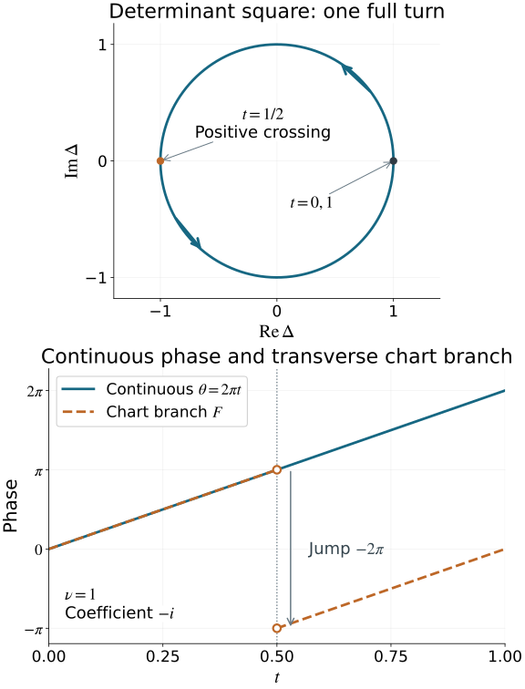

# Maslov index, crossings and global phase

The Gaussian symbol line has locally constant fourth-root transitions. A closed path of Lagrangian planes can nevertheless carry an integer, rather than merely a residue modulo four. We construct that integer, prove that it classifies all based loops, compute it from finitely many signed crossings, and recover the precise transport of the Gaussian coefficients.

We retain the symmetric graph charts, intersection strata, common complements and integer Gaussian cocycle of [Gaussian lines, densities and invariant symbols](../20261005-restored-gaussian-symbols/gaussian-lines-and-invariant-symbols.md). The linear symplectic conventions are those of [Phase space and generating families](../20261005-restored-phase-space/phase-space-and-generating-families.md). The exact earlier proofs of our remaining prerequisites are:

- [Finite calculus, inverse and implicit maps, P2–P3](../20261004-free-stationary-phase/prerequisite-completions.md), [compact bumps and partitions, Appendix A.4](../20261004-free-stationary-phase/stationary-phase-and-critical-manifolds.md), and [FTC and compact parameter integration](../20261004-free-stationary-phase/proof-map.html#FTC-TAYLOR-COMPACT-PARAMETERS).
- [Real symmetric diagonalization, Q5](../20261004-free-stationary-phase/quadratic-stationary-phase.md), [Gram–Schmidt, P9.4](../20261004-free-stationary-phase/differential-prerequisite-completions.md), and [measure and product integration, M0–M4](../20261004-free-intrinsic-graph/prerequisites/measure-and-l2.md). Over the complex numbers the same Gram–Schmidt proof subtracts \(u_j(u_j^*v)\) and divides by the positive norm; Hermitian orthogonality, independence and smoothness follow from those explicit operations wherever the initial vectors are independent.
- [Finite-coordinate flows, NF1–NF20](../20261005-restored-phase-space/finite-coordinate-flows.md), including actual existence, uniqueness, all parameter derivatives and continuation. That earlier AN-03 component retains its GFDL notice.

The [proof map](proof-map.json) binds these exact providers and their complete dependency chains. The approximation, small-image and lifting facts needed for the topology are proved below. The source is the approved purchased reprint of Hörmander III, Section 21.6, especially the discussion following Theorem 21.6.7, equation (21.6.24) and Theorem 21.6.8.

We use
\[
\omega=\sum_{j=1}^n d\xi_j\wedge dx_j,\qquad
\omega((x,\xi),(y,\eta))=\xi\cdot y-x\cdot\eta.
\tag{0.1}
\]
The reference plane is \(\lambda_0=\{x=0\}\). The symbol-line coefficient rule remains exactly the rule in the Gaussian lesson. Section 7 specifies the order of its chart switches before reporting a multiplier.

## 1. A crossing has an intrinsic quadratic form

Let \(\mathcal L(S)\) be the space of Lagrangian planes in a real symplectic vector space \(S\) of dimension \(2n\), with \(n\geq1\). For a \(C^1\) path \(\lambda(t)\), a crossing with a fixed reference plane \(\mu\) is a time \(t_0\) with \(\lambda(t_0)\cap\mu\ne0\). For \(v\) in this intersection, choose a \(C^1\) section \(v(t)\in\lambda(t)\), with \(v(t_0)=v\), and set
\[
q_{t_0}(v)=\omega(v,\dot v(t_0)).
\tag{1.1}
\]

**Lemma 1.1 (crossing form).** Formula (1.1) is independent of the chosen section and is a symmetric quadratic form on the intersection. It is preserved by a fixed symplectic linear change of coordinates. If \(\mu=\lambda_0\) and
\[
\lambda(t)=\{(A(t)\eta,\eta):\eta\in\mathbb R^n\},
\qquad A(t)=A(t)^T,
\tag{1.2}
\]
then it is the restriction of \(\eta^T A'(t_0)\eta\) to \(\ker A(t_0)\).

**Proof.** Choose a differentiable frame of \(\lambda(t)\). A section zero at \(t_0\) has derivative in \(\lambda(t_0)\): write its coefficients in that frame and differentiate. The difference of two extensions with the same value is such a section. Its derivative pairs to zero with \(v\), by isotropy. This proves independence.

For two extended vectors, differentiation of \(\omega(v(t),w(t))=0\) gives
\[
\omega(v,\dot w)=\omega(w,\dot v).
\]
Thus polarization of (1.1) is symmetric. A fixed symplectic map preserves every displayed pairing. In (1.2), allowing \(\eta\) itself to vary gives
\[
\omega((A\eta,\eta),(A'\eta+A\dot\eta,\dot\eta))
=\eta^T A'\eta.
\tag{1.3}
\]
The terms with \(\dot\eta\) cancel because \(A\) is symmetric. At the crossing the intersection corresponds precisely to \(\ker A\). A basis change gives congruence of this form. \(\square\)

A crossing is **simple** when the intersection is one-dimensional and its crossing form is nonzero. Its sign is \(+1\) or \(-1\) according to that form. A crossing with a higher-dimensional intersection is called **regular** when its crossing form is nondegenerate; simple crossings are the one-dimensional regular crossings.

The positive generator we will use is
\[
\gamma_+(t)=\operatorname{span}(\cos\pi t,-\sin\pi t)
\oplus\mathbb R^{n-1}_x,\qquad 0\leq t\leq1.
\tag{1.4}
\]
It starts and ends at the horizontal plane. At \(t=1/2\), the first-coordinate unit vector along the line has crossing form \(+\pi\). Reversing \(t\) reverses that sign. These explicit formulas fix the orientation without a convention about how a picture of the \((x,\xi)\) axes is drawn.

## 2. Three elementary tools for the proof

We will use these facts both for topology and for making the crossings simple.

**Lemma 2.1 (small images and equal-dimensional critical values).** A \(C^1\) map from a manifold of dimension \(a<b\) to a manifold of dimension \(b\) has image of measure zero in target charts. For a \(C^1\) map between two manifolds of the same dimension \(b\), the image of its critical points has measure zero.

**Proof.** It suffices to work on countably many relatively compact coordinate patches with bounded derivative. For \(a<b\), subdivide a bounded source box into cubes of side \(r\). There are \(O(r^{-a})\) cubes. The image of each has diameter \(O(r)\), by the derivative bound, and can be covered by a target box of volume \(O(r^b)\). Their total outer volume is \(O(r^{b-a})\), which tends to zero.

For the second assertion, fix a compact subset \(K\) of the critical set in a bounded source patch. Uniform differentiability gives, for every \(\varepsilon>0\), a sufficiently small \(r\) such that
\[
|f(y)-f(z)-Df(z)(y-z)|\leq\varepsilon |y-z|
\tag{2.1}
\]
whenever \(z\in K\) and \(|y-z|\leq C_b r\), within a slightly larger patch. For each grid cube meeting \(K\), take such a point \(z\). The image of its intersection with \(K\) lies in the \(\varepsilon C_b r\) neighborhood of the image of a ball of radius \(C_b r\) under \(Df(z)\). That derivative has rank at most \(b-1\). In orthonormal coordinates along its image, this neighborhood is contained in a box with \(b-1\) side lengths at most \(C r\) and the remaining side length at most \(C\varepsilon r\). The derivative bound makes \(C\) uniform. Its volume is at most \(C'\varepsilon r^b\). There are \(O(r^{-b})\) grid cubes, so the total outer volume is at most \(C''\varepsilon\). Let \(\varepsilon\) tend to zero. The complete critical set is exhausted by compact subsets inside countably many patches. Coordinate changes preserve null sets on these compact patches. \(\square\)

This lemma uses only the equal-dimensional \(C^1\) critical-value assertion. It does not assert a general high-dimensional version of Sard's theorem for arbitrary \(C^1\) maps.

**Lemma 2.2 (smooth representatives).** Every continuous based loop in the compact smooth matrix manifolds used below is homotopic, with its base point fixed, to a smooth based loop.

**Proof.** Each of our manifolds is a compact smooth embedded submanifold of a finite-dimensional real matrix space: spheres, \(SU(n)\), and the Lagrangian planes represented by their orthogonal projection matrices. For the last assertion the graph-to-projection map is smooth, since it is \(V\mapsto V(V^TV)^{-1}V^T\) in a graph frame. Near each fixed projection, select independent columns and recover the graph coefficients by an invertible minor. That recovery is a smooth local inverse, so the graph-to-projection derivative is injective and these are actual embedded charts. The other matrix manifolds are verified in Section 3. A smooth retraction exists on a neighborhood of such a manifold. To see the required local construction, the map
\[
(p,v)\longmapsto p+v,\qquad v\perp T_pM,
\]
has invertible derivative at every \((p,0)\), because tangent and normal spaces are complementary. Local smooth tangent frames come from a manifold chart. Their Gram matrix is invertible, so orthogonal projection to their span is a smooth matrix; projecting a fixed complementary basis and applying Gram–Schmidt gives local smooth normal frames. This constructs the normal bundle used in the displayed map. The inverse function theorem gives a unique local normal representation and hence a local retraction to \(p\). Compactness permits one small normal radius on a finite cover. Uniqueness also holds globally at a sufficiently small radius: otherwise two different normal representations with radii tending to zero would have base points converging to the same point, contradicting local uniqueness. The retractions therefore agree and define the asserted neighborhood retraction \(r\).

View the continuous loop as a periodic matrix-valued function and convolve it with a smooth periodic approximate identity. Concretely, periodize \(\epsilon^{-1}\rho(t/\epsilon)\), where \(\rho\geq0\) is a smooth compactly supported bump of integral one. Integrating its translate against the bounded continuous periodic matrix function gives a smooth function: each derivative falls on the smooth kernel, and compact parameter integration justifies it. The difference from the original function is bounded by its modulus of continuity on distances at most a constant times \(\epsilon\), so convergence is uniform. Correct its value at the base parameter by subtracting that small constant error times a smooth bump equal to one there. The corrected smooth loop \(g\) remains in the retraction neighborhood, has the original base value, and is uniformly close. Then
\[
(s,t)\longmapsto r((1-s)f(t)+s g(t))
\tag{2.2}
\]
is a based homotopy, and \(r(g(t))\) is the required smooth loop. \(\square\)

**Lemma 2.3 (compact submersion lifting).** Suppose \(p:E\to B\) is a smooth surjective submersion with \(E\) compact. Every smooth path in \(B\) lifts from a prescribed point of its initial fiber. A smooth homotopy of loops lifts from a prescribed initial loop. If the base homotopy fixes its base point, the lifted loops fix their prescribed base point too.

**Proof.** Give \(E,B\) smooth metrics. The orthogonal complement of \(\ker Dp_e\) maps isomorphically to \(T_{p(e)}B\). Its inverse is smooth; in orthonormal coordinates it is
\[
H_e=Dp_e^*(Dp_e Dp_e^*)^{-1}.
\tag{2.3}
\]
For a path \(b(s)\), integrate the vector field \((1,H_e\dot b(s))\) on the pullback manifold
\(\{(s,e):p(e)=b(s)\}\). This is tangent to that manifold by (2.3). Thus its solution stays over \(b(s)\). The usual local ODE theorem gives existence and uniqueness; compactness of \(E\), together with a bounded path derivative on a compact interval, permits extension to the whole interval. The inverse matrix in (2.3) has a uniform bound on \(E\). In particular the lifted velocity has bounded norm on each compact time interval. Here is also a continuation proof which does not require a global ambient chart. The pullback over the closed path interval is a closed subset of that interval times \(E\), hence compact. At each of its points the coordinate flow theorem gives an open neighborhood of initial data on which solutions exist for a common positive amount of forward and backward time; one-sided neighborhoods suffice at the two path endpoints. A finite subcover gives a positive minimum time for initial data away from those endpoints. If a maximal lift ended at an interior time, choose one of its values closer than half that minimum time to the supposed endpoint. The corresponding local solution extends it beyond the endpoint, by uniqueness, a contradiction. This also supplies the required continuation argument rather than assuming completeness of every local coordinate chart. Smooth ODE dependence gives a lift when \(b=b(s,t)\) and the initial point is a smooth function of \(t\).

For loops, equal initial data at \(t=0,1\), and the same base path there, give equal lifts by uniqueness. At a fixed base point the constant base path has zero derivative, so its lift is constant. This proves the final assertions. \(\square\)

The matrix manifolds below inherit metrics from Euclidean matrix spaces, and the relevant submersions will have explicit local sections. No unproved homotopy-lifting theorem is needed.

## 3. A determinant square on the space of planes

Choose compatible complex coordinates
\[
z=x-i\xi,\qquad J(x,\xi)=(\xi,-x),\qquad
\omega(v,Jv)=|v|^2.
\tag{3.1}
\]
These coordinates are used for this topological proof; they do not change (0.1).

**Proposition 3.1.** The plane space is smoothly \(U(n)/O(n)\). For any unitary frame \(U\) of a real Lagrangian plane \(\lambda\), the expression
\[
\Delta(\lambda)=\det_{\mathbb C}(U)^2\in S^1
\tag{3.2}
\]
is well-defined and smooth. It is a locally trivial submersion whose fiber over \(1\) is \(SU(n)/SO(n)\).

**Proof.** A real orthonormal basis of \(\lambda\) gives a complex matrix \(U\) whose Hermitian pairings have real part the Euclidean pairings and imaginary part the symplectic pairings. Isotropy therefore makes \(U^*U=I\). Conversely the real span of a unitary frame is Lagrangian. Two real orthonormal frames span the same real plane exactly when they differ on the right by a real orthogonal matrix \(R\). This identifies the fibers of \(U(n)\to\mathcal L(S)\) with \(O(n)\).

For the smooth assertion, near a fixed plane project a fixed real basis onto the nearby planes and apply real Gram–Schmidt. Independence persists, so this gives a smooth unitary frame and a local section. The chart structure is the symmetric-graph structure proved in the Gaussian lesson. These sections give the asserted smooth quotient and its actual local charts.

Since \(\det R=\pm1\), the square in (3.2) is unchanged by \(U\mapsto UR\). The local sections prove smoothness. A frame over \(\Delta=1\) has determinant \(+1\) or \(-1\). In the second case, multiply it by a fixed real orthogonal reflection. The resulting determinant-one frames of the same plane differ exactly by \(SO(n)\). Local sections adjusted in this way give the smooth fiber \(F=SU(n)/SO(n)\).

On an arc of \(S^1\), choose a smooth real argument \(a\). Put
\[
D(a)=\operatorname{diag}(e^{ia/2},1,\ldots,1).
\]
The maps
\[
(e^{ia},\lambda_F)\longmapsto D(a)\lambda_F,\qquad
\lambda\longmapsto
(\Delta(\lambda),D(-a(\Delta(\lambda)))\lambda)
\tag{3.3}
\]
are smooth inverses between that arc times \(F\) and its inverse image under \(\Delta\). They prove local triviality and the submersion assertion. \(\square\)

The square is essential. Changing one real basis vector's sign changes \(\det U\) but leaves the unoriented plane unchanged.

The space \(\mathcal L(S)\) is compact. Indeed its orthogonal projections are real symmetric matrices satisfying \(P^2=P\), \(\operatorname{tr}P=n\), with bounded entries; the Lagrangian condition is closed. The graph charts identify this closed bounded set with our smooth plane space. The groups and fibers in Proposition 3.1 are compact too.

The unitary groups used here are smooth matrix manifolds as well. The derivative of \(V\mapsto V^*V\) at a unitary matrix sends \(W\) to \(V^*W+W^*V\), which is onto the Hermitian matrices: take \(W=VK/2\) for Hermitian \(K\). The implicit function theorem gives \(U(n)\). Its tangent vectors are \(VK\) with \(K^*=-K\). The determinant derivative follows by the Leibniz formula: \(\det(I+hK)=1+h\operatorname{tr}K+O(h^2)\). Factoring an invertible \(V\) gives \(D\det_V(W)=\det(V)\operatorname{tr}(V^{-1}W)\). Thus the determinant derivative along them is \(\det(V)\operatorname{tr}K\); this is onto the tangent line of \(S^1\), since \(K=\operatorname{diag}(is,0,\ldots,0)\) is allowed. Thus the determinant-one level is the smooth embedded manifold \(SU(n)\). Both groups are closed and bounded. Their real analogues give smooth \(O(n)\), with \(SO(n)\) its determinant-one open-and-closed part. These facts justify all matrix-manifold and submersion uses below.

On the loop (1.4) the complex frame is
\[
U(t)=\operatorname{diag}(e^{i\pi t},1,\ldots,1),
\qquad \Delta(\gamma_+(t))=e^{2\pi i t}.
\tag{3.4}
\]
Thus \(\Delta\) makes one positive full turn although the first real line makes only a half turn before returning to the same unoriented line.

## 4. The entire fundamental group is the integers

For a loop \(b(t)\in S^1\), choose a continuous real argument \(\theta(t)\), by successive local argument charts on a finite subdivision. Its winding is
\[
\operatorname{wind}(b)
=\frac{\theta(1)-\theta(0)}{2\pi}\in\mathbb Z.
\tag{4.1}
\]
Different initial arguments differ by a constant multiple of \(2\pi\), so they give the same integer. Concatenation adds it. A based homotopy keeps it fixed: subdivide its compact parameter square into small rectangles on which a local argument exists; matching arguments across edges changes them only by constant multiples of \(2\pi\). The endpoint difference is consequently a continuous integer-valued function of the homotopy parameter. A winding-zero loop contracts through
\[
b_s(t)=\exp(i((1-s)\theta(t)+s\theta(0))).
\tag{4.2}
\]
Conversely a contraction forces winding zero. Formula (4.1) therefore classifies the loops of the circle.

We need the full fiber topology as well.

**Lemma 4.1.** \(SO(n)\) is connected, \(SU(n)\) is connected and simply connected, and \(F=SU(n)/SO(n)\) is connected and simply connected.

**Proof.** Both \(SO(1)\) and \(SU(1)\) are points. For \(SO(n)\), \(n\geq2\), rotate the first column to the first unit vector in the real plane they span; if they are opposite use a plane containing a second unit vector and rotate by \(\pi\). This rotation has a path to the identity in \(SO(n)\). The resulting matrix is \(\operatorname{diag}(1,R')\), with \(R'\in SO(n-1)\). Induction gives a path to the identity.

Every sphere \(S^d\), \(d\geq2\), is simply connected. By Lemma 2.2 a loop can first be made smooth. Its image misses some point of \(S^d\), by the first assertion of Lemma 2.1. After an orthogonal change making that point the north pole, stereographic projection is
\[
(y,r)\longmapsto\frac{y}{1-r},\qquad
u\longmapsto
\left(\frac{2u}{1+|u|^2},\frac{|u|^2-1}{1+|u|^2}\right).
\tag{4.3a}
\]
The second vector has length one, avoids the north pole, and substitution in either order gives the identity. Both formulas are smooth on their stated domains. They identify the loop with one in \(\mathbb R^d\); straight contraction to its base value followed by the inverse gives a smooth based contraction. Spheres are path connected, for example by great-circle arcs, with a two-arc path for opposite endpoints.

For \(n\geq2\), the first-column map
\[
SU(n)\longrightarrow S^{2n-1}
\tag{4.3}
\]
has fiber \(SU(n-1)\). It has actual smooth local sections: near a chosen first column, retain fixed complementary columns, project them orthogonally and perform complex Gram–Schmidt. Multiply the last column by the inverse of the resulting determinant. This keeps the first column fixed and puts the completed frame in \(SU(n)\). Any two such completions differ by \(\operatorname{diag}(1,V)\), \(V\in SU(n-1)\). Thus (4.3) is a compact locally trivial submersion.

For \(n=2\), its frame is explicitly
\[
(a,b)\longmapsto
\begin{pmatrix}a&-\overline b\\ b&\overline a\end{pmatrix},
\qquad |a|^2+|b|^2=1,
\tag{4.4}
\]
so \(SU(2)\) is \(S^3\). Suppose the connectedness and simple connectedness assertions hold for \(SU(n-1)\). Project a path's desired endpoints to the sphere and lift a sphere path by Lemma 2.3; the endpoint can be connected to the desired endpoint inside the connected fiber. This proves connectedness of \(SU(n)\).

For a smooth based loop in \(SU(n)\), contract its projected first-column loop on the sphere and lift that based contraction from the original loop using Lemma 2.3. The final lifted loop lies in a single fiber \(SU(n-1)\), where it contracts by induction. Lemma 2.2 includes continuous loops in this conclusion. This proves simple connectedness of \(SU(n)\).

The quotient \(SU(n)\to F\) has the local frame sections already constructed in Proposition 3.1, so a smooth loop in \(F\) lifts to a path in \(SU(n)\). Its endpoints differ by an element of \(SO(n)\). Join them in that fiber using the connectedness just proved. The concatenated path is a loop in \(SU(n)\), hence fills a disk. Projection of that disk fills the original quotient loop followed by a constant path; reparameterization removes that constant part. Continuous loops are first smoothed in the compact embedded fiber \(F\), as in Lemma 2.2. This proves simple connectedness of \(F\); its connectedness follows by projection from \(SU(n)\). \(\square\)

**Theorem 4.2 (integer classification).** For \(n\geq1\), the homomorphism
\[
\nu:\pi_1(\mathcal L(S),\mathbb R^n_x)\longrightarrow\mathbb Z,
\qquad \nu([\lambda])=\operatorname{wind}(\Delta\circ\lambda)
\tag{4.5}
\]
is an isomorphism. The loop \(\gamma_+\) is a generator of value \(+1\).

**Proof.** Formula (3.4) proves surjectivity. If a based loop has winding zero, smooth it by Lemma 2.2. Its determinant-square loop has the based contraction (4.2). Lift that contraction by Lemma 2.3 for the compact submersion \(\Delta\). The final loop is in the fiber over the base value, which is simply connected by Lemma 4.1 and (3.3). It contracts there. This proves injectivity, including for continuous original loops. Concatenation and homotopy invariance were proved with (4.1). \(\square\)

The plane space is connected: lift a path in the circle to the fiber over \(1\), then use the connectedness of that fiber. Any other base plane therefore gives the same integer classification after a base-point path. The integer is independent of that path, since conjugation has no effect in \(\mathbb Z\). We call it the **Maslov index with the positive-crossing orientation (1.4)**.

## 5. Every loop can have only finitely many simple crossings

**Theorem 5.1 (finite simple representative).** Every continuous loop of Lagrangian planes is homotopic to a \(C^1\), indeed smooth, loop whose crossings with a fixed \(\mu\) are finite and simple. For a based loop with base plane transverse to \(\mu\), the base point can be held fixed.

**Proof.** First smooth the loop by Lemma 2.2. Near any parameter, choose a Lagrangian complement \(H\) transverse both to \(\mu\) and to the nearby planes; the common-complement result of the Gaussian lesson gives it. In symplectic coordinates with \(\mu\) vertical and \(H\) horizontal, the loop has the form (1.2).

Let \(d=n(n+1)/2\). The stratum of symmetric matrices with kernel dimension \(k\) has dimension
\[
d-\frac{k(k+1)}2,
\tag{5.1}
\]
by the block-elimination proof in the Gaussian lesson. On a small closed parameter interval, examine
\[
(t,R)\longmapsto A(t)+R,\qquad
\dim\ker R=k.
\tag{5.2}
\]
For \(k\geq2\), its domain dimension is \(d+1-k(k+1)/2<d\), so its image has measure zero by Lemma 2.1. For \(k=1\), its domain dimension is \(d\); its critical values have measure zero by the same lemma. Countably many relatively compact charts exhaust each stratum. Choose \(B\) arbitrarily small outside the union of these null sets.

Then every zero eigenvalue of \(A(t)-B\) is simple, and the derivative is transverse to the corank-one stratum. The latter means that the crossing form on its kernel is nonzero. Indeed that stratum has normal functional \(D\mapsto v^TDv\), for a nonzero kernel vector \(v\): this follows by differentiating its scalar Schur-complement equation. The derivative of (5.2) is surjective precisely when \(A'\) has a nonzero value under that functional.

Choose a smooth bump \(\chi\) equal to one on the smaller closed interval and supported in the larger chart interval. The actual plane homotopy is the symplectic shear
\[
(x,\xi)\longmapsto (x-s\chi(t)B\xi,\xi),\qquad 0\leq s\leq1.
\tag{5.3}
\]
Symmetry of \(B\) proves it symplectic directly. It is identity outside the support, and on the smaller interval its final graph is \(A-B\).

Cover the parameter circle by finitely many such smaller closed intervals inside their chart intervals. Perform the perturbations successively, choosing each small in \(C^1\) so that every earlier interval keeps its simple-or-transverse property. This preservation has a precise compactness justification: in the finite-dimensional space of matrix first jets, the bad set consists of corank at least two, or corank one with vanishing kernel derivative. That set is closed. The already good jets over a compact set have positive distance from it in finitely many bounded charts. A sufficiently small \(C^1\) perturbation consequently keeps them good. At each later step apply (5.2) to the current path, not to its initial version.

A based transverse neighborhood can be left unchanged. The remaining compact parameter set has a finite cover with bumps avoiding that neighborhood, so the base point stays fixed. At the end every crossing is simple. A simple crossing is isolated by the scalar Schur complement and the one-variable inverse theorem. The set of crossings is closed in the compact parameter circle. A closed set all of whose points have isolating neighborhoods is finite here: finitely many such neighborhoods, together with the open complement, cover the circle. This completes the proof. \(\square\)

The same local perturbation argument applies directly to \(C^1\) loops. The only critical-value theorem used in (5.2) is the equal-dimensional \(C^1\) assertion proved in Lemma 2.1.

For an unbased closed loop the parameter origin can be chosen outside its finite crossing set after perturbation. A loop based on the crossing set requires that change of base-point description before the no-endpoint formula below is used.

## 6. The winding is the signed crossing count

We first compute a complete branch of the determinant phase away from crossings. If \(\lambda\) is transverse to \(\lambda_0\), write \(\xi=B x\), \(B=B^T\). Then
\[
\Delta(\lambda)=\frac{\det(I-iB)}{\det(I+iB)}
=e^{iF(B)},\qquad
F(B)=-2\operatorname{tr}(\arctan B).
\tag{6.1}
\]
Here \(\arctan B\) is defined by real symmetric spectral calculus. It is a smooth matrix function: equivalently
\[
\arctan B=\int_0^1 B(I+s^2B^2)^{-1}\,ds.
\tag{6.2}
\]
Diagonalization verifies the scalar integral and (6.1). Thus \(F\) is a single real phase branch on the entire contractible transverse chart.

For a crossing plane transverse to the fixed horizontal plane, use \(x=A\xi\). This qualification matters: a general crossing plane may contain a horizontal direction in another coordinate pair. The common-complement reduction in the proof of Theorem 6.2 below handles that case without assuming that an arbitrary symplectic change preserves the fixed determinant map. A unitary frame and its determinant square are
\[
U_A=(A-iI)(I+A^2)^{-1/2},\qquad
\Delta(\lambda_A)=\frac{\det(A-iI)}{\det(A+iI)}.
\tag{6.3}
\]
The square root is the positive one. It depends smoothly on the positive matrix: the derivative of the equation \(Q^2=P\) is \(QH+HQ\), which is invertible on symmetric matrices because in an eigenbasis all multipliers are sums of two positive eigenvalues. The implicit function theorem and uniqueness of the positive square root give smoothness.

For any differentiable symmetric \(A\), including when \(A\) and \(A'\) do not commute,
\[
\frac{d}{dt}\arg\Delta(\lambda_A)
=2\operatorname{tr}((I+A^2)^{-1}A').
\tag{6.4}
\]
Indeed logarithmic determinant differentiation gives
\(\operatorname{tr}(((A-iI)^{-1}-(A+iI)^{-1})A')\);
the resolvent difference is \(2i(I+A^2)^{-1}\). This calculation uses no commutation of \(A'\) with \(A\).

**Lemma 6.1 (the branch jump).** At a simple crossing in this fixed-coordinate graph chart, of sign \(\varepsilon\), the real branch \(F(B)\), with \(B=A^{-1}\) on either side, has jump \(-2\pi\varepsilon\).

**Proof.** The marked zero eigenvalue of \(A\) is simple. Its eigenvalue \(\alpha(t)\) and unit eigenvector \(v(t)\) can be chosen differentiably nearby. For completeness, solve
\[
Av-\alpha v=0,\qquad |v|^2=1
\]
by the implicit function theorem at the marked unit kernel vector. The derivative in \((v,\alpha)\) is invertible: on the perpendicular complement \(A\) is invertible, the component along \(v\) determines \(\alpha\), and the normalization determines the remaining component of \(v\). Differentiation gives
\[
\alpha'(t_0)=v(t_0)^T A'(t_0)v(t_0),
\tag{6.5}
\]
whose sign is \(\varepsilon\). Complete \(v(t)\) to a smooth real orthonormal frame by Gram–Schmidt. In that frame \(A=\operatorname{diag}(\alpha,C)\), with \(C\) symmetric and invertible nearby. Hence
\[
F(A^{-1})=-2\arctan(1/\alpha)
-2\operatorname{tr}(\arctan C^{-1}).
\]
The second term is continuous. If \(\alpha\) crosses from negative to positive, the first arctangent changes from \(-\pi/2\) to \(+\pi/2\), so its contribution to \(F\) jumps by \(-2\pi\). A negative crossing reverses the jump. \(\square\)

**Theorem 6.2 (crossing formula).** For a closed \(C^1\) loop with only simple crossings and with its parameter origin transverse to \(\mu\),
\[
\nu(\lambda)=\sum_{t:\lambda(t)\cap\mu\ne0}
\operatorname{sgn}q_t.
\tag{6.6}
\]
This count is independent of generic perturbation and reference plane. The integer is invariant under symplectic linear maps.

**Proof.** First take \(\mu=\lambda_0\). There are only finitely many crossing planes. By Gaussian Proposition 1.2 choose one Lagrangian \(H\) complementary to \(\lambda_0\) and to all of them. In the original fixed coordinates write \(H=\{\xi=Cx\}\), with \(C=C^T\). The maps
\[
T_s(x,\xi)=(x,\xi-sCx),\qquad 0\leq s\leq1
\tag{6.6a}
\]
are symplectic, fix \(\lambda_0\) pointwise and depend continuously on \(s\), with \(T_0=I\). Their symplectic property follows by inserting them into (0.1): the two terms containing \(C\) cancel by its symmetry. Thus \(T_s\lambda(t)\) is a homotopy of closed loops. The winding of its determinant square is unchanged by the circle argument in Section 4, even though the loop's base plane can move during this homotopy. The endpoint arguments still have an integer difference, continuous in \(s\). No general symplectic invariance of the winding has been assumed here.

At \(s=1\), the image of \(H\) is the fixed horizontal plane. Since \(T_1\lambda(t_j)\cap T_1H=0\), every transformed crossing admits the fixed-coordinate graph \(x=A(t)\xi\) on a neighborhood. Its crossing times and intersection dimensions are unchanged, because \(T_1\lambda_0=\lambda_0\). Lemma 1.1 preserves the crossing forms, since \(T_1\) is fixed in \(t\). It therefore suffices to prove the formula for this transformed loop, which we now denote again by \(\lambda\).

Let \(\theta(t)\) be a continuous argument of \(\Delta(\lambda(t))\). On each interval away from crossings, \(\theta=F(B)+2\pi m\), with a constant integer \(m\). Lemma 6.1 says that continuity of \(\theta\) forces \(m\) to increase by the sign of each crossing. At the end, \(B(1)=B(0)\), so \(F\) has its initial value again. Consequently
\(\theta(1)-\theta(0)=2\pi\sum\operatorname{sgn}q_t\).
This proves (6.6), using the full branch jump rather than treating a short phase integral as an integer.

For another reference plane \(\mu\), choose a unitary map carrying it to \(\lambda_0\); Proposition 3.1 supplies such a map from real orthonormal Lagrangian bases. The symplectic crossing forms are preserved. Multiplication by that fixed unitary map multiplies \(\Delta\) by its constant determinant square and hence does not change its winding. This proves reference independence. Homotopy invariance of \(\nu\) proves independence of the perturbation in Theorem 5.1. Finally any fixed symplectic map preserves the crossing forms and carries the reference plane along with the loop. Apply the formula and reference independence to prove symplectic invariance, even when that map is not unitary for the selected metric. \(\square\)

The locus \(\dim(\lambda\cap\mu)=1\) is a smooth hypersurface, cooriented by the positive crossing form. The strata with intersection dimension at least two have codimension at least three. This is the **Maslov cycle** with its specified coorientation. Formula (6.6) identifies its signed intersection number with the integer class in Theorem 4.2.

An important local calculation keeps every derivative. Write
\[
A=\begin{pmatrix}a&b^T\\ b&C\end{pmatrix},\quad
h=a-b^TC^{-1}b,\quad
v=\begin{pmatrix}1\\-C^{-1}b\end{pmatrix}.
\tag{6.7}
\]
Block elimination gives \(\det A=\det C\,h\), and at \(h=0\) the vector \(v\) spans the kernel. Direct differentiation gives
\[
h'=a'-2b'^TC^{-1}b
+b^TC^{-1}C'C^{-1}b=v^TA'v.
\tag{6.8}
\]
Thus a simple zero of the determinant has the intrinsic sign of \(h'\); the sign of \((\det A)'\) alone also contains the possibly negative factor \(\det C\).

For a regular crossing with a \(k\)-dimensional kernel, its local contribution is \(\operatorname{sgn}q\), counting positive directions minus negative directions. Here is a direct reduction to the formula just proved. A block Schur complement separates the invertible normal block and gives a symmetric \(k\)-square block \(h(t)\), with \(h(t_0)=0\) and \(h'(t_0)=q\) in the kernel coordinates. Write \(h(t)=(t-t_0)K(t)\), with \(K(t)\to q\). On a sufficiently small interval every convex interpolation between \(K(t)\) and \(q\) is invertible. A supported interpolation therefore makes \(h=(t-t_0)q\) near \(t_0\), with fixed transverse endpoints and no new zeros outside the crossing. The off-diagonal elimination can be interpolated by its triangular congruence matrices, giving a homotopy of actual graph planes; the invertible normal block stays invertible. Diagonalize \(q\) by a constant basis change, and replace its factors \(d_j(t-t_0)\) near the center by \(d_j(t-t_0-\epsilon_j)\), with distinct small \(\epsilon_j\) and a cutoff vanishing near the endpoints. Outside the inner interval the original block has a positive distance from singularity, so sufficiently small shifts create no crossings there. Inside it each new crossing is simple with sign \(\operatorname{sgn}d_j\). Their sum is \(\operatorname{sgn}q\). This supplies the claimed regular-crossing extension without assuming it in Theorem 5.1.

The supported triangular elimination in that argument can be written explicitly. In the block notation with a \(k\)-square \(a\), set
\[
L_s(t)=
\begin{pmatrix}I&0\\-s\chi(t)C(t)^{-1}b(t)&I\end{pmatrix},
\qquad A_s(t)=L_s(t)^T A(t)L_s(t).
\tag{6.9}
\]
Every \(L_s\) is invertible. Choose \(\chi=1\) on the inner interval and zero near its endpoints. At \(s=1\) on the inner interval the matrix is \(\operatorname{diag}(h,C)\); outside the support it is the original matrix. Congruence preserves its rank everywhere. At a kernel vector the derivatives of \(L_s(t)\) contribute no extra crossing term, since they are paired with \(A(t)v=0\). Thus this step preserves the crossing form by congruence and keeps the endpoints fixed. The matrices \(A_s(t)\) define the promised homotopy of graph planes, rather than an assertion about one fixed ambient symplectic map.

## 7. The integer cocycle fixes the coefficient multiplier

For complements \(H,H'\) of \(\lambda_0\) transverse to a plane \(\lambda\), retain the exact Gaussian cocycle
\[
c_{H'}=i^{\sigma(\lambda_0,\lambda;H',H)}c_H.
\tag{7.1}
\]
The integer \(\sigma\), its antisymmetry and its exact additive cocycle identity were proved in the Gaussian lesson. It is locally constant on each admissible overlap.

Subdivide a loop into chart segments, switching from \(H_j\) to \(H_{j+1}\) at the plane \(\lambda(t_j)\), with the last chart equal to the initial one. Define the ordered integer
\[
N(\lambda)=-\sum_j
\sigma(\lambda_0,\lambda(t_j);H_{j+1},H_j).
\tag{7.2}
\]
It is independent of this subdivision and these chart choices. Adding a chart switch inside an overlap splits one term according to the exact cocycle identity; reversing a redundant switch cancels it. For homotopies, subdivide the compact parameter square into small rectangles with image in admissible charts. The sums on the internal edges cancel by antisymmetry and the cocycle identity, leaving equal sums on the initial and final loops. This is an integer assertion, rather than only an identity modulo four. Concatenation adds \(N\).

To evaluate it on the generator, take \(n=1\), \(H_0=\{\xi=0\}\) and \(H_1=\{\xi=x\}\). On their overlap write \(\lambda=\{x=B\xi\}\), \(B\ne1\). Then
\[
\sigma(\lambda_0,\lambda;H_1,H_0)
=\frac12\operatorname{sgn}
\begin{pmatrix}-1&1\\1&-B\end{pmatrix}
=
\begin{cases}-1,&B>1,\\0,&B<1.\end{cases}
\tag{7.3}
\]
The determinant is \(B-1\). For \(B>1\) both eigenvalues are negative, while for \(B<1\) they have opposite signs.

Use a base parameter on the vertical plane of the loop (1.4), so both charts are available there. Near its horizontal passage the first-coordinate graph parameter goes from large positive \(B\) to large negative \(B\). Switch from \(H_0\) to \(H_1\) at the positive side and back at the negative side. The ordered exponents are \(-1,0\), so \(N=1\). In higher dimension choose these reference planes in the first pair and equal admissible transverse complements in the remaining pairs; their hyperbolic Gaussian blocks have signature zero. Thus the same value holds for the embedded generator. Theorem 4.2 now implies
\[
N(\lambda)=\nu(\lambda)
\tag{7.4}
\]
for every loop.

**Theorem 7.1 (specified coefficient transport).** Define flat transport in the Gaussian Maslov line \(M\) by keeping its local coefficients constant within each connected chart segment and applying (7.1) at a chart switch. Then its closed-loop multiplier is
\[
\operatorname{Hol}_M(\lambda)=i^{-\nu(\lambda)}.
\tag{7.5}
\]
The dual line has multiplier \(i^{\nu(\lambda)}\).

**Proof.** The forward coefficient product is \(i^{\sum_j\sigma}\). Equations (7.2)–(7.4) give (7.5). The dual coefficient transition is the inverse of (7.1), giving the reciprocal multiplier. If \(e_H\) denotes the local frame of \(M\) corresponding to coefficient one, equality of the same vector in two charts gives
\[
e_{H'}=i^{-\sigma(\lambda_0,\lambda;H',H)}e_H.
\tag{7.6}
\]
Its ordered reciprocal frame-change product is consequently \(i^\nu\). This frame-change product is not the forward coefficient product in (7.5). \(\square\)

Hörmander III, Theorem 21.6.8 prints the multiplier \(i^\nu\). With the explicitly ordered coefficient rule (7.1), that is the reciprocal multiplier just specified in (7.6), or the dual-line multiplier. We report both directions and fix our forward coefficient continuation by the two actual switches in (7.3); the printed \(i^\nu\) must not be substituted for the forward coefficient product (7.5).

The ordered integer cocycle \(-\sigma\) defines the integral Maslov class with our crossing orientation. Its evaluation on a loop is (7.2), hence (6.6). One may describe this as a class in \(H^1(\mathcal L(S);\mathbb Z)\). Here the degree-one Čech description means locally constant integer functions on chart overlaps with antisymmetry and the triple-overlap sum rule, modulo changes obtained by adding a local integer on each chart and subtracting it on the next; passing to a refined cover does not change the class. The transitions \(-\sigma\) satisfy that rule by (7.1). Such a change telescopes to zero around a loop, and refinement splits transitions by the same cocycle identity. This explicit class description therefore has precisely the loop evaluation (7.2), without importing a comparison theorem with another cohomology theory. The exact cancellation argument above proves its loop evaluation and homotopy invariance directly; no computation of all cohomology groups is required.

For a continuous map \(f:Y\to\mathcal L(S)\), pullback gives a locally constant line \(f^*M\). On a connected manifold \(Y\) it has a nonzero global flat section exactly when
\[
\nu(f\circ\gamma)\in4\mathbb Z
\quad\text{for every closed loop }\gamma\text{ in }Y.
\tag{7.7}
\]
Necessity follows by transporting that section. A connected manifold is path connected: the points reachable from a given point by finitely many paths in coordinate balls form an open subset, and its complement is open by the same local argument; connectedness makes the complement empty. For sufficiency, transport a nonzero vector from one base point along a path to each point. Condition (7.7) makes this independent of the path, by (7.5). In a local admissible chart its coefficient is constant, so it gives a smooth flat section. This concerns flat sections; it does not assert that a complex line with nontrivial flat transport cannot have a smooth nonparallel section.

For a Lagrangian submanifold, the relevant map is its tangent-plane Gauss map in a specified symplectic trivialization. The symplectic-bundle and moving-vertical-plane construction for a general cotangent manifold remains the one proved in the Gaussian lesson. A global map to one fixed \(\mathcal L(S)\), or a globally fixed vertical plane, requires an actual compatible global trivialization and is not implicit in the local construction.

## 8. Examples that separate the integer, the sign and the residue

For the first coordinate of \(\gamma_+\), away from the vertical crossing,
\[
B(t)=-\tan\pi t,\qquad
F(B(t))=
\begin{cases}
2\pi t,&0\leq t<1/2,\\
2\pi t-2\pi,&1/2<t\leq1.
\end{cases}
\tag{8.1}
\]
The continuous determinant argument is \(2\pi t\). The transverse-chart branch jumps downward by \(2\pi\); the crossing is positive, the index is one, and the forward Gaussian coefficient multiplier is \(-i\).

**Figure 8.1.** The upper panel is the exact projection \((\operatorname{Re}\Delta,\operatorname{Im}\Delta)=(\cos2\pi t,\sin2\pi t)\) of (3.4), not a drawing of the original unoriented line. Its point at \(t=1/2\) corresponds to the vertical crossing, where (1.1) is \(+\pi\). The lower panel shows (8.1) and the continuous argument on \(0\leq t\leq1\); the branch is undefined at the crossing and its two limits are distinct. The labels fix the coefficient convention (7.5). The curves are sampled from these exact formulas, with a gap at the branch jump.

For a nonconstant two-dimensional graph, take
\[
A(t)=
\begin{pmatrix}t+2t^2&t+t^3\\t+t^3&2+t^2\end{pmatrix}.
\tag{8.2}
\]
At zero its kernel is the first coordinate, its crossing form there is \(+1\), and its Schur complement has derivative one. Its determinant has derivative two. These derivatives follow from (6.8), including the nonconstant off-diagonal and lower-block terms. This is an exact local positive crossing; a path on a small interval is not itself a based loop.

A regular double crossing can carry zero contribution:
\[
A(t)=\operatorname{diag}(2t+t^2,-3t+t^3,1+t^2).
\tag{8.3}
\]
At zero its kernel crossing form is \(\operatorname{diag}(2,-3)\), of signature zero. The local split
\(\operatorname{diag}(2(t-\epsilon),-3(t+\epsilon),1)\)
has a negative crossing at \(-\epsilon\) and a positive crossing at \(+\epsilon\). With the supported local homotopy described after (6.8), their total equals the original contribution zero. Intersection dimension alone does not determine the index.

For exact direct-sum loops, let
\[
\lambda(t)=
\bigoplus_{j=1}^r
\operatorname{span}
(\cos\pi(\alpha_j+m_jt),-\sin\pi(\alpha_j+m_jt)),
\tag{8.4}
\]
where \(m_j\in\mathbb Z\), and choose offsets so the endpoint is transverse and the crossing times are distinct. Then
\[
\nu(\lambda)=\sum_j m_j,\qquad
\operatorname{Hol}_M(\lambda)=i^{-\sum_jm_j}.
\tag{8.5}
\]
For \((m_1,m_2,m_3)=(2,-1,3)\) and
\((\alpha_1,\alpha_2,\alpha_3)=(1/11,2/13,3/17)\),
there are six distinct simple crossings: five positive and one negative. Thus \(\nu=4\), while the fourth-root coefficient product is \(1\). The loop is not contractible, by Theorem 4.2.

An ordinary Lagrangian curve can exhibit nontrivial pulled-back transport even in a trivial cotangent plane. In \(T^*\mathbb R\) take the embedded closed curve
\[
c(t)=(\cos2\pi t,\,2-\sin2\pi t),\qquad t\in\mathbb R/\mathbb Z.
\tag{8.6}
\]
Its covector is always positive. Every one-dimensional submanifold of this symplectic plane is Lagrangian. A unit tangent is
\((-\sin2\pi t,-\cos2\pi t)\), with complex coordinate \(i e^{2\pi it}\). Its tangent-plane determinant square is \(-e^{4\pi it}\). Therefore the tangent-plane loop has index two and forward coefficient multiplier \(-1\). Choose a parameter origin away from its two vertical tangencies to apply (6.6); both are positive. This curve is ordinary and is not conic. It illustrates the bundle pullback in a specified global ambient trivialization.

## 9. Exercises with complete solutions

**Exercise 9.1 (orientation; introductory).** Compute the crossing form and determinant-square winding of \(\operatorname{span}(\cos\pi t,\sin\pi t)\). Compare it with (1.4).

**Solution.** Its unit vector \(v\) has \(\omega(v,\dot v)=-\pi\), using (0.1). Its complex coordinate is \(e^{-i\pi t}\), so its determinant square is \(e^{-2\pi it}\) and its winding is \(-1\). Thus it is the inverse generator. Its forward coefficient multiplier is \(i\), the inverse of the \(-i\) for (1.4).

**Exercise 9.2 (the square is necessary; introductory).** For \(n=3\), replace a real unitary frame \(U\) of a plane by \(U\operatorname{diag}(-1,1,1)\). Determine the plane, determinant and determinant square.

**Solution.** The new first real basis vector is the negative of the old one, so the real span is unchanged. Its determinant is \(-\det U\), while its squared determinant is \(\det U^2\). Therefore the determinant alone is not a function of an unoriented plane, whereas (3.2) is. This argument also works for \(n=1\).

**Exercise 9.3 (all crossing derivatives; intermediate).** In (6.7), suppose \(a(0)=b(0)^TC(0)^{-1}b(0)\). Prove (6.8) directly and explain the relation with the determinant derivative.

**Solution.** Differentiate \(C^{-1}C=I\) to obtain \((C^{-1})'=-C^{-1}C'C^{-1}\). Since \(C^{-1}\) is symmetric, differentiating \(b^TC^{-1}b\) gives \(2b'^TC^{-1}b-b^TC^{-1}C'C^{-1}b\). Subtraction from \(a'\) proves the left formula in (6.8). Multiplying \(A'\) on both sides by \(v=(1,-C^{-1}b)^T\) gives exactly those three terms. At the crossing, \((\det A)'=\det C\,h'\), because the term \((\det C)'h\) vanishes. Hence the sign of \((\det A)'\) equals the crossing sign only if \(\det C>0\).

**Exercise 9.4 (negative determinant factor; intermediate).** Let \(A(t)=\operatorname{diag}(t,-2)\). Find its crossing sign and determinant derivative at zero.

**Solution.** The kernel is the first coordinate and \(A'|_{\ker A}=1\), so the crossing is positive. But \(\det A=-2t\), whose derivative is \(-2\). The discrepancy is precisely the lower-block determinant \(-2\), as in Exercise 9.3. Counting signs of determinant derivatives without that factor would give the wrong index.

**Exercise 9.5 (indefinite multiple crossing; intermediate).** Verify the regular crossing and split signs in (8.3).

**Solution.** The marked matrix is \(\operatorname{diag}(0,0,1)\), so its kernel has dimension two. The derivative on the kernel is \(\operatorname{diag}(2,-3)\), which is invertible with signature \(1-1=0\). In the split model, at \(-\epsilon\) only the second entry vanishes and its derivative is \(-3\); at \(+\epsilon\) only the first vanishes and its derivative is \(2\). Their signs sum to zero. The full determinant derivatives are respectively \(12\epsilon\) and \(-12\epsilon\), showing again why determinant derivatives alone are insufficient.

**Exercise 9.6 (three coordinate loops; advanced).** List all crossing times of the loop (8.4) with the offsets and windings following (8.5), and compute its index and coefficient multiplier.

**Solution.** Crossings solve \(\alpha_j+m_jt=k+1/2\), with \(0<t<1\). In the first coordinate the two times are \(9/44\) and \(31/44\), both positive. In the second the time is \(17/26\), negative. In the third the three times are \(11/102\), \(15/34\), and \(79/102\), all positive. These six rational numbers are distinct, so all intersections are simple. Their signs sum to \(2-1+3=4\). The determinant-square winding is the same sum, and the forward coefficient multiplier is \(i^{-4}=1\). Theorem 4.2 proves noncontractibility despite that trivial multiplier.

**Exercise 9.7 (noncommuting matrices; advanced).** Take \(A(t)=\begin{pmatrix}t&t^2\\t^2&1-t\end{pmatrix}\). Show that \(A,A'\) need not commute and derive (6.4) for this path.

**Solution.** The \((1,2)\) entry of \(AA'-A'A\) is \(2t(t-1)\), nonzero for \(t\notin\{0,1\}\). Logarithmic differentiation of the ratio in (6.3) gives
\[
\frac{\Delta'}{\Delta}
=\operatorname{tr}((A-iI)^{-1}A')
-\operatorname{tr}((A+iI)^{-1}A')
=2i\operatorname{tr}((I+A^2)^{-1}A').
\]
The two resolvents commute with each other because they are functions of \(A\); their difference identity does not require \(A'\) to commute with them. Taking imaginary parts gives (6.4).

**Exercise 9.8 (a loop within one chart; intermediate).** Suppose every plane of a loop is transverse to \(\lambda_0\). Prove that its index and coefficient transport are trivial.

**Solution.** Write its smooth or continuous periodic graph as \(\xi=B(t)x\). Formula (6.1) gives a continuous periodic real argument \(F(B(t))\), so its endpoint difference is zero and \(\nu=0\). Thus its coefficient multiplier is one by (7.5). One can also contract \(B(t)\) linearly to its base value within the entire transverse affine chart. This contraction keeps the base point fixed.

**Exercise 9.9 (ordered Gaussian switches; intermediate).** At \(B=2\) and \(B=-2\), compute (7.3). Use the actual switch order \(H_0\to H_1\), then \(H_1\to H_0\), to find the coefficient and reciprocal-frame products.

**Solution.** At \(B=2\) the matrix determinant is one and trace is \(-3\); it has two negative eigenvalues and half signature \(-1\). At \(B=-2\) the determinant is \(-3\), so the signature is zero. The first coefficient switch multiplies by \(i^{-1}=-i\); the reverse reference switch on the negative side has exponent the negative of zero and multiplier one. Their coefficient product is \(-i\). The local-frame changes have inverse multipliers by (7.6), so their ordered reciprocal product is \(i\). The integer (7.2) is one.

**Exercise 9.10 (the small-dimensional fiber; intermediate).** Identify the entire map (3.2) when \(n=1\), including its fiber over one.

**Solution.** The plane space is \(U(1)/O(1)=S^1/\{1,-1\}\), the real projective line. The map sends the unoriented line of \(u\in S^1\) to \(u^2\). It is a smooth bijection of circles with smooth local inverse obtained by choosing a half argument. Its fiber is a point, agreeing with \(SU(1)/SO(1)\). The generator (1.4) maps to a single full circle turn, so the integer is one, rather than two.

**Exercise 9.11 (reversal, sums and direct sums; intermediate).** State and prove the index and transport laws for reversing a loop, concatenating two loops at the same plane, and taking the direct sum of loops.

**Solution.** Reversal negates the endpoint difference of a lifted argument, hence negates \(\nu\) and inverts \(i^{-\nu}\). Concatenation joins the arguments with a common value at the junction, so their differences add and the multipliers multiply. For a direct sum, the frame is block diagonal, so its determinant square is the product of the two determinant squares. Adding their lifted arguments proves addition of indices and multiplication of transports. These arguments include continuous loops and do not depend on whether their crossings are simple.

**Exercise 9.12 (flat section on a pulled-back line; advanced).** Let \(f:Y\to\mathcal L(S)\) be continuous, with \(Y\) a connected manifold. Prove the criterion (7.7), and explain why an index-four loop does not force a nonzero index class to vanish.

**Solution.** A nonzero flat section must return to its initial value around every loop, so (7.5) requires \(i^{-\nu}=1\), equivalently \(\nu\in4\mathbb Z\). Conversely choose a vector at a base point and transport it to each point along any path. Comparing two paths makes a closed loop; the assumed condition makes their transports equal. In each local chart the coefficient is constant, which proves smoothness and flatness of the section. A loop of index four satisfies this transport condition but represents four times the nonzero generator in Theorem 4.2. Modulo-four transport loses that integer information.

**Exercise 9.13 (tangent Gauss map; advanced).** For the curve (8.6), compute its tangent-plane determinant square, the signs of the two vertical tangencies and the pulled-back coefficient multiplier. State its conic status.

**Solution.** Dividing its derivative by \(2\pi\) gives \(v=(-\sin2\pi t,-\cos2\pi t)\). In the specified complex trivialization \(v\) becomes \(ie^{2\pi it}\); its determinant square is \(-e^{4\pi it}\), of winding two. At the vertical tangencies, choose this differentiable unit tangent section; \(\omega(v,\dot v)=2\pi\) throughout the curve, so both signs are positive. Choose a parameter origin different from those tangencies for the closed-loop count. The pulled-back coefficient multiplier is \(i^{-2}=-1\), hence no nonzero global flat section exists. The curve is not dilation invariant, so it is an ordinary Lagrangian curve, not a conic one.

**Exercise 9.14 (what the perturbation theorem actually uses; advanced).** For symmetric \(5\)-square matrices, compute the dimensions in (5.2) for kernel dimensions one, two and three. Explain the regularity needed in each case.

**Solution.** The symmetric matrix space has dimension \(d=15\). The stratum dimensions are \(14,12,9\), so the parameter-times-stratum dimensions are \(15,13,10\). For kernel dimension one, the map has equal source and target dimensions; the \(C^1\) critical-value assertion proved in Lemma 2.1 excludes tangencies for generic \(B\). For dimensions two and three the source dimensions are strictly smaller than fifteen, and the bounded-derivative small-image argument excludes their images. Countably many stratum coordinate patches suffice. No version of Sard for a \(C^1\) map from a higher-dimensional domain is used.

## 10. Sources and scope of the checks

- Lars Hörmander, *The Analysis of Linear Partial Differential Operators III: Pseudo-Differential Operators*, approved purchased reprint of the corrected second printing (1994), Springer eBook ISBN 978-3-540-49938-1 (2007), Section 21.6, printed pages 343–346: symplectic-bundle context, one-dimensional transitions, regular-crossing reduction, equation (21.6.24), and Theorem 21.6.8. Equations (21.6.10)–(21.6.15) give the integer Gaussian transition retained from the earlier lesson. Section 21.1 fixes the actual symplectic pairing.

The preserved lesson has been reviewed against the approved source and the exact current programme proofs. The restoration makes the common-complement/shear step explicit, supplies the compact lifting and smoothing details, and states the manifold hypothesis in Exercise 9.12. All fourteen original exercise calculations and conclusions remain. Human review remains pending. Bounded exact checks verify both oriented generators, all ordered coefficient and reciprocal switches, a full nonconstant crossing/Schur calculation, an indefinite multiple-crossing split, actual reflected unitary frames, a noncommuting determinant derivative, direct-sum loops with exact rational crossing times, and the ordinary tangent Gauss-map example. They do not certify the topology of arbitrary loops, the general finite-crossing perturbation or the full lifting arguments; those are the written proofs above. The original figure is an inspected projection and branch plot of the stated exact formulas. Broader phase and symbol classes and the rest of the assigned course remain active.
