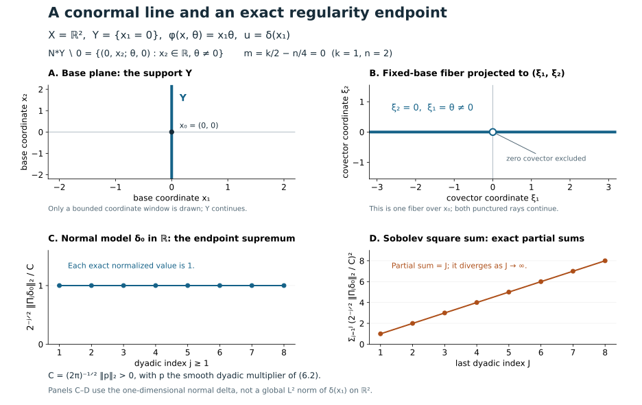

# Oscillatory distributions and their order

An integral over all frequencies may fail to converge as a function while still defining a distribution. Its phase lets us move derivatives onto the amplitude and test function. Stationary phase then converts a local representation into a frequency symbol and explains its dimension-dependent order.

The analytic prerequisites are proved in [Stationary phase and critical manifolds, Appendix A](../20261004-free-stationary-phase/stationary-phase-and-critical-manifolds.md#appendix-a-the-analytic-prerequisites-used-in-the-proof): Fourier inversion and Plancherel, distributions, parameter estimates and finite smooth cutoffs. Its [Corollary 6.1](../20261004-free-stationary-phase/stationary-phase-and-critical-manifolds.md#6-amplitudes-that-are-symbols-in-the-large-parameter) and [Theorem 7.2](../20261004-free-stationary-phase/stationary-phase-and-critical-manifolds.md#7-cancellation-normal-to-a-critical-manifold) prove every differentiated stationary remainder used here. The [Lebesgue integration proofs M0–M8](../20261004-free-intrinsic-graph/prerequisites/measure-and-l2.md) supply dominated convergence and product integration.

[Conic frequency coordinates, C3–C5](../20261004-free-intrinsic-graph/prerequisites/conic-frequency-coordinates.md#c3-construct-the-base-coordinates-and-the-conic-chart) and [clean-phase geometry F0–F1](../20261004-free-intrinsic-graph/prerequisites/prescribed-phase-representation.md#f1-clean-geometry-and-a-transverse-fourier-test) supply the geometric inputs. Symbol products, the coordinate Fourier-wavefront criterion and the dyadic endpoint are justified below. [The exact proof map](proof-map.json) identifies every earlier programme dependency.

Primary mathematical sources are [Hörmander FIO I], [Hörmander IV], [Guillemin–Sternberg] and [Melrose]. The purchased Hörmander edition supports the order and Fourier-symbol comparison alongside the freely accessible treatments; none of these citations replaces a programme proof. The complementary [intrinsic representation proof](../20261004-free-intrinsic-graph/prerequisites/prescribed-phase-representation.md) and [symbol transport and topology proof](../20261004-free-canonical-composition/homogeneous-symbol-transport.md) remain available.

## 1. Frequency cutoffs define a distribution

Let \(\phi(x,\theta)\) be real and smooth on an open cone \(\Gamma\subset U\times(\mathbb R^N\setminus0)\), homogeneous of degree one in \(\theta\), with \(d_{x,\theta}\phi\neq0\). It need not be nondegenerate. Fix a compact set \(K\subset\Gamma\cap\{|\theta|=1\}\) of base points and phase directions, and let

\[
\mathcal C=\{(x,r\omega):(x,\omega)\in K,\ r>0\}
\]

be the fixed supporting cone. The high-frequency support of \(a\) lies in \(\mathcal C\), and \(a=0\) for \(|\theta|\leq1\). All estimates take place in a fixed conic neighborhood of \(\mathcal C\) whose normalized closure is compact inside \(\Gamma\); amplitudes supported there extend by zero. The compact containment supplies a support margin for the integration-by-parts coefficients. Low-frequency smooth amplitudes can be added separately.

For

\[
0<\rho\leq1,\qquad 0\leq\delta<1,
\]

an amplitude in \(S^\mu_{\rho,\delta}\) satisfies, on each working compact base set,

\[
|\partial_\theta^\alpha\partial_x^\beta a(x,\theta)|
\leq C_{\alpha,\beta}\langle\theta\rangle^{\mu-\rho|\alpha|+\delta|\beta|}.
\tag{1.1}
\]

We use \(S^\mu=S^\mu_{1,0}\). These are local-in-base bounds; uniform global bounds require a separate assertion.

Two elementary rules follow directly from this definition. Products of symbols of orders \(p,q\) in the same two-index class have order \(p+q\): every term of the Leibniz formula has total exponent \(p+q-\rho|\alpha|+\delta|\beta|\). A smooth coefficient homogeneous of degree \(d\) satisfies \(\partial_\theta^\alpha\partial_x^\beta b=O(r^{d-|\alpha|})\) on a compact normalized cone. Differentiate \(b(x,r\omega)=r^d b(x,\omega)\) and use bounded derivatives on its normalized neighborhood. These ordinary coefficient bounds will also control products with general two-index symbols.

**Theorem 1.1 (oscillatory integral).** Choose \(\chi\in C_c^\infty(\mathbb R^N)\) equal to one near zero. The limit

\[
\langle u,f\rangle=
\lim_{\varepsilon\downarrow0}
\iint e^{i\phi(x,\theta)}a(x,\theta)
\chi(\varepsilon\theta)f(x)\,dx\,d\theta,
\qquad f\in C_c^\infty(U),
\tag{1.2}
\]

exists and defines a distribution, independently of \(\chi\). On fixed supports its distribution seminorms are controlled by finitely many amplitude seminorms. Bounded families in a fixed \(S^\mu_{\rho,\delta}\), with the same support control and smooth convergence on compact sets, have convergent resulting distributions.

**Proof.** Put \(r=|\theta|\). Homogeneity and the compact support control give

\[
A=|\phi_x'|^2+r^2|\phi_\theta'|^2\geq c r^2.
\]

Define

\[
L=\frac{1}{iA}
\left(\phi_x'\cdot\partial_x+
r^2\phi_\theta'\cdot\partial_\theta\right).
\tag{1.3}
\]

Then \(Le^{i\phi}=e^{i\phi}\). Write its coefficients as \(b_j\) for the base derivatives and \(c_j\) for the phase-variable derivatives. Their homogeneity gives, for \(r\geq1\),

\[
|\partial_\theta^\alpha\partial_x^\beta b_j|
\leq C_{\alpha,\beta}r^{-1-|\alpha|},\qquad
|\partial_\theta^\alpha\partial_x^\beta c_j|
\leq C_{\alpha,\beta}r^{-|\alpha|}.
\]

The formal transpose is

\[
L^t q=-b\cdot\partial_x q-c\cdot\partial_\theta q
-(\operatorname{div}_x b+\operatorname{div}_\theta c)q.
\]

Its three terms take order \(\nu\) to orders at most \(\nu-(1-\delta)\), \(\nu-\rho\), and \(\nu-1\). The same bounds hold after every derivative: ordinary coefficient estimates are stronger than the required general symbol estimates because \(\rho\leq1\) and \(\delta\geq0\). Consequently \(L^t:S^\nu_{\rho,\delta}\to S^{\nu-\kappa}_{\rho,\delta}\), continuously, where \(\kappa=\min(\rho,1-\delta)>0\).

The amplitudes \(a\chi(\varepsilon\theta)\) form a bounded family in (1.1), for \(0<\varepsilon\leq1\). The undifferentiated cutoff is bounded. A positive derivative of order \(j\) is supported where \(\varepsilon r\) lies in a fixed annulus and is bounded by \(C\varepsilon^j\leq C'r^{-j}\leq C'r^{-\rho j}\). The product rule gives all the required uniform seminorm bounds.

Integrate by parts \(M\) times, with \(M\kappa>\mu+N\). The transformed amplitude \((L^t)^M(a\chi(\varepsilon\theta)f)\) has an integrable majorant \(C_f\langle\theta\rangle^{\mu-M\kappa}\), uniformly in \(\varepsilon\). On compact sets the cutoffs and all their derivatives converge to those of the constant one. Dominated convergence gives

\[
\langle u,f\rangle=
\iint e^{i\phi}(L^t)^M(af)\,dx\,d\theta.
\]

This expression is bounded by finitely many derivatives of \(f\) and amplitude seminorms. It defines a distribution and has the same value for every cutoff. The same argument, using a common majorant and compact smooth convergence, proves the bounded-family convergence. ∎

The construction works when \(\delta\geq\rho\): its positive integration-by-parts gain is \(\kappa\), without the restrictions needed for an asymptotic pseudodifferential calculus. This argument asserts no endpoint with \(\rho=0\) or \(\delta=1\). The original construction and cutoff formula are [Hörmander FIO I], Lemma 1.2.1 and Proposition 1.2.2, pp. 89-90; Proposition 1.1.11, p. 88, gives the cutoff approximation.

## 2. The directions where singularities can occur

In the chosen base coordinates, \((x_0,\xi_0)\), \(\xi_0\neq0\), is absent from the wavefront set if there is a \(\zeta\in C_c^\infty(U)\), equal to one near \(x_0\), and an open frequency cone \(V\) about \(\xi_0\) such that

\[
|\widehat{\zeta u}(\xi)|\leq C_q\langle\xi\rangle^{-q},
\qquad \xi\in V,\quad q=0,1,2,\ldots.
\]

Here \(\widehat{\zeta u}(\xi)=\langle u,\zeta(x)e^{-ix\cdot\xi}\rangle\). This pairing is a smooth function of \(\xi\): each derivative differentiates the compactly supported test function, and its finitely many seminorms control the distribution pairing. This coordinate Fourier criterion is the definition needed for the next proof. Its coordinate-invariance extension is additional context.

Let \(\mathcal A\) be the closure, away from the zero section, of

\[
\{(x,\phi_x'(x,\theta)):
\phi_\theta'(x,\theta)=0,\ (x,\theta)\in\mathcal C\}.
\tag{2.1}
\]

**Theorem 2.1 (wavefront inclusion).** For the distribution of Theorem 1.1,

\[
\operatorname{WF}(u)\subset\mathcal A.
\tag{2.2}
\]

**Proof.** Take \((x_0,\xi_0)\notin\mathcal A\). Choose \(\zeta\in C_c^\infty(U)\), equal to one near \(x_0\), and an open frequency cone \(V\) containing \(\xi_0\), so that \((\operatorname{supp}\zeta\times\overline V)\cap\mathcal A=\varnothing\) in the punctured cotangent bundle. Shrink these neighborhoods so their angular closures have the same separation. For the cutoff distributions \(u_\varepsilon\) in (1.2), the localized Fourier transform has phase \(\phi(x,\theta)-x\cdot\xi\). Put \(R=|\xi|\geq2\).

Split the integral with smooth cutoffs into \(r\leq cR\) and \(r\geq cR/2\), taking \(c>0\) small. The splitting cutoffs are bounded ordinary symbols of order zero uniformly in \(R\): their positive derivatives are \(O(R^{-j})=O(r^{-j})\) on their transition annulus. Together with \(\chi(\varepsilon\theta)\), they give amplitudes bounded uniformly in both \(\varepsilon\) and \(R\) in the original symbol class.

On the first region, \(|\phi_x'|\leq Cr\), hence \(|\phi_x'-\xi|\geq R/2\). Use

\[
B_\xi=\frac{\phi_x'-\xi}{i|\phi_x'-\xi|^2}\cdot\partial_x.
\]

It fixes the exponential, and every base derivative of its coefficients is \(O(R^{-1})\). After \(M\) integrations by parts, derivatives of the amplitude cost at most \(\langle\theta\rangle^{M\delta}\); neither frequency cutoff has a base derivative. The absolute integral is bounded, uniformly in \(\varepsilon\), by

\[
C_M R^{-M}\int_{1\leq r\leq cR}
\langle\theta\rangle^{\mu+M\delta}\,d\theta
\leq C'_M(1+\log R)
R^{\max(\mu+N,0)-M(1-\delta)}.
\]

Since \(1-\delta>0\), this is smaller than every prescribed inverse power after increasing \(M\).

On the second region,

\[
A_\xi=|\phi_x'-\xi|^2+r^2|\phi_\theta'|^2
\geq c_1(r+R)^2.
\tag{2.3}
\]

To prove this, write \(\omega=\theta/r\), \(\eta=\xi/R\), and \(t=r/R\). When \(t\) ranges in a fixed compact interval bounded away from zero, use the compact set of \((x,\omega)\in K\) with \(x\in\operatorname{supp}\zeta\), \(|\omega|=1\), together with \(\eta\in\overline V\cap S^{n-1}\). A zero of \((t\phi_x'(x,\omega)-\eta,t\phi_\theta'(x,\omega))\) would yield a critical covector in the excluded product neighborhood. For sufficiently large \(t\), the original estimate gives

\[
\bigl(|\phi_x'-\xi|^2+r^2|\phi_\theta'|^2\bigr)^{1/2}
\geq c_0r-R\geq c_0r/2.
\]

These two bounds imply (2.3) on the amplitude support and in a fixed surrounding conic neighborhood.

Replace \(\phi_x'\) by \(\phi_x'-\xi\) in (1.3), and \(A\) by \(A_\xi\), obtaining \(L_\xi\). On \(r\geq cR/2\), its base coefficients have bounds \(C_{\alpha,\beta}r^{-1-|\alpha|}\) and its phase-variable coefficients have bounds \(C_{\alpha,\beta}r^{-|\alpha|}\), uniformly for \(\xi\in V\). Indeed \(R\leq2r/c\), (2.3) controls the denominator, and all differentiated numerators have their ordinary homogeneous bounds. Thus \(L_\xi^t\) lowers general symbol order by \(\kappa\), uniformly including all derivatives of both cutoff families. After \(M\) integrations the absolute integral is at most

\[
C_M\int_{r\geq cR/2}
\langle\theta\rangle^{\mu-M\kappa}\,d\theta
\leq C'_M R^{\mu+N-M\kappa},
\]

when \(\mu-M\kappa<-N\). Increase \(M\) to obtain every prescribed inverse power.

For each \(q\), the two regions therefore give

\[
|\widehat{\zeta u_\varepsilon}(\xi)|
\leq C_q(1+|\xi|)^{-q},\qquad \xi\in V,\ |\xi|\geq2,
\]

with \(C_q\) independent of \(\varepsilon\). For each fixed \(\xi\), Theorem 1.1 applied to the test function \(\zeta(x)e^{-ix\cdot\xi}\) gives \(\widehat{\zeta u_\varepsilon}(\xi)\to\widehat{\zeta u}(\xi)\). The same bound passes to this limit, giving the Fourier decay that excludes \((x_0,\xi_0)\) from the wavefront set. ∎

This inclusion is [Hörmander FIO I], Proposition 2.5.7, p. 123. For a clean phase, the possible singular directions lie on its Lagrangian image. The inclusion can be strict: a vanishing amplitude can remove all or part of that image.

## 3. Order is fixed by the dimension balance

The geometric conventions are proved in [F0–F1](../20261004-free-intrinsic-graph/prerequisites/prescribed-phase-representation.md#f0-inputs-orders-and-support-conventions). A phase is clean of excess \(e\) when its critical set \(C_\phi=\{\phi_\theta=0\}\) is a smooth manifold of dimension \(n+e\), with tangent space \(\ker d(\phi_\theta)\) and rank \(N-e\). Nondegeneracy is the case \(e=0\).

Let \(n=\dim X\). For a nondegenerate phase with \(N\) variables, we normalize a local half-density by

\[
u(x)|dx|^{1/2}
=(2\pi)^{-(n+2N)/4}
\left(\int e^{i\phi(x,\theta)}a(x,\theta)\,d\theta\right)|dx|^{1/2},
\qquad
a\in S^{m+(n-2N)/4}.
\tag{3.1}
\]

The number \(m\) is the order of this local Lagrangian representation. A half-density transforms by the square root of the absolute coordinate Jacobian. This removes an arbitrary choice of volume from the geometric amplitude later on.

For a clean phase of excess \(e\), use instead

\[
u(x)|dx|^{1/2}
=(2\pi)^{-(n+2N-2e)/4}
\left(\int e^{i\phi(x,\theta)}a(x,\theta)\,d\theta\right)|dx|^{1/2},
\qquad
a\in S^{m+(n-2N-2e)/4}.
\tag{3.2}
\]

Both formulas have the same effective order. The extra \(-e/2\) in the amplitude compensates for the loss of \(e\) cancellation directions. These formulas are for ordinary symbols \(S_{1,0}\). A different derivative-loss class has its own remainder scale.

The next theorem derives the balance and a usable leading coefficient. It compares local representations; the invariant symbol and the intrinsic iterated-regularity characterization require further results.

## 4. Fourier reduction near a frequency graph

Choose base coordinates in which the Lagrangian is

\[
\Lambda=\{(H'(\xi),\xi)\},
\]

where \(H\) is homogeneous of degree one, as in C3–C4 of [Conic frequency coordinates](../20261004-free-intrinsic-graph/prerequisites/conic-frequency-coordinates.md#c4-the-homogeneous-generating-function-and-its-extension). Let \(\phi\) be a clean phase for a small part of that Lagrangian. Restrict its amplitude to a sufficiently small compact-base cone about a point of its critical set. On this cone \(|\phi_x'|\asymp|\theta|\). Compactly supported cutoffs in the local fiber coordinates are included in the amplitude.

**Theorem 4.1 (local Fourier-symbol reduction).** For (3.2), the function

\[
v(\xi)=e^{iH(\xi)}\widehat u(\xi)
\]

is a symbol of order \(m-n/4\) on the corresponding high-frequency cone, modulo a rapidly decreasing symbol. In the nondegenerate case \(e=0\), write

\[
G(x,\theta)=
\begin{pmatrix}
\phi_{xx}''&\phi_{x\theta}''\\
\phi_{\theta x}''&\phi_{\theta\theta}''
\end{pmatrix}.
\]

At the unique point determined locally by \(\phi_\theta'=0\), \(\phi_x'=\xi\), this matrix is invertible, and

\[
v(\xi)-
(2\pi)^{n/4}
e^{i\pi\operatorname{sgn}G/4}
\frac{a(x,\theta)}{|\det G(x,\theta)|^{1/2}}
\in S^{m-n/4-1}.
\tag{4.1}
\]

There is a full expansion with successive orders \(m-n/4-j\). Every remainder has the differentiated symbol estimates in its stated order.

For excess \(e\), split \(\theta=(\theta',\theta'')\), with \(\dim\theta''=e\), so that \(\theta''\) locally parametrizes the fiber

\[
C_\xi=\{(x,\theta):\phi_\theta'=0,\ \phi_x'=\xi\}.
\]

Replace \(G\) by the Hessian \(G'\) in the \((x,\theta')\) directions. The leading coefficient becomes

\[
(2\pi)^{n/4}
\int_{C_\xi}
e^{i\pi\operatorname{sgn}G'/4}
\frac{a(x,\theta)}{|\det G'(x,\theta)|^{1/2}}\,|d\theta''|.
\tag{4.2}
\]

The same order and remainder conclusion holds. These are local fiber integrals on the compact part of the fiber met by the amplitude.

**Proof.** Localize the base support compactly in the chosen coordinate neighborhood. By homogeneity and the restriction to a sufficiently small phase cone, there are constants \(0<c_0<C_0\) such that

\[
c_0|\theta|\leq|\phi_x'(x,\theta)|\leq C_0|\theta|
\]

on the amplitude support. Put \(\mu=m+(n-2N-2e)/4\), the amplitude order in (3.2), and write \(R=|\xi|\geq1\). Choose constants \(0<c<C\) so small and large, respectively, that \(|\phi_x'-\xi|\geq c_1(|\theta|+R)\) where \(|\theta|\leq2cR\) or \(|\theta|\geq CR/2\). Choose a smooth cutoff \(\chi_0(t)\) supported in \((c,C)\) and equal to one on \([2c,C/2]\), enlarging \(C\) and decreasing \(c\) if necessary. The omitted frequencies are therefore nonstationary in \(x\).

On the omitted part use

\[
L_\xi=\frac{\phi_x'-\xi}{i|\phi_x'-\xi|^2}\cdot\partial_x,
\qquad
L_\xi^t b=-\operatorname{div}_x\!\left(
\frac{\phi_x'-\xi}{i|\phi_x'-\xi|^2}b\right).
\]

Every iteration supplies an inverse power of \(R\) on the smaller-frequency region and of \(|\theta|\) on the larger-frequency region. Base derivatives of an ordinary symbol preserve its order. The smaller-frequency integral has at most a fixed polynomial growth, with a possible logarithm, before these inverse powers; for the larger-frequency integral, choose \(M>\mu+N\) and use

\[
\int_{|\theta|\geq CR/2}|\theta|^{\mu-M}\,d\theta
\leq C_M R^{\mu+N-M}.
\]

Any fixed \(\xi\) derivative inserts bounded powers of \(x\) and differentiates smooth cutoff or integration-by-parts coefficients. Increasing \(M\) gives arbitrary decay for all these derivatives. Perform this argument first with the frequency regularization of Theorem 1.1; the integrable majorants are uniform in that cutoff and pass each fixed frequency derivative through the defining distributional limit. Thus the omitted contribution belongs to \(S^{-\infty}\). Since the fixed-order derivatives of \(e^{iH(\xi)}\) are bounded on the chosen high-frequency cone, this remains true after multiplying by that factor.

In the annular part set

\[
\eta=\xi/R,\qquad\theta=R\vartheta,
\qquad
\Psi(x,\vartheta,\eta)=\phi(x,\vartheta)+H(\eta)-x\cdot\eta.
\]

All cutoffs are included in

\[
A_R(x,\vartheta,\eta)=\chi_0(|\vartheta|)a(x,R\vartheta).
\]

Additional local partitions, when needed, are smooth in the angular parameter and supported in fixed compact charts. The support of \(A_R\) is fixed and compact in \((x,\vartheta)\), with \(\vartheta\) in a compact annulus. The ordinary symbol estimates and the chain rule give

\[
\left|\partial_R^k\partial_x^\alpha
\partial_\vartheta^\gamma\partial_\eta^\beta A_R\right|
\leq C_{k,\alpha,\gamma,\beta}R^{\mu-k},
\qquad
\mu=m+\frac{n-2N-2e}{4}.
\tag{4.4}
\]

For example, every \(\vartheta\) derivative introduces a factor \(R\) and one frequency derivative of \(a\), whose symbol estimate gives the compensating inverse power. These estimates remain valid after the fixed smooth coordinate changes used below.

The critical equations of \(\Psi\) are \(\phi_\vartheta'=0\) and \(\phi_x'=\eta\). On their solution set, the frequency graph gives \(x=H'(\eta)\). Euler's identity gives \(\phi=0\) there and \(H(\eta)=H'(\eta)\cdot\eta\), so the critical value of \(\Psi\) is zero for every angular parameter.

Let \(C_\phi\) be the phase critical set and put \(q=\phi_x'|_{C_\phi}\). F1 of [Clean geometry and a transverse Fourier test](../20261004-free-intrinsic-graph/prerequisites/prescribed-phase-representation.md#f1-clean-geometry-and-a-transverse-fourier-test) gives rank \(n\) for the clean critical map, and frequency projection on the graph is a local diffeomorphism. Hence \(q\) is a submersion. Its level set \(C_\eta\) is a smooth manifold of dimension \(e\) and

\[
T C_\eta
=\ker d(\phi_\vartheta')\cap\ker d(\phi_x')
=\ker\Psi_{(x,\vartheta)(x,\vartheta)}''.
\tag{4.5}
\]

The first equality uses the clean tangent condition. The second follows because these two differentials are the two row blocks of the Hessian. Thus \(\Psi\) has a clean critical manifold with normal dimension \(r=n+N-e\). After shrinking the parameter patch and using finitely many compact clean charts, their normal Hessians are uniformly invertible. On the remaining compact support the full gradient has a positive uniform lower bound.

Apply Theorem 7.2, including its symbol-family conclusion from Corollary 6.1, of [Stationary phase and critical manifolds](../20261004-free-stationary-phase/stationary-phase-and-critical-manifolds.md#7-cancellation-normal-to-a-critical-manifold) to this family, using (4.4). The factor \(R^N\) comes from the measure change. Clean stationary phase contributes \(R^{-r/2}\), and

\[
\mu+N-r/2=m-n/4=:s.\tag{4.3}
\]

The product of the normalization in (3.2) and the stationary-phase constant is

\[
(2\pi)^{-(n+2N-2e)/4}(2\pi)^{r/2}=(2\pi)^{n/4}.
\]

For each \(L\), write the resulting expansion as \(\sum_{j<L}B_j(R,\eta)+T_L(R,\eta)\). The normalized stationary-phase remainder estimates give

\[
|\partial_R^k\partial_\eta^\beta B_j|
\leq C_{j,k,\beta}R^{s-j-k},
\qquad
|\partial_R^k\partial_\eta^\beta T_L|
\leq C_{L,k,\beta}R^{s-L-k}.
\tag{4.6}
\]

Here angular derivatives are taken in a fixed smooth sphere chart. There is no varying critical-value exponential to estimate, since the critical value is zero. With a sphere-tangent vector field \(V_j\), Cartesian frequency differentiation has the form

\[
\partial_{\xi_j}=\eta_j\partial_R+R^{-1}V_j.
\]

Iteration of this identity and (4.6) proves all ordinary symbol estimates, including \(T_L\in S^{s-L}\). This is an asymptotic symbol expansion; homogeneous classical coefficients are not assumed for a general ordinary symbol amplitude.

It remains to express the leading term in physical variables. In the nondegenerate case, the scaled Hessian is \(G(x,\vartheta)\). Put

\[
D_R=\operatorname{diag}(R^{1/2}I_n,R^{-1/2}I_N).
\]

Homogeneity gives \(G(x,R\vartheta)=D_R^T G(x,\vartheta)D_R\), so

\[
\det G(x,R\vartheta)=R^{n-N}\det G(x,\vartheta)
\]

and its signature is unchanged. The scaled leading term has the factor \(R^{N-(n+N)/2}\); combining it with this determinant identity gives exactly (4.1).

For excess \(e\), a tangent to a fixed-frequency fiber has \(\delta x=0\): its critical-map image has \(\delta\xi=0\), and the graph tangent equation is \(\delta x=H''(\xi)\delta\xi\). Choose \(e\) of the original phase coordinates whose projection is invertible on that tangent at the chosen point, and preserve this fixed linear split after shrinking the patch. Call them \(\theta''\), with the remaining coordinates \(\theta'\). The slice \(W=\ker d\theta''\) complements the full Hessian's radical. If a vector of \(W\) is Hessian-orthogonal to \(W\), it is also orthogonal to the radical and hence to the whole tangent space. It belongs to the radical and therefore to the zero intersection \(W\cap T C_\xi\). Thus \(G'\), the restriction in \((x,\theta')\), is nondegenerate.

Use

\[
D_R'=\operatorname{diag}(R^{1/2}I_n,R^{-1/2}I_{N-e}).
\]

Then \(G'(x,R\vartheta)=(D_R')^T G'(x,\vartheta)D_R'\), giving determinant degree \(n-N+e\) and the same signature. At fixed frequency the fiber is a graph \((x,\theta')=Y(\theta'')\); translating these transverse variables by \(Y\) has ambient Jacobian one. The clean leading density of Theorem 7.2 is consequently

\[
\frac{a(x,\theta)}{|\det G'(x,\theta)|^{1/2}}\,|d\theta''|.
\]

The physical fiber density contributes degree \(e\). Since \(\vartheta''=\theta''/R\), undoing the scaling has net factor

\[
R^{N-r/2}R^{-e}R^{(n-N+e)/2}=1.
\]

This proves (4.2). Dividing the ambient density by the Hessian density on the normal quotient is independent of the chosen complement: a normal frame change multiplies both by its absolute determinant, and adding tangent vectors changes no Hessian pairing. Thus the fiber expression is independent of the selected split. The same remainder conclusion follows from (4.6). ∎

## 5. Changing phase variables and adding a quadratic block

An invertible homogeneous change \(\theta=T(x,\eta)\) leaves an oscillatory distribution unchanged when its amplitude is replaced by

\[
\widetilde a(x,\eta)=
a(x,T(x,\eta))|\det T_\eta'(x,\eta)|.
\tag{5.1}
\]

On fixed compact-base cones, the map and its inverse make the two frequency sizes comparable. The derivatives of a degree-one map satisfy \(\partial_\eta^\alpha\partial_x^\beta T=O(|\eta|^{1-|\alpha|})\); the absolute Jacobian is degree zero. In a chain-rule term, each derivative of \(a\) in its frequency variables gains one order, canceling the degree-one factor introduced by differentiating \(T\) in the base. Frequency derivatives lower the total degree by one each. Together with the product rule of Section 1, this proves \(\widetilde a\in S^\mu\) whenever \(a\in S^\mu\).

For bounded frequencies, ordinary change of variables replaces \(\chi(\varepsilon\theta)\) by \(\chi(\varepsilon T(x,\eta))\). This changed cutoff family is bounded in \(S^0\) on the fixed comparable cones, and converges smoothly on compact sets to one. To see the bounds, a positive derivative is supported where \(\varepsilon|\eta|\asymp1\); every factor \(\varepsilon T\) is then bounded, and each frequency derivative contributes \(|\eta|^{-1}\). Base derivatives preserve order zero. Thus both the changed and original cutoff amplitudes are bounded in the same \(S^\mu\), with the same support control and local smooth limit. Theorem 1.1 gives the unrestricted distribution identity (5.1). If the transformed low-frequency threshold differs from one, separate the remaining bounded frequencies as a smooth integral.

A stabilization adds new phase variables while preserving the Lagrangian. Homogeneity requires some care. Let \(r(\theta)>0\) be smooth and homogeneous of degree one, comparable to \(|\theta|\) on the working cone, and let \(A\) be a real symmetric invertible \(k\times k\) matrix. Set

\[
\widetilde\phi(x,\theta,\eta)=
\phi(x,\theta)+\frac{\eta^TA\eta}{2r(\theta)}.
\tag{5.2}
\]

This is homogeneous of degree one under joint dilation of \((\theta,\eta)\). Its new critical equations force \(\eta=0\); the remaining equations and the critical covector are those of \(\phi\). The Hessian gains a nondegenerate block \(A/r\).

**Proposition 5.1 (stabilized amplitude).** Suppose \(\phi\) is nondegenerate and \(a\) has the order in (3.1). There is an ordinary symbol \(\widetilde a\) of order

\[
m+\frac{n-2(N+k)}4
\]

supported where \(|\eta|\leq C r(\theta)\), such that the normalized integrals for \((\phi,a)\) and \((\widetilde\phi,\widetilde a)\) differ by a smooth function locally. Its leading restriction is

\[
\widetilde a(x,\theta,0)
\equiv
r(\theta)^{-k/2}|\det A|^{1/2}
e^{-i\pi\operatorname{sgn}A/4}a(x,\theta)
\quad\text{in the leading symbol order}.
\tag{5.3}
\]

**Proof.** Choose a smooth compactly supported \(\psi\) equal to one near zero, and set exactly

\[
\widetilde a(x,\theta,\eta)
=r(\theta)^{-k/2}|\det A|^{1/2}
 e^{-i\pi\operatorname{sgn}A/4}a(x,\theta)\psi(\eta/r(\theta)).
\]

On this support \(|(\theta,\eta)|\asymp|\theta|\asymp r\). Homogeneous coefficient bounds and the chain rule show that this is an ordinary joint symbol of order \(\mu-k/2\), where \(\mu=m+(n-2N)/4\); each joint frequency derivative gains one order. Its normalized support is compact inside the joint phase cone. The stabilized phase has nonzero full differential: if its \(\eta\) gradient vanishes then \(\eta=0\), where the old differential is nonzero. Substitute \(\eta=rz\) in its inner integral. The measure gives \(r^k\), the phase is \(r z^TAz/2\), and stationary phase gives \((2\pi/r)^{k/2}e^{i\pi\operatorname{sgn}A/4}|\det A|^{-1/2}\). Multiplying by the amplitude factor in (5.3) leaves \((2\pi)^{k/2}a\) to leading order. The normalization in the stabilized integral has an additional factor \((2\pi)^{-k/2}\), so the leading integral agrees.

By [Corollary 6.1 of Stationary phase and critical manifolds](../20261004-free-stationary-phase/stationary-phase-and-critical-manifolds.md#6-amplitudes-that-are-symbols-in-the-large-parameter), all positive-degree quadratic stationary-phase coefficients of \(\psi\) vanish, because \(\psi\) is constant near zero. Thus the explicit amplitude just constructed already gives an inner difference of order \(-\infty\), with all parameter derivatives; no successive amplitude corrections are required. Multiplying by the fixed-order symbol \(a\) preserves that rapid decrease.

The outer difference is smooth: every base derivative inserts at most a fixed power of \(|\theta|\), still integrable for a sufficiently negative symbol order. For a bounded outer-frequency cutoff, the support condition \(|\eta|\leq Cr\) also bounds the inner frequencies, so ordinary Fubini applies. The cutoffs \(\chi(\varepsilon\theta)\), although depending only on the old frequencies, form a bounded \(S^0\) family on this joint support because \(|(\theta,\eta)|\asymp|\theta|\); they converge locally smoothly to one. Multiplying by \(\widetilde a\) gives a bounded joint-symbol family of the asserted order. Theorem 1.1 identifies its limit with the joint oscillatory distribution and also supplies convergence for the old integral. Pass to unrestricted outer frequencies with these two bounded-family limits. This justifies the successive integrations as distributions. ∎

The signature factor in (5.3) is the local compensation that later becomes part of the Maslov transition data. This proposition establishes one elementary phase change; a general phase-equivalence theorem still needs its own proof.

## 6. Examples and the endpoint regularity

**A delta distribution on a submanifold.** Let \(x=(t,z)\), with \(t\in\mathbb R^k\), \(1\leq k\leq n\), and let \(b(z)\) be smooth with compact support. Fourier inversion, proved in [Appendix A of Stationary phase and critical manifolds](../20261004-free-stationary-phase/stationary-phase-and-critical-manifolds.md#appendix-a-the-analytic-prerequisites-used-in-the-proof), gives the distribution identity

\[
b(z)\delta(t)=(2\pi)^{-k}\int e^{it\cdot\theta}b(z)\,d\theta.
\]

For completeness, test the frequency-cutoff formula against a compact smooth function \(f(t,z)\). Its inner \(t\) integral is \(\widehat{f(\cdot,z)}(-\theta)\), which decreases rapidly uniformly for \(z\) on the working compact set. Dominated convergence and Schwartz inversion make its limit \((2\pi)^k f(0,z)\); integrating against \(b(z)\) proves the displayed distribution identity with its exact factor.

To fit Section 1 literally, choose a smooth \(h(\theta)\) that is zero for \(|\theta|\leq1\) and one for \(|\theta|\geq2\). The amplitude \(h b\) satisfies the high-frequency convention; the remaining integral with amplitude \((1-h)b\) is smooth because its frequency support is compact. Base cutoffs are also inserted when applying the local theorem. In (3.1), the full amplitude is \((2\pi)^{n/4-k/2}b(z)\), of order zero. Its Lagrangian representation order is therefore

\[
m=\frac k2-\frac n4.
\tag{6.1}
\]

The phase \(t\cdot\theta\) has independent critical equations \(t=0\); its covectors are \((\theta,0)\). Thus it parametrizes the nonzero conormal bundle of that submanifold, by these explicit equations; the general rank and Lagrangian argument is proved in [F1](../20261004-free-intrinsic-graph/prerequisites/prescribed-phase-representation.md#f1-clean-geometry-and-a-transverse-fourier-test). A conormal covector annihilates the tangent space of the submanifold. This concrete definition and phase calculation are sufficient for this example.

In \(X=\mathbb R^2\), let \(Y=\{x_1=0\}\) and \(\phi(x,\theta)=x_1\theta\), with \(\theta\neq0\). The critical equation is \(x_1=0\), and \(\phi_x'=(\theta,0)\). Hence the critical map has image

\[
N^*Y\setminus0=\{(0,x_2;\theta,0):x_2\in\mathbb R,\ \theta\neq0\}.
\]

Panel A draws a bounded window in the base. Panel B is the projection to \((\xi_1,\xi_2)\) of the covector fiber over the fixed point \(x_0=(0,0)\), with its zero covector omitted. Both rays continue beyond the drawn window. It is one fiber of the conormal bundle; varying \(x_2\) gives the full bundle. The line in panel B represents the punctured fiber, rather than a finite collection of selected wavefront arrows.

For this delta distribution, the wavefront set equals the displayed nonzero conormal bundle. Theorem 2.1 supplies the inclusion. To check the reverse inclusion, let \(\zeta\) be any compact smooth cutoff equal to one near \((0,x_2^0)\). Then \(\widehat{\zeta\delta(x_1)}(\xi_1,\xi_2)=\widehat{\zeta(0,\cdot)}(\xi_2)\). The nonzero smooth trace has a nonzero Fourier value at some fixed \(\eta\). On either sequence \((\xi_1,\eta)\), with \(\xi_1\to+\infty\) or \(\xi_1\to-\infty\), this value is constant and nonzero. The sequence eventually lies in any cone about the corresponding normal direction, precluding rapid decrease. Thus every nonzero normal covector occurs.

The scalar representation order is \(m=k/2-n/4=0\), since \(k=1\) and \(n=2\). The full normalized amplitude in (3.1) is one and the prefactor is \((2\pi)^{-1}\), giving \(\delta(x_1)=(2\pi)^{-1}\int e^{ix_1\theta}\,d\theta\) as a distribution. This order is not its Sobolev endpoint exponent.

Panels C–D use the **one-dimensional normal model** \(\delta_0\) on \(\mathbb R\). They do not claim a global \(L^2\) norm for the unlocalized line distribution on \(\mathbb R^2\). For the nonzero smooth multiplier \(p\) of (6.2), put \(C=(2\pi)^{-1/2}\|p\|_2>0\). Exercise 7.2 proves, for every integer \(j\geq1\),

\[
2^{-j/2}\|\Pi_j\delta_0\|_2=C,
\qquad
\sum_{j=1}^{J}\left(\frac{2^{-j/2}\|\Pi_j\delta_0\|_2}{C}\right)^2=J.
\]

The graph gives exact initial values, normalized by \(C\). Their finite supremum and divergent square sum establish \(\delta_0\in B^{-1/2}_{2,\infty}\) and \(\delta_0\notin H^{-1/2}\); the low-frequency block has finite norm. Formula (6.4) supplies the precise Sobolev square-sum comparison.

**Proof locators.** The complete critical-map argument is in [Clean geometry and a transverse Fourier test, F1](../20261004-free-intrinsic-graph/prerequisites/prescribed-phase-representation.md#f1-clean-geometry-and-a-transverse-fourier-test); the conormal model itself is calculated immediately above. The order and endpoint calculations are in [Oscillatory distributions and their order, §6](oscillatory-distributions-and-order.md#6-examples-and-the-endpoint-regularity), [Exercise 7.1](oscillatory-distributions-and-order.md#7-exercises-with-complete-solutions) (with \(q=0\)), and [Exercise 7.2](oscillatory-distributions-and-order.md#7-exercises-with-complete-solutions). Plancherel and the Fourier convention are proved in [Stationary phase and critical manifolds, Appendix A.2](../20261004-free-stationary-phase/stationary-phase-and-critical-manifolds.md#a-2-plancherel-and-the-pairing-calculation).

**Human source comparison.** Richard Melrose, *From Microlocal to Global Analysis*, version 0.7I, §§1.7, 5.11 and 9.1–9.5, discusses conormal distributions and their Sobolev order conventions ([author reading](https://math.mit.edu/~rbm/18-157-S14/iml.pdf)). The exact dyadic endpoint pictured here is proved in the local lesson and is not asserted to follow from the strict Sobolev inequalities of Melrose's Lemma 9.2.

The independently authored diagram and reproducible Matplotlib source are CC0, following the course's original-content notice. DejaVu Sans glyphs are embedded as SVG paths; their full [font notices](figures/notices/LICENSE_DEJAVU.txt) accompany the figure. No external source image is reproduced.

**The identity kernel.** On \(\mathbb R^d\), \(d\geq1\), the kernel \(\delta(x-y)\) lives on a base of dimension \(n=2d\) and uses \(N=d\) phase variables. Formula (3.1) becomes \((2\pi)^{-d}\int e^{i(x-y)\cdot\theta}\,d\theta\). Its amplitude has order zero and its representation order is zero. The same cutoff \(h\) splits this formula into the permitted high-frequency integral and a smooth compact-frequency term. The ambient dimension is the kernel's base dimension, which differs from the dimension of its input or output manifold.

**Smooth dyadic blocks.** In \(\mathbb R^k\), choose a nonincreasing smooth radial \(\chi_0\), equal to one on the unit ball and zero outside the ball of radius two. Set

\[
p_0(\xi)=\chi_0(\xi),\qquad
p(\xi)=\chi_0(\xi)-\chi_0(2\xi),\qquad
p_j(\xi)=p(2^{-j}\xi),\quad j\geq1,
\qquad\Pi_j u=\mathcal F^{-1}(p_j\widehat u).
\tag{6.2}
\]

The nonzero \(p\) is smooth and supported in \(1/2\leq|\xi|\leq2\). Telescoping gives \(\sum_{j\geq0}p_j=1\). Only a fixed finite number of these multipliers is nonzero at each frequency. Define the dyadic endpoint by

\[
u\in B^s_{2,\infty}\quad\Longleftrightarrow\quad
\sup_{j\geq0}2^{js}\|\Pi_j u\|_2<\infty.
\tag{6.3}
\]

The corresponding square sum is \(\sum_{j\geq0}2^{2js}\|\Pi_j u\|_2^2\). It gives the Sobolev condition, with equivalent norm, when the Fourier transform is a function and the blocks under consideration obey Plancherel. Indeed, on each high annulus \(2^{2js}\asymp\langle\xi\rangle^{2s}\). Since \(p_j\geq0\), \(\sum p_j=1\), and at most \(J\) terms overlap, Cauchy–Schwarz gives \(\sum p_j^2\geq J^{-1}\), while boundedness gives a fixed upper bound. Consequently

\[
c_s\langle\xi\rangle^{2s}
\leq\sum_{j\geq0}2^{2js}|p_j(\xi)|^2
\leq C_s\langle\xi\rangle^{2s}.
\tag{6.4}
\]

Integrating this comparison and using Plancherel on the blocks proves the asserted square-sum equivalence in that setting. Every block of delta used below is Schwartz, so Appendix A.2 supplies the entire Plancherel input needed for the example. The Fourier convention defines the Sobolev norm by \((2\pi)^{-k}\int\langle\xi\rangle^{2s}|\widehat u(\xi)|^2d\xi\) when that integral is finite.

The AN-03 conormal lesson *Singularities along a submanifold and smooth boundary passage* places this dyadic supremum in its intrinsic iterated-regularity endpoint. The present phase-integral and Fourier-symbol results preserve the distinction between that supremum and the Sobolev square sum. The intrinsic Lagrangian characterization requires further results.

## 7. Exercises with complete solutions

**Exercise 7.1 (order of a normal derivative; introductory).** Find the representation order of \(\partial_{t_1}^q(b(z)\delta(t))\), with integer \(q\geq0\), \(1\leq k\leq n\), and \(b\neq0\).

**Solution.** Its amplitude acquires \((i\theta_1)^q\), of ordinary symbol order \(q\). Therefore \(m=q+k/2-n/4\). Differentiation does not change the phase, so Theorem 2.1 still puts the possible wavefront directions in the conormal bundle. The zero locus \(\theta_1=0\) of the leading polynomial alone does not remove a conormal direction: every open frequency cone about such a direction contains directions where \(\theta_1\neq0\).

**Exercise 7.2 (endpoint versus square sum; intermediate).** For a delta distribution at zero in \(\mathbb R^k\), \(k\geq1\), compare \(B^{-k/2}_{2,\infty}\) with \(H^{-k/2}\).

**Solution.** The Fourier transform is one. Thus \(\Pi_j\delta=\mathcal F^{-1}p_j\), a Schwartz function. Appendix A.2 gives, for \(j\geq1\),

\[
\|\Pi_j\delta\|_2=(2\pi)^{-k/2}\|p_j\|_2
=(2\pi)^{-k/2}2^{jk/2}\|p\|_2.
\]

The weighted sequence \(2^{-jk/2}\|\Pi_j\delta\|_2\) is therefore a nonzero constant; the low block also has finite norm. Its supremum is finite, but its square sum diverges. Formula (6.4) confirms the Sobolev interpretation. Directly, the proposed endpoint Fourier integral is

\[
(2\pi)^{-k}\int_{\mathbb R^k}\langle\xi\rangle^{-k}\,d\xi,
\]

whose radial integrand at infinity is comparable to \(r^{-1}\), so it diverges logarithmically. Hence \(\delta\in B^{-k/2}_{2,\infty}\) and \(\delta\notin H^{-k/2}\). This is an exact obstruction to strengthening the iterated-regularity endpoint to the Sobolev endpoint.

**Exercise 7.3 (homogeneous stabilization; intermediate).** Explain why adding \(\eta^TA\eta/2\) directly to a degree-one phase is incompatible with its joint homogeneity, and verify (5.2).

**Solution.** Joint dilation multiplies the unscaled quadratic term by \(t^2\), while multiplying the original phase by \(t\). In (5.2), the numerator has degree two and \(r\) has degree one; their quotient has degree one. Its \(\eta\) gradient is \(A\eta/r\), which vanishes only at \(\eta=0\). There its other derivatives vanish, so the original critical equations and covector are preserved.

**Exercise 7.4 (clean order compensation; advanced).** A clean phase has \(N\) variables and excess \(e\). Under the prefactor for excess zero, an amplitude of order \(m+(n-2N)/4\) is used without changing its order. What Fourier-symbol order does the calculation yield?

**Solution.** Substitution \(\theta=R\vartheta\) contributes \(R^N\). The clean normal rank is \(n+N-e\), so stationary phase contributes \(R^{-(n+N-e)/2}\). The result has order \(m-n/4+e/2\). It is higher by \(e/2\) than the desired order. Decreasing the amplitude order by \(e/2\), as in (3.2), restores \(m-n/4\). The modified prefactor also makes the leading scalar constant \((2\pi)^{n/4}\).

**Exercise 7.5 (regular amplitude; advanced).** Show that an amplitude of order \(-\infty\) produces a smooth function, and determine which part of Theorem 1.1 becomes unnecessary.

**Solution.** Every base derivative of \(e^{i\phi}a\) is a finite sum of products of phase derivatives, bounded by polynomial powers of \(|\theta|\), with derivatives of \(a\), which decrease faster than every power. All such integrals are absolutely convergent locally, uniformly on compact base sets. Dominated differentiation therefore proves smoothness. Frequency-cutoff regularization and integration by parts are no longer needed to define these integrals.

## References

- [Hörmander FIO I] Lars Hörmander, *Fourier integral operators. I*, Acta Mathematica 127 (1971), 79–183, DOI 10.1007/BF02392052. Definition 1.1.1, p. 83; Proposition 1.1.11, p. 88; Lemma 1.2.1 and Proposition 1.2.2, pp. 89–90, with the cone passage on p. 91; Fourier criterion, pp. 121–122, and Proposition 2.5.7, p. 123. [Publisher reading](https://projecteuclid.org/journals/acta-mathematica/volume-127/issue-none/Fourier-integral-operators-I/10.1007/BF02392052.pdf).
- [Guillemin–Sternberg] Victor Guillemin and Shlomo Sternberg, *Semi-classical Analysis*, author draft, January 13, 2010. §5.9, §§8.9.1 and 8.11–8.14, and Chapter 14 provide the generating-graph, clean-fiber and stationary-phase comparisons. The exact differentiated ordinary-symbol estimates used here are proved in the linked stationary-phase lesson. [Online reading](https://math.mit.edu/~vwg/semiclassGuilleminSternberg.pdf).
- [Melrose] Richard Melrose, *From Microlocal to Global Analysis*, version 0.7I, run February 3, 2014, §1.7, §5.11 and §§9.1–9.5. The conormal order conventions and frequency-graph comparison are pertinent; the strict Sobolev inequalities of Lemma 9.2 do not supply the Besov endpoint, and the cutoff passage left open in Lemma 9.9 is completed here. [Author reading](https://math.mit.edu/~rbm/18-157-S14/iml.pdf). His *Introduction to Microlocal Analysis*, version 0.5B, Lemma 4.6, pp. 109–110, provides another Fourier-wavefront account. [Author reading](https://math.mit.edu/~rbm/iml90.pdf).
- [Hörmander IV] Lars Hörmander, *The Analysis of Linear Partial Differential Operators IV: Fourier Integral Operators*, Springer, reprint of the 1994 edition, ISBN 978-3-642-00136-9. §25.1, Propositions 25.1.5 and 25.1.5′, pp. 7–10, supplies the nondegenerate and clean Fourier-symbol comparison. This is the verified purchased edition; the complete programme proof and its prerequisites are given above.

*Original lesson by GPT-6.1 Sol (OpenAI), Ultra, September 2026; proof-detail revision, 4 October 2026. Restored with current prerequisite bindings and source-edition correction by GPT-6 Astra (OpenAI), Ultra, 5 October 2026. Self-checked by the writing AI. Human review remains pending. Original text: public domain (CC0); linked prerequisite components retain their stated terms.*
