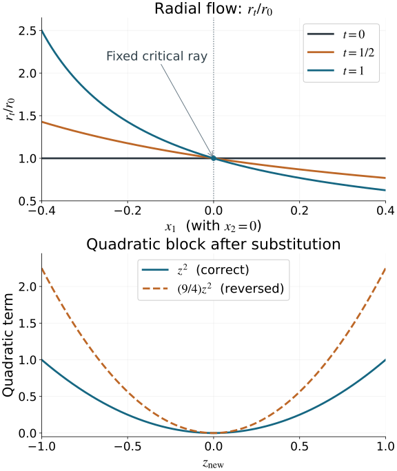

# Homogeneous phase equivalence and stabilization

Different phase functions can describe the same conic Lagrangian. To compare their oscillatory integrals, we need an actual change of phase variables making the functions equal. A shared critical set or a shared Lagrangian image is insufficient. We prove this change of variables, identify the fiber-Hessian signature that can obstruct it, and give an explicit stabilization when extra quadratic variables are needed.

The geometry and minimal generating phases come from [Phase space and generating families](../20261005-restored-phase-space/phase-space-and-generating-families.md). The oscillatory-integral definition, ordinary-symbol normalization and elementary stabilization amplitude are those proved in [Oscillatory distributions and their order](../20261005-restored-oscillatory/oscillatory-distributions-and-order.md). The exact finite inverse/implicit proofs are [U001 P2–P3](../20261004-free-stationary-phase/prerequisite-completions.md); [FTC, Taylor and compact parameter integration](../20261004-free-stationary-phase/proof-map.html#FTC-TAYLOR-COMPACT-PARAMETERS) supplies the integral remainders. The complete [AN-03 flow proof NF1–NF21](../20261005-restored-phase-space/finite-coordinate-flows.md) supplies smooth parameter dependence and inverse flows; [companion F4](../20261005-restored-phase-space/differential-forms-and-flow-pullbacks.md) proves the common time-one neighborhood. The [exact proof map](proof-map.json) records their current sources and full dependencies. The smooth matrix and phase reductions needed here are proved below.

The source contexts are Hörmander III, Definition 21.2.15 and Theorems 21.2.16–21.2.18, for phase geometry and generating functions, and Hörmander I, the Morse discussion and parameter stationary phase in Section 7.7. These contexts support the ingredients; we give the full equivalence argument here. We work with real smooth nondegenerate degree-one phases at marked critical points representing the same nonzero covector and the same embedded conic Lagrangian germ. All changes are local homogeneous fiber diffeomorphisms over the identity of the base. No constant-rank assumption on the base projection is imposed.

## 1. A fiber Hessian records vertical tangents and a signature

Let \(\phi(x,\theta)\) have \(N\) phase variables, and let \(c=(x_0,\theta_0)\) satisfy \(\phi_\theta(c)=0\). Its critical map is
\[
 \kappa_\phi:C_\phi\longrightarrow\Lambda,\qquad
 (x,\theta)\longmapsto(x,\phi_x(x,\theta)).
 \tag{1.1}
\]
Nondegeneracy makes this a local diffeomorphism, as proved in the phase-geometry lesson. Let \(\lambda_0=\kappa_\phi(c)\) and set
\[
 k=\dim\bigl(T_{\lambda_0}\Lambda\cap\ker d\pi\bigr),\qquad
 H_\phi=\phi_{\theta\theta}(c).
 \tag{1.2}
\]

**Lemma 1.1 (nullity and congruence).** The kernel of \(H_\phi\) maps isomorphically to the vertical tangent space in (1.2). Hence its nullity is \(k\), its rank is \(N-k\), and \(1\leq k\leq N\). If \(\psi(x,\eta)=\phi(x,T(x,\eta))\) for an invertible fiber change carrying the marked critical points to each other, then
\[
 \psi_{\eta\eta}=(T_\eta)^T H_\phi T_\eta
 \quad\text{at the marked critical point}.
 \tag{1.3}
\]

**Proof.** A vertical critical tangent has \(\delta x=0\) and \(H_\phi\delta\theta=0\). The critical-map differential takes it to \((0,\phi_{x\theta}\delta\theta)\). This is an isomorphism onto the vertical tangent because the full critical-map differential is an isomorphism. Euler's identity differentiated in \(\theta\) gives \(H_\phi\theta_0=\phi_\theta(c)=0\); the nonzero radial vector therefore gives \(k\geq1\). In the second derivative of the composed phase, the extra terms containing second derivatives of \(T\) are multiplied by \(\phi_\theta\), which vanishes at the critical point. This proves (1.3). \(\square\)

For a real symmetric form, write \(p,q\) for its numbers of positive and negative squares and \(\sigma=p-q\) for its signature; zero squares are excluded from the signature. These numbers are invariant under congruence. One direct proof uses the maximal dimension of a positive subspace: for a diagonal form with \(p\) positive entries, any larger subspace meets the nonpositive coordinate plane and cannot be positive. The positive coordinate plane attains dimension \(p\). An invertible congruence preserves this maximal dimension, and the same argument with the negative form preserves \(q\). Symmetric forms can be diagonalized by successively choosing a vector with nonzero square and taking its orthogonal complement; if a symmetric form has no such vector, polarization makes it zero.

Consequently phases with the same number of variables can be equivalent only when their fiber-Hessian signatures agree. The nullities already agree because they represent the same marked Lagrangian. We will prove the converse as equality of functions on conic neighborhoods.

## 2. A smooth parameter Morse change with its full inverse

We first prove the smooth function reduction needed for the homogeneous phase.

**Lemma 2.1 (parameter quadratic form).** Suppose \(f(a,z)\) is real smooth, \(f_z(a_0,z_0)=0\), and \(f_{zz}(a_0,z_0)\) is invertible. There are a smooth critical point \(s(a)\), smooth parameter-dependent coordinates \(Z\), and a constant diagonal matrix \(J\) with entries \(+1\) and \(-1\), such that
\[
 f(a,z)=f(a,s(a))+\tfrac12 Z^T J Z.
 \tag{2.1}
\]
The change has a smooth local inverse, takes \(z=s(a)\) to \(Z=0\), and \(J\) has the inertia of the marked Hessian.

**Proof.** The implicit function theorem solves \(f_z(a,s(a))=0\). With \(v=z-s(a)\), Taylor's integral formula gives
\[
 \begin{aligned}
 f(a,s(a)+v)-f(a,s(a))&=\tfrac12 v^TA(a,v)v,\\
 A(a,v)&=2\int_0^1(1-t)
             f_{zz}(a,s(a)+tv)\,dt.
 \end{aligned}
 \tag{2.2}
\]
The symmetric matrix \(A\) is smooth and nondegenerate near the marked point. A constant linear change of \(v\), using the elementary diagonalization above and rescaling nonzero diagonal entries, makes \(A(a_0,0)=J\). Its leading principal minors are now nonzero and stay nonzero on a neighborhood.

There is a smooth factorization \(A=L D L^T\), where \(L\) is unit lower triangular and \(D\) is diagonal with nonzero entries. To construct it, take \(d_1=A_{11}\), \(L_{i1}=A_{i1}/d_1\), and subtract \(d_1L_{\cdot1}L_{\cdot1}^T\) from the remaining block. Repeat on that smaller symmetric block. The nonzero leading minors make every pivot nonzero; all operations are smooth rational functions of the entries. At the marked point the signs of the pivots are the diagonal signs of \(J\), and they retain these signs nearby.

Set
\[
 Z=\operatorname{diag}(|d_j|^{1/2})L^Tv.
 \tag{2.3}
\]
Even though \(L,D\) depend on \(v\), this gives the exact identity \(v^TAv=Z^TJZ\). At \(v=0\), the \(v\) derivative of (2.3) is the invertible matrix \(\operatorname{diag}(|d_j|^{1/2})L^T\); the terms differentiating that matrix are multiplied by \(v\) and vanish. The parameter inverse function theorem gives the full smooth coordinate inverse. Undo the initial constant linear change to obtain the claimed coordinates in the original variables. Zero-dimensional quadratic blocks are interpreted as an empty change and an empty sum. \(\square\)

This argument gives an exact smooth function identity. It does not replace the function by a Taylor polynomial or require smooth choices of individual eigenvectors.

## 3. Separate the minimal phase and its quadratic variables

**Proposition 3.1 (homogeneous quadratic reduction).** A nondegenerate phase with \(N\) variables at the marked point is equivalent to
\[
 \psi(x,\eta)+\frac{\zeta^TJ\zeta}{2r},
 \qquad \eta=(r,ru)\in\mathbb R^k,
 \qquad \zeta\in\mathbb R^{N-k},\quad r>0,
 \tag{3.1}
\]
where \(\psi\) is a degree-one nondegenerate phase for the same Lagrangian germ with exactly \(k\) variables. Its marked fiber Hessian is zero. The signature of \(J\) is the signature of the original fiber Hessian.

**Proof.** The marked radial vector \(\theta_0\) is in the Hessian radical. Choose a positive linear coordinate \(r\) with \(r(\theta_0)=1\). In its transverse linear hyperplane, select a nondegenerate subspace for the Hessian of dimension \(N-k\), and a complementary radical subspace of dimension \(k-1\). Such choices are possible by diagonalization: subtracting multiples of the radial radical vector puts the chosen vectors in the transverse hyperplane without changing their pairings. These vectors and \(\theta_0\) form a basis. The resulting projective coordinates have the form
\[
 \theta=r(1,u,z),\qquad
 \phi(x,\theta)=r f(x,u,z),
 \tag{3.2}
\]
with the marked \(u,z\) both zero. Here the notation \((1,u,z)\) uses that fixed linear basis. The \(z\)-Hessian of \(f\) at the marked point is nondegenerate, and its \(z\)-gradient vanishes there.

Apply Lemma 2.1 with parameters \((x,u)\). It gives \(f=f_0(x,u)+Z^TJZ/2\) by a smooth change of \(z\). Define \(\eta=(r,ru)\), \(\zeta=rZ\), and \(\psi=r f_0(x,u)\). These variables give a homogeneous fiber diffeomorphism: \(r,u\) recover \(\eta\), then \(Z=\zeta/r\), and the parameter Morse inverse recovers \(z\). Dilation multiplies \(\eta,\zeta\) by the same positive factor. This proves the exact identity (3.1).

Its \(\zeta\) critical equations force \(\zeta=0\). There the remaining equations are \(\psi_\eta=0\), and the base gradient is \(\psi_x\). The independent differentials of all original phase equations, carried through an invertible fiber change, therefore split into the \(k\) independent differentials of \(\psi_\eta\) and the invertible \((N-k)\)-block \(J/r\). Thus \(\psi\) is nondegenerate and has the same critical-map image. Shrink around the marked ray so its full gradient stays nonzero.

At that ray the fiber Hessian of (3.1) is block diagonal, with blocks \(\psi_{\eta\eta}\) and \(J/r\): every mixed derivative with \(\zeta\) vanishes at \(\zeta=0\). Its total rank is \(N-k\) by Lemma 1.1, while the quadratic block already has this rank. Hence \(\psi_{\eta\eta}=0\) there. Since \(r>0\), the quadratic block has exactly the inertia of \(J\). This proves every assertion, including the case \(N=k\) with no quadratic variables. \(\square\)

## 4. Make minimal phases exactly equal by a vertical flow

Use the common adapted base coordinates from the mixed generating-function theorem. Write \(x=(x_I,x_J)\), \(|J|=k\), so \((x_I,\xi_J)\) parameterizes the Lagrangian. Its fixed reference phase is
\[
 \psi_0(x,\eta)=x_J\cdot\eta+S(x_I,\eta),\qquad
 g(x_I,\eta)=-S_\eta(x_I,\eta).
 \tag{4.1}
\]
Its critical set is \(x_J=g(x_I,\eta)\). Choose a positive component of the marked \(\xi_J\) as a common degree-one radius \(r_0(\eta)>0\). This is possible because the nonzero radial tangent lies in the vertical \(\xi_J\) directions. The common base chart is used for both phases; the resulting fiber changes still cover the identity of the original base after undoing that shared base chart.

**Lemma 4.1 (minimal-phase rigidity).** Every minimal \(k\)-variable phase representing this germ is equivalent to \(\psi_0\), with the marked critical point carried to its reference critical point.

**Proof, identify the phase variables.** Let \(\psi(x,v)\) be such a phase. At its marked point \(\psi_{vv}=0\), by Lemma 1.1. Every pure \(v\) variation is then a vertical critical tangent, and \(\psi_{x_Jv}\) is invertible: the critical-map differential identifies those \(k\) variations with the \(k\) vertical \(\xi_J\) directions. Therefore
\[
 \eta=\psi_{x_J}(x,v)
 \tag{4.2}
\]
is a smooth invertible homogeneous fiber coordinate change near the marked ray. Its degree is one, and its inverse is homogeneous by uniqueness. Denote the transformed phase by \(F(x,\eta)\).

On its critical set, (4.2) says that \(\eta\) is exactly the represented \(\xi_J\). The critical-map local diffeomorphism and the \((x_I,\xi_J)\) coordinates on \(\Lambda\) consequently give the exact graph \(x_J=g(x_I,\eta)\). On that graph, \(dF=d\psi_0\): both base gradients give the same covector of \(\Lambda\), and both phase-variable gradients vanish. Euler's identity gives \(F=\psi_0=0\) there.

**Construct a second-order difference.** Put \(u=x_J-g(x_I,\eta)\), and express \(G=F-\psi_0\) in the coordinates \((x_I,\eta,u)\). Both its value and its full differential vanish at \(u=0\). Taylor's integral formula therefore gives
\[
 G=u^TB(x_I,\eta,u)u,\qquad
 B=\int_0^1(1-s)G_{uu}(x_I,\eta,su)\,ds.
 \tag{4.3}
\]
This \(B\) is symmetric and smooth, and has degree one in \(\eta\). The factor convention is deliberate: the integral in (4.3) includes half of the marked Hessian, so no further \(1/2\) precedes \(u^TBu\).

For \(F_t=\psi_0+tG\), differentiating at fixed \(x\) gives
\[
 (F_t)_\eta=C_tu,\qquad
 C_t=I+t\bigl(-2g_\eta^TB+T\bigr),\qquad
 T_{j\ell}=\sum_m u_m\partial_{\eta_j}B_{m\ell}.
 \tag{4.4}
\]
The derivatives of \(B\) here include its dependence on \(u=x_J-g\). Formula (4.4) is just the product rule: \(D_\eta u=-g_\eta\). The matrices \(C_t\) have degree zero.

At the marked point \(g_\eta=0\). Indeed the base projection of the \((x_I,\eta)\)-parameterized Lagrangian has rank \(n-k+\operatorname{rank}g_\eta\), and its marked rank is \(n-k\) by the definition of \(k\). Also \(u=0\) there. Hence \(C_t=I\) there for every \(0\leq t\leq1\). Compactness of this time interval gives a common small neighborhood on which every \(C_t\) is invertible. In particular every \(F_t\) has precisely the same critical graph there; its phase-equation differentials are independent because \(u_{x_J}=I\).

**Integrate an exact vertical correction.** Define the vector field in the \(\eta\) variables, with \(x\) held fixed, by
\[
 V_t=-C_t^{-T}Bu.
 \tag{4.5}
\]
It is smooth, has degree one, and vanishes on the entire critical graph. Its defining identity is
\[
 G+(F_t)_\eta\cdot V_t
 =u^TBu+(C_tu)^T(-C_t^{-T}Bu)=0.
 \tag{4.6}
\]
Let \(\Phi_t\) be its time-dependent local flow starting from the identity. Apply NF17–NF20 and companion F4 to the augmented state \((x,\eta)\) and field \((0,V_t)\). Translate the marked state to zero. It is an equilibrium for every \(t\), so F4 gives one neighborhood of that state on which the flow exists throughout \(0\leq t\leq1\), with joint smoothness and the inverse from NF19. Its first component stays equal to the initial \(x\) because its derivative is zero; hence these are fiber maps, smoothly depending on the base. The compact-time invertibility of \(C_t\) also holds on a slightly larger open time interval by continuity, as required for that flow theorem.

Uniqueness and \(V_t(x,s\eta)=sV_t(x,\eta)\) show that \(\Phi_t(x,s\eta)=s\Phi_t(x,\eta)\) wherever both local solutions are defined. Restrict to a small transverse ray section and extend by positive dilation. This gives actual homogeneous diffeomorphisms of conic germs, fixing the critical graph. By (4.6),
\[
 \frac{d}{dt}F_t(x,\Phi_t(x,\eta))=0,
 \qquad F(x,\Phi_1(x,\eta))=\psi_0(x,\eta).
 \tag{4.7}
\]
Compose this full function equality with the inverse of (4.2). The required equivalence is obtained. \(\square\)

The argument uses \(g_\eta=0\) at the marked point to invert the entire homotopy. It permits \(g_\eta\ne0\) nearby and therefore includes changing-rank base projections.

## 5. Equal signatures and explicit stable equivalence

Combining the preceding reductions gives a single common form. After a minimal change, the quadratic denominator may be a positive degree-one function \(\rho(x,\eta)\). Replace its variables by
\[
 \zeta_{\mathrm{new}}=\zeta_{\mathrm{old}}
                 \sqrt{r_0(\eta)/\rho(x,\eta)}.
 \tag{5.1}
\]
This is an invertible degree-one change, leaving \(\eta\) fixed, and
\[
 \frac{\zeta_{\mathrm{old}}^TJ\zeta_{\mathrm{old}}}{2\rho}
 =\frac{\zeta_{\mathrm{new}}^TJ\zeta_{\mathrm{new}}}{2r_0}.
 \tag{5.2}
\]
The square root uses positive functions on the chosen conic neighborhood. Thus every original phase is equivalent to
\[
 \psi_0(x,\eta)+Q_i(\zeta_i)/r_0(\eta),
 \qquad Q_i(\zeta_i)=\tfrac12\zeta_i^TJ_i\zeta_i,
 \qquad b_i=\dim\zeta_i=N_i-k.
 \tag{5.3}
\]

**Theorem 5.1 (full local phase equivalence).** Two phases under the opening assumptions, with the same number \(N\) of variables, are equivalent by a homogeneous fiber diffeomorphism if and only if their marked fiber-Hessian signatures agree. Any two such phases, with possibly different numbers of variables and signatures, become equivalent after explicitly specified quadratic stabilizations. The latter can be chosen to have \(N_1+N_2-k\) total variables on both sides.

**Proof.** Necessity for equal \(N\) is Lemma 1.1 and inertia invariance. For sufficiency, the block dimensions \(b=N-k\) agree, and the two signatures determine equal positive and negative counts. Order the \(+1\) and \(-1\) diagonal entries of both \(J_i\) alike. A constant permutation of quadratic variables makes the two forms (5.3) identical. Composing the constructed homogeneous changes and their full inverses gives an equivalence between the original phases. All marked quadratic variables are zero, and both minimal marked variables equal the represented \(\xi_J\), so the marked critical points correspond.

For the stable statement, let \(A_i(x,\eta,\zeta_i)\) be the full homogeneous change from (5.3) to the original \(\theta_i\) variables. Define a positive degree-one function on the original cone by
\[
 \rho_i(x,A_i(x,\eta,\zeta_i))=r_0(\eta).
 \tag{5.4}
\]
It is well defined by the full inverse of \(A_i\). Stabilize the first original phase by \(Q_2(w_2)/\rho_1\), and the second by \(Q_1(w_1)/\rho_2\). Work near the new marked points with \(w_i=0\), on small cones \(|w_i|<\varepsilon\rho_i\). Their critical equations force \(w_i=0\), and the independent phase-equation differentials gain the nondegenerate block \(J_i/\rho_j\). Hence these are nondegenerate degree-one phases for the same Lagrangian germ.

Using \(A_i\) and leaving each new \(w\) variable unchanged gives the exact functions
\[
 \begin{aligned}
 \widetilde\phi_1&=\psi_0+\bigl(Q_1(\zeta_1)+Q_2(w_2)\bigr)/r_0,\\
 \widetilde\phi_2&=\psi_0+\bigl(Q_2(\zeta_2)+Q_1(w_1)\bigr)/r_0.
 \end{aligned}
 \tag{5.5}
\]
The block identification \((\eta,\zeta_1,w_2)\mapsto(\eta,w_2,\zeta_1)\) makes them equal. Each has \(k+b_1+b_2=N_1+N_2-k\) variables and the same combined inertia. Compose this actual block map with the original changes and inverses. Empty quadratic blocks give empty variables and identity factors, so minimal phases and all endpoint cases are included. The stable construction also applies when \(N_1=N_2\) but their unstabilized signatures differ. \(\square\)

## 6. Transform amplitudes and justify the changed cutoffs

Suppose \(\psi(x,\eta)=\phi(x,T(x,\eta))\) is one of the equal-dimensional homogeneous equivalences. Take an ordinary symbol \(a\in S^\mu_{1,0}\), compactly supported in the base and supported in a closed angular subset inside the coordinate cone. Cut it off smoothly at bounded frequencies. Define
\[
 b(x,\eta)=a(x,T(x,\eta))
                      |\det T_\eta(x,\eta)|.
 \tag{6.1}
\]
Extend it by zero outside its supporting cone after choosing the angular support away from the coordinate boundary.

**Proposition 6.1 (exact amplitude change).** The amplitude \(b\) is an ordinary symbol of order \(\mu\), and the oscillatory distributions with phases \(\phi,\psi\) and amplitudes \(a,b\) are equal. Their half-density normalization and Lagrangian order are unchanged.

**Proof of symbol estimates.** Homogeneity and compactness of the base/angular subsets give
\[
 \begin{gathered}
 c|\eta|\leq|T(x,\eta)|\leq C|\eta|,\\
 |\partial_x^\alpha\partial_\eta^\beta T|
       \leq C_{\alpha\beta}|\eta|^{1-|\beta|},\qquad
 |\partial_x^\alpha\partial_\eta^\beta\det T_\eta|
       \leq C'_{\alpha\beta}|\eta|^{-|\beta|}.
 \end{gathered}
 \tag{6.2}
\]
The inverse has the same bounds on the corresponding angular subsets. Its existence makes the determinant nonzero; its absolute value is smooth locally, with constant determinant sign on each connected coordinate piece. The determinant has degree zero.

Apply the chain and product rules. Every derivative of \(a\) in its phase variables lowers its order by one. If that derivative is paired with an \(x\) derivative of \(T\), the latter has order one and restores precisely that loss. Derivatives in \(\eta\) instead lower the total order by their number, including when they strike higher derivatives of \(T\). Repeating this accounting in each chain-rule term gives
\[
 |\partial_x^\alpha\partial_\eta^\beta b|
                  \leq C_{\alpha\beta}\langle\eta\rangle^{\mu-|\beta|}.
 \tag{6.3}
\]
Thus \(b\in S^\mu_{1,0}\). The angular support and the radius comparison make the zero extension and the bounded-frequency cutoff legitimate smooth symbol operations.

**Proof of distribution equality.** Let \(\chi\) be compactly supported and equal to one near zero. At every bounded frequency cutoff, ordinary change of variables gives
\[
 \int e^{i\phi}a\,\chi(\epsilon\theta)\,d\theta
 =\int e^{i\psi}b\,\chi(\epsilon T(x,\eta))\,d\eta.
 \tag{6.4}
\]
We must compare the last cutoff with \(\chi(\epsilon\eta)\), including its \(x\) derivatives. These two cutoffs, and their difference, are uniformly bounded families of order-zero symbols on the supporting cone. To see this, derivatives of \(\chi\) are supported at \(\epsilon|T|\asymp1\); hence \(\epsilon|\eta|\asymp1\). Each \(x\) derivative contributes factors such as \(\epsilon T_x=O(1)\), and each \(\eta\) derivative contributes the corresponding inverse frequency power by (6.2). Their difference vanishes for \(|\eta|<c_0/\epsilon\).

Pair the difference integral with a compactly supported test function \(f(x)\). On its supporting base/angular set, nonvanishing of the full phase gradient gives
\[
 |\psi_x|^2+|\eta|^2|\psi_\eta|^2\geq c_1|\eta|^2.
 \tag{6.5}
\]
The operator
\[
 L=\frac{\psi_x\cdot\partial_x+|\eta|^2\psi_\eta\cdot\partial_\eta}
             {i\bigl(|\psi_x|^2+|\eta|^2|\psi_\eta|^2\bigr)}
 \tag{6.6}
\]
satisfies \(Le^{i\psi}=e^{i\psi}\). Its \(x\)-derivative coefficients have order \(-1\), and its \(\eta\)-derivative coefficients have order zero. The transpose consequently lowers an ordinary amplitude order by one, also for the uniformly bounded cutoff families just described. After \(M>\mu+N\) integrations by parts, the absolute difference is bounded by
\[
 C_f\int_{|\eta|\geq c_0/\epsilon}|\eta|^{\mu-M}\,d\eta
 \leq C'_f\epsilon^{M-\mu-N}\longrightarrow0.
 \tag{6.7}
\]
All integrations have compact frequency support before passage to the limit, and the amplitude/test supports remove base and angular boundary terms. The defining oscillatory limits exist by the previously proved oscillatory-integral theorem. Equation (6.7) identifies those limits, proving exact equality as distributions.

For a representation of Lagrangian order \(m\), \(\mu=m+(n-2N)/4\) and the prefactor is \((2\pi)^{-(n+2N)/4}\). An equal-dimensional change keeps both quantities and the base half-density \(|dx|^{1/2}\) fixed. This proves the final assertion. \(\square\)

If a stabilization adds \(b\) variables with invertible quadratic matrix \(J\) and positive radius \(\rho(x,\theta)\), its amplitude order becomes \(\mu-b/2\). The elementary stabilization theorem already proved supplies the leading restriction
\[
 \widetilde a(x,\theta,0)
 \equiv\rho^{-b/2}|\det J|^{1/2}
         e^{-i\pi\operatorname{sgn}J/4}a(x,\theta).
 \tag{6.8}
\]
Its parameter stationary-phase argument permits the smooth base dependence of \(\rho\): on compact base/angular sets \(\rho\) and \(|\theta|\) are comparable and all differentiated homogeneous bounds used in that proof remain uniform. Alternatively first use the equal-dimensional change giving the common \(r_0(\eta)\), then apply that theorem directly and pull back by (6.1). The same normalized distributions agree modulo a smooth function. This reuses the full earlier analytic stabilization proof; equality of stabilized phase functions alone does not supply the amplitude factor or the order shift.

## 7. Two nonlinear examples and the radius direction

**Example 7.1 (an explicit full change).** Take \(x=(x_1,x_2)\), \(r>0\), and
\[
 D(x)=1+\tfrac32x_1+x_1^2(x_2^3-2x_2)>0,
 \qquad
 \phi(x,r,z,w)=x_1rD+z^2/r-w^2/(2r).
 \tag{7.1}
\]
The phase equations force \(z=w=0\) and then \(x_1=0\). Their differentials there have rank three: the radial equation supplies \(dx_1\), while the other two supply \(2dz/r\) and \(-dw/r\). The critical covector is \((r,0)\), so the image is the positive conormal germ of \(x_1=0\). The marked fiber Hessian has one zero entry and entries \(2/r,-1/r\), hence signature zero.

The full substitution from new variables to old variables is
\[
 r_{\mathrm{old}}=r_{\mathrm{new}}/D,\qquad
 z_{\mathrm{old}}=z_{\mathrm{new}}/\sqrt D,\qquad
 w_{\mathrm{old}}=w_{\mathrm{new}}/\sqrt D.
 \tag{7.2}
\]
Its inverse multiplies the radial variable by \(D\) and the two quadratic variables by \(\sqrt D\). It is homogeneous and has phase-variable Jacobian \(D^{-2}\). It takes (7.1) exactly to
\[
 x_1r_{\mathrm{new}}+z_{\mathrm{new}}^2/r_{\mathrm{new}}
                  -w_{\mathrm{new}}^2/(2r_{\mathrm{new}}).
 \tag{7.3}
\]
Using \(\sqrt D\) in the old quadratic variables instead would leave a factor \(D^2\) in both quadratic terms. Replacing the negative block by a positive block would still describe the same conormal germ, but give signature two; that phase would require stabilization to be equivalent to the three-variable signature-zero phase.

For the minimal part alone, put \(\delta=\tfrac32x_1+x_1^2(x_2^3-2x_2)\). The homotopy \(F_t=x_1r(1+t\delta)\) has the exact vertical field and flow
\[
 V_t=-\frac{r\delta}{1+t\delta},\qquad
 \Phi_t(r)=\frac{r}{1+t\delta},\qquad
 F_t(x,\Phi_t(r))=x_1r.
 \tag{7.4}
\]
They are defined where every denominator in the time interval is positive and fix the critical set \(x_1=0\).

**Figure 7.1.** Top: finite samples of the exact ratio \(\Phi_t(r)/r\) in (7.4), at \(x_2=0\), \(-0.4\leq x_1\leq0.4\), and \(t=0,1/2,1\). All denominators are positive; the critical ray is fixed at \(x_1=0\). Bottom: the quadratic term in (7.3), with \(x_1=1/3,x_2=0,r_{\mathrm{new}}=1,w_{\mathrm{new}}=0\), so \(D=3/2\). The correct substitution gives \(z_{\mathrm{new}}^2\); the reversed square-root substitution gives \((9/4)z_{\mathrm{new}}^2\). These panels show specified components and slices of the full maps (7.2) and (7.4), not their entire domains or a proof of general flow existence.

**Example 7.2 (a minimal phase with changing base rank).** In two base variables, take \(p>0\), \(v=q/p\), and
\[
 \psi_0(x,p,q)=x_1p+x_2q-q^3/(3p^2)-q^4/(4p^3).
 \tag{7.5}
\]
Its critical graph is
\[
 x=g(v)=\bigl(-2v^3/3-3v^4/4,\ v^2+v^3\bigr),
 \qquad \xi=(p,q).
 \tag{7.6}
\]
The phase-equation differentials are independent because their \(x\) derivative is the identity. The Lagrangian is embedded using \((p,q)\) as coordinates. For \(|v|<1/4\), its base projection has rank one at \(v\ne0\) and zero at \(v=0\): the derivative of the second base component is \(v(2+3v)\), and the first derivative is \(-v\) times it. Thus \(k=2\) at the marked point \(x=0,(p,q)=(1,0)\), and \(g_\eta=0\) there while it is nonzero nearby.

Set \(u=x-g(v)\) and \(F=\psi_0+pu_1^2/2\). Here the symmetric coefficient in (4.3) is \(B=\operatorname{diag}(p/2,0)\). Formula (4.4) gives an explicit smooth degree-zero \(C_t\), with \(C_t=I\) at the marked point; (4.5) supplies the exact degree-one vertical field. On a common small neighborhood, \((F_t)_\eta=C_tu\) makes the critical graph exactly (7.6), and (4.7) makes \(F\) equivalent to \(\psi_0\) as a full function. This example exercises the varying \(g_\eta\) term, rather than imposing a constant-rank projection to simplify the equivalence proof.

## 8. Graded exercises with complete solutions

**Exercise 8.1 (nullity and signature; foundational).** Relate the fiber-Hessian kernel to the vertical tangent of the represented Lagrangian. Explain why two phases with equal variable number and signatures \(0\) and \(2\) cannot be equivalent over the identity base, even if their Lagrangian germs agree.

**Solution.** A vector \(\delta\theta\) in the Hessian kernel gives the critical tangent \((0,\delta\theta)\). The critical-map differential is an isomorphism and sends this precisely to a vertical tangent; conversely every vertical tangent has such a preimage. Thus the nullity is the intrinsic dimension \(k\). At a critical point an invertible fiber change transforms the Hessian by congruence, since the terms multiplying \(\phi_\theta\) vanish. The positive and negative indices are therefore unchanged. Signatures zero and two differ, so an equivalence would contradict this invariance. Stabilization can change these indices by adding signed quadratic blocks.

**Exercise 8.2 (the Taylor factor and indefinite elimination; intermediate).** For a smooth symmetric matrix \(A=\begin{pmatrix}a&b\\b&c\end{pmatrix}\), with \(a>0\) and \(c-b^2/a<0\), find an exact signed quadratic change. Explain the factor two in (2.2).

**Solution.** Take \(L=\begin{pmatrix}1&0\\b/a&1\end{pmatrix}\), \(D=\operatorname{diag}(a,c-b^2/a)\). Then \(A=LDL^T\), and
\[
 Z_1=\sqrt a\,(v_1+(b/a)v_2),\qquad
 Z_2=\sqrt{b^2/a-c}\,v_2
 \tag{8.1}
\]
give \(v^TAv=Z_1^2-Z_2^2\), also when the coefficients depend smoothly on parameters and \(v\). At \(v=0\) the derivative of this change is invertible, so it has a smooth local inverse. Taylor's formula is the integral of \((1-t)\) times the Hessian contracted with \(v,v\); writing that result as \(v^TAv/2\) requires \(A=2\int(1-t)f_{zz}\,dt\). Omitting that two would give half the required function difference.

**Exercise 8.3 (homogeneous Morse variables; intermediate).** Starting with \(\phi=r[f_0(x,u)+Z^TJZ/2]\), derive (3.1), write the complete coordinate inverse, and prove nondegeneracy of the reduced phase.

**Solution.** Set \(\eta=(r,ru)\) and \(\zeta=rZ\). The phase becomes \(\psi=r f_0(x,u)+\zeta^TJ\zeta/(2r)\). Given \(\eta,\zeta\), recover \(r=\eta_1>0\), \(u=\eta_{2:k}/r\), \(Z=\zeta/r\), and then the old \(z\) from the parameter Morse inverse; the initial linear basis recovers the old \(\theta\). This is a full homogeneous inverse. The quadratic equations give \(\zeta=0\). At those points their independent differentials are \(Jd\zeta/r\); independence of all original equations then forces independence of the remaining \(d\psi_\eta\). The base gradient on the critical set is unchanged, so \(\psi\) represents the same Lagrangian and is nondegenerate.

**Exercise 8.4 (identify a minimal phase variable; intermediate).** Explain why (4.2) is invertible, why the transformed critical set is an actual graph, and why the difference from (4.1) vanishes to second order there.

**Solution.** Minimality gives zero fiber Hessian at the marked point, so every phase-variable variation is a vertical critical tangent. The critical-map isomorphism identifies it with the full vertical \(\xi_J\) space; hence the matrix \(\psi_{x_Jv}\) is invertible. The inverse function theorem gives (4.2) as an actual fiber chart. On the critical set its new variable is \(\xi_J\), so the common Lagrangian's \((x_I,\xi_J)\) parameterization makes the set exactly \(x_J=g(x_I,\eta)\). Both full differentials there are the same represented covector with zero phase-variable components. Both values vanish by Euler's identity. Thus their difference and its first differential vanish on the graph, and Taylor's integral in the transverse coordinate \(u\) gives the quadratic expression (4.3).

**Exercise 8.5 (a varying-rank minimal homotopy; advanced).** For Example 7.2, calculate \(g'(v)\), verify the changing ranks and \(g_\eta=0\) at the marked point, and prove that the field (4.5) removes \(pu_1^2/2\) exactly.

**Solution.** The derivative is \(g'(v)=(-(2v^2+3v^3),2v+3v^2)=v(2+3v)(-v,1)\). For \(|v|<1/4\) it is nonzero exactly when \(v\ne0\). Since \(v=q/p\), \(D_\eta g=g'(v)(-v/p,1/p)\), which is zero at \(v=0\) and has rank one nearby. The full Lagrangian parameterization is an immersion even at zero because its momentum coordinates are \((p,q)\). With \(B=\operatorname{diag}(p/2,0)\), the product rule gives \((F_t)_\eta=C_tu\), including both the \(-2g_\eta^TB\) term and the derivatives of \(B\). The marked \(C_t\) is the identity for every \(t\), so it is invertible on a common small neighborhood. Then \((C_tu)^T(-C_t^{-T}Bu)=-u^TBu\). The derivative of \(F_t\) along its time-dependent flow is zero, proving (4.7) as full function equality. No constant-rank hypothesis was used.

**Exercise 8.6 (an exact radial flow; intermediate).** Verify both the flow equation and function identity in (7.4), and give a sufficient local domain for the whole time interval.

**Solution.** Differentiating \(r/(1+t\delta)\) in \(t\) gives \(-r\delta/(1+t\delta)^2\), which equals the field \(-\rho\delta/(1+t\delta)\) at \(\rho=r/(1+t\delta)\). Substitution into \(F_t\) cancels its denominator and gives \(x_1r\). A sufficient base neighborhood is \(|\delta(x)|<1/2\), where every \(1+t\delta\) is at least \(1/2\). The inverse flow at any fixed \(t\) multiplies the radius by \(1+t\delta\); both maps have degree one and fix the critical set \(x_1=0\).

**Exercise 8.7 (the radius direction and full Jacobian; intermediate).** Derive (7.2), its inverse and determinant. Calculate the defect produced by reversing the square-root direction.

**Solution.** The minimal term needs \(r_{\mathrm{old}}=r/D\). Then a quadratic term has denominator \(r/D\), so its old numerator must be divided by \(D\); this requires \(z_{\mathrm{old}}=z/\sqrt D\) and \(w_{\mathrm{old}}=w/\sqrt D\). The inverse is \((r,z,w)=(D r_{\mathrm{old}},\sqrt D z_{\mathrm{old}},\sqrt D w_{\mathrm{old}})\). At fixed \(x\), the derivative is diagonal with entries \(D^{-1},D^{-1/2},D^{-1/2}\), hence determinant \(D^{-2}\). The reversed substitution gives the difference
\[
 (D^2-1)(z^2-w^2/2)/r
 \tag{8.2}
\]
from the intended phase. This vanishes at the quadratic critical variables, but it does not vanish as a function on the surrounding cone.

**Exercise 8.8 (same Lagrangian, unequal signatures; foundational).** Compare \(x_1r+z^2/r-w^2/(2r)\) and \(x_1r+z^2/r+w^2/(2r)\), with \(r>0\). Find their critical maps and prove they cannot be equivalent without stabilization.

**Solution.** In each case the equations force \(z=w=x_1=0\), and the critical covector is \((r,0)\) if \(x_2\) is a spectator. Both are nondegenerate and represent the same positive conormal. Their fiber Hessians at the critical points are \(\operatorname{diag}(0,2/r,-1/r)\) and \(\operatorname{diag}(0,2/r,1/r)\), respectively. Their signatures are zero and two. Congruence under a fiber diffeomorphism preserves the inertia, so no unstabilized equivalence exists, even though the critical maps have the same image.

**Exercise 8.9 (an actual stable block map; intermediate).** Let \(k=2\), \(N_1=4\), \(N_2=5\), with reduced quadratic blocks \(J_1=\operatorname{diag}(1,1)\) and \(J_2=\operatorname{diag}(1,-1,-1)\). Construct the stabilizations and the complete block permutation, and count the final variables and signs.

**Solution.** Add the three-variable block \(Q_2(w_2)/\rho_1\) to the first original phase and the two-variable block \(Q_1(w_1)/\rho_2\) to the second, with the pullback radii from (5.4). In common normal coordinates the first variables are \((\eta_1,\eta_2,\zeta_{11},\zeta_{12},w_{21},w_{22},w_{23})\). Map these to the second's ordered variables by keeping the two \(\eta\)'s, using \((w_{21},w_{22},w_{23})\) as \(\zeta_2\), and \((\zeta_{11},\zeta_{12})\) as \(w_1\). The two full quadratic sums are then identical. Both total dimensions are \(4+5-2=7\); each has two radical directions, three positive directions and two negative directions, with signature one. New marked quadratic variables are zero, and the block map and both original normalizing inverses are invertible and homogeneous.

**Exercise 8.10 (symbol order and an x-dependent change; intermediate).** For the map (7.2), take a homogeneous amplitude of the form \(a=r^\mu A(x,z/r,w/r)\) on a compact angular set. Write its transformed amplitude and explain why mixed derivatives retain ordinary symbol order \(\mu\).

**Solution.** The transformed ratios are \(z_{\mathrm{old}}/r_{\mathrm{old}}=\sqrt D\,z/r\) and similarly for \(w\). Including the determinant gives
\[
 b=r^\mu D^{-\mu-2}A(x,\sqrt D\,z/r,\sqrt D\,w/r).
 \tag{8.3}
\]
Its angular coefficient and all its base derivatives are smooth and bounded on the chosen compact set with \(D\) bounded away from zero. Every frequency derivative lowers the homogeneous degree by one; base derivatives retain it. After a smooth bounded-frequency cutoff, the mixed estimates are exactly those of \(S^\mu_{1,0}\). Omitting the determinant changes the represented integral by a nonconstant base factor and would fail the exact change-of-variables identity.

**Exercise 8.11 (stabilization order and normalization; intermediate).** Let \(n=3\), \(N=2\), \(m=5/4\), and stabilize by two variables with matrix \(A=\operatorname{diag}(2,-3)\). Find the old and new amplitude orders and the leading correction. Verify the Fourier normalization cancels the quadratic stationary-phase factor.

**Solution.** The old amplitude order is \(5/4+(3-4)/4=1\). With \(N+2=4\), it is \(5/4+(3-8)/4=0\). The matrix has determinant absolute value six and signature zero, so the leading correction is \(\sqrt6\,\rho^{-1}a\). Integrating the two quadratic variables gives \((2\pi)\rho/\sqrt6\) to leading order. The added variables change the normalization by \((2\pi)^{-1}\), and these factors cancel exactly. The Lagrangian order remains \(5/4\); the full smooth remainder is the earlier stabilization theorem's conclusion.

**Exercise 8.12 (coordinate domains and pulled cutoffs; advanced).** Explain why (7.2) is a local conic equivalence rather than a formula on the whole base. For the radial part \(T=r/D(x)\), estimate an \(x\) derivative of \(\chi(\epsilon T)\) and explain why its contribution still tends to zero in (6.7).

**Solution.** At \(x_2=0\), \(D=1+(3/2)x_1\) vanishes at \(x_1=-2/3\); the inverse radius and square roots cannot be used across this set. On the chosen compact base neighborhood, \(D\) has positive upper and lower bounds. Differentiation gives \(-\epsilon r D_xD^{-2}\chi'(\epsilon r/D)\). Where this is nonzero, \(\epsilon r/D\) lies in a fixed annulus, so the derivative is uniformly \(O(1)\), rather than necessarily tending pointwise to zero uniformly in all frequencies. Higher base derivatives have the same order-zero bound, and phase-variable derivatives gain inverse frequency powers. The difference between pulled and ordinary cutoffs is supported at \(r\geq c/\epsilon\). After \(M>\mu+N\) integrations by parts its integral is bounded by \(C\epsilon^{M-\mu-N}\), which tends to zero. This is the required distributional argument, with the coordinate/support domain explicit.

## 9. Source and validation note

The phase definitions and minimal generating-function geometry have source context in Hörmander III, Section 21.2. The Morse and parameter stationary-phase context is Hörmander I, Section 7.7. Their exact current programme proofs and source identities are supplied in the linked proof map. The editions cited are Hörmander III, corrected second printing (1994), and Hörmander I, second edition (1990). The full parameter matrix construction, homogeneous reduction, minimal-phase flow, signature classification, explicit stabilization and cutoff comparison are proved here in original exposition; the general equivalence theorem is not attributed to those source pages as a statement appearing there.

Self-checked by the writing AI. Bounded exact checks cover the Taylor factor and a nonconstant indefinite matrix change, actual critical-map/Hessian ranks, changing-rank minimal homotopies, complete nonlinear homogeneous maps and amplitude Jacobians, explicit stable block permutations and an independent bounded integral comparison. The reproducible figure samples specified exact slices. These checks support the proofs and do not independently certify arbitrary smooth flows, general phase equivalence, Maslov topology, general symbol classes or any source-parent closure.

## References and component notices

- Lars Hörmander, *The Analysis of Linear Partial Differential Operators III: Pseudo-Differential Operators*, corrected second printing, Springer, 1994, Section 21.2. The exact approved purchased reprint was read for this restoration.
- Lars Hörmander, *The Analysis of Linear Partial Differential Operators I: Distribution Theory and Fourier Analysis*, second edition, Springer, 1990, Section 7.7. The exact approved purchased reprint was read for this restoration.
- Exact earlier programme proofs: restored AN04-U002 and AN04-U003, the U001 finite-calculus and stationary-phase proofs, and the AN03-U012 flow extract NF1–NF21 linked above. External references supply mathematical context; they do not replace these proofs.

The figure and its [reproducible source](figures/phase-flow-and-quadratic-radius.py) retain their original mathematical data. Outlined glyphs retain the [DejaVu notice](figures/notices/LICENSE_DEJAVU.txt) and [STIX notice](figures/notices/LICENSE_STIX.txt). The [bounded calculation checks](checks/bounded-checks.json) and [check source](checks/verify.py) cover explicit examples; the general theorem is justified by the written proof and its exact prerequisites.

*Original AN04-U024 lesson and figure: AN-04 course-writing task, 1 October 2026, CC0. Restoration and exact proof binding: GPT-6 Astra (OpenAI), Ultra, 5 October 2026. The separately linked AN-03 flow companion retains GFDL 1.2 only. Other component notices retain their own terms.*
