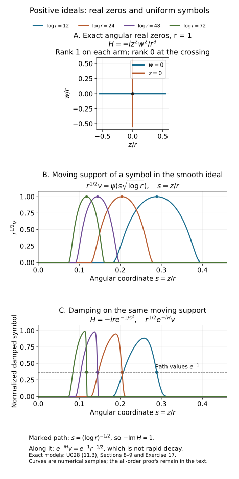

# Positive Lagrangian ideals and distributions

A complex phase can suppress singularities without possessing a smooth real critical manifold. The right geometric object is its ideal of critical equations. This lesson constructs that ideal, explains its positivity, and proves the two-way passage between a positive oscillatory representation and a damped inverse Fourier representation.

We use the cotangent convention of the symplectic lesson:
\[
 \Omega=\sum_{j=1}^n d\xi_j\wedge dx_j,\qquad
 H_f=\sum_j(f_{\xi_j}\partial_{x_j}-f_{x_j}\partial_{\xi_j}),\qquad
 \{f,g\}=H_fg.
 \tag{0.1}
\]
Complexification extends \(\Omega\) bilinearly. Positivity of a complex plane means \(i\Omega(\overline V,V)\ge0\). Our symbols are ordinary \(S^\mu=S^\mu_{1,0}\): on compact spatial sets,
\[
 |\partial_x^\alpha\partial_\theta^\beta a(x,\theta)|
 \le C_{\alpha\beta}\langle\theta\rangle^{\mu-|\beta|}.
 \tag{0.2}
\]
All phase statements are local near a marked nonzero frequency. Amplitudes have small closed conic support inside the open phase domain; bounded frequencies contribute smooth functions. Ideals are ideals of complex-valued smooth functions, with locality under compact cutoffs. Geometric equality and congruence mean equality of these local ideals, rather than equality of real zero sets. For symbol residues, congruences also retain bounded normalized coefficient families, as constructed in Section 8. This additional uniformity is needed for damping estimates; Exercise 17 explains why ordinary smooth ideal membership alone is insufficient.

The preceding lessons supply symplectic critical-map geometry, real Gaussian normalization, homogeneous phase stabilization and positive complex planes. Section 4 of [Real and complex symplectic normal forms of functions](../20261005-restored-function-normal-forms/real-and-complex-symplectic-function-normal-forms.md) proves one-variable smooth complex division on a common neighborhood. The uniform complex nonstationary and stationary-phase contracts are identified below, with credit to Hörmander I. Support-preserving summation is proved in [H6, the complete current symbol construction](../20261004-free-canonical-composition/homogeneous-symbol-transport.md), and the Fourier localization proof is [W1](../20261004-free-intrinsic-graph/prerequisites/coordinate-and-wavefront-localization.md). The [contour and Gaussian foundations](contour-and-gaussian-foundations.md) supply the actual complex transversal, matrix square factors, oriented deformation identity and Gaussian branch. The [proof map](proof-map.json) binds all these results to their exact earlier programme proofs. The arguments here prove the additional uniform graph division, flat-ideal, ideal elimination, symbol residue and representation steps.

## 1. Lagrangian ideals and their real zeros

For a real Lagrangian submanifold \(\Lambda\subset T^*X\), let \(J_\Lambda\) be its smooth vanishing ideal. If \(f\) vanishes on \(\Lambda\), then \(df\) annihilates \(T\Lambda\); the defining Hamilton identity places \(H_f\) in \((T\Lambda)^\Omega=T\Lambda\). Thus \(\{f,g\}\) vanishes on \(\Lambda\) whenever \(g\) does. Local submanifold coordinates give \(n\) real defining functions \(u_j\) with independent differentials. Taylor's integral formula in the normal variables writes every vanishing function as \(\sum b_ju_j\). Membership is local: a partition of unity assembles these representations, and away from the zero set one nonzero generator divides any function.

Conversely, suppose a real ideal is locally generated by \(n\) real functions with independent differentials, is Poisson closed, and has this locality property. Its common zero set \(M\) is a smooth codimension-\(n\) submanifold. The independent \(H_{u_j}\) span \((TM)^\Omega\). Poisson closure gives \(du_k(H_{u_j})=0\) on \(M\), so \((TM)^\Omega\subset TM\). Both spaces have dimension \(n\); equality makes \(M\) Lagrangian. The preceding real Taylor division and partition argument show that the original ideal is the entire vanishing ideal of \(M\).

A **complex Lagrangian ideal** retains Poisson closure, cutoff locality and \(n\) local generators \(u_j\), but their differentials are independent over \(\mathbb C\) at each common real zero. A conic ideal admits homogeneous local generators. Define
\[
 J_{\mathbb R}=\{y:u(y)=0\text{ for every }u\in J\},\qquad
 T_yJ=\bigcap_j\ker du_j(y)\subset T_y(T^*X)\otimes\mathbb C.
 \tag{1.1}
\]
If \(\widetilde u=A u\) is another independent generating system, then \(d\widetilde u=A\,du\) at a real zero. Independence makes \(A\) invertible there, proving that \(T_yJ\) is intrinsic. The Hamilton fields span its symplectic orthogonal; Poisson closure again places them in its kernel. Hence \(T_yJ\) is a complex Lagrangian \(n\)-plane. Its real vectors form an isotropic real space.

The real set \(J_{\mathbb R}\) need not be a manifold of dimension \(n\). A complex equation imposes both its real and imaginary parts, while its differential condition counts complex equations. Section 11 gives an ideal whose real zeros cross and whose positive tangent rank changes along that crossing.

## 2. Smooth complex division on one fixed patch

The one-variable division input has the following form. If \(f(t,z)\) is smooth and complex valued, \(f(0,0)=0\), and \(\partial_tf(0,0)\ne0\), then on a smaller neighborhood fixed independently of the function being divided,
\[
 g(t,z)=q(t,z)f(t,z)+r(z).
 \tag{2.1}
\]
This is smooth division by a complex equation in real variables. Its complete almost-analytic extension, complex-root and flat-error proof is in Section 4 of [Real and complex symplectic normal forms of functions](../20261005-restored-function-normal-forms/real-and-complex-symplectic-function-normal-forms.md). The neighborhood is fixed before the divided function is chosen. Hörmander I, Theorem 7.5.6, is the source credited for this theorem.

It gives the multiple-equation version by induction. Reorder the real variables and equations to obtain a nonzero first pivot. Divide the other equations by that pivot equation; their residues depend only on the remaining variables. At the marked zero their Jacobian is the Schur complement of the first pivot, so it is invertible. Inductively divide by those residues. If the first pivot is \(f_1\), write \(f_j=q_jf_1+F_j\) and \(g=q_1f_1+h\). At the mark \(q_j=f_{j,v_1}/f_{1,v_1}\), so the derivatives of \(F_j\) are exactly the Schur complement. Substituting \(h=\sum_{j>1}p_jF_j+r\) yields the coefficient \(q_1-\sum_{j>1}p_jq_j\) of \(f_1\). Thus the resulting remainder depends only on \(z\), and substitution of the intermediate divisions gives
\[
 g(v,z)=\sum_{j=1}^d q_j(v,z)f_j(v,z)+r(z),
 \quad \det(\partial_{v_k}f_j)(0,0)\ne0.
 \tag{2.2}
\]
All divisions use the common neighborhoods guaranteed independently of the divided functions. Apply (2.2) to each coordinate \(v_j\). It puts \(v_j-T_j(z)\) in the ideal, with \(T(0)=0\). Its differentials in \(v\) are independent. Writing these generators in terms of the original ones gives an invertible coefficient matrix at the mark and therefore on a smaller patch. Consequently
\[
 (f_1,\ldots,f_d)=(v_1-T_1(z),\ldots,v_d-T_d(z)).
 \tag{2.3}
\]
More generally, inclusion between two ideals with the same number of independent generator differentials at a common real zero is equality locally: the inclusion matrix has full rank there. This generator-change argument will be used repeatedly.

For symbols we need bounded families, including scale derivatives. Here is a direct proof for the graph in (2.3). Suppose \(a(v,z,\lambda)\) and all its mixed derivatives are bounded uniformly in \(\lambda\) on a fixed larger patch. The parameter may be noncompact. We will construct
\[
 a=\sum_j b_j(v,z,\lambda)(v_j-T_j(z))+r(z,\lambda)
 \tag{2.4}
\]
on one patch independent of \(a\) and \(\lambda\), with every derivative of \(b_j,r\) uniformly bounded. Constants may depend on the bounded seminorms of the family.

Multiply by a fixed real cutoff, equal to one on the patch to be used. For \(V=v+iw\), build a smooth almost-analytic extension
\[
 A(V,z,\lambda)=\sum_{k\ge0}\chi(w/\varepsilon_k)
       \sum_{|\alpha|=k}\frac{(iw)^\alpha}{\alpha!}
                         \partial_v^\alpha a(v,z,\lambda).
 \tag{2.5}
\]
Here \(\chi=1\) near zero. A derivative of total order \(l<k\) of the \(k\)-th term has norm at most \(C_{kl}\varepsilon_k^{k-l}\), uniformly in \(\lambda\). Choose decreasing radii so that this is at most \(2^{-k}\) for all \(l\le k/2\). For each fixed derivative order the tail then converges absolutely in that norm; the earlier terms are finite. This proves joint smoothness and uniform derivative bounds on a fixed complex domain. The radii change with the family, but this domain and the eventual real patch do not.

On \(w=0\), the normal Taylor jets agree with the formal analytic series. With \(\partial_{V_j}=(\partial_{v_j}-i\partial_{w_j})/2\), the jets of \(\partial_{\overline V_j}A\) cancel. Taylor remainder estimates therefore give
\[
 A(v,z,\lambda)=a(v,z,\lambda),\qquad
 |D^\beta\partial_{\overline V_j}A(v+iw,z,\lambda)|
       \le C_{\beta L}|w|^L
 \tag{2.6}
\]
for every \(\beta,L\), including parameter derivatives. This construction is not a holomorphic continuation of an arbitrary smooth function.

Shrink once so that the segment \(V_s=T(z)+s(v-T(z))\), \(0\le s\le1\), stays inside that domain. Set \(r=A(T(z),z,\lambda)\). The real chain rule gives the exact identity
\[
 \begin{split}
 a-r&=\sum_j(v_j-T_j)q_j+E,\\
 q_j&=\int_0^1(\partial_{V_j}+\partial_{\overline V_j})A(V_s,z,\lambda)\,ds,\\
 E&=2i\sum_j\operatorname{Im}T_j
              \int_0^1\partial_{\overline V_j}A(V_s,z,\lambda)\,ds.
 \end{split}
 \tag{2.7}
\]
The plus sign follows from \(v_j-\overline T_j=(v_j-T_j)+2i\operatorname{Im}T_j\). The imaginary part of \(V_s\) is \((1-s)\operatorname{Im}T\). Equation (2.6) and the chain rule imply \(|D^\beta E|\le C_{\beta L}|\operatorname{Im}T|^L\) for all orders.

Put \(S=\sum_j|v_j-T_j|^2\ge|\operatorname{Im}T|^2\). On \(S>0\) set \(e_j=\overline{(v_j-T_j)}E/S\). Differentiating \(S^{-1}\) costs finitely many negative powers of \(S\), which the arbitrary positive powers bounding \(E\) absorb. Thus every derivative of \(e_j\) tends to zero faster than every power of \(S\). Extend \(e_j\) by zero on \(S=0\). To verify smoothness even for a singular zero set, multiply by \(\kappa(S/\delta)\), where \(\kappa\) vanishes below 1 and equals one above 2. On its transition region \(S\asymp\delta\); every fixed derivative converges uniformly as \(\delta\downarrow0\), using the all-power estimates. The zero extension is therefore smooth with uniform mixed derivative bounds. Since \(E=\sum_j(v_j-T_j)e_j\), taking \(b_j=q_j+e_j\) proves (2.4).

## 3. Flat residues and powers of the ideal

Let \(I=(v-T(z))\) on the fixed patch above. A parameter-only function \(R(z)\in I\) satisfies
\[
 |R(z)|\le C_L|\operatorname{Im}T(z)|^L
 \quad\text{for every }L.
 \tag{3.1}
\]
Indeed, repeatedly divide the coefficients in a representation of \(R\), obtaining for each integer \(L\)
\[
 R=\sum_{1\le|\alpha|<L}c_\alpha(z)(v-T)^\alpha
              +\sum_{|\alpha|=L}b_\alpha(v,z)(v-T)^\alpha.
 \tag{3.2}
\]
Write \(Y=\operatorname{Im}T\), and evaluate at the real points \(v=\operatorname{Re}T+sY\), with \(s\) in a fixed real interval. The first sum is a polynomial \(P(s)\) of degree at most \(L-1\), whose terms all contain a positive power of \(s-i\); hence \(P(i)=0\). The remainder is \(O(|Y|^L)\). Interpolate the polynomial \(R-P(s)\) from \(L\) fixed real values of \(s\), then evaluate that interpolant at \(i\). Its evaluation coefficients are fixed constants, proving (3.1). For \(Y=0\), evaluation at \(v=T\) gives \(R=0\). Bounded families give the same estimates uniformly.

All-power control transfers to derivatives. In fact let \(F\ge0\) be Lipschitz and \(R\) smooth with bounded derivatives, with \(|R|\le C_LF^L\) for all \(L\). Around a point with \(F>0\), take a ball of radius \(h=cF\) staying in the larger patch. The Lipschitz bound gives \(F\le CF(z)\) on that ball. Rescaled Taylor polynomial interpolation bounds a derivative of order \(k\) by
\[
 C\bigl(h^{-k}\sup_{B_h}|R|+h^{l-k}\sup_{B_h}|D^lR|\bigr),\qquad l>k.
 \tag{3.3}
\]
Here is the finite interpolation behind (3.3). In the scaled variable \(w=(z'-z)/h\), Taylor-expand through total degree \(l-1\). Choose \(l\) distinct nodes in a small interval in each coordinate, so their product grid lies in the unit ball. The tensor product of the one-variable Lagrange formulas reconstructs every polynomial of coordinate degree at most \(l-1\), including this Taylor polynomial. Differentiating that finite formula at zero bounds its \(k\)-th derivatives by a fixed constant times the maximum of its grid values. The integral Taylor remainder at those nodes is bounded by \(C h^l\sup|D^lR|\). Dividing the resulting coefficient bound by \(h^k\) gives (3.3). The one-variable formula follows by subtracting its interpolant and factoring its distinct roots, as in the earlier smooth-descent proof. Choose \(l\) and the exponent in the first supremum arbitrarily large. This gives \(|D^\alpha R|\le C_{\alpha L}F^L\) for every \(L\). At zeros of \(F\) it follows by continuity, or by the same estimate on arbitrarily small balls if \(F\) vanishes in a neighborhood.

Conversely, (3.1) implies \(R\in I^q\) for every \(q\). Use the derivative conclusion and \(S\ge |Y|^2\). For \(S>0\), the multinomial identity gives
\[
 R=\sum_{|\alpha|=q}\frac{q!}{\alpha!}(v-T)^\alpha
             \frac{\overline{(v-T)}^\alpha R}{S^q}.
 \tag{3.4}
\]
Every coefficient extends smoothly by zero, by the cutoff argument following (2.7). This proves sufficiency on one patch, including all parameter derivatives. Parameter-only residues in \(I\) thus lie in \(I^\infty=\bigcap_q I^q\). Residues are not unique; their ambiguity is precisely of this infinite-order type. A function merely vanishing on \(I_{\mathbb R}\) need not satisfy (3.1).

## 4. A homogeneous generating function in adapted coordinates

At a real zero of a conic Lagrangian ideal, choose cotangent coordinates whose horizontal plane \(d\xi=0\) is transverse to \(T_yJ\). Such coordinates come from a real change of base variables. To see existence, apply the common-transversal argument from the linear Lagrangian lesson over \(\mathbb C\): some graph \(d\xi=B\,dx\), with \(B\) complex symmetric, is transverse to the given plane. Its transversality determinant is a nonzero polynomial in the symmetric entries of \(B\). A polynomial vanishing for all real entries vanishes identically, so a real symmetric \(B\) also works. At a nonzero covector any such second-derivative adjustment is realized by a base change with identity first derivative: contract its second derivatives with the marked covector, using one nonzero component to prescribe the desired symmetric matrix. The exact base map and its full cotangent derivative are given in foundation A0, (A1); it constructs this horizontal plane with identity first derivative at the mark. That proof also verifies the complex linear argument and the real determinant-polynomial step.

Complex division in \(x\) gives \(J=(x-h(\xi))\). Restrict first to a frequency sphere and extend by homogeneity; the \(h_j\) have degree zero. Poisson closure and (0.1) give
\[
 \partial_{\xi_j}h_k-\partial_{\xi_k}h_j\in J.
 \tag{4.1}
\]
Define \(H(\xi)=\sum_j\xi_jh_j(\xi)\). Euler's identity for each \(h_k\) implies
\[
 H_{\xi_k}-h_k=\sum_j\xi_j
                  (\partial_{\xi_k}h_j-\partial_{\xi_j}h_k)\in J.
 \tag{4.2}
\]
The \(x\) derivatives of \(x-H_\xi\) form the identity matrix. Generator change now gives the exact normal form
\[
 J=(x-H_\xi(\xi)),\qquad H(t\xi)=tH(\xi),\quad t>0.
 \tag{4.3}
\]

If \(\widetilde H\) gives the same ideal, then each component of \(H_\xi-\widetilde H_\xi\) is parameter-only and in \(J\). Sections 2–3 prove, on a fixed angular patch,
\[
 |D_\omega^\alpha(H_\xi-\widetilde H_\xi)|
      \le C_{\alpha L}|\operatorname{Im}H_\xi|^L,
 \qquad |H-\widetilde H|\le C_L|\xi|\,
                         |\operatorname{Im}H_\xi|^L.
 \tag{4.4}
\]
The second estimate follows from Euler's identity for their degree-one difference; derivatives have the corresponding homogeneous orders. Conversely such all-power gradient differences lie in the ideal and yield the same generators.

There is a degree discrepancy in the statement of Hörmander IV Proposition 25.4.2, printed page 36: it calls \(H\) degree zero. Its construction \(H=\sum\xi_jh_j\) on page 37, and (4.2), require degree one. We use the consistent degree-one statement. For example \(H=\xi_1\) generates the conic ideal \((x_1-1,x_2,\ldots,x_n)\); a degree-zero function has a degree-minus-one gradient and cannot give that nonzero constant gradient on an open cone. This is an observed discrepancy in that source statement.

## 5. Positivity and a phase's eliminated ideal

Suppose a representative in (4.3) has \(\operatorname{Im}H\le0\). Let \(G=-\operatorname{Im}H\ge0\). The local inequality \(|dG|^2\le CG\) on a unit angular patch follows by Taylor's theorem in the direction of the gradient: a negative linear term cannot dominate the bounded quadratic remainder of a nonnegative function. Homogeneity restores the exact radial factor
\[
 |\operatorname{Im}H_\xi|^2\le C\frac{-\operatorname{Im}H}{|\xi|}.
 \tag{5.1}
\]
The zero value of \(G\) implies zero gradient by its minimum property, and the reverse implication follows from Euler. Therefore
\[
 J_{\mathbb R}=\{(H_\xi(\xi),\xi):\operatorname{Im}H(\xi)=0\}.
 \tag{5.2}
\]
At these frequencies \(H_\xi\) is real. Positivity is unaffected by (4.4): with \(F=|\operatorname{Im}H_\xi|\), use \(L=4\) to bound \(|\operatorname{Im}(\widetilde H-H)|\le C|\xi|F^4\le CGF^2\). Near the marked zero, shrink so that this is at most \(G/2\). Then \(\operatorname{Im}\widetilde H\le-G/2\).

A **positive nondegenerate phase** \(\varphi(x,\theta)\), \(\theta\in\mathbb R^N\setminus0\), is smooth, degree one in \(\theta\), and satisfies on its whole nearby phase cone
\[
 \operatorname{Im}\varphi\ge0,\qquad
 \varphi_\theta(x_0,\theta_0)=0,\qquad
 \varphi_x(x_0,\theta_0)=\xi_0\ne0,
 \quad d\varphi_{\theta_1},\ldots,d\varphi_{\theta_N}
       \text{ complex independent at the mark}.
 \tag{5.3}
\]
Form the extended ideal in \((x,\theta,\xi)\)
\[
 \widehat J=(\varphi_\theta,\varphi_x-\xi),\qquad
 J=\widehat J\cap C^\infty(x,\xi).
 \tag{5.4}
\]
The \(-I\) block in the \(\xi\) derivatives, together with the phase rank condition, makes the \(n+N\) generator differentials independent. A base-coordinate change transforms \(\varphi_x-\xi\) by an invertible matrix, so elimination is intrinsic.

Put \(f=\varphi-x\cdot\xi\). In adapted coordinates the full Hessian in the integration variables is
\[
 \Phi=\begin{pmatrix}\varphi_{xx}&\varphi_{x\theta}\\
                         \varphi_{\theta x}&\varphi_{\theta\theta}
       \end{pmatrix}.
 \tag{5.5}
\]
Its invertibility is equivalent to horizontal transversality of the critical image. Indeed, its kernel consists of \((\delta x,\delta\theta)\) satisfying both \(d\varphi_\theta=0\) and \(d\varphi_x=0\); these are tangent vectors in the critical image with \(\delta\xi=0\). If \(\delta x=0\) also, independence of the \(d\varphi_\theta\) forces \(\delta\theta=0\). Thus this kernel is identified injectively with the horizontal intersection, and the dimension count proves the equivalence. This image is indeed a complex Lagrangian plane before elimination is used: the complex kernel of \(d\varphi_\theta\) has dimension \(n\), the critical map is injective on it by the rank argument just given, and the identity \(\sum d\varphi_{x_j}\wedge dx_j=-\sum d\varphi_{\theta_k}\wedge d\theta_k\) makes its pulled-back symplectic form zero there. Thus dimension and isotropy prove the assertion directly. The transversal construction of Section 4 applies to this linear image as well.

Division gives
\[
 \widehat J=(x-X(\xi),\theta-\Theta(\xi)),
 \qquad \deg X=0,\quad \deg\Theta=1.
 \tag{5.6}
\]
Divide \(f\) by this graph, obtaining a residue \(f_0(\xi)\). Because all its integration-variable derivatives belong to \(\widehat J\), differentiate the division identity and reduce again: its first-order graph coefficients belong to \(\widehat J\). Hence
\[
 f-f_0\in\widehat J^2.
 \tag{5.7}
\]
Construct on a unit frequency patch and extend to make \(f_0\) degree one.

We need a positive critical-value estimate even when the imaginary Hessian has a nullspace. Here is its local mechanism. For a complex symmetric invertible matrix \(A=B+iC\), with \(C\ge0\), and a real \(Y\),
\[
 -\operatorname{Im}\bigl((u-iY)^tA(u-iY)\bigr)
    =Y^tCY-u^tCu+2u^tBY.
 \tag{5.8}
\]
Choose \(u=\varepsilon BY\), with \(\varepsilon>0\) small. The right side is at least \(Y^tCY+\varepsilon|BY|^2\ge c|Y|^2\). The last inequality holds because a zero vector for both quadratic terms satisfies \(CY=BY=0\), contradicting invertibility unless \(Y=0\). In (5.7) the quadratic coefficients at the mark are \(\Phi/2\), with \(\operatorname{Im}\Phi\ge0\). Evaluate at real integration variables whose displacement from \((X,\Theta)\) is \(u-iY\), where \(Y=(\operatorname{Im}X,\operatorname{Im}\Theta)\) on the unit patch. Smooth coefficient perturbations are \(o(1)|Y|^2\), and are absorbed by shrinking. Since \(\operatorname{Im}f\ge0\) there, (5.8) proves
\[
 \operatorname{Im}f_0\ge c
       (|\operatorname{Im}X|^2+|\operatorname{Im}\Theta|^2).
 \tag{5.9}
\]
This also explains the positive critical-value input used in complex stationary phase. No genuine complex critical point for a merely smooth phase is assumed.

Differentiate (5.7) in \(\xi\). Differentiating a product of two generators leaves an element of \(\widehat J\); since \(f_\xi=-x\),
\[
 x+f_{0,\xi}\in\widehat J.
 \tag{5.10}
\]
To identify the eliminated ideal, divide a \(\theta\)-independent \(g\in\widehat J\) by \(x+f_{0,\xi}\), obtaining \(g=\sum b_j(x,\xi)(x_j+f_{0,\xi_j})+r(\xi)\). The residue lies in \(\widehat J\). Section 3 gives all-power smallness in \(|\operatorname{Im}X|+|\operatorname{Im}\Theta|\). On the unit sphere Euler gives \(\operatorname{Im}f_0=\xi\cdot\operatorname{Im}f_{0,\xi}\), so (5.9) bounds that shift by \(C|\operatorname{Im}f_{0,\xi}|^{1/2}\). Increasing the arbitrary exponent makes \(r\) flat in \(|\operatorname{Im}f_{0,\xi}|\). Section 3's sufficiency places it in \((x+f_{0,\xi})\). Thus, with \(H=-f_0\),
\[
 J=(x-H_\xi),\qquad \operatorname{Im}H\le0.
 \tag{5.11}
\]
This proves exact ideal equality.

Conversely, (5.11) is parametrized by \(\varphi=x\cdot\theta-H(\theta)\). Its mixed derivative is the identity, its critical equations are \(x-H_\theta\), and its imaginary part is nonnegative. A conic Lagrangian ideal is called **positive** when it has this positive phase realization. The forward argument applies in every adapted cotangent chart; the sign is invariant under the representative ambiguity already proved.

At a real zero, write \(B=H_{\xi\xi}\). Then \(T_yJ=\{(Bv,v)\}\), with \(B\) symmetric and \(\operatorname{Im}B\le0\), and
\[
 i\Omega(\overline{(Bv,v)},(Bv,v))
       =-2\overline v^{\,t}(\operatorname{Im}B)v\ge0.
 \tag{5.12}
\]
Euler gives \(B\xi=0\); the radial direction is a real null vector. Positivity here is necessarily non-strict. Positive tangent planes alone do not characterize positive ideals, as Section 11 shows.

## 6. Removing a nondegenerate parameter block

Split \(\theta=(\theta',\theta'')\), and suppose \(\varphi_{\theta''\theta''}\) is invertible at the marked critical point. The remaining marked parameter \(\theta'_0\) cannot be zero. Indeed degree-one homogeneity gives \(\varphi_{\theta\theta}\theta_0=0\). If \(\theta'_0=0\), its \(\theta''\) rows and invertibility force \(\theta''_0=0\), a contradiction.

Apply complex division and the critical-value argument to the \(\theta''\) variables, with \((x,\theta')\) as parameters. There is a residue \(\varphi'(x,\theta')\) satisfying
\[
 \varphi-\varphi'\in(\varphi_{\theta''})^2,
 \qquad \operatorname{Im}\varphi'\ge0.
 \tag{6.1}
\]
Construct it on a \(\theta'\) sphere and extend with degree one. This extension preserves the ideal identity by homogeneity. Modulo \((\varphi_{\theta''})\), the \(x,\theta'\) derivatives of \(\varphi'\) agree with those of \(\varphi\). The Schur complement of the invertible \(\theta''\) block shows that the remaining \(d\varphi'_{\theta'_j}\) are independent. Also \(\varphi'_x\) has the same nonzero marked value. Thus \(\varphi'\) is a positive nondegenerate phase.

Its extended ideal, adjoined to the equations eliminating \(\theta''\), is included in the original extended ideal. At the mark both have independent systems of \(n+N\) generators; their coefficient matrix is invertible. They are equal locally. Eliminating the parameter variables proves that \(\varphi'\) parametrizes the same \(J\). This argument requires a nondegenerate block; it does not permit arbitrary deletion of variables.

A useful partial Legendre description follows. Write \(x=(x',x'')\), introduce a copy \(y''\), and augment the phase by
\[
 \Psi=\varphi(x',y'',\theta)+(x''-y'')\cdot\eta''.
 \tag{6.2}
\]
Mixed parameters must first be homogenized. Under the injective projection condition below, the marked \(\eta''_0=\xi''_0\) is nonzero: otherwise the nonzero radial vector \((0,\xi_0)\in T_yJ\) would lie in that projection's kernel. Choose a linear frequency \(q(\eta'')>0\) near that mark, and put \(y''=\zeta''/q(\eta'')\), with \(\zeta''\) a new degree-one variable. Together with \(\theta,\eta''\) the new variables scale homogeneously. The equations of \(\Psi\) identify \(y''=x''\), \(\eta''=\varphi_{y''}\) and the original critical equations. If the projection of \(T_yJ\) to \((\delta x',\delta\xi'')\) is injective, its dimension makes it an isomorphism onto its image of dimension \(n\). Its kernel is exactly the kernel of the Hessian block to be eliminated in \((y'',\theta)\); that block is therefore invertible. At a critical point the change from \(y''\) to \(\zeta''\) changes its Hessian by the invertible diagonal congruence with the factor \(q^{-1}\) in that block; terms involving first derivatives vanish. Thus the homogeneous block is invertible too. Applying (6.1) yields a phase
\[
 \varphi_0(x',\eta'')+x''\cdot\eta''
 \tag{6.3}
\]
with the same ideal and nonnegative imaginary part. The injective projection and the homogeneous reparametrization are essential hypotheses of this description.

## 7. Positive oscillatory integrals and their wavefront sets

Let \(\varphi\) satisfy (5.3), and let \(a\in S^\mu\) have the stated closed conic support. The positive oscillatory distribution is
\[
 u(x)=(2\pi)^{-(n+2N)/4}\int e^{i\varphi(x,\theta)}a(x,\theta)\,d\theta.
 \tag{7.1}
\]
The integral is defined by smooth frequency cutoffs and continuous oscillatory extension. Here are the estimates underlying that extension and its microlocal support.

The complex nonstationary-phase estimate proved in the [complete companion, Section 2, (N1)–(N3)](complex-stationary-contract.md#2-a-complete-nonstationary-proof) is uniform for bounded smooth phase families with \(\operatorname{Im}f\ge0\). On a compact integration patch where \(|df|^2+\operatorname{Im}f\) is bounded below, the integral of \(e^{iRf}b\) is \(O(R^{-k})\) for every \(k\), with constants controlled by finitely many amplitude and phase derivatives. The historical reference is Hörmander I Theorem 7.7.1; the controlling expression retains \(\operatorname{Im}f\), so no strictly positive imaginary Hessian is required. The derivative inequality used in Section 5 is its elementary nonnegative-function ingredient.

For a test function \(h(x)\), decompose \(\theta\) into dyadic shells \(R\le|\theta|\le2R\). After \(\theta=R\vartheta\), the phase is \(R\varphi(x,\vartheta)\), its derivatives are uniformly bounded, and \(d_{x,\vartheta}\varphi\ne0\) on the compact normalized support. Nonstationary phase in these variables gives, for every integer \(k\), a bound
\[
 C_kR^{\mu+N-k}\|h\|_{C^k}
 \tag{7.2}
\]
for that shell. Symbol bounds control all scaled amplitude derivatives. Choose \(k>\mu+N\); the dyadic series converges absolutely as a distribution of order at most \(k\), independently of the cutoff. Approximation by finite shells proves continuity and agrees with the ordinary integral whenever it converges absolutely. This is the ordinary-symbol specialization of the positive oscillatory extension theorem.

The real critical image is
\[
 \mathcal C_\varphi=
  \{(x,\varphi_x(x,\theta)): \varphi_\theta(x,\theta)=0,
                              \theta\ne0\}.
 \tag{7.3}
\]
At a real critical point, Euler gives \(\varphi=\theta\cdot\varphi_\theta=0\). Its nonnegative imaginary part has a minimum there, so \(\operatorname{Im}\varphi_x=0\). Thus (7.3) consists of real covectors and lies in \(J_{\mathbb R}\).

Take a small spatial cutoff and a closed frequency cone separated from (7.3). Compactness on normalized cones gives
\[
 |\xi-\varphi_x(x,\theta)|+|\theta|\,|\varphi_\theta(x,\theta)|
       \ge c(|\xi|+|\theta|).
 \tag{7.4}
\]
If this failed, a convergent normalized sequence would give a critical point with the forbidden output direction. The cases \(|\xi|/|\theta|\to0\) or infinity are excluded by the nonzero \(\varphi_x\) near the mark and its bounded normalized size.

On a shell \(\theta=R\vartheta\), use large parameter \(R+|\xi|\) and phase
\((R\varphi(x,\vartheta)-x\cdot\xi)/(R+|\xi|)\). Its full gradient is bounded below by (7.4). Nonstationary phase bounds the Fourier transform of that shell by
\[
 C_kR^{\mu+N}(R+|\xi|)^{-k}.
 \tag{7.5}
\]
For \(R\le|\xi|\), the dyadic sum grows at most by a fixed power or logarithm of \(|\xi|\); for \(R>|\xi|\), it is a convergent geometric tail when \(k>\mu+N\). Increasing \(k\) proves decay of every prescribed order. Bounded frequencies are smooth and have the same local Fourier decay after cutoff. Consequently
\[
 \operatorname{WF}(u)\subset\mathcal C_\varphi\subset J_{\mathbb R}.
 \tag{7.6}
\]
This is containment: cancellation or an amplitude vanishing near a critical direction can remove a singularity.

## 8. Symbol residues in both directions

Work in the adapted graph (5.6). First, every \(a(x,\theta)\in S^\mu\) has a frequency-only residue \(v(\xi)\in S^\mu\) modulo \(\widehat J\), on a cone fixed independently of the amplitude. To prove this with derivative bounds, put \(\lambda=\log t\), \(t\ge1\). The family
\[
 a_t(x,\vartheta)=t^{-\mu}a(x,t\vartheta)
 \tag{8.1}
\]
is bounded with every derivative in \(x,\vartheta,\lambda\) on a fixed unit patch. Each \(\lambda\) derivative is a finite combination of scaled frequency derivatives and the fixed factor \(t^{-\mu}\). Apply (2.4) there:
\[
 a_t=\sum b_{jt}(x,\vartheta,\eta)(x_j-X_j(\eta))
      +\sum c_{kt}(x,\vartheta,\eta)(\vartheta_k-\Theta_k(\eta))
      +r_t(\eta).
 \tag{8.2}
\]
All coefficients and scale derivatives are bounded on the common smaller patch.

Choose a smooth nonnegative bump \(\rho(s)\) supported in a sufficiently short interval, with \(\int\rho(s)\,ds=1\). On a smaller angular cone set \(\chi(\eta)=\rho(\log|\eta|)\), multiplied by an angular cutoff equal to one there. For sufficiently large \(|\xi|\),
\[
 \int_1^\infty\chi(\xi/t)\,\frac{dt}{t}=1,
 \qquad t\asymp|\xi|\text{ on the integrand's support}.
 \tag{8.3}
\]
The interval and angular cutoffs are chosen once so all normalized triples in use remain in the division patch. Substitute \(\vartheta=\theta/t\), \(\eta=\xi/t\) in (8.2), multiply by \(t^\mu\chi(\xi/t)\), and integrate. Homogeneity gives the exact high-frequency identity
\[
 a=\sum B_j(x,\theta,\xi)(x_j-X_j(\xi))
       +\sum C_k(x,\theta,\xi)(\theta_k-\Theta_k(\xi))+v(\xi),
 \tag{8.4}
\]
where the integrands defining \(B,C,v\) contain respectively \(t^\mu b_t\), \(t^{\mu-1}c_t\), and \(t^\mu r_t\). The \(dt/t\) interval has bounded logarithmic length. A frequency derivative costs \(t^{-1}\); angular and log-scale derivatives of the divided families are bounded. On the comparison cone \(|\theta|\asymp|\xi|\), these observations prove every ordinary symbol estimate:
\[
 B\in S^\mu,\qquad C\in S^{\mu-1},\qquad v\in S^\mu.
 \tag{8.5}
\]
The orders of the two coefficients differ because the \(x\) generator has degree zero and the \(\theta\) generator degree one. Low-frequency cutoff errors affect only smooth oscillatory distributions.

Conversely, given \(v(\xi)\in S^\mu\), there is an amplitude \(a(x,\theta)\in S^\mu\) with small conic support such that \(v-a\in\widehat J\) near the marked triple. Divide the bounded family \(t^{-\mu}v(t\eta)\) in the real \(\eta\) variables by
\(\eta-\varphi_x(x,\vartheta)\). Its derivative matrix in \(\eta\) is the identity, so (2.4) gives
\[
 t^{-\mu}v(t\eta)=\sum d_{jt}(x,\vartheta,\eta)
                        (\eta_j-\varphi_{x_j}(x,\vartheta))
                       +s_t(x,\vartheta).
 \tag{8.6}
\]
Use an annular partition in \(\theta/t\) instead of \(\xi/t\); center its narrow annulus at the marked \(|\theta_0|\) if necessary. On a fixed smaller comparison cone, \(t\asymp|\theta|\asymp|\xi|\), and all normalized variables remain inside the patch. Multiply by \(t^\mu\), a fixed normalized phase cutoff equal to one there, and the partition bump; integrate \(dt/t\). The left side is exactly \(v(\xi)\). The residue integral defines \(a(x,\theta)\); the other terms are coefficients of \(\xi-\varphi_x(x,\theta)\), with order \(\mu-1\). The same derivative and logarithmic-length estimates prove \(a\in S^\mu\). The fixed phase cutoff gives the required closed conic support. Its being one on the smaller patch preserves the congruence there. This proves the reverse residue construction without substituting complex values into the original symbol.

## 9. Infinite-order ideal errors become smooth after damping

Let a frequency-only \(v\in S^\nu\) belong to the **uniform symbol ideal** of \(J=(x-H_\xi)\): on each unit patch its normalized family \(t^{-\nu}v(t\eta)\) has a representation by \(x-H_\xi(\eta)\) with coefficients bounded in every smooth norm, including logarithmic scale derivatives. Differences of residues constructed in Section 8 have this property, by subtracting their bounded divided identities. Repeated bounded division of those coefficients makes (3.2) uniform at every fixed order; hence Section 3 applies to the normalized residue, including its angular and logarithmic derivatives. Put \(G=-\operatorname{Im}H\ge0\). Combining arbitrary powers of \(|\operatorname{Im}H_\xi|\) with (5.1) gives, for every multiindex and every integer \(L\ge0\),
\[
 |\partial_\xi^\alpha v(\xi)|
       \le C_{\alpha L}|\xi|^{\nu-|\alpha|-L}G(\xi)^L,
       \qquad |\xi|\ge1.
 \tag{9.1}
\]
Since \(|e^{-iH}|=e^{-G}\) and \(\sup_{s\ge0}s^Le^{-s}<\infty\), (9.1) gives arbitrary frequency decay after multiplication by the exponential. Its differentiated factors contain products of derivatives of \(H\); degree-one homogeneity bounds the first derivatives and gives \(O(|\xi|^{1-k})\) for derivatives of order \(k\). These factors cost at most a fixed polynomial order for each fixed derivative. Increasing \(L\) in (9.1) absorbs that cost. Thus
\[
 e^{-iH}v\in S^{-\infty},\qquad
 (2\pi)^{-n}\int e^{i(x\cdot\xi-H(\xi))}v(\xi)\,d\xi
       \text{ is smooth}.
 \tag{9.2}
\]
The same argument handles uniform all-power changes of symbol residue representatives and homogeneous changes of \(H\). One can also see the latter from
\(e^{-i\widetilde H}-e^{-iH}=-i(\widetilde H-H)\int_0^1e^{-i((1-s)H+s\widetilde H)}ds\), using the comparable nonpositive imaginary parts from Section 5. Smoothness comes from flatness combined with damping. An ideal residue itself need not be rapidly decreasing before damping.

## 10. Full normal representation and its converse

Fix a real number \(m\), and put
\[
 \mu=m+\frac{n-2N}{4},\qquad \sigma=m-\frac n4.
 \tag{10.1}
\]
For (7.1) with \(a\in S^\mu\), there exist \(v,v_0\in S^\sigma\), on a fixed cone about \(\xi_0\), such that
\[
 u_1(x)=(2\pi)^{-n}\int e^{i(x\cdot\xi-H(\xi))}v(\xi)\,d\xi,
 \quad (x_0,\xi_0)\notin\operatorname{WF}(u-u_1),
 \quad v-v_0\in S^{\sigma-1}.
 \tag{10.2}
\]
The leading residue is specified by
\[
 v_0-(2\pi)^{n/4}a\,\bigl(\det(\Phi/i)\bigr)^{-1/2}
                   \in\widehat J.
 \tag{10.3}
\]
The determinant expression in (10.3) is interpreted as a local smooth representative and then as a residue; it is not evaluation at a genuine complex critical point. Its square root is the continuous **Gaussian branch**: at the marked matrix use the convergent positive complex Gaussian, or its regularized Fresnel limit, and continue on the small invertibility patch. A scalar principal square root of the determinant alone can lose its Fresnel phase.

We now prove all parts of the representation. Localize spatially near \(x_0\), and write \(\xi=t\eta\), \(|\eta|=1\), and \(\theta=t\vartheta\). The off-critical part of the Fourier transform decays rapidly by Section 7. The critical part has the form
\[
 (2\pi)^{-(n+2N)/4}t^N
    \int e^{it(\varphi(x,\vartheta)-x\cdot\eta)}
                       b(x,\vartheta,t)\,dx\,d\vartheta,
 \tag{10.4}
\]
where \(b\) includes fixed cutoffs and \(a(x,t\vartheta)\). At the marked direction there is only one real critical point in this support; shrink it once to exclude others. Outside a smaller critical patch, the uniform nonstationary estimate removes the remainder rapidly. Within it the full Hessian (5.5) is invertible.

The uniform complex stationary-phase theorem proved in the [complete companion, Sections 1 and 3–8](complex-stationary-contract.md#1-the-exact-contract), with historical credit to Hörmander I Theorem 7.7.12, says the following in \(d\) integration variables. For \(\operatorname{Im}f\ge0\), a marked real critical point, invertible complex Hessian, and compact bounded smooth amplitude and residue families, the critical ideal supplies a smooth \(f_0\) with \(f-f_0\in I^2\) and the positive shift bound of Section 5. The integral has an expansion with factor
\((2\pi/t)^{d/2}e^{itf_0}\), the Gaussian determinant branch, and differential coefficients of successive degrees \(t^{-j}\). After \(L\) terms its remainder is **absolutely** \(O(t^{-L-d/2})\), uniformly in the bounded amplitude and parameter families. Changes of residue representatives give rapidly small exponential expressions, using flatness and the positive shift bound. The companion proves this smooth analytic contract by exact critical-ideal division, almost-analytic contour deformation, Gaussian moments and the regularized Gaussian branch. Its (P1)–(P6), (Q1)–(Q8), (C1)–(C11), (G1)–(G3), (B1)–(B2) and (R1) specify the hypotheses and full proof. The imaginary Hessian may have null directions, and the nearby critical point supplied by the ideal may be virtual and nonreal. The absolute value remainder above is uniform; fixed parameter derivatives may cost powers of the large parameter, as stated in (P6). The bounded coefficient derivatives and the absolute value estimate are the estimates consumed below. The ordinary Gaussian inputs are supplied separately by the [exact free U001 companion](../20261004-free-stationary-phase/quadratic-stationary-phase.md); its real stationary-phase proof is not a substitute for the complex contour argument.

Apply it to (10.4) with \(d=n+N\), critical value \(-H(\eta)\), and normalized amplitude \(t^{-\mu}b\). Its Gaussian factor and the outside normalization give
\[
 (2\pi)^{-(n+2N)/4}(2\pi)^{(n+N)/2}=(2\pi)^{n/4}.
 \tag{10.5}
\]
To track the radial order, under \(\theta\mapsto t\theta\) the \(xx,x\theta,\theta\theta\) blocks of \(\Phi\) have degrees \(1,0,-1\). Equivalently
\[
 \Phi(x,t\theta)=t
  \begin{pmatrix}I_n&0\\0&t^{-1}I_N\end{pmatrix}
  \Phi(x,\theta)
  \begin{pmatrix}I_n&0\\0&t^{-1}I_N\end{pmatrix}.
 \tag{10.6}
\]
Its determinant has degree \(n-N\); its inverse square root has degree \((N-n)/2\). A homogeneous frequency-only representative of this determinant is obtained by the residue construction on the unit patch and degree extension. It stays nonzero near the mark.

Each coefficient at stationary-phase level \(j\) is a finite sum of residues of differentiated amplitudes times homogeneous coefficients. A \(\theta\) derivative lowers the symbol order by \(|\beta|\); after scaling it is accompanied by \(t^{|\beta|}\). Section 8 gives these residues with every angular and log-scale derivative bound. The level-\(j\) homogeneous coefficient contributes degree \(-j\). Hence the resulting frequency symbol satisfies
\[
 v_j\in S^{\mu+(N-n)/2-j}=S^{\sigma-j}.
 \tag{10.7}
\]
The leading term is exactly (10.3). The absolute remainder after \(L\) terms has size
\[
 t^{\mu+N-(n+N)/2-L}=t^{\sigma-L}.
 \tag{10.8}
\]
All constants are uniform on one smaller angular cone, by the bounded families proved in Section 8.

The complete earlier H6 support-preserving symbol summation proof yields \(v\sim\sum_{j\ge0}v_j\) on that cone. For completeness, its mechanism is to multiply each term by a high-frequency cutoff \(1-\chi(\xi/R_j)\), choosing \(R_j\uparrow\infty\) so its finitely many specified seminorms in one higher order are at most \(2^{-j}\). The sum is locally finite and its tails converge in each required seminorm. Bounded-frequency changes are smoothing, and multiplying by cutoffs does not enlarge support. Thus \(v-\sum_{j<L}v_j\in S^{\sigma-L}\).

Because \(|e^{-iH}|\le1\), this tail and (10.8) imply
\[
 \widehat{\chi u}(\xi)-e^{-iH(\xi)}v(\xi)
        \text{ is rapidly decreasing on the smaller cone}.
 \tag{10.9}
\]
This directly proves microlocal smoothness in (10.2), by the Fourier characterization of wavefront set. For precision, choose nested output cones and put the outer conic cutoff into \(v\). The Fourier difference has polynomial growth everywhere and is rapid in the inner cone. The earlier microlocal cutoff proof W1 splits its convolution with a Schwartz cutoff transform into that inner cone and its separated complement: the first part stays rapid, and separation supplies arbitrary decay in the second. A spatial cutoff equal to one near \(x_0\) therefore gives the claimed microlocal smoothness. This conclusion is local at the marked covector; no equality in unrelated directions is asserted. Crucially, we have used absolute Fourier errors throughout; dividing (10.8) by an exponentially small \(e^{-iH}\) would not justify a symbol estimate. Also \(v-v_0\in S^{\sigma-1}\), proving the one-order assertion.

For the **converse**, start with any \(v\in S^\sigma\) in (10.2). Let \(\Delta(\xi)\) be the homogeneous nonzero residue of \(\det(\Phi/i)\), with its fixed Gaussian branch. The symbol
\[
 w=(2\pi)^{-n/4}\Delta^{1/2}v\in S^{\sigma+(n-N)/2}=S^\mu
 \tag{10.10}
\]
has a reverse residue amplitude \(a_0\in S^\mu\) by Section 8. The forward representation of its distribution has leading symbol congruent to \(v\). The congruence error is frequency-only and in \(J\); Section 9 makes its damped inverse Fourier transform smooth. The remaining difference has a normal symbol \(R_1\in S^{\sigma-1}\).

Repeat (10.10) for \(R_1\), obtaining \(a_1\in S^{\mu-1}\); continue inductively. After \(L\) corrections the remaining normal symbol is \(R_L\in S^{\sigma-L}\), modulo smooth errors. The phase and division patch never change, so every \(a_j\) can use the same closed conic support. Sum them by the support-preserving asymptotic theorem to obtain \(a\in S^\mu\). Replacing \(\sum_{j<L}a_j\) by \(a\) contributes a normal symbol of order \(\sigma-L\) by the forward result. Since \(L\) is arbitrary, the Fourier difference decays rapidly. Thus every normal distribution (10.2) has a positive-phase representation (7.1) with this \(\varphi\), microlocally at the mark. This proves the full two-way theorem, including its support and order requirements.

## 11. Models that distinguish the hypotheses

On \(\xi=(r,z)\), \(r>0\), take
\[
 H=2r+\frac{z^2}{2r},\qquad
 H_\xi=\left(2-\frac{z^2}{2r^2},\frac zr\right).
 \tag{11.1}
\]
It is real and degree one; its gradient is degree zero. The two equations \(x-H_\xi\) are independent and commute exactly by equality of mixed derivatives. Their zero set is a real conic Lagrangian. This makes the degree distinction in Section 4 concrete.

For a positive example, take
\[
 H=-\frac{iz^2}{2r},\qquad
 \varphi=x_1r+x_2z+\frac{iz^2}{2r}.
 \tag{11.2}
\]
The real zeros have \(z=0,x=0\). At \(z=0\), \(-2\operatorname{Im}H_{\xi\xi}=\operatorname{diag}(0,2/r)\), so the radial direction is null and the transverse direction positive. The full normal-phase Hessian is \(\left(\begin{smallmatrix}0&I\\I&-H_{\xi\xi}\end{smallmatrix}\right)\); its Gaussian determinant factor is 1. The graph thus has a non-strict positive tangent, despite transverse damping.

In three frequency variables \((r,z,w)\), \(r>0\), the example
\[
 H=-i\frac{z^2w^2}{r^3}
 \tag{11.3}
\]
has real zero set \(x=0\) over \(z=0\) or \(w=0\). These two frequency hypersurfaces cross. On the unit angular section it is a pair of intersecting axes, not a smooth manifold. Along \(z=0,w\ne0\), the imaginary Hessian has one negative transverse direction, with \(\partial_z^2\operatorname{Im}H=-2w^2/r^3\); along \(w=0,z\ne0\) it has the corresponding \(w\) direction; at \(z=w=0\) it is zero. Complex generator independence remains valid everywhere, since their \(x\) derivative matrix is the identity. Positivity tolerates this changing rank.

By contrast,
\[
 H_{\mathrm{bad}}=i\frac{z^3}{r^2}
 \tag{11.4}
\]
has real zeros \(z=0,x=0\), with zero imaginary Hessian there, so all its real-zero tangent planes are positive. Its imaginary part changes sign on every cone about \(z=0\). A representative change preserving the ideal has imaginary value \(O(r|z/r|^{2L})\) for every \(L\), because \(|\operatorname{Im}(H_{\mathrm{bad}})_\xi|\asymp|z/r|^2\). It cannot cancel the cubic sign change. Therefore this ideal is not positive.

For partial parameter elimination let \(n=1,N=2\), \(\theta=(\rho,\eta)\), \(\rho>0\), and choose \(b,\varepsilon>0\):
\[
 \varphi=x\rho+\frac{(1+ib)\eta^2}{2\rho}
                         +\frac{i\varepsilon\rho x^2}{2}.
 \tag{11.5}
\]
The marked point is \(x=\eta=0,\rho>0\); the critical equations have independent differentials. Eliminating \(\eta\) gives \(\varphi'=x\rho+i\varepsilon\rho x^2/2\). The actual Gaussian integral is
\[
 \int_{\mathbb R}e^{i(1+ib)\eta^2/(2\rho)}\,d\eta
      =(2\pi\rho)^{1/2}(b-i)^{-1/2},
 \tag{11.6}
\]
where the branch is continued from the right half-plane. Integrating one parameter adds one-half to the amplitude order and contributes \((2\pi)^{1/2}\); the normalization in (7.1) changes by the reciprocal factor. The distribution order \(m\) is preserved.

## 12. Bundle-valued distributions and microlocal locality

Let \(E\to X\) be a smooth vector bundle and \(J\) a positive conic Lagrangian ideal. A distribution section belongs to \(I^m(X,J;E)\) when, at every \((x_0,\xi_0)\in J_{\mathbb R}\), a local frame for \(E\) and a positive phase parametrizing \(J\) give a representation (7.1), component by component with amplitudes in \(S^{m+(n-2N)/4}\), modulo a distribution smooth microlocally at that point. The requirement can equivalently use **every** such phase: pass from the first representation to (10.2), then apply the converse of Section 10 to any second phase. Representative changes of \(H\) give only smooth errors by Section 9.

A change of bundle frame multiplies the amplitude by a smooth invertible matrix, preserving its symbol order and the microlocal equality. Base-coordinate changes pull back the phase and amplitudes, preserving positivity and generator independence. Thus this definition is intrinsic. If \(J\) is defined only in an open cotangent cone, impose the same condition only there; all assertions and restrictions are microlocal.

The local leading residue (10.3) is useful, but this lesson does not identify it with a complete global complex principal-symbol bundle. Gluing those residues must also track the damping factor and its infinite-order gauge. That additional structure is distinct from the real Maslov construction and is not a consequence of a tangent-plane positivity test.

## 13. Exercises with complete solutions

**Exercise 1 (Real ideal converse).** In symplectic dimension \(2n\), suppose \(n\) independent real generators are Poisson closed modulo their ideal. Prove that their real common zero set is Lagrangian and that every smooth function vanishing there belongs locally to the ideal.

**Solution.** Independence gives a smooth codimension-\(n\) zero set \(M\). The Hamilton fields are independent and span \((TM)^\Omega\), because their defining covectors span the annihilator of \(TM\). Their derivatives on every generator vanish on \(M\), so they are tangent. Equal dimensions give \((TM)^\Omega=TM\). In coordinates \((s,t)\) with the generators as \(t\), a vanishing function is \(g(s,t)=\sum_jt_j\int_0^1\partial_{t_j}g(s,\tau t)d\tau\). This is the required ideal representation. Cutoffs and a partition of unity give the local-to-global statement on any region where the ideal has the stated locality property.

**Exercise 2 (The radial degree).** Compute the gradient and Hessian of (11.1), verify Euler's identity, and prove exact Poisson closure of its graph generators.

**Solution.** The gradient is displayed in (11.1), and
\[
 H_{\xi\xi}=\begin{pmatrix}z^2/r^3&-z/r^2\\-z/r^2&1/r\end{pmatrix}.
\]
Its product with \((r,z)^t\) is zero, while \(rH_r+zH_z=2r+z^2/(2r)=H\). With \(u_j=x_j-H_{\xi_j}\), (0.1) gives \(\{u_j,u_k\}=\partial_{\xi_k}H_{\xi_j}-\partial_{\xi_j}H_{\xi_k}=0\). The gradient is constant on each ray, so the zero set is conic. These identities require degree one for \(H\).

**Exercise 3 (A residue sign check).** For one graph variable \(T=iy\), derive the sign in (2.7). Explain why a nonholomorphic extension's error cannot simply be omitted.

**Solution.** The chain rule along \(V_s=T+s(v-T)\) yields \((v-T)\partial_VA+(v-\overline T)\partial_{\overline V}A\). Since \(v-\overline T=(v-T)+2iy\), integrating produces \(E=+2iy\int_0^1\partial_{\overline V}A(V_s)ds\). A smooth almost-analytic extension has a flat, generally nonzero antiholomorphic derivative. Omitting it changes the identity. Its flatness instead permits exact division by \(v-T\) through \(\overline{(v-T)}E/|v-T|^2\), with smooth zero extension as proved in Section 2.

**Exercise 4 (Ideal membership versus real vanishing).** Let \(I=(v-iz)\) in two real variables. Show that \(R(z)=z^2\) vanishes on its real zero set but is not in \(I\). Show that \(R(z)=e^{-1/z^2}\), extended by zero at zero, lies in every power of \(I\).

**Solution.** The real zero set is \(v=z=0\), so \(z^2\) vanishes there. If it belonged to \(I\), (3.1) with \(L=3\) would imply \(|z|^2\le C|z|^3\), impossible for small nonzero \(z\). The second function and all its derivatives are a polynomial in \(1/z\) times \(e^{-1/z^2}\), hence bounded by every power of \(|z|\). Formula (3.4), with \(S=v^2+z^2\), supplies smooth coefficients representing it in \(I^q\) for each \(q\). This also proves smoothness of the zero extension used in the assertion.

**Exercise 5 (Non-strict positive geometry).** For (11.2), compute \(J_{\mathbb R}\), the Hermitian tangent form at \(z=0\), and the full determinant factor in (10.3).

**Solution.** Here \(H_r=iz^2/(2r^2)\), \(H_z=-iz/r\). Both are real exactly when \(z=0\), and then both vanish. Thus \(J_{\mathbb R}=\{x=0,z=0,r>0\}\). The Hessian at \(z=0\) is \(\operatorname{diag}(0,-i/r)\), giving the tangent form \(2|v_z|^2/r\), with radial null vector \((v_r,0)\). The normal-phase Hessian is the block matrix in Section 11. Its determinant is \((-1)^n\), and multiplication of the \(2n\)-dimensional matrix by \(1/i\) gives determinant 1. The Gaussian branch is +1: integrate the real \(x\) variables first in the regularized Fourier Gaussian, obtaining the delta constraint in the parameter displacement. This fixes the branch for all nearby \(H\), not just its squared value.

**Exercise 6 (A singular real critical set).** For (11.3), describe the real zeros and compute the positive tangent rank on each branch and at the intersection.

**Solution.** Write \(G=z^2w^2/r^3\). Its zero set is \(z=0\) or \(w=0\), and all its first derivatives vanish there. Thus \(H_\xi=0\) there and the real zeros are exactly \(x=0\) over those branches. On \(z=0,w\ne0\), the only nonzero Hessian entry of \(G\) is \(G_{zz}=2w^2/r^3\); the positive form \(-2\operatorname{Im}H_{\xi\xi}=2G_{\xi\xi}\) has rank one. On the other branch the nonzero entry is \(G_{ww}=2z^2/r^3\), again rank one. At the intersection the Hessian vanishes, so the rank is zero. The angular axes cross, proving the real zero set is singular despite independent complex graph generators.

**Exercise 7 (Tangent positivity is insufficient).** Prove that (11.4) gives positive tangent planes at all real zeros but cannot represent a positive ideal on a cone around \(z=0\).

**Solution.** Its imaginary gradient is \((-2z^3/r^3,3z^2/r^2)\), vanishing exactly at \(z=0\); its Hessian also vanishes there. Therefore (5.12) is zero and is positive. On \(r=1\), however, \(\operatorname{Im}H=z^3\), taking both signs. Any same-ideal representative has gradient difference bounded by arbitrary powers of the imaginary gradient, hence value difference \(O(|z|^{2L})\) by Euler. Take \(L=2\): the cubic term retains its sign for small positive \(z\). No nonpositive-imaginary representative exists on that cone. By Section 5 this precludes positive phase realization.

**Exercise 8 (A null imaginary Hessian).** Prove that \(Y^tCY+|BY|^2\) is positive definite when \(B,C\) are real symmetric, \(C\ge0\), and \(B+iC\) is invertible. Deduce (5.8)'s quantitative bound without assuming \(C>0\).

**Solution.** If the sum is zero, nonnegative symmetry gives \(C^{1/2}Y=0\), so \(CY=0\), while \(BY=0\) directly. Thus \((B+iC)Y=0\), forcing \(Y=0\). Compactness of the real unit sphere gives a positive lower bound for this sum. With \(u=\varepsilon BY\), (5.8) equals \(Y^tCY+2\varepsilon|BY|^2-\varepsilon^2(BY)^tC(BY)\). Choosing \(\varepsilon\|C\|\le1\) bounds it below by \(Y^tCY+\varepsilon|BY|^2\), which has a positive lower bound on that sphere. The same bound survives sufficiently small matrix perturbations.

**Exercise 9 (Actual partial elimination).** For (11.5), verify the phase rank condition, compute its full marked determinant, and prove (11.6) with its branch.

**Solution.** At \(x=\eta=0\), the critical derivatives are \(\varphi_\rho=x+i\varepsilon x^2/2-(1+ib)\eta^2/(2\rho^2)\) and \(\varphi_\eta=(1+ib)\eta/\rho\). Their differentials are \(dx\) and \((1+ib)d\eta/\rho\), independent. In variables \((x,\rho,\eta)\),
\[
 \Phi=\begin{pmatrix}i\varepsilon\rho&1&0\\1&0&0\\0&0&(1+ib)/\rho\end{pmatrix},
 \qquad \det(\Phi/i)=\frac{b-i}{\rho}.
\]
The integral over \(\eta\) is the convergent Gaussian with coefficient \((b-i)/(2\rho)\), whose real part is positive. The real positive Gaussian integral continues holomorphically throughout that right half-plane; its value is \((2\pi\rho)^{1/2}(b-i)^{-1/2}\) with that continuous branch. The critical equation gives \(\eta=0\), so the remaining phase is the stated \(\varphi'\), and its \(\rho\) critical differential is \(dx\) at the mark.

**Exercise 10 (Mellin partition and symbol order).** Let \(\rho\in C_c^\infty(\mathbb R)\) have integral one, and \(r>0\). Evaluate \(\int_0^\infty\rho(\log(r/t))dt/t\), and evaluate the same integral with factor \(t^\mu\). Explain how this controls the order in (8.5).

**Solution.** Substitute \(s=\log(r/t)\), so \(dt/t=-ds\), with the endpoints reversed. The first integral is 1. The second is
\[
 r^\mu\int_{\mathbb R}e^{-\mu s}\rho(s)ds.
\]
The moment is a finite constant. On the bump support \(t/r\) lies in a fixed compact positive interval, so each frequency derivative of a bounded normalized coefficient costs \(r^{-1}\). This proves the \(S^\mu\) estimates. A degree-one generator introduces an extra \(t^{-1}\), giving \(S^{\mu-1}\). Restriction to \(t\ge1\) changes these identities only at bounded \(r\), which gives the harmless low-frequency term.

**Exercise 11 (Damping a flat angular amplitude).** On \(r>0\), let \(s=z/r\), \(H=-iz^2/(2r)\), and \(v=r^\nu e^{-1/s^2}\) for \(s\ne0\), extended by zero at \(s=0\), with fixed angular and low-frequency cutoffs. Prove that \(e^{-iH}v\) is rapidly decreasing with every frequency derivative on this cone.

**Solution.** Every angular derivative of the flat factor is bounded by \(C_L|s|^{2L}\) for arbitrary \(L\). Since \(G=rs^2/2\), this bounds a derivative of \(v\) by \(C_{\alpha L}r^{\nu-|\alpha|-L}G^L\). Multiplication by \(e^{-G}\) makes \(G^Le^{-G}\) bounded. Exponential derivatives contain bounded first derivatives of \(H\) and decreasing higher derivatives. For any desired decay and fixed derivative order, choose \(L\) larger than their finite order cost plus \(\nu\). This proves the assertion. Before damping, along a fixed \(s\ne0\), \(v\) still has order \(r^\nu\), so rapid decay does not follow from angular flatness alone.

**Exercise 12 (All constants and orders).** Verify (10.5), (10.7) and (10.8). If one parameter is removed by a Gaussian integration, prove that the distribution order \(m\) stays unchanged.

**Solution.** The exponent of \(2\pi\) is \(-(n+2N)/4+(n+N)/2=n/4\). Also
\(\mu+(N-n)/2-j=m-n/4-j=\sigma-j\), and
\(\mu+N-(n+N)/2-L=\sigma-L\).
When \(N\) becomes \(N-1\), the amplitude order required by (10.1) becomes \(\mu+1/2\), exactly the Gaussian determinant order for the removed parameter. The prefactor in (7.1) becomes \((2\pi)^{1/2}\) times its old value, exactly the Gaussian constant. Thus both orders and constants give the same \(m\).

**Exercise 13 (Why an absolute error cannot be undamped).** Suppose \(G(\xi)=c|\xi|\), \(c>0\), and \(E_L(\xi)=O(|\xi|^{-L})\) for every \(L\). Does this imply \(e^{G}E_L\) is a symbol? Give a single smooth counterexample and explain why (10.9) still follows.

**Solution.** With a smooth cutoff near zero, take \(E(\xi)=e^{-\sqrt{|\xi|}}\) for \(|\xi|\ge1\). It and all its derivatives decay faster than every power, but \(e^{c|\xi|}E\) grows faster than every power and is not a symbol of any finite order. In (10.9) the summed symbol tail is multiplied by \(e^{-G}\), whose modulus is at most one. We therefore compare the Fourier transform directly with this damped tail and the absolute stationary-phase error, obtaining arbitrary decay without multiplying an error by \(e^G\).

**Exercise 14 (Converse correction with support).** Explain why the reverse construction of Section 10 can correct every lower symbol order on the same cone. Why is an amplitude-dependent sequence of shrinking cones insufficient?

**Solution.** The phase graph, its invertible generator blocks and the normalized annular cutoffs determine one division patch before amplitudes are chosen. Section 2 constructs bounded-family divisions there; the constants and almost-analytic radii may change, but the patch does not. Hence (10.10) gives \(a_j\in S^{\mu-j}\) with the same fixed support for each residual \(R_j\in S^{\sigma-j}\). Support-preserving summation produces a single amplitude having all these asymptotic terms. The forward estimate applied to each tail yields arbitrary Fourier decay on that same cone. If the cones shrank with \(j\), there need not be any open cone on which all orders hold, so the required microlocal smoothness would not follow.

**Exercise 15 (Some phase and every phase).** Prove independence of the phase and the bundle frame in the definition of \(I^m(X,J;E)\).

**Solution.** Represent in one local frame using a phase \(\varphi\). The forward theorem gives a normal frequency symbol of order \(m-n/4\). Another positive phase \(\psi\) for the same ideal has the same normal graph ideal; any choice of its \(H\) differs by the all-power ambiguity in Section 4, which changes the damped distribution only smoothly by Section 9. The converse for \(\psi\) now gives a representation with amplitude order \(m+(n-2N_\psi)/4\). Multiplication by the smooth frame-change matrix preserves ordinary symbol bounds and multiplies the microlocally smooth difference by a smooth matrix. Thus both choices preserve the definition, component by component.

**Exercise 16 (Wavefront containment can be strict).** Give a positive nondegenerate phase with a nonempty real critical image and an amplitude whose distribution is smooth. Explain which estimate proves smoothness.

**Solution.** Use \(\varphi=x\cdot\theta\) near any nonzero \(\theta_0\). Its critical equations are \(x=0\) with independent differentials, and its critical image contains \((0,\theta_0)\). Choose a smooth amplitude compactly supported in both \(x\) and a bounded frequency annulus inside that cone. The integral and every \(x\) derivative converge absolutely, since the frequency support is compact. It is therefore smooth, with empty wavefront set, even though the phase's critical image is nonempty. Equivalently, integration of its localized Fourier transform gives arbitrary decay. This verifies why (7.6) is an inclusion rather than an equality.

**Exercise 17 (Why symbol ideal membership must be uniform).** On a cone \(\xi=(r,z)\), \(r>0\), put \(s=z/r\), \(F(s)=e^{-1/s^2}\) for \(s\ne0\), and \(F(0)=0\). Take \(H=-irF(s)\). Choose \(\psi\in C_c^\infty((1/2,3/2))\), with \(\psi(1)=1\), and, for \(r>e^2\), set \(v=r^{-1/2}\psi(s\sqrt{\log r})\). Insert a smooth cutoff below that frequency and a fixed small angular cutoff. Prove that \(v\in S^0\) and is in the ordinary smooth ideal \(J=(x-H_\xi)\), but \(e^{-iH}v\) is not rapidly decreasing.

**Solution.** On the support of \(v\), \(s\sqrt{\log r}\) stays in a fixed compact interval. Angular derivatives cost powers of \(\sqrt{\log r}\), while logarithmic radial derivatives cost only fixed additional powers of \(\log r\). Every such power times \(r^{-1/2}\) is bounded. Conversion from angular and logarithmic derivatives to frequency derivatives costs \(r^{-1}\) each, proving the \(S^0\) estimates. For each finite \(r\), the amplitude vanishes in a neighborhood of \(s=0\). On its support \(F'(s)=2s^{-3}F(s)\ne0\), so the imaginary part of \(H_z=-iF'(s)\) is nonzero. With \(S=\sum_j|x_j-H_{\xi_j}|^2\), write \(v=\sum_j(x_j-H_{\xi_j})\overline{(x_j-H_{\xi_j})}v/S\) there, extending the coefficients by zero near \(s=0\). They are jointly smooth on every finite-frequency patch, proving ordinary ideal membership. However, along \(s=(\log r)^{-1/2}\), the fixed angular cutoff is one for large \(r\), \(rF(s)=1\), and \(e^{-iH}v=e^{-1}r^{-1/2}\). This is not rapid decay. The ideal coefficients lack the bounded normalized estimates required in Section 9. Therefore those estimates cannot follow from bare membership in \(S^0\cap J\).

**Figure 13.1.** Panel A is the exact unit-frequency real-zero set of (11.3); its positive tangent rank is one on each open arm and zero at the crossing. Panels B and C show the counterexample of Exercise 17 at \(\log r=12,24,48,72\), using \(\psi(q)=\exp(1-1/(1-((q-1)/0.4)^2))\) for \(|q-1|<0.4\), and zero otherwise. The fixed angular cutoff is one for \(|s|\le0.5\), and the frequency cutoff is one for \(r\ge e^{12}\); all samples lie in those regions. The marked points follow \(s=(\log r)^{-1/2}\). Their imaginary damping is exactly 1, so their normalized damped values are exactly \(e^{-1}\); the actual values are \(e^{-1}r^{-1/2}\). Each curve has 2,001 samples. This numerical illustration shows the mechanism; the all-order symbol and ideal arguments are proved in Exercise 17 and Sections 8–9.

## 14. Source and dependency notes

The geometric and representation results correspond to Hörmander, *The Analysis of Linear Partial Differential Operators IV*, §25.4, printed pages 35–43: Definition 25.4.1, Proposition 25.4.2, Definition 25.4.3, Proposition 25.4.4, Corollary 25.4.5, Definition 25.4.6, Theorem 25.4.7, Lemma 25.4.8 and Definition 25.4.9. The whole section, including the representation converse, is used. The source statement's degree discrepancy is identified in Section 4.

The division input and its induction are located in Hörmander I, Theorems 7.5.6–7.5.9; flat-residue source context is Lemmas 7.5.10–7.5.11 and Theorem 7.5.12, pages 203–204. Complex nonstationary phase is Theorem 7.7.1, pages 216–218. Critical-value and uniform complex stationary-phase context is Lemmas 7.7.8–7.7.9, Theorem 7.7.12 and Proposition 7.7.13, pages 224–228. Positive oscillatory extension and wavefront context are Theorem 7.8.2, pages 236–238, and Theorem 8.1.9, pages 260–261. We supply the ordinary-symbol dyadic proofs needed here; broader symbol classes require their own estimates.

All exposition, supporting proofs, models and solved exercises in this lesson are original. The complex analytic contracts used here now have complete local proofs in the companion and its contour/Gaussian foundations, with exact earlier programme prerequisites. Their source citations give credit and do not replace those proofs. The local leading-residue theorem also leaves the additional global complex symbol structure as a separate question.

The restored lesson, complete analytic companion and exact current prerequisites have been reviewed for their stated scope.

## Sources and restoration

The sources are Lars Hörmander, *The Analysis of Linear Partial Differential Operators IV*, all of Section 25.4, and *The Analysis of Linear Partial Differential Operators I*, Sections 7.5, 7.7, 7.8 and 8.1; Section 14 lists the exact results used. Purchased-source reading, proof development and ordinary citations are valid. The source degree discrepancy and uniform-symbol-ideal qualification remain explicit.

The [source and restoration record](source-provenance.json) lists the exact proofs used. The seventeen original exercise statements and solutions remain unchanged. Both original illustrations and their reproducible sources are retained with the complete [DejaVu](figures/notices/LICENSE_DEJAVU.txt), [STIX](figures/notices/LICENSE_STIX.txt) and [BaKoMa](figures/notices/BAKOMA_SECTION.txt) notices.

Original lesson and seventeen solutions: GPT-6.1 Sol (OpenAI), Ultra, October 2026, CC0. The authorship of the analytic companion and the illustration is recorded in the source record. Restoration, additional foundations and explicit proof repairs: GPT-6 Astra (OpenAI), Ultra, 5 October 2026, CC0. Earlier programme components retain their own licences. No book pages or source expression are reproduced.
