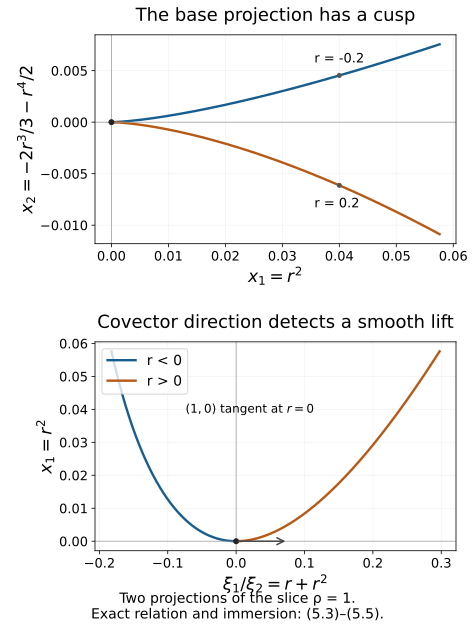

# Prescribed canonical coordinates and isotropic fibers

Darboux coordinates can retain functions already known to be canonical. On a conic symplectic manifold they can also retain their degrees and specified values. This flexibility lets us straighten conic isotropic submanifolds even when their canonical one-form vanishes. We prove the coordinate extension as an actual function construction, then identify the resulting fiber model and the conormal geometry of regular base projections.

We use the symplectic and Hamiltonian conventions of [Phase space and generating families](../20261005-restored-phase-space/phase-space-and-generating-families.md). The characteristic geometry and the zero-valued momentum construction in [Homogeneous submanifold normal forms](../20261005-restored-submanifolds/homogeneous-submanifold-normal-forms.md) provide context; its nonzero restricted one-form theorem does not supply the zero-one-form result proved here. The exact flow proofs are [F0–F1, tangent flows, commuting fields and dilation conjugation](../20261005-restored-submanifolds/flows-constant-rank-and-leaves.md), with the complete [finite-coordinate flow construction](../20261005-restored-phase-space/finite-coordinate-flows.md). The [stationary-phase foundation](../20261004-free-stationary-phase/prerequisite-completions.md) proves the inverse and implicit function theorems P2–P3 and the parameter fundamental theorem of calculus; the [proof map](proof-map.json) binds their exact locators and earlier inputs. Exterior differentiation, pullback and Cartan's formula are proved in the [differential-form foundation](../20261005-restored-phase-space/differential-forms-and-flow-pullbacks.md). The map constant-rank argument needed here is proved explicitly in Theorem 5.1 below.

The primary source is the reprint of Hörmander III, second edition (1994), Theorems 21.1.6, 21.1.9, 21.2.8 and 21.2.9 (printed 273–274, 279–281 and 287–288). We spell out the partial symplectic linear algebra, all flow equations, the exceptional final homogeneous coordinate, both isotropic induction steps, and an explicit homogeneous map from the intermediate model to a fiber. No pseudodifferential calculus is needed in this lesson.

## 1. Extend an isometry of alternating subspaces

Our convention on a symplectic manifold is
\[
 \iota_{H_f}\omega=-df,\qquad
 \{f,g\}=H_fg,\qquad
 \omega=\sum_{j=1}^n dp_j\wedge dq_j.
 \tag{1.1}
\]
Thus \(H_{p_j}=\partial_{q_j}\), \(H_{q_j}=-\partial_{p_j}\), and \(\{p_k,q_j\}=\delta_{kj}\). The Jacobi identity follows from \(d\omega=0\), and gives \([H_f,H_g]=H_{\{f,g\}}\).

We need a linear extension that works when a prescribed subspace is degenerate for the restricted form.

**Lemma 1.1 (alternating-subspace extension).** Let \(W,W'\) be symplectic vector spaces of the same dimension. If \(U\subset W\), \(U'\subset W'\) and \(L:U\to U'\) is a linear isomorphism preserving the restricted alternating forms, then \(L\) extends to a symplectic isomorphism \(W\to W'\).

**Proof.** Let \(K=U\cap U^\omega\), the radical of the restricted form. Its image is the corresponding radical \(K'\). Choose a complement \(S\) to \(K\) in \(U\). The restriction to \(S\) is nondegenerate: a vector of \(S\) orthogonal to \(S\) is also orthogonal to \(K\), hence to \(U\), and lies in \(K\cap S=0\). Its image \(S'=L(S)\) is similarly symplectic.

Work in the symplectic space \(S^\omega\), which contains \(K\). For a basis \(k_1,\ldots,k_d\) of \(K\), choose \(l_j\in S^\omega\) such that
\[
 \omega(k_i,l_j)=\delta_{ij}.
 \tag{1.2}
\]
These choices exist because the functionals \(\omega(k_i,\cdot)\) are independent on \(S^\omega\): nondegeneracy identifies its vectors with covectors, and the \(k_i\) are independent. Put \(A_{ij}=\omega(l_i,l_j)\) and
\[
 \widetilde l_i=l_i-\frac12\sum_j A_{ij}k_j.
 \tag{1.3}
\]
Then \(\omega(k_i,\widetilde l_j)=\delta_{ij}\), while
\(\omega(\widetilde l_i,\widetilde l_j)=A_{ij}-A_{ij}/2+A_{ji}/2=0\).
Thus \(K+\operatorname{span}\{\widetilde l_i\}\) is a nondegenerate symplectic block orthogonal to \(S\).

Perform the same construction in \(W'\), starting with \(L(k_i)\) and \(S'\). Extend \(L\) by mapping each \(\widetilde l_i\) to its constructed counterpart. This is an isomorphism of the resulting nondegenerate blocks. Their symplectic orthogonal complements have the same dimension; choose symplectic bases there and map one basis to the other. The direct sum of these maps is the required extension. Empty radicals and empty complements are allowed. \(\square\)

In particular, independent vectors with the pairings of any indexed subset of a standard symplectic basis can be completed to a full indexed basis. Apply the lemma to their span and the span of the corresponding standard vectors. It also lets us include a prescribed radial vector, with its given pairings, in the extension.

## 2. Complete ordinary canonical functions without changing them

**Theorem 2.1 (ordinary prescribed coordinates).** Let \(S\) be a smooth symplectic manifold of dimension \(2n\), \(c\in S\), and \(A,B\subset\{1,\ldots,n\}\). Suppose smooth functions \(q_j\), \(j\in A\), and \(p_k\), \(k\in B\), have independent differentials at \(c\) and satisfy, on a neighborhood,
\[
 \{q_i,q_j\}=0,\qquad
 \{p_k,p_l\}=0,\qquad
 \{p_k,q_j\}=\delta_{kj}
 \tag{2.1}
\]
for every indicated prescribed index. Then they extend to a full canonical coordinate system \((q,p)\) near \(c\), with the prescribed functions retained identically.

One may also require the coordinate differential at \(c\) to be any compatible symplectic isomorphism extending their given differentials, and assign arbitrary marked values to the newly constructed functions.

**Proof.** The prescribed Hamilton vectors \(-H_{q_j}(c)\), \(H_{p_k}(c)\) are independent and have the standard indexed pairings \(\omega(-H_{q_j},H_{p_k})=\delta_{jk}\). Lemma 1.1 completes them. Equivalently, choose a full canonical cotangent basis at \(c\) extending the given differentials. Fix that basis as the desired differential of our eventual chart.

At any intermediate stage the Hamilton fields of the current prescribed functions commute. Indeed their Poisson brackets in (2.1) are constants, and the Hamilton field of a constant is zero. Their values remain independent on a sufficiently small neighborhood, because their desired values at \(c\) are a subset of the chosen full basis.

Here is the required smooth equation solver. For independent commuting fields \(V_1,\ldots,V_d\), take a small transverse section \(\Sigma\) through \(c\). Their flows define
\[
 \Phi(t,w)=\exp(t_1V_1)\cdots\exp(t_dV_d)(w),
 \qquad w\in\Sigma.
 \tag{2.2}
\]
Its differential at \((0,c)\) is invertible, so it is a coordinate chart after shrinking. Commutativity gives \(V_i=\partial_{t_i}\) there. Thus equations \(V_i u=a_i\), with constant \(a_i\), have the exact solution
\[
 u(\Phi(t,w))=g(w)+\sum_i a_it_i.
 \tag{2.3}
\]
Choose \(g(c)\) as desired and \(dg(c)\) as the desired differential restricted to \(T_c\Sigma\). Explicitly, choose section coordinates \(w\) with \(w(c)=0\), express that covector as \(\sum_\alpha d_\alpha\,dw_\alpha\), and set \(g(w)=g(c)+\sum_\alpha d_\alpha w_\alpha\). This also covers a zero-dimensional section by an empty sum. Together with the equations on the \(V_i(c)\), this fixes the whole desired differential.

To add \(q_J\), \(J\notin A\), solve
\[
 H_{q_j}q_J=0\ (j\in A),\qquad
 H_{p_k}q_J=\delta_{kJ}\ (k\in B).
 \tag{2.4}
\]
To add \(p_K\), \(K\notin B\), solve
\[
 H_{q_j}p_K=-\delta_{jK}\ (j\in A),\qquad
 H_{p_k}p_K=0\ (k\in B).
 \tag{2.5}
\]
The signs are those of (1.1). The desired tangent covector has exactly these evaluations, so (2.3) supplies it and the chosen marked value. Add the new index to \(A\) or \(B\). All canonical relations involving the new function hold on the neighborhood, and none of the earlier functions has been altered.

There are finitely many additions. Shrink at each step to preserve independence and then use the common final neighborhood. The full \(2n\) differentials at \(c\) are the chosen basis, so the resulting functions are coordinates. Their complete Poisson matrix is the standard matrix by (2.4)–(2.5), including their own zero brackets. Since an invertible Poisson matrix determines the symplectic form, \(\omega=\sum dp_j\wedge dq_j\) in this chart. \(\square\)

Starting with empty \(A,B\) gives ordinary Darboux coordinates. Starting with already known functions is stronger: a subsequent coordinate construction can preserve their exact level surfaces and flows, not just a tangent plane.

For example, on \(T^*\mathbb R^2\) the functions
\[
 q_1=x_1,\qquad p_1=\xi_1+x_2^2
 \tag{2.6}
\]
are a prescribed canonical pair. An exact completion is
\[
 q_2=x_2,\qquad p_2=\xi_2+2x_1x_2.
 \tag{2.7}
\]
The two extra derivatives in \(\{p_1,p_2\}\) cancel. Indeed
\[
 p_1dq_1+p_2dq_2
 =\xi_1dx_1+\xi_2dx_2+d(x_1x_2^2).
 \tag{2.8}
\]
Differentiation proves the symplectic identity. This example is ordinary; its added momentum terms have degree zero in the original covectors and therefore are not homogeneous momentum functions.

## 3. Retain degrees, marked values and the radial vector

A conic symplectic manifold has a free local dilation action \(M_t\), \(t>0\), with \(M_t^*\omega=t\omega\). Let \(R\) generate the action. Then
\[
 \mathcal L_R\omega=\omega,\qquad
 \lambda=\iota_R\omega,\qquad d\lambda=\omega.
 \tag{3.1}
\]
A degree-\(\mu\) function satisfies \(Rf=\mu f\). Cartan's formula and (1.1) give
\[
 [R,H_f]=H_{Rf-f}=(\mu-1)H_f.
 \tag{3.2}
\]
Consequently degree-zero positions have \([R,H_q]=-H_q\), while degree-one momenta have \([R,H_p]=0\).

**Theorem 3.1 (homogeneous prescribed coordinates).** Let \(q_j\), \(j\in A\), and \(p_k\), \(k\in B\), satisfy (2.1) on a conic neighborhood of \(c\), with degrees zero and one respectively. Suppose
\[
 \{H_{q_j}(c):j\in A\},\quad
 \{H_{p_k}(c):k\in B\},\quad R(c)
 \tag{3.3}
\]
are jointly independent. Choose marked target values \(a_1,\ldots,a_n\), \(b_1,\ldots,b_n\), agreeing with every prescribed function at \(c\), and assume
\[
 b_J\ne0\quad\text{for some }J\notin A.
 \tag{3.4}
\]
Then all the missing functions can be constructed so that their degrees, all canonical relations, and all marked values hold. They define a homogeneous symplectomorphism of conic neighborhoods of \(c\) and \((a,b)\in T^*\mathbb R^n\setminus0\), retaining every prescribed function identically.

For the completed system, all momentum Hamilton fields, all position Hamilton fields except \(H_{q_J}\), and \(R\) are jointly independent at \(c\).

**Proof, first step: the marked linear completion.** Put
\[
 \varepsilon_j=-H_{q_j}(c),\qquad e_k=H_{p_k}(c),\qquad r=R(c).
\]
Their additional radial pairings are
\[
 \omega(r,\varepsilon_j)=0,\qquad
 \omega(r,e_k)=b_k.
 \tag{3.5}
\]
Use the standard indexed vectors \(\varepsilon_j^0=\partial_{p_j}\), \(e_k^0=\partial_{q_k}\) in the target tangent space, and
\[
 r_0=\sum_{j=1}^n b_j\varepsilon_j^0.
 \tag{3.6}
\]
Condition (3.4) makes \(r_0\) independent of the prescribed target vectors: its \(\varepsilon_J^0\) coefficient cannot be supplied by their span. The map taking the known vectors and \(r\) to these standard vectors and \(r_0\) is an isomorphism of their spans and preserves every pairing, by (2.1) and (3.5). Lemma 1.1 extends it to a full symplectic isomorphism \(L\). This is our desired coordinate differential at \(c\).

For this full tangent system, all \(e_k^0\), all \(\varepsilon_j^0\) with \(j\ne J\), and \(r_0\) are independent. Every intermediate subset of them is independent as well. We will retain these exact tangent values when adding functions.

**Second step: solve the homogeneous equations for all coordinates except \(q_J\).** At the current stage the fields \(H_{q_j},H_{p_k},R\) are independent, have the commuting Hamilton relations, and satisfy (3.2). Take a transverse section \(\Sigma\) through \(c\) for their joint span. The map
\[
 \Phi(\tau,z,\ell,w)=
 \left(\prod_{j\in A}\exp(\tau_jH_{q_j})\right)
 \left(\prod_{k\in B}\exp(z_kH_{p_k})\right)
 M_{e^\ell}(w)
 \tag{3.7}
\]
is a coordinate chart after shrinking, by its independent differential at the origin. In these coordinates,
\[
 H_{q_j}=\partial_{\tau_j},\qquad
 H_{p_k}=\partial_{z_k},\qquad
 R=\partial_\ell+\sum_{j\in A}\tau_j\partial_{\tau_j}.
 \tag{3.8}
\]
F1 of the flow prerequisite proves the variational identity and conjugation formula for these exact brackets. For the last identity, dilation conjugates a degree-zero Hamilton flow with parameter \(\tau_j\) to one with parameter \(e^h\tau_j\), and preserves the degree-one Hamilton flow parameter \(z_k\). This follows from (3.2), or directly from dilation of a cotangent translation. Thus the plus sign in (3.8) is fixed.

To add a position \(q_i\), \(i\notin A\), \(i\ne J\), set
\[
 q_i=
 \begin{cases}
 z_i+g(w),&i\in B,\\
 g(w),&i\notin B.
 \end{cases}
 \tag{3.9}
\]
This satisfies (2.4) and \(Rq_i=0\). Choose \(g(c)=a_i\) and its section differential to match the covector \(L^*dq_i^0\). That covector has the required evaluations on the Hamilton fields and value zero on \(R(c)\), so all its components are matched.

To add a momentum \(p_K\), \(K\notin B\), set
\[
 p_K=
 \begin{cases}
 -\tau_K+e^\ell g(w),&K\in A,\\
 e^\ell g(w),&K\notin A.
 \end{cases}
 \tag{3.10}
\]
This satisfies (2.5) and \(Rp_K=p_K\). Choose \(g(c)=b_K\) and its section differential to match \(L^*dp_K^0\). Its radial evaluation is \(b_K\), exactly the derivative of (3.10) in \(\ell\) at the origin. Every marked tangent component is therefore retained.

After either addition the enlarged Hamilton/radial list has the independent marked tangent system already chosen. Shrink so it remains independent nearby. Repeat until all momenta and all positions except \(q_J\) are constructed. The data have not required translating any homogeneous momentum by a constant.

**Third step: construct the exceptional position.** Theorem 2.1 completes this almost full system by an ordinary position \(x_J\), retaining the desired differential and value \(a_J\) at \(c\). Write \(x_i=q_i\) for \(i\ne J\). In these ordinary canonical coordinates,
\[
 R=\sum_i p_i\partial_{p_i}+h(x,p)\partial_{x_J},
 \tag{3.11}
\]
because \(Rp_i=p_i\) and \(Rx_i=0\) for \(i\ne J\). Contracting \(\omega\) gives
\[
 \iota_R\omega=\sum_i p_i\,dx_i-h\,dp_J.
\]
Equation (3.1) then implies \(dh\wedge dp_J=0\). Since these are full coordinates, every partial derivative of \(h\) except possibly its \(p_J\) derivative vanishes. On a small coordinate product \(h=h(p_J)\). Moreover \(h(b_J)=Rx_J(c)=0\), by the chosen radial-compatible differential.

Shrink to an interval of \(p_J\) values avoiding zero, and define
\[
 q_J=x_J-\int_{b_J}^{p_J}\frac{h(v)}v\,dv.
 \tag{3.12}
\]
It has the required value \(a_J\), the same differential at \(c\), and
\[
 Rq_J=h(p_J)-p_J\,h(p_J)/p_J=0.
\]
Adding a function of \(p_J\) to \(x_J\) preserves every canonical bracket: it has zero bracket with all momenta, and with each \(q_i\), \(i\ne J\). Thus the full coordinate system is canonical, with the stated Euler degrees.

**Fourth step: pass from a local chart to a conic chart.** The nonzero \(p_J\) gives a transverse level section \(p_J=b_J\). In a sufficiently small ray neighborhood, choose its piece so that each ray meets it once, using the defining local conic chart. Extend the degree-zero functions constantly along each ray and the degree-one functions linearly with the dilation factor. The Euler equations prove agreement with the constructed functions wherever both are defined. The originally prescribed functions already have these same homogeneous extensions, so they remain identical.

The local canonical relations persist under this extension: a bracket of degrees \(\mu,\nu\) has degree \(\mu+\nu-1\); the position-position and momentum-momentum brackets are zero, and the mixed brackets have degree zero and equal the specified constants. On the transverse level section the coordinate map is a local diffeomorphism onto a piece of \(p_J=b_J\). Saturating that piece and its source section by positive dilation gives a diffeomorphism of conic neighborhoods. It is symplectic and homogeneous by construction, and the tangent independence follows from (3.6). \(\square\)

The exceptional nonzero value is necessary for this conclusion with the stated independence. In any completed homogeneous chart,
\[
 R=\sum_i p_i\partial_{p_i}=-\sum_i p_iH_{q_i}.
 \tag{3.13}
\]
If every \(b_i\) outside \(A\) were zero, \(R(c)\) would be in the span of the already prescribed position Hamilton fields, contradicting (3.3). In particular \(A\) has at most \(n-1\) elements. A homogeneous symplectomorphism also preserves the primitive itself, because it preserves both \(\omega\) and \(R\):
\[
 \Phi^*\left(\sum_i p_i\,dq_i\right)=\lambda.
 \tag{3.14}
\]

## 4. Straighten a conic isotropic submanifold with zero primitive

Let \(V\) be a conic embedded submanifold of a conic symplectic manifold \(S\). The radial field is tangent to \(V\). Therefore
\[
 V\text{ isotropic}\quad\Longrightarrow\quad
 \lambda|_{TV}=\omega(R,\cdot)|_{TV}=0.
 \tag{4.1}
\]
Conversely, if the pullback of \(\lambda\) to \(V\) is identically zero, its exterior derivative is the pullback of \(\omega\), so \(V\) is isotropic. Vanishing at a single point is not this differential identity.

**Theorem 4.1 (conic isotropic fiber model).** Let \(V\subset S\) be a conic isotropic submanifold of dimension \(k\), with \(\dim S=2n\). Near any \(c\in V\), there are homogeneous symplectic coordinates \((Q,P)\) in which
\[
 V=\{Q_1=\cdots=Q_n=0,\quad
                 P_{k+1}=\cdots=P_n=0\}.
 \tag{4.2}
\]
The assertion is an equality of conic germs, with the first \(k\) momenta jointly nonzero. Necessarily \(1\leq k\leq n\). In particular every conic Lagrangian is locally a nonzero cotangent fiber in suitable homogeneous canonical coordinates.

**Proof.** Isotropy gives \(k\leq n\), and the nonzero tangent radial field gives \(k\geq1\). First we obtain the auxiliary model
\[
 q_1=0,\quad p_2=\cdots=p_k=0,\quad
 q_j=p_j=0\quad(k<j\leq n),
 \qquad p_1>0.
 \tag{4.3}
\]
We work by induction in ambient dimension.

Degree-one defining functions with independent normal differentials exist near the marked ray. To see this, choose a positive degree-one ray coordinate \(\rho\) and a transverse section \(\rho=1\). The conic submanifold is the saturation of an embedded submanifold of this section. Take independent defining functions on that section, extend them constantly along rays, and multiply them by \(\rho\). On \(V\) their differentials are \(\rho\) times the independent section normal differentials, so they define the full conormal space.

**Case \(k<n\): remove a symplectic normal pair.** The Hamilton vectors of those defining functions span \((T_cV)^\omega\). Since \(T_cV\) is isotropic, the radical of the restricted form on \((T_cV)^\omega\) is \(T_cV\), and its rank is \(2(n-k)>0\). Hence two degree-one defining functions \(f,g\) have \(\{f,g\}(c)\ne0\). Both vanish on \(V\). If \(H_f(c)\) were proportional to \(R(c)\), then \(H_fg(c)\) would be proportional to \(Rg(c)=g(c)=0\), a contradiction.

Apply Theorem 3.1 with \(f\) as the prescribed momentum \(p_n\), marked value zero, and choose a different marked momentum \(p_1=1\). This is possible because \(n\geq2\), \(H_f(c)\) and \(R(c)\) are independent, and no position has been prescribed. In its resulting chart, \(\partial_{q_n}g=\{f,g\}\ne0\). The implicit function theorem expresses \(g=0\) as
\[
 q_n=a(q_1,\ldots,q_{n-1},p).
 \tag{4.4}
\]
Homogeneity and uniqueness of the solution show that \(a\) has degree zero. The functions \(r=q_n-a\) and \(p_n=f\) satisfy \(\{p_n,r\}=1\), have degrees zero and one, and both vanish on \(V\).

Their two Hamilton fields span a nondegenerate symplectic plane. At \(c\), \(R\) is orthogonal to that plane, since \(Rr=0\) and \(Rp_n=p_n=0\). Thus the two fields and \(R\) are independent. Apply Theorem 3.1 again, preserving this actual pair as the last position and momentum and choosing the positive marked momentum at index one. Now \(V\) is contained in the full symplectic section \(q_n=p_n=0\). This section is conic, of dimension \(2(n-1)\), and contains the same \(k\)-dimensional isotropic \(V\); its radial field stays nonzero because \(p_1>0\).

Induct in that section. Extend its homogeneous canonical change to the full neighborhood by leaving the removed pair unchanged. This is a symplectic product extension: the reduced functions depend only on the retained pairs, their pullback preserves the retained sum of \(dp_j\wedge dq_j\), and the unchanged pair preserves the last summand. Its inverse is the reduced inverse times the identity. The reduced homogeneous functions keep their degrees under full simultaneous dilation. Shrink so the remaining covector components stay nonzero. Each such step removes one pair with both coordinates zero on \(V\).

**Case \(k=n>1\): remove a position cylinder.** Here \(V\) is Lagrangian. Its conormal Hamilton span is \(T_cV\), of dimension \(n>1\); choose a degree-one defining function \(f\) whose Hamilton vector is not proportional to \(R(c)\). Normalize it as \(p_n=f\), with \(p_1(c)=1\), exactly as above.

Because \(f\) vanishes on \(V\), its Hamilton vector lies in \((TV)^\omega=TV\) along \(V\). Thus the coordinate field \(H_{p_n}=\partial_{q_n}\) is tangent to \(V\). Local flow uniqueness shows that \(V\) is a position cylinder:
\[
 V=\{\text{small }q_n\text{ interval}\}\times V_0,
 \qquad p_n=0,
 \tag{4.5}
\]
where \(V_0=V\cap\{q_n=p_n=0\}\). Choose the degree-zero position origin so \(q_n(c)=0\). The section is transverse to this tangent coordinate field, so \(V_0\) has dimension \(n-1\); its restricted symplectic form is zero. It is conic, and its radial field remains nonzero in the positive first momentum. Induct on the reduced conic Lagrangian \(V_0\). Extend the reduced chart by the unchanged cylinder pair. Each such step supplies one free position and its zero momentum.

**Base \(n=k=1\).** Use a homogeneous canonical chart with positive momentum. On the one-dimensional \(V\), (4.1) reads \(p\,dq=0\), with \(p>0\). Hence \(q\) is constant on its local connected germ. Subtract that constant from this degree-zero position. The remaining momentum is a local coordinate on \(V\), since the radial tangent has \(Rp=p\ne0\). Thus \(V=\{q=0,p>0\}\) as a germ.

The normal-pair steps and cylinder steps, with a permutation of indices, give exactly (4.3). The first momentum stays positive in the marked conic neighborhood.

It remains to turn (4.3) into (4.2) by an actual homogeneous symplectomorphism. On \(p_1>0\), define
\[
 \begin{aligned}
 Q_1&=q_1+\sum_{j=2}^k q_jp_j/p_1,& P_1&=p_1,\\
 Q_j&=p_j/p_1,&P_j&=-q_jp_1\quad(2\leq j\leq k),\\
 Q_j&=q_j,&P_j&=p_j\quad(j>k).
 \end{aligned}
 \tag{4.6}
\]
Every \(Q_j\) has degree zero and every \(P_j\) degree one. Direct differentiation gives the exact primitive identity
\[
 P_1\,dQ_1+\sum_{j=2}^k P_j\,dQ_j
       =p_1\,dq_1+\sum_{j=2}^k p_j\,dq_j.
 \tag{4.7}
\]
The unchanged spectator terms complete it to \(\sum P_jdQ_j=\sum p_jdq_j\). The inverse is
\[
 \begin{split}
 p_1&=P_1,\qquad
 q_j=-P_j/P_1,\quad p_j=Q_jP_1\quad(2\leq j\leq k),\\
 q_1&=Q_1+\sum_{j=2}^k P_jQ_j/P_1,
 \end{split}
 \tag{4.8}
\]
with unchanged spectators. Thus this is a full homogeneous symplectic coordinate change, not just a parametrization of \(V\). Substitution maps (4.3) to \(Q=0,P_j=0\) for \(j>k\), and its inverse maps that entire local model back to (4.3). Empty sums when \(k=1\) give the identity. This proves (4.2). \(\square\)

A literal ordinary exchange \(q_j\leftrightarrow p_j\) would interchange degrees zero and one. The divisions and products by \(p_1\) in (4.6) supply the correct homogeneous replacement, on a cone where that denominator is nonzero.

## 5. Recognize conormal germs where the base projection has constant rank

For an embedded submanifold \(Y\subset X\), its nonzero conormal is
\[
 N^*Y\setminus0
 =\{(x,\xi):x\in Y,\ \xi|_{T_xY}=0,\ \xi\ne0\}.
 \tag{5.1}
\]
At each nonzero conormal point it is conic Lagrangian. In adapted base coordinates \(Y=\{x_{r+1}=\cdots=x_n=0\}\), it is defined by those equations and \(\xi_1=\cdots=\xi_r=0\). Its local dimension is \(n\), and the pullback of \(\xi\cdot dx\) is zero. Differentiating gives isotropy, hence the Lagrangian property. If \(Y\) is open in \(X\), there are no nonzero conormal points.

**Theorem 5.1 (constant-rank conormal recognition).** Let \(\Lambda\subset T^*X\setminus0\) be conic Lagrangian, \(\dim X=n\). If the base projection \(\pi:\Lambda\to X\) has constant rank \(r\) near \((x_0,\xi_0)\), then there is an embedded base germ \(Y\) of dimension \(r\) near \(x_0\) such that
\[
 \Lambda=N^*Y
 \tag{5.2}
\]
as germs near \((x_0,\xi_0)\). Necessarily \(r<n\). This does not assert equality with every conormal direction or with the whole global conormal bundle.

**Proof.** Here is the required constant-rank map argument. In local coordinates on \(\Lambda\) and \(X\), select a nonzero \(r\)-by-\(r\) minor of \(d\pi\) at the marked point, and shrink so it stays nonzero. After reordering coordinates, use the first \(r\) components of \(\pi\), together with the remaining domain coordinates, as new domain coordinates \((u,v)\). The inverse function theorem applies because the Jacobian of this change is block triangular with that invertible minor. In these coordinates \(\pi(u,v)=(u,h(u,v))\). Its derivative has first block \((I,0)\); constant rank \(r\) therefore forces every entry of \(\partial_v h\) to vanish. On a small coordinate product the fundamental theorem of calculus along line segments gives \(h(u,v)=h(u,v_0)\). Consequently its local image is the embedded graph \(Y=\{(u,h(u,v_0))\}\), and \(d\pi(T\Lambda)=TY\). For \(r=0\), all derivatives of \(\pi\) vanish and the same line-segment argument makes the map constant; its image is the zero-dimensional embedded germ. This proves the required conclusion in every rank without importing an unproved constant-rank theorem. The primitive vanishes on \(T\Lambda\) by (4.1). Therefore for each \((x,\xi)\in\Lambda\) in this neighborhood and each \(v\in T_xY\), choose \(w\in T_{(x,\xi)}\Lambda\) with \(d\pi(w)=v\). Then
\[
 \xi(v)=\lambda(w)=0.
\]
Thus \(\Lambda\subset N^*Y\setminus0\) locally. Both are embedded \(n\)-dimensional manifolds; the inclusion has injective differential and is a local diffeomorphism by the inverse function theorem. Its image is open in \(N^*Y\), proving the germ equality after shrinking. Finally the nonzero radial field is tangent to \(\Lambda\) and lies in \(\ker d\pi\), so \(r\leq n-1\). \(\square\)

The constant-rank locus is open and dense in \(\Lambda\). For density, inside any nonempty open patch choose the largest integer rank attained there. A nonzero minor at a point of that rank stays nonzero nearby; maximality in the patch prevents a larger rank, so this smaller neighborhood has constant rank. Openness is built into the definition of this locus. Conormal descriptions therefore cover an open dense subset, although the remaining base caustics can be singular.

Here is an original deformed-cusp example. On \(T^*\mathbb R^2\), take \(|r|<1/4\), \(\rho>0\), and
\[
 x=\left(r^2,-\frac23r^3-\frac12r^4\right),\qquad
 \xi=((r+r^2)\rho,\rho).
 \tag{5.3}
\]
The exact cancellation is
\[
 \xi\cdot dx
 =\rho(r+r^2)(2r\,dr)
   +\rho(-2r^2-2r^3)\,dr=0.
 \tag{5.4}
\]
The parametrization is an embedding in this range: \(\rho=\xi_2\), and \(\xi_1/\xi_2=r+r^2\) uniquely determines \(r\), since \(1+2r>0\). Its differential has rank two even at \(r=0\). Thus it is a smooth conic Lagrangian with a singular base image.

The base projection has rank one for \(r\ne0\) and rank zero at zero. Its image satisfies
\[
 \left(x_2+\frac12x_1^2\right)^2=\frac49x_1^3.
 \tag{5.5}
\]
The smooth base change \(y_1=x_1,\ y_2=x_2+x_1^2/2\) reveals the ordinary semicubical cusp. Theorem 5.1 gives a conormal germ at each regular point. It cannot give a conormal germ at the cusp: the base projection of a conormal bundle has locally constant rank equal to the dimension of its base submanifold, whereas the rank of (5.3) changes in every neighborhood of \(r=0\).

**Figure 5.1.** Both panels use (5.3) on the slice \(\rho=1\), with \(-0.24\leq r\leq0.24\). The upper projection keeps \((x_1,x_2)\) and develops a cusp. The lower keeps \((\xi_1/\xi_2,x_1)=(r+r^2,r^2)\), whose derivative at zero is \((1,0)\). That projection already detects immersion of the lifted curve; the full conic Lagrangian also retains \(x_2\) and the free positive radial variable. The curves are numerical samples of the exact formulas, not evidence replacing (5.4) or the embedding argument.

## 6. Exercises with complete solutions

**Exercise 6.1 (dual-vector correction; foundational).** In Lemma 1.1 verify (1.3), including its sign. What would happen with the opposite sign?

**Solution.** Since \(\omega(k_i,k_j)=0\), the dual pairings in (1.2) are unchanged. In the pairing of the corrected \(l_i,l_j\), the correction in the first slot contributes \(-A_{ij}/2\); the correction in the second contributes \(A_{ji}/2=-A_{ij}/2\), because \(\omega(l_i,k_j)=-\delta_{ij}\). The total is zero. With the opposite sign the two corrections add \(A_{ij}\), leaving \(2A_{ij}\), which need not vanish.

**Exercise 6.2 (ordinary shear; foundational).** Compute all canonical brackets for (2.6)–(2.7), and explain why the transformation fails the homogeneous momentum condition.

**Solution.** The positions commute. The bracket \(\{p_1,q_1\}\) equals one, \(\{p_2,q_2\}\) equals one, and both other position-momentum brackets vanish. For the remaining bracket, using \(\{f,g\}=f_\xi\cdot g_x-f_x\cdot g_\xi\),
\[
 \{p_1,p_2\}=2x_2-2x_2=0.
\]
Under \(\xi\mapsto t\xi\), \(p_1\) becomes \(t\xi_1+x_2^2\), which differs from \(t p_1\) unless \(x_2^2=0\) or \(t=1\). The same issue occurs for \(p_2\). Thus it is a full ordinary canonical map, with exact primitive difference (2.8), but not a homogeneous one.

**Exercise 6.3 (flow signs; intermediate).** Derive both (2.4) and (2.5) from the desired canonical brackets. Why do the field equations have constant compatible right sides?

**Solution.** For a new \(q_J\), the equations are \(\{q_j,q_J\}=0\) and \(\{p_k,q_J\}=\delta_{kJ}\), hence (2.4). For a new \(p_K\), antisymmetry turns \(\{p_K,q_j\}=\delta_{Kj}\) into \(\{q_j,p_K\}=-\delta_{jK}\); all old momentum brackets are zero, giving (2.5). Every old pair has constant bracket, so their Hamilton fields commute by Jacobi. Constant right sides have zero derivatives along those fields, which gives the commuting compatibility needed for (2.3).

**Exercise 6.4 (radial sign in a flow chart; intermediate).** On a two-dimensional cotangent chart take \(H_q=-\partial_p\), \(R=p\partial_p\), and initial momentum \(b\ne0\). Write the momentum after first dilating by \(e^\ell\) and then flowing by \(\tau H_q\). Verify the radial field in these parameters.

**Solution.** The momentum is \(p=e^\ell b-\tau\). A further dilation by \(e^h\) transforms it to \(e^{\ell+h}b-e^h\tau\), so \((\tau,\ell)\mapsto(e^h\tau,\ell+h)\). Its generator is \(\partial_\ell+\tau\partial_\tau\), which applied to \(p\) gives \(e^\ell b-\tau=p\). The negative sign instead would give \(e^\ell b+\tau\), so it would fail the momentum Euler equation.

**Exercise 6.5 (exceptional position; intermediate).** In a canonical chart suppose \(R=\sum p_i\partial_{p_i}+h(p_J)\partial_{x_J}\), with \(b_J\ne0\) and \(h(b_J)=0\). Verify all claimed properties of (3.12).

**Solution.** The integral is smooth on an interval avoiding zero and vanishes at \(p_J=b_J\). Its derivative there is \(h(b_J)/b_J=0\), so the marked value and differential of \(x_J\) are retained. Euler differentiation gives \(Rq_J=h(p_J)-p_J h(p_J)/p_J=0\). Since only a function of \(p_J\) is added to \(x_J\), all brackets with the \(p_i\) stay unchanged. For \(i\ne J\), its bracket with \(q_i=x_i\) is zero because \(\{x_i,p_J\}=0\). The coordinate change is invertible by adding the integral back, so all canonical identities are preserved.

**Exercise 6.6 (necessary marked momentum; intermediate).** Explain why, under (3.3), the completed marked momentum vector cannot be supported only in the set \(A\). Can the given independent Hamilton fields include every position field?

**Solution.** In any homogeneous canonical chart (3.13) holds. If \(b_i=0\) outside \(A\), then \(R(c)=-\sum_{i\in A}b_iH_{q_i}(c)\), contradicting its independence from the prescribed position fields. Thus at least one nonzero marked momentum lies outside \(A\). If \(A\) contained all positions, this contradiction would be unavoidable. Therefore \(|A|\leq n-1\); the completed independence must omit one position Hamilton field with nonzero corresponding momentum.

**Exercise 6.7 (homogeneous rotation; advanced).** For \(k=2\), verify the primitive identity and inverse of (4.6). Identify the image of the auxiliary model, retaining spectator coordinates.

**Solution.** Here \(Q_1=q_1+q_2p_2/p_1\), \(Q_2=p_2/p_1\), \(P_1=p_1\), \(P_2=-q_2p_1\). Thus
\[
 P_1dQ_1+P_2dQ_2
 =p_1dq_1+p_2dq_2+q_2p_1d(p_2/p_1)-q_2p_1d(p_2/p_1).
\]
The last terms cancel. Solving gives \(q_2=-P_2/P_1\), \(p_2=Q_2P_1\), \(q_1=Q_1+P_2Q_2/P_1\). For the auxiliary model \(q_1=p_2=0\), \(q_j=p_j=0\) for \(j>2\), all \(Q_j\) vanish and all \(P_j\) for \(j>2\) vanish, while \(P_1>0\) and \(P_2\) are free locally. This is the exact fiber model of dimension two, with unchanged spectators.

**Exercise 6.8 (zero primitive as a germ; advanced).** Prove both directions of (4.1) for a conic submanifold. Why does vanishing of \(\lambda\) only at one tangent space not suffice to prove isotropy on a neighborhood?

**Solution.** If \(V\) is isotropic, both \(R\) and each \(v\in TV\) are tangent, so \(\lambda(v)=\omega(R,v)=0\). Conversely, let \(i:V\to S\) be inclusion and assume \(i^*\lambda=0\) as a one-form on \(V\). Then \(i^*\omega=i^*d\lambda=d(i^*\lambda)=0\), which is isotropy. A value of a one-form at one point determines none of its first derivatives; its exterior derivative there may be nonzero. The converse therefore needs an identically zero pullback on the germ, not just a zero value at the marked tangent space.

**Exercise 6.9 (deformed cusp; advanced).** Verify the two ranks in (5.3), the base equation (5.5), and the nonzero tangent of the lower panel in Figure 5.1.

**Solution.** The base derivative in \(r\) is \((2r,-2r^2-2r^3)\), while the base derivative in \(\rho\) is zero. Thus the base rank is one for \(r\ne0\) and zero at zero. At \(r=0\), the full \(r\) derivative is \((0,0,\rho,0)\) and the full \(\rho\) derivative is \((0,0,0,1)\), which are independent because \(\rho>0\). Away from zero the inverse using \(\rho\) and \(r+r^2\) proves full rank two throughout the specified interval. Since \(x_1=r^2\), \(x_2+x_1^2/2=-2r^3/3\), squaring gives (5.5). The lower projection derivative is \((1+2r,2r)\), equal to \((1,0)\) at zero.

**Exercise 6.10 (the germ qualification; advanced).** Let \(Y=\{x_2=0\}\subset\mathbb R^2\). Describe a conic Lagrangian germ equal to a piece of \(N^*Y\) while omitting an entire sign of conormal directions. State its base rank and compare it with the cusp.

**Solution.** Take \(\Lambda=\{x_2=0,\xi_1=0,\xi_2>0\}\). Its parameters are \((x_1,\xi_2)\), it has dimension two, and its primitive is zero. It is an open conic subset of the nonzero conormal of \(Y\), whose negative \(\xi_2\) directions it omits. At every marked point of \(\Lambda\), Theorem 5.1 gives equality of the germ with \(N^*Y\), with base rank one. This is not global equality with both signs of that conormal. Its rank is constant; the cusp relation has rank zero at the caustic and rank one arbitrarily close, so no such smooth conormal germ exists at that caustic.

## 7. Scope and author checks

The proof completes ordinary prescribed canonical functions, their full homogeneous extension with arbitrary compatible marked values, the zero-primitive conic isotropic normal form, and constant-rank conormal recognition. It preserves actual functions, exact Poisson signs, degree zero and one, the exceptional nonzero momentum, all induction dimensions, and local conic-germ qualifications. Ten original graded exercises have complete solutions.

The preserved proof and its exact current programme dependencies were reviewed for this restoration; independent human mathematical review remains pending. Bounded exact checks verify the alternating dual correction, an ordinary nonlinear canonical shear, semidirect radial flow signs and homogeneous equations, the final position correction, the primitive-preserving rotation in several dimensions, and the deformed cusp's ranks and primitive. The reproducible figure was inspected as two projections of a stated radial slice. These checks do not certify arbitrary smooth flows or substitute for the general proofs.

Clean conic Lagrangian pair normal forms, stable phase equivalence, Maslov topology, broader symbol classes, propagation, hyperbolic and mixed problems, glancing and complex-phase mathematics, and every other unfinished assigned course strand remain active.

## Sources and restoration

- Lars Hörmander, *The Analysis of Linear Partial Differential Operators III: Pseudo-Differential Operators*, reprint of the second edition (1994), Theorems 21.1.6, 21.1.9, 21.2.8 and 21.2.9; the normal-pair reduction is also used in the proof of Theorem 21.2.4. The complete arguments here retain marked values, degrees, full coordinate maps and germ qualifications.
- The [source and restoration record](source-provenance.json) identifies the edition used. The reproducible numerical cusp illustration retains its [DejaVu font notice](figures/notices/LICENSE_DEJAVU.txt).

Original lesson, ten solutions and illustration: GPT-6.1 Sol (OpenAI), Ultra, September 2026, CC0. Restoration and exact prerequisite review: GPT-6 Astra (OpenAI), Ultra, 5 October 2026. Original additions here are CC0. Linked components retain their individual licences. No book file or text is included.
