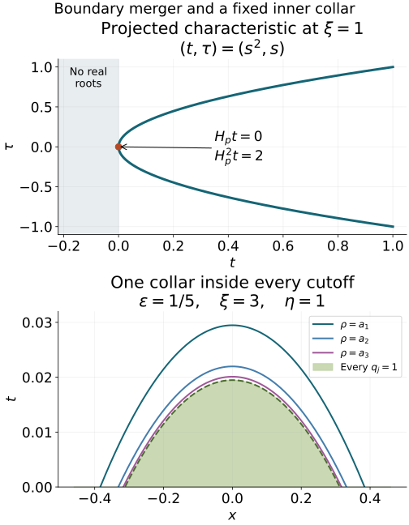

# Hyperbolic Cauchy problems at a principal-type boundary

Original independent programme exposition and all twenty complete original solutions are retained. Current source and proof review: GPT-6 Astra (OpenAI), Ultra, 5 October 2026. This lesson, its added proof completions and original figure are dedicated under CC0. Linked components retain their own licences. All nine approved purchased books are valid mathematical sources and ordinary citations; citations replace no programme proof.

Begin with higher-order Cauchy roots, jets and propagation and [the necessity of hyperbolicity](../20261005-restored-hyperbolicity-necessity/hyperbolicity-necessity-support-tests-and-double-roots.md). We now prove energy estimates, supported existence and boundary propagation when two real normal roots merge at the initial surface while the characteristic remains of principal type. The [ordinary symbol calculus](../20261004-free-intrinsic-graph/prerequisites/ordinary-operator-calculus.md) supplies the composition and Sobolev mapping conventions used below.

Use coordinates \((x',t)\), \(D=-i\partial\), the Hermitian pairing linear in its first entry, and the tangential Sobolev norm \(\|\cdot\|_s\). All symbols are ordinary \(S^r_{1,0}\), with \(t\) as a smooth parameter on a fixed compact interval. The mixed half-space proofs in the higher-order Cauchy lesson supply restricted/supported duality, the complete normal jet norm and the all-real normal step. Boundary distributions and intrinsic derivatives retain their exact AN-03 interfaces. No raw ambient derivative is substituted for an intrinsic derivative.

## 0. Exact programme inputs and the weak-limit step

The complete [scalar sharp bound](../20261005-cauchy-foundations/sharp-lower-bound.md), [finite-matrix sharp bound](../20261005-positivity-foundations/finite-matrix-sharp-lower-bound.md) and [scalar Fefferman–Phong proof](../20261005-metric-positivity/scalar-fefferman-phong.md) supply the distinct positivity estimates used below. [Metric Weyl products](../20261005-metric-weyl-calculus/metric-weyl-products.md), [operator domains and action](../20261005-metric-weyl-calculus/weyl-action-and-covariance.md) and [quantization conversion](../20261005-metric-weyl-calculus/reflection-and-quantization.md) fix the signs, domains and remainders. Finite matrices are treated entrywise where their fixed dimension permits it; the scalar Fefferman–Phong conclusion is never asserted for matrices.

[Mixed spaces and half-space duality](../20261005-mixed-halfspace-foundations/halfspace-support-and-duality.md), together with the [two-weight Hilbert-space proof](../20261005-mixed-halfspace-foundations/two-weight-hilbert-spaces-and-traces.md), prove the actual restricted/support spaces, all-real normal step, traces, tangential family maps and differential recovery. Their exact receivers are also collected in Section 4 and HC45 of the earlier higher-order Cauchy lesson. The [boundary wavefront and tangential companion](../20261005-boundary-wavefront-and-tangential/normal-extension-and-tangential-action.md) supplies the intrinsic extension, compressed cotangent and proper tangential action; its exact file and locators are recorded in the proof map. The [normal-extension proof](../20261005-normal-extension/normal-extension-and-boundary-defect.md) supplies the boundary jet calculus. These are complete earlier programme arguments, including the pure-normal exception to tangential smoothing.

**Weak subsequences in the actual Hilbert space.** If \((u_j)\) is bounded by \(C\) in a Hilbert space \(H\), apply finite Gram–Schmidt successively to the sequence, omitting each vector already in the span. This gives a finite or countable orthonormal family \(e_k\) whose closed span contains every \(u_j\). Each coordinate \((u_j,e_k)\) lies in the compact complex disk of radius \(C\). Successive subsequences and a diagonal extraction make every coordinate converge to \(c_k\). For any finite \(N\), orthogonality gives
\[
\sum_{k\le N}|c_k|^2
=\lim_\ell\sum_{k\le N}|(u_{j_\ell},e_k)|^2\le C^2.
\tag{PTA1}
\]
The finite square sums increase to a finite limit. Hence \(\sum c_ke_k\) is Cauchy by orthogonality; completeness gives \(u\in H\), with \(\|u\|\le C\). For \(v\in H\), the same orthogonality inequality shows that \(\sum(v,e_k)e_k\) converges to \(v_0\), and \(v-v_0\) is orthogonal to all \(e_k\), hence to every \(u_j\) and \(u\). Testing a finite partial sum of \(v_0\) passes to the coordinate limit. Its remaining norm tail has pairing bounded by \(2C\) times that tail, uniformly in \(j_\ell\), proving \((u_{j_\ell},v)\to(u,v)\). A finite family uses the same argument without an infinite tail; the zero-span case is immediate.

Also \(\|u\|\le\liminf_\ell\|u_{j_\ell}\|\): if \(u\ne0\), test against \(u/\|u\|\) and apply Cauchy–Schwarz; if \(u=0\), the assertion follows from nonnegativity. A continuous linear functional vanishing on every \(u_{j_\ell}\) vanishes on \(u\). Consequently distributional equations and support restrictions pass through this weak limit, because each compact smooth test pairing is continuous in the mixed Hilbert norm. For supported representatives this continuity follows from their Fourier norm and Cauchy–Schwarz; for restricted spaces it follows by testing inside the domain and taking the infimum over extensions. The [Hilbert representation and adjoint proof T1](../20261004-free-canonical-composition/compactness-and-essential-norms.md#t1-the-hilbert-space-facts-with-proofs) and the [Bochner construction](../20261005-cauchy-foundations/integration-and-duality.md) supply all completeness and pairing facts used here. No separability of the ambient Hilbert space is assumed.

## 1. A pair of merging roots has a smooth quadratic factor

Normalize the noncharacteristic principal polynomial as
\[
p(x',t,\xi',\tau)=\sum_{j=0}^m p_j(x',t,\xi')\tau^j,
\qquad p_m=1.
\]
This is the index convention on printed page 404, PDF page 419 of the approved 2007 edition. Assume every normal root is simple and real for \(t>0,\xi'\ne0\). At \(t=0\) the roots are real; at every double root require
\[
p_t p_{\tau\tau}<0.
\]
The necessity lesson supplies this alternative under the real principal-type hypotheses. A multiple normal root here is not a genuine double characteristic: \(dp\ne0\) on the punctured characteristic set. Conversely the quadratic inequality forces exactly that distinction at the root in question.

Fix a double root \(\tau_0\) and a small complex circle around it, disjoint from all other roots. Polynomial coefficients depend smoothly on the real parameters. On a smaller parameter patch the circle remains free of zeros and encloses exactly two roots, with multiplicity. Their power sums are smooth, even where the two individual roots fail to be smooth:
\[
S_k=(2\pi i)^{-1}\oint z^k\frac{\partial_zp(z)}{p(z)}\,dz,
\quad k=1,2.
\]
The [complete polynomial circle-count identity and homotopy proof](../20261005-restored-hyperbolicity-necessity/hyperbolicity-necessity-support-tests-and-double-roots.md), together with [the weighted circle moments A5](../20261005-restored-quadratic-forms/spectral-algebra-and-contour-projections.md), counts the multiplicities and gives these power sums. Differentiation under the fixed compact contour, whose denominator is bounded away from zero, proves every parameter derivative. Set
\[
a=S_1/2,\qquad b=S_2/2-a^2.
\]
The two-root factor is \((\tau-a)^2-b\). Polynomial division gives
\[
p=((\tau-a)^2-b)q,
\]
where \(q\) is monic of degree \(m-2\) in \(\tau\), has smooth coefficients and is nonzero at the chosen double root. Reality of the coefficients makes \(a,b\) real. For \(t\ge0\) both enclosed roots are real, so \(b=(\tau_+-\tau_-)^2/4\ge0\). Construct the patch first on the unit tangential sphere and extend conically; homogeneity gives degrees one and two for \(a,b\). This contour argument proves the specific polynomial factor used here without importing a smooth preparation theorem for arbitrary functions.

At the double root, \(b=0\), \(a=\tau_0\), and
\[
p_t=-b_tq,\qquad p_{\tau\tau}=2q,
\qquad p_t p_{\tau\tau}=-2b_tq^2.
\]
Thus \(b_t>0\). On a fixed smaller conic patch, continuity and homogeneity give \(b_t\ge c|\xi'|^2\) for \(0\le t\le T\). Since \(b(x',0,\xi')\ge0\), integration in \(t\) gives
\[
b(x',t,\xi')\ge ct|\xi'|^2.
\]
All constants belong to that fixed patch. No uniform root-gap bound persists at the boundary, and taking separate smooth square roots of \(b\) there would lose the smoothness that the quadratic factor retains.

The Tricomi model is \(P=D_t^2-t|D'|^2\). Its principal roots are \(\pm\sqrt t\,|\xi'|\) for \(t>0\), they merge at \(t=0\), and the operator is elliptic for \(t<0\) at nonzero covectors. At the boundary root \(p_t=-|\xi'|^2\), \(p_{\tau\tau}=2\), hence the required product is negative. In particular the initial surface remains noncharacteristic because its pure normal coefficient is one.

## 2. Exact positivity interfaces and the second-order operator

Consider
\[
P=(D_t-A(t))^2-B(t),\qquad A=a(x',t,D'),\quad B=b(x',t,D'),
\]
with \(a\in S^1\), \(b\in S^2\), \(\operatorname{Im}a\in S^0\), \(\operatorname{Im}b\in S^1\), and
\[
t|\xi'|^2\le C_1\operatorname{Re}b+C_2\langle\xi'\rangle,
\qquad 0\le t\le1.
\]
The actual source writes a lower order \(C_2(1+|\xi'|)\); this is equivalent to the displayed form with an adjusted constant.

The exact earlier [scalar sharp Gårding proof G1–G10](../20261005-cauchy-foundations/sharp-lower-bound.md) and [finite-matrix extension M1–M4](../20261005-positivity-foundations/finite-matrix-sharp-lower-bound.md) give the classical lower bound for a nonnegative order \(2r+1\) symbol, \(-C\|u\|_{H^r}^2\), uniformly on bounded finite-seminorm families. Here the matrix has fixed size two. We use \(r=1/2\) for scalar order two and \(r=-1/2\) for matrix order zero.

The complete [scalar Fefferman–Phong induction, Sections 5 and 7–9](../20261005-metric-positivity/scalar-fefferman-phong.md) gives the stronger scalar endpoint. On \(g=|dx'|^2+\langle\xi'\rangle^{-2}|d\xi'|^2\), \(h=\langle\xi'\rangle^{-1}\), a nonnegative scalar \(S^2=S(h^{-2},g)\) symbol has Weyl lower bound \(-C\|u\|_0^2\). Its real left quantization has the same lower bound for its symmetric part: the first left-to-Weyl correction is purely imaginary and the real remainder has order zero. Constants use only finitely many seminorms; the cited programme proof includes the complete metric, coefficient norm, partition, finite-derivative and quantization prerequisites.

Replacing \(A\) by its self-adjoint part changes it by order zero. Replacing \(B\) by its self-adjoint part changes it by order one. The resulting change in \(P\) has the form of a tangential order-one term on \(u\), or order-zero term on \(D_tu\). Its squared norm is bounded by \(C(\|u\|_1^2+\|D_tu\|_0^2)\). In a forward estimate with \(\lambda\) times these two norms, it is absorbed once \(\lambda\) is sufficiently large. In the backward estimate, multiplying its squared norm by \(t^2\) gives precisely the weighted norms controlled there, and is absorbed in the same way.

Scalar sharp Gårding permits adding an order-one correction to \(B\) so that \(B(t)\ge0\). A further order-one positive correction gives
\[
t\langle\xi'\rangle^2\le C_1b(x',t,\xi').
\]
For precision, the strengthened symbol inequality follows by adding \(C\langle\xi'\rangle\) with a large fixed \(C\), since \(t\le1\) and the original defect has order one. Scalar sharp Gårding then bounds the real Weyl operator from below by \(-C'\|u\|_{1/2}^2=-C'(\langle D'\rangle u,u)\). Adding a further \(C'\langle D'\rangle\) makes the operator nonnegative while preserving the symbol inequality. These changes are among the already controlled lower terms. Hence the proof may use self-adjoint \(A,B\), nonnegative \(B\), and this stronger symbol inequality. For the symbol inequalities choose their real Weyl symbols; passing between Weyl and left quantization retains the order-zero correction to \(A\) and the order-one correction to \(B\) just described. A self-adjoint operator need not have a real full left symbol. The complete operator, including these changes, must be retained until the absorption step.

Conjugating by \(\langle D'\rangle^s\) changes \(A\) by order zero and \(B\) by order one, because the ordinary commutator loses one order. Therefore prove the estimates at \(s=0\), then absorb the conjugation remainders by choosing \(\lambda>\lambda_s\). This is the reason the source can take the principal constant independent of \(s\) while allowing the threshold to depend on \(s\).

## 3. Forward energy and the singular weight at the initial surface

Let \(0\le t_0<T\le1\), with \(u=D_tu=0\) at \(t=t_0\). Initially take \(t_0>0\), so every integration is ordinary. Write \(v=(D_t-A)u\), \(w=e^{-2\lambda t}\), \(\psi=w/t\). For a self-adjoint \(A\),
\[
2\operatorname{Im}(\psi v,(D_t-A)v)
=-\int\psi'|v|^2+\psi(T)\|v(T)\|_0^2.
\]
The initial boundary term vanishes. The terminal term is nonnegative. Moreover
\[
-2\operatorname{Im}(\psi(D_t-A)u,Bu)
=\operatorname{Re}i([B\psi,D_t-A]u,u)
 +\psi(T)(Bu(T),u(T)).
\]
The last term is also nonnegative. In the tangential principal symbol calculus, with \(\dot b=b_t-\{a,b\}\), the commutator symbol is
\[
-\partial_t(b\psi)+\{a,b\}\psi
=\psi\left(2\lambda b+\frac{b-t\dot b}{t}\right),
\]
up to an order-one remainder times \(\psi\). Here brackets are tangential brackets. Taylor expansion along the space-frequency vector field \(\partial_t-H_a\), with the initial nonnegativity of \(b\), gives
\[
b-t\dot b\ge-Ct^2\langle\xi'\rangle^2-Ct\langle\xi'\rangle.
\]
The order-one term includes the already permitted lower symbol terms. The expansion follows by integrating \(\dot b\) along that flow and comparing its value at the endpoint: the difference is a double time integral of the second flow derivative, bounded by \(Ct^2\langle\xi'\rangle^2\). Lower order corrections retain \(Ct\langle\xi'\rangle\). A fixed smooth flow patch and finite symbol bounds make the constants uniform in \(t_0,T\).

Combining this with \(b\ge t\langle\xi'\rangle^2/C_1\), for large \(\lambda\) the scalar symbol lower bound contains
\( (\lambda/C_1)w\langle\xi'\rangle^2\).
Apply scalar sharp Gårding to the remaining nonnegative order-two symbol after dividing by \(|\psi'|=w(t^{-2}+2\lambda/t)\). Its symbol seminorms on the fixed interval are uniformly bounded for large \(\lambda\); the time parameter is not differentiated in this tangential application. The resulting error is bounded by
\[
C\int|\psi'|\|u\|_1\|u\|_0.
\]
The order-one remainder has the same form. Young's inequality absorbs a fixed portion of \(\lambda\int w\|u\|_1^2\), leaving
\[
\int w(t^{-2}+2\lambda/t)\|v\|_0^2
 +\frac{\lambda}{2C_1}\int w\|u\|_1^2
\le2\int\frac wt\|v\|_0\|Pu\|_0
 +\frac C\lambda\int w(\lambda/t+t^{-2})^2\|u\|_0^2.
\]
All integrals in this section are over \([t_0,T]\). The forcing term is absorbed into half the first left term plus \(C\int w\|Pu\|_0^2\), since
\[
\frac{t^{-2}}{t^{-2}+2\lambda/t}\le1.
\]

For the remaining singular error, define
\[
K=\lambda^2/t+t^{-3},\qquad
W_u=2\lambda^3/t+\lambda^2/t^2+2\lambda/t^3+3/t^4.
\]
The exact identity is \(-(wK)'=wW_u\). Set \(I^2=\int wW_u\|u\|_0^2\). Integration by parts, the zero initial trace and the nonnegative terminal term give
\[
I^2\le2\left|\int wK\,(v,u)\right|.
\]
The contribution of \(A\) has zero real part in the derivative calculation, since \(A\) is self-adjoint. Weighted Cauchy–Schwarz gives
\[
I^2\le2I\left(\int w\frac{K^2}{W_u}\|v\|_0^2\right)^{1/2}.
\]
For \(z=\lambda t\ge0\),
\[
(1+z)(2z^3+z^2+2z+3)-(z^2+1)^2
=z^4+3z^3+z^2+5z+2\ge0,
\]
so \(K^2/W_u\le t^{-2}+\lambda/t\). It follows that
\[
I^2\le4\int w(t^{-2}+\lambda/t)\|v\|_0^2.
\]
Also \((\lambda/t+t^{-2})^2\le C W_u\), by the bounded elementary ratio \((z+1)^2/(2z^3+z^2+2z+3)\). Hence its coefficient \(C/\lambda\) can be absorbed by taking \(\lambda\) large. Keeping fixed portions of all the positive terms proves
\[
\int w\left[(\lambda^3/t+t^{-4})\|u\|_0^2
 +\lambda\|u\|_1^2
 +(t^{-2}+\lambda/t)\|(D_t-A)u\|_0^2\right]
\le C\int w\|Pu\|_0^2.
\]
This is the stronger estimate represented by source (23.4.5); constants absorb the harmless numerical factors. Since \(0<t\le1\), it implies
\[
\lambda\int e^{-2\lambda t}(\|u\|_1^2+\|D_tu\|_0^2)
\le C\int e^{-2\lambda t}\|Pu\|_0^2.
\]
The term \(Au\) is controlled by \(\|u\|_1\). Conjugation and the lower term absorption of Section2 give the stated estimate in every real tangential Sobolev order. For \(t_0=0\), smooth \(u\) with \(u=D_tu=0\) has \(u=O(t^2)\), \(v=O(t)\). Consequently the singular integrals above are finite and their boundary terms tend to zero. First integrate over \([\epsilon,T]\), retain the actual boundary terms and let \(\epsilon\downarrow0\); this justifies the endpoint, rather than assigning \(\psi(0)\) a value.

We shall also need the terminal terms that this argument permits us to retain. At \(s=0\), the energy identity controls \(\psi(T)\|v(T)\|_0^2\) together with the integrated positive terms, because \(\psi(T)(Bu(T),u(T))\ge0\). The Hardy identity before dropping its endpoint is
\[
 I^2+w(T)K(T)\|u(T)\|_0^2
 \le2I\left(\int w\frac{K^2}{W_u}\|v\|_0^2\right)^{1/2}.
\]
Young's inequality and the already controlled kinetic integral therefore bound both terminal expressions by the same forcing norm. At order \(s=-1/2\) this gives
\[
 \psi(T)\|v(T)\|_{-1/2}^2
 +w(T)K(T)\|u(T)\|_{-1/2}^2
 \le C\int_0^T w\|Pu\|_{-1/2}^2.
\]
Here one may take \(v\) with the self-adjoint part of \(A\). The order-zero conjugation defect and the order-one defect of \(B\) are absorbed in the integrated terms as above. Replacing that \(v\) by the original shifted derivative adds an order-zero image of \(u(T)\), controlled by the second terminal expression since \(\psi\le K w\) for large \(\lambda\). No forcing beyond \(T\) is used. Explicitly, for \(z=\langle D'\rangle^{-1/2}u\), first replace the conjugated coefficients by self-adjoint coefficients with a nonnegative corrected \(B_s\), using only the already permitted order-zero and order-one changes. Apply the \(s=0\) argument, including its terminal terms, to this modified equation for \(z\). Its extra forcing is \(C_0D_tz+C_1z\), bounded by the integrated positive terms with a coefficient absorbed for large \(\lambda\). Thus positivity at the terminal point is used for this corrected operator, not assumed for the raw conjugate of \(B\). The shifted derivatives differ by order zero, and the retained Hardy endpoint controls that difference as stated.

## 4. Backward energy has different weights

Take instead \(u=D_tu=0\) at \(t=T\). Use \(w_+=e^{2\lambda t}\), \(\psi_-=-tw_+\), so
\[
-\psi_-'=(1+2\lambda t)w_+.
\]
The initial endpoint contributes \(-\psi_-(t_0)\|v(t_0)\|_0^2\ge0\), while the terminal term vanishes. The scalar commutator principal symbol is
\[
w_+(2\lambda t b+b+t\dot b).
\]
For the backward sign one needs a different Taylor comparison. Follow the same flow from time \(t\) to time \(2t\). Nonnegativity at the latter point and the second flow derivative bound give \(b(t)+t\dot b(t)\ge-Ct^2\langle\xi'\rangle^2\), modulo the order-one correction \(-Ct\langle\xi'\rangle\). If \(2t>1\), the assertion follows from bounded symbol seminorms and \(t\ge1/2\); near zero the flow stays in the fixed extension patch. Combining this comparison with \(b\ge t\langle\xi'\rangle^2/C_1\) gives, after retaining a smaller positive principal term,
\[
w_+\left((2\lambda/C_1-C)t^2\langle\xi'\rangle^2-Ct\langle\xi'\rangle\right).
\]
The last term is controlled by Young's inequality in the variable \(t\langle\xi'\rangle\). Apply the scalar Fefferman–Phong input to the resulting nonnegative order-two symbol, normalized on a bounded finite-seminorm family; include its order-zero error and the real lower symbol terms. This yields the source's backward energy inequality
\[
\int w_+(1+2\lambda t)\|v\|_0^2
 +\frac{\lambda}{2C_1}\int w_+t^2\|u\|_1^2
\le2\int w_+t\|v\|_0\|Pu\|_0
 +C\lambda\int w_+\|u\|_0^2.
\]
The zero-order error matters: applying only the order-two matrix sharp bound would leave the wrong unweighted \(H^{1/2}\) error at \(t=0\). Scalarity is used exactly here.

The terminal zero trace gives the second elementary identity
\[
\lambda\int w_+\|u\|_0^2
\le\operatorname{Im}\int w_+(v,u)
\le\left(\int w_+\|u\|_0^2\right)^{1/2}
       \left(\int w_+\|v\|_0^2\right)^{1/2}.
\]
It includes a nonnegative initial trace term in its first inequality. Hence
\(\lambda^2\int w_+\|u\|_0^2\le\int w_+\|v\|_0^2\).
Use one fixed portion of the \(v\) term for this control, absorb the forcing term by Young, and absorb \(C\lambda\|u\|_0^2\) when \(\lambda\) is large. Recovering \(D_tu=v+Au\), then conjugating and absorbing lower terms, proves
\[
\int e^{2\lambda t}\left[\lambda^2\|u\|_s^2
 +\lambda t^2(\|u\|_{s+1}^2+\|D_tu\|_s^2)\right]dt
\le C\int e^{2\lambda t}t^2\|Pu\|_s^2dt.
\]
The estimate is uniform in \(t_0\ge0\) at fixed \(T\le1\). It does not say that the top tangential and normal energies are unweighted near the initial surface. Their \(t^2\) weights must survive the higher-order factorization and the adjoint existence argument.

For precision in the positivity step, subtract a fixed fraction of \(\lambda t^2\langle\xi'\rangle^2\). Young's inequality bounds the term \(-Ct\langle\xi'\rangle\) below by a further small fraction of that positive term and \(-C/\lambda\). After adding this constant, divide the remaining scalar nonnegative symbol by \(1+\lambda\). Its tangential symbol seminorms are uniformly bounded: every occurrence of \(\lambda t b\) has been divided by \(1+\lambda\), and no normal derivative is part of those seminorms. Scalar Fefferman–Phong gives a lower error \(-C(1+\lambda)\|u\|_0^2\). Real quantization corrections and the permitted imaginary lower symbols have the same bound or are absorbed into the weighted positive term. This explains both the scalar hypothesis and the exact unweighted error used above.

## 5. Reconstructing all normal jets without separating a double pair

Let \(P\) now be a differential operator of order \(m\), normalized with coefficient one on \(D_t^m\). Work on a compact coordinate patch and a small cone in \(\xi'\ne0\). Its principal polynomial factors into monic smooth polynomials \(q_\mu\) of degrees \(d_\mu\in\{1,2\}\), with \(\sum_\mu d_\mu=m\). Different factors have no common root. A quadratic factor may have its two roots equal at \(t=0\).

The concrete algebra needed for the estimates is
\[
 b_{\mu k}(\tau)=\tau^k\prod_{\nu\ne\mu}q_\nu(\tau),
 \qquad 0\le k<d_\mu. \tag{PT1}
\]
These \(m\) polynomials form a basis of the polynomials of degree at most \(m-1\). Indeed, reduce a linear relation modulo \(q_\mu\). All other terms vanish. The remaining product is invertible in \(\mathbb C[\tau]/(q_\mu)\), by coprimality between factors, so its coefficient polynomial of degree below \(d_\mu\) is zero. Repeat for every \(\mu\). Dimension proves the assertion. The quotient algebra still has dimension two at an internal double root; no division by that internal root gap has occurred.

**The quotient inverse, including a double root.** Put \(R_\mu=\prod_{\nu\ne\mu}q_\nu\). For a linear \(q_\mu=\tau-r\), the constant \(1/R_\mu(r)\) is its inverse modulo \(q_\mu\). If \(q_\mu\) has two distinct roots \(r,s\), the polynomial
\[
V(\tau)=\frac{\tau-s}{(r-s)R_\mu(r)}
       +\frac{\tau-r}{(s-r)R_\mu(s)}
\tag{PTA2}
\]
has \(R_\mu V-1\) zero at both roots, so division by the two linear factors proves divisibility by \(q_\mu\). If \(q_\mu=(\tau-r)^2\), use instead
\[
V(\tau)=\frac1{R_\mu(r)}
-\frac{R_\mu'(r)}{R_\mu(r)^2}(\tau-r).
\tag{PTA3}
\]
The value and first derivative of \(R_\mu V-1\) at \(r\) vanish, so its polynomial Taylor formula shows divisibility by \((\tau-r)^2\). The denominators \(R_\mu(r)\) never vanish because different factors share no root. These pointwise formulas prove invertibility of the coefficient matrix at every parameter, without choosing smooth individual roots. The matrix entries themselves are smooth factor coefficients; its inverse is the adjugate divided by its nonzero determinant and is therefore smooth, with all derivatives bounded on a smaller compact cone. This proves precisely the algebraic and parameter assertions used in PT1 and PT5.

Put \(L=\langle D'\rangle\), and define
\[
 E_s(u)=\sum_{j=0}^{m-1}\|D_t^j u\|_{s+m-1-j}^2,
 \qquad E_s^-(u)=\sum_{j=0}^{m-1}\|D_t^j u\|_{s+m-2-j}^2. \tag{PT2}
\]
The second expression includes the highest normal derivative in tangential order \(s-1\). It is an error norm, not the lower jet in the backward conclusion.

Quantize \(q_\mu\) as a first order operator with real principal symbol or as \((D_t-A_\mu)^2-B_\mu\). Quantize the monic quotient \(\prod_{\nu\ne\mu}q_\nu\), in normal powers on the right, as \(Q_\mu\). Then
\[
 q_\mu(x,D)Q_\mu=P+R_\mu. \tag{PT3}
\]
Here \(R_\mu\) has total order at most \(m-1\) and normal degree at most \(m-1\). The order \(m\) terms agree by construction, and the two monic \(D_t^m\) terms cancel exactly. Differentiating a coefficient in time and each ordinary tangential composition correction lowers the total order by one. Thus all coefficient time derivatives belong to \(R_\mu\); none is silently omitted.

Choose a finite tangential cone partition \(\chi_\alpha\), with a larger cutoff for each cone. Its base cutoffs cover the compact time interval too: near zero use the simple/quadratic clusters, and away from zero use the strictly separated simple roots. Replace \(Q_\mu u\) in that cone by \(Q_\mu\chi_\alpha u\). The added \([P,\chi_\alpha]\), including derivatives of its time cutoffs, has the same total and normal order bound as \(R_\mu\). Extend each principal factor off the smaller cone with bounded symbol seminorms and, for a quadratic factor, its positive \(b\ge ct\langle\xi'\rangle^2\) property. This can be done by blending with \(ct\langle\xi'\rangle^2\) where the local lower bound still holds. On the complement of the larger cone the proper composition error is tangentially smoothing with finite normal degree. These errors obey the same lower order bounds used below. The finite time cover accounts for the fixed-interval uniformity asserted in (PT9).

To see the inverse estimate explicitly, form the normalized jet columns
\[
 Z_j=L^{m-1-j}D_t^j\chi_\alpha u,
 \quad 0\le j<m,
\]
and the \(m\) rows
\[
 W_{\mu k}=L^{d_\mu-1-k}D_t^k Q_\mu\chi_\alpha u,
 \quad 0\le k<d_\mu. \tag{PT4}
\]
The principal coefficient matrix taking \(Z\) to \(W\) is order zero. On the unit tangential sphere it is the basis matrix (PT1), with its columns multiplied by nonzero scalar powers of \(|\xi'|\). It is invertible on a smaller compact cone. The exact ordinary AN03 matrix parametrix gives an order-zero inverse there, with an order-minus-one error after one step. Hence, summing the finite cover and adding the bounded-frequency piece,
\[
 E_s(u)\le C_s\sum_{\alpha,\mu,k}\|W_{\mu k}\|_s^2
       +C_s E_s^-(u). \tag{PT5}
\]
Time derivatives in (PT4) differentiate the coefficients of \(Q_\mu\) as well; these terms again have total order \(m-2\) in this reconstruction and contribute to \(E_s^-\). At bounded tangential frequency the Sobolev weights are comparable, so that piece is also controlled by \(E_s^-\). This is an ordinary square matrix calculation after column normalization, with no general boundary system theorem being assumed.

For a quadratic factor the forward estimate of Section 3 controls precisely the two rows \(LQ_\mu\chi_\alpha u\) and \(D_tQ_\mu\chi_\alpha u\). The standard first order energy controls the one row for a linear factor: integration with \(e^{-2\lambda t}\) gives \(\lambda^2\int e^{-2\lambda t}\|w\|_s^2\le C_s\int e^{-2\lambda t}\|q_\mu w\|_s^2\) for its zero initial trace. Use the weaker coefficient \(\lambda\) so that all factors have one common inequality. Every required initial jet of \(Q_\mu\chi_\alpha u\) vanishes if \(D_t^j u(t_0)=0\) for \(j<m\). Equations (PT3)–(PT5) give
\[
 (\lambda-C_s)\int wE_s(u)
 \le C_s\int w\|Pu\|_s^2+C_s\lambda\int wE_s^-(u),
 \qquad w=e^{-2\lambda t}. \tag{PT6}
\]
The \(R_\mu\) terms map the top jet to \(H^s\); their coefficient is the fixed \(C_s\) on the left. It remains to absorb the lower reconstruction error.

For a Hilbert space valued function \(g\) with \(g(t_0)=0\), integration of \((w\|g\|^2)'\), including the nonnegative terminal term, proves
\[
 \lambda^2\int w\|g\|^2\le\int w\|\partial_tg\|^2. \tag{PT7}
\]
Apply this to \(D_t^j u\) in \(H^{s+m-2-j}\). For \(j<m-1\), its derivative is a top jet in (PT2). For \(j=m-1\), use the monic equation
\[
 D_t^mu=Pu+(D_t^m-P)u,
 \quad \|(D_t^m-P)u\|_{s-1}^2\le C_s E_s(u). \tag{PT8}
\]
Thus \(\int w E_s^-\le C_s\lambda^{-2}\int w(E_s+\|Pu\|_s^2)\). Inserting this into (PT6) and taking \(\lambda\) large proves \(\lambda\int wE_s\le C_s\int w\|Pu\|_s^2\). Fix one such \(\lambda_s\). Comparing the exponential weights on \([0,1]\) proves
\[
 \int_{t_0}^T E_s(u)\,dt\le C_s\int_{t_0}^T\|Pu\|_s^2\,dt,
 \qquad D_t^j u(t_0)=0\ (j<m). \tag{PT9}
\]
All constants are uniform for \(0\le t_0<T\le1\) in the fixed chart.

## 6. Weighted backward reconstruction and the unweighted lower jet

For terminal zero jets use \(w_+=e^{2\lambda t}\). Section 4 controls the quadratic rows with \(\lambda t^2\). For a first order factor integrate with \(\psi=-t^2w_+\). Its positive derivative is \(-\psi'=(2t+2\lambda t^2)w_+\); Young's inequality gives
\[
 \lambda^2\int t^2w_+\|w_\mu\|_s^2
 \le C_s\int t^2w_+\|q_\mu w_\mu\|_s^2.
\]
Order-zero imaginary terms are absorbed for large \(\lambda\). The inverse calculation (PT5) therefore gives
\[
 (\lambda-C_s)\int t^2w_+E_s(u)
 \le C_s\int t^2w_+\|Pu\|_s^2
       +C_s\lambda\int t^2w_+E_s^-(u). \tag{PT10}
\]
For \(g(T)=0\), integration of \((t^2w_+\|g\|^2)'\) and the nonnegative initial term proves the counterpart of (PT7) with weight \(t^2w_+\). Applying (PT8) again absorbs the last term of (PT10). Hence \(\lambda\int t^2w_+E_s\le C_s\int t^2w_+\|Pu\|_s^2\).

One more Hardy calculation supplies every lower jet, rather than trying to reconstruct it from only the quadratic rows. For any terminal-zero \(g\),
\[
 \int w_+(1+2\lambda t)\|g\|^2
 \le2\int tw_+\|g'\|\|g\|,
 \qquad
 \int w_+\|g\|^2\le4\int t^2w_+\|g'\|^2. \tag{PT11}
\]
The first inequality keeps the initial boundary term, which has the correct sign; the second follows by Cauchy–Schwarz. Take \(g=D_t^ju\) in \(H^{s+m-2-j}\), for \(0\le j\le m-2\). Its derivative is a top jet already controlled by (PT10). Fixing \(\lambda_s\) and comparing weights proves
\[
 \int_{t_0}^Tt^2E_s(u)\,dt
 +\int_{t_0}^T\sum_{j=0}^{m-2}\|D_t^ju\|_{s+m-2-j}^2\,dt
 \le C_s\int_{t_0}^Tt^2\|Pu\|_s^2\,dt,
 \quad D_t^ju(T)=0\ (j<m). \tag{PT12}
\]
For \(m=1\) the second sum is empty. First order problems also have the ordinary unweighted backward estimate of the strict Cauchy lesson. The quadratic case and (PT12) do not give an unweighted top jet at \(t=0\).

Source comparison note: the two references to (23.4.6) in the forward higher order proof and its forward existence application, on printed 409–410/PDF 424–425 of the approved 2007 edition, have incompatible backward weights. The estimate used at those steps is (23.4.8), represented here by (PT9). The source is preserved; the teaching argument uses its actual forward orders and direction.

## 7. Supported existence, arbitrary orders and the extra half derivative in the data

Let \(X_0=\{\varphi=0\}\), \(X_+=\{\varphi>0\}\), and let \(P\) be a smooth differential operator of order \(m\). Assume \(X_0\) is noncharacteristic, \(P\) is strictly hyperbolic for the positive levels and its real principal symbol remains of principal type at \(X_0\). The necessity result and Section 1 give exactly the simple/quadratic factors needed above. For any relatively compact equation region \(Y\), supported \(f\in H_s^{\mathrm{loc}}(X)\) has a supported solution
\[
 u\in H_{s+m-1}^{\mathrm{loc}}(X),\qquad Pu=f\text{ in }Y,
 \qquad \operatorname{supp}u\subset\overline{X_+}. \tag{PT13}
\]
Uniqueness holds in a neighborhood of \(X_0\cap Y\). A semiglobal extension through the positive interior uses the controlled strict Cauchy regions of the preceding lesson; uncontrolled incoming lateral boundaries are not uniqueness regions.

Here are the local steps and their orders. Straighten \(\varphi=t\) and normalize the leading normal coefficient. On a compact chart choose \(M\) larger than every characteristic normal-to-tangential ratio. The corresponding short forward and backward cones have noncharacteristic supporting planes and lie in the equation domain after shrinking time. The strict Cauchy existence and uniqueness result then gives, for smooth forcing and \(\epsilon>0\), a solution with all initial jets zero at \(t=\epsilon\), supported in the forward cone. Extend it by zero below \(\epsilon\). No boundary delta occurs in \(Pu_\epsilon\), because all \(m\) initial jets vanish; its forcing is \(1_{t>\epsilon}f\).

Estimate (PT9) is uniform in \(\epsilon\). It bounds \(u_\epsilon\) in the mixed space \(H_{(m-1,q)}\) when the forcing is in \(H_{(0,q)}=L^2_tH^q_{x'}\). Here and below supported spaces mean the actual ambient supported representative, with local cutoffs. Weak compactness gives a supported limit satisfying the ambient equation. For smooth forcing all tangential orders are available; the monic differential equation and the exact normal recovery theorem give all normal orders as well. The limit is smooth up to the initial surface and its Cauchy jets vanish. Density in \(L^2_tH^q_{x'}\), (PT9) for differences and the same support cone produce the solution at every real \(q\). Local uniqueness, proved just below, identifies all these limits.

For forcing in \(H_{(r,q)}\), \(r\ge0\), the mixed embedding first gives \(f\in H_{(0,r+q)}\), so the construction yields \(u\in H_{(m-1,r+q)}\). Differential normal recovery B.2.9, with forcing \(Pu\in H_{(r,q)}\), now gives
\[
 u\in H_{(r+m-1,q)}. \tag{PT14}
\]
The total order \(r+q+m-1\) is preserved, and the allowed normal order comes from the equation. The theorem is being used here for a differential \(P\); Section 8 supplies a separate proof for tangential pseudodifferential models.

Negative integer normal orders follow by the exact one-sided supported decomposition already proved in the strict Cauchy lesson. At order \((r,q)\) write
\[
 f=f_0+D_tf_1,\quad
 f_0\in H_{(r+1,q-1)},\quad f_1\in H_{(r+1,q)}, \tag{PT15}
\]
with both representatives supported on the positive side. This is the forward supported decomposition, distinct from the backward kernel used to extend a restricted distribution. Suppose existence is established at normal order \(r+1\). Solve for \(u_0,u_1\) with these two forcings. Then
\[
 u_0\in H_{(r+m,q-1)},\quad u_1\in H_{(r+m,q)},
 \quad P(u_0+D_tu_1)=f+[P,D_t]u_1.
\]
The commutator has total order \(m\) and normal degree at most \(m-1\), because the leading normal coefficient is one. It maps \(u_1\) to \(H_{(r+1,q-1)}\). Solve once more at that already established normal order and subtract its solution. The final result lies in \(H_{(r+m-1,q)}\), by the mixed embedding for \(u_0\) and the correction, and differentiation for \(u_1\). Every term preserves support. This is finite induction from \(r=0\), not an infinite iteration.

For arbitrary isotropic \(s\), choose an integer \(r\le\min(0,s)\) and \(q=s-r\). Then \(H_s\subset H_{(r,q)}\). The preceding construction gives a solution with total order \(s+m-1\), possibly with too little normal order. Apply the whole-space differential normal-recovery argument on the ambient equation \(Pu=f\), including across zero. This is the whole-space counterpart of B.2.9, with the same normal and total-order inequalities, used and checked in Section6 of the strict Cauchy lesson. It raises the normal order to \(s+m-1\) without changing the total, yielding the actual isotropic conclusion (PT13). It changes the regularity conclusion for the same distribution and therefore preserves its support. Using only restricted recovery would not establish ambient regularity across the initial surface. This last recovery is essential; the tangential energy alone does not imply the isotropic conclusion when \(s>0\).

To prove uniqueness, take a compact smooth \(g\) in a smaller backward cone and solve \(P^*v=g\) with terminal zero data in the strict positive interior. The adjoint has the same real principal factors and permitted lower terms. Estimate (PT12) bounds its lower jet without a \(t^2\) weight in every tangential order, uniformly down to \(t=0\). For \(m\ge2\) this supplies an extendible mixed seed of normal order \(m-2\); all tangential orders and differential normal recovery then give all normal orders up to the boundary on a fixed smaller cone. For \(m=1\) use the ordinary first order backward estimate. Thus \(v\) is actually smooth up to \(X_0\), rather than merely having a weighted top jet.

Extend \(v\) smoothly across zero and cut it off within the controlled cone. Its terminal and lateral support properties make this cutoff legitimate. For any ambient supported homogeneous distribution \(u\),
\[
 (u,g)=(u,P^*v)=(Pu,v)=0. \tag{PT16}
\]
The first equality uses equality on the positive cone and matching all boundary jets; an arbitrary smooth extension of \(v\) has the same jets there. Terms flat on the closed positive side pair to zero with a finite-order supported distribution. Hence every such \(g\) annihilates \(u\). This proves the claimed local uniqueness, including possible boundary-supported distributions. It also permits the finite cone patching and strict interior continuation used for (PT13).

For nonzero Cauchy data and isotropic forcing of nonnegative order \(s\), choose a trace extension
\[
 u_0\in\overline H^{s+m},\qquad
 D_t^ju_0|_{t=0}=\psi_j\in H^{s+m-1/2-j},\quad j<m. \tag{PT17}
\]
Here is a continuous trace extension with all the required orders. Take a smooth compact function \(\chi\) equal to one near zero, put \(\rho_\xi=\langle\xi'\rangle\), and set
\[
 \widehat u_0(t,\xi')=
 \sum_{j=0}^{m-1}\frac{(it)^j}{j!}\chi(t\rho_\xi)\widehat\psi_j(\xi').
\]
Every derivative of \(\chi\) at zero except its value vanishes, so \(D_t^ku_0(0)=\psi_k\) for \(k<m\). For one summand its full time Fourier transform has the form \(\rho_\xi^{-j-1}F_j(\tau/\rho_\xi)\widehat\psi_j\), with \(F_j\) Schwartz. For any real \(R,q\), direct integration of the mixed Fourier weight gives
\[
 \|u_{0,j}\|_{(R,q)}^2
 =c_{j,R}\|\psi_j\|_{H^{R+q-j-1/2}}^2,
 \qquad c_{j,R}<\infty.
\]
Apply this with \((R,q)=(s+m,0)\), or \((r+m,q)\) in the mixed statement. Proper base cutoffs retain the norm bounds. The strict trace threshold in B.2.7 is satisfied, so these are the actual continuous traces, not merely formal Fourier values.

The ordinary differential image of this extension lies in \(\overline H^s\). The remainder \(F=f-Pu_0\) embeds in \(L^2_tH^s_{x'}\) on the positive half. Extend it by zero in that space, where the extension is bounded, and use the supported \(r=0\) construction above. This gives a correction in ambient \(H_{(m-1,s)}\). Restricted differential normal recovery then gives \(\overline H^{s+m-1}\). No bounded zero extension in isotropic \(H^s\) has been assumed. Equivalently, in mixed spaces with \(r\ge0\), use the displayed extension in \(\overline H_{(r+m,q)}\), data \(H^{r+q+m-1/2-j}\), zero extension of the remainder in \(L^2_tH^{r+q}_{x'}\), and recovery to \(\overline H_{(r+m-1,q)}\).

To justify all \(m\) jets of the correction, the same restricted recovery also gives \(\overline H_{(s+m,-1)}\), or \(\overline H_{(r+m,q-1)}\) in the mixed case: its normal order is allowed by the equation and its total order is exactly the seed total. Since \(s\ge0\), or \(r\ge0\), all these traces exist. They vanish because the ambient monic equation has no boundary delta derivatives; the coefficient of the highest delta derivative first forces the zeroth jet to vanish, and induction forces each subsequent jet. Compared with the strict Cauchy proposition, which uses \(H^{s+m-1-j}\), (PT17) requires exactly half a derivative more. This sufficient trace-extension reduction is stated where its traces exist; it does not silently extend a positive-normal-order trace theorem to arbitrary negative normal orders.

## 8. Normal recovery and existence for a tangential pseudodifferential model

The microlocal argument needs \(P=(D_t-A)^2-B\) with tangential pseudodifferential coefficients, even when the original operator was differential. Differential B.2.9 alone does not cover this model. We give the necessary mapping and recovery argument explicitly.

Let \(C(t)\) be a smooth properly supported tangential family of order \(\ell\), with bounded symbol seminorms and all time derivatives on the compact collar. For nonnegative integer \(k\), the exact mixed norm equivalence is
\[
 \|u\|_{(k,s)}^2\asymp
 \sum_{j=0}^k\|D_t^ju\|_{L^2_tH^{s+k-j}_{x'}}^2. \tag{PT18}
\]
Leibniz's rule expands \(D_t^j(Cu)\) into coefficient time derivatives times \(D_t^ru\), \(r\le j\). Such a term has tangential regularity \(s+k-r-\ell\), which embeds in \(s+k-j-\ell\). Therefore
\[
 C:H_{(k,s)}\longrightarrow H_{(k,s-\ell)}. \tag{PT19}
\]
For negative integer \(k\), dualize the positive-order assertion for the actual adjoint family, which has the same tangential order. This proves (PT19) at every integer normal order. Extend the parameter family smoothly through the boundary. Its action is at fixed \(t\), so it preserves both normal half supports. Taking the quotient of whole-space extensions proves the restricted mapping; supported-restricted duality proves the matching supported assertion. Multiplication by smooth time cutoffs is bounded in the same spaces. These statements retain time derivatives of symbols, rather than treating a tangential family as an isotropic symbol at pure normal frequency.

Expand the model in normal powers on the right:
\[
 P=D_t^2-2AD_t+C,\qquad C=A^2+i\partial_tA-B. \tag{PT20}
\]
The sign follows from \(D_tA=AD_t-i\partial_tA\). Suppose a localized \(u\) lies in \(\overline H_{(r,s)}\), at integer \(r\), and its tested forcing has the needed regularity. On a smaller tangential cone the equation implies
\[
 D_t^2u\in\overline H_{(r-1,s-1)}. \tag{PT21}
\]
Indeed, \(AD_tu\) has that order by (PT19), and \(Cu\in H_{(r,s-2)}\subset H_{(r-1,s-1)}\). For a test \(\chi\), the commutator \([P,\chi]\) has the form \(K_1D_t+K_0\), with tangential orders zero and one, including \(\partial_t\chi\) and \(\partial_t^2\chi\). A larger test controls these terms; the remaining proper-support error is tangentially smoothing on the actual intrinsic extension class.

The proved normal step (HC45) in that Cauchy lesson says that \(v\in H_{(a,b)}\) if and only if \(v\in H_{(a-1,b+1)}\) and \(D_tv\in H_{(a-1,b)}\). Apply it first to \(D_tu\), already in \(H_{(r-1,s)}\), using (PT21). Then apply it to \(u\). The result is
\[
 D_tu\in\overline H_{(r,s-1)},\qquad
 u\in\overline H_{(r+1,s-1)}. \tag{PT22}
\]
Exactly one normal derivative has been gained and one tangential derivative spent. This is the explicit mechanism in the inspected proof of Lemma 24.4.6; using it here does not admit that lemma's surrounding diffractive theorem or close any Chapter 24 target.

We next solve the model with zero Cauchy jets. Use the terminal slice \(t=1\) and the fixed smaller collar \(0\le t<1/2\); a short coordinate interval can be rescaled once to these values. Initially let \(f\in H_{(0,s+1)}\) on the positive half. The adjoint, rewritten in normal order, has the same real principal \(a,b\) and only the allowed lower terms. The backward estimate at tangential order \(-s-1\) gives
\[
 \|v\|_{L^2_tH^{-s-1}_{x'}}
 \le C_s\|P^*v\|_{L^2_tH^{-s-1}_{x'}} \tag{PT23}
\]
for test functions compactly supported below \(t=1\), allowed to cross zero. The unweighted \(\lambda^2\|v\|^2\) term in Section 4 is being used; the forcing's \(t^2\) weight is bounded above on this interval. There is no required vanishing trace at zero for these tests.

Define the functional \(P^*v\mapsto(f,v)\) in that Hilbert space. Inequality (PT23) makes it well defined and bounded. Hahn–Banach and the Hilbert representation theorem give \(u\in L^2_tH^{s+1}_{x'}\), on the positive half, whose zero extension satisfies
\[
 P(Hu)=Hf \quad\text{below the terminal slice}. \tag{PT24}
\]
Here \(H\) denotes the half-space indicator. This ambient identity, tested also across zero, encodes the Cauchy condition. The tangential action on the extension is legitimate by the exact dual tangential interface.

The regularity needed to read its traces follows without differential B.2.9. We have \(u\in H_{(0,s+1)}\), \(D_tu\in H_{(-1,s+1)}\), and (PT20) gives \(D_t^2u\in H_{(-1,s)}\). For the \(Cu\) term use \(H_{(0,s-1)}\subset H_{(-1,s)}\). Apply B.2.3 twice: \(D_tu\in H_{(0,s)}\) and \(u\in H_{(1,s)}\). The equation now gives \(D_t^2u\in H_{(0,s-1)}\), since \(Cu\in H_{(1,s-2)}\subset H_{(0,s-1)}\). Two more applications give
\[
 u\in\overline H_{(2,s-1)}\subset\overline H_{(1,s)},
 \qquad D_tu\in\overline H_{(1,s-1)}. \tag{PT25}
\]
Cut off below a smaller terminal slice throughout. Its first two traces exist in \(H^{s+1/2}\) and \(H^{s-1/2}\). Direct distributional differentiation gives
\[
 D_t(Hu)=H D_tu-i u(0)\delta_0,
\]
\[
 P(Hu)=H Pu-u(0)\delta_0'
   +\bigl(-iD_tu(0)+2iA(0)u(0)\bigr)\delta_0. \tag{PT26}
\]
There are no delta terms on the right of (PT24). First the \(\delta_0'\) coefficient, then the \(\delta_0\) coefficient, forces \(u(0)=D_tu(0)=0\).

For general \(f\in H_{(0,s)}\), approximate it tangentially by smooth convolutions. For each approximation the preceding construction applies in every finite tangential order. Forward energy at order \(s\) bounds differences in \(H_{(1,s)}\); the equation bounds their second derivatives in \(H_{(0,s-1)}\). Thus the solutions converge in \(H_{(2,s-1)}\) on a smaller collar. Their traces converge and remain zero, proving (PT25) for the desired forcing. The same forward estimate proves uniqueness there.

For completeness, the estimate extends to the graph domain \(u\in\overline H_{(2,s-1)}\), \(Pu\in L^2_tH^s\), with zero jets. First use a time-independent tangential smoothing family \(M_\epsilon\). In normal order,
\[
 [P,M_\epsilon]u=-2[A,M_\epsilon]D_tu+[C,M_\epsilon]u.
\]
The two commutators are uniformly of tangential orders zero and one. The embedding in (PT25) gives \(D_tu\in L^2_tH^s\) and \(u\in L^2_tH^{s+1}\), exactly their required domains. On smooth tangential input their images tend to zero: use strong convergence of \(M_\epsilon\) in every Sobolev order before applying the fixed coefficients. Density and the uniform operator bounds then give convergence to zero on these actual domains. Thus \(PM_\epsilon u\to Pu\) in the forcing norm; strong convergence of \(M_\epsilon u\) also holds in the mixed seed and trace norms.

For each fixed \(\epsilon\), tangential smoothing gives every tangential order, and the monic equation gives ordinary normal \(H^2\) regularity in those orders. Its zero extension is locally normal \(H^2\), because both initial jets vanish. Convolve it in time with a smooth unit-mass kernel supported in \((h,2h)\); the result vanishes for \(t<h\). Translation continuity of the two normal derivatives and smoothness of the coefficients give convergence in the graph norm as \(h\downarrow0\). One can extend through the upper slice in normal \(H^2\) and put a compact cutoff strictly beyond that slice, so the approximations on \([0,T]\) introduce no new terminal forcing. Choose the time convolution limit for each fixed \(\epsilon\), then a diagonal sequence. This proves density by smooth functions with zero initial jets and justifies the forward estimate on the graph domain.

## 9. A decreasing microlocal cutoff and the half-step energy estimate

Let \(q\in S^0\) be real, vanish for \(t>T\), and satisfy
\[
 |q_{x'}|+\langle\xi'\rangle|q_{\xi'}|
 \le-\delta q_t. \tag{PT27}
\]
It follows that \(q_t\le0\) and \(q\ge0\) for \(t\ge0\). Use a self-adjoint quantization \(Q\); the difference from the left quantization has order minus one, which is controlled by the already available global regularity. Take first \(s=0\), smooth zero initial jets, and the self-adjoint \(A,B\) used in Sections 2–3. Put \(v=(D_t-A)u\), \(\psi=e^{-2\lambda t}/t\).

The two integration identities with \(Q^2\) are
\[
 2\operatorname{Im}(\psi Q^2v,(D_t-A)v)
 =(-\psi'Qv,Qv)
   +\operatorname{Re}i(\psi[Q^2,D_t-A]v,v), \tag{PT28}
\]
\[
\begin{aligned}
 -2\operatorname{Im}(\psi Q^2(D_t-A)u,Bu)
 ={}&\operatorname{Re}i(\psi[B,Q^2]v,u)\\
 &+\operatorname{Re}i([Q^2,D_t-A]\psi Bu,u)\\
 &+\operatorname{Re}i(Q^2[\psi B,D_t-A]u,u).
\end{aligned} \tag{PT29}
\]
Upper boundary terms vanish because the cutoff vanishes there; the initial ones vanish by the zero jets, with the same limiting procedure as in Section 3. The pairing includes integration in time. These identities account for the time dependence of \(Q\).

Combine the first two commutator terms of (PT29) with the last term of (PT28). In the vector \(U=(v,Lu)\), their principal tangential symbol is an order-zero Hermitian matrix, multiplied by \(\psi\):
\[
 M=\begin{pmatrix}
 d&-\{b,q^2\}/(2i|\xi'|)\\
 \{b,q^2\}/(2i|\xi'|)&db/|\xi'|^2
 \end{pmatrix},
 \quad d=2q(-q_t-\{q,a\}). \tag{PT30}
\]
The displayed denominators are principal homogeneous ones on \(|\xi'|\ge1\); use \(\langle\xi'\rangle\) in the actual order-zero operators. Bounded frequencies contribute lower errors. All remaining terms in these three commutators lose one tangential order after that normalization.

Here is the nonnegative-function estimate needed to prove positivity of this matrix. If \(F\ge0\) is a real \(C^2\) function on Euclidean space and \(\|D^2F\|\le M\), with \(M>0\), Taylor's integral remainder at the point \(z-M^{-1}\nabla F(z)\) gives
\[
 0\le F(z-M^{-1}\nabla F(z))
 \le F(z)-\frac{|\nabla F(z)|^2}{2M}.
\]
Consequently \(|\nabla F|^2\le2MF\). For a nonnegative function known only on a neighborhood of a compact set, multiply it by a nonnegative smooth cutoff supported in that neighborhood and equal to one near the set, then extend by zero. Its bounded Hessian gives the same estimate on the compact set. This proves the local statement, including points where \(F=0\); the gradient vanishes there without division by \(F\). The estimate is due to Hörmander I, Lemma 7.7.2.

Apply this result at fixed \(t\). For a chosen tangential frequency \(\xi'_0\), put \(\rho_0=\langle\xi'_0\rangle\) and use the normalized variables
\[
 F(x',y)=\rho_0^{-2}b(x',t,\xi'_0+\rho_0y).
\]
On a fixed small \(y\)-ball, \(\langle\xi'_0+\rho_0y\rangle\) is comparable to \(\rho_0\). Nonnegative cutoffs in \(x'\) and \(y\), equal to one on the smaller patch being tested, therefore give a global nonnegative extension of \(F\) with a uniform Hessian bound. Indeed its derivatives through order two are bounded by the ordinary \(S^2\) seminorms of \(b\), after the displayed normalization; cutoff derivatives have fixed bounds. Neither time derivatives nor an unbounded family of symbols enter this constant. The homogeneous principal symbol is used on the selected high-frequency cone; bounded frequencies have already been assigned to the lower errors. Evaluating at \(y=0\) and undoing the normalization proves
\[
 |b_{x'}|^2+\rho_0^2|b_{\xi'}|^2\le C\rho_0^2b.
\]
Thus \(|b_{\xi'}|\le C\sqrt b\) and \(|b_{x'}|\le C\langle\xi'\rangle\sqrt b\). The tangential Poisson bracket consequently satisfies
\[
 |\{b,q\}|\le C\sqrt b
       (|q_{x'}|+\langle\xi'\rangle|q_{\xi'}|). \tag{PT31}
\]
The constants use finitely many symbol seminorms on the fixed enlarged patch. Also \(|\{q,a\}|\le C(|q_{x'}|+\langle\xi'\rangle|q_{\xi'}|)\), since \(a\in S^1\). With \(\delta\) small, (PT27) therefore gives
\[
 -q_t-\{q,a\}\ge-\tfrac12q_t\ge0,
 \quad |\{b,q\}|\le2\sqrt b(-q_t-\{q,a\}). \tag{PT32}
\]
The diagonals and determinant of (PT30) are nonnegative. At \(b=0\), (PT31) forces the off-diagonal entries to vanish; no division by \(\sqrt b\) is made. To verify the matrix criterion directly, write its first diagonal entry as \(d\) and upper-right entry as \(c\). If \(d>0\), completing the square in its quadratic form leaves the second coefficient \(db/|\xi'|^2-|c|^2/d\), which is nonnegative exactly by the determinant bound. If \(d=0\), that bound forces \(c=0\), and the remaining diagonal is nonnegative. Thus the positivity claim uses no missing matrix theorem. Matrix sharp Gårding at order zero bounds these commutator terms below by
\[
 -C\int|\psi|(\|v\|_{-1/2}^2+\|u\|_{1/2}^2).
\]
Their order-minus-one matrix remainders obey the same bound. The kinetic part is controlled by \(C/\lambda\) times the global forcing norm. The tangential part has an additional \(1/t\) weight and needs the following multiplier argument; the unweighted \(\lambda\|u\|_{1/2}^2\) term alone does not control it.

Write \(G=\int_0^T e^{-2\lambda t}\|Pu\|_{-1/2}^2\). Pair the equation on this same interval, at order \(-1/2\), with \(r u\), where \(r=e^{-2\lambda t}/t^2\), and take the real part. Moving one \(D_t-A\) across the pairing bounds \(\int r(Bu,u)_{-1/2}\) by the kinetic term \(\int r\|v\|_{-1/2}^2\), the forcing pairing, \(\int|r'|\|v\|_{-1/2}\|u\|_{-1/2}\), and the terminal term
\[
 r(T)\|v(T)\|_{-1/2}\|u(T)\|_{-1/2}.
\]
The initial term tends to zero because \(u=O(t^2)\) and \(v=O(t)\). For the terminal term, Cauchy--Schwarz uses the two retained bounds of Section3 and
\[
 \frac{r(T)^2}{\psi(T)}=\frac{w(T)}{T^3}\le w(T)K(T).
\]
Thus it is bounded by \(CG\), without a terminal cutoff or any forcing outside \([0,T]\). The integrated terms have the same bound: Young's inequality for the differentiated multiplier leaves
\[
 e^{-2\lambda t}\frac{(\lambda/t^2+t^{-3})^2}{t^{-2}+\lambda/t}
 \|u\|_{-1/2}^2,
\]
whose scalar coefficient is bounded by a fixed multiple of \(e^{-2\lambda t}W_u\). The forcing pairing leaves \(e^{-2\lambda t}t^{-4}\|u\|_{-1/2}^2\), also controlled. For coefficient conjugation, put \(z=L^{-1/2}u\). The conjugated shifted derivative differs from its self-adjoint part by order zero; its form errors are bounded by \(r\|v\|_{-1/2}\|u\|_{-1/2}\) and \(r\|u\|_{-1/2}^2\), controlled by the same kinetic and \(W_u\) integrals. The conjugated \(B\) has the original real principal symbol and an order-one form error. Sharp Gårding and \(b\ge ct\langle\xi'\rangle^2\) therefore bound the left side below by
\[
 c\int\psi\|u\|_{1/2}^2
 -C\int e^{-2\lambda t}t^{-2}\|u\|_0^2.
\]
Interpolate the last norm. Young's inequality absorbs a small fraction of the first term and leaves \(C\int e^{-2\lambda t}t^{-3}\|u\|_{-1/2}^2\le CG\). We obtain \(\int\psi\|u\|_{1/2}^2\le CG\). Thus the complete matrix error is bounded by \(CG\), which is sufficient for (PT34). This argument supplies the missing singular-weight justification without assuming \(C/\lambda\) smallness for this tangential matrix term.

Reordering the last term of (PT29) gives the scalar commutator of Section 3 on \(Qu\), plus a double commutator. More explicitly, for the self-adjoint commutator \(i[\psi B,D_t-A]\), the identity expressing \(\operatorname{Re}(Q^2Su,u)\) in terms of \((SQu,Qu)\) has remainder \(\tfrac12([Q,[Q,S]]u,u)\). Its tangential order is zero. Equivalently the apparent order-one leading term before taking the symmetric part is purely imaginary and drops out of the real quadratic form. Its coefficient is bounded by \(C|\psi'|\); symbol time derivatives are included. Thus its bound is \(C\int|\psi'|\|u\|_0^2\).

This error has the precise smallness
\[
 \lambda^{1/2}\int|\psi'|\|u\|_0^2
 \le C\int e^{-2\lambda t}\|Pu\|_{-1/2}^2. \tag{PT33}
\]
To check it, use \(\|u\|_0^2\le\|u\|_{1/2}\|u\|_{-1/2}\), the positive terms \(\lambda\|u\|_{1/2}^2\) and \(W_u\|u\|_{-1/2}^2\) of Section 3, and
\[
 (1+2z)^2\le4(2z^3+z^2+2z+3),\quad z=\lambda t\ge0.
\]
Their difference is \(8z^3+4z+11\). Weighted Cauchy–Schwarz gives (PT33). The half power of \(\lambda\) and the minus-half forcing order are both essential.

The scalar commutator on \(Qu\), as in Section 3, leaves only
\(C\lambda^{-1}\int e^{-2\lambda t}(\lambda/t+t^{-2})^2\|Qu\|_0^2\)
after absorbing its order-one error. The forcing pairing is bounded by \(2\int\psi\|Qv\|_0\|QPu\|_0\). Replace \(Qv\) by \((D_t-A)Qu+[Q,D_t-A]u\); this last commutator has order zero. Its squared contribution with \(|\psi'|\) is controlled by (PT33). The singular Hardy calculation of Section 3 now applies to \(Qu\), whose first two initial jets vanish, and absorbs the residual \(\lambda^{-1}\) term. Fixed portions of the positive terms remain. Consequently, for sufficiently small fixed \(T,\delta\) and \(\lambda>\lambda_s\),
\[
 \lambda\int_0^T e^{-2\lambda t}
       (\|Qu\|_{s+1}^2+\|QD_tu\|_s^2)\,dt
 \le C_s\int_0^T e^{-2\lambda t}
       (\|QPu\|_s^2+\|Pu\|_{s-1/2}^2)\,dt. \tag{PT34}
\]
Conjugation by \(L^s\) and the lower-term absorptions give all real \(s\), with the same principal derivative condition. To make this last reduction explicit, a change of permitted lower terms has the form \(E=C_0D_t+C_1\), with tangential orders zero and one. In \(QEu\), commute the coefficients past \(Q\). The terms \(C_0QD_tu+C_1Qu\) are bounded by the localized top energy and are absorbed for large \(\lambda\). The remaining commutators have orders minus one on \(D_tu\) and zero on \(u\), and are bounded by the global forward energy at order \(s-1/2\). A change of \(Q\) by order minus one, including \(L^sQL^{-s}-Q\), obeys that same global bound on both solution terms and the forcing. Thus neither symmetrization nor conjugation loses an unaccounted half derivative. Constants and the threshold use finitely many seminorms of the chosen cutoff family; this is not a uniform estimate for arbitrary unbounded families.

The zero-jet solution of Section 8 gains a half derivative where its forcing does:
\[
 f\in\overline H_{(0,s)},\quad Qf\in\overline H_{(0,s+1/2)}
 \quad\Longrightarrow\quad
 Qu\in\overline H_{(1,s+1/2)}. \tag{PT35}
\]
Let \(M_\epsilon=\widehat\chi(\epsilon D')\), where \(\chi\) is a smooth compact convolution kernel of integral one. Its symbols are uniformly bounded in \(S^0\); their scalar leading symbols commute with \(q\), so \([Q,M_\epsilon]\) is uniformly order minus one. Hence
\[
 Qf_\epsilon=M_\epsilon Qf+[Q,M_\epsilon]f
\]
is bounded in \(L^2_tH^{s+1/2}\). Solve the exact equation \(Pu_\epsilon=f_\epsilon\) with zero jets. Apply (PT34) at \(s+1/2\); its global forcing term is at order \(s\), exactly the available norm. Weak compactness and the strong convergence \(u_\epsilon\to u\) in \(H_{(1,s)}\) give the conclusion. To identify the normal derivative of \(Qu\), include \([D_t,Q]u\), an order-zero tangential family; \(u\in H_{(1,s)}\) puts it in \(L^2_tH^{s+1}\). The solutions are not defined by \(u_\epsilon=M_\epsilon u\), so no unaccounted \([P,M_\epsilon]u\) enters this existence argument.

## 10. From half steps to the boundary wavefront equality

Let \(f\in\mathcal N\), let \(u\) be an extendible distribution on the positive side satisfying \(Pu=f\), and prescribe its intrinsic Cauchy jets \(\phi_j\), \(j<m\), for a smooth transverse field. The exact noncharacteristic AN03 extension gives the unique \(\widetilde u\in\mathcal N\) with that interior distribution and those jets. On the embedded nonzero tangential boundary cotangent bundle the conclusion is
\[
 \operatorname{WF}_b(\widetilde u)|_{X_0}
 =\operatorname{WF}_b(f)|_{X_0}
       \cup\bigcup_{j=0}^{m-1}\operatorname{WF}(\phi_j). \tag{PT36}
\]
Changing to another transverse field changes the jets by an invertible triangular smooth differential system, with nonzero diagonal coefficients. Thus their wavefront union is unchanged. These are intrinsic derivatives of the canonical extension, not raw ambient derivatives with extra deltas.

First consider the quadratic model. Fix a boundary tangential covector \((y',\eta')\) outside the right side. The exact tester equivalence and closedness on the compact compressed cosphere give a conic neighborhood \(W\) and a compact collar where tests supported in \(W\) make \(f\) smooth up to the boundary. Both tested jets are smooth. The pure normal direction is noncharacteristic. The definition of \(\mathcal N\) excludes the nonzero normal compressed caps at the boundary. If pure normal interior wavefront points of \(f\) approached the compact input boundary patch, their normalized compressed covectors would have a limit in one of those excluded caps. Closedness therefore supplies one input collar with no such points. Ordinary elliptic regularity excludes the pure normal wavefront of \(u\) there as well. Choose the proper base cutoffs with their entire input support in this patch.

Consequently the residuals used below are actually smooth. Tangentially smoothing operators remove nonzero tangential interior covectors, and their input has no pure normal ones on the fixed collar. On the actual \(\mathcal N\) representative and all its intrinsic derivatives they also remove every boundary covector, by the exact tangential calculus. The dual/conormal smoothness theorem gives genuine smoothness up to the boundary. This reasoning retains the pure normal exception: tangential smoothing does not have that property for arbitrary distributions.

A compact distribution has a finite negative integer mixed seed. Apply (PT22) on nested larger tests, with smooth tested forcing and the stated residual scope. Spending finitely many tangential orders produces \(\chi u\in\overline H_{(1,s)}\) for some \(s\). Subtract a smooth compact extension \(h\) of its two smooth tested jets. Then
\[
 U=\chi u-h,\quad
 PU=F=\chi f+[P,\chi]u-Ph\in\overline H_{(0,s)},
 \quad U(0)=D_tU(0)=0. \tag{PT37}
\]
The order-one commutator maps the mixed seed into the forcing space. A smaller decreasing \(Q\), with \(\chi=1\) near its microsupport, makes \(QF\) smooth; the commutator forcing there is a tangentially smoothing residual on the actual jets. Formula (PT35) gives \(Qu\in\overline H_{(1,s+1/2)}\).

We can iterate on one fixed final collar. Put
\[
 \rho=\epsilon-t/\epsilon-|x'-y'|^2
   -|\xi'/\langle\xi'\rangle-\eta'/|\eta'||^2. \tag{PT38}
\]
Choose \(0<a_1<b_1<a_2<b_2<\cdots\) converging to a number below \(\epsilon/2\). Let \(\Psi_j\) be zero below \(a_j\), one above \(b_j\), and nondecreasing on the visited range \(\rho\le\epsilon\). It may descend outside that range to make the profile compactly supported. Set \(q_j=\Psi_j(\rho)\). Its support fits \(W\) when \(\epsilon\) is small. It vanishes below a fixed low-frequency threshold depending on \(\epsilon\), since there the distance from \(\xi'/\langle\xi'\rangle\) to the unit vector is too large. This is sufficient for the selected high-frequency cone; bounded-frequency composition errors are retained as smoothing terms. No extra frequency cutoff with an uncontrolled transition derivative is needed. On the transition region,
\[
 |(q_j)_{x'}|+\langle\xi'\rangle|(q_j)_{\xi'}|
 \le C\sqrt\epsilon\,\Psi_j'(\rho),\qquad
 -(q_j)_t=\Psi_j'(\rho)/\epsilon. \tag{PT39}
\]
Choose \(C\epsilon^{3/2}\le\delta\). This first-derivative condition is uniform in \(j\); growing higher profile derivatives change their finite constants and thresholds only. All cutoffs vanish for \(t>\epsilon^2\); each next support lies where the previous symbol is one. Every cutoff equals one on the fixed region \(\rho>\epsilon/2\), containing a smaller cone, base patch and positive-width collar.

Successive half steps give all tangential orders on that fixed region. For any finite normal order, (PT22) spends finitely many of those orders to recover it. Sobolev embedding gives all ordinary derivatives continuous to the boundary there. A proper tangential tester elliptic at the candidate, supported in the fixed inner region, therefore has actually smooth output. The exact tester equivalence removes that covector from the left side of (PT36).

The reverse inclusion uses the bound forward differential action and intrinsic trace action: the forcing and all prescribed jets are images of the same canonical extension. Its intrinsic normal delta correction is retained. This proves the quadratic case of (PT36).

## 11. Full symbol factorization and removal of higher order factors

Principal factorization alone leaves an order \(m-1\) error that may still be singular. Refine it to every tangential symbol order on the selected cone. With the smooth monic simple/quadratic factors \(q_\mu\), solve at each lost total order
\[
 \sum_\mu\delta q_\mu\prod_{\nu\ne\mu}q_\nu=r(\tau),
 \qquad \deg_\tau\delta q_\mu<d_\mu. \tag{PT40}
\]
The residual has degree below \(m\), because the monic \(D_t^m\) terms agree. Expanding each correction in powers \(\tau^k\), \(k<d_\mu\), gives exactly the invertible matrix (PT1). The correction is unique, smooth and bounded on the compact cone, including internal double roots. At the \(k\)-th lost order its coefficient of \(\tau^j\) has tangential order \(d_\mu-j-k\). Ordinary ordered composition, including all time derivatives of coefficients, determines the next residual. Repeat and use the exact parameter-dependent asymptotic sum. This is a symbolic asymptotic construction, not a convergent operator series. It gives
\[
 P=Q_1\cdots Q_N+R,\qquad
 R=\sum_{j=0}^{m-1}R_j(t)D_t^j,\quad R_j\in\operatorname{Op}S^{-\infty}
 \quad\text{on the smaller cone}. \tag{PT41}
\]
Proper-support and conic-cutoff errors have that same tangentially smoothing scope. Section 10 makes their images of the actual representative and intrinsic jets smooth in the chosen collar.

A refined linear factor has real principal root with allowed order-zero complex terms. A refined quadratic \(D_t^2+\alpha D_t+\beta\) equals \((D_t-A)^2-B\) with \(A=-\alpha/2\), \(B=A^2+i\partial_tA-\beta\). Its principal quadratic is unchanged, so \(\operatorname{Im}A\in S^0\), \(\operatorname{Im}B\in S^1\), and the same \(b\ge ct|\xi'|^2\) condition holds. The complete model estimate therefore applies.

Set \(w_1=Q_2\cdots Q_N\widetilde u\). Its equation \(Q_1w_1=f-R\widetilde u\) has smooth forcing at the candidate. The required \(d_1\) initial jets of \(w_1\) are finite combinations of original jets of orders below \(m\), with tangential coefficients and their time derivatives. They are smooth by the exact intrinsic product rule. The first order strict boundary argument, or the quadratic argument above, makes \(w_1\) boundary microlocally smooth. Now set \(w_2=Q_3\cdots Q_N\widetilde u\); its equation \(Q_2w_2=w_1\) and its jets have the same controlled form. Remove each factor in succession. Only finitely many further cone/collar shrinks are needed, one per factor. This proves (PT36) for arbitrary \(m\), retaining the complete symbol error and every initial jet.

### Exact geometry of the model and the nested collar

For the one-dimensional tangential Tricomi symbol \(p=\tau^2-t\xi^2\), set \(\xi=1\). Its Hamilton equations are \(\dot t=2\tau\), \(\dot\tau=1\), \(\dot x=-2t\), \(\dot\xi=0\). The exact curve through the boundary root is
\[
(x,t,\xi,\tau)=(-2s^3/3,\ s^2,\ 1,\ s),\qquad
p=0,\quad H_pt=0\text{ at }s=0,\quad H_p^2t=2.
\tag{PTA4}
\]
Direct differentiation verifies every equation; \(\tau=\pm\sqrt t\) is its projection to the \((t,\tau)\) plane. The parameterized curve remains smooth at the merger, while its two roots as functions of \(t\) have singular derivatives.

For the second panel take the exact section of PT38 with \(y'=0\), \(\eta'=1\), \(\xi'=3\), \(\epsilon=1/5\), and put \(\kappa=(1-3/\sqrt{10})^2\). Then
\[
\rho=\epsilon-t/\epsilon-x^2-\kappa,\qquad
\rho=c\ \Longleftrightarrow\
t=\epsilon(\epsilon-c-x^2-\kappa).
\tag{PTA5}
\]
The drawn support thresholds are \(a_j=(\epsilon/2)(1-2^{1-2j})\), \(j=1,2,3\); the corresponding one thresholds \(b_j=(\epsilon/2)(1-2^{-2j})\) satisfy \(a_j<b_j<a_{j+1}<\epsilon/2\). The shaded region below the level \(c=\epsilon/2\) is contained in every one region, and has positive width since \(\kappa<\epsilon/2\). This is an exact fixed-frequency section of the cutoff geometry. It does not assert that this numerical \(\epsilon\) meets an unspecified problem's structural \(\delta\) bound; the proof chooses a sufficiently small \(\epsilon\) for that bound.

Left/top: the exact projected Hamilton curve at \(\xi=1\); there are no real roots for \(t<0\). Right/bottom: nested support thresholds and their common inner collar at the stated fixed frequency. Every plotted boundary is PTA5, not a schematic cone. The full analytic proof and derivative bounds are PT38–PT39. [Reproducible figure source](figures/principal_boundary_geometry.py).

## 12. Graded exercises with complete solutions

### **Exercise 1 — introductory: a smooth pair and nonsmooth branches**

For \(p=(\tau^2-t\eta^2)(\tau-3\eta)\), \(\eta>0\), identify \(a,b,q\) at the double root and compute \(p_t p_{\tau\tau}\) there.

**Solution.** Here \(a=0\), \(b=t\eta^2\), \(q=\tau-3\eta\). At \(t=\tau=0\), \(p_t=3\eta^3\) and \(p_{\tau\tau}=-6\eta\); the product is \(-18\eta^4<0\). The roots \(\pm\sqrt t\,\eta\) have unbounded time derivatives at zero, while the quadratic coefficients are smooth. The root \(3\eta\) stays separated on a small fixed interval. The coefficient of the highest normal power is one.

### **Exercise 2 — introductory: contour power sums**

Derive the two-root quadratic from \(S_1,S_2\) without assigning smooth root labels.

**Solution.** With roots counted by multiplicity, \(S_1=r_1+r_2\), \(S_2=r_1^2+r_2^2\). Set \(a=S_1/2\), \(b=S_2/2-a^2\). Then \(b=(r_1-r_2)^2/4\) and \(a^2-b=r_1r_2\), giving \((\tau-a)^2-b=(\tau-r_1)(\tau-r_2)\). Differentiating the fixed contour integral proves smoothness even when the roots coincide.

### **Exercise 3 — introductory: the normal coefficient**

For \(p=\sum_{j=0}^m p_j\tau^j\), identify its leading normal coefficient and explain the convention issue.

**Solution.** It is \(p_m\), normalized to one. The coefficient \(p_0\) is purely tangential. A notation using powers \(\tau^{m-j}\) would put the leading coefficient at index zero. Mixing these conventions changes the monic equation and reverses the normal jet bookkeeping.

### **Exercise 4 — intermediate: the forward Hardy polynomial**

Prove \(K^2/W_u\le t^{-2}+\lambda/t\), and retain the numerical factor in the bound for \(I^2\).

**Solution.** Set \(z=\lambda t\). Then \(K=t^{-3}(z^2+1)\), \(W_u=t^{-4}(2z^3+z^2+2z+3)\). The required difference is
\[
 (1+z)(2z^3+z^2+2z+3)-(z^2+1)^2
 =z^4+3z^3+z^2+5z+2\ge0.
\]
Integration gives \(I^2\le2I J^{1/2}\), so \(I^2\le4J\), with \(J=\int w(t^{-2}+\lambda/t)\|v\|^2\). The factor two in integration and four after squaring cannot be dropped from those identities, although the estimate's constants absorb them.

### **Exercise 5 — intermediate: the terminal Hardy estimate**

Prove (PT11), including its initial boundary sign.

**Solution.** The integral of \((tw_+\|g\|^2)'\) is \(-t_0w_+(t_0)\|g(t_0)\|^2\le0\), because \(g(T)=0\). Hence \(\int w_+(1+2\lambda t)\|g\|^2\le2\int tw_+\|g'\|\|g\|\). Dropping the \(2\lambda t\) term and applying Cauchy–Schwarz gives \(U\le2\sqrt{UV}\), where \(U=\int w_+\|g\|^2\), \(V=\int t^2w_+\|g'\|^2\). Thus \(U\le4V\). No initial zero trace was needed.

### **Exercise 6 — intermediate: a cubic quotient basis**

For \(q_1=\tau^2-t\), \(q_2=\tau-c\), \(c\ne0\), find the determinant of the three quotient rows in the basis \((1,\tau,\tau^2)\).

**Solution.** The rows are \(\tau-c,\tau(\tau-c),\tau^2-t\), with matrix
\[
 \begin{pmatrix}-c&1&0\\0&-c&1\\-t&0&1\end{pmatrix}.
\]
Its determinant is \(c^2-t\). It is nonzero at the internal double root \(t=0\) and fails precisely when the quadratic meets the linear factor. Only separation between factors is required.

### **Exercise 7 — advanced: two double pairs**

For \(q_1=\tau^2\), \(q_2=(\tau-c)^2\), \(c\ne0\), prove the four quotient rows form a basis.

**Solution.** The rows \(q_2,\tau q_2,q_1,\tau q_1\) have coefficient matrix
\[
 \begin{pmatrix}c^2&-2c&1&0\\0&c^2&-2c&1\\0&0&1&0\\0&0&0&1\end{pmatrix}
\]
in \((1,\tau,\tau^2,\tau^3)\). Its determinant is \(c^4\ne0\). Both factors are internally double, but their quotient algebras each retain two coefficients. Evaluation at only the two distinct root values would discard that information.

### **Exercise 8 — intermediate: the highest interpolation term**

Why does differentiating the highest term of \(E_s^-\) not require an uncontrolled extra jet?

**Solution.** That derivative is \(D_t^mu\) in \(H^{s-1}\). The monic equation (PT8) expresses it as \(Pu\) plus normal powers below \(m\). A coefficient of order at most \(m-j\) takes \(D_t^ju\in H^{s+m-1-j}\) into \(H^{s-1}\). Thus it is bounded by the forcing and top jet. The weighted primitive contributes \(\lambda^{-2}\), permitting absorption in (PT6) or (PT10).

### **Exercise 9 — intermediate: two positivity interfaces**

Give the sharp Gårding errors for scalar order two and matrix order zero. Why is the backward proof using scalar Fefferman–Phong?

**Solution.** The errors are \(-C\|u\|_{1/2}^2\) and \(-C\|U\|_{-1/2}^2\), respectively. Scalar Fefferman–Phong improves the first to \(-C\|u\|_0^2\). The backward top energy has a \(t^2\) weight, so an unweighted half-order error cannot be absorbed at zero by that term. The scalar zero-order error is absorbed using terminal Hardy. The matrix sharp input is used in the localized proof and supplies no matrix Fefferman–Phong endpoint.

### **Exercise 10 — advanced: retaining the singular weight**

Why is the matrix error \(\int(w/t)\|u\|_{1/2}^2\) not immediately controlled by \(\lambda\int w\|u\|_{1/2}^2\)? Give the missing multiplier.

**Solution.** Their scalar weight ratio is \(1/(\lambda t)\), unbounded at zero. Pairing at order \(-1/2\) with \((w/t^2)u\) uses \(b\ge ct\langle\xi'\rangle^2\) and gives exactly the needed \((w/t)\) spatial norm. The strong global kinetic and \(W_u\) terms bound the differentiated multiplier and forcing errors. Its terminal term is bounded by the retained terminal kinetic and Hardy bounds, since \(r(T)^2/\psi(T)=w(T)T^{-3}\le w(T)K(T)\); the initial term tends to zero. Interpolation absorbs the Gårding remainder. This yields a bounded global forcing error on the same interval, sufficient for (PT34), without discarding the singular weight or extending the forcing interval.

### **Exercise 11 — intermediate: positivity at \(b=0\)**

Use (PT32) to check (PT30) by its determinant, including \(b=0\).

**Solution.** The diagonal entries are nonnegative. Since \(\{b,q^2\}=2q\{b,q\}\), the determinant is \((d^2b-q^2|\{b,q\}|^2)/|\xi'|^2\ge0\). These conditions characterize a nonnegative Hermitian two-by-two matrix. At \(b=0\), the gradient bound forces the bracket to vanish, so the off-diagonal entries are zero. Dividing by \(\sqrt b\) at that point would be invalid.

### **Exercise 12 — intermediate: the cutoff profile**

Prove (PT27) for (PT38), and explain why an arbitrary bump is insufficient.

**Solution.** On its support the two squared distances sum to at most \(\epsilon\). Their position and scaled frequency derivatives are at most \(C\sqrt\epsilon\). Thus the left side is at most \(C\sqrt\epsilon\,\Psi'\), while \(-q_t=\Psi'/\epsilon\). The condition follows when \(C\epsilon^{3/2}\le\delta\) and \(\Psi'\ge0\) on the visited range. A descending part there gives \(q_t>0\), making the right side negative. Any descent must be placed outside that range.

### **Exercise 13 — advanced: normal recovery**

Starting with \(u\in H_{(r,s)}\) and \(D_t^2u\in H_{(r-1,s-1)}\), detail the two B.2.3 applications.

**Solution.** First \(D_tu\in H_{(r-1,s)}\) by differentiation. Apply B.2.3 to this derivative with target \((r,s-1)\); the second input is the stated second derivative. This gives \(D_tu\in H_{(r,s-1)}\). Apply B.2.3 to \(u\) with target \((r+1,s-1)\), using its original space and the recovered derivative. Its total order stays \(r+s\). The equation exchanges a tangential order for a normal order.

### **Exercise 14 — intermediate: ambient delta coefficients**

Derive (PT26) and explain how the two zero jets follow from (PT24).

**Solution.** Differentiating gives \(D_t(Hu)=HD_tu-iu(0)\delta_0\), then \(D_t^2(Hu)=HD_t^2u-iD_tu(0)\delta_0-u(0)\delta_0'\). The term \(-2AD_t\) adds \(2iA(0)u(0)\delta_0\). A tangential operator creates no normal delta. The right side \(Hf\) contains neither singular boundary term; first the coefficient of \(\delta_0'\) gives \(u(0)=0\), then that of \(\delta_0\) gives \(D_tu(0)=0\). This reasoning uses the actual traces proved in (PT25).

### **Exercise 15 — advanced: the mollification half step**

Explain why \(Qf_\epsilon\) is bounded in \(L^2_tH^{s+1/2}\), and choose the order in (PT34).

**Solution.** Write \(Qf_\epsilon=M_\epsilon Qf+[Q,M_\epsilon]f\). The first term uses the assumed localized regularity. The uniformly order-minus-one second term lies in \(H^{s+1}\subset H^{s+1/2}\). Applying (PT34) at \(s+1/2\) requires that localized norm and the global norm at \(s\), exactly the given forcing spaces. Weak compactness yields \(Qu\in H_{(1,s+1/2)}\). Applying it at \(s\) alone would establish no gain.

### **Exercise 16 — advanced: one collar for every order**

Exhibit a positive-width region where all \(q_j\) of Section 10 equal one.

**Solution.** Take the sum of the two squared distances below \(\epsilon/4\) and \(0\le t<\epsilon^2/4\). Then \(\rho>\epsilon/2\), above every \(b_j\). Every \(q_j\) is one there. This common cone/base/collar lets all finite Sobolev conclusions concern one actual neighborhood. A separate collar for each order whose widths tend to zero would not alone give a smooth tester on an open collar.

### **Exercise 17 — advanced: correcting the full symbol**

Why does (PT40) have a unique correction, and why is principal factorization alone insufficient?

**Solution.** The coefficients of the corrections in powers \(\tau^k\), \(k<d_\mu\), are taken to the residual by the basis matrix (PT1). It is invertible on the compact cone, including double pairs. Ordered composition then creates the next lower residual, and asymptotic summation leaves tangential order minus infinity. A principal-only residual of order \(m-1\), applied to the unknown distribution, may preserve its singularities and cannot be regarded as smooth forcing for successive factor removal.

### **Exercise 18 — intermediate: the extra data half derivative**

For \(m=3\), forcing in \(H^1\), compare the strict data orders with (PT17) and describe the extension of the remainder.

**Solution.** The strict orders are \(H^3,H^2,H^1\). The present sufficient orders are \(H^{7/2},H^{5/2},H^{3/2}\). A trace extension in restricted \(H^4\) makes the remainder restricted \(H^1\). It embeds in \(L^2_tH^1_{x'}\), where zero extension is bounded. Construct the supported correction there and recover its restricted normal regularity. Zero extension directly in isotropic \(H^1\) without boundary compatibility is generally invalid.

### **Exercise 19 — advanced: negative orders and support**

Track all solution and commutator orders in (PT15)'s induction.

**Solution.** At the established normal order \(r+1\), the solutions have orders \((r+m,q-1)\) and \((r+m,q)\). The first embeds in \((r+m-1,q)\); differentiating the second gives that order directly. The error \([P,D_t]u_1\) is in \((r+1,q-1)\), since the commutator has normal degree at most \(m-1\). Its solution is in \((r+m,q-1)\) and embeds in the target. Subtract it. The forward decomposition, differential actions and supported solution construction all preserve the half-space support.

### **Exercise 20 — advanced: a lateral incoming singularity**

On \((-1,1)_t\times(0,1)_x\), verify \(P=D_t-D_x\), \(u=\delta(x+t-3/2)\) has zero forcing and initial data, but is later nonzero.

**Solution.** Both derivatives differentiate the same delta argument with coefficient one, so \(Pu=0\). At \(t=0\) its support is \(x=3/2\), outside the domain. For \(t>1/2\) it enters through \(x=1\). This operator is strictly hyperbolic and principal type. The example shows why the supported theorem asserts uniqueness near the initial surface in a controlled region, and not throughout a cylinder with uncontrolled incoming lateral boundary.

## 13. Source and validation boundaries

The approved mathematical source is Lars Hörmander, *The Analysis of Linear Partial Differential Operators III*, 2007 eBook, ISBN 978-3-540-49938-1, Section 23.4, printed pages 404–414 (PDF pages 419–429). This entire section has been read and compared. The normal coefficient is indexed by \(p_m=1\). The two forward references to (23.4.6) on printed pages 409–410 actually require (23.4.8), the higher-order forward estimate; PT9 uses its correct direction and weights.

The localized proof retains the additional \(w/t^2\) multiplier and both terminal bounds on the original forcing interval. It proves the sufficient global forcing error in PT34 without assuming the stronger inverse-parameter remainder printed in the source. The tangential pseudodifferential normal-recovery argument is fully supplied in Section 8, so no differential-only theorem is applied to that model.

The nonnegative gradient estimate in Section 9 credits Hörmander I, *Distribution Theory and Fourier Analysis*, approved 2003 eBook, second edition, ISBN 978-3-642-61497-2, Lemma 7.7.2. Its complete needed proof is included. Appendix B.2 of Volume III is scholarly attribution for the earlier fully proved mixed spaces, duality, traces and differential recovery. The exact ordinary, positivity, boundary and Hilbert providers are connected in the [proof map](proof-map.json), with every current source hash and proof locator.

All twenty original solutions and all original mathematical displays remain. The added weak-limit, quotient-inverse, endpoint and matrix explanations complete the actual receivers. Source and proof review is the author's review; independent human review and the remaining full-course work are not claimed complete. No source book pages, source images, receipts or personal details are included.
