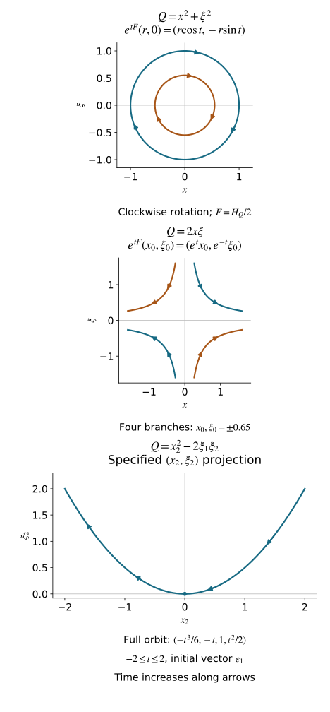

# Quadratic Hamilton maps and positive complex planes

A quadratic Hamiltonian gives a linear flow. A symplectic coordinate change conjugates that flow, preserving information that an arbitrary change of basis can lose. We classify real nonnegative forms and forms with exactly one negative square, including their degenerate blocks. We then develop the positive complex planes associated with a quadratic form whose real part is positive.

We retain the symplectic conventions of [Phase space and generating families](../20261005-restored-phase-space/phase-space-and-generating-families.md) and the linear Lagrangian geometry developed in [Clean Lagrangian pairs and common transversals](../20261005-restored-clean-pairs/clean-lagrangian-pairs-and-common-transversals.md). The [spectral algebra companion](spectral-algebra-and-contour-projections.md) proves the polynomial-root, characteristic-identity, generalized-eigenspace, Jordan-chain and contour-projection arguments used here. Its A7–A9 give semidefinite Hermitian Cauchy–Schwarz, positive square roots, orthonormal bases and complete linear flows. Real symmetric diagonalization and singular inertia are proved in [U001 Q5](../20261004-free-stationary-phase/quadratic-stationary-phase.md) and [M0a](../20261004-free-intrinsic-graph/prerequisites/relative-maslov-line.md). Symplectic complements, bases and quotient dimensions are [G21–G23](../20261005-restored-phase-space/phase-space-and-generating-families.md). These finite algebra proofs also apply over the complex field; A0 supplies complex rank and basis constructions. The arguments use generalized eigenspaces and include repeated eigenvalues. The source is Hörmander III, Section 21.5, Definition 21.5.1 through Corollary 21.5.11 and its concluding decomposition, printed pages 321–328 / PDF pages 336–343 of the 1994 reprint. The [proof map](proof-map.json) binds every prerequisite to its current proof.

The coordinate changes here are ordinary real linear symplectic changes on a vector space. The quadratic forms have degree two under simultaneous scaling of all vector coordinates; no fiber-homogeneous coordinate assertion is being made.

## 1. The invariant Hamilton map

Let \(S\) be a real symplectic vector space of dimension \(2n\), with form \(\omega\). In ordered coordinates \(z=(x,\xi)\), put
\[
 \omega=\sum_jd\xi_j\wedge dx_j,\qquad
 J=\begin{pmatrix}0&-I\\ I&0\end{pmatrix},\qquad
 \omega(Y,X)=Y^TJX.
 \tag{1.1}
\]
Our Hamilton convention is \(\iota_{H_f}\omega=-df\).

First consider a vector field \(v\) vanishing at a point \(c\) of a manifold. Its derivative there is an intrinsic endomorphism of \(T_cS\). Indeed, if \(y=\chi(z)\), the transformed field is \(D\chi(z)v(z)\). Differentiating at \(c\) gives \(D\chi(c)Dv(c)\): the term involving \(D^2\chi\) vanishes because \(v(c)=0\). Thus its derivative changes by conjugacy. Equivalently, the adjoint endomorphism sends \(d\phi(c)\) to \(d(v\phi)(c)\); this depends only on \(d\phi(c)\).

**Definition 1.1 (Hamilton map).** For a real \(C^2\) function \(f\) with \(df(c)=0\), its Hamilton map is the derivative of \(H_f/2\) at \(c\). It depends only on the Hessian of \(f\) there. For a quadratic form
\[
 Q(X)=X^TBX,\qquad B^T=B,
\]
write its polarized form as \(Q(Y,X)=Y^TBX\). Its Hamilton map \(F\) is characterized by
\[
 \omega(Y,FX)=Q(Y,X),\qquad
 F=-JB,\qquad H_Q(X)=2FX.
 \tag{1.2}
\]
For a general \(f\) at the critical point, \(B=f''(c)/2\). In block notation,
\[
 F=\frac12
 \begin{pmatrix}
 f''_{\xi x}&f''_{\xi\xi}\\
 -f''_{xx}&-f''_{x\xi}
 \end{pmatrix}_{c}.
 \tag{1.3}
\]
The factor \(1/2\) removes the factor two arising from differentiating a quadratic form.

Symmetry of \(B\) gives
\[
 \omega(FX,Y)=-\omega(X,FY),\qquad F^TJ+JF=0.
 \tag{1.4}
\]
Conversely an endomorphism satisfying (1.4) has symmetric matrix \(JF\), so it arises from exactly one quadratic form by (1.2). If \(z=Cw\) and \(C^TJC=J\), then
\[
 B'=C^TBC,\qquad F'=C^{-1}FC.
 \tag{1.5}
\]
To verify the second identity, \(JC^{-1}=C^TJ\), so both \(JF'\) and \(B'\) equal \(C^TB C\). Consequently the spectrum, generalized eigenspace dimensions and Jordan lengths of \(F\) are symplectic invariants of \(Q\).

## 2. Spectral orthogonality, including Jordan chains

Extend \(S\), \(\omega\), \(Q\) and \(F\) complex linearly to \(S_{\mathbb C}\). The form \(\omega\) remains bilinear. Write \(V_\lambda\) for the full generalized eigenspace of \(F\) at \(\lambda\). The actual direct-sum decomposition, its invariant projections and the finite inverse on each other summand are proved in A1–A3 of the companion; A4 proves the full chain decomposition and its multiplicities.

**Lemma 2.1 (opposite eigenvalues pair).** If \(\lambda+\mu\ne0\), then
\[
 \omega(V_\lambda,V_\mu)=0.
 \tag{2.1}
\]
The pairing between \(V_\lambda\) and \(V_{-\lambda}\) is nondegenerate, and their dimensions are equal. The zero generalized eigenspace is symplectic. Each space \(V_\lambda\oplus V_{-\lambda}\), \(\lambda\ne0\), is symplectic; distinct such pairs are symplectically and quadratically orthogonal.

**Proof.** From (1.4), for every integer \(N\ge0\),
\[
 \omega((F+\mu)^NX,Y)=\omega(X,(-F+\mu)^NY).
 \tag{2.2}
\]
On \(V_\lambda\), \(F+\mu\) is invertible when \(\lambda+\mu\ne0\). On \(V_\mu\), the right-hand operator vanishes for sufficiently large \(N\). As the left-hand arguments run through all of \(V_\lambda\), (2.1) follows.

If \(X\in V_\lambda\) pairs to zero also with \(V_{-\lambda}\), it pairs to zero with every generalized eigenspace. Their direct sum is \(S_{\mathbb C}\), so nondegeneracy of \(\omega\) gives \(X=0\). The same argument with the two spaces exchanged proves the nondegenerate dual pairing and equality of dimensions. For \(\lambda\ne0\), each individual space is isotropic by (2.1), and the pairing makes their sum symplectic. The argument for \(V_0\) is identical. Finally \(Q(X,Y)=\omega(X,FY)\); an invariant symplectically orthogonal splitting is therefore \(Q\)-orthogonal. □

For real \(Q\), complex conjugation sends \(V_\lambda\) onto \(V_{\bar\lambda}\). The associated real invariant subspaces inherit the splitting. In particular, non-real eigenvalues ordinarily occur in the set \(\lambda,-\lambda,\bar\lambda,-\bar\lambda\); the signature restrictions below will rule out some of these possibilities.

## 3. Real blocks and the four-step nilpotent mechanism

For this section assume that \(Q\) is real and its negative index is at most one. Its radical is
\[
 \operatorname{Rad}Q=\{X:Q(X,Y)=0\text{ for every }Y\}=\ker F.
 \tag{3.1}
\]

**Lemma 3.1 (a signature obstruction).** If a real subspace \(E\) satisfies \(Q\le0\) on \(E\) and \(E\cap\operatorname{Rad}Q=0\), then \(\dim E\le1\). If \(Q\ge0\) on all of \(S\), such an \(E\) is zero.

**Proof.** Diagonalize the real symmetric form by an arbitrary real basis, only for this argument. It is a sum of positive squares, at most one negative square, and zero coordinates. The projection from \(E\) to the negative coordinate is injective: if that coordinate vanishes, \(Q\le0\) forces every positive coordinate to vanish too, placing the vector in the radical. Thus \(\dim E\) is at most the number of negative squares. □

We now split off invariant symplectic blocks; their orthogonal complements are invariant by (1.4).

**Real eigenvalues.** Suppose \(\operatorname{Re}\lambda\ne0\). The real subspace \(\operatorname{Re}V_\lambda\) is \(Q\)-null. For non-real \(\lambda\), all pairings among \(V_\lambda\) and \(V_{\bar\lambda}\) vanish by Lemma 2.1; for real \(\lambda\), the same assertion uses just \(V_\lambda\). Also this real subspace has no intersection with \(\ker F\). If \(\lambda\) is non-real, its real dimension is twice \(\dim_{\mathbb C}V_\lambda\), contradicting Lemma 3.1. Hence \(\lambda\) is real and \(V_\lambda\) is one-dimensional. Choose real eigenvectors \(e,\varepsilon\) in the dual opposite spaces with \(\omega(\varepsilon,e)=1\). Then
\[
 Fe=\lambda e,\qquad F\varepsilon=-\lambda\varepsilon,\qquad
 Q(xe+\xi\varepsilon)=2\lambda x\xi.
 \tag{3.2}
\]
Exchanging the canonical pair by \((e,\varepsilon)\mapsto(\varepsilon,-e)\) changes the sign of \(\lambda\), so take \(\lambda>0\). This block has one positive and one negative square. It consumes the available negative square, and the orthogonal complement is nonnegative. For a nonnegative \(Q\), no real nonzero eigenvalue occurs.

**Imaginary eigenvalues.** Let \(FX=i\mu X\), \(\mu>0\), and write \(X=X_1+iX_2\) with real vectors. The two vectors are independent and their span has no intersection with \(\ker F\). The eigenvector equation gives \(FX_1=-\mu X_2\), \(FX_2=\mu X_1\), and
\[
 \begin{aligned}
 Q(\bar X,X)&=-2\mu\omega(X_1,X_2),\\
 Q(t_1X_1+t_2X_2)&=-\mu\omega(X_1,X_2)(t_1^2+t_2^2).
 \end{aligned}
 \tag{3.3}
\]
If \(\omega(X_1,X_2)\ge0\), this is a nonpositive two-plane disjoint from the radical, contradicting Lemma 3.1. Normalize \(\omega(X_1,X_2)=-1\). In the canonical basis \(e=X_1,\varepsilon=X_2\), the block is
\[
 Q=\mu(x^2+\xi^2),\qquad F(x,\xi)=(\mu\xi,-\mu x).
 \tag{3.4}
\]
The plane is invariant and symplectic. Split it off and repeat on its invariant complement. At each stage a nonzero imaginary eigenvalue supplies an eigenvector there. This induction exhausts the nonzero imaginary spectral spaces, including repeated frequencies, and proves that there are no nontrivial Jordan blocks at these eigenvalues. It does not assume their semisimplicity in advance.

**Rank-one and zero blocks.** The residual real generalized zero space is symplectic, and \(F\) is nilpotent on it. If \(F^2X=0\) and \(a=Q(X)\ne0\), then \(X,FX\) span an invariant symplectic two-plane, since \(\omega(X,FX)=a\). Set
\[
 e=\frac{X}{\sqrt{|a|}},\qquad
 \varepsilon=-\frac{FX}{\operatorname{sgn}(a)\sqrt{|a|}}.
 \tag{3.5}
\]
Then \(\omega(\varepsilon,e)=1\), \(Fe=-\operatorname{sgn}(a)\varepsilon\), \(F\varepsilon=0\), and \(Q=\operatorname{sgn}(a)x^2\) on the plane. If instead \(\ker F\) contains a symplectic pair, split off its plane; \(F\) and \(Q\) are zero there. Repeat these operations on invariant complements.

**The residual chain.** If a nonzero remainder survives, it has
\[
 \ker F\text{ isotropic},\qquad Q=0\text{ on }\ker F^2.
 \tag{3.6}
\]
A complement of \(\ker F\) in \(\ker F^2\) is \(Q\)-null and disjoint from the radical, so its dimension is at most one by Lemma 3.1. The identity
\[
 \operatorname{im}F=(\ker F)^\omega
 \tag{3.7}
\]
follows from (1.4) and equality of dimensions. Isotropy gives \(\ker F\subset\operatorname{im}F\). Hence \(F:\ker F^2\to\ker F\) is onto, with kernel \(\ker F\), and
\[
 0\longrightarrow\ker F\longrightarrow\ker F^2
 \xrightarrow{F}\ker F\longrightarrow0
 \tag{3.8}
\]
is exact. Thus \(\dim\ker F\le1\). Nilpotence on a nonzero space forces a nonzero kernel. The invariant chain projection (A7) proves the chain decomposition without assuming it: each chain contributes exactly one kernel vector. Hence there is precisely one Jordan chain
\[
 X,FX,\ldots,F^{N-1}X,\qquad F^NX=0.
 \tag{3.9}
\]
The dimension \(N\) is even because the remainder is symplectic. It exceeds two: otherwise \(F^2=0\), and (3.6) would make \(Q=0\) on the entire remainder, hence \(F=0\), incompatible with a nonzero symplectic space having isotropic kernel.

Moving powers of \(F\) across \(\omega\) gives the exact formula
\[
 Q(F^jX,F^kX)=(-1)^j\omega(X,F^{j+k+1}X).
 \tag{3.10}
\]
If \(N\ge6\), this vanishes on the two-plane spanned by \(F^{N-3}X,F^{N-2}X\), because the smallest exponent is \(2N-5\ge N\). That plane is disjoint from \(\ker F=\mathbb RF^{N-1}X\), contradicting Lemma 3.1. Therefore \(N=4\).

Put \(b=\omega(X,F^3X)\). On \(\operatorname{span}(FX,F^2X)\), the form is \(\operatorname{diag}(-b,0)\) by (3.10), and that plane again misses the radical. Thus \(b<0\). Scale \(X\) to make \(b=-1\), and set
\[
 Y=X+tF^2X,\qquad t=\frac12\omega(X,FX).
 \tag{3.11}
\]
Here \(\omega(Y,F^3Y)=-1\) and \(\omega(Y,FY)=\omega(X,FX)-2t=0\). Define
\[
 e_1=-F^3Y,\quad e_2=-FY,\quad
 \varepsilon_1=Y,\quad\varepsilon_2=F^2Y.
 \tag{3.12}
\]
The two diagonal pairings \(\omega(\varepsilon_j,e_j)\) equal one. The same-type pairings vanish by (3.11) or \(F^4=0\). The off-diagonal mixed pairings vanish because \(\omega(Y,F^2Y)=0\), which follows from (1.4) and alternation. Thus this is a canonical basis. Its Hamilton map is
\[
 Fe_1=0,\quad Fe_2=-\varepsilon_2,\quad
 F\varepsilon_1=-e_2,\quad F\varepsilon_2=-e_1.
 \tag{3.13}
\]
Using \(Q(Z)=\omega(Z,FZ)\), the block is exactly
\[
 Q=x_2^2-2\xi_1\xi_2.
 \tag{3.14}
\]
It has two positive squares, one negative square and one radical direction. Its single Jordan chain has length four. This completes the exhaustion of all residual blocks under the stated signature hypothesis.

## 4. The complete real classification

**Theorem 4.1 (nonnegative and index-one forms).** A real nonnegative quadratic form on a \(2n\)-dimensional symplectic space has canonical coordinates in which
\[
 Q=\sum_{j=1}^{k}\mu_j(x_j^2+\xi_j^2)
      +\sum_{j=k+1}^{k+l}x_j^2,
 \qquad \mu_j>0,\quad k+l\le n.
 \tag{4.1}
\]
The unused pairs are zero blocks. If the negative index is exactly one, its canonical form is the nonnegative portion in (4.1) plus precisely one of
\[
 \begin{array}{ll}
 -x_n^2,&k+l<n,\\
 2\lambda x_n\xi_n,\quad\lambda>0,&k+l<n,\\
 x_n^2-2\xi_{n-1}\xi_n,&k+l<n-1.
 \end{array}
 \tag{4.2}
\]
The three types are inequivalent. Within a type, the dimension, the listed positive frequencies with multiplicities, the number of positive rank-one blocks, and \(\lambda\) when present determine the symplectic equivalence class, up to reordering equal types of pairs.

**Proof.** Section 3 constructs invariant symplectic blocks until the dimension is exhausted. Each complement remains real, symplectic and of negative index at most one, so its argument applies repeatedly. In the nonnegative case only positive oscillators, positive rank-one blocks and zero pairs can occur. In the index-one case exactly one block uses the negative square. These are precisely the three choices in (4.2); the others must be nonnegative. Their sizes give the displayed dimension constraints.

The eigenvalues on the positive imaginary axis are exactly \(i\mu_j\), counted with multiplicity. The hyperbolic block adds the real eigenvalues \(\pm\lambda\). The four-dimensional block adds a Jordan chain of length four at zero. In the remaining negative rank-one case there is no such real pair or length-four chain; its negative square is detected by inertia. These invariants separate the three types. Each positive rank-one block has a length-two zero chain, and each unused zero pair has two length-one chains. After the type is fixed, the zero Jordan data and dimension determine their counts. In the negative rank-one type, one of the length-two chains belongs to that negative block. Conversely, if these data agree, reorder the canonical blocks and map their displayed canonical bases to one another. This is a symplectic change and preserves the displayed form. □

The theorem is a complete classification under these two signature hypotheses. Forms with two or more negative squares can have longer real Jordan blocks and complex quartets; Lemma 3.1 is the step that fails in that wider setting.

**Example 4.2 (frequencies survive).** For \(a,c>0\) and \(ac-b^2>0\),
\[
 Q=ax^2+2bx\xi+c\xi^2
\]
has frequency \(\mu=\sqrt{ac-b^2}\), because \(F=\begin{pmatrix}b&c\\-a&-b\end{pmatrix}\) has eigenvalues \(\pm i\mu\). The canonical shear \(\eta=\xi+(b/c)x\), followed by \(y=rx,\nu=\eta/r\) with \(r^4=(ac-b^2)/c^2\), gives \(Q=\mu(y^2+\nu^2)\). Its one-form satisfies \(\nu\,dy=\xi\,dx+d(bx^2/(2c))\), so the whole change is symplectic. Different \(\mu\)'s cannot be removed by a symplectic change.

**Example 4.3 (the actual nilpotent orbit).** For (3.14),
\[
 F(x_1,x_2,\xi_1,\xi_2)=(-\xi_2,-\xi_1,0,-x_2).
\]
Starting at \(\varepsilon_1=(0,0,1,0)\), its half-Hamiltonian flow is
\[
 e^{tF}\varepsilon_1=\left(-\frac{t^3}{6},-t,1,\frac{t^2}{2}\right).
 \tag{4.3}
\]
Substitution gives \(Q=0\) for every real \(t\). The full Hamiltonian flow uses \(2F\), so the parameter in (4.3) would be replaced by \(2t\).

**Figure 4.1.** The first two panels show exact orbits of \(F=H_Q/2\) for the unit oscillator and unit real hyperbolic block, with arrows in increasing flow time. The third shows only the \((x_2,\xi_2)\) projection of the exact four-coordinate orbit (4.3); the omitted coordinates are given explicitly. A projected parabola alone does not encode the full length-four chain. The formulas (3.12)–(3.14) identify that chain and its symplectic form. All curves are original plots of the stated formulas.

## 5. Sectorial complex forms, kernels and reduction

Now allow \(Q=P+iR\) to be complex valued, with real quadratic forms \(P,R\). Assume \(P\ge0\) and that for some finite \(C\ge0\),
\[
 |R(U)|\le C P(U)\quad(U\in S),\qquad
 \Gamma=\{w\in\mathbb C:|\operatorname{Im}w|\le C\operatorname{Re}w\}.
 \tag{5.1}
\]
The nonnegative-real-part hypothesis is retained also when \(C=0\); the inequality alone would then impose no sign on a real form. The closed convex sector \(\Gamma\) contains all real-vector values of \(Q\). The Hamilton map \(F=-JB\) is complex linear; it need not preserve the real space \(S\).

**Theorem 5.1 (sectorial kernel and spectrum).** Under (5.1), for \(X\in S_{\mathbb C}\),
\[
 \begin{aligned}
 Q(\bar X,X)=0
 &\Longleftrightarrow FX=0\\
 &\Longleftrightarrow F\operatorname{Re}X=F\operatorname{Im}X=0
 \Longleftrightarrow\bar F X=0.
 \end{aligned}
 \tag{5.2}
\]
Thus \(\ker F\) is spanned by its real elements. On the zero generalized eigenspace, \(F^2V_0=0\), and
\[
 V_0=\ker F^2
 =\{X:Q(X,Y)=0\text{ whenever }\omega(\ker F,Y)=0\}.
 \tag{5.3}
\]
Every eigenvalue satisfies
\[
 \lambda/i\in\Gamma\ \text{or}\ \lambda/i\in-\Gamma.
 \tag{5.4}
\]

**Proof.** We first identify the real radical. If \(P(U)=0\), then (5.1) gives \(R(U)=0\). For a real nonnegative quadratic form \(A\), \(A(U)=0\) implies \(A(U,Y)=0\) for all real \(Y\): the quadratic polynomial \(A(U+tY)\) would otherwise have a nonzero linear term and take negative values for one sign of small \(t\). Apply this to \(P\). To get the same conclusion for \(R\), choose any small nonzero real \(\varepsilon\) with \(|\varepsilon|C<1\). The form
\[
 \operatorname{Re}((1+i\varepsilon)Q)=P-\varepsilon R
\]
is nonnegative and vanishes at \(U\); its polarized row there is zero. Together with the row of \(P\), this gives \(R(U,Y)=0\). Therefore
\[
 \ker P=\{U\in S:Q(U,Y)=0\text{ for every real }Y\}.
 \tag{5.5}
\]
Here \(\ker P\) means the radical of the polarized real form, equivalently its zero set because it is nonnegative.

For \(X=U+iV\), symmetry and bilinearity give
\[
 Q(\bar X,X)=Q(U)+Q(V).
 \tag{5.6}
\]
If this is zero, its real part is \(P(U)+P(V)=0\). Both vectors belong to (5.5), hence \(FU=FV=0\), and therefore \(FX=0\). Conversely \(FX=0\) implies \(Q(\bar X,X)=\omega(\bar X,FX)=0\). This also shows that \(FX=0\) forces its two real components separately into the kernel. The real vectors in that kernel are in the common radical of \(P,R\), so they are also killed by \(\bar F\). Applying the same reasoning to \(\bar Q\), which satisfies the same bound, proves the reverse implication from \(\bar F X=0\). This establishes every equivalence in (5.2).

If \(F^3X=0\), then \(F^2X\in\ker F\), and (5.2) gives \(\bar F F^2X=0\). Using (1.4) for \(\bar F\),
\[
 Q(\overline{FX},FX)
 =\omega(\overline{FX},F^2X)
 =-\omega(\bar X,\bar F F^2X)=0.
 \tag{5.7}
\]
Apply (5.2) to \(FX\) to obtain \(F^2X=0\). Thus no Jordan chain at zero has length three or more: such a chain would contain a vector with \(F^3X=0\), \(F^2X\ne0\). Hence \(V_0=\ker F^2\) and \(F^2V_0=0\).

Identity (3.7) remains valid over the complex numbers. For \(Y\in(\ker F)^\omega\), write \(Y=FZ\). Then
\[
 Q(X,Y)=\omega(X,F^2Z)=\omega(F^2X,Z).
 \tag{5.8}
\]
This vanishes for all \(Z\) exactly when \(F^2X=0\), proving (5.3).

Finally let \(FX=\lambda X\), \(X=U+iV\ne0\), with \(\lambda\ne0\). Then
\[
 Q(U)+Q(V)=Q(\bar X,X)=2i\lambda\omega(U,V).
 \tag{5.9}
\]
The left side belongs to \(\Gamma\), by convexity and (5.1). The real scalar \(\omega(U,V)\) is nonzero: if it were zero, (5.2) would give \(FX=0\), a contradiction. Dividing (5.9) by this scalar gives (5.4), with the sign depending on the scalar. For \(\lambda=0\), (5.4) holds trivially. □

In particular a nonzero eigenvalue never lies on the real axis: a purely imaginary number in \(\Gamma\cup-\Gamma\) must be zero. The theorem permits nontrivial Jordan blocks at nonzero complex eigenvalues. The real semidefinite conclusion in Section 3 does not assert their absence here.

**Proposition 5.2 (remove the real radical symplectically).** Set
\[
 W=S\cap\ker F,\qquad
 S'=W^\omega/(W\cap W^\omega).
 \tag{5.10}
\]
This is a real symplectic space. The form \(Q\) descends to \(Q'\) there, satisfying (5.1), and \(\operatorname{Re}Q'\) is positive definite. Its Hamilton map is isomorphic, after complexification, to the restriction of \(F\) to the sum of its nonzero generalized eigenspaces.

**Proof.** The radical of \(\omega|_{W^\omega}\) is \(W^\omega\cap(W^\omega)^\omega=W^\omega\cap W\). Quotienting by precisely this radical gives a nondegenerate alternating form. Every vector of \(W\) is in the quadratic radical (5.5), so adding a vector of \(W\cap W^\omega\) changes neither \(Q\) nor its polarized values. Thus \(Q'\) is well-defined, as is the bound (5.1). If a real representative \(U\in W^\omega\) has \(P(U)=0\), (5.5) puts \(U\) in \(W\cap W^\omega\); its quotient class is zero. This proves strict real positivity.

By (5.2), \(\ker F=W_{\mathbb C}\). Hence \((W^\omega)_{\mathbb C}=\operatorname{im}F\), and
\[
 S'_{\mathbb C}
 =\operatorname{im}F/(\ker F\cap\operatorname{im}F)
 \simeq\bigoplus_{\lambda\ne0}V_\lambda.
 \tag{5.11}
\]
To verify the last isomorphism, split into \(V_0\) and the nonzero spectral sum. On the latter, \(F\) is invertible. On \(V_0\), \(F^2=0\), so its image is exactly the part removed by the intersection with the kernel. Both the symplectic form and the quadratic form agree under this identification by spectral orthogonality. The defining identity (1.2) therefore identifies the induced Hamilton map with the nonzero restriction of \(F\). □

The quotient in (5.10) uses the symplectic orthogonal space. The quotient \(S/W\) need not carry a symplectic form and does not give this construction.

## 6. A strictly positive spectral plane

For a complex subspace of \(S_{\mathbb C}\), introduce the Hermitian form
\[
 h(X,Y)=i\omega(\bar Y,X).
 \tag{6.1}
\]
It is linear in its first argument and conjugate linear in its second; alternation of \(\omega\) gives \(h(Y,X)=\overline{h(X,Y)}\). A complex Lagrangian plane \(\Lambda\) is **positive** when \(h(X,X)\ge0\) for \(X\in\Lambda\), and **strictly positive** when equality forces \(X=0\).

**Theorem 6.1 (positive spectral plane).** If \(\operatorname{Re}Q\) is positive definite, then
\[
 S^+=\bigoplus_{\operatorname{Im}\lambda>0}V_\lambda
     =\bigoplus_{\lambda\in i\Gamma}V_\lambda
 \tag{6.2}
\]
is an \(F\)-invariant, strictly positive Lagrangian plane. For its Hermitian form, the numerical range satisfies
\[
 \frac{h(FX,X)}{h(X,X)}\in i\Gamma
 \qquad(0\ne X\in S^+).
 \tag{6.3}
\]
Some finite \(C\) as in (5.1) always exists under this strict hypothesis.

**Proof.** On the real unit sphere, \(P\) has a positive minimum and \(|R|\) a finite maximum; their ratio gives such a \(C\). Theorem 5.1 excludes zero and real eigenvalues. Lemma 2.1 pairs the upper spectral spaces with the lower ones with equal dimensions. The sum in (6.2) thus has dimension \(n\) and is isotropic, since two upper eigenvalues cannot sum to zero. It is Lagrangian and invariant.

When \(Q\) is real positive definite, Theorem 4.1 gives only oscillator blocks. On each such block the upper eigenvector has \(\xi=ix\). Thus
\[
 S^+=\{(x,ix):x\in\mathbb C^n\},\qquad h(X,X)=2\sum_j|x_j|^2>0.
 \tag{6.4}
\]
For the general form use \(Q_t=P+itR\), \(0\le t\le1\), with Hamilton map \(F_t\). Every \(Q_t\) has the same positive real part and a uniform sector bound. Its spectrum avoids the real axis. Here is the common-domain spectral argument. Bound \(\|F_t\|\le M\) by continuity on the compact parameter interval. Every eigenvalue obeys \(|\lambda|\le M\). If no uniform positive imaginary-part bound existed, a convergent subsequence of pairs \((t_j,\lambda_j)\) would have a real limiting \(\lambda\) and \(\det(\lambda I-F_t)=0\) by determinant continuity, contradicting the spectral exclusion. Thus \(|\operatorname{Im}\lambda|\ge\delta>0\). Companion A6 constructs an actual common circle: with \(L=M^2/\delta+\delta\) and radius \(L-\delta/2\), the circle centered at \(iL\) lies in the upper half-plane and encloses all upper spectra. Choose this one simple closed contour \(\gamma\) in the upper half-plane, enclosing all upper spectra and none of the lower spectra for all \(t\), with **counterclockwise** orientation. Then
\[
 \Pi_t=\frac{1}{2\pi i}\oint_\gamma(zI-F_t)^{-1}\,dz
 \tag{6.5}
\]
is a continuous family of rank-\(n\) projections onto the upper generalized spectral sum. This assertion does not require choosing individual eigenvectors: on a Jordan block \(\lambda I+N\), the resolvent is \(\sum_{j\ge0}N^j(z-\lambda)^{-j-1}\), and the direct circle calculation A5 proves that the integral is the identity if \(\lambda\) is inside, zero if outside. The integrand is uniformly continuous in \(t\) on the fixed contour. This proves continuity and the claimed range.

Strict positivity is open for this family of planes, by the positive compact-sphere lower bound in companion A7. For instance, near a fixed \(t_0\), \(\Pi_t\) applied to a basis of \(\operatorname{ran}\Pi_{t_0}\) stays a basis of \(\operatorname{ran}\Pi_t\); its Hermitian Gram matrix varies continuously. Suppose now \(t_j\to t\) and these planes are strictly positive. For each \(X\in\operatorname{ran}\Pi_t\), the vectors \(\Pi_{t_j}X\) tend to \(X\), so \(h\ge0\) on the limiting plane. If \(h(X,X)=0\), the semidefinite Cauchy–Schwarz inequality proved in A7 gives \(h(F_tX,X)=0\), because \(F_tX\) lies in that plane. But
\[
 h(F_tX,X)=iQ_t(\bar X,X).
 \tag{6.6}
\]
Its vanishing implies \(X=0\) by (5.2) and strict positivity of \(P\). Thus the limiting plane is also strictly positive. The set of \(t\) with the desired property is nonempty by (6.4), open and closed in \([0,1]\); it is the whole interval. This proves strict positivity at \(t=1\), even through repeated eigenvalues and Jordan degeneracies.

For the numerical range, write \(X=U+iV\). Equations (5.6) and (6.6) give \(h(FX,X)=i(Q(U)+Q(V))\). The sum belongs to the convex sector \(\Gamma\), and \(h(X,X)>0\). Division by this positive scalar proves (6.3). □

Formula (6.5) states both its resolvent sign and its orientation. Using \((F_t-zI)^{-1}\) instead requires the opposite prefactor or the opposite orientation. The positivity proof uses a whole spectral plane, so it also covers a nonsemisimple example developed in Section 10.

## 7. The compatible complex structure and metric

The construction in this section applies to every strictly positive complex Lagrangian plane, whether it arose from a quadratic form or was given independently.

**Theorem 7.1 (unique compatible Hermitian structure).** If \(\Lambda\subset S_{\mathbb C}\) is strictly positive Lagrangian, the real-part map \(r:\Lambda\to S\) is a real-linear bijection. It induces a complex structure \(I\) on \(S\) by
\[
 I(rX)=r(iX)=-\operatorname{Im}X.
 \tag{7.1}
\]
There is a unique positive definite Hermitian form \(H\), linear in its first argument with respect to \(I\), such that
\[
 \operatorname{Im}H(U,V)=-\omega(U,V)
 \quad(U,V\in S).
 \tag{7.2}
\]
Its real part and its expression on \(\Lambda\) are
\[
 g(U,V)=\omega(U,IV),\qquad
 H(rX,rY)=\frac{i}{2}\omega(\bar Y,X).
 \tag{7.3}
\]

**Proof.** For \(X=U+iV\in\Lambda\),
\[
 h(X,X)=2\omega(V,U).
 \tag{7.4}
\]
If \(rX=U=0\), this is zero, hence \(X=0\). The real dimensions of \(\Lambda\) and \(S\) are both \(2n\), so \(r\) is a bijection. Transporting multiplication by \(i\) through it gives (7.1) and \(I^2=-1\). The inverse map is
\[
 Z(U)=U-iIU\in\Lambda.
 \tag{7.5}
\]
Expand \(\omega(Z(U),Z(V))=0\). Its real and imaginary parts yield
\[
 \omega(IU,IV)=\omega(U,V),\qquad
 \omega(IU,V)=-\omega(U,IV).
 \tag{7.6}
\]
Consequently \(g(U,V)=\omega(U,IV)\) is symmetric, and (7.4) gives \(h(Z(U),Z(U))=2g(U,U)\). It is positive definite.

Define \(H(U,V)=g(U,V)-i\omega(U,V)\). Symmetry of \(g\) and alternation of \(\omega\) give Hermitian symmetry. Identities (7.6) give \(H(IU,V)=iH(U,V)\), and hence \(H(U,IV)=-iH(U,V)\); thus it has the required complex linearities. It is positive definite and satisfies (7.2). Expanding \(i\omega(\overline{Z(V)},Z(U))/2\) gives exactly \(g(U,V)-i\omega(U,V)\), proving (7.3).

For uniqueness, a Hermitian form satisfying (7.2) must obey \(H(U,IV)=-iH(U,V)\). Taking imaginary parts gives \(-\operatorname{Re}H(U,V)=-\omega(U,IV)\). Its real part must therefore be \(g\), while its imaginary part was prescribed. □

**Corollary 7.2 (coordinates adapted to a real and a positive plane).** Given a real Lagrangian plane \(L\subset S\) and a strictly positive complex Lagrangian plane \(\Lambda\), there are real canonical coordinates such that
\[
 L=\{x=0\},\qquad\Lambda=\{(x,ix):x\in\mathbb C^n\}.
 \tag{7.7}
\]

**Proof.** Use the explicit Gram–Schmidt construction A8 to choose a \(g\)-orthonormal real basis \(\varepsilon_1,\ldots,\varepsilon_n\) of \(L\), and put \(e_j=I\varepsilon_j\). Since \(L\) is Lagrangian and \(I\) preserves \(\omega\), both \(\omega(\varepsilon_j,\varepsilon_k)\) and \(\omega(e_j,e_k)\) vanish. Also
\[
 \omega(\varepsilon_j,e_k)=g(\varepsilon_j,\varepsilon_k)=\delta_{jk}.
\]
Thus \((e_1,\ldots,e_n,\varepsilon_1,\ldots,\varepsilon_n)\) is a real canonical basis, and \(L\) is its momentum plane. By (7.5), \(\varepsilon_j-ie_j\in\Lambda\), so multiplying these vectors by \(i\) gives the spanning vectors \(e_j+i\varepsilon_j\). This is the graph in (7.7). □

Apply the corollary to \(\Lambda=S^+\) from Theorem 6.1. Invariance and isotropy give \(Q(X)=\omega(X,FX)=0\) on that plane. In the adapted coordinates, the complex polynomial \(Q\) therefore belongs to the ideal
\[
 (x_1+i\xi_1,\ldots,x_n+i\xi_n).
 \tag{7.8}
\]
For completeness, the invertible complex linear variables \(u=x+i\xi\), \(v=x-i\xi\) identify the plane with \(u=0\). A quadratic polynomial vanishing there has no terms involving only \(v\). Every remaining monomial contains some \(u_j\), so \(Q=\sum_j u_j\ell_j(u,v)\), with linear \(\ell_j\). This is a statement about a complex polynomial on a complex plane.

## 8. Positive graph matrices in arbitrary coordinates

**Proposition 8.1 (graph criterion).** In any real canonical coordinates, a strictly positive complex Lagrangian plane is the graph
\[
 \Lambda=\{(z,Az):z\in\mathbb C^n\},\qquad
 A=A_1+iA_2,\quad A_j^T=A_j\text{ real},\quad A_2>0.
 \tag{8.1}
\]
Conversely every matrix in (8.1) defines such a plane.

**Proof.** A vertical vector \(X=(0,\xi)\) has \(h(X,X)=0\). Strict positivity excludes any nonzero such vector in \(\Lambda\). Projection of the \(n\)-dimensional plane to the \(n\)-dimensional position space is thus a bijection, so it is a graph. For graph vectors,
\[
 \omega((z,Az),(w,Aw))=z^T(A^T-A)w.
\]
The graph is Lagrangian precisely when \(A^T=A\). Its Hermitian diagonal is
\[
 h((z,Az),(z,Az))=2\bar z^T A_2z.
 \tag{8.2}
\]
Thus strict positivity is equivalent to \(A_2>0\). Both implications follow, including nondegeneracy and the exact factor two. □

The whole real symplectic coordinate change normalizing this graph is explicit. Let \(D=A_2^{1/2}\) be the positive real symmetric square root constructed from the proved real diagonalization in companion A8. Set
\[
 y=Dx,\qquad \eta=D^{-1}(\xi-A_1x).
 \tag{8.3}
\]
Then
\[
 \eta^Tdy=\xi^Tdx-d\left(\frac12x^TA_1x\right),
 \tag{8.4}
\]
so differentiation gives \(\sum d\eta_j\wedge dy_j=\sum d\xi_j\wedge dx_j\). On the graph, \(\eta=iDx=iy\). This verifies the change on the entire real vector space as well as on the plane.

The compatible structure and metric can also be read directly from \(A\). For a real vector \(U=(u,v)\), the real part of \((z,Az)\), with \(z=a+ib\), is \((a,A_1a-A_2b)\). Hence \(a=u\), \(b=A_2^{-1}(A_1u-v)\). Multiplication by \(i\), followed by taking the real part, gives
\[
 I=
 \begin{pmatrix}
 -A_2^{-1}A_1&A_2^{-1}\\
 -A_2-A_1A_2^{-1}A_1&A_1A_2^{-1}
 \end{pmatrix}.
 \tag{8.5}
\]
In particular \(I^2=-1\), \(I^TJI=J\), and \(g\) has matrix \(JI\). Its diagonal is the positive expression
\[
 g((u,v),(u,v))
 =u^TA_2u+(v-A_1u)^TA_2^{-1}(v-A_1u).
 \tag{8.6}
\]
This also verifies the metric without having to guess a Euclidean structure first.

## 9. Non-strict positivity and its real part

**Theorem 9.1 (reduce a positive plane).** Let \(\Lambda\subset S_{\mathbb C}\) be positive Lagrangian, and let
\[
 L_{\mathbb R}=\Lambda\cap S,\qquad r=\dim_{\mathbb R}L_{\mathbb R}.
\]
This is real isotropic. The nullspace of \(h|_\Lambda\) is exactly \((L_{\mathbb R})_{\mathbb C}\). The image of \(\Lambda\) in
\[
 S'=L_{\mathbb R}^\omega/L_{\mathbb R}
 \tag{9.1}
\]
is a strictly positive Lagrangian plane. There is also a real symplectically orthogonal splitting \(S=S_1\oplus S_2\) for which \(L_{\mathbb R}\) is Lagrangian in \(S_1\) and
\[
 \Lambda=(L_{\mathbb R})_{\mathbb C}\oplus\Lambda_2,
 \qquad \Lambda_2\subset(S_2)_{\mathbb C}\text{ strictly positive Lagrangian}.
 \tag{9.2}
\]

**Proof.** A semidefinite Hermitian form satisfies Cauchy–Schwarz. This follows, including null vectors, by applying nonnegativity to \(X+tY\) for all complex \(t\): if \(h(X,X)=0\) and \(h(Y,X)\ne0\), choose a small \(t\) with its linear term negative. Thus a null vector \(X\in\Lambda\) satisfies \(h(Y,X)=i\omega(\bar X,Y)=0\) for all \(Y\in\Lambda\). Since a Lagrangian plane equals its symplectic orthogonal, \(\bar X\in\Lambda\). Hence \(\operatorname{Re}X,\operatorname{Im}X\in L_{\mathbb R}\). Conversely for real \(U\in\Lambda\), isotropy gives \(h(Y,U)=i\omega(U,Y)=0\) for all \(Y\in\Lambda\). Its complex span is the whole nullspace.

Real vectors in \(L_{\mathbb R}\) pair to zero, so it is isotropic, and \(\Lambda\subset(L_{\mathbb R}^\omega)_{\mathbb C}\). The real quotient (9.1) is symplectic of dimension \(2(n-r)\): the radical of the restricted form is exactly \(L_{\mathbb R}\). The image of \(\Lambda\) has complex dimension \(n-r\), because its kernel is \((L_{\mathbb R})_{\mathbb C}\); it is isotropic and hence Lagrangian. Its Hermitian form descends, since these kernel vectors are null against all of \(\Lambda\). A null class has a null representative and hence lies in the kernel just identified; its class is zero. This proves strict positivity.

For the direct-sum version, complete a real basis \(\varepsilon_1,\ldots,\varepsilon_r\) of \(L_{\mathbb R}\) to a real canonical basis. Such a completion follows by successively choosing a vector pairing to one with the first nonzero isotropic vector and continuing on that pair's symplectic orthogonal complement. At each step subtract components along the already chosen pairs to preserve their orthogonality. Let \(S_1\) be the span of the first \(r\) complete pairs, and \(S_2=S_1^\omega\). In these coordinates, orthogonality to \(L_{\mathbb R}\) is exactly \(x_1=\cdots=x_r=0\), so
\[
 L_{\mathbb R}^\omega=L_{\mathbb R}\oplus S_2.
\]
Every \(X\in\Lambda\) has a unique decomposition \(X=U+X_2\), \(U\in(L_{\mathbb R})_{\mathbb C}\), \(X_2\in(S_2)_{\mathbb C}\). Since \(U\in\Lambda\), also \(X_2\in\Lambda\). This proves (9.2), with \(\Lambda_2=\Lambda\cap(S_2)_{\mathbb C}\). Its dimension, isotropy and strict positivity are the quotient properties just proved. □

The theorem includes a real Lagrangian plane, where \(r=n\) and the quotient is zero, and a strictly positive plane, where \(r=0\). A positive plane with \(r>0\) can contain vertical vectors; Proposition 8.1 requires its strict hypothesis.

## 10. A positive plane with a nonsemisimple Hamilton map

Consider in dimension four
\[
 Q=x_1^2+x_2^2+\xi_1^2+\xi_2^2
    +(x_1+i\xi_1)(x_2-i\xi_2).
 \tag{10.1}
\]
Its real and imaginary parts are
\[
 P=|x|^2+|\xi|^2+x_1x_2+\xi_1\xi_2,\qquad
 R=\xi_1x_2-x_1\xi_2.
\]
The inequality \(2|ab|\le a^2+b^2\) gives \(P\ge\tfrac12(|x|^2+|\xi|^2)\) and \(|R|\le\tfrac12(|x|^2+|\xi|^2)\). Hence \(|R|\le P\), and \(P\) is positive definite. The plane \(\Lambda=\{\xi=ix\}\) is strictly positive. Direct differentiation of (10.1) yields, on this plane,
\[
 F(x,ix)=\left(iNx,i(iNx)\right),\qquad
 N=\begin{pmatrix}1&1\\0&1\end{pmatrix}.
 \tag{10.2}
\]
Thus \(F|_\Lambda\) is a single length-two Jordan block with eigenvalue \(i\). Its upper generalized spectral plane is exactly \(\Lambda\); the other spectral eigenvalue is \(-i\), by Lemma 2.1. The positive-plane theorem covers this example although a basis of upper eigenvectors alone cannot span its plane.

With \(h((x,ix),(x,ix))=2|x|^2\), its numerical range is
\[
 i+i\frac{\bar x_1x_2}{|x_1|^2+|x_2|^2},\qquad x\ne0.
 \tag{10.3}
\]
The fraction has modulus at most \(1/2\) by Cauchy–Schwarz, and every complex value of modulus at most \(1/2\) occurs: choose the relative phase and the nonnegative ratio \(|x_2|/|x_1|\), whose value \(t/(1+t^2)\) ranges from zero to \(1/2\). So this range is the closed disk centered at \(i\) with radius \(1/2\). It lies in \(i\Gamma\) for \(C=1\). This exhibits the numerical-range information beyond the repeated eigenvalue itself.

## 11. Graded exercises with complete solutions

**Exercise 1 (critical-point normalization).** Let \(f(x,\xi)=x^2+3\xi^2+2x^2\xi\). Find its Hamilton map at zero, its eigenvalues, and the derivative of its full Hamilton field there.

**Solution.** The first differential vanishes at zero. Its Hessian there is \(\operatorname{diag}(2,6)\), because the cubic term contributes zero. Thus
\[
 F=\begin{pmatrix}0&3\\-1&0\end{pmatrix},\qquad
 \operatorname{spec}F=\{i\sqrt3,-i\sqrt3\}.
\]
The full field is \(H_f=(6\xi+2x^2)\partial_x-(2x+4x\xi)\partial_\xi\), so its derivative at zero is \(2F\). Its linearized full-flow frequencies are \(2\sqrt3\), while the Hamilton map frequency is \(\sqrt3\); they refer to these two distinct time normalizations.

**Exercise 2 (an exact symplectic oscillator change).** For \(Q=5x^2+4x\xi+2\xi^2\), find a real symplectic change giving \(\mu(y^2+\eta^2)\), and verify its one-form identity.

**Solution.** Here \(a=5,b=2,c=2\), so \(ac-b^2=6\). Put \(r=(3/2)^{1/4}\), \(y=rx\), \(\eta=(\xi+x)/r\). Completing the square gives \(Q=3x^2+2(\xi+x)^2\), and \(r^2=\sqrt{3/2}\) makes both new coefficients \(\sqrt6\). Thus \(Q=\sqrt6(y^2+\eta^2)\). The exact identity \(\eta\,dy=(\xi+x)\,dx=\xi\,dx+d(x^2/2)\) proves symplecticity. The eigenvalues of \(F=\begin{pmatrix}2&2\\-5&-2\end{pmatrix}\) are \(\pm i\sqrt6\), so no canonical change can turn this into the unit-frequency oscillator.

**Exercise 3 (a Jordan block excluded by index one).** For \(\lambda>0\), let
\[
 A=\begin{pmatrix}\lambda&1\\0&\lambda\end{pmatrix},\qquad
 F=\begin{pmatrix}A&0\\0&-A^T\end{pmatrix}
\]
on \(\mathbb R^4\) with ordered \((x,\xi)\). Find its quadratic form and inertia. Identify its generalized opposite spaces and explain why it is outside Theorem 4.1.

**Solution.** Matrix multiplication gives \(JF=\begin{pmatrix}0&A^T\\A&0\end{pmatrix}\), which is symmetric. Therefore
\[
 Q=2\xi^TAx=2\lambda(x_1\xi_1+x_2\xi_2)+2x_2\xi_1.
\]
Since \(A\) is invertible, the arbitrary invertible real substitution \(u=Ax\) writes the form as \(2\xi^Tu\), of inertia \((2,2,0)\). This substitution is used only to compute inertia. The \(+\lambda\) generalized space is the position plane, with chain \(e_2\mapsto e_1\mapsto0\) under \(F-\lambda\); the \(-\lambda\) space is the momentum plane, with chain \(\varepsilon_1\mapsto-\varepsilon_2\mapsto0\) under \(F+\lambda\). Each is isotropic, and \(\omega(\varepsilon_j,e_k)=\delta_{jk}\) gives their nondegenerate dual pairing. The real eigenspace has a length-two Jordan block and its generalized dimension is two. Its two negative squares violate the index-one hypothesis, which is exactly where the exclusion argument in Section 3 was used.

**Exercise 4 (the whole nilpotent flow).** For \(Q=x_2^2-2\xi_1\xi_2\), compute \(e^{tF}\) on an arbitrary vector and verify that it is symplectic and preserves \(Q\).

**Solution.** The map is \(F(x_1,x_2,\xi_1,\xi_2)=(-\xi_2,-\xi_1,0,-x_2)\). Its fourth power is zero and its third power is nonzero, so the exponential terminates:
\[
 \begin{aligned}
 y_1&=x_1-t\xi_2+\frac{t^2}{2}x_2-\frac{t^3}{6}\xi_1,\\
 y_2&=x_2-t\xi_1,\\
 \eta_1&=\xi_1,\\
 \eta_2&=\xi_2-tx_2+\frac{t^2}{2}\xi_1.
 \end{aligned}
\]
If \(T_t=e^{tF}\), differentiating \(T_t^TJT_t\) gives \(T_t^T(F^TJ+JF)T_t=0\); at \(t=0\) it is \(J\). Thus the entire map is symplectic. Substitution gives
\[
 y_2^2-2\eta_1\eta_2
 =(x_2-t\xi_1)^2-2\xi_1(\xi_2-tx_2+t^2\xi_1/2)
 =x_2^2-2\xi_1\xi_2.
\]
The initial vector \(\varepsilon_1\) gives (4.3). The polynomial terms through degree three encode the actual length-four Jordan chain.

**Exercise 5 (same inertia, different canonical classes).** Compare \(Q_a=x_1^2+x_2^2-\xi_2^2\) with \(Q_b=x_2^2-2\xi_1\xi_2\). They have the same ordinary inertia. Are they symplectically equivalent?

**Solution.** Both have inertia \((2,1,1)\): for \(Q_b\), diagonalize \(-2\xi_1\xi_2\) as one positive and one negative square, leaving \(x_1\) radical. For \(Q_a\), the first pair is a positive rank-one block. The second has Hamilton matrix \(\begin{pmatrix}0&-1\\-1&0\end{pmatrix}\), with eigenvalues \(\pm1\). Thus the characteristic polynomial is \(\zeta^2(\zeta^2-1)\). For \(Q_b\), it is \(\zeta^4\), with one length-four Jordan block. Conjugate Hamilton maps have the same characteristic polynomial, so these forms are not symplectically equivalent. Ordinary inertia alone does not decide the canonical class.

**Exercise 6 (mixed block data).** On \(\mathbb R^8\), determine the inertia, rank, Hamilton spectrum and zero Jordan blocks of
\[
 Q=2(x_1^2+\xi_1^2)+3(x_2^2+\xi_2^2)+x_3^2-x_4^2.
\]

**Solution.** There are five positive squares, one negative square, and two radical directions \(\xi_3,\xi_4\). The inertia is \((5,1,2)\), with rank six. The first two pairs have eigenvalues \(\pm2i\) and \(\pm3i\). On the last two pairs, \(Fe_3=-\varepsilon_3\), \(Fe_4=\varepsilon_4\), and \(F\varepsilon_3=F\varepsilon_4=0\). They are two length-two chains at zero. Hence
\[
 \det(\zeta I-F)=\zeta^4(\zeta^2+4)(\zeta^2+9),\qquad
 \operatorname{rank}F=6,\quad\operatorname{rank}F^j=4\ (j\ge2).
\]
This is the negative rank-one alternative with \(k=2,l=1,n=4\), satisfying \(k+l<n\). The negative block does not create real nonzero eigenvalues.

**Exercise 7 (a degenerate sector and its quotient).** Let
\[
 Q=(1+i/3)x_1^2+(2+i/2)(x_2^2+\xi_2^2).
\]
Find a sharp sector constant, its real radical, \(V_0\), and the positive spectral plane on the symplectic quotient.

**Solution.** The real part is \(P=x_1^2+2(x_2^2+\xi_2^2)\), while the imaginary part is \(R=x_1^2/3+(x_2^2+\xi_2^2)/2\ge0\). The ratio is at most \(1/3\), attained on the \(x_1\) axis, so \(C=1/3\) is sharp. The common real radical is \(W=\mathbb R\varepsilon_1\). Its symplectic orthogonal is \(x_1=0\), and \(W^\omega/W\) has coordinates \((x_2,\xi_2)\), with the inherited form \(d\xi_2\wedge dx_2\). The descended form is \((2+i/2)(x_2^2+\xi_2^2)\). Its upper eigenvalue is \(-1/2+2i\), and its strictly positive plane is \(\xi_2=ix_2\). Before quotienting, \(V_0=\operatorname{span}_{\mathbb C}(e_1,\varepsilon_1)\), where \(Fe_1=-(1+i/3)\varepsilon_1\), \(F\varepsilon_1=0\). Thus \(F^2V_0=0\), but the original real part is not positive definite.

**Exercise 8 (why the sector hypotheses matter).** Give a quadratic form with nonnegative real part for which \(Q(\bar X,X)=0\) does not imply \(FX=0\). Also find a complex quadratic form whose Hamilton kernel is not spanned by real vectors. Identify the failed hypotheses in each example.

**Solution.** In dimension four take \(Q=x_1^2+i(\xi_1^2-\xi_2^2)\), with \(X=\varepsilon_1+i\varepsilon_2\). Its real part is nonnegative, and
\[
 Q(\bar X,X)=i-i=0,\qquad FX=ie_1+e_2\ne0.
\]
Its imaginary part is nonzero at a real vector with \(x_1=0\), so no finite bound \(|R|\le CP\) holds. This shows that real semidefiniteness alone does not give the scalar-zero implication in (5.2).

In dimension two take \(Q=(x+i\xi)^2\). Its symmetric matrix and Hamilton map are
\[
 B=\begin{pmatrix}1&i\\i&-1\end{pmatrix},\qquad
 F=\begin{pmatrix}i&-1\\-1&-i\end{pmatrix}.
\]
The kernel is the complex line spanned by \((1,i)\), with no nonzero real vector. Indeed \(F(1,i)=0\), but \(F(1,0)\ne0\) and \(F(0,1)\ne0\). Here \(P=x^2-\xi^2\) is indefinite, so even the nonnegative-real-part consequence of (5.1) fails. Neither example contradicts the sectorial theorem.

**Exercise 9 (a full positive graph and metric).** Let
\[
 A_1=\begin{pmatrix}1&2\\2&-1\end{pmatrix},\qquad
 A_2=\begin{pmatrix}2&1/3\\1/3&1\end{pmatrix}.
\]
Verify strict positivity of the graph of \(A=A_1+iA_2\), give its whole canonical normalization, and compute its compatible metric without unspecified matrix choices.

**Solution.** Both matrices are symmetric; \(A_2\)'s leading minors are \(2\) and \(17/9\), so it is positive definite. Proposition 8.1 gives a Lagrangian graph with \(h=2\bar z^TA_2z>0\). Its inverse is
\[
 A_2^{-1}=\frac1{17}\begin{pmatrix}9&-3\\-3&18\end{pmatrix}.
\]
An explicit positive square root is
\[
 D=\frac{A_2+(\sqrt{17}/3)I}{\sqrt{3+2\sqrt{17}/3}}.
\]
To verify it, the characteristic identity \(A_2^2-3A_2+(17/9)I=0\) gives \((A_2+(\sqrt{17}/3)I)^2=(3+2\sqrt{17}/3)A_2\). The numerator is positive definite, so \(D\) is the positive square root. Set \(y=Dx\), \(\eta=D^{-1}(\xi-A_1x)\). Identity (8.4) proves symplecticity on all vectors, and the graph maps to \(\eta=iy\). For \(U=(u,v)\), put \(r=v-A_1u\). The metric is exactly
\[
 g(U,U)=2u_1^2+\frac23u_1u_2+u_2^2
        +\frac1{17}(9r_1^2-6r_1r_2+18r_2^2).
\]
It is positive definite by its two positive quadratic summands. The full complex structure is (8.5) with the displayed inverse, and the Hermitian form is \(g-i\omega\); no extra metric is chosen.

**Exercise 10 (the factor one-half).** For the standard positive plane \(\Lambda=\{(z,iz)\}\), find the induced complex structure and Hermitian form on the real space. Check (7.3) directly.

**Solution.** The real part of \((a+ib,i(a+ib))\) is \((a,-b)\). Thus \(I(x,\xi)=(\xi,-x)\), and a complex coordinate on the real space is \(\zeta=x-i\xi\), for which \(\zeta(IU)=i\zeta(U)\). The compatible form is
\[
 H((x,\xi),(y,\eta))
 =x\cdot y+\xi\cdot\eta+i(x\cdot\eta-\xi\cdot y)
 =\sum_j\zeta_j(U)\overline{\zeta_j(V)}.
\]
Its imaginary part is \(-\omega(U,V)\). For \(X=(z,iz)\), \(Y=(w,iw)\), direct multiplication gives \(i\omega(\bar Y,X)=2\sum_jz_j\bar w_j\). Dividing by two gives precisely \(H(rX,rY)\). Omitting this division would double the required imaginary part.

**Exercise 11 (complex scalar flow and numerical range).** For \(Q=(2+i)(x^2+\xi^2)\), determine \(S^+\), its numerical range, and the real-time flow of \(F\) restricted to it.

**Solution.** The eigenvalues are \(\pm i(2+i)=\pm(-1+2i)\). The upper plane is \(\xi=ix\); its Hermitian diagonal is \(2|x|^2\). The restriction is scalar multiplication by \(-1+2i\), so the numerical range is the singleton \(-1+2i\), agreeing with \(i\Gamma\) for \(C=1/2\). A vector \(X\) in this plane evolves by \(e^{tF}X=e^{(-1+2i)t}X\) for real \(t\), and its squared Hermitian norm is multiplied by \(e^{-2t}\). This is a flow on the complex plane; the complex Hamilton map does not define a real flow on \(S\) in this example.

**Exercise 12 (a Jordan degeneracy throughout a homotopy).** In (10.1), multiply the last term by \(s\in[0,1]\). Determine the upper generalized plane, its restriction of \(F_s\), and its flow. Explain what happens at \(s=0\).

**Solution.** The same real-part estimate gives \(P_s\ge(1-s/2)(|x|^2+|\xi|^2)\ge\tfrac12(|x|^2+|\xi|^2)\), and \(|R_s|\le P_s\). The plane \(\Lambda=\{\xi=ix\}\) stays invariant and strictly positive. Its restriction is
\[
 F_s|_\Lambda=i\begin{pmatrix}1&s\\0&1\end{pmatrix}.
\]
For \(s>0\), the upper eigenvalue \(i\) has algebraic multiplicity two and geometric multiplicity one: the displayed nilpotent off-diagonal entry is nonzero. Lemma 2.1 pairs it with a lower block of eigenvalue \(-i\); the whole characteristic polynomial is \((\zeta^2+1)^2\). Thus \(\Lambda\) is the entire upper generalized plane. With initial position column \((a,b)\), the restricted flow has
\[
 x(t)=e^{it}(a+istb,b),\qquad \xi(t)=ix(t).
\]
At \(s=0\), the upper restriction becomes \(iI\), with a two-dimensional eigenspace, while its generalized plane and Hermitian form are unchanged. The contour projection varies continuously across this change in geometric multiplicity. Individual eigenvector bases for \(s>0\) cannot be used as a basis of that two-dimensional plane.

**Exercise 13 (a vertical null direction).** Let \(\Lambda\subset\mathbb C^4\) be spanned by \(\varepsilon_1\) and \(e_2+i\varepsilon_2\). Compute its Hermitian form, real part and quotient plane. Can it be a graph over these position coordinates?

**Solution.** The spanning vectors pair to zero under \(\omega\), and they are independent, so the plane is Lagrangian. For \(X=a\varepsilon_1+b(e_2+i\varepsilon_2)\),
\[
 h(X,X)=2|b|^2.
\]
Its nullspace is \(\mathbb C\varepsilon_1\), and its real part \(\Lambda\cap S\) is \(\mathbb R\varepsilon_1\): the coefficient \(b\) must be zero for the pair \((b,ib)\) to be real. The quotient by this real isotropic line removes the first canonical pair and leaves the strictly positive graph \(\xi_2=ix_2\). The original position projection has rank one and a nonzero vertical kernel, so it cannot be a graph over both position coordinates. It satisfies positivity but not strict positivity.

**Exercise 14 (a positive graph can cease to be a graph).** Start with \(\Lambda=\{\xi=i\operatorname{diag}(1,0)x\}\). Determine its nullspace and positive quotient. Apply the real Fourier rotation \((y_2,\eta_2)=(\xi_2,-x_2)\), leaving the first pair unchanged, and examine its position projection.

**Solution.** The graph matrix is symmetric, and its imaginary part is \(\operatorname{diag}(1,0)\). Hence it is positive Lagrangian with \(h(X,X)=2|x_1|^2\). Its real isotropic part is \(\mathbb Re_2\) and its nullspace is \(\mathbb Ce_2\). The symplectic quotient retains the first pair and its strictly positive graph \(\xi_1=ix_1\). The Fourier rotation is symplectic, since \(d\eta_2\wedge dy_2=-dx_2\wedge d\xi_2=d\xi_2\wedge dx_2\). On the original graph, \(y_2=0\), \(\eta_2=-x_2\) is arbitrary, so the image contains a vertical real line and its position projection has rank one. The graph description can fail after a real symplectic change for a non-strict positive plane. Strict positivity is the condition that makes Proposition 8.1 valid in arbitrary coordinates.

The restored lesson and its exact current programme prerequisites have been reviewed for the stated scope.

## Sources and restoration

Lars Hörmander, *The Analysis of Linear Partial Differential Operators III: Pseudo-Differential Operators*, reprint of the second edition (1994), Section 21.5, printed 321–328 / PDF 336–343. The source treatment runs from Definition 21.5.1 through Corollary 21.5.11 and the ensuing decomposition. Its full nonnegative/index-one classification and strict/non-strict positive complex geometry are retained. The sector hypothesis explicitly includes a nonnegative real part even when the sector constant is zero.

The [source and restoration record](source-provenance.json) identifies the edition used. The [spectral algebra companion](spectral-algebra-and-contour-projections.md) supplies complete finite-dimensional proofs, including the common-circle calculation. The original flow figure and the new contour diagram retain their [DejaVu font notice](figures/notices/LICENSE_DEJAVU.txt).

Original lesson, fourteen solutions and flow illustration: GPT-6.1 Sol (OpenAI), Ultra, October 2026, CC0. Restoration, added proof companion and contour illustration: GPT-6 Astra (OpenAI), Ultra, 5 October 2026, CC0. Linked earlier components retain their own licences. No book text, figure or file is reproduced.
