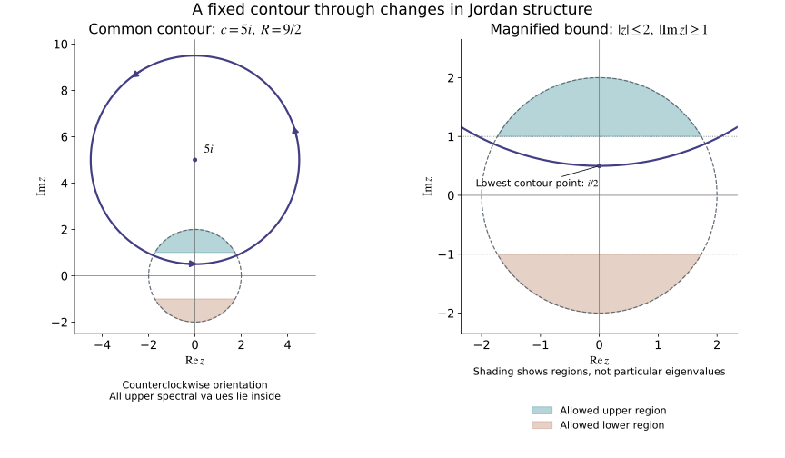

# Spectral algebra and contour projections

This companion supplies the finite-dimensional complex algebra used in
[Quadratic Hamilton maps and positive complex planes](quadratic-hamilton-maps-and-positive-complex-planes.md).
All spaces here are finite dimensional. No diagonalizability assumption is
made for a general complex matrix.

Original programme proofs and illustration: GPT-6 Astra (OpenAI), Ultra,
5 October 2026; CC0. Earlier components retain their own notices.

## A0. Exact earlier inputs

U001 Q5
proves real orthogonal diagonalization, including singular forms.
[M0a](../20261004-free-intrinsic-graph/prerequisites/relative-maslov-line.md)
proves the invariance and additivity of inertia.
[C0](../20261004-free-intrinsic-graph/prerequisites/conic-frequency-coordinates.md)
supplies basis extension, rank and annihilator dimensions.
The [U001 finite-calculus proofs](../20261004-free-stationary-phase/prerequisite-completions.md)
supply matrix inversion and the inverse theorem. Its
[finite algebra and compactness proofs](../20261004-free-stationary-phase/elementary-proof-completions.md)
and [complex exponential and circle proofs](../20261004-free-stationary-phase/exponential-prerequisite-completions.md)
give determinant identities, compact extrema, convergent geometric sums,
complex arithmetic, all circle angles and differentiation of exponentials.
Exact entries are recorded in the [proof map](proof-map.json).

Gaussian elimination works over the complex field just as over the real
field: choose a nonzero pivot, divide its row by that pivot and subtract
multiples from the other rows. The remaining rectangle has one fewer row
and column. Induction constructs a basis of the kernel by assigning its
free coordinates, and pivot columns give a basis of the image. In
particular a square matrix has nonzero determinant exactly when it is
invertible, by the determinant row operations and the cofactor inverse.
The complex versions of rank-nullity and basis extension used below follow
from these constructions.

## A1. Complex polynomial roots and factorization

Every nonconstant complex polynomial has a root and factors completely
into linear factors with their multiplicities.

**Proof.** If its degree is \(d\), its leading term and the triangle
inequality give \(|p(z)|\to\infty\) as \(|z|\to\infty\): for \(|z|\ge1\),
the sum of all lower terms is at most \(C|z|^{d-1}\), whereas the leading
term has size \(|a_d||z|^d\). Thus \(|p|\) attains a global minimum at
some \(z_0\), by compactness of a sufficiently large closed disk.

Suppose \(p(z_0)\ne0\). Expand the finite polynomial at that point:
\[
 \frac{p(z_0+w)}{p(z_0)}
 =1+a w^k+\sum_{j=k+1}^d b_jw^j,\qquad a\ne0,\quad k\ge1.
 \tag{A1}
\]
Such a first nonzero coefficient exists, since translation and division by
a nonzero constant do not make a nonconstant polynomial constant.
The circle-angle theorem P16.3 supplies a real \(\theta\) for which
\(a e^{ik\theta}=-|a|\). Explicitly, write \(a/|a|=e^{i\phi}\) and
take \(\theta=(\pi-\phi)/k\). For \(w=re^{i\theta}\), \(0<r\le1\), the
tail has size at most \(Cr^{k+1}\), with \(C=\sum_{j>k}|b_j|\).
Choose \(r\) so small that \(|a|r^k<1\) and \(Cr<|a|\). Then
\[
 \left|\frac{p(z_0+w)}{p(z_0)}\right|
 \le 1-|a|r^k+Cr^{k+1}<1,
 \tag{A2}
\]
contradicting the minimum. Hence \(p(z_0)=0\).

Polynomial division by \(z-z_0\) gives a polynomial of degree \(d-1\)
and a constant remainder equal to \(p(z_0)\). This division is obtained
by subtracting the leading multiple repeatedly, so each step reduces
the degree. The remainder is zero. Induction proves complete
factorization. The same division proves that a nonzero degree-\(d\)
polynomial has at most \(d\) distinct roots. \(\square\)

## A2. The characteristic identity

For a complex \(d\)-by-\(d\) matrix \(T\), its characteristic polynomial
\(p(z)=\det(zI-T)\) satisfies \(p(T)=0\).

**Proof.** The dimension-zero case is immediate. For \(d\ge1\), cofactor
expansion gives the polynomial matrix identity
\[
 (zI-T)\operatorname{adj}(zI-T)=p(z)I.
 \tag{A3}
\]
Write the adjugate as \(\sum_{j=0}^{d-1}A_jz^j\) and
\(p(z)=z^d+\sum_{j=0}^{d-1}c_jz^j\). Comparing coefficients gives
\[
 A_{d-1}=I,\qquad A_{j-1}-TA_j=c_jI\ (1\le j\le d-1),
 \qquad -TA_0=c_0I.
 \tag{A4}
\]
Successive substitution expresses \(A_0\) as
\(T^{d-1}+c_{d-1}T^{d-2}+\cdots+c_1I\). The last equation is \(p(T)=0\).
This coefficient argument avoids substituting a matrix into a polynomial
identity whose other coefficients might not commute with it. \(\square\)

## A3. The full generalized spectral splitting

Let the distinct roots of \(p\) be \(\lambda_1,\ldots,\lambda_s\), with
multiplicities \(m_i\). Then
\[
 E=\bigoplus_{i=1}^s V_i,\qquad
 V_i=\ker(T-\lambda_i I)^{m_i}
     =\ker(T-\lambda_i I)^d.
 \tag{A5}
\]
Each summand is \(T\)-invariant, and \(T=\lambda_i I+N_i\) on it,
with \(N_i^{m_i}=0\).

**Proof.** Put \(f_i(z)=(z-\lambda_i)^{m_i}\) and \(q_i=p/f_i\).
There are polynomials \(u_i,v_i\) with \(u_iq_i+v_if_i=1\).
Indeed polynomial long division gives the Euclidean algorithm;
successive nonzero remainders have decreasing degree. Its last
nonzero remainder divides both polynomials. By A1, a nonconstant
common divisor would have a common root, which these two factors do
not have. The remainder is a nonzero constant; reverse the divisions
and divide by that constant to obtain the asserted identity.

Set \(P_i=u_i(T)q_i(T)\). A2 gives \(f_i(T)P_i=0\), so its image
lies in \(V_i\). On \(V_i\), the polynomial identity gives \(P_i=I\);
on \(V_j\), \(j\ne i\), it gives \(P_i=0\) because \(q_i\) contains
the factor \(f_j\). Also \(\sum_i u_iq_i-1\) is divisible by every
\(f_i\): reduce modulo \(f_i\) and use the same identity.
Pairwise coprimality implies divisibility by their product. For two
factors, if \(a\mid r\), \(b\mid r\), and \(ua+vb=1\), writing \(r=ak\)
gives \(k=uak+vbk\), whose two terms are divisible by \(b\); hence
\(ab\mid r\). Induct over the factors.
Consequently \(\sum_iP_i=I\) by A2. The previously checked restrictions
prove that this is a direct sum and that the \(P_i\) are its projections.

If \(\mu\ne\lambda_i\), then on \(V_i\)
\[
 (T-\mu I)^{-1}
 =\sum_{j=0}^{m_i-1}
       \frac{(-N_i)^j}{(\lambda_i-\mu)^{j+1}}.
 \tag{A6}
\]
Multiplication telescopes, proving the formula. Thus the \(d\)th
kernel in (A5) has no component in any other summand, and it equals
\(V_i\). Invariance follows because all the operators used are
polynomials in \(T\). If \(T\) is real, conjugation in (A5) sends
\(V_\lambda\) to \(V_{\bar\lambda}\). \(\square\)

## A4. Nilpotent chains and their invariants

Every nilpotent endomorphism has a basis consisting of finite chains
\(v,Nv,\ldots,N^{m-1}v\). The number of chains is \(\dim\ker N\);
their lengths are determined by the dimensions of the kernels of
all powers. Applying this on the summands in A3 proves the full
Jordan decomposition, over \(\mathbb C\). For a real nilpotent map,
the entire construction is real.

**Proof.** If the space is nonzero, let \(m\) be the smallest integer
with \(N^m=0\), and choose \(v\) with \(N^{m-1}v\ne0\).
Its \(m\) chain vectors are independent: in a nontrivial linear
relation choose the smallest power \(j\) with nonzero coefficient,
then apply \(N^{m-1-j}\). Only that coefficient times \(N^{m-1}v\)
survives, a contradiction.

Extend these vectors to a basis and choose a linear functional
\(\ell\) equal to one on \(N^{m-1}v\) and zero on all the earlier
chain vectors. Define
\[
 P x=\sum_{j=0}^{m-1}\ell(N^{m-1-j}x)\,N^jv.
 \tag{A7}
\]
On \(N^kv\) the only nonzero coefficient is the one with \(j=k\);
powers at least \(m\) vanish. Thus \(P\) is the identity on the chain
span \(C\), has image \(C\), and \(P^2=P\).
In \(PNx\) its \(j=0\) coefficient vanishes because \(N^m=0\).
For \(j\ge1\), its coefficient at \(N^jv\) is
\(\ell(N^{m-j}x)\), exactly as in \(NPx\). Hence \(PN=NP\).
It follows that \(E=C\oplus\ker P\) is an invariant splitting.
The latter space has smaller dimension and its restriction is
nilpotent. Induction completes the chain basis, including \(m=1\).

A length-\(m\) chain contributes \(\min(j,m)\) to \(\dim\ker N^j\).
Therefore
\[
 \dim\ker N^j-\dim\ker N^{j-1}
       =\#\{\text{chains of length at least }j\}.
 \tag{A8}
\]
These differences determine the number of each exact length. At
\(j=1\) they count all chains. In particular, a nonzero nilpotent
space with a one-dimensional kernel consists of one chain.
The matrix of \(T=\lambda_i I+N_i\) in its chain basis has diagonal
entries \(\lambda_i\); hence the characteristic polynomial on that
summand is \((z-\lambda_i)^{\dim V_i}\).
Comparison of the factors in A3 gives \(\dim V_i=m_i\).
Thus all multiplicities and Jordan lengths used in the lesson
are actual conjugacy invariants. \(\square\)

## A5. Circle moments and the exact resolvent projection

Let \(\gamma(\theta)=c+Re^{i\theta}\), \(0\le\theta\le2\pi\),
with \(R>0\), traversed counterclockwise. For \(\lambda\) off the
circle,
\[
 \frac1{2\pi i}\oint_\gamma\frac{dz}{z-\lambda}
 =\begin{cases}1,&|\lambda-c|<R,\\0,&|\lambda-c|>R,\end{cases}
 \qquad
 \oint_\gamma\frac{dz}{(z-\lambda)^{j+1}}=0\quad(j\ge1).
 \tag{A9}
\]

**Proof.** In the inside case put \(a=(\lambda-c)/R\).
Substituting \(dz=iRe^{i\theta}d\theta\) gives
\(i/(1-ae^{-i\theta})\). Its geometric series converges uniformly
because \(|a|<1\). The constant term integrates to \(2\pi i\);
every other term integrates to zero, by
\(\int_0^{2\pi}e^{ik\theta}d\theta=0\) for a nonzero integer \(k\),
which follows from differentiation and the period \(2\pi\).
Uniform tails justify integration term by term.
In the outside case expand
\[
 \frac1{c-\lambda+Re^{i\theta}}
 =\frac1{c-\lambda}
   \sum_{k\ge0}\left(-\frac R{c-\lambda}\right)^ke^{ik\theta}.
 \tag{A10}
\]
After multiplying by \(iRe^{i\theta}\), every frequency is a
positive integer, so the integral is zero. Again the series is
uniform. For \(j\ge1\), the integrand has the single-valued
primitive \(-(z-\lambda)^{-j}/j\) along the circle. The real
chain rule and the fundamental theorem give zero because its
endpoint values agree. This proves (A9) without a residue theorem.

For a matrix \(T\), restrict to a generalized summand of A3.
There the finite identity
\[
 (zI-T)^{-1}
   =\sum_{j=0}^{m_i-1}\frac{N_i^j}{(z-\lambda_i)^{j+1}}
 \tag{A11}
\]
follows by multiplication, using nilpotence. Applying (A9)
shows that the integral \((2\pi i)^{-1}\oint_\gamma(zI-T)^{-1}dz\)
is the identity on every inside summand and zero on every
outside summand. It is exactly the projection onto the full
inside generalized spectral sum and commutes with \(T\).
In particular this is valid for nontrivial Jordan blocks.
\(\square\)

## A6. A common contour for a continuous matrix family

Suppose \(T_t\) is a continuous complex matrix family on
\(0\le t\le1\), and every \(T_t\) has no real eigenvalue.
There are \(M>0,\delta>0\) for which every spectral value satisfies
\[
 |\lambda|\le M,\qquad |\operatorname{Im}\lambda|\ge\delta.
 \tag{A12}
\]
One fixed upper-half-plane circle encloses all upper spectra and
no lower spectra. The associated projections are continuous,
with locally constant rank and locally continuous bases of
their ranges.

**Proof.** The Euclidean norm estimate
\(\|T\|\le d\max_{jk}|T_{jk}|\) follows from scalar
Cauchy–Schwarz. A continuous finite collection of entries is
bounded on the parameter interval; choose \(M>0\) bounding
these operator norms. Every eigenvalue has an eigenvector by
A0, so \(|\lambda|\le\|T_t\|\le M\).

If there were no positive \(\delta\), take parameters \(t_j\)
and eigenvalues \(\lambda_j\) with imaginary parts tending
to zero. Compactness gives a subsequence with
\((t_j,\lambda_j)\to(t,\lambda)\), where \(\lambda\) is real.
The determinant is a polynomial in its entries, so
\(\det(\lambda I-T_t)=\lim_j\det(\lambda_jI-T_{t_j})=0\).
This is a forbidden real eigenvalue. Reduce \(\delta\), if
necessary, so \(0<\delta\le M\).

Put
\[
 L=M^2/\delta+\delta,\qquad R=L-\delta/2,\qquad
 \gamma(\theta)=iL+Re^{i\theta}.
 \tag{A13}
\]
The circle and its interior lie above the line
\(\operatorname{Im}z=\delta/2\). For an upper spectral value,
\[
 |\lambda-iL|^2
 \le M^2+L^2-2L\delta
 <L^2-L\delta+\delta^2/4=R^2.
 \tag{A14}
\]
The strict inequality holds since \(L\delta=M^2+\delta^2\).
Thus all upper values are inside, while all lower values are
outside. There are no spectral values on the circle.

The cofactor formula for the inverse gives a continuous
resolvent on the compact set of \(t\) and \(\theta\); its
determinant denominator is bounded away from zero.
Uniform continuity and the finite contour length therefore
make its integral continuous in \(t\), in matrix norm.
A5 proves each integral is the required projection.

For two projections \(P,Q\) with \(\|P-Q\|<1\), the restriction
of \(Q\) to \(\operatorname{ran}P\) is injective: if \(Px=x\)
and \(Qx=0\), then \(\|x\|\le\|P-Q\|\|x\|\), so \(x=0\).
Exchanging the projections gives equal ranks. For a basis
\(v_j\) of \(\operatorname{ran}P\), the vectors \(Qv_j\)
therefore form a basis of \(\operatorname{ran}Q\). They vary
continuously with \(Q\). This gives the asserted local
constant ranks and continuous bases. \(\square\)

**Figure A1.** The exact illustrative constants are \(M=2,\delta=1\),
so (A13) gives center \(5i\) and radius \(9/2\). The right panel
magnifies the two regions \(|z|\le2\), \(|\operatorname{Im}z|\ge1\)
where (A12) allows spectral values. The solid contour encloses the
entire upper region; its lowest point has imaginary part \(1/2\).
The arrows give the counterclockwise orientation in (A9).
No individual eigenvalues or diagonalizability are presumed.
Equation (A14), rather than the drawing, proves the inclusion.

## A7. Semidefinite Hermitian forms and openness

Use the convention that a Hermitian form \(h\) is linear in its
first argument. If \(h\ge0\), then
\[
 |h(x,y)|^2\le h(x,x)h(y,y).
 \tag{A15}
\]
In particular a null vector pairs to zero with every vector.

**Proof.** If \(h(y,y)=c>0\), set \(b=h(x,y)\) and expand
\(0\le h(x-(b/c)y,x-(b/c)y)=h(x,x)-|b|^2/c\).
If \(h(y,y)=0\), nonnegativity of \(h(y+tx,y+tx)\) for all
complex \(t\) forces \(h(x,y)=0\): otherwise choose the phase
of a sufficiently small \(t\) to make its real linear term
negative, dominating the quadratic term. This proves (A15).

A positive definite Hermitian matrix \(G_0\) has a positive
minimum \(a\) on the complex Euclidean unit sphere, regarded
as a compact real sphere. If \(\|G-G_0\|<a\), then
\(\bar v^TGv\ge(a-\|G-G_0\|)|v|^2>0\) for \(v\ne0\).
Thus strict positivity is open. For a continuous family of
projections of fixed rank, apply this to the Gram matrices
of the continuous bases in A6.

For later use, a nonempty subset of \([0,1]\) that is both
relatively open and closed is the whole interval. If not,
choose one point in it and one outside. After reversing the
interval if needed, the first is left of the second. The
supremum of its points between them belongs to it by
closedness and is less than the second point. Openness then
gives a still larger point in it, a contradiction.
\(\square\)

## A8. Positive square roots and orthonormal bases

For a positive definite real symmetric matrix \(A\), Q5 gives
an orthogonal \(U\) and positive \(a_j\) with
\(A=U\operatorname{diag}(a_j)U^T\). Therefore
\[
 D=U\operatorname{diag}(\sqrt{a_j})U^T
 \tag{A16}
\]
is real symmetric positive definite, invertible, and satisfies
\(D^2=A\). The scalar positive roots and their signs are among
the U001 inputs. This proves the square-root construction used
in the graph normalization.

It is the unique positive symmetric square root. If \(E\) is
another one, \(EA=EE^2=E^2E=AE\), so \(E\) preserves each
eigenspace of \(A\). Its symmetric restriction there has an
orthonormal eigenbasis by Q5. On the eigenspace with eigenvalue
\(a>0\), every eigenvalue of that restriction is positive and
has square \(a\), so it equals \(\sqrt a\). Hence \(E=D\).

For any positive real bilinear inner product \(g\), a real
basis \(v_1,\ldots,v_k\) can be made \(g\)-orthonormal.
After \(e_1,\ldots,e_{j-1}\) have been chosen, set
\[
 w_j=v_j-\sum_{l<j}g(v_j,e_l)e_l,\qquad
 e_j=w_j/\sqrt{g(w_j,w_j)}.
 \tag{A17}
\]
The earlier orthonormality makes every \(g(w_j,e_l)\) zero.
Independence of the original basis implies \(w_j\ne0\),
so its denominator is positive. This induction proves all
claims, also on a given subspace with the restricted product.

## A9. Linear matrix flows

For every finite matrix \(T\), define
\[
 e^{tT}=\sum_{j=0}^\infty\frac{t^jT^j}{j!}.
 \tag{A18}
\]
The inequality \(\|AB\|\le\|A\|\|B\|\) follows immediately
from the operator norm definition. Thus on \(|t|\le a\)
the series and each derivative series are dominated by
the convergent scalar exponential series with argument
\(a\|T\|\), multiplied by a fixed power of \(\|T\|\).
The uniform derivative-limit argument of U001 P15.1 gives
\((e^{tT})'=Te^{tT}\) and initial value \(I\).

Multiplication of two absolutely convergent series, and the
finite binomial formula, give \(e^{sT}e^{tT}=e^{(s+t)T}\).
Alternatively both sides as functions of \(s\) solve the
same finite linear initial-value problem. Hence \(e^{tT}\)
is invertible, with inverse \(e^{-tT}\), and gives the entire
linear flow. If \(T^m=0\), (A18) terminates at \(m-1\).
For an oscillator \(T^2=-I\), its even and odd terms are
\(\cos t\,I+\sin t\,T\), with the trigonometric functions
proved in P15–P16. The hyperbolic diagonal flow is obtained
by applying the scalar exponential on each diagonal entry.

If \(T^TJ+JT=0\), differentiate
\((e^{tT})^TJ e^{tT}\). Its derivative is zero and its
initial value is \(J\); thus the full flow is symplectic.
These arguments justify the flow notation and time
normalization in every example and exercise of the lesson.

## Scope and credit

The companion provides the elementary algebra and contour
proofs needed for the exact admitted Hörmander III Section 21.5
treatment used by the main lesson. It is independently written;
no book text or figure is reproduced. It supplies full arguments
in addition to the main lesson's mathematical source citation.
The [figure source](figures/draw_common_upper_contour.py) and
[font notice](figures/notices/LICENSE_DEJAVU.txt) are retained.
The [proof map](proof-map.json) connects every earlier input.
